# UAP REVERSE ENGINEERING STUDY
# ИССЛЕДОВАНИЕ ПО РЕВЕРС-ИНЖИНИРИНГУ НАЯ

**Reverse Engineering Hub — Multi-track research program**
**Хаб реверс-инжиниринга — многотрековая исследовательская программа**

---

<div align="center">

| Repository / Репозиторий | Status / Статус |
|-------------------------|----------------|
| `UAP_Reverse_Engineering_Study` | ACTIVE / АКТИВЕН |

**Organization / Организация:** Advanced Scientific Research Projects (ASRP)

[](https://github.com/AdvancedScientificResearchProjects)
[]()
[]()

</div>

---

## TABLE OF CONTENTS / СОДЕРЖАНИЕ

1. [Overview / Обзор](#overview--обзор)
2. [Research Tracks / Исследовательские треки](#research-tracks--исследовательские-треки)
3. [Track 1 — Artifact Investigation (UAP-FRAG-001) / Трек 1 — Исследование артефакта](#track-1--artifact-investigation-uap-frag-001--трек-1--исследование-артефакта-uap-frag-001)
4. [Track 2 — Bob Lazar Archive / Трек 2 — Архив Боба Лазара](#track-2--bob-lazar-archive--трек-2--архив-боба-лазара)
5. [Track 3 — Vadim Chernobrov Archive / Трек 3 — Архив Вадима Черноброва](#track-3--vadim-chernobrov-archive--трек-3--архив-вадима-черноброва)
6. [Track 4 — Dubna / Element 115 / Трек 4 — Дубна / Элемент 115](#track-4--dubna--element-115--трек-4--дубна--элемент-115)
7. [Track 5 — OSINT + Intelligence Analysis / Трек 5 — OSINT и разведывательный анализ](#track-5--osint--intelligence-analysis--трек-5--osint-и-разведывательный-анализ)
8. [Track 6 — People Analysis / Трек 6 — Анализ людей](#track-6--people-analysis--трек-6--анализ-людей)
9. [Track 7 — Corporate / Economic Analysis / Трек 7 — Корпоративный / экономический анализ](#track-7--corporate--economic-analysis--трек-7--корпоративный--экономический-анализ)
10. [Track 8 — Cross-archive Synthesis / Трек 8 — Кросс-архивный синтез](#track-8--cross-archive-synthesis--трек-8--кросс-архивный-синтез)
11. [Track 9 — UAP Scientific Publications Corpus / Трек 9 — Корпус научных публикаций по UAP](#track-9--uap-scientific-publications-corpus--трек-9--корпус-научных-публикаций-по-uap)
12. [Team / Команда](#research-team--исследовательская-команда)
13. [Structure / Структура](#structure--структура)
13. [Security / Безопасность](#security--безопасность)
14. [Research Pipelines / Исследовательские конвейеры](#research-pipelines--исследовательские-конвейеры)
15. [OSF Preregistration / Предварительная регистрация OSF](#osf-preregistration--предварительная-регистрация-osf)
16. [ASRP Ecosystem / Экосистема ASRP](#asrp-ecosystem--экосистема-asrp)
17. [Contact / Контакты](#contact-information--контактная-информация)
18. [Disclaimer / Отказ от ответственности](#disclaimer--отказ-от-ответственности)
19. [Navigation Index / Навигационный индекс](#navigation-index--навигационный-индекс)

---

## OVERVIEW / ОБЗОР

### ENGLISH

This repository is a **Reverse Engineering Hub** — a multi-track research program coordinating several parallel investigations into UAP-class phenomena. The hub organizes primary observational archives, methodology layers, and cross-archive synthesis into a single navigable structure.

The artifact investigation around fragment **UAP-FRAG-001** (3-pipeline study: AI / archival / Extended Cognitive Perception) is **one** of these tracks — Track 1. It runs in parallel with historical archives (Bob Lazar, Vadim Chernobrov, Dubna / Element 115), a methodology layer (OSINT + Intelligence Analysis), a people-analysis cluster (the 11 scientists case consolidated by the FBI on 2026-04-19), a planned corporate / economic analysis layer, and the root-level cross-archive synthesis.

The README below is a **navigation hub**: the tracks index is the central entry point, and each track has its own README with the full primary material.

### РУССКИЙ

Этот репозиторий — **Хаб реверс-инжиниринга**: многотрековая исследовательская программа, координирующая несколько параллельных направлений изучения явлений класса НАЯ. Хаб организует первичные наблюдательные архивы, методологические слои и кросс-архивный синтез в единую навигируемую структуру.

Исследование артефакта **UAP-FRAG-001** (трёхконвейерное: ИИ / архивный / Расширенное Когнитивное Восприятие) — **один** из этих треков, Трек 1. Он идёт параллельно с историческими архивами (Боб Лазар, Вадим Чернобров, Дубна / Элемент 115), методологическим слоем (OSINT и разведывательный анализ), кластером людей (дело 11 учёных, консолидированное ФБР 19.04.2026), запланированным слоем корпоративного / экономического анализа и корневым кросс-архивным синтезом.

README ниже — это **навигационный хаб**: индекс треков — центральная точка входа, у каждого трека свой README с полным первичным материалом.

---

## RESEARCH TRACKS / ИССЛЕДОВАТЕЛЬСКИЕ ТРЕКИ

| Track / Трек | Subject / Предмет | Status / Статус | Lead file / Главный файл |
|---|---|---|---|
| **1. Artifact investigation / Исследование артефакта** | UAP-FRAG-001 ECP+AI multi-pipeline / мульти-конвейер КП+ИИ для UAP-FRAG-001 | ACTIVE / АКТИВНО | (see Track 1 sections below / см. разделы Трека 1 ниже) |
| **2. Bob Lazar archive / Архив Боба Лазара** | Lazar interview corpus 1989–2026 (S-4, element 115, gravity propulsion) / Корпус интервью Лазара 1989–2026 (S-4, элемент 115, гравитационная силовая установка) | Available / Доступно | [`bob-lazar-archive/README.md`](bob-lazar-archive/README.md) |
| **3. Vadim Chernobrov archive / Архив Вадима Черноброва** | Kosmopoisk Russian field research 1988–2017 (time-machine, anomalous zones) / Космопоиск, российские полевые исследования 1988–2017 (машина времени, аномальные зоны) | Available / Доступно | [`chernobrov-archive/README.md`](chernobrov-archive/README.md) |
| **4. Dubna / Element 115 / Дубна / Элемент 115** | ASRP.media JINR+LLNL interview, moscovium synthesis 2003 / Интервью ASRP.media с ОИЯИ+LLNL, синтез московия 2003 | Available / Доступно | [`dubna-element-115-analysis/README.md`](dubna-element-115-analysis/README.md) |
| **5. OSINT + Intelligence Analysis / OSINT и разведывательный анализ** | Methodology layer — signature analysis, anomaly classification, validation pipeline / Методологический слой — анализ сигнатур, классификация аномалий, конвейер валидации | Available / Доступно | [`osint-intelligence-analysis/README.md`](osint-intelligence-analysis/README.md) |
| **6. People analysis / Анализ людей** | 11 scientist deaths/disappearances cluster (FBI 2026-04-19 announcement) / Кластер из 11 смертей/исчезновений учёных (объявление ФБР 19.04.2026) | Available / Доступно | [`people-analysis/README.md`](people-analysis/README.md) |
| **7. Corporate / economic analysis / Корпоративный / экономический анализ** | EG&G → Amentum corporate genealogy + 4 engineering primes + 2 HSP-scanned Amentum executives + Honeywell + EG&G historical sub-units + 11-inventor patents inventory + theoretical-foundations sub-archive (Morgan / Frolov / scalar-vortex literature) / Корпоративная генеалогия EG&G → Amentum + 4 инженерных prime + 2 HSP-сканированных руководителя Amentum + Honeywell + исторические подразделения EG&G + инвентарь патентов 11 изобретателей + подархив теоретических основ (Morgan / Фролов / скаляр-вихрь) | Available / Доступно | [`corporate-economic-analysis/README.md`](corporate-economic-analysis/README.md) |
| **8. Cross-archive synthesis / Кросс-архивный синтез** | Themes spanning multiple tracks / Темы, охватывающие несколько треков | Available / Доступно | [`analysis/cross-archive-synthesis.md`](analysis/cross-archive-synthesis.md) |
| **9. UAP scientific publications corpus / Корпус научных публикаций по UAP** | Public-source literature catalog: peer-reviewed UAP physics + social-science + government reports + observation-program technical outputs / Публично-источниковый каталог литературы: рецензируемая физика UAP + социальные науки + правительственные отчёты + технические выходы программ наблюдений | Available / Доступно | [`uap-scientific-publications/README.md`](uap-scientific-publications/README.md) |

**EN:** The tracks index above is the central navigation. Each track is independent — open the lead file to enter that track's primary material. All nine tracks are now active.

**RU:** Индекс треков выше — центральная навигация. Каждый трек самостоятелен — откройте главный файл, чтобы войти в первичный материал трека. Все девять треков теперь активны.

---

## TRACK 1 / ТРЕК 1 — Artifact Investigation (UAP-FRAG-001) / Исследование артефакта (UAP-FRAG-001)

### EN

Multi-layered scientific study of UAP fragment **UAP-FRAG-001** through 3 analytical pipelines: AI-based visual & material analysis, archival & comparative analysis, and Extended Cognitive Perception (ECP) protocols.

### RU

Многослойное научное исследование фрагмента НАЯ **UAP-FRAG-001** через 3 аналитических конвейера: ИИ-анализ визуальных и материальных характеристик, архивный и сравнительный анализ, протоколы Расширенного Когнитивного Восприятия (КП).

### Track 1 sub-sections / Подразделы Трека 1

| Sub-section / Подраздел | Purpose / Назначение |
|---|---|
| [Research At a Glance / В цифрах](#research-at-a-glance--исследование-в-цифрах) | Numeric summary of UAP-FRAG-001 study / Числовая сводка по UAP-FRAG-001 |
| [Research Overview / Обзор](#research-overview--обзор-исследования) | End-to-end pipeline map / Сквозная схема конвейеров |
| [Key Metrics / Ключевые метрики](#key-metrics--ключевые-метрики) | Cross-percipient and reference metrics / Межперципиентные и референс-метрики |
| [Working Hypotheses / Рабочие гипотезы](#working-hypotheses--рабочие-гипотезы) | Supported / partial / open hypotheses / Поддержанные / частичные / открытые |
| [Visual Evidence / Визуализация](#visual-evidence--визуализация-данных) | Diagrams and matrices / Диаграммы и матрицы |
| [AI / CV Analysis Results / Результаты ИИ / CV анализа](#ai--cv-analysis-results--результаты-ии--cv-анализа) | AI pipeline summary and key findings / Сводка ИИ-конвейера и ключевые находки |
| [Timeline / Временная шкала](#timeline--временная-шкала) | Session and analysis chronology / Хронология сеанса и анализа |
| [Cross Comparison / Сравнение ответов](analysis/cross_comparison.md) | Detailed descriptive overlap analysis / Детальный анализ пересечения ответов |
| [Validation Report / Отчёт валидации](analysis/ecp_validation_report.md) | Parameter-level check against disclosed reference / Проверка по параметрам против раскрытого референса |
| [Percipient Reports / Отчёты перципиентов](reports/percipient_reports/) | Primary session records / Первичные записи сеанса |
| [AI Analysis Reports / Отчёты ИИ-анализа](reports/ai_reports/) | AI visual and material analysis results / Результаты ИИ-анализа |
| [AI Report: CV Pipeline / Отчёт ИИ: CV конвейер](reports/ai_reports/AI-2026-04-07-001.md) | Segmentation, SigLIP2, anomaly detection, depth / Сегментация, SigLIP2, аномалии, глубина |
| [AI Report: LLM Visual / Отчёт ИИ: LLM визуальный](reports/ai_reports/AI-2026-04-07-001-llm-visual.md) | LLM-based visual identification / LLM-визуальная идентификация |
| [AI Report: Control Test / Отчёт ИИ: Контрольный тест](reports/ai_reports/AI-2026-04-09-control-test.md) | SigLIP2 control validation with 14 reference images / Валидация SigLIP2 на 14 контрольных изображениях |
| [ECP Protocol / Протокол КП](experiments/protocol_ecp.md) | Percipient session protocol v2.0 / Протокол сеансов перципиентов v2.0 |
| [AI Protocol / Протокол ИИ](experiments/protocol_ai.md) | AI analysis pipeline protocol v3.1 / Протокол конвейера ИИ-анализа v3.1 |

### Research At a Glance / Исследование в цифрах

| Parameter / Параметр | Value / Значение | Status / Статус |
|----------------------|------------------|-----------------|
| **Artifact ID / ID артефакта** | `UAP-FRAG-001` | Active case / Активный кейс |
| **Primary ECP session / Основная КП-сессия** | `ECP-2026-04-04` | Completed / Завершено |
| **Recorded percipient reports / Зафиксированные отчёты перципиентов** | 3 | Available / Доступны |
| **Verifiable reference parameters / Проверяемые параметры референса** | 10 | Validated / Сопоставлены |
| **Exact matches / Точные совпадения** | 7/10 | Descriptive / Описательно |
| **Partial or indirect matches / Частичные или косвенные совпадения** | 2/10 | Descriptive / Описательно |
| **Complete misses / Полные промахи** | 1/10 | Descriptive / Описательно |
| **Repeated themes across all 3 responses / Повторяющиеся темы во всех 3 ответах** | 4 | Descriptive / Описательно |
| **Known methodological limitation / Известное методологическое ограничение** | Compromised blinding for 2 later percipients / Нарушенное ослепление для 2 более поздних перципиентов | Critical / Критично |
| **Protocol version / Версия протокола** | 2.0 | Synchronized / Синхронизировано |

### Research Overview / Обзор исследования

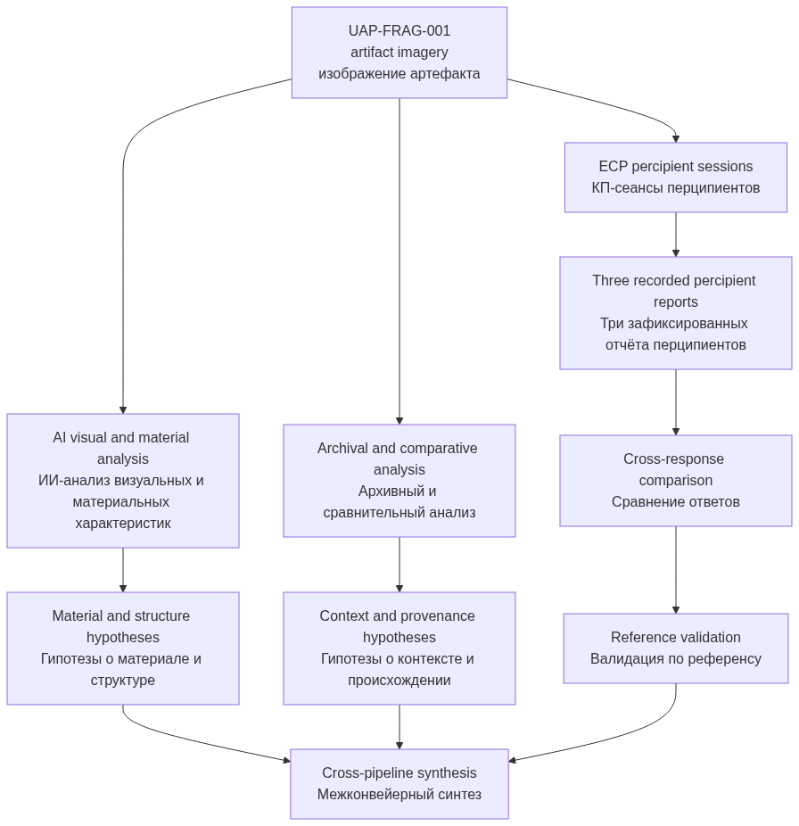

**EN:** The current Track 1 material is strongest where it separates raw percipient records, descriptive overlap analysis, and later validation against disclosed reference data.

**RU:** Сила материала Трека 1 в том, что он разделяет первичные записи перципиентов, описательный анализ пересечений и последующую валидацию по раскрытым референсным данным.

### Key Metrics / Ключевые метрики

| Metric / Метрика | Value / Значение | Interpretation / Интерпретация |
|------------------|------------------|--------------------------------|
| **Percipient count / Число перципиентов** | 3 | Small exploratory session / Малый поисковый сеанс |
| **All-response repeated themes / Темы, повторяющиеся во всех ответах** | 4 | Beacon-like function, larger system, no consciousness, non-terrestrial origin / Маяковая функция, часть большей системы, отсутствие сознания, внеземное происхождение |
| **Exact-or-partial coverage / Покрытие точными и частичными совпадениями** | 9/10 | Broad descriptive overlap with disclosed reference / Широкое описательное пересечение с раскрытым референсом |
| **Direct contradiction count / Число прямых противоречий** | 1 | Flight vs stationary placement / Полёт vs стационарное размещение |
| **Undetected reference property / Необнаруженное свойство референса** | 1 | Variable radioactivity / Переменная радиоактивность |
| **Later percipients with compromised blinding / Более поздние перципиенты с нарушенным ослеплением** | 2/3 | Limits independent interpretation / Ограничивает независимую интерпретацию |

### Working Hypotheses / Рабочие гипотезы

| Hypothesis / Гипотеза | Current Status / Текущий статус | Basis / Основание |
|-----------------------|---------------------------------|-------------------|
| **Artifact functions as a signal or navigation component / Артефакт выполняет сигнальную или навигационную функцию** | Supported / Поддержано | Repeated in all 3 responses; exact or partial match to reference / Повторяется во всех 3 ответах; точное или частичное совпадение с референсом |
| **Artifact is part of a larger system / Артефакт является частью более крупной системы** | Repeated in all responses / Повторяется во всех ответах | Exact match in all 3 responses / Точное совпадение во всех 3 ответах |
| **Artifact is a non-autonomous tool / Артефакт является неавтономным инструментом** | Repeated in all responses / Повторяется во всех ответах | Exact match in all 3 responses / Точное совпадение во всех 3 ответах |
| **Artifact origin is non-terrestrial / Происхождение артефакта внеземное** | Repeated theme / Повторяющаяся тема | Present in all 3 responses, but with divergent details / Присутствует во всех 3 ответах, но с расходящимися деталями |
| **Material is non-standard and mineral-like / Материал нестандартный и минеральноподобный** | Partial support / Частичная поддержка | Broad overlap only; precise "biometal" identification absent / Только широкое пересечение; точная идентификация "биометалла" отсутствует |
| **Artifact relates to temporal navigation / Артефакт связан с темпоральной навигацией** | Weak indirect support / Слабая косвенная поддержка | Present only in Tatyana's wording / Присутствует только в формулировке Татьяны |
| **Artifact has detectable radioactivity via ECP / Артефакт имеет обнаруживаемую через КП радиоактивность** | Not supported / Не поддержано | No percipient detected it / Ни один перципиент не обнаружил |

### Visual Evidence / Визуализация данных

#### Response Agreement Map / Карта согласованности ответов

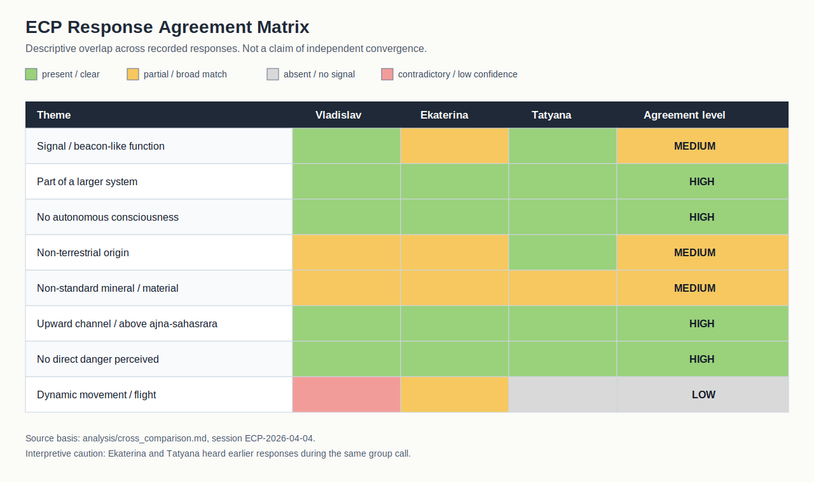

**EN:** This matrix visualizes repeated themes in the recorded responses only. It should not be read as proof of independent convergence.

**RU:** Эта матрица визуализирует только повторяющиеся темы в зафиксированных ответах. Её не следует трактовать как доказательство независимой конвергенции.

#### Reference Validation Map / Карта валидации по референсу

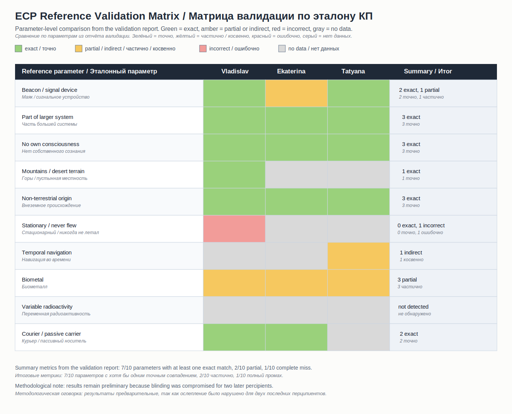

#### Session Blinding Sequence / Схема ослепления сеанса

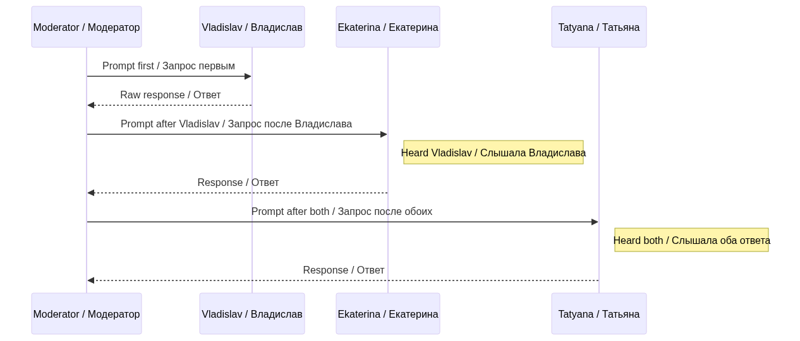

#### Evidence Synthesis Flow / Схема синтеза доказательств

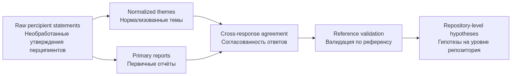

### AI / CV Analysis Results / Результаты ИИ / CV анализа

#### AI Pipeline Summary / Сводка конвейера ИИ

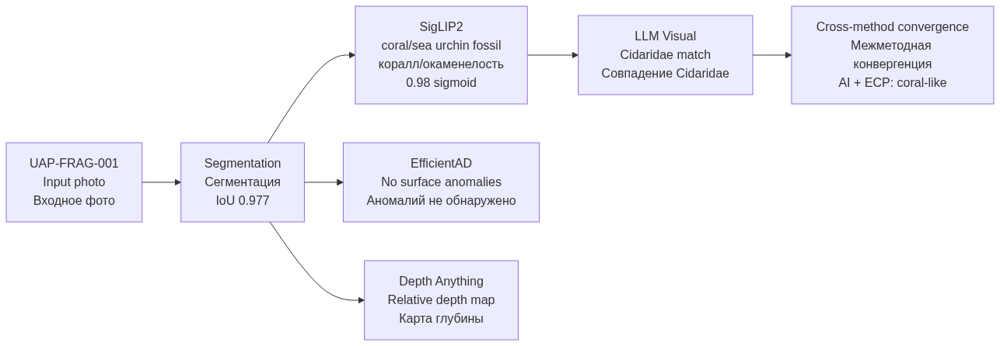

#### Key AI Findings / Ключевые результаты ИИ

| Finding / Находка | Confidence / Уверенность | Method / Метод | Report / Отчёт |
|-------------------|-------------------------|---------------|----------------|
| Biological/coral material family / Биологический/коралловый тип | 0.98 sigmoid | SigLIP2 | [AI-2026-04-07-001](reports/ai_reports/AI-2026-04-07-001.md) |
| Sea urchin fossil (Cidaridae) visual match / Визуальное совпадение Cidaridae | High / Высокая | LLM visual | [AI-2026-04-07-001-llm](reports/ai_reports/AI-2026-04-07-001-llm-visual.md) |
| No surface anomalies detected / Поверхностные аномалии не обнаружены | Expected / Ожидаемо | EfficientAD + CLIP | [AI-2026-04-07-001](reports/ai_reports/AI-2026-04-07-001.md) |
| Converges with ECP data ("coral-like") / Совпадает с КП ("коралловое") | Cross-method / Межметодное | AI + ECP | [Cross-comparison](analysis/cross_comparison.md) |

> **Limitation / Ограничение:** RGB analysis cannot determine chemical composition, alloy type, or radioactivity. See [AI Protocol v3.1](experiments/protocol_ai.md#limitations--ограничения). / RGB-анализ не может определить химсостав, тип сплава или радиоактивность. См. [Протокол ИИ v3.1](experiments/protocol_ai.md#limitations--ограничения).

### Timeline / Временная шкала

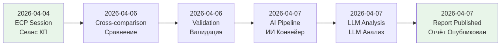

---

## TRACK 2 / ТРЕК 2 — Bob Lazar Archive / Архив Боба Лазара

**EN:** Complete interview corpus of Robert Lazar's public statements on **S-4**, **Element 115**, and **gravity propulsion**, spanning **1989–2026**. The archive contains per-interview transcripts, topical analyses, a catalog organised by research period, and technical diagrams. Lazar's testimony is the most-cited modern reference for the alleged use of element 115 as a gravity-propulsion fuel and is the primary input for one of three themes in the cross-archive synthesis (Track 8).

**RU:** Полный корпус интервью Роберта Лазара по **S-4**, **Элементу 115** и **гравитационной силовой установке** за период **1989–2026**. Архив содержит транскрипты по каждому интервью, тематический анализ, каталог по периодам и технические диаграммы. Свидетельства Лазара — наиболее цитируемая современная отсылка к предполагаемому использованию элемента 115 в качестве топлива гравитационной силовой установки и являются первичным входом для одной из трёх тем кросс-архивного синтеза (Трек 8).

- Unique appearances / Уникальных выступлений: 24
- Transcript files / Файлов транскриптов: 25 main + 1 external cross-reference (Russian dubs and alternate cuts: 02b, 10b, 12b, 46b) / 25 основных + 1 внешний (русские дубляжи и альтернативные нарезки)
- Period covered / Период: 1989–2026
- Cross-references / Кросс-ссылки: Track 4 (Dubna / Element 115), Track 8 (cross-archive synthesis)

**Lead file / Главный файл:** [`bob-lazar-archive/README.md`](bob-lazar-archive/README.md)

---

## TRACK 3 / ТРЕК 3 — Vadim Chernobrov Archive / Архив Вадима Черноброва

**EN:** Research corpus of **Vadim Chernobrov** (Kosmopoisk) on **time-machine experiments**, **gravitational anomalies**, and **anomalous zones** in the territory of the former USSR, **1988–2017**. The archive includes interview transcripts, per-interview and topical analyses, a catalog by research period, and selected books. Chernobrov is the primary Russian-side input for the gravity-and-space-time and Soviet aerospace lineage themes in the cross-archive synthesis (Track 8).

**RU:** Исследовательский корпус **Вадима Черноброва** (Космопоиск) по **экспериментам с машиной времени**, **гравитационным аномалиям** и **аномальным зонам** на территории бывшего СССР, **1988–2017**. Архив включает транскрипты интервью, поштучный и тематический анализ, каталог по периодам и избранные книги. Чернобров — первичный российский вход для тем гравитации и пространства-времени и советской аэрокосмической линии преемственности в кросс-архивном синтезе (Трек 8).

- Transcripts / Транскриптов: ~22
- Period covered / Период: 1988–2017
- Cross-references / Кросс-ссылки: Track 4 (Soviet aerospace lineage), Track 8 (cross-archive synthesis)

**Lead file / Главный файл:** [`chernobrov-archive/README.md`](chernobrov-archive/README.md)

---

## TRACK 4 / ТРЕК 4 — Dubna / Element 115 / Дубна / Элемент 115

**EN:** ASRP.media interview with an anonymised high-ranking representative of the **Joint Institute for Nuclear Research (JINR)**, recorded **28 September 2021** and published **9 December 2025**. The track contains the raw audio transcript, verbatim EN/RU published text, a master claims table, fact-checked JINR history, the **Russia + USA equal-partner collaboration line (JINR Dubna ↔ LLNL, *Phys. Rev. C* 69, 021601(R) 2004)**, Superheavy Elements Factory (2020) data, the BN-800 / MOX analogy, the Kazakhstan-geology hypothesis framing, the Soviet-era UAP-research context (SETKA-AN / SETKA-MO), and **9 visual diagrams** (role split, detective board, synthesis flow, USA timeline, claim vs. reality, Kazakhstan hotspots, connection graph, 1989–2026 timeline, USSR aerospace map).

**RU:** Интервью ASRP.media с неразглашённым высокопоставленным представителем **Объединённого института ядерных исследований (ОИЯИ)**, записанное **28 сентября 2021** и опубликованное **9 декабря 2025**. Трек включает сырой транскрипт аудио, дословный EN/RU опубликованный текст, мастер-таблицу утверждений, проверенную историю ОИЯИ, **связку равноправных партнёров Россия + США (ОИЯИ Дубна ↔ LLNL, *Phys. Rev. C* 69, 021601(R) 2004)**, данные Фабрики сверхтяжёлых элементов (2020), аналогию БН-800 / МОКС, гипотезную рамку геологии Казахстана, контекст советских UAP-исследований (SETKA-AN / SETKA-MO) и **9 визуальных схем** (разделение ролей, детективная доска, поток синтеза, хронология США, заявление vs. реальность, hotspots Казахстана, граф связей, хронология 1989–2026, карта аэрокосмоса СССР).

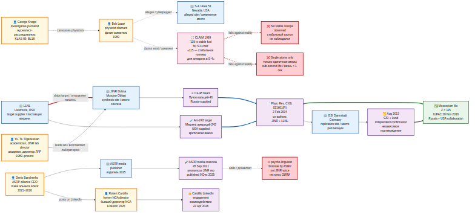

- Diagrams / Диаграмм: 9
- Period covered / Период: 1965–2026 (focus on 2003 synthesis / фокус на синтезе 2003 года)
- Cross-references / Кросс-ссылки: Track 2 (Lazar element 115), Track 8 (cross-archive synthesis)

**Lead file / Главный файл:** [`dubna-element-115-analysis/README.md`](dubna-element-115-analysis/README.md)

---

## TRACK 5 / ТРЕК 5 — OSINT + Intelligence Analysis / OSINT и разведывательный анализ

**EN:** **Methodology layer** of the hub. This track does **not** hold primary observational data — it holds the analytical lens: signal-signature analysis, anomaly classification, and the validation pipeline that separates "ordinary nonlinear physics" from "genuinely novel physical regime", and shows how that lens applies to the data-bearing tracks (Lazar, Chernobrov, Dubna / Element 115, people-analysis) and to the Track 1 ECP artifact study. Includes 4 analysis files (signature methodology, anomaly classification, validation pipeline, UAP application).

**RU:** **Методологический слой** хаба. Этот трек **не содержит** первичных наблюдательных данных — в нём аналитическая оптика: анализ сигнатур сигналов, классификация аномалий и конвейер валидации, отделяющий «обычную нелинейную физику» от «действительно нового физического режима»; показано, как эта оптика применяется к трекам с данными (Лазар, Чернобров, Дубна / Элемент 115, анализ людей) и к ECP-артефакту Трека 1. Включает 4 аналитических файла (методология сигнатур, классификация аномалий, конвейер валидации, применение к UAP).

- Analysis files / Аналитических файлов: 4
- Diagrams / Диаграмм: 4 (signature classification · validation pipeline · 5 anomaly cases · methodology application across tracks)
- Coverage / Покрытие: applied to Tracks 1, 2, 3, 4, 6 / применяется к Трекам 1, 2, 3, 4, 6
- Source / Источник: structured working notes by Denis Banchenko, captured 2026-04-26 / структурированные рабочие заметки Дениса Банченко, зафиксированы 26.04.2026

**Lead file / Главный файл:** [`osint-intelligence-analysis/README.md`](osint-intelligence-analysis/README.md)

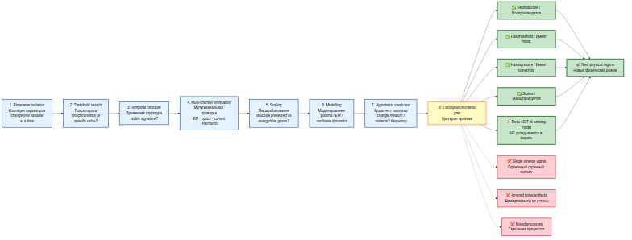

---

## TRACK 6 / ТРЕК 6 — People Analysis / Анализ людей

**EN:** Cluster of **eleven (11) US scientists** at top national laboratories — nuclear, space, plasma, and exotic-sciences fields — who have died or disappeared since 2022, and which the **FBI under Director Kash Patel** announced on **19 April 2026** is now being investigated as a single coordinated case. The archive records the cluster, documented institutional affiliations of each person (AFRL, NASA JPL, Aerojet Rocketdyne, Kansas City National Security Campus, Los Alamos, Caltech, MIT Plasma Science and Fusion Center, Institute for Exotic Sciences, etc.), the FBI investigation scope, and Robert Cardillo's "Gabriella Rev A" analytical framework. The archive does **not** make claims about cause of death or motive — only public-source provenance.

**RU:** Кластер из **одиннадцати (11) американских учёных** из ведущих национальных лабораторий (ядерная, космическая, плазменная и «экзотическая» сферы), погибших или пропавших без вести с 2022 года, который **ФБР под руководством директора Кэша Пателя** объявило **19 апреля 2026 года** объектом единого скоординированного расследования. Архив фиксирует кластер, документированные институциональные аффилиации каждого фигуранта (AFRL, NASA JPL, Aerojet Rocketdyne, Kansas City National Security Campus, Лос-Аламос, Caltech, Центр плазмы и термоядерного синтеза MIT, Institute for Exotic Sciences и др.), периметр расследования ФБР и аналитическую рамку «Gabriella Rev A» Роберта Кардилло. Архив **не** делает утверждений о причинах смертей или мотивах — только публичные источники.

- People profiled / Фигурантов: 11
- Per-person files / Файлов по фигурантам: 11
- Diagrams / Диаграмм: 5 (institutional cluster map · timeline 2022–2026 · affiliation graph · investigation status breakdown · Cardillo Gabriella framework)
- Status breakdown / Статусы: 5 disappeared · 2 killed (suspect named) · 3 died unclear · 1 found dead in lake / 5 исчезли · 2 убиты (подозреваемый известен) · 3 умерли неясно · 1 найден в озере
- FBI consolidation date / Дата консолидации ФБР: 2026-04-19 (Kash Patel on Fox News *Sunday Morning Futures* with Maria Bartiromo / Кэш Патель на Fox News с Марией Бартиромо)
- Frameworks / Рамки: FBI investigation, Cardillo "Gabriella Rev A" / расследование ФБР, «Gabriella Rev A» Кардилло

**Lead file / Главный файл:** [`people-analysis/README.md`](people-analysis/README.md)

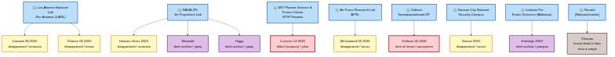

---

## TRACK 7 / ТРЕК 7 — Corporate / Economic Analysis / Корпоративный / экономический анализ

**Status: Available / Статус: Доступно**

**EN:** Public-source corporate-economic analysis of the defense-prime contractor constellation behind the UAP record. Anchor thesis: **EG&G (1947) → URS (2002) → AECOM (2014) → Amentum (2020) → NYSE: AMTM (2024)** is the documented Lazar-S-4-contractor lineage, and Amentum is its present-day successor. Around it stand the four engineering primes (Lockheed Martin, Boeing, RTX, Northrop Grumman) and the services-prime ring (Amentum, Leidos, Jacobs, Parsons, BAH) operating the DoE national laboratories. v3 inventory: 8 companies (incl. Honeywell), 2 HSP-scanned Amentum executives (CEO + CTO, depersonalized) + public scanning roster of 27 entries, 7 mermaid diagrams (3 v1 + 4 v3), 6 analysis files, theoretical-foundations sub-archive (Morgan / Frolov / scalar-vortex literature), 3 Banchenko working briefs.

**RU:** Корпоративно-экономический анализ на публичных источниках созвездия prime-подрядчиков обороны за UAP-нарративом. Якорный тезис: **EG&G (1947) → URS (2002) → AECOM (2014) → Amentum (2020) → NYSE: AMTM (2024)** — задокументированная линия подрядчика Lazar-S-4, и Amentum — её современный преемник. Вокруг — четыре инженерных prime (Lockheed Martin, Boeing, RTX, Northrop Grumman) и сервисное кольцо (Amentum, Leidos, Jacobs, Parsons, BAH), оперирующее национальными лабораториями DOE. Инвентарь v3: 8 компаний (включая Honeywell), 2 HSP-сканированных руководителя Amentum (CEO + CTO, деперсонализировано) + публичный реестр сканирования из 27 записей, 7 диаграмм mermaid (3 v1 + 4 v3), 6 аналитических файлов, подархив теоретических основ (Morgan / Фролов / скаляр-вихрь), 3 рабочих брифа Банченко.

**Lead file / Главный файл:** [`corporate-economic-analysis/README.md`](corporate-economic-analysis/README.md)

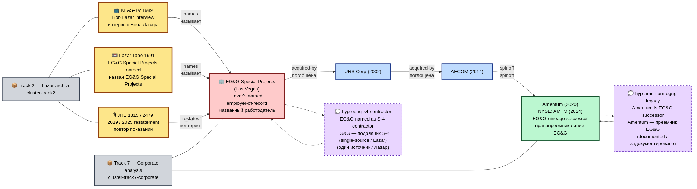

### Fuel-supply-chain hypothesis (v4) / Гипотеза цепочки топливоснабжения (v4)

**EN:** v4 introduces an explicit cross-archive **closed-loop reading** — Lazar (Track 2) → Element 115 fuel claim → JINR-LLNL synthesis (Track 4) → LLNL operator-consortium → Amentum (Track 7) → EG&G (Lazar's stated employer). The reading is a hypothesis-space mapping, not an institutional-pipeline claim. See [`corporate-economic-analysis/analysis/fuel-supply-chain-hypothesis.md`](corporate-economic-analysis/analysis/fuel-supply-chain-hypothesis.md).

**RU:** v4 вводит явное кросс-архивное **замкнутое прочтение** — Лазар (Трек 2) → утверждение про Элемент 115 как топливо → синтез JINR-LLNL (Трек 4) → операторский консорциум LLNL → Amentum (Трек 7) → EG&G (заявленный работодатель Лазара). Прочтение — отображение пространства гипотез, а не утверждение об институциональном конвейере.

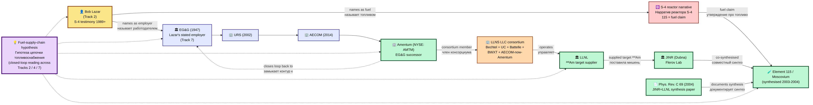

---

## TRACK 8 / ТРЕК 8 — Cross-archive Synthesis / Кросс-архивный синтез

**EN:** Subjects that span more than one track are kept at the **root-repository level**, not inside a specific track. This track is the meta-layer that documents the inter-track overlaps and the working classification framework.

**RU:** Темы, охватывающие более одного трека, размещены на **уровне корневого репозитория**, а не внутри конкретного трека. Этот трек — мета-слой, фиксирующий межтрековые пересечения и рабочую классификационную рамку.

- **[Cross-archive synthesis / Кросс-архивный синтез](analysis/cross-archive-synthesis.md)** — documented and contested overlaps between Lazar / Chernobrov / Dubna on three themes: element 115 / Moscovium, gravity-and-space-time, and Soviet aerospace lineage. Visual: [`charts/mermaid/cross_archive_links.png`](charts/mermaid/cross_archive_links.png). / Задокументированные и оспариваемые пересечения Лазара / Черноброва / Дубны по трём темам: элемент 115 / Московий, гравитация и пространство-время, советская аэрокосмическая линия преемственности.
- **[UAP origin taxonomy / Таксономия происхождения UAP](analysis/uap-taxonomy.md)** — Denis Banchenko's 3-category origin framework (interstellar / parallel-reality / temporal) and how each archive maps onto it; the ECP artifact under study (Track 1) is tentatively placed in the temporal category as a working hypothesis. Visual: [`charts/mermaid/uap_taxonomy.png`](charts/mermaid/uap_taxonomy.png). / Трёхкатегорная классификация происхождения, предложенная Денисом Банченко (межзвёздные / параллельная реальность / темпоральные), и соответствие каждого архива одной или нескольким категориям; ECP-артефакт Трека 1 предварительно помещён в темпоральную категорию как рабочая гипотеза.
- **[External podcasts and documentaries / Внешние подкасты и документалки](analysis/external-podcasts.md)** — JRE #2416 (Dan Farah, RU dub) with 7 cataloged claims; *Age of Disclosure* 2025 (deferred); 1991 Lazar Tape Russian dub (cross-link to Track 2). / JRE #2416 (Дэн Фара, рус. дубляж) с 7 зафиксированными claim-ами; «Эпоха раскрытия» 2025 (отложено); рус. дубляж 1991 Lazar Tape (перекрёстная ссылка в Трек 2).

---

## TRACK 9 / ТРЕК 9 — UAP Scientific Publications Corpus / Корпус научных публикаций по UAP

**Status: Available / Статус: Доступно**

**EN:** Public-source literature catalog consolidating peer-reviewed UAP physics + sensor-analysis papers, peer-reviewed social-science / history-of-ufology works, government reports (DNI/ODNI, AARO, NASA), grey literature (NIDS, AAWSAP/AATIP, SCU collected), and observation-program technical outputs (Galileo Project, Hessdalen, UAPx). v4 inventory: 13 source-provenance entries (Kean, Pasulka, Eghigian, Wendt-Duvall, NASA UAP 2023, ODNI 2021-2024, AARO public reports, Hessdalen papers, Nimitz FLIR analyses, Galileo Project papers, SCU collected papers, plus 2 cross-references back to Track 7 theoretical-foundations). Corpus is **seed-level**, with v5+ expansion planned. Does NOT validate cataloged claims; consolidates them so the broader research can reference a stable provenance register.

**RU:** Публично-источниковый каталог литературы, консолидирующий рецензируемые работы по физике UAP + сенсорному анализу, рецензируемые социально-научные / историко-ufology работы, правительственные отчёты (ODNI/DNI, AARO, NASA), «серую литературу» (NIDS, AAWSAP/AATIP, собрание SCU), технические выходы программ наблюдений (Galileo Project, Hessdalen, UAPx). Инвентарь v4: 13 записей провенанса (Kean, Pasulka, Eghigian, Wendt-Duvall, NASA UAP 2023, ODNI 2021-2024, публичные отчёты AARO, работы Hessdalen, FLIR-анализы Nimitz, опорные работы Galileo Project, собрание работ SCU, плюс 2 кросс-ссылки на Track 7 theoretical-foundations). Корпус — **семенного уровня**, расширение v5+ запланировано. НЕ валидирует каталогизированные утверждения; консолидирует их так, чтобы более широкое исследование могло ссылаться на стабильный регистр провенанса.

**Lead file / Главный файл:** [`uap-scientific-publications/README.md`](uap-scientific-publications/README.md)

---

## RESEARCH TEAM / ИССЛЕДОВАТЕЛЬСКАЯ КОМАНДА

| Name / ФИО | Role / Роль | Responsibilities / Обязанности |
|-----------|------------|-------------------------------|
| **Ovsyannikova Valeria / Овсянникова Валерия** | Director of Biomedical Research Department / Директор департамента биомедицинских исследований | Reverse engineering, partial reproduction of individual device functions, subject control / Обратная инженерия, воспроизведение отдельных функций устройства, контроль испытуемых |
| **Savelyev Ivan / Савельев Иван** | Science Director & Editor-in-Chief of ASRP.science / Директор по науке и главный редактор научного журнала ASRP.science | Scientific methodology, peer review / Научная методология, рецензирование |
| **Kapustin Mykhailo / Капустин Михайло** | CTO & Director of AI and IT Department / Технический директор и директор департамента искусственного интеллекта и информационных технологий | AI infrastructure, IT systems / Инфраструктура ИИ, ИТ-системы |
| **Zmiienko Kyryl / Змиенко Кирилл** | Chief AI Engineer / Главный ИИ-инженер | AI analysis, data validation, ECP protocol design / ИИ-анализ, валидация данных, дизайн протокола КП |
| **Ovsyannikov Alexandr / Овсянников Александр** | IT Specialist / ИТ-специалист | IT support / ИТ-поддержка |
| **Banchenko Denis / Банченко Денис** | Program Director, Author of Research Methodology & Technology / Директор программы, автор методологии и технологии исследования | Project coordination, methodology design / Координация проекта, дизайн методологии |

## HSP GROUP / ГРУППА ВСКЧ

**EN:** HSP group (high-sensitivity cognitive percipients) involved in object-based psychometric information acquisition protocols.

**RU:** Группа ВСКЧ (перципиенты с высокой когнитивной и сенсорной чувствительностью), задействованные в протоколах психометрического считывания информации с объектов.

| Name / ФИО | Role / Роль |
|-----------|------------|
| **Belousova Ekaterina / Белоусова Екатерина** | HSP Percipient / Перципиент ВСКЧ |
| **Semiletov Vladislav / Семилетов Владислав** | HSP Percipient / Перципиент ВСКЧ |
| **Burilova Tatyana / Бурилова Татьяна** | HSP Percipient / Перципиент ВСКЧ |

---

## STRUCTURE / СТРУКТУРА

```
UAP_Reverse_Engineering_Study/
│
├── README.md                          # Hub entry point / Точка входа в хаб
│
├── analysis/                          # Cross-archive synthesis (Track 8) / Кросс-архивный синтез (Трек 8)
│   ├── cross-archive-synthesis.md
│   ├── uap-taxonomy.md
│   ├── external-podcasts.md
│   ├── cross_comparison.md            # Track 1 cross-pipeline comparison / Сравнение конвейеров Трека 1
│   └── ecp_validation_report.md       # Track 1 ECP validation / Валидация КП Трека 1
│
├── bob-lazar-archive/                 # Track 2 / Трек 2
│   └── README.md
│
├── chernobrov-archive/                # Track 3 / Трек 3
│   └── README.md
│
├── dubna-element-115-analysis/        # Track 4 / Трек 4
│   ├── README.md
│   └── diagrams/rendered/             # 9 rendered diagrams / 9 отрендеренных диаграмм
│
├── osint-intelligence-analysis/       # Track 5 (methodology) / Трек 5 (методология)
│   ├── README.md
│   ├── analysis/                      # 4 analysis files / 4 аналитических файла
│   ├── diagrams/rendered/             # 4 diagrams / 4 диаграммы
│   └── raw/                           # Banchenko methodology working notes (primary)
│
├── people-analysis/                   # Track 6 (11 scientists cluster) / Трек 6 (кластер 11 учёных)
│   ├── README.md
│   ├── analysis/                      # 3 analysis files (Cardillo / FBI / cluster summary)
│   ├── people/                        # 11 per-person files / 11 файлов по фигурантам
│   ├── diagrams/rendered/             # 5 diagrams / 5 диаграмм
│   └── raw/                           # YouTube transcript + Banchenko notes on Cardillo framework
│
├── corporate-economic-analysis/       # Track 7 (defense-prime constellation) / Трек 7 (созвездие prime)
│   ├── README.md
│   ├── analysis/                      # 8 analysis files + adversarial-osint-runs/ subdir / 8 аналитических файлов + adversarial-osint-runs/
│   ├── companies/                     # 8 company profiles + index (incl. Honeywell) / 8 профилей компаний + индекс
│   ├── people/_scan-targets/          # 2 HSP scan dossiers (depersonalized) + public scanning roster (27 entries)
│   ├── theoretical-foundations/       # v3 sub-archive — Morgan / Frolov / scalar-vortex literature catalog
│   ├── diagrams/rendered/             # 9 diagrams (3 v1 + 4 v3 + 2 v4) / 9 диаграмм (3 v1 + 4 v3 + 2 v4)
│   └── raw/                           # 3 Banchenko corporate-session briefs (2026-04-26, 2026-04-27)
│
├── uap-scientific-publications/       # Track 9 (UAP scientific publications corpus, v4) / Трек 9 (корпус научных публикаций по UAP)
│   ├── README.md
│   ├── analysis/                      # 6 analysis files (taxonomy / peer-reviewed physics / peer-reviewed social / grey lit / govt reports / observation programs)
│   ├── sources/                       # 13 source-provenance files (Kean, Pasulka, Eghigian, Wendt-Duvall, NASA, ODNI, AARO, Hessdalen, Nimitz, Galileo, SCU + 2 cross-refs)
│   └── raw/                           # Banchenko 2026-04-30 publications-corpus request
│
├── charts/                            # Track 1 visual evidence / Визуализация Трека 1
│   ├── ecp_response_agreement_matrix.svg
│   ├── ecp_reference_validation_matrix.svg
│   └── mermaid/                       # Mermaid-rendered diagrams / Диаграммы из Mermaid
│
├── experiments/                       # Track 1 + Track 7 protocols / Протоколы Треков 1 и 7
│   ├── protocol_ecp.md                # ECP protocol v2.0 / Протокол КП v2.0
│   ├── protocol_ai.md                 # AI protocol v3.1 / Протокол ИИ v3.1
│   └── protocol_corporate_scan.md     # Corporate HSP scan protocol v1.2 / Протокол HSP-скана корп. v1.2
│
├── reports/                           # Track 1 research reports / Отчёты Трека 1
│   ├── percipient_reports/            # Percipient reports / Отчёты перципиентов
│   │   ├── ECP-2026-04-04-001-vladislav.md
│   │   ├── ECP-2026-04-04-002-ekaterina.md
│   │   └── ECP-2026-04-04-003-tatyana.md
│   └── ai_reports/                    # AI analysis reports / Отчёты ИИ-анализа
│       ├── AI-2026-04-07-001.md
│       ├── AI-2026-04-07-001-llm-visual.md
│       └── AI-2026-04-09-control-test.md
│
├── data/                              # Track 1 research data / Данные Трека 1
│   ├── raw/                           # Raw input data / Необработанные данные
│   └── processed/                     # Pipeline output / Результаты конвейера
│
├── docs/                              # Documentation / Документация
├── hardware/                          # Hardware documentation / Документация оборудования
└── pipeline/                          # Analysis pipeline code / Код конвейера анализа
```

---

## SECURITY / БЕЗОПАСНОСТЬ

### Data Classification / Классификация данных

| Level / Уровень | Access / Доступ | Marking / Маркировка | Description / Описание |
|----------------|-----------------|---------------------|----------------------|
| **PUBLIC / ПУБЛИЧНЫЙ** | Open / Открытый | GREEN / ЗЕЛЁНЫЙ | General information / Общая информация |
| **RESEARCH / ИССЛЕДОВАТЕЛЬСКИЙ** | Team Only / Только команда | YELLOW / ЖЁЛТЫЙ | Research data / Исследовательские данные |
| **RESTRICTED / ОГРАНИЧЕННЫЙ** | Core Team / Основная команда | RED / КРАСНЫЙ | Sensitive analysis / Конфиденциальный анализ |
| **CLASSIFIED / СЕКРЕТНЫЙ** | Director Only / Только директор | BLACK / ЧЁРНЫЙ | Classified data / Секретные данные |

---

## RESEARCH PIPELINES / ИССЛЕДОВАТЕЛЬСКИЕ КОНВЕЙЕРЫ

| Pipeline / Конвейер | Description / Описание | Status / Статус |
|---------------------|----------------------|----------------|
| **AI Analysis / ИИ-анализ** | Computer vision, material estimation / Компьютерное зрение, оценка материала | Active / Активен |
| **Archival / Архивный** | Database comparison, pattern matching / Сравнение по базам данных, поиск паттернов | Active / Активен |
| **ECP / КП** | Human perception protocols / Протоколы восприятия человека | Active / Активен |

---

## OSF PREREGISTRATION / ПРЕДВАРИТЕЛЬНАЯ РЕГИСТРАЦИЯ OSF

| Field / Поле | Value / Значение |
|--------------|------------------|
| **Status / Статус** | To be determined / Уточняется |
| **Platform / Платформа** | [OSF.io](https://osf.io) |

---

## ASRP ECOSYSTEM / ЭКОСИСТЕМА ASRP

<div align="center">

### Related Research Repositories / Связанные исследовательские репозитории

</div>

| Repository / Репозиторий | Direction / Направление | Link / Ссылка |
|-------------------------|------------------------|---------------|
| **Hyperbolic Field Blood Plasma Study / Исследование плазмы крови** | Blood plasma coagulation / Свёртываемость плазмы | [View / Просмотр](https://github.com/AdvancedScientificResearchProjects/Hyperbolic_Field_BloodPlasma_Study) |
| **Hyperbolic Field Agricultural Study / Сельскохозяйственное исследование** | Plant & seed growth / Рост растений и семян | [View / Просмотр](https://github.com/AdvancedScientificResearchProjects/Hyperbolic_Field_Agricultural_Study) |
| **Hyperbolic Field DAAT Crystal Study / Исследование кристаллов DAAT** | Crystal-human interaction / Взаимодействие кристалл-человек | [View / Просмотр](https://github.com/AdvancedScientificResearchProjects/Hyperbolic_Field_DAAT_Crystal_Study) |
| **Hyperbolic Field Saccharomyces Study / Исследование дрожжей Saccharomyces** | Yeast fermentation / Ферментация дрожжей | [View / Просмотр](https://github.com/AdvancedScientificResearchProjects/Hyperbolic_Field_SaccharomycesCerevisiae_Study) |
| **ASRP.art** | Art & consciousness / Искусство и сознание | [View / Просмотр](https://github.com/AdvancedScientificResearchProjects/Axionetic_Sensing_Reactions_Platform_in_Art) |

<div align="center">

### Patent Portfolio / Патентный портфель

</div>

| Patent / Патент | Application / Заявка | Link / Ссылка |
|----------------|---------------------|---------------|
| **Fractal Biomedical System / Фрактальная биомедицинская система** | KZ 2025/1095.1 | [View / Просмотр](https://github.com/denisbanchenko/Kazpatent_Fractal_Biomedical_System_Patent) |
| **ASRP.art / ПНИР.искусство** | KZ 2025/0592.1 + PCT | [View / Просмотр](https://github.com/denisbanchenko/Kazpatent_Axionetic_Sensing_Reactions_Platform_in_Art_Patent) |
| **ASRP.drift / ПНИР.дрифт** | KZ 413554 | [View / Просмотр](https://github.com/denisbanchenko/Kazpatent_Advanced_Synchro_Resonance_Platform_For_Deep_Resonant_Patent) |
| **GFS / ГСП** | KZ 2025/1096.1 | [View / Просмотр](https://github.com/denisbanchenko/Kazpatent_Global_Forecasting_System_Patent) |

---

> **Support / Поддержать:** if this work is valuable to you — https://asrp.tech/en/patrons

---

## CONTACT INFORMATION / КОНТАКТНАЯ ИНФОРМАЦИЯ

<div align="center">

### Corporate Contact / Корпоративные контакты

</div>

| Field / Поле | Value / Значение |
|--------------|------------------|
| **Organization / Организация** | ТОО "Перспективные Научно-Исследовательские Разработки" / Advanced Scientific Research Projects LLP |
| **Address / Адрес** | Baikonur, 468320 / г. Байконур, 468320 |
| **Country / Страна** | Republic of Kazakhstan / Республика Казахстан |
| **Website / Веб-сайт** | [asrp.tech](https://asrp.tech) |
| **Email** | info@asrp.tech |

| Purpose / Цель | Contact / Контакт |
|---------------|------------------|
| **General Inquiries / Общие вопросы** | info@asrp.tech |
| **Research Collaboration / Научное сотрудничество** | info@asrp.tech |
| **Security Issues / Безопасность** | info@asrp.tech |

---

<div align="center">

---

## DISCLAIMER / ОТКАЗ ОТ ОТВЕТСТВЕННОСТИ

### ENGLISH

This research operates at the boundary of known science, experimental methodologies, and non-standard perception studies. All findings are preliminary and subject to validation.

### РУССКИЙ

Это исследование работает на границе известной науки, экспериментальных методологий и нестандартных исследований восприятия. Все выводы являются предварительными и подлежат валидации.

---

**Version / Версия:** 3.0 (Hub structure / Структура хаба)
**Status / Статус:** ACTIVE / АКТИВЕН

---

**ASRP RESEARCH STANDARD v2.1**

---

</div>

---

## NAVIGATION INDEX / НАВИГАЦИОННЫЙ ИНДЕКС

[Overview / Обзор](#overview--обзор) · [Research Tracks / Треки](#research-tracks--исследовательские-треки) · [Track 1 — Artifact / Артефакт](#track-1--artifact-investigation-uap-frag-001--трек-1--исследование-артефакта-uap-frag-001) · [Track 2 — Lazar / Лазар](#track-2--bob-lazar-archive--трек-2--архив-боба-лазара) · [Track 3 — Chernobrov / Чернобров](#track-3--vadim-chernobrov-archive--трек-3--архив-вадима-черноброва) · [Track 4 — Dubna / Дубна](#track-4--dubna--element-115--трек-4--дубна--элемент-115) · [Track 5 — OSINT](#track-5--osint--intelligence-analysis--трек-5--osint-и-разведывательный-анализ) · [Track 6 — People / Люди](#track-6--people-analysis--трек-6--анализ-людей) · [Track 7 — Corporate / Корпоративный](#track-7--corporate--economic-analysis--трек-7--корпоративный--экономический-анализ) · [Track 8 — Synthesis / Синтез](#track-8--cross-archive-synthesis--трек-8--кросс-архивный-синтез) · [Team / Команда](#research-team--исследовательская-команда) · [Structure / Структура](#structure--структура) · [Pipelines / Конвейеры](#research-pipelines--исследовательские-конвейеры) · [Security / Безопасность](#security--безопасность) · [ASRP Ecosystem / Экосистема](#asrp-ecosystem--экосистема-asrp) · [Contact / Контакты](#contact-information--контактная-информация) · [Disclaimer / Отказ](#disclaimer--отказ-от-ответственности)
