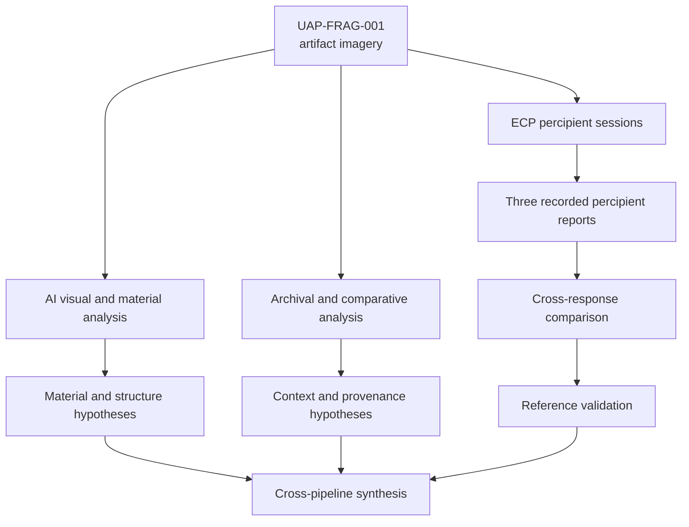
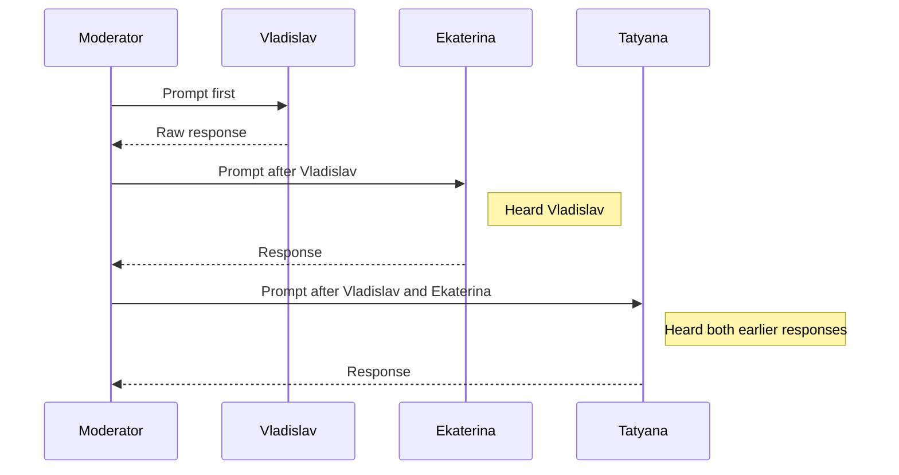
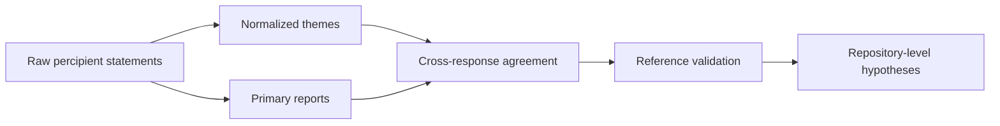
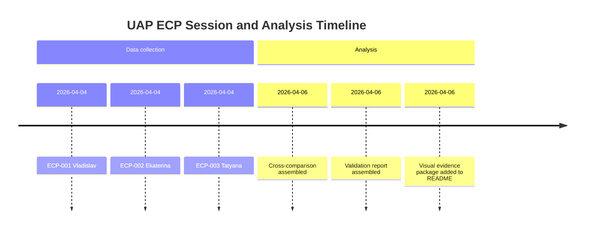

# UAP REVERSE ENGINEERING STUDY
# ИССЛЕДОВАНИЕ ПО РЕВЕРС-ИНЖИНИРИНГУ НЛО

---

<div align="center">

| Repository / Репозиторий | Status / Статус |
|-------------------------|----------------|
| `UAP_Reverse_Engineering_Study` | ACTIVE / АКТИВЕН |

**Organization / Организация:** Advanced Scientific Research Projects (ASRP)

[](https://github.com/AdvancedScientificResearchProjects)
[]()

</div>

---

## TABLE OF CONTENTS / СОДЕРЖАНИЕ

1. [Overview / Обзор](#overview--обзор)
2. [Research At a Glance / Исследование в Цифрах](#research-at-a-glance--исследование-в-цифрах)
3. [Quick Navigation / Быстрая Навигация](#quick-navigation--быстрая-навигация)
4. [Research Overview / Обзор Исследования](#research-overview--обзор-исследования)
5. [Key Metrics / Ключевые Метрики](#key-metrics--ключевые-метрики)
6. [Working Hypotheses / Рабочие Гипотезы](#working-hypotheses--рабочие-гипотезы)
7. [Visual Evidence / Визуализация Данных](#visual-evidence--визуализация-данных)
8. [Timeline / Временная Шкала](#timeline--временная-шкала)
9. [Team / Команда](#research-team--исследовательская-команда)
10. [Structure / Структура](#structure--структура)
11. [Security / Безопасность](#security--безопасность)
12. [Contact / Контакты](#contact-information--контактная-информация)

---

## OVERVIEW / ОБЗОР

### ENGLISH

Multi-layered scientific study of UAP fragment with 3 analytical pipelines:

1. **AI-Based Visual & Material Analysis** — Computer vision and neural network analysis
2. **Archival & Comparative Analysis** — Cross-reference with known databases
3. **Extended Cognitive Perception (ECP)** — Controlled human perception protocols

### РУССКИЙ

Многослойное научное исследование фрагмента НЛО с 3 аналитическими конвейерами:

1. **ИИ-анализ визуальных и материальных характеристик**
2. **Архивный и сравнительный анализ**
3. **Расширенное Когнитивное Восприятие (КП)**

---

## RESEARCH AT A GLANCE / ИССЛЕДОВАНИЕ В ЦИФРАХ

| Parameter / Параметр | Value / Значение | Status / Статус |
|----------------------|------------------|-----------------|
| **Artifact ID / ID артефакта** | `UAP-FRAG-001` | Active case / Активный кейс |
| **Primary ECP session / Основная КП-сессия** | `ECP-2026-04-04` | Completed / Завершено |
| **Recorded percipient reports / Зафиксированные отчёты перципиентов** | 3 | Available / Доступны |
| **Verifiable reference parameters / Проверяемые параметры референса** | 10 | Validated / Сопоставлены |
| **Exact matches / Точные совпадения** | 7/10 | Descriptive / Описательно |
| **Partial or indirect matches / Частичные или косвенные совпадения** | 2/10 | Descriptive / Описательно |
| **Complete misses / Полные промахи** | 1/10 | Descriptive / Описательно |
| **Repeated themes across all 3 responses / Повторяющиеся темы во всех 3 ответах** | 4 | Descriptive / Описательно |
| **Known methodological limitation / Известное методологическое ограничение** | Compromised blinding for 2 later participants / Нарушенное ослепление для 2 более поздних участников | Critical / Критично |
| **Protocol version / Версия протокола** | 2.0 | Synchronized / Синхронизировано |

---

## QUICK NAVIGATION / БЫСТРАЯ НАВИГАЦИЯ

| Section / Раздел | Purpose / Назначение | Status / Статус |
|------------------|----------------------|-----------------|
| [Research Overview / Обзор Исследования](#research-overview--обзор-исследования) | End-to-end pipeline map / Общая схема исследования | Added / Добавлено |
| [Key Metrics / Ключевые Метрики](#key-metrics--ключевые-метрики) | Fast numeric summary / Краткая числовая сводка | Added / Добавлено |
| [Working Hypotheses / Рабочие Гипотезы](#working-hypotheses--рабочие-гипотезы) | Supported vs partial vs open claims / Поддержанные, частичные и открытые тезисы | Added / Добавлено |
| [Visual Evidence / Визуализация Данных](#visual-evidence--визуализация-данных) | Diagrams and matrices from the ECP analysis / Диаграммы и матрицы из анализа КП | Added / Добавлено |
| [Timeline / Временная Шкала](#timeline--временная-шкала) | Session and analysis chronology / Хронология сеанса и анализа | Added / Добавлено |
| [Cross Comparison / Сравнение Ответов](analysis/cross_comparison.md) | Detailed descriptive overlap analysis / Детальный анализ пересечения ответов | Available / Доступно |
| [Validation Report / Отчёт Валидации](analysis/ecp_validation_report.md) | Parameter-level check against disclosed reference / Проверка по параметрам против раскрытого референса | Available / Доступно |
| [Percipient Reports / Отчёты Перципиентов](reports/percipient_reports/) | Primary session records / Первичные записи сеанса | Available / Доступно |

---

## RESEARCH OVERVIEW / ОБЗОР ИССЛЕДОВАНИЯ



**EN:** The current repository is strongest where it separates raw percipient records, descriptive overlap analysis, and later validation against disclosed reference data.

**RU:** Текущая сила репозитория в том, что он разделяет первичные записи перципиентов, описательный анализ пересечений и последующую валидацию по раскрытым референсным данным.

---

## KEY METRICS / КЛЮЧЕВЫЕ МЕТРИКИ

| Metric / Метрика | Value / Значение | Interpretation / Интерпретация |
|------------------|------------------|--------------------------------|
| **Percipient count / Число перципиентов** | 3 | Small exploratory session / Малый поисковый сеанс |
| **All-response repeated themes / Темы, повторяющиеся во всех ответах** | 4 | Beacon-like function, larger system, no consciousness, non-terrestrial origin |
| **Exact-or-partial coverage / Покрытие точными и частичными совпадениями** | 9/10 | Broad descriptive overlap with disclosed reference |
| **Direct contradiction count / Число прямых противоречий** | 1 | Flight vs stationary placement |
| **Undetected reference property / Необнаруженное свойство референса** | 1 | Variable radioactivity |
| **Later participants with compromised blinding / Более поздние участники с нарушенным ослеплением** | 2/3 | Limits independent interpretation |

---

## WORKING HYPOTHESES / РАБОЧИЕ ГИПОТЕЗЫ

| Hypothesis / Гипотеза | Current Status / Текущий статус | Basis / Основание |
|-----------------------|---------------------------------|-------------------|
| **Artifact functions as a signal or navigation component / Артефакт выполняет сигнальную или навигационную функцию** | Supported / Поддержано | Repeated in all 3 responses; exact or partial match to reference |
| **Artifact is part of a larger system / Артефакт является частью более крупной системы** | Strongly supported / Сильно поддержано | Exact match in all 3 responses |
| **Artifact is a non-autonomous tool / Артефакт является неавтономным инструментом** | Strongly supported / Сильно поддержано | Exact match in all 3 responses |
| **Artifact origin is non-terrestrial / Происхождение артефакта внеземное** | Repeated theme / Повторяющаяся тема | Present in all 3 responses, but with divergent details |
| **Material is non-standard and mineral-like / Материал нестандартный и минеральноподобный** | Partial support / Частичная поддержка | Broad overlap only; precise "biometal" identification absent |
| **Artifact relates to temporal navigation / Артефакт связан с темпоральной навигацией** | Weak indirect support / Слабая косвенная поддержка | Present only in Tatyana's wording |
| **Artifact has detectable radioactivity via ECP / Артефакт имеет обнаруживаемую через КП радиоактивность** | Not supported / Не поддержано | No percipient detected it |

---

## VISUAL EVIDENCE / ВИЗУАЛИЗАЦИЯ ДАННЫХ

### Response Agreement Map / Карта согласованности ответов


**EN:** This matrix visualizes repeated themes in the recorded responses only. It should not be read as proof of independent convergence.

**RU:** Эта матрица визуализирует только повторяющиеся темы в зафиксированных ответах. Её не следует трактовать как доказательство независимой конвергенции.

### Reference Validation Map / Карта валидации по референсу


### Session Blinding Sequence / Схема ослепления сеанса



### Evidence Synthesis Flow / Схема синтеза доказательств



---

## TIMELINE / ВРЕМЕННАЯ ШКАЛА



---

## RESEARCH TEAM / ИССЛЕДОВАТЕЛЬСКАЯ КОМАНДА

| Name / ФИО | Role / Роль | Responsibilities / Обязанности |
|-----------|------------|-------------------------------|
| **Ovsyannikova Valeria / Овсянникова Валерия** | Director of Biomedical Research Department / Директор департамента биомедицинских исследований | Reverse engineering, partial reproduction of individual device functions, subject control / Обратная инженерия, воспроизведение отдельных функций устройства, контроль испытуемых |
| **Savelyev Ivan / Савельев Иван** | Science Director & Editor-in-Chief of ASRP.science / Директор по науке и главный редактор научного журнала ASRP.science | Scientific methodology, peer review / Научная методология, рецензирование |
| **Kapustin Mykhailo / Капустин Михайло** | CTO & Director of AI and IT Department / Технический директор и директор департамента искусственного интеллекта и информационных технологий | AI infrastructure, IT systems / Инфраструктура ИИ, ИТ-системы |
| **Zmiienko Kyryl / Змиенко Кирилл** | Chief AI Engineer / Главный ИИ-инженер | AI analysis, data validation, ECP protocol design / ИИ-анализ, валидация данных, дизайн протокола КП |
| **Ovsyannikov Alexandr / Овсянников Александр** | IT Specialist / ИТ-специалист | IT support / ИТ-поддержка |
| **Banchenko Denis / Банченко Денис** | Program Director, Author of Research Methodology & Technology / Директор программы, автор методологии и технологии исследования | Project coordination, methodology design / Координация проекта, дизайн методологии |

## HSP GROUP / ГРУППА ВСКЧ

**EN:** HSP group (high-sensitivity cognitive participants) involved in object-based psychometric information acquisition protocols.

**RU:** Группа ВСКЧ (участники с высокой когнитивной и сенсорной чувствительностью), задействованные в протоколах психометрического считывания информации с объектов.

| Name / ФИО | Role / Роль |
|-----------|------------|
| **Belousova Ekaterina / Белоусова Екатерина** | HSP Percipient / Перципиент ВСКЧ |
| **Simiretov Vladislav / Семилетов Владислав** | HSP Percipient / Перципиент ВСКЧ |
| **Burilova Tatyana / Бурилова Татьяна** | HSP Percipient / Перципиент ВСКЧ |

---

## STRUCTURE / СТРУКТУРА

```
UAP_Reverse_Engineering_Study/
│
├── README.md                          # Main documentation / Главная документация
├── charts/                            # Visual evidence / Визуализация
│   ├── ecp_response_agreement_matrix.svg
│   └── ecp_reference_validation_matrix.svg
│
├── experiments/                       # Experimental protocols / Экспериментальные протоколы
│   ├── protocol_ecp.md                # ECP protocol / Протокол КП
│   └── protocol_ai.md                 # AI protocol / Протокол ИИ
│
├── analysis/                          # Analysis reports / Отчёты анализа
│   ├── cross_comparison.md            # Cross-pipeline comparison / Сравнение конвейеров
│   └── ecp_validation_report.md       # ECP validation report / Отчёт валидации КП
│
├── reports/                           # Research reports / Исследовательские отчёты
│   └── percipient_reports/            # Percipient reports / Отчёты перципиентов
│       ├── ECP-2026-04-04-001-vladislav.md
│       ├── ECP-2026-04-04-002-ekaterina.md
│       └── ECP-2026-04-04-003-tatyana.md
```

---

## SECURITY / БЕЗОПАСНОСТЬ

### Data Classification / Классификация Данных

| Level / Уровень | Access / Доступ | Marking / Маркировка | Description / Описание |
|----------------|-----------------|---------------------|----------------------|
| **PUBLIC** | Open / Открытый | GREEN | General information / Общая информация |
| **RESEARCH** | Team Only / Только команда | YELLOW | Research data / Исследовательские данные |
| **RESTRICTED** | Core Team / Основная команда | RED | Sensitive analysis / Конфиденциальный анализ |
| **CLASSIFIED** | Director Only / Только директор | BLACK | Classified data / Секретные данные |

---

## RESEARCH PIPELINES / ИССЛЕДОВАТЕЛЬСКИЕ КОНВЕЙЕРЫ

| Pipeline / Конвейер | Description / Описание | Status / Статус |
|---------------------|----------------------|----------------|
| **AI Analysis** | Computer vision, material estimation | Active |
| **Archival** | Database comparison, pattern matching | Active |
| **ECP** | Human perception protocols | Active |

---

## OSF PREREGISTRATION / ПРЕДВАРИТЕЛЬНАЯ РЕГИСТРАЦИЯ OSF

| Field / Поле | Value / Значение |
|--------------|------------------|
| **Status / Статус** | To be determined / Уточняется |
| **Platform / Платформа** | [OSF.io](https://osf.io) |

---

## ASRP ECOSYSTEM / ЭКОСИСТЕМА ASRP

<div align="center">

### Related Research Repositories / Связанные Исследовательские Репозитории

</div>

| Repository / Репозиторий | Direction / Направление | Link / Ссылка |
|-------------------------|------------------------|---------------|
| **Hyperbolic Field Blood Plasma Study** | Blood plasma coagulation / Свёртываемость плазмы | [View / Просмотр](https://github.com/AdvancedScientificResearchProjects/Hyperbolic_Field_BloodPlasma_Study) |
| **Hyperbolic Field Agricultural Study** | Plant & seed growth / Рост растений и семян | [View / Просмотр](https://github.com/AdvancedScientificResearchProjects/Hyperbolic_Field_Agricultural_Study) |
| **Hyperbolic Field DAAT Crystal Study** | Crystal-human interaction / Взаимодействие кристалл-человек | [View / Просмотр](https://github.com/AdvancedScientificResearchProjects/Hyperbolic_Field_DAAT_Crystal_Study) |
| **Hyperbolic Field Saccharomyces Study** | Yeast fermentation / Ферментация дрожжей | [View / Просмотр](https://github.com/AdvancedScientificResearchProjects/Hyperbolic_Field_SaccharomycesCerevisiae_Study) |
| **ASRP.art** | Art & consciousness / Искусство и сознание | [View / Просмотр](https://github.com/AdvancedScientificResearchProjects/Axionetic_Sensing_Reactions_Platform_in_Art) |

<div align="center">

### Patent Portfolio / Патентный Портфель

</div>

| Patent / Патент | Application / Заявка | Link / Ссылка |
|----------------|---------------------|---------------|
| **Fractal Biomedical System / Фрактальная Биомедицинская Система** | KZ 2025/1095.1 | [View / Просмотр](https://github.com/denisbanchenko/Kazpatent_Fractal_Biomedical_System_Patent) |
| **ASRP.art / ПНИР.искусство** | KZ 2025/0592.1 + PCT | [View / Просмотр](https://github.com/denisbanchenko/Kazpatent_Axionetic_Sensing_Reactions_Platform_in_Art_Patent) |
| **ASRP.drift / ПНИР.дрифт** | KZ 413554 | [View / Просмотр](https://github.com/denisbanchenko/Kazpatent_Advanced_Synchro_Resonance_Platform_For_Deep_Resonant_Patent) |
| **GFS / ГСП** | KZ 2025/1096.1 | [View / Просмотр](https://github.com/denisbanchenko/Kazpatent_Global_Forecasting_System_Patent) |

---

## CONTACT INFORMATION / КОНТАКТНАЯ ИНФОРМАЦИЯ

<div align="center">

### Corporate Contact / Корпоративные Контакты

</div>

| Field / Поле | Value / Значение |
|--------------|------------------|
| **Organization / Организация** | ТОО "Перспективные Научно-Исследовательские Разработки" / Advanced Scientific Research Projects LLP |
| **Address / Адрес** | Komarova St. 37, Apt 56, Baikonur, 468320 / Ул. Комарова 37, кв. 56, г. Байконур, 468320 |
| **Country / Страна** | Republic of Kazakhstan / Республика Казахстан |
| **Website / Веб-сайт** | [asrp.tech](https://asrp.tech) |
| **Email** | info@asrp.tech |

| Purpose / Цель | Contact / Контакт |
|---------------|------------------|
| **General Inquiries / Общие вопросы** | info@asrp.tech |
| **Research Collaboration / Научное сотрудничество** | research@asrp.tech |
| **Security Issues / Безопасность** | security@asrp.tech |

---

<div align="center">

---

## DISCLAIMER / ОТКАЗ ОТ ОТВЕТСТВЕННОСТИ

### ENGLISH

This research operates at the boundary of known science, experimental methodologies, and non-standard perception studies. All findings are preliminary and subject to validation.

### РУССКИЙ

Это исследование работает на границе известной науки, экспериментальных методологий и нестандартных исследований восприятия. Все выводы являются предварительными и подлежат валидации.

---

**Last Updated / Последнее Обновление:** 2026-04-06
**Version / Версия:** 2.0
**Status / Статус:** ACTIVE / АКТИВЕН

---

**ASRP RESEARCH STANDARD v2.1**
*Maximum structure, clarity, and analytical rigor*
*Максимальная структура, ясность и аналитическая строгость*

---

</div>

---

## NAVIGATION INDEX / НАВИГАЦИОННЫЙ ИНДЕКС

[Overview / Обзор](#overview--обзор) · [Research At a Glance / В Цифрах](#research-at-a-glance--исследование-в-цифрах) · [Quick Navigation / Быстрая Навигация](#quick-navigation--быстрая-навигация) · [Research Overview / Схема](#research-overview--обзор-исследования) · [Key Metrics / Метрики](#key-metrics--ключевые-метрики) · [Working Hypotheses / Гипотезы](#working-hypotheses--рабочие-гипотезы) · [Visual Evidence / Диаграммы](#visual-evidence--визуализация-данных) · [Timeline / Сроки](#timeline--временная-шкала) · [Team / Команда](#research-team--исследовательская-команда) · [Structure / Структура](#structure--структура) · [Research Pipelines / Конвейеры](#research-pipelines--исследовательские-конвейеры) · [Security / Безопасность](#security--безопасность) · [ASRP Ecosystem / Экосистема](#asrp-ecosystem--экосистема-asrp) · [Contact / Контакты](#contact-information--контактная-информация) · [Disclaimer / Отказ](#disclaimer--отказ-от-ответственности)
