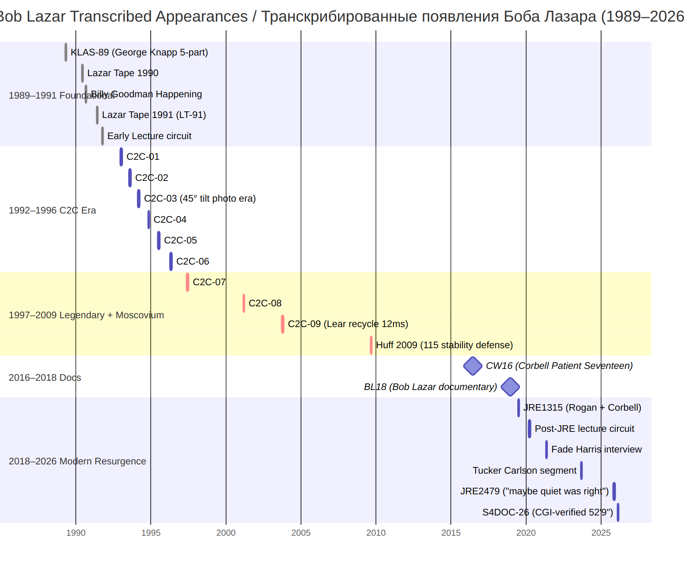

# Bob Lazar — Complete Interview Catalog (1989–2026) / Боб Лазар — Полный каталог интервью (1989–2026)

> **Navigation / Навигация:** [← README](../README.md) · [Master / Мастер](../analysis/MASTER_technical_claims.md) · [Per-Interview / По интервью](../analysis/per-interview/) · [Topical / Тематически](../analysis/topical/) · [Catalog / Каталог](../catalog/) · [Diagrams / Схемы](../diagrams/)

**EN:** Comprehensive chronological catalog of all known public appearances focused on S-4/Area 51 claims. Merged from: 3x web research agents + Perplexity deep research. Research date: 2026-04-13. For transcription pipeline — links to originals only.

**RU:** Полный хронологический каталог всех известных публичных выступлений, сосредоточенных на утверждениях об S-4/Зоне 51. Собран из: 3 агентов веб-исследований + глубокое исследование Perplexity. Дата исследования: 2026-04-13. Для конвейера транскрипции — только ссылки на оригиналы.

*Visual index of the appearances cataloged below. / Визуальный индекс каталогизированных ниже выступлений.*

---

## 1989 — The Original Revelations / Первоначальные откровения

| # | Date / Дата | Show/Outlet / Передача/Источник | Interviewer / Интервьюер | Format / Формат | Duration / Длительность | Topics / Темы | Link / Ссылка |
|---|------|--------------|-------------|--------|----------|--------|------|
| 1 | May 15 / 15 мая | KLAS-TV "On the Record" — silhouette as "Dennis" / силуэт под псевдонимом «Dennis» | George Knapp | TV (video) / ТВ (видео) | ~5 min / ~5 мин | First appearance; 9 craft at S-4; reverse engineering; Navy program; identity hidden / Первое появление; 9 аппаратов на S-4; обратная инженерия; программа ВМФ; личность скрыта | [YouTube](https://www.youtube.com/watch?v=5OHcJS7X6sc), [archive.org](https://archive.org/details/bob-lazar-interview-1989) |
| 2 | Nov 6–25 / 6–25 ноября | KLAS-TV "UFOs: The Best Evidence" (9-part series / серия из 9 частей) | George Knapp | TV series (video) / ТВ-серия (видео) | 9 parts + 2hr compilation / 9 частей + 2-час. компиляция | Identity revealed Nov 10 (Part 5); lie detector; Sport Model dimensions (~30–35ft); Element 115; gravity amplifiers; 38 levels above Q; highest-rated local broadcast in LV history / Личность раскрыта 10 ноября (Часть 5); детектор лжи; размеры Sport Model (~30–35 футов); Элемент 115; гравитационные усилители; 38 уровней выше Q; самая рейтинговая местная трансляция в истории Лас-Вегаса | [Part 5](https://www.youtube.com/watch?v=KjApDnCvh2c), [Part 6](https://www.youtube.com/watch?v=OKmwPQlQsSk), [Mystery Wire](https://www.mysterywire.com/ufo/ufos-the-best-evidence/), [archive.org](https://archive.org/details/bob-lazar-interview-1989) |
| 3 | ~Nov 17 / ~17 ноября | Chuck Harder "For The People" (syndicated radio / синдицированное радио) | Chuck Harder | Radio (audio) / Радио (аудио) | ~1 hr / ~1 ч | Reiterates KLAS revelations for national radio audience shortly after TV broadcast / Повторяет откровения KLAS для национальной радиоаудитории вскоре после телетрансляции | [Transcript](http://docs.preterhuman.net/Interview_with_Bob_Lazar_on_Area_51), [Harder archive](https://www.gpposner.com/FTP-archives.html) |
| 4 | Nov 21 / 21 ноября | Billy Goodman Happening, KVEG 840 AM | Billy Goodman | Radio (audio) / Радио (аудио) | ~3 hr / ~3 ч | S-4 vs Area 51; Sport Model; 3 generators; 9 saucers; Element 115 as fuel; gravity waves; reactor; Gene Huff co-guest; Bill Cooper calls in / S-4 vs Зона 51; Sport Model; 3 генератора; 9 тарелок; Элемент 115 как топливо; гравитационные волны; реактор; Gene Huff соведущий; Bill Cooper звонит | [Transcript](https://disclosdex.com/documents/1989-lazar-radio-interview-excerpts), [alt](https://www.papooselake.org/interview-transcripts/bob-lazar-on-the-billy-goodman-happening-2) |
| 5 | Dec 9 / 9 декабря | KLAS-TV "On The Record" (extended studio / расширенная студийная) | George Knapp | TV (video) / ТВ (видео) | ~30 min / ~30 мин | Los Alamos background; EG&G hiring; S-4 location (10–15 mi south of Groom Lake); senior staff physicist role / Биография в Лос-Аламосе; наём через EG&G; местонахождение S-4 (10–15 миль к югу от Грум-Лейк); должность старшего штатного физика | [archive.org](https://archive.org/details/bob-lazar-interview-1989), [Papoose Lake](https://www.papooselake.org/filmed-interviews) |
| 6 | Dec 20 / 20 декабря | Billy Goodman Happening, KVEG 840 AM (2nd / 2-е) | Billy Goodman | Radio (audio) / Радио (аудио) | ~1h 41m | Reactor function; gravity is a wave; S-4 staff size; hatch mechanics; spacetime distortion / Функция реактора; гравитация это волна; размер персонала S-4; механика люка; искажение пространства-времени | [YouTube](https://www.youtube.com/watch?v=nMFQ0pnmYNw), [alt](https://www.youtube.com/watch?v=DCyf9ScYJAs) |

**Note / Примечание:** Norio Hayakawa confirmed Lazar appeared on Billy Goodman "almost nightly" during summer 1989 — those broadcasts are believed lost. / Норио Хаякава подтвердил, что Лазар выступал у Billy Goodman «почти каждую ночь» летом 1989 года — те трансляции считаются утерянными.

## 1990

| # | Date / Дата | Show/Outlet / Передача/Источник | Interviewer / Интервьюер | Format / Формат | Duration / Длительность | Topics / Темы | Link / Ссылка |
|---|------|--------------|-------------|--------|----------|--------|------|
| 7 | Feb 21 (filmed) / Mar (aired) / 21 фев (съёмка) / Мар (эфир) | Nippon TV NTV Japan | NTV crew (Hayakawa facilitated) / Команда NTV (при содействии Хаякавы) | TV documentary (video) / ТВ-документалка (видео) | ~4 hr filming / 2 hr broadcast / ~4 ч съёмки / 2 ч трансляция | S-4; craft; Element 115; propulsion; directed crew to test flight viewing area. Rarest appearance — English version not publicly available / S-4; аппарат; Элемент 115; двигательная установка; направил команду в зону наблюдения испытательных полётов. Редчайшее выступление — английская версия публично недоступна | [Hayakawa blog](https://noriohayakawa.wordpress.com/2022/11/20/my-involvement-with-area-51-research-norio-hayakawa/) |
| 8 | Nov 25 / 25 ноября | John Andrews private interview / частное интервью | John Andrews (Testors) | Video (private) / Видео (частное) | Unknown / Неизвестно | Sport Model dimensions, exterior, interior; basis for 1994 Testors S-4 Saucer model kit / Размеры, экстерьер и интерьер Sport Model; основа для набора модели Testors S-4 Saucer 1994 года | [Papoose Lake](https://www.papooselake.org/filmed-interviews) |
| 9 | Various 1990 / Различные 1990 | Books / Книги: Vallee *Revelations*, Good *Alien Contact*, Lindemann *UFOs and the Alien Presence* | Various authors / Разные авторы | Print/text / Печать/текст | N/A | Credentials; S-4 tech claims; propulsion physics; Element 115; craft interior; security / Учётные данные; технические утверждения S-4; физика двигательной установки; Элемент 115; интерьер аппарата; безопасность | [Papoose Lake transcripts](https://www.papooselake.org/interview-transcripts) |

## 1991

| # | Date / Дата | Show/Outlet / Передача/Источник | Interviewer / Интервьюер | Format / Формат | Duration / Длительность | Topics / Темы | Link / Ссылка |
|---|------|--------------|-------------|--------|----------|--------|------|
| 10 | Sep 1991 / Сен 1991 | **"The Lazar Tape and Excerpts from the Government Bible"** (VHS) | Gene Huff | Video / Видео | ~40 min / ~40 мин | **Most technically detailed account ever.** Projects Galileo, Sidekick, Looking Glass; Element 115 stable isotope; reactor function; antimatter reaction; gravity-A wave amplification; Sport Model interior (no angles, no seams, 3 seats, central reactor); briefing documents ("humans as containers") / **Самый технически детальный рассказ.** Проекты Galileo, Sidekick, Looking Glass; стабильный изотоп Элемента 115; функция реактора; антиматериальная реакция; усиление гравитационной волны A; интерьер Sport Model (нет углов, нет швов, 3 сиденья, центральный реактор); брифинг-документы («люди как контейнеры») | [YouTube](https://www.youtube.com/watch?v=koo4qLQPQBc), [alt](https://www.youtube.com/watch?v=UitiwiLpvKw), [archive.org](https://archive.org/details/antigravity) |

## 1992

| # | Date / Дата | Show/Outlet / Передача/Источник | Interviewer / Интервьюер | Format / Формат | Duration / Длительность | Topics / Темы | Link / Ссылка |
|---|------|--------------|-------------|--------|----------|--------|------|
| 11 | Dec 12 / 12 декабря | Coast to Coast AM | Art Bell | Radio (audio) / Радио (аудио) | ~3h 53m | Area 51; S-4; antimatter reactor; Element 115; gravity propulsion; spacetime distortion; alien genetics ("containers"); with John Lear (Lazar joins by phone 2nd half) / Зона 51; S-4; антиматериальный реактор; Элемент 115; гравитационная двигательная установка; искажение пространства-времени; генетика инопланетян («контейнеры»); с John Lear (Лазар подключается по телефону во 2-й половине) | [YouTube](https://www.youtube.com/watch?v=qFqGy1MZul4), [alt](https://www.youtube.com/watch?v=IcYaeF2FVc4), [archive.org](https://archive.org/details/19921212CoastToCoastAMWithArtBellArea51JohnLearBobLazar) |

## 1993

| # | Date / Дата | Show/Outlet / Передача/Источник | Interviewer / Интервьюер | Format / Формат | Duration / Длительность | Topics / Темы | Link / Ссылка |
|---|------|--------------|-------------|--------|----------|--------|------|
| 12 | May 1 / 1 мая | Ultimate UFO Seminar, Little A-Le-Inn, Rachel NV | Public Q&A (covert recording by Dan Willis) / Публичное Q&A (скрытая запись Dan Willis) | Conference (video) / Конференция (видео) | ~1h 52m | **High technical density.** Antimatter reactor physics (proton injection, anti-hydrogen, thermionic conversion); gravity-A wave amplification; waveguide analogy; 3 gravity emitters; skin/metal movement; Element 115 stable isotope — admits he took some from S-4; Jacques Vallee in audience / **Высокая техническая плотность.** Физика антиматериального реактора (инжекция протонов, антиводород, термоэмиссионное преобразование); усиление гравитационной волны A; аналогия волновода; 3 гравитационных эмиттера; движение обшивки/металла; стабильный изотоп Элемента 115 — признаётся, что взял немного с S-4; Jacques Vallee в зале | [YouTube (Willis)](https://www.youtube.com/watch?v=M1joezA5uoM), [remaster](https://www.youtube.com/watch?v=3hXOFfJuecE), [transcript](https://disclosdex.com/documents/1993-lazar-ultimate-ufo-seminar) |
| 13 | Oct 24 / 24 октября | Dark Matters Radio | Don Ecker | Radio (audio) / Радио (аудио) | ~1–2 hr / ~1–2 ч | S-4; propulsion; Element 115; Gene Huff co-guest / S-4; двигательная установка; Элемент 115; Gene Huff соведущий | [Papoose Lake](https://www.papooselake.org/filmed-interviews) |

## 1994

| # | Date / Дата | Show/Outlet / Передача/Источник | Interviewer / Интервьюер | Format / Формат | Duration / Длительность | Topics / Темы | Link / Ссылка |
|---|------|--------------|-------------|--------|----------|--------|------|
| 14 | Apr / Апр | OMNI Magazine (Vol. 16, No. 7) | OMNI staff / Редакция OMNI | Print/text / Печать/текст | N/A | Craft omicron vs delta modes (gravity amplifier configurations); post-1989 activities / Режимы аппарата omicron vs delta (конфигурации гравитационных усилителей); деятельность после 1989 | [Scribd](https://www.scribd.com/document/587212950/Bob-Lazar-Interview-OMNI-Magazine-1994) |

**Note / Примечание:** Oct 1, 1994 — Larry King TNT "UFO Cover-Up? Live from Area 51" — Lazar's claims debated by Stanton Friedman et al., but Lazar does NOT appear directly. / 1 окт 1994 — Larry King TNT «UFO Cover-Up? Live from Area 51» — утверждения Лазара обсуждаются Stanton Friedman и др., но сам Лазар не появляется. [YouTube](https://www.youtube.com/watch?v=Acp_PhbdUoM)

## 1995–1996 — UFO Line Radio Show

| # | Date / Дата | Show/Outlet / Передача/Источник | Interviewer / Интервьюер | Format / Формат | Duration / Длительность | Topics / Темы | Link / Ссылка |
|---|------|--------------|-------------|--------|----------|--------|------|
| 15 | 1995 | "UFOs and Area 51: Secrets of the Black World" (Hesemann doc / документалка Хеземанна) | Michael Hesemann | Documentary (video) / Документалка (видео) | Feature-length / Полнометражный | S-4/Area 51 overview; Lazar + Knapp + Adair + others / Обзор S-4/Зоны 51; Лазар + Knapp + Adair + другие | [IMDb](https://www.imdb.com/title/tt13538988/), [Amazon](https://www.amazon.com/UFOs-Area-51-Secrets-Black/dp/B06XD2F2QX) |
| 16 | Dec 8, 1995 / 8 дек 1995 | UFO Line #1, KLAV 1230 AM — guest / гость: George Knapp | Self-hosted w/ Gene Huff / Самостоятельно с Gene Huff | Radio (audio) / Радио (аудио) | ~1 hr / ~1 ч | **MISSING — recording lost / ОТСУТСТВУЕТ — запись утеряна** | — |
| 17 | Dec 15, 1995 / 15 дек 1995 | UFO Line #2, KLAV — guest / гость: Layne Keck | Self-hosted w/ Gene Huff / Самостоятельно с Gene Huff | Radio (audio) / Радио (аудио) | ~54 min / ~54 мин | Gravity wave; spacetime distortion; UFO propulsion / Гравитационная волна; искажение пространства-времени; двигательная установка НЛО | [YouTube](https://www.youtube.com/watch?v=ebKH1fsKz44) |
| 18 | Dec 22, 1995 / 22 дек 1995 | UFO Line #3, KLAV — guest / гость: John Lear | Self-hosted w/ Gene Huff / Самостоятельно с Gene Huff | Radio (audio) / Радио (аудио) | ~56 min / ~56 мин | Propulsion; craft maneuvers; radar invisibility via gravity field / Двигательная установка; манёвры аппарата; радиолокационная невидимость через гравитационное поле | [YouTube](https://www.youtube.com/watch?v=K6PM0Tq0L0c) |
| 19 | Jan 5, 1996 / 5 янв 1996 | UFO Line #4, KLAV — guest / гость: John Lear (parts 2–4 / части 2–4) | Self-hosted w/ Gene Huff / Самостоятельно с Gene Huff | Radio (audio) / Радио (аудио) | ~3 hr (multi-part) / ~3 ч (многочастный) | Spacetime distortion; craft invisibility; gravity waves defeating radar / Искажение пространства-времени; невидимость аппарата; гравитационные волны, обходящие радар | [YouTube](https://www.youtube.com/watch?v=BQQ2gVWxm3E), [alt](https://www.youtube.com/watch?v=sJgWwCL5XYM) |
| 20 | Jan 12, 1996 / 12 янв 1996 | UFO Line #5, KLAV — guest / гость: George Knapp | Self-hosted w/ Gene Huff / Самостоятельно с Gene Huff | Radio (audio) / Радио (аудио) | ~1 hr / ~1 ч | **MISSING — recording lost / ОТСУТСТВУЕТ — запись утеряна** | — |

## 1996

| # | Date / Дата | Show/Outlet / Передача/Источник | Interviewer / Интервьюер | Format / Формат | Duration / Длительность | Topics / Темы | Link / Ссылка |
|---|------|--------------|-------------|--------|----------|--------|------|
| 21 | Sep 20 / 20 сентября | "Dreamland: Area 51" (Bruce Burgess doc, UK / документалка Bruce Burgess, Великобритания) | Bruce Burgess | Documentary (video) / Документалка (видео) | Feature-length / Полнометражный | S-4 account; Area 51 investigation; also Travis Walton / Рассказ об S-4; расследование Зоны 51; также Travis Walton | [IMDb](https://www.imdb.com/title/tt0436251/) |

## 1997

| # | Date / Дата | Show/Outlet / Передача/Источник | Interviewer / Интервьюер | Format / Формат | Duration / Длительность | Topics / Темы | Link / Ссылка |
|---|------|--------------|-------------|--------|----------|--------|------|
| 22 | 1997 | "Area 51: The Alien Interview" (doc / документалка) | Mark Safarik | Documentary (video) / Документалка (видео) | Feature-length / Полнометражный | Commentary alongside "Victor's" alien interview tape; S-4 claims / Комментарий вместе с плёнкой «интервью инопланетянина Виктора»; утверждения об S-4 | [IMDb](https://www.imdb.com/title/tt0404780/) |
| 23 | 1997 | "Paul McKenna's Paranormal World" ITV UK | Paul McKenna | TV (video) / ТВ (видео) | ~45–60 min / ~45–60 мин | S-4; alien craft; government cover-up / S-4; инопланетный аппарат; правительственное сокрытие | [IMDb](https://www.imdb.com/title/tt0195464/) |
| 24 | Sep 26 / 26 сентября | **Coast to Coast AM** | Art Bell | Radio (audio) / Радио (аудио) | **~3h 08m** | **Most comprehensive radio interview.** Reactor; gravity-A wave; Element 115 stable isotope; propulsion; Sport Model; Gene Huff corroborates; government cover-up / **Самое исчерпывающее радиоинтервью.** Реактор; гравитационная волна A; стабильный изотоп Элемента 115; двигательная установка; Sport Model; Gene Huff подтверждает; правительственное сокрытие | [YouTube](https://www.youtube.com/watch?v=40gTFuzOSk4), [SoundCloud](https://soundcloud.com/bestartbellpodcast/1997-09-26-coast-to-coast-am-with-art-bell-bob-lazar-ufos-and-area-51), [Spotify](https://open.spotify.com/episode/5LmcRNQ7aTEvCne7kpYomk) |

## 1998

| # | Date / Дата | Show/Outlet / Передача/Источник | Interviewer / Интервьюер | Format / Формат | Duration / Длительность | Topics / Темы | Link / Ссылка |
|---|------|--------------|-------------|--------|----------|--------|------|
| 25 | Jan 15 / 15 января | Coast to Coast AM | Art Bell | Radio (audio) / Радио (аудио) | ~3h 05m | UFOs; propulsion; with John Lear (telescope observations of craft test flights); gravity propulsion / НЛО; двигательная установка; с John Lear (телескопические наблюдения испытательных полётов); гравитационная двигательная установка | [YouTube](https://www.youtube.com/watch?v=-hQoEbRmhCk) |
| 26 | May 2 / 2 мая | **Private interview — Richard F. Haines** (NASA scientist / учёный NASA) | Richard Haines | Audio (cassette, digitized) / Аудио (кассета, оцифрованная) | Unknown / Неизвестно | **Detailed technical debrief** by serious investigator. NOT publicly streamable / **Детальный технический опрос** серьёзным исследователем. НЕ доступен для публичной трансляции | Rice University Woodson Research Center, ID# HAINES-007. Request / Запрос: woodson@rice.edu |

## 2002

| # | Date / Дата | Show/Outlet / Передача/Источник | Interviewer / Интервьюер | Format / Формат | Duration / Длительность | Topics / Темы | Link / Ссылка |
|---|------|--------------|-------------|--------|----------|--------|------|
| 27 | Jun 6 / 6 июня | Coast to Coast AM | Art Bell | Radio (audio) / Радио (аудио) | ~3–4 hr / ~3–4 ч | S-4 claims revisited; alien discs; Area 51 / Повторное рассмотрение утверждений об S-4; инопланетные диски; Зона 51 | [Hark Audio](https://harkaudio.com/p/the-art-bell-vault/area-51-bob-lazar-coast-to-coast-am-6-6-02-the-art-bell-vault) |

## 2003

| # | Date / Дата | Show/Outlet / Передача/Источник | Interviewer / Интервьюер | Format / Формат | Duration / Длительность | Topics / Темы | Link / Ссылка |
|---|------|--------------|-------------|--------|----------|--------|------|
| 28 | 2003 | "UFO Top Secret: The Bob Lazar Interview" (doc / документалка) | JCG Productions | Documentary (video) / Документалка (видео) | 53 min / 53 мин | S-4; Project Galileo; reverse engineering; Element 115 / S-4; проект Galileo; обратная инженерия; Элемент 115 | [IMDb](https://www.imdb.com/title/tt33092950/), [Vimeo](https://vimeo.com/73435204) |
| 29 | Dec 6 / 6 декабря | Coast to Coast AM "UFOs & Alternative Energy" / «НЛО и альтернативная энергетика» | Art Bell | Radio (audio) / Радио (аудио) | ~2h 51m | Element 115 (just synthesized in Russia 2003); S-4 claims; United Nuclear hydrogen fuel; 9 craft confirmation / Элемент 115 (только что синтезирован в России в 2003); утверждения об S-4; водородное топливо United Nuclear; подтверждение 9 аппаратов | [YouTube](https://www.youtube.com/watch?v=9QjPm24lhC0), [alt](https://www.youtube.com/watch?v=MK3twxRHWUE), [C2C](https://www.coasttocoastam.com/show/ufos-alternative-energy/), [Spotify](https://open.spotify.com/episode/5jgW89erIkT7co14M4XUw7) |

## 2004

| # | Date / Дата | Show/Outlet / Передача/Источник | Interviewer / Интервьюер | Format / Формат | Duration / Длительность | Topics / Темы | Link / Ссылка |
|---|------|--------------|-------------|--------|----------|--------|------|
| 30 | Oct 31 / 31 октября | "Conspiracy?" TV series — "Area 51" episode / ТВ-серия — эпизод «Зона 51» | N/A | TV documentary (video) / ТВ-документалка (видео) | ~45–60 min / ~45–60 мин | S-4 claims + counter-arguments / Утверждения об S-4 + контраргументы | [IMDb](https://www.imdb.com/title/tt0828722/) |

## 2006

| # | Date / Дата | Show/Outlet / Передача/Источник | Interviewer / Интервьюер | Format / Формат | Duration / Длительность | Topics / Темы | Link / Ссылка |
|---|------|--------------|-------------|--------|----------|--------|------|
| 31 | Apr ~8–10 / ~8–10 апр | Coast to Coast AM | George Knapp | Radio (audio) / Радио (аудио) | ~3 hr / ~3 ч | S-4; hydrogen car; United Nuclear CPSC raid; with Gene Huff + Eric Davis / S-4; водородный автомобиль; рейд CPSC на United Nuclear; с Gene Huff + Eric Davis | [C2C](https://www.coasttocoastam.com/show/2006-04-01-show/) |

## 2009

| # | Date / Дата | Show/Outlet / Передача/Источник | Interviewer / Интервьюер | Format / Формат | Duration / Длительность | Topics / Темы | Link / Ссылка |
|---|------|--------------|-------------|--------|----------|--------|------|
| 32 | Nov 15 / 15 ноября | Coast to Coast AM (20th anniversary / 20-я годовщина) | George Knapp | Radio (audio) / Радио (аудио) | ~2h 11m | Element 115; hydrogen research; deep regret at going public ("I am so sorry I made that move"); background erasure; with Huff + Lear / Элемент 115; водородные исследования; глубокое сожаление о публичности («Мне так жаль, что я пошёл на этот шаг»); стирание биографии; с Huff + Lear | [YouTube](https://www.youtube.com/watch?v=bWzUsdD-FuU), [C2C](https://www.coasttocoastam.com/show/2009-11-15-show/) |

## 2011

| # | Date / Дата | Show/Outlet / Передача/Источник | Interviewer / Интервьюер | Format / Формат | Duration / Длительность | Topics / Темы | Link / Ссылка |
|---|------|--------------|-------------|--------|----------|--------|------|
| 33 | Oct 22 / 22 октября | "The Truth Behind" — UFOs (TV episode / ТВ-эпизод) | Paul Nelson (dir / реж.) | TV documentary (video) / ТВ-документалка (видео) | 45 min / 45 мин | UFO evidence overview; S-4 account; with John Lear / Обзор НЛО-свидетельств; рассказ об S-4; с John Lear | [IMDb](https://www.imdb.com/title/tt6209926/) |

## 2014

| # | Date / Дата | Show/Outlet / Передача/Источник | Interviewer / Интервьюер | Format / Формат | Duration / Длительность | Topics / Темы | Link / Ссылка |
|---|------|--------------|-------------|--------|----------|--------|------|
| 34 | ~May 13 / ~13 мая | KLAS I-Team / 8 News Now (25th anniversary / 25-я годовщина) | George Knapp | TV news (video) / ТВ-новости (видео) | ~6 min / ~6 мин | Reaffirms claims; CIA declassification; Atomic Testing Museum tour / Подтверждает утверждения; рассекречивание ЦРУ; тур по Музею атомных испытаний | [Dailymotion](https://www.dailymotion.com/video/x1uoj7d), [Open Minds](https://openminds.tv/bob-lazar-still-defends-area-51-ufo-info-25-years-later/) |
| 35 | Nov 1 / 1 ноября | Desert Companion / KNPR "Out There" | George Knapp | Print + recorded interview / Печать + запись интервью | Long-form / Лонгрид | 25th anniversary retrospective; certainty; surveillance; in-home interview / Ретроспектива 25-летия; уверенность; слежка; интервью на дому | [KNPR](https://knpr.org/magazine-desert-companion/2014-11-01/out-there) |
| 36 | Nov 23 / 23 ноября | Coast to Coast AM (25th anniversary / 25-я годовщина) | George Knapp | Radio (audio) / Радио (аудио) | ~3–4 hr / ~3–4 ч | Self-preservation motive; CIA disinfo; USSR spy satellites; regrets; with Gene Huff / Мотив самосохранения; дезинформация ЦРУ; советские шпионские спутники; сожаления; с Gene Huff | [C2C](https://www.coasttocoastam.com/show/2014-11-23-show/) |

## 2015

| # | Date / Дата | Show/Outlet / Передача/Источник | Interviewer / Интервьюер | Format / Формат | Duration / Длительность | Topics / Темы | Link / Ссылка |
|---|------|--------------|-------------|--------|----------|--------|------|
| 37 | Feb 21 / 21 февраля | 2015 International UFO Congress (Fountain Hills, AZ / Фаунтин-Хиллс, Аризона) | George Knapp (host / ведущий) | Conference Q&A (video) / Конференция Q&A (видео) | ~60 min Q&A / ~60 мин Q&A | S-4 work; 9 craft; Sport Model; Element 115; gravity amplifiers; sketched craft on stage / Работа на S-4; 9 аппаратов; Sport Model; Элемент 115; гравитационные усилители; нарисовал аппарат на сцене | [Store $4.99](https://store.ufocongress.com/special-q-and-a-with-bob-lazar-area-51), [Open Minds](https://openminds.tv/a-special-q-a-with-bob-lazar-hosted-by-george-knapp/) |

## 2016

| # | Date / Дата | Show/Outlet / Передача/Источник | Interviewer / Интервьюер | Format / Формат | Duration / Длительность | Topics / Темы | Link / Ссылка |
|---|------|--------------|-------------|--------|----------|--------|------|
| 38 | Feb 19 / 19 февраля | "Lazar: Cosmic Whistleblower" (Corbell short doc / короткометражка Корбелла) | Jeremy Corbell | Documentary (video) / Документалка (видео) | 18 min / 18 мин | S-4 disclosure overview; first Corbell collaboration; precursor to 2018 feature / Обзор раскрытия S-4; первая коллаборация с Корбеллом; предшественник полнометражки 2018 | [IMDb](https://www.imdb.com/title/tt4357548/) |

## 2018

| # | Date / Дата | Show/Outlet / Передача/Источник | Interviewer / Интервьюер | Format / Формат | Duration / Длительность | Topics / Темы | Link / Ссылка |
|---|------|--------------|-------------|--------|----------|--------|------|
| 39 | Nov 25 / 25 ноября | Coast to Coast AM | George Knapp | Radio (audio) / Радио (аудио) | ~4 hr / ~4 ч | Tic Tac connection; 2017 FBI raid; surveillance; craft "smooth, rounded, no sharp corners"; documentary promo; with Corbell / Связь с «Tic Tac»; рейд ФБР 2017; слежка; аппарат «гладкий, скруглённый, без острых углов»; промо документалки; с Корбеллом | [C2C](https://www.coasttocoastam.com/show/2018-11-25-show/), [YouTube excerpt](https://www.youtube.com/watch?v=QyDIcHtBQNg), [archive.org](https://archive.org/details/C2CBobLazar20181125) |
| 40 | Dec 4 / 4 декабря | **"Bob Lazar: Area 51 & Flying Saucers"** (Corbell feature doc / полнометражка Корбелла) | Jeremy Corbell | Documentary (video) / Документалка (видео) | 1h 37m | S-4 layout; 9 craft; Sport Model; Element 115; antimatter reactor; gravity amplifiers; FBI raid; polygraph + hypnosis; Mickey Rourke narration / Планировка S-4; 9 аппаратов; Sport Model; Элемент 115; антиматериальный реактор; гравитационные усилители; рейд ФБР; полиграф + гипноз; закадровый голос Mickey Rourke | [Netflix](https://www.netflix.com/title/81083891), [Tubi](https://tubitv.com/movies/610453/bob-lazar-area-51-flying-saucers), [IMDb](https://www.imdb.com/title/tt9107368/) |
| 41 | Dec 4 / 4 декабря | Vice / Motherboard | Vice staff / Редакция Vice | Print/text (Q&A) / Печать/текст (Q&A) | N/A | Gravity propulsion; antimatter reactor; 9 saucers; Element 115 weaponizable; reasons for going public / Гравитационная двигательная установка; антиматериальный реактор; 9 тарелок; Элемент 115 как оружие; причины публичности | [Vice](https://www.vice.com/en/article/ufo-technician-bob-lazar-speaks/) |

## 2019 — Peak Media Resurgence / Пик медиа-возрождения

| # | Date / Дата | Show/Outlet / Передача/Источник | Interviewer / Интервьюер | Format / Формат | Duration / Длительность | Topics / Темы | Link / Ссылка |
|---|------|--------------|-------------|--------|----------|--------|------|
| 42 | Jan 9 / 9 января | Larry King Now / ORA TV (S7 E72) | Larry King | TV/video / ТВ/видео | ~26 min / ~26 мин | FBI raid; S-4; 53-ft disc; Element 115 dangerous + weaponizable; alien physical description; 9 craft; with Corbell / Рейд ФБР; S-4; 53-футовый диск; Элемент 115 опасен + как оружие; физическое описание инопланетян; 9 аппаратов; с Корбеллом | [YouTube](https://www.youtube.com/watch?v=Fa2FBpjW0NM), [ORA](http://www.ora.tv/larrykingnow/2019/1/9/ufo-truther-bob-lazar-filmmaker-jeremy-corbell), [IMDb](https://www.imdb.com/title/tt10622002/) |
| 43 | Apr 13 / 13 апреля | Detroit Free Press Film Fest (Freep Film Fest) — panel Q&A, DIA Theater | Panel w/ Joy White | Live Q&A (video) / Живое Q&A (видео) | ~30–45 min / ~30–45 мин | Los Alamos records; employment verification; Element 115 claims; full transcript published / Записи Лос-Аламоса; проверка занятости; утверждения об Элементе 115; полный транскрипт опубликован | [Transcript](https://www.paranormalstudy.com/interview-with-bob-lazar-jeremy-corbell-and-george-knapp/), [Fox 2 Detroit](https://www.fox2detroit.com/mornings/bob-lazar-area-51-flying-saucers-featured-at-the-freep-film-fest) |
| 44 | May 18 / 18 мая | McMenamins UFO Festival (McMinnville, OR / Маквиннвилл, Орегон) | Corbell + Knapp | Live stage Q&A / Живое Q&A на сцене | Unknown / Неизвестно | Post-screening Q&A; first sold-out event in festival history; S-4; craft details / Q&A после показа; первое распроданное мероприятие в истории фестиваля; S-4; детали аппарата | [Blog](https://blog.mcmenamins.com/making-ufology-history-in-mcminnville/) |
| 45 | Jun 20 / 20 июня | **Joe Rogan Experience #1315** | Joe Rogan | Video/audio podcast / Видео/аудио-подкаст | **2h 14m** | **Defining viral appearance (12.6M views).** Full story; Sport Model interior/exterior; Element 115 as gravity source; anti-gravity propulsion; hand scanner; reactor; 9 craft; alien autopsy; FBI raid; Tic Tac correlation; with Corbell / **Определяющее вирусное выступление (12,6 млн просмотров).** Полная история; интерьер/экстерьер Sport Model; Элемент 115 как источник гравитации; антигравитационная двигательная установка; сканер руки; реактор; 9 аппаратов; вскрытие инопланетянина; рейд ФБР; корреляция с Tic Tac; с Корбеллом | [YouTube](https://www.youtube.com/watch?v=BEWz4SXfyCQ), [Spotify](https://open.spotify.com/episode/7Gg4Qi578G5SXoEtaLVVpx), [Transcript](https://singjupost.com/transcript-bob-lazar-jeremy-corbell-on-joe-rogan-podcast-1315/) |
| 46 | Nov 2019 / Ноя 2019 | KLAS 8 News Now — 30th anniversary retrospective (Parts 5 & 6) / 30-летняя ретроспектива (Части 5 и 6) | George Knapp | TV news (video) / ТВ-новости (видео) | ~23 min combined / ~23 мин в сумме | 9 craft at S-4; Sport Model identified; alien origin certainty; government secrecy; comparison to Navy UAP / 9 аппаратов на S-4; Sport Model идентифицирован; уверенность в инопланетном происхождении; правительственная секретность; сравнение с НАЯ ВМФ | [Part 5](https://www.youtube.com/watch?v=4UjqFaQq_7I), [Part 6](https://www.youtube.com/watch?v=OKmwPQlQsSk) |
| 47 | 2019 | "Dreamland: An Autobiography" (book / книга) | N/A (George Knapp foreword / предисловие George Knapp) | Book / Книга | N/A | Full autobiography: S-4; Element 115; spacecraft; FBI raid; personal aftermath / Полная автобиография: S-4; Элемент 115; космический корабль; рейд ФБР; личные последствия | [Amazon](https://www.amazon.com/Dreamland-Autobiography-Bob-Lazar/dp/0578437058) |

## 2020–2023

**EN:** No confirmed new direct Lazar interviews. COVID + deliberate withdrawal. "Disclosed: UFO Files" podcast republished archival recordings (1989, 2003, 2015) during 2023.

**RU:** Подтверждённых новых прямых интервью Лазара нет. COVID + сознательный уход. Подкаст «Disclosed: UFO Files» переиздавал архивные записи (1989, 2003, 2015) в 2023 году.

## 2024

| # | Date / Дата | Show/Outlet / Передача/Источник | Interviewer / Интервьюер | Format / Формат | Duration / Длительность | Topics / Темы | Link / Ссылка |
|---|------|--------------|-------------|--------|----------|--------|------|
| 48 | Jan 9–11 / 9–11 янв | TMZ Presents: UFO Revolution (3-part Tubi series / 3-частная серия Tubi) | Jeremy Corbell (producer / продюсер) | TV documentary (video) / ТВ-документалка (видео) | 3 parts / 3 части | Government cover-up; refusal to testify before Congress; Element 115; S-4 / Правительственное сокрытие; отказ давать показания перед Конгрессом; Элемент 115; S-4 | [Tubi](https://tubitv.com/series/300002259/tmz-presents-ufo-revolution), [IMDb](https://www.imdb.com/title/tt30487424/) |
| 49 | Feb 5 / 5 фев | Weaponized Podcast Ep. 49 (segment / сегмент) | Corbell + Knapp | Audio/video podcast / Аудио/видео-подкаст | Segment / Сегмент | "Anatomy of a flying saucer" — structural and propulsion components of Sport Model / «Анатомия летающей тарелки» — структурные и двигательные компоненты Sport Model | [Weaponized](https://www.weaponizedpodcast.com/episodes-2/episode-49) |

## 2026 — The S4 Documentary Cycle / Цикл документалок S4

| # | Date / Дата | Show/Outlet / Передача/Источник | Interviewer / Интервьюер | Format / Формат | Duration / Длительность | Topics / Темы | Link / Ссылка |
|---|------|--------------|-------------|--------|----------|--------|------|
| 50 | Jan 8 / 8 янв | Camp Gagnon Podcast | Camp Gagnon host / Ведущий Camp Gagnon | Audio podcast / Аудио-подкаст | ~42 min / ~42 мин | Element 115; two types of gravity; Sport Model; hand bone scanner; FBI raid / Элемент 115; два типа гравитации; Sport Model; сканер костей руки; рейд ФБР | [Apple](https://podcasts.apple.com/mu/podcast/bob-lazar-area-51-element-115-and-alien-gravity-propulsion/id1652084242?i=1000744314547) |
| 51 | Feb 11 / 11 фев | Weaponized Podcast Ep. 109 | Corbell + Knapp | Audio/video podcast / Аудио/видео-подкаст | ~56 min / ~56 мин | Surprise live appearance at Austin UAP gathering; Papoose Lake investigation / Неожиданное появление на UAP-собрании в Остине; расследование озера Папуз | [Weaponized](https://www.weaponizedpodcast.com/episodes-4/episode-109), [Spotify](https://open.spotify.com/episode/716n2oIr9rsGA1bkI3pAXC) |
| 52 | Apr 3 / 3 апр | **"S4: The Bob Lazar Story"** (Vendittelli doc / документалка Vendittelli) | Luigi Vendittelli & Christopher Matteau | Documentary (video) / Документалка (видео) | **1h 54m** | **New evidence:** 1941 gov map; Dec 2020 aerial photography; Jun 2024 Google Earth anomaly; 90%+ CGI/VR S-4 recreation; craft hull electret theory; de-aging tech; Gene Huff, Knapp, Mario Santa Cruz, Joy Lazar interviews / **Новые свидетельства:** правительственная карта 1941; аэрофотосъёмка дек 2020; аномалия Google Earth июн 2024; 90%+ CGI/VR-реконструкция S-4; электретная теория корпуса; технология омоложения; интервью Gene Huff, Knapp, Mario Santa Cruz, Joy Lazar | [Amazon Prime](https://www.amazon.com/S4-Lazar-Story-Luigi-Vendittelli/dp/B0GL96RGN5), [IMDb](https://www.imdb.com/title/tt37605896/) |
| 53 | Apr 3 / 3 апр | **Joe Rogan Experience #2479** | Joe Rogan | Video/audio podcast / Видео/аудио-подкаст | **3h 05m** | S4 doc process (5 years); reversed American flag on craft; craft hull electret theory; new map evidence; compartmentalization of scientists; Element 115 as spacetime fuel; philosophical doubt ("maybe I'm the one who made the mistake"); with Vendittelli; ~5.5M views / Процесс документалки S4 (5 лет); перевёрнутый американский флаг на аппарате; электретная теория корпуса; новые картографические свидетельства; компартментализация учёных; Элемент 115 как топливо пространства-времени; философское сомнение («возможно, ошибку сделал я»); с Vendittelli; ~5,5 млн просмотров | [YouTube](https://www.youtube.com/watch?v=Lb_1d68vx-g), [Spotify](https://open.spotify.com/episode/0SLPzwwuIObXc8OPVPc4gS), [Transcript](https://singjupost.com/joe-rogan-podcast-2479-bob-lazar-luigi-vendittelli-transcript/) |
| 54 | Apr 6–11 / 6–11 апр | **Forbes 5-part interview series / Серия из 5 частей Forbes** (Jim Clash) | Jim Clash | Print/text (Zoom) / Печать/текст (Zoom) | 5 articles / 5 статей | Part 1: S4 film overview. Part 2: "frightening to go to work" — craft contact, gravity field. Part 3: NHRA racing, jet engine. Part 4: physics philosophy, Einstein/Newton. Part 5: Element 115 stable vs unstable, government threats / Ч.1: обзор фильма S4. Ч.2: «страшно было идти на работу» — контакт с аппаратом, гравитационное поле. Ч.3: гонки NHRA, реактивный двигатель. Ч.4: философия физики, Эйнштейн/Ньютон. Ч.5: стабильный vs нестабильный Элемент 115, угрозы правительства | [P1](https://www.forbes.com/sites/jimclash/2026/04/06/new-s4-film-explores-lazar-story-of-alien-spacecraft-at-area-51/), [P2](https://www.forbes.com/sites/jimclash/2026/04/07/bob-lazar-it-became-frightening-to-go-to-work-at-area-51/), [P3](https://www.forbes.com/sites/jimclash/2026/04/08/what-do-ufos-and-drag-racing-have-in-common-bob-lazar/), [P4](https://www.forbes.com/sites/jimclash/2026/04/09/bob-lazar-einstein-replaced-newton-and-someone-will-replace-einstein/), [P5](https://www.forbes.com/sites/jimclash/2026/04/11/safety-concerns-of-ufo-maven-bob-lazar-plus-element-115-discussion/) |
| 55 | Apr 10 / 10 апр | AREA52 DEBRIEFED Ep. 83 | Chris Ramsay | Video/audio podcast / Видео/аудио-подкаст | 2 hr / 2 ч | Full sit-down; entire S-4 journey; recorded Apr 2025, embargoed until S4 doc premiere / Полная беседа; весь путь S-4; записано в апр 2025, эмбарго до премьеры документалки S4 | [Spotify show](https://open.spotify.com/show/26PjFc2gsF0jE9CiMvNBVt) |

---

## ASRP-adjacent / supporting research (non-Lazar interviews) / Вспомогательные исследования ASRP (не интервью с Лазаром)

**EN:** Not interviews with Lazar, but materially bridge Lazar claims to institutional science. Curated selectively.

**RU:** Не интервью с Лазаром, но существенно связывают его утверждения с институциональной наукой. Отобраны избирательно.

| # | Date / Дата | Show/Outlet / Передача/Источник | Interviewer / Интервьюер | Interviewee / Интервьюируемый | Format / Формат | Lang / Яз. | Topics / Темы | Link / Ссылка |
|---|------|--------------|-------------|-------------|--------|------|--------|------|
| A1 | 2025-12-09 (published / опубликовано) / 2021-09-28 (recorded / записано) | ASRP.media | ASRP.media editorial (Banchenko, Ovseannicova, Kapustin, Golovina, Nadejda M, +1 anonymised / Редакция ASRP.media: Банченко, Овсянникова, Капустин, Головина, Надежда М, +1 анонимизирован) | Anonymised high-ranking representative of JINR, Dubna / Анонимизированный высокопоставленный представитель ОИЯИ, Дубна | Text/print interview (Q&A) / Печатное интервью (Q&A) | RU | Synthesis of elements 114–118 at Dubna; Superheavy Elements Factory (first run Nov 2020, ~70 atoms moscovium in 40 days; ~100 atoms flerovium follow-up); sub-second lifetimes; no practical application for superheavy elements; explicit on-record institutional response to the Lazar 115-fuel thesis; pop-culture framing (Half-Life 2); editorial psycho-linguistic footnote attached to the Lazar question. Full RU+EN in `catalog/asrp_media_115_interview.md`. Source code: **ASRP-MEDIA**. / Синтез элементов 114–118 в Дубне; Фабрика сверхтяжёлых элементов (первый запуск ноя 2020, ~70 атомов московия за 40 дней; ~100 атомов флеровия в последующем); субсекундные времена жизни; нет практического применения для сверхтяжёлых элементов; явный институциональный ответ на тезис Лазара о 115-топливе; поп-культурный контекст (Half-Life 2); редакционная психолингвистическая сноска к вопросу о Лазаре. Полный RU+EN в `catalog/asrp_media_115_interview.md`. Код источника: **ASRP-MEDIA**. | [ASRP.media](https://asrp.media/ru/interviews/dubna-protiv-ili-vmeste-s-area-s4-eg-g-i-ee-nasledniki-kak-odin-iz-elementov-globalnogo-proekta-po-revers-inzhiniringu-uap-predskazannyi-bobom-lazarom-element-115-pozzhe-realno-otkrytyi-i-poisk-ego-stabilnogo-izotopa-na-fabrike-sverkhtyazholykh-elementov) |

---

## Key Source Archives / Ключевые архивы источников

| Archive / Архив | URL | Content / Содержание |
|---------|-----|---------|
| Papoose Lake Institute — AV | https://www.papooselake.org/filmed-interviews | Master list of filmed interviews / Основной список отснятых интервью |
| Papoose Lake Institute — Transcripts / Транскрипты | https://www.papooselake.org/interview-transcripts | Text transcripts / Текстовые транскрипты |
| Papoose Lake Institute — Timeline / Хронология | https://www.papooselake.org/the-updated-bob-lazar-timeline | Updated chronology / Обновлённая хронология |
| Otherhand.org Lazar Timeline / Хронология Лазара | https://otherhand.org/home-page/area-51-and-other-strange-places/bluefire-main/bluefire/the-bob-lazar-corner/the-lazar-timeline/ | Detailed chronology / Детальная хронология |
| Coast to Coast AM — Lazar guest page / страница гостя | https://www.coasttocoastam.com/guest/lazar-bob-5916/ | All C2C appearances / Все выступления на C2C |
| Internet Archive — Lazar 1989 | https://archive.org/details/bob-lazar-interview-1989 | Early TV interviews / Ранние ТВ-интервью |
| Internet Archive — The Lazar Tape | https://archive.org/details/antigravity | 1991 VHS |
| Mystery Wire / KLAS | https://www.mysterywire.com/ufo/ufos-the-best-evidence/ | Original KLAS segments / Оригинальные сегменты KLAS |
| Rice University Woodson Center | https://archives.library.rice.edu/repositories/2/archival_objects/323832 | 1998 Haines audio (restricted) / Аудио Haines 1998 (ограничено) |
| disclosdex.com | https://disclosdex.com/documents/1989-lazar-radio-interview-excerpts | Transcripts / Транскрипты |
| TheArea51Rider YouTube | https://www.youtube.com/@TheArea51Rider | UFO Line episodes + rare recordings / Эпизоды UFO Line + редкие записи |
| Bob Lazar Chronicles playlist / плейлист | https://www.youtube.com/playlist?list=PLDIg-SpePSJOZ4xZeGA-3dcDYBstwgwFM | KLAS compiled segments / Скомпилированные сегменты KLAS |
| boblazar.com | https://boblazar.com | Lazar's own website / Официальный сайт Лазара |

## Priority for Transcription / Приоритет для транскрипции

**EN — Highest technical density (recommended first):**
**RU — Наивысшая техническая плотность (рекомендуется сначала):**

1. **#10 — The Lazar Tape (1991)** — most detailed technical account ever; YouTube available / самый детальный технический рассказ; доступно на YouTube
2. **#12 — Ultimate UFO Seminar (1993)** — high tech density; reactor physics; YouTube available / высокая техплотность; физика реактора; доступно на YouTube
3. **#24 — C2C Sep 26, 1997** — ~3h comprehensive radio interview; YouTube available / ~3 ч исчерпывающее радиоинтервью; доступно на YouTube
4. **#45 — JRE #1315 (2019)** — 2h14m viral; full story; transcript exists at singjupost.com / 2ч14м вирусное; полная история; транскрипт на singjupost.com
5. **#53 — JRE #2479 (2026)** — 3h05m; new evidence + electret theory; transcript exists / 3ч05м; новые свидетельства + электретная теория; транскрипт существует
6. **#40 — Corbell documentary (2018) / документалка Корбелла** — 1h37m feature; Netflix/Tubi
7. **#52 — S4 documentary (2026) / документалка S4** — 1h54m; new physical evidence; Amazon Prime / новые физические свидетельства; Amazon Prime
8. **#55 — DEBRIEFED Ep. 83 (2026)** — 2 hours; "tells everything" / 2 часа; «рассказывает всё»
9. **#29 — C2C Dec 2003** — Element 115 just synthesized; YouTube available / Элемент 115 только что синтезирован; доступно на YouTube
10. **#2 — KLAS "Best Evidence" (1989)** — original detailed account; YouTube available / оригинальный детальный рассказ; доступно на YouTube

**Note / Примечание:** #45 and #53 already have text transcripts available online — may not need audio transcription. / #45 и #53 уже имеют текстовые транскрипты онлайн — аудиотранскрипция может не понадобиться.

---

## Pending Identification (Apr 13 chat dump) / Ожидает идентификации (чат-дамп от 13 апр)

- **Date unknown / Дата неизвестна** — "059 Bob Lazar (Ken Wright)" — appears to be episode #59 of a Ken Wright–hosted "Quinta Essentia Part-5" series on Dailymotion. Title names Lazar; participant role (Lazar himself on camera vs Wright discussing Lazar) not confirmed from the Dailymotion page metadata alone. / Похоже на эпизод #59 серии «Quinta Essentia Part-5» с ведущим Ken Wright на Dailymotion. Заголовок упоминает Лазара; роль участника (Лазар сам на камере vs Wright обсуждает Лазара) не подтверждена только по метаданным страницы Dailymotion. [Dailymotion](https://www.dailymotion.com/video/x8nd5fv) `[NOT TRANSCRIBED — Apr 13 chat dump / НЕ ТРАНСКРИБИРОВАНО — чат-дамп от 13 апр]`

## Notable Rebroadcasts (not new interviews) / Заметные повторные трансляции (не новые интервью)

- **Oct 1, 1994 / 1 окт 1994** — Larry King TNT "UFO Cover-Up? Live from Area 51" — Lazar discussed but does NOT appear / Лазар обсуждается, но НЕ появляется. [YouTube](https://www.youtube.com/watch?v=Acp_PhbdUoM)
- **Various 2003–2010 / Различные 2003–2010** — C2C "Art Bell: Somewhere in Time" rebroadcasts of Sep 26, 1997 episode / повторные трансляции эпизода от 26 сен 1997
- **Apr 3, 2026 / 3 апр 2026** — KLAS 8 News Now compiled 28-min retrospective (1989–present / 1989–настоящее время). [YouTube](https://www.youtube.com/watch?v=BoJmd2MIpOk)

## Known Gaps & Lost Recordings / Известные пробелы и утерянные записи

- **Summer 1989 Billy Goodman appearances / Выступления летом 1989 у Billy Goodman** — Lazar appeared "almost nightly" on KVEG; recordings believed lost / Лазар выступал «почти каждую ночь» на KVEG; записи считаются утерянными
- **UFO Line Episodes #1 and #5 / Эпизоды UFO Line #1 и #5** (Dec 8, 1995 & Jan 12, 1996 / 8 дек 1995 и 12 янв 1996) — missing; TheArea51Rider actively seeking / отсутствуют; TheArea51Rider активно ищет
- **1990 NTV Japan broadcast / Трансляция NTV Japan 1990** — English-accessible version not publicly available / Англоязычная версия публично недоступна
- **2000–2005** — near silence; only Dec 2003 C2C confirmed / почти тишина; подтверждён только C2C в дек 2003
- **2007–2013** — deepest gap (~1 appearance in 6 years; Nov 2009 C2C only) / самый глубокий пробел (~1 выступление за 6 лет; только C2C в ноя 2009)
- **2020–2023** — near silence; COVID + deliberate withdrawal / почти тишина; COVID + сознательный уход

---

**EN — Total confirmed direct Lazar appearances: 55**
**RU — Всего подтверждённых прямых выступлений Лазара: 55**

**EN — Confirmed NOT found:** Lex Fridman, Shawn Ryan, Tucker Carlson, Reddit AMA, CNN Larry King Live (1990s).
**RU — Подтверждённо НЕ найдены:** Lex Fridman, Shawn Ryan, Tucker Carlson, Reddit AMA, CNN Larry King Live (1990-е).
