# Vadim Chernobrov / Kosmopoisk Archive (1988–2017) / Архив Вадим Чернобров / Космопоиск (1988–2017)

A research archive of **Vadim Chernobrov** (1965–2017) and the **«Kosmopoisk»** association, focused on the **«Lovondatr»** time-machine development program, Russian temporology, and the field research of anomalous zones, crop pictograms, and UAP.

Полный исследовательский архив материалов **Вадима Александровича Черноброва** (1965–2017) и объединения **«Космопоиск»**, сосредоточенный на программе разработки машины времени **«Ловондатр»**, на русской школе темпорологии, а также на полевых исследованиях аномальных зон, пиктограмм и НЛО.

**EN:** 21 Whisper-large-v3 transcripts (2011–2018) covering **19 distinct lectures**, 32 Flibusta books, 5 major PDFs (all OCR-complete), 10 HTML articles, external meta-research, and a unified synthesis of technical claims with verbatim quotes and hallucination audit.

**RU:** 21 транскрипция Whisper-large-v3 (2011–2018), покрывающая **19 различных лекций**, 32 книги с Флибусты, 5 ключевых PDF (все OCR-обработаны), 10 HTML-статей, внешние мета-исследования и единый синтез технических утверждений с дословными цитатами и проверкой на галлюцинации.

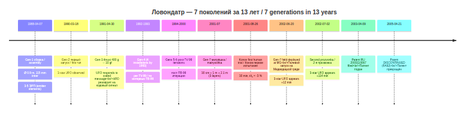

*Timeline of the 7 Lovondatr generations. / Хронология 7 поколений Ловондатр.*

**Note on source-merges / Примечание о мерджах источников:** Transcripts 08 and 20_ZigelevskyChteniya are two Whisper passes of the same 49th Zigelevsky Readings lecture of 25 March 2017 (`ZIG-17`, Chernobrov's final public lecture). Transcripts 06 and 20_SlediPutesh_Ch2 are the two halves of a single continuous 5h51m Narodnoye Slavyanskoye Radio broadcast of 21–22 October 2015 (`SLEDY-55` = `SLEDY-55-C1` + `SLEDY-55-C2`). / Транскрипты 08 и 20_ZigelevskyChteniya — два прохода Whisper одной и той же лекции 49-х Зигелевских чтений 25.03.2017 (`ZIG-17`, финальная публичная лекция). Транскрипты 06 и 20_SlediPutesh_Ch2 — две половины одного непрерывного 5h51m эфира Народного Славянского Радио 21–22.10.2015 (`SLEDY-55`).

---

## QUICK NAVIGATION / БЫСТРАЯ НАВИГАЦИЯ

| Section / Раздел | Purpose / Назначение | File / Файл | Status / Статус |
|------------------|----------------------|-------------|-----------------|
| Main Technical Reference / Главный технический справочник | Unified bilingual synthesis of every technical claim / Единый двуязычный синтез всех технических утверждений | [`analysis/MASTER_chernobrov_claims.md`](analysis/MASTER_chernobrov_claims.md) | ✅ Available / Доступно |
| Appearances Catalog / Каталог выступлений | Complete chronological catalog 1988–2017 / Полный хронологический каталог 1988–2017 | [`catalog/interviews.md`](catalog/interviews.md) | ✅ Available / Доступно |
| Raw Transcripts / Сырые транскрипты | 21 Whisper-large-v3 RU transcriptions (19 distinct lectures) / 21 транскрипция Whisper-large-v3 (19 различных лекций) | [`transcripts/`](transcripts/) | ✅ Available / Доступно |
| Per-Interview Analysis / Анализ по интервью | 9 per-transcript files / 9 файлов по транскриптам | [`analysis/per-interview/`](analysis/per-interview/) | ✅ Available / Доступно |
| Topical Analysis / Тематический анализ | 8 topical restructurings / 8 тематических перегруппировок | [`analysis/topical/`](analysis/topical/) | ✅ Available / Доступно |
| Per-Book Analysis / Анализ по книгам | 16 merged `B-*` book references / 16 объединённых справочников `B-*` | [`analysis/books/`](analysis/books/) | ✅ Available / Доступно |
| Article & Patent Analysis / Анализ статей и патентов | `F-12R`, `NE-03`, `TM-02`, `PAT-RF2003` reviews / Ревью `F-12R`, `NE-03`, `TM-02`, `PAT-RF2003` | [`analysis/articles/`](analysis/articles/) | ✅ Available / Доступно |
| Case Catalogs / Каталоги случаев | Crop pictograms + Chernobrov-specific case registry / Пиктограммы + реестр случаев Черноброва | [`analysis/cases/`](analysis/cases/) | ✅ Available / Доступно |
| External Research / Внешние исследования | Perplexity + user-provided meta-research / Perplexity + пользовательский мета-анализ | [`analysis/external-research/`](analysis/external-research/) | ✅ Available / Доступно |
| Visual Diagrams / Визуальные схемы | Mermaid sources and rendered SVG/PNG diagrams / Исходники Mermaid и отрендеренные SVG/PNG-схемы | [`diagrams/`](diagrams/) | ✅ Available / Доступно |
| QA Review / QA-ревью | Hallucination audit (Gates 1–8) / Аудит галлюцинаций (Gates 1–8) | [`analysis/QA_REVIEW.md`](analysis/QA_REVIEW.md) | ✅ Available / Доступно |

---

## What's in this repo / Что внутри репозитория

```
chernobrov-archive/
├── README.md                               ← you are here / вы здесь
├── CHANGELOG.md                            ← version history / история версий
│
├── catalog/                                ← meta-research: list of appearances
│   │                                         мета-исследование: список выступлений
│   ├── interviews.md                       Complete chronological catalog /
│   │                                       Полный хронологический каталог
│   ├── research-1988-2001.md               Period 1: MAI → Kosmopoisk → Lovondatr-1…6 /
│   │                                       Период 1: МАИ → «Космопоиск» → Ловондатр-1…6
│   ├── research-2001-2010.md               Period 2: Lovondatr-7 + patent + MG tests /
│   │                                       Период 2: Ловондатр-7 + патент + полевые опыты МГ
│   └── research-2010-2017.md               Period 3: VBCh 2010 + late lectures + death /
│                                           Период 3: ВБЧ 2010 + поздние лекции + смерть
│
├── transcripts/                            ← raw Whisper-large-v3 RU transcriptions /
│   │                                         сырые транскрипции Whisper-large-v3 (RU)
│   ├── 01_Chernobrov_MashinaVremeni_2h37.txt
│   ├── ... (21 files, ~2.4 MB / 21 файл, ~2.4 МБ)
│   └── 20_ZigelevskyChteniya_49_3zvNLO_2017-03-25_22min.txt
│
├── diagrams/                               ← visual components (Mermaid + SVG) /
│   │                                         визуальные компоненты (Mermaid + SVG)
│   ├── *.mmd, *.svg
│   └── rendered/*.png
│
└── analysis/                               ← extracted technical content /
    │                                         извлечённое техническое содержание
    ├── MASTER_chernobrov_claims.md         ⭐ Unified bilingual synthesis /
    │                                         Единый двуязычный синтез
    ├── QA_REVIEW.md                        Hallucination audit (Gates 1–8) /
    │                                       Аудит галлюцинаций (Gates 1–8)
    ├── FINAL_REVIEW.md                     Final review / Финальное ревью
    │
    ├── per-interview/                      ← per-source detailed technical blocks /
    │                                         подробные технические блоки по источникам
    │
    ├── topical/                            ← same content grouped by topic /
    │                                         то же содержание по темам
    │
    ├── books/                              ← 16 merged `B-*` references /
    │                                         16 объединённых справочников `B-*`
    │
    ├── articles/                           ← article and patent reviews /
    │                                         ревью статей и патентов
    │
    ├── cases/                              ← pictogram + case registries /
    │                                         реестры пиктограмм и случаев
    │
    └── external-research/                  ← Perplexity + user-provided meta-research /
                                              Perplexity + пользовательский мета-анализ
```

---

## Start here / С чего начать

**EN — If you want the technical claims:** → [`analysis/MASTER_chernobrov_claims.md`](analysis/MASTER_chernobrov_claims.md) (bilingual EN+RU)

**RU — Если нужны технические утверждения:** → [`analysis/MASTER_chernobrov_claims.md`](analysis/MASTER_chernobrov_claims.md) (двуязычный EN+RU)

**EN — If you want the raw transcripts:** → [`transcripts/`](transcripts/)
**RU — Если нужны сырые транскрипты:** → [`transcripts/`](transcripts/)

**EN — If you want per-book analyses:** → [`analysis/books/`](analysis/books/)
**RU — Разбор по книгам:** → [`analysis/books/`](analysis/books/)

**EN — If you want the list of all known appearances (including those not yet transcribed):** → [`catalog/interviews.md`](catalog/interviews.md)
**RU — Если нужен полный список выступлений (включая ещё не транскрибированные):** → [`catalog/interviews.md`](catalog/interviews.md)

**EN — If you want to see what was verified vs. possibly hallucinated:** → [`analysis/QA_REVIEW.md`](analysis/QA_REVIEW.md)
**RU — Если хотите увидеть, что было верифицировано, а что — возможно, галлюцинация:** → [`analysis/QA_REVIEW.md`](analysis/QA_REVIEW.md)

---

## The corpus at a glance / Корпус с одного взгляда

| Category / Категория | Count / Кол-во | Size / Объём | Notes / Примечания |
|---|---|---|---|
| YouTube lectures transcribed / Лекции YouTube | 21 transcripts (19 distinct) | ~2.4 MB | Whisper-large-v3 RU |
| Flibusta FB2 books / Книги FB2 | 32 | 37 MB | Extracted, indexed / извлечено, индексировано |
| Major PDFs / Крупные PDF | 5 | 318 MB | All OCR-complete (v0.5.0) / Все OCR-обработаны |
| HTML articles + patent pages / HTML-статьи | 10 | ~2 MB | Processed / обработано |
| External research / Внешние исследования | 3 | ~100 KB | Integrated / интегрировано |
| **Merged book analyses (`B-*`) / Объединённые анализы книг** | **16** | ~1.15 MB | ✅ Available / Доступно |
| **Per-interview / topical / article / case analyses** | **22 files** | ~1.36 MB | ✅ Available / Доступно |
| **MASTER + QA_REVIEW + FINAL_REVIEW** | **3** | ~0.2 MB | ✅ Available / Доступно |

---

## Master document structure / Структура мастер-документа

**EN:** The [`MASTER_chernobrov_claims.md`](analysis/MASTER_chernobrov_claims.md) unifies Chernobrov's claims across 29 years by **topic**, not by source — so you can trace how each device parameter, field-test interpretation, and theoretical construct evolved over time.

**RU:** Документ [`MASTER_chernobrov_claims.md`](analysis/MASTER_chernobrov_claims.md) объединяет утверждения Черноброва за 29 лет по **темам**, а не по источникам — так видно, как эволюционировал каждый параметр устройства, интерпретация полевых тестов и теоретическая конструкция во времени.

1. **Lovondatr devices MV-1 … MV-7 / Устройства Ловондатр МВ-1 … МВ-7** — evolution 1988–2005, nested solenoidal shells / эволюция 1988–2005, вложенные соленоидальные оболочки
2. **Magnetic-field topology / Топология магнитного поля** — nested matryoshka geometry, f = c/d resonance rule / геометрия «матрёшки», правило резонанса f = c/d
3. **Human trial (26 Aug 2001) / Человеческое испытание 26.08.2001** — Ivan Konov, ≈−3 % time shift, Lovondatr-7 / Иван Конов, ≈−3 % сдвиг, Ловондатр-7
4. **Medveditskaya Ridge field tests / Полевые испытания Медведицкой гряды** — 50 expeditions, ~906 volunteers, 1982–2014 / 50 экспедиций, ~906 добровольцев, 1982–2014
5. **RU Patent No. 2003110067 / Патент РФ № 2003110067** — application 2003, prosecution discontinued 2005, never granted / заявка 2003, прекращена 2005, не выдана
6. **Crop pictograms / Пиктограммы на полях** — 153 authentic pictograms 1950–2010 (≈25 % forgery rejection) / 153 аутентичные пиктограммы 1950–2010 (≈25 % отбраковка)
7. **Three-star UFO / Трёхзвёздное НЛО** — «Belgian triangle» morphology, 80×80×50 m, 0 → 20 000+ km/h / морфология «Бельгийского треугольника», 80×80×50 м, 0 → 20 000+ км/ч
8. **Body-as-Lovondatr thesis (`B-VBCH10` 2010) / Тезис «организм как Ловондатр»** — stress-induced human field as spontaneous time-modifier / стресс-индуцированное поле человека как самопроизвольный темпомодификатор
9. **Tunguska chrono-deceleration (Zolotov 1960s, Kosmopoisk 1996) / Тунгусское замедление времени** — physics anchor predating Lovondatr by 28 years / физический якорь, предшествующий Ловондатру на 28 лет
10. **Severomorsk Soviet Philadelphia replica (1980s) / Северомoрский советский повтор «Элдриджа»** — Минсредмаш + Минэлектронпром anti-SDI programme / анти-СОИ программа
11. **Known Contradictions / Evolution Flags / Известные противоречия / Маркеры эволюции** — parameter drift across publications / дрейф параметров между публикациями

---

## Source code key (used throughout analysis) / Ключ кодов источников

**EN:** Used throughout the analysis. Prefix `B-` for books; lecture codes by venue + year.

**RU:** Используется во всём анализе. Префикс `B-` — книга; лекционные коды — по месту проведения и году.

### Books (`B-*`) / Книги

| Code / Код | Source / Источник | Year / Год | File / Файл |
|---|---|---|---|
| B-TV99 / B-TPV01 | Secrets of Time / Тайны времени + Secrets and Paradoxes of Time / Тайны и парадоксы времени | 1999 / 2001 | [`B-TV99_TPV01_core_time_books.md`](analysis/books/B-TV99_TPV01_core_time_books.md) |
| B-PV01 | Time Travel / Путешествия во времени | 2001 | [`B-PV01_puteshestviya_vo_vremeni.md`](analysis/books/B-PV01_puteshestviya_vo_vremeni.md) |
| B-MG05 | Medveditskaya Ridge / Медведицкая гряда | 2005 | [`B-MG05_medveditskaya_gryada.md`](analysis/books/B-MG05_medveditskaya_gryada.md) |
| B-HRON03 | Chronicles of UAP Visits / Хроники визитов НЛО | 2003 | [`B-HRON03_hroniki_vizitov_NLO.md`](analysis/books/B-HRON03_hroniki_vizitov_NLO.md) |
| B-KP | Crop Circles / Круги на полях | — | [`B-KP_krugi_na_polyakh.md`](analysis/books/B-KP_krugi_na_polyakh.md) |
| B-MPN | UAP Landing Sites / Места посадок НЛО | — | [`B-MPN_mesta_posadok_NLO.md`](analysis/books/B-MPN_mesta_posadok_NLO.md) |
| B-EAYAV | Encyclopedia of Anomalous Phenomena / Энциклопедия аномальных явлений | — | [`B-EAYAV_enciklopediya_anomalnykh.md`](analysis/books/B-EAYAV_enciklopediya_anomalnykh.md) |
| B-EZM | Encyclopedia of Mysterious Places / Энциклопедия загадочных мест Земли | — | [`B-EZM_zagadochnye_mesta_zemli.md`](analysis/books/B-EZM_zagadochnye_mesta_zemli.md) |
| B-SS | Stalker's Handbook / Справочник сталкера | — | [`B-SS_spravochnik_stalkera.md`](analysis/books/B-SS_spravochnik_stalkera.md) |
| B-SVL | Existing Against Logic / Существуют вопреки логике | — | [`B-SVL_sushchestvuyut_vopreki_logike.md`](analysis/books/B-SVL_sushchestvuyut_vopreki_logike.md) |
| B-TMV | Tunguska Meteorite and Time / Тунгусский метеорит и время | — | [`B-TMV_tungusskiy_meteorit_vremya.md`](analysis/books/B-TMV_tungusskiy_meteorit_vremya.md) |
| B-TPM | Mysteries of Parallel Worlds / Тайны параллельных миров | — | [`B-TPM_parallelnye_miry.md`](analysis/books/B-TPM_parallelnye_miry.md) |
| B-PMF | Podmoskovye: Phenomena / Подмосковье: феномены | — | [`B-PMF_podmoskove.md`](analysis/books/B-PMF_podmoskove.md) |
| B-SMALL | Short books, batches 1–2 / Короткие книги, батч 1–2 | — | [`B-SMALL_batch1.md`](analysis/books/B-SMALL_batch1.md), [`B-SMALL_batch2.md`](analysis/books/B-SMALL_batch2.md) |
| **B-EUFO** ⭐ | **Encyclopedia of Ufology / Энциклопедия уфологии** (Вече, 464 pp.) | **2007** | [`B-EUFO_enciklopediya_ufologii.md`](analysis/books/B-EUFO_enciklopediya_ufologii.md) |
| **B-VBCH10** ⭐ | **Time, Immortality, Human: Stalker's Report / Время, Бессмертие, Человек** (РИПОЛ классик, 320 pp.) | **2010** | merged from [`chunks/B-VBCH10_p{1,2,3}_extract.md`](analysis/books/chunks/) |

### Transcripts / Транскрипты

| Code / Код | Venue + year / Место + год | Transcript / Транскрипт |
|---|---|---|
| MUR-14 | Murom, 2014 / Муром, 2014 | [`13_Hronoput_Murom_2h37.txt`](transcripts/13_Hronoput_Murom_2h37.txt) |
| HRON-14 | Hronoput, 2014 / Хронопут, 2014 | [`07_MashinaVremeni_Hronoput_3h04.txt`](transcripts/07_MashinaVremeni_Hronoput_3h04.txt) |
| LAI-14 | LAI lecture, 2014 / Лекция в ЛАИ, 2014 | [`02_Chernobrov_MashinaVremeni_LAI_1h46.txt`](transcripts/02_Chernobrov_MashinaVremeni_LAI_1h46.txt) |
| MV-46 | «Time Machine» lecture, 46 min / Лекция «Машина времени», 46 мин | [`12_MashinaVremeni_Chernobrov_46min.txt`](transcripts/12_MashinaVremeni_Chernobrov_46min.txt) |
| MG-DOC-17 | Medveditskaya Ridge: 2017 documentary / Медведицкая гряда: докфильм 2017 | [`15_MedveditskayaGryada_docfilm_2017_32min.txt`](transcripts/15_MedveditskayaGryada_docfilm_2017_32min.txt) |
| **ZIG-17** ⭐ | **49th Zigelevsky Readings, Moscow, 25 March 2017 — final public lecture / 49-е Зигелевские чтения, Москва, 25.03.2017 — финальная публичная лекция** (2 months before death / за 2 месяца до смерти) | [`20_ZigelevskyChteniya_49_3zvNLO_2017-03-25_22min.txt`](transcripts/20_ZigelevskyChteniya_49_3zvNLO_2017-03-25_22min.txt) + [`08_3zvezdnie_NLO_22min.txt`](transcripts/08_3zvezdnie_NLO_22min.txt) (same source, two Whisper passes) |
| **SLEDY-55** ⭐ | **Narodnoye Slavyanskoye Radio, 21–22 Oct 2015, single 5h51m broadcast / Народное Славянское Радио, 21–22.10.2015, один эфир 5h51m** «How to find traces of Time travellers» / «Как найти следы путешественников во Времени» | [`06_SlediPutesh_2h55.txt`](transcripts/06_SlediPutesh_2h55.txt) (Ч1) + [`20_SlediPutesh_Ch2_2h55.txt`](transcripts/20_SlediPutesh_Ch2_2h55.txt) (Ч2) |
| KP-LEC-13 | «Crop Circles» lecture, 2013 / «Круги на полях», 2013 | [`16_KrugiNaPolyakh_2013_2h57.txt`](transcripts/16_KrugiNaPolyakh_2013_2h57.txt) |
| KP-N24-58 | Kosmopoisk on N24 / Космопоиск на N24 | [`18_Kosmopoisk_MashinaVremeni_N24_58min.txt`](transcripts/18_Kosmopoisk_MashinaVremeni_N24_58min.txt) |
| NLO-DPL-24 | «UAP: a share of truth» / «НЛО: доля правды» | [`17_NLO_dolya_pravdy_2h24.txt`](transcripts/17_NLO_dolya_pravdy_2h24.txt) |

### Articles / Patents / Статьи / Патенты

| Code / Код | Source / Источник | File / Файл |
|---|---|---|
| TM-02 | «Time Machine 2002» article / статья | [`articles_and_patent.md`](analysis/articles/articles_and_patent.md) |
| NE-03-PG | «New Energy» 2003, patent-grade writeup / «Новая энергетика» 2003 | [`articles_and_patent.md`](analysis/articles/articles_and_patent.md) |
| NE-03-FP | «New Energy» 2003, Frolov paper / «Новая энергетика» 2003, статья Фролова | [`articles_and_patent.md`](analysis/articles/articles_and_patent.md) |
| PAT-RF2003 | RU application 2003110067 (discontinued 2005) / Заявка РФ 2003110067 (прекращена 2005) | [`articles_and_patent.md`](analysis/articles/articles_and_patent.md) |
| F-12R | Faraday 12rus patent paper | [`F-12R_faraday_patent_paper.md`](analysis/articles/F-12R_faraday_patent_paper.md) |

---

## Key findings (highlights from the master doc) / Ключевые находки (выдержки из мастер-документа)

**EN:**
- **Lovondatr-7 (July 2001)** — three-layer matryoshka with ≈30 cm / 1 m / 2.1 m shells; first human trial by Ivan Konov on 26 Aug 2001 showed ≈−3 % time shift over 30 minutes.
- **Formula f = c / d** — chamber resonance frequency tied to inner diameter; d = 7 mm gives ≈43 GHz (per the Frolov patent paper and NET-03 2003 report).
- **RU Patent No. 2003110067** — application filed 2003, prosecution discontinued 2005; patent **never granted**.
- **June–July 2002 MG field test** — a three-star UFO appeared 12–114 min after device pulses.
- **Lethal threshold 1.5 s** — time-rate differential across the body exceeding 1.5 s per biological cycle is lethal (**not 2 s** as stated in some short summaries).
- **50 expeditions to Medveditskaya Ridge** between 1982 and 2014, ≈906 volunteers.
- **153 authentic pictograms** catalogued for 1950–2010 (after ≈25 % forgery rejection).
- **Safety rule #1** — never open the chamber during a run; origin: mouse deaths caused by desynchronisation rupture.
- **1999–2017 forecast for piloted time machine** — Chernobrov repeatedly forecast «in 10–15 years» in public; not delivered by his death in 2017.
- **Tunguska chrono-deceleration (Zolotov 1960s)** confirmed by Kosmopoisk in 1996 (per `B-EUFO` §6.5) — single most consequential physics anchor predating Lovondatr lab work by 28 years.
- **Severomorsk Soviet Philadelphia replica (1980s)** — Минсредмаш + Минэлектронпром anti-SDI programme; one Northern Fleet cruiser, recorded by US spy satellites; Soviet participant approached Kosmopoisk in 2000 after publication of `B-TV99`.
- **Body-as-spontaneous-Lovondatr thesis (`B-VBCH10` 2010)** — central unification claim: stress-induced human field equivalent to device output, extending cm to tens of cm with selectivity; introduces «ОУВ» (Organ of Time-Management) as hypothetical distributed neural-field function.
- **Final public lecture ZIG-17 (25 March 2017, 2 months before death)** — closing public position on the three-star UFO: 80×80×50 m morphology, 0 → 20 000+ km/h in 1–2 s, «peaceable and non-confrontational», new case anchor 10–11 October 2001 (≈200 Kosmopoisk groups tracking one craft → vanished near Arzamas-16 / VNIIEF). Classifies object as «technogenic» but does **not** identify it with the time machine.

**RU:**
- **Ловондатр-7 (июль 2001)** — трёхслойная «матрёшка» со слоями ≈30 см / 1 м / 2.1 м; первое человеческое испытание — Иван Конов, 26 августа 2001, замедление около −3 % за 30 минут.
- **Формула f = c / d** — частота резонанса камеры связана с её внутренним диаметром; при d = 7 мм даёт ≈43 ГГц (по материалам статьи Фролова и докладу NET-03, 2003).
- **Патент РФ № 2003110067** — заявка подана в 2003 году, делопроизводство прекращено в 2005 году; патент **не выдан**.
- **Июнь–июль 2002, полевые испытания МГ** — трёхзвёздный НЛО появился спустя 12–114 минут после импульсного запуска установки.
- **Смертельный порог 1.5 сек** — различие темпа времени между частями тела более 1.5 с / живой цикл вызывает летальный эффект (**не 2 сек**, как в ряде коротких пересказов).
- **50 экспедиций на Медведицкую гряду** в 1982–2014 гг., около 906 добровольцев.
- **153 аутентичные пиктограммы** каталогизированы за 1950–2010 (после отбраковки ≈25 % подделок).
- **Правило безопасности №1** — никогда не вскрывать камеру во время работы; происхождение — смерти подопытных мышей при разрыве синхронизации.
- **Прогноз «пилотируемой МВ» 1999–2017** — Чернобров неоднократно публично давал срок «через 10–15 лет»; к моменту его смерти (2017) прогноз не реализован.
- **Тунгусское замедление Времени (Золотов, 1960-е)** подтверждено «Космопоиском» в 1996 г. (`B-EUFO` §6.5) — важнейший физический якорь, предшествующий лабораторной работе по Ловондатру на 28 лет.
- **Северомoрский советский повтор «Элдриджа» (1980-е)** — Минсредмаш + Минэлектронпром, анти-СОИ; один крейсер Северного флота, зафиксировано американскими спутниками-разведчиками; советский участник обратился в «Космопоиск» в 2000 г. после публикации `B-TV99`.
- **Тезис «организм как самопроизвольная Ловондатр» (`B-VBCH10` 2010)** — центральное объединяющее утверждение: стресс-индуцированное поле человека эквивалентно выходу устройства, распространяется на см — десятки см, с избирательностью; вводится понятие «ОУВ» (Орган Управления Временем).
- **Финальная публичная лекция ZIG-17 (25.03.2017, за 2 месяца до смерти)** — закрывающая публичная позиция по трёхзвёздному НЛО: морфология 80×80×50 м, 0 → 20 000+ км/ч за 1–2 с, «миролюбив и неконфликтен», новый case-anchor 10–11.10.2001 (≈200 групп «Космопоиска», отслеживание одного объекта → пропал у Арзамаса-16 / ВНИИЭФ). Квалифицирует объект как «техногенный», но **не** отождествляет с машиной времени.

---

## Visual Index / Визуальный указатель

**EN:** For `.mmd` sources — see [`diagrams/`](diagrams/); for PNG renders — [`diagrams/rendered/`](diagrams/rendered/).

**RU:** Для исходников `.mmd` — см. [`diagrams/`](diagrams/); для PNG-рендеров — [`diagrams/rendered/`](diagrams/rendered/).

### Architecture & operating principles / Архитектура и принципы работы

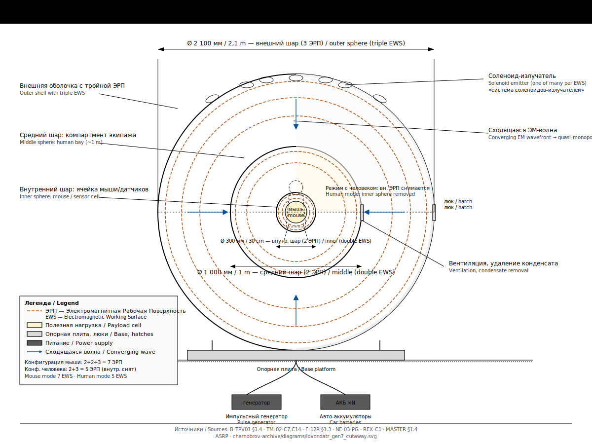
*Lovondatr-7 cutaway, 30 cm / 1 m / 2.1 m matryoshka. / Разрез Ловондатр-7, матрёшка 30 см / 1 м / 2,1 м.*

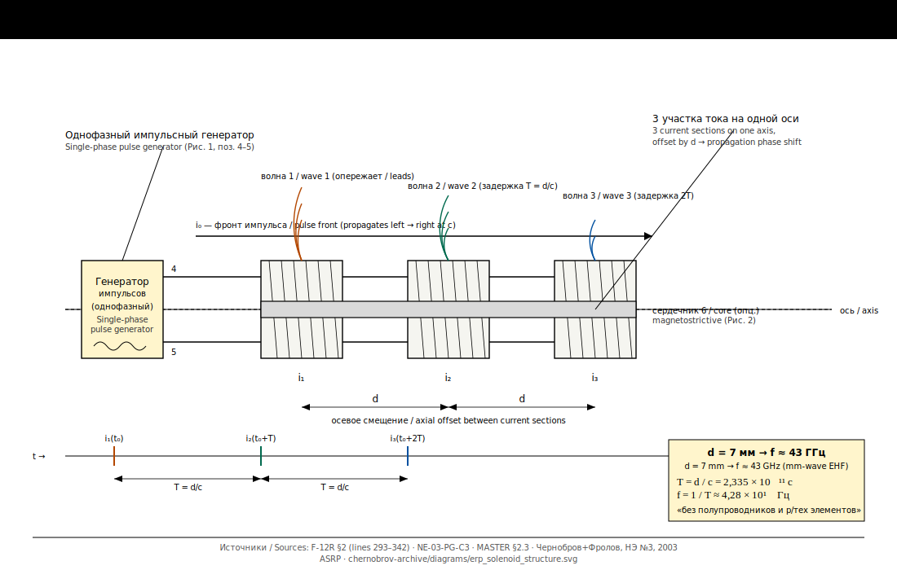
*ЭРП solenoid-emitter structure. / Структура соленоидов-излучателей ЭРП.*

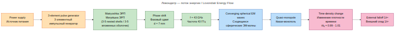
*Operating-principle flow of the device. / Цепочка принципа работы установки.*

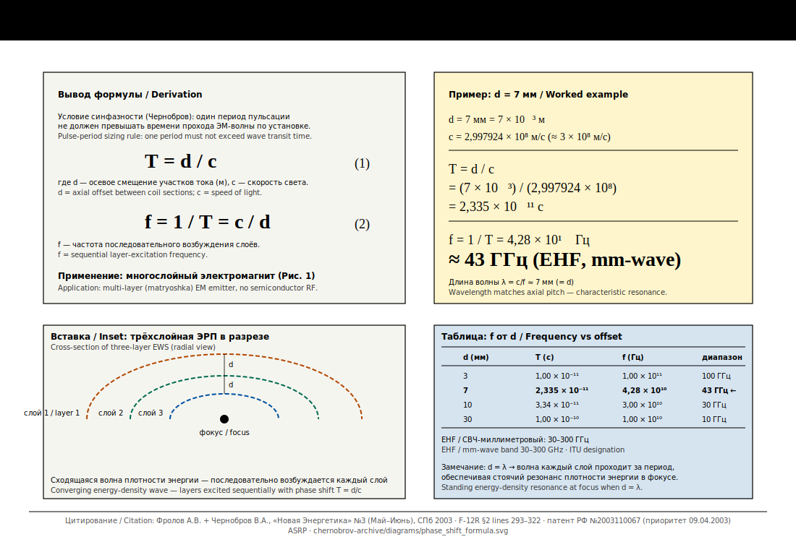
*Derivation of pulsation frequency rule f = c/d. / Вывод правила частоты пульсации f = c/d.*

### Timeline & methodology / Хронология и методология

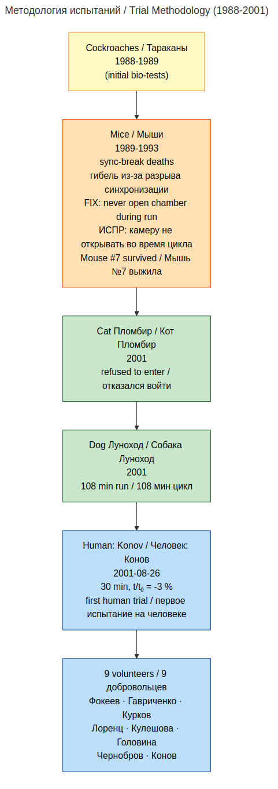
*Subject progression from insects to humans. / Прогрессия испытуемых от насекомых к человеку.*

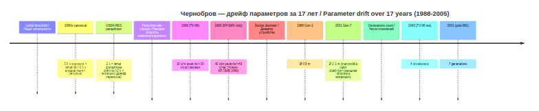
*Drift of key parameters across publications. / Дрейф ключевых параметров между публикациями.*

### Field deployment & source cross-validation / Полевое развёртывание и сверка источников

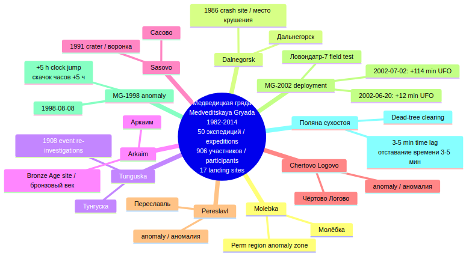
*Kosmopoisk field-deployment map. / Карта полевого развёртывания «Космопоиска».*

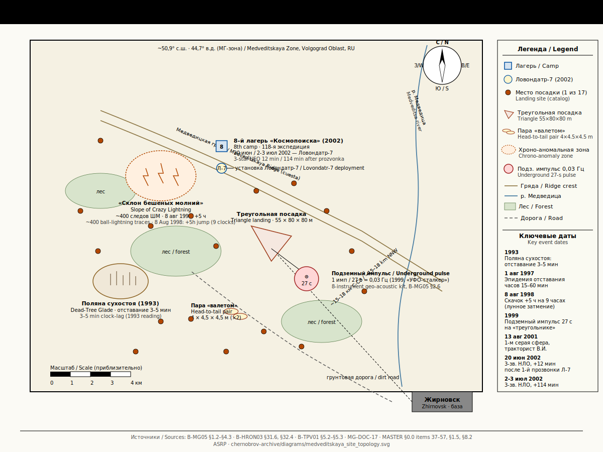
*Geographic mapping of key MG anomaly points. / Геопривязка ключевых аномальных точек МГ.*

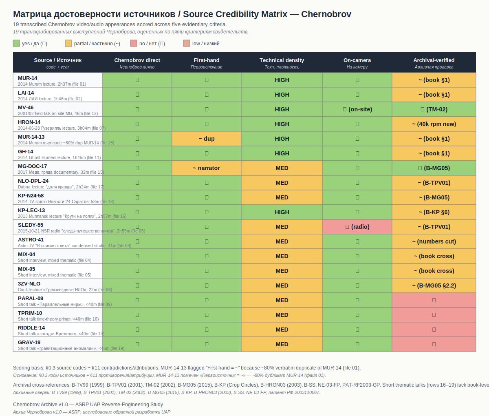
*19 transcripts × 5 credibility criteria. / 19 транскриптов × 5 критериев достоверности.*

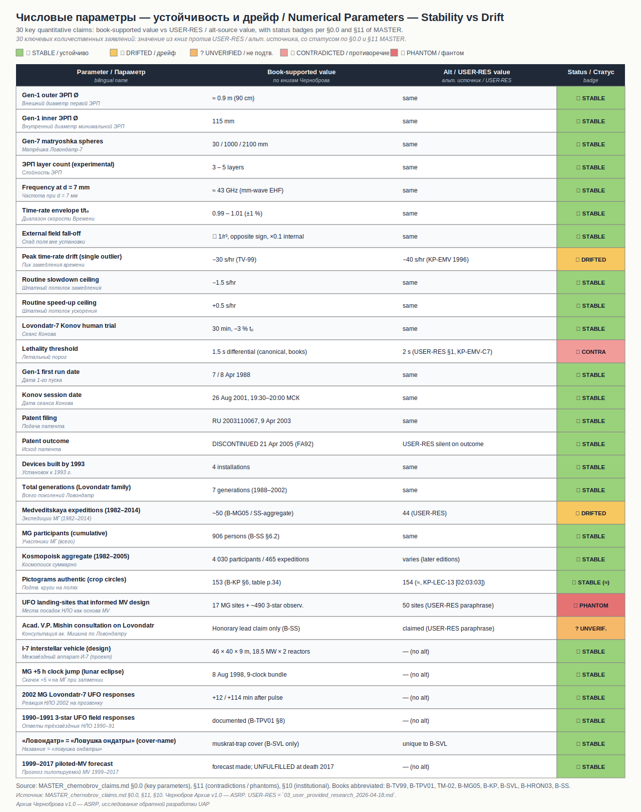
*Consolidated table of 30 key numerical parameters. / Сводная таблица 30 ключевых числовых параметров.*

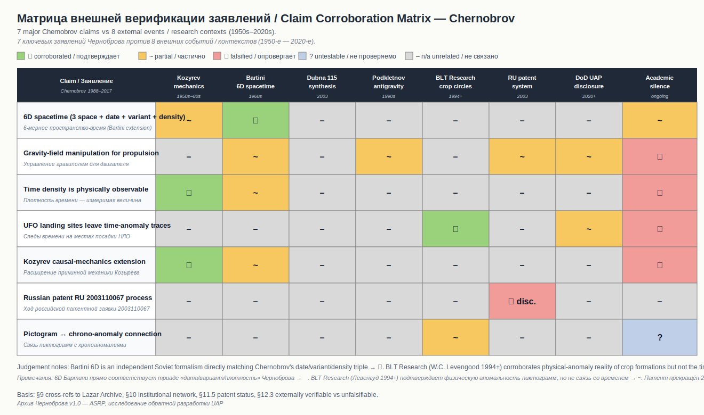
*Mapping Chernobrov claims to independent external sources. / Соответствие заявлений Черноброва независимым внешним источникам.*

---

## Scope and limitations / Объём и ограничения

### What's in scope / Что входит в объём

**EN:**
- Russian-language lectures, interviews, documentaries 2011–2018 (Whisper transcriptions)
- All Chernobrov books available in FB2 on Flibusta
- Articles in the journals «New Energy» and «Trinitarian Academy»
- RU patent application 2003110067 and related materials
- Kosmopoisk field research (Medveditskaya Ridge, pictograms)

**RU:**
- Русскоязычные лекции, интервью, докфильмы 2011–2018 (Whisper-транскрипции)
- Все книги Черноброва, доступные на Флибусте в FB2
- Статьи в журналах «Новая энергетика» и «Академия тринитаризма»
- Заявка на патент РФ 2003110067 и сопутствующие материалы
- Полевые исследования «Космопоиска» (Медведицкая гряда, пиктограммы)

### What's not in scope / Что не входит в объём

**EN:**
- English-language press about Chernobrov
- Internal Kosmopoisk correspondence
- Third-party skeptical analysis (archive records claims, does not evaluate them)

**RU:**
- Англоязычная пресса о Черноброве
- Внутренняя переписка «Космопоиска»
- Сторонние скептические разборы (архив фиксирует утверждения, а не оценивает их)

### Known gaps / Известные пробелы

**EN:**
- Video/audio recordings of 1990s and 2000s lectures and conferences are mostly lost or not publicly accessible.
- See [`catalog/interviews.md`](catalog/interviews.md) for the complete list of known appearances.

**RU:**
- Видео-/аудиозаписи лекций и конференций 1990-х и 2000-х в основном утрачены либо недоступны публично.
- См. [`catalog/interviews.md`](catalog/interviews.md) для полного списка известных выступлений.

---

## Related archives / Связанные архивы

- **EN:** Cross-archive synthesis: [`../analysis/cross-archive-synthesis.md`](../analysis/cross-archive-synthesis.md) — shared themes across Lazar / Chernobrov / Dubna.
- **RU:** Кросс-архивный синтез: [`../analysis/cross-archive-synthesis.md`](../analysis/cross-archive-synthesis.md) — общие темы Лазар / Чернобров / Дубна.

---

## Citation / Цитирование

**EN:** If you use this archive in research, please link back to the repository. This is a working research archive. Corrections and additions welcome via pull request.

**RU:** Если вы используете этот архив в исследовании, пожалуйста, дайте ссылку на репозиторий. Это рабочий исследовательский архив. Исправления и дополнения приветствуются через pull request.

---

## ASRP ECOSYSTEM / ЭКОСИСТЕМА ASRP

<div align="center">

### Parent Repository / Родительский Репозиторий

</div>

| Repository / Репозиторий | Direction / Направление | Link / Ссылка |
|-------------------------|------------------------|---------------|
| **UAP Reverse Engineering Study / Исследование по Реверс-Инжинирингу НАЯ** | UAP fragment analysis (AI + archival + ECP) / Анализ фрагмента НАЯ (ИИ + архив + КП) | [View / Просмотр](https://github.com/AdvancedScientificResearchProjects/UAP_Reverse_Engineering_Study) |

<div align="center">

### Related Research Repositories / Связанные Исследовательские Репозитории

</div>

| Repository / Репозиторий | Direction / Направление | Link / Ссылка |
|-------------------------|------------------------|---------------|
| **Hyperbolic Field Blood Plasma Study / Исследование Плазмы Крови** | Blood plasma coagulation / Свёртываемость плазмы | [View / Просмотр](https://github.com/AdvancedScientificResearchProjects/Hyperbolic_Field_BloodPlasma_Study) |
| **Hyperbolic Field Agricultural Study / Сельскохозяйственное Исследование** | Plant & seed growth / Рост растений и семян | [View / Просмотр](https://github.com/AdvancedScientificResearchProjects/Hyperbolic_Field_Agricultural_Study) |
| **Hyperbolic Field DAAT Crystal Study / Исследование Кристаллов DAAT** | Crystal-human interaction / Взаимодействие кристалл-человек | [View / Просмотр](https://github.com/AdvancedScientificResearchProjects/Hyperbolic_Field_DAAT_Crystal_Study) |
| **Hyperbolic Field Saccharomyces Study / Исследование Дрожжей Saccharomyces** | Yeast fermentation / Ферментация дрожжей | [View / Просмотр](https://github.com/AdvancedScientificResearchProjects/Hyperbolic_Field_SaccharomycesCerevisiae_Study) |
| **ASRP.art** | Art & consciousness / Искусство и сознание | [View / Просмотр](https://github.com/AdvancedScientificResearchProjects/Axionetic_Sensing_Reactions_Platform_in_Art) |

---

<div align="center">

**ASRP RESEARCH STANDARD v2.1**

**Organization / Организация:** Advanced Scientific Research Projects (ASRP)

</div>


---

> **Support / Поддержать:** if this work is valuable to you — https://asrp.tech/en/patrons
