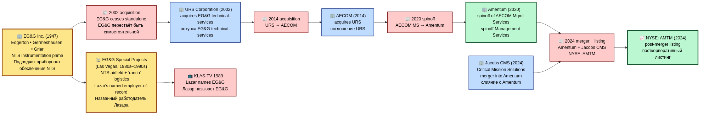
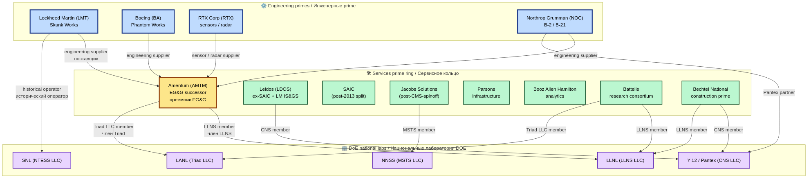
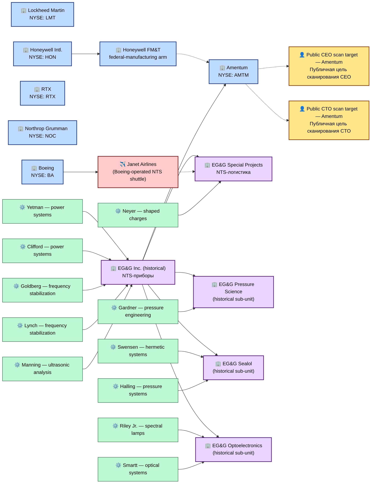
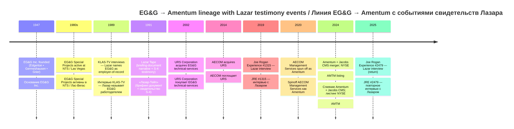
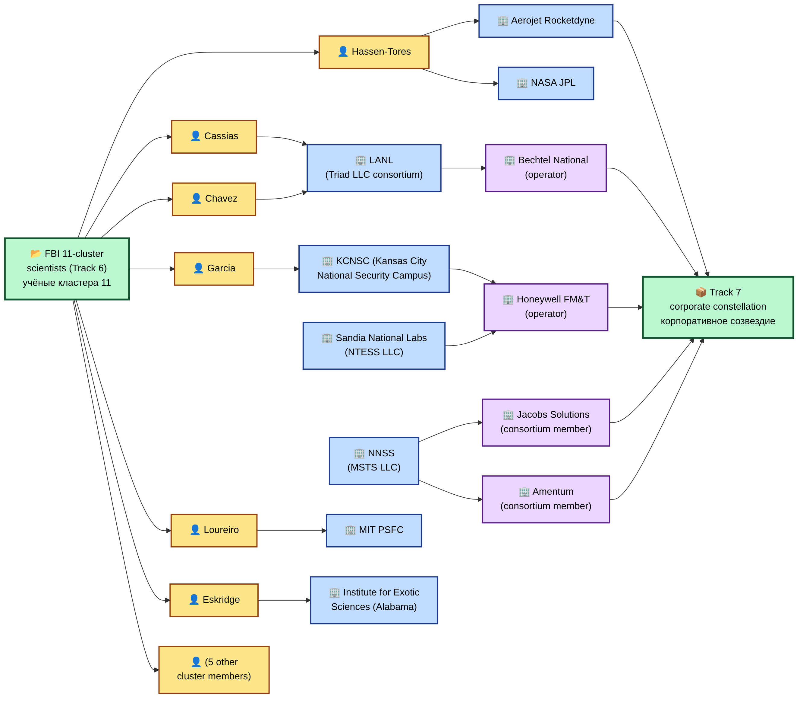
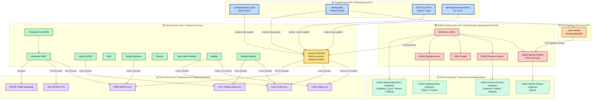

# Corporate / Economic Analysis — UAP reverse-engineering industry / Корпоративный / экономический анализ — индустрия реверс-инжиниринга UAP

A research sub-archive documenting, with public-source provenance only, the **defense-prime contractor constellation** historically and currently associated with classified aerospace research-and-development programmes that intersect the UAP record. Central thesis: the EG&G corporate genealogy — EG&G (1947) → URS (2002) → AECOM (2014) → **Amentum** (2020), with the Jacobs Critical Mission Solutions merger (2024) — is the documented Lazar-S-4 site contractor lineage, and Amentum is its present-day successor. Around Amentum stand the four engineering primes (Lockheed Martin, Boeing, RTX, Northrop Grumman) and the services-prime ring (Leidos, SAIC, Jacobs, Parsons, BAH) that operate the DoE national laboratories.

Отдельный исследовательский подархив, документирующий — исключительно по публичным источникам — **созвездие prime-подрядчиков обороны**, исторически и в настоящее время связанных с засекреченными авиакосмическими R&D-программами, пересекающимися с UAP-нарративом. Центральный тезис: корпоративная генеалогия EG&G — EG&G (1947) → URS (2002) → AECOM (2014) → **Amentum** (2020), с поглощением Jacobs Critical Mission Solutions (2024) — является задокументированной линией подрядчика площадки Lazar S-4, и Amentum — её современный преемник. Вокруг Amentum располагаются четыре инженерных prime-подрядчика (Lockheed Martin, Boeing, RTX, Northrop Grumman) и сервисное кольцо (Leidos, SAIC, Jacobs, Parsons, BAH), оперирующее национальными лабораториями DoE.

---

## Premise / Предпосылка

**EN:** Bob Lazar has stated since 1989 that during his time at S-4 (Papoose Lake / Area 51) his employer of record was **EG&G**. EG&G's services line went through three corporate roll-ups over 22 years and now sits inside **Amentum Holdings (NYSE: AMTM)**. This sub-archive documents the corporate-genealogy chain end-to-end, profiles the named primes that surround it, and links the chain to two adjacent UAP-relevant data sets in this repository: the Track-2 Lazar-S-4 testimony and the Track-6 FBI 11-scientist cluster (whose institutional employers map heavily onto this same constellation). The goal is to render the industrial layer beneath the UAP record as a navigable graph — not to assert any specific reverse-engineering claim.

**RU:** Боб Лазар с 1989 года утверждает, что в период работы на S-4 (озеро Papoose / Area 51) его официальным работодателем было **EG&G**. Сервисное направление EG&G прошло через три корпоративных rollups за 22 года и сегодня находится внутри **Amentum Holdings (NYSE: AMTM)**. Этот подархив документирует цепь корпоративной генеалогии end-to-end, профилирует именованные prime-подрядчики вокруг неё и связывает цепь с двумя смежными UAP-релевантными датасетами в этом репозитории: показанием Lazar-S-4 (Трек 2) и кластером 11 учёных ФБР (Трек 6), институциональные работодатели которого преимущественно ложатся на это же созвездие. Цель — отрисовать индустриальный слой под UAP-нарративом как навигируемый граф, не утверждая никакого конкретного reverse-engineering claim.

---

## Status framing / Рамка статуса

**EN:** This archive does **NOT** assert that any specific company performed UAP reverse-engineering. It records:
- Documented corporate genealogy (10-K filings, press releases, M&A announcements)
- Named CEOs and CTOs (LinkedIn, company-website "About" pages)
- Public market-data snapshots (NYSE / NASDAQ tickers, market caps as of build date)
- Institutional employer-of-record claims by Bob Lazar in his 1989–2026 testimony corpus
- Track-6 FBI-cluster scientists' employers, where these overlap with the Track-7 prime constellation
- Two **HSP percipient scans** of public C-level executives (Amentum CEO + CTO) conducted 2026-04-26, mirroring Track 1 ECP methodology

**RU:** Этот архив **НЕ** утверждает, что какая-либо конкретная компания проводила reverse-engineering UAP. Он фиксирует:
- Задокументированную корпоративную генеалогию (10-K отчёты, пресс-релизы, объявления о M&A)
- Названных CEO и CTO (LinkedIn, разделы «About» корпоративных сайтов)
- Снимки публичных рыночных данных (тикеры NYSE / NASDAQ, market cap на дату сборки)
- Институциональные заявления Lazar о его работодателе из корпуса 1989–2026
- Работодателей кластера 11 учёных Трека 6, где они пересекаются с prime-созвездием Трека 7
- Два **HSP-перципиентных скана** публичных C-level руководителей (CEO + CTO Amentum), проведённых 26.04.2026 в зеркальной ECP-методологии Трека 1

---

## 🗺 Visual overview / Визуальный обзор

### EG&G → Amentum succession tree / Дерево преемственности EG&G → Amentum

**EN:** 22-year corporate genealogy: EG&G (1947, founding contractor for the Manhattan-test instrumentation programme) → URS Corporation (2002 acquisition) → AECOM (2014 acquisition) → Amentum (2020 spinoff) + Jacobs CMS merger (2024). The right-most node is the present-day successor of EG&G's federal-services line.

**RU:** 22-летняя корпоративная генеалогия: EG&G (1947, основатель программы инструментирования Манхэттенских испытаний) → URS Corporation (поглощение 2002) → AECOM (поглощение 2014) → Amentum (spinoff 2020) + слияние с Jacobs CMS (2024). Крайний правый узел — современный преемник федеральной сервисной линии EG&G.

### Prime contractor constellation / Созвездие prime-подрядчиков

**EN:** Four engineering primes (LMT, BA, RTX, NOC) inner ring; services-prime ring (Amentum, Leidos, SAIC, Jacobs, Parsons, BAH); DoE national labs (LANL, LLNL, SNL) outer ring with operator-consortium arrows.

**RU:** Четыре инженерных prime (LMT, BA, RTX, NOC) — внутреннее кольцо; сервисное кольцо (Amentum, Leidos, SAIC, Jacobs, Parsons, BAH); национальные лаборатории DoE (LANL, LLNL, SNL) — внешнее кольцо, со стрелками операторов-консорциумов.

### Lazar S-4 contractor bridge / Мост подрядчика Lazar S-4

**EN:** The load-bearing bridge: Lazar's 1989 KLAS-TV testimony names **EG&G** as the S-4 site contractor. Track-2 Lazar archive → EG&G → Amentum (legacy-of) → Track-7 cluster. This diagram is the single most direct connection between the Lazar testimony and the present-day corporate state.

**RU:** Несущий мост: показания Lazar на KLAS-TV 1989 года называют **EG&G** подрядчиком площадки S-4. Архив Lazar (Трек 2) → EG&G → Amentum (legacy-of) → кластер Трека 7. Эта диаграмма — самое прямое соединение показаний Lazar с современным корпоративным состоянием.

### 📊 Visual diagrams (v3 expansion) / Визуальные диаграммы (расширение v3)

#### Companies-people network / Сеть компаний и лиц

**EN:** Bipartite network: companies (Amentum, Honeywell, EG&G + sub-units, Janet Airlines) ↔ role-class scan targets + 11-inventor patent-assignee labels.

**RU:** Двудольная сеть: компании (Amentum, Honeywell, EG&G + подразделения, Janet Airlines) ↔ цели сканирования ролевого класса + метки правопреемников 11 изобретателей.

#### Lazar employer-lineage timeline / Таймлайн линии работодателя Lazar

**EN:** EG&G → URS → AECOM → Amentum → Jacobs CMS merger, with Lazar testimony events overlaid (KLAS-TV 1989, Lazar Tape 1991, JRE 1315 2019, JRE 2479 2025).

**RU:** EG&G → URS → AECOM → Amentum → слияние с Jacobs CMS, с наложенными событиями свидетельств Лазара (KLAS-TV 1989, «Лазар-Тейп» 1991, JRE 1315 2019, JRE 2479 2025).

#### FBI-11 → Track-7 employer overlay / Наложение работодателей FBI-11 на Трек 7

**EN:** Bipartite: 11-cluster scientists ↔ Track-7 employers (LANL/Triad LLC, KCNSC/Honeywell FM&T, NNSS/MSTS, Aerojet/JPL).

**RU:** Двудольная сеть: учёные кластера 11 ↔ работодатели Трека 7 (LANL/Triad LLC, KCNSC/Honeywell FM&T, NNSS/MSTS, Aerojet/JPL).

#### Prime constellation v2 / Созвездие prime-подрядчиков v2

**EN:** Extended version adding Honeywell + Honeywell FM&T, Janet Airlines, EG&G historical sub-units, patent-assignee labels.

**RU:** Расширенная версия с добавлением Honeywell + Honeywell FM&T, Janet Airlines, исторических подразделений EG&G, меток правопреемников патентов.

### 📊 Visual diagrams (v4 expansion) / Визуальные диаграммы (расширение v4)

#### Fuel-supply-chain closed loop / Замкнутый контур цепочки топливоснабжения

**EN:** Cross-archive **closed-loop reading**: Lazar (Track 2) → 115 fuel claim → JINR-LLNL synthesis (Track 4) → LLNL operator-consortium → Amentum (Track 7) → EG&G lineage → Lazar's stated employer. The reading is a hypothesis-space mapping, not an institutional-pipeline claim. Detail: [`analysis/fuel-supply-chain-hypothesis.md`](analysis/fuel-supply-chain-hypothesis.md).

**RU:** Кросс-архивное **замкнутое прочтение**: Лазар (Трек 2) → утверждение про 115 как топливо → синтез JINR-LLNL (Трек 4) → операторский консорциум LLNL → Amentum (Трек 7) → линия EG&G → заявленный работодатель Лазара. Прочтение — отображение пространства гипотез, не утверждение об институциональном конвейере.

#### Patents inventory network / Сеть патентного инвентаря

**EN:** Renders the inventor → EG&G sub-unit → topic mapping from `analysis/patents-inventory.md`. Inventors shown as text-labeled nodes only, per the no-graph-person-node hard policy.

**RU:** Отображает связь изобретатель → подразделение EG&G → тематика из `analysis/patents-inventory.md`. Изобретатели показаны только как узлы с текстовыми метками согласно жёсткой политике «без узлов-людей в графе».

---

## Quick navigation / Быстрая навигация

| Section / Раздел | Purpose / Назначение |
|---|---|
| [Industry landscape / Индустриальный ландшафт](analysis/industry-landscape.md) | 4 primes + services ring + DoE-complex operator chains / 4 prime + сервисное кольцо + операторские цепочки DoE |
| [EG&G → Amentum succession / Преемственность EG&G → Amentum](analysis/egng-amentum-succession.md) | Central corporate-genealogy thesis / Центральный тезис корпоративной генеалогии |
| [Lazar S-4 contractor bridge / Мост подрядчика Lazar S-4](analysis/lazar-s4-contractor-bridge.md) | Track-2 ↔ Track-7 load-bearing bridge / Нагруженный мост между Треком 2 и 7 |
| [Intelligence-analysis methodology / Методология разведывательного анализа](analysis/intelligence-analysis-methodology.md) | "Разведывательный анализ" frame; subsumes Track 5 OSINT methodology / Рамка «разведывательного анализа»; наследует методологию OSINT Трека 5 |
| [Patents inventory / Патентный инвентарь](analysis/patents-inventory.md) | EG&G technical sub-units — 11 named inventors + topic clusters (USPTO/Justia metadata only) / Технические подразделения EG&G — 11 именованных изобретателей и тематические кластеры (только метаданные USPTO/Justia) |
| [Adversarial OSINT framing / Адверсариальная OSINT-рамка](analysis/adversarial-osint-framing.md) | 3-pass cross-validation methodology (positive-control / devil's-advocate / null-finding) / Методология кросс-валидации в 3 прохода |
| [Adversarial-OSINT runs / Покомпанийные прогоны](analysis/adversarial-osint-runs/README.md) | Per-company validation runs (placeholder; v5+ execution) / Покомпанийные прогоны валидации (заглушка; исполнение в v5+) |
| [Fuel-supply-chain hypothesis / Гипотеза цепочки топливоснабжения](analysis/fuel-supply-chain-hypothesis.md) | **v4 / +** — Cross-archive closed loop Lazar / Dubna / LLNL / Amentum / 115 / **v4 / +** — Кросс-архивный замкнутый контур |
| [Ukraine context pass / Пройдка контекста по Украине](analysis/ukraine-context-pass.md) | **v4 / +** — Documented Ukraine-related findings (JINR / aerospace / Chernobrov UFO cases) / **v4 / +** — Зафиксированные украино-связанные результаты |
| [Companies / Компании](companies/) | One file per major company / По одному файлу на крупную компанию |
| [Per-executive scan dossiers / Досье сканирования руководителей](people/_scan-targets/) | HSP-scan output for Amentum CEO + CTO / Результат HSP-сканирования для CEO + CTO Amentum |
| [Public scanning roster / Публичный реестр сканирования](people/_scan-targets/scanning-roster.md) | Session-organization tool: role-class candidates + LinkedIn URLs (no findings here) / Инструмент организации сессий: кандидаты ролевого класса + LinkedIn URL (результатов здесь нет) |
| [Theoretical foundations / Теоретические основы](theoretical-foundations/README.md) | Literature catalog — Morgan / Frolov / scalar-vortex literature; theoretical-context only / Каталог литературы — Morgan / Фролов / литература скаляр-вихрь; только теоретический контекст |
| [Banchenko corporate-session brief 2026-04-26 / Бриф корпоративной сессии Банченко 26.04.2026](raw/denis_2026-04-26_egng_amentum_brief.md) | Working-session notes that frame this archive / Рабочие заметки, формирующие данный архив |
| [Banchenko legal-risks assessment 2026-04-26 / Оценка юридических рисков Банченко 26.04.2026](raw/banchenko_2026-04-26_legal_risks_assessment.md) | Source for the protocol's Legal posture section / Источник для раздела Legal posture протокола |
| [Banchenko corporate-analysis full notes 2026-04-27 / Полные заметки корпоративного анализа Банченко 27.04.2026](raw/banchenko_2026-04-27_corporate_analysis_full_notes.md) | Source for v2 entities (Honeywell, EG&G sub-units, patents inventory) / Источник для сущностей v2 (Honeywell, подразделения EG&G, инвентарь патентов) |

---

## v1 inventory / Инвентарь v1

| # | Type / Тип | Name / Имя | Status / Статус |
|---:|---|---|---|
| 1 | Company / Компания | EG&G | Historical, defunct as standalone (2002) / Исторический, недействующий как самостоятельный (2002) |
| 2 | Company / Компания | Amentum (NYSE: AMTM) | **Current EG&G successor** / **Современный преемник EG&G** |
| 3 | Company / Компания | Leidos (NYSE: LDOS) | Co-inheritor of EG&G / Lockheed services line / Сонаследник сервисной линии EG&G / Lockheed |
| 4 | Company / Компания | Lockheed Martin (NYSE: LMT) | Engineering prime; Skunk Works / Инженерный prime; Skunk Works |
| 5 | Company / Компания | Boeing (NYSE: BA) | Engineering prime; DARPA BAA reverse-engineering benchmark / Инженерный prime; benchmark DARPA BAA |
| 6 | Company / Компания | RTX Corporation (NYSE: RTX) | Engineering prime; sensor / radar heritage / Инженерный prime; сенсоры / РЛС |
| 7 | Company / Компания | Northrop Grumman (NYSE: NOC) | Engineering prime; B-2 / B-21 black programs / Инженерный prime; чёрные программы B-2 / B-21 |
| 8 | Scan target / Цель сканирования | Public CEO scan target — Amentum | **HSP-scanned 2026-04-26 (role-class, depersonalized)** / **HSP-сканирование 26.04.2026 (ролевой класс, деперсонализировано)** |
| 9 | Scan target / Цель сканирования | Public CTO scan target — Amentum | **HSP-scanned 2026-04-26 (role-class, depersonalized)** / **HSP-сканирование 26.04.2026 (ролевой класс, деперсонализировано)** |
| 10 | Diagram / Диаграмма | EG&G → Amentum succession tree | v1 |
| 11 | Diagram / Диаграмма | Prime contractor constellation | v1 |
| 12 | Diagram / Диаграмма | Lazar S-4 contractor bridge | v1 |
| 13 | Company / Компания | Honeywell International (NYSE: HON) | **v2 / +** — KCNSC operator via FM&T; 3 NNSA consortia / Оператор KCNSC через FM&T; 3 консорциума NNSA |
| 14 | Sub-units / Подразделения | EG&G historical sub-units (Pressure Science / Sealol / Optoelectronics) | **v2 / +** — Patent-assignee OSINT entry points / Точки входа OSINT по правопреемникам патентов |
| 15 | Analysis / Анализ | Patents inventory (11 inventors / 5 patent families) | **v2 / +** — USPTO/Justia metadata only; no person-nodes / Только метаданные USPTO/Justia; узлов-людей нет |
| 16 | Analysis / Анализ | Adversarial OSINT framing methodology | **v2 / +** — 3-pass cross-validation device / Приём кросс-валидации в 3 прохода |
| 17 | Sub-unit / Подразделение | Janet Airlines (Boeing NTS shuttle) | **v2 / +** — NTS-logistics overlap with EG&G Special Projects / Пересечение NTS-логистики с EG&G Special Projects |
| 18 | Diagram / Диаграмма | Companies-people network | **v3 / +** |
| 19 | Diagram / Диаграмма | Lazar employer-lineage timeline | **v3 / +** |
| 20 | Diagram / Диаграмма | FBI-11 → Track-7 employer overlay | **v3 / +** |
| 21 | Diagram / Диаграмма | Prime constellation v2 | **v3 / +** |
| 22 | Sub-archive / Подархив | Theoretical foundations (Morgan / Frolov / scalar-vortex literature) | **v3 / +** — Theoretical-context register / Регистр теоретического контекста |
| 23 | Roster / Реестр | Public scanning roster (27 entries) | **v3 / +** — Session-organization tool / Инструмент организации сессий |
| 24 | Methodology / Методология | Pattern interpretation language (HSP, role-class) | **v3 / +** — Per protocol_corporate_scan.md v1.2 |
| 25 | Anchor / Якорь | Andromagi (Андромаги, сессионный фрейм B) civilization-naming reference | **v3 / +** — Working anchor for further scanning / Рабочий якорь для дальнейшего сканирования |
| 26 | Hypothesis / Гипотеза | Fuel-supply-chain closed-loop reading (Tracks 2/4/7) | **v4 / +** — Lazar ↔ 115 ↔ JINR-LLNL ↔ Amentum ↔ EG&G / Лазар ↔ 115 ↔ JINR-LLNL ↔ Amentum ↔ EG&G |
| 27 | Diagram / Диаграмма | Fuel-supply-chain closed-loop visualization | **v4 / +** |
| 28 | Diagram / Диаграмма | Patents inventory network | **v4 / +** |
| 29 | Analysis / Анализ | Ukraine context pass | **v4 / +** — Neutrally framed; JINR membership / aerospace / Chernobrov UFO cases / Нейтрально оформленная пройдка контекста |
| 30 | Subdir / Подкаталог | Adversarial-OSINT runs (placeholder) | **v4 / +** — Per-company runs scheduled for v5+ / Покомпанийные прогоны запланированы на v5+ |

---

## What this archive does NOT claim / Чего этот архив НЕ утверждает

**EN:**
- It does **not** assert that EG&G, Amentum, Lockheed Martin, Boeing, RTX, Northrop Grumman, or any other named company conducted UAP reverse-engineering.
- It does **not** claim any individual executive personally participated in classified UAP programmes.
- It does **not** advance any conspiracy frame; the analytical posture mirrors Cardillo's "Gabriella Rev A" — building a hypothesis space, not closing it.
- HSP-scan output is **subjective percipient observation**, not factual diagnosis. The scans address the **role-class signal layer** of public-figure C-level executives, never the named-individual layer.
- **HSP-scan dossiers in this archive use role-class subject framing** (e.g. "CEO scan target — Amentum") and **do NOT record subjects' personal names** in the public dossier files. The scans address the role-class signal layer, not the named-individual layer. **No subject photographs are stored in the repository** — only references to public sources (corporate "About" pages and public LinkedIn profiles).
- This archive does **NOT** make claims about any individual person's psychology, intentions, internal properties, hidden activities, or participation in classified programs. Such claims are out-of-scope for this archive and would be **defamation-class even with disclaimers**; they are excluded by the protocol's Legal posture section.

**RU:**
- Он **не** утверждает, что EG&G, Amentum, Lockheed Martin, Boeing, RTX, Northrop Grumman или любая другая названная компания проводили reverse-engineering UAP.
- Он **не** утверждает, что какой-либо отдельно взятый руководитель лично участвовал в засекреченных UAP-программах.
- Он **не** продвигает конспирологическую рамку; аналитическая позиция повторяет рамку Кардилло «Gabriella Rev A» — построение поля гипотез, а не его закрытие.
- HSP-скан — **субъективное перципиентное наблюдение**, не фактическая диагностика. Сканирование обращается к **слою сигнала ролевого класса** публичных C-level руководителей, а не к слою названного индивида.
- **HSP-сканирующие досье в этом архиве используют рамку ролевого класса** (напр. «CEO scan target — Amentum») и **НЕ фиксируют личные имена** субъектов в публичных файлах досье. Сканирование обращается к слою сигнала ролевого класса, а не к слою названного индивида. **Фотографии субъектов в репозитории не сохраняются** — только ссылки на публичные источники (корпоративные страницы «About» и публичные LinkedIn-профили).
- Архив **НЕ** делает утверждений о психологии, намерениях, «внутренних свойствах», скрытой деятельности или участии в засекреченных программах какого-либо конкретного человека. Такие утверждения — вне рамок данного архива и были бы **класса диффамации даже с дисклеймерами**; они исключены разделом Legal posture протокола.

---

## Sources / Источники

| Source / Источник | Type / Тип | Reference / Ссылка |
|---|---|---|
| Banchenko corporate-session brief, 2026-04-26 / Бриф корпоративной сессии Банченко, 26.04.2026 | Working notes / Рабочие заметки | [`raw/denis_2026-04-26_egng_amentum_brief.md`](raw/denis_2026-04-26_egng_amentum_brief.md) |
| Banchenko legal-risks assessment, 2026-04-26 / Оценка юридических рисков Банченко, 26.04.2026 | Working notes / Рабочие заметки | [`raw/banchenko_2026-04-26_legal_risks_assessment.md`](raw/banchenko_2026-04-26_legal_risks_assessment.md) |
| Banchenko corporate-analysis full notes, 2026-04-27 / Полные заметки корпоративного анализа Банченко, 27.04.2026 | Working notes / Рабочие заметки | [`raw/banchenko_2026-04-27_corporate_analysis_full_notes.md`](raw/banchenko_2026-04-27_corporate_analysis_full_notes.md) |
| SEC EDGAR 10-K filings (Amentum FY24, Leidos FY24, LMT FY24, BA FY24, RTX FY24, NOC FY24, Honeywell FY24) | Primary public filings / Первичная публичная отчётность | Per-company files in `companies/` / Файлы компаний в `companies/` |
| Justia Patents (public USPTO mirror) / Justia Patents (публичное зеркало USPTO) | Patent-assignee OSINT / OSINT по правопреемникам | [`analysis/patents-inventory.md`](analysis/patents-inventory.md) |
| LinkedIn — public C-level executive profiles / LinkedIn — публичные профили C-level руководителей | OSINT / OSINT | Per-person files in `people/_scan-targets/` / Файлы персон в `people/_scan-targets/` |
| Bob Lazar testimony corpus 1989–2026 / Корпус показаний Bob Lazar 1989–2026 | Track-2 Lazar archive / Архив Lazar (Трек 2) | [`../bob-lazar-archive/`](../bob-lazar-archive/) |

---

## Related sub-archives / Связанные подархивы

| Archive / Архив | Why related / Почему связано |
|---|---|
| [Root README](../README.md) | Project root / Корень проекта |
| [Track 2 — Bob Lazar archive](../bob-lazar-archive/README.md) | EG&G is Lazar's stated S-4 employer-of-record / EG&G — заявленный работодатель Lazar на S-4 |
| [Track 4 — Dubna / Element 115](../dubna-element-115-analysis/README.md) | LLNL is operated by an Amentum-consortium-member entity / LLNL оперируется участником консорциума с Amentum |
| [Track 5 — OSINT methodology](../osint-intelligence-analysis/README.md) | Methodology layer applied here / Слой методологии, применяемый здесь |
| [Track 6 — People analysis (FBI 11)](../people-analysis/README.md) | FBI-cluster employers map onto Track-7 primes / Работодатели кластера ФБР ложатся на prime Трека 7 |
| [Cross-archive synthesis / Кросс-архивный синтез](../analysis/cross-archive-synthesis.md) | Lazar / Chernobrov / Dubna shared themes / Общие темы Lazar / Chernobrov / Дубна |

---

> **Support / Поддержать:** if this work is valuable to you — https://asrp.tech/en/patrons

---

[← Root README / Корень](../README.md)
