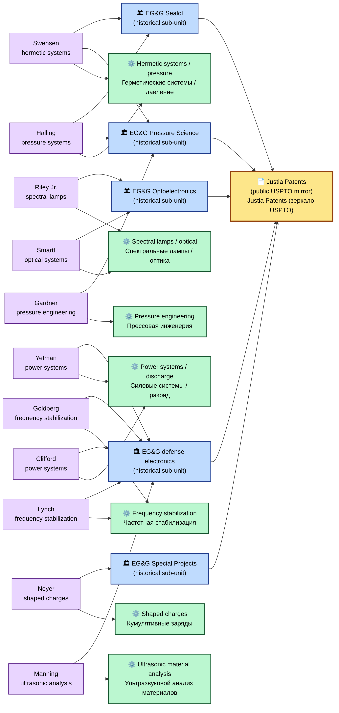

# Patents inventory — EG&G technical sub-units / Патентный инвентарь — технические подразделения EG&G

---

## Premise / Предпосылка

**EN:** Patent filings are a high-quality public-source signal for mapping the technical scope of a corporate sub-unit and for surfacing the named individuals who were active inventors. The USPTO Patent Public Search and the Justia Patents mirror are open-access, well-indexed, and queryable by assignee — which makes them a natural OSINT entry point into the EG&G technical-services book and its successor lineage (URS → AECOM → Amentum). This file inventories the **named inventors and topic clusters** that surface against EG&G-family assignees in the working notes; the inventory is by name and topic only, with concrete patent numbers deferred to the v3 USPTO/Justia verification pass.

**RU:** Патентные заявки — высококачественный публично-источниковый сигнал для картографирования технического объёма корпоративного подразделения и для выявления именованных физических лиц, выступавших активными изобретателями. USPTO Patent Public Search и зеркало Justia Patents — открытые, хорошо индексированные, с возможностью запроса по правопреемнику — что делает их естественной OSINT-точкой входа в технико-сервисный портфель EG&G и его линию преемников (URS → AECOM → Amentum). Этот файл инвентаризует **именованных изобретателей и тематические кластеры**, всплывающие по правопреемникам семейства EG&G в рабочих заметках; инвентарь — только по именам и темам, с конкретными патентными номерами, отложенными на проверочный проход v3 по USPTO/Justia.

---

## Hard policy on named inventors / Жёсткая политика по именованным изобретателям

**EN:** Named inventors documented in this file are **public USPTO/Justia patent metadata** — that is, public-record assertions in a US-government and a public-mirror index that a given person was the inventor-of-record on a given filing assigned to a given corporate entity. The names appear here under that public-record framing **only**.

- **No graph person-node is created for any named inventor.** The graph captures patents as `pat-*` nodes; the inventor name is recorded as a `inventor` text-field on the patent node, not as a `p-*` (person) node. This preserves the protocol's [`../../experiments/protocol_corporate_scan.md`](../../experiments/protocol_corporate_scan.md) v1.1 Legal posture: no internal-property / hidden-activity / UAP-program-link claim about any named individual, even with disclaimers.
- **No HSP-scan content findings are made about any inventor.** The role-class anonymization bar covers the entire individual-content layer.
- **No claim is made that any inventor's work was applied to UAP reverse-engineering.** The inventory is descriptive of the public patent record; it does not advance any program-continuity claim.
- **The patent assignment to EG&G or its successors is documented but does not by itself imply program continuity.** Assignment is a corporate-genealogy fact; programmatic continuity across the EG&G → URS → AECOM → Amentum chain is a separate analytical question handled in [`./egng-amentum-succession.md`](egng-amentum-succession.md).

**RU:** Именованные изобретатели, задокументированные в этом файле, — **публичные метаданные патентов USPTO/Justia**, то есть публично-источниковые утверждения в государственном (США) и в публично-зеркальном индексе о том, что данный человек был изобретателем-по-записи в данной заявке, оформленной на данное корпоративное лицо. Имена фигурируют здесь **только** в этой публично-источниковой рамке.

- **Графовый узел-человек не создаётся ни для одного именованного изобретателя.** Граф фиксирует патенты как узлы `pat-*`; имя изобретателя записывается как текстовое поле `inventor` на патентном узле, а не как узел `p-*` (человек). Это сохраняет Юридическую позицию протокола [`../../experiments/protocol_corporate_scan.md`](../../experiments/protocol_corporate_scan.md) v1.1: никаких заявлений о внутренних свойствах / скрытой деятельности / связи с UAP-программой по какому-либо именованному физическому лицу, даже с дисклеймерами.
- **Никаких HSP-выводов по содержанию ни по одному изобретателю не производится.** Запрет ролево-классовой анонимизации покрывает весь индивидуально-содержательный слой.
- **Не утверждается, что работа какого-либо изобретателя была применена к обратному инжинирингу UAP.** Инвентарь описывает публичный патентный реестр; он не выдвигает каких-либо претензий о программной преемственности.
- **Закрепление патента за EG&G или её преемниками задокументировано, но само по себе не подразумевает программной преемственности.** Закрепление — корпоративно-генеалогический факт; программная преемственность по цепи EG&G → URS → AECOM → Amentum — отдельный аналитический вопрос, рассматриваемый в [`./egng-amentum-succession.md`](egng-amentum-succession.md).

---

## Visual / Визуализация

**EN:** The inventor → sub-unit → topic mapping rendered as a network diagram. Inventors are shown as **text-labeled nodes only**; the hard policy above is preserved (no graph person-node entry in `agentE_track7_corporate.py`).

**RU:** Отображение изобретатель → подразделение → тематика, нарисованное как сетевая диаграмма. Изобретатели показаны **только как узлы с текстовыми метками**; жёсткая политика выше сохраняется (нет записи человека-узла графа в `agentE_track7_corporate.py`).

Source: [`../diagrams/patents_inventory_network.mmd`](../diagrams/patents_inventory_network.mmd).

---

## Inventor + topic table / Таблица изобретателей и тематик

**EN:** The 11 inventors below surface in Justia Patents queries against EG&G-family assignees. The "Likely assignee" column is a working interpretation; concrete assignee strings on individual patent records are pending USPTO/Justia verification.

**RU:** 11 изобретателей ниже всплывают в запросах Justia Patents по правопреемникам семейства EG&G. Колонка «Likely assignee» — рабочая интерпретация; конкретные строки правопреемника в индивидуальных патентных записях ожидают сверки по USPTO/Justia.

| # | Inventor / Изобретатель | Topic / Тематика | Likely assignee / Возможный правопреемник |
|---:|---|---|---|
| 1 | William J. Riley Jr. | Spectral lamps / optical systems / Спектральные лампы / оптические системы | EG&G Optoelectronics |
| 2 | Barry T. Neyer | Shaped charges / explosive triggering / Кумулятивные заряды / взрывное срабатывание | EG&G Special Projects (defense detonators / оборонные детонаторы) |
| 3 | David S. Yetman | Power systems / discharge control / Системы питания / контроль разряда | EG&G defense-systems |
| 4 | Jeffrey E. Swensen | Hermetic systems / pressure engineering / Гермосистемы / инженерия высокого давления | EG&G Pressure Science / Sealol |
| 5 | Horace P. Halling | Pressure systems / hermetics / Системы давления / гермосистемы | EG&G Pressure Science / Sealol |
| 6 | Seymour Goldberg | Frequency stabilization / oscillators / Стабилизация частоты / осцилляторы | EG&G defense-electronics |
| 7 | Thomas J. Lynch | Frequency stabilization / Стабилизация частоты | EG&G defense-electronics |
| 8 | Peter J. Clifford | Power systems / Системы питания | EG&G defense-systems |
| 9 | James F. Gardner | Pressure engineering / Инженерия высокого давления | EG&G Pressure Science |
| 10 | William L. Manning | Ultrasonic material analysis / Ультразвуковой анализ материалов | EG&G defense / nuclear-test-instrumentation |
| 11 | Herschel B. Smartt | Optical systems / Оптические системы | EG&G Optoelectronics |

---

## Sources / Источники

**EN:**
- **Justia Patents** — `https://patents.justia.com/` — primary OSINT surface for assignee-by-company queries. Public mirror of USPTO; well-indexed by inventor and assignee.
- **USPTO Patent Public Search** — `https://ppubs.uspto.gov/` — backup-of-record; canonical source for filing dates, claim text, classification codes.

**RU:**
- **Justia Patents** — `https://patents.justia.com/` — основная OSINT-поверхность для запросов по правопреемнику. Публичное зеркало USPTO; хорошо индексируется по изобретателю и правопреемнику.
- **USPTO Patent Public Search** — `https://ppubs.uspto.gov/` — резервный источник записи; канонический источник дат подачи, текста претензий, кодов классификации.

---

## Pending v3 work / Отложенные работы v3

**EN:** The v3 verification pass extends this inventory with concrete patent records. Per inventor + assignee + topic combination, the v3 pass produces:

- **Concrete US patent number** (US-XXXXXXX) + Justia URL.
- **Filing date** + **issue date** + **assignee string as recorded on the filing** (often varies in form across the EG&G → URS → AECOM → Amentum chain).
- **Abstract** + **classification codes** (CPC / IPC).
- **Co-inventors** (the working notes capture only the lead-inventor name in most rows; co-inventors are pending).

The pending work is bounded by the same hard policy in this file: concrete patent records remain `pat-*` nodes in the graph, with inventor names as text fields only.

**RU:** Проверочный проход v3 расширяет этот инвентарь конкретными патентными записями. По каждой комбинации изобретатель + правопреемник + тематика проход v3 даёт:

- **Конкретный номер патента США** (US-XXXXXXX) + URL Justia.
- **Дату подачи** + **дату выдачи** + **строку правопреемника, как записана в заявке** (часто варьируется по форме в цепи EG&G → URS → AECOM → Amentum).
- **Аннотацию** + **коды классификации** (CPC / IPC).
- **Соавторов** (рабочие заметки фиксируют только имя ведущего изобретателя в большинстве строк; соавторы — отложены).

Отложенная работа ограничена той же жёсткой политикой этого файла: конкретные патентные записи остаются узлами `pat-*` в графе, имена изобретателей — только как текстовые поля.

---

## What this file does NOT claim / Чего этот файл НЕ утверждает

- **EN:**
  - It does **not** make any claim about any inventor as an individual — no psychology, no intentions, no internal properties, no hidden activities, no UAP-programme participation.
  - It does **not** claim that any inventor's work was applied to UAP reverse-engineering.
  - It does **not** assert that named inventors have any current or historical relationship to UAP topics beyond their public USPTO/Justia patent metadata.
  - It does **not** infer programmatic continuity from the corporate-genealogy fact of patent assignment to EG&G or its successors.
  - It does **not** create any graph person-node (`p-*`) for any named inventor; named inventors appear only as text-field metadata on `pat-*` nodes in the graph.

- **RU:**
  - Он **не** делает каких-либо утверждений о каком-либо изобретателе как о физическом лице — ни о психологии, ни о намерениях, ни о внутренних свойствах, ни о скрытой деятельности, ни об участии в UAP-программе.
  - Он **не** утверждает, что работа какого-либо изобретателя была применена к обратному инжинирингу UAP.
  - Он **не** утверждает, что у именованных изобретателей есть какое-либо текущее или историческое отношение к UAP-тематикам за пределами их публичных патентных метаданных USPTO/Justia.
  - Он **не** выводит программную преемственность из корпоративно-генеалогического факта закрепления патента за EG&G или её преемниками.
  - Он **не** создаёт ни одного графового узла-человека (`p-*`) ни для одного именованного изобретателя; имена изобретателей фигурируют только как метаданные текстового поля на узлах `pat-*` в графе.

---

[← Corporate-Economic Analysis README](../README.md) · [EG&G profile / Профиль EG&G](../companies/egng.md) · [Root README / Корень проекта](../../README.md)
