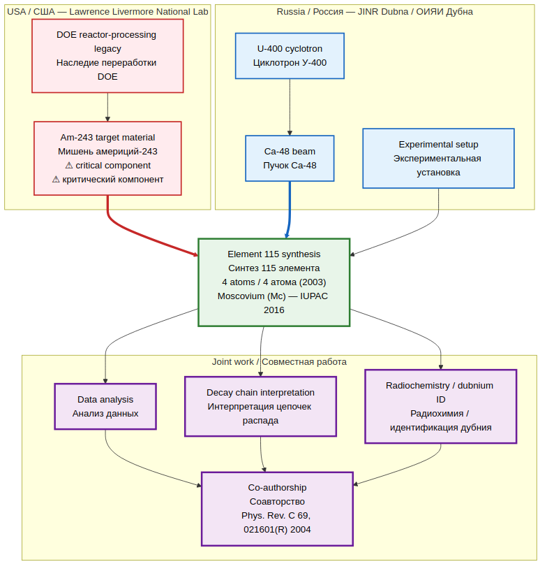
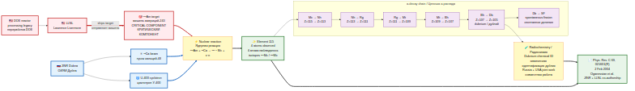
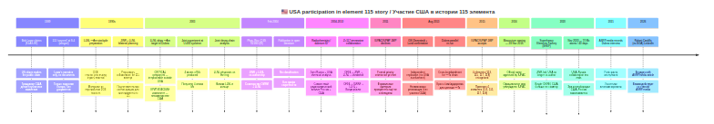
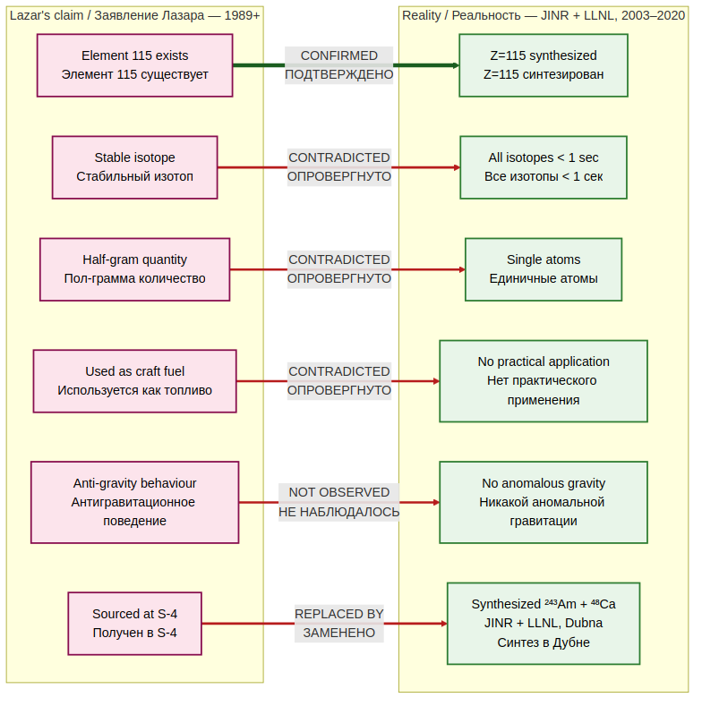
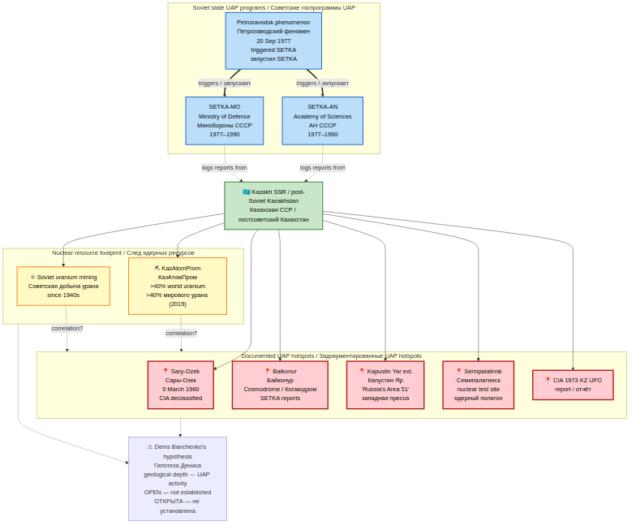
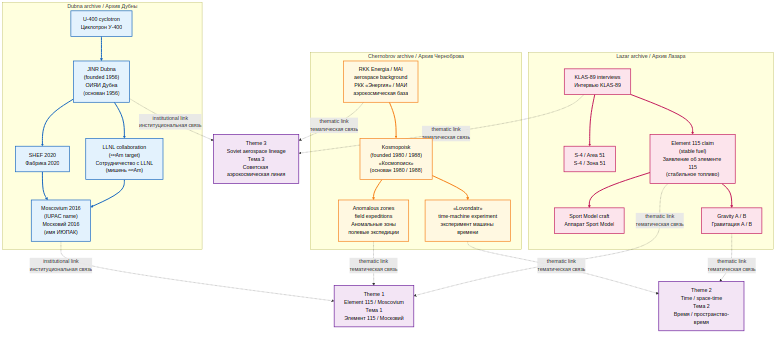
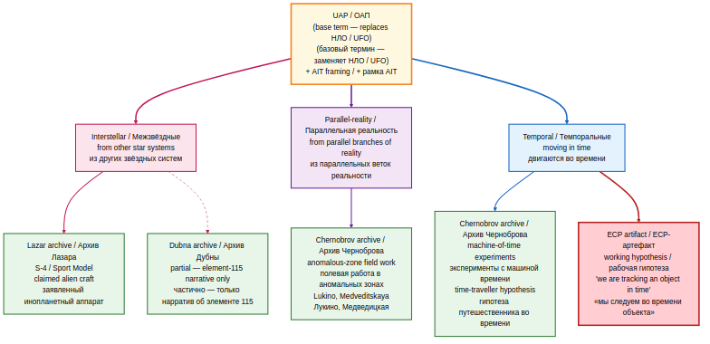
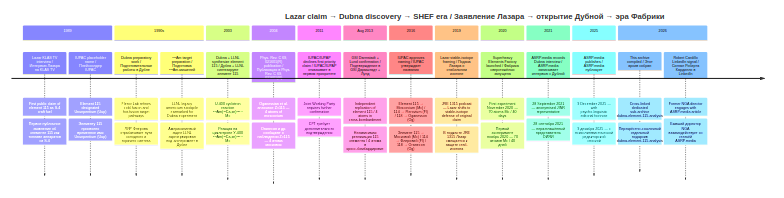
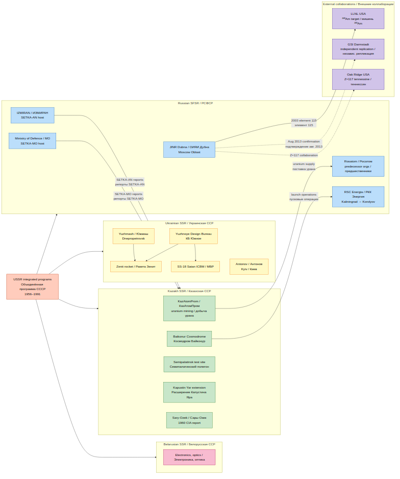
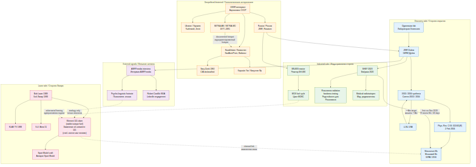

# Dubna / Element 115 Analysis / Анализ Дубна / Элемент 115

A dedicated research sub-archive connecting Bob Lazar's 1989 claim about Element 115 to the documented 2003–2004 synthesis of element 115 (later named **Moscovium, Mc**) at the **Joint Institute for Nuclear Research (JINR)** in Dubna, Russia, and to the 2020-launched **Superheavy Elements Factory** which is now producing moscovium in tens-to-hundreds of atoms.

Отдельный исследовательский подархив, связывающий заявление Боба Лазара 1989 года об Элементе 115 с задокументированным синтезом 115 элемента (позже названного **Московий, Mc**) в **Объединённом институте ядерных исследований (ОИЯИ)** в Дубне, Россия, 2003–2004 годов, и с запущенной в 2020 году **Фабрикой сверхтяжёлых элементов**, которая сейчас производит московий в количестве десятков–сотен атомов.

**EN:** The primary source is a 25-minute ASRP.media interview with an undisclosed high-ranking JINR representative, recorded 28 September 2021 and published 9 December 2025. This archive includes the raw audio transcript, the published verbatim Q&A in both languages, a master claims table, fact-checked context on JINR membership and the Lazar / Dubna / LLNL collaboration, and an analysis of Denis Banchenko's hypothesis on the Kazakhstan geological / UAP-activity correlation.

**RU:** Основной источник — 25-минутное интервью ASRP.media с неразглашённым высокопоставленным представителем ОИЯИ, записанное 28 сентября 2021 г. и опубликованное 9 декабря 2025 г. Архив включает сырой транскрипт аудио, опубликованный дословный Q&A на обоих языках, мастер-таблицу утверждений, проверенный фактический контекст о членстве ОИЯИ и коллаборации Лазар / Дубна / LLNL, а также анализ гипотезы Дениса Банченко о корреляции геологии Казахстана с UAP-активностью.

---

## 🇷🇺 + 🇺🇸 KEY FINDING — Russia + USA equal-partner discovery / КЛЮЧЕВОЙ ВЫВОД — Россия + США как равноправные партнёры открытия

**EN:** Element 115 (Moscovium) was **not** synthesized by Russia alone. It was the product of a **joint peer-reviewed experiment by JINR Dubna + Lawrence Livermore National Laboratory (LLNL, USA)** — published in **Physical Review C 69, 021601(R)** on 2 February 2004, with co-authorship from both institutions. The USA's role was **not** secondary: LLNL supplied the critical ²⁴³Am target, participated in decay-chain analysis and radiochemical identification, and was listed as equal co-author on the priority publication. The specific ²⁴³Am(⁴⁸Ca, xn) reaction required americium-243, which at the time was practically available only from DOE reactor-processing stockpiles stewarded by LLNL.

**RU:** Элемент 115 (Московий) был синтезирован **не Россией в одиночку**. Это результат **совместного рецензируемого эксперимента ОИЯИ Дубна + Lawrence Livermore National Laboratory (LLNL, США)** — опубликованного в **Physical Review C 69, 021601(R)** 2 февраля 2004 г., с соавторством от обоих учреждений. Роль США **не** была второстепенной: LLNL поставила критически важную мишень ²⁴³Am, участвовала в анализе цепочки распада и в радиохимической идентификации, и значится как равноправный соавтор в приоритетной публикации. Конкретная реакция ²⁴³Am(⁴⁸Ca, xn) требовала америция-243, который на тот момент был практически доступен только из запасов переработки реакторов DOE, курируемых LLNL.

### Role split / Разделение ролей

| Component / Компонент | Russia (JINR Dubna) / Россия (ОИЯИ Дубна) | USA (LLNL) / США (LLNL) |
|---|:---:|:---:|
| U-400 cyclotron / Циклотрон У-400 | ✅ | — |
| ⁴⁸Ca beam / Пучок кальций-48 | ✅ | — |
| Experimental setup / Экспериментальная установка | ✅ | — |
| **²⁴³Am target (critical) / Мишень америций-243 (критически)** | — | ✅ |
| Data analysis / Анализ данных | ✅ | ✅ |
| Decay-chain interpretation / Интерпретация цепочек распада | ✅ | ✅ |
| Radiochemistry (dubnium ID) / Радиохимия (идентификация дубния) | ✅ | ✅ |
| Co-authorship (PRC 2004) / Соавторство (PRC 2004) | ✅ | ✅ |



*Full analysis: [`analysis/lazar-dubna-connection.md`](analysis/lazar-dubna-connection.md) §4. / Полный разбор: [`analysis/lazar-dubna-connection.md`](analysis/lazar-dubna-connection.md) §4.*

---

## 🕵 Detective board / Детективная доска

**EN:** Summary visual of every actor, place, claim, and piece of evidence in the 115-element story. Red-dashed lines mark Lazar's claims falling against documented reality. Blue heavy lines mark the Russia–USA joint experimental chain (Am-243 target → cyclotron → PRC 2004 co-authorship). The green heavy line marks the institutional confirmation (PRC 2004 → Moscovium).

**RU:** Обзорная визуальная схема всех фигурантов, мест, заявлений и улик в истории 115-го элемента. Красные пунктирные линии — заявления Лазара, расходящиеся с задокументированной реальностью. Синие жирные линии — совместная экспериментальная цепочка Россия–США (мишень Am-243 → циклотрон → соавторство PRC 2004). Зелёная жирная линия — институциональное подтверждение (PRC 2004 → Московий).


---

## 🧪 Synthesis flow / Поток синтеза

**EN:** Mechanical/chemical flow of the 2003 experiment showing exactly where each partner contributed.

**RU:** Механико-химический поток эксперимента 2003 года с указанием точных мест вклада каждого партнёра.



---

## 🇺🇸 USA participation timeline / Хронология участия США

**EN:** USA-specific timeline from Lazar's 1989 claim (as a US citizen) through LLNL's 2003 experimental contribution, 2004 publication, 2004–2010 radiochemistry, to the end of the US–Russia collaboration era with SHEF in 2020.

**RU:** Хронология, специально посвящённая участию США — от заявления Лазара 1989 г. (как гражданина США), через экспериментальный вклад LLNL 2003 г., публикацию 2004 г., радиохимию 2004–2010 гг., до окончания эпохи коллаборации США–Россия с запуском SHEF в 2020 г.



---

## ⚖ Claim vs. reality / Заявление против реальности

**EN:** Six Lazar claims side-by-side with what Dubna + LLNL actually documented. One claim (element 115 exists) is green; five claims are red.

**RU:** Шесть заявлений Лазара рядом с тем, что Дубна + LLNL действительно задокументировали. Одно заявление (115 элемент существует) — зелёное; пять — красные.



---

## 📍 Kazakhstan UAP hotspots + nuclear footprint / Казахстан — UAP-hotspots и ядерный след

**EN:** Documented Soviet-era UAP hotspots in Kazakh SSR (Sary-Ozek 1960, Baikonur, Kapustin Yar, Semipalatinsk, the 1973 CIA Kazakhstan report) alongside the nuclear-resource footprint (KazAtomProm, Soviet uranium mining since the 1940s). The `correlation?` dashed links mark Denis Banchenko's open research hypothesis — it is not established.

**RU:** Задокументированные советские UAP-hotspots в Казахской ССР (Сары-Озек 1960, Байконур, Капустин Яр, Семипалатинск, отчёт ЦРУ 1973 г. о Казахстане) рядом с ядерно-ресурсным следом (КазАтомПром, советская добыча урана с 1940-х). Пунктиры `correlation?` отмечают открытую исследовательскую гипотезу Дениса Банченко — она не установлена.



---

## 🔗 Cross-archive synthesis / Кросс-архивный синтез

**EN:** This repository contains three sibling research archives — Bob Lazar (1989–2026), Vadim Chernobrov / Kosmopoisk (1988–2017), and Dubna / Element 115 (ASRP.media JINR interview, 2021/2025). The three converge on three overlapping subject-matter themes — **element 115 / moscovium**, **gravitational distortion of space-time**, and the **Soviet aerospace / nuclear lineage** — without claiming that the three figures collaborated or corroborate one another. Full discussion: [`analysis/cross-archive-synthesis.md`](analysis/cross-archive-synthesis.md).

**RU:** Этот репозиторий содержит три родственных исследовательских подархива — Боба Лазара (1989–2026), Вадима Черноброва / «Космопоиск» (1988–2017) и Дубна / Элемент 115 (интервью ОИЯИ для ASRP.media, 2021/2025). Три архива сходятся по трём пересекающимся предметным темам — **элемент 115 / московий**, **гравитационное искажение пространства-времени** и **советская аэрокосмическая / ядерная линия преемственности** — без утверждения того, что три фигуранта сотрудничали или подтверждают друг друга. Полное обсуждение: [`analysis/cross-archive-synthesis.md`](analysis/cross-archive-synthesis.md).



---

## 🌳 UAP origin taxonomy / Таксономия происхождения UAP

**EN:** Denis Banchenko's three-category origin framework for UAP — **interstellar** (from other star systems), **parallel-reality** (from parallel branches of reality), and **temporal** (from time / time-travelling). The Lazar archive sits in the interstellar branch (Sport Model / S-4 narrative); the Chernobrov archive spans both the parallel-reality branch (anomalous-zone field expeditions — Lukino, Medveditskaya) and the temporal branch (machine-of-time experiments). The artifact under study via the root-repository ECP protocol is **tentatively** placed in the temporal category as a working hypothesis only. Full discussion: [`analysis/uap-taxonomy.md`](analysis/uap-taxonomy.md).

**RU:** Трёхкатегорная классификация происхождения UAP, предложенная Денисом Банченко — **межзвёздные** (из других звёздных систем), **параллельная реальность** (из параллельных веток реальности) и **темпоральные** (из времени / путешественники во времени). Архив Лазара ложится в межзвёздную ветку (нарратив Sport Model / S-4); архив Черноброва охватывает и параллельную ветку (полевые экспедиции в аномальные зоны — Лукино, Медведицкая), и темпоральную (эксперименты с машиной времени). Артефакт, изучаемый по корневому ECP-протоколу, **предварительно** помещён в темпоральную категорию — только как рабочая гипотеза. Полное обсуждение: [`analysis/uap-taxonomy.md`](analysis/uap-taxonomy.md).



---

## 🕰 Main timeline 1989–2026 / Основная хронология 1989–2026



---

## 🗺 USSR aerospace role split / Разделение ролей в аэрокосмосе СССР

**EN:** Why the 2003 experiment involved Russia, Ukraine, and Kazakhstan simultaneously — the inherited USSR role split: Ukraine = aerospace manufacturing, Kazakhstan = uranium and launch operations, Russia = nuclear science coordination (JINR, IZMIRAN, Rosatom, RSC Energia). External collaborators (LLNL USA, GSI Germany, ORNL USA) connect in with dashed external lines.

**RU:** Почему эксперимент 2003 года одновременно включал Россию, Украину и Казахстан — унаследованное разделение ролей СССР: Украина = аэрокосмическое производство, Казахстан = уран и пусковые операции, Россия = координация ядерной науки (ОИЯИ, ИЗМИРАН, Росатом, РКК «Энергия»). Внешние коллабораторы (LLNL США, GSI Германия, ORNL США) подключаются пунктирными внешними линиями.



---

## 🔗 Full connection graph / Полный граф связей



---

## QUICK NAVIGATION / БЫСТРАЯ НАВИГАЦИЯ

| Section / Раздел | Purpose / Назначение | File / Файл | Status / Статус |
|------------------|----------------------|-------------|-----------------|
| Master Claims / Мастер-таблица | Every technical claim made in the interview, timestamped / Каждое техническое утверждение из интервью, с таймкодом | [`analysis/MASTER_claims.md`](analysis/MASTER_claims.md) | ✅ Available / Доступно |
| UAP Taxonomy / Таксономия UAP | Denis's 3-category origin classification (interstellar / parallel / temporal) / Трёхкатегорная классификация Дениса (межзвёздная / параллельная / темпоральная) | [`analysis/uap-taxonomy.md`](analysis/uap-taxonomy.md) | ✅ Available / Доступно |
| UAP Taxonomy Diagram / Диаграмма таксономии UAP | Visual 3-branch tree with archive coverage / Визуальное 3-ветвистое дерево с покрытием архивов | [`diagrams/uap_taxonomy.mmd`](diagrams/uap_taxonomy.mmd) | ✅ Available / Доступно |
| Cross-archive synthesis / Кросс-архивный синтез | Lazar ↔ Chernobrov ↔ Dubna shared themes / Общие темы трёх архивов | [`analysis/cross-archive-synthesis.md`](analysis/cross-archive-synthesis.md) | ✅ Available / Доступно |
| Cross-archive Links Diagram / Диаграмма межархивных связей | Visual graph of shared themes / Визуальный граф общих тем | [`diagrams/cross_archive_links.mmd`](diagrams/cross_archive_links.mmd) | ✅ Available / Доступно |
| External podcasts and documentaries / Внешние подкасты и документалки | JRE 2416 (Dan Farah), Age of Disclosure 2025, 1991 Lazar Tape Russian dub / JRE 2416 (Дэн Фара), «Эпоха раскрытия» 2025, рус. дубляж 1991 Lazar Tape | [`analysis/external-podcasts.md`](analysis/external-podcasts.md) | ✅ Available / Доступно |
| JINR History & Members / ОИЯИ — история и члены | Fact-checked list of member states, founding, 115 discovery timeline / Проверенный список стран-членов, основание, хронология открытия 115 | [`analysis/jinr-facts-and-history.md`](analysis/jinr-facts-and-history.md) | ✅ Available / Доступно |
| Lazar ↔ Dubna ↔ LLNL / Лазар ↔ Дубна ↔ LLNL | 1989 Lazar claim → 2003 Dubna + LLNL discovery (PRC 2004) / Заявление Лазара 1989 → открытие Дубна + LLNL 2003 (PRC 2004) | [`analysis/lazar-dubna-connection.md`](analysis/lazar-dubna-connection.md) | ✅ Available / Доступно |
| Superheavy Factory / Фабрика сверхтяжёлых | Launched November 2020, 70 Mc atoms in 40 days, ~100 Fl atoms / Запущена ноябрь 2020, 70 атомов Mc за 40 дней, ~100 атомов Fl | [`analysis/superheavy-factory-2020.md`](analysis/superheavy-factory-2020.md) | ✅ Available / Доступно |
| BN-800 / MOX Fuel / БН-800 / МОКС | Analogy between Lazar's 115 brick and MOX fuel cycle / Аналогия между «бруском 115» Лазара и топливным циклом МОКС | [`analysis/bn800-mox-analogy.md`](analysis/bn800-mox-analogy.md) | ✅ Available / Доступно |
| Kazakhstan Geology & UAP / Геология Казахстана и UAP | Denis's hypothesis, fact-checked history of Soviet-era sighting hotspots / Гипотеза Дениса, проверенная история советских hot-spot-ов | [`analysis/kazakhstan-uap-geological.md`](analysis/kazakhstan-uap-geological.md) | ✅ Available / Доступно |
| Soviet UAP Research / Советские исследования UAP | SETKA, Galaktika, Sary-Ozek 1960, Baikonur, Kapustin Yar / SETKA, «Галактика», Сары-Озек 1960, Байконур, Капустин Яр | [`analysis/soviet-uap-research.md`](analysis/soviet-uap-research.md) | ✅ Available / Доступно |
| Interview Metadata / Метаданные интервью | Source, URL, participants, provenance / Источник, URL, участники, происхождение | [`catalog/interview.md`](catalog/interview.md) | ✅ Available / Доступно |
| Sources / Источники | All external references, primary and secondary / Все внешние ссылки, первичные и вторичные | [`catalog/sources.md`](catalog/sources.md) | ✅ Available / Доступно |
| Audio Transcript / Транскрипт аудио | Raw Whisper transcription of the 25-minute recording / Сырой транскрипт Whisper 25-минутной записи | [`transcripts/asrp_media_audio_RU.md`](transcripts/asrp_media_audio_RU.md) | ✅ Available / Доступно |
| Published Interview RU / Опубликованное интервью RU | Verbatim Russian text as published by ASRP.media / Дословный русский текст в публикации ASRP.media | [`transcripts/asrp_media_interview_RU.md`](transcripts/asrp_media_interview_RU.md) | ✅ Available / Доступно |
| Published Interview EN / Опубликованное интервью EN | Verbatim English translation as published by ASRP.media / Дословный английский перевод в публикации ASRP.media | [`transcripts/asrp_media_interview_EN.md`](transcripts/asrp_media_interview_EN.md) | ✅ Available / Доступно |
| Role Split RU/USA / Разделение ролей РФ/США | Russia + USA equal-partner table for element 115 synthesis / Таблица равноправных партнёров РФ + США в синтезе 115 | [`diagrams/role_split_russia_usa.mmd`](diagrams/role_split_russia_usa.mmd) | ✅ Available / Доступно |
| Detective Board / Детективная доска | Film-style investigation board of all actors, places, claims, evidence / Доска расследования в стиле фильма: фигуранты, места, заявления, улики | [`diagrams/detective_board.mmd`](diagrams/detective_board.mmd) | ✅ Available / Доступно |
| Synthesis Flow / Поток синтеза | Mechanical/chemical flow of the 2003 experiment / Механико-химический поток эксперимента 2003 | [`diagrams/element_115_synthesis_flow.mmd`](diagrams/element_115_synthesis_flow.mmd) | ✅ Available / Доступно |
| USA Participation Timeline / Хронология участия США | USA-specific timeline 1989–2026 / Хронология, посвящённая участию США 1989–2026 | [`diagrams/usa_participation_timeline.mmd`](diagrams/usa_participation_timeline.mmd) | ✅ Available / Доступно |
| Claim vs. Reality / Заявление vs. реальность | Six Lazar claims side-by-side with documented reality / Шесть заявлений Лазара рядом с задокументированной реальностью | [`diagrams/claim_vs_reality.mmd`](diagrams/claim_vs_reality.mmd) | ✅ Available / Доступно |
| Kazakhstan Hotspots / Казахстан — hotspots | UAP hotspots + nuclear footprint in Kazakh SSR / UAP-hotspots + ядерный след в Казахской ССР | [`diagrams/kazakhstan_hotspots.mmd`](diagrams/kazakhstan_hotspots.mmd) | ✅ Available / Доступно |
| Connection Graph / Граф связей | Investigation-style graph linking Lazar, USSR, JINR, LLNL, SHEF, Kazakhstan / Детективный граф связей: Лазар, СССР, ОИЯИ, LLNL, Фабрика, Казахстан | [`diagrams/connection_graph.mmd`](diagrams/connection_graph.mmd) | ✅ Available / Доступно |
| Timeline 1989–2026 / Хронология 1989–2026 | From Lazar's first interview to the Superheavy Factory / От первого интервью Лазара до Фабрики сверхтяжёлых элементов | [`diagrams/timeline_1989-2026.mmd`](diagrams/timeline_1989-2026.mmd) | ✅ Available / Доступно |
| USSR Aerospace Map / Карта аэрокосмоса СССР | Ukraine = aerospace / Kazakhstan = uranium / Russia = JINR / Украина = аэрокосмос / Казахстан = уран / Россия = ОИЯИ | [`diagrams/ussr_aerospace_map.mmd`](diagrams/ussr_aerospace_map.mmd) | ✅ Available / Доступно |

---

## What's in this repo / Что внутри репозитория

```
dubna-element-115-analysis/
├── README.md                              ← you are here / вы здесь
│
├── catalog/                               ← interview metadata and external sources
│   │                                        метаданные интервью и внешние источники
│   ├── interview.md                       ASRP.media interview card (URL, IDs, participants)
│   │                                        карточка интервью ASRP.media (URL, ID, участники)
│   └── sources.md                         external references used in this analysis
│                                            внешние ссылки, использованные в этом анализе
│
├── transcripts/                           ← verbatim source texts, both languages
│   │                                        дословные исходные тексты на обоих языках
│   ├── asrp_media_audio_RU.md             raw Whisper transcription (322 segments, timestamps)
│   │                                        сырой транскрипт Whisper (322 сегмента, таймкоды)
│   ├── asrp_media_interview_RU.md         published Q&A, Russian original
│   │                                        опубликованный Q&A, русский оригинал
│   └── asrp_media_interview_EN.md         published Q&A, English translation by ASRP.media
│                                            опубликованный Q&A, английский перевод ASRP.media
│
├── analysis/                              ← topical analysis, fact-checked
│   │                                        тематический анализ, с проверкой фактов
│   ├── MASTER_claims.md                   every technical claim in the interview
│   │                                        каждое техническое утверждение из интервью
│   ├── uap-taxonomy.md                    Denis's 3-category origin classification
│   │                                        трёхкатегорная классификация происхождения
│   ├── cross-archive-synthesis.md         Lazar ↔ Chernobrov ↔ Dubna shared themes
│   │                                        общие темы трёх архивов: Лазар ↔ Чернобров ↔ Дубна
│   ├── external-podcasts.md                external podcasts/documentaries (JRE 2416, Age of Disclosure)
│   │                                        внешние подкасты/документалки (JRE 2416, Эпоха раскрытия)
│   ├── jinr-facts-and-history.md          founding members, current membership, 115 timeline
│   │                                        страны-основатели, текущие члены, хронология 115
│   ├── lazar-dubna-connection.md          Lazar 1989 → Dubna+LLNL 2003 → PRC 2004
│   │                                        Лазар 1989 → Дубна+LLNL 2003 → PRC 2004
│   ├── superheavy-factory-2020.md         SHEF launch, throughput, applications
│   │                                        запуск Фабрики, производительность, применения
│   ├── bn800-mox-analogy.md               MOX fuel cycle ↔ Lazar's 115 brick
│   │                                        топливный цикл МОКС ↔ «брусок 115» Лазара
│   ├── kazakhstan-uap-geological.md       Denis's hypothesis, fact-checked Soviet-era context
│   │                                        гипотеза Дениса, проверенный советский контекст
│   └── soviet-uap-research.md             SETKA, Galaktika, Sary-Ozek, Baikonur, Kapustin Yar
│                                            SETKA, «Галактика», Сары-Озек, Байконур, Капустин Яр
│
├── diagrams/                              ← mermaid sources and rendered diagrams
│   │                                        исходники mermaid и отрендеренные схемы
│   ├── role_split_russia_usa.mmd          Russia + USA equal-partner role table
│   │                                        таблица равноправных партнёров РФ + США
│   ├── detective_board.mmd                film-style investigation board
│   │                                        доска расследования в стиле фильма
│   ├── uap_taxonomy.mmd                   3-branch UAP origin tree with archive coverage
│   │                                        3-ветвистое дерево происхождения UAP с покрытием архивов
│   ├── cross_archive_links.mmd            Lazar ↔ Chernobrov ↔ Dubna thematic graph
│   │                                        тематический граф трёх архивов
│   ├── element_115_synthesis_flow.mmd     mechanical/chemical flow of 2003 experiment
│   │                                        механико-химический поток эксперимента 2003
│   ├── usa_participation_timeline.mmd     USA-specific timeline 1989–2026
│   │                                        хронология участия США 1989–2026
│   ├── claim_vs_reality.mmd               6 Lazar claims vs. documented reality
│   │                                        6 заявлений Лазара vs. задокументированная реальность
│   ├── kazakhstan_hotspots.mmd            UAP hotspots + nuclear footprint in KZ SSR
│   │                                        UAP-hotspots + ядерный след в КазССР
│   ├── connection_graph.mmd               investigation-style connection graph
│   │                                        детективный граф связей
│   ├── timeline_1989-2026.mmd             1989 Lazar → 2003 discovery → 2020 SHEF → now
│   │                                        1989 Лазар → 2003 открытие → 2020 Фабрика → сейчас
│   ├── ussr_aerospace_map.mmd             Ukraine / Kazakhstan / Russia role split
│   │                                        разделение ролей Украина / Казахстан / Россия
│   └── rendered/                          PNG outputs of the mermaid sources
│                                            PNG-выводы mermaid-источников
│
└── raw/                                   ← raw binary audio + machine-readable transcript
                                             сырое бинарное аудио + машинный транскрипт
    ├── asrp_media_audio.mp3               (git-ignored, 6 MB) extracted audio
    │                                        (исключён из git, 6 МБ) извлечённое аудио
    └── asrp_media_audio_raw_transcript.json  full Whisper verbose JSON with segment timestamps
                                                полный verbose JSON Whisper с таймкодами сегментов
```

---

## Core factual framework / Основная фактологическая база

**EN:** This archive corrects and extends the informal framing of the interview with publicly verifiable facts:

- **Element 115 synthesis (2003 / Phys. Rev. C 2004)** was a joint experiment of **JINR Dubna (Russia)** and **Lawrence Livermore National Laboratory (LLNL, USA)** — the USA was *not* a member of JINR, but LLNL was the direct American collaborator on the synthesis itself. This is the concrete Lazar-claim ↔ real-world link.
- **JINR membership** at the time of the 2003 synthesis included Kazakhstan, Ukraine, DPRK, and many others — but **not the USA** (which collaborated via LLNL) and **not Germany as a full member** (Germany is an associate member, alongside Italy, South Africa, Serbia). The interviewee's own 2021 phrasing "*representatives from 18 countries*" is the safe formulation for the state of the institute at the time of the recording; for the 2003 snapshot, see [`analysis/jinr-facts-and-history.md`](analysis/jinr-facts-and-history.md) §2.4.
- **Superheavy Elements Factory** was launched **November 2020**; as stated in the interview, the first experiment produced roughly **70 atoms of moscovium (element 115) in 40 days** with interruptions, and the second experiment produced **~100 atoms of flerovium (element 114)**. Isotope lifetimes are on the order of 1 second.
- **Post-synthesis industrial applications** named in the interview: radiation-resistant electronics for Roscosmos, medical radioisotopes, polymer track membranes (filters, burn dressings). These are spin-off technologies, not the moscovium itself.
- **Soviet-era UAP research programs** — **SETKA-AN** (Academy of Sciences, civilian) and **SETKA-MO** (Ministry of Defence, military), launched 1977–1978 — collected reports from across the USSR including Kazakhstan (Baikonur, Kapustin Yar ranges, Sary-Ozek declassified CIA report 1960, 1973 CIA report on Kazakhstan UFO). This is the historically documented hotspot layer, which is narrower than the informal "one of the highest UAP-activity concentrations" framing and is handled that way in [`analysis/soviet-uap-research.md`](analysis/soviet-uap-research.md).

**RU:** Этот архив корректирует и расширяет неформальное изложение интервью публично проверяемыми фактами:

- **Синтез 115 элемента (2003 / Phys. Rev. C 2004)** был совместным экспериментом **ОИЯИ Дубна (Россия)** и **Ливерморской национальной лаборатории им. Лоуренса (LLNL, США)** — США *не были* членом ОИЯИ, но LLNL была прямым американским соавтором на самом синтезе. Это конкретная связка заявление-Лазара ↔ реальный мир.
- **Членство в ОИЯИ** на момент синтеза 2003 года включало Казахстан, Украину, КНДР и многих других — но **не США** (которые сотрудничали через LLNL) и **не Германию как полноправного члена** (Германия — ассоциированный член наряду с Италией, ЮАР, Сербией). Формулировка самого интервьюируемого 2021 года — «*представители 18 стран*» — безопасна для состояния института на момент записи; срез на 2003 см. в [`analysis/jinr-facts-and-history.md`](analysis/jinr-facts-and-history.md) §2.4.
- **Фабрика сверхтяжёлых элементов** запущена в **ноябре 2020 г.**; как сказано в интервью, первый эксперимент дал примерно **70 атомов московия (элемент 115) за 40 дней** с перерывами, второй эксперимент — **~100 атомов флеровия (элемент 114)**. Время жизни изотопов — порядка 1 секунды.
- **Индустриальные побочные применения**, названные в интервью: радиационно-стойкая электроника для Роскосмоса, медицинские радиоизотопы, полимерные трек-мембраны (фильтры, ожоговые повязки). Это побочные технологии, не сам московий.
- **Советские программы исследования UAP** — **SETKA-AN** (АН, гражданская) и **SETKA-MO** (МО, военная), запущены 1977–1978 гг. — собирали репорты со всего СССР, включая Казахстан (Байконур, Капустин Яр, рассекреченный ЦРУ репорт о Сары-Озек 1960 г., репорт ЦРУ об НЛО в Казахстане 1973 г.). Это документированный исторический слой, который уже́, чем неформальная формулировка «одна из максимальных концентраций UAP-активности», и рассматривается именно так в [`analysis/soviet-uap-research.md`](analysis/soviet-uap-research.md).

---

## Related archives / Связанные архивы

- [`../bob-lazar-archive/`](../bob-lazar-archive/) — the full Lazar interview archive (24 transcribed appearances, 1989–2026)
- [`../chernobrov-archive/`](../chernobrov-archive/) — Vadim Chernobrov / Kosmopoisk archive (Russian UAP field research)
- [`../bob-lazar-archive/catalog/asrp_media_115_interview.md`](../bob-lazar-archive/catalog/asrp_media_115_interview.md) — the same ASRP.media interview indexed inside the Lazar catalog as a cross-reference

---

## Related / Связанные

- **EN:** Root repository README: [`../README.md`](../README.md)
- **RU:** Корневой README репозитория: [`../README.md`](../README.md)
