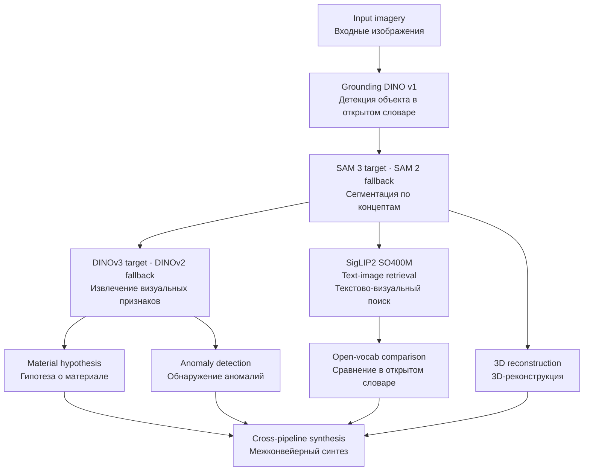
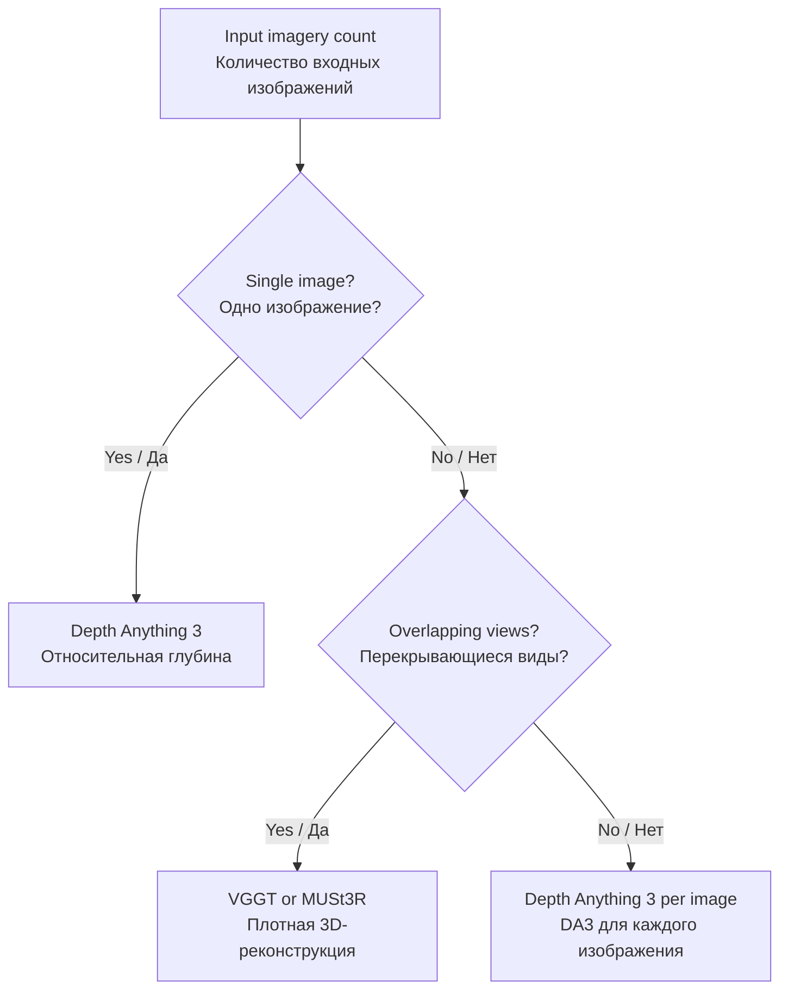

# AI Visual & Material Analysis Protocol / Протокол ИИ Визуального и Материального Анализа

---

| Field / Поле | Value / Значение |
|-------------|------------------|
| **Document Type / Тип Документа** | Experimental Protocol / Экспериментальный Протокол |
| **Version / Версия** | 3.1 |
| **Status / Статус** | ACTIVE / АКТИВЕН |
| **Repository / Репозиторий** | UAP_Reverse_Engineering_Study |
| **Security Level / Уровень доступа** | RESEARCH / ИССЛЕДОВАТЕЛЬСКИЙ |

---

## TABLE OF CONTENTS / СОДЕРЖАНИЕ

1. [Overview / Обзор](#overview--обзор)
2. [Analysis Pipeline / Конвейер Анализа](#analysis-pipeline--конвейер-анализа)
3. [Model Stack / Стек Моделей](#model-stack--стек-моделей)
4. [Material Analysis / Анализ Материалов](#material-analysis--анализ-материалов)
5. [Anomaly Detection / Обнаружение Аномалий](#anomaly-detection--обнаружение-аномалий)
6. [3D Reconstruction / 3D Реконструкция](#3d-reconstruction--3d-реконструкция)
7. [Limitations / Ограничения](#limitations--ограничения)
8. [Output Format / Формат Вывода](#output-format--формат-вывода)

---

## OVERVIEW / ОБЗОР

### EN

The AI Visual & Material Analysis Protocol defines standardized procedures for automated analysis of UAP fragment imagery using state-of-the-art computer vision and machine learning techniques. Pipeline updated April 2026 to reflect current best-available open-source models.

**Primary Objectives:**
- Segment and isolate artifact regions from background
- Extract visual features for similarity search and classification
- Generate presumptive material family hypotheses (visual only)
- Detect surface anomalies and unusual structural patterns
- Produce 3D reconstruction from single or multiple views
- Cross-reference with material and artifact databases

### RU

Протокол ИИ Визуального и Материального Анализа определяет стандартизированные процедуры для автоматизированного анализа изображений фрагмента НАЯ с использованием современных методов компьютерного зрения и машинного обучения. Конвейер обновлён в апреле 2026 для отражения лучших доступных open-source моделей.

**Основные Задачи:**
- Сегментация и изоляция областей артефакта от фона
- Извлечение визуальных признаков для поиска по сходству и классификации
- Формирование предположительных гипотез о семействе материала (только визуально)
- Обнаружение поверхностных аномалий и необычных структурных паттернов
- 3D-реконструкция из одного или нескольких видов
- Перекрёстная проверка по базам данных материалов и артефактов

---

## ANALYSIS PIPELINE / КОНВЕЙЕР АНАЛИЗА



> **Note / Примечание:** Target models shown; see [Implementation Note](#implementation-note--замечание-о-реализации) for fallback mapping. / Показаны целевые модели; см. раздел «Замечание о реализации» для маппинга fallback-моделей.

---

## MODEL STACK / СТЕК МОДЕЛЕЙ

### Core Models / Основные Модели

| Stage / Этап | Model / Модель | Architecture / Архитектура | Purpose / Назначение | Source / Источник | Status / Статус |
|-------------|---------------|--------------------------|---------------------|------------------|----------------|
| **Detection / Детекция** | Grounding DINO v1 | Swin-T + BERT | Open-set object detection / Детекция объектов в открытом словаре | [GitHub](https://github.com/IDEA-Research/GroundingDINO) | Active / Активен |
| **Segmentation / Сегментация** | SAM 3 | Concept-conditional | Segmentation by concept prompts / Сегментация по концептуальным промптам | [GitHub](https://github.com/facebookresearch/sam3) | Active / Активен |
| **Visual backbone / Визуальный backbone** | DINOv3 ViT-L/16 | ViT-L distilled (300M) | Feature extraction, similarity search / Извлечение признаков, поиск по сходству | [GitHub](https://github.com/facebookresearch/dinov3) | Active / Активен |
| **Text-image / Текст-изображение** | SigLIP2 SO400M | ViT-SO400M-14 | Multilingual text-image retrieval / Мультиязычный текстово-визуальный поиск | [HuggingFace](https://huggingface.co/google/siglip2-so400m-patch14-224) | Active / Активен |
| **Material retrieval / Поиск материалов** | MaRI | DINOv2 fine-tuned | Material retrieval across domains / Поиск материалов между доменами | [GitHub](https://github.com/jianhuiwemi/Material-Retrieval-Integration-across-Domains) | Active / Активен |
| **Anomaly detection / Обнаружение аномалий** | EfficientAD via Anomalib v2.3.2 | Student-teacher | Fast surface anomaly detection / Быстрое обнаружение поверхностных аномалий | [GitHub](https://github.com/open-edge-platform/anomalib) | Active / Активен |
| **Zero-shot anomaly / Zero-shot аномалии** | AnomalyCLIP | CLIP-based | Zero-shot anomaly detection with text prompts / Zero-shot обнаружение аномалий с текстовыми промптами | [GitHub](https://github.com/zqhang/AnomalyCLIP) | Active / Активен |
| **Depth (single view) / Глубина (один вид)** | Depth Anything 3 Large | ViT-L (0.35B) | Monocular depth estimation / Монокулярная оценка глубины | [GitHub](https://github.com/ByteDance-Seed/Depth-Anything-3) | Active / Активен |
| **3D (multi-view) / 3D (несколько видов)** | VGGT-1B | Transformer (0.9B) | Camera, depth, point maps in one pass / Камера, глубина, карты точек за один проход | [GitHub](https://github.com/facebookresearch/vggt) | Active / Активен |
| **3D matching / 3D сопоставление** | MUSt3R | Multi-view network | Dense 3D reconstruction / Плотная 3D-реконструкция | [GitHub](https://github.com/naver/must3r) | Active / Активен |

### Model Specifications / Спецификации Моделей

| Model / Модель | Parameters / Параметры | Input / Вход | Published / Опубликовано | License / Лицензия |
|---------------|----------------------|-------------|------------------------|-------------------|
| Grounding DINO v1 | ~172M | Variable / Произвольный | ECCV 2024 | Apache 2.0 |
| SAM 3 | Variable (T/S/B/L) | Variable / Произвольный | Nov 2025 / Нояб 2025 | Apache 2.0 |
| DINOv3 ViT-L/16 | 300M | 518×518 | Aug 2025 / Авг 2025 | Apache 2.0 |
| SigLIP2 SO400M | 400M | 224×224 | Feb 2025 / Фев 2025 | Apache 2.0 |
| MaRI | DINOv2-based | 224×224 | CVPR 2025 | Open / Открытая |
| EfficientAD | ~5M | 256×256 | WACV 2024 | Apache 2.0 (Anomalib) |
| AnomalyCLIP | CLIP-based | 224×224 | ICLR 2024 | MIT |
| Depth Anything 3 L | 350M | Variable / Произвольный | Nov 2025 / Нояб 2025 | Apache 2.0 |
| VGGT-1B | 900M | Variable / Произвольный | CVPR 2025 (Best Paper) | CC BY-NC 4.0 |
| MUSt3R | ~500M | 512×512 | CVPR 2025 | CC BY-NC-SA 4.0 |

---

## MATERIAL ANALYSIS / АНАЛИЗ МАТЕРИАЛОВ

### Approach / Подход

#### EN

Material analysis from RGB imagery produces visual hypotheses only. Chemical composition, alloy type, or crystallographic structure cannot be determined from photographs. The pipeline outputs presumptive material family, surface texture descriptors, reflectance characteristics, and nearest-neighbor matches from material databases.

#### RU

Анализ материала по RGB-изображениям формирует только визуальные гипотезы. Химический состав, тип сплава или кристаллографическую структуру невозможно определить по фотографиям. Конвейер выдаёт предположительное семейство материала, дескрипторы текстуры поверхности, характеристики отражательности и ближайшие совпадения из баз данных материалов.

### Material Taxonomy / Таксономия Материалов

```
Unknown Material / Неизвестный Материал
│
├── Metallic / Металлический
│   ├── Ferrous-like / Подобный чёрным металлам
│   ├── Non-ferrous-like / Подобный цветным металлам
│   └── Unknown Alloy / Неизвестный Сплав
│
├── Ceramic / Керамический
│   ├── Oxide Ceramic / Оксидная Керамика
│   └── Advanced Composite / Продвинутый Композит
│
├── Mineral / Минеральный
│   ├── Crystalline / Кристаллический
│   └── Amorphous / Аморфный
│
├── Polymeric / Полимерный
│   ├── Standard Polymer / Стандартный Полимер
│   └── Unknown Polymer / Неизвестный Полимер
│
├── Biological / Биологический
│   ├── Organic / Органический
│   └── Biometal / Биометалл
│
└── Exotic / Экзотический
    ├── Metamaterial / Метаматериал
    └── Unknown Structure / Неизвестная Структура
```

### Material Databases / Базы Данных Материалов

| Database / База данных | Type / Тип | Coverage / Покрытие | Usage / Использование |
|-----------------------|-----------|--------------------|-----------------------|
| **AmbientCG PBR** | PBR textures / PBR-текстуры | 1605 textures, 86 categories / 1605 текстур, 86 категорий | MaRI backbone training / Обучение MaRI |
| **OpenMaterial** | 3D + materials / 3D + материалы | 1001 objects, 295 materials / 1001 объект, 295 материалов | Material recognition benchmark / Бенчмарк распознавания |
| **DTD** | Textures / Текстуры | 5640 images, 47 categories / 5640 изображений, 47 категорий | Texture classification / Классификация текстур |
| **MUFON** | UAP artifact imagery / Изображения артефактов НАЯ | Variable / Переменное | Cross-reference / Перекрёстная проверка |

### Classification Confidence / Уверенность Классификации

| Confidence / Уверенность | Level / Уровень | Action / Действие |
|-------------------------|----------------|------------------|
| **≥0.9** | HIGH / ВЫСОКИЙ | Primary hypothesis / Основная гипотеза |
| **0.7-0.9** | MEDIUM / СРЕДНИЙ | Secondary verification required / Требуется вторичная проверка |
| **<0.7** | LOW / НИЗКИЙ | Additional data needed / Необходимы дополнительные данные |

---

## ANOMALY DETECTION / ОБНАРУЖЕНИЕ АНОМАЛИЙ

### Pipeline / Конвейер

| Step / Шаг | Model / Модель | Input / Вход | Output / Выход |
|-----------|---------------|-------------|---------------|
| 1 | EfficientAD (Anomalib) | Segmented artifact patch / Сегментированный фрагмент артефакта | Anomaly heatmap / Тепловая карта аномалий |
| 2 | AnomalyCLIP | Artifact image + text prompts / Изображение + текстовые промпты | Zero-shot anomaly regions / Zero-shot области аномалий |
| 3 | Manual review / Ручной анализ | Heatmaps + original / Тепловые карты + оригинал | Confirmed anomaly list / Подтверждённый список аномалий |

### Text Prompts for AnomalyCLIP / Текстовые промпты

```
EN prompts:
- "unusual surface pattern"
- "non-natural geometric structure"
- "engineered micro-texture"
- "anomalous material boundary"

RU prompts (via SigLIP2 multilingual):
- "необычный поверхностный паттерн"
- "неприродная геометрическая структура"
- "инженерная микротекстура"
- "аномальная граница материала"
```

---

## 3D RECONSTRUCTION / 3D РЕКОНСТРУКЦИЯ

### Decision Logic / Логика Выбора



### Output Specifications / Спецификации Вывода

| Output / Вывод | Format / Формат | Resolution / Разрешение |
|---------------|----------------|------------------------|
| **Depth map / Карта глубины** | PNG 16-bit / PNG 16 бит | Input resolution / Разрешение входа |
| **Point Cloud / Облако точек** | PLY/XYZ | Up to 1M points / До 1М точек |
| **Mesh Model / Модель сетки** | OBJ/STL | Variable density / Переменная плотность |
| **Texture Map / Карта текстур** | PNG | 2048×2048 |

---

## LIMITATIONS / ОГРАНИЧЕНИЯ

### EN

**Critical limitation:** Standard RGB photography cannot reliably determine:
- Chemical composition or elemental content
- Alloy type or metallurgical phase
- Crystallographic structure
- Radioactivity or electromagnetic properties
- Internal structure or density

RGB-based analysis provides only:
- Visual material family hypothesis (metal / ceramic / mineral / polymer / biological / exotic)
- Surface texture and roughness descriptors
- Reflectance characteristics (specular / diffuse / metallic)
- Color and hue profiles
- Nearest-neighbor retrieval from material libraries
- Anomalous surface pattern detection

For chemical analysis, the following instruments are required: hyperspectral camera (250-15000nm), OES, XRF, Raman spectroscopy, SEM-EDS.

### RU

**Критическое ограничение:** По стандартной RGB-фотографии невозможно надёжно определить:
- Химический состав или элементный состав
- Тип сплава или металлургическую фазу
- Кристаллографическую структуру
- Радиоактивность или электромагнитные свойства
- Внутреннюю структуру или плотность

RGB-анализ обеспечивает только:
- Визуальную гипотезу о семействе материала (металл / керамика / минерал / полимер / биологический / экзотический)
- Дескрипторы текстуры и шероховатости поверхности
- Характеристики отражательности (зеркальная / диффузная / металлическая)
- Цветовые и оттеночные профили
- Поиск ближайших соседей по библиотекам материалов
- Обнаружение аномальных поверхностных паттернов

Для химического анализа необходимы: гиперспектральная камера (250-15000нм), ОЭС, РФА, рамановская спектроскопия, СЭМ-ЭДС.

---

## OUTPUT FORMAT / ФОРМАТ ВЫВОДА

### Standard AI Analysis Report / Стандартный Отчёт Анализа ИИ

```markdown
# AI ANALYSIS REPORT / ОТЧЁТ АНАЛИЗА ИИ

## Session Information / Информация Сессии

| Field / Поле | Value / Значение |
|-------------|------------------|
| **Analysis ID / ID Анализа** | AI-YYYY-MM-DD-XXX |
| **Date / Дата** | YYYY-MM-DD |
| **Pipeline Version / Версия конвейера** | 3.0 |
| **Models Used / Используемые модели** | [list] |

## Segmentation / Сегментация

| Region / Область | Area / Площадь | Confidence / Уверенность |
|-----------------|---------------|-------------------------|
| [Description / Описание] | XX% of frame | 0.XX |

## Material Hypothesis / Гипотеза о Материале

| Property / Свойство | Prediction / Предположение | Confidence / Уверенность |
|---------------------|--------------------------|-------------------------|
| Material family / Семейство материала | [Type / Тип] | 0.XX |
| Surface texture / Текстура поверхности | [Descriptor / Дескриптор] | 0.XX |
| Nearest DB match / Ближайшее совпадение в БД | [Match / Совпадение] | 0.XX |

## Anomaly Detection / Обнаружение Аномалий

| Anomaly / Аномалия | Location / Расположение | Significance / Значимость |
|--------------------|------------------------|--------------------------|
| [Description / Описание] | [Coordinates / Координаты] | High / Medium / Low |

## 3D Reconstruction / 3D Реконструкция

| Metric / Метрика | Value / Значение |
|-----------------|-----------------|
| Input images / Входных изображений | X |
| Method / Метод | DA3 / VGGT / MUSt3R |
| Point count / Количество точек | XXX,XXX |
| Quality / Качество | X/5 |
```

---

## QUALITY METRICS / МЕТРИКИ КАЧЕСТВА

| Metric / Метрика | Target / Цель | Current / Текущий |
|-----------------|--------------|------------------|
| **Material family accuracy / Точность семейства материала** | ≥80% | Pending / Ожидается |
| **Anomaly detection F1 / F1 обнаружения аномалий** | ≥0.8 | Pending / Ожидается |
| **3D reconstruction quality / Качество 3D** | ≥3/5 | Pending / Ожидается |
| **Processing time / Время обработки** | <30 min / <30 мин | Pending / Ожидается |

---

## REFERENCES / ИСТОЧНИКИ

| Model / Модель | Paper / Статья | Repository / Репозиторий |
|---------------|---------------|------------------------|
| DINOv3 | [arxiv 2508.10104](https://arxiv.org/abs/2508.10104) | [facebookresearch/dinov3](https://github.com/facebookresearch/dinov3) |
| SAM 3 | [arxiv 2511.16719](https://arxiv.org/abs/2511.16719) | [facebookresearch/sam3](https://github.com/facebookresearch/sam3) |
| Grounding DINO | ECCV 2024 | [IDEA-Research/GroundingDINO](https://github.com/IDEA-Research/GroundingDINO) |
| SigLIP2 | [arxiv 2502.14786](https://arxiv.org/abs/2502.14786) | [OpenCLIP](https://github.com/mlfoundations/open_clip) |
| MaRI | [CVPR 2025](https://arxiv.org/abs/2503.08111) | [jianhuiwemi/MaRI](https://github.com/jianhuiwemi/Material-Retrieval-Integration-across-Domains) |
| EfficientAD | WACV 2024 | via [Anomalib](https://github.com/open-edge-platform/anomalib) |
| AnomalyCLIP | ICLR 2024 | [zqhang/AnomalyCLIP](https://github.com/zqhang/AnomalyCLIP) |
| Depth Anything 3 | [arxiv 2511.10647](https://arxiv.org/abs/2511.10647) | [ByteDance-Seed/DA3](https://github.com/ByteDance-Seed/Depth-Anything-3) |
| VGGT | CVPR 2025 Best Paper | [facebookresearch/vggt](https://github.com/facebookresearch/vggt) |
| MUSt3R | CVPR 2025 | [naver/must3r](https://github.com/naver/must3r) |

---

## IMPLEMENTATION NOTE / ЗАМЕЧАНИЕ О РЕАЛИЗАЦИИ

### EN

This protocol describes the target model stack. The current pipeline implementation (`pipeline/`) uses available fallback models where target models lack public weights or exceed VRAM constraints:

| Protocol Model / Модель протокола | Implementation / Реализация | Reason / Причина |
|---|---|---|
| DINOv3 ViT-L/16 | DINOv2 ViT-L/14 (`facebook/dinov2-large`) | No public weights / Нет публичных весов |
| SAM 3 | SAM 2 Tiny (`facebook/sam2-hiera-tiny`) | No public weights / Нет публичных весов |
| Depth Anything 3 | DA v2 Small (`depth-anything/Depth-Anything-V2-Small-hf`) | No public weights / Нет публичных весов |
| AnomalyCLIP | CLIP ViT-L/14 zero-shot (`openai/clip-vit-large-patch14`) | Simplified proxy / Упрощённый прокси |
| MaRI | SigLIP2 zero-shot | No reference DB / Нет референсной БД |
| VGGT / MUSt3R | Not implemented | Single-image input / Одно входное изображение |

### RU

Данный протокол описывает целевой стек моделей. Текущая реализация пайплайна (`pipeline/`) использует доступные fallback-модели, где целевые модели не имеют публичных весов или превышают ограничения VRAM. См. таблицу выше.

---

## DOCUMENT CONTROL / УПРАВЛЕНИЕ ДОКУМЕНТАМИ

| Version / Версия | Date / Дата | Changes / Изменения | Author / Автор |
|-----------------|------------|--------------------|---------------|
| 1.0 | 2026-03-31 | Initial release / Первоначальный выпуск | ASRP AI Team |
| 2.0 | 2026-04-06 | Terminology and formatting sync / Синхронизация терминологии и форматирования | ASRP AI Team |
| 3.0 | 2026-04-06 | Full pipeline update: DINOv3, SAM 3, DA3, SigLIP2, MaRI, AnomalyCLIP, VGGT, MUSt3R. Added limitations section. / Полное обновление конвейера. Добавлен раздел ограничений. | Zmiienko Kyryl |
| 3.1 | 2026-04-07 | Added implementation note with fallback model mapping / Добавлено замечание о реализации с маппингом fallback-моделей | Zmiienko Kyryl |

---

**ASRP RESEARCH STANDARD v2.1**
*AI Visual & Material Analysis Protocol v3.1 / Протокол визуального и материалового анализа ИИ v3.1*
