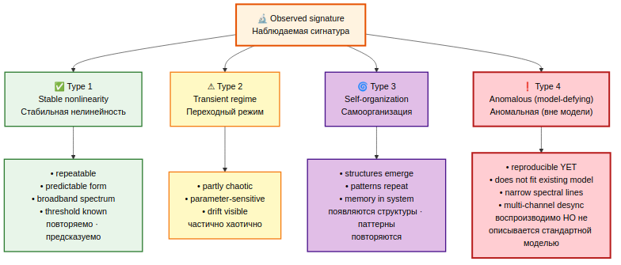
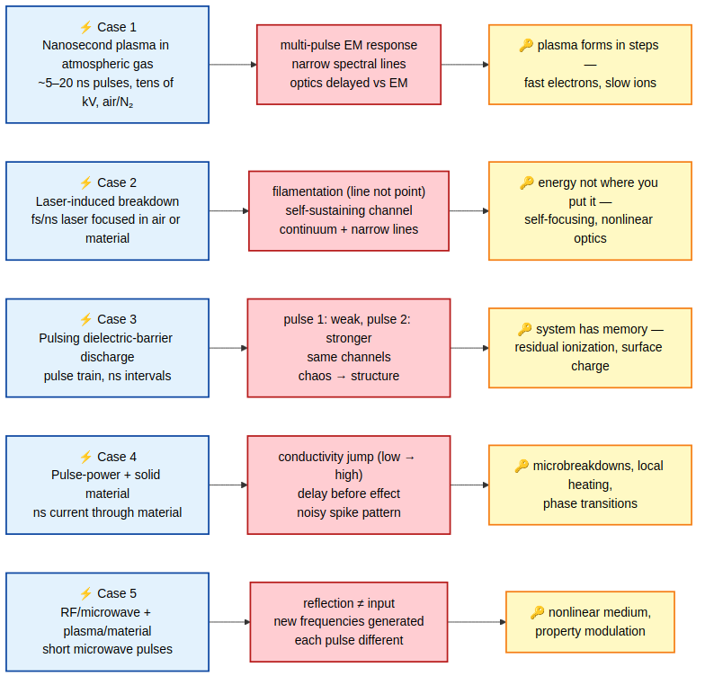
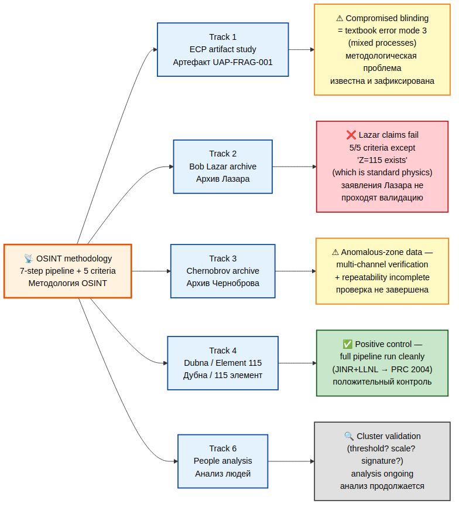

# OSINT + Intelligence Analysis — Methodology / OSINT и разведывательный анализ — Методология

**EN:** Methodology sub-archive of the UAP Reverse Engineering Study. This sub-archive does **not** hold primary observational data. It holds the analytical lens — signal-signature analysis, anomaly classification, and the validation pipeline through which "ordinary nonlinear physics" is separated from "genuinely novel physical regime" — and shows how that lens applies to the four data-bearing sibling sub-archives (Lazar, Chernobrov, Dubna / Element 115, people-analysis) and to the root ECP artifact study.

**RU:** Методологический подархив исследования по реверс-инжинирингу НАЯ. В нём **нет** первичных наблюдательных данных. В нём — аналитическая оптика: анализ сигнатур сигналов, классификация аномалий и конвейер валидации, отделяющий «обычную нелинейную физику» от «действительно нового физического режима» — и показано, как эта оптика применяется к четырём смежным подархивам с данными (Лазар, Чернобров, Дубна / Элемент 115, people-analysis) и к корневому исследованию ECP-артефакта.

---

## Premise / Предпосылка

**EN:** Reverse-engineering of UAP-class phenomena cannot proceed by collecting "interesting signals" alone. Without an explicit methodology that defines what a *signature* is, what a *threshold* is, what *reproducibility* means in this context, and which observations are not yet anomalies but only *boundaries of an existing model*, every primary archive becomes a pile of curiosities. This sub-archive fixes the methodology so the other archives can be read consistently.

**RU:** Реверс-инжиниринг явлений класса НАЯ не может опираться только на сбор «интересных сигналов». Без явной методологии, которая определяет, что такое *сигнатура*, что такое *порог*, что значит *воспроизводимость* в данном контексте и какие наблюдения — ещё не аномалии, а только *граница уже имеющейся модели*, любой первичный архив превращается в кучу любопытных случаев. Этот подархив фиксирует методологию, чтобы остальные архивы можно было читать согласованно.

---

## Provenance / Происхождение

**EN:** The methodology presented here is a structured distillation of working notes by **Denis Banchenko** (project owner, working session 2026-04-26). It is a working analytical framework, not a peer-reviewed engineering manual. The primary working notes are preserved verbatim in `raw/` and are the single source for all four analysis files in this sub-archive.

**RU:** Методология, изложенная здесь, — структурированная дистилляция рабочих заметок **Дениса Банченко** (владелец проекта; рабочая сессия 26.04.2026). Это рабочая аналитическая рамка, а не рецензируемое инженерное руководство. Первичные рабочие заметки дословно сохранены в `raw/` и являются единственным источником всех четырёх аналитических файлов этого подархива.

---

## Status framing / Статусная рамка

**EN:** This is **methodology**, not data. Primary data lives in the sibling sub-archives:

- `bob-lazar-archive/` — interview-based testimony archive (1989–2026)
- `chernobrov-archive/` — Kosmopoisk field-expedition archive (1988–2017)
- `dubna-element-115-analysis/` — JINR + LLNL element-115 synthesis archive
- `people-analysis/` — cluster of 11 scientist deaths/disappearances

**RU:** Это **методология**, не данные. Первичные данные — в смежных подархивах:

- `bob-lazar-archive/` — архив свидетельских интервью (1989–2026)
- `chernobrov-archive/` — архив полевых экспедиций «Космопоиска» (1988–2017)
- `dubna-element-115-analysis/` — архив синтеза элемента 115 в ОИЯИ + LLNL
- `people-analysis/` — кластер из 11 смертей/исчезновений учёных

---

## Quick navigation / Быстрая навигация

| Section / Раздел | EN | RU |
|---|---|---|
| [`analysis/signature-methodology.md`](analysis/signature-methodology.md) | What a signature is; standard vs non-standard signatures; 4-class classification | Что такое сигнатура; стандартные и нестандартные сигнатуры; классификация из 4 типов |
| [`analysis/anomaly-classification.md`](analysis/anomaly-classification.md) | Five real experimental cases (ns plasma, laser breakdown, DBD, pulse-power, RF/microwave) | Пять реальных экспериментальных кейсов (нс-плазма, лазерный пробой, ДБР, pulse-power, RF/микроволны) |
| [`analysis/validation-pipeline.md`](analysis/validation-pipeline.md) | 7-step pipeline + 5 criteria for a "real new effect" + common error modes | 7-ступенчатый конвейер + 5 критериев «реально нового эффекта» + типичные ошибки |
| [`analysis/uap-application.md`](analysis/uap-application.md) | How the methodology is applied to each sibling sub-archive and to the ECP artifact | Как методология применяется к каждому смежному подархиву и к ECP-артефакту |

---

## 🗺 Visual overview / Визуальный обзор

### Signature classification / Классификация сигнатур

**EN:** Four operational classes from "stable nonlinear" (well-known physics) through "transient" and "self-organizing" up to "anomalous (model-defying)" — the rightmost class is where genuine new-physics candidates sit, but only after the validation pipeline confirms reproducibility.

**RU:** Четыре операционных класса — от «стабильно нелинейных» (хорошо известная физика) через «переходные» и «самоорганизующиеся» до «аномальных (вне модели)» — кандидаты на реально новую физику живут в правом классе, но только после прохождения конвейера валидации.

### Validation pipeline / Конвейер валидации

**EN:** Seven sequential steps feeding into a 5-criteria acceptance gate. All five must hold for the observation to be promoted to "new physical regime"; common error modes that fail the gate are shown on the side.

**RU:** Семь последовательных шагов сходятся к воротам приёмки из 5 критериев. Все пять должны выполняться, чтобы наблюдение было повышено до «нового физического режима»; типичные ошибки, проваливающие ворота, показаны сбоку.

### Five anomaly cases / Пять кейсов аномалий

**EN:** Five real experimental cases (nanosecond plasma, laser breakdown, dielectric-barrier discharge, pulse-power solid-state, RF-microwave) — each with the setup, the observed anomalous signature, and the key insight extracted.

**RU:** Пять реальных экспериментальных кейсов (нс-плазма, лазерный пробой, диэлектрический барьерный разряд, pulse-power для твёрдого тела, RF-микроволны) — каждый с установкой, наблюдаемой аномальной сигнатурой и ключевым выводом.

### Methodology application across tracks / Применение методологии по трекам

**EN:** How the OSINT methodology validates each data-bearing sub-archive: Track 4 (Dubna / Element 115) is the positive control — it ran the full pipeline cleanly; Track 2 (Lazar) fails 5 of 5 criteria except "Z=115 exists" which is standard physics; Track 1 (ECP artifact) has compromised blinding (textbook error mode 3); Track 3 (Chernobrov) and Track 6 (people-cluster) have validation incomplete.

**RU:** Как методология OSINT валидирует каждый подархив с данными: Трек 4 (Дубна / Элемент 115) — положительный контроль, прошёл конвейер чисто; Трек 2 (Лазар) проваливает 5 из 5 критериев, кроме «Z=115 существует» (это стандартная физика); Трек 1 (ECP-артефакт) — нарушенное ослепление (типичная ошибка 3); Треки 3 (Чернобров) и 6 (кластер людей) — валидация не завершена.

---

## Sections / Разделы

### 1. Signature analysis methodology / Методология анализа сигнатур

**EN:** Defines a *signature* as a multi-component fingerprint: time-domain shape, frequency spectrum, cross-channel (EM / optics / current) correlation, and inter-channel delay structure. Specifies what an "ordinary" signature looks like (sharp threshold, exponential decay, broadband noise, repeatable shape) and what a "non-standard" signature looks like (multiple peaks, temporal drift, narrow spectral lines, system memory, channel desynchronization, energy localization / filamentation). Closes with the four-class operational classification: stable nonlinearity / transient regime / self-organization / "anomalous".

**RU:** Определяет *сигнатуру* как многокомпонентный отпечаток: форму во временной области, частотный спектр, корреляцию между каналами (EM / оптика / ток), структуру задержек между каналами. Описывает «обычную» сигнатуру (чёткий порог, экспоненциальный спад, широкополосный шум, повторяемая форма) и «нестандартную» сигнатуру (множественные пики, временной дрейф, узкие частотные линии, память системы, рассинхронизация каналов, локализация энергии / филаментация). Замыкается операционной классификацией из четырёх типов: стабильная нелинейность / переходный режим / самоорганизация / «аномальный».

[`analysis/signature-methodology.md`](analysis/signature-methodology.md)

### 2. Anomaly classification / Классификация аномалий

**EN:** Walks through five experimentally documented cases — atmospheric-pressure nanosecond plasma, laser-induced breakdown, dielectric-barrier discharge, pulse-power into solid materials, and RF/microwave-with-plasma interaction. For each case: experimental setup, "ordinary" expected result, observed non-standard signature, physical interpretation, and the key insight that lets the reader reuse the case as a template.

**RU:** Проходит по пяти экспериментально задокументированным кейсам — наносекундная плазма при атмосферном давлении, лазерный пробой, диэлектрический барьерный разряд, pulse-power в твёрдых материалах, взаимодействие RF/микроволн с плазмой. Для каждого кейса: установка, «обычный» ожидаемый результат, наблюдаемая нестандартная сигнатура, физическая интерпретация, ключевой инсайт, делающий кейс шаблоном для повторного применения.

[`analysis/anomaly-classification.md`](analysis/anomaly-classification.md)

### 3. Real → new physics validation pipeline / Конвейер валидации «реальное → новая физика»

**EN:** The 7-step pipeline (parameter isolation → threshold search → temporal structure → multi-channel verification → scaling → modelling → hypothesis crash-test), the 5 criteria for a "real new effect" (reproducible / has a threshold / has a signature / scales / does not fit existing model), the three common error modes, and the explicit framing of "where real science begins": effect stable but not fully explained = boundary of a model, not yet an anomaly.

**RU:** 7-ступенчатый конвейер (изоляция параметров → поиск порога → временна́я структура → мультиканальная проверка → масштабирование → моделирование → краш-тест гипотезы), 5 критериев «реально нового эффекта» (воспроизводимо / имеет порог / имеет сигнатуру / масштабируется / не укладывается в модель), три типичные ошибки и явная формулировка «где начинается реальная наука»: эффект стабилен, но не полностью объяснён = граница модели, а не аномалия.

[`analysis/validation-pipeline.md`](analysis/validation-pipeline.md)

### 4. Application to UAP reverse-engineering / Применение к реверс-инжинирингу НАЯ

**EN:** Maps the methodology onto each sibling sub-archive: Lazar (test the S-4 / element-115 / gravity-propulsion narratives against the 5 "new effect" criteria), Chernobrov (Kosmopoisk anomalous-zone field data tested against multi-channel verification and repeatability), Dubna / Element 115 (treated as the *positive control* — a case that did pass the validation pipeline and produced peer-reviewed physics), people-analysis (cluster of 11 deaths read through the same threshold / scaling / signature lens), and the root ECP artifact study.

**RU:** Накладывает методологию на каждый смежный подархив: Лазар (тестирование нарративов про S-4 / элемент 115 / гравитационный движитель по 5 критериям «нового эффекта»), Чернобров (полевые данные «Космопоиска» по аномальным зонам — против мультиканальной проверки и воспроизводимости), Дубна / Элемент 115 (используется как *положительный контроль* — случай, который прошёл конвейер валидации и дал рецензируемую физику), people-analysis (кластер из 11 смертей через ту же оптику порог / масштаб / сигнатура), корневое исследование ECP-артефакта.

[`analysis/uap-application.md`](analysis/uap-application.md)

---

## Sources / Источники

**EN:** Single source: Banchenko working notes (2026-04-26), preserved verbatim at [`raw/banchenko_2026-04-26_signature_methodology_notes.txt`](raw/banchenko_2026-04-26_signature_methodology_notes.txt). Authored by Denis Banchenko, 2026-04-26.

**RU:** Единственный источник: рабочие заметки Дениса Банченко (26.04.2026), дословно сохранённые в [`raw/banchenko_2026-04-26_signature_methodology_notes.txt`](raw/banchenko_2026-04-26_signature_methodology_notes.txt). Автор — Денис Банченко, 26.04.2026.

---

## Navigation / Навигация

- Root README / Корневой README: [`../README.md`](../README.md)
- Cross-archive synthesis / Кросс-архивный синтез: [`../analysis/cross-archive-synthesis.md`](../analysis/cross-archive-synthesis.md)
- Bob Lazar archive / Архив Боба Лазара: [`../bob-lazar-archive/`](../bob-lazar-archive/)
- Chernobrov archive / Архив Черноброва: [`../chernobrov-archive/`](../chernobrov-archive/)
- Dubna / Element 115 / Дубна / Элемент 115: [`../dubna-element-115-analysis/`](../dubna-element-115-analysis/)
- People analysis / People-анализ: [`../people-analysis/`](../people-analysis/)
