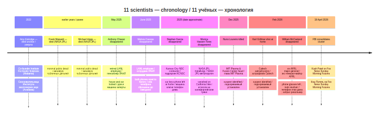
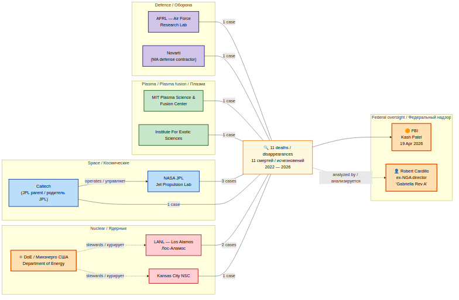
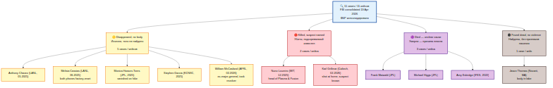
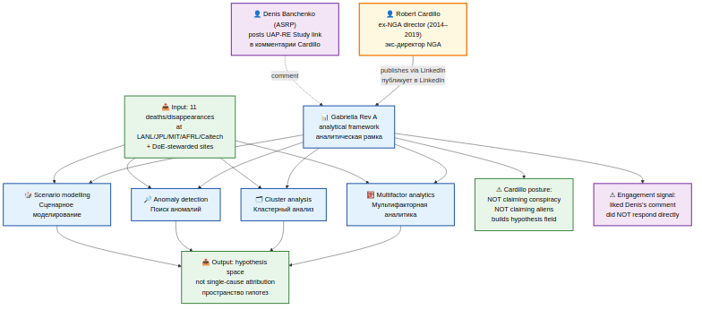

# People Analysis — Mysterious deaths and disappearances of nuclear/space/plasma scientists / Анализ людей — загадочные смерти и исчезновения учёных ядерной/космической/плазменной сфер

A dedicated research sub-archive documenting, with public-source provenance only, the cluster of **eleven (11)** US scientists at top national laboratories — nuclear, space, plasma, and exotic-sciences fields — who have died or disappeared since 2022, and which the FBI under Director **Kash Patel** announced on **19 April 2026** is now being investigated as a single coordinated case.

Отдельный исследовательский подархив, документирующий — исключительно по публичным источникам — кластер из **одиннадцати (11)** американских учёных из ведущих национальных лабораторий (ядерная, космическая, плазменная и «экзотическая» сферы), погибших или пропавших без вести с 2022 года, и который ФБР под руководством директора **Кэша Пателя** объявило **19 апреля 2026 года** объектом единого скоординированного расследования.

---

## Premise / Предпосылка

**EN:** Until April 2026 these cases were treated by US local police, sheriff's offices, homicide investigators, and missing-persons units as eleven independent tragedies in different states. On 19 April 2026, on Fox News *Sunday Morning Futures* with Maria Bartiromo, FBI Director Kash Patel publicly confirmed that the Bureau is consolidating all eleven cases into a single coordinated investigation, looking for common access to classified information, common projects and facilities, time-and-geography overlaps, possible foreign-state involvement, and signs of coordination. This sub-archive records the cluster, the documented affiliations of each person, and the analytical frameworks (FBI investigation, Robert Cardillo's "Gabriella Rev A") that now treat the eleven as one set.

**RU:** До апреля 2026 года эти случаи рассматривались местной полицией США, офисами шерифов, следователями по убийствам и подразделениями по розыску пропавших без вести как одиннадцать независимых трагедий в разных штатах. 19 апреля 2026 года в эфире Fox News *Sunday Morning Futures* с Марией Бартиромо директор ФБР Кэш Патель публично подтвердил, что Бюро объединяет все одиннадцать дел в одно скоординированное расследование, отыскивая совпадения по доступу к секретной информации, общим программам и объектам, по времени и географии, возможному участию иностранных государств и признакам координации. Данный подархив фиксирует сам кластер, документированные аффилиации каждого фигуранта и аналитические рамки (расследование ФБР, «Gabriella Rev A» Роберта Кардилло), в которых одиннадцать случаев теперь рассматриваются как одно множество.

---

## Status framing / Рамка статуса

**EN:** This archive does **NOT** make claims about cause of death, disappearance, or motive. It records the cluster as documented in public sources, the institutional affiliations of each person, and the existence and scope of the FBI investigation and the Cardillo analytical framework that treat the eleven as a coordinated set.

**RU:** Этот архив **НЕ** делает утверждений о причинах смертей, исчезновений или мотивах. Он фиксирует кластер по публично задокументированным источникам, институциональные аффилиации каждого фигуранта и существование и периметр расследования ФБР и аналитической рамки Кардилло, в которых одиннадцать случаев трактуются как скоординированное множество.

---

## 🗺 Visual overview / Визуальный обзор

### Institutional cluster map / Карта учреждений

**EN:** Eight institutions, eleven cases. Status colour-coded: yellow = disappeared, red = killed (suspect named), purple = died unclear, brown = body found without violence.

**RU:** Восемь учреждений, одиннадцать случаев. Статусы цветом: жёлтый — исчез, красный — убит (подозреваемый известен), фиолетовый — умер неясно, коричневый — тело найдено без признаков насилия.

### Timeline 2022–2026 / Хронология 2022–2026

**EN:** All eleven events on the time axis. The 19 April 2026 FBI consolidation is the rightmost column — it converts a scatter of independent cases into one coordinated investigation.

**RU:** Все одиннадцать событий на оси времени. Консолидация ФБР 19 апреля 2026 — крайняя справа колонка — превращает разрозненные дела в единое скоординированное расследование.

### Affiliation graph / Граф аффилиаций

**EN:** Institutions grouped into four classes (nuclear / space / plasma / defence). DoE stewards LANL and Kansas City NSC; Caltech operates JPL. The 11 deaths/disappearances flow into the FBI consolidated investigation and the Cardillo analytical framework.

**RU:** Учреждения сгруппированы в четыре класса (ядерные / космические / плазма / оборона). DoE курирует LANL и Kansas City NSC; Caltech управляет JPL. 11 смертей/исчезновений втекают в консолидированное расследование ФБР и в аналитическую рамку Кардилло.

### Investigation status breakdown / Разбивка по статусу расследования

**EN:** 5 disappeared without body, 2 killed with named suspect, 3 died of unclear causes, 1 found dead without signs of violence.

**RU:** 5 исчезли без тела, 2 убиты с известным подозреваемым, 3 умерли по неясным причинам, 1 найден мёртвым без признаков насилия.

### Cardillo's "Gabriella Rev A" framework / Рамка «Gabriella Rev A» Кардилло

**EN:** Robert Cardillo's analytical framework applied to the same eleven cases — four pillars (multifactor analytics, cluster analysis, anomaly detection, scenario modelling) feeding a hypothesis-space output, NOT a single-cause attribution.

**RU:** Аналитическая рамка Роберта Кардилло применена к тем же одиннадцати случаям — четыре столпа (мультифакторная аналитика, кластерный анализ, поиск аномалий, сценарное моделирование) дают выход в виде пространства гипотез, а НЕ единичной атрибуции.

---

**Status legend in tables / Легенда статусов в таблицах:**

| Symbol / Символ | Meaning / Значение |
|:---:|---|
| ✅ | Verified in public record / Подтверждено в публичной записи |
| ⚠ | Partial — incomplete public detail / Частично — публичных деталей недостаточно |
| ❌ | Contradicted by public record / Противоречит публичной записи |
| ⏸ | Pending FBI consolidation / Ожидает консолидации ФБР |

---

## Quick navigation / Быстрая навигация

| Section / Раздел | Purpose / Назначение |
|---|---|
| [Cluster summary / Сводка по кластеру](analysis/cluster-summary.md) | Cross-cutting institutional, status, time, geographic patterns / Сквозные институциональные, статусные, временные, географические паттерны |
| [FBI cluster investigation / Расследование ФБР по кластеру](analysis/fbi-cluster-investigation.md) | Patel announcement 2026-04-19, scope, methodology / Заявление Пателя 19.04.2026, периметр, методология |
| [Cardillo / Gabriella Rev A framework / Рамка Кардилло «Gabriella Rev A»](analysis/cardillo-gabriella-framework.md) | Ex-NGA director's multifactor analytical framework / Мультифакторная аналитическая рамка экс-директора NGA |
| [Per-person files / Файлы по фигурантам](people/) | One file per scientist / По одному файлу на учёного |
| [Raw transcript (YouTube) / Сырой транскрипт (YouTube)](raw/youtube_q9VV_11_scientists_FBI_2026-04-22.txt) | Gera Sheriff video, RU, 16:27, 2026-04-22 / Видео Геры Шерифа, RU, 16:27, 22.04.2026 |
| [Banchenko working notes (Cardillo) / Рабочие заметки Банченко (Кардилло)](raw/banchenko_2026-04-26_cardillo_gabriella_framework_notes.txt) | Strategic-context analysis of LinkedIn engagement / Анализ стратегического контекста LinkedIn-взаимодействия |

---

## Cluster summary table / Сводная таблица кластера

| # | Name / Имя | Role / Роль | Institution / Учреждение | Status / Статус | Date / Дата | Suspect named / Названный подозреваемый | File / Файл |
|---:|---|---|---|---|---|:---:|---|
| 1 | William Neal McCasland / Уильям Нил Максленд | Retired USAF major-general, ex-AFRL head / Отставной генерал-майор ВВС США, экс-руководитель AFRL | Air Force Research Laboratory (AFRL) | Disappeared / Исчез | Feb 2026 / Февр. 2026 | — | [people/william_neal_mccasland.md](people/william_neal_mccasland.md) |
| 2 | Monica Hassen-Tores / Моника Хасин-Тореза | Metallurgical engineer / Инженер-металлург | NASA JPL + Aerojet Rocketdyne | Disappeared / Исчезла | 2025 | — | [people/monica_hassen_tores.md](people/monica_hassen_tores.md) |
| 3 | Stephen Abel Garcia / Стивен Абел Гарсия | Contractor / Подрядчик | Kansas City National Security Campus | Disappeared / Исчез | 2025 | — | [people/stephen_abel_garcia.md](people/stephen_abel_garcia.md) |
| 4 | Melisia Cassias / Мелисия Кассиас | Lab employee / Сотрудник лаборатории | Los Alamos National Laboratory | Disappeared / Исчезла | Jun 2025 / Июнь 2025 | — | [people/melisia_cassias.md](people/melisia_cassias.md) |
| 5 | Anthony Chavez / Энтони Чавес | Retired ex-employee / Отставной экс-сотрудник | Los Alamos National Laboratory | Disappeared / Исчез | May 2025 / Май 2025 | — | [people/anthony_chavez.md](people/anthony_chavez.md) |
| 6 | Karl Grillmar / Карл Грилмар | Astrophysicist / Астрофизик | Caltech | Killed / Убит | Feb 2026 / Февр. 2026 | ✅ | [people/karl_grillmar.md](people/karl_grillmar.md) |
| 7 | Nuno Loureiro / Нуно Лаурейро | Professor, head of Plasma Science and Fusion Center / Профессор, руководитель Центра плазмы и термоядерного синтеза | MIT | Killed / Убит | Dec 2025 / Дек. 2025 | ✅ | [people/nuno_loureiro.md](people/nuno_loureiro.md) |
| 8 | Jason Thomas / Джейсон Томас | Employee at Novarti / Сотрудник Novarti | Novarti (Massachusetts) | Found dead / Найден мёртвым | 2025 | — | [people/jason_thomas.md](people/jason_thomas.md) |
| 9 | Frank Maiwald / Франк Майвальд | Specialist / Специалист | NASA JPL | Died / Умер | Earlier years / Предыдущие годы | — | [people/frank_maiwald.md](people/frank_maiwald.md) |
| 10 | Michael Higgs / Майкл Хиггс | Specialist / Специалист | NASA JPL | Died / Умер | Earlier years / Предыдущие годы | — | [people/michael_higgs.md](people/michael_higgs.md) |
| 11 | Amy Eskridge / Эми Эскридж | Co-founder / Сооснователь | Institute for Exotic Sciences (Alabama) | Died unclear / Умерла при неясных обстоятельствах | 2022 | — | [people/amy_eskridge.md](people/amy_eskridge.md) |

---

## The eleven / Одиннадцать

**1. William Neal McCasland.** Retired US Air Force major-general, former head of the **Air Force Research Laboratory (AFRL)**. Disappeared in **February 2026 in Albuquerque, New Mexico**. Phone, eyeglasses, and his health-tracking device were left at home. He took his wallet and a .38-caliber revolver. An Air Force hoodie was later found nearby. One of the most prominent cases in the cluster — a person who had worked with the highest-tier defense technologies. Detail: [`people/william_neal_mccasland.md`](people/william_neal_mccasland.md).

**1. Уильям Нил Максленд.** Отставной генерал-майор ВВС США, бывший руководитель **Air Force Research Laboratory (AFRL)**. Пропал в **феврале 2026 года в Альбукерке, штат Нью-Мексико**. Дома остались телефон, очки и устройство слежения за здоровьем. С собой он забрал кошелёк и револьвер 38-го калибра. Позже неподалёку нашли его толстовку с символикой ВВС. Один из самых громких случаев кластера — пропал человек, работавший с оборонными технологиями высшего уровня. Подробно: [`people/william_neal_mccasland.md`](people/william_neal_mccasland.md).

**2. Monica Hassen-Tores.** Metallurgical engineer at **NASA Jet Propulsion Laboratory (JPL)** and **Aerojet Rocketdyne**, specialising in materials and alloys for rocket engines. Disappeared on a hike in a California forest in **2025**. According to her companion she was walking a few metres ahead; he turned away briefly, turned back, and she was gone. Subsequent search produced no result. Detail: [`people/monica_hassen_tores.md`](people/monica_hassen_tores.md).

**2. Моника Хасин-Тореза.** Инженер-металлург в **NASA Jet Propulsion Laboratory (JPL)** и **Aerojet Rocketdyne**, специалист по материалам и сплавам для ракетных двигателей. Исчезла во время похода в калифорнийском лесу в **2025 году**. По словам её спутника, она шла в нескольких метрах от него; он на секунду отвлёкся, обернулся — её нет. Последующие поиски результата не дали. Подробно: [`people/monica_hassen_tores.md`](people/monica_hassen_tores.md).

**3. Stephen Abel Garcia.** Contractor at the **Kansas City National Security Campus** (a facility producing non-nuclear components of weapons systems). Disappeared in **2025**. His car, keys, and phone were left at home. Detail: [`people/stephen_abel_garcia.md`](people/stephen_abel_garcia.md).

**3. Стивен Абел Гарсия.** Подрядчик на **Kansas City National Security Campus** (объект, выпускающий неядерные компоненты систем вооружений). Исчез в **2025 году**. Машина, ключи и телефон остались дома. Подробно: [`people/stephen_abel_garcia.md`](people/stephen_abel_garcia.md).

**4. Melisia Cassias.** Employee of **Los Alamos National Laboratory**. Disappeared in **June 2025**. After the disappearance, her car, handbag, keys and **both phones** were found at home — and **both phones had been reset to factory settings**. Detail: [`people/melisia_cassias.md`](people/melisia_cassias.md).

**4. Мелисия Кассиас.** Сотрудник **Лос-Аламосской национальной лаборатории**. Исчезла в **июне 2025 года**. После исчезновения дома были найдены её машина, сумка, ключи и **оба телефона** — причём **оба телефона сброшены до заводских настроек**. Подробно: [`people/melisia_cassias.md`](people/melisia_cassias.md).

**5. Anthony Chavez.** Former employee of **Los Alamos National Laboratory**, retired. Disappeared in **May 2025**. House and car remained locked, no signs of struggle. Detail: [`people/anthony_chavez.md`](people/anthony_chavez.md).

**5. Энтони Чавес.** Бывший сотрудник **Лос-Аламосской национальной лаборатории**, пенсионер. Пропал в **мае 2025 года**. Дом и машина остались закрыты, признаков борьбы нет. Подробно: [`people/anthony_chavez.md`](people/anthony_chavez.md).

**6. Karl Grillmar.** Astrophysicist at **Caltech (California Institute of Technology)**. Shot at his home in **February 2026**. A specific suspect is named in the case; the suspect visited the home twice — the second time shooting Karl. Detail: [`people/karl_grillmar.md`](people/karl_grillmar.md).

**6. Карл Грилмар.** Астрофизик из **Caltech (Калифорнийский технологический институт)**. Застрелен у своего дома в **феврале 2026 года**. По делу проходит конкретный подозреваемый, дважды приезжавший к дому, который во второй приезд и застрелил Карла. Подробно: [`people/karl_grillmar.md`](people/karl_grillmar.md).

**7. Nuno Loureiro.** Professor at **MIT**, head of the **Plasma Science and Fusion Center**. Killed in **December 2025**. Investigation has identified a specific suspect; motive is not established. Detail: [`people/nuno_loureiro.md`](people/nuno_loureiro.md).

**7. Нуно Лаурейро.** Профессор **MIT**, руководитель **Центра плазмы и термоядерного синтеза**. Убит в **декабре 2025 года**. Следствие вышло на конкретного подозреваемого; мотив не установлен. Подробно: [`people/nuno_loureiro.md`](people/nuno_loureiro.md).

**8. Jason Thomas.** Employee of **Novarti** in Massachusetts. Disappeared, body later found in a lake. Police reported no signs of violence. Family cited a difficult emotional state following the death of his parents. Detail: [`people/jason_thomas.md`](people/jason_thomas.md).

**8. Джейсон Томас.** Сотрудник компании **Novarti** в Массачусетсе. Пропал, позже тело нашли в озере. Полиция признаков насилия не обнаружила. Семья ссылалась на тяжёлое эмоциональное состояние после смерти родителей. Подробно: [`people/jason_thomas.md`](people/jason_thomas.md).

**9. Frank Maiwald.** Specialist at **NASA JPL**. Died in earlier years; details of date and cause are minimal in the public source. Detail: [`people/frank_maiwald.md`](people/frank_maiwald.md).

**9. Франк Майвальд.** Специалист **NASA JPL**. Умер в предыдущие годы; деталей о дате и причине в публичном источнике минимум. Подробно: [`people/frank_maiwald.md`](people/frank_maiwald.md).

**10. Michael Higgs.** Specialist at **NASA JPL**. Died in earlier years; details minimal in the public source. Detail: [`people/michael_higgs.md`](people/michael_higgs.md).

**10. Майкл Хиггс.** Специалист **NASA JPL**. Умер в предыдущие годы; деталей в публичном источнике минимум. Подробно: [`people/michael_higgs.md`](people/michael_higgs.md).

**11. Amy Eskridge.** Co-founder of the **Institute for Exotic Sciences in Alabama**. Died in **2022** under unclear circumstances. Her case was only recently included in the consolidated cluster. Detail: [`people/amy_eskridge.md`](people/amy_eskridge.md).

**11. Эми Эскридж.** Сооснователь **Института экзотических наук (Institute for Exotic Sciences) в штате Алабама**. Умерла в **2022 году** при неясных обстоятельствах. Её случай был включён в общий кластер только недавно. Подробно: [`people/amy_eskridge.md`](people/amy_eskridge.md).

---

## Cardillo's framework / Рамка Кардилло

**EN:** Robert Cardillo, former director of the **National Geospatial-Intelligence Agency (NGA, 2014–2019)**, has publicly applied an analytical framework he labels **"Gabriella Rev A"** — multifactor analytics, cluster analysis, anomaly detection, scenario modelling — to the same eleven cases. His public posture is explicitly **non-conspiratorial and non-attributional**: he is building a hypothesis space, not declaring a conclusion. Denis Banchenko (ASRP project owner) posted a link to the UAP Reverse-Engineering Study as a comment under Cardillo's LinkedIn thread; Cardillo did not respond directly but did not block or remove the comment. Full discussion: [`analysis/cardillo-gabriella-framework.md`](analysis/cardillo-gabriella-framework.md).

**RU:** Роберт Кардилло, бывший директор **Национального агентства геопространственной разведки США (NGA, 2014–2019)**, публично применяет аналитическую рамку, которую обозначает как **«Gabriella Rev A»** — мультифакторная аналитика, кластерный анализ, выявление аномалий, сценарное моделирование — к тем же одиннадцати кейсам. Его публичная позиция демонстративно **не-конспирологическая и не-атрибутивная**: он строит поле гипотез, а не объявляет вывод. Денис Банченко (владелец проекта ASRP) разместил ссылку на UAP Reverse-Engineering Study в комментарии под постом Кардилло в LinkedIn; Кардилло напрямую не ответил, но и не заблокировал и не удалил комментарий. Полный разбор: [`analysis/cardillo-gabriella-framework.md`](analysis/cardillo-gabriella-framework.md).

---

## FBI investigation / Расследование ФБР

**EN:** On **19 April 2026**, on Fox News *Sunday Morning Futures* with **Maria Bartiromo**, FBI Director **Kash Patel** confirmed that the Bureau is consolidating into a single dataset all cases involving missing and killed scientists, including ex–Department of Energy (DoE) staff. Some cases are being investigated as homicide, others as disappearance. The FBI is gathering material from local police, sheriff's offices, homicide investigators and missing-persons investigators across multiple states. Patel stated that the FBI is looking for: common access to classified information, common projects and facilities, time and geography overlaps, possible foreign-state involvement, signs of coordination. Patel further indicated that arrests will follow if criminal collusion or coordinated activity is established. Full summary: [`analysis/fbi-cluster-investigation.md`](analysis/fbi-cluster-investigation.md).

**RU:** **19 апреля 2026 года** в эфире Fox News *Sunday Morning Futures* с **Марией Бартиромо** директор ФБР **Кэш Патель** подтвердил, что Бюро объединяет в один массив данных все дела о пропавших и убитых учёных, включая бывших сотрудников **Министерства энергетики США (DoE)**. Часть дел расследуется как убийства, часть — как исчезновения. ФБР собирает материалы у местной полиции, офисов шерифов, следователей по убийствам и розыску пропавших без вести в нескольких штатах. По словам Пателя, ФБР ищет: общий доступ к секретной информации, общие программы и объекты, совпадения по времени и географии, возможное участие иностранных государств, признаки координации. Патель отдельно указал, что при выявлении преступного сговора или координации последуют аресты. Полная сводка: [`analysis/fbi-cluster-investigation.md`](analysis/fbi-cluster-investigation.md).

---

## What this archive does NOT claim / Чего этот архив НЕ утверждает

**EN:**
- It does **not** attribute any of the eleven cases to UAP-related activity.
- It does **not** claim any specific cause of death or disappearance for any individual.
- It does **not** assert that the eleven are necessarily linked to one another by anything other than the FBI's own decision to consolidate.
- It does **not** advance a conspiracy frame; the analytical posture is the same as Cardillo's — building a hypothesis space, not closing it.
- It does **not** name suspects beyond what is already public in cases 6 and 7 (Grillmar, Loureiro).

**RU:**
- Он **не** атрибутирует какие-либо из одиннадцати случаев к UAP-активности.
- Он **не** утверждает конкретной причины смерти или исчезновения по каждому фигуранту.
- Он **не** утверждает, что одиннадцать обязательно связаны друг с другом чем-либо, кроме самого решения ФБР об объединении дел.
- Он **не** продвигает конспирологическую рамку; аналитическая позиция совпадает с позицией Кардилло — построение поля гипотез, а не его закрытие.
- Он **не** называет подозреваемых сверх того, что уже публично известно в делах 6 и 7 (Грилмар, Лаурейро).

---

## Sources / Источники

| Source / Источник | Type / Тип | Reference / Ссылка |
|---|---|---|
| YouTube video, Gera Sheriff (retired US sheriff turned RU-language YouTube commentator) — "Убиты или пропали 11 специалистов ядерной и космической сфер", published 2026-04-22, 16:27 / Видео YouTube, Гера Шериф (отставной шериф США, ставший RU-язычным комментатором), «Убиты или пропали 11 специалистов ядерной и космической сфер», опубликовано 22.04.2026, 16:27 | Primary recap of Patel announcement and per-person details / Первичная сводка заявления Пателя и подробностей по фигурантам | [`raw/youtube_q9VV_11_scientists_FBI_2026-04-22.txt`](raw/youtube_q9VV_11_scientists_FBI_2026-04-22.txt) |
| Fox News *Sunday Morning Futures* with Maria Bartiromo, 19 April 2026 — Kash Patel statement / Fox News *Sunday Morning Futures* с Марией Бартиромо, 19 апреля 2026 г., заявление Кэша Пателя | Original FBI announcement (cited via transcript) / Первичное заявление ФБР (цитируется через транскрипт) | See [`analysis/fbi-cluster-investigation.md`](analysis/fbi-cluster-investigation.md) |
| Banchenko working notes on Robert Cardillo's LinkedIn post on Gabriella Rev A, 2026-04-26 / Рабочие заметки Банченко по посту Роберта Кардилло в LinkedIn о «Gabriella Rev A», 26.04.2026 | Strategic-context analysis / Анализ стратегического контекста | [`raw/banchenko_2026-04-26_cardillo_gabriella_framework_notes.txt`](raw/banchenko_2026-04-26_cardillo_gabriella_framework_notes.txt) |

**EN:** Provenance grade. The YouTube source is a single-author RU-language channel; Gera Sheriff identifies himself as a retired US sheriff (Broward County, Florida) turned commentator. Treat his recap as a structured digest of public reporting and the Patel/Bartiromo statement, not as primary law-enforcement record. The Cardillo LinkedIn post is a public OSINT artefact; the working notes analyse it as a working commentary, not a primary source.

**RU:** Уровень провенанса. YouTube-источник — авторский RU-канал; Гера Шериф представляется отставным шерифом США (округ Бравард, Флорида), ставшим комментатором. Его сводку следует рассматривать как структурированный дайджест публичных сообщений и заявления Пателя/Бартиромо, а не как первичный полицейский документ. Пост Кардилло в LinkedIn — публичный OSINT-артефакт; рабочие заметки анализируют его как рабочий комментарий, а не первичный источник.

---

## Related sub-archives / Связанные подархивы

| Archive / Архив | Why related / Почему связано |
|---|---|
| [Root README](../README.md) | Project root / Корень проекта |
| [Cross-archive synthesis / Кросс-архивный синтез](../analysis/cross-archive-synthesis.md) | Lazar / Chernobrov / Dubna shared themes / Общие темы Лазар / Чернобров / Дубна |
| [UAP origin taxonomy / Таксономия происхождения UAP](../analysis/uap-taxonomy.md) | Denis's 3-category framework / Трёхкатегорная рамка Дениса |

---

[← Root README / Корень](../README.md)

---

> **Support / Поддержать:** if this work is valuable to you — https://asrp.tech/en/patrons
