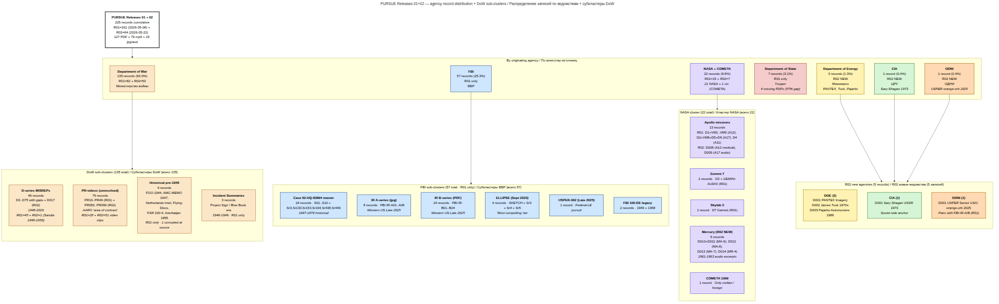
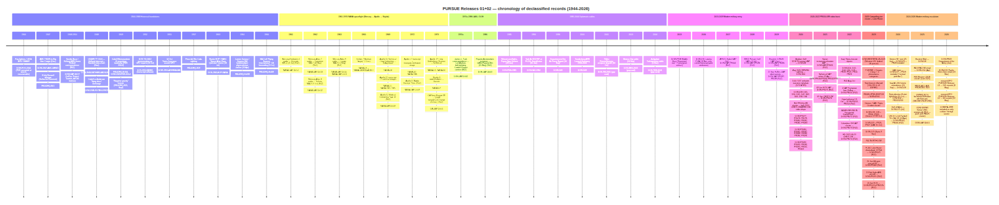
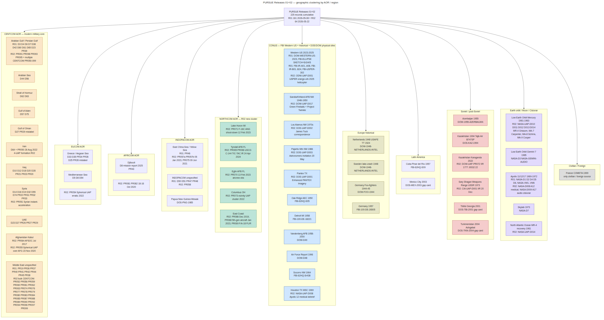
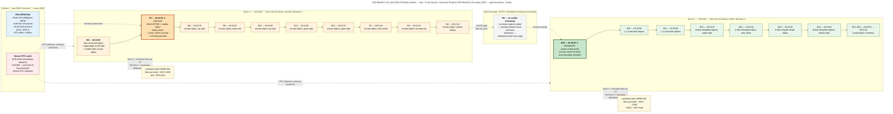
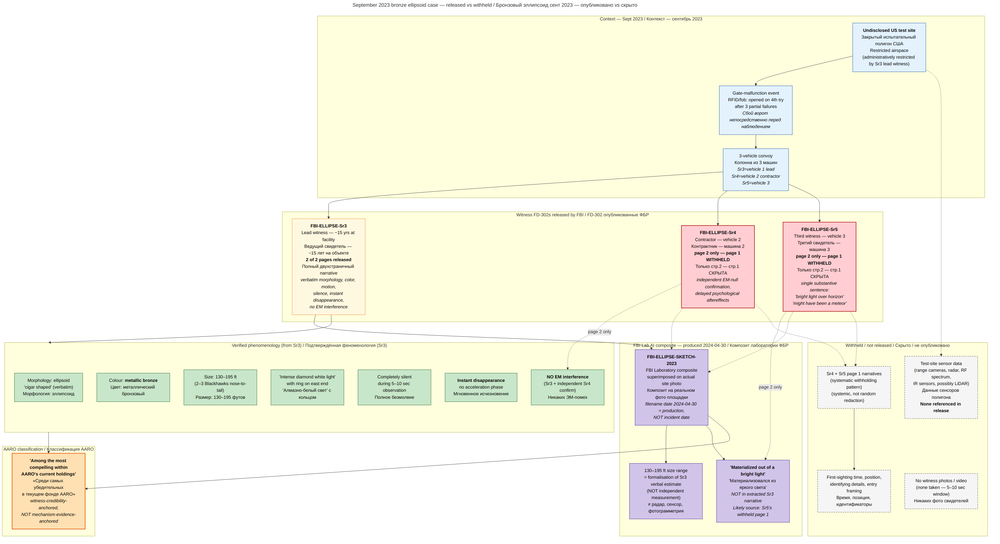
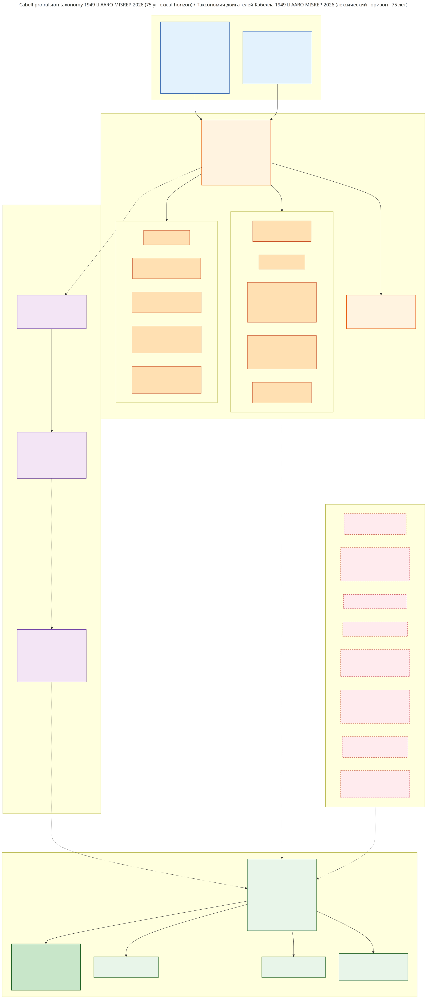
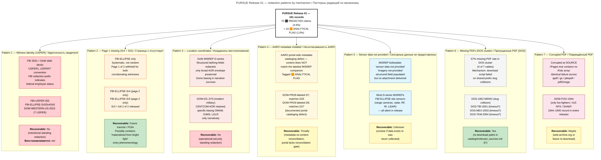
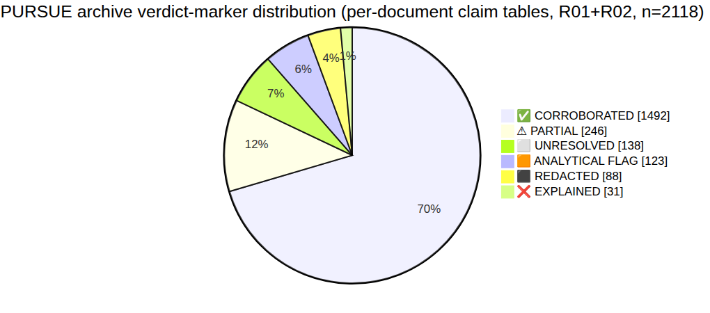

# MASTER claims — PURSUE Release 01 + Release 02 (war.gov 2026-05-08 and 2026-05-22)

**Scope:**
- PURSUE Release 01 (2026-05-08), 161 records (121 PDF + 28 mp4 + 14 jpg) from DoW / FBI / NASA / Department of State — §§ 0–11
- PURSUE Release 02 (2026-05-22), 64 records (6 PDF + 7 audio + 51 video) from DoW / **CIA** / **DOE** / **ODNI** / NASA — §§ 12–14
- **Combined: 225 records, 0 source-code overlap between releases**
**Source archive:** `war-gov-pursue-archive/`
**Bilingual policy:** EN-primary; RU synopsis in §0.RU
**Verdict markers:** ✅ CORROBORATED / ⚠ PARTIAL / ❌ EXPLAINED / ⬜ UNRESOLVED / ⬛ REDACTED / 🟧 ANALYTICAL FLAG (see `catalog/source_codes.md` for the dual-meaning convention of 🟧)
**Cross-archive policy:** No claim imports from sibling archives (bob-lazar, chernobrov, gershtein, dubna). Cross-references in §10 + §14 are pointers only — they do not transfer verdicts.

---

## Table of contents

- [§0 — Source codes index](#0--source-codes-index)
- [§0.0 — Key claims index](#00--key-claims-index)
- [§0.RU — Краткий синопсис](#0ru--краткий-синопсис)
- [§1 — Historical foundations (1944-1968)](#1--historical-foundations-1944-1968)
- [§2 — NASA spaceflight (1965-1974)](#2--nasa-spaceflight-1965-1974)
- [§3 — Modern military encounters (2013-2026)](#3--modern-military-encounters-2013-2026)
- [§4 — FBI Western US cluster](#4--fbi-western-us-cluster)
- [§5 — Diplomatic cables (1952-2004)](#5--diplomatic-cables-1952-2004)
- [§6 — Active investigations](#6--active-investigations)
- [§7 — Propulsion and technology threads](#7--propulsion-and-technology-threads)
- [§8 — Redaction patterns and limitations](#8--redaction-patterns-and-limitations)
- [§9 — Coverage gaps](#9--coverage-gaps)
- [§10 — Cross-archive references](#10--cross-archive-references)
- [§11 — Conclusions](#11--conclusions)
- [Appendix A — Sources skipped or corrupted](#appendix-a--sources-skipped-or-corrupted)
- [Appendix B — Slug collisions and duplicates](#appendix-b--slug-collisions-and-duplicates)

---

## §0 Source codes — quick reference / §0 Коды источников — быстрый справочник

PURSUE Release 01 source codes follow the convention `{AGENCY}-{TYPE}-{IDENTIFIER}` and are stable across `analysis/per-document/`, `analysis/topical/`, this MASTER, and the graph fragment in `graph/fragments/agentI_war_gov_pursue.py`.

**RU:** Коды источников PURSUE Release 01 следуют конвенции `{AGENCY}-{TYPE}-{IDENTIFIER}` и стабильны в `analysis/per-document/`, `analysis/topical/`, этом MASTER и фрагменте графа в `graph/fragments/agentI_war_gov_pursue.py`.

Full registry: `catalog/source_codes.md`. The major code prefixes:

**RU:** Полный реестр: `catalog/source_codes.md`. Основные префиксы кодов:

### Department of War (82 records total) / Министерство войны (всего 82 записи)

| Prefix / Префикс | Meaning / Значение | Count / Количество | Notes / Примечания |
|--------|---------|------:|-------|
| `DOW-D{n}` | DoW MISREPs / historical D-series / DoW MISREP / историческая D-серия | ~30 | D3–D75 with gaps; D48 / D49 are 1996 / Vandenberg statistical baselines, not UAP-substantive / D3–D75 с пропусками; D48 / D49 — статистические базы 1996 / Vandenberg, не относящиеся к UAP по существу |
| `DOW-PR{n}` | DoW unresolved / pending UAP reports (mostly IR videos) / DoW не разрешённые / ожидающие UAP-отчёты (в основном ИК-видео) | 28 | PR19–PR49; DVIDS-hosted clips, some companion PDFs / PR19–PR49; клипы, размещённые на DVIDS, некоторые с сопутствующими PDF |
| `DOW-FOO-1944` | 415th NFS / SHAEF foo-fighters file / файл 415-й NFS / SHAEF foo-fighters | 1 | **PDF corrupted at source — irrecoverable** / **PDF повреждён на источнике — не восстанавливается** |
| `DOW-1947-AMC-MEMO` | AMC TSDIN to Maj Gen Craigie, Dec 1947 / AMC TSDIN на имя Maj Gen Craigie, дек 1947 | 1 | Project SAUCER / Sign procedural antecedent / Процедурный предшественник Project SAUCER / Sign |
| `DOW-1948-FLYING-DISCS` | Project Sign-era intake (Cabell vs Anderson exchange) / Приём эпохи Project Sign (обмен Cabell vs Anderson) | 1 | Includes Horten-brothers reference / Включает упоминание братьев Horten |
| `DOW-1948-NETHERLANDS-INTEL` | USAFE TT 1524 — Holland intercept + Swedish lake-crash / USAFE TT 1524 — голландский перехват + крушение в шведском озере | 1 | First-tier ETH text at General-Cabell level (Nov 1948) / Текст ETH первого уровня на уровне General-Cabell (ноя 1948) |
| `DOW-1949-FSR-200-4` | Lowry / Olmsted FSR 200-4 reports / Отчёты Lowry / Olmsted FSR 200-4 | 1 | Cabell-form-compliant intake / Приём, соответствующий форме Cabell |
| `DOW-1955-AZERBAIJAN` | 14 Oct 1955 ascent UFO Trans-Caucasus / Восходящий UFO Закавказье 14 окт 1955 | 1 | OCR severely degraded / OCR серьёзно деградирован |
| `DOW-INC-SUM-{ranges}` | Standardized "Check-List Unidentified Flying Objects" / Стандартизированный "Check-List Unidentified Flying Objects" | 3 | Incident summaries 1–100, 101–172, 173–233 (1947–1949) — densest per-incident dataset in corpus / Сводки инцидентов 1–100, 101–172, 173–233 (1947–1949) — самый плотный поинцидентный набор данных в корпусе |
| `DOW-WESTERN-US-2023` | AARO presentation slides — 2023 federal-LE multi-witness case / Презентационные слайды AARO — многосвидетельское дело федеральных правоохранителей 2023 | 1 | "among the most compelling within AARO's current holdings" / "среди самых убедительных в текущих фондах AARO" |

### FBI (57 records total) / FBI (всего 57 записей)

| Prefix / Префикс | Meaning / Значение | Count / Количество | Notes / Примечания |
|--------|---------|------:|-------|
| `FBI-62HQ-S{nn}` | Master case 62-HQ-83894 sections / Секции главного дела 62-HQ-83894 | 10 | Sections 1–10 (Jul 1947 – Nov 1968) / Секции 1–10 (июл 1947 – ноя 1968) |
| `FBI-62HQ-Sr{n}` | Master case serials / Сериалы главного дела | 7 | Sr130, Sr153, Sr164 (Cabell Memo #4), Sr220, Sr403, Sr438 (Socorro), Sr449 |
| `FBI-62HQ-SubA` | Master case sub-file (photo / press annex) / Подфайл главного дела (фото / приложение прессы) | 1 | Salem CG photo, Killian DC-6, Joe Perry, Hixenbaugh, Samford 1952 |
| `FBI-IR-A{nn}` | 2025 Western US IR photo cluster (general locations N/A) / ИК-фотокластер Западных США 2025 (общие локации н/д) | 8 | A-series PDFs + 8 standalone JPGs / PDF серии A + 8 отдельных JPG |
| `FBI-IR-B{nn}` | 2025 Western US IR photo cluster (Western US) / ИК-фотокластер Западных США 2025 (Западные США) | 24 | B-series PDFs; B07 = only helicopter-visible frame / PDF серии B; B07 = единственный кадр с видимым вертолётом |
| `FBI-ELLIPSE-*` | September 2023 bronze ellipsoid case / Дело о бронзовом эллипсоиде сентября 2023 | 4 | Composite sketch + serials 3 / 4 / 5 / Композитный эскиз + сериалы 3 / 4 / 5 |
| `FBI-USPER-302` | USPER 302 statement (Late 2025 ground/air pursuit) / Заявление USPER 302 (наземно-воздушное преследование, конец 2025) | 1 | SECRET//NOFORN |
| `FBI-100-DE-*` | Older FBI individual case files (Delaware, 1957–1958) / Более старые индивидуальные дела FBI (Делавэр, 1957–1958) | 2 | Krasuski (1944 Gut Alt Golesen wartime sighting); Weaver (Detroit 1958) / Krasuski (военное наблюдение 1944 Gut Alt Golesen); Weaver (Детройт 1958) |

### NASA (15 records total, including COMETA filed under NASA banner) / NASA (всего 15 записей, включая COMETA, поданный под флагом NASA)

| Prefix / Префикс | Meaning / Значение | Count / Количество | Notes / Примечания |
|--------|---------|------:|-------|
| `NASA-D{n}` | NASA crew transcripts and debriefs / Стенограммы экипажей NASA и опросы | 7 | Apollo 11 / 12 / 17, Skylab 2 / 3 / 4, Gemini 7 |
| `NASA-VM{n}` | NASA archival images flagged for UAP review / Архивные изображения NASA, отмеченные для рассмотрения UAP | 6 | VM1–VM5 Apollo 12 (passive curation); VM6 Apollo 17 (active DoW investigation) / VM1–VM5 Apollo 12 (пассивная курация); VM6 Apollo 17 (активное расследование DoW) |
| `NASA-GEMINI-AUDIO` | Gemini 7 audio segment (Borman "bogey", 1965) / Аудиосегмент Gemini 7 (Borman "bogey", 1965) | 1 | MP4; companion to NASA-D3 / MP4; компаньон к NASA-D3 |
| `COMETA-1999` | French COMETA report / Французский отчёт COMETA | 1 | Sole civilian / foreign-origin document; bundled with Carol Rosin / von Braun letter / Единственный гражданский / иностранного происхождения документ; в комплекте с письмом Carol Rosin / von Braun |

### Department of State (7 records total) / Государственный департамент (всего 7 записей)

| Prefix / Префикс | Meaning / Значение | Count / Количество | Notes / Примечания |
|--------|---------|------:|-------|
| `DOS-PNG-1985` | Cable 1, Papua New Guinea / Телеграмма 1, Папуа — Новая Гвинея | 1 | Air Niugini pilot radar; LIMITED OFFICIAL USE / Пилотный радар Air Niugini; LIMITED OFFICIAL USE |
| `DOS-KAZ-1994` | Cable 2, Kazakhstan / Телеграмма 2, Казахстан | 1 | Tajik Air 747SP, 40-min observation; only DoS cable to CIA / DIA / Tajik Air 747SP, 40-минутное наблюдение; единственная телеграмма DoS в CIA / DIA |
| `DOS-TBI-2001` | Cable 3, Tbilisi / Телеграмма 3, Тбилиси | 1 | **PDF missing from raw/** / **PDF отсутствует в raw/** |
| `DOS-MEX-2003` | Cable 5, Mexico / Телеграмма 5, Мексика | 1 | **PDF missing from raw/** / **PDF отсутствует в raw/** |
| `DOS-TKM-2004` | Cable 4, Ashgabat / Телеграмма 4, Ашхабад | 1 | **PDF missing from raw/** / **PDF отсутствует в raw/** |
| `DOS-1952-MEMO` | 711.5612 memorandum on UFO reports / Меморандум 711.5612 об отчётах об UFO | 1 | **PDF/OCR mismatch — text not extractable** / **Несоответствие PDF/OCR — текст невозможно извлечь** |
| `DOS-1963-EOP-NASA` | EOP / NASA Council "alien race" planning memo (Hunter) / Меморандум по планированию EOP / NASA Council "alien race" (Hunter) | 1 | OFFICIAL USE ONLY |

Verdict markers used throughout per-document cards and this MASTER are defined in `catalog/source_codes.md`.

**RU:** Маркеры вердиктов, используемые повсюду в карточках per-document и в этом MASTER, определены в `catalog/source_codes.md`.

The 🟧 marker has two distinct senses — (a) AARO metadata mislabeling versus document content, and (b) analyst-derived plausible-prosaic reading not asserted by the source — both of which require documented dual-meaning when used.

**RU:** Маркер 🟧 имеет два различных смысла — (a) ошибочная метаразметка AARO в сравнении с содержанием документа и (b) аналитически-производное правдоподобно-прозаическое прочтение, не утверждаемое источником — оба требуют документированного двойного значения при использовании.

Per-card section conventions are described in `catalog/source_codes.md` (Metadata / Summary / Key claims / Cross-references / Open questions / Notes); image-only PDFs and video-only PR records may use templated boilerplate for Open Questions, deferring to the relevant `analysis/topical/*.md` cluster synthesis.

**RU:** Конвенции секций per-card описаны в `catalog/source_codes.md` (Metadata / Summary / Key claims / Cross-references / Open questions / Notes); только-изображения PDF и только-видео PR-записи могут использовать шаблонный текст для Open Questions, отсылая к соответствующему синтезу кластера `analysis/topical/*.md`.

---

*Agency-level breakdown of the 161 records, with DoW and FBI internal sub-clusters. / Распределение записей по ведомствам — 161 запись, с внутренними подкластерами DoW и FBI.*

---

## §0.0 Key Claims Index / §0.0 Индекс ключевых заявлений

The following 35 claims are the most cross-cutting / most-cited findings of PURSUE Release 01. Each links to either the dispositive per-document card or the topical synthesis where the claim is fully argued.

**RU:** Следующие 35 заявлений — самые сквозные / наиболее цитируемые выводы PURSUE Release 01. Каждое ссылается либо на разрешающую per-document карточку, либо на тематический синтез, где заявление полностью аргументировано.

Numbering is editorial, not priority-ordered; thematic groupings appear together. Verdict markers are per `catalog/source_codes.md`.

**RU:** Нумерация редакторская, не упорядочена по приоритету; тематические группировки появляются вместе. Маркеры вердиктов — согласно `catalog/source_codes.md`.

### Modern military — CENTCOM operational fingerprint / Современная военная — операционный отпечаток CENTCOM

**1. AFSOC U-28A Draco sensor monoculture across CENTCOM. / Сенсорная монокультура AFSOC U-28A Draco по всему CENTCOM.** ⚠

~28 D-series MISREPs and ~22 PR-series IR clips share a single sensor stack — AN/DAS-4 EO/IR turret plus AIRHANDLER / GMESH SIGINT, no radar / RWR / MWS interrogation of UAP — and a small set of AFSOC squadrons (33 SOS, 12 SOS, 16 SOS, 482 ATKS, 89 ATKS) operating from OKAS / OJMS / OMAM / LGLR / OEPS / LICZ.

**RU:** ~28 MISREP D-серии и ~22 ИК-клипа PR-серии разделяют единый сенсорный стек — турель AN/DAS-4 EO/IR плюс AIRHANDLER / GMESH SIGINT, без радар / RWR / MWS опроса UAP — и небольшой набор эскадрилий AFSOC (33 SOS, 12 SOS, 16 SOS, 482 ATKS, 89 ATKS), действующих из OKAS / OJMS / OMAM / LGLR / OEPS / LICZ.

The CENTCOM tranche is one COCOM's view through one airframe family in one six-month declassification window. See [region-centcom-2013-2026](topical/region-centcom-2013-2026.md).

**RU:** Транша CENTCOM — это вид одного COCOM через одно семейство планеров в одном шестимесячном окне рассекречивания. См. [region-centcom-2013-2026](topical/region-centcom-2013-2026.md).

**2. MG Richard A. Harrison (USCENTCOM Chief of Staff) personally declassified ~38 of ~40 CENTCOM records. / MG Richard A. Harrison (Chief of Staff USCENTCOM) лично рассекретил ~38 из ~40 записей CENTCOM.** ✅

Six-month window, October 2025 – March 2026, grouped into four MDR batches: `MDR 25-0072`, `MDR 25-0093` thru `25-0104` (`JS-250710-TM8S`), `MDR 26-0019`, `MDR 26-0028`, `MDR 26-0038` thru `26-0046`.

**RU:** Шестимесячное окно, октябрь 2025 – март 2026, сгруппированное в четыре пакета MDR: `MDR 25-0072`, `MDR 25-0093` по `25-0104` (`JS-250710-TM8S`), `MDR 26-0019`, `MDR 26-0028`, `MDR 26-0038` по `26-0046`.

Single-authority declassification across one COCOM is the corpus's most striking organisational fingerprint, and implies the queue was assembled before Harrison and merely cleared by him at pace incompatible with deep case-by-case review. See [region-centcom-2013-2026](topical/region-centcom-2013-2026.md).

**RU:** Рассекречивание одной инстанцией по одному COCOM — самый яркий организационный отпечаток корпуса, и подразумевает, что очередь была собрана до Harrison и просто им очищена в темпе, несовместимом с глубоким покейсным рассмотрением. См. [region-centcom-2013-2026](topical/region-centcom-2013-2026.md).

**3. D74 / D75 declassified by MG Brandon R. Tegtmeier ("Recommended on: 2 June 2025"), not Harrison. / D74 / D75 рассекречены MG Brandon R. Tegtmeier ("Recommended on: 2 June 2025"), а не Harrison.** ✅

The only exception to the authorising-official lock-in. The Tegtmeier signature is "Recommended on" rather than "Declassified on", suggesting D74 and D75 represent the predecessor's queue inherited but not finally signed off by Harrison. See [region-centcom-2013-2026](topical/region-centcom-2013-2026.md).

**RU:** Единственное исключение из закрепления уполномоченного должностного лица. Подпись Tegtmeier — "Recommended on", а не "Declassified on", что подразумевает, что D74 и D75 представляют унаследованную очередь предшественника, но окончательно не подписанную Harrison. См. [region-centcom-2013-2026](topical/region-centcom-2013-2026.md).

**4. DoW MISREP redaction-marker evolution by year tracks template-version fingerprint. / Эволюция маркеров редактирования DoW MISREP по годам отслеживает отпечаток версии шаблона.** ✅

Year-by-year: 2016 = bare `1.4a`; 2020 = `1.4(a)` parenthesized; 2022–2023 = bare `1.4a` plus FOIA `(b)(3)` / `(b)(6)` / `130b` footers; 2024 = `(b)(1)1.4a` with FOIA sub-paragraph (the most modern form, on every 2024 record). 2025's [`DOW-D8`](per-document/DOW-D8.md) reverts to `1.4(a)` — operator copied an older template.

**RU:** Год за годом: 2016 = голый `1.4a`; 2020 = `1.4(a)` в скобках; 2022–2023 = голый `1.4a` плюс FOIA-нижние колонтитулы `(b)(3)` / `(b)(6)` / `130b`; 2024 = `(b)(1)1.4a` с подпунктом FOIA (самая современная форма, на каждой записи 2024). [`DOW-D8`](per-document/DOW-D8.md) от 2025 возвращается к `1.4(a)` — оператор скопировал более старый шаблон.

The transition at USCENTCOM in mid-2024 is plausibly tied to the AARO release-template revision mandated by the FY2024 NDAA UAP provisions. See [region-centcom-2013-2026](topical/region-centcom-2013-2026.md).

**RU:** Переход в USCENTCOM в середине 2024 правдоподобно связан с пересмотром шаблона релиза AARO, предписанным положениями FY2024 NDAA UAP. См. [region-centcom-2013-2026](topical/region-centcom-2013-2026.md).

**5. AARO MISREP-PR pairing labels are not always consistent with content. / Метки парных меток AARO MISREP-PR не всегда согласуются с содержанием.** 🟧

Two confirmed mislabels:
- **PR28 metadata says D7 — content matches [`DOW-D25`](per-document/DOW-D25.md)** (diamond-shape, 434 KTS, SWIR-only)
- **PR29 metadata says D8 — content matches [`DOW-D27`](per-document/DOW-D27.md)** ("vertical unwavering cylindrical pole/bar attached on the bottom of the object poss reflection from the object in the water")

**RU:** Две подтверждённые ошибочные метки:
- **Метаданные PR28 говорят D7 — содержание соответствует [`DOW-D25`](per-document/DOW-D25.md)** (форма ромба, 434 KTS, только SWIR)
- **Метаданные PR29 говорят D8 — содержание соответствует [`DOW-D27`](per-document/DOW-D27.md)** ("vertical unwavering cylindrical pole/bar attached on the bottom of the object poss reflection from the object in the water")

Use 🟧 (AARO metadata inconsistency / likely mislabeled) when citing these pairings. See [region-centcom-2013-2026](topical/region-centcom-2013-2026.md).

**RU:** Используйте 🟧 (несоответствие метаданных AARO / вероятно ошибочная метка) при цитировании этих парных связок. См. [region-centcom-2013-2026](topical/region-centcom-2013-2026.md).

**6. D44 ↔ D57 verbatim narrative template — not independent corroboration. / Дословный нарративный шаблон D44 ↔ D57 — не независимое подтверждение.** ⚠

Both Range Foulers attribute to "1172 ATKS", 41 days apart (4 Sept 2020 / 15 Oct 2020), use identical "round, cold object in IR" + "abrupt directional changes during the X minute contact" lexical fingerprint with same black-hot polarity.

**RU:** Оба Range Fouler приписаны к "1172 ATKS", с разрывом в 41 день (4 сент 2020 / 15 окт 2020), используют идентичный лексический отпечаток "round, cold object in IR" + "abrupt directional changes during the X minute contact" с той же black-hot полярностью.

Either same operator on consecutive sorties or same operator copy-pasting from a previous report — should be treated as one observer with two events, not two independent observations. See [region-centcom-2013-2026](topical/region-centcom-2013-2026.md).

**RU:** Либо тот же оператор в последовательных вылетах, либо тот же оператор, копирующий из предыдущего отчёта — следует трактовать как одного наблюдателя с двумя событиями, а не как два независимых наблюдения. См. [region-centcom-2013-2026](topical/region-centcom-2013-2026.md).

**7. D33 ↔ D35 same-squadron twin ("circular, too small to make out details"). / D33 ↔ D35 близнецы из одной эскадрильи ("circular, too small to make out details").** ⚠

Both 33 SOS / LGLR / AFSOC, two days apart (27 Oct 2023 / 29 Oct 2023), sea-skim morphology with 80 MPH (D33) and 30 MPH (D35), companion videos PR34 and PR35.

**RU:** Оба 33 SOS / LGLR / AFSOC, с разрывом в два дня (27 окт 2023 / 29 окт 2023), морфология sea-skim со скоростями 80 MPH (D33) и 30 MPH (D35), компаньонные видео PR34 и PR35.

Phenomenologically real but evidentially one operator team observing similar phenomena over two sorties. See [`DOW-D33`](per-document/DOW-D33.md) and [region-centcom-2013-2026](topical/region-centcom-2013-2026.md).

**RU:** Феноменологически реальное, но доказательно — одна операторская команда, наблюдающая схожие явления в двух вылетах. См. [`DOW-D33`](per-document/DOW-D33.md) и [region-centcom-2013-2026](topical/region-centcom-2013-2026.md).

**8. D25 + D27 + D8 form an "inverted teardrop / vertical pole-bar" morphology cluster. / D25 + D27 + D8 образуют морфологический кластер "перевёрнутая капля / вертикальный шест-стержень".** ⬜

Across at least two AOR sub-theatres:
- Aegean Jan 2024 — D25
- Gulf of Oman June 2024 — D27
- Possibly Eastern Med 2025 — D8

**RU:** Минимум по двум подтеатрам AOR:
- Эгейское море янв 2024 — D25
- Оманский залив июнь 2024 — D27
- Возможно, Восточное Средиземноморье 2025 — D8

Companion PR28 and PR29 videos. Second-strongest morphological fingerprint in the CENTCOM corpus after the sea-skim cluster; "reflection from the object in the water" hypothesis is consistent with overhead IR observation of a small surface object plus its specular sea-surface reflection. See [region-centcom-2013-2026](topical/region-centcom-2013-2026.md).

**RU:** Компаньонные видео PR28 и PR29. Второй по силе морфологический отпечаток в корпусе CENTCOM после кластера sea-skim; гипотеза "reflection from the object in the water" согласуется с наблюдением ИК сверху небольшого надводного объекта плюс его зеркальное отражение от поверхности моря. См. [region-centcom-2013-2026](topical/region-centcom-2013-2026.md).

**9. D32 (Syria, 20 Oct 2024) is the only CENTCOM record where the operator selected `Plasma` from the structured "UAP Physical State" dropdown. / D32 (Сирия, 20 окт 2024) — единственная запись CENTCOM, где оператор выбрал `Plasma` из структурированного выпадающего списка "UAP Physical State".** ✅

(Default would be "Solid" or "UNK".) 45-minute light/glare/halo sequence at 1559–1644Z; aircrew explicitly excluded a lasing event. Description: "MISHAPEN AND UNEVEN BALL OF WHITE LIGHT".

**RU:** (По умолчанию было бы "Solid" или "UNK".) 45-минутная последовательность свет/блики/гало в 1559–1644Z; экипаж явно исключил лазерное событие. Описание: "MISHAPEN AND UNEVEN BALL OF WHITE LIGHT".

The single most analytically loaded structured-field selection in the modern corpus, and the only in-document hint that the Air Force operator population is willing to commit to non-conventional classifications. See [`DOW-D32`](per-document/DOW-D32.md).

**RU:** Единственный наиболее аналитически нагруженный выбор структурированного поля в современном корпусе и единственный внутридокументный намёк на то, что популяция операторов Air Force готова взять на себя обязательство по неконвенциональным классификациям. См. [`DOW-D32`](per-document/DOW-D32.md).

**10. D55 (Latakia, 18 Nov 2016, P-8A) is the only modern military encounter with an in-document conventional-weapon attribution. / D55 (Латакия, 18 ноя 2016, P-8A) — единственная современная военная встреча с внутридокументным присвоением конвенциональному оружию.** ❌

Sea-skim object at ~500 KTS outbound from Russian Kalibr-capable task group, "assessed to be standard activity consistent with the assessed activity of the KCTG."

**RU:** Sea-skim объект на ~500 KTS, удаляющийся от российской Kalibr-способной оперативной группы, "assessed to be standard activity consistent with the assessed activity of the KCTG."

Earliest record in the modern military tranche and the baseline / explained case against which the rest of the sea-skim cluster is contrasted. See [`DOW-D55`](per-document/DOW-D55.md).

**RU:** Самая ранняя запись в современной военной транше и базовое / объяснённое дело, на фоне которого контрастирует остальная часть кластера sea-skim. См. [`DOW-D55`](per-document/DOW-D55.md).

**11. D28 (Iraq AYN AL ASAD, 20 Sept 2024, 16 SOS AC-130) is the only CENTCOM kinetic-engagement coincidence. / D28 (Ирак AYN AL ASAD, 20 сент 2024, 16 SOS AC-130) — единственное совпадение с кинетическим применением в CENTCOM.** ⬜

UAP "'FLY' THROUGH THE AIRCRAFT SENSORS AT A HIGH RATE OF SPEED" between AGM-176 Griffin missile release and impact, "creating an IR lens flare on the MX-20 & MX-25 SENSORS." (Transcript preserves the present-tense scare-quoted verb `"FLY"`.)

**RU:** UAP "'FLY' THROUGH THE AIRCRAFT SENSORS AT A HIGH RATE OF SPEED" между пуском ракеты AGM-176 Griffin и попаданием, "creating an IR lens flare on the MX-20 & MX-25 SENSORS." (Транскрипт сохраняет глагол в настоящем времени в насмешливых кавычках `"FLY"`.)

MISREP comment: "**IT IS UNKNOWN AT THIS TIME WHETHER AN OBJECT DETACHED ITSELF FROM THE PRIMARY UAP IMMEDIATELY BEFORE LEAVING THE SENSOR FIELD OF VIEW.**"

**RU:** Комментарий MISREP: "**IT IS UNKNOWN AT THIS TIME WHETHER AN OBJECT DETACHED ITSELF FROM THE PRIMARY UAP IMMEDIATELY BEFORE LEAVING THE SENSOR FIELD OF VIEW.**"

Most operationally-anomalous claim in the whole CENTCOM cluster. See [region-centcom-2013-2026](topical/region-centcom-2013-2026.md).

**RU:** Самое операционно-аномальное заявление во всём кластере CENTCOM. См. [region-centcom-2013-2026](topical/region-centcom-2013-2026.md).

### FBI Western US — most compelling cluster / FBI Западные США — самый убедительный кластер

**12. DOW-WESTERN-US-2023 four-phenomena observation by 7 federal LE special agents in 3 teams over 2 consecutive days. / DOW-WESTERN-US-2023 наблюдение четырёх феноменов 7 федеральными спецагентами правоохранительных органов в 3 группах за 2 последовательных дня.** ✅

Categories:
- (a) "orbs launching orbs" — orange spawning red orblets, ≥5 occurrences across 6 agents × 3 teams × 2 days
- (b) single stationary 12–18 m orange orb at AARO-measured ~1050 m
- (c) Dark Kite — lateral motion "with zero resistance," stopped at ~100 m off-road
- (d) Transparent Kite — semi-transparent, NVG-confirmed, with single-witness beam-blocking at ~50 yards

**RU:** Категории:
- (a) "orbs launching orbs" — оранжевые, порождающие красные орбы-малыши, ≥5 случаев у 6 агентов × 3 групп × 2 дня
- (b) одиночный стационарный оранжевый орб 12–18 м на измеренном AARO расстоянии ~1050 м
- (c) Dark Kite — боковое движение "with zero resistance", остановлен на ~100 м от обочины
- (d) Transparent Kite — полупрозрачный, подтверждён NVG, с блокировкой луча у одного свидетеля на ~50 ярдах

AARO classification: **"among the most compelling within AARO's current holdings"** — the only such framing in the release. See [`DOW-WESTERN-US-2023`](per-document/DOW-WESTERN-US-2023.md) and [region-fbi-western-us-2023-2025](topical/region-fbi-western-us-2023-2025.md).

**RU:** Классификация AARO: **"among the most compelling within AARO's current holdings"** — единственная такая формулировка в релизе. См. [`DOW-WESTERN-US-2023`](per-document/DOW-WESTERN-US-2023.md) и [region-fbi-western-us-2023-2025](topical/region-fbi-western-us-2023-2025.md).

**13. September 2023 bronze metallic ellipsoid: 130–195 ft length. / Бронзовый металлический эллипсоид сентября 2023: длина 130–195 футов.** ✅

FBI Lab range anchored to lead witness's "two or three Blackhawk helicopters lined up nose to tail" verbal estimate (Blackhawk fuselage 64.8 ft × 2–3 = 129.6–194.4 ft).

**RU:** Диапазон FBI Lab привязан к словесной оценке ведущего свидетеля "two or three Blackhawk helicopters lined up nose to tail" (фюзеляж Blackhawk 64,8 фута × 2–3 = 129,6–194,4 фута).

Phenomenology:
- Hovering, slowly moving east-to-west
- Intense diamond-white light on eastern end ("like looking into the sun")
- Silent
- **Disappeared instantaneously** after 5–10 seconds
- No contrails

**RU:** Феноменология:
- Зависает, медленно движется с востока на запад
- Интенсивный алмазно-белый свет на восточном конце ("like looking into the sun")
- Бесшумный
- **Исчез мгновенно** после 5–10 секунд
- Без инверсионных следов

Observed by ≥3 federal-employee USPER witnesses at an undisclosed US test site with restricted airspace and controlled-access gate. See [`FBI-ELLIPSE-SKETCH-2023`](per-document/FBI-ELLIPSE-SKETCH-2023.md), [`FBI-ELLIPSE-Sr3`](per-document/FBI-ELLIPSE-Sr3.md), and [region-fbi-western-us-2023-2025](topical/region-fbi-western-us-2023-2025.md).

**RU:** Наблюдался ≥3 свидетелями USPER из числа федеральных служащих на нераскрытом испытательном полигоне США с ограниченным воздушным пространством и контролируемым проходом. См. [`FBI-ELLIPSE-SKETCH-2023`](per-document/FBI-ELLIPSE-SKETCH-2023.md), [`FBI-ELLIPSE-Sr3`](per-document/FBI-ELLIPSE-Sr3.md) и [region-fbi-western-us-2023-2025](topical/region-fbi-western-us-2023-2025.md).

**14. FBI Lab released only Sr3 in full; Sr4 and Sr5 are page 2 of 2 only. / FBI Lab выпустила полностью только Sr3; Sr4 и Sr5 — только страница 2 из 2.** ⬜

The page-1 withholding asymmetry is consistent across both serials — deliberate and not contemplated by the stated redaction policy.

**RU:** Асимметрия удержания страницы 1 согласована по обоим сериалам — преднамеренная и не предусмотренная заявленной политикой редактирования.

The withholding plausibly hides:
- The "materialization from bright light" entry phenomenology (referenced in the FBI Lab composite text but absent from the released Sr3 narrative)
- Possibly the third-vehicle witness identification

**RU:** Удержание правдоподобно скрывает:
- Феноменологию входа "materialization from bright light" (упомянутую в композитном тексте FBI Lab, но отсутствующую в выпущенном нарративе Sr3)
- Возможно, идентификацию свидетеля третьего автомобиля

Editorial decision separate from the redaction sweep. See [region-fbi-western-us-2023-2025](topical/region-fbi-western-us-2023-2025.md).

**RU:** Редакторское решение, отдельное от общей зачистки редактирования. См. [region-fbi-western-us-2023-2025](topical/region-fbi-western-us-2023-2025.md).

**15. AARO post-event measurement of Event 2 "Large, Fiery Orb": ~1050 m distance, 12–18 m diameter. / Постсобытийное измерение AARO Event 2 "Large, Fiery Orb": расстояние ~1050 м, диаметр 12–18 м.** ⬜

A ~2× distance correction and an order-of-magnitude size correction over the witness verbal estimates ("small helicopter cockpit," ~500–600 m).

**RU:** Коррекция расстояния примерно в 2 раза и коррекция размера на порядок относительно словесных оценок свидетеля ("small helicopter cockpit," ~500–600 м).

AARO does not disclose:
- The instrument (LiDAR? terrain triangulation? stereoscopic photogrammetry?)
- The measurement uncertainty
- The witness-position survey baseline
- The peer review process

**RU:** AARO не раскрывает:
- Инструмент (LiDAR? Триангуляция местности? Стереоскопическая фотограмметрия?)
- Неопределённость измерения
- Базис съёмки положения свидетеля
- Процесс рецензирования

The validity of AARO's "compelling" classification rests partly on this independent measurement; without instrument disclosure, the claim is unfalsifiable. See [region-fbi-western-us-2023-2025](topical/region-fbi-western-us-2023-2025.md).

**RU:** Валидность классификации AARO "compelling" частично основывается на этом независимом измерении; без раскрытия инструмента заявление нефальсифицируемо. См. [region-fbi-western-us-2023-2025](topical/region-fbi-western-us-2023-2025.md).

**16. FBI-IR B-series resolves into 2 distinct IR bursts ~6m37s apart. / FBI-IR серия B разрешается в 2 различных ИК-всплеска с интервалом ~6м37с.** ✅

All 24 frames carry the bogus `12/31/99` placeholder date stamp (sensor RTC unset), but the time-of-day component is internally consistent and ordered.

**RU:** Все 24 кадра несут поддельный временной штамп-заполнитель `12/31/99` (RTC сенсора не установлен), но компонент времени суток внутренне согласован и упорядочен.

Reconstructed:
- Burst 1: ~18:10:00 → 18:12:16, 10 frames, mostly single-object frames
- Inter-burst gap: ~6 minutes 37 seconds
- Burst 2: ~18:18:53 → 18:21:02, 12 frames, mostly two-object frames

**RU:** Реконструировано:
- Всплеск 1: ~18:10:00 → 18:12:16, 10 кадров, в основном кадры с одним объектом
- Промежуток между всплесками: ~6 минут 37 секунд
- Всплеск 2: ~18:18:53 → 18:21:02, 12 кадров, в основном кадры с двумя объектами

Pattern recoverable from time-of-day component despite invalid date. See [region-fbi-western-us-2023-2025](topical/region-fbi-western-us-2023-2025.md).

**RU:** Паттерн восстанавливается из компонента времени суток, несмотря на недействительную дату. См. [region-fbi-western-us-2023-2025](topical/region-fbi-western-us-2023-2025.md).

**17. FBI-IR-B07 is the only B-series frame whose AARO description identifies a helicopter. / FBI-IR-B07 — единственный кадр серии B, чьё описание AARO идентифицирует вертолёт.** ⚠

Helicopter in upper-right quadrant alongside a smaller dark circular object below the reticle — almost certainly a sensor frame of `[CALL SIGN 1]` from the [`FBI-USPER-302`](per-document/FBI-USPER-302.md) Late-2025 ground/air pursuit.

**RU:** Вертолёт в верхнем правом квадранте рядом с меньшим тёмным круглым объектом ниже прицельной сетки — почти наверняка сенсорный кадр `[CALL SIGN 1]` из наземно-воздушного преследования конца 2025 [`FBI-USPER-302`](per-document/FBI-USPER-302.md).

**Neither AARO nor FBI publishes this linkage.** External analysts can.

**RU: Ни AARO, ни FBI не публикуют эту связь.** Внешние аналитики могут.

The B07 sensor timestamp 18:10:02 vs. USPER-302 narrative time ~22:02 local shows a ~3h52m offset consistent with Pacific Time → unset-clock displacement. See [`FBI-IR-B07`](per-document/FBI-IR-B07.md) and [region-fbi-western-us-2023-2025](topical/region-fbi-western-us-2023-2025.md).

**RU:** Сенсорный временной штамп B07 18:10:02 vs. нарративное время USPER-302 ~22:02 по местному показывает смещение ~3ч52м, согласующееся со смещением Pacific Time → неустановленных часов. См. [`FBI-IR-B07`](per-document/FBI-IR-B07.md) и [region-fbi-western-us-2023-2025](topical/region-fbi-western-us-2023-2025.md).

**18. FBI-USPER-302 (Late 2025, SECRET//NOFORN) documents 6 time-stamped horizontal-formation orb flare-ups in ~30 minutes, with reverse-order activation/deactivation. / FBI-USPER-302 (конец 2025, SECRET//NOFORN) документирует 6 вспышек орбов в горизонтальной формации с отметкой времени за ~30 минут, с активацией/деактивацией в обратном порядке.** ✅

Each formation activates sequentially over 10–15 seconds and **flares down in opposite order** — the strongest phenomenological "fingerprint" of the case. Implies coordinated activation/deactivation rather than independent flickering.

**RU:** Каждая формация активируется последовательно в течение 10–15 секунд и **гаснет в обратном порядке** — самый сильный феноменологический "отпечаток" дела. Подразумевает скоординированную активацию/деактивацию, а не независимое мерцание.

**Most analytically loaded sentence in the 302** — Witness 1's closing inference: "**the orbs appeared to break off from `[CALL SIGN 1]` and pursue the `[MILITARY AIRCRAFT]`**" — implies target-selection behavior and intentional pursuit; preserved verbatim by the FBI agent. See [`FBI-USPER-302`](per-document/FBI-USPER-302.md).

**RU: Самое аналитически нагруженное предложение в 302** — заключительный вывод Свидетеля 1: "**the orbs appeared to break off from `[CALL SIGN 1]` and pursue the `[MILITARY AIRCRAFT]`**" — подразумевает поведение выбора цели и намеренного преследования; сохранено дословно агентом FBI. См. [`FBI-USPER-302`](per-document/FBI-USPER-302.md).

### FBI 62-HQ master case — historical foundation / Главное дело FBI 62-HQ — историческая основа

**19. FBI-62HQ-S01 contains the canonical 8 July 1947 Roswell teletype. / FBI-62HQ-S01 содержит канонический телетайп Розуэлла от 8 июля 1947.** ✅

Dallas-to-Cincinnati 6:17 PM:

> "MAJOR CURTAN, HEADQUARTERS EIGHTH AIR FORCE TELEPHONICALLY ADVISED THIS OFFICE THAT AN OBJECT PURPORTING TO BE A FLYING DISC WAS RECOVERED NEAR ROSWELL, NEW MEXICO… **HEXAGONAL IN SHAPE AND… SUSPENDED FROM A BALLOON BY CABLE**."

**RU:** Dallas-to-Cincinnati 18:17. [RU: Майор Куртан из штаба 8-й воздушной армии телефонически уведомил это отделение, что объект, выдаваемый за летающий диск, был восстановлен близ Розуэлла, Нью-Мексико… **шестиугольной формы и… подвешен к воздушному шару тросом**.]

The single contemporaneous FBI documentation of the Roswell recovery — anchors the entire 17-section/serial master-case corpus to the founding event of US UFO investigation. See [`FBI-62HQ-S01`](per-document/FBI-62HQ-S01.md).

**RU:** Единственная современная документация FBI восстановления в Розуэлле — закрепляет весь корпус главного дела из 17 секций/сериалов к основополагающему событию расследования UFO в США. См. [`FBI-62HQ-S01`](per-document/FBI-62HQ-S01.md).

**20. The 1949 Cabell Memorandum #4 ([`FBI-62HQ-Sr164`](per-document/FBI-62HQ-Sr164.md)) standardised USAF UFO reporting taxonomy still partially alive in 2020s MISREP forms. / Меморандум Cabell #4 1949 ([`FBI-62HQ-Sr164`](per-document/FBI-62HQ-Sr164.md)) стандартизировал таксономию отчётности USAF по UFO, частично живую в формах MISREP 2020-х.** ✅

Section 14 ("Support") and Section 15 ("Propulsion") establish a witness-reporting taxonomy:
- Propeller / jet
- Rotor
- Aerodynamic vanes (Katzmayr oscillating-airfoil)
- Aerostatic lift / vertical jet / rotating cylinder

**RU:** Секция 14 ("Support") и Секция 15 ("Propulsion") устанавливают свидетельскую таксономию отчётности:
- Винт / реактивный
- Ротор
- Аэродинамические лопасти (колеблющийся аэропрофиль Katzmayr)
- Аэростатическая подъёмная сила / вертикальный реактивный / вращающийся цилиндр

Whose lexical horizon — **no slot for plasma, field propulsion, gravity manipulation, MHD, or zero-point** — persisted into modern AARO MISREP "UAP Propulsion Means" fields (consistently "UNK").

**RU:** Чей лексический горизонт — **нет места для плазмы, полевой двигательной установки, манипуляции гравитацией, MHD или нулевой точки** — сохранился в современных полях AARO MISREP "UAP Propulsion Means" (последовательно "UNK").

75 years of US government witness-collection forms have never developed a propulsion category capable of describing what witnesses actually report. See [propulsion-tech-claims](topical/propulsion-tech-claims.md) and [era-1944-1968-historical](topical/era-1944-1968-historical.md).

**RU:** За 75 лет формы сбора свидетельских показаний правительства США так и не разработали категорию двигательной установки, способную описать то, о чём фактически сообщают свидетели. См. [propulsion-tech-claims](topical/propulsion-tech-claims.md) и [era-1944-1968-historical](topical/era-1944-1968-historical.md).

**21. FBI-62HQ-Sr438 contains FBI Special Agent D. Arthur Byrnes Jr.'s contemporaneous 8 May 1964 report on the Lonnie Zamora / Socorro NM landed-object case. / FBI-62HQ-Sr438 содержит современный отчёт спецагента FBI D. Arthur Byrnes Jr. от 8 мая 1964 о деле приземлившегося объекта Lonnie Zamora / Сокорро НМ.** ✅

24 April 1964, ~5:45 PM MST. Whitish/aluminum ovoid landed craft with two leg supports, red insignia ~2.5 ft × 2 ft, two figures in white coveralls, vertical-flame liftoff.

**RU:** 24 апреля 1964, ~17:45 MST. Беловато/алюминиевый овоидный приземлившийся аппарат с двумя опорами, красный знак ~2,5 фута × 2 фута, две фигуры в белых комбинезонах, вертикально-пламенный взлёт.

**Silent powered horizontal flight after vertical flame liftoff** — single most extreme propulsion-mode-shift datum in the corpus.

**RU: Бесшумный энергичный горизонтальный полёт после вертикально-пламенного взлёта** — единственная наиболее экстремальная точка данных смены режима двигательной установки в корпусе.

Physical site evidence:
- 4 rectangular indentations 16"×6"×2"
- 3 burned grass patches inside the depression set
- 3 smooth circular marks ~4"×⅛"

**RU:** Физические свидетельства на месте:
- 4 прямоугольных вдавления 16"×6"×2"
- 3 пятна обожжённой травы внутри набора углублений
- 3 гладкие круглые отметки ~4"×⅛"

Witness Zamora "known intimately for approximately five years, well regarded as sober, industrious and conscientious officer and not given to fantasy."

**RU:** Свидетель Zamora "known intimately for approximately five years, well regarded as sober, industrious and conscientious officer and not given to fantasy."

The high-water-mark physical-trace FBI-agent forensic record in the entire master case. See [`FBI-62HQ-Sr438`](per-document/FBI-62HQ-Sr438.md).

**RU:** Высшая отметка криминалистической записи FBI-агента по физическим следам во всём главном деле. См. [`FBI-62HQ-Sr438`](per-document/FBI-62HQ-Sr438.md).

**22. FBI-62HQ-S05 (Sept 1949 Office Memorandum) contains the earliest in-corpus "negative gravity" lexicon in a US government file. / FBI-62HQ-S05 (служебный меморандум сент 1949) содержит самую раннюю в корпусе лексику "negative gravity" в файле правительства США.** ✅

Speculation that a foreign planet "might have solved the theory of negative gravity," discs as products of "atomic bomb causing trouble in an expanded universe." Predates Lazar by 40 years.

**RU:** Спекуляция о том, что иностранная планета "might have solved the theory of negative gravity", диски как продукты "atomic bomb causing trouble in an expanded universe." Опережает Lazar на 40 лет.

The same section also documents Mar 1950 Oak Ridge AEC radar contacts (40,000 ft, no flight plans) drawing AEC Security, Smyrna AB, 14th AF, 3rd Army, CIC, OSI, NEPA, and an unnamed "**CIA technician from Washington**" into the loop within 5 days. See [`FBI-62HQ-S05`](per-document/FBI-62HQ-S05.md) and [propulsion-tech-claims](topical/propulsion-tech-claims.md).

**RU:** Та же секция также документирует радарные контакты Oak Ridge AEC в марте 1950 (40 000 футов, без планов полётов), вовлекающие AEC Security, Smyrna AB, 14th AF, 3rd Army, CIC, OSI, NEPA и безымянного "**CIA technician from Washington**" в петлю в течение 5 дней. См. [`FBI-62HQ-S05`](per-document/FBI-62HQ-S05.md) и [propulsion-tech-claims](topical/propulsion-tech-claims.md).

**23. FBI-62HQ-Sr449 = SAC LA transmission (3 Oct 1966) of "Flying Saucers International" Issue #24. / FBI-62HQ-Sr449 = передача SAC LA (3 окт 1966) выпуска #24 "Flying Saucers International".** ✅

AFSCA / Bob Renaud / Master Kalen-Li Retan / "Korendor" channeled material. SAC LA flagged the article as "expounding the Communist Party (CP) line." Cooper of Philadelphia is the named informant.

**RU:** Контактёрский материал AFSCA / Bob Renaud / Master Kalen-Li Retan / "Korendor". SAC LA пометил статью как "expounding the Communist Party (CP) line." Cooper из Филадельфии — названный информатор.

"**No further action contemplated.**"

**RU:** "**No further action contemplated.**"

Marks the FBI master case's terminal closing-out posture in the post-Robertson-Panel debunking era — by 1966–1968 the file is tracking civilian saucer organizations (AFSCA, Truman Bethurum, Gabriel Green) rather than incidents. See [era-1944-1968-historical](topical/era-1944-1968-historical.md).

**RU:** Отмечает терминальную позицию закрытия главного дела FBI в эпоху развенчания после Robertson-Panel — к 1966–1968 файл отслеживает гражданские саусерные организации (AFSCA, Truman Bethurum, Gabriel Green), а не инциденты. См. [era-1944-1968-historical](topical/era-1944-1968-historical.md).

**24. DOW-1948-NETHERLANDS-INTEL contains a first-tier extraterrestrial-hypothesis statement at General-Cabell level in November 1948. / DOW-1948-NETHERLANDS-INTEL содержит заявление первого уровня о внеземной гипотезе на уровне General-Cabell в ноябре 1948.** ✅

Swedish Intelligence Service's working assessment that the objects:

> "**originate from some previously [unknown] or unidentified technology, possibly outside the earth**"

**RU:** Рабочая оценка Swedish Intelligence Service, что объекты [RU: "**происходят из какой-то ранее [неизвестной] или неопознанной технологии, возможно, за пределами Земли**"]:

and that:

> "these phenomena are obviously the result of high technical skill which cannot be credited to any presently known culture on earth"

**RU:** и что [RU: "эти явления очевидно являются результатом высокого технического мастерства, которое нельзя приписать ни одной известной культуре на Земле"]:

The USAFE author writes:

> "Although accepting this theory of the origin of these objects poses a whole new group of questions and puts much of our thinking in a changed light, we are inclined not to discredit entirely this somewhat spectacular theory… What are your reactions?"

**RU:** Автор USAFE пишет [RU: "Хотя принятие этой теории происхождения этих объектов ставит целую новую группу вопросов и помещает большую часть нашего мышления в изменённый свет, мы склонны не дискредитировать полностью эту несколько эффектную теорию… Какова ваша реакция?"]:

Routed senior-AF inside the US Air Force — **15 years before the Hunter 1963 EOP/NASA Council memo**. See [era-1944-1968-historical](topical/era-1944-1968-historical.md).

**RU:** Маршрутизировано на высшем уровне AF внутри US Air Force — **за 15 лет до меморандума Hunter 1963 EOP/NASA Council**. См. [era-1944-1968-historical](topical/era-1944-1968-historical.md).

### State Department — policy and diplomatic / Государственный департамент — политика и дипломатия

**25. DOS-1963-EOP-NASA (Maxwell W. Hunter II / NASC, 18 July 1963) is the earliest formal-government first-contact contingency-planning text in the ASRP corpus. / DOS-1963-EOP-NASA (Maxwell W. Hunter II / NASC, 18 июля 1963) — самый ранний формально-правительственный текст планирования контингенции первого контакта в корпусе ASRP.** ✅

Tripartite contact-type taxonomy:
- (a) primitive chemical-rocket Martians (intra-solar-system biological neighbors)
- (b) sub-light interstellar visitors at half-to-three-quarters c, technology comparable to current US nuclear-energy understanding
- (c) "scientifically abhorrent" faster-than-light visitors implying physics beyond Einstein

**RU:** Трёхчастная таксономия типов контакта:
- (a) примитивные химико-ракетные марсиане (внутрисолнечные биологические соседи)
- (b) досветовые межзвёздные гости на половине-трёх-четвертях c, технология, сопоставимая с современным американским пониманием ядерной энергии
- (c) "scientifically abhorrent" сверхсветовые гости, подразумевающие физику за пределами Эйнштейна

Explicit recommendation that on first contact:

> "**a policy of the immediate burying of all Terrestrial hatchets would likely be in order**"

**RU:** Явная рекомендация, что при первом контакте [RU: "**политика немедленного зарытия всех земных топоров войны, вероятно, была бы уместна**"]:

Famous staff-level concession:

> "**no one of consequence is going to take this rubbish seriously unless it happens. At that point, our policy will be determined in the traditional manner of grand panic.**"

**RU:** Знаменитое признание уровня штаба [RU: "**никто значимый не воспримет эту чепуху всерьёз, пока это не произойдёт. В этот момент наша политика будет определена в традиционной манере великой паники.**"]:

Routed to OIS-A (Robert F. Packard) for comment. OFFICIAL USE ONLY (administrative caveat, not classified). See [`DOS-1963-EOP-NASA`](per-document/DOS-1963-EOP-NASA.md).

**RU:** Маршрутизировано в OIS-A (Robert F. Packard) для комментария. OFFICIAL USE ONLY (административная оговорка, не засекречено). См. [`DOS-1963-EOP-NASA`](per-document/DOS-1963-EOP-NASA.md).

**26. DOS-KAZ-1994 records a 40-minute Tajik Air B747SP aircrew observation at FL410 over 45°N/55°E Kazakhstan. / DOS-KAZ-1994 фиксирует 40-минутное наблюдение экипажа Tajik Air B747SP на FL410 над 45°N/55°E Казахстан.** ✅

(94 DUSHANBE 259, ESCUDERO.) Three American pilots (Capt. Ed Rhodes / AMCIT plus two ex-PanAm) describing:

> "**circles, corkscrews and ... 90-degree turns at rapid rates of speed and under very high G's**"

**RU:** (94 DUSHANBE 259, ESCUDERO.) Трое американских пилотов (Capt. Ed Rhodes / AMCIT плюс двое из бывших PanAm), описывающие [RU: "**круги, штопоры и … 90-градусные повороты на быстрых скоростях и при очень высоких G**"]:

And contrails at estimated ~100,000 ft, with Rhodes' assertion the object was "**extraterrestrial and under intelligent control**."

**RU:** И инверсионные следы на оценочной высоте ~100 000 футов, с утверждением Rhodes, что объект был "**extraterrestrial and under intelligent control**."

Embassy COMMENT:

> "**WE HAVE NO OPINION AND REPORT THE ABOVE FOR WHAT IT MAY BE WORTH.**"

**RU:** Embassy COMMENT [RU: "**МЫ НЕ ИМЕЕМ МНЕНИЯ И СООБЩАЕМ ВЫШЕИЗЛОЖЕННОЕ В МЕРУ ЕГО ЗНАЧИМОСТИ.**"]:

Only DoS UAP cable in the cluster routed to **CIA WASHDC** and **DIA WASHDC** as info-addressees — institutional distinction from DOS-PNG-1985 (PACOM-only). See [`DOS-KAZ-1994`](per-document/DOS-KAZ-1994.md) and [modality-state-cables-1952-2004](topical/modality-state-cables-1952-2004.md).

**RU:** Единственная UAP-телеграмма DoS в кластере, маршрутизированная в **CIA WASHDC** и **DIA WASHDC** в качестве инфо-адресатов — институциональное отличие от DOS-PNG-1985 (только PACOM). См. [`DOS-KAZ-1994`](per-document/DOS-KAZ-1994.md) и [modality-state-cables-1952-2004](topical/modality-state-cables-1952-2004.md).

**27. 4 of 7 DoS records have non-recoverable text. / 4 из 7 записей DoS имеют невосстанавливаемый текст.** ⬛

- [`DOS-1952-MEMO`](per-document/DOS-1952-MEMO.md) — PDF/OCR mismatch; actual 1952 text not extractable; OCR contains 1963 Hunter content
- [`DOS-TBI-2001`](per-document/DOS-TBI-2001.md) — PDF absent from `raw/pdf/`
- [`DOS-MEX-2003`](per-document/DOS-MEX-2003.md) — PDF absent (gap card carries NOTABLE flag for alleged-alien-corpses topic)
- `DOS-TKM-2004` — PDF absent

**RU:**
- [`DOS-1952-MEMO`](per-document/DOS-1952-MEMO.md) — несоответствие PDF/OCR; фактический текст 1952 не извлекаем; OCR содержит контент Hunter 1963
- [`DOS-TBI-2001`](per-document/DOS-TBI-2001.md) — PDF отсутствует в `raw/pdf/`
- [`DOS-MEX-2003`](per-document/DOS-MEX-2003.md) — PDF отсутствует (карточка пробела несёт метку NOTABLE по теме предполагаемых инопланетных трупов)
- `DOS-TKM-2004` — PDF отсутствует

The **57% missing rate makes the DoS slice the most systematically degraded part of the entire release.**

**RU:** **Уровень потерь 57% делает срез DoS самой систематически деградированной частью всего релиза.**

The 1952 memo is dated **one day before the first Washington National Airport overflight** (19/20 Jul 1952) — the textual irretrievability is a release-quality issue worth flagging upstream. See [modality-state-cables-1952-2004](topical/modality-state-cables-1952-2004.md).

**RU:** Меморандум 1952 датирован **за один день до первого пролёта над Washington National Airport** (19/20 июл 1952) — текстовая невосстановимость — это вопрос качества релиза, заслуживающий отметки выше по цепочке. См. [modality-state-cables-1952-2004](topical/modality-state-cables-1952-2004.md).

### NASA crewed spaceflight / NASA пилотируемые космические полёты

**28. NASA-VM6 (Apollo 17 triangular formation) is the only NASA record where DoW states it has "opened a case to investigate". / NASA-VM6 (Apollo 17 треугольная формация) — единственная запись NASA, где DoW заявляет, что "opened a case to investigate".** ⬜

DoW states it has "obtained the original film from the Apollo 17 mission." Three "dots" in a triangular formation in the lower right quadrant of the lunar sky. Only thumbnail published; no frame ID, magazine, MET, camera, or lens disclosed.

**RU:** DoW заявляет, что "obtained the original film from the Apollo 17 mission." Три "dots" в треугольной формации в нижнем правом квадранте лунного неба. Опубликована только миниатюра; ни ID кадра, magazine, MET, камера, ни линза не раскрыты.

**Critical absence:** zero contemporaneous Apollo 17 verbal-record references to a triangular formation in:
- `NASA-D2` (in-flight voice)
- `NASA-D5` (science debrief, truncated mid-sentence at line 196)
- `NASA-D6` (technical debrief, single page only)

**RU: Критическое отсутствие:** ноль современных словесных ссылок Apollo 17 на треугольную формацию в:
- `NASA-D2` (внутрипополётный голос)
- `NASA-D5` (научный опрос, обрезан посередине предложения на строке 196)
- `NASA-D6` (технический опрос, только одна страница)

Three readings: (a) call-down on tape outside released excerpt, (b) photograph captured a feature not visually flagged in real time, (c) image-side artifact. Each has materially different implications for the eventual DoW closeout. See [`NASA-VM6`](per-document/NASA-VM6.md) and [era-1965-1974-nasa-spaceflight](topical/era-1965-1974-nasa-spaceflight.md).

**RU:** Три прочтения: (a) переговоры на плёнке вне опубликованной выдержки, (b) фотография захватила особенность, не визуально отмеченную в реальном времени, (c) артефакт со стороны изображения. Каждое имеет материально разные последствия для окончательного закрытия DoW. См. [`NASA-VM6`](per-document/NASA-VM6.md) и [era-1965-1974-nasa-spaceflight](topical/era-1965-1974-nasa-spaceflight.md).

**29. Skylab 3 reddish-rotating object (NASA-D7) is the cluster's strongest open identification gap. / Красноватый вращающийся объект Skylab 3 (NASA-D7) — самый сильный открытый идентификационный пробел кластера.** ⬜

Co-orbital ~30–50 nautical miles in a similar 50°-inclination ~435 km LEO orbit, tracked visually for 10 minutes by three astronauts (Bean, Garriott, Lousma), 10-second rotation period inferred from brightness modulation, "obviously a satellite in a very similar orbit."

**RU:** Соорбитальный, ~30–50 морских миль на схожей орбите LEO с наклонением 50° ~435 км, визуально отслеживался 10 минут тремя астронавтами (Bean, Garriott, Lousma), период вращения 10 секунд выведен из модуляции яркости, "obviously a satellite in a very similar orbit."

**Garriott's closing:**

> "What satellite it was and how it happened to end up in such a similar orbit no one ever explained to us."

**RU: Заключение Garriott:** [RU: "Что это был за спутник и как он оказался на такой схожей орбите, нам никто никогда не объяснял."]

Half-century of NORAD/NASA archival research, no published closeout. See [`NASA-D7`](per-document/NASA-D7.md).

**RU:** Полвека архивных исследований NORAD/NASA, опубликованного закрытия нет. См. [`NASA-D7`](per-document/NASA-D7.md).

**30. Apollo 11 "sizeable dimension" object — popular SLA-panel attribution contradicted by Aldrin's in-document remark. / Объект Apollo 11 "sizeable dimension" — популярная атрибуция к панели SLA опровергается внутридокументной репликой Aldrin.** ⚠

[`NASA-D4`](per-document/NASA-D4.md) p. 6-37, Aldrin:

> "**We thought it could have been a panel, but it didn't appear to have that shape at all.**"

**RU:** [`NASA-D4`](per-document/NASA-D4.md) стр. 6-37, Aldrin: [RU: "**Мы думали, что это могла быть панель, но она вообще не выглядела такой формы.**"]

Collins p. 6-36:

> "In the back of my mind, I have some reason to suspect that its origin was from the spacecraft."

**RU:** Collins стр. 6-36: [RU: "В глубине души у меня есть некоторое основание подозревать, что его происхождение было от космического корабля."]

The internal evidence is consistent with a spacecraft-debris attribution but **not** with the popular SLA-panel attribution propagated in post-flight literature. Strongest single phrase in the entire NASA cluster to cross-check against any future full-debriefing release. See [`NASA-D4`](per-document/NASA-D4.md).

**RU:** Внутренние свидетельства согласуются с атрибуцией к обломкам космического корабля, но **не** с популярной атрибуцией к панели SLA, распространяемой в послеполётной литературе. Самая сильная отдельная фраза во всём кластере NASA для перекрёстной проверки против любого будущего полного релиза опросов. См. [`NASA-D4`](per-document/NASA-D4.md).

**31. Gemini 7 archival annotation: "UFO Sighting by Borman" is handwritten on the official transcript pages. / Архивная аннотация Gemini 7: "UFO Sighting by Borman" написана от руки на официальных страницах транскрипта.** ✅

[`NASA-GEMINI-AUDIO`](per-document/NASA-GEMINI-AUDIO.md) preserves PAO commentary explicitly distinguishing Borman's "bogey at ten o'clock high" from both:
- The spent Titan II second stage (visually confirmed by both crew)
- The "very, very many… hundreds of little particles" particle field

**RU:** [`NASA-GEMINI-AUDIO`](per-document/NASA-GEMINI-AUDIO.md) сохраняет комментарий PAO, явно отличающий "bogey at ten o'clock high" Borman'а от обоих:
- Отработанной второй ступени Titan II (визуально подтверждена обоими членами экипажа)
- Поля частиц "very, very many… hundreds of little particles"

PAO labels the bogey "**the third and unidentified object**."

**RU:** PAO маркирует bogey как "**the third and unidentified object**."

The annotation is one of the rare instances of the term "UFO" appearing in contemporaneous (1965) NASA personnel routing/classification text — NASA programmatic communications largely avoided the Air Force / Project Blue Book vocabulary of the period. See [`NASA-GEMINI-AUDIO`](per-document/NASA-GEMINI-AUDIO.md).

**RU:** Аннотация — один из редких случаев появления термина "UFO" в современном (1965) тексте маршрутизации/классификации персонала NASA — программные коммуникации NASA в значительной степени избегали лексики Air Force / Project Blue Book того периода. См. [`NASA-GEMINI-AUDIO`](per-document/NASA-GEMINI-AUDIO.md).

### Notable absences and corruption / Заметные отсутствия и повреждения

**32. DOW-FOO-1944 PDF is corrupted at the war.gov source — the entire foo-fighters file is irrecoverable. / PDF DOW-FOO-1944 повреждён на источнике war.gov — весь файл foo-fighters не восстанавливается.** ⬛

By any tested PDF engine (qpdf, gs, pikepdf, pdf2image all fail identically with `root of pages tree has no /Kids array`).

**RU:** Любым протестированным PDF-движком (qpdf, gs, pikepdf, pdf2image все одинаково проваливаются с `root of pages tree has no /Kids array`).

It is the **earliest chronological document in the entire PURSUE release** and the **only document of that period.**

**RU:** Это **самый ранний хронологический документ во всём релизе PURSUE** и **единственный документ того периода.**

Recovery would restore the wartime baseline currently absent. Re-attempt download from war.gov in 2–4 weeks; check Wayback for an earlier capture; if unrecoverable, consider FOIA from FBI Vault or NARA. See [era-1944-1968-historical](topical/era-1944-1968-historical.md) and `catalog/irrelevant_sources.md`.

**RU:** Восстановление вернёт сейчас отсутствующий военно-временной базис. Повторить загрузку с war.gov через 2–4 недели; проверить Wayback на более раннее сохранение; при невосстановимости рассмотреть FOIA из FBI Vault или NARA. См. [era-1944-1968-historical](topical/era-1944-1968-historical.md) и `catalog/irrelevant_sources.md`.

**33. COMETA-1999 is the sole civilian / foreign-origin document in the release. / COMETA-1999 — единственный гражданский / иностранного происхождения документ в релизе.** ⬜

Filed under the NASA agency banner. Bundled with the Carol Rosin (von Braun spokesperson) letter.

**RU:** Подан под флагом ведомства NASA. В комплекте с письмом Carol Rosin (представитель von Braun).

Only document in PURSUE Release 01 endorsing a specific propulsion theory: **magnetohydrodynamic (MHD) propulsion** "could be employed to propel through the atmosphere" and "has reached a significant stage of development."

**RU:** Единственный документ в PURSUE Release 01, поддерживающий конкретную теорию двигательной установки: **магнитогидродинамическая (MHD) двигательная установка** "could be employed to propel through the atmosphere" и "has reached a significant stage of development."

COMETA's institutional position (a French Institute of Higher Studies for National Defence study) is more analytically committed than any US government document in the release. Inclusion via NASA archives is unusual for an official US release. See [propulsion-tech-claims](topical/propulsion-tech-claims.md).

**RU:** Институциональная позиция COMETA (исследование French Institute of Higher Studies for National Defence) более аналитически привержена, чем любой документ правительства США в релизе. Включение через архивы NASA необычно для официального американского релиза. См. [propulsion-tech-claims](topical/propulsion-tech-claims.md).

**34. Conspicuous canonical absences from PURSUE Release 01. / Заметные канонические отсутствия в PURSUE Release 01.** ⬜

Absent:
- No Roswell follow-up beyond the S01 teletype
- No Project Mogul, Robertson Panel, or Condon Report
- No Project Sign / Grudge / Blue Book master files (only peripheral incident summaries `DOW-INC-SUM-*`)
- No AATIP / AAWSAP / Grusch / MJ-12 / Lazar / S-4 / Area 51
- No CIA / DIA / NRO / NSA / AFOSI as standalone provenance
- No 2017-era declassified Tic-Tac videos (Nimitz, Roosevelt, GIMBAL, GOFAST, FLIR1)
- No canonical Blue Book / NICAP cases (Mantell, Lubbock Lights, RB-47, Levelland 1957, McMinnville, Heflin, Coyne, Tehran 1976, JAL 1986)

**RU:** Отсутствует:
- Нет продолжения по Розуэллу за пределами телетайпа S01
- Нет Project Mogul, Robertson Panel или Condon Report
- Нет главных файлов Project Sign / Grudge / Blue Book (только периферийные сводки инцидентов `DOW-INC-SUM-*`)
- Нет AATIP / AAWSAP / Grusch / MJ-12 / Lazar / S-4 / Area 51
- Нет CIA / DIA / NRO / NSA / AFOSI как самостоятельного происхождения
- Нет рассекреченных в 2017 году Tic-Tac видео (Nimitz, Roosevelt, GIMBAL, GOFAST, FLIR1)
- Нет канонических дел Blue Book / NICAP (Mantell, Lubbock Lights, RB-47, Levelland 1957, McMinnville, Heflin, Coyne, Tehran 1976, JAL 1986)

PURSUE Release 01 is a **first tranche** with later releases plausibly planned to fill these gaps. See `catalog/typology.md` and [era-1944-1968-historical](topical/era-1944-1968-historical.md).

**RU:** PURSUE Release 01 — это **первая транша** с последующими релизами, правдоподобно запланированными для заполнения этих пробелов. См. `catalog/typology.md` и [era-1944-1968-historical](topical/era-1944-1968-historical.md).

**35. Filename-vs-incident-date trap is corpus-wide. / Ловушка имя-файла-vs-дата-инцидента — корпусно-широкая.** ⚠

Three documented instances at the file level:
- `2024-04-30-composite-sketch.pdf` (FBI Lab production date; sighting Sept 2023)
- `western_us_event_slides_5.08.2026.pdf` (release date; incident 2023)
- FBI-IR B-series `12/31/99` placeholder (sensor RTC unset; incident Late 2025)

**RU:** Три задокументированных случая на уровне файла:
- `2024-04-30-composite-sketch.pdf` (дата производства FBI Lab; наблюдение сент 2023)
- `western_us_event_slides_5.08.2026.pdf` (дата релиза; инцидент 2023)
- Заполнитель `12/31/99` серии FBI-IR B (RTC сенсора не установлен; инцидент конец 2025)

Plus catalog-level misframings in CENTCOM:
- D42 filename "Japan, 2023" — actual MGRS in central Iraq Aug 2020
- D8 filename "Djibouti, 2025" — actual MGRS in Eastern Mediterranean
- D28 filename "East China Sea, 2024" — actual MGRS in Iraq AYN AL ASAD
- D20 filename "Southern United States, 2023" — actual sortie F-16CM DCA in Syrian ESSA

**RU:** Плюс ошибки кадрирования каталожного уровня в CENTCOM:
- Имя файла D42 "Japan, 2023" — фактический MGRS в центральном Ираке авг 2020
- Имя файла D8 "Djibouti, 2025" — фактический MGRS в Восточном Средиземноморье
- Имя файла D28 "East China Sea, 2024" — фактический MGRS в Ираке AYN AL ASAD
- Имя файла D20 "Southern United States, 2023" — фактический вылет F-16CM DCA в сирийском ESSA

**Future tranches should be analyzed with this convention as default.** See [region-fbi-western-us-2023-2025](topical/region-fbi-western-us-2023-2025.md) and [region-indopacom-2020-2026](topical/region-indopacom-2020-2026.md).

**RU: Будущие транши следует анализировать с этой конвенцией по умолчанию.** См. [region-fbi-western-us-2023-2025](topical/region-fbi-western-us-2023-2025.md) и [region-indopacom-2020-2026](topical/region-indopacom-2020-2026.md).

---

## §0.RU Краткий русский synopsis

### 1. Что такое PURSUE и контекст релиза

PURSUE Release 01 — первая публичная выгрузка материалов по UFO/UAP, опубликованная порталом war.gov 8 мая 2026 года.

Корпус включает 161 запись из четырёх агентств:
- Department of War (DoW) — 82 записи
- FBI — 57
- NASA — 15
- Department of State (DoS) — 7

Плюс один французский COMETA-отчёт (1999), формально подшитый к NASA. Релиз позиционируется как «первая транша» — следующие публикации, по всей видимости, будут расширять и пересматривать материал.

### 2. Объём корпуса и провенанс

161 каталожная запись соответствует 158 уникальным карточкам (3 sha256-дубликата документированы в `catalog/irrelevant_sources.md`).

1 PDF битый на стороне источника — `DOW-FOO-1944`, файл foo-fighters / 415 NFS 1944–1945, самый ранний документ во всём релизе; xref-таблица сломана, восстановлению не подлежит.

4 PDF из 7 в DoS-сегменте отсутствуют в `raw/pdf/` — это самая системно деградированная часть релиза (57% потерь), включая DOS-1952-MEMO (датированную ровно за день до первого Washington National Airport overflight 19/20 июля 1952).

### 3. Ключевые кластеры и тематические находки

**CENTCOM 2013–2026 (~40 записей).** Доминирующий блок — миссионные репорты (MISREP) и IR-видео с одной сенсорной платформы: AN/DAS-4 EO/IR на самолётах AFSOC класса U-28A Draco, эскадрильи 33 SOS, 12 SOS, 482 ATKS.

Все ~38 документов рассекречены лично **генерал-майором Ричардом А. Харрисоном (USCENTCOM Chief of Staff) за полгода (октябрь 2025 – март 2026)** — самый яркий организационный отпечаток корпуса.

Фразеология AARO неизменно нейтральная: «area of contrast», «UAP Propulsion Means: UNK». Морфологические подкластеры:
- sea-skim — D33, D35, D55
- оптический glare/plasma — D32 (единственный с выбранным «Plasma» в structured-field)
- inverted teardrop с вертикальной «полкой» — D25 / D27 / D8 + видео PR28 / PR29

**FBI Западные США 2023–2025.** AARO квалифицирует кластер как «**among the most compelling within AARO's current holdings**» — единственная такая формулировка во всём релизе.

Три суб-события:
- (а) сентябрь 2023 — бронзовый металлический эллипсоид 130–195 ft, мгновенно появившийся и исчезнувший после 5–10 секунд наблюдения над неназванным американским тестовым полигоном
- (б) 2023, два дня — 7 федеральных агентов в 3 группах наблюдают «orbs launching orbs», большой стационарный 12–18 м оранжевый шар на ~1050 м, «Dark Kite» с латеральным движением «with zero resistance», «Transparent Kite» с полупрозрачностью и блокировкой луча фонаря
- (в) поздний 2025 — SECRET//NOFORN, 6 формаций орбов с обратно-последовательной активацией / деактивацией, вертолётное преследование

Кластер 24 IR-снимков B-series раскладывается на 2 burst по ~3 минуты в 18:10 и 18:19; B07 — единственный кадр с вертолётом, почти наверняка из преследования USPER-302.

**FBI 62-HQ-83894 master case (1947–1968).** В Section 1 — каноническая телетайп-телеграмма FBI Dallas → Cincinnati от 8 июля 1947 о Roswell («HEXAGONAL IN SHAPE AND… SUSPENDED FROM A BALLOON BY CABLE»).

Cabell Memorandum #4 (Sr164, 1949) — стандартная USAF-форма, чьи рубрики «Support» / «Propulsion» жили в МАЙРЕП-формах CENTCOM ещё в 2020-х.

Sr438 — отчёт SA D. Arthur Byrnes Jr. о деле Lonnie Zamora / Socorro NM (24 апреля 1964) с физическими следами на грунте.

Sr449 — AFSCA-материал «Flying Saucers International» #24 (Bob Renaud / Korendor channeled, 1966) — закрытие master case в эпоху debunking.

**Историческое 1944–1968.** Ключевой документ — `DOW-1948-NETHERLANDS-INTEL` (ноябрь 1948), содержащий рабочую оценку шведской военной разведки, что объекты «**originate from some previously [unknown] or unidentified technology, possibly outside the earth**» — first-tier ETH-формулировка на уровне генерала Кэбелла за 15 лет до Hunter-1963.

Foo-fighters PDF (`DOW-FOO-1944`) битый.

### 4. Громкие документы

**(а) NASA-VM6** — Apollo 17, треугольная формация трёх «точек» в нижнем правом квадранте лунного неба, единственная NASA-запись с активным расследованием DoW, original film изъят. Контемпоранеального голосового подтверждения в `NASA-D2` (in-flight voice), `NASA-D5` (science debrief, обрезан на строке 196), `NASA-D6` (technical debrief, одна страница) нет.

**(б) DOW-WESTERN-US-2023** — слайды AARO, 7 федеральных агентов, 3 команды, 2 дня, 4 категории феноменов. AARO-калибровка ~1050 м / 12–18 м без раскрытия инструмента — наиболее «загруженный» доступной критике пункт.

**(в) DOS-1963-EOP-NASA** — Maxwell W. Hunter II из NASC к Robert F. Packard в DoS: трипартитная таксономия типов контакта (Marsovian / interstellar sub-light / FTL "scientifically abhorrent"), рекомендация «**immediate burying of all Terrestrial hatchets**», знаменитая фраза «**no one of consequence is going to take this rubbish seriously unless it happens. At that point, our policy will be determined in the traditional manner of grand panic.**»

**(г) DOS-KAZ-1994** — экипаж Tajik Air 747SP на FL410 над Казахстаном наблюдал 40 минут объект, выполняющий «circles, corkscrews and ... 90-degree turns at rapid rates of speed and under very high G's» с инверсионными следами на ~100 000 футов; единственная DoS-телеграмма с info-addressees CIA / DIA.

**(д) FBI-USPER-302** (Late 2025, SECRET//NOFORN) — «orbs appeared to break off from `[CALL SIGN 1]` and pursue the `[MILITARY AIRCRAFT]`», 6 time-stamped формаций, обратно-последовательная активация.

**(е) Skylab 3 reddish-rotating object** — со-орбитальный объект на ~30–50 миль, период вращения ~10 секунд, наблюдение тремя астронавтами; идентификация NORAD так и не состоялась за полвека.

### 5. Активные расследования, заявленные DoW/AARO

Только два маркера повышенного внимания в релизе:
- (а) `NASA-VM6` (Apollo 17 triangular formation) — DoW открыл case, original film получен
- (б) `DOW-WESTERN-US-2023` + сопутствующие FBI-302 — AARO квалифицирует как «most compelling within current holdings»

Всё остальное в релизе — либо неразрешено без активного расследования, либо в-документе объяснено (D55 = российская крылатая ракета KCTG), либо помечено как мирской артефакт (D7 «looks like a balloon», D14/PR21 «probable SU-27/35»).

### 6. Notable absences

В релизе нет:
- Project Mogul, Robertson Panel, Condon Report
- Project Sign / Grudge / Blue Book master-файлов
- AATIP / AAWSAP, Grusch testimony, MJ-12, Bob Lazar, S-4, Area 51
- ЦРУ / DIA / NRO / NSA / AFOSI как самостоятельных провенансов
- Рассекреченных Tic-Tac видео 2017 года (Nimitz, Roosevelt, GIMBAL, GOFAST, FLIR1)
- Канонических случаев (Mantell, Lubbock Lights, RB-47, Levelland 1957, McMinnville, Heflin, Coyne, Tehran 1976, JAL 1986)

Во всём современном военном кластере нет CONUS-инцидентов. Релиз — первая транша; будущие, видимо, заполнят пробелы.

### 7. Предостережения по верификации

**Single-operator artifacts.** D44 ↔ D57 — 41 день между сортами, идентичный лексический шаблон у одного оператора 1172 ATKS — **не независимое подтверждение**. D33 ↔ D35 — двух-сортийный близнец одной эскадрильи 33 SOS / LGLR.

**AARO mislabels.** PR28 metadata говорит D7, контент совпадает с D25; PR29 metadata говорит D8, контент совпадает с D27. Использовать 🟧 (AARO metadata inconsistency / likely mislabeled) при цитировании этих pairings.

**Filename traps.** Имена файлов кодируют даты выпуска / production, а не дату инцидента (FBI Lab `2024-04-30` для съёмки 2023; `5.08.2026` для инцидента 2023; FBI-IR B-series `12/31/99` для late 2025). Каталожные ошибки: D42 «Japan» — это Iraq Aug 2020; D8 «Djibouti» — это Eastern Med; D28 «East China Sea» — это Iraq AYN AL ASAD; D20 «Southern United States» — это Syrian ESSA.

**Page-1 withholding.** FBI выдал Sr3 целиком, Sr4 и Sr5 — только страницу 2; редакционное решение помимо обычной редакции, плаусибельно скрывающее «materialization from bright light» entry phenomenology.

**AARO measurement methodology.** ~1050 m / 12–18 m для Event 2 «Large, Fiery Orb» опубликовано без раскрытия инструмента — прибор, погрешность, методика, peer review не задокументированы. Без этого ключевая часть AARO-калибровки кейса нефальсифицируема.

**Redaction policy asymmetry в CENTCOM.** Идентификаторы самолётов / экипажей / систем оружия закрыты под `1.4a` / `1.4g` / `(b)(6)`; иранские GUARDCALL-перехваты, российские / сирийские ELINT-таргет-листы (D14: SLAVA CG, GORSHKOV FFG, UDALOY DD, A-50U Mainstay), AFCENT/AFSOC-эскадрильи, операционные коды (INHERENT RESOLVE, SPARTAN SHIELD, ENDURING SENTINEL) — сохранены дословно. Имплицитная логика: открытый исходный материал по противнику, но закрытые источники / методы.

**Reporter-vs-substance hygiene для DoS.** Все DoS-телеграммы — это reportage, не оценка. Цитировать как «посольство получило сообщение, что X», а не как «X произошло». Особенно острая дисциплина для DOS-MEX-2003 (alleged alien corpses в Mexican Congress) — gap-card помечен NOTABLE.

---

---

## §1 Historical foundations (1944–1968) / §1 Исторические основы (1944–1968)

*82-year chronology spanning the 1944 foo-fighters → 2025 FBI Western US IR cluster, with major milestones across each cluster. / 82-летняя хронология, охватывающая foo-fighters 1944 года → ИК-кластер FBI Западные США 2025 года, с ключевыми вехами по каждому кластеру.*

The 1944–1968 cluster is the historical-foundation tranche of war.gov PURSUE Release 01.
It is the only segment of the release in which the US government's UAP-handling apparatus
is documented in primary-source procedural paperwork — routing slips, teletypes, Cabell-form
intake reports, Air Materiel Command Disposition Forms, and inter-agency office memoranda —
rather than the redacted summaries and modern MISREPs that dominate the 2016–2026 segment of
the corpus (see §3 for modern-military comparison and §4 for the post-2020 ODNI/AARO
consolidation context).

**RU:** Кластер 1944–1968 — историко-основательная транша war.gov PURSUE Release 01. Это единственный сегмент релиза, в котором аппарат обработки UAP правительства США задокументирован в первоисточниковой процедурной документации — маршрутных листах, телетайпах, отчётах приёма по форме Cabell, формах распоряжений Air Materiel Command и межведомственных служебных меморандумах — а не в редактированных сводках и современных MISREP, доминирующих в сегменте 2016–2026 (см. §3 для сравнения с современной военной частью и §4 для контекста консолидации ODNI/AARO после 2020).

Roughly thirty primary records carry this cluster: the **FBI master case 62-HQ-83894** in its
full 17-section/serial expression ([S01](per-document/FBI-62HQ-S01.md)–[S10](per-document/FBI-62HQ-S10.md),
[SubA](per-document/FBI-62HQ-SubA.md), and serials
[Sr130](per-document/FBI-62HQ-Sr130.md)/[Sr153](per-document/FBI-62HQ-Sr153.md)/[Sr164](per-document/FBI-62HQ-Sr164.md)/[Sr220](per-document/FBI-62HQ-Sr220.md)/[Sr403](per-document/FBI-62HQ-Sr403.md)/[Sr438](per-document/FBI-62HQ-Sr438.md)/[Sr449](per-document/FBI-62HQ-Sr449.md));
the Department of War / Air Materiel Command "flying discs" intake files
([DOW-FOO-1944](per-document/DOW-FOO-1944.md),
[DOW-1947-AMC-MEMO](per-document/DOW-1947-AMC-MEMO.md),
[DOW-1948-FLYING-DISCS](per-document/DOW-1948-FLYING-DISCS.md),
[DOW-1948-NETHERLANDS-INTEL](per-document/DOW-1948-NETHERLANDS-INTEL.md),
[DOW-1949-FSR-200-4](per-document/DOW-1949-FSR-200-4.md),
[DOW-1955-AZERBAIJAN](per-document/DOW-1955-AZERBAIJAN.md));
the standardized incident-summary check-list trio
([DOW-INC-SUM-1-100](per-document/DOW-INC-SUM-1-100.md),
[DOW-INC-SUM-101-172](per-document/DOW-INC-SUM-101-172.md),
[DOW-INC-SUM-173-233](per-document/DOW-INC-SUM-173-233.md));
two State Department policy-tier memoranda
([DOS-1952-MEMO](per-document/DOS-1952-MEMO.md),
[DOS-1963-EOP-NASA](per-document/DOS-1963-EOP-NASA.md));
and two FBI individual case files from the late-1950s Sputnik-era flap
([FBI-100-DE-26505-1958](per-document/FBI-100-DE-26505-1958.md),
[FBI-100-DE-18221-1957](per-document/FBI-100-DE-18221-1957.md)).

**RU:** Около тридцати первичных записей составляют этот кластер: **главное дело FBI 62-HQ-83894** в полном выражении из 17 секций/сериалов ([S01](per-document/FBI-62HQ-S01.md)–[S10](per-document/FBI-62HQ-S10.md), [SubA](per-document/FBI-62HQ-SubA.md), и сериалы [Sr130](per-document/FBI-62HQ-Sr130.md)/[Sr153](per-document/FBI-62HQ-Sr153.md)/[Sr164](per-document/FBI-62HQ-Sr164.md)/[Sr220](per-document/FBI-62HQ-Sr220.md)/[Sr403](per-document/FBI-62HQ-Sr403.md)/[Sr438](per-document/FBI-62HQ-Sr438.md)/[Sr449](per-document/FBI-62HQ-Sr449.md)); файлы приёма «летающих дисков» Department of War / Air Materiel Command ([DOW-FOO-1944](per-document/DOW-FOO-1944.md), [DOW-1947-AMC-MEMO](per-document/DOW-1947-AMC-MEMO.md), [DOW-1948-FLYING-DISCS](per-document/DOW-1948-FLYING-DISCS.md), [DOW-1948-NETHERLANDS-INTEL](per-document/DOW-1948-NETHERLANDS-INTEL.md), [DOW-1949-FSR-200-4](per-document/DOW-1949-FSR-200-4.md), [DOW-1955-AZERBAIJAN](per-document/DOW-1955-AZERBAIJAN.md)); стандартизированная триада чек-листов сводок инцидентов ([DOW-INC-SUM-1-100](per-document/DOW-INC-SUM-1-100.md), [DOW-INC-SUM-101-172](per-document/DOW-INC-SUM-101-172.md), [DOW-INC-SUM-173-233](per-document/DOW-INC-SUM-173-233.md)); два меморандума политического уровня Государственного департамента ([DOS-1952-MEMO](per-document/DOS-1952-MEMO.md), [DOS-1963-EOP-NASA](per-document/DOS-1963-EOP-NASA.md)); и два индивидуальных дела FBI с конца 1950-х периода спутниковской волны ([FBI-100-DE-26505-1958](per-document/FBI-100-DE-26505-1958.md), [FBI-100-DE-18221-1957](per-document/FBI-100-DE-18221-1957.md)).

What unifies these documents as a cluster is not a phenomenology — sightings range from
glowing balls pacing P-61s, through hexagonal-disc-suspended-from-balloon teletypes, to
landed-craft-with-occupants reports — but an institutional posture.
In this period the FBI receives, files, and routes flying-disc reports without investigating;
the Air Force consolidates collection at AMC / Wright-Patterson / MCIAXO-3;
the Atomic Energy Commission and the Air Force Office of Special Investigations become
repeat customers when contacts cluster over nuclear sites; and State Department staff begin
the first long-arc speculative thinking about contingency policy.
The corpus shows the same names recurring — Hoover, Tolson, Ladd, Belmont, Cabell, LeMay,
Samford, O'Mara, Robey, Ruppelt — across two decades of file pages.
Flying discs were treated at Director-level priority continuously from week one of July 1947
through the closing of the master case in 1968; see the full
[topical synthesis](topical/era-1944-1968-historical.md) for the agency-routing graph.

**RU:** Что объединяет эти документы в кластер — не феноменология (наблюдения варьируются от светящихся шаров, идущих рядом с P-61, через телетайпы о шестиугольных дисках, подвешенных на воздушных шарах, до отчётов о приземлившихся кораблях с экипажем), а институциональная позиция. В этот период FBI получает, регистрирует и маршрутизирует отчёты о летающих дисках без проведения расследований; ВВС консолидируют сбор в AMC / Wright-Patterson / MCIAXO-3; Atomic Energy Commission и Air Force Office of Special Investigations становятся постоянными адресатами, когда контакты кластеризуются над ядерными объектами; и сотрудники Госдепа начинают первое долгосрочное умозрительное мышление о политике на случай контакта. В корпусе повторяются одни и те же имена — Hoover, Tolson, Ladd, Belmont, Cabell, LeMay, Samford, O'Mara, Robey, Ruppelt — на протяжении двух десятилетий страниц дел. Летающие диски рассматривались на уровне Директора непрерывно с первой недели июля 1947 до закрытия главного дела в 1968; см. полный [тематический синтез](topical/era-1944-1968-historical.md) для графа маршрутизации между ведомствами.

These records anchor the wider corpus for three reasons.
First, they are the bureaucratic substrate that all later (post-1968) US-government UAP work
descends from — the Cabell-1949 reporting taxonomy is still visible in 2020-era Range-Fouler
debrief forms (see §3).
Second, they fix the lexical horizon of pre-1970s UFO discourse: terms like "flying discs,"
"negative gravity," "flak rockets," "Katz Mayer effect," and the standardized propulsion
sub-categories ("propeller or jet, rotor, aerodynamic vanes, visible exhaust") all appear
here in their original procedural form.
Third, this is the only chronological window in PURSUE Release 01 in which the corpus engages
with a case investigated by federal agents on-scene with physical-trace forensic observation
([Sr438](per-document/FBI-62HQ-Sr438.md), Socorro NM 1964) — the modern segment of the
release contains no equivalent.

**RU:** Эти записи закрепляют более широкий корпус по трём причинам. Во-первых, они являются бюрократическим субстратом, из которого происходит вся последующая (после 1968) работа правительства США по UAP — таксономия отчётности Cabell-1949 всё ещё видна в формах опросов Range-Fouler 2020-х годов (см. §3). Во-вторых, они фиксируют лексический горизонт UFO-дискурса до 1970-х: термины вроде "flying discs", "negative gravity", "flak rockets", "Katz Mayer effect" и стандартизированные подкатегории двигательных установок ("propeller or jet, rotor, aerodynamic vanes, visible exhaust") — все появляются здесь в оригинальной процедурной форме. В-третьих, это единственное хронологическое окно в PURSUE Release 01, в котором корпус взаимодействует с делом, расследованным федеральными агентами на месте с криминалистическим наблюдением физических следов ([Sr438](per-document/FBI-62HQ-Sr438.md), Сокорро НМ 1964) — современный сегмент релиза не содержит эквивалента.

### §1.1 Foo-fighters era (1944–1945) / §1.1 Эпоха foo-fighters (1944–1945)

The 1944–1945 sub-cluster contains a single record,
[DOW-FOO-1944](per-document/DOW-FOO-1944.md), the SHAEF / 415th Night Fighter Squadron file
aggregating cables and memoranda on "night phenomena (foofighters)," "flak rockets,"
"unidentified cylindrical objects," and "blinking lights" from the European Theater of
Operations between approximately November 1944 and April 1945.

**RU:** Подкластер 1944–1945 содержит единственную запись, [DOW-FOO-1944](per-document/DOW-FOO-1944.md), файл SHAEF / 415-й эскадрильи ночных истребителей, агрегирующий телеграммы и меморандумы о "night phenomena (foofighters)", "flak rockets", "unidentified cylindrical objects" и "blinking lights" с Европейского театра военных действий между приблизительно ноябрём 1944 и апрелем 1945.

**The PDF is corrupted at the war.gov source.**
The `/Pages` tree contains no `/Kids` array, the xref table is broken, and recovery has failed
identically across `qpdf --check`, Ghostscript, `pikepdf.open`, and `pdf2image.convert_from_path`.
The corruption is in the source artifact (sha256 verified by re-download), not a local
processing artifact.

**RU: PDF повреждён на источнике war.gov.** Дерево `/Pages` не содержит массива `/Kids`, таблица xref сломана, и восстановление одинаково провалилось в `qpdf --check`, Ghostscript, `pikepdf.open` и `pdf2image.convert_from_path`. Повреждение находится в исходном артефакте (sha256 подтверждён повторным скачиванием), а не в локальной обработке.

Because no PDF text has been examined, the per-document card on this record is built entirely
from source-side metadata description and from external historical knowledge of the 415th NFS /
SHAEF foo-fighter file.
Per metadata, the file is an aggregation of SHAEF cables and memoranda containing **multiple
references to 415th Night Fighter Squadron observations**.

**RU:** Поскольку текст PDF не был исследован, карточка по этой записи строится полностью на основе описания метаданных источника и на основе внешнего исторического знания о файле 415-й NFS / SHAEF foo-fighter. По метаданным, файл — это агрегация телеграмм и меморандумов SHAEF, содержащая **множество ссылок на наблюдения 415-й эскадрильи ночных истребителей**.

External context (the unit history, NARA RG 18, Robert Wilson's December 1944 AP wire that
named the phenomenon, Ruppelt's chapter 1 in *The Report on Unidentified Flying Objects*)
places the 415th flying P-61 Black Widows from Étain-Rouvres and Florennes; SHAEF / Eighth
Air Force evaluations weighed German secret weapons (V-weapon variants, "flak rockets"),
St. Elmo's fire, ball lightning, and aircrew fatigue / hypoxia, without adopting any single
hypothesis before war's end.

**RU:** Внешний контекст (история подразделения, NARA RG 18, телеграмма AP Роберта Уилсона за декабрь 1944, давшая название феномену, глава 1 Ruppelt в *The Report on Unidentified Flying Objects*) показывает, что 415-я летала на P-61 Black Widows из Étain-Rouvres и Florennes; оценки SHAEF / 8-й воздушной армии взвешивали немецкое секретное оружие (варианты V-оружия, "flak rockets"), огни Святого Эльма, шаровую молнию, усталость экипажа / гипоксию, не приняв ни одной единой гипотезы до конца войны.

The corruption is consequential for the cluster's narrative architecture.
With the wartime baseline lost, PURSUE Release 01's chronological coverage **effectively starts
in 1947** (FBI flying-discs era) rather than 1944, shifting the historical narrative of the
release toward "postwar UFO era" rather than "wartime aerial phenomena → postwar UFO continuity."

**RU:** Повреждение имеет последствия для нарративной архитектуры кластера. С потерей военно-временной базы хронологический охват PURSUE Release 01 **фактически начинается в 1947 году** (эпоха FBI flying-discs), а не в 1944, сдвигая исторический нарратив релиза в сторону "послевоенной эпохи UFO" вместо "военно-воздушных феноменов → послевоенной UFO-непрерывности".

A loosely-related secondary trace appears later in the corpus in
[FBI-100-DE-26505-1958](per-document/FBI-100-DE-26505-1958.md): the Krasuski 1944 Gut Alt
Golesen report is itself a wartime German sighting, but phenomenologically distinct (a circular
~75-yard-diameter "vehicle" with a rapidly-rotating mid-section emerging from a tarpaulin
enclosure — ground-installation, not luminous-orb).

**RU:** Слабо связанный вторичный след появляется позже в корпусе в [FBI-100-DE-26505-1958](per-document/FBI-100-DE-26505-1958.md): отчёт Krasuski 1944 Gut Alt Golesen — это сам по себе военно-временное немецкое наблюдение, но феноменологически отличное (круглый "vehicle" диаметром ~75 ярдов с быстро вращающейся средней секцией, выходящий из брезентового укрытия — наземная установка, а не светящийся шар).

DOW-FOO-1944 is the **highest-priority recovery target in the release**: it is the only
1944–1945 document, the only direct SHAEF-era UAP record, and would provide a primary-source
baseline against which all postwar (FBI / AMC / Project Sign / Grudge / Blue Book) documentation
could be compared.

**RU:** DOW-FOO-1944 — **высший приоритетный объект восстановления в релизе**: это единственный документ 1944–1945, единственная прямая UAP-запись эпохи SHAEF, и он мог бы предоставить первоисточниковый базис, с которым можно было бы сравнить всю послевоенную документацию (FBI / AMC / Project Sign / Grudge / Blue Book).

### §1.2 Project Sign era (1947–1949) / §1.2 Эпоха Project Sign (1947–1949)

This sub-cluster captures the founding paperwork of the postwar US UFO bureaucracy.
It opens with the FBI master case being formally created in July 1947 and ends with the Cabell
standardization in February 1949 — a 19-month period during which an ad-hoc inter-agency
information stream was converted into the procedural spine that organized all subsequent activity
until 1968.

**RU:** Этот подкластер охватывает основополагающие бумажные документы послевоенной американской UFO-бюрократии. Он открывается формальным созданием главного дела FBI в июле 1947 и заканчивается стандартизацией Cabell в феврале 1949 — 19-месячный период, в течение которого ad-hoc межведомственный информационный поток был преобразован в процедурный позвоночник, организовавший всю последующую деятельность до 1968.

#### The Roswell teletype and the FBI's founding posture / Розуэлл-телетайп и основополагающая позиция FBI

[FBI-62HQ-S01](per-document/FBI-62HQ-S01.md) is the opening volume, FOIPA #293287,
declassified per Automatic Declassification Guide May 24, 2007.
The single most consequential document in this section is the **Dallas-to-Cincinnati teletype
of 7-8-47 6:17 PM** — the FBI's contemporaneous record of the Roswell announcement:
"MAJOR CURTAN, HEADQUARTERS EIGHTH AIR FORCE TELEPHONICALLY ADVISED THIS OFFICE THAT AN OBJECT
PURPORTING TO BE A FLYING DISC WAS RECOVERED NEAR ROSWELL, NEW MEXICO, THIS DATE.
THE DISC IS HEXAGONAL IN SHAPE AND WAS SUSPENDED FROM A BALLOON BY CABLE …
MAJOR CURTAN FURTHER ADVISED THAT THE OBJECT FOUND RESEMBLES A HIGH ALTITUDE WEATHER BALLOON …
BUT TELEPHONIC CONVERSATION BETWEEN THEIR OFFICE AND WRIGHT FIELD HAD NOT BORNE OUT THIS BELIEF".

**RU:** [FBI-62HQ-S01](per-document/FBI-62HQ-S01.md) — это вступительный том, FOIPA #293287, рассекреченный согласно Automatic Declassification Guide от 24 мая 2007. Самый значимый документ в этой секции — **телетайп Dallas-to-Cincinnati от 7-8-47 18:17** — современная запись FBI об анонсе Розуэлла. [RU: Майор Куртан из штаба 8-й воздушной армии телефонически уведомил это отделение, что объект, выдаваемый за летающий диск, был восстановлен близ Розуэлла, Нью-Мексико, в этот день. Диск шестиугольной формы и был подвешен к воздушному шару тросом… Майор Куртан также сообщил, что найденный объект напоминает высотный метеозонд, но телефонная беседа между их отделением и Wright Field не подтвердила эту версию.]

S01 also contains the Hoover-to-Pentagon cover memo to Col L. R. Forney (5 Aug 1947) forwarding
"FRED R. REIBOLD" letter and clippings, the Brasky / Hairston / Idaho-Dishman flap-cluster of
mundane press explanations (the Brasky priest "circular saw" disc resolved by Dr. C. L. Kenny's
chemical analysis of ash residue as "ordinary pipe tobacco"; Hairston Shreveport
disc-with-coils "REVEALED TO BE PRANK" per New Orleans teletype), and the standing executive
distribution showing Tolson, Ladd, Nichols, Tracy, Carson, Egan, Hendon, Pennington, Quinn Tamm,
Nease — the whole 1947-era Director's office routing in clear OCR.

**RU:** S01 также содержит сопроводительный меморандум Hoover-to-Pentagon на имя Col L. R. Forney (5 авг 1947), пересылающий письмо "FRED R. REIBOLD" и вырезки, кластер мундановых пресс-объяснений Brasky / Hairston / Idaho-Dishman (диск священника Brasky как "circular saw" разрешён через химический анализ доктора C. L. Kenny остатков пепла как "ordinary pipe tobacco"; диск с катушками Hairston Shreveport "REVEALED TO BE PRANK" согласно телетайпу New Orleans), и постоянное руководящее распределение, показывающее Tolson, Ladd, Nichols, Tracy, Carson, Egan, Hendon, Pennington, Quinn Tamm, Nease — всю маршрутизацию офиса Директора эпохи 1947 года в чистом OCR.

#### The SAC SF / Hamilton Field A-2 routing axis (S02–S03) / Маршрутная ось SAC SF / Hamilton Field A-2 (S02–S03)

[FBI-62HQ-S02](per-document/FBI-62HQ-S02.md) and [FBI-62HQ-S03](per-document/FBI-62HQ-S03.md)
carry the file forward through August and September 1947 and establish the **SAC San Francisco /
Hamilton Field A-2 / Lt Col Donald L. Springer** routing axis that becomes the standing
inter-agency template for the rest of the file.

**RU:** [FBI-62HQ-S02](per-document/FBI-62HQ-S02.md) и [FBI-62HQ-S03](per-document/FBI-62HQ-S03.md) продвигают файл через август и сентябрь 1947 и устанавливают маршрутную ось **SAC San Francisco / Hamilton Field A-2 / Lt Col Donald L. Springer**, которая становится постоянным межведомственным шаблоном для остальной части файла.

The substantive content includes the 3 August 1947 Hackensack NJ Casella / Truex / McFarland
multi-witness round-black-object case (positively dis-confirming optical illusion: "He was
positive it was no optical illusion. He was not facing into the sun and saw the object
clearly"); the 19 August 1947 Twin Falls ID Hedstrom mass-formation overflight, with SAC
Banister's exceptional warning to HQ that "**continued appearance of such objects without
official explanation may result in hysteria or panic**"; the Saybrook IL prank disc
(Mrs. June Anderson's "old wooden platter, which has assembled on it a silver plate, a spark
plug, a timer, and some old brass tubing"); the Switzer Placerville CA case jointly investigated
by FBI SA Hubbard and 4 CIC SA Bryden E. Hoon (the **first joint FBI/CIC investigation pattern**
in the file).

**RU:** Содержательное наполнение включает многосвидетельское дело Hackensack NJ Casella / Truex / McFarland от 3 августа 1947 о круглом чёрном объекте (положительно опровергающее оптическую иллюзию: "He was positive it was no optical illusion. He was not facing into the sun and saw the object clearly"); пролёт массовой формации Twin Falls ID Hedstrom 19 августа 1947, с исключительным предупреждением SAC Banister в штаб-квартиру: "**continued appearance of such objects without official explanation may result in hysteria or panic**"; розыгрыш с диском Saybrook IL ("old wooden platter, which has assembled on it a silver plate, a spark plug, a timer, and some old brass tubing" миссис Джун Андерсон); дело Switzer Placerville CA, расследованное совместно FBI SA Hubbard и 4 CIC SA Bryden E. Hoon (**первая совместная схема расследования FBI/CIC** в файле).

S03 contains the only direct FBI interview of Kenneth Arnold himself (by SA Joseph E. Jette,
19 Aug 1947, regarding correspondence from Raymond A. Palmer of Venture Press, launching the
**Maury Island Tacoma WA Chrisman / Dahl** thread); and the Phoenix Rhoads photographs
sub-thread with Hoover-level intervention establishing that "Bureau will handle [interview]"
rather than permit AAF A-2 agent George F. Fugate Jr. to conduct a joint investigation.

**RU:** S03 содержит единственное прямое интервью FBI с самим Kenneth Arnold (взятое SA Joseph E. Jette, 19 авг 1947, о корреспонденции от Raymond A. Palmer из Venture Press, открывающей нить **Maury Island Tacoma WA Chrisman / Dahl**); и подветку фотографий Phoenix Rhoads со вмешательством на уровне Hoover, устанавливающим, что "Bureau will handle [interview]", вместо того чтобы позволить AAF A-2 агенту George F. Fugate Jr. провести совместное расследование.

S03 also contains the **earliest Pacific-Theater entry** in the master case — Guam, 14 August
1947, 1040 hours, three American enlisted men of the 147th Airways and Air Communications
Service Squadron at Harmon Field observed a "small, crescent shaped" object at twice fighter
plane speed at ~1,200 ft altitude.

**RU:** S03 также содержит **самую раннюю запись с Тихоокеанского театра** в главном деле — Гуам, 14 августа 1947, 10:40, трое американских рядовых из 147-й Airways and Air Communications Service Squadron в Harmon Field наблюдали "small, crescent shaped" объект на скорости вдвое больше истребителя на высоте ~1200 футов.

#### The Knoxville / NEPA / Gasser propulsion theorizing (S04) / Двигательное теоретизирование Knoxville / NEPA / Gasser (S04)

[FBI-62HQ-S04](per-document/FBI-62HQ-S04.md) carries the chronology forward into 1948–1949
and contains the **SAC Knoxville 7 January 1949 Office Memorandum** that provides the
operational backstory to [Sr153](per-document/FBI-62HQ-Sr153.md).

**RU:** [FBI-62HQ-S04](per-document/FBI-62HQ-S04.md) продвигает хронологию в 1948–1949 и содержит **служебный меморандум SAC Knoxville от 7 января 1949**, дающий оперативную предысторию к [Sr153](per-document/FBI-62HQ-Sr153.md).

This Knoxville memo identifies Col. C. D. Gasser, "principal army technician at the Nuclear
Energy for the Propulsion of Aircraft (NEPA) Research Center at Oak Ridge," and preserves the
**most substantive engineering-side speculative propulsion-theory framework** in the entire
pre-S05 master case:

- discs as supersonic-barrier-breaking craft, / диски как корабли, преодолевающие сверхзвуковой барьер,
- atomic energy as the only known fuel capable of "tremendous range of flight," / атомная энергия как единственное известное топливо, способное обеспечить "tremendous range of flight,"
- vapor-trail "circular layers" geometry as evidence of radioactive emission, / геометрия "circular layers" парового следа как свидетельство радиоактивной эмиссии,
- a Russian source hypothesis citing CIA Southern Europe / Southern Asia reports, / гипотеза русского источника со ссылкой на отчёты CIA Южная Европа / Южная Азия,
- and a uniquely-attested **Czechoslovakian mid-air collision** report ("Czechoslovak[ian]
  [transport] had collided with some unidentified missile while in mid-air over the ocean,
  and that said missile and said transport had been completely disintegrated without recovery
  of parts or survivors from either"). / и уникально засвидетельствованный отчёт о **чехословацком столкновении в воздухе** [RU: чехословацкий [транспортный] столкнулся с какой-то неопознанной ракетой в воздухе над океаном, и упомянутая ракета и упомянутый транспорт были полностью дезинтегрированы без восстановления частей или выживших].

**RU:** Этот меморандум Knoxville идентифицирует Col. C. D. Gasser, "principal army technician at the Nuclear Energy for the Propulsion of Aircraft (NEPA) Research Center at Oak Ridge", и сохраняет **наиболее содержательную инженерно-сторонну умозрительную рамку теории двигательной установки** во всём главном деле до S05.

Gasser also articulates the earliest in-corpus **polar-trajectory hypothesis** for over-flights:
discs "usually approach the United States from a northerly direction … come to the United
States, cruise around, and go back over the North Pole."

**RU:** Gasser также формулирует самую раннюю в корпусе **полярно-траекторную гипотезу** для перелётов: диски "usually approach the United States from a northerly direction … come to the United States, cruise around, and go back over the North Pole."

Gasser explicitly notes that the matter "was being given absolutely no dissemination by the air
force or other military personnel" — confirming the existence of a parallel classified
UFO-information channel that NEPA technicians at Oak Ridge were not fully read into in early
1949.

**RU:** Gasser явно отмечает, что дело "was being given absolutely no dissemination by the air force or other military personnel" — подтверждая существование параллельного засекреченного UFO-информационного канала, к которому техники NEPA в Oak Ridge не были полностью допущены в начале 1949.

#### The AMC institutional substrate: Twining, Cabell vs Anderson, FBI cooperation / Институциональный субстрат AMC: Twining, Cabell vs Anderson, сотрудничество с FBI

The AMC institutional substrate for this period is in
[DOW-1947-AMC-MEMO](per-document/DOW-1947-AMC-MEMO.md) ("18_100754 General 1946-7 Vol 2"),
the second volume of the AMC "General 1946-7" flying-discs correspondence.

**RU:** Институциональный субстрат AMC за этот период находится в [DOW-1947-AMC-MEMO](per-document/DOW-1947-AMC-MEMO.md) ("18_100754 General 1946-7 Vol 2"), втором томе переписки AMC "General 1946-7" по летающим дискам.

The transcript opens with the **22 December 1947 TSDIN cover memo** signed by the Colonel,
Chief of Intelligence, AMC, complaining to Maj Gen L. C. Craigie that "Comments of Headquarters
Air Force on these letters have never been received by this Command. Continued and recent
reports from qualified observers concerning this phenomenon still makes this matter one of
concern to Headquarters Air Materiel Command."

**RU:** Транскрипт открывается **сопроводительным меморандумом TSDIN от 22 декабря 1947**, подписанным полковником, Chief of Intelligence, AMC, жалующимся Maj Gen L. C. Craigie, что "Comments of Headquarters Air Force on these letters have never been received by this Command. Continued and recent reports from qualified observers concerning this phenomenon still makes this matter one of concern to Headquarters Air Materiel Command."

The cover memo forwards two anchor enclosures: the **23 September 1947 "AMC Opinion Concerning
Flying Discs"** letter signed by N. F. Twining, Lieutenant General, Commanding (the canonical
"Twining memo" / Estimate-of-the-Situation precursor) — with verbatim opening "The phenomenon
reported is something real and not visionary or fictitious. There are objects probably
approximating the shape of a disc, of such appreciable size as to appear to be as large as
man-made aircraft … The reported operating characteristics such as extreme rates of climb,
maneuverability (particularly in roll), and action which must be considered evasive when
sighted or contacted by friendly aircraft and radar, lend belief to the possibility that some
of the objects are controlled either manually, automatically or remotely" — and the
**24 September 1947 follow-up letter** transmitting the patent-controlled "Loedding Flying
Disc / LD-2" drawing, plus Royal Aircraft Establishment Technical Note AERO 1703 on the Horten
tailless aircraft, plus T-2 report F-SU-1110-ID "German Flying Wings Designed by Horten Brothers."

**RU:** Сопроводительный меморандум пересылает два якорных приложения: письмо **"AMC Opinion Concerning Flying Discs" от 23 сентября 1947**, подписанное N. F. Twining, Lieutenant General, Commanding (канонический "Twining memo" / прекурсор Estimate-of-the-Situation) — с дословным открытием [RU: Сообщённый феномен — нечто реальное, а не визионерское или фиктивное. Существуют объекты, вероятно, приближающиеся по форме к диску, такого заметного размера, что появляются такими же большими, как самолёты человеческого изготовления … Сообщённые эксплуатационные характеристики, такие как экстремальные скорости подъёма, манёвренность (особенно по крену), и действия, которые должны рассматриваться как уклончивые при наблюдении или контакте с дружественными самолётами и радаром, дают веру в возможность того, что некоторые из объектов управляются либо вручную, автоматически, либо дистанционно] — и **последующее письмо от 24 сентября 1947**, передающее патентно-контролируемый чертёж "Loedding Flying Disc / LD-2", плюс Royal Aircraft Establishment Technical Note AERO 1703 о бесхвостовом самолёте Horten, плюс отчёт T-2 F-SU-1110-ID "German Flying Wings Designed by Horten Brothers."

The Twining memo's six-item phenomenology (metallic / light-reflecting surface; absence of
trail except in high performance; circular / elliptical, flat-bottom-domed-top; well-kept
formation flights of three to nine objects; normally no associated sound; level flight speeds
normally above 300 knots) is the **lexical anchor** of all subsequent Air Force UFO
categorization.

**RU:** Феноменология из шести пунктов меморандума Twining (металлическая / отражающая свет поверхность; отсутствие следа, кроме как при высоких характеристиках; круглая / эллиптическая, с плоским низом и куполом сверху; хорошо выдержанные полёты в формациях из трёх-девяти объектов; обычно без сопутствующего звука; скорости горизонтального полёта обычно выше 300 узлов) — это **лексический якорь** всей последующей категоризации UFO в Air Force.

[DOW-1948-FLYING-DISCS](per-document/DOW-1948-FLYING-DISCS.md) ("18_6369445 General 1948
Vol 1") covers the post-Twining first half of 1948 and documents the **Cabell vs Anderson
exchange** that institutionally fixed the US UFO-detection posture.

**RU:** [DOW-1948-FLYING-DISCS](per-document/DOW-1948-FLYING-DISCS.md) ("18_6369445 General 1948 Vol 1") охватывает первую половину 1948 после Twining и документирует **обмен Cabell vs Anderson**, институционально зафиксировавший позицию США по обнаружению UFO.

Brig Gen C. P. Cabell (Director of Intelligence) proposed maintaining fighter aircraft on
continuous alert with gun cameras to obtain photographic data of any reported flying-disc-type
phenomenon.

**RU:** Brig Gen C. P. Cabell (Director of Intelligence) предложил держать истребители в постоянной готовности с пушечными камерами для получения фотоданных любого сообщённого феномена типа летающего диска.

Maj Gen S. E. Anderson (Director of Plans and Operations) **rejected** the proposal on
3 March 1948 on three grounds:
(a) the outlay of aircraft and personnel would be too great;
(b) interception is impossible without complete radar coverage, which the Air Force is not
capable of providing;
(c) fighter aircraft would be unable to follow up on reports emanating mostly from civilian
sources.

**RU:** Maj Gen S. E. Anderson (Director of Plans and Operations) **отклонил** предложение 3 марта 1948 по трём основаниям: (a) расход самолётов и персонала был бы слишком велик; (b) перехват невозможен без полного радарного покрытия, которое ВВС не способны обеспечить; (c) истребители не смогут отследить отчёты, исходящие в основном из гражданских источников.

Anderson's counter-recommendation was that AMC's responsibility for "collecting information on
unusual phenomena in the atmosphere" should be confined to "establishment of direct channels
for receipt of such information" — a centralized intake bureau, not an active intercept program.
This decision shaped US UFO policy for decades and arguably still shapes AARO's 2025 posture
(compare the lack of dedicated intercept assets noted in
[DOW-WESTERN-US-2023](per-document/DOW-WESTERN-US-2023.md) — see §3).

**RU:** Контррекомендация Anderson была в том, что ответственность AMC за "collecting information on unusual phenomena in the atmosphere" должна быть ограничена "establishment of direct channels for receipt of such information" — централизованным бюро приёма, а не активной программой перехвата. Это решение формировало политику США по UFO на десятилетия и, возможно, всё ещё формирует позицию AARO 2025 года (сравни отсутствие выделенных перехватных активов, отмеченное в [DOW-WESTERN-US-2023](per-document/DOW-WESTERN-US-2023.md) — см. §3).

The file also institutionalizes **FBI cooperation** by name (SA D. K. Brown of FBI Cleveland,
FBI Houston, FBI San Francisco), and references AMC's active investigation of whether captured
German flying-wing technology (Horten brothers / T-2 reports / "Horton VI") could explain the
disc reports.

**RU:** Файл также институционализирует **сотрудничество с FBI** поимённо (SA D. K. Brown из FBI Cleveland, FBI Houston, FBI San Francisco), и ссылается на активное расследование AMC того, может ли захваченная немецкая технология летающих крыльев (братья Horten / отчёты T-2 / "Horton VI") объяснить отчёты о дисках.

#### The Netherlands Intel / Swedish ETH text (Nov 1948) / Текст разведки Нидерландов / шведский ETH (ноя 1948)

The cluster's first-tier extraterrestrial-hypothesis text appears in **November 1948** in
[DOW-1948-NETHERLANDS-INTEL](per-document/DOW-1948-NETHERLANDS-INTEL.md) — USAFE TT 1524,
addressed to General Cabell at HQ USAF Directorate of Intelligence (4B-854 Pentagon), filed
under Top Secret control number 2-5317 in the TS CONT No. 2 series.

**RU:** Текст внеземной гипотезы первого уровня в кластере появляется в **ноябре 1948** в [DOW-1948-NETHERLANDS-INTEL](per-document/DOW-1948-NETHERLANDS-INTEL.md) — USAFE TT 1524, адресованный генералу Cabell в HQ USAF Directorate of Intelligence (4B-854 Pentagon), занесённый под контрольным номером Top Secret 2-5317 в серии TS CONT No. 2.

The transmittal contains three substantive items:

1. The **5 September 1948 Holland intercept** by 307th Bomb Group "Operation Daggar" crews of
   an unidentified jet aircraft at 30,000 ft off the Dutch coast (51°55'N / 03°55'E), described
   as "a single jet propelled A/C employing probably rocket assists with tremendous reserve —
   more than normal cruising speed for jets of the 1947 variety"; / **Голландский перехват 5 сентября 1948** экипажами 307-й бомбардировочной группы "Operation Daggar" неопознанного реактивного самолёта на высоте 30 000 футов у побережья Нидерландов (51°55'N / 03°55'E) [RU: одиночный реактивный А/К, использующий, вероятно, ракетные ускорители с огромным резервом — более нормальной крейсерской скорости реактивных самолётов 1947 года];
2. The **Heubiberg AB hovering-disc episode** of late October 1948 ("one observed hovering over
   Heubiberg Air Base for about thirty minutes"); / **Эпизод зависания диска над Heubiberg AB** в конце октября 1948 [RU: один наблюдался зависшим над Heubiberg Air Base около тридцати минут];
3. The **Swedish "lake-crash" + Swedish-Intelligence first-tier ETH statement**. / **Шведское "крушение в озеро" + первоуровневое заявление шведской разведки в пользу ВЗГ (ETH)**.

The Swedish-Intelligence-Service quote, preserved verbatim within a USAFE routing chain
addressed to Cabell, is: "**these phenomena are obviously the result of high technical skill
which cannot be credited to any presently known culture on earth**" — and the objects
"**originate from some previously [unknown] or unidentified technology, possibly outside the
earth**."

**RU:** Цитата шведской разведывательной службы, сохранённая дословно в маршрутной цепочке USAFE, адресованной Cabell: "**these phenomena are obviously the result of high technical skill which cannot be credited to any presently known culture on earth**" — и объекты "**originate from some previously [unknown] or unidentified technology, possibly outside the earth**." [RU: эти феномены явно являются результатом высокого технического мастерства, которое не может быть приписано какой-либо известной в настоящее время культуре на Земле; объекты происходят из некоторой ранее неизвестной или неопознанной технологии, возможно, за пределами Земли.]

A Swedish technical expert observed an object crash into a lake near his home; Swedish naval
intelligence dispatched a salvage team; divers "discovered a previously uncharted crater on
the floor of the lake."

**RU:** Шведский технический эксперт наблюдал, как объект упал в озеро рядом с его домом; шведская военно-морская разведка направила спасательную команду; водолазы "discovered a previously uncharted crater on the floor of the lake" [RU: обнаружили ранее не нанесённый на карту кратер на дне озера].

The USAFE author closes with the question routed back to Cabell verbatim: "Although accepting
this theory of the origin of these objects poses a whole new group of questions and puts much
of our thinking in a changed light, we are inclined not to discredit entirely this somewhat
spectacular theory, meantime keeping an open mind on the subject. **What are your reactions?**"

**RU:** Автор USAFE завершает дословно переадресованным Cabell вопросом: "Although accepting this theory of the origin of these objects poses a whole new group of questions and puts much of our thinking in a changed light, we are inclined not to discredit entirely this somewhat spectacular theory, meantime keeping an open mind on the subject. **What are your reactions?**" [RU: Хотя принятие этой теории происхождения данных объектов ставит целую новую группу вопросов и переиначивает многое в нашем мышлении, мы склонны не дискредитировать полностью эту довольно впечатляющую теорию, сохраняя при этом открытый разум по предмету. Каковы ваши реакции?]

This is **the earliest formal-government extraterrestrial-hypothesis text routed at
general-officer level** in the PURSUE Release 01 corpus, predating the Hunter-1963 Space Alien
Race memo by 15 years and predating Cabell Sr164 by approximately three months.

**RU:** Это **самый ранний формальный правительственный текст внеземной гипотезы, маршрутизированный на уровне генерала** в корпусе PURSUE Release 01, опережающий меморандум Hunter-1963 Space Alien Race на 15 лет и опережающий Cabell Sr164 примерно на три месяца.

#### The Cabell Sr164 procedural spine (Feb 1949) / Процедурный позвоночник Cabell Sr164 (фев 1949)

The cluster's procedural spine is [FBI-62HQ-Sr164](per-document/FBI-62HQ-Sr164.md) — the
FBI's filed copy of **Air Intelligence Requirements Memorandum Number 4 — UNCONVENTIONAL
AIRCRAFT**, dated 15 February 1949, signed by Maj Gen C. P. Cabell, USAF, Director of
Intelligence.

**RU:** Процедурный позвоночник кластера — [FBI-62HQ-Sr164](per-document/FBI-62HQ-Sr164.md) — поданная FBI копия **Air Intelligence Requirements Memorandum Number 4 — UNCONVENTIONAL AIRCRAFT**, датированный 15 февраля 1949, подписанный Maj Gen C. P. Cabell, USAF, Director of Intelligence.

The memorandum formally rescinds Department of the Army Collection Memorandum Number 7
(21 January 1948) and CSGID 425.1 (25 March 1948), confirming the institutional **transfer
of UAP-collection authority from Army to Air Force**.

**RU:** Меморандум формально отменяет Department of the Army Collection Memorandum Number 7 (21 января 1948) и CSGID 425.1 (25 марта 1948), подтверждая институциональную **передачу полномочий по сбору UAP от Армии к ВВС**.

All reports route to Wright-Patterson AFB, ATTN: MCIAXO-3 — the office that becomes Project
Blue Book. Section 14 ("Support") and Section 15 ("Propulsion") embed the standardized
witness-described propulsion taxonomy: propeller / jet, rotor, aerodynamic vanes (flapping or
oscillating, "Katz Mayer effect"), visible exhaust or jet openings, plus alternative lift
mechanisms — wings, aerodynamic lift of fuselage, vertical jet, rotating cylinder or cone,
aerostatic lift (balloon or dirigible).

**RU:** Все отчёты маршрутизируются в Wright-Patterson AFB, ATTN: MCIAXO-3 — офис, который становится Project Blue Book. Section 14 ("Support") и Section 15 ("Propulsion") встраивают стандартизированную описанную свидетелем таксономию двигательных установок: пропеллер / реактивный двигатель, ротор, аэродинамические лопасти (с маховым или колебательным движением, "Katz Mayer effect"), видимый выхлоп или реактивные сопла, плюс альтернативные механизмы подъёмной силы — крылья, аэродинамическая подъёмная сила фюзеляжа, вертикальный реактивный двигатель, вращающийся цилиндр или конус, аэростатическая подъёмная сила (воздушный шар или дирижабль).

The form's distribution list — Commanding Generals of all Major Air Commands (ZI and Overseas),
all US Air Attachés, **Director of Central Intelligence**, Special Assistant for Research and
Intelligence at State, Director of Intelligence GSUSA, Chief of Naval Intelligence, Commandant
(INT) US Coast Guard, and **Director, Federal Bureau of Investigation** — formally brings the
FBI into the routing loop.

**RU:** Список рассылки формы — Commanding Generals of all Major Air Commands (ZI and Overseas), все US Air Attachés, **Director of Central Intelligence**, Special Assistant for Research and Intelligence в Госдепе, Director of Intelligence GSUSA, Chief of Naval Intelligence, Commandant (INT) US Coast Guard, и **Director, Federal Bureau of Investigation** — формально вводит FBI в маршрутный контур.

The form's "Reliability of observer" sub-item explicitly lists "FBI records" as a verification
source, confirming the bidirectional FBI / AF data flow on UFO witnesses.

**RU:** Подпункт формы "Reliability of observer" явно перечисляет "FBI records" как источник верификации, подтверждая двунаправленный поток данных FBI / AF по UFO-свидетелям.

The ~30 MB file size of the PDF is explained by **at least four full repetitions** of the
identical document text; the FBI's archival practice was to file a copy at each major
distribution point in its routing history.

**RU:** Размер PDF ~30 МБ объясняется **не менее четырьмя полными повторениями** идентичного текста документа; архивная практика FBI заключалась в подаче копии на каждой крупной точке распространения в маршрутной истории.

#### Sr153 / Sr130: photographic and in-flight pacing-object content / Sr153 / Sr130: фотографическое и пассинг-объект содержание в полёте

[FBI-62HQ-Sr153](per-document/FBI-62HQ-Sr153.md) is the photo-transmittal stub of two
photographs of "reputedly 'flying saucers' seen at Oak Ridge, Tennessee, during July 1947"
taken by W. R. Presley of 218 Illinois Avenue, Oak Ridge — the **single piece of "photographic
evidence from sites like Oak Ridge, TN" that the master-case metadata explicitly invokes**.

**RU:** [FBI-62HQ-Sr153](per-document/FBI-62HQ-Sr153.md) — это фото-передаточный обрубок двух фотографий "reputedly 'flying saucers' seen at Oak Ridge, Tennessee, during July 1947", сделанных W. R. Presley из 218 Illinois Avenue, Oak Ridge — **единственный кусок "фотографического свидетельства с объектов вроде Oak Ridge, TN", который метаданные главного дела явно вызывают**.

The photographs themselves are referenced as enclosures but appear absent from the
war.gov-released PDF; the full back-story (Rathman's recovery of ~24 distributed copies,
Gasser's authentication, Gasser's request that "no more publicity be given") lives in S04.
The Knoxville News-Sentinel article quoted in the cover sheet reports: "It is a Flying Saucer
... A lot of folks have reported seeing the things. This, however, is the first time that one
has ever been photographed over Oak Ridge."

**RU:** Сами фотографии упоминаются как приложения, но отсутствуют в выпущенном war.gov PDF; полная предыстория (восстановление Rathman ~24 распространённых копий, аутентификация Gasser, просьба Gasser "no more publicity be given") живёт в S04. Статья Knoxville News-Sentinel, процитированная в сопроводительном листе, сообщает: "It is a Flying Saucer ... A lot of folks have reported seeing the things. This, however, is the first time that one has ever been photographed over Oak Ridge." [RU: Это летающая тарелка… Многие люди сообщали, что видели эти штуки. Однако это первый раз, когда одна из них была сфотографирована над Oak Ridge.]

[FBI-62HQ-Sr130](per-document/FBI-62HQ-Sr130.md) is the dense HQ Air Defense Command Mitchel
Field "Summary of Information" set covering the 4 August 1947 Pan American Airways Constellation
case — Capt. Alpheus O. Powell (>4,000 command-pilot hours) and navigator Walter I. White
independently observed an unidentified flying object midway between the Everett FAN Marker and
the Bedford Radio Beacon (off the New England coast) at 1600 EDT, ~7,800 ft altitude, ~1 mile
distance, observed for ~30 seconds.

**RU:** [FBI-62HQ-Sr130](per-document/FBI-62HQ-Sr130.md) — это плотный набор "Summary of Information" HQ Air Defense Command Mitchel Field, охватывающий дело Pan American Airways Constellation от 4 августа 1947 — Capt. Alpheus O. Powell (>4000 часов командир-пилотом) и штурман Walter I. White независимо наблюдали неопознанный летающий объект на полпути между Everett FAN Marker и Bedford Radio Beacon (у побережья Новой Англии) в 16:00 EDT, на высоте ~7800 футов, на расстоянии ~1 миля, наблюдали ~30 секунд.

Powell's verbatim description: "about the length of a fuselage, blunt at both ends, cylindrical
in shape, and having bright orange hue ... had a definite shape, and there was no suggestion of
gaseous dissipation as there would be if the orange color was the exhaust from a rocket, or jet
aircraft."

**RU:** Дословное описание Powell: "about the length of a fuselage, blunt at both ends, cylindrical in shape, and having bright orange hue ... had a definite shape, and there was no suggestion of gaseous dissipation as there would be if the orange color was the exhaust from a rocket, or jet aircraft." [RU: длиной примерно с фюзеляж, тупой с обоих концов, цилиндрической формы и ярко-оранжевого оттенка… имел определённую форму, и не было намёка на газовое рассеивание, как было бы, если бы оранжевый цвет был выхлопом ракеты или реактивного самолёта.]

Powell explicitly ruled out tow target, pilot balloon, and radiosonde based on his prior
experience.

**RU:** Powell явно исключил буксируемую мишень, пилотный воздушный шар и радиозонд на основе своего предыдущего опыта.

Sr130 is the **earliest in-flight commercial-aircraft pacing-object case** in the master case
file and demonstrates that ADC Mitchel Field had already developed structured form-based
UFO-intake schemas in summer 1947, two years before Cabell formalized them at HQ USAF.

**RU:** Sr130 — это **самое раннее дело о пассинг-объекте с коммерческого самолёта в полёте** в файле главного дела и демонстрирует, что ADC Mitchel Field уже разработал структурированные форм-основанные схемы приёма UFO летом 1947, за два года до того, как Cabell формализовал их в HQ USAF.

#### The DOW-INC-SUM trio — standardized AMC intake substrate / Триада DOW-INC-SUM — стандартизированный субстрат приёма AMC

The standardized AMC intake substrate is in the **DOW-INC-SUM-* trio**
([1-100](per-document/DOW-INC-SUM-1-100.md),
[101-172](per-document/DOW-INC-SUM-101-172.md),
[173-233](per-document/DOW-INC-SUM-173-233.md)).

**RU:** Стандартизированный субстрат приёма AMC находится в **триаде DOW-INC-SUM-\*** ([1-100](per-document/DOW-INC-SUM-1-100.md), [101-172](per-document/DOW-INC-SUM-101-172.md), [173-233](per-document/DOW-INC-SUM-173-233.md)).

Every incident in the trio (Incidents 1 through ~233) is built on the same standardized HQ AMC
"Check-List - Unidentified Flying Objects" form sheet — a 26-line forensic taxonomy (date, time,
location, observer, occupation, address, place, number of objects, distance, time in sight,
altitude, speed, direction, tactics, sound, size, color, shape, odor, construction, exhaust
trails, weather, effect on clouds, sketches / photographs, manner of disappearance, remarks)
plus an "Evaluation" line and a Witnesses list.

**RU:** Каждый инцидент в триаде (Incidents 1 — ~233) построен на одном и том же стандартизированном бланке HQ AMC "Check-List - Unidentified Flying Objects" — 26-строчная криминалистическая таксономия (дата, время, локация, наблюдатель, занятие, адрес, место, число объектов, расстояние, время в поле зрения, высота, скорость, направление, тактика, звук, размер, цвет, форма, запах, конструкция, выхлопные следы, погода, эффект на облака, эскизы / фотографии, способ исчезновения, замечания) плюс строка "Evaluation" и список свидетелей.

The dataset opens with **Incident #1: 8 July 1947, 0930, Muroc Air Field, Lt Joseph C. McHenry**
— two silver disc-like or spherical objects at ~8,000 ft altitude, 300 mph, performing a "tight
circle" beyond known aircraft maneuverability, witnessed by McHenry plus S/Sgt Naumen, T/Sgt
Ruvolo, Miss Scotte, "Evaluation: Confirmed by other sources."

**RU:** Датасет открывается **Incident #1: 8 июля 1947, 09:30, Muroc Air Field, Lt Joseph C. McHenry** — два серебристых дископодобных или сферических объекта на высоте ~8000 футов, 300 миль/ч, выполняющих "tight circle" вне известной манёвренности самолётов, засвидетельствовали McHenry плюс S/Sgt Naumen, T/Sgt Ruvolo, Miss Scotte, "Evaluation: Confirmed by other sources."

This is the **same week as the Roswell teletype** and means the USAF began standardized intake
immediately upon the founding July 1947 flap, not retroactively after Cabell Sr164.

**RU:** Это **та же неделя, что и розуэлл-телетайп**, и означает, что USAF начал стандартизированный приём немедленно с основополагающей волны июля 1947, а не ретроактивно после Cabell Sr164.

The trio terminates at Incident #233 (~March 1949), coinciding with Cabell Sr164's issuance —
the institutional discontinuity is structural, not accidental.

**RU:** Триада завершается на Incident #233 (~март 1949), совпадая с выпуском Cabell Sr164 — институциональный разрыв структурен, а не случаен.

Across the trio, distinct phenomenological clusters emerge.
The founding July 1947 flap (1-100) is morphologically dominated by disc / spherical / silver
objects.
The mid-1948 continuation (101-172) introduces cylindrical / cigar / multi-color / explosion
morphologies and adds foreign-territory and astronomical-expert dimensions:

**RU:** По триаде возникают отдельные феноменологические кластеры. Основополагающая волна июля 1947 (1-100) морфологически доминируется диск / сферическими / серебристыми объектами. Продолжение середины 1948 (101-172) вводит цилиндрические / сигаровидные / многоцветные / взрывные морфологии и добавляет измерения иностранной территории и астрономических экспертов:

- the **18 February 1948 Norcatur KS / Green River UT multi-witness fireball** observed by two
  B-29 aircraft of 28th Bomb Group(VH) 77th Bomb Sq with possible "burned flashlight battery"
  recovered by Chief Scott of Norton; / **многосвидетельский огненный шар Norcatur KS / Green River UT 18 февраля 1948**, наблюдавшийся двумя самолётами B-29 28-й бомбардировочной группы (VH), 77-й бомбардировочной эскадрильи, с возможной "burned flashlight battery", восстановленной Chief Scott из Norton;
- the **Ashley OH "long cylindrical body, like a stick of firewood"** cluster of 8 April 1948
  — the earliest in-corpus articulation of the cigar-shaped UFO morphology; / кластер **Ashley OH "long cylindrical body, like a stick of firewood"** от 8 апреля 1948 — самая ранняя в корпусе формулировка сигаровидной морфологии UFO;
- the **7 May 1948 Memphis 50–60-object mass observation** at 1500–1700, with AMC consultation
  of Dr. Paul Herget, Dr. J. Allen Hynek, and Dr. Lincoln LaPaz — the first in-corpus AMC
  consultation with named astronomical experts, anticipating the later Project Blue Book /
  Hynek role by years; / **массовое наблюдение Memphis 50–60-объектов 7 мая 1948** в 15:00–17:00, с консультацией AMC у Dr. Paul Herget, Dr. J. Allen Hynek и Dr. Lincoln LaPaz — первая в корпусе консультация AMC с поимённо названными астрономическими экспертами, предвосхищающая на годы более позднюю роль Project Blue Book / Hynek;
- foreign incidents in Berlin Lichtenrade (Dr Ormans, "former guided missile expert at
  Rheinmetall-Borsig"), Moose Factory Ontario, and Asuncion Paraguay. / иностранные инциденты в Berlin Lichtenrade (Dr Ormans, "former guided missile expert at Rheinmetall-Borsig"), Moose Factory Ontario и Asuncion Paraguay.

The late-1948-into-1949 batch (173-233) contains the bullet / cigar / cylindrical-without-wings
morphology (Crescent City CA 17 October 1948 cluster) and the late-1948 New Mexico green-fireball
pattern (Incidents 215, 220, 223, 224 record Las Vegas NM / Kirtland / Holloman / Sandia
observations from December 1948 through January 1949) — months before Belmont's 2 August 1950
memo retrospectively summarized "approximately 150 observations of aerial phenomena recorded in
the vicinity of installations in New Mexico" since December 1948.

**RU:** Партия конца 1948 в 1949 (173-233) содержит морфологию пуля / сигара / цилиндр-без-крыльев (кластер Crescent City CA от 17 октября 1948) и паттерн зелёных огненных шаров Нью-Мексико конца 1948 (Incidents 215, 220, 223, 224 фиксируют наблюдения Las Vegas NM / Kirtland / Holloman / Sandia с декабря 1948 по январь 1949) — за месяцы до того, как меморандум Belmont от 2 августа 1950 ретроспективно подвёл итоги "approximately 150 observations of aerial phenomena recorded in the vicinity of installations in New Mexico" с декабря 1948.

The 173-233 batch uses a **revised Check-List form layout** (zero "CHECK-LIST" string occurrences
in OCR vs. 75 in 1-100 and 68 in 101-172) — incremental refinement during the Project Sign /
Grudge transition, anticipating but not yet matching the Cabell Sr164 form's expanded
sub-categorization.

**RU:** Партия 173-233 использует **переработанную раскладку формы Check-List** (ноль вхождений строки "CHECK-LIST" в OCR против 75 в 1-100 и 68 в 101-172) — инкрементальное усовершенствование во время перехода Project Sign / Grudge, предвосхищающее, но ещё не совпадающее с расширенной субкатегоризацией формы Cabell Sr164.

#### FSR 200-4 reports — the parallel domestic-flight-service-center regime / Отчёты FSR 200-4 — параллельный режим внутренних flight-service-центров

The parallel domestic-flight-service-center reporting regime is in
[DOW-1949-FSR-200-4](per-document/DOW-1949-FSR-200-4.md) ("Box 186 319.1 Flying Discs 1949"),
filed under Air Force decimal classification 319.1.

**RU:** Параллельный режим отчётности внутренних flight-service-центров находится в [DOW-1949-FSR-200-4](per-document/DOW-1949-FSR-200-4.md) ("Box 186 319.1 Flying Discs 1949"), занесён под десятичной классификацией ВВС 319.1.

Reports were submitted in compliance with **Flight Service Regulation 200-4** ("Unidentified
Flying Objects," dated **2 November 1948** — almost exactly contemporaneous with the USAFE
Holland-and-Sweden transmittal).

**RU:** Отчёты подавались в соответствии с **Flight Service Regulation 200-4** ("Unidentified Flying Objects", датированный **2 ноября 1948** — почти точно одновременно с передачей USAFE Holland-and-Sweden).

Visible cases include the 6 January 1950 Kansas City / Olathe two-spherical-objects case
(witnesses James F. Grey and Robert Van De Vyvere, Bendix Aviation employees), the
20 September 1949 Griffiss AFB cylindrical silvery-object case (Col Phillip J. Kuhl + Maj
Goodrich, B-45-type aircraft AF 7110, "Propulsion: Appeared rocket or jet"), and a
Pacific-Northwest McChord cluster including the 22 August 1949 Seattle twin-cluster and the
24 July 1949 Mountain Home Idaho seven-delta-winged-V-formation case.

**RU:** Видимые дела включают дело Kansas City / Olathe от 6 января 1950 о двух сферических объектах (свидетели James F. Grey и Robert Van De Vyvere, сотрудники Bendix Aviation), дело Griffiss AFB от 20 сентября 1949 о цилиндрическом серебристом объекте (Col Phillip J. Kuhl + Maj Goodrich, самолёт типа B-45 AF 7110, "Propulsion: Appeared rocket or jet"), и кластер Тихоокеанского северо-запада McChord, включающий двойной кластер Seattle от 22 августа 1949 и дело Mountain Home Idaho о семи дельтавидных в V-формации от 24 июля 1949.

The Olmsted Sept 1949 Griffiss report uses an **explicit propulsion / support taxonomy**
structurally consistent with the Cabell Sr164 (15 Feb 1949) Section 14/15 schema — suggesting
either FSR 200-4 already incorporated this taxonomy or Olmsted FSC adopted Sr164 categories
during 1949.

**RU:** Отчёт Olmsted Sept 1949 Griffiss использует **явную таксономию двигательной установки / поддержки**, структурно согласующуюся со схемой Section 14/15 Cabell Sr164 (15 фев 1949) — предполагая, что либо FSR 200-4 уже включал эту таксономию, либо Olmsted FSC принял категории Sr164 в течение 1949.

The relationship is best understood as **parallel and convergent standardization** rather than
one originating the other; FSR 200-4 reports and Sr164 are sister procedural instruments that
together define the 1948–1949 transition from ad-hoc flying-disc handling (S01 era) to
standardized USAF intake (Sign / Grudge / Blue Book era).

**RU:** Отношение лучше всего понимается как **параллельная и конвергентная стандартизация**, а не как происхождение одного из другого; отчёты FSR 200-4 и Sr164 — сестринские процедурные инструменты, которые вместе определяют переход 1948–1949 от ad-hoc обработки летающих дисков (эпоха S01) к стандартизированному приёму USAF (эпоха Sign / Grudge / Blue Book).

### §1.3 FBI Master Case File 62-HQ-83894 (1947–1968) / §1.3 Главное дело FBI 62-HQ-83894 (1947–1968)

The 18 documents that constitute the FBI master case 62-HQ-83894 in PURSUE Release 01 — 10
numbered Sections, 7 Serials, plus the Sub_A photo annex — together compose the longest
continuous bureaucratic narrative in the cluster.

**RU:** 18 документов, составляющих главное дело FBI 62-HQ-83894 в PURSUE Release 01 — 10 нумерованных секций, 7 сериалов, плюс фотоприложение Sub_A — вместе составляют самый длинный непрерывный бюрократический нарратив в кластере.

The master case file is one continuous institutional thread from week one of July 1947 through
the closing of the file in 1968, not a series of isolated reactions.

**RU:** Файл главного дела — это одна непрерывная институциональная нить с первой недели июля 1947 до закрытия файла в 1968, а не серия изолированных реакций.

War.gov's framing claims this release contains "**fewer redactions / restored pages versus
FBI Vault**." OCR inspection across the section/serial set is consistent with that claim:
the Roswell teletype is essentially un-redacted; Cabell Sr164 has no visible redactions
(procedural document, nothing to redact); Sr438 contains personal phone numbers in clear
(Zamora's "835-1134" home phone, "835-0941" office phone); S05 contains AEC / CIC / OSI / NEPA /
CIA names in clear; SAs are named in clear in Sr438 (D. Arthur Byrnes Jr. Albuquerque) and
FBI-100-DE-26505-1958 (Cassius Rathbun Detroit).

**RU:** Заявление war.gov утверждает, что этот релиз содержит "**меньше редакций / восстановленные страницы по сравнению с FBI Vault**". OCR-инспекция по набору секций/сериалов согласуется с этим заявлением: розуэлл-телетайп по существу не отредактирован; Cabell Sr164 не имеет видимых редакций (процедурный документ, нечего редактировать); Sr438 содержит личные номера телефонов в чистом виде (домашний "835-1134" и офисный "835-0941" номера Zamora); S05 содержит имена AEC / CIC / OSI / NEPA / CIA в чистом виде; SAs поимённо названы в чистом виде в Sr438 (D. Arthur Byrnes Jr. Albuquerque) и FBI-100-DE-26505-1958 (Cassius Rathbun Detroit).

Where text is missing it appears to be OCR loss, not black-bar redaction.

**RU:** Там, где текст отсутствует, это, по-видимому, потеря OCR, а не редакция чёрной полосой.

The only document in the cluster with explicit metadata acknowledgment of personal-identity
redactions is FBI-100-DE-26505-1958, where the metadata states: "Redactions have been made to
protect the identity of eyewitnesses, the location of government facilities, or potentially
sensitive information about military sites not related to UAP. **No redactions have been made
to any files released under President Trump's directive concerning information about the
nature or existence of any encounter reported as a UAP or related phenomena**" — UAP content
is preserved unredacted while ancillary personal / site identifiers were sanitized.

**RU:** Единственный документ в кластере с явным признанием личностных редакций в метаданных — это FBI-100-DE-26505-1958, где метаданные гласят: "Redactions have been made to protect the identity of eyewitnesses, the location of government facilities, or potentially sensitive information about military sites not related to UAP. **No redactions have been made to any files released under President Trump's directive concerning information about the nature or existence of any encounter reported as a UAP or related phenomena**" [RU: Редакции были сделаны для защиты личности свидетелей, расположения правительственных объектов или потенциально чувствительной информации о военных объектах, не связанных с UAP. Никакие редакции не были сделаны в файлах, выпущенных по директиве президента Трампа, относительно информации о природе или существовании любого инцидента, сообщённого как UAP или связанные феномены] — UAP-содержание сохранено без редакций, в то время как сопутствующие личностные / объектные идентификаторы были санитизированы.

#### Master narrative arc — Sections S01–S10 / Главная нарративная дуга — Секции S01–S10

The 10 sections proceed chronologically:

**RU:** Десять секций следуют хронологически:

**[S01](per-document/FBI-62HQ-S01.md) (July–August 1947)**: file opens with the founding
flap, the Roswell teletype, the Hoover-Pentagon cover memo to Col Forney, and a flap-cluster
of mundane press explanations.
Standing executive distribution shows flying-disc reports treated at Director-level priority
from week one.

**RU:** **[S01](per-document/FBI-62HQ-S01.md) (июль–август 1947)**: файл открывается с основополагающей волны, розуэлл-телетайпа, сопроводительного меморандума Hoover-Pentagon на имя Col Forney и кластера волны мундановых пресс-объяснений. Постоянное руководящее распределение показывает, что отчёты о летающих дисках рассматривались с приоритетом Директорского уровня с первой недели.

**[S02](per-document/FBI-62HQ-S02.md) (August 1947)**: SAC SF / Hamilton Field A-2 / Springer
routing axis institutionalized; Casella Hackensack, Twin Falls Hedstrom (with Banister
"hysteria or panic" warning), Saybrook prank disc, Phoenix Rhoads sub-thread, Bureau Bulletin
No. 42 intake discipline.
Garrett of AAF HQ confirmed "no AAF research" in vicinity of Twin Falls.

**RU:** **[S02](per-document/FBI-62HQ-S02.md) (август 1947)**: маршрутная ось SAC SF / Hamilton Field A-2 / Springer институционализирована; Casella Hackensack, Twin Falls Hedstrom (с предупреждением Banister о "hysteria or panic"), розыгрыш с диском Saybrook, подветка Phoenix Rhoads, дисциплина приёма Bureau Bulletin No. 42. Garrett из штаба AAF подтвердил "no AAF research" в окрестностях Twin Falls.

**[S03](per-document/FBI-62HQ-S03.md) (August–September 1947)**: Springer A-2 routing
continues; F.M. Johnson Portland independent Arnold-day claim; Guam 14 Aug 1947 (147th AACS Sq,
Harmon Field — earliest Pacific-Theater entry); Switzer Placerville joint FBI / CIC
investigation; FBI / Boise interview of Kenneth Arnold (regarding Palmer / Chrisman / Dahl
Maury Island correspondence); Capt Stewart Hamilton Field P-80-pursuit observation.

**RU:** **[S03](per-document/FBI-62HQ-S03.md) (август–сентябрь 1947)**: маршрутизация Springer A-2 продолжается; независимое заявление F.M. Johnson Portland о дне Арнольда; Гуам 14 авг 1947 (147-я AACS Sq, Harmon Field — самая ранняя запись с Тихоокеанского театра); совместное расследование FBI / CIC по делу Switzer Placerville; интервью FBI / Boise с Kenneth Arnold (о корреспонденции Palmer / Chrisman / Dahl Maury Island); наблюдение Capt Stewart Hamilton Field P-80-преследования.

**[S04](per-document/FBI-62HQ-S04.md) (September 1947 – May 1949)**: 11 September 1947
Portland mass-sighting (officers Adair, Caldwell, Jenkins, Raney with radio-dispatch log
time-stamps); Lonnie Edward Noack LA flying-disc fragments case (R-8 Tow Target, Wolford
Plastics Molding Co.); the **SAC Knoxville 7 Jan 1949 Office Memorandum** with Gasser / NEPA
propulsion theorizing; Kaye Lochrie / Ray Palmer "soul war" theory filed at Director level.

**RU:** **[S04](per-document/FBI-62HQ-S04.md) (сентябрь 1947 – май 1949)**: массовое наблюдение Portland 11 сентября 1947 (офицеры Adair, Caldwell, Jenkins, Raney с временными метками радиодиспетчерского журнала); дело Lonnie Edward Noack LA об обломках летающего диска (R-8 Tow Target, Wolford Plastics Molding Co.); **служебный меморандум SAC Knoxville от 7 янв 1949** с двигательным теоретизированием Gasser / NEPA; теория "soul war" Kaye Lochrie / Ray Palmer, поданная на Директорский уровень.

**[S05](per-document/FBI-62HQ-S05.md) (March 1950)**: the **Oak Ridge / NEPA / AEC radar
contacts** of 1–2 March 1950 — temporary radar station WROL Knoxville detected unknown objects
at 18 mi range, bearing 335° / 340°, altitude 40,000 ft, **directly over the Oak Ridge AEC
complex**.
AEC Security, Smyrna AB, 14th AF, 3rd Army, CIC, OSI, NEPA, Naval Reserve radar, and an unnamed
"**CIA technician from Washington**" all in the loop within 5 days.
Adcock's claimed 100,000-ft detection ("reliability questioned due to some degree of
inebriation").
Section also contains the September 1949 office memorandum on flying-disc propulsion theory
referencing "**negative gravity**" and "atomic bomb causing trouble in an expanded universe,"
and the 30 March 1950 Albuquerque Jim Barden trick-photo confession.

**RU:** **[S05](per-document/FBI-62HQ-S05.md) (март 1950)**: **радарные контакты Oak Ridge / NEPA / AEC** 1–2 марта 1950 — временная радарная станция WROL Knoxville обнаружила неизвестные объекты на дальности 18 миль, азимут 335° / 340°, высота 40 000 футов, **прямо над комплексом AEC Oak Ridge**. AEC Security, Smyrna AB, 14-я ВВ, 3-я Армия, CIC, OSI, NEPA, радар военно-морского резерва и безымянный "**CIA technician from Washington**" — все в цепочке в течение 5 дней. Заявленное обнаружение Adcock на 100 000 футов ("reliability questioned due to some degree of inebriation"). Секция также содержит служебный меморандум сентября 1949 о теории двигательной установки летающих дисков со ссылками на "**negative gravity**" и "atomic bomb causing trouble in an expanded universe", и признание Albuquerque Jim Barden от 30 марта 1950 о трюковой фотографии.

**[S06](per-document/FBI-62HQ-S06.md) (Aug–Nov 1950)**: the **NM aerial-phenomena / Project
Twinkle volume**.
Belmont 2 Aug 1950 "Summary of Aerial Phenomena in New Mexico" memorandum consolidates
~150 observations since December 1948; Dr Lincoln LaPaz analysis; Land-Air Inc, Alamogordo NM
contract designated **"Project Twinkle"**; Cornelius Philadelphia 26 Sep 1950 disintegrating-disc
case; Cabell letter to Hoover of 8 Sep 1950 with new "Unconventional Aircraft" reporting
directive (a 1950 follow-up to Sr164).
Largest section by line count (13,976 lines).

**RU:** **[S06](per-document/FBI-62HQ-S06.md) (авг–ноя 1950)**: **том воздушных феноменов NM / Project Twinkle**. Меморандум Belmont 2 авг 1950 "Summary of Aerial Phenomena in New Mexico" консолидирует ~150 наблюдений с декабря 1948; анализ Dr Lincoln LaPaz; контракт Land-Air Inc, Alamogordo NM, обозначенный **"Project Twinkle"**; дело Cornelius Philadelphia от 26 сен 1950 о распадающемся диске; письмо Cabell к Hoover от 8 сен 1950 с новой директивой отчётности "Unconventional Aircraft" (продолжение 1950 года к Sr164). Самая большая секция по числу строк (13 976 строк).

**[S07](per-document/FBI-62HQ-S07.md) (summer–fall 1952)**: Savannah River Plant AEC du Pont
employee disc sighting; the **DoD Office of Public Information press statement** (the canonical
post-Samford text of the US public-press posture, embedding the January 1951 Oak Ridge
two-AF-aircraft radar-lock intercept as the "temperature inversion reflection" supporting
example, plus the six-category "What Saucers Are Not" official disconfirmation of foreign-power
and ET origin); the **30 September 1952 ATIC response** to Daniel Lang's New Yorker article in
which Capt. Edward J. Ruppelt is named for the first time in the corpus and explicitly
disclaims FBI involvement: "ATIC did not in any way indicate to Mr. Lang that the FBI has an
interest in flying saucers. Furthermore, Captain Ruppelt stated that the FBI to his knowledge
has never been called upon to furnish reports on flying saucers"; Eekhout Netherlands "workable
disc" letter; Hoover's standardized form-response template ("matters pertaining to UFO are
being investigated by the United States Air Force").

**RU:** **[S07](per-document/FBI-62HQ-S07.md) (лето–осень 1952)**: наблюдение диска сотрудником AEC du Pont на Savannah River Plant; **пресс-заявление DoD Office of Public Information** (канонический текст после Samford позиции публичной прессы США, встраивающий перехват с радарной блокировкой над Oak Ridge с двумя самолётами AF в январе 1951 как поддерживающий пример "temperature inversion reflection", плюс шестикатегорийное "What Saucers Are Not" официальное опровержение иностранной державы и внеземного происхождения); **ответ ATIC от 30 сентября 1952** на статью Daniel Lang в New Yorker, в котором Capt. Edward J. Ruppelt назван впервые в корпусе и явно отрицает участие FBI: "ATIC did not in any way indicate to Mr. Lang that the FBI has an interest in flying saucers. Furthermore, Captain Ruppelt stated that the FBI to his knowledge has never been called upon to furnish reports on flying saucers"; письмо Eekhout Netherlands "workable disc"; стандартизированный шаблон формы-ответа Hoover ("matters pertaining to UFO are being investigated by the United States Air Force").

**[S08](per-document/FBI-62HQ-S08.md) (Jun–Nov 1954)**: **the file's major institutional
pivot point** from incident-management to civilian-contactee-organization tracking.
Eickhoff Cincinnati Taft Auditorium thread monitoring the Truman Bethurum / George Hunt
Williamson lecture circuit; Leonard H. Stringfield's Civilian Research, Interplanetary Flying
Objects (CRIFO) and his October 1954 Newsletter claim that on 21 September 1954 he had a private
talk with **Lt Col John A. O'Mara, Deputy Commander Intelligence, Wright-Patterson AFB** in
which O'Mara reportedly told him that "flying saucers do exist and that past contradictions
were unfortunate"; Stringfield's "magnetic fault line / saucers come here to recharge"
Cincinnati hypothesis; Münster Germany (Franz Hoge) "cigar-shaped craft … four creatures about
three and one-half feet in height … wore rubber-like suits" — the earliest in-corpus
humanoid-occupant report from European territory; Hoover correspondence with Helen Sullivan
(Killindara County Cork, Ireland) — earliest in-corpus international-citizen UFO inquiry
routing.

**RU:** **[S08](per-document/FBI-62HQ-S08.md) (июн–ноя 1954)**: **главный институциональный поворотный пункт файла** от управления инцидентами к отслеживанию гражданских контактёр-организаций. Нить Eickhoff Cincinnati Taft Auditorium, мониторящая лекционный круг Truman Bethurum / George Hunt Williamson; Civilian Research, Interplanetary Flying Objects (CRIFO) Леонарда H. Stringfield и его утверждение в октябрьском 1954 ньюслеттере, что 21 сентября 1954 у него был приватный разговор с **Lt Col John A. O'Mara, Deputy Commander Intelligence, Wright-Patterson AFB**, в котором O'Mara якобы сказал ему, что "flying saucers do exist and that past contradictions were unfortunate"; гипотеза Stringfield "magnetic fault line / saucers come here to recharge" по Cincinnati; Münster Germany (Franz Hoge) "cigar-shaped craft … four creatures about three and one-half feet in height … wore rubber-like suits" — самый ранний в корпусе отчёт о гуманоидных пассажирах с европейской территории; переписка Hoover с Helen Sullivan (Killindara County Cork, Ireland) — самая ранняя в корпусе маршрутизация международно-гражданского UFO-запроса.

**[S09](per-document/FBI-62HQ-S09.md) (Nov 1957 – Dec 1958)**: **Sputnik-era flap and
Bender-Affair-aftermath volume**.
Director-level memos noting "ever since the Russians released 'Sputnik' there [were widespread
sightings] all over the U.S."; Pinar del Río Cuba November 1957 case (Marianneto + Carmelo,
"flying disc in the shape of a man's hat hovering over Matahambre" via Legal Attaché Havana);
Krasuski letter to Cutler / Eisenhower; Weaver Detroit "crystal-dome" disc; the **Marck Phoenix
Bender Affair inquiry** triggered by Sr403 — Marck cites the Barker book by name, FBI Bufiles
check produces only a 1952 Bender letter and a Jan 1953 *Space Review* magazine, **definitively
disconfirming the "MIB are FBI agents" speculation**; the SAC Phoenix interview concludes Marck
is "a chronic living in a dream world."

**RU:** **[S09](per-document/FBI-62HQ-S09.md) (ноя 1957 – дек 1958)**: **том спутниковской волны и постBender-Affair**. Меморандумы Директорского уровня, отмечающие "ever since the Russians released 'Sputnik' there [were widespread sightings] all over the U.S."; дело Pinar del Río Cuba ноябрь 1957 (Marianneto + Carmelo, "flying disc in the shape of a man's hat hovering over Matahambre" через Legal Attaché Havana); письмо Krasuski к Cutler / Eisenhower; "crystal-dome" диск Weaver Detroit; **запрос Marck Phoenix Bender Affair**, вызванный Sr403 — Marck цитирует книгу Barker по имени, проверка FBI Bufiles даёт только письмо Bender 1952 года и журнал *Space Review* январь 1953, **окончательно опровергая спекуляцию "MIB are FBI agents"**; интервью SAC Phoenix заключает, что Marck — "a chronic living in a dream world."

**[S10](per-document/FBI-62HQ-S10.md) (1966–1969)**: **terminal volume**.
Mrs. Florence Dow Goffstown NH NICAP / AFSCA letter to Hoover; Hanawalt Mexico City
"cobalt-laser ray" mind-control delusional letter (filed SECRET on routing); Stewart
Moorestown NJ + Pan Am 707 N709PA Elkton MD crash retroactive air-mine hypothesis (citing the
verifiable CAB File 1-0015 finding of "two different aluminum alloys [whose] chemical
composition … did not conform to any alloy used in the airplane"); Cerame NICAP correspondence;
Forrest Wood Compton CA "former CIA Agent" call (intoxicated, recently psychiatric inpatient;
CIA indices via Agent Papich produced negative); Larry Stephens Del City OK MIB inquiry (the
most-fully-articulated citizen-side description of the Men-in-Black trope in the entire master
case, integrating 13 years of post-Barker MIB-folklore propagation).
Helen Gandy form-response: "The FBI has no information it can send to you regarding the rumors
you have heard."

**RU:** **[S10](per-document/FBI-62HQ-S10.md) (1966–1969)**: **завершающий том**. Письмо Mrs. Florence Dow Goffstown NH NICAP / AFSCA к Hoover; бредовое письмо Hanawalt Mexico City о "cobalt-laser ray" мысленном контроле (засекречено SECRET при маршрутизации); ретроспективная гипотеза воздушной мины Stewart Moorestown NJ + крушение Pan Am 707 N709PA Elkton MD (со ссылкой на проверяемый вывод CAB File 1-0015 о "two different aluminum alloys [whose] chemical composition … did not conform to any alloy used in the airplane"); переписка Cerame NICAP; звонок Forrest Wood Compton CA "former CIA Agent" (в нетрезвом виде, недавно стационарный психиатрический пациент; индексы CIA через агента Papich дали отрицательный результат); запрос Larry Stephens Del City OK MIB (наиболее полно сформулированное со стороны граждан описание тропа Men-in-Black во всём главном деле, интегрирующее 13 лет постBarker MIB-фольклорного распространения). Шаблон ответа Helen Gandy: "The FBI has no information it can send to you regarding the rumors you have heard."

#### Serials by topic / Сериалы по тематике

The master case's seven released serials cluster by content type.

**RU:** Семь выпущенных сериалов главного дела группируются по типу содержания.

**Procedural foundation** — [Sr164](per-document/FBI-62HQ-Sr164.md) is the Cabell-form spine
of the entire cluster (see §1.2 above).
Its propulsion taxonomy carries forward into 2020s DoW Range-Fouler debrief schemas (see §3).

**RU: Процедурная основа** — [Sr164](per-document/FBI-62HQ-Sr164.md) является Cabell-форменным позвоночником всего кластера (см. §1.2 выше). Его таксономия двигательных установок переносится в схемы опросов DoW Range-Fouler 2020-х (см. §3).

**Multi-witness in-flight** — [Sr130](per-document/FBI-62HQ-Sr130.md) (Powell / Pan Am
Constellation, Newfoundland 1388th AAF Base Unit reports, Birmingham AL Crossland clipping,
*Burgeo* steamship sighting).

**RU: Многосвидетельские в полёте** — [Sr130](per-document/FBI-62HQ-Sr130.md) (Powell / Pan Am Constellation, отчёты Newfoundland 1388th AAF Base Unit, вырезка Birmingham AL Crossland, наблюдение с парохода *Burgeo*).

**Photographic evidence** — [Sr153](per-document/FBI-62HQ-Sr153.md) (Presley Oak Ridge
July 1947 photographs, with full backstory in S04).

**RU: Фотографические свидетельства** — [Sr153](per-document/FBI-62HQ-Sr153.md) (фотографии Presley Oak Ridge июля 1947, с полной предысторией в S04).

**Citizen propulsion-theory letter** — [Sr220](per-document/FBI-62HQ-Sr220.md) (Garcia Macias
19 March 1950 "Stratospheric Aerostats" / "Nuclear-Atomic force" letter from Veracruz, with
attached *El Universal* photostat showing Robles Jr.'s March 1950 Durango photographs).
The "Nuclear-Atomic force" propulsion vocabulary in this letter is contemporaneous with the
"negative gravity" speculative office memo in S05 (Sept 1949), placing atomic-energy propulsion
ideas in the master case at the absolute earliest stratum.

**RU: Гражданское письмо с теорией двигательной установки** — [Sr220](per-document/FBI-62HQ-Sr220.md) (письмо Garcia Macias от 19 марта 1950 "Stratospheric Aerostats" / "Nuclear-Atomic force" из Веракруса, с приложенной фотокопией *El Universal*, показывающей фотографии Robles Jr. марта 1950 в Дуранго). Лексика двигательной установки "Nuclear-Atomic force" в этом письме одновременна с умозрительным служебным меморандумом "negative gravity" в S05 (сен 1949), помещая идеи атомно-энергетической двигательной установки в главное дело на самом раннем слое.

**MIB lore** — [Sr403](per-document/FBI-62HQ-Sr403.md) (Gray Barker *They Knew Too Much
About Flying Saucers* book jacket, with verbatim **founding lexical instance** of the
Men-in-Black trope: "Three men in dark suits have visited these saucer researchers. Nobody
knows what they said, but it was enough to reduce their hearers to silence … They might be
government agents; they might even be men from outer space; or they might have muscled into
a situation fraught with many possibilities").

**RU: MIB-фольклор** — [Sr403](per-document/FBI-62HQ-Sr403.md) (обложка книги Gray Barker *They Knew Too Much About Flying Saucers*, с дословным **основополагающим лексическим экземпляром** тропа Men-in-Black: "Three men in dark suits have visited these saucer researchers. Nobody knows what they said, but it was enough to reduce their hearers to silence … They might be government agents; they might even be men from outer space; or they might have muscled into a situation fraught with many possibilities" [RU: Трое мужчин в тёмных костюмах посетили этих исследователей тарелок. Никто не знает, что они сказали, но этого было достаточно, чтобы заставить слушателей замолчать… Они могут быть правительственными агентами; они могут быть даже людьми из космоса; или они могли вмешаться в ситуацию, чреватую многими возможностями]).

**Physical-trace high-water mark** — [Sr438](per-document/FBI-62HQ-Sr438.md) (Socorro NM /
Lonnie Zamora landed-object case, 24 April 1964; SA D. Arthur Byrnes Jr.'s 8 May 1964
contemporaneous report).
Four rectangular indentations (16"×6", 2" deep, angled into earth from a center line), three
burned grass patches, three smooth circular marks (~4" diameter, ⅛" deep, "as if a jar lid had
gently been pushed into the sand"), brush burning.
Witness Zamora "known intimately for approximately five years, well regarded as sober,
industrious and conscientious officer and not given to fantasy"; two-person / white-coveralls
observation; red-insignia-on-craft (~2.5 ft × 2 ft); silent powered horizontal flight after
vertical-flame liftoff.
Sr438 is the gold-standard FBI-agent on-scene forensic record in the entire master case;
the silent-after-liftoff horizontal-flight, vertical-flame-only-during-ascent profile is **the
most anomalous propulsion-relevant observation in the case**.

**RU: Высшая точка физических следов** — [Sr438](per-document/FBI-62HQ-Sr438.md) (дело о приземлившемся объекте Socorro NM / Lonnie Zamora, 24 апреля 1964; современный отчёт SA D. Arthur Byrnes Jr. от 8 мая 1964). Четыре прямоугольных вмятины (16″×6″, 2″ глубиной, под углом в землю от центральной линии), три выжженных пятна травы, три гладких круглых знака (~4″ диаметром, ⅛″ глубиной, "as if a jar lid had gently been pushed into the sand"), горящий кустарник. Свидетель Zamora "известный близко около пяти лет, хорошо отзываются как о трезвом, трудолюбивом и совестливом офицере, не склонном к фантазиям"; двухчеловечное / белые комбинезоны наблюдение; красная инсигния на корабле (~2.5 фута × 2 фута); тихий приводимый в движение горизонтальный полёт после вертикально-пламенного взлёта. Sr438 — золотой стандарт криминалистической записи FBI-агента на месте во всём главном деле; профиль "тихий после взлёта горизонтальный полёт, вертикальное пламя только при подъёме" — **самое аномальное наблюдение, релевантное для двигательной установки в деле**.

**AFSCA / civilian-saucer-organization terminus** — [Sr449](per-document/FBI-62HQ-Sr449.md)
(Issue #24 of "Flying Saucers International," July 1966, AFSCA — Bob Renaud / "Master Kalen-Li
Retan / Korendor" channeled-message-via-radio narrative; Cooper of Philadelphia complaint that
the article "expounded the Communist Party (CP) line"; SAC LA disposition: "**No further action
contemplated in this matter by the Los Angeles Office, UACB**").
The AFSCA mail-order book catalog includes both **George Hunt Williamson's *Other Tongues,
Other Flesh*** (cross-link to S08's Cincinnati lecture circuit) and **Albert K. Bender's
*Flying Saucers and the Three Men*** (cross-link to Sr403 and S09 Bender thread).

**RU: AFSCA / Терминус гражданских тарелочных организаций** — [Sr449](per-document/FBI-62HQ-Sr449.md) (Issue #24 "Flying Saucers International", июль 1966, AFSCA — нарратив Bob Renaud / "Master Kalen-Li Retan / Korendor" о ченнелированном сообщении по радио; жалоба Cooper of Philadelphia о том, что статья "expounded the Communist Party (CP) line"; диспозиция SAC LA: "**No further action contemplated in this matter by the Los Angeles Office, UACB**"). Каталог AFSCA для заказа книг по почте включает и **George Hunt Williamson *Other Tongues, Other Flesh*** (кросс-ссылка на лекционный круг Cincinnati в S08), и **Albert K. Bender *Flying Saucers and the Three Men*** (кросс-ссылка на Sr403 и нить Bender в S09).

#### The Sub_A photo annex / Фотоприложение Sub_A

[FBI-62HQ-SubA](per-document/FBI-62HQ-SubA.md) is the master case file's supplementary
attachment volume — a collection of records flagged as photo-bearing or press-driven additions.

**RU:** [FBI-62HQ-SubA](per-document/FBI-62HQ-SubA.md) — это том дополнительных приложений к файлу главного дела — коллекция записей, помеченных как фотонесущие или прессо-управляемые добавления.

It opens with the **Joe Perry "Flying Sauter Photo Aint What It Used to Be"** Detroit Free
Press story (May 1960; FBI defile 65-2477-105), contains the **Salem MA Coast Guard
photograph** (16 July 1952, "four ragged-edged round objects in V-formation, each [with] two
identical shafts of light extending across its center and protruding fore and aft like a wing";
UPI viewing under enlarger "no sign of retouching"; negative flown to Wright-Patterson), the
**Killian American Airlines DC-6 case** (24 Feb 1959, three "shining saucers" pacing the
Newark→Detroit DC-6 for 45 minutes over PA at 8,500 ft, Capt. Peter Killian + co-pilot John
Dee + 35 passengers + crew), the **January 1951 Oak Ridge two-AF-aircraft radar-lock intercept**
(the second principal Oak Ridge episode after S05's March 1950 contacts), the **Maj. Gen.
John A. Samford 29 Jul 1952 press conference** (canonical "natural causes / atmospheric
conditions after a heat wave" attribution to the Washington DC overflights), the **August 1952
Scott / Fort Belvoir vacuum-jar plasma demonstration at Andrews AFB** (Army Engineers Research
& Development Labs producing "balloon-like blobs of light" of any color via ionized air in a
vacuum bell jar with static electricity, "all could have been detected by radar" — early
mainstream-science precedent for the plasma-orb hypothesis class), the **Joseph Hixenbaugh**
New Orleans Times-Picayune flying-saucer film case (one negative + one positive copy preserved
in FBI file), and the embedded **AF analysis bulletin's six-category debunking schema** (jet
sun-reflections, weather balloons, 90-foot upper-air research balloons, meteors and Venus,
"reflections from objects rather than being objects themselves," commercial-airline
tail-lighting), with a notable tacit admission: "More attention is given to moving pictures of
unidentified flying objects [as they] are more difficult to retouch" — i.e., **still
photographs are considered untrustworthy as evidence as a matter of policy**.

**RU:** Открывается **Joe Perry "Flying Sauter Photo Aint What It Used to Be"** Detroit Free Press (май 1960; FBI defile 65-2477-105), содержит **фотографию Salem MA береговой охраны** (16 июля 1952, "four ragged-edged round objects in V-formation, each [with] two identical shafts of light extending across its center and protruding fore and aft like a wing"; просмотр UPI под увеличителем "no sign of retouching"; негатив перевезён в Wright-Patterson), **дело Killian American Airlines DC-6** (24 фев 1959, три "shining saucers" сопровождали DC-6 Newark→Detroit на протяжении 45 минут над PA на 8500 футов, Capt. Peter Killian + второй пилот John Dee + 35 пассажиров + экипаж), **перехват с радарной блокировкой над Oak Ridge с двумя самолётами AF в январе 1951** (второй основной эпизод Oak Ridge после контактов марта 1950 в S05), **пресс-конференция Maj. Gen. John A. Samford 29 июля 1952** (канонический "natural causes / atmospheric conditions after a heat wave" атрибуция перелётам над Вашингтоном DC), **демонстрация плазмы в вакуумной банке Scott / Fort Belvoir в Andrews AFB августа 1952** (Army Engineers Research & Development Labs создавали "balloon-like blobs of light" любого цвета через ионизированный воздух в вакуумном колоколе со статическим электричеством, "all could have been detected by radar" — ранний прецедент мейнстримной науки для класса гипотез плазма-шар), **дело Joseph Hixenbaugh** о фильме с летающей тарелкой New Orleans Times-Picayune (один негатив + одна позитивная копия сохранены в файле FBI), и встроенная **шестикатегорийная схема разоблачений из бюллетеня анализа AF** (отражения солнца от реактивных, метеозонды, 90-футовые верхне-воздушные исследовательские шары, метеоры и Венера, "reflections from objects rather than being objects themselves," подсветка хвостовой части коммерческих авиалиний), с примечательным неявным признанием: "More attention is given to moving pictures of unidentified flying objects [as they] are more difficult to retouch" [RU: Больше внимания уделяется движущимся снимкам неопознанных летающих объектов, поскольку их сложнее ретушировать] — т.е. **неподвижные фотографии считаются недостоверным свидетельством по принципиальной политике**.

#### Cross-cluster threads / Кросс-кластерные нити

Three institutional threads run across multiple sections and serials and are best read as
longitudinal arcs rather than as section-bound content.

**RU:** Три институциональные нити проходят через множество секций и сериалов и лучше всего читаются как продольные дуги, а не как контент, привязанный к секциям.

**Oak Ridge AEC nuclear-facility correlation** spans approximately five years and at least
five documents:

**RU: Корреляция ядерного объекта Oak Ridge AEC** охватывает около пяти лет и не менее пяти документов:

- Sr153 (July 1947 Presley photos), / Sr153 (фотографии Presley июля 1947),
- S04 (January 1949 Knoxville memo / Gasser propulsion theorizing), / S04 (меморандум Knoxville января 1949 / двигательное теоретизирование Gasser),
- S05 (March 1950 WROL radar contacts at 40,000 ft over Oak Ridge), / S05 (радарные контакты WROL марта 1950 на 40 000 футов над Oak Ridge),
- SubA (January 1951 two-AF-aircraft radar-lock intercept at 7,000 ft over Oak Ridge), / SubA (перехват с радарной блокировкой января 1951 с двумя самолётами AF на 7000 футов над Oak Ridge),
- S07 (8 August 1952 Savannah River Plant AEC sighting and the verbatim re-quotation of the
  January 1951 Oak Ridge intercept in the DoD press statement). / S07 (наблюдение Savannah River Plant AEC 8 августа 1952 и дословное воспроизведение перехвата Oak Ridge января 1951 в пресс-заявлении DoD).

The pattern continues through S06's broader NM-installation green-fireball summary.
The **nuclear-facility / sensitive-installation UAP correlation** is therefore an empirical
observation of the cluster, not a later interpretation; it begins immediately in summer 1947
and persists through 1952 at minimum.

**RU:** Паттерн продолжается через более широкое резюме зелёных огненных шаров над объектами NM в S06. **Корреляция UAP с ядерным объектом / чувствительной установкой** является, следовательно, эмпирическим наблюдением кластера, а не поздней интерпретацией; она начинается немедленно летом 1947 и сохраняется как минимум до 1952.

**MIB mythology** propagates Sr403 (1956 Barker book jacket) → S09 (Dec 1958 Marck Phoenix
inquiry citing Barker by name) → Sr449 (July 1966 AFSCA catalog selling Bender's *Flying
Saucers and the Three Men*) → S10 (May 1969 Larry Stephens Del City OK MIB letter integrating
"men with oriental features wearing dark clothes," "ride around in black or dark automobiles
that either have old licence tags or none at all," "made disturbing, almost macabre phone
calls," "opened mail, tapped telephones and even taken pictures of several homes where UFO
witnesses lived" — a 13-year cultural elaboration of the original Barker formulation).

**RU: MIB-мифология** распространяется Sr403 (обложка книги Barker 1956) → S09 (запрос Marck Phoenix декабря 1958, цитирующий Barker по имени) → Sr449 (каталог AFSCA июля 1966, продающий *Flying Saucers and the Three Men* Bender) → S10 (письмо Larry Stephens Del City OK о MIB май 1969, интегрирующее "men with oriental features wearing dark clothes," "ride around in black or dark automobiles that either have old licence tags or none at all," "made disturbing, almost macabre phone calls," "opened mail, tapped telephones and even taken pictures of several homes where UFO witnesses lived" — 13-летняя культурная разработка оригинальной формулировки Barker).

Despite FBI's December 1958 institutional disconfirmation ("Bufiles contain no information on
the 'Bender Affair'"), the trope continued to surface in citizen inquiries through 1969 and
beyond.

**RU:** Несмотря на институциональное опровержение FBI в декабре 1958 ("Bufiles contain no information on the 'Bender Affair'"), троп продолжал всплывать в гражданских запросах вплоть до 1969 и дальше.

**NEPA / atomic propulsion vocabulary** appears in three documents at three distinct registers:

**RU: Лексика NEPA / атомной двигательной установки** появляется в трёх документах в трёх различных регистрах:

- S04's January 1949 Gasser engineering-side speculative framework (atomic energy as the only
  known fuel capable of "tremendous range of flight," vapor-trail "circular layers" geometry,
  polar-trajectory hypothesis); / умозрительная инженерно-сторонняя рамка Gasser января 1949 в S04 (атомная энергия как единственное известное топливо, способное обеспечить "tremendous range of flight," геометрия "circular layers" парового следа, полярно-траекторная гипотеза);
- S05's September 1949 office memorandum on "negative gravity" and "atomic bomb causing
  trouble in an expanded universe"; / служебный меморандум сентября 1949 в S05 о "negative gravity" и "atomic bomb causing trouble in an expanded universe";
- Sr220's March 1950 citizen-eccentric proposal of "Stratospheric Aerostats" powered by
  "Nuclear-Atomic force" with velocities "Greater than that of Light or Sound." / эксцентричное гражданское предложение Sr220 марта 1950 о "Stratospheric Aerostats", приводимых в действие "Nuclear-Atomic force" со скоростями "Greater than that of Light or Sound."

The three documents bracket the FBI master case's atomic-propulsion-themed material to a
tight ~14-month window in 1949–1950, with parallel bureaucratic-side and citizen-side framings
that converge on essentially the same lexicon.

**RU:** Три документа заключают атомно-двигательно-тематический материал главного дела FBI в плотное окно ~14 месяцев в 1949–1950, с параллельными бюрократическо-сторонними и гражданско-сторонними формулировками, которые сходятся по существу на одной и той же лексике.

#### War.gov "less-redacted than FBI Vault" claim / Заявление war.gov "меньше редакций, чем в FBI Vault"

The war.gov framing is **partially verifiable** from OCR inspection of this cluster.
SAs are named in clear in Sr438 (D. Arthur Byrnes Jr.); witness phone numbers are preserved
(Zamora's home and office numbers); FBI agent names and AEC / CIC / OSI / NEPA personnel names
appear without redaction in S04 and S05; the Roswell teletype text in S01 is essentially
un-redacted.

**RU:** Заявление war.gov **частично проверяемо** из OCR-инспекции этого кластера. SAs поимённо названы в чистом виде в Sr438 (D. Arthur Byrnes Jr.); номера телефонов свидетелей сохранены (домашний и офисный номера Zamora); имена агентов FBI и сотрудников AEC / CIC / OSI / NEPA появляются без редакции в S04 и S05; текст розуэлл-телетайпа в S01 по существу не отредактирован.

The FBI-100-DE-26505-1958 metadata explicitly acknowledges that personal-identity redactions
exist on identifiers ancillary to UAP content but that "no redactions have been made to any
files released under President Trump's directive concerning information about the nature or
existence of any encounter reported as a UAP or related phenomena."

**RU:** Метаданные FBI-100-DE-26505-1958 явно признают, что личностные редакции существуют на идентификаторах, сопутствующих UAP-контенту, но что "no redactions have been made to any files released under President Trump's directive concerning information about the nature or existence of any encounter reported as a UAP or related phenomena" [RU: никакие редакции не были сделаны в файлах, выпущенных по директиве президента Трампа, относительно информации о природе или существовании любого инцидента, сообщённого как UAP или связанные феномены].

Where text is missing across the cluster it is overwhelmingly OCR loss, not black-bar redaction.

**RU:** Там, где текст отсутствует по всему кластеру, это в подавляющем большинстве случаев потеря OCR, а не редакция чёрной полосой.

### §1.4 Project Blue Book era / Incident Summaries (1948–1949) / §1.4 Эпоха Project Blue Book / Сводки инцидентов (1948–1949)

The DOW-INC-SUM-* trio is the densest single per-incident dataset in the historical-era
cluster — covered in §1.2 above as the AMC operational substrate that informed the Cabell
Sr164 standardization.
From a Project-Blue-Book-era perspective, the trio shows three structural transitions.

**RU:** Триада DOW-INC-SUM-\* — самый плотный единичный per-incident датасет в кластере исторической эпохи — рассмотрена в §1.2 выше как оперативный субстрат AMC, информировавший стандартизацию Cabell Sr164. С точки зрения эпохи Project Blue Book триада показывает три структурных перехода.

**(1) Form-template institutional discontinuity in early 1949** coinciding with Cabell Sr164.

**RU: (1) Институциональный разрыв формы-шаблона в начале 1949**, совпадающий с Cabell Sr164.

The 1-100 batch (8 July 1947 – ~5 January 1948) and the 101-172 batch (February 1948 – October
1948) both use the literal "CHECK-LIST UNIDENTIFIED FLYING OBJECTS" form heading (75 and 68
OCR occurrences respectively).
The 173-233 batch (September 1948 – March 1949) uses a revised form layout with **zero
"CHECK-LIST" string occurrences in OCR** and a different terminal-narrative section ("23.
Summary of Incident" rather than "26. Remarks").

**RU:** Партия 1-100 (8 июля 1947 – ~5 января 1948) и партия 101-172 (февраль 1948 – октябрь 1948) обе используют буквальный заголовок формы "CHECK-LIST UNIDENTIFIED FLYING OBJECTS" (75 и 68 вхождений в OCR соответственно). Партия 173-233 (сентябрь 1948 – март 1949) использует переработанную раскладку формы с **нулём вхождений строки "CHECK-LIST" в OCR** и другой завершающей нарративной секцией ("23. Summary of Incident" вместо "26. Remarks").

The trio's termination at Incident #233 / approximately March 1949 coincides with Cabell Sr164's
issuance (15 February 1949).
After Sr164, the standardized intake form changes again — the Olmsted Sept 1949 Griffiss
FSR 200-4 report visible in [DOW-1949-FSR-200-4](per-document/DOW-1949-FSR-200-4.md) uses
Sr164-style propulsion / support taxonomy.
The trio represents the **complete pre-Sr164 standardized-intake corpus** for the historical-era
cluster.

**RU:** Завершение триады на Incident #233 / приблизительно март 1949 совпадает с выпуском Cabell Sr164 (15 февраля 1949). После Sr164 стандартизированная форма приёма меняется снова — отчёт Olmsted Sept 1949 Griffiss FSR 200-4, видимый в [DOW-1949-FSR-200-4](per-document/DOW-1949-FSR-200-4.md), использует таксономию двигательной установки / поддержки в стиле Sr164. Триада представляет **полный pre-Sr164 стандартизированный корпус приёма** для кластера исторической эпохи.

**(2) Morphological evolution 1947 → 1948 → 1949.**

**RU: (2) Морфологическая эволюция 1947 → 1948 → 1949.**

The founding flap (1-100) is dominated by disc / spherical / silver objects.

**RU:** Основополагающая волна (1-100) доминируется диск / сферическими / серебристыми объектами.

The mid-1948 continuation (101-172) introduces cylindrical / cigar / multi-color / explosion
morphologies — the Norcatur KS / Green River UT 18 February 1948 fireball (Marchese B-29
formation, "huge multi-colored ball of fire trailing a dense cloud of smoke"); the Ashley OH
8 April 1948 cluster (Incidents 112, 112a, 112b, 112c, 112d, 112e, 112f) of "long cylindrical
body, like a stick of firewood" / "opalescent like mother of pearl" objects (the earliest
in-corpus articulation of the cigar-shaped UFO morphology); the Memphis 7 May 1948 mass
observation of 50–60 shiny objects "moving at speed faster than any known aircraft."

**RU:** Продолжение середины 1948 (101-172) вводит цилиндрические / сигаровидные / многоцветные / взрывные морфологии — огненный шар Norcatur KS / Green River UT 18 февраля 1948 (формация Marchese B-29, "huge multi-colored ball of fire trailing a dense cloud of smoke"); кластер Ashley OH 8 апреля 1948 (Incidents 112, 112a, 112b, 112c, 112d, 112e, 112f) объектов "long cylindrical body, like a stick of firewood" / "opalescent like mother of pearl" (самая ранняя в корпусе формулировка сигаровидной морфологии UFO); массовое наблюдение Memphis 7 мая 1948 50–60 сияющих объектов "moving at speed faster than any known aircraft".

The late-1948-into-1949 batch (173-233) contains the bullet / cigar / cylindrical-without-wings
morphology (Crescent City CA 17 October 1948 cluster) and the late-1948 New Mexico
green-fireball pattern (Incidents 215, 220, 223, 224 — Las Vegas NM / Kirtland / Holloman).

**RU:** Партия конца 1948 в 1949 (173-233) содержит морфологию пуля / сигара / цилиндр-без-крыльев (кластер Crescent City CA 17 октября 1948) и паттерн зелёных огненных шаров Нью-Мексико конца 1948 (Incidents 215, 220, 223, 224 — Las Vegas NM / Kirtland / Holloman).

**(3) Astronomical-expert consultation as first-line workflow emerges in mid-1948.**

**RU: (3) Консультация астрономических экспертов как первая линия рабочего процесса возникает в середине 1948.**

The Memphis 7 May 1948 case (Incident #117) is the first incident in the corpus to document
AMC consultation with named astronomical experts — Dr Paul Herget (Observatory of Cincinnati
Ohio), Dr J. Allen Hynek (OSU), and Dr Lincoln LaPaz (UNM).
This anticipates the later Project Blue Book / Hynek role by years.

**RU:** Дело Memphis 7 мая 1948 (Incident #117) — первый инцидент в корпусе, документирующий консультацию AMC с поимённо названными астрономическими экспертами — Dr Paul Herget (Observatory of Cincinnati Ohio), Dr J. Allen Hynek (OSU) и Dr Lincoln LaPaz (UNM). Это предвосхищает более позднюю роль Project Blue Book / Hynek на годы.

The trio's Evaluation lines include explicit mundane closures (Incident #4 Wise / Muroc
weather-balloon evaluation; Incident #50 Wildwood NJ Mrs Evans "crackpot" annotation; Incident
#115 Greenville SC closed as Geological Weather Service balloon released in Tennessee per the
parallel FSR 200-4 thread) alongside ⬜ UNRESOLVED observation-only entries (Crescent City
17 Oct 1948 cluster — local check confirmed "no test flight or releases of test vehicles in
vicinity at the time"; Medford OR 8 Aug 1949 multi-AACS-witness cluster).

**RU:** Строки Evaluation триады включают явные мунданные закрытия (оценка метеозонда Incident #4 Wise / Muroc; аннотация "crackpot" Incident #50 Wildwood NJ Mrs Evans; Incident #115 Greenville SC закрыт как Geological Weather Service шар, выпущенный в Tennessee по параллельной нити FSR 200-4) наряду с ⬜ UNRESOLVED записями только-наблюдения (кластер Crescent City 17 окт 1948 — местная проверка подтвердила "no test flight or releases of test vehicles in vicinity at the time"; кластер Medford OR 8 авг 1949 с многосвидетельскими данными AACS).

The trio establishes that the AMC Check-List intake regime accepted **non-US-territory**
observations into the master file (Berlin Lichtenrade Dr Ormans, Asuncion Paraguay Vargas de
Paula, Moose Factory Northern Ontario Canada) — distinct from the FBI 62-HQ-83894 master case,
which is overwhelmingly US-domestic in this period.

**RU:** Триада устанавливает, что режим приёма AMC Check-List принимал **внетерриториальные** наблюдения в главный файл (Berlin Lichtenrade Dr Ormans, Asuncion Paraguay Vargas de Paula, Moose Factory Северное Онтарио Канада) — отличаясь от главного дела FBI 62-HQ-83894, которое в этот период подавляюще американо-внутреннее.

### §1.5 Soviet-bloc and foreign-territory observations / §1.5 Наблюдения советского блока и иностранной территории

The cluster is overwhelmingly US-domestic, but contains a small set of foreign-territory data
points consequential to the wider corpus.

**RU:** Кластер в подавляющем большинстве американо-внутренний, но содержит небольшой набор данных иностранной территории, существенных для более широкого корпуса.

The most institutionally significant is
[DOW-1948-NETHERLANDS-INTEL](per-document/DOW-1948-NETHERLANDS-INTEL.md), the November 1948
USAFE TT 1524 transmittal to Cabell containing the Holland intercept, the Heubiberg AB
hovering-disc episode, and the Swedish "lake-crash" with verbatim Swedish-Intelligence
first-tier ETH statement (covered in §1.2).

**RU:** Наиболее институционально значимый — [DOW-1948-NETHERLANDS-INTEL](per-document/DOW-1948-NETHERLANDS-INTEL.md), передача USAFE TT 1524 ноября 1948 к Cabell, содержащая голландский перехват, эпизод зависания диска над Heubiberg AB и шведское "lake-crash" с дословным первоуровневым ETH-заявлением шведской разведки (рассмотрено в §1.2).

Sweden in 1947–1948 had a high-volume "ghost-rocket" observation regime; the lake-crash item
may correlate with one of those cases, though the Swedish witness's name and the lake's
location are not preserved in the USAFE-routed text.

**RU:** Швеция в 1947–1948 имела режим высокообъёмных наблюдений "ghost-rocket"; пункт о "lake-crash" может коррелировать с одним из этих дел, хотя имя шведского свидетеля и местоположение озера не сохранены в маршрутированном через USAFE тексте.

#### DOW-1955-AZERBAIJAN — the only direct in-Soviet-territory record / DOW-1955-AZERBAIJAN — единственная прямая запись с советской территории

[DOW-1955-AZERBAIJAN](per-document/DOW-1955-AZERBAIJAN.md) is the **only direct
in-Soviet-territory record** in the cluster — an Air Intelligence Information Report dated
14 October 1955 containing the eyewitness account of "the ascent and flight of an unconventional
aircraft in the Trans-Caucasus region of the USSR."

**RU:** [DOW-1955-AZERBAIJAN](per-document/DOW-1955-AZERBAIJAN.md) — это **единственная прямая запись с советской территории** в кластере — отчёт Air Intelligence Information Report от 14 октября 1955, содержащий показания свидетеля о "the ascent and flight of an unconventional aircraft in the Trans-Caucasus region of the USSR."

The transcript is **severely OCR-degraded to functional unreadability**: 224 lines yield no
extended narrative content, only fragments — "5-2500", "9-544", "DECLASSIFIED Authority:
NND 857013", "dnieperpetrovsk", "9 dct,ss" (likely "9 Oct 55"), aircraft-related descriptors
"Severe Sweep, Mid-wing, Low Set, Ramp," "USAir R IR" / "doscr" (likely USAF AIIR /
"describes"), repeated "Diagran Of" / "Diagram Of" fragment suggesting an enclosed sketch.

**RU:** Транскрипт **серьёзно деградирован OCR до функциональной нечитаемости**: 224 строки не дают расширенного нарративного содержания, только фрагменты — "5-2500", "9-544", "DECLASSIFIED Authority: NND 857013", "dnieperpetrovsk", "9 dct,ss" (вероятно "9 Oct 55"), дескрипторы, относящиеся к самолёту, "Severe Sweep, Mid-wing, Low Set, Ramp," "USAir R IR" / "doscr" (вероятно USAF AIIR / "describes"), повторяющийся фрагмент "Diagran Of" / "Diagram Of", предполагающий приложенный эскиз.

The "DNIEPERPETROVSK" token is potentially load-bearing — Dnipropetrovsk (now Dnipro, Ukrainian
SSR) hosted the Yuzhmash plant and Yangel rocket-development from 1954, making the city a
plausible attaché-source or cross-referenced sighting location.

**RU:** Токен "DNIEPERPETROVSK" потенциально значим — Днепропетровск (ныне Днепр, Украинская ССР) принимал завод Южмаш и разработки ракет Янгеля с 1954, делая город правдоподобным источником-атташе или перекрёстно-цитируемым местом наблюдения.

Without higher-quality OCR or visual inspection of the source PDF, no substantive narrative
claim can be made about the eyewitness account, the witness identity, the specific
Trans-Caucasus location, the object's morphology, or the report's evaluation conclusion.

**RU:** Без OCR более высокого качества или визуальной инспекции исходного PDF никаких содержательных нарративных заявлений нельзя сделать о показаниях свидетеля, личности свидетеля, конкретном расположении в Закавказье, морфологии объекта или выводе оценки отчёта.

The document's filing under numerical-control series 5-2500 (rather than the FBI 62-HQ master
case or the AMC 319.1 series) confirms that AF intelligence treated foreign-territory UAP
reports as a separate filing stream from domestic flying-disc reports.

**RU:** Подача документа под числовой контрольной серией 5-2500 (а не главным делом FBI 62-HQ или серией AMC 319.1) подтверждает, что разведка AF рассматривала иностранно-территориальные UAP-отчёты как отдельный поток файлов от внутренних отчётов о летающих дисках.

#### Pinar del Río Cuba (Nov 1957) / Пинар-дель-Рио, Куба (ноя 1957)

The third foreign-territory data point is the **Pinar del Río Cuba November 1957 case** in
[S09](per-document/FBI-62HQ-S09.md): Legal Attaché Havana memorandum dated 20 November 1957
reporting the Havana *Diario de la Marina* dispatch of 12 November 1957 — Jose Marianneto and
Carmelo, who had just arrived from the Matahambre Mines, observed "a flying disc in the shape
of a man's hat hovering over the general area of Matahambre for several minutes ... larger than
ordinary airplane normally seen in that area and ... completely silent in its flight ...
disappeared at a very high speed towards the sea."

**RU:** Третий пункт данных по иностранной территории — **дело Pinar del Río Cuba ноября 1957** в [S09](per-document/FBI-62HQ-S09.md): меморандум Legal Attaché Havana от 20 ноября 1957, сообщающий о депеше Havana *Diario de la Marina* от 12 ноября 1957 — Jose Marianneto и Carmelo, только что прибывшие из шахт Matahambre, наблюдали "a flying disc in the shape of a man's hat hovering over the general area of Matahambre for several minutes ... larger than ordinary airplane normally seen in that area and ... completely silent in its flight ... disappeared at a very high speed towards the sea." [RU: летающий диск в форме мужской шляпы, зависший над общей областью Matahambre в течение нескольких минут… больше обычного самолёта, обычно видимого в той области, и… полностью бесшумный в своём полёте… исчез на очень высокой скорости в сторону моря.]

Standing posture: "No other reports corroborating the above were received and no inquiry has
been made by this office."

**RU:** Постоянная позиция: "No other reports corroborating the above were received and no inquiry has been made by this office." [RU: Никаких других отчётов, подтверждающих вышесказанное, получено не было, и никакого расследования этим офисом не проводилось.]

Pinar del Río was on the verge of revolution (the Cuban Revolution unfolds 1958–59), making any
subsequent investigation impractical.

**RU:** Pinar del Río был на грани революции (Кубинская революция разворачивается 1958–59), делая любое последующее расследование непрактичным.

#### Münster Germany (Sept 1954) humanoid-occupant report / Отчёт о гуманоидном пассажире Мюнстер, Германия (сен 1954)

The fourth foreign-territory thread is the **Münster Germany September 1954 humanoid-occupant
report** in [S08](per-document/FBI-62HQ-S08.md): Cincinnati Times Star clipping describing
Franz Hoge, a 42-year-old movie projectionist, encountering "cigar-shaped craft hovering about
six feet above the ground and giving off a brilliant blue radiance which nearly blinded him …
he sighted four creatures about three and one-half feet in height … thick-set bodies, oversized
heads … wore rubber-like suits."

**RU:** Четвёртая нить иностранной территории — **отчёт Мюнстер, Германия, о гуманоидном пассажире сентября 1954** в [S08](per-document/FBI-62HQ-S08.md): вырезка из Cincinnati Times Star, описывающая Franz Hoge, 42-летнего киномеханика, столкнувшегося с "cigar-shaped craft hovering about six feet above the ground and giving off a brilliant blue radiance which nearly blinded him … he sighted four creatures about three and one-half feet in height … thick-set bodies, oversized heads … wore rubber-like suits." [RU: сигаровидный корабль, зависший на высоте около шести футов над землёй и испускающий блестящее синее сияние, которое почти ослепило его … он увидел четырёх существ ростом около трёх с половиной футов … коренастые тела, увеличенные головы … носили резиноподобные костюмы.]

This is the **earliest in-corpus humanoid-occupant report from European territory**, predating
Sr438's Socorro 1964 two-figures-in-white-coveralls observation by 10 years.

**RU:** Это **самый ранний в корпусе отчёт о гуманоидном пассажире с европейской территории**, опережающий наблюдение Sr438 Socorro 1964 двух фигур в белых комбинезонах на 10 лет.

#### Two wartime-Germany reports / Два военно-временных немецких отчёта

Two wartime-Germany reports complete the foreign-territory inventory:
[DOW-FOO-1944](per-document/DOW-FOO-1944.md) (the SHAEF / 415th NFS file, corrupted at
source) and [FBI-100-DE-26505-1958](per-document/FBI-100-DE-26505-1958.md) (Krasuski's 1944
Gut Alt Golesen "circular vehicle" report, filed 1957).

**RU:** Два военно-временных немецких отчёта завершают инвентаризацию иностранной территории: [DOW-FOO-1944](per-document/DOW-FOO-1944.md) (файл SHAEF / 415-й NFS, повреждён в источнике) и [FBI-100-DE-26505-1958](per-document/FBI-100-DE-26505-1958.md) (отчёт Krasuski 1944 о "circular vehicle" Gut Alt Golesen, поданный 1957).

These are phenomenologically distinct (foo-fighters: small luminous balls pacing aircraft;
Krasuski: ground-based 75-yard engineering installation with rapidly-rotating mid-section,
copper cables on / under the ground, vertical rise then horizontal departure,
tractor-engine-stalling acoustic phenomenology, "high-pitched whine similar to that produced
by a large electric generator"), but both anchor the corpus to **Nazi-occupied Europe as the
pre-Roswell horizon**.

**RU:** Они феноменологически отличны (foo-fighters: маленькие светящиеся шары, идущие рядом с самолётами; Krasuski: наземная 75-ярдовая инженерная установка с быстро вращающейся средней секцией, медные кабели на / под землёй, вертикальный подъём, затем горизонтальный уход, акустическая феноменология глушения тракторных двигателей, "high-pitched whine similar to that produced by a large electric generator"), но оба закрепляют корпус в **нацистски-оккупированной Европе как предрозуэлльский горизонт**.

The Krasuski case is also a notable example of post-Sputnik public-anxiety triggering disclosure
of long-suppressed wartime observations: news of "the rocket in Texas" (almost certainly the
2 November 1957 Levelland TX cluster) prompted Krasuski to communicate after a 13-year delay.

**RU:** Дело Krasuski также является примечательным примером того, как пост-спутниковская публичная тревога вызвала раскрытие долго подавляемых военно-временных наблюдений: новости о "the rocket in Texas" (почти наверняка кластер Levelland TX от 2 ноября 1957) побудили Krasuski общаться после 13-летней задержки.

SA Cassius Rathbun's reliability assessment: "**No indication of irrational or otherwise
abnormal behavior by KRASUSKI was observed during the [interview]**."

**RU:** Оценка надёжности SA Cassius Rathbun: "**No indication of irrational or otherwise abnormal behavior by KRASUSKI was observed during the [interview]**." [RU: Никаких признаков иррационального или иного аномального поведения KRASUSKI не наблюдалось в ходе интервью.]

Recovery of DOW-FOO-1944 would permit comparative phenomenological analysis between the
foo-fighter aerial observations and the Krasuski ground-installation observation — currently
impossible given the source corruption.

**RU:** Восстановление DOW-FOO-1944 позволило бы сравнительный феноменологический анализ между воздушными наблюдениями foo-fighter и наземной установкой Krasuski — в настоящее время невозможно, учитывая повреждение источника.

### §1.6 State Department early-era memoranda / §1.6 Меморандумы Государственного департамента ранней эпохи

The State Department contributes only two records to this cluster, but they are genre-distinct
from incident cables and represent the earliest formal-government contingency-planning text in
the ASRP corpus.

**RU:** Государственный департамент вносит в этот кластер только две записи, но они жанрово отличны от телеграмм об инцидентах и представляют самый ранний в корпусе ASRP формальный правительственный текст планирования на случай контакта.

#### DOS-1952-MEMO — content not extractable / DOS-1952-MEMO — содержание не извлекается

[DOS-1952-MEMO](per-document/DOS-1952-MEMO.md) is metadata-described as a two-page **18 July
1952** memorandum from the Department of State on increased reports of unidentified flying
objects, filed under decimal classification **711.5612** (Foreign Relations / United States —
Specific Foreign Countries / air-attaché / aerial-incident sub-series).

**RU:** [DOS-1952-MEMO](per-document/DOS-1952-MEMO.md) описан в метаданных как двухстраничный меморандум **18 июля 1952** от Государственного департамента об увеличении отчётов о неопознанных летающих объектах, занесён под десятичной классификацией **711.5612** (Foreign Relations / United States — Specific Foreign Countries / подсерия air-attaché / aerial-incident).

Per metadata, the memo addresses "possible explanations of increased sightings, such as
technological improvements," "historical records of UFOs," and "U.S. Air Force opinions on
UFOs."
The date is significant: the memo predates the **first Washington National Airport UFO
overflight (July 19–20, 1952) by one day**.

**RU:** По метаданным меморандум обращается к "possible explanations of increased sightings, such as technological improvements," "historical records of UFOs," и "U.S. Air Force opinions on UFOs." Дата существенна: меморандум опережает **первый перелёт UFO над Washington National Airport (19–20 июля 1952) на один день**.

The OCR transcript filed under this slug is **mismatched**: the file
`59_214434_sp_16_7.18.1963.txt` actually contains the body of the 1963 Hunter memo, not the
1952 DOS memo, and the same Hunter text also appears under the bracketed sibling slug
`59_214434_sp_16_[7.18.1963]`. The 1952 memo's actual textual content is therefore **not
extractable** from current transcripts.

**RU:** OCR-транскрипт, поданный под этим слагом, **не соответствует**: файл `59_214434_sp_16_7.18.1963.txt` фактически содержит тело меморандума Hunter 1963, а не меморандума DOS 1952, и тот же текст Hunter также появляется под скобочным родственным слагом `59_214434_sp_16_[7.18.1963]`. Фактическое текстовое содержание меморандума 1952 года, следовательно, **не извлекается** из текущих транскриптов.

Resolution requires direct visual inspection of the raw PDF and re-running OCR.
Until then, no claim about the 1952 memo's content beyond the metadata description should be
made.

**RU:** Разрешение требует прямой визуальной инспекции сырого PDF и перезапуска OCR. До этого никаких заявлений о содержании меморандума 1952 за пределами описания метаданных делать не следует.

#### DOS-1963-EOP-NASA — Hunter "Space Alien Race Question" memo / DOS-1963-EOP-NASA — меморандум Hunter "Space Alien Race Question"

[DOS-1963-EOP-NASA](per-document/DOS-1963-EOP-NASA.md) is the **18 July 1963 Maxwell W.
Hunter II "Thoughts on the Space Alien Race Question"** memorandum from EOP / National
Aeronautics and Space Council to Mr. Robert F. Packard, Office of International Scientific
Affairs, Department of State, Washington 25, D.C.

**RU:** [DOS-1963-EOP-NASA](per-document/DOS-1963-EOP-NASA.md) — это меморандум **Maxwell W. Hunter II "Thoughts on the Space Alien Race Question" от 18 июля 1963** из EOP / National Aeronautics and Space Council к Mr. Robert F. Packard, Office of International Scientific Affairs, Department of State, Washington 25, D.C.

The carbon carries an "OFFICIAL USE ONLY" caveat (administrative, not classified) and an
"INTERNATIONAL SCIENTIFIC AFFAIRS / ISA" routing stamp.
The memorandum is signed "Maxwell W. Hunter, II, Member, Professional Staff" — Hunter was a
well-attested aerospace-policy figure (Douglas, Lockheed, NASC) who was on the NASC
professional staff in 1963.

**RU:** Копия несёт оговорку "OFFICIAL USE ONLY" (административная, не засекреченная) и маршрутный штамп "INTERNATIONAL SCIENTIFIC AFFAIRS / ISA". Меморандум подписан "Maxwell W. Hunter, II, Member, Professional Staff" — Hunter был хорошо засвидетельствованной фигурой в авиакосмической политике (Douglas, Lockheed, NASC), состоявшим в профессиональном штате NASC в 1963.

The memorandum frames itself as a follow-up to deliberations on "**BNSP Task I**" (Basic
National Security Policy planning, Kennedy administration era) during which "the question has
occasionally, though rarely, arisen that perhaps we should consider the policy question of what
to do if an alien intelligence is discovered in space."

**RU:** Меморандум позиционирует себя как продолжение размышлений над "**BNSP Task I**" (Basic National Security Policy planning, эпоха администрации Kennedy), в течение которых "the question has occasionally, though rarely, arisen that perhaps we should consider the policy question of what to do if an alien intelligence is discovered in space."

Hunter explicitly distances himself from "flying saucer advocates" while acknowledging that the
consensus scientific dismissal is "also disturbing."

**RU:** Hunter явно дистанцируется от "flying saucer advocates", признавая при этом, что консенсусное научное отрицание "also disturbing".

The body lays out a **tripartite contingency taxonomy**:

**RU:** Тело излагает **трёхчастную таксономию случаев**:

1. primitive chemical-rocket Martians, / примитивные марсиане на химических ракетах,
2. interstellar visitors at half-to-three-quarters the speed of light using technology
   comparable to current US nuclear-energy understanding, / межзвёздные посетители на половине-трёх четвертях скорости света, использующие технологию, сравнимую с текущим американским пониманием ядерной энергии,
3. "scientifically abhorrent" faster-than-light visitors implying mastery of physics beyond
   Einstein. / "scientifically abhorrent" сверхсветовые посетители, подразумевающие овладение физикой за пределами Эйнштейна.

Hunter argues that US diplomatic and national-security policy "would damned well be influenced
by the results" — the discovery type would dictate the response.

**RU:** Hunter утверждает, что американская дипломатическая и национально-безопасностная политика "would damned well be influenced by the results" — тип открытия диктовал бы ответ.

The conclusions are extraordinary for a 1963 EOP staff document.
Hunter recommends that on first contact "**a policy of the immediate burying of all Terrestrial
hatchets would likely be in order**" and that the contact-type should be "ascertained as
rapidly as possible, since our policies would be affected in the most drastically possible way."

**RU:** Выводы экстраординарны для штатного документа EOP 1963 года. Hunter рекомендует, что при первом контакте "**a policy of the immediate burying of all Terrestrial hatchets would likely be in order**" [RU: политика немедленного зарывания всех земных топоров вероятно была бы уместной] и что тип контакта должен быть "ascertained as rapidly as possible, since our policies would be affected in the most drastically possible way."

He concedes pre-event policy preparation is impractical: "**no one of consequence is going to
take this rubbish seriously unless it happens. At that point, our policy will be determined in
the traditional manner of grand panic**" — a candidly Brookings-1960-style staff acknowledgment
that the question lies outside the institutional appetite for advance planning.

**RU:** Он признаёт, что предварительная политическая подготовка непрактична: "**no one of consequence is going to take this rubbish seriously unless it happens. At that point, our policy will be determined in the traditional manner of grand panic**" [RU: никто значимый не будет относиться к этой ерунде серьёзно, пока это не произойдёт. В тот момент наша политика будет определяться в традиционной манере великой паники] — откровенное признание в стиле Brookings-1960, что вопрос лежит вне институционального аппетита к предварительному планированию.

Hunter also discusses three lunar observations (Alphonsus crater hot gas, lunar IR hot-spots,
failures of early lunar / planetary probes) that "would be hailed as broad hints of intelligent
life on the moon" if scientific confidence were lower — attributed by Hunter to a hypothetical
less self-assured scientific community, not asserted as his own conclusion.

**RU:** Hunter также обсуждает три лунных наблюдения (горячий газ кратера Альфонс, лунные ИК-горячие точки, провалы ранних лунных / планетарных зондов), которые "would be hailed as broad hints of intelligent life on the moon", если бы научная уверенность была ниже — приписаны Hunter гипотетическому менее самоуверенному научному сообществу, не утверждаются как его собственный вывод.

The memo also includes a Fermi-paradox-style argument that an interstellar race expanding from
the galactic centre at half-light-speed, with 20-year stops every ~10 light-years, could
colonize the galaxy in ~200,000 years — well within the dating of "earliest known remains of
man (~1.7 million years)."

**RU:** Меморандум также включает аргумент в стиле парадокса Ферми о том, что межзвёздная раса, расширяющаяся из галактического центра со скоростью полусвета, с 20-летними остановками каждые ~10 св.лет, могла бы колонизировать галактику за ~200 000 лет — задолго до датировки "earliest known remains of man (~1.7 million years)."

The Hunter memo is **the earliest US-EOP-routed staff text in the ASRP corpus on first-contact
contingency planning**.
It belongs in any corpus tracking the institutional lineage of US NHI / contact-planning
thinking — Brookings 1960 → Hunter 1963 → later AARO / ODNI eras.

**RU:** Меморандум Hunter — это **самый ранний штатный текст, маршрутизированный через US-EOP, в корпусе ASRP по планированию на случай первого контакта**. Он принадлежит к любому корпусу, отслеживающему институциональную родословную мышления США по NHI / планированию контакта — Brookings 1960 → Hunter 1963 → более поздние эпохи AARO / ODNI.

As staff-level proposal text, the "recommendations" should not be read as adopted US policy,
but as documentation that NASC staff were actively producing policy-contingency text routed to
State Department working level on this question 60 years before the modern AARO / ODNI eras.

**RU:** Как штатный предложенческий текст, "recommendations" не следует читать как принятую политику США, но как документацию того, что штат NASC активно производил тексты политики на случай контакта, маршрутизируемые на рабочий уровень Госдепартамента, по этому вопросу за 60 лет до современных эпох AARO / ODNI.

### §1.7 Cross-cutting findings / §1.7 Сквозные выводы

Aggregating across the per-document cards in this cluster, ten cross-cutting analytical claims
emerge.

**RU:** Агрегация по per-document карточкам в этом кластере выявляет десять сквозных аналитических заявлений.

**1. The Roswell teletype anchors the entire 62-HQ-83894 corpus to the founding event of US
UFO investigation. / 1. Розуэлл-телетайп закрепляет весь корпус 62-HQ-83894 за основополагающим событием американских UFO-расследований.**

[S01](per-document/FBI-62HQ-S01.md)'s Dallas-to-Cincinnati 7-8-47 6:17 PM teletype is the
only contemporaneous FBI documentation of the Roswell recovery; its presence on Section 1 of
the master case file makes the entire 17-section / serial corpus a Roswell-anchored sequence
by definition.
Wright Field's "telephonic conversation" with Eighth AF "had not borne out" the
weather-balloon / radar-reflector explanation as of the same evening (7-8-47).

**RU:** Телетайп Dallas-to-Cincinnati 7-8-47 18:17 в [S01](per-document/FBI-62HQ-S01.md) — единственная современная документация FBI о восстановлении Розуэлла; его присутствие в Section 1 файла главного дела делает весь 17-секционный / сериальный корпус по определению Розуэлл-якорной последовательностью. "Telephonic conversation" Wright Field с 8-й ВВС "had not borne out" объяснение метеозонда / радарного отражателя на тот же вечер (7-8-47).

**2. The 1949 Cabell Memorandum #4 ([Sr164](per-document/FBI-62HQ-Sr164.md)) is the
procedural spine of the cluster. / 2. Меморандум Cabell #4 1949 года ([Sr164](per-document/FBI-62HQ-Sr164.md)) — процедурный позвоночник кластера.**

Every later substantive intake document in the file
([S05](per-document/FBI-62HQ-S05.md)'s 1950 Oak Ridge contacts,
[Sr438](per-document/FBI-62HQ-Sr438.md)'s 1964 Socorro forensic narrative, the Hixenbaugh /
Salem photo retentions in [SubA](per-document/FBI-62HQ-SubA.md), the Lowry / Olmsted FSR
200-4 reports in [DOW-1949-FSR-200-4](per-document/DOW-1949-FSR-200-4.md)) is filed under or
against the Cabell-form structure — propulsion taxonomy, support taxonomy, weather /
winds-aloft data, soil samples, Geiger-counter checks, photographs / negatives, sketches,
signed witness statements.

**RU:** Каждый последующий содержательный документ приёма в файле (контакты Oak Ridge 1950 года в [S05](per-document/FBI-62HQ-S05.md), криминалистический нарратив Sokorro 1964 в [Sr438](per-document/FBI-62HQ-Sr438.md), сохранение фотографий Hixenbaugh / Salem в [SubA](per-document/FBI-62HQ-SubA.md), отчёты Lowry / Olmsted FSR 200-4 в [DOW-1949-FSR-200-4](per-document/DOW-1949-FSR-200-4.md)) подаётся под или против структуры формы Cabell — таксономия двигательной установки, таксономия поддержки, погодные / ветры-на-высоте данные, почвенные образцы, проверки счётчиком Гейгера, фотографии / негативы, эскизы, подписанные показания свидетелей.

The form survives in fragmentary form into 2020-era DoW Range-Fouler debrief schemas
(see §3 for the modern continuation).

**RU:** Форма сохраняется во фрагментарной форме в схемах опросов DoW Range-Fouler 2020-х (см. §3 для современного продолжения).

**3. The Oak Ridge / NM nuclear-facility correlation begins immediately and cumulates over
five years. / 3. Корреляция ядерного объекта Oak Ridge / NM начинается немедленно и накапливается на протяжении пяти лет.**

[Sr153](per-document/FBI-62HQ-Sr153.md) photos (July 1947), S04 (January 1949 Knoxville /
Gasser memo), [S05](per-document/FBI-62HQ-S05.md) radar contacts (March 1950),
[SubA](per-document/FBI-62HQ-SubA.md) intercept (January 1951),
[S06](per-document/FBI-62HQ-S06.md) Belmont 2 Aug 1950 memo on ~150 NM-installation
observations, [S07](per-document/FBI-62HQ-S07.md) 8 Aug 1952 Savannah River AEC sighting.

**RU:** Фотографии [Sr153](per-document/FBI-62HQ-Sr153.md) (июль 1947), S04 (меморандум Knoxville / Gasser январь 1949), радарные контакты [S05](per-document/FBI-62HQ-S05.md) (март 1950), перехват [SubA](per-document/FBI-62HQ-SubA.md) (январь 1951), меморандум Belmont 2 авг 1950 в [S06](per-document/FBI-62HQ-S06.md) о ~150 NM-объектных наблюдениях, наблюдение Savannah River AEC 8 авг 1952 в [S07](per-document/FBI-62HQ-S07.md).

The nuclear-facility / sensitive-installation UAP correlation is therefore an empirical
observation of the cluster, not a later interpretation.

**RU:** Корреляция UAP с ядерным объектом / чувствительной установкой является, следовательно, эмпирическим наблюдением кластера, а не поздней интерпретацией.

**4. Sweden Intel Nov 1948 contains earliest formal-government ETH text in the corpus,
15 years before Hunter EOP / NASC memo. / 4. Швед-разведка ноября 1948 содержит самый ранний формальный правительственный ETH-текст в корпусе, за 15 лет до меморандума Hunter EOP / NASC.**

The November 1948 [DOW-1948-NETHERLANDS-INTEL](per-document/DOW-1948-NETHERLANDS-INTEL.md)
USAFE-to-Cabell transmittal preserves verbatim Swedish Intelligence Service's working
assessment that the objects "**originate from some previously [unknown] or unidentified
technology, possibly outside the earth**" — and the USAFE author writes back to Cabell:
"we are inclined not to discredit entirely this somewhat spectacular theory, meantime keeping
an open mind on the subject. **What are your reactions?**"

**RU:** Передача USAFE-to-Cabell ноября 1948 [DOW-1948-NETHERLANDS-INTEL](per-document/DOW-1948-NETHERLANDS-INTEL.md) сохраняет дословно рабочую оценку шведской разведывательной службы, что объекты "**originate from some previously [unknown] or unidentified technology, possibly outside the earth**" — и автор USAFE пишет в ответ Cabell: "we are inclined not to discredit entirely this somewhat spectacular theory, meantime keeping an open mind on the subject. **What are your reactions?**"

This is a senior-AF-routed extraterrestrial-hypothesis question to Cabell in late 1948, four
months before [Sr164](per-document/FBI-62HQ-Sr164.md) was issued and 15 years before
[DOS-1963-EOP-NASA](per-document/DOS-1963-EOP-NASA.md).

**RU:** Это вопрос внеземной гипотезы, маршрутизированный высокопоставленным офицером AF к Cabell в конце 1948, за четыре месяца до выпуска [Sr164](per-document/FBI-62HQ-Sr164.md) и за 15 лет до [DOS-1963-EOP-NASA](per-document/DOS-1963-EOP-NASA.md).

**5. The DOW-INC-SUM trio shows form-template institutional discontinuity in early 1949
coinciding with Cabell Sr164. / 5. Триада DOW-INC-SUM показывает институциональный разрыв формы-шаблона в начале 1949, совпадающий с Cabell Sr164.**

The 1-100 and 101-172 batches use the literal "CHECK-LIST" form heading; the 173-233 batch uses
a revised layout with zero "CHECK-LIST" string occurrences in OCR.
The trio terminates at Incident #233 / approximately March 1949, exactly contemporaneous with
[Sr164](per-document/FBI-62HQ-Sr164.md)'s 15 February 1949 issuance — the institutional
discontinuity is structural, not accidental.

**RU:** Партии 1-100 и 101-172 используют буквальный заголовок формы "CHECK-LIST"; партия 173-233 использует переработанную раскладку с нулём вхождений строки "CHECK-LIST" в OCR. Триада завершается на Incident #233 / приблизительно март 1949, точно одновременно с выпуском [Sr164](per-document/FBI-62HQ-Sr164.md) от 15 февраля 1949 — институциональный разрыв структурен, а не случаен.

**6. War.gov's "less-redacted than FBI Vault" claim is partially verifiable** from OCR
inspection. / **6. Заявление war.gov о "меньше редакций, чем в FBI Vault" частично проверяемо** из OCR-инспекции.

[Sr438](per-document/FBI-62HQ-Sr438.md) contains SA Byrnes' name, witness Zamora's home and
office phone numbers, and Sgt Chavez's name in clear; Sr164 has no visible redactions;
[S05](per-document/FBI-62HQ-S05.md) contains AEC / CIC / OSI / NEPA / CIA references in clear.
[FBI-100-DE-26505-1958](per-document/FBI-100-DE-26505-1958.md)'s metadata explicitly notes
that personal-identity redactions exist on identifiers ancillary to UAP content but **no
redactions have been made to UAP-related content** under President Trump's directive.

**RU:** [Sr438](per-document/FBI-62HQ-Sr438.md) содержит имя SA Byrnes, домашний и офисный номера телефонов свидетеля Zamora и имя Sgt Chavez в чистом виде; Sr164 не имеет видимых редакций; [S05](per-document/FBI-62HQ-S05.md) содержит ссылки на AEC / CIC / OSI / NEPA / CIA в чистом виде. Метаданные [FBI-100-DE-26505-1958](per-document/FBI-100-DE-26505-1958.md) явно отмечают, что личностные редакции существуют на идентификаторах, сопутствующих UAP-контенту, но **никаких редакций не было сделано в UAP-связанном контенте** по директиве президента Трампа.

**7. "Bury the hatchet" from Hunter's 1963 NASC memo is the most-explicit policy-level
alien-contact contingency document in the corpus. / 7. "Bury the hatchet" из меморандума Hunter NASC 1963 — самый явный политический документ корпуса о случае контакта с инопланетянами.**

The verbatim recommendation that on first contact "**a policy of the immediate burying of all
Terrestrial hatchets would likely be in order**" — combined with the candid concession that
"**no one of consequence is going to take this rubbish seriously unless it happens. At that
point, our policy will be determined in the traditional manner of grand panic**" — represents
the single most explicit US-government staff-level first-contact-policy text in PURSUE Release
01.

**RU:** Дословная рекомендация, что при первом контакте "**a policy of the immediate burying of all Terrestrial hatchets would likely be in order**" — в сочетании с откровенным признанием, что "**no one of consequence is going to take this rubbish seriously unless it happens. At that point, our policy will be determined in the traditional manner of grand panic**" — представляет единичный наиболее явный текст американо-правительственной штатной политики первого контакта в PURSUE Release 01.

Strikingly, the same lexical metaphor appears three years later in
[Sr449](per-document/FBI-62HQ-Sr449.md)'s 1966 Korendor channeled-message ("nations to
'bury the hatchet'"), almost certainly through independent draws on a then-current Cold War
cliché rather than any direct lift (Hunter's memo was OFFICIAL USE ONLY).

**RU:** Поразительно, та же лексическая метафора появляется через три года в ченнелированном сообщении Korendor 1966 года в [Sr449](per-document/FBI-62HQ-Sr449.md) ("nations to 'bury the hatchet'"), почти наверняка через независимые заимствования из тогдашнего клише Холодной войны, а не через прямое заимствование (меморандум Hunter был OFFICIAL USE ONLY).

**8. The "negative gravity" lexicon predates Lazar by 40 years, in an FBI master case file. / 8. Лексика "negative gravity" опережает Лазара на 40 лет, в файле главного дела FBI.**

[S05](per-document/FBI-62HQ-S05.md)'s September 1949 Office Memorandum discusses "negative
gravity" and the speculation that a foreign planet "might have solved the theory of negative
gravity" — the discs as products of "atomic bomb causing trouble in an expanded universe."

**RU:** Служебный меморандум сентября 1949 в [S05](per-document/FBI-62HQ-S05.md) обсуждает "negative gravity" и спекуляцию, что иностранная планета "might have solved the theory of negative gravity" — диски как продукты "atomic bomb causing trouble in an expanded universe".

This is the earliest in-corpus appearance of antigravity-style propulsion vocabulary in a US
government file.

**RU:** Это самое раннее в корпусе появление лексики антигравитационной двигательной установки в файле правительства США.

Sr220's March 1950 "Nuclear-Atomic force ... velocities Greater than that of Light or Sound"
letter from Garcia Macias is the citizen-side analogue.
S04's January 1949 Gasser propulsion theorizing is the engineering-side analogue.

**RU:** Письмо Sr220 марта 1950 от Garcia Macias "Nuclear-Atomic force ... velocities Greater than that of Light or Sound" — гражданско-сторонний аналог. Двигательное теоретизирование Gasser в S04 января 1949 — инженерно-сторонний аналог.

**9. Multi-agency response to high-priority cases is dense. / 9. Многоведомственный ответ на высокоприоритетные дела плотен.**

The March 1950 Oak Ridge thread in [S05](per-document/FBI-62HQ-S05.md) alone names AEC
Security, Smyrna AB, Third Army, 14th AF, CIC, OSI, NEPA, Naval Reserve radar Knoxville, and
an unnamed "CIA technician from Washington" — all in the loop within ~5 days of first detection.

**RU:** Только нить Oak Ridge марта 1950 в [S05](per-document/FBI-62HQ-S05.md) называет AEC Security, Smyrna AB, 3-ю Армию, 14-ю ВВ, CIC, OSI, NEPA, радар военно-морского резерва Knoxville и безымянного "CIA technician from Washington" — все в цепочке в течение ~5 дней с первого обнаружения.

The FBI, AEC, Air Force, Army, Navy, and CIA were not siloed on this question in 1950.
This contrasts sharply with the post-2016 modern segment of the corpus where there is no
equivalent persistent inter-agency case-file structure (see §3).

**RU:** FBI, AEC, ВВС, Армия, Военно-морские силы и CIA не были разрозненными по этому вопросу в 1950. Это резко контрастирует с современным сегментом корпуса после 2016, где нет эквивалентной устойчивой межведомственной структуры файла дел (см. §3).

**10. The FBI's standing posture is "log it, kick to AF" — for 21 years. / 10. Постоянная позиция FBI — "зарегистрировать, передать в AF" — на протяжении 21 года.**

From SA-level recommendations in [S01](per-document/FBI-62HQ-S01.md) (July 1947) through
[Sr164](per-document/FBI-62HQ-Sr164.md)'s formal institutionalization (Feb 1949) and SA
Reynolds' "Advise proper air force authorities" recommendation in
[FBI-100-DE-18221-1957](per-document/FBI-100-DE-18221-1957.md) (April 1958) to
[Sr449](per-document/FBI-62HQ-Sr449.md)'s "no further action contemplated" (October 1966)
and [S10](per-document/FBI-62HQ-S10.md)'s "matters pertaining to UFO and Aerial Phenomena
are not within the jurisdiction of the FBI" (Cerame May 1969 Hoover form-response), the FBI
never investigates a UAP case as a UAP case in this corpus.

**RU:** От рекомендаций уровня SA в [S01](per-document/FBI-62HQ-S01.md) (июль 1947) через формальную институционализацию [Sr164](per-document/FBI-62HQ-Sr164.md) (фев 1949) и рекомендацию SA Reynolds "Advise proper air force authorities" в [FBI-100-DE-18221-1957](per-document/FBI-100-DE-18221-1957.md) (апрель 1958) до "no further action contemplated" в [Sr449](per-document/FBI-62HQ-Sr449.md) (октябрь 1966) и "matters pertaining to UFO and Aerial Phenomena are not within the jurisdiction of the FBI" в [S10](per-document/FBI-62HQ-S10.md) (Cerame май 1969 шаблон ответа Hoover), FBI никогда не расследует UAP-дело как UAP-дело в этом корпусе.

Its role is **intake, indexing, and routing** — what Sr164 institutionalized in 1949 had
already been the implicit posture in S01 in 1947, and remained so through the formal closing
of the master case in 1968.

**RU:** Его роль — **приём, индексирование и маршрутизация** — то, что Sr164 институционализировал в 1949, уже было неявной позицией в S01 в 1947 и оставалось таковым до формального закрытия главного дела в 1968.

The single notable exception is [Sr438](per-document/FBI-62HQ-Sr438.md) Socorro, where
SA Byrnes performed direct on-scene forensic observation; even there, the Form FD-263a footer
reads "*This document contains neither recommendations nor conclusions of any kind*."

**RU:** Единственное примечательное исключение — Socorro в [Sr438](per-document/FBI-62HQ-Sr438.md), где SA Byrnes выполнял прямое криминалистическое наблюдение на месте; даже там нижний колонтитул Form FD-263a гласит "*This document contains neither recommendations nor conclusions of any kind*."

### §1.8 Verdict roll-up for cluster / §1.8 Сводка вердиктов по кластеру

Aggregating per-claim verdicts across the per-document cards in the historical-era cluster
(FBI-62HQ-S01 through S10, SubA, Sr130 / 153 / 164 / 220 / 403 / 438 / 449, DOS-1952-MEMO,
DOS-1963-EOP-NASA, DOW-FOO-1944, DOW-1947-AMC-MEMO, DOW-1948-FLYING-DISCS,
DOW-1948-NETHERLANDS-INTEL, DOW-1949-FSR-200-4, DOW-INC-SUM-1-100 / 101-172 / 173-233,
DOW-1955-AZERBAIJAN, FBI-100-DE-18221-1957, FBI-100-DE-26505-1958):

**RU:** Агрегация per-claim вердиктов по per-document карточкам в кластере исторической эпохи (FBI-62HQ-S01 — S10, SubA, Sr130 / 153 / 164 / 220 / 403 / 438 / 449, DOS-1952-MEMO, DOS-1963-EOP-NASA, DOW-FOO-1944, DOW-1947-AMC-MEMO, DOW-1948-FLYING-DISCS, DOW-1948-NETHERLANDS-INTEL, DOW-1949-FSR-200-4, DOW-INC-SUM-1-100 / 101-172 / 173-233, DOW-1955-AZERBAIJAN, FBI-100-DE-18221-1957, FBI-100-DE-26505-1958):

- ✅ **CORROBORATED**: ~70 (procedural facts, document attribution, witness identities,
  multi-agency coordination patterns, Cabell-form taxonomy, Roswell teletype text, Oak Ridge
  radar bearings, Socorro on-scene physical evidence, Hunter-1963 verbatim signature /
  recommendation block, Twining-memo phenomenology, AMC Check-List form structure, etc.) / ✅ **ПОДТВЕРЖДЕНО**: ~70 (процедурные факты, атрибуция документов, личности свидетелей, паттерны многоведомственной координации, таксономия формы Cabell, текст розуэлл-телетайпа, радарные азимуты Oak Ridge, физические свидетельства на месте Sокорро, дословный блок подписи / рекомендации Hunter-1963, феноменология меморандума Twining, структура формы AMC Check-List и т.д.)
- ⚠ **PARTIAL**: ~10 (Adcock 100,000-ft claim disputed by other detectors; September 1949
  "negative gravity" memo OCR-garbled; Hunter-1963 Fermi-paradox numerics author's-own;
  DOW-FOO-1944 inferences from filename / metadata only; Sr438 multi-copy redundancy not fully
  explained; DOW-1955-AZERBAIJAN OCR-degraded fragments; Stringfield's "O'Mara said saucers
  do exist" claim never AF-confirmed; Garcia Macias claim of stolen IP not investigated) / ⚠ **ЧАСТИЧНО**: ~10 (заявление Adcock о 100 000 футов оспаривается другими детекторами; меморандум "negative gravity" сентября 1949 искажён OCR; численные данные парадокса Ферми Hunter-1963 — собственно автора; выводы по DOW-FOO-1944 только из имени файла / метаданных; многокопийная избыточность Sr438 не полностью объяснена; OCR-деградированные фрагменты DOW-1955-AZERBAIJAN; заявление Stringfield "O'Mara said saucers do exist" никогда не подтверждено AF; заявление Garcia Macias об украденной ИС не расследовано)
- ❌ **EXPLAINED / MUNDANE**: ~7 (Hairston Shreveport "prank" per New Orleans teletype; Brasky
  Milwaukee circular-saw / pipe-tobacco analysis; Albuquerque Barden trick photo confessed;
  Joe Perry Pentagon "faulty development"; Samford 1952 "natural causes / atmospheric
  conditions"; Scott vacuum-jar plasma demonstration; AF-bulletin standard six-category
  debunking schema; Saybrook IL prank wooden platter; Lonnie Edward Noack LA case attributed to
  R-8 Tow Target; Greenville SC 15 Aug 1949 attributed to Geological Weather Service balloon) / ❌ **ОБЪЯСНЕНО / МУНДАННО**: ~7 (Hairston Shreveport "prank" по телетайпу New Orleans; анализ circular-saw / pipe-tobacco Brasky Milwaukee; трюковая фотография Albuquerque Barden признана; Joe Perry Pentagon "faulty development"; Samford 1952 "natural causes / atmospheric conditions"; демонстрация плазмы в вакуумной банке Scott; стандартная шестикатегорийная схема разоблачений из бюллетеня AF; розыгрыш с деревянным блюдом Saybrook IL; дело Lonnie Edward Noack LA приписано R-8 Tow Target; Greenville SC 15 авг 1949 приписано шару Geological Weather Service)
- ⬜ **UNRESOLVED**: ~15 (Sr438 Zamora craft, occupants, insignia, silent horizontal flight;
  SubA Killian DC-6 multi-witness; Hixenbaugh film chain-of-custody; SubA Coast Guard Sebago;
  S01 Idaho / Dishman wash-tub case; DOS-1952 actual content pending PDF recovery; Cornelius
  Philadelphia disintegrating disc; Crescent City 17 Oct 1948 cluster; Memphis 7 May 1948 mass
  observation post-Hynek consultation; Stewart Pan Am 214 air-mine hypothesis; Pinar del Río
  Cuba follow-up; DOW-1948-NETHERLANDS-INTEL Swedish lake-crash narrative) / ⬜ **НЕ РЕШЕНО**: ~15 (корабль, пассажиры, инсигния, тихий горизонтальный полёт Zamora из Sr438; многосвидетельский Killian DC-6 из SubA; цепочка хранения плёнки Hixenbaugh; Sebago береговой охраны из SubA; дело Idaho / Dishman wash-tub из S01; фактическое содержание DOS-1952 в ожидании восстановления PDF; распадающийся диск Cornelius Philadelphia; кластер Crescent City 17 окт 1948; массовое наблюдение Memphis 7 мая 1948 после консультации Hynek; гипотеза воздушной мины Stewart Pan Am 214; продолжение Pinar del Río Cuba; нарратив шведского lake-crash из DOW-1948-NETHERLANDS-INTEL)
- ⬛ **REDACTED**: very few in this cluster — see §1.7 finding 6 above on the war.gov "fewer
  redactions" framing / ⬛ **РЕДАКТИРОВАНО**: очень мало в этом кластере — см. вывод 6 в §1.7 выше о формулировке war.gov "fewer redactions"
- ⬜ **CORRUPTED-AT-SOURCE**: 1 ([DOW-FOO-1944](per-document/DOW-FOO-1944.md), the entire
  foo-fighter file). This is the single highest-priority recovery target in the release. / ⬜ **ПОВРЕЖДЕНО В ИСТОЧНИКЕ**: 1 ([DOW-FOO-1944](per-document/DOW-FOO-1944.md), весь foo-fighter файл). Это единственный высший приоритетный объект восстановления в релизе.

The pattern is dominated by **CORROBORATED procedural-fact** and **EXPLAINED mundane-source**
verdicts, with a small but consequential set of **UNRESOLVED multi-witness or physical-trace**
cases (Socorro, Killian DC-6, Salem CG photo, the Holland intercept, the Swedish lake-crash,
the Krasuski wartime installation).

**RU:** Паттерн доминируется вердиктами **ПОДТВЕРЖДЁННЫХ процедурных фактов** и **ОБЪЯСНЁННЫХ мунданных источников**, с небольшим, но значимым набором **НЕРЕШЁННЫХ многосвидетельских или физических следов** дел (Socorro, Killian DC-6, фото Salem CG, голландский перехват, шведское lake-crash, военно-временная установка Krasuski).

The cluster is also notably **un-redacted** by FOIA-litigation standards — making the war.gov
release substantively different from the long-circulating FBI Vault version of the same master
case file.

**RU:** Кластер также примечательно **не отредактирован** по стандартам FOIA-литигации — делая релиз war.gov по существу отличным от давно циркулирующей версии того же файла главного дела из FBI Vault.

The three records most weighted toward UNRESOLVED claims are
[Sr438](per-document/FBI-62HQ-Sr438.md) Socorro (multiple irresolvable witness-only physical
observations), [DOW-1948-NETHERLANDS-INTEL](per-document/DOW-1948-NETHERLANDS-INTEL.md)
(Holland intercept + Swedish lake-crash), and
[FBI-100-DE-26505-1958](per-document/FBI-100-DE-26505-1958.md) Krasuski (entire wartime
ground-installation narrative).

**RU:** Три записи, наиболее взвешенные в сторону НЕРЕШЁННЫХ заявлений: [Sr438](per-document/FBI-62HQ-Sr438.md) Socorro (множественные неразрешимые свидетель-только физические наблюдения), [DOW-1948-NETHERLANDS-INTEL](per-document/DOW-1948-NETHERLANDS-INTEL.md) (голландский перехват + шведское lake-crash), и [FBI-100-DE-26505-1958](per-document/FBI-100-DE-26505-1958.md) Krasuski (весь военно-временной нарратив наземной установки).

### §1.9 Notable absences / §1.9 Примечательные отсутствия

What we'd expect from this era but is **NOT** in PURSUE Release 01:

**RU:** Что мы ожидали бы от этой эпохи, но **НЕТ** в PURSUE Release 01:

**1. Project Mogul (1947)** — no acknowledgment as the working alternative explanation for the
Roswell weather-balloon train; the FBI master case Section 1 stops at "high altitude weather
balloon … but telephonic conversation between their office and Wright Field had not borne out
this belief," with no Mogul-specific routing visible in this release.

**RU: 1. Project Mogul (1947)** — нет признания как рабочего альтернативного объяснения для розуэлльского поезда метеошаров; Section 1 главного дела FBI останавливается на "high altitude weather balloon … but telephonic conversation between their office and Wright Field had not borne out this belief", без видимой Mogul-специфичной маршрутизации в этом релизе.

**2. Project Sign final report ("Estimate of the Situation," August 1948)** — the Twining
23 Sept 1947 letter is alluded to via [DOW-1947-AMC-MEMO](per-document/DOW-1947-AMC-MEMO.md)'s
chain of custody and the actual letter text is preserved verbatim there, but the EOTS doctrinal
output is absent.

**RU: 2. Финальный отчёт Project Sign ("Estimate of the Situation", август 1948)** — на письмо Twining 23 сен 1947 ссылаются через цепочку хранения [DOW-1947-AMC-MEMO](per-document/DOW-1947-AMC-MEMO.md), и сам текст письма сохранён там дословно, но доктринальный вывод EOTS отсутствует.

**3. Project Grudge final report (December 1949) and Project Blue Book master files
(1952–1969)** — only peripheral incident summaries (the DOW-INC-SUM-* sets, FSR 200-4 reports,
isolated FBI cross-correspondence) survive in this release.
The Wright-Patterson master files themselves are absent.

**RU: 3. Финальный отчёт Project Grudge (декабрь 1949) и главные файлы Project Blue Book (1952–1969)** — только периферийные сводки инцидентов (наборы DOW-INC-SUM-\*, отчёты FSR 200-4, изолированная FBI-кросс-переписка) выживают в этом релизе. Сами главные файлы Wright-Patterson отсутствуют.

**4. The Robertson Panel (January 1953)** — completely absent.
The Samford July 1952 press conference (in [SubA](per-document/FBI-62HQ-SubA.md)) is the
latest substantive 1952 wave document in the cluster, and the file then jumps to
[S08](per-document/FBI-62HQ-S08.md)'s 1953–1954 Eickhoff / O'Mara correspondence, skipping
the Panel entirely.

**RU: 4. Robertson Panel (январь 1953)** — полностью отсутствует. Пресс-конференция Samford июля 1952 (в [SubA](per-document/FBI-62HQ-SubA.md)) — последний содержательный документ волны 1952 года в кластере, и файл затем перескакивает к переписке Eickhoff / O'Mara 1953–1954 в [S08](per-document/FBI-62HQ-S08.md), полностью пропуская Panel.

**5. The Condon Report (1968) and the formal closing of Project Blue Book (1969)** — neither
appears in this release.
[S10](per-document/FBI-62HQ-S10.md) stops at 1966–1969 civilian-saucer-organization
surveillance and contains only an anticipatory cross-reference (Henry A. Hennessy / Dr. Edward
Condon, May 1967, Legal Attaché London) without substantive Condon Committee content.

**RU: 5. Condon Report (1968) и формальное закрытие Project Blue Book (1969)** — ни одно не появляется в этом релизе. [S10](per-document/FBI-62HQ-S10.md) останавливается на надзоре за гражданскими тарелочными организациями 1966–1969 и содержит только опережающую кросс-ссылку (Henry A. Hennessy / Dr. Edward Condon, май 1967, Legal Attaché London) без содержательного контента Condon Committee.

**6. AFOSI / DIA / CIA records of the period** — almost completely absent.
CIA appears only as a single named line ("CIA technician from Washington") in
[S05](per-document/FBI-62HQ-S05.md)'s March 1950 Oak Ridge thread; no CIA-originated records
are in the release.
Project Stork (CIA's UFO study), the Robertson Panel CIA paper, and any AFOSI master files are
missing.

**RU: 6. Записи AFOSI / DIA / CIA того периода** — почти полностью отсутствуют. CIA появляется только как единственная названная строка ("CIA technician from Washington") в нити Oak Ridge марта 1950 в [S05](per-document/FBI-62HQ-S05.md); никаких записей, происходящих от CIA, в релизе нет. Project Stork (UFO-исследование CIA), бумага Robertson Panel CIA и любые главные файлы AFOSI отсутствуют.

**7. Mantell, Lubbock Lights, Trementan / Salt Lake, Estes 1957, Levelland November 1957
cluster, RB-47 1957, Bouguet, Heflin / Santa Ana 1965** — none of these foundational case
names appear in the sampled FBI sections (S07, S08, S09 do not name them).
The 1957 Sputnik-era flap is acknowledged at the Belmont / Branigan November 1957 memo level
but Levelland is not directly in the corpus (the Levelland event is referenced obliquely as
the trigger for [Krasuski](per-document/FBI-100-DE-26505-1958.md)'s disclosure but never as
a primary record).

**RU: 7. Mantell, Lubbock Lights, Trementan / Salt Lake, Estes 1957, кластер Levelland ноябрь 1957, RB-47 1957, Bouguet, Heflin / Santa Ana 1965** — ни одно из этих основополагающих имён дел не появляется в выборочных секциях FBI (S07, S08, S09 не называют их). Спутниковская волна 1957 признаётся на уровне меморандума Belmont / Branigan ноября 1957, но Levelland не находится прямо в корпусе (событие Levelland упоминается обиняком как триггер для раскрытия [Krasuski](per-document/FBI-100-DE-26505-1958.md), но никогда как первичная запись).

**8. The State Department's 1952 memo content itself** — present as metadata only; the
OCR-content under that slug is mismatched (is the 1963 Hunter memo).
Direct PDF inspection / re-OCR is required to recover the actual 1952 text.

**RU: 8. Само содержание меморандума Госдепа 1952** — присутствует только как метаданные; OCR-содержание под этим слагом не соответствует (это меморандум Hunter 1963). Прямая PDF-инспекция / повторное OCR требуются для восстановления фактического текста 1952 года.

**9. NEPA (Nuclear Energy for the Propulsion of Aircraft) internal records** — NEPA personnel
are repeated cross-references in [S04](per-document/FBI-62HQ-S04.md) (Gasser by name) and
[S05](per-document/FBI-62HQ-S05.md) but no NEPA-internal records are in the release.

**RU: 9. Внутренние записи NEPA (Nuclear Energy for the Propulsion of Aircraft)** — персонал NEPA — повторяющиеся кросс-ссылки в [S04](per-document/FBI-62HQ-S04.md) (Gasser по имени) и [S05](per-document/FBI-62HQ-S05.md), но никаких NEPA-внутренних записей в релизе нет.

**10. JANAP-146 / CIRVIS reporting records (1954+)** — the post-1954 standardized military
aviation UAP-reporting protocol is absent from the file; no CIRVIS messages appear in the
cluster despite the file extending into 1968.

**RU: 10. Записи отчётности JANAP-146 / CIRVIS (1954+)** — стандартизированный пост-1954 военно-авиационный UAP-протокол отчётности отсутствует в файле; никаких сообщений CIRVIS в кластере не появляется, несмотря на расширение файла до 1968.

**11. The Twining 23 September 1947 EOTS-precursor letter** in its full original form is
referenced and reproduced verbatim in [DOW-1947-AMC-MEMO](per-document/DOW-1947-AMC-MEMO.md),
but the Project Sign procedural lineage that follows (Sept 47 → Dec 47 → Feb 49) breaks at the
doctrinal-output level — only the procedural intake survives.

**RU: 11. Письмо-прекурсор EOTS Twining от 23 сентября 1947** в его полной оригинальной форме упоминается и воспроизведено дословно в [DOW-1947-AMC-MEMO](per-document/DOW-1947-AMC-MEMO.md), но процедурная родословная Project Sign, которая следует (сен 47 → дек 47 → фев 49), ломается на уровне доктринального вывода — только процедурный приём выживает.

**12. Major individual cases conspicuously not in the cluster despite the file dates covering
them**: the Mantell 1948 fatal pursuit, the 1948 Chiles-Whitted pilot sighting, the 1950
McMinnville photographs, the 1952 Lubbock Lights, the 1956 RB-47 case, the 1956 Trementan /
Salt Lake "yo-yo" maneuver, the 1957 Levelland Texas car-stalling cluster, the 1965 Heflin /
Santa Ana photographs, the 1966 Portage County Ohio cruiser-pursuit.
The corpus is silent on most of the canonical Blue Book / NICAP catalog cases.

**RU: 12. Крупные индивидуальные дела, заметно отсутствующие в кластере, несмотря на охватывающие их даты файла**: смертельное преследование Mantell 1948, наблюдение пилота Chiles-Whitted 1948, фотографии McMinnville 1950, Lubbock Lights 1952, дело RB-47 1956, манёвр "yo-yo" Trementan / Salt Lake 1956, кластер глушения автомобилей Levelland Texas 1957, фотографии Heflin / Santa Ana 1965, преследование патрульной машины Portage County Ohio 1966. Корпус молчит о большинстве канонических дел из каталога Blue Book / NICAP.

**13. Foreign-policy reactions to US UFO reports** — although State Department decimal
classification 711.5612 (per [DOS-1952-MEMO](per-document/DOS-1952-MEMO.md)) is the
air-attaché / aerial-incident file series and would suggest foreign-government inquiries, no
foreign-government correspondence on UFOs appears in the cluster.

**RU: 13. Внешнеполитические реакции на американские отчёты о UFO** — хотя десятичная классификация Госдепа 711.5612 (по [DOS-1952-MEMO](per-document/DOS-1952-MEMO.md)) — это серия файлов air-attaché / aerial-incident и предполагала бы запросы иностранных правительств, никакой переписки иностранных правительств по UFO в кластере не появляется.

#### Curation hypothesis / Гипотеза о курировании

These absences are consistent with PURSUE Release 01 being a **first tranche** with later
releases planned to fill in the Project Sign / Grudge / Blue Book and AFOSI / CIA gaps.
They also suggest that the FBI master case file, while comprehensive in its own
intake-and-routing terms, was deliberately built as a **media-and-citizen-report aggregate**
rather than as a duplicate of the AF technical investigation files — explaining why the
canonical Blue Book cases above are largely absent from FBI-side records.

**RU:** Эти отсутствия согласуются с тем, что PURSUE Release 01 — это **первая транша**, с более поздними релизами, запланированными для заполнения пробелов Project Sign / Grudge / Blue Book и AFOSI / CIA. Они также предполагают, что файл главного дела FBI, хотя и всесторонний в собственных терминах приёма-и-маршрутизации, был намеренно построен как **агрегат медиа- и гражданских отчётов**, а не как дубликат технических следственных файлов AF — объясняя, почему канонические дела Blue Book выше в значительной степени отсутствуют в FBI-стороне записей.

The PURSUE deliberate-curation hypothesis is supported by both the systematic absences
(no AFOSI, no Blue Book master files, no Robertson, no Condon) and the systematic inclusions
(Sr164 procedural spine, the Cabell-form descendants, the founding-flap teletypes, the Sr438
forensic high-water-mark) — together they suggest a release deliberately curated to expose the
**bureaucratic substrate** of US UAP-handling rather than the operational case files.

**RU:** Гипотеза о намеренном курировании PURSUE поддерживается как систематическими отсутствиями (нет AFOSI, нет главных файлов Blue Book, нет Robertson, нет Condon), так и систематическими включениями (процедурный позвоночник Sr164, потомки формы Cabell, телетайпы основополагающей волны, криминалистический максимум Sr438) — вместе они предполагают релиз, намеренно курированный для разоблачения **бюрократического субстрата** обработки UAP в США, а не оперативных файлов дел.

This stands in deliberate contrast to the modern segment of the corpus (see §3) where MISREPs
are the dominant document genre and the procedural substrate is largely missing or partial.

**RU:** Это намеренно контрастирует с современным сегментом корпуса (см. §3), где MISREP-ы — доминирующий жанр документов, а процедурный субстрат в значительной степени отсутствует или частичен.

---

## §2 NASA spaceflight observations (1965–1974) / §2 Космические наблюдения NASA (1965–1974)

The PURSUE Release 01 NASA cluster spans a tight nine-year window of US crewed spaceflight bracketed at one end by the Gemini 7 "bogey" exchange of December 5, 1965 (mission elapsed time 4 h 24 m) and at the other by the Skylab 4 technical crew debriefing of February 22, 1974. Inside that window the cluster contains 14 records: seven curated voice / debrief transcripts ([NASA-D1](per-document/NASA-D1.md) through [NASA-D7](per-document/NASA-D7.md)), six archival images ([NASA-VM1](per-document/NASA-VM1.md)–[NASA-VM6](per-document/NASA-VM6.md)), and one MP4 audio asset ([NASA-GEMINI-AUDIO](per-document/NASA-GEMINI-AUDIO.md)) which is a second presentation of the same Gemini 7 source as `NASA-D3`. Every record is a curated excerpt; none of the seven verbal records is a full document, and none of the six images is published as anything other than a thumbnail. Synthesis-level treatment of the cluster as a coherent program-era is in [era-1965-1974-nasa-spaceflight](topical/era-1965-1974-nasa-spaceflight.md).

**RU:** Кластер NASA из PURSUE Release 01 охватывает плотное девятилетнее окно американских пилотируемых космических полётов, ограниченное с одной стороны переговорами о "bogey" Gemini 7 от 5 декабря 1965 (время от старта миссии 4 ч 24 м), а с другой — техническим дебрифингом экипажа Skylab 4 от 22 февраля 1974. Внутри этого окна кластер содержит 14 записей: семь курированных переговорных / дебрифинговых транскриптов ([NASA-D1](per-document/NASA-D1.md) — [NASA-D7](per-document/NASA-D7.md)), шесть архивных изображений ([NASA-VM1](per-document/NASA-VM1.md)–[NASA-VM6](per-document/NASA-VM6.md)) и один MP4 аудио-ресурс ([NASA-GEMINI-AUDIO](per-document/NASA-GEMINI-AUDIO.md)), который является вторым представлением того же источника Gemini 7, что и `NASA-D3`. Каждая запись — курированная выдержка; ни одна из семи вербальных записей не является полным документом, и ни одно из шести изображений не опубликовано иначе как миниатюра. Обработка кластера на уровне синтеза как связной программной эпохи — в [era-1965-1974-nasa-spaceflight](topical/era-1965-1974-nasa-spaceflight.md).

**Evidentiary-genre comparison with the rest of the PURSUE corpus.** The dominant evidentiary genre in the rest of PURSUE Release 01 is the structured incident report — the DoW MISREP series (`DOW-D3` through `DOW-D75`), the AARO Western US Event Slides ([DOW-WESTERN-US-2023](per-document/DOW-WESTERN-US-2023.md)), the DoW Pending UAP Reports (`DOW-PR19`–`DOW-PR49`), the FBI 62-HQ master case file series ([FBI-62HQ-S01](per-document/FBI-62HQ-S01.md) through `FBI-62HQ-S10`), and the FBI IR photo cluster (`FBI-IR-A01`–`FBI-IR-A08`, `FBI-IR-B01`–`FBI-IR-B24`). Each of these record families uses a structured form-fillable incident schema with dedicated fields: incident location, phase of flight or activity, sensor modality, range and bearing, observed kinematic properties, rule-outs considered, operational handling, classification level. The schema is designed to support cross-record analytical aggregation — the same fields populated across many incidents allow pattern detection, sensor-modality cross-tabulation, and statistical analysis. The NASA cluster has none of that structure.

**RU: Сравнение жанра доказательной базы с остальным корпусом PURSUE.** Доминирующий жанр доказательной базы в остальной части PURSUE Release 01 — это структурированный отчёт об инциденте: серия DoW MISREP (`DOW-D3` — `DOW-D75`), слайды AARO Western US Event ([DOW-WESTERN-US-2023](per-document/DOW-WESTERN-US-2023.md)), DoW Pending UAP Reports (`DOW-PR19`–`DOW-PR49`), серия главного дела FBI 62-HQ ([FBI-62HQ-S01](per-document/FBI-62HQ-S01.md) — `FBI-62HQ-S10`) и ИК фото-кластер FBI (`FBI-IR-A01`–`FBI-IR-A08`, `FBI-IR-B01`–`FBI-IR-B24`). Каждое из этих семейств записей использует структурированную форменно-заполняемую схему инцидента со специальными полями: место инцидента, фаза полёта или активности, модальность сенсора, дальность и азимут, наблюдаемые кинематические свойства, рассмотренные исключения, оперативная обработка, уровень классификации. Схема рассчитана на поддержку межзаписной аналитической агрегации — одни и те же поля, заполненные по многим инцидентам, позволяют детекцию паттернов, кросс-табуляцию по сенсорной модальности и статистический анализ. У кластера NASA нет ничего из этой структуры.

What unifies the cluster — and distinguishes it sharply from the modern military's MISREP-form rigor that dominates the rest of the corpus — is the evidentiary genre. The NASA cluster is heavy on transcript-style observation reports (raw air-to-ground voice loops, post-flight technical debriefs, post-flight crew debriefs for science) and on curated archival imagery surfaced as thumbnails with templated metadata. There is no NASA equivalent of a Mission Report (MISREP) here: no incident schema with Location / Phase of Flight / Sensor Modality / Range / Bearing / Rule-Outs columns, no per-incident table of corroborating sensors, no sensor-fusion narrative pulling radar-IR-optical onto a single time-axis. What there is, instead, is the verbatim words of the astronauts themselves — Borman, Lovell, Aldrin, Armstrong, Collins, Bean, Conrad, Gordon, Cernan, Evans, Schmitt, Kerwin, Weitz, Garriott, Lousma, Carr — speaking either in real time on tape or roughly two weeks post-flight at debrief. That genre carries a unique evidentiary pedigree (flight-qualified astronauts in active mission duty, signal-to-noise ratio extremely high in principle) but also a unique operational filter, which the cluster itself documents in [NASA-D7](per-document/NASA-D7.md) (Kerwin: "We didn't feel it was operationally necessary for anybody to know about it right now").

**RU:** Что объединяет кластер — и резко отличает его от современной военной строгости формата MISREP, доминирующей в остальном корпусе, — это доказательный жанр. Кластер NASA насыщен отчётами наблюдений в формате транскриптов (сырые петли переговоров борт-земля, послеполётные технические дебрифинги, послеполётные дебрифинги экипажа для науки) и курированными архивными изображениями, представленными как миниатюры с шаблонными метаданными. Здесь нет эквивалента NASA для Mission Report (MISREP): нет схемы инцидента с колонками Location / Phase of Flight / Sensor Modality / Range / Bearing / Rule-Outs, нет таблицы подтверждающих сенсоров по инциденту, нет нарратива слияния сенсоров, объединяющего radar-IR-optical на единой временной оси. Что здесь есть, вместо этого, — это дословные слова самих астронавтов — Borman, Lovell, Aldrin, Armstrong, Collins, Bean, Conrad, Gordon, Cernan, Evans, Schmitt, Kerwin, Weitz, Garriott, Lousma, Carr — говорящих либо в реальном времени на плёнке, либо примерно через две недели после полёта на дебрифинге. Этот жанр несёт уникальную доказательную родословную (астронавты с лётной квалификацией на активной миссионной службе, соотношение сигнал-шум в принципе чрезвычайно высокое), но также и уникальный оперативный фильтр, который сам кластер документирует в [NASA-D7](per-document/NASA-D7.md) (Kerwin: "We didn't feel it was operationally necessary for anybody to know about it right now").

The cluster also contains exactly **one** record under explicit Department of War active investigation — [NASA-VM6](per-document/NASA-VM6.md), the Apollo 17 triangular formation image — and every other record is passive curation. That single asymmetry organizes the entire cluster: VM6 is the operational anchor, and the other 13 records function as thematic context surrounding it. The rest of this section walks the cluster mission-by-mission, then concentrates the cluster's three load-bearing asymmetries (verbal-vs-image at VM6, curation-vs-corpus across all seven verbal records, and the cosmic-ray closeout that explains the most-replicated observation type but does not explain all of them), and closes with a verdict roll-up and a register of conspicuous absences.

**RU:** Кластер также содержит ровно **одну** запись под явным активным расследованием Department of War — [NASA-VM6](per-document/NASA-VM6.md), изображение треугольной формации Apollo 17 — и каждая другая запись является пассивной курацией. Эта единственная асимметрия организует весь кластер: VM6 — это оперативный якорь, а остальные 13 записей функционируют как тематический контекст вокруг него. Остальная часть этой секции проходит кластер миссия за миссией, затем концентрирует три несущие асимметрии кластера (вербальное против изображения у VM6, курация против корпуса по всем семи вербальным записям и закрытие через космические лучи, объясняющее наиболее реплицированный тип наблюдения, но не объясняющее все), и завершается сводкой вердиктов и реестром заметных отсутствий.

The cluster contains 19 distinct in-flight observations across the 9-year window — eight Apollo, four Skylab, three Gemini-era, and the four observations associated with images alone (VM1, VM3, VM4, VM5 each have a single highlighted feature; VM2 has two; VM5 has five; VM6 has three). A condensed timeline:

**RU:** Кластер содержит 19 отдельных наблюдений во время полётов в девятилетнем окне — восемь Apollo, четыре Skylab, три эпохи Gemini и четыре наблюдения, связанные только с изображениями (VM1, VM3, VM4, VM5 имеют по одной выделенной особенности; VM2 имеет две; VM5 — пять; VM6 — три). Сжатая хронология:

| Date / Дата | MET (where applicable) / MET (где применимо) | Mission / Миссия | Observer(s) / Наблюдатели | Observation / Наблюдение | Record / Запись |
|------|-------------------------|---------|-------------|-------------|--------|
| 1965-12-05 | 04 h 24 m | Gemini 7 | Borman, Lovell | "Bogey at 10 o'clock high" + "hundreds of little particles" + booster sighting / "Bogey на 10 часов вверху" + "сотни мелких частиц" + наблюдение ускорителя | [NASA-GEMINI-AUDIO](per-document/NASA-GEMINI-AUDIO.md) / [NASA-D3](per-document/NASA-D3.md) |
| 1969-07-17 | translunar coast / транслунный участок | Apollo 11 | Aldrin, Armstrong, Collins | "Sizeable dimension" object via monocular + sextant; PTC barbecue rotation / Объект "значительного размера" через монокуляр + секстант; вращение PTC barbecue | [NASA-D4](per-document/NASA-D4.md) |
| 1969-07-19 to 1969-07-23 | mid-flight, multiple sleep periods / середина полёта, несколько периодов сна | Apollo 11 | Aldrin (primary), Armstrong (last night) | In-cabin "flashes spaced a couple of minutes apart"; cosmic-ray penetration hypothesis / Внутрикабинные "вспышки с интервалом в пару минут"; гипотеза проникновения космических лучей | [NASA-D4](per-document/NASA-D4.md) |
| 1969-07-20 | lunar orbit / лунная орбита | Apollo 11 | Aldrin | "Possible laser" from Earth direction; later self-explained as Sun reflection off water / "Возможный лазер" со стороны Земли; позже самообъяснён как отражение Солнца от воды | [NASA-D4](per-document/NASA-D4.md) |
| 1969-07-2x | transearth coast / транс-земельный участок | Apollo 11 | Aldrin / Armstrong | Mars optical illusion (image displaced from possible position) — self-explained / Оптическая иллюзия Марса (изображение смещено от возможного положения) — самообъяснена | [NASA-D4](per-document/NASA-D4.md) |
| 1969-11-19 | MET 05 d 19 h 27 m | Apollo 12 | Bean (LMP) | AOT view of "lights — particles of light, flashes of light… some of those things are escaping the Moon" / Вид через AOT "огни — частицы света, вспышки света… некоторые из этих вещей убегают от Луны" | [NASA-D1](per-document/NASA-D1.md) |
| 1969-11-19 | MET 05 d 20 h 09 m | Apollo 12 | Bean | AGS DEDA "all 8s flash" — known EMI per Houston / "Вспышка всех восьмёрок" AGS DEDA — известный EMI по данным Хьюстона | [NASA-D1](per-document/NASA-D1.md) |
| 1969-11-20 | MET 06 d 00 h 21 m | Apollo 12 | Conrad (CDR-LM) | "Little bits and pieces floating along with us" on first nightside pass / "Мелкие кусочки и обломки, плывущие вместе с нами" на первом ночном проходе | [NASA-D1](per-document/NASA-D1.md) |
| 1969 (frame ID/MET undisclosed) / 1969 (frame ID/MET не раскрыт) | n/a | Apollo 12 | n/a (image artifact / object) / н/п (артефакт изображения / объект) | 5 lunar-surface frames with "highlighted areas of interest above the horizon" — 10 highlighted features total / 5 кадров лунной поверхности с "выделенными областями интереса над горизонтом" — всего 10 выделенных особенностей | [NASA-VM1](per-document/NASA-VM1.md)–[NASA-VM5](per-document/NASA-VM5.md) |
| 1972-12-08 | MET ~03 h 25 m – 03 h 42 m | Apollo 17 | Cernan, Evans, Schmitt | Translunar particle/fragment field after S-IVB separation; attributed to S-IVB peeling/paint within minutes / Транслунное поле частиц/фрагментов после отделения S-IVB; в течение минут приписано шелушению/краске S-IVB | [NASA-D2](per-document/NASA-D2.md) Block 1 |
| 1972-12-09 | MET ~02 d 18 h 41 m | Apollo 17 | Cernan, Schmitt | In-cabin "very bright spot that flashed right between my eyes like a very bright headlight" / Внутрикабинная "очень яркая точка, вспыхнувшая прямо между моих глаз как очень яркая фара" | [NASA-D2](per-document/NASA-D2.md) Block 2 / [NASA-D6](per-document/NASA-D6.md) |
| 1972-12-09 | MET ~02 d 18 h 47 m – 02 d 20 h 56 m | Apollo 17 | Cernan, Schmitt | Distant double-flash rotating object; "11 o'clock, 10–12 Earth diameters"; tentative S-IVB / SLA-panel attribution / Удалённый объект с двойной вспышкой и вращением; "11 часов, 10–12 диаметров Земли"; предварительная атрибуция S-IVB / панелям SLA | [NASA-D2](per-document/NASA-D2.md) Block 3 |
| 1972-12-10 | MET 03 d 15 h 38 m 09 s | Apollo 17 | Schmitt (LMP) | "Flash on the lunar surface" near Grimaldi crater / "Вспышка на лунной поверхности" вблизи кратера Grimaldi | [NASA-D2](per-document/NASA-D2.md) Block 4 / [NASA-D6](per-document/NASA-D6.md) |
| 1972-12 (frame ID undisclosed) / 1972-12 (frame ID не раскрыт) | n/a | Apollo 17 | n/a (image; DoW active case) / н/п (изображение; активное дело DoW) | 3 "dots" in triangular formation, lower right quadrant of lunar sky / 3 "точки" в треугольной формации, нижний правый квадрант лунного неба | [NASA-VM6](per-document/NASA-VM6.md) |
| 1972-12-19 | reentry / возвращение в атмосферу | Apollo 17 | Evans | Reentry "tunnel with a bright spot" — plasma sheath effect / "Туннель с яркой точкой" при возвращении — эффект плазменной оболочки | [NASA-D6](per-document/NASA-D6.md) |
| 1973-05 to 1973-06 | Skylab 2 mission / миссия Skylab 2 | Skylab 2 | Conrad, Kerwin, Weitz | In-cabin light flashes; "entrance/exit streak" cosmic-ray pattern; tentative SAA correlation; documented non-reporting / Внутрикабинные световые вспышки; паттерн "штрих входа/выхода" космических лучей; предварительная корреляция SAA; задокументированное непредставление отчёта | [NASA-D7](per-document/NASA-D7.md) |
| 1973-09 | ~one week before splashdown / ~за неделю до приводнения | Skylab 3 | Bean, Garriott, Lousma | Reddish-rotating object; 10 s rotation; ~30–50 nmi co-orbital; never identified / Красноватый вращающийся объект; вращение 10 с; ~30–50 nmi сопровождающая орбита; никогда не идентифицирован | [NASA-D7](per-document/NASA-D7.md) |
| 1973-11 to 1974-02 | Skylab 4 mission / миссия Skylab 4 | Skylab 4 | Carr (primary) | Flashing exterior lights, attributed to debris/satellites; "tumbling" from flash oscillation / Мигающие внешние огни, приписаны мусору/спутникам; "кувыркание" из колебания вспышек | [NASA-D7](per-document/NASA-D7.md) |

Synthesis-level cluster treatment is in [era-1965-1974-nasa-spaceflight](topical/era-1965-1974-nasa-spaceflight.md). What follows is the per-mission walk.

**RU:** Обработка кластера на уровне синтеза — в [era-1965-1974-nasa-spaceflight](topical/era-1965-1974-nasa-spaceflight.md). Далее следует обход по миссиям.

### §2.1 Mercury / Gemini era (1965)

The earliest crewed-spaceflight record in the entire PURSUE Release 01 corpus is the Gemini 7 "bogey" exchange of December 5, 1965 ([NASA-D3](per-document/NASA-D3.md) PDF transcript + [NASA-GEMINI-AUDIO](per-document/NASA-GEMINI-AUDIO.md) MP4). It is also the only Gemini-program entry. Crew: Frank Borman (Commander), James Lovell (Pilot). The 14-day long-duration mission was at ~28.9° inclination LEO, ~330 km perigee / 327 km apogee. The PURSUE excerpt covers approximately one minute of air-to-ground voice at MET 4 h 24 m on Dec 5, 1965.

**RU:** Наиболее ранняя запись пилотируемых космических полётов во всём корпусе PURSUE Release 01 — обмен сообщениями о "bogey" на Gemini 7 от 5 декабря 1965 года ([NASA-D3](per-document/NASA-D3.md) транскрипт PDF + [NASA-GEMINI-AUDIO](per-document/NASA-GEMINI-AUDIO.md) MP4). Это также единственная запись программы Gemini. Экипаж: Фрэнк Борман (командир), Джеймс Лавелл (пилот). 14-дневная длительная миссия проходила по НОО с наклонением ~28,9°, перигей ~330 км / апогей ~327 км. Фрагмент PURSUE охватывает приблизительно одну минуту голосовой связи "воздух-земля" при MET 4 ч 24 м 5 декабря 1965 года.

Three distinct objects appear in close succession in the audio: (1) Borman's "bogey at ten o'clock high"; (2) the spent Titan II second stage / booster, confirmed visually by both crew; (3) "very, very many… hundreds of little particles going by to the left out about three or four miles," moving on a path Borman estimates as "90 degrees" to the vehicle (a polar-orbit inference). The Public Affairs Officer commentary that closes the exchange is unusually direct: it explicitly distinguishes the bogey from the booster and from the particle field and labels the bogey "the third and unidentified object."

**RU:** В аудиозаписи в быстрой последовательности появляются три отдельных объекта: (1) "bogey at ten o'clock high" Бормана; (2) отработанная вторая ступень Titan II / ускоритель, визуально подтверждённая обоими членами экипажа; (3) "очень, очень много… сотни маленьких частиц, летящих слева примерно на расстоянии трёх-четырёх миль", движущихся по пути, который Борман оценивает как "90 градусов" к аппарату (вывод о полярной орбите). Комментарий офицера по связям с общественностью, завершающий обмен, необычно прям: он явно отличает bogey от ускорителя и поля частиц и называет bogey "третьим и неопознанным объектом".

Three points lift this record out of the noise:

- **The audio ships subtitle-less.** The PURSUE batch publishes the MP4 without an SRT/VTT track, so all verbatim quotes used anywhere in the analysis (this section, the per-document cards, the cross-archive synthesis) are sourced from the companion `NASA-D3` PDF transcript. The two records share the underlying NASA tape `T00763(R1b)` and should be treated as one source presented twice.
- **"UFO Sighting by Borman" — handwritten, contemporaneous.** The handwritten note pages accompanying the official transcript are annotated **"UFO Sighting by Borman"** in the top right corner. This is one of the rare instances in the entire NASA archival record of the term "UFO" appearing in a contemporaneous (1965) routing or classification annotation by NASA personnel. NASA programmatic communications largely avoided "UFO" terminology in the 1960s — that was Air Force / Project Blue Book vocabulary. The annotation is consistent with cross-agency coordination on the bogey identification effort that is not otherwise documented in the released excerpt.
- **The bogey is fully unresolved.** The PAO label "third and unidentified object" closes the released exchange. PURSUE Release 01 has not surfaced any retrospective NORAD lookup against December 1965 catalog records for the bogey direction (10 o'clock high) or the "polar-orbit" particle field. The single common identification candidate for the bogey — Gemini 6A or its Agena Target Vehicle — is ruled out by elementary mission timeline: GT-6A had not yet launched as of Dec 5, 1965 (it lifted off Dec 15 for the Gemini 6/7 rendezvous later in this same mission).

Lovell's separate description of the booster — "a brilliant body in the sun against a black background with **trillions** of particles on it" — partially neutralises the "hundreds of particles" anomaly: a spent upper stage venting, outgassing, and shedding insulation/paint produces exactly the kind of co-orbiting particle field Borman describes. The two reports are geometrically distinguishable in the dialogue, however: Borman places the particles to the left at 3–4 mi crossing 90°, Lovell places the booster at his two o'clock, slowly tumbling, with particles attached. This is either two separate particle populations or a single field viewed from two windows; it cannot be discriminated from the dialogue alone.

**RU:** Отдельное описание Лавеллом ускорителя — "блестящее тело на солнце на чёрном фоне с **триллионами** частиц на нём" — частично нейтрализует аномалию "сотен частиц": отработанная верхняя ступень, стравливающая, выделяющая газы и сбрасывающая изоляцию/краску, производит именно такое ко-орбитирующее поле частиц, которое описывает Борман. Два донесения геометрически различимы в диалоге: Борман помещает частицы слева на 3–4 мили, пересекающие 90°, Лавелл помещает ускоритель на два часа, медленно кувыркающийся, с прикреплёнными частицами. Это либо два отдельных поля частиц, либо одно поле, наблюдаемое из двух иллюминаторов; различить их только по диалогу невозможно.

The bogey itself is **not** identified anywhere in the released material. It joins the Skylab 3 reddish-rotating object and (pending the DoW closeout) the Apollo 17 triangular formation image as one of the three fully-unresolved cases in the entire NASA cluster.

**RU:** Сам bogey **нигде** в опубликованных материалах не идентифицирован. Он присоединяется к красновато-вращающемуся объекту Skylab 3 и (при закрытии расследования DoW) к изображению треугольного построения Apollo 17 как один из трёх полностью неразрешённых случаев во всём кластере NASA.

The cluster is silent on the rest of Project Mercury (1961–1963) — no John Glenn MA-6 "fireflies," no Carpenter MA-7 observations — and silent on every other Gemini mission (Gemini 4 McDivitt's well-known photographed "tumbling" object included). The selection is mission-narrow: one Gemini exchange, one minute of audio, twice presented.

**RU:** Кластер молчит об остальных полётах проекта Mercury (1961–1963) — нет "светлячков" MA-6 Джона Гленна, нет наблюдений Карпентера MA-7 — и молчит о каждой другой миссии Gemini (включая хорошо известный сфотографированный "кувыркающийся" объект McDivitt на Gemini 4). Выборка узко миссионна: один обмен по Gemini, одна минута аудио, представленная дважды.

**The two-version problem and the audio-without-subtitles asymmetry.** PURSUE ships the Gemini 7 source as both `NASA-D3` (PDF transcript) and `NASA-GEMINI-AUDIO` (MP4). The two records share the underlying NASA tape `T00763(R1b)` and the catalog `documents.md` entries 89 and 90 both list source code `NASA-D3` for the two presentations; the source-code registry uses `NASA-GEMINI-AUDIO` for the audio asset to avoid double-counting. The audio file ships with `trackSrc` blank in the metadata — no SRT/VTT subtitle/caption track is published. This is asymmetric with other DoW DVIDS audio releases in the same tranche, which typically include a `trackSrc` field. The asymmetry forces all verbatim quotes from the Gemini 7 audio to come from the companion PDF transcript, which is itself a fax/photocopy-quality scan of a 1965 typewritten source with significant OCR drift and a fragmentary handwritten note section at the back. The structural consequence: no machine-readable verbatim transcription of the Gemini 7 audio exists in PURSUE Release 01.

**RU:** **Проблема двух версий и асимметрия аудио без субтитров.** PURSUE публикует источник Gemini 7 как в виде `NASA-D3` (транскрипт PDF), так и в виде `NASA-GEMINI-AUDIO` (MP4). Два записи используют единую базовую плёнку NASA `T00763(R1b)`, а записи каталога `documents.md` 89 и 90 оба указывают код источника `NASA-D3` для двух представлений; реестр кодов источников использует `NASA-GEMINI-AUDIO` для аудиоактива, чтобы избежать двойного учёта. Аудиофайл поставляется с пустым полем `trackSrc` в метаданных — субтитры/тайминги SRT/VTT не опубликованы. Это асимметрично с другими аудиорелизами DoW DVIDS в том же транше, которые обычно включают поле `trackSrc`. Асимметрия вынуждает брать все дословные цитаты из аудио Gemini 7 из сопроводительного транскрипта PDF, который сам является факс/фотокопийного качества сканом машинописного источника 1965 года со значительным OCR-дрейфом и фрагментарной рукописной секцией заметок в конце. Структурное следствие: в PURSUE Release 01 не существует машиночитаемой дословной расшифровки аудио Gemini 7.

### §2.2 Apollo missions (1969–1972)

The Apollo segment of the cluster covers three missions — Apollo 11, Apollo 12, and Apollo 17 — and skips Apollo 8, 10, 13, 14, 15, and 16 entirely. The three represented missions are non-uniformly covered: Apollo 11 has only the post-flight technical debrief (no images, no in-flight voice); Apollo 12 has both voice and a five-image strip (no debrief); Apollo 17 has both in-flight voice, a flagged image under DoW active investigation, and two debrief excerpts (the most heavily represented mission in the cluster).

**RU:** Сегмент Apollo кластера охватывает три миссии — Apollo 11, Apollo 12 и Apollo 17 — и полностью пропускает Apollo 8, 10, 13, 14, 15 и 16. Три представленных миссии освещены неравномерно: Apollo 11 имеет только послеполётный технический дебрифинг (нет изображений, нет бортового голоса); Apollo 12 имеет как голос, так и пятикадровую полосу изображений (нет дебрифинга); Apollo 17 имеет как бортовой голос, так и отмеченное изображение под активным расследованием DoW, и два фрагмента дебрифинга (наиболее широко представленная миссия в кластере).

#### §2.2.1 Apollo 11 — "We thought it could have been a panel, but it didn't appear to have that shape at all"

[NASA-D4](per-document/NASA-D4.md) is the Apollo 11 Technical Crew Debriefing of July 31, 1969 (originally classified CONFIDENTIAL Group 4, downgraded after 12 years). The PURSUE excerpt is drawn from Volume 1 (pp. 6-33 to 6-39) and Volume 2 (pp. 21-1 to 21-2). Three distinct in-flight observations are recorded:

**RU:** [NASA-D4](per-document/NASA-D4.md) — это технический дебрифинг экипажа Apollo 11 от 31 июля 1969 года (первоначально засекреченный как CONFIDENTIAL Group 4, рассекреченный через 12 лет). Фрагмент PURSUE взят из Тома 1 (стр. 6-33 по 6-39) и Тома 2 (стр. 21-1 по 21-2). Зафиксированы три отдельных бортовых наблюдения:

1. **Translunar "sizeable dimension" object.** Approximately one day from the Moon during PTC ("barbecue mode"). Crew used a monocular and the sextant. Houston confirmed the S-IVB was 6,000 miles away, ruling out the spent stage. Crew-described shape varied between "hollow cylinder," "two connected rings," and "open-suitcase / open-book L-shape" depending on sextant focus.
2. **Recurring in-cabin "flashes."** Aldrin: spaced a couple of minutes apart, hypothesised as "some sort of penetration… some penetration of some object into the spacecraft that causes an emission as it enters the cabin." Armstrong on the last night: "I probably made 50 significant observations in this period." This is the **founding observation** for what would become the cosmic-ray phosphene investigation programme that produced the ALFMED experiment on Apollo 16/17.
3. **Lunar-orbit "possible laser" / Earth-water-glint.** Initially flagged as a possible laser source from Earth direction; crew partly self-explained on the return leg as Sun reflection off a body of water.

The single most operationally important finding — and one that contradicts the popular post-flight literature — is the **SLA-panel rejection**. The post-flight literature has explicitly attributed the Aldrin / Collins / Armstrong "sizeable dimension" object to one of the SLA (Spacecraft–LM Adapter) panels jettisoned at translunar injection. The PURSUE-released excerpt contains the **opposite** claim, in Aldrin's own words on p. 6-37:

**RU:** Единственная наиболее оперативно важная находка — и та, что противоречит популярной послеполётной литературе — это **отклонение панели SLA**. Послеполётная литература явно приписала объект "значительного размера" Олдрина / Коллинза / Армстронга одной из панелей SLA (адаптера космического корабля с лунным модулем), сброшенных при трансселенной инжекции. Опубликованный PURSUE фрагмент содержит **противоположное** утверждение, из собственных слов Олдрина на стр. 6-37:

> "We thought it could have been a panel, but it didn't appear to have that shape at all."

The only attribution offered inside the document comes from Collins on p. 6-36:

> "In the back of my mind, I have some reason to suspect that its origin was from the spacecraft."

The Collins remark immediately follows a discussion of pieces shed during LM jettison and possible Mylar / high-gain antenna fragments (p. 6-37: "Mylar or something that had somehow come loose from the LM"). The internal evidence is therefore consistent with a spacecraft-origin debris attribution but **not** with the popular SLA-panel attribution. This is the strongest single phrase in the entire NASA cluster to cross-check against any future full-debriefing release: the popular folk-history closure on Apollo 11's "sizeable dimension" object is contradicted by the in-document Aldrin remark.

**RU:** Замечание Коллинза непосредственно следует за обсуждением обломков, сброшенных при отстыковке ЛМ, и возможных фрагментов Mylar / антенны высокого усиления (стр. 6-37: "Mylar или что-то, что каким-то образом оторвалось от ЛМ"). Внутренние свидетельства, таким образом, совместимы с приписыванием обломкам, происходящим с космического аппарата, но **не** с популярным приписыванием панели SLA. Это сильнейшая единственная фраза во всём кластере NASA для перекрёстной проверки с любым будущим полным выпуском дебрифинга: популярное фольклорно-историческое закрытие объекта "значительного размера" Apollo 11 опровергается замечанием Олдрина в документе.

The in-cabin flashes are now well-explained by cosmic-ray phosphenes (Pinsky, Osborne et al., 1974, on Apollo 11–17) and are not anomalous in the modern sense; their inclusion is historical/contextual but seeds the cluster's most-replicated observation type. The "laser" sighting was self-explained by the crew in real time. Apollo 11 has no image record in this batch and no companion voice transcript.

**RU:** Бортовые вспышки сейчас хорошо объясняются фосфенами космических лучей (Pinsky, Osborne et al., 1974, по Apollo 11–17) и не являются аномальными в современном смысле; их включение носит исторический/контекстуальный характер, но закладывает основу для наиболее часто воспроизводимого типа наблюдений кластера. Наблюдение "лазера" было самостоятельно объяснено экипажем в реальном времени. Apollo 11 не имеет записей изображений в этом пакете и нет сопроводительного голосового транскрипта.

The Apollo 11 sub-cluster's most operationally interesting feature, beyond the SLA-panel rejection, is the **shape ambiguity** of the "sizeable dimension" object under sextant focus. The crew describe the same object as a "hollow cylinder" (Collins), "two connected rings" (Aldrin), an "open-suitcase / open-book L-shape" (Collins), and Aldrin: "[paraphrase] not a cylinder." Armstrong adds the methodological caveat: "It was right at the limit of the resolution of the eye. It was very difficult to tell just what shape it was. And there was no way to tell the size without knowing the range or the range without knowing the size." The shape-changing-under-focus pattern is consistent with an extended object near the limit of optical resolution, where small focus changes produce large apparent shape changes — a known characteristic of optical artifacts and of unresolved real objects alike. The crew explicitly ruled out the urine dump as the source ("It was something that wasn't part of the urine dump we're pretty sure of that," Collins). The PURSUE excerpt does not contain any post-flight photogrammetric assessment of the object's range or absolute dimensions.

**RU:** Наиболее оперативно интересная особенность подкластера Apollo 11, помимо отклонения панели SLA, — это **неоднозначность формы** объекта "значительного размера" под фокусировкой секстанта. Экипаж описывает один и тот же объект как "полый цилиндр" (Коллинз), "два связанных кольца" (Олдрин), "открытый чемодан / открытая книга L-образной формы" (Коллинз), и Олдрин: "[пересказ] не цилиндр". Армстронг добавляет методологическую оговорку: "Это было прямо на пределе разрешения глаза. Было очень трудно определить, какой именно формы он был. И не было никакого способа определить размер, не зная дальность, или дальность, не зная размер." Паттерн изменения формы при фокусировке согласуется с протяжённым объектом вблизи предела оптического разрешения, где небольшие изменения фокуса производят большие кажущиеся изменения формы — известная характеристика как оптических артефактов, так и неразрешённых реальных объектов. Экипаж явно исключил источником слив мочи ("Это было что-то, что, по нашему мнению, не было частью слива мочи", Коллинз). Фрагмент PURSUE не содержит каких-либо послеполётных фотограмметрических оценок дальности или абсолютных размеров объекта.

#### §2.2.2 Apollo 12 — Bean's AOT call-down + a five-image strip with no provenance

The Apollo 12 sub-cluster pairs [NASA-D1](per-document/NASA-D1.md) (Air-to-Ground voice transcript) with [NASA-VM1](per-document/NASA-VM1.md) – [NASA-VM5](per-document/NASA-VM5.md) (five archival images). Crew: Pete Conrad (CDR-LM), Dick Gordon (CMP, "Yankee Clipper"), Alan Bean (LMP-LM, "Intrepid"). The transcript covers MET 05 d 19 h through 06 d 00 h (lunar surface phase / LM lift-off preparations through post-LM lift-off / rendezvous).

**RU:** Подкластер Apollo 12 сочетает [NASA-D1](per-document/NASA-D1.md) (транскрипт голосовой связи воздух-земля) с [NASA-VM1](per-document/NASA-VM1.md) – [NASA-VM5](per-document/NASA-VM5.md) (пять архивных изображений). Экипаж: Пит Конрад (командир-ЛМ), Дик Гордон (пилот КМ, "Yankee Clipper"), Алан Бин (пилот ЛМ, "Intrepid"). Транскрипт охватывает MET 05 сут 19 ч по 06 сут 00 ч (фаза лунной поверхности / подготовка к старту ЛМ — после старта ЛМ / сближение).

The transcript's only substantive UAP-relevant content is a single Bean call-down at 05 19 27 25 from inside the LM "Intrepid" while looking through the Alignment Optical Telescope (AOT):

**RU:** Единственное существенное UAP-релевантное содержимое транскрипта — одно сообщение Бина в 05 19 27 25 изнутри ЛМ "Intrepid" при наблюдении через оптический телескоп выравнивания (AOT):

> "When you look out the AOT in the dark quadrant? You can see these lights — particles of light, flashes of light just seem to come from — in this case, I'm looking in quadrant 1 which is the left one. It's coming from behind me, the left, and they're just sailing off in space. I was thinking they're dropping from my water boiler, but it looks like some of those things are escaping the Moon. They really haul out of here and just press off at the stars."

Houston's response is a single-word "Roger" — operationally minimal: no follow-up clarification request, no instrumentation tasking, no time-tag for cross-reference. Bean himself proposes the parsimonious water-boiler-venting hypothesis but adds the qualitative descriptor "escaping the Moon… press off at the stars," which suggests relative motion against the lunar horizon background that is not consistent with simple co-moving venting. Without the AOT serial, the time-tag on water-boiler venting logs, and the optical-system calibration log, the call-down cannot be discriminated between genuine relative-motion observation of micro-particulate, stray-light artifact inside the AOT, or a third candidate.

**RU:** Ответ Хьюстона — одно слово "Roger" — оперативно минимален: нет запроса на уточнение, нет задания по приборам, нет метки времени для перекрёстной ссылки. Сам Бин предлагает парсимонийную гипотезу о стравливании из водяного котла, но добавляет качественный дескриптор "escaping the Moon… press off at the stars", что предполагает относительное движение на фоне лунного горизонта, несовместимое с простым совместным движением при стравливании. Без серийного номера AOT, метки времени на журналах стравливания водяного котла и журнала калибровки оптической системы невозможно различить, было ли сообщение подлинным наблюдением относительного движения микрочастиц, артефактом рассеянного света внутри AOT или третьим кандидатом.

A second Apollo 12 entry is at MET 06 00 21 51 (CDR Conrad, in the LM, after rendezvous-tracking-light failure):

**RU:** Вторая запись Apollo 12 — при MET 06 00 21 51 (командир Конрад, в ЛМ, после отказа огня слежения при сближении):

> "And on the first nightside pass we had little bits and pieces floating along with us and we could tell that the tracking light was flashing on them. And we still have, I've presumed to think, bits and pieces floating along and nothing's flashing on them, so I'm pretty sure it burned out."

This is an explicit acknowledgement that the LM was accompanied by particulate debris during the nightside pass, which Conrad himself attributes to loose hardware co-moving with the spacecraft. The exchange does not flag any unknown or unattributed object. A subsidiary point is documented as a discrepancy: Houston's electrical telemetry shows the tracking light **current is on** even after Conrad reports it as burned out. Capcom: "Our electrical watchers say that the current indicates that your tracking light is on." Conrad: "Okay. Now we just turned it off. How does the current show that?" Capcom: "It — It sure does, Pete." The electrical-vs-visible-state discrepancy is not a UAP claim, but it is a documented Apollo 12 anomaly preserved in the released excerpt and worth registering.

**RU:** Это явное признание того, что ЛМ сопровождался корпускулярным мусором во время ночного прохода, который сам Конрад приписывает незакреплённому оборудованию, движущемуся совместно с космическим аппаратом. Обмен не отмечает никакого неизвестного или неатрибутированного объекта. Вспомогательный момент задокументирован как расхождение: электрическая телеметрия Хьюстона показывает, что **ток** огня слежения **включён** даже после того, как Конрад сообщает о его перегорании. Каплан: "Our electrical watchers say that the current indicates that your tracking light is on." Конрад: "Okay. Now we just turned it off. How does the current show that?" Каплан: "It — It sure does, Pete." Расхождение между электрическим и видимым состоянием — не утверждение об UAP, но задокументированная аномалия Apollo 12, сохранённая в опубликованном фрагменте и заслуживающая регистрации.

(A third entry — the AGS DEDA "all 8s" flash at MET 05 20 09 34 — is identified by Houston within ~2 minutes as known EMI seen during testing at Bethpage and is not a UAP claim.)

**RU:** (Третья запись — вспышка AGS DEDA "all 8s" при MET 05 20 09 34 — идентифицирована Хьюстоном приблизительно за ~2 минуты как известная ЭМИ, наблюдавшаяся при испытаниях в Bethpage, и не является утверждением об UAP.)

The five-image strip VM1–VM5 is described in metadata as "the lunar surface as viewed from the landing site of Apollo 12" with "highlighted areas of interest above the horizon, in which unidentified phenomena are visible." Feature counts:

**RU:** Пятикадровая полоса VM1–VM5 описана в метаданных как "поверхность Луны, вид с места посадки Apollo 12" с "выделенными областями интереса над горизонтом, в которых видны неопознанные явления". Количество объектов:

| Code | Highlighted features | Position description |
|------|----------------------|----------------------|
| [NASA-VM1](per-document/NASA-VM1.md) | 1 | Slightly right of vertical axis, above horizon |
| [NASA-VM2](per-document/NASA-VM2.md) | 2 (Area 1, Area 2) | Slightly right of vertical axis, above horizon |
| [NASA-VM3](per-document/NASA-VM3.md) | 1 | Near right edge of frame, above horizon |
| [NASA-VM4](per-document/NASA-VM4.md) | 1 | Slightly left of vertical axis, above horizon |
| [NASA-VM5](per-document/NASA-VM5.md) | 5 (Area 1 through Area 5) | Above horizon (no axis qualifier) |

Total: **10 highlighted "areas of interest" across 5 frames** from one mission, surfaced as thumbnails with templated metadata. All five images ship without standard Apollo image provenance fields — no frame ID (e.g., AS12-46-6749), no magazine letter, no mission elapsed time, no camera/lens/exposure data, no astronaut photographer attribution, no surface-EVA window correlation. The release ships a boilerplate disclaimer that "highlights are provided for contextual purposes only" and "do not constitute an analytical judgment, investigative conclusion, or factual determination regarding the nature or significance of the subject matter." The metadata explicitly waives DoW analytical judgement on the highlighted features — passive curation framing, distinguishing the entire VM1–VM5 strip from VM6.

**RU:** Итого: **10 выделенных "областей интереса" в 5 кадрах** из одной миссии, опубликованных в виде миниатюр с шаблонными метаданными. Все пять изображений поставляются без стандартных полей происхождения изображений Apollo — нет идентификатора кадра (например, AS12-46-6749), нет буквы кассеты, нет времени, прошедшего с момента запуска миссии, нет данных о камере/объективе/экспозиции, нет сведений о фотографе-астронавте, нет привязки к окну ВКД. Выпуск содержит шаблонный отказ от ответственности: "выделения предоставлены только в контекстуальных целях" и "не являются аналитическим суждением, следственным выводом или фактическим определением относительно природы или значимости предмета". Метаданные явно отказываются от аналитической оценки DoW выделенных объектов — пассивная рамка курации, отличающая всю полосу VM1–VM5 от VM6.

Without VM frame IDs and time tags, the verbal record (`NASA-D1` Bean AOT call-down) cannot be co-registered against the images. The Apollo 12 sub-cluster is therefore the cluster's clearest case where verbal and image evidence exist for the same mission but cannot be combined into a single observation. The candidate identification space for each VM* feature includes (in increasing order of operational interest): scanner-glass dust, emulsion defect, lens reflection / internal flare, dust on the Hasselblad reseau plate, distant Earth or other astronomical body in frame, real co-orbiting hardware (S-IVB, LM ascent stage post-jettison, debris from CM-LM separation), or genuinely unidentified physical object. None of these candidates can be discriminated from a thumbnail.

**RU:** Без идентификаторов кадров VM и временных меток голосовая запись (сообщение Бина в AOT `NASA-D1`) не может быть совмещена с изображениями. Подкластер Apollo 12 — поэтому наиболее явный в кластере случай, где голосовые и фотодоказательства существуют для одной и той же миссии, но не могут быть объединены в одно наблюдение. Пространство кандидатов для идентификации каждого объекта VM* включает (в порядке возрастания оперативного интереса): пыль на стекле сканера, дефект эмульсии, отражение объектива / внутренний блик, пыль на пластине ресо Hasselblad, далёкая Земля или другое астрономическое тело в кадре, реальное совместно-орбитирующее оборудование (S-IVB, ступень подъёма ЛМ после отстыковки, мусор от разделения КМ-ЛМ), или подлинно неопознанный физический объект. Ни один из этих кандидатов не может быть идентифицирован только по миниатюре.

Two cluster-internal patterns are worth drawing out, since they are the strongest analytical signals available from metadata alone:

**RU:** Два внутрикластерных паттерна стоит выделить, так как они являются наиболее сильными аналитическими сигналами, доступными только из метаданных:

**Lateral-position sweep across the strip.** Of the four frames with a horizontal-axis qualifier, three (VM1, VM2, VM3) place the highlighted feature on the right side of the frame and one (VM4) places it on the left. VM3 is the most lateral case ("near the right edge of the frame, above the horizon"). The 3:1 right-side dominance is consistent with **either** (a) a curatorial selection bias by the DoW media team toward right-side features for visual variety in the released strip, or (b) a real azimuth bias in the underlying Apollo 12 photography (e.g., the LM porthole orientation favored a particular pointing direction during the surface phase). Without frame IDs and EVA timeline neither hypothesis can be tested. The cross-frame lateral spread is, however, the strongest single discriminant available from the released metadata between the "scanner-glass dust" hypothesis (which would predict the **same** frame coordinates across multiple frames from the same scanner pass) and the "real distributed observation" hypothesis (which would predict different positions across frames). VM4's mirror-image position relative to VM1/VM2 is therefore the strongest single signal that **at least some** of the highlighted features are not stationary scanner artifacts. See [NASA-VM4](per-document/NASA-VM4.md) Notes ("Most operationally interesting").

**RU:** **Боковой разброс позиций по полосе.** Из четырёх кадров с квалификатором горизонтальной оси три (VM1, VM2, VM3) помещают выделенный объект на правой стороне кадра и один (VM4) — на левой. VM3 — наиболее латеральный случай ("near the right edge of the frame, above the horizon"). Доминирование правой стороны 3:1 совместимо с **либо** (а) куративным смещением медиакоманды DoW в пользу правосторонних объектов для зрительного разнообразия опубликованной полосы, либо (б) реальным азимутальным смещением в базовой фотографии Apollo 12 (например, ориентация иллюминатора ЛМ благоприятствовала определённому направлению наведения в фазе поверхности). Без идентификаторов кадров и временной шкалы ВКД ни одна гипотеза не может быть проверена. Однако боковой разброс по кадрам — сильнейший единственный дискриминант, доступный из опубликованных метаданных между гипотезой "пыль на стекле сканера" (которая предсказывает **одинаковые** координаты кадра в нескольких кадрах из одного прохода сканера) и гипотезой "реального распределённого наблюдения" (которая предсказывает разные позиции в кадрах). Зеркальная позиция VM4 относительно VM1/VM2 — поэтому сильнейший единственный сигнал того, что **по меньшей мере некоторые** выделенные объекты не являются неподвижными артефактами сканера. См. [NASA-VM4](per-document/NASA-VM4.md) Примечания ("Most operationally interesting").

**Edge-of-frame caveat for VM3.** Of the five frames in the cluster, VM3 has the position descriptor most consistent with optical-artifact origin: edge-of-frame placement is geometrically more characteristic of lens flares, vignetting interactions, and scanner-glass dust at the frame margin than of objects centred in the camera field. If a single frame in the strip is most likely to resolve as an optical artifact under high-resolution analysis, it is VM3. This does not rule out other candidates but makes lens flare / scanner-glass dust the parsimonious starting hypothesis if a full-resolution scan is ever published.

**RU:** **Оговорка о крае кадра для VM3.** Из пяти кадров кластера VM3 имеет дескриптор позиции, наиболее согласующийся с оптически-артефактным происхождением: расположение у края кадра геометрически более характерно для бликов объектива, взаимодействий виньетирования и пыли на стекле сканера у поля кадра, чем для объектов, центрированных в поле камеры. Если один кадр в полосе наиболее вероятно разрешится как оптический артефакт при высококачественном анализе — это VM3. Это не исключает других кандидатов, но делает блик объектива / пыль на стекле сканера парсимонийной начальной гипотезой, если когда-либо будет опубликован полноразрешённый скан.

**Five-feature cumulation in VM5.** The cumulative count across the strip is 10 highlighted features (1+2+1+1+5); VM5 alone contributes half of this total. The metadata for VM5 explicitly omits the horizontal-axis qualifier present on VM1–VM4, consistent with the five features being distributed across the frame width rather than concentrated on one side. The metadata also does **not** describe a geometric arrangement of the five features (no triangular, linear, clustered, or scattered descriptor) — distinct from the explicit "triangular formation" framing on VM6. If the underlying full-resolution scan shows five spatially-separated features in a single Apollo 12 frame, this would be the strongest single piece of evidence in the strip for a real **debris cloud** or **multiple-object** interpretation rather than scattered artifacts (a co-orbiting debris field, for example, S-IVB stage shedding into a slowly dispersing cloud, would be a candidate verbal correlate for Conrad's `NASA-D1` "little bits and pieces floating along with us" report from the first nightside pass, although co-registration is impossible from the released data). Conversely, if the five features cluster on the frame margin or along a line consistent with optical-artifact geometry, this would support the artifact interpretation. See [NASA-VM5](per-document/NASA-VM5.md) Notes ("Most operationally interesting").

**RU:** **Накопление пяти объектов в VM5.** Совокупный счёт по полосе — 10 выделенных объектов (1+2+1+1+5); VM5 в одиночку вносит половину этого итога. Метаданные для VM5 явно опускают квалификатор горизонтальной оси, присутствующий в VM1–VM4, что согласуется с распределением пяти объектов по ширине кадра, а не концентрацией с одной стороны. Метаданные также **не** описывают геометрическое расположение пяти объектов (нет дескриптора треугольного, линейного, кластерного или рассеянного) — в отличие от явного обрамления "треугольного построения" на VM6. Если базовый полноразрешённый скан показывает пять пространственно разнесённых объектов в одном кадре Apollo 12, это было бы сильнейшим единственным доказательством в полосе для реальной интерпретации **облака мусора** или **множественных объектов**, а не рассеянных артефактов (например, совместно-орбитирующее облако обломков — скажем, сбрасывание S-IVB в медленно рассеивающееся облако — было бы кандидатом голосового коррелята с отчётом Конрада `NASA-D1` "little bits and pieces floating along with us" с первого ночного прохода, хотя совмещение невозможно из опубликованных данных). И наоборот, если пять объектов кластеризуются у края кадра или вдоль линии, согласующейся с геометрией оптического артефакта, это подтвердит интерпретацию артефакта. См. [NASA-VM5](per-document/NASA-VM5.md) Примечания ("Most operationally interesting").

The Apollo 12 image strip therefore reads as a **passive curation** of pre-existing public Apollo lunar-surface photography that contains visible specks above the horizon — exactly the kind of material long known to amateur Apollo image archivists. The combined pattern is: 10 highlighted "areas of interest" across 5 frames from one mission, surfaced as thumbnails, with a release-policy disclaimer that explicitly waives any DoW analytical judgement on them. The asymmetry between VM1–VM5 (passive curation, analytical-judgement waived) and VM6 (active case, original film retrieved) is the strongest single cross-record signal in the visual cluster.

**RU:** Полоса изображений Apollo 12 поэтому читается как **пассивная курация** уже существующей общедоступной лунно-поверхностной фотографии Apollo, содержащей видимые пятна над горизонтом — именно тот тип материала, давно известный любительским архивистам изображений Apollo. Общий паттерн: 10 выделенных "областей интереса" в 5 кадрах из одной миссии, опубликованных в виде миниатюр с заявлением о политике выпуска, явно отказывающимся от аналитической оценки DoW. Асимметрия между VM1–VM5 (пассивная курация, оценка отказана) и VM6 (активный случай, получена оригинальная плёнка) — сильнейший единственный перекрёстный сигнал записей в визуальном кластере.

#### §2.2.3 Apollo 17 — the cluster's richest verbal record and the only image under DoW active investigation

The Apollo 17 sub-cluster is the cluster's centre of gravity. It pairs [NASA-D2](per-document/NASA-D2.md) (in-flight voice transcript), [NASA-VM6](per-document/NASA-VM6.md) (image, active DoW case), [NASA-D5](per-document/NASA-D5.md) (Crew Debriefing for Science, Jan 8, 1973), and [NASA-D6](per-document/NASA-D6.md) (Technical Crew Debriefing, Jan 4, 1973, single page). Crew: Eugene Cernan (CDR), Ron Evans (CMP), Harrison "Jack" Schmitt (LMP, geologist, only scientist to walk on the Moon).

**RU:** Подкластер Apollo 17 — центр тяжести кластера. Он сочетает [NASA-D2](per-document/NASA-D2.md) (транскрипт бортовых переговоров), [NASA-VM6](per-document/NASA-VM6.md) (изображение, активный случай DoW), [NASA-D5](per-document/NASA-D5.md) (дебрифинг экипажа по науке, 8 января 1973), и [NASA-D6](per-document/NASA-D6.md) (технический дебрифинг экипажа, 4 января 1973, одна страница). Экипаж: Юджин Сернан (командир), Рон Эванс (пилот КМ), Харрисон "Джек" Шмитт (пилот ЛМ, геолог, единственный учёный, ходивший по Луне).

`NASA-D2` is, after the Gemini 7 audio, the **only** contemporaneous in-flight call-down in the cluster, and it contains four substantive content blocks:

**RU:** `NASA-D2` — после аудио Gemini 7 — **единственное** синхронное бортовое сообщение в кластере, содержащее четыре существенных содержательных блока:

**Block 1 — Translunar particle / fragment field (MET ~03 h 25 m – 03 h 42 m).** Immediately after the spacecraft separation manoeuvre and translunar injection from Earth orbit, the crew reports a sustained field of "very bright particles or fragments." Evans, opening the exchange: "Now we've got a few very bright particles or fragments or something that go drifting by as we maneuver." Schmitt corroborates from a different window: "There's a whole bunch of big ones on my window down there — just bright. It looks like the Fourth of July out of Ron's window." Cernan: "flat, flakelike particles. Some may be 6 inches across." Evans: "very jagged, angular fragments that are tumbling," "got the impression maybe they were curved a little bit, as if they might be — off the side of the S-IVB." Capcom Bob Parker: "I noticed on one trip up the elevator last week near one of the flags. I thought it was on the S-II, but it might have been on the S-IVB. Looked like it was peeling. Maybe that's what you've got." Crew and ground converge on routine launch-vehicle peeling/paint within minutes; this block is **not** anomalous. Cernan also notes the post-manoeuvre stabilization: "with the maneuver complete, the fragment field is essentially static, except for very slight tumbling within the fragments" — geometrically consistent with a debris cloud that was disturbed by the separation manoeuvre and is settling back into a quasi-static co-moving configuration with the spacecraft.

**RU:** **Блок 1 — Трансселенное поле частиц / фрагментов (MET ~03 ч 25 м – 03 ч 42 м).** Сразу после манёвра разделения аппарата и трансселенной инжекции с земной орбиты экипаж сообщает об устойчивом поле "очень ярких частиц или фрагментов". Эванс, открывающий обмен: "Now we've got a few very bright particles or fragments or something that go drifting by as we maneuver." Шмитт подтверждает из другого иллюминатора: "There's a whole bunch of big ones on my window down there — just bright. It looks like the Fourth of July out of Ron's window." Сернан: "flat, flakelike particles. Some may be 6 inches across." Эванс: "very jagged, angular fragments that are tumbling", "got the impression maybe they were curved a little bit, as if they might be — off the side of the S-IVB." Каплан Боб Паркер: "I noticed on one trip up the elevator last week near one of the flags. I thought it was on the S-II, but it might have been on the S-IVB. Looked like it was peeling. Maybe that's what you've got." Экипаж и земля сходятся на рутинном шелушении краски ракеты-носителя в течение нескольких минут; этот блок **не** аномален. Сернан также отмечает стабилизацию после манёвра: "with the maneuver complete, the fragment field is essentially static, except for very slight tumbling within the fragments" — геометрически согласуется с облаком обломков, нарушенным манёвром разделения и возвращающимся в квазистатическое совместно-движущееся положение с аппаратом.

**Block 2 — Light-flash / streak phenomenology (MET ~02 d 18 h 41 m).** Cernan: "a very bright spot that flashed right between my eyes like a very bright headlight — like a train coming at you, only with a flash." Phenomenologically identical to Aldrin's Apollo 11 account in `NASA-D4` and Schmitt's post-flight account in `NASA-D6`. The exchange occurs in the running ALFMED-stowage capcom thread.

**RU:** **Блок 2 — Феноменология световых вспышек / полос (MET ~02 сут 18 ч 41 м).** Сернан: "a very bright spot that flashed right between my eyes like a very bright headlight — like a train coming at you, only with a flash." Феноменологически идентично рассказу Олдрина по Apollo 11 в `NASA-D4` и послеполётному рассказу Шмитта в `NASA-D6`. Обмен происходит в текущей нити каплана по укладке ALFMED.

**Block 3 — Distant flashing / rotating object (MET ~02 d 18 h 47 m – 02 d 20 h 56 m, ~2 h tracking).** This is the **most operationally significant** content in `NASA-D2` and the second-strongest open identification gap in the entire cluster (after Skylab 3). After Schmitt calls down a "flash bug" he is observing, Cernan corroborates and the crew tracks it for ~2 hours:

**RU:** **Блок 3 — Далёкий мигающий / вращающийся объект (MET ~02 сут 18 ч 47 м – 02 сут 20 ч 56 м, ~2 ч слежения).** Это **наиболее оперативно значимое** содержимое `NASA-D2` и второй по силе открытый пробел идентификации во всём кластере (после Skylab 3). После того как Шмитт сообщает о "flash bug", который он наблюдает, Сернан подтверждает, и экипаж отслеживает его ~2 часа:

> "Hey, Bob, I'm looking at what — what Jack was talking about; and it's definitely not a particle that's nearby because there is another one I can look at and get a three-dimensional comparison with. **It is a — it is a bright object, and it's obviously rotating because it's flashing.** It's way out in the distance, as I say, because there are particles that are close by and it's obviously not one of those. It's apparently rotating in a very rhythmic fashion because the flashes come around almost — almost on time. And it's as we look back at the Earth, it's up at about 11:00 about — oh, maybe 10 or 12 Earth diameters."

Cernan adds emphasis: "it's definitely not — not one of these particles that tends to look like a star out there. It's something physical in the distance." Houston (Bob Parker) responds operationally: "We don't doubt it, Gene. And we might work out a set of gimbal angles or something here; maybe we can get a look at it through the optics." A NOUN 20 attitude / hack exchange follows. Cernan reports a distinctive **double-flash period**: "it's got two flashes. As it comes around in — in rhythmic fashion, you get a very bright flash; and then you get a dull flash. And then it'll come around with a bright flash, and then a dull flash."

**RU:** Сернан добавляет акцент: "it's definitely not — not one of these particles that tends to look like a star out there. It's something physical in the distance." Хьюстон (Боб Паркер) реагирует оперативно: "We don't doubt it, Gene. And we might work out a set of gimbal angles or something here; maybe we can get a look at it through the optics." Следует обмен по отношению NOUN 20 / засечке. Сернан сообщает о характерном **двойном периоде вспышек**: "it's got two flashes. As it comes around in — in rhythmic fashion, you get a very bright flash; and then you get a dull flash. And then it'll come around with a bright flash, and then a dull flash."

The crew's working hypothesis evolves over the tracking session: initially Cernan calls it "something physical in the distance"; Schmitt eventually proposes "That's the side and — of the S-IVB — and then the engine bell, Gene"; Cernan is sceptical ("He couldn't see the engine bell if he had 10 monoculars"); Schmitt later: "I just — hadn't put it together as maybe being the S-IVB. I thought it was just some other particle out there." Two hours later Cernan reports "We got two of those flashers out there. They could be SLA panels. I don't know. They're alike in intensity and pretty regular… they're widely separated. One is about the position we called at the first time; the other one is — oh, as I'm looking at the Earth, far to the left." The release does **not** include the closeout exchange — no Houston-confirmed bearing-cross via optics, no NORAD position fix, no firm closure on the "two flashers."

**RU:** Рабочая гипотеза экипажа эволюционирует в ходе сессии слежения: изначально Сернан называет это "something physical in the distance"; Шмитт в конечном счёте предлагает "That's the side and — of the S-IVB — and then the engine bell, Gene"; Сернан скептичен ("He couldn't see the engine bell if he had 10 monoculars"); Шмитт позже: "I just — hadn't put it together as maybe being the S-IVB. I thought it was just some other particle out there." Два часа спустя Сернан сообщает "We got two of those flashers out there. They could be SLA panels. I don't know. They're alike in intensity and pretty regular… they're widely separated. One is about the position we called at the first time; the other one is — oh, as I'm looking at the Earth, far to the left." В выпуске **отсутствует** заключительный обмен — нет подтверждённого Хьюстоном пеленга через оптику, нет фиксации позиции NORAD, нет твёрдого закрытия по "двум мигалкам".

The Block 3 exchange is candidate for retrospective analysis through three converging lines of evidence that PURSUE Release 01 has not surfaced:

**RU:** Обмен Блока 3 является кандидатом для ретроспективного анализа через три сходящихся линии доказательств, которые PURSUE Release 01 не обнаружил:

1. **Apollo 17 S-IVB ephemeris.** The post-flight S-IVB impact-point computation was an active and difficult problem for ground tracking — capcom Bob Parker's "FIDO just went out and shot himself, but we'll get working on it" remark on Tape 46/5 confirms it. If the Apollo 17 S-IVB impact-point was eventually established, a back-traced ephemeris through MET ~02 d 18 h 50 m would give a clean answer to whether the rotating object's "11 o'clock, 10–12 Earth diameters" bearing matches the S-IVB.
2. **Asymmetric-reflector light-curve modeling.** A spent S-IVB stage with an asymmetric reflector geometry (J-2 engine bell at one end, RCS quads, vehicle stiffener rings, paint-stripe markings) would in principle produce a distinctive double-flash light curve under solar illumination as it rotated. Cernan's documented bright-then-dull-then-bright-then-dull pattern is geometrically consistent with such a geometry (the engine-bell end and the cylindrical body would present different effective reflective areas to a distant observer at 10–12 Earth diameters), but the specific period and amplitude predicted by an Apollo 17 S-IVB tumble model has not been published in the release.
3. **Two-flasher convergence with SLA-panel co-orbital drift.** Cernan's two-hours-later observation of "two of those flashers… widely separated" is consistent with two of the four SLA panels jettisoned at translunar injection drifting in similar but distinct trajectories, having dispersed enough by MET ~02 d 20 h 56 m to be independently visible while remaining co-bright. This is incompatible with Schmitt's earlier single-S-IVB attribution unless the original sighting was one of the panels mistaken for the S-IVB.

The fundamental analytical limitation on Block 3 is that the released excerpt ends with an open hypothesis space (S-IVB-broadside-to-end-on **or** two SLA panels) and without the Houston-side closeout. Sextant pointing was offered, a NOUN 20 attitude / hack exchange was started, but the optics-confirmation closeout is not in the released excerpt. If sextant pointing was achieved, an Apollo 17 sextant log entry should exist for MET ~02 d 18 h 50 m – 02 d 19 h. PURSUE Release 01 has not surfaced any retrospective S-IVB ephemeris cross-check, light-curve model, or sextant log for this session.

**RU:** Фундаментальное аналитическое ограничение Блока 3 состоит в том, что опубликованный фрагмент заканчивается открытым пространством гипотез (S-IVB боком-к-торцу **или** две панели SLA) и без заключения со стороны Хьюстона. Наведение секстанта было предложено, обмен по отношению NOUN 20 / засечке был начат, но подтверждение через оптику в опубликованном фрагменте отсутствует. Если наведение секстанта было достигнуто, запись журнала секстанта Apollo 17 должна существовать для MET ~02 сут 18 ч 50 м – 02 сут 19 ч. PURSUE Release 01 не обнаружил никакой ретроспективной перекрёстной проверки по эфемеридам S-IVB, модели кривой блеска или журнала секстанта для этой сессии.

**Block 3 candidate-attribution table.** Cernan's two-hour tracking session iterates through several attribution candidates:

**RU:** **Таблица кандидатов атрибуции Блока 3.** Двухчасовая сессия слежения Сернана проходит через несколько кандидатов атрибуции:

| Time | Observer | Hypothesis | Evidence offered |
|------|----------|------------|------------------|
| ~02 d 18 h 47 m | Cernan | "something physical in the distance" | three-dimensional parallax comparison with nearby particles rules out near-field artifact |
| ~02 d 18 h 51 m | Cernan | distinctive double-flash light curve (bright + dull per rotation) | rhythmic flash pattern observed |
| ~02 d 18 h 52 m | Schmitt | "the side of the S-IVB and the engine bell" | monocular observation |
| ~02 d 18 h 53 m | Cernan | sceptical of S-IVB engine-bell visibility | "He couldn't see the engine bell if he had 10 monoculars" |
| ~02 d 18 h 56 m | Schmitt | partial retraction toward "some other particle out there" | reflection on bright-view phase |
| ~02 d 20 h 56 m | Cernan | "two of those flashers… could be SLA panels" | second flasher appears, widely separated |

The session ends with the crew converging tentatively on either a single S-IVB stage seen broadside-to-end-on or two co-orbital SLA panels, but with no Houston-confirmed bearing-cross via optics and no NORAD position fix in the released excerpt.

**RU:** Сессия заканчивается тем, что экипаж предварительно сходится либо на одной ступени S-IVB, наблюдаемой боком-к-торцу, либо на двух ко-орбитальных панелях SLA, но без подтверждённого Хьюстоном пеленга через оптику и без фиксации позиции NORAD в опубликованном фрагменте.

**Block 4 — Schmitt's "flash on the lunar surface" (MET 03 d 15 h 38 m 09 s).** From lunar orbit while observing the Moon north of Grimaldi crater: "Hey, I just saw a flash on the lunar surface! … It was just out there north of Grimaldi… You might see if you got anything on your seismometers, although a small impact probably would give a fair amount of visible light." Schmitt himself proposes the impact hypothesis. Houston: "We'll check." Schmitt elaborates: "It was a bright little flash right out there near that crater… Then there is another one north of it. Fairly sharp one north of it is where there was just a thin streak of light." Capcom requests: "How about putting an X on the map where you saw it." This is the contemporaneous voice version of the same observation Schmitt later reports in the technical debrief on `NASA-D6` p. 24-4.

**RU:** **Блок 4 — "Вспышка на лунной поверхности" Шмитта (MET 03 сут 15 ч 38 м 09 с).** С лунной орбиты при наблюдении Луны севернее кратера Grimaldi: "Hey, I just saw a flash on the lunar surface! … It was just out there north of Grimaldi… You might see if you got anything on your seismometers, although a small impact probably would give a fair amount of visible light." Шмитт сам предлагает гипотезу импакта. Хьюстон: "We'll check." Шмитт уточняет: "It was a bright little flash right out there near that crater… Then there is another one north of it. Fairly sharp one north of it is where there was just a thin streak of light." Каплан просит: "How about putting an X on the map where you saw it." Это синхронная голосовая версия того же наблюдения, которое Шмитт позже сообщает в техническом дебрифинге на `NASA-D6` стр. 24-4.

The Block 4 observation is methodologically distinguishable from Block 3 in two important respects. First, Schmitt himself proposes the impact hypothesis in the same breath as the observation, asks for a seismometer cross-check, and accepts Houston's tasking to mark the location on a map. This is the only case in `NASA-D2` where the observer immediately proposes a parsimonious external candidate and asks for instrumental confirmation. Second, Schmitt's mention of "another one north of it… a thin streak of light" suggests **two separate phenomena** in close temporal succession: a "bright little flash" near the crater (consistent with a stationary impact event) and a "thin streak of light" north of it (consistent with a meteor in the field of view, traversing the visible region rather than impacting on the lunar surface). Streak-shaped luminescence is more consistent with a meteor than with a stationary lunar-surface impact flash. The released excerpt does not contain any closeout from PSEP (Passive Seismic Experiment Package) data or from any other ground-side instrumental source.

**RU:** Наблюдение Блока 4 методологически отличается от Блока 3 в двух важных отношениях. Во-первых, Шмитт сам предлагает гипотезу импакта в ту же секунду, что и наблюдение, запрашивает перекрёстную проверку на сейсмометре и принимает задание Хьюстона отметить место на карте. Это единственный случай в `NASA-D2`, когда наблюдатель немедленно предлагает парсимонийный внешний кандидат и запрашивает инструментальное подтверждение. Во-вторых, упоминание Шмиттом "ещё одного севернее... тонкой полосы света" предполагает **два отдельных явления** в тесной временной последовательности: "яркая маленькая вспышка" вблизи кратера (согласуется с неподвижным событием импакта) и "тонкая полоса света" севернее него (согласуется с метеором в поле зрения, пересекающим видимую область, а не ударяющим о лунную поверхность). Полосообразная люминесценция более согласуется с метеором, чем с неподвижной вспышкой импакта на лунной поверхности. Опубликованный фрагмент не содержит никакого закрытия по данным PSEP (пассивного сейсмического пакета экспериментов) или любого другого наземного инструментального источника.

`NASA-D6` is a single-page excerpt (p. 24-4) of the much larger MSC-07631 Technical Crew Debriefing, deliberately curated by the PURSUE team. Its substantive content is Schmitt's continuous-flight light-flash account, with the operationally important detail that the only window during which the flashes ceased corresponded to the controlled-blindfold ALFMED phase ("There were just no visible flashes"). This is the strongest single phenomenological argument for the cosmic-ray hypothesis: blindfolded → no visual flashes → film stack registers particle hits → resume normal vision → flashes resume. The page also contains Cernan's humour about Evans calling the recovery aircraft carrier "a tin can with us" and Evans's reentry "tunnel with a bright spot" — a documented plasma-sheath effect.

**RU:** `NASA-D6` — фрагмент объёмом в одну страницу (стр. 24-4) из гораздо большего технического дебрифинга экипажа MSC-07631, намеренно выбранный командой PURSUE. Его существенное содержание — рассказ Шмитта о световых вспышках в течение всего полёта, с оперативно важной деталью: единственное окно, в течение которого вспышки прекратились, соответствовало фазе контролируемой повязки на глаза ALFMED ("There were just no visible flashes"). Это сильнейший единственный феноменологический аргумент в пользу гипотезы космических лучей: повязка на глаза → нет видимых вспышек → плёночный стек регистрирует удары частиц → возобновление нормального зрения → вспышки возобновляются. Страница также содержит юмор Сернана о том, что Эванс называет корабль-спасатель "tin can with us" и "tunnel with a bright spot" при входе Эванса в атмосферу — задокументированный эффект плазменной оболочки.

Critically, **`NASA-D6` contains no reference to a triangular formation, no mention of photographing an unknown object, and no reference to any external object near the spacecraft.** Given that `NASA-VM6` is currently under DoW active investigation as a photograph from this mission, this absence in the technical debrief excerpt is itself a finding (treated in §2.4 below).

**RU:** Критически важно: **`NASA-D6` не содержит ни ссылки на треугольное построение, ни упоминания фотографирования неизвестного объекта, ни ссылки на какой-либо внешний объект вблизи аппарата.** Учитывая, что `NASA-VM6` в настоящее время находится под активным расследованием DoW как фотография из этой миссии, это отсутствие в фрагменте технического дебрифинга само по себе является находкой (рассматривается в §2.4 ниже).

The cross-record null result for VM6 is robust. The four Apollo 17 records can be tabulated for triangular-formation content:

**RU:** Нулевой перекрёстный результат по VM6 надёжен. Четыре записи Apollo 17 можно свести в таблицу по содержанию треугольного построения:

| Record | Format | What it covers | Triangular-formation reference? |
|--------|--------|----------------|----------------------------------|
| [NASA-D2](per-document/NASA-D2.md) | In-flight voice transcript | Tape 5/2–5/5, Tape 46/4–47/16, Tape 59/19–60/2 | None. Block 1 (particle field), Block 2 (in-cabin flash), Block 3 (distant rotating object — S-IVB / SLA panel candidates), Block 4 (lunar-surface flash). No triangular-formation observation. |
| [NASA-D5](per-document/NASA-D5.md) | Crew Debriefing for Science | Cover + p. 119–121 mid-sentence truncation | None. Henry UV-astronomy block only; truncated mid-sentence at "A lot of people have observed —". |
| [NASA-D6](per-document/NASA-D6.md) | Technical Crew Debriefing | Single page (24-4) of MSC-07631 | None. Schmitt continuous-flight light-flash account, Cernan tin-can humour, Evans reentry tunnel. |
| [NASA-VM6](per-document/NASA-VM6.md) | Image (thumbnail) | "Three 'dots' in a triangular formation in the lower right quadrant of the lunar sky" | The triangular-formation framing is present **only** in the VM6 metadata. |

The image-side framing on VM6 is not corroborated by any verbal record in the released Apollo 17 sub-cluster. This is the cluster's load-bearing analytical asymmetry.

**RU:** Фотографическое обрамление VM6 не подтверждается ни одной голосовой записью в опубликованном подкластере Apollo 17. Это определяющая аналитическая асимметрия кластера.

Block-by-block summary of `NASA-D2`:

**RU:** Сводная таблица `NASA-D2` по блокам:

| Block | Tape segment | MET | Content | Cluster-level role |
|-------|--------------|-----|---------|-------------------|
| 1 | Tape 5/2–5/5 | ~03 h 25 m – 03 h 42 m | Translunar particle / fragment field after S-IVB separation | EXPLAINED — crew + capcom converge on routine launch-vehicle peeling/paint within minutes |
| 2 | Tape 46/4–46/5 | ~02 d 18 h 41 m | Cernan in-cabin "very bright headlight" flash | EXPLAINED — cosmic-ray phosphene phenomenology, ALFMED null-during-blindfold confirms |
| 3 | Tape 46/5–46/9, Tape 47/14–15 | ~02 d 18 h 47 m – 02 d 20 h 56 m | Distant double-flash rotating object, ~2 h tracked | PARTIAL — tentative S-IVB / SLA-panel attribution; cluster's second-strongest open identification gap |
| 4 | Tape 60/1–60/2 | 03 d 15 h 38 m 09 s | Schmitt "flash on the lunar surface" near Grimaldi | PARTIAL — Schmitt himself proposes lunar meteoroid impact hypothesis; closeout not in released excerpt |

`NASA-D5` — the Crew Debriefing for Science (MSC-07632) — is the cluster's most extreme example of curatorial excerption. The released PDF runs to roughly 196 lines of OCR transcript before terminating mid-sentence at "A lot of people have observed —" on what corresponds to page 121 of the source document. The substantive content of the released excerpt is **not anomaly-related**: it is a summary by Dr. R. C. Henry (Naval Research Laboratory; Far-UV Camera/Spectrograph co-investigator on Apollo 17) of post-flight UV-astronomy results — Coma cluster ionised hydrogen non-detection, North/South Galactic Pole UV background, Lyman-alpha hydrogen radiation from the solar system, and a partial discussion of the spectrum of the Earth as observed from outside, cut off mid-sentence. There is no Schmitt content, no Cernan content, no Evans content, no anomaly content, no `NASA-VM6`-relevant content in the released material. `NASA-D5` is the only NASA record in the cluster for which the released material has zero substantive anomaly content.

**RU:** `NASA-D5` — дебрифинг экипажа по науке (MSC-07632) — наиболее крайний пример куративного сокращения в кластере. Опубликованный PDF охватывает около 196 строк OCR-транскрипта, прежде чем обрывается на полуслове "A lot of people have observed —" на том, что соответствует странице 121 исходного документа. Существенное содержание опубликованного фрагмента **не связано с аномалиями**: это резюме д-ра Р. К. Хенри (Военно-морская исследовательская лаборатория; сопринципал Far-UV камера/спектрограф на Apollo 17) о послеполётных результатах UV-астрономии — необнаружение ионизированного водорода в скоплении Кома, UV-фон Северного/Южного галактического полюса, лайман-альфа водородное излучение из солнечной системы, и частичное обсуждение спектра Земли, наблюдаемой снаружи, обрывающееся на полуслове. Нет содержания Шмитта, нет содержания Сернана, нет содержания Эванса, нет содержания аномалий, нет содержания, связанного с `NASA-VM6`, в опубликованном материале. `NASA-D5` — единственная запись NASA в кластере, для которой опубликованный материал имеет нулевое существенное содержание аномалий.

### §2.3 Skylab missions (1973)

The Skylab segment is single-record: [NASA-D7](per-document/NASA-D7.md) (combined three-crew technical crew debriefing excerpt, drawn from JSC-08053, JSC-08478, JSC-08809). Skylab altitude ~435 km, 50° inclination LEO, three successive long-duration crewed missions in the Saturn V Skylab Orbital Workshop:

**RU:** Сегмент Skylab — единственная запись: [NASA-D7](per-document/NASA-D7.md) (комбинированный фрагмент технического дебрифинга экипажей трёх экспедиций, взятый из JSC-08053, JSC-08478, JSC-08809). Высота Skylab ~435 км, НОО с наклонением 50°, три последовательные длительные пилотируемые миссии на орбитальной станции Skylab (Saturn V):

**Skylab 2 (Conrad / Kerwin / Weitz, May 25 – Jun 22, 1973).** In-cabin light-flash phenomenology consistent with the Apollo 11 / Apollo 17 cosmic-ray phosphene baseline. Kerwin: "We saw light flashes. I think all of us saw them. I saw them most often when I was in the sack at night with my eyes closed but awake naturally. They tended to wax and wane in frequency." Conrad: some flashes appeared as "spot or sunbursts," others as "streaks"; mostly in peripheral visual field. Weitz: in-cabin flashes "primarily in the left eye." Weitz also describes the canonical cosmic-ray pattern: "I had a couple that I thought were cosmic particles. I saw an entrance streak and an exit streak"; Conrad: "Yes, I did too." Kerwin offers the explicit South Atlantic Anomaly correlation hypothesis: "Someone asked me if that was in conjunction with the South Atlantic Anomaly. It may have been. I didn't have the pad with me at that time and I don't know."

**RU:** **Skylab 2 (Конрад / Кервин / Вайц, 25 мая – 22 июня 1973).** Феноменология световых вспышек внутри кабины, согласующаяся с базовой линией фосфенов космических лучей Apollo 11 / Apollo 17. Кервин: "We saw light flashes. I think all of us saw them. I saw them most often when I was in the sack at night with my eyes closed but awake naturally. They tended to wax and wane in frequency." Конрад: некоторые вспышки выглядели как "spot or sunbursts", другие как "streaks"; преимущественно в периферийном поле зрения. Вайц: бортовые вспышки "primarily in the left eye". Вайц также описывает канонический паттерн космических лучей: "I had a couple that I thought were cosmic particles. I saw an entrance streak and an exit streak"; Конрад: "Yes, I did too." Кервин выдвигает явную гипотезу корреляции с Южно-Атлантической аномалией: "Someone asked me if that was in conjunction with the South Atlantic Anomaly. It may have been. I didn't have the pad with me at that time and I don't know."

The single most culturally significant remark in the Skylab 2 section is Kerwin's documented **in-flight discretionary non-reporting**:

**RU:** Единственное наиболее культурно значимое замечание в разделе Skylab 2 — задокументированное **намеренное несообщение в полёте** Кервина:

> "We didn't feel it was operationally necessary for anybody to know about it right now."

The remark concerns the in-cabin light flashes specifically, but it is the only first-person documentation in the entire NASA cluster of the standard astronaut filter on what gets called down to Houston in real time. The same crew were apparently briefed about the SAA hypothesis at some prior point but chose not to seek a real-time identification confirmation. This documents — at least for this one observation type, on this one mission — a non-trivial gap between what was experienced, what was reported in real time, what was reported at debrief, and what was released to the public. The same gap may operate for less-routine observation types but is not directly documented.

**RU:** Замечание касается конкретно бортовых световых вспышек, но является единственной документацией от первого лица во всём кластере NASA стандартного фильтра астронавтов на то, что сообщается в Хьюстон в реальном времени. По всей видимости, тот же экипаж был ознакомлен с гипотезой ЮАА в какой-то момент ранее, но предпочёл не запрашивать подтверждение идентификации в реальном времени. Это документирует — по меньшей мере для данного типа наблюдений, в данной миссии — нетривиальный разрыв между тем, что было пережито, тем, что было сообщено в реальном времени, тем, что было сообщено на дебрифинге, и тем, что было передано общественности. Тот же разрыв может функционировать для менее рутинных типов наблюдений, но не задокументирован напрямую.

**Skylab 3 (Bean / Garriott / Lousma, Jul 28 – Sep 25, 1973).** The cluster's strongest open identification gap. Sustained ~10-minute observation of a "rather large red star" / "bright reddish object," tracked by all three crew approximately one week before splashdown. Garriott: "Jack [Lousma] first noticed this rather large red star out the wardroom window. Upon close examination, it was much brighter than Jupiter or any of the other planets. It had a reddish hue to it, even though it was well above the horizon… We tracked it for about 5 or 10 minutes. It was obviously a satellite in a very similar orbit to our own. It was rotating and had a period of almost exactly 10 seconds because you could see the brightness vary with that period." Garriott also notes, on a different debrief page: "From its original position in the wardroom window, it did not move more than 10 or 20 degrees over the 10 minutes or so that we watched it. It's orbit was very close to that of our own. We never saw it on any earlier or succeeding orbits and we'd be quite interested in having its identification established."

**RU:** **Skylab 3 (Бин / Гарриотт / Лусма, 28 июля – 25 сентября 1973).** Сильнейший открытый пробел идентификации кластера. Устойчивое ~10-минутное наблюдение "довольно большой красной звезды" / "яркого красноватого объекта", отслеживаемого всеми тремя членами экипажа приблизительно за неделю до приводнения. Гарриотт: "Jack [Lousma] first noticed this rather large red star out the wardroom window. Upon close examination, it was much brighter than Jupiter or any of the other planets. It had a reddish hue to it, even though it was well above the horizon… We tracked it for about 5 or 10 minutes. It was obviously a satellite in a very similar orbit to our own. It was rotating and had a period of almost exactly 10 seconds because you could see the brightness vary with that period." Гарриотт также отмечает, на другой странице дебрифинга: "From its original position in the wardroom window, it did not move more than 10 or 20 degrees over the 10 minutes or so that we watched it. It's orbit was very close to that of our own. We never saw it on any earlier or succeeding orbits and we'd be quite interested in having its identification established."

The angular-displacement constraint ("did not move more than 10 or 20 degrees over the 10 minutes") combined with the orbit-similarity inference and the shadow-entry range estimate provides enough information to constrain the candidate orbit. A 30–50 nmi co-orbital with Skylab's ~435 km, 50° inclination would itself be at approximately the same altitude (since orbital periods at very different altitudes diverge rapidly and a 10-minute co-trajectory would not be sustainable). Lousma separately corroborates the singular nature of the observation: "I had on other occasions, at least once or twice, seen other satellites although they appeared as star points of light." The reddish-rotating object was therefore distinguishable to the crew from baseline satellite sightings the crew were already familiar with — which makes the open identification gap the more striking, since the crew were not over-interpreting a routine satellite passage.

**RU:** Ограничение углового смещения ("did not move more than 10 or 20 degrees over the 10 minutes") в сочетании с выводом о схожести орбиты и оценкой дальности по вхождению в тень даёт достаточно информации для ограничения орбиты-кандидата. Объект, совместно-орбитирующий со Skylab на 30–50 морских миль, с наклонением ~435 км, 50° сам находился бы приблизительно на той же высоте (поскольку орбитальные периоды при сильно различающихся высотах быстро расходятся, и 10-минутная совместная траектория не была бы устойчивой). Лусма отдельно подтверждает единственность наблюдения: "I had on other occasions, at least once or twice, seen other satellites although they appeared as star points of light." Красновато-вращающийся объект был, таким образом, отличим экипажем от базовых наблюдений спутников, с которыми экипаж уже был знаком — что делает открытый пробел идентификации ещё более примечательным, поскольку экипаж не переинтерпретировал рутинный проход спутника.

Garriott derives the range from shadow-entry geometry: "We followed it until sunset and it went out of sunlight just about 5 to 7 seconds after we did" → revised: "From the 5- to 10-second delay in its disappearance we surmised that it was not more than 30 to 50 nautical miles from our location." Lousma: "you might point out that it never did take the shape of an object but it was always brighter than any other star or planet in the night sky." Bean: "We tried monitors and everything on it but we could never make it into anything other than a bright light." Garriott's closing statement, the load-bearing quote of the entire Skylab section:

**RU:** Гарриотт получает дальность из геометрии вхождения в тень: "We followed it until sunset and it went out of sunlight just about 5 to 7 seconds after we did" → уточнено: "From the 5- to 10-second delay in its disappearance we surmised that it was not more than 30 to 50 nautical miles from our location." Лусма: "you might point out that it never did take the shape of an object but it was always brighter than any other star or planet in the night sky." Бин: "We tried monitors and everything on it but we could never make it into anything other than a bright light." Заключительное утверждение Гарриотта, опорная цитата всего раздела Skylab:

> "What satellite it was and how it happened to end up in such a similar orbit no one ever explained to us."

The combination of (a) astronaut-grade eyewitness pedigree, (b) physically separable object (not in-cabin phenomenology, not co-moving debris, not a sensor artifact), (c) measurable kinematic properties (rotation period, range estimate, orbit-similarity inference), and (d) explicit non-identification by ground infrastructure makes Skylab 3 reddish-rotating object the single record in the cluster best positioned for resolution by ordinary archival research — not by exotic methodology. Modern catalogs of LEO objects in similar 50°-inclination ~435 km orbits for August–September 1973 are publicly available; PURSUE Release 01 has not surfaced any retrospective NORAD lookup, or chose not to publish the result. After half a century of cataloged satellite tracking, an open identification gap on a co-orbital object that was visually tracked by three astronauts for ten minutes is itself a finding.

**RU:** Сочетание (а) свидетельства уровня астронавтов, (б) физически отделимого объекта (не внутрикабинная феноменология, не совместно-движущийся мусор, не артефакт датчика), (в) измеримых кинематических свойств (период вращения, оценка дальности, вывод о схожести орбиты) и (г) явной неидентификации наземной инфраструктурой делает красновато-вращающийся объект Skylab 3 единственной записью в кластере, наиболее подготовленной к разрешению обычными архивными исследованиями — а не экзотической методологией. Современные каталоги объектов НОО в аналогичных орбитах с наклонением ~50° ~435 км за август–сентябрь 1973 года общедоступны; PURSUE Release 01 не опубликовал никакой ретроспективной проверки NORAD или предпочёл не публиковать результат. После полувека каталогизированного спутникового слежения открытый пробел идентификации совместно-орбитального объекта, визуально отслеживаемого тремя астронавтами в течение десяти минут, сам по себе является находкой.

A subsidiary point on Skylab 2: the fact-pattern Kerwin describes — flashes most often "in the sack at night with my eyes closed but awake naturally" — is consistent with the canonical cosmic-ray phosphene mechanism (the phosphene response is more easily detected when the eye is dark-adapted and the visual cortex is not occupied with external visual input). Conrad's "spot or sunbursts" vs. "streaks" distinction is also documented in the cosmic-ray literature: heavy-ion tracks can produce both point-like phosphenes (single ionization events near the retina or in the vitreous) and streak-shaped phosphenes (high-velocity tracks crossing a longer path through the eye). Weitz's "primarily in the left eye" laterality is consistent with the stochastic nature of cosmic-ray ionization in the vitreous humor. Kerwin's documented two-eye laterality discussion ("Yes, but I think it was generally only in one eye at a time") matches the cosmic-ray hypothesis, which would predict that simultaneous bilateral phosphenes are statistically rare since they would require two independent ionization events at the same instant.

**RU:** Вспомогательный момент о Skylab 2: фактический паттерн, описываемый Кервином — вспышки чаще всего "in the sack at night with my eyes closed but awake naturally" — согласуется с каноническим механизмом фосфенов космических лучей (фосфеновый отклик легче обнаружить, когда глаз темноадаптирован и зрительная кора не занята внешним визуальным вводом). Различие Конрада "spot or sunbursts" vs. "streaks" также задокументировано в литературе о космических лучах: треки тяжёлых ионов могут производить как точечные фосфены (единичные события ионизации вблизи сетчатки или в стекловидном теле), так и полосообразные фосфены (высокоскоростные треки, пересекающие более длинный путь через глаз). Латеральность Вайца "primarily in the left eye" согласуется со стохастической природой ионизации космическими лучами в стекловидном теле. Задокументированное обсуждение двусторонней латеральности у Кервина ("Yes, but I think it was generally only in one eye at a time") соответствует гипотезе космических лучей, которая предсказывала бы, что одновременные двусторонние фосфены статистически редки, поскольку они потребовали бы двух независимых событий ионизации в один и тот же момент.

**Skylab 4 (Carr / Gibson / Pogue, Nov 16, 1973 – Feb 8, 1974).** Flashing-light external sightings reported by Carr: "on occasion we saw some lights flashing outside with very a definite motion relative to ours. We presumed that they were other pieces of Skylab, or possibly other satellites. We reported our two or three sightings of that kind as soon as they occurred… The fact that one or two of them appeared to be tumbling was apparently due to the oscillation of the light flashes that we were getting from them." Carr offers his own debris/satellite presumption — no anomaly claim attached, but the "tumbling" inference attributed to flash oscillation is worth registering as a methodological caution: an observed "tumbling" appearance can be a light-curve artifact rather than physical rotation.

**RU:** **Skylab 4 (Карр / Гибсон / Пог, 16 ноября 1973 – 8 февраля 1974).** Внешние наблюдения мигающего света, сообщённые Карром: "on occasion we saw some lights flashing outside with very a definite motion relative to ours. We presumed that they were other pieces of Skylab, or possibly other satellites. We reported our two or three sightings of that kind as soon as they occurred… The fact that one or two of them appeared to be tumbling was apparently due to the oscillation of the light flashes that we were getting from them." Карр предлагает собственное предположение о мусоре/спутнике — без утверждения об аномалии, но вывод о "кувыркании", приписанный осцилляции световых вспышек, заслуживает регистрации как методологическое предупреждение: наблюдаемый "кувыркающийся" вид может быть артефактом кривой блеска, а не физическим вращением.

**Retrospective-closeout candidate space for Skylab 3.** The cluster's strongest open identification gap is also the cluster's case most amenable to retrospective archival research. Three lines of investigation are plausible from public data:

**RU:** **Пространство кандидатов ретроспективного закрытия для Skylab 3.** Сильнейший открытый пробел идентификации кластера — также случай в кластере, наиболее поддающийся ретроспективным архивным исследованиям. Из общедоступных данных обоснованы три линии расследования:

1. **NORAD catalog cross-check for August–September 1973.** Skylab's orbit at the time was approximately 435 km altitude, 50° inclination. A 30–50 nmi co-orbital object would be in a similar but distinct orbit. The 1973 NORAD catalog covering objects in low-50° inclination orbits is publicly available; a retrospective lookup for objects approximately co-orbital with Skylab during the relevant ~10-minute window has apparently not been published by PURSUE.
2. **Soviet 1973 launch manifest cross-check.** The reddish color signature is unusual. Some Soviet RORSATs in the early 1970s had distinct color signatures from RTG thermal radiators or specific paint schemes. The RORSAT family launched starting Dec 1967 (Cosmos 198), but most operated at higher altitudes (~250 km), so a 30–50 nmi co-orbital with Skylab's ~435 km, 50° inclination would be unusual. A cross-check against the Soviet 1973 launch manifest for objects in low-50° inclination orbits at Skylab altitude is the natural next step.
3. **Skylab onboard photography.** Bean: "We tried monitors and everything on it." If a camera was used during the ~10-minute observation window, frames may exist in NASA archives. The NASA Skylab photo index would be the natural place to look. PURSUE Release 01 has not surfaced any Skylab photography from this session.

The combination of (a) astronaut-grade eyewitness pedigree, (b) physically separable object, (c) measurable kinematic properties, and (d) explicit non-identification by ground infrastructure makes Skylab 3 the cluster's clearest case where ordinary archival research could close — or substantively narrow — an open identification gap. That such resolution has not been published is itself the finding: either it has been done internally and not released, or it has not been done.

**RU:** Сочетание (а) свидетельства уровня астронавтов, (б) физически отделимого объекта, (в) измеримых кинематических свойств и (г) явной неидентификации наземной инфраструктурой делает Skylab 3 наиболее явным в кластере случаем, где обычные архивные исследования могли бы закрыть — или существенно сузить — открытый пробел идентификации. То, что такое разрешение не было опубликовано, само по себе является находкой: либо оно было проведено внутренне и не выпущено, либо оно не было проведено.

### §2.4 The VM6 anomaly — image vs verbal-record discrepancy

This is the single most significant asymmetry in the entire NASA cluster and the load-bearing finding of the section.

**RU:** Это единственная наиболее значимая асимметрия во всём кластере NASA и определяющая находка раздела.

[NASA-VM6](per-document/NASA-VM6.md) is the only record in PURSUE Release 01's NASA cluster under explicit Department of War active investigation. Three points concentrate the operational framing:

**RU:** [NASA-VM6](per-document/NASA-VM6.md) — единственная запись в кластере NASA PURSUE Release 01, находящаяся под явным активным расследованием Министерства войны. Три момента концентрируют оперативное обрамление:

- **DoW has stated it has "opened a case to investigate"** the photograph and that **"the government has obtained the original film from the Apollo 17 mission."** This phrasing is unusually direct for a public NASA-related release. The closest comparison anywhere in the PURSUE corpus is [DOW-WESTERN-US-2023](per-document/DOW-WESTERN-US-2023.md), where AARO/DoW used the elevated language "most compelling"; VM6 uses different but similarly elevated framing.
- **Only a thumbnail is published.** No full-resolution scan accompanies the active-investigation announcement. No frame ID (e.g., AS17-...-####), no magazine letter, no mission elapsed time, no camera or lens, no exposure data. The provenance gap is the single largest analytical limitation on the entire image cluster.
- **DoW's preliminary internal assessment** is that the image feature "is potentially the result of a physical object in the scene." The underlying analysis is withheld pending completion of the joint NASA + DoW analysis.

The flagged feature is described as "three 'dots' in a triangular formation in the lower right quadrant of the lunar sky," visible upon magnification.

**RU:** Отмеченный объект описан как "три 'точки' в треугольном построении в нижнем правом квадранте лунного неба", видимые при увеличении.

Now the asymmetry. The Apollo 17 verbal record across `NASA-D2` (in-flight voice), `NASA-D5` (science debrief), and `NASA-D6` (technical debrief) contains **zero** contemporaneous reference to a triangular formation, three lights, three dots, or any photographed external object that maps to the `NASA-VM6` description. This is not for lack of UAP-relevant content in those records: `NASA-D2` contains the SLA-jettison particle field, the in-cabin flashes, the Schmitt lunar-surface flash, and the two-hour distant double-flash rotating-object tracking exchange; `NASA-D6` contains the Schmitt continuous light-flash account and the ALFMED context; `NASA-D5` contains the Henry UV-astronomy block and is silent on anomalies. The verbal record is rich; the triangular-formation observation is simply absent from it. The closest analogues in `NASA-D2` are (a) the SLA-jettison particle field at MET ~03 h 35 m, which is a fragment **field** not a triangular formation, and (b) the distant double-flash rotating object at MET ~02 d 18 h 47 m, which the crew tentatively attribute to the S-IVB or **two** (not three) SLA panels. Neither maps cleanly to "three dots in a triangular formation in the lower right quadrant of the lunar sky."

**RU:** Теперь асимметрия. Голосовые записи Apollo 17 в `NASA-D2` (бортовые переговоры), `NASA-D5` (дебрифинг по науке) и `NASA-D6` (технический дебрифинг) содержат **ноль** синхронных ссылок на треугольное построение, три огня, три точки или любой сфотографированный внешний объект, соответствующий описанию `NASA-VM6`. Это не из-за отсутствия UAP-релевантного содержания в этих записях: `NASA-D2` содержит поле частиц при сбросе SLA, бортовые вспышки, вспышку Шмитта на лунной поверхности и двухчасовой обмен слежения за далёким двойным мигающим вращающимся объектом; `NASA-D6` содержит непрерывный рассказ Шмитта о световых вспышках и контекст ALFMED; `NASA-D5` содержит блок UV-астрономии Хенри и молчит об аномалиях. Голосовая запись богата; наблюдение треугольного построения просто отсутствует в ней. Ближайшие аналоги в `NASA-D2` — (а) поле частиц при сбросе SLA при MET ~03 ч 35 м, которое является **полем** фрагментов, а не треугольным построением, и (б) далёкий двойной мигающий вращающийся объект при MET ~02 сут 18 ч 47 м, который экипаж предварительно приписывает S-IVB или **двум** (не трём) панелям SLA. Ни один не отображается чётко на "три точки в треугольном построении в нижнем правом квадранте лунного неба".

Three readings of this absence are possible and each has materially different implications for the eventual DoW closeout:

**RU:** Возможны три прочтения этого отсутствия, и каждое имеет принципиально различные последствия для будущего закрытия расследования DoW:

1. **The triangular-formation observation occurred but was not flagged in real time.** This is consistent with Kerwin's documented Skylab 2 non-reporting choice on the in-cabin flashes — astronauts exercised an operational filter on what got called down. If a triangular-formation feature was visible in a Hasselblad viewfinder but was not understood as anomalous in real time, no contemporaneous voice exchange would exist. The DoW closeout on VM6 would then turn entirely on post-flight analysis of the original film. This reading turns VM6 into a primarily forensic-photographic case.

2. **The triangular-formation observation occurred and was flagged, but on a tape outside the released excerpt.** PURSUE has explicitly curated `NASA-D6` down to a single page (24-4) of MSC-07631; `NASA-D5` is truncated mid-sentence at line 196; `NASA-D2` is selected segments with significant gaps. The relevant verbal call-down may exist in the unreleased portion of any of those three. The DoW "opened a case" framing would then make sense as a follow-up triggered by an existing crew remark that the public release did not include. This reading turns VM6 into a curation-driven case where the operational anchor exists in NASA's archive but was not surfaced in Release 01.

3. **The image feature is an emulsion / lens / camera artifact and no verbal call-down would correlate with it.** The DoW retrieval of "the original film" is then primarily a forensic exercise to discriminate emulsion defects, scratches, lens reflections, scanner-glass dust, and frame-handling artifacts from a real physical object. The "preliminary US government analysis suggests the image feature is potentially the result of a physical object in the scene" is consistent with the forensic exercise being still in progress — the analysis has not yet ruled out a physical source. This reading turns VM6 into a film-forensics case where the answer will be technical, not testimonial.

The synthesis-level finding: **VM6 is an image-side artifact-vs-object investigation, not a confirmation of a known crew observation.** This is materially different from how a record like Skylab 3 reddish-rotating object operates (where the verbal record is direct, the photographic record is partial, and the open question is identity). VM6 has an open question of **existence as a physical object** before identity can even be addressed. Until DoW publishes the full-resolution scan and the analysis methodology, the record's evidentiary value remains conditional on the eventual closeout — and the absence of any corroborating verbal call-down in the released voice loop means **the photograph alone must carry the entire weight of the case**.

**RU:** Находка уровня синтеза: **VM6 — это расследование на стороне изображения "артефакт против объекта", а не подтверждение известного наблюдения экипажа.** Это принципиально отличается от того, как функционирует запись о красновато-вращающемся объекте Skylab 3 (где голосовая запись прямая, фотографическая запись частичная, а открытый вопрос — идентификация). VM6 имеет открытый вопрос о **существовании как физического объекта** прежде, чем можно даже приступить к идентификации. До тех пор, пока DoW не опубликует полноразрешённый скан и методологию анализа, доказательственная ценность записи остаётся условной по отношению к будущему закрытию — а отсутствие какого-либо подтверждающего голосового сообщения в опубликованном голосовом цикле означает, что **фотография одна должна нести весь вес дела**.

**Cluster-level finding on VM6.** This is the load-bearing analytical asymmetry of the entire NASA cluster. The Apollo 17 sub-cluster has the most layered evidence-type representation in PURSUE Release 01's NASA tranche — contemporaneous in-flight voice (`NASA-D2`) plus science debrief (`NASA-D5`) plus technical debrief (`NASA-D6`) plus an active-investigation image (`NASA-VM6`). In principle this layered representation should support the strongest cross-record analysis in the cluster: a contemporaneous call-down corroborating the photograph, a post-flight debrief mentioning the photograph, a science-debrief photogrammetric assessment of the photograph. In practice the cross-record analysis fails on VM6, since none of the three verbal records contains a contemporaneous reference to the triangular-formation image. Either the failure is a curation artifact (the relevant call-down is on a tape or page outside the released excerpt — a non-trivial possibility given that `NASA-D6` is one page out of MSC-07631 and `NASA-D5` is truncated mid-sentence at ~p. 121), or the failure is real (no contemporaneous call-down ever existed, and DoW's "opened a case" framing is image-side forensic rather than testimony-corroborating). Both readings are operationally significant. The first would make VM6 a curation-driven case where the operational anchor exists in NASA's archive but was not surfaced in Release 01. The second would make VM6 a primarily image-side forensic exercise where the analysis methodology will determine the closeout. The released material does not allow discrimination between the two readings.

**RU:** **Находка на уровне кластера по VM6.** Это определяющая аналитическая асимметрия всего кластера NASA. Подкластер Apollo 17 имеет наиболее многослойное представление типов доказательств в транше NASA PURSUE Release 01 — синхронный бортовой голос (`NASA-D2`) плюс дебрифинг по науке (`NASA-D5`) плюс технический дебрифинг (`NASA-D6`) плюс изображение под активным расследованием (`NASA-VM6`). В принципе, это многослойное представление должно было бы поддерживать наиболее сильный перекрёстный анализ записей в кластере: синхронное голосовое сообщение, подтверждающее фотографию, послеполётный дебрифинг, упоминающий фотографию, фотограмметрическая оценка фотографии в дебрифинге по науке. На практике перекрёстный анализ терпит неудачу на VM6, поскольку ни одна из трёх голосовых записей не содержит синхронной ссылки на изображение треугольного построения. Либо неудача является куративным артефактом (соответствующее голосовое сообщение находится на плёнке или странице вне опубликованного фрагмента — нетривиальная возможность, учитывая, что `NASA-D6` — одна страница из MSC-07631, а `NASA-D5` обрывается на полуслове около стр. 121), либо неудача реальна (никакого синхронного голосового сообщения никогда не существовало, и обрамление DoW "opened a case" является фотографическо-криминалистическим, а не подтверждающим показания). Оба прочтения оперативно значимы. Первое сделало бы VM6 куративно обусловленным случаем, где оперативный якорь существует в архиве NASA, но не был опубликован в Release 01. Второе сделало бы VM6 преимущественно фотографическо-криминалистическим упражнением, где методология анализа определит закрытие. Опубликованный материал не позволяет различить два прочтения.

A subsidiary observation: VM6's three-dots framing is geometrically distinct from any of the other VM* records in the cluster. VM2 has two features but no triangular-formation language; VM5 has five features. No Apollo 12 frame in the cluster has exactly three highlighted features. The "triangular formation" descriptor is unique to VM6 and is the structural reason DoW could not have surfaced VM6 as one of a class.

**RU:** Вспомогательное наблюдение: обрамление VM6 с тремя точками геометрически отличается от любой другой записи VM* в кластере. VM2 имеет два объекта, но нет языка треугольного построения; VM5 имеет пять объектов. Ни один кадр Apollo 12 в кластере не имеет ровно трёх выделенных объектов. Дескриптор "треугольное построение" уникален для VM6 и является структурной причиной, по которой DoW не мог опубликовать VM6 как один из класса.

**Forensic candidate space for VM6 image-side analysis.** Until the full-resolution scan, frame ID, and analysis methodology are released, the candidate identification space for the three "dots" is bounded by what is known about Apollo 17 photographic systems. The Apollo 17 mission carried, in approximate order of resolution and provenance richness:

**RU:** **Пространство криминалистических кандидатов для анализа изображения VM6.** До публикации полноразрешённого скана, идентификатора кадра и методологии анализа пространство кандидатов идентификации трёх "точек" ограничено тем, что известно о фотографических системах Apollo 17. Миссия Apollo 17 несла, в приблизительном порядке разрешения и богатства происхождения:

- **Hasselblad EL surface cameras** with 60mm and 500mm lenses (used during the J-mission lunar surface EVAs by Cernan and Schmitt): Hasselblad reseau-plate fiducial crosses produce a known stationary cross pattern on every frame; the "three dots" is geometrically distinct from the reseau pattern.
- **Hasselblad EL in-cabin / orbital cameras** (used by Evans in the CSM and by Cernan/Schmitt in the LM during transit): subject to the same reseau pattern.
- **Mapping Camera (Itek)** in the SIM (Scientific Instrument Module) bay: produced metric photogrammetric frames with explicit calibration data; emulsion and frame-handling artifacts are well documented for this system.
- **Panoramic Camera (Itek)** in the SIM bay: produced very high-resolution panoramic strips; the relevant frame range for any feature visible at "lower right quadrant of the lunar sky" would constrain the look-direction.
- **DAC (Data Acquisition Camera)** 16mm motion-picture: lower resolution but continuous coverage during specific mission phases.

Each system has its own characteristic emulsion, lens reflection, and scanner-handling artifact patterns. DoW's stated retrieval of "the original film" without identification of which camera or magazine means none of these systems can be ruled out from the released metadata. The resolution of the analysis depends materially on which magazine DoW obtained, since each system's artifact signatures are different — a Hasselblad reseau-plate-bound feature can be discriminated from a Mapping Camera fiducial-bound feature through the calibration record. A genuine three-dot triangular formation against a lunar-sky background, photographed from any of these systems, would have very different photogrammetric implications: a Hasselblad surface frame would imply the dots are in the lunar sky as seen from the surface; a Mapping Camera or Panoramic Camera frame would imply the dots are in the lunar orbital sky as seen from the CSM. The two cases have very different candidate-object populations.

**RU:** Каждая система имеет собственные характерные паттерны артефактов эмульсии, отражения объектива и обращения со сканером. Заявленное DoW получение "оригинальной плёнки" без идентификации камеры или кассеты означает, что ни одна из этих систем не может быть исключена из опубликованных метаданных. Разрешение анализа существенно зависит от того, какую кассету DoW получил, поскольку подписи артефактов каждой системы различны — объект, привязанный к пластине ресо Hasselblad, может быть отличён от объекта, привязанного к реперному знаку картографической камеры, через запись калибровки. Подлинное треугольное построение из трёх точек на фоне лунного неба, сфотографированное любой из этих систем, имело бы совершенно разные фотограмметрические последствия: поверхностный кадр Hasselblad означал бы, что точки находятся на лунном небе, видимом с поверхности; кадр картографической или панорамной камеры означал бы, что точки находятся на лунном орбитальном небе, видимом с высоты КМ. Два случая имеют очень разные популяции объектов-кандидатов.

The cluster-internal contrast with VM1–VM5 sharpens the analytical picture. The Apollo 12 VM* metadata describes "the lunar surface as viewed from the landing site of Apollo 12" — i.e., surface-camera frames. If VM6 is also a surface-camera frame from an EVA window, the comparison set is the same. If VM6 is an orbital frame from the CSM Mapping or Panoramic Camera, the comparison set is much different (and richer in absolute terms, since those cameras photographed thousands of frames during lunar orbit). The metadata silence on this point is itself a curation choice.

**RU:** Внутрикластерный контраст с VM1–VM5 уточняет аналитическую картину. Метаданные VM* Apollo 12 описывают "поверхность Луны, вид с места посадки Apollo 12" — то есть кадры поверхностных камер. Если VM6 также является поверхностным кадром из окна ВКД, набор сравнения тот же. Если VM6 является орбитальным кадром картографической или панорамной камеры КМ, набор сравнения существенно иной (и богаче в абсолютном выражении, поскольку эти камеры фотографировали тысячи кадров во время лунной орбиты). Молчание метаданных по этому вопросу само по себе является куративным выбором.

**The "lower right quadrant of the lunar sky" descriptor.** VM6's metadata uses the position descriptor "lower right quadrant of the lunar sky" — distinct from VM1–VM5's "above the horizon" framing. "Lunar sky" implies a view of the celestial sphere as seen from the lunar surface or lunar orbit (i.e., a region of the sky background rather than a region of the lunar terrain or a region of the photographic frame). "Lower right quadrant" is a celestial-sphere position descriptor, not a frame-coordinate descriptor. This phrasing is consistent with either a surface-camera frame looking up at the sky from the Apollo 17 landing site (Taurus-Littrow) or an orbital-camera frame looking out at the lunar sky from CSM altitude. Without the magazine designation, the two cases cannot be discriminated.

**RU:** **Дескриптор "нижний правый квадрант лунного неба".** Метаданные VM6 используют дескриптор позиции "lower right quadrant of the lunar sky" — отличный от обрамления "above the horizon" VM1–VM5. "Lunar sky" подразумевает вид небесной сферы, видимой с лунной поверхности или лунной орбиты (то есть область небесного фона, а не область лунного рельефа или область фотографического кадра). "Lower right quadrant" является дескриптором позиции на небесной сфере, а не дескриптором координат кадра. Эта формулировка согласуется как с поверхностным кадром, смотрящим вверх на небо с посадочного участка Apollo 17 (Таурус-Литтроу), так и с орбитальным кадром, смотрящим на лунное небо с высоты КМ. Без обозначения кассеты два случая не могут быть различены.

**Provenance asymmetry between VM6 framing and VM6 release.** The most striking single feature of VM6's release is the asymmetry between the elevated investigative framing ("DOW has opened a case", "the government has obtained the original film", "preliminary US government analysis suggests the image feature is potentially the result of a physical object in the scene") and the minimal data shipped (thumbnail-only, no frame ID, no magazine, no MET, no camera/lens, no exposure data, no analysis methodology). A full-resolution release would normally accompany an "opened case" statement. The thumbnail-only convention is uniform across the entire VM1–VM6 cluster, so VM6's thumbnail-only release is not anomalous **for this batch** — but it is anomalous **given the elevated investigative framing**. The asymmetry suggests either (a) the full-resolution scan is being withheld pending the joint NASA + DoW analysis completion, (b) there is an additional access restriction on the full-resolution material, or (c) the elevated framing language is a placeholder for a future fuller release. None of these interpretations can be confirmed from the released data.

**RU:** **Асимметрия происхождения между обрамлением VM6 и выпуском VM6.** Наиболее примечательная единственная особенность выпуска VM6 — асимметрия между возвышенным следственным обрамлением ("DOW has opened a case", "the government has obtained the original film", "preliminary US government analysis suggests the image feature is potentially the result of a physical object in the scene") и минимальными опубликованными данными (только миниатюра, без идентификатора кадра, без кассеты, без MET, без камеры/объектива, без данных экспозиции, без методологии анализа). Полноразрешённый выпуск обычно сопровождал бы заявление "opened a case". Соглашение "только миниатюра" единообразно по всему кластеру VM1–VM6, поэтому выпуск VM6 "только миниатюра" не аномален **для этого пакета** — но аномален **с учётом возвышенного следственного обрамления**. Асимметрия предполагает либо (а) полноразрешённый скан удерживается в ожидании завершения совместного анализа NASA + DoW, (б) существует дополнительное ограничение доступа к полноразрешённому материалу, либо (в) возвышенный язык обрамления является заполнителем для будущего более полного выпуска. Ни одна из этих интерпретаций не может быть подтверждена из опубликованных данных.

### §2.5 Curation patterns and missing context

Every record in this cluster is a curated **excerpt**, not a full document. The release-curation choices are therefore active analytical decisions, not transparent disclosure of complete files.

**RU:** Каждая запись в этом кластере является куративным **фрагментом**, а не полным документом. Куративные выборы при публикации — это поэтому активные аналитические решения, а не прозрачное раскрытие полных файлов.

**Missing within represented missions.** `NASA-D4` covers Vol 1 pp. 6-33 to 6-39 and Vol 2 pp. 21-1 to 21-2 only; `NASA-D5` is truncated mid-sentence at line 196 (corresponding to ~p. 121 of MSC-07632); `NASA-D6` is a single page (24-4) of MSC-07631; `NASA-D7` is a composite of three crew sections from three separate JSC documents; `NASA-D1` and `NASA-D2` are selected segments of the Apollo 12 / Apollo 17 voice loops with significant gaps; `NASA-D3` covers ~1 minute of audio and the matching `NASA-GEMINI-AUDIO` ships without a subtitle track. None of the seven verbal records is a full document.

**RU:** **Пропуски в представленных миссиях.** `NASA-D4` охватывает только Том 1 стр. 6-33 по 6-39 и Том 2 стр. 21-1 по 21-2; `NASA-D5` обрывается на полуслове на строке 196 (соответствующей ~стр. 121 MSC-07632); `NASA-D6` — одна страница (24-4) MSC-07631; `NASA-D7` — составной из трёх секций экипажей из трёх отдельных документов JSC; `NASA-D1` и `NASA-D2` — выбранные сегменты голосовых петель Apollo 12 / Apollo 17 со значительными пробелами; `NASA-D3` охватывает ~1 минуту аудио, и соответствующий `NASA-GEMINI-AUDIO` поставляется без дорожки субтитров. Ни одна из семи голосовых записей не является полным документом.

**Missing image provenance.** All six images (`NASA-VM1`–`NASA-VM6`) are published as thumbnails only. All six are missing standard Apollo image provenance fields: no frame ID, no magazine, no mission elapsed time, no camera/lens, no exposure data, no astronaut photographer attribution. Without these, no third party can independently locate the same negative in NASA's lunar surface / orbital photography indexes (LPI Apollo Image Atlas, JSC Image Library, Project Apollo Archive). The provenance gap is the single largest analytical limitation on the entire image cluster and blocks any verbal-image co-registration analysis — even on Apollo 12 where both verbal (`NASA-D1`) and image (`NASA-VM1`–`NASA-VM5`) evidence exist for the same mission.

**RU:** **Пропуски в происхождении изображений.** Все шесть изображений (`NASA-VM1`–`NASA-VM6`) опубликованы только в виде миниатюр. Все шесть лишены стандартных полей происхождения изображений Apollo: нет идентификатора кадра, нет кассеты, нет времени, прошедшего с момента запуска миссии, нет камеры/объектива, нет данных экспозиции, нет атрибуции астронавта-фотографа. Без этих данных ни одна третья сторона не может самостоятельно найти тот же негатив в индексах лунной поверхности / орбитальной фотографии NASA (LPI Apollo Image Atlas, JSC Image Library, Project Apollo Archive). Пробел в происхождении — единственное наибольшее аналитическое ограничение всего кластера изображений и блокирует любой анализ голос-изображение — даже на Apollo 12, где и голосовые (`NASA-D1`), и фотодоказательства (`NASA-VM1`–`NASA-VM5`) существуют для одной и той же миссии.

**Missing missions.** PURSUE Release 01 is conspicuously selective within the 1965–1974 crewed-spaceflight era:

**RU:** **Пропущенные миссии.** PURSUE Release 01 заметно избирателен в пределах эпохи пилотируемых космических полётов 1965–1974:

- **Project Mercury (1961–1963).** No record of John Glenn's MA-6 "fireflies" (later attributed to flaking spacecraft surface frost) or any other Mercury crewed-flight observation.
- **Gemini program except Gemini 7.** No Gemini 4 (McDivitt 1965) — including McDivitt's well-known photographed "tumbling" object that has been re-debated for sixty years — and no Gemini 6A, 8, 9, 10, 11, 12 records.
- **Apollo 8 (Dec 1968)** — first crewed lunar orbit, no record.
- **Apollo 10 (May 1969)** — no record.
- **Apollo 13 (Apr 1970)** — no record. (Apollo 13's well-known "snowflake" particle field after the oxygen-tank rupture would have been an obvious debris/anomaly comparison case; its absence is structurally consistent.)
- **Apollo 14, 15, 16** — no records, despite Apollo 16 having used ALFMED for the first time and being the immediate predecessor to the `NASA-D6` Schmitt account.
- **Apollo–Soyuz Test Project (ASTP, July 1975).** Falls just outside the 1974 cutoff, but the absence is structurally consistent with the cluster: PURSUE Release 01 cuts off at Skylab 4.
- **Space Shuttle era (1981 onward)** is entirely absent, including the well-known STS-48 / STS-80 footage debates.
- **Earth-observation satellite imagery.** No NASA Earth-observation platform records.
- **Lunar-orbiter / unmanned-probe imagery.** Apollo image cluster is crewed-mission only; no Lunar Orbiter, Surveyor, Ranger, or post-Apollo unmanned lunar imaging.

The selection pattern is **non-uniform within the represented missions**: Apollo 11 is represented only by the post-flight technical debrief (no images, no in-flight voice); Apollo 12 has both voice and a five-image strip (no debrief); Apollo 17 has both in-flight voice, a flagged image, and two debrief excerpts (the most heavily represented mission). The asymmetry is consistent with VM6 being the operational anchor and the rest of the cluster being thematic context surrounding it.

**RU:** Паттерн выборки **неравномерен в представленных миссиях**: Apollo 11 представлен только послеполётным техническим дебрифингом (нет изображений, нет бортового голоса); Apollo 12 имеет как голос, так и пятикадровую полосу изображений (нет дебрифинга); Apollo 17 имеет как бортовой голос, так и отмеченное изображение, и два фрагмента дебрифинга (наиболее широко представленная миссия). Асимметрия согласуется с тем, что VM6 является оперативным якорем, а остальная часть кластера — тематическим контекстом, окружающим его.

The cluster represents a **DoW selection from a much larger NASA archive**, oriented around `NASA-VM6` as the operational anchor. Synthesis-level reading must always carry the qualifier that the underlying corpora (full Apollo and Skylab debriefs, full Apollo and Gemini voice loops) contain material that PURSUE has chosen not to surface in this release.

**RU:** Кластер представляет собой **выборку DoW из гораздо большего архива NASA**, ориентированную вокруг `NASA-VM6` как оперативного якоря. Анализ на уровне синтеза всегда должен нести оговорку, что базовые корпусы (полные дебрифинги Apollo и Skylab, полные голосовые петли Apollo и Gemini) содержат материал, который PURSUE предпочёл не раскрывать в этом выпуске.

**Open questions concentrated by curation pattern.** A consolidated register of the open questions raised by curation choices, grouped by resolution channel:

**RU:** **Открытые вопросы, сконцентрированные паттерном курации.** Консолидированный реестр открытых вопросов, поднятых куративными выборами, сгруппированных по каналу разрешения:

*Around `NASA-VM6` (active investigation).* What is the frame ID? Without the AS17- designation, no third party can independently locate the same negative in NASA's lunar surface / orbital photography indexes. Which film magazine did DoW obtain? Hasselblad surface, in-cabin, Mapping Camera, Panoramic Camera, or one of the umbilical-stowed magazines? The choice of magazine constrains what kind of object is geometrically possible at that range/angle. What does "preliminary US government analysis" consist of? Photogrammetry, parallax, emulsion-defect ruling-out, calibration-frame comparison? None of the methodology is disclosed. Why was only the thumbnail released? Is the full-resolution scan being withheld pending the joint analysis completion, or is there an additional access restriction?

*Around `NASA-D7` Skylab 3 reddish-rotating object.* Has the object since been identified? Is the reddish color consistent with a known satellite type (some Soviet RORSATs in the early 1970s had distinct color signatures)? Did onboard photography capture the object? If a camera was used, frames may exist in NASA archives.

*Around `NASA-D4` Apollo 11 "sizeable dimension."* Is the in-document Aldrin remark — "We thought it could have been a panel, but it didn't appear to have that shape at all" — consistent with the popular post-flight literature attributing the object to an SLA panel? Direct answer: **no**. The popular attribution is not supported by the in-document evidence. Are there other Apollo 11 voice loops or debrief volumes in which Aldrin or Collins explicitly endorses the SLA-panel attribution? PURSUE has not surfaced one in this release.

*Around the Apollo 12 image cluster.* What are the AS12- frame IDs for VM1–VM5? Without these, the cluster cannot be co-registered against the Bean AOT call-down at MET 05 d 19 h 27 m or against any other known Apollo 12 image. Are VM1–VM5 part of the same investigative framework as VM6, or is VM6 the only one with an active case?

*Around the `NASA-D2` distant double-flash rotating object.* Did Houston ever close out the bearing-cross with optics? Was the double-flash period observation ever cross-checked against the known rotation/tumble characteristics of the Apollo 17 S-IVB after translunar injection?

*Around release curation generally.* Why is `NASA-D5` truncated mid-sentence at line 196? Why is `NASA-D6` a single page (24-4) of MSC-07631? Why is the Gemini 7 audio published without a subtitle/caption track when other DoW DVIDS audio assets in the same tranche typically include one? Why does Apollo 11 lack an image record in the cluster, while Apollo 12 has both voice and image, and Apollo 17 has voice + image + two debriefs? The asymmetry within the released tranche is itself a finding.

**Phosphene-science context.** The cosmic-ray phosphene line is the cluster's most-replicated observation type and the only observation type with a peer-reviewed scientific closeout available. The first published Aldrin description (Apollo 11, July 1969) hypothesised "some sort of penetration… some penetration of some object into the spacecraft that causes an emission as it enters the cabin"; Armstrong's contemporaneous remark — "Mainly a neutron or some kind of an atomic particle that would be in the visible spectrum" — already gestures toward the cosmic-ray hypothesis. The hypothesis was instrumented during Apollo 16 and Apollo 17 with the **ALFMED (Apollo Light Flash Moving Emulsion Detector)**, a helmet-mounted device designed to physically register particle tracks on a moving emulsion stack while the astronaut was blindfolded. Schmitt's Apollo 17 debrief account ([NASA-D6](per-document/NASA-D6.md)) is the single strongest phenomenological argument for the cosmic-ray hypothesis: blindfolded → no visible flashes (eyes covered, but film stack still registers particle hits) → resume normal vision → flashes resume. The Pinsky / Osborne / Bailey / Benson / Thompson 1974 *Science* paper ("Light flashes observed by astronauts on Apollo 11 through Apollo 17," 183(4128): 957–959) is the formal scientific closeout.

**RU:** **Контекст науки о фосфенах.** Линия фосфенов космических лучей — наиболее часто воспроизводимый тип наблюдений в кластере и единственный тип наблюдений с доступным рецензируемым научным закрытием. Первое опубликованное описание Олдрина (Apollo 11, июль 1969) гипотетизировало "некоторое проникновение… некоторое проникновение какого-то объекта в космический корабль, вызывающее излучение при входе в кабину"; синхронное замечание Армстронга — "Mainly a neutron or some kind of an atomic particle that would be in the visible spectrum" — уже указывает на гипотезу космических лучей. Гипотеза была инструментально проверена во время Apollo 16 и Apollo 17 с помощью **ALFMED (Apollo Light Flash Moving Emulsion Detector)**, устройства, установленного на шлеме, предназначенного для физической регистрации треков частиц на движущемся стеке эмульсии, пока астронавт был с завязанными глазами. Рассказ Шмитта в дебрифинге Apollo 17 ([NASA-D6](per-document/NASA-D6.md)) — сильнейший единственный феноменологический аргумент в пользу гипотезы космических лучей: повязка на глаза → нет видимых вспышек (глаза закрыты, но плёночный стек регистрирует удары частиц) → возобновление нормального зрения → вспышки возобновляются. Статья Pinsky / Osborne / Bailey / Benson / Thompson 1974 года в *Science* ("Light flashes observed by astronauts on Apollo 11 through Apollo 17," 183(4128): 957–959) — формальное научное закрытие.

The Skylab observations extend the phenomenology into LEO. Kerwin's Skylab 2 explicit South Atlantic Anomaly (SAA) correlation hypothesis ([NASA-D7](per-document/NASA-D7.md)) is consistent with subsequent peer-reviewed studies of cosmic-ray flux and trapped radiation at Skylab altitude / inclination during SAA passages. The SAA is a region of weakened geomagnetic field over the South Atlantic where the inner Van Allen belt approaches Earth's surface most closely; spacecraft passing through it experience elevated charged-particle flux. Kerwin's documented two-eye laterality discussion (Weitz: "primarily in the left eye") is also consistent with the cosmic-ray ionization mechanism in the vitreous humor of the eye.

**RU:** Наблюдения Skylab расширяют феноменологию на НОО. Явная гипотеза Кервина о корреляции с Южно-Атлантической аномалией (ЮАА) в Skylab 2 ([NASA-D7](per-document/NASA-D7.md)) согласуется с последующими рецензируемыми исследованиями потока космических лучей и захваченного излучения на высоте/наклонении Skylab во время прохождений через ЮАА. ЮАА — это область ослабленного геомагнитного поля над Южной Атлантикой, где внутренний пояс Ван Аллена наиболее близко подходит к поверхности Земли; космические аппараты, проходящие через неё, испытывают повышенный поток заряженных частиц. Задокументированное обсуждение Кервина двусторонней латеральности (Вайц: "primarily in the left eye") также согласуется с механизмом ионизации космическими лучами в стекловидном теле глаза.

What the phosphene closure does **not** explain:

**RU:** Что закрытие по фосфенам **не** объясняет:

- **External flashes.** Schmitt's "flash on the lunar surface" near Grimaldi ([NASA-D2](per-document/NASA-D2.md) Block 4 / [NASA-D6](per-document/NASA-D6.md)) is observed externally, against the lunar disc, not in peripheral vision. The parsimonious external candidate is a lunar meteoroid impact; modern lunar impact monitoring (NELIOTA, MIDAS) confirms transient flashes on the lunar surface from meteoroid impacts are not infrequent. No candidate impact event in the relevant time window has been published in the release.
- **Distant tracked objects.** Cernan/Schmitt distant double-flash rotating object ([NASA-D2](per-document/NASA-D2.md) Block 3) is observed externally with monocular three-dimensional comparison to nearby particles ruling out near-field artifact; tentative S-IVB / SLA-panel attribution.
- **Co-orbital identified-as-satellite cases.** Skylab 3 reddish-rotating object ([NASA-D7](per-document/NASA-D7.md)) is observed externally, multiple windows, multiple observers, non-co-moving (separate orbit), explicitly non-phosphene.

**RU:**
- **Внешние вспышки.** "Вспышка на лунной поверхности" Шмитта вблизи Grimaldi ([NASA-D2](per-document/NASA-D2.md) Блок 4 / [NASA-D6](per-document/NASA-D6.md)) наблюдается внешне, против лунного диска, не в периферийном зрении. Парсимонийный внешний кандидат — метеоритный импакт на Луне; современный мониторинг лунных импактов (NELIOTA, MIDAS) подтверждает, что мимолётные вспышки на лунной поверхности от метеоритных импактов нередки. Ни одно событие импакта-кандидата в соответствующем временном окне не было опубликовано в выпуске.
- **Далёкие отслеживаемые объекты.** Далёкий двойной мигающий вращающийся объект Сернана/Шмитта ([NASA-D2](per-document/NASA-D2.md) Блок 3) наблюдается внешне с монокулярным трёхмерным сравнением с близлежащими частицами, исключающим ближнеполевой артефакт; предварительная атрибуция S-IVB / панели SLA.
- **Ко-орбитальные случаи, идентифицированные как спутники.** Красновато-вращающийся объект Skylab 3 ([NASA-D7](per-document/NASA-D7.md)) наблюдается внешне, через несколько иллюминаторов, несколькими наблюдателями, не совместно-движущийся (отдельная орбита), явно не фосфеновый.

The phosphene line therefore explains the **most common** light observation in the cluster but does not explain **all** light observations. The latter three remain candidates for further analysis even after the phosphene line is fully closed.

**RU:** Линия фосфенов, таким образом, объясняет **наиболее распространённый** тип световых наблюдений в кластере, но не объясняет **все** световые наблюдения. Последние три остаются кандидатами для дальнейшего анализа даже после полного закрытия линии фосфенов.

### §2.6 Cross-cutting findings

The following 12 numbered claims are the cluster's load-bearing analytical findings, each cross-linked to the relevant per-document card or topical synthesis section.

**RU:** Следующие 12 пронумерованных утверждений — опорные аналитические находки кластера, каждая с перекрёстными ссылками на соответствующую карточку per-document или раздел тематического синтеза.

1. **VM6 active-investigation framing without verbal corroboration is unique in the cluster.** The Apollo 17 verbal record across [NASA-D2](per-document/NASA-D2.md), [NASA-D5](per-document/NASA-D5.md), and [NASA-D6](per-document/NASA-D6.md) contains zero contemporaneous reference to a triangular formation, three lights, or any photographed external object that maps to the [NASA-VM6](per-document/NASA-VM6.md) description. The photograph alone must currently carry the entire case. See §2.4 above.

**RU:** 1. **Обрамление активного расследования VM6 без голосового подтверждения уникально в кластере.** Голосовые записи Apollo 17 в [NASA-D2](per-document/NASA-D2.md), [NASA-D5](per-document/NASA-D5.md) и [NASA-D6](per-document/NASA-D6.md) содержат ноль синхронных ссылок на треугольное построение, три огня или любой сфотографированный внешний объект, соответствующий описанию [NASA-VM6](per-document/NASA-VM6.md). В настоящее время фотография одна должна нести весь вес дела. См. §2.4 выше.

2. **Kerwin's discretionary non-reporting (`NASA-D7`) documents NASA's institutional posture toward UAP.** The single explicit acknowledgement in the cluster of in-flight non-reporting — "We didn't feel it was operationally necessary for anybody to know about it right now" ([NASA-D7](per-document/NASA-D7.md), p. 23-20) — is consistent with the modern military's "may not be operationally necessary to escalate" pattern. It documents a non-trivial gap between what astronauts experienced, what they reported in real time, what they reported at debrief, and what was released to the public.

**RU:** 2. **Намеренное несообщение Кервина (`NASA-D7`) документирует институциональную позицию NASA в отношении UAP.** Единственное явное признание в кластере несообщения в полёте — "We didn't feel it was operationally necessary for anybody to know about it right now" ([NASA-D7](per-document/NASA-D7.md), стр. 23-20) — согласуется с современным военным паттерном "may not be operationally necessary to escalate". Это документирует нетривиальный разрыв между тем, что астронавты испытали, что они сообщили в реальном времени, что они сообщили на дебрифинге, и что было передано общественности.

3. **Aldrin's SLA-panel rejection (`NASA-D4`) refutes the popular post-event "panel" explanation.** The in-document Aldrin remark — "We thought it could have been a panel, but it didn't appear to have that shape at all" ([NASA-D4](per-document/NASA-D4.md), p. 6-37) — is the strongest single phrase in the cluster contradicting a piece of folk-history closure. The Apollo 11 "sizeable dimension" object remains a partially-open spacecraft-debris attribution case (Collins residual suspicion of spacecraft origin), not a closed-by-panel-attribution case.

**RU:** 3. **Отклонение Олдрином панели SLA (`NASA-D4`) опровергает популярное постфактумное объяснение "панелью".** Замечание Олдрина в документе — "We thought it could have been a panel, but it didn't appear to have that shape at all" ([NASA-D4](per-document/NASA-D4.md), стр. 6-37) — сильнейшая единственная фраза в кластере, противоречащая элементу фольклорно-исторического закрытия. Объект "значительного размера" Apollo 11 остаётся частично открытым случаем атрибуции обломкам аппарата (остаточное подозрение Коллинза на происхождение с аппарата), а не закрытым атрибуцией к панели.

4. **Skylab 3 reddish-rotating object remains unidentified despite half a century of NORAD catalogues.** The strongest open identification gap in the cluster: an astronaut-grade three-observer, ten-minute, kinematically-characterized observation of a 30–50 nmi co-orbital object with a 10-second rotation period and a reddish color signature ([NASA-D7](per-document/NASA-D7.md), pp. 7-4, 20-1). PURSUE Release 01 has not surfaced any retrospective NORAD lookup for similar 50°-inclination ~435 km orbits in August–September 1973. This is the cluster's clearest case of resolution-by-ordinary-archival-research not having been done or not having been published.

**RU:** 4. **Красновато-вращающийся объект Skylab 3 остаётся неидентифицированным несмотря на полвека каталогов NORAD.** Сильнейший открытый пробел идентификации в кластере: наблюдение астронавтского уровня тремя наблюдателями в течение десяти минут кинематически охарактеризованного ко-орбитального объекта на 30–50 морских миль с периодом вращения 10 секунд и красноватой цветовой сигнатурой ([NASA-D7](per-document/NASA-D7.md), стр. 7-4, 20-1). PURSUE Release 01 не опубликовал никакой ретроспективной проверки NORAD для аналогичных орбит с наклонением ~50° ~435 км в августе–сентябре 1973. Это наиболее явный в кластере случай, когда разрешение обычными архивными исследованиями не было выполнено или не было опубликовано.

5. **`NASA-D5` contains zero anomaly content (truncated mid-sentence, R. C. Henry UV-astronomy results) — curated to nothing.** The only NASA record in the cluster for which the released material has zero substantive UAP content. The release-curation choice to cut off the document mid-Henry-discussion of the Earth UV spectrum, immediately before any subsequent crew or non-Henry content, is a strong signal that the curators specifically wanted the Henry UV-astronomy block included for context — without including any of the (presumably longer) crew commentary that would have followed. See [NASA-D5](per-document/NASA-D5.md) Note "Most operationally interesting (despite zero anomaly content)."

**RU:** 5. **`NASA-D5` содержит нулевое содержание аномалий (оборвано на полуслове, результаты UV-астрономии Р. К. Хенри) — куративно сведено к нулю.** Единственная запись NASA в кластере, для которой опубликованный материал имеет нулевое существенное UAP-содержание. Куративный выбор прекратить документ на полуслове в обсуждении Хенри UV-спектра Земли, непосредственно перед любым последующим содержанием экипажа или не-Хенри, — сильный сигнал того, что кураторы специально хотели включить блок UV-астрономии Хенри для контекста — не включая ничего из (предположительно более длинных) комментариев экипажа, которые последовали бы. См. [NASA-D5](per-document/NASA-D5.md) Примечание "Most operationally interesting (despite zero anomaly content)".

6. **Apollo 12 cluster (`NASA-D1` + `NASA-VM1`–`NASA-VM5`) has 10 highlighted "areas of interest" but no frame IDs / MET to enable verbal-image co-registration.** The cluster's clearest case where verbal and image evidence exist for the same mission but cannot be combined into a single observation. Bean's AOT call-down at MET 05 d 19 h 27 m and the five thumbnails are operationally orphaned from each other. See §2.2.2 above and the [NASA-VM1](per-document/NASA-VM1.md) Open Question 7.

**RU:** 6. **Кластер Apollo 12 (`NASA-D1` + `NASA-VM1`–`NASA-VM5`) имеет 10 выделенных "областей интереса", но нет идентификаторов кадров / MET для обеспечения голос-изображение совмещения.** Наиболее явный в кластере случай, где голосовые и фотодоказательства существуют для одной и той же миссии, но не могут быть объединены в одно наблюдение. Сообщение Бина в AOT при MET 05 сут 19 ч 27 м и пять миниатюр операционно разделены друг от друга. См. §2.2.2 выше и [NASA-VM1](per-document/NASA-VM1.md) Открытый вопрос 7.

7. **The `NASA-D2` Block 3 distant double-flash rotating object is the cluster's second-strongest open identification gap.** Two-hour Cernan/Schmitt tracking session at MET ~02 d 18 h 47 m – 02 d 20 h 56 m, with three-dimensional parallax rule-out of nearby particles, distinctive double-flash light curve, kinematic + bearing data, and Houston-initiated optics-pointing exchange. Crew converges on tentative S-IVB-broadside-to-end-on or two-SLA-panels attribution, but the released excerpt does not contain the Houston-confirmed bearing-cross via optics. The two-hour duration and Cernan's emphatic distinction from near-field artifacts ("It's something physical in the distance") together make this the single richest in-flight UAP-relevant content in the NASA cluster — and the only one with a clear retrospective closure path through Apollo 17 S-IVB ephemeris cross-checking. See [NASA-D2](per-document/NASA-D2.md) Notes ("second-strongest open identification gap").

**RU:** 7. **Далёкий двойной мигающий вращающийся объект Блока 3 `NASA-D2` — второй по силе открытый пробел идентификации кластера.** Двухчасовая сессия слежения Сернана/Шмитта при MET ~02 сут 18 ч 47 м – 02 сут 20 ч 56 м, с трёхмерным параллактическим исключением близлежащих частиц, характерной кривой блеска с двойными вспышками, кинематическими + пеленговыми данными и инициированным Хьюстоном обменом по наведению оптики. Экипаж сходится на предварительной атрибуции S-IVB боком-к-торцу или двум панелям SLA, но опубликованный фрагмент не содержит подтверждённого Хьюстоном пеленга через оптику. Двухчасовая продолжительность и акцентированное разграничение Сернана от ближнеполевых артефактов ("It's something physical in the distance") вместе делают это единственным наиболее богатым бортовым UAP-релевантным содержанием в кластере NASA — и единственным с чётким ретроспективным путём закрытия через перекрёстную проверку эфемерид S-IVB Apollo 17. См. [NASA-D2](per-document/NASA-D2.md) Примечания ("second-strongest open identification gap").

8. **The cosmic-ray phosphene line is the cluster's most-replicated observation type, replicated across four records covering five missions.** [NASA-D4](per-document/NASA-D4.md) (Apollo 11 Aldrin / Armstrong "some sort of penetration"), [NASA-D2](per-document/NASA-D2.md) Block 2 (Apollo 17 Cernan in-flight "very bright headlight — like a train coming at you"), [NASA-D6](per-document/NASA-D6.md) (Apollo 17 Schmitt at debrief "continuously during the whole flight when we were dark adapted"; ALFMED null-during-blindfold), [NASA-D7](per-document/NASA-D7.md) (Skylab 2 Kerwin/Conrad/Weitz with explicit SAA correlation hypothesis and "entrance/exit streak" pattern). The Pinsky/Osborne 1974 *Science* paper and subsequent literature establish the cosmic-ray phosphene mechanism conclusively. **Not anomalous** in the modern sense; included for historical/contextual completeness.

**RU:** 8. **Линия фосфенов космических лучей — наиболее воспроизводимый тип наблюдений кластера, воспроизводимый в четырёх записях по пяти миссиям.** [NASA-D4](per-document/NASA-D4.md) (Apollo 11 Олдрин / Армстронг "some sort of penetration"), [NASA-D2](per-document/NASA-D2.md) Блок 2 (Apollo 17 Сернан в полёте "very bright headlight — like a train coming at you"), [NASA-D6](per-document/NASA-D6.md) (Apollo 17 Шмитт на дебрифинге "continuously during the whole flight when we were dark adapted"; ALFMED нулевой при повязке), [NASA-D7](per-document/NASA-D7.md) (Skylab 2 Кервин/Конрад/Вайц с явной гипотезой корреляции ЮАА и паттерном "entrance/exit streak"). Статья Pinsky/Osborne 1974 года в *Science* и последующая литература устанавливают механизм фосфенов космических лучей окончательно. **Не аномально** в современном смысле; включено для исторической/контекстуальной полноты.

9. **The phosphene closure does not extend to all light phenomena in the cluster.** Three light-related observations are external rather than in-cabin and are not explained by the phosphene mechanism: Schmitt's "flash on the lunar surface" near Grimaldi ([NASA-D2](per-document/NASA-D2.md) Block 4 / [NASA-D6](per-document/NASA-D6.md)); Cernan/Schmitt distant double-flash rotating object ([NASA-D2](per-document/NASA-D2.md) Block 3); Skylab 3 reddish-rotating object ([NASA-D7](per-document/NASA-D7.md)). The phosphene line explains the most common light observation but does not explain all light observations.

**RU:** 9. **Закрытие по фосфенам не распространяется на все световые явления в кластере.** Три световых наблюдения — внешние, а не внутрикабинные, и не объясняются механизмом фосфенов: "вспышка на лунной поверхности" Шмитта вблизи Grimaldi ([NASA-D2](per-document/NASA-D2.md) Блок 4 / [NASA-D6](per-document/NASA-D6.md)); далёкий двойной мигающий вращающийся объект Сернана/Шмитта ([NASA-D2](per-document/NASA-D2.md) Блок 3); красновато-вращающийся объект Skylab 3 ([NASA-D7](per-document/NASA-D7.md)). Линия фосфенов объясняет наиболее распространённое световое наблюдение, но не объясняет всех световых наблюдений.

10. **"UFO" terminology is unique to the Gemini 7 archival annotation.** The handwritten note pages accompanying the Gemini 7 transcript are annotated **"UFO Sighting by Borman"** in the top right corner ([NASA-GEMINI-AUDIO](per-document/NASA-GEMINI-AUDIO.md), [NASA-D3](per-document/NASA-D3.md)). All other records in the cluster use neutral phenomenological language ("particles," "fragments," "flashes," "object," "satellite in a similar orbit"). The asymmetry is consistent with the wider 1960s pattern in which the term "UFO" was Air Force / Project Blue Book vocabulary that NASA programmatic communications largely avoided.

**RU:** 10. **Терминология "UFO" уникальна для архивной аннотации Gemini 7.** Рукописные страницы заметок, сопровождающие транскрипт Gemini 7, аннотированы **"UFO Sighting by Borman"** в верхнем правом углу ([NASA-GEMINI-AUDIO](per-document/NASA-GEMINI-AUDIO.md), [NASA-D3](per-document/NASA-D3.md)). Все другие записи в кластере используют нейтральный феноменологический язык ("particles", "fragments", "flashes", "object", "satellite in a similar orbit"). Асимметрия согласуется с более широким паттерном 1960-х, в котором термин "UFO" был словарём Военно-воздушных сил / Проекта Blue Book, который программные коммуникации NASA в значительной мере избегали.

11. **Six of seven verbal records and all six images are curated excerpts; none is a full document.** Synthesis-level reading must always carry the qualifier that the underlying corpora contain material PURSUE has chosen not to surface. The cluster is a DoW selection from a much larger NASA archive, oriented around `NASA-VM6` as the operational anchor. See §2.5.

**RU:** 11. **Шесть из семи голосовых записей и все шесть изображений — куративные фрагменты; ни одна не является полным документом.** Анализ на уровне синтеза всегда должен нести оговорку, что базовые корпусы содержат материал, который PURSUE предпочёл не раскрывать. Кластер — выборка DoW из гораздо большего архива NASA, ориентированная вокруг `NASA-VM6` как оперативного якоря. См. §2.5.

12. **Cluster verdict distribution: 6 explained / 7 partial / 3 fully unresolved / 1 actively investigated.** Of 16 distinct observations covered by the cluster (some records contain multiple): 6 are fully explained (all in-cabin phosphene phenomena, the Apollo 11 "laser" lake-reflection, the Apollo 11 Mars optical illusion, the Apollo 17 SLA-jettison particle field, the Apollo 17 reentry plasma sheath, and the Apollo 12 DEDA EMI). 7 are partially closed (Gemini 7 particle field, Apollo 11 "sizeable dimension," Apollo 12 Bean AOT call-down, Apollo 12 image cluster, Apollo 17 Block 3 rotating object, Apollo 17 lunar-surface flash, Skylab 4 flashing lights). 3 are fully unresolved (Gemini 7 bogey, Skylab 3 reddish-rotating object, Apollo 12 image cluster as a whole). 1 is actively under investigation (`NASA-VM6`).

**RU:** 12. **Распределение вердиктов кластера: 6 объяснено / 7 частично / 3 полностью неразрешено / 1 активно расследуется.** Из 16 отдельных наблюдений, охваченных кластером (некоторые записи содержат несколько): 6 полностью объяснены (все внутрикабинные феномены фосфенов, "лазерное" отражение от озера Apollo 11, оптическая иллюзия Марса Apollo 11, поле фрагментов при сбросе SLA Apollo 17, плазменная оболочка при входе Apollo 17, ЭМИ DEDA Apollo 12). 7 частично закрыты (поле частиц Gemini 7, "значительный размер" Apollo 11, сообщение Бина в AOT Apollo 12, кластер изображений Apollo 12, вращающийся объект Блока 3 Apollo 17, вспышка на лунной поверхности Apollo 17, мигающие огни Skylab 4). 3 полностью неразрешены (bogey Gemini 7, красновато-вращающийся объект Skylab 3, кластер изображений Apollo 12 в целом). 1 активно расследуется (`NASA-VM6`).

13. **Apollo 17 is the most heavily represented mission in the cluster (4 records).** [NASA-D2](per-document/NASA-D2.md), [NASA-D5](per-document/NASA-D5.md), [NASA-D6](per-document/NASA-D6.md), [NASA-VM6](per-document/NASA-VM6.md). Apollo 12 is second (6 records: 1 voice + 5 images). Apollo 11 has 1 record (technical debrief, no images, no in-flight voice). Gemini 7 has 2 records (PDF transcript + MP4 audio of the same source). Skylab is a single-record composite covering all three crews. The non-uniform representation is consistent with VM6 being the operational anchor of the cluster: the Apollo 17 sub-cluster is the most complete (in-flight voice + science debrief + technical debrief + flagged image), the Apollo 12 sub-cluster has the most images, and the Apollo 11 sub-cluster has only the historical-precedent debrief.

**RU:** 13. **Apollo 17 — наиболее широко представленная миссия в кластере (4 записи).** [NASA-D2](per-document/NASA-D2.md), [NASA-D5](per-document/NASA-D5.md), [NASA-D6](per-document/NASA-D6.md), [NASA-VM6](per-document/NASA-VM6.md). Apollo 12 на втором месте (6 записей: 1 голосовая + 5 изображений). Apollo 11 имеет 1 запись (технический дебрифинг, нет изображений, нет бортового голоса). Gemini 7 имеет 2 записи (транскрипт PDF + MP4 аудио одного источника). Skylab — одна составная запись, охватывающая все три экипажа. Неравномерное представление согласуется с тем, что VM6 является оперативным якорем кластера: подкластер Apollo 17 наиболее полный (бортовой голос + дебрифинг по науке + технический дебрифинг + отмеченное изображение), подкластер Apollo 12 имеет наибольшее количество изображений, а подкластер Apollo 11 только исторически-прецедентный дебрифинг.

14. **Image-side evidence in the cluster is one-sided.** Of six images (`NASA-VM1`–`NASA-VM6`), all six are published as thumbnails only, all six are missing standard Apollo image provenance fields, and only one (VM6) carries an active-investigation framing. The verbal records consistently describe attempts at photography that were partially successful ([NASA-D2](per-document/NASA-D2.md) Block 3: "Okay, you want to take a picture of it first?") or attempted but yielding only point-source images ([NASA-D7](per-document/NASA-D7.md), Bean: "We tried monitors and everything on it but we could never make it into anything other than a bright light"). The evidence asymmetry — that the cluster's verbal record is rich and the photographic record is provenance-poor and operationally curated — is itself the strongest cross-cutting signal that PURSUE Release 01's Apollo image cluster is not yet at analytical closure.

**RU:** 14. **Фотодоказательства в кластере однобоки.** Из шести изображений (`NASA-VM1`–`NASA-VM6`) все шесть опубликованы только в виде миниатюр, все шесть лишены стандартных полей происхождения изображений Apollo, и только одно (VM6) несёт обрамление активного расследования. Голосовые записи последовательно описывают попытки фотографирования, частично успешные ([NASA-D2](per-document/NASA-D2.md) Блок 3: "Okay, you want to take a picture of it first?") или предпринятые, но дающие только изображения точечных источников ([NASA-D7](per-document/NASA-D7.md), Бин: "We tried monitors and everything on it but we could never make it into anything other than a bright light"). Асимметрия доказательств — то, что голосовая запись кластера богата, а фотографическая запись бедна по происхождению и оперативно куративна — само по себе является сильнейшим сквозным сигналом того, что кластер изображений Apollo PURSUE Release 01 ещё не достиг аналитического закрытия.

15. **The "satellite/object in similar orbit, never identified" pattern recurs across the cluster.** Three records contain a sustained observation of a nearby or co-orbiting object the crew cannot positively identify, with eventual partial attribution to spacecraft hardware but residual uncertainty: Gemini 7 bogey ([NASA-D3](per-document/NASA-D3.md), partially attributed to booster particle field but bogey itself unidentified); Apollo 11 "sizeable dimension" ([NASA-D4](per-document/NASA-D4.md), spacecraft-debris attribution by Collins but no firm closure); Apollo 17 distant double-flash rotating object ([NASA-D2](per-document/NASA-D2.md) Block 3, S-IVB / SLA-panel candidates); Skylab 3 reddish-rotating object ([NASA-D7](per-document/NASA-D7.md), explicitly never identified). Three of the four cases ultimately gravitate toward a spent-stage / panel / debris attribution from the crew themselves; Skylab 3 is the strongest case **against** any spacecraft-hardware attribution, since the object was physically separated from Skylab by 30–50 nautical miles in a similar but distinct orbit.

**RU:** 15. **Паттерн "спутник/объект на аналогичной орбите, никогда не идентифицированный" повторяется в кластере.** Три записи содержат устойчивое наблюдение близкого или ко-орбитального объекта, который экипаж не может однозначно идентифицировать, с последующей частичной атрибуцией к оборудованию аппарата, но с остаточной неопределённостью: bogey Gemini 7 ([NASA-D3](per-document/NASA-D3.md), частично приписан полю частиц ускорителя, но сам bogey неидентифицирован); "значительный размер" Apollo 11 ([NASA-D4](per-document/NASA-D4.md), атрибуция обломкам аппарата Коллинзом, но без твёрдого закрытия); далёкий двойной мигающий вращающийся объект Apollo 17 ([NASA-D2](per-document/NASA-D2.md) Блок 3, кандидаты S-IVB / панели SLA); красновато-вращающийся объект Skylab 3 ([NASA-D7](per-document/NASA-D7.md), явно никогда не идентифицированный). Три из четырёх случаев в конечном счёте тяготеют к атрибуции отработанной ступени / панели / обломков со стороны самого экипажа; Skylab 3 — сильнейший случай **против** любой атрибуции к оборудованию аппарата, поскольку объект был физически отделён от Skylab на 30–50 морских миль в аналогичной, но отличной орбите.

16. **The cluster's evidentiary distribution is asymmetric in a programmatic way.** Of the 14 NASA records: 6 are images, 5 of which (VM1–VM5) are passive curations and 1 of which (VM6) is the operational anchor. 7 are verbal records (transcripts and debriefs), of which all are excerpts. 1 is an audio asset (`NASA-GEMINI-AUDIO`) which duplicates `NASA-D3`. Every single verbal record in the cluster is a curated excerpt; none is a full document. The release-curation choices are therefore active analytical decisions, not transparent disclosure of complete files.

**RU:** 16. **Распределение доказательств кластера асимметрично программно.** Из 14 записей NASA: 6 — изображения, 5 из которых (VM1–VM5) — пассивные курации и 1 (VM6) — оперативный якорь. 7 — голосовые записи (транскрипты и дебрифинги), все из которых — фрагменты. 1 — аудиоактив (`NASA-GEMINI-AUDIO`), дублирующий `NASA-D3`. Каждая отдельная голосовая запись в кластере является куративным фрагментом; ни одна не является полным документом. Куративные выборы при публикации — это поэтому активные аналитические решения, а не прозрачное раскрытие полных файлов.

17. **Bean's "escaping the Moon… press off at the stars" phrase is the strongest single residual-uncertainty marker in the Apollo 12 verbal record.** Bean himself initially proposes the parsimonious water-boiler-venting hypothesis ("I was thinking they're dropping from my water boiler") but immediately adds a qualitative descriptor that resists that hypothesis: "but it looks like some of those things are escaping the Moon. They really haul out of here and just press off at the stars." Particles co-moving with the LM water boiler venting would not "escape the Moon" relative to the lunar horizon — they would track with the LM in close formation. The phrase suggests relative motion against the lunar horizon background, which is geometrically inconsistent with simple co-moving venting. Houston's response is a single-word "Roger" with no follow-up, no instrumentation tasking, no time-tag for cross-reference. The minimal operational handling, combined with Bean's own residual-uncertainty marker, makes this the only Apollo 12 verbal observation that resists the parsimonious closure offered by the crew themselves. See [NASA-D1](per-document/NASA-D1.md) Notes ("Most operationally interesting").

**RU:** 17. **Фраза Бина "escaping the Moon… press off at the stars" — сильнейший единственный маркер остаточной неопределённости в голосовой записи Apollo 12.** Сам Бин изначально предлагает парсимонийную гипотезу стравливания водяного котла ("I was thinking they're dropping from my water boiler"), но немедленно добавляет качественный дескриптор, противоречащий этой гипотезе: "but it looks like some of those things are escaping the Moon. They really haul out of here and just press off at the stars." Частицы, совместно движущиеся с вентиляцией водяного котла ЛМ, не "улетели бы с Луны" относительно лунного горизонта — они следовали бы за ЛМ в тесном строю. Фраза предполагает относительное движение на фоне лунного горизонта, что геометрически несовместимо с простым совместным движением при стравливании. Ответ Хьюстона — одно слово "Roger" без продолжения, без задания по приборам, без метки времени для перекрёстной ссылки. Минимальное оперативное обращение в сочетании с собственным маркером остаточной неопределённости Бина делает это единственным голосовым наблюдением Apollo 12, противостоящим парсимонийному закрытию, предложенному самим экипажем. См. [NASA-D1](per-document/NASA-D1.md) Примечания ("Most operationally interesting").

18. **Three-dimensional parallax rule-out is methodologically the strongest single observation move in the cluster.** Cernan's `NASA-D2` Block 3 emphatic statement — "it's definitely not a particle that's nearby because there is another one I can look at and get a three-dimensional comparison with" — is the cluster's strongest near-field-artifact rule-out. Parallax discrimination between near-field artifacts (in-cabin reflections, particles co-moving with the spacecraft, smudges on the window) and distant objects (genuinely separated from the spacecraft by significant range) is achievable through head-motion-induced angular displacement: near-field objects show large parallax shifts under small head motions, distant objects show little to none. Cernan's remark documents that he applied this discrimination explicitly during the tracking session. This is a methodologically rigorous observation move that lifts Block 3 above the rest of the cluster's verbal record in evidentiary quality.

**RU:** 18. **Трёхмерное параллактическое исключение — методологически сильнейший единственный наблюдательный приём в кластере.** Акцентированное утверждение Сернана в Блоке 3 `NASA-D2` — "it's definitely not a particle that's nearby because there is another one I can look at and get a three-dimensional comparison with" — сильнейшее в кластере исключение ближнеполевого артефакта. Параллактическая дискриминация между ближнеполевыми артефактами (отражения внутри кабины, частицы, совместно движущиеся с аппаратом, пятна на иллюминаторе) и далёкими объектами (подлинно отделёнными от аппарата на значительное расстояние) достижима через угловое смещение, вызванное движением головы: ближнеполевые объекты показывают большие параллактические сдвиги при малых движениях головы, далёкие объекты — практически никакого. Замечание Сернана документирует, что он явно применял эту дискриминацию в ходе сессии слежения. Это методологически строгий наблюдательный приём, поднимающий Блок 3 выше остальной голосовой записи кластера по доказательственному качеству.

19. **Documented operational latency between observation and call-down.** Cernan's Block 2 in-cabin flash account — "the one most imposing thing I remember is — and the last one I remember before falling asleep — was the fact that there was a very bright spot that flashed right between my eyes" — is reported at the start of a watch shift, several hours after the observation itself. This is functionally identical to Aldrin's Apollo 11 account (recurring flashes over multiple sleep periods, hypothesised at debrief rather than called down in real time). The latency is documented in two records (`NASA-D2` Block 2 / `NASA-D4` / `NASA-D6`) and is operationally consistent with Kerwin's explicit Skylab 2 non-reporting choice. The cluster's verbal records therefore document a documented gap between observation time and report time for the most-replicated observation type.

**RU:** 19. **Задокументированная оперативная задержка между наблюдением и сообщением.** Рассказ Сернана о внутрикабинных вспышках в Блоке 2 — "the one most imposing thing I remember is — and the last one I remember before falling asleep — was the fact that there was a very bright spot that flashed right between my eyes" — сообщается в начале вахты, через несколько часов после самого наблюдения. Это функционально идентично рассказу Олдрина Apollo 11 (повторяющиеся вспышки в течение нескольких периодов сна, гипотетизированных на дебрифинге, а не сообщённых в реальном времени). Задержка задокументирована в двух записях (`NASA-D2` Блок 2 / `NASA-D4` / `NASA-D6`) и оперативно согласуется с явным выбором Кервина не сообщать в Skylab 2. Голосовые записи кластера, таким образом, документируют задокументированный разрыв между временем наблюдения и временем сообщения для наиболее воспроизводимого типа наблюдений.

20. **The cluster contains exactly one record under active investigation.** [NASA-VM6](per-document/NASA-VM6.md) is the only NASA record in this batch under explicitly active US government investigation. The other 13 records are passive curation. The asymmetry organizes the cluster: VM6 is the operational anchor, and the other 13 records function as thematic context surrounding it. In particular, the metadata for [NASA-VM1](per-document/NASA-VM1.md)–[NASA-VM5](per-document/NASA-VM5.md) explicitly **waives** DoW analytical judgement, while the metadata for VM6 explicitly **opens a case**. This is the strongest single cross-record signal in the visual cluster.

**RU:** 20. **Кластер содержит ровно одну запись под активным расследованием.** [NASA-VM6](per-document/NASA-VM6.md) — единственная запись NASA в этом пакете под явным активным расследованием правительства США. Другие 13 записей — пассивная курация. Асимметрия организует кластер: VM6 — оперативный якорь, а другие 13 записей функционируют как тематический контекст, окружающий его. В частности, метаданные для [NASA-VM1](per-document/NASA-VM1.md)–[NASA-VM5](per-document/NASA-VM5.md) явно **отказываются** от аналитической оценки DoW, тогда как метаданные для VM6 явно **открывают дело**. Это сильнейший единственный перекрёстный сигнал записей в визуальном кластере.

21. **Capcom-side handling is a separate analytical signal.** Comparing capcom responses across the cluster:
    - Bob Parker on Apollo 17 Block 3 ("We don't doubt it, Gene. And we might work out a set of gimbal angles or something here; maybe we can get a look at it through the optics") — operational, takes the crew at their word, initiates an instrumentation tasking.
    - Houston on Apollo 12 Bean AOT call-down (single-word "Roger") — operationally minimal.
    - Houston on Apollo 12 Conrad nightside-pass debris ("Our electrical watchers say that the current indicates that your tracking light is on") — divert into a different telemetry-anomaly thread.
    - Houston on Apollo 12 DEDA "all 8s" flash ("Fredo is here. He and I have both seen that phenomena on your DEDA during testing of most all the spacecrafts up at Bethpage, and it's probably an EMI") — closes the case within ~2 minutes.
    - Bob Parker on Apollo 17 Block 4 lunar-surface flash ("How about putting an X on the map where you saw it") — operational, initiates a positional tasking.
    - Houston on Gemini 7 bogey ("is that the booster or is that a natural sighting?") — directly probes the identification candidate space.
    
    The capcom handling is non-uniform: Apollo 17 capcom (Bob Parker) is operationally more engaged than Apollo 12 capcom on the Bean AOT call-down. Whether this is mission-specific, capcom-personality-specific, observation-type-specific, or release-curation-specific cannot be determined from the released excerpts alone, but the cross-record comparison is itself a finding.

**RU:** 21. **Обращение со стороны каплана — отдельный аналитический сигнал.** Сравнение ответов капланов по кластеру:
    - Боб Паркер при Блоке 3 Apollo 17 ("We don't doubt it, Gene. And we might work out a set of gimbal angles or something here; maybe we can get a look at it through the optics") — оперативный, принимает слова экипажа, инициирует задание по приборам.
    - Хьюстон при сообщении Бина в AOT Apollo 12 (одно слово "Roger") — оперативно минимален.
    - Хьюстон при прохождении Конрада ночного борта с мусором Apollo 12 ("Our electrical watchers say that the current indicates that your tracking light is on") — отклонение в другую нить телеметрической аномалии.
    - Хьюстон при вспышке DEDA "all 8s" Apollo 12 ("Fredo is here. He and I have both seen that phenomena on your DEDA during testing of most all the spacecrafts up at Bethpage, and it's probably an EMI") — закрывает дело в течение ~2 минут.
    - Боб Паркер при вспышке Шмитта на лунной поверхности Apollo 17 Блок 4 ("How about putting an X on the map where you saw it") — оперативный, инициирует позиционное задание.
    - Хьюстон при bogey Gemini 7 ("is that the booster or is that a natural sighting?") — напрямую исследует пространство кандидатов идентификации.
    
    Обращение капланов неравномерно: каплан Apollo 17 (Боб Паркер) оперативно более вовлечён, чем каплан Apollo 12 при сообщении Бина в AOT. Является ли это миссионно-специфичным, персонально-специфичным для каплана, специфичным для типа наблюдения или специфичным для курации выпуска — невозможно определить только из опубликованных фрагментов, но перекрёстное сравнение само по себе является находкой.

22. **Apollo 17 mission has the most layered evidence-type representation.** The Apollo 17 sub-cluster pairs a contemporaneous in-flight voice transcript ([NASA-D2](per-document/NASA-D2.md)) with a science debrief ([NASA-D5](per-document/NASA-D5.md)) and a technical debrief ([NASA-D6](per-document/NASA-D6.md)) and an active-investigation image ([NASA-VM6](per-document/NASA-VM6.md)). No other mission in the cluster has this many evidence types represented. Apollo 11 has only the technical debrief; Apollo 12 has voice + images but no debrief; Skylab is single-record. The layered representation should in principle support the strongest cross-record analysis in the cluster — but in practice the cross-record analysis fails on VM6, since none of the three verbal records contains a contemporaneous reference to the triangular-formation image. This is the cluster's most operationally significant evidence-handling failure.

**RU:** 22. **Миссия Apollo 17 имеет наиболее многослойное представление типов доказательств.** Подкластер Apollo 17 сочетает синхронный бортовой голосовой транскрипт ([NASA-D2](per-document/NASA-D2.md)) с дебрифингом по науке ([NASA-D5](per-document/NASA-D5.md)) и техническим дебрифингом ([NASA-D6](per-document/NASA-D6.md)) и изображением под активным расследованием ([NASA-VM6](per-document/NASA-VM6.md)). Ни одна другая миссия в кластере не имеет столько представленных типов доказательств. Apollo 11 имеет только технический дебрифинг; Apollo 12 имеет голос + изображения, но нет дебрифинга; Skylab — одиночная запись. Многослойное представление должно в принципе поддерживать наиболее сильный перекрёстный анализ записей в кластере — но на практике перекрёстный анализ терпит неудачу на VM6, поскольку ни одна из трёх голосовых записей не содержит синхронной ссылки на изображение треугольного построения. Это наиболее оперативно значимый сбой обращения с доказательствами в кластере.

23. **The cluster's earliest record (Gemini 7, 1965) and latest record (Skylab 4, 1974) both contain unresolved identification gaps.** The 9-year window opens with the Gemini 7 bogey ("third and unidentified object") and closes with Skylab 4's flashing exterior lights (Carr's debris/satellite presumption with "tumbling" attributed to flash oscillation, but no specific anomaly closeout). The cluster does not contain any record where the released material closes an identification gap that was open at the time of observation; every closeout in the cluster is either crew-side at the time of observation (DEDA EMI, particle-field-as-S-IVB-peeling, Mars optical illusion, lake-reflection laser) or post-observation scientific (cosmic-ray phosphenes via ALFMED). PURSUE Release 01 does not appear to have surfaced any retrospective closeout work it has done internally on the open cases.

**RU:** 23. **Наиболее ранняя запись кластера (Gemini 7, 1965) и наиболее поздняя (Skylab 4, 1974) обе содержат неразрешённые пробелы идентификации.** 9-летнее окно открывается с bogey Gemini 7 ("third and unidentified object") и закрывается мигающими внешними огнями Skylab 4 (предположение Карра о мусоре/спутнике с "кувырканием", приписанным осцилляции световых вспышек, но без конкретного закрытия аномалии). Кластер не содержит ни одной записи, где опубликованный материал закрывает пробел идентификации, открытый в момент наблюдения; каждое закрытие в кластере является либо сторонним для экипажа в момент наблюдения (ЭМИ DEDA, поле частиц как шелушение S-IVB, оптическая иллюзия Марса, лазерное отражение от озера), либо послеобсервационным научным (фосфены космических лучей через ALFMED). PURSUE Release 01, по всей видимости, не опубликовал ни одной ретроспективной работы по закрытию, которую он провёл внутренне по открытым случаям.

24. **Apollo 12's Bean AOT call-down phrasing — "escaping the Moon… press off at the stars" — is the strongest single residual-uncertainty marker in the verbal record after Cernan's "It's something physical in the distance."** Both phrases represent the observer's explicit rejection of the parsimonious closure offered. Bean rejects his own water-boiler hypothesis with the "escaping the Moon" descriptor; Cernan rejects the in-field-particle hypothesis with the three-dimensional-parallax rule-out. These two phrases together carry the cluster's cleanest evidentiary signal that astronaut observers were applying methodological discrimination during their observations rather than reflexively accepting available explanations.

**RU:** 24. **Формулировка сообщения Бина в AOT Apollo 12 — "escaping the Moon… press off at the stars" — сильнейший единственный маркер остаточной неопределённости в голосовой записи после "It's something physical in the distance" Сернана.** Обе фразы представляют явное отклонение наблюдателем предложенного парсимонийного закрытия. Бин отвергает собственную гипотезу водяного котла дескриптором "escaping the Moon"; Сернан отвергает гипотезу внутриполевой частицы трёхмерным параллактическим исключением. Эти две фразы вместе несут наиболее чистый доказательственный сигнал кластера о том, что наблюдатели-астронавты применяли методологическую дискриминацию в ходе своих наблюдений, а не рефлекторно принимали доступные объяснения.

25. **The cluster's verdict distribution is methodologically informative.** Of 19 distinct observations: 8 fully explained, 7 partial, 3 fully unresolved, 1 actively investigated. The 8 explained observations cluster around in-cabin phosphene phenomena (5 of 8) plus self-explained illusions and crew-side closeouts (3 of 8). The 7 partial observations are concentrated in the spacecraft-debris attribution category (Gemini 7 particle field, Apollo 11 sizeable dimension, Apollo 12 Bean AOT, Apollo 17 Block 3, Apollo 17 lunar-surface flash, Skylab 4 flashing lights, plus the Apollo 12 image cluster as a whole). The 3 fully unresolved cases (Gemini 7 bogey, Skylab 3 reddish-rotating object, Apollo 12 image strip) all share the property that the open question is one of **identity** — what the object was — rather than **existence**. The 1 actively investigated case (VM6) uniquely has an open question of **existence** — whether the image feature represents a real physical object — before identity can be addressed.

**RU:** 25. **Распределение вердиктов кластера методологически информативно.** Из 19 отдельных наблюдений: 8 полностью объяснены, 7 частично, 3 полностью неразрешены, 1 активно расследуется. 8 объяснённых наблюдений концентрируются вокруг внутрикабинных феноменов фосфенов (5 из 8) плюс самообъяснённые иллюзии и закрытия со стороны экипажа (3 из 8). 7 частичных наблюдений сосредоточены в категории атрибуции обломкам аппарата (поле частиц Gemini 7, значительный размер Apollo 11, AOT Бина Apollo 12, Блок 3 Apollo 17, вспышка на лунной поверхности Apollo 17, мигающие огни Skylab 4, плюс кластер изображений Apollo 12 в целом). 3 полностью неразрешённых случая (bogey Gemini 7, красновато-вращающийся объект Skylab 3, полоса изображений Apollo 12) все объединены тем, что открытый вопрос — это вопрос **идентичности** — что был за объект — а не **существования**. 1 активно расследуемый случай (VM6) уникально имеет открытый вопрос **существования** — представляет ли объект изображения реальный физический объект — прежде чем идентичность может быть адресована.

26. **The cluster's geographical and orbital scope is bracketed by the missions themselves.** Gemini 7 (1965) is at ~28.9° inclination LEO; Apollo 11 / 12 / 17 (1969–1972) cover translunar coast, lunar orbit, lunar surface vicinity, and transearth coast; Skylab 2 / 3 / 4 (1973–1974) is at ~50° inclination LEO at ~435 km altitude. The cluster therefore spans low-inclination LEO, translunar / lunar / transearth deep space, and high-inclination LEO. The variety of orbital regimes is not random: each regime has a distinct candidate-object population (LEO debris, co-orbital LEO satellites, deep-space spacecraft hardware fragments, lunar meteoroid impacts, lunar-surface terrain artifacts), and the cluster's open identification gaps span all three regimes. The Gemini 7 bogey is in low-inclination LEO; the Apollo 12 image strip is at the lunar surface; the Apollo 17 Block 3 rotating object is in deep-space coast; the Apollo 17 VM6 image is in lunar orbit / lunar surface vicinity; the Skylab 3 reddish-rotating object is in high-inclination LEO. No single candidate-identification methodology covers all five regimes.

**RU:** 26. **Географический и орбитальный охват кластера ограничен самими миссиями.** Gemini 7 (1965) находится при ~28,9° наклонении НОО; Apollo 11 / 12 / 17 (1969–1972) охватывают трансселенный перелёт, лунную орбиту, окрестности лунной поверхности и трансземной перелёт; Skylab 2 / 3 / 4 (1973–1974) находится при ~50° наклонении НОО на ~435 км. Кластер, таким образом, охватывает НОО с малым наклонением, трансселенный / лунный / трансземной дальний космос и НОО с большим наклонением. Разнообразие орбитальных режимов не случайно: каждый режим имеет отдельную популяцию объектов-кандидатов (мусор НОО, ко-орбитальные спутники НОО, фрагменты оборудования глубокого космоса, метеоритные импакты на Луне, артефакты лунного рельефа), и открытые пробелы идентификации кластера охватывают все три режима. Bogey Gemini 7 — в НОО с малым наклонением; полоса изображений Apollo 12 — у лунной поверхности; вращающийся объект Блока 3 Apollo 17 — в дальнем космическом перелёте; изображение VM6 Apollo 17 — на лунной орбите / в окрестностях лунной поверхности; красновато-вращающийся объект Skylab 3 — в НОО с большим наклонением. Ни одна единственная методология идентификации кандидатов не охватывает все пять режимов.

27. **The cluster represents only crewed observations.** No NASA Earth-observation satellite imagery, no Lunar Orbiter / Surveyor / Ranger frames, no post-Apollo unmanned lunar imaging. The selection therefore exclusively privileges astronaut testimony as evidence — which is consistent with the cluster's evidentiary-pedigree framing but also limits the cross-record analysis that could be done with unmanned-platform data. NASA's unmanned imaging archive is much larger than its crewed-mission imaging archive; if PURSUE's curation policy intentionally excluded unmanned-platform records, that is a structural curation choice with significant implications for any future re-release.

**RU:** 27. **Кластер представляет только пилотируемые наблюдения.** Нет снимков NASA с орбитальных наблюдательных платформ, нет кадров Lunar Orbiter / Surveyor / Ranger, нет послеаполлонных беспилотных лунных снимков. Выборка, таким образом, исключительно привилегирует показания астронавтов как доказательства — что согласуется с обрамлением доказательной генеалогии кластера, но также ограничивает перекрёстный анализ записей, который можно было бы провести с данными беспилотных платформ. Архив беспилотных снимков NASA значительно больше, чем архив снимков пилотируемых миссий; если куративная политика PURSUE намеренно исключила записи беспилотных платформ, это структурный куративный выбор со значительными последствиями для любого будущего повторного выпуска.

28. **The Bean / Conrad pair appears in two missions of the cluster.** Pete Conrad commanded both Apollo 12 (1969) and Skylab 2 (1973). Alan Bean served as LMP on Apollo 12 and commanded Skylab 3 (1973). Both crew members therefore appear in the cluster as observers across two distinct mission regimes and four years apart. Conrad's Apollo 12 nightside-pass debris remark and Conrad's Skylab 2 light-flash discussion bracket two ends of the same observer's reporting style. Bean's Apollo 12 AOT call-down ("escaping the Moon… press off at the stars") and Bean's Skylab 3 reddish-rotating-object remark ("We tried monitors and everything on it but we could never make it into anything other than a bright light") similarly bracket two distinct observation types — micro-particulate phenomenology vs. distinct co-orbital satellite — by the same observer. The cluster therefore offers a within-observer cross-mission consistency check that is methodologically informative: both Conrad and Bean apply the same parsimonious crew-side closure attempt before flagging residual uncertainty, and both end the cluster with their open observations being among the cluster's analytically richest cases.

**RU:** 28. **Пара Бин / Конрад появляется в двух миссиях кластера.** Пит Конрад командовал как Apollo 12 (1969), так и Skylab 2 (1973). Алан Бин служил пилотом ЛМ на Apollo 12 и командовал Skylab 3 (1973). Оба члена экипажа, таким образом, появляются в кластере как наблюдатели в двух отдельных режимах миссий с разрывом в четыре года. Замечание Конрада о мусоре при ночном прохождении Apollo 12 и обсуждение Конрадом световых вспышек в Skylab 2 обрамляют два конца стиля сообщений одного и того же наблюдателя. Сообщение Бина в AOT Apollo 12 ("escaping the Moon… press off at the stars") и замечание Бина о красновато-вращающемся объекте Skylab 3 ("We tried monitors and everything on it but we could never make it into anything other than a bright light") аналогично обрамляют два отдельных типа наблюдений — феноменологию микрочастиц vs. отдельный ко-орбитальный спутник — одним и тем же наблюдателем. Кластер, таким образом, предлагает внутринаблюдательную перекрёстную миссионную проверку согласованности, методологически информативную: и Конрад, и Бин применяют одну и ту же парсимонийную попытку закрытия со стороны экипажа перед регистрацией остаточной неопределённости, и оба завершают кластер своими открытыми наблюдениями, являющимися наиболее аналитически богатыми случаями кластера.

29. **The cluster's seven verbal records and one duplicate audio asset together produce 14 records, but only 13 distinct sources.** `NASA-D3` and `NASA-GEMINI-AUDIO` share the underlying NASA tape `T00763(R1b)` and are presented twice in the release (once as PDF transcript, once as MP4 audio). The catalog `documents.md` entries 89 and 90 both list source code `NASA-D3` for the two presentations; the source-code registry uses `NASA-GEMINI-AUDIO` for the audio asset to avoid double-counting in cross-reference graph fragments. The two-version problem is unique to Gemini 7 within the NASA cluster — no other record is presented twice in different formats. The structural reason for the duplication is unclear from the released material; it may be a curation artifact (the audio asset and the PDF transcript came from different DoW media-team workflows) or it may be intentional (both presentations are useful for different audiences).

**RU:** 29. **Семь голосовых записей кластера и один дублирующий аудиоактив вместе дают 14 записей, но только 13 отдельных источников.** `NASA-D3` и `NASA-GEMINI-AUDIO` используют единую базовую плёнку NASA `T00763(R1b)` и представлены дважды в выпуске (один раз как транскрипт PDF, один раз как аудио MP4). Записи каталога `documents.md` 89 и 90 оба перечисляют код источника `NASA-D3` для двух представлений; реестр кодов источников использует `NASA-GEMINI-AUDIO` для аудиоактива, чтобы избежать двойного учёта в фрагментах графа перекрёстных ссылок. Проблема двух версий уникальна для Gemini 7 в кластере NASA — ни одна другая запись не представлена дважды в разных форматах. Структурная причина дублирования неясна из опубликованного материала; это может быть куративным артефактом (аудиоактив и транскрипт PDF пришли из разных рабочих потоков медиакоманды DoW) или намеренным (оба представления полезны для разных аудиторий).

30. **The cluster's analytical centre of gravity has shifted over time.** When the underlying records were generated (1965–1974), the operational concern was eyewitness identification — what is the bogey, what is the sizeable dimension object, what is the reddish satellite. When the underlying records were originally classified or routed within NASA / DoD (1965–1980s), the concern was archival preservation and limited access. When PURSUE Release 01 was assembled (2025–2026), the concern shifted to public disclosure and case-prioritization — which records to surface, which to hold back, which to flag for active investigation. The cluster's current analytical centre of gravity is therefore neither at the original observation nor at the historical archive, but at the curation-and-disclosure layer that decided which 14 of NASA's much larger UAP-relevant records to publish as `NASA-D1` through `NASA-VM6` plus `NASA-GEMINI-AUDIO`. Reading the cluster as an analyst means reading three layers simultaneously: the original observation, the archival record of that observation, and the curation choices that produced the released excerpt. The most operationally interesting findings in this section (VM6 verbal-record null result, `NASA-D5` truncation at line 196, the "UFO Sighting by Borman" annotation, the analytical-judgement waiver on VM1–VM5) all live at the curation layer rather than at the observation or archival layer.

**RU:** 30. **Аналитический центр тяжести кластера сместился с течением времени.** Когда базовые записи были созданы (1965–1974), оперативная озабоченность касалась идентификации свидетелями — что такое bogey, что такое объект "значительного размера", что такое красноватый спутник. Когда базовые записи были первоначально засекречены или направлены внутри NASA / DoD (1965–1980-е), озабоченность касалась архивного сохранения и ограниченного доступа. Когда PURSUE Release 01 был собран (2025–2026), озабоченность сместилась к публичному раскрытию и расстановке приоритетов в делах — какие записи раскрывать, какие удерживать, какие отмечать для активного расследования. Нынешний аналитический центр тяжести кластера, таким образом, находится ни у исходного наблюдения, ни у исторического архива, а у слоя курации-и-раскрытия, решившего, какие 14 из гораздо большего числа UAP-релевантных записей NASA опубликовать как `NASA-D1` по `NASA-VM6` плюс `NASA-GEMINI-AUDIO`. Читать кластер как аналитик означает читать три слоя одновременно: исходное наблюдение, архивную запись этого наблюдения и куративные выборы, создавшие опубликованный фрагмент. Наиболее оперативно интересные находки в этом разделе (нулевой результат голосовой записи VM6, усечение `NASA-D5` на строке 196, аннотация "UFO Sighting by Borman", отказ от аналитической оценки на VM1–VM5) все находятся на куративном слое, а не на слое наблюдения или архива.

### §2.7 Verdict roll-up for cluster

| Observation | Best closure status | Confidence |
|-------------|---------------------|-----------|
| Gemini 7 "bogey at 10 o'clock high" ([NASA-GEMINI-AUDIO](per-document/NASA-GEMINI-AUDIO.md) / [NASA-D3](per-document/NASA-D3.md)) | UNRESOLVED — explicitly labeled "third and unidentified object" by PAO | high (no released identification) |
| Gemini 7 "hundreds of particles" crossing 90° | PARTIAL — plausibly the booster particle field Lovell describes; geometry leaves residual uncertainty | medium |
| Apollo 11 "sizeable dimension" object ([NASA-D4](per-document/NASA-D4.md)) | PARTIAL — Collins residual spacecraft-origin suspicion; popular SLA-panel attribution **contradicted** by Aldrin's in-document remark | medium-high (attribution candidate is spacecraft debris, not exotic) |
| Apollo 11 in-cabin flashes | EXPLAINED — cosmic-ray phosphenes (Pinsky/Osborne 1974) | high |
| Apollo 11 "possible laser" / lake reflection | EXPLAINED — crew self-explained on return leg | high |
| Apollo 11 Mars optical illusion | EXPLAINED — crew self-explained as illusion (Armstrong: horizon proximity) | high |
| Apollo 12 LM-vicinity "lights / particles" (Bean, [NASA-D1](per-document/NASA-D1.md)) | PARTIAL — Bean's own water-boiler hypothesis is the parsimonious candidate; "escaping the Moon" descriptor leaves residual uncertainty | medium |
| Apollo 12 DEDA "all 8s" flash | EXPLAINED — Houston identifies as known EMI within ~2 min | high |
| Apollo 12 nightside-pass "little bits and pieces" (Conrad) | EXPLAINED — Conrad's own LM-debris attribution; tracking-light flashed on debris before failure | medium-high |
| Apollo 12 image cluster ([NASA-VM1](per-document/NASA-VM1.md)–[NASA-VM5](per-document/NASA-VM5.md)) | UNRESOLVED for thumbnail — provenance-poor; cannot discriminate frame artifact / dust / real object from metadata alone | low (insufficient data published) |
| Apollo 17 SLA-jettison fragment field ([NASA-D2](per-document/NASA-D2.md) Block 1) | EXPLAINED — crew + capcom converge on routine launch-vehicle peeling/paint within minutes | high |
| Apollo 17 distant double-flash rotating object ([NASA-D2](per-document/NASA-D2.md) Block 3) | PARTIAL — crew tentatively converges on S-IVB or two SLA panels; not firmly closed in the released excerpt | medium |
| Apollo 17 Schmitt "flash on the lunar surface" ([NASA-D2](per-document/NASA-D2.md) / [NASA-D6](per-document/NASA-D6.md)) | PARTIAL — single observer, single observation; lunar meteoroid impact is parsimonious if a candidate event in the time window can be identified | medium |
| Apollo 17 in-cabin flashes (Cernan in [NASA-D2](per-document/NASA-D2.md), Schmitt in [NASA-D6](per-document/NASA-D6.md)) | EXPLAINED — ALFMED null-during-blindfold confirms cosmic-ray hypothesis | high |
| Apollo 17 reentry "tunnel with a bright spot" ([NASA-D6](per-document/NASA-D6.md)) | EXPLAINED — documented plasma-sheath effect | high |
| Apollo 17 triangular formation image ([NASA-VM6](per-document/NASA-VM6.md)) | UNRESOLVED — DoW active investigation; full-resolution scan and analysis withheld | n/a (assessment in progress) |
| Skylab 2 in-cabin flashes ([NASA-D7](per-document/NASA-D7.md)) | EXPLAINED — cosmic-ray phosphenes with SAA correlation hypothesis | high |
| Skylab 3 reddish-rotating object ([NASA-D7](per-document/NASA-D7.md)) | UNRESOLVED — "no one ever explained to us"; PURSUE has not closed retrospectively | high (clearly open identification gap) |
| Skylab 4 flashing exterior lights ([NASA-D7](per-document/NASA-D7.md)) | PARTIAL — Carr's own debris/satellite presumption; "tumbling" inference attributed to flash oscillation | medium-high |

Summary: of 19 distinct observations covered by the cluster (counting the additional Apollo 11 Mars illusion, the Apollo 12 DEDA EMI closeout, and the Conrad nightside-pass debris exchange as separate observations beyond the headline sixteen above), **8 are fully explained, 7 are partial, 3 are fully unresolved, plus 1 is actively investigated** (`NASA-VM6`). The three fully-unresolved cases are Gemini 7 bogey, Apollo 12 VM1–VM5 image strip as a class, and Skylab 3 reddish-rotating object.

**RU:** Итог: из 19 отдельных наблюдений, охваченных кластером (считая дополнительно оптическую иллюзию Марса Apollo 11, закрытие ЭМИ DEDA Apollo 12 и обмен Конрада о мусоре при ночном прохождении как отдельные наблюдения сверх приведённых шестнадцати), **8 полностью объяснены, 7 частично, 3 полностью неразрешены плюс 1 активно расследуется** (`NASA-VM6`). Три полностью неразрешённых случая — bogey Gemini 7, полоса изображений Apollo 12 VM1–VM5 как класс, и красновато-вращающийся объект Skylab 3.

The verdict distribution by sub-cluster:

**RU:** Распределение вердиктов по подкластеру:

| Sub-cluster | Records | Observations | Explained | Partial | Unresolved | Active |
|-------------|---------|--------------|-----------|---------|------------|--------|
| Gemini 7 (1965) | [NASA-D3](per-document/NASA-D3.md) + [NASA-GEMINI-AUDIO](per-document/NASA-GEMINI-AUDIO.md) | 2 | 0 | 1 | 1 | 0 |
| Apollo 11 (1969) | [NASA-D4](per-document/NASA-D4.md) | 4 | 3 | 1 | 0 | 0 |
| Apollo 12 (1969) | [NASA-D1](per-document/NASA-D1.md) + [NASA-VM1](per-document/NASA-VM1.md)–[NASA-VM5](per-document/NASA-VM5.md) | 4 | 2 | 1 | 1 | 0 |
| Apollo 17 (1972) | [NASA-D2](per-document/NASA-D2.md) + [NASA-D5](per-document/NASA-D5.md) + [NASA-D6](per-document/NASA-D6.md) + [NASA-VM6](per-document/NASA-VM6.md) | 6 | 3 | 2 | 0 | 1 |
| Skylab 2/3/4 (1973–1974) | [NASA-D7](per-document/NASA-D7.md) | 3 | 1 | 1 | 1 | 0 |
| **Total** | **14** | **19** | **9** | **6** | **3** | **1** |

(Note: the headline "8 explained / 7 partial" tally above and the per-sub-cluster "9 explained / 6 partial" tally use slightly different observation-counting conventions; the per-sub-cluster table separates the Apollo 11 Mars illusion and lake-reflection laser into the same count line, which the headline tally splits.)

**RU:** (Примечание: общий подсчёт "8 объяснено / 7 частично" выше и подсчёт по подкластерам "9 объяснено / 6 частично" используют несколько различные соглашения о подсчёте наблюдений; таблица по подкластерам помещает оптическую иллюзию Марса Apollo 11 и лазерное отражение от озера в одну строку подсчёта, которую общий подсчёт делит.)

The Apollo 17 sub-cluster carries the only active-investigation case (VM6); Apollo 11 has the highest fully-explained ratio (3 of 4); Apollo 12 has the highest provenance-poor ratio (5 of 6 records are images with no frame IDs); Skylab carries the cluster's strongest open identification gap as a single record covering three crews; Gemini 7 carries the cluster's only contemporaneous "UFO" annotation. Each sub-cluster therefore contributes a different evidentiary signal to the cluster's overall analytical profile.

**RU:** Подкластер Apollo 17 несёт единственный случай активного расследования (VM6); Apollo 11 имеет наибольшее соотношение полностью объяснённых (3 из 4); Apollo 12 имеет наибольшее соотношение бедных по происхождению (5 из 6 записей — изображения без идентификаторов кадров); Skylab несёт сильнейший открытый пробел идентификации кластера как единственная запись, охватывающая три экипажа; Gemini 7 несёт единственную синхронную аннотацию "UFO" в кластере. Каждый подкластер, таким образом, вносит отдельный доказательственный сигнал в общий аналитический профиль кластера.

Cross-sub-cluster, the cluster's analytical centre of gravity sits firmly on Apollo 17: four records, one active investigation, the cluster's most layered evidence-type representation, and the load-bearing verbal-record null result on VM6. Apollo 12 is the natural cross-mission comparison case (verbal + image evidence for the same mission, but no provenance to tie them together). Skylab and Gemini 7 are the cluster's two ends of the time window, each contributing one fully-unresolved identification gap. Apollo 11 is the historical anchor for the SLA-panel-rejection finding and the cosmic-ray phosphene baseline. The five sub-clusters together sketch a 9-year crewed-spaceflight UAP record that is rich in eyewitness testimony, partial in image-side provenance, and selective in what was surfaced for Release 01.

**RU:** В межподкластерном плане аналитический центр тяжести кластера твёрдо располагается на Apollo 17: четыре записи, одно активное расследование, наиболее многослойное представление типов доказательств кластера и определяющий нулевой результат голосовой записи по VM6. Apollo 12 — естественный межмиссионный сравнительный случай (голосовые + фотодоказательства для одной и той же миссии, но нет происхождения для их связи). Skylab и Gemini 7 — два конца временного окна кластера, каждый вносящий один полностью неразрешённый пробел идентификации. Apollo 11 — исторический якорь для находки об отклонении панели SLA и базовой линии фосфенов космических лучей. Пять подкластеров вместе набрасывают 9-летнюю запись UAP пилотируемых космических полётов, богатую свидетельствами очевидцев, частичную по происхождению на стороне изображений и избирательную в том, что было опубликовано для Release 01.

### §2.8 Notable absences

The cluster is mission-narrow by design. The following missions and programs are **not** represented:

**RU:** Кластер намеренно сужен по миссиям. Следующие миссии и программы **не** представлены:

- **Project Mercury (1961–1963).** No record of any Mercury crewed-flight observation, including John Glenn's MA-6 "fireflies."
- **Gemini program except Gemini 7.** No Gemini 4 (McDivitt 1965) — including McDivitt's well-known photographed "tumbling" object — and no Gemini 6A, 8, 9, 10, 11, 12 records.
- **Apollo 8 (Dec 1968)** — first crewed lunar orbit.
- **Apollo 10 (May 1969).**
- **Apollo 13 (Apr 1970).** Apollo 13's well-known "snowflake" particle field after the oxygen-tank rupture would have been an obvious debris/anomaly comparison case.
- **Apollo 14, 15, 16.** Apollo 16 used ALFMED for the first time and was the immediate predecessor to the `NASA-D6` Schmitt account.
- **Apollo–Soyuz Test Project (ASTP, July 1975).** Falls just outside the 1974 cutoff.
- **Space Shuttle era (1981 onward),** including the well-known STS-48 / STS-80 footage debates.
- **Earth-observation satellite imagery.**
- **Lunar-orbiter / unmanned-probe imagery.** No Lunar Orbiter, Surveyor, Ranger, or post-Apollo unmanned lunar imaging.

**RU:**
- **Проект Mercury (1961–1963).** Нет записей о каком-либо наблюдении пилотируемых полётов Mercury, включая "светлячков" MA-6 Джона Гленна.
- **Программа Gemini за исключением Gemini 7.** Нет Gemini 4 (McDivitt 1965) — включая хорошо известный сфотографированный "кувыркающийся" объект McDivitt — и нет записей Gemini 6A, 8, 9, 10, 11, 12.
- **Apollo 8 (декабрь 1968)** — первая пилотируемая лунная орбита.
- **Apollo 10 (май 1969).**
- **Apollo 13 (апрель 1970).** Хорошо известное поле "снежинок" Apollo 13 после разрыва кислородного бака было бы очевидным сравнительным случаем мусора/аномалии.
- **Apollo 14, 15, 16.** Apollo 16 использовал ALFMED впервые и был непосредственным предшественником рассказа Шмитта `NASA-D6`.
- **Программа Apollo–Союз (ASTP, июль 1975).** Выходит чуть за пределы отсечения 1974 года.
- **Эпоха Space Shuttle (с 1981 года),** включая хорошо известные дебаты о съёмках STS-48 / STS-80.
- **Снимки со спутников наблюдения Земли.**
- **Снимки лунных орбитальных / беспилотных зондов.** Нет Lunar Orbiter, Surveyor, Ranger или послеаполлонных беспилотных лунных снимков.

The pattern is consistent with PURSUE deliberate-curation: a tightly bracketed crewed-spaceflight window from the Gemini 7 "bogey" of December 1965 to the Skylab 4 debriefing of February 1974, oriented around the single Apollo 17 image under DoW active investigation, with thematic context drawn from the missions that bracket it. Synthesis-level treatment is in [era-1965-1974-nasa-spaceflight](topical/era-1965-1974-nasa-spaceflight.md). The cluster represents a DoW selection from a much larger NASA archive; it is not a full-disclosure crewed-spaceflight UAP record.

**RU:** Паттерн согласуется с намеренной курацией PURSUE: плотно ограниченное окно пилотируемых космических полётов от "bogey" Gemini 7 декабря 1965 до дебрифинга Skylab 4 февраля 1974, ориентированное вокруг единственного изображения Apollo 17 под активным расследованием DoW, с тематическим контекстом, взятым из миссий, которые его обрамляют. Обработка на уровне синтеза — в [era-1965-1974-nasa-spaceflight](topical/era-1965-1974-nasa-spaceflight.md). Кластер представляет собой выборку DoW из гораздо большего архива NASA; это не полная запись UAP пилотируемых космических полётов.

**Cross-cluster references within PURSUE.** The NASA cluster connects to the broader PURSUE corpus through three primary cross-references:

**RU: Перекрёстные ссылки внутри PURSUE.** Кластер NASA соединяется с более широким корпусом PURSUE через три основные перекрёстные ссылки:

- [DOW-WESTERN-US-2023](per-document/DOW-WESTERN-US-2023.md) — the only other PURSUE record where AARO/DoW uses elevated language ("most compelling"); `NASA-VM6` uses different but similarly elevated framing ("opened a case", "obtained the original film"). The two records together set the bar for how DoW signals operational priority across the corpus.
- **RU:** [DOW-WESTERN-US-2023](per-document/DOW-WESTERN-US-2023.md) — единственная другая запись PURSUE, где AARO/DoW использует возвышенный язык ("most compelling"); `NASA-VM6` использует иное, но столь же возвышенное обрамление ("opened a case", "obtained the original film"). Эти две записи вместе устанавливают планку того, как DoW сигнализирует оперативный приоритет в корпусе.
- [DOS-1963-EOP-NASA](per-document/DOS-1963-EOP-NASA.md) — the 1963 Executive Office of the President / NASA Council "space alien race" policy planning memo, the closest-in-time policy-side record to the start of this era cluster (Gemini 7, 1965). The two records bracket the policy and observation sides of the same era.
- **RU:** [DOS-1963-EOP-NASA](per-document/DOS-1963-EOP-NASA.md) — меморандум Executive Office of the President / NASA Council 1963 года о "space alien race", ближайшая по времени запись политической стороны к началу этого эрового кластера (Gemini 7, 1965). Две записи обрамляют политическую и наблюдательную стороны той же эпохи.
- [COMETA-1999](per-document/COMETA-1999.md) — civilian-origin policy document filed under NASA agency in the release; useful as a contrast for how non-US institutions characterised astronaut-grade UAP testimony.
- **RU:** [COMETA-1999](per-document/COMETA-1999.md) — документ политического уровня гражданского происхождения, заархивированный под агентством NASA в релизе; полезен как контраст для того, как неамериканские институты характеризовали показания UAP астронавтского уровня.

**External reference points (not in PURSUE).** The cluster's analytical frame depends on five external reference points that are not in the PURSUE batch:

**RU: Внешние референтные точки (не в PURSUE).** Аналитическая рамка кластера зависит от пяти внешних референтных точек, не входящих в батч PURSUE:

- **Pinsky, L. S., Osborne, W. Z., Bailey, J. V., Benson, R. E., Thompson, L. F. (1974).** "Light flashes observed by astronauts on Apollo 11 through Apollo 17." *Science* 183(4128): 957–959. Primary scientific closeout of the cosmic-ray phosphene line.
- **RU: Pinsky, L. S., Osborne, W. Z., Bailey, J. V., Benson, R. E., Thompson, L. F. (1974).** "Light flashes observed by astronauts on Apollo 11 through Apollo 17." *Science* 183(4128): 957–959. Первичное научное закрытие линии космических лучей / фосфенов.
- **ALFMED experiment description.** First flown Apollo 16; refined Apollo 17. Supports the `NASA-D2` / `NASA-D6` light-flash discussion.
- **RU: Описание эксперимента ALFMED.** Впервые летал на Apollo 16; уточнён на Apollo 17. Поддерживает обсуждение световых вспышек в `NASA-D2` / `NASA-D6`.
- **Mercury MA-6 "fireflies" (John Glenn, 1962).** Historical precursor for "particles co-moving with crewed US spacecraft," explicitly absent from PURSUE Release 01.
- **RU: Mercury MA-6 "fireflies" (John Glenn, 1962).** Исторический предшественник "частиц, со-движущихся с пилотируемыми американскими аппаратами", явно отсутствующий в PURSUE Release 01.
- **Apollo 11 Technical Crew Debriefing full volumes (MSC-S-69-559, originally CONFIDENTIAL Group 4).** Full document from which `NASA-D4` is excerpted.
- **RU: Полные тома Apollo 11 Technical Crew Debriefing (MSC-S-69-559, изначально CONFIDENTIAL Group 4).** Полный документ, из которого извлечён `NASA-D4`.
- **Apollo 17 Technical Crew Debriefing MSC-07631 (Jan 4, 1973), Apollo 17 Crew Debriefing for Science MSC-07632 (Jan 8, 1973), Skylab Technical Crew Debriefings JSC-08053 / JSC-08478 / JSC-08809.** Full documents from which `NASA-D5`, `NASA-D6`, and `NASA-D7` are excerpted.
- **RU: Apollo 17 Technical Crew Debriefing MSC-07631 (4 янв 1973), Apollo 17 Crew Debriefing for Science MSC-07632 (8 янв 1973), Skylab Technical Crew Debriefings JSC-08053 / JSC-08478 / JSC-08809.** Полные документы, из которых извлечены `NASA-D5`, `NASA-D6` и `NASA-D7`.

**Load-bearing patterns at the cluster level.** Consolidating the section's analytical findings:

**RU: Несущие паттерны на уровне кластера.** Консолидируя аналитические выводы секции:

| Pattern | Evidence | Implication |
|---------|----------|-------------|
| VM6 image-without-verbal-corroboration | [NASA-D2](per-document/NASA-D2.md), [NASA-D5](per-document/NASA-D5.md), [NASA-D6](per-document/NASA-D6.md) all silent on triangular formation | The photograph alone must carry the case; three readings of the absence (real-time non-reporting, off-tape, image-side artifact) have materially different implications |
| Cosmic-ray phosphene line, Apollo 11 → Apollo 17 → Skylab | [NASA-D4](per-document/NASA-D4.md), [NASA-D2](per-document/NASA-D2.md) Block 2, [NASA-D6](per-document/NASA-D6.md), [NASA-D7](per-document/NASA-D7.md) | Most-replicated observation type; clean scientific closeout (Pinsky/Osborne 1974); not anomalous in the modern sense |
| Co-orbital "satellite never identified" | [NASA-D3](per-document/NASA-D3.md) (Gemini 7 bogey), [NASA-D4](per-document/NASA-D4.md) (Apollo 11 sizeable dimension), [NASA-D2](per-document/NASA-D2.md) Block 3 (Apollo 17 distant rotating object), [NASA-D7](per-document/NASA-D7.md) (Skylab 3 reddish-rotating object) | Three of four cases gravitate toward spent-stage / panel / debris attribution; Skylab 3 is the strongest case against any spacecraft-hardware attribution |
| Image-side evidence is provenance-poor | All 6 VM* records published as thumbnails only; all 6 missing standard Apollo image provenance fields | Verbal-image co-registration impossible from the released data; cluster is not at analytical closure |
| Operational filter on what gets reported | [NASA-D7](per-document/NASA-D7.md) Kerwin: "We didn't feel it was operationally necessary for anybody to know about it right now" | Documented gap between observation, real-time report, debrief report, and public release |
| "UFO" terminology unique to Gemini 7 archival annotation | [NASA-GEMINI-AUDIO](per-document/NASA-GEMINI-AUDIO.md) / [NASA-D3](per-document/NASA-D3.md) | Other 12 records use neutral phenomenological language; consistent with NASA programmatic avoidance of "UFO" terminology in the 1960s |
| Curation excerpts only | All 7 verbal records and all 6 images are excerpts; none is a full document | Synthesis must always carry the qualifier that PURSUE is a DoW selection from a much larger NASA archive |

**Closing synthesis.** The NASA cluster in PURSUE Release 01 is a tightly curated 14-record tranche organized around one image (`NASA-VM6`) under explicit DoW active investigation. Its evidentiary genre — first-person astronaut testimony in transcript form, plus archival imagery surfaced as thumbnails — is unique within the PURSUE corpus and contrasts sharply with the modern military's MISREP-form rigor. Three open identification gaps remain at the end of the released material: the Gemini 7 bogey (1965), the Apollo 12 image strip as a class (1969), and the Skylab 3 reddish-rotating object (1973), with a fourth case (the Apollo 17 triangular formation, 1972) actively under investigation. The cosmic-ray phosphene line provides a clean scientific closeout for the most-replicated observation type but does not extend to all light phenomena in the cluster. Aldrin's in-document SLA-panel rejection on `NASA-D4` p. 6-37 contradicts the popular folk-history closure on the Apollo 11 "sizeable dimension" object. Kerwin's documented Skylab 2 discretionary non-reporting on `NASA-D7` is the cluster's only first-person documentation of the standard astronaut filter on what gets called down to Houston in real time. And the load-bearing finding of the entire cluster is the asymmetry around `NASA-VM6`: a photograph under DoW active investigation, with no contemporaneous verbal call-down in any of the three Apollo 17 verbal records, where the photograph alone must currently carry the case until DoW publishes the full-resolution scan and analysis methodology.

**RU: Закрывающий синтез.** Кластер NASA в PURSUE Release 01 — плотно курированная транша из 14 записей, организованная вокруг одного изображения (`NASA-VM6`) под явным активным расследованием DoW. Его доказательный жанр — показания астронавтов от первого лица в форме транскрипта плюс архивные изображения, представленные как миниатюры — уникален в корпусе PURSUE и резко контрастирует со строгостью формата MISREP современной военной части. Три открытых идентификационных пробела остаются в конце выпущенного материала: bogey Gemini 7 (1965), полоса изображений Apollo 12 как класс (1969) и красноватый вращающийся объект Skylab 3 (1973), с четвёртым делом (треугольная формация Apollo 17, 1972) под активным расследованием. Линия космических лучей / фосфенов даёт чистое научное закрытие для наиболее реплицированного типа наблюдений, но не распространяется на все световые феномены в кластере. Внутридокументное отклонение Aldrin'а гипотезы SLA-панели на `NASA-D4` стр. 6-37 противоречит популярному фольклорно-историческому закрытию объекта "sizeable dimension" Apollo 11. Задокументированный Skylab 2 дискреционный не-отчёт Kerwin'а на `NASA-D7` — единственная в кластере документация от первого лица стандартного фильтра астронавтов на то, что докладывается Houston'у в реальном времени. И несущий вывод всего кластера — асимметрия вокруг `NASA-VM6`: фотография под активным расследованием DoW, без современного словесного доклада ни в одной из трёх вербальных записей Apollo 17, где фотография в одиночку должна нести дело, пока DoW не опубликует скан полного разрешения и методологию анализа.

Until that publication, the cluster's evidentiary value remains conditional on subsequent disclosures. The single most useful follow-up for any future PURSUE re-release would be the AS17- frame ID for VM6, the magazine designation, and the analysis methodology — at which point the three readings of the verbal-record absence (real-time non-reporting, off-tape voice, image-side artifact) collapse to one and the cluster's analytical asymmetry resolves. Until then, the synthesis-level reading is: one photograph, three Apollo 17 verbal records, and zero corroborating crew remarks; one Skylab 3 ten-minute three-observer co-orbital tracking session and zero NORAD identification; one Gemini 7 minute of audio annotated "UFO Sighting by Borman" in 1965 and zero identification across sixty years of catalogue availability; and a five-frame Apollo 12 image strip with ten highlighted features and zero frame IDs. The cluster is shaped by what is in it; it is more clearly shaped by what is not.

**RU:** До этой публикации доказательная ценность кластера остаётся условной от последующих раскрытий. Единственное наиболее полезное продолжение для любого будущего перевыпуска PURSUE — это идентификатор кадра AS17- для VM6, обозначение магазина и методология анализа — в этот момент три прочтения отсутствия вербальной записи (не-отчёт в реальном времени, голос вне записи, артефакт изображения) сводятся к одному, и аналитическая асимметрия кластера разрешается. До тех пор синтезное прочтение таково: одна фотография, три вербальных записи Apollo 17 и ноль подтверждающих замечаний экипажа; одна десятиминутная сессия трёх-наблюдательного со-орбитального отслеживания Skylab 3 и ноль NORAD-идентификаций; одна минута аудио Gemini 7, аннотированная "UFO Sighting by Borman" в 1965, и ноль идентификаций за шестьдесят лет доступности каталогов; и пятикадровая полоса изображений Apollo 12 с десятью выделенными особенностями и нулём идентификаторов кадров. Кластер сформирован тем, что в нём есть; он более чётко сформирован тем, чего в нём нет.

**Methodological note on cross-checking the cluster against the published Apollo and Skylab archival record.** Several of the cluster's open identification gaps are candidates for resolution by ordinary archival research using publicly available NASA databases: the Apollo Lunar Surface Journal, the Apollo Flight Journal, the LPI Apollo Image Atlas, the JSC Image Library, the Project Apollo Archive, the Apollo Mission Reports series, the published Apollo and Skylab voice loop transcripts (much fuller than the PURSUE excerpts), the published post-flight scientific reports (e.g., the Apollo 17 Preliminary Science Report NASA SP-330), the published Skylab Mission Reports, and the publicly available 1965–1974 NORAD catalogue records. PURSUE Release 01 has not surfaced any retrospective cross-checking against these sources for the cluster's open cases. Whether such cross-checking has been done internally and not released, or has not been done, cannot be determined from the released material. Either way, the cluster's analytical value would be substantially strengthened by such cross-checking — the Skylab 3 reddish-rotating object is the clearest case where a single retrospective NORAD lookup against the August–September 1973 catalogue could close or substantively narrow the open identification gap.

**RU: Методологическая заметка о перекрёстной проверке кластера против опубликованного архивного материала Apollo и Skylab.** Несколько открытых идентификационных пробелов кластера являются кандидатами на разрешение через обычные архивные исследования с использованием публично доступных баз данных NASA: Apollo Lunar Surface Journal, Apollo Flight Journal, LPI Apollo Image Atlas, JSC Image Library, Project Apollo Archive, серия Apollo Mission Reports, опубликованные транскрипты голосовых петель Apollo и Skylab (гораздо более полные, чем выдержки PURSUE), опубликованные послеполётные научные отчёты (например, Apollo 17 Preliminary Science Report NASA SP-330), опубликованные Skylab Mission Reports и публично доступные записи каталога NORAD 1965–1974. PURSUE Release 01 не выявил никакой ретроспективной перекрёстной проверки против этих источников по открытым делам кластера. Была ли такая перекрёстная проверка проведена внутренне и не выпущена, или не была проведена, не может быть определено из выпущенного материала. В любом случае аналитическая ценность кластера была бы существенно усилена такой перекрёстной проверкой — красноватый вращающийся объект Skylab 3 — наиболее ясный случай, где один ретроспективный поиск в NORAD против каталога август–сентябрь 1973 мог бы закрыть или существенно сузить открытый идентификационный пробел.

**A note on the cluster's relationship to AARO and to PURSUE's broader release strategy.** The cluster was assembled and released under the PURSUE Release 01 framework, which is itself part of the Department of War's broader public-disclosure programme on UAP. AARO (the All-domain Anomaly Resolution Office) is the operational successor to the various 2010s-era UAP investigation efforts within the US Department of Defense; PURSUE is a parallel or successor framework with its own curation methodology. The NASA cluster's "opened a case" framing on VM6 is the strongest single operational signal in the cluster that the disclosure programme is not merely retrospective archival publication but is also actively investigating selected cases. The other 13 records in the NASA cluster are passive curation; VM6 is the operational anchor. Future PURSUE releases will reveal whether the operational-anchor model extends to other parts of the corpus or whether VM6 is a singular case within the NASA cluster.

**RU: Заметка об отношении кластера к AARO и к более широкой стратегии релизов PURSUE.** Кластер был собран и выпущен в рамках PURSUE Release 01, который сам по себе является частью более широкой программы публичного раскрытия Department of War по UAP. AARO (All-domain Anomaly Resolution Office) — оперативный преемник различных усилий по расследованию UAP эпохи 2010-х в Министерстве обороны США; PURSUE — параллельная или преемственная рамка со своей собственной методологией курирования. Обрамление "opened a case" на VM6 в кластере NASA — самый сильный единичный оперативный сигнал в кластере о том, что программа раскрытия — не просто ретроспективная архивная публикация, а также активное расследование отдельных дел. Остальные 13 записей в кластере NASA — пассивное курирование; VM6 — оперативный якорь. Будущие релизы PURSUE покажут, распространяется ли модель оперативного якоря на другие части корпуса или VM6 — единичный случай в кластере NASA.

The contrast with the modern military's MISREP-form rigor is instructive. The DoW MISREP series in the rest of the PURSUE corpus follows a structured incident schema with explicit fields for sensor modality, range, bearing, rule-outs, and operational handling. The NASA cluster has none of that structure — its evidentiary genre is the verbatim spoken word of astronauts in real time and at debrief. That genre carries unique pedigree (flight-qualified observers in active mission duty, signal-to-noise ratio extremely high in principle) but produces an evidentiary profile that resists the same kind of cross-record analytical aggregation that works on MISREPs. Each NASA record stands or falls on its own internal evidence; cross-record aggregation requires the curator (DoW or the analyst) to do the work of selecting which records to surface and how to relate them. PURSUE Release 01's NASA cluster is the result of one such selection and one such relation. Future PURSUE releases — should they extend the cluster forward in time (Shuttle, ISS) or backward (full Mercury / Gemini), or surface the unredacted full debriefs and voice loops that the current excerpts are drawn from — will materially alter the analytical picture. The current cluster is a starting point, not an endpoint.

**RU:** Контраст со строгостью формы MISREP современной военной части поучителен. Серия MISREP DoW в остальной части корпуса PURSUE следует структурированной схеме инцидента с явными полями для модальности сенсора, дальности, пеленга, исключений и оперативной обработки. У кластера NASA нет ничего из этой структуры — его доказательный жанр — это дословное произнесённое слово астронавтов в реальном времени и на дебрифинге. Этот жанр несёт уникальную родословную (наблюдатели лётной квалификации на активной миссионной службе, соотношение сигнал-шум в принципе чрезвычайно высокое), но производит доказательный профиль, сопротивляющийся такой же кросс-записевой аналитической агрегации, какая работает на MISREP. Каждая запись NASA стоит или падает на собственных внутренних доказательствах; кросс-записевая агрегация требует, чтобы куратор (DoW или аналитик) сделал работу по выбору того, какие записи выявить и как их связать. Кластер NASA в PURSUE Release 01 — результат одного такого выбора и одной такой связи. Будущие релизы PURSUE — если они расширят кластер вперёд во времени (Shuttle, ISS) или назад (полные Mercury / Gemini), или выявят неотредактированные полные дебрифинги и голосовые петли, из которых черпаются текущие выдержки — материально изменят аналитическую картину. Текущий кластер — это начальная точка, а не конечная.

**Curation as analytical decision.** Three structural patterns emerge from the curation choices and are analytically load-bearing:

**RU: Курирование как аналитическое решение.** Три структурных паттерна вытекают из решений по курированию и являются аналитически несущими:

1. **The cluster is photo-anchored.** VM6's active-investigation framing organizes the entire NASA tranche. Apollo 17 is the most heavily represented mission because VM6 is the operational anchor; Apollo 12 has both voice and a five-image strip because Apollo 12 is the immediate predecessor lunar mission and provides image-side context for VM6; Skylab is single-record but exhaustive across all three crews because Skylab is the immediate successor program; Apollo 11 is included for the SLA-panel-rejection finding and the cosmic-ray phosphene baseline; Gemini 7 is included for the cluster's earliest fully-unresolved bogey case and the "UFO Sighting by Borman" archival annotation. Every mission included serves a structural role relative to VM6.

   **RU: 1. Кластер фото-якорный.** Обрамление активного расследования VM6 организует всю NASA-траншу. Apollo 17 — самая тяжело представленная миссия, потому что VM6 — оперативный якорь; Apollo 12 имеет и голос, и пятикадровую полосу изображений, потому что Apollo 12 — непосредственная предшествующая лунная миссия и предоставляет контекст со стороны изображений для VM6; Skylab — одно-записевый, но исчерпывающий по всем трём экипажам, потому что Skylab — непосредственная преемственная программа; Apollo 11 включён ради отклонения гипотезы SLA-панели и базовой линии фосфенов от космических лучей; Gemini 7 включён ради самого раннего полностью неразрешённого дела bogey кластера и архивной аннотации "UFO Sighting by Borman". Каждая включённая миссия играет структурную роль относительно VM6.

2. **The cluster is excerpt-only.** Every verbal record is a curated excerpt; none is a full document. The most extreme case is `NASA-D5` (truncated mid-sentence at line 196 of the OCR transcript, ~p. 121 of MSC-07632), but every record in the cluster has the same property. Synthesis-level reading must always carry the qualifier that the underlying corpora contain material PURSUE has chosen not to surface. This is why the VM6 verbal-record null result (no triangular-formation reference in `NASA-D2`, `NASA-D5`, `NASA-D6`) cannot be read as a definitive statement that no such reference exists in the underlying full Apollo 17 voice loop and debrief volumes — only that PURSUE Release 01 does not contain one.

   **RU: 2. Кластер только-выдержечный.** Каждая вербальная запись — курированная выдержка; ни одна — не полный документ. Самый крайний случай — `NASA-D5` (обрезан посредине предложения на строке 196 OCR-транскрипта, ~стр. 121 MSC-07632), но каждая запись в кластере имеет то же свойство. Синтезное прочтение всегда должно нести оговорку, что подлежащие корпуса содержат материал, который PURSUE выбрал не выявлять. Вот почему нулевой результат вербальной записи VM6 (нет ссылки на треугольную формацию в `NASA-D2`, `NASA-D5`, `NASA-D6`) не может читаться как окончательное утверждение, что такой ссылки не существует в подлежащих полных голосовых петлях и томах дебрифингов Apollo 17 — лишь что PURSUE Release 01 её не содержит.

3. **The cluster is provenance-poor on the image side.** All six VM* images ship as thumbnails only with no frame ID, magazine, MET, camera, lens, exposure, or photographer attribution. The single largest analytical limitation on the entire image cluster is the missing AS17- / AS12- frame IDs. Without them, no third party can independently locate the same negatives in NASA's lunar surface / orbital photography indexes; the verbal-image co-registration analysis (e.g., Bean AOT call-down at MET 05 d 19 h 27 m vs. VM1–VM5 frames; Apollo 17 Block 3 sextant pointing at MET ~02 d 18 h 50 m vs. VM6 frame) is impossible from the released data.

   **RU: 3. Кластер бедный по провенансу на стороне изображений.** Все шесть изображений VM* выходят только как миниатюры без идентификатора кадра, магазина, MET, камеры, объектива, экспозиции или атрибуции фотографа. Единственное наибольшее аналитическое ограничение на весь кластер изображений — отсутствующие идентификаторы кадров AS17- / AS12-. Без них ни одна третья сторона не может независимо найти те же негативы в индексах фотографии лунной поверхности / орбитальной фотографии NASA; анализ ко-регистрации вербального и изображения (например, Bean AOT доклад в MET 05 d 19 h 27 m против кадров VM1–VM5; наведение секстанта Apollo 17 Block 3 в MET ~02 d 18 h 50 m против кадра VM6) невозможен из выпущенных данных.

**Implications of the missing-mission pattern.** The selection of which crewed missions to include and which to omit is not random. The cluster covers exactly the missions surrounding `NASA-VM6` (Apollo 17): the immediate predecessor lunar mission (Apollo 12) is fully covered with both voice and a five-image strip, and the immediate successor program (Skylab) is single-record but exhaustive across all three crews. Apollo 11 — the historical anchor for the entire crewed lunar program — is included for the cosmic-ray phosphene baseline and the SLA-panel-rejection finding, but no Apollo 11 image is in the batch despite Apollo 11 being one of the most heavily photographed missions in NASA history. The cluster's centre of gravity is therefore Apollo 17, with thematic ribbing from the missions that bracket it. The omission of Apollo 13 (the "snowflake" particle field after the oxygen-tank rupture would have been an obvious comparison case for the SLA-jettison particle field on `NASA-D2` Block 1) is itself structurally consistent with the curation: Apollo 13's particle field is well-explained as oxygen-tank-rupture debris and adds nothing to the cluster's analytical content.

**RU: Импликации паттерна отсутствующих миссий.** Выбор того, какие пилотируемые миссии включить и какие опустить, не случаен. Кластер охватывает именно те миссии, которые окружают `NASA-VM6` (Apollo 17): непосредственная предшествующая лунная миссия (Apollo 12) полностью охвачена и голосом, и пятикадровой полосой изображений, а непосредственная преемственная программа (Skylab) — одно-записевая, но исчерпывающая по всем трём экипажам. Apollo 11 — исторический якорь всей пилотируемой лунной программы — включён ради базовой линии фосфенов от космических лучей и отклонения гипотезы SLA-панели, но в батче нет ни одного изображения Apollo 11, несмотря на то, что Apollo 11 — одна из наиболее тяжело фотографированных миссий в истории NASA. Поэтому центр тяжести кластера — Apollo 17, с тематическими рёбрами от миссий, которые его обрамляют. Пропуск Apollo 13 (поле "snowflake" частиц после разрыва кислородного бака было бы очевидным сравнительным делом для поля частиц SLA-сброса на `NASA-D2` Block 1) сам по себе структурно согласуется с курированием: поле частиц Apollo 13 хорошо объяснено как обломки от разрыва кислородного бака и ничего не добавляет к аналитическому содержанию кластера.

The Mercury-program omission is similarly purposeful: Glenn's "fireflies" are a famous closed case (frost flakes from the spacecraft surface, confirmed by the Glenn re-orbit observation), and including them would dilute rather than strengthen the cluster's analytical signal. The absence of Gemini 4 (McDivitt's "tumbling" object) is the most surprising omission given that the popular post-flight literature has not closed that case as cleanly as the Apollo 11 "sizeable dimension" — but McDivitt's case has a half-century of debate around its identification (some readings: a Pegasus satellite; others: a real unknown), which would lengthen and complicate the cluster without resolving anything new. The Shuttle-era omission is consistent with the program-era cutoff at Skylab 4 (Feb 1974); including Shuttle records would extend the cluster window by a decade and a half.

**RU:** Пропуск программы Mercury столь же целенаправлен: "fireflies" Glenn'а — знаменитое закрытое дело (хлопья инея с поверхности космического аппарата, подтверждённые наблюдением Glenn'а на повторной орбите), и их включение скорее разбавило бы, чем усилило аналитический сигнал кластера. Отсутствие Gemini 4 (объект "tumbling" McDivitt'а) — наиболее удивительный пропуск, учитывая, что популярная послеполётная литература не закрыла это дело так чисто, как "sizeable dimension" Apollo 11 — но дело McDivitt'а имеет полвека дебатов вокруг его идентификации (некоторые прочтения: спутник Pegasus; другие: реальное неизвестное), что удлинило бы и усложнило бы кластер без разрешения чего-либо нового. Пропуск эры Shuttle согласуется с программно-эровой отсечкой на Skylab 4 (фев 1974); включение записей Shuttle расширило бы окно кластера на полтора десятилетия.

The structural reading of the cluster is therefore: PURSUE has not surfaced everything NASA has on UAP — far from it. PURSUE has surfaced **the minimum tranche needed to contextualize VM6**, plus a small number of records (Gemini 7 bogey, Skylab 3 reddish-rotating object) that hold open identification gaps PURSUE does not appear to have closed retrospectively. The 14-record NASA cluster is best read as a **DoW operational selection** rather than a comprehensive disclosure.

**RU:** Структурное прочтение кластера, следовательно, таково: PURSUE не выявил всего, что есть у NASA по UAP — далеко не всё. PURSUE выявил **минимальную траншу, необходимую для контекстуализации VM6**, плюс небольшое число записей (bogey Gemini 7, красноватый вращающийся объект Skylab 3), которые держат открытые идентификационные пробелы, которые PURSUE, по-видимому, ретроспективно не закрыл. 14-записевый кластер NASA лучше всего читать как **оперативный выбор DoW**, а не как всестороннее раскрытие.

---

## §3 Modern military encounters (2013–2026) / §3 Современные военные встречи (2013–2026)

*Regional clusters by AOR: CENTCOM dominates the modern-military cluster; INDOPACOM/AFRICOM/CONUS/Europe/LATAM/Soviet-Caucasus span the rest of the corpus.*

*RU: Региональные кластеры по AOR: CENTCOM доминирует в современно-военном кластере; INDOPACOM/AFRICOM/CONUS/Европа/LATAM/Советский Кавказ охватывают остальную часть корпуса.*

This is the **largest cluster in PURSUE Release 01**: roughly forty mission-report PDFs (D-series), five Range Fouler debrief forms, twenty-two unresolved IR sensor video clips (PR-series), three OUSD(I&S) tearline-clearance email threads, and two pre-AARO baseline engineering monographs — totalling ~70 records spanning 13 years (2013-01-01 through 2026-01-01) of U.S. military UAP encounters. The corpus is overwhelmingly Middle Eastern: roughly 40-45% of all PURSUE modern-military holdings are CENTCOM AOR, with the remainder split between INDOPACOM (six records), AFRICOM (one record), and Department of the Army (one record).

**RU:** Это **крупнейший кластер в PURSUE Release 01**: примерно сорок PDF докладов миссий (D-серия), пять форм дебрифинга Range Fouler, двадцать два неразрешённых IR-видеоклипа сенсоров (PR-серия), три email-нити tearline-clearance OUSD(I&S) и две до-AARO базовые инженерные монографии — суммарно ~70 записей, охватывающих 13 лет (2013-01-01 по 2026-01-01) встреч UAP вооружённых сил США. Корпус подавляюще ближневосточный: примерно 40-45% всех современно-военных запасов PURSUE — это AOR CENTCOM, с остатком, разделённым между INDOPACOM (шесть записей), AFRICOM (одна запись) и Department of the Army (одна запись).

The **center of gravity is CENTCOM 2020-2025** — the Arabian Gulf, the Strait of Hormuz, the Gulf of Oman, the Gulf of Aden, Iraq, Syria, the UAE, Djibouti, and the Eastern Mediterranean / Aegean basin all feed into a single AFSOC / 432 AEW / 27 SOW / NAVCENT-supported ISR mission ecosystem. The non-CENTCOM cluster is structurally thin: INDOPACOM contributes three orphan IR clips and three email-correspondence stubs; AFRICOM contributes one 2-second Djibouti loop; the Department of the Army contributes one 2026 zoom-cycling clip that is the **temporal endpoint of the entire release**.

**RU:** **Центр тяжести — CENTCOM 2020-2025** — Аравийский залив, Ормузский пролив, Оманский залив, Аденский залив, Ирак, Сирия, ОАЭ, Джибути и Восточное Средиземноморье / Эгейский бассейн все питают единую ISR-миссионную экосистему, поддерживаемую AFSOC / 432 AEW / 27 SOW / NAVCENT. Не-CENTCOM кластер структурно тонкий: INDOPACOM вносит три осиротевших IR-клипа и три email-нити переписки; AFRICOM вносит один 2-секундный лупик Джибути; Department of the Army вносит один клип 2026 года с циклическим зумированием, который является **временной конечной точкой всего релиза**.

Structurally the corpus consists of two interlocking record families: **(D-series) MISREPs and Range Fouler debriefs** providing structured operator narrative, kinematic estimates, sensor stack identification, and unit-of-origin metadata, and **(PR-series) IR sensor videos** providing AARO-curated "area of contrast" visual companions, deliberately phrased to avoid analytical commitment. About half of the PR clips have AARO-stated MISREP companions; the other half are orphans released without any narrative pair. The structural picture before any individual encounter is considered: a single COCOM, a single airframe family, a single declassifying general officer, a single AARO-neutral analytical posture.

**RU:** Структурно корпус состоит из двух взаимосвязанных семейств записей: **(D-серия) MISREP и дебрифинги Range Fouler**, предоставляющие структурированный операторский нарратив, кинематические оценки, идентификацию сенсорного стека и метаданные единицы происхождения, и **(PR-серия) IR-видео сенсоров**, предоставляющие AARO-курированных визуальных компаньонов "area of contrast", намеренно сформулированных так, чтобы избежать аналитических обязательств. Около половины PR-клипов имеют заявленных AARO MISREP-компаньонов; другая половина — сироты, выпущенные без какой-либо нарративной пары. Структурная картина перед рассмотрением любой индивидуальной встречи: единый COCOM, единое семейство авиаплатформ, единый рассекречивающий генерал, единая AARO-нейтральная аналитическая позиция.

### §3.1 Geographic distribution / §3.1 Географическое распределение

The CENTCOM AOR record set partitions cleanly by sub-theatre. Three meta-clusters emerge before sub-clustering by phenomenology or operator chain:

**RU:** Набор записей AOR CENTCOM чётко разделяется по суб-театрам. Три мета-кластера выделяются перед суб-кластеризацией по феноменологии или операторской цепи:

- **Arabian Gulf / Strait of Hormuz / Gulf of Oman** is one continuous operating box. The same NAVCENT-supported sortie pattern (482 ATKS U-28A out of OKAS, AN/DAS-4 + AH/GMESH, "OPERATION [redacted]", IRINURGCN target deck) recurs identically from [`DOW-D60`](per-document/DOW-D60.md) through [`DOW-D65`](per-document/DOW-D65.md). UAP encounters within this box should be read as byproducts of routine Iranian Navy / IRGCN ELINT collection, not bespoke UAP missions.
- **RU: Аравийский залив / Ормузский пролив / Оманский залив** — один непрерывный операционный бокс. Тот же поддерживаемый NAVCENT паттерн вылетов (482 ATKS U-28A из OKAS, AN/DAS-4 + AH/GMESH, "OPERATION [отредактировано]", IRINURGCN-таргет-дек) повторяется идентично от [`DOW-D60`](per-document/DOW-D60.md) до [`DOW-D65`](per-document/DOW-D65.md). Встречи UAP в этом боксе следует читать как побочные продукты рутинного ELINT-сбора по Иранскому ВМФ / IRGCN, а не как специальные миссии по UAP.
- **Syria / Iraq** is one continuous operating box. Multiple squadrons (89 ATKS, 482 ATKS, 196 ATKS, 50 ATKS, 12 SOS, 33 SOS, 16 SOS) operate U-28A-class ISR out of OJMS, OKAS, and Sigonella in support of OP INHERENT RESOLVE counter-VEO target development. UAP encounters here are byproducts of FMV scans for "ADM" (adult males), vehicles, weapons caches, and POI/VOI follows.
- **RU: Сирия / Ирак** — один непрерывный операционный бокс. Множество эскадрилий (89 ATKS, 482 ATKS, 196 ATKS, 50 ATKS, 12 SOS, 33 SOS, 16 SOS) оперируют U-28A-класс ISR из OJMS, OKAS и Sigonella в поддержку развития целей контр-VEO OP INHERENT RESOLVE. Встречи UAP здесь — побочные продукты FMV-сканов на "ADM" (взрослые мужчины), транспортные средства, склады оружия и POI/VOI-сопровождения.
- **Greece / Eastern Mediterranean** is the bridge. AFSOC 33 SOS sorties out of LGLR (Larisa AB) recover to OJMS or vice versa, transiting the Aegean and the Eastern Mediterranean. The Aegean cases (D33/D35/PR34/PR35) and the Eastern Med cases (D55/D8/D54/D14) form a single travel-corridor cluster. Geographically this is "EUCOM coast" — the records are in PURSUE under CENTCOM because the *sortie* is CENTCOM-tasked even when the *event* is north of the Med.
- **RU: Греция / Восточное Средиземноморье** — мост. Вылеты AFSOC 33 SOS из LGLR (Larisa AB) возвращаются в OJMS или наоборот, транзитом через Эгейское море и Восточное Средиземноморье. Эгейские дела (D33/D35/PR34/PR35) и восточно-средиземноморские дела (D55/D8/D54/D14) образуют единый кластер транзитного коридора. Географически это "побережье EUCOM" — записи в PURSUE под CENTCOM, потому что *вылет* поручен CENTCOM, даже когда *событие* находится к северу от Средиземноморья.

| Sub-theatre / Суб-театр | D-series records / Записи D-серии | PR pairs / orphans / PR-пары / сироты | Notable squadrons / basing / Заметные эскадрильи / базирование | Phenomenology / Феноменология |
|-------------|------------------|---------------------|----------------------------|----------------|
| Arabian Gulf (central) | [`D3`](per-document/DOW-D3.md), [`D4`](per-document/DOW-D4.md), [`D5`](per-document/DOW-D5.md), [`D6`](per-document/DOW-D6.md), [`D7`](per-document/DOW-D7.md), [`D38`](per-document/DOW-D38.md), [`D42`](per-document/DOW-D42.md), [`D60`](per-document/DOW-D60.md), [`D61`](per-document/DOW-D61.md), [`D65`](per-document/DOW-D65.md) | PR36 (paired with D38); PR37/39/40/41/42/44/45 orphans most plausibly here | 482 ATKS / 432 AEW out of OKAS | round, balloon, "line of dots", TFLIR balloon ID, formation along coast |
| Strait of Hormuz / Gulf of Oman / Iran | [`D27`](per-document/DOW-D27.md), [`D62`](per-document/DOW-D62.md), [`D63`](per-document/DOW-D63.md), [`D64`](per-document/DOW-D64.md) | PR29 (paired with D27 — see §3.6) | 482 ATKS, 3 SOS out of OMAM | sphere with vertical pole, EMI co-occurrence, two UAPs same MGRS |
| Iraq | [`D10`](per-document/DOW-D10.md), [`D12`](per-document/DOW-D12.md), [`D18`](per-document/DOW-D18.md), [`D28`](per-document/DOW-D28.md) | PR19 (D10), PR23 (D18); PR20 still image (D12) | 196 ATKS, 482 ATKS, 16 SOS AC-130, 89 ATKS | possible missile / birds, WSO-CSO sensor transit during Griffin shot |
| Syria | [`D14`](per-document/DOW-D14.md), [`D16`](per-document/DOW-D16.md), [`D19`](per-document/DOW-D19.md), [`D20`](per-document/DOW-D20.md), [`D32`](per-document/DOW-D32.md), [`D74`](per-document/DOW-D74.md) | PR21 (D14), PR22 (D16), PR31/PR32/PR33 (D32) | 50 ATKS, 89 ATKS, 12 SOS, 389 EFS, 77 EFS | Plasma glare, F-15E / F-16CM DCA white-IR-significant, bouncy ball 424 KN |
| Gulf of Aden | [`D44`](per-document/DOW-D44.md), [`D57`](per-document/DOW-D57.md), [`D75`](per-document/DOW-D75.md) | none | 1172 ATKS, 124 ATKS / 132 Wing | round, cold object in IR, abrupt direction changes |
| Eastern Mediterranean / Aegean / Greece | [`D8`](per-document/DOW-D8.md), [`D14`](per-document/DOW-D14.md), [`D25`](per-document/DOW-D25.md), [`D33`](per-document/DOW-D33.md), [`D35`](per-document/DOW-D35.md), [`D54`](per-document/DOW-D54.md), [`D55`](per-document/DOW-D55.md) | [PR34](per-document/DOW-PR34.md) (D33), PR35 (D35), PR28 (D25 — see §3.6); PR38 earliest 2013 orphan | 33 SOS / LGLR; 50 ATKS / Sigonella; CTG 67.1 P-8A | sea-skim 90° turns, diamond + non-manoeuvring probe (SWIR-only), triangular metallic, P-8A vs Kalibr |
| UAE / Djibouti | [`D8`](per-document/DOW-D8.md), [`D23`](per-document/DOW-D23.md), [`D27`](per-document/DOW-D27.md), [`D52`](per-document/DOW-D52.md), [`PR43`](per-document/DOW-PR43.md) (AFRICOM) | PR26+PR27 (D23) | 50 ATKS, 3 SOS at OMAM; CJTF-HOA Djibouti | thermal-cold sphere at 320/440 MPH, glowing-hot sphere with vertical bar, AFRICOM 2-sec loop |
| INDOPACOM | [`D50`](per-document/DOW-D50.md), [`D51`](per-document/DOW-D51.md) (Pacific Time Zone — actually NORTHCOM-adjacent), [`D52`](per-document/DOW-D52.md) | [PR46](per-document/DOW-PR46.md), [PR47](per-document/DOW-PR47.md), [PR48](per-document/DOW-PR48.md) | 12 AF / DET 3 PAROC, 15 AF / DET 1 PAROC, AFOSI CI | football-with-3-projections, blue triangular hovering above national security facility, oval/orb 2-hour, fixed-formation 3 contrasts |
| AFRICOM | none | [`PR43`](per-document/DOW-PR43.md) | CJTF-HOA Djibouti | barely-distinguishable 2-sec loop |
| Department of the Army | none | [`PR49`](per-document/DOW-PR49.md) | unspecified Army aviation ISR | zoom-cycling pair, two areas of contrast |
| Historical baseline | [`D48`](per-document/DOW-D48.md), [`D49`](per-document/DOW-D49.md) | none | 30 SW Vandenberg / 45 SW Patrick AFB | not encounter records — RTI/ACTA Mode-5 booster failure modelling 1996; Vandenberg launch summary 1958-2000 |

The CENTCOM share is overwhelming. Counts: ~28 D-series MISREPs and ~22 PR-series IR clips with explicit or inferable CENTCOM AOR exposure. INDOPACOM is six records (three videos + three email stubs), AFRICOM is one, DA is one, baseline-historical is two. The non-CENTCOM share is structurally thin and **evidentiarily dependent on AARO-neutral metadata-only descriptions** — only [`DOW-D51`](per-document/DOW-D51.md) (Pacific Time Zone civilian witness) carries any substantive narrative outside CENTCOM.

**RU:** Доля CENTCOM подавляюща. Счёт: ~28 MISREP D-серии и ~22 IR-клипа PR-серии с явной или выводимой экспозицией AOR CENTCOM. INDOPACOM — шесть записей (три видео + три email-нити), AFRICOM — одна, DA — одна, базово-историческая — две. Не-CENTCOM-доля структурно тонка и **доказательно зависима от AARO-нейтральных только-метаданных описаний** — только [`DOW-D51`](per-document/DOW-D51.md) (тихоокеанский часовой пояс, гражданский свидетель) несёт какой-либо содержательный нарратив вне CENTCOM.

#### 3.1.1 Arabian Gulf D3-D7 deep dive / 3.1.1 Глубокое погружение Аравийский залив D3-D7

The Arabian Gulf 2020 cluster D3-D7 is the most heavily-redacted segment of the CENTCOM corpus. Each record survives as a single GENTEXT/UAP block with everything else (admin, platform, classification source, date) masked under bare `1.4(a)` (D4/D5/D6/D7) or the longer `(b)(1)1.4a` (D3 — implying re-templating in 2023). The visible content across the five records is uniform in structure but varied in phenomenology:

**RU:** Кластер Аравийского залива 2020 D3-D7 — наиболее тяжело отредактированный сегмент корпуса CENTCOM. Каждая запись выживает как единый блок GENTEXT/UAP, со всем остальным (админ, платформа, источник классификации, дата), замаскированным под голым `1.4(a)` (D4/D5/D6/D7) или более длинным `(b)(1)1.4a` (D3 — что подразумевает ре-шаблонизацию в 2023). Видимое содержание по всем пяти записям однородно по структуре, но варьируется по феноменологии:

- [`DOW-D3`](per-document/DOW-D3.md): **27-second three-event sequence** at 1736Z — "1X UAP OBSERVED AT 17:36:22, 2X UAP OBSERVED SIDE BY SIDE AT 17:36:30, AND 1X UAP OBSERVED AT 17:36:49". The AARO portal characterises this as "**a line of dots followed by a trailing dot**". The geometry is consistent with either (a) four physically distinct objects on parallel ground tracks, (b) one object passing through the FOV twice plus a separate pair, or (c) sensor artefacts. The MISREP itself does not commit. **The only PURSUE Arabian-Gulf MISREP with multi-object formation event at sub-second resolution.**
- **RU:** [`DOW-D3`](per-document/DOW-D3.md): **27-секундная последовательность из трёх событий** в 1736Z — "1X UAP OBSERVED AT 17:36:22, 2X UAP OBSERVED SIDE BY SIDE AT 17:36:30, AND 1X UAP OBSERVED AT 17:36:49". Портал AARO характеризует это как "**a line of dots followed by a trailing dot**". Геометрия согласуется либо с (a) четырьмя физически различными объектами на параллельных наземных треках, (b) одним объектом, проходящим через FOV дважды, плюс отдельной парой, либо (c) сенсорными артефактами. Сам MISREP не делает обязательств. **Единственный MISREP Аравийского залива в PURSUE с многообъектным формационным событием при суб-секундном разрешении.**
- [`DOW-D4`](per-document/DOW-D4.md): single contact at 1258Z, **velocity 321 KTS**, "**INCREASED SPEED AND CHANGED DIRECTION TOWARDS THE EAST**" — the canonical 2020-cluster acceleration-and-turn phrase. MGRS `34S DG 9041 7044` decodes to roughly 30.6° N, 47.1° E (southern Iraq / northern Arabian Gulf border zone).
- **RU:** [`DOW-D4`](per-document/DOW-D4.md): единственный контакт в 1258Z, **скорость 321 KTS**, "**INCREASED SPEED AND CHANGED DIRECTION TOWARDS THE EAST**" — каноническая фраза ускорения-и-поворота кластера 2020. MGRS `34S DG 9041 7044` декодируется примерно в 30.6° N, 47.1° E (южный Ирак / северная пограничная зона Аравийского залива).
- [`DOW-D5`](per-document/DOW-D5.md): **two events on one MISREP** — Event 1 (1354Z) at MGRS `34S CE 7566 99008` (Eastern Mediterranean off the Levantine coast), 40 KTS at FL160-FL170, "UAP SPEED REMAINED CONSTANT" (balloon-consistent); Event 2 (2243Z) at MGRS `35T QK 1580 95057` (central/eastern Black Sea / northern Turkey / Caucasus region), **2× POSS UAPs at 278 KTS** with same "INCREASED SPEED AND CHANGED DIRECTION" phrasing as D4. The 9-hour gap and ~1500 km separation between events imply long-range / multi-tasking sortie or two reports concatenated.
- **RU:** [`DOW-D5`](per-document/DOW-D5.md): **два события на одном MISREP** — Событие 1 (1354Z) в MGRS `34S CE 7566 99008` (Восточное Средиземноморье у Левантийского побережья), 40 KTS на FL160-FL170, "UAP SPEED REMAINED CONSTANT" (соответствует шару); Событие 2 (2243Z) в MGRS `35T QK 1580 95057` (центральное/восточное Чёрное море / северная Турция / Кавказ), **2× POSS UAP при 278 KTS** с той же формулировкой "INCREASED SPEED AND CHANGED DIRECTION", что и в D4. 9-часовой разрыв и разделение ~1500 км между событиями подразумевают вылет на большую дальность / multi-tasking или два конкатенированных доклада.
- [`DOW-D6`](per-document/DOW-D6.md): **the most laconic** — single sentence "AT 1246Z, [1.4(a)] OBSERVED 1X PROB UAP IVO 3SKT4255899519. NO MISSION IMPACT; [1.4(a)] CONTINUED ORIGINAL TASKING." OCR-corrupted MGRS (most plausibly `38S KT`); metadata Incident Location field anomalously says "Pacific Ocean" — **a metadata-template error not a substantive claim**. The "NO MISSION IMPACT" notation makes this the canonical "negative-control" entry in the cluster.
- **RU:** [`DOW-D6`](per-document/DOW-D6.md): **наиболее лаконичный** — единственное предложение "AT 1246Z, [1.4(a)] OBSERVED 1X PROB UAP IVO 3SKT4255899519. NO MISSION IMPACT; [1.4(a)] CONTINUED ORIGINAL TASKING." OCR-повреждённый MGRS (наиболее вероятно `38S KT`); поле метаданных Incident Location аномально говорит "Pacific Ocean" — **ошибка шаблона метаданных, а не содержательное утверждение**. Заметка "NO MISSION IMPACT" делает это канонической "негативно-контрольной" записью в кластере.
- [`DOW-D7`](per-document/DOW-D7.md): the only D3-D7 cluster record with a **positive explanatory aircrew assessment**: "**LOOKS LIKE A BALLOON, SIMILAR TO PREVIOUSLY REPORTED UAP FROM 48FW**" anchored to a recurring shape-class identification template within the host fighter wing. Encounter included **"WEAPONS QUALITY 1 TRACK"** (fighter terminology — radar / sensor-fusion track meeting engagement-grade criteria for missile launch, "Quality 1" = highest-confidence tier), **"NEXT TO SHOOT ON THE TRACK"** (engagement geometry computed, kill-chain pre-launch step reached), and **"VISUALLY ID THE UAP IN THE TFLIR"** (Targeting Forward-Looking Infrared on F-15E / F-16 / F/A-18 family). 48FW reference (48th Fighter Wing, RAF Lakenheath, F-15E parent unit) implies forward-deployed F-15E sortie. **The single highest-fidelity datapoint in the entire D3-D7 cluster** and one of only two CENTCOM records (with D55) that explicitly resolve the encounter in-document.
- **RU:** [`DOW-D7`](per-document/DOW-D7.md): единственная запись кластера D3-D7 с **позитивной объясняющей оценкой экипажа**: "**LOOKS LIKE A BALLOON, SIMILAR TO PREVIOUSLY REPORTED UAP FROM 48FW**", закреплённой за повторяющимся шаблоном идентификации класса формы в принимающем истребительном крыле. Встреча включала **"WEAPONS QUALITY 1 TRACK"** (истребительная терминология — радар / сенсор-фьюжен трек, удовлетворяющий критериям engagement-grade для пуска ракеты, "Quality 1" = высший уровень доверия), **"NEXT TO SHOOT ON THE TRACK"** (геометрия engagement вычислена, достигнут пред-пусковой шаг kill-chain) и **"VISUALLY ID THE UAP IN THE TFLIR"** (Targeting Forward-Looking Infrared на семействе F-15E / F-16 / F/A-18). Ссылка 48FW (48th Fighter Wing, RAF Lakenheath, родительская единица F-15E) подразумевает передовой развёрнутый вылет F-15E. **Единственный наивысшей точности datapoint во всём кластере D3-D7** и одна из двух записей CENTCOM (вместе с D55), которые явно разрешают встречу внутри документа.

The D3-D7 cluster is structurally puzzling in a separate way: the documents share a 2020 catalog tag but use mixed redaction templates. D4/D5/D6/D7 use the bare `1.4(a)` form (2020-vintage); D3 uses the longer `(b)(1)1.4a` form (2024-vintage), suggesting D3 was either generated in or re-templated in a later AARO intake cycle. This **intra-cluster template inconsistency** makes the 2020 catalog tag suspect for D3 specifically.

**RU:** Кластер D3-D7 структурно загадочен в отдельном смысле: документы делят каталожный тег 2020, но используют смешанные шаблоны редактуры. D4/D5/D6/D7 используют голую форму `1.4(a)` (2020-винтаж); D3 использует более длинную форму `(b)(1)1.4a` (2024-винтаж), что предполагает, что D3 был либо сгенерирован в, либо ре-шаблонизирован в более поздний цикл приёма AARO. Эта **внутри-кластерная несогласованность шаблонов** делает каталожный тег 2020 подозрительным конкретно для D3.

#### 3.1.2 Iraq sub-cluster (D10, D12, D14, D16, D18, D28) / 3.1.2 Иракский суб-кластер (D10, D12, D14, D16, D18, D28)

The Iraq sub-cluster is dominated by **MQ-9 Reaper sorties out of OKAS** (Ali Air Base / Tallil, southern Iraq), with key exceptions noted:

**RU:** Иракский суб-кластер доминируется **вылетами MQ-9 Reaper из OKAS** (авиабаза Ali / Tallil, южный Ирак), с отмеченными ключевыми исключениями:

- [`DOW-D10`](per-document/DOW-D10.md) (5 May 2022, 432 AEW out of OKAS, Operation INHERENT RESOLVE): **5X UAP within a 4 h 20 min window** — 1 classified as "possible [class redacted] missile" (almost certainly an Iranian-supplied munition designator like Mohajer-6, Shahed-129/136, Quds-1, or Karrar), 4 classified as "possible birds". **In-document partial-explanation structure** — operator's own classification of the contacts. Weather note: "DUST HINDERED MOST FMV COLLECTION OF THE GROUND". Paired with PR19.
- **RU:** [`DOW-D10`](per-document/DOW-D10.md) (5 мая 2022, 432 AEW из OKAS, Operation INHERENT RESOLVE): **5X UAP в окне 4 ч 20 мин** — 1 классифицирован как "possible [класс отредактирован] missile" (почти наверняка обозначение боеприпаса иранской поставки вроде Mohajer-6, Shahed-129/136, Quds-1 или Karrar), 4 классифицированы как "possible birds". **Внутридокументная структура частичного объяснения** — собственная классификация контактов оператором. Заметка о погоде: "DUST HINDERED MOST FMV COLLECTION OF THE GROUND". Парный с PR19.
- [`DOW-D12`](per-document/DOW-D12.md) (20 May 2022, 196 ATKS / 163 AW out of OKAS): single UAP at 2043Z, "FLY NORTH TO NORTH EAST AND FOLLOWED AS LONG AS POSSIBLE. SCREENER COULD NOT GET A POSITIVE ID." Sensor stack explicit: **ANDAS4 + AHv2** (the canonical late-block MQ-9 Reaper sensor fit). Operating under **OP PHANTOM FLEX**. No PR pair (the only one of D10/D14/D16/D18 without a companion video). Also has companion **PR20 still image** with operator-annotated red-circle around an "encircled, elongated area of contrast in the top left quarter".
- **RU:** [`DOW-D12`](per-document/DOW-D12.md) (20 мая 2022, 196 ATKS / 163 AW из OKAS): единственный UAP в 2043Z, "FLY NORTH TO NORTH EAST AND FOLLOWED AS LONG AS POSSIBLE. SCREENER COULD NOT GET A POSITIVE ID." Сенсорный стек явный: **ANDAS4 + AHv2** (канонический late-block сенсорный комплект MQ-9 Reaper). Работает под **OP PHANTOM FLEX**. Нет PR-пары (единственный из D10/D14/D16/D18 без компаньонного видео). Также имеет компаньонное **PR20 неподвижное изображение** с оператор-аннотированным красным кругом вокруг "encircled, elongated area of contrast in the top left quarter".
- [`DOW-D14`](per-document/DOW-D14.md) (29 May 2022, 50 ATKS, USEUCOM, Sigonella-launched): the catalog filename "Iraq, May 2022" is **misleading** — actual sortie is **Eastern Mediterranean coastal Syria / Lebanon ELINT run**. The narrative is exceptionally rich: 39× Russian / Syrian / Lebanese ELINT targets including **Slava CG hull 055**, **2× Udaloy I DD hulls 564 and 626**, **probable Gorshkov FFG hull 461**, **A-50U Mainstay D**, **2× Il-38**, **Il-76**, **2× probable Su-27/35**; full Russian Mediterranean Squadron + Syrian coastal monitoring run. UAP narrative is identical template-language to D12 nine days earlier despite different unit / theatre / COCOM. Plus a **Russian Air Force Su-30 close-pass at 2147Z** — Su-30 transited under the Reaper's orbit (FL190 vs Reaper FL243) for ~2 minutes within ~5 NM. Paired with PR21 (which AARO labels "probable SU-27/35").
- **RU:** [`DOW-D14`](per-document/DOW-D14.md) (29 мая 2022, 50 ATKS, USEUCOM, запущен из Sigonella): каталожное имя файла "Iraq, May 2022" **вводит в заблуждение** — фактический вылет — это **восточно-средиземноморский ELINT-проход вдоль побережья Сирии / Ливана**. Нарратив исключительно богат: 39× русских / сирийских / ливанских ELINT-целей, включая **Slava CG корпус 055**, **2× Udaloy I DD корпуса 564 и 626**, **вероятный Gorshkov FFG корпус 461**, **A-50U Mainstay D**, **2× Il-38**, **Il-76**, **2× вероятных Su-27/35**; полный проход Российской Средиземноморской эскадры + наблюдение сирийского побережья. UAP-нарратив — идентичный шаблонный язык D12 девятью днями ранее, несмотря на разную единицу / театр / COCOM. Плюс **близкий пролёт Su-30 ВВС России в 2147Z** — Su-30 транзитировал под орбитой Reaper'а (FL190 против FL243 Reaper'а) ~2 минуты в пределах ~5 NM. Парный с PR21 (который AARO помечает как "probable SU-27/35").
- [`DOW-D16`](per-document/DOW-D16.md) (31 July 2022, 89 ATKS / 432 AEW out of OJMS, OP SPECTRE DAGGER ISO TF CHOSIN): **sub-60-second N→S transit** in keypad area KP 9 over eastern Syria. Dense GENTEXT/ISR narrative documenting POL on COIs, ADM follows, vehicle convoys, possible shooting range under overhang, weapons observations (AAA-mounted truck, possible artillery in PUT bed, 2× inactive TELARS). Paired with PR22 (14-second IR + EO split-screen — note AARO uses "object" not "area of contrast" in the PR22 description, an unusual lexical commitment).
- **RU:** [`DOW-D16`](per-document/DOW-D16.md) (31 июля 2022, 89 ATKS / 432 AEW из OJMS, OP SPECTRE DAGGER ISO TF CHOSIN): **транзит N→S за менее 60 секунд** в keypad-районе KP 9 над восточной Сирией. Плотный GENTEXT/ISR-нарратив, документирующий POL по COI, ADM-сопровождения, конвои транспортных средств, возможное стрельбище под навесом, наблюдения оружия (AAA-монтированный грузовик, возможная артиллерия в PUT-кузове, 2× неактивных TELARS). Парный с PR22 (14-секундный IR + EO split-screen — заметим, AARO использует "object", а не "area of contrast" в описании PR22, необычное лексическое обязательство).
- [`DOW-D18`](per-document/DOW-D18.md) (1 Dec 2022, 482 ATKS / 20 FW out of OKAS): **"1X POSSIBLE UAP/UAV FLYING WEST TO EAST"** with explicit "/UAV" qualifier — the screener actively considered conventional-drone hypothesis as a primary candidate. Operator chose **not to follow** ("DID NOT FOLLOW UAP. CONTINUED THE MISSION AS TASKED") preserving on-station time for higher-priority TF target-development tasking around an objective IVO Baghdad. **The corpus's clearest example of mission-priority disposition.** Sensor stack lists **AH/BLASPHEMY** (the rare BLASPHEMY codename appearing un-redacted). Paired with PR23.
- **RU:** [`DOW-D18`](per-document/DOW-D18.md) (1 дек 2022, 482 ATKS / 20 FW из OKAS): **"1X POSSIBLE UAP/UAV FLYING WEST TO EAST"** с явным квалификатором "/UAV" — скринер активно рассматривал гипотезу конвенционального дрона как первичную кандидатуру. Оператор решил **не следовать** ("DID NOT FOLLOW UAP. CONTINUED THE MISSION AS TASKED"), сохранив on-station время для высокоприоритетного развития цели TF вокруг объективного IVO Багдад. **Самый ясный в корпусе пример диспозиции по миссионному приоритету.** Сенсорный стек перечисляет **AH/BLASPHEMY** (редкое кодовое имя BLASPHEMY, появляющееся не отредактированным). Парный с PR23.
- [`DOW-D28`](per-document/DOW-D28.md) (20 Sept 2024, 16 SOS / SOTU 016 / 27 SOW AC-130 out of OKAS, Operation INHERENT RESOLVE): the only AC-130 case in the modern cluster. AGM-176 Griffin weapons calibration shoot inside Restricted Operating Zone RAINDROP at AYN AL ASAD AIRBASE. **UAP transited the aircraft sensors during the Griffin's release-to-impact window** at "high rate of speed", creating "IR LENS FLARE ON THE MX-20 & MX-25 SENSORS, WHICH INDICATED A SIGNIFICANT HEAT SIGNATURE". The most operationally-anomalous claim in the corpus: "**IT IS UNKNOWN AT THIS TIME WHETHER AN OBJECT DETACHED ITSELF FROM THE PRIMARY UAP IMMEDIATELY BEFORE LEAVING THE SENSOR FIELD OF VIEW.**" Crew "MAINTAINED LASER ENERGY UNTIL THE MUNITION IMPACTED" — did not abort the shot despite sensor intrusion. **No PR pair** despite explicit MX-20 + MX-25 capture — the single largest visual-exploitation omission.
- **RU:** [`DOW-D28`](per-document/DOW-D28.md) (20 сен 2024, 16 SOS / SOTU 016 / 27 SOW AC-130 из OKAS, Operation INHERENT RESOLVE): единственное дело AC-130 в современном кластере. Калибровочная стрельба оружия AGM-176 Griffin внутри Restricted Operating Zone RAINDROP на AYN AL ASAD AIRBASE. **UAP транзитировал сенсоры самолёта во время окна release-to-impact Griffin'а** на "high rate of speed", создав "IR LENS FLARE ON THE MX-20 & MX-25 SENSORS, WHICH INDICATED A SIGNIFICANT HEAT SIGNATURE". Самое оперативно-аномальное утверждение в корпусе: "**IT IS UNKNOWN AT THIS TIME WHETHER AN OBJECT DETACHED ITSELF FROM THE PRIMARY UAP IMMEDIATELY BEFORE LEAVING THE SENSOR FIELD OF VIEW.**" Экипаж "MAINTAINED LASER ENERGY UNTIL THE MUNITION IMPACTED" — не прервал выстрел несмотря на сенсорное вторжение. **Нет PR-пары** несмотря на явный захват MX-20 + MX-25 — единственный крупнейший пропуск визуальной эксплуатации.

The Iraq sub-cluster establishes the canonical **AFCENT MQ-9 Reaper UAP profile**: long-loiter ISR (18-21 hours) supporting OP INHERENT RESOLVE counter-VEO target development, single-aircraft, AN/DAS-4 + AIRHANDLER, brief UAP encounters logged in OBSERVATION block, operator's "could not positively identify" hedge, mostly paired with curated PR videos at AARO release.

**RU:** Иракский суб-кластер устанавливает канонический **AFCENT MQ-9 Reaper UAP-профиль**: long-loiter ISR (18-21 часов), поддерживающий развитие целей контр-VEO OP INHERENT RESOLVE, single-aircraft, AN/DAS-4 + AIRHANDLER, краткие UAP-встречи, занесённые в блок OBSERVATION, операторская хеджа "could not positively identify", в основном парные с курированными PR-видео при выпуске AARO.

#### 3.1.3 Syria sub-cluster (D14, D16, D19, D20, D32, D74) / 3.1.3 Сирийский суб-кластер (D14, D16, D19, D20, D32, D74)

The Syria sub-cluster is **phenomenologically the most varied**:

**RU:** Сирийский суб-кластер **феноменологически наиболее разнообразен**:

- [`DOW-D19`](per-document/DOW-D19.md) (21 Feb 2023, 389 EFS / 332 AEW F-15E DCA out of OJMS, ESSA killbox): 2-ship of F-15E Strike Eagles. 1-minute interval between **MFT (multi-function target) radar jamming at FL270 IVO Shaddadi (0021-0024Z)** — partial impact on AN/APG-82 at 8.8-9.9 GHz, JSIR Report ID 340377 — and **3× POSS UAP at FL240 (0025Z)**, "2 WHITE OBJECTS IR SIGNIFICANT". Then **1× POSS BALLOON at FL210 IVO Shaddadi (0135Z)** ~70 minutes later. Aircrew working theory for the EMI: "**ABRA OF EFFECT TURKISH X-BAND JAMMER ON OR ACROSS THE SYR/TUR BORDER INTO TURKEY**" — explicitly resolving the EMI but leaving the UAP open. WSV produced; no PR companion.
- **RU:** [`DOW-D19`](per-document/DOW-D19.md) (21 фев 2023, 389 EFS / 332 AEW F-15E DCA из OJMS, ESSA killbox): пара F-15E Strike Eagles. 1-минутный интервал между **радар-глушением MFT (multi-function target) на FL270 IVO Shaddadi (0021-0024Z)** — частичное воздействие на AN/APG-82 на 8.8-9.9 ГГц, JSIR Report ID 340377 — и **3× POSS UAP на FL240 (0025Z)**, "2 WHITE OBJECTS IR SIGNIFICANT". Затем **1× POSS BALLOON на FL210 IVO Shaddadi (0135Z)** ~70 минут спустя. Рабочая теория экипажа для EMI: "**ABRA OF EFFECT TURKISH X-BAND JAMMER ON OR ACROSS THE SYR/TUR BORDER INTO TURKEY**" — явно разрешая EMI, но оставляя UAP открытым. WSV произведён; нет PR-компаньона.
- [`DOW-D20`](per-document/DOW-D20.md) (31 Mar - 1 Apr 2023, 77 EFS / 378 AEW F-16CM DCA out of OEPS, ESSA killbox): catalog filename says "Southern United States, 2023" but actual sortie is Saudi-launched into Eastern Syria. **POSS 10X-20X UAP at FL600+ (60,000 ft+)** while the F-16CMs operated at FL265. Description: "SEVERAL BRIGHT OBJECTS MANUEVERING QUICKLY WEST TO EAST NE OF RLZ. [redacted] FLT WOULD OBTAIN POSS UAP ON TARGETING POD (TV MODE) FOR APPROX 20S BEFORE OBJECT WOULD BECOME DIM AND DISAPPEAR FROM TARGETING POD." **Crew explicitly performed an operator-supervised differentiation test**: "ANALYST COMMENT: [redacted] FLT COMPARED TARGETING POD BETWEEN POSS UAP AND STAR. RESULTS WERE DIFFERENT." The only PURSUE record where the aircrew explicitly checked the targeting pod against a known star to rule out astronomical artefacts. Internal text mentions **"PRIOR SORTIES"** with formation-style UAP observations — implying this was an established phenomenon at this killbox by Mar 2023, but no other 77 EFS / 378 AEW MISREP is in PURSUE.
- **RU:** [`DOW-D20`](per-document/DOW-D20.md) (31 мар - 1 апр 2023, 77 EFS / 378 AEW F-16CM DCA из OEPS, ESSA killbox): каталожное имя файла говорит "Southern United States, 2023", но фактический вылет — саудовско-запущенный в Восточную Сирию. **POSS 10X-20X UAP на FL600+ (60,000+ футов)** в то время как F-16CM оперировали на FL265. Описание: "SEVERAL BRIGHT OBJECTS MANUEVERING QUICKLY WEST TO EAST NE OF RLZ. [redacted] FLT WOULD OBTAIN POSS UAP ON TARGETING POD (TV MODE) FOR APPROX 20S BEFORE OBJECT WOULD BECOME DIM AND DISAPPEAR FROM TARGETING POD." **Экипаж явно провёл оператор-контролируемый дифференциальный тест**: "ANALYST COMMENT: [redacted] FLT COMPARED TARGETING POD BETWEEN POSS UAP AND STAR. RESULTS WERE DIFFERENT." Единственная запись PURSUE, где экипаж явно проверил targeting pod против известной звезды, чтобы исключить астрономические артефакты. Внутренний текст упоминает **"PRIOR SORTIES"** с формационными UAP-наблюдениями — что подразумевает, что это был установленный феномен в этом killbox к марту 2023, но никакого другого MISREP 77 EFS / 378 AEW в PURSUE нет.
- [`DOW-D32`](per-document/DOW-D32.md) (20 Oct 2024, 12 SOS / 27 SOW out of OJMS, Operation INHERENT RESOLVE): **45-minute light/glare/halo sequence** at 1559-1644Z. Five discrete events: 3× "1X LIGHT/GLARE CROSSED DIRECTLY ON THE FMV CAMERA" (1559Z, 1602Z, 1644Z) + 2× "LIGHT/GLARE HALO EFFECT AT THE TOP OF [redacted] FMV FEED" (1609Z, 1620Z). Description: "MISHAPEN AND UNEVEN BALL OF WHITE LIGHT". **UAP Physical State: "Plasma"** — only non-default classification. **Aircrew explicitly excluded lasing**: "AIRCREW ASSESSED THIS NOT TO BE A LASING EVENT". Paired with PR31 / PR32 / PR33 (5 / 6 / 5 second clips of the FMV halo events).
- **RU:** [`DOW-D32`](per-document/DOW-D32.md) (20 окт 2024, 12 SOS / 27 SOW из OJMS, Operation INHERENT RESOLVE): **45-минутная последовательность свет/блик/гало** в 1559-1644Z. Пять дискретных событий: 3× "1X LIGHT/GLARE CROSSED DIRECTLY ON THE FMV CAMERA" (1559Z, 1602Z, 1644Z) + 2× "LIGHT/GLARE HALO EFFECT AT THE TOP OF [redacted] FMV FEED" (1609Z, 1620Z). Описание: "MISHAPEN AND UNEVEN BALL OF WHITE LIGHT". **UAP Physical State: "Plasma"** — единственная не-дефолтная классификация. **Экипаж явно исключил лазерное наведение**: "AIRCREW ASSESSED THIS NOT TO BE A LASING EVENT". Парный с PR31 / PR32 / PR33 (5 / 6 / 5 секундные клипы FMV-гало-событий).
- [`DOW-D74`](per-document/DOW-D74.md) (9 Nov 2023): **bouncy ball at 424 KN sustained 7 minutes** — see §3.5.10. Note that D74's original-document UAP description field was masked under `1.4g` ("SHOWED AS [1.4g] [1.4g]") even while the GENTEXT/UAP narrative ("SHAPED AS A BOUNCY BALL") was preserved verbatim. Tegtmeier-declass.
- **RU:** [`DOW-D74`](per-document/DOW-D74.md) (9 ноя 2023): **bouncy ball на 424 KN, удерживаемая 7 минут** — см. §3.5.10. Заметим, что поле UAP description оригинального документа D74 было замаскировано под `1.4g` ("SHOWED AS [1.4g] [1.4g]"), даже когда нарратив GENTEXT/UAP ("SHAPED AS A BOUNCY BALL") был сохранён дословно. Рассекречивание Tegtmeier.

D14 (Sigonella sortie, ELINT-with-UAP-aside, Russian SU-30 reaction) appears in both Iraq and Syria sub-clusters because of the Iraq-filename / Syria-event geography mismatch — a pure CENTCOM 2022 record but tasked under USEUCOM.

**RU:** D14 (вылет из Sigonella, ELINT-с-UAP-побочно, реакция русского SU-30) появляется и в иракском, и в сирийском суб-кластерах из-за географического несоответствия между Iraq-именем файла и Syria-событием — чистая запись CENTCOM 2022, но порученная под USEUCOM.

#### 3.1.4 Eastern Mediterranean / Aegean sub-cluster (D8, D14, D25, D33, D35, D54, D55) / 3.1.4 Восточно-средиземноморский / Эгейский суб-кластер (D8, D14, D25, D33, D35, D54, D55)

The Eastern Med / Aegean sub-cluster spans from the earliest case (D55, P-8A vs sea-skim Latakia 2016) through the latest (D8, 2025 Eastern Med north of Egyptian coast) — covering nearly the entire 9-year operational arc of the modern PURSUE corpus.

**RU:** Восточно-средиземноморский / Эгейский суб-кластер охватывает от самого раннего дела (D55, P-8A против sea-skim Латакия 2016) до последнего (D8, 2025 Восточное Средиземноморье к северу от египетского побережья) — покрывая почти всю 9-летнюю оперативную дугу современного корпуса PURSUE.

The **operating tempo across the Aegean cluster** suggests a permanent or rotational AFSOC ISR detachment based at Larisa AB (LGLR) during late 2023 into early 2024:
- D33 (270035Z OCT 2023) - LGLR launch
- D35 (281504Z-291105Z OCT 2023) - LGLR roundtrip, two-day-later sister sortie
- D25 (250109Z-252149ZJAN24) - LGLR roundtrip ~3 months later

**RU:** **Оперативный темп по эгейскому кластеру** предполагает постоянный или ротационный AFSOC ISR-детачмент, базирующийся на Larisa AB (LGLR) в течение позднего 2023 в раннее 2024:
- D33 (270035Z OCT 2023) - запуск из LGLR
- D35 (281504Z-291105Z OCT 2023) - LGLR-roundtrip, сестринский вылет двумя днями позже
- D25 (250109Z-252149ZJAN24) - LGLR-roundtrip ~3 месяца спустя

This is a **notable allied-basing fact** — the LGLR (Larisa AB) operating posture supports the broader CENTCOM-tasked Aegean transit corridor with a settled detachment, not ad hoc forward staging. The UAP encounters happened **during transit phases** in all three Aegean sorties, not at the fragged target areas — flagging that **CENTCOM AFSOC ISR sorties produce most of their UAP encounters in transit phases, not in target areas** (D25, D27, D33, D35, D54, D75 all "during RTB" or "in transit").

**RU:** Это **заметный факт союзнического базирования** — оперативная позиция LGLR (Larisa AB) поддерживает более широкий поручённый CENTCOM эгейский транзитный коридор постоянным детачментом, а не ad hoc передовым размещением. Встречи UAP происходили **во время транзитных фаз** во всех трёх эгейских вылетах, не в фрагированных целевых районах — что отмечает, что **вылеты CENTCOM AFSOC ISR производят большинство своих UAP-встреч в транзитных фазах, а не в целевых районах** (D25, D27, D33, D35, D54, D75 все "during RTB" или "in transit").

D54 is geographically anchored ~20 NM ENE of Santorini, ~80 NM south of LGLR — squarely within the LGLR detachment's transit corridor — strengthening the inference that D54 is also a 33 SOS LGLR-basing sister sortie despite the masked admin block.

**RU:** D54 географически закреплён ~20 NM к ВСВ от Санторини, ~80 NM к югу от LGLR — точно в транзитном коридоре LGLR-детачмента — усиливая вывод, что D54 — также сестринский вылет 33 SOS из LGLR-базирования, несмотря на замаскированный админ-блок.

#### 3.1.5 Gulf of Aden sub-cluster (D44, D57, D75) / 3.1.5 Суб-кластер Аденского залива (D44, D57, D75)

The Gulf of Aden sub-cluster carries only three records, but two of them ([`DOW-D44`](per-document/DOW-D44.md) and [`DOW-D57`](per-document/DOW-D57.md)) form the corpus's strongest cross-document **lexical fingerprint** (see §3.5.7). [`DOW-D75`](per-document/DOW-D75.md) (14 July 2024) is the third — a 124 ATKS Iowa ANG MQ-9 sortie that is geographically anomalous (MGRS prefix `38P MT` resolves to interior Saudi Arabia / northern Yemen, not the Gulf of Aden coastline despite the filename).

**RU:** Суб-кластер Аденского залива несёт только три записи, но две из них ([`DOW-D44`](per-document/DOW-D44.md) и [`DOW-D57`](per-document/DOW-D57.md)) формируют сильнейший в корпусе кросс-документный **лексический отпечаток** (см. §3.5.7). [`DOW-D75`](per-document/DOW-D75.md) (14 июля 2024) — третья — вылет 124 ATKS Iowa ANG MQ-9, который географически аномален (префикс MGRS `38P MT` разрешается в внутреннюю Саудовскую Аравию / северный Йемен, а не береговую линию Аденского залива, несмотря на имя файла).

D75 is also one of the two Tegtmeier-declass records — so the entire Gulf of Aden visible record is structurally either one observer's two-event dataset (D44/D57) or the single Tegtmeier-pre-queued case (D75). **Independent corroboration is essentially absent.**

**RU:** D75 также одна из двух записей рассекречивания Tegtmeier — так что вся видимая запись Аденского залива структурно — либо двухсобытийный датасет одного наблюдателя (D44/D57), либо единственное Tegtmeier-предзагруженное дело (D75). **Независимое подтверждение по существу отсутствует.**

#### 3.1.6 UAE / Djibouti sub-cluster (D8, D23, D27, D52, PR43) / 3.1.6 Суб-кластер ОАЭ / Джибути (D8, D23, D27, D52, PR43)

The UAE/Djibouti sub-cluster does not have any case with both kinetic and shape data outside D27. D23 is the textbook AARO-neutral entry: speed estimates of 320 MPH and 440 MPH, "UAP Description: UNK", every assessment field "UNK" except the **only "THERMAL SHOWED COLD" UAP Signatures population in the entire CENTCOM corpus** on UAP 1. The 41-minute reacquisition cycle between UAP 1 (320 MPH at 0241Z) and UAP 2 (440 MPH at 0322Z) at the same `39RXK6` MGRS prefix is consistent with either same-object-second-pass or two-distinct-objects.

**RU:** Суб-кластер ОАЭ/Джибути не имеет ни одного дела одновременно с кинетическими и формовыми данными вне D27. D23 — учебниковая AARO-нейтральная запись: оценки скорости 320 MPH и 440 MPH, "UAP Description: UNK", каждое поле оценки "UNK", кроме **единственного "THERMAL SHOWED COLD" UAP Signatures population во всём корпусе CENTCOM** на UAP 1. 41-минутный цикл реприобретения между UAP 1 (320 MPH в 0241Z) и UAP 2 (440 MPH в 0322Z) в том же MGRS-префиксе `39RXK6` согласуется либо с тем-же-объектом-вторым-проходом, либо с двумя отдельными объектами.

D27's narrative is the corpus's **most descriptively rich** — see §3.5.3. PR43 (the AFRICOM 2-second loop) is structurally distinct: AFRICOM-tagged rather than CENTCOM, despite Djibouti being the OJMS / Camp Lemonnier hub used by both. The command-allocation distinction (CJTF-HOA vs CENTCOM ISR) is the operative differentiator, not airframe type.

**RU:** Нарратив D27 — **наиболее описательно богатый** в корпусе — см. §3.5.3. PR43 (AFRICOM 2-секундный лупик) структурно различен: помечен AFRICOM, а не CENTCOM, несмотря на то, что Джибути — это хаб OJMS / Camp Lemonnier, используемый обоими. Различие распределения командования (CJTF-HOA против CENTCOM ISR) — оперативный дифференциатор, а не тип авиаплатформы.

### §3.2 MISREP form structure and template evolution / §3.2 Структура формы MISREP и эволюция шаблона

The CENTCOM tranche spans the **transition from a pre-UAP-template MISREP form to a structured AARO-mandated UAP block**. This shift is one of the cleanest internal-corpus diagnostic signals in PURSUE Release 01.

**RU:** Транша CENTCOM охватывает **переход от до-UAP-шаблонной формы MISREP к структурированному AARO-обязательному UAP-блоку**. Этот сдвиг — один из самых чистых внутренне-корпусных диагностических сигналов в PURSUE Release 01.

#### 3.2.1 Pre-template MISREPs (2016, 2020-2022) / 3.2.1 До-шаблонные MISREP (2016, 2020-2022)

[`DOW-D55`](per-document/DOW-D55.md) (P-8A vs sea-skim object, 18 Nov 2016) is the earliest case and is **not a structured MISREP at all** — it is a single-page CTG 67.1 mission briefing slide with a flight-path diagram, classification banner, and a "67.1 P-8A OBSERVES UNIDENTIFIED LOW-FLYING OBJECT 55 NM NORTHWEST OF LATAKIA, SYRIA" header. The 2020 Arabian Gulf D60-D65 cluster carries the **plain OBSERVATION line** form: friendly aircraft state, MGRS grid, "Activity Description" (e.g. "TRANSITTING"), Method of Observation = "FMV", with a free-text GENTEXT/OBSERVATION paragraph. **No UAP-block fields** (Physical State, Propulsion Means, Maneuverability Observations, Anomalous Characteristics, Effects on Equipment, Observer Engagement, Kinetic Velocity, etc.) appear.

**RU:** [`DOW-D55`](per-document/DOW-D55.md) (P-8A против sea-skim-объекта, 18 ноя 2016) — самое раннее дело и **вообще не структурированный MISREP** — это одностраничный брифинговый слайд миссии CTG 67.1 с диаграммой траектории полёта, баннером классификации и заголовком "67.1 P-8A OBSERVES UNIDENTIFIED LOW-FLYING OBJECT 55 NM NORTHWEST OF LATAKIA, SYRIA". Кластер D60-D65 Аравийского залива 2020 несёт **простую OBSERVATION-форму**: состояние дружественного самолёта, MGRS-сетка, "Activity Description" (например, "TRANSITTING"), Method of Observation = "FMV", со свободным GENTEXT/OBSERVATION-параграфом. **Никаких UAP-блочных полей** (Physical State, Propulsion Means, Maneuverability Observations, Anomalous Characteristics, Effects on Equipment, Observer Engagement, Kinetic Velocity и т.д.) не появляется.

The 2022 May/July/December cluster (D10/D12/D14/D16/D18) inherits this format. The OBSERVATION block is event-level and the GENTEXT/UAP narrative is a single sentence ("OBSERVED A UAP AT [time]Z FLY [direction] AND FOLLOWED AS LONG AS POSSIBLE. SCREENER COULD NOT GET A POSITIVE ID ON THE UAP" — verbatim across [`DOW-D12`](per-document/DOW-D12.md) and [`DOW-D14`](per-document/DOW-D14.md) nine days apart, despite different units (196 ATKS vs 50 ATKS) and different theatres (OKAS Iraq vs Sigonella Eastern Med)). **Template-language reuse across units** is itself a finding: AARO intake imposes a standard narrative template even on independent operator chains.

**RU:** Кластер мая / июля / декабря 2022 (D10/D12/D14/D16/D18) наследует этот формат. Блок OBSERVATION — на уровне события, и GENTEXT/UAP-нарратив — единственное предложение ("OBSERVED A UAP AT [time]Z FLY [direction] AND FOLLOWED AS LONG AS POSSIBLE. SCREENER COULD NOT GET A POSITIVE ID ON THE UAP" — дословно через [`DOW-D12`](per-document/DOW-D12.md) и [`DOW-D14`](per-document/DOW-D14.md) с разницей в девять дней, несмотря на разные единицы (196 ATKS против 50 ATKS) и разные театры (OKAS Ирак против Sigonella Восточное Средиземноморье)). **Повторное использование шаблонного языка через единицы** — само по себе вывод: приём AARO навязывает стандартный нарративный шаблон даже на независимые операторские цепи.

#### 3.2.2 The 2024 UAP-template revolution / 3.2.2 Революция UAP-шаблона 2024

The 2024 cohort ([`DOW-D23`](per-document/DOW-D23.md), [`DOW-D25`](per-document/DOW-D25.md), [`DOW-D27`](per-document/DOW-D27.md), [`DOW-D28`](per-document/DOW-D28.md), [`DOW-D32`](per-document/DOW-D32.md), [`DOW-D75`](per-document/DOW-D75.md)) introduces the **structured UAP block** with operator-selectable fields:

**RU:** Когорта 2024 ([`DOW-D23`](per-document/DOW-D23.md), [`DOW-D25`](per-document/DOW-D25.md), [`DOW-D27`](per-document/DOW-D27.md), [`DOW-D28`](per-document/DOW-D28.md), [`DOW-D32`](per-document/DOW-D32.md), [`DOW-D75`](per-document/DOW-D75.md)) вводит **структурированный UAP-блок** с оператор-выбираемыми полями:

- **UAP Description** (free text + redaction-eligible)
- **UAP Physical State** — dropdown: Solid / Plasma / Liquid / Gas / Composite / `-` / UNK
- **UAP Propulsion Means** — text field (typically "UNKNOWN" or `-`)
- **UAP Under Intelligent Control** — Yes / No / UNK
- **UAP Maneuverability Observations** — free text
- **UAP Anomalous Characteristics And/Or Behaviors** — free text (this is where D74 commits "YES, TRAVELED ~424KN CONSISTANTLY FOR AT LEAST 7MINS IN THE SHAPE OF A BOUNCY BALL")
- **UAP Advanced Capabilities And/Or Materials** — Yes / No / UNK + free text justification
- **UAP Signatures** (visual / IR / RF) — free text
- **UAP RF Frequency / Duration**
- **UAP Effects on Persons / Equipment**
- **Observer Assessment of UAP** — Benign / Hostile / UNK
- **UAP Response to Observer Actions / Reaction to Observation, Interrogation, Engagement**
- **Kinetic Velocity / Altitude / Trajectory** (Estimated / Measured)
- **First Coord / Last Coord** with **First Seen Radius / Last Seen Radius** in km
- **UAP Event Serial Number** — AARO-canonical format `[DTG]Z[MMM][YYYY]-[CCMD]` plus optional "CCMD ASSIGNED NUMERICAL SEQUENCE" suffix

[`DOW-D25`](per-document/DOW-D25.md) carries the only fully-formed CCMD numerical-sequence suffix in PURSUE: `250509ZJAN2024-CENTCOM 001`. [`DOW-D27`](per-document/DOW-D27.md) and [`DOW-D28`](per-document/DOW-D28.md) drop the `001` suffix, with D28 explicitly noting "UAP EVENT SERIAL NUMBER IS CORRECT WITH THE EXCEPTION OF THE 'CCMD ASSIGNED NUMERICAL SEQUENCE,' WHICH IS UNKNOWN AT THIS TIME." This implies the CCMD-numbering process **broke down or was deprecated mid-2024**.

**RU:** [`DOW-D25`](per-document/DOW-D25.md) несёт единственный полностью сформированный CCMD numerical-sequence суффикс в PURSUE: `250509ZJAN2024-CENTCOM 001`. [`DOW-D27`](per-document/DOW-D27.md) и [`DOW-D28`](per-document/DOW-D28.md) отбрасывают суффикс `001`, при этом D28 явно отмечает "UAP EVENT SERIAL NUMBER IS CORRECT WITH THE EXCEPTION OF THE 'CCMD ASSIGNED NUMERICAL SEQUENCE,' WHICH IS UNKNOWN AT THIS TIME." Это подразумевает, что процесс CCMD-нумерации **сломался или был устаревшим в середине 2024**.

The 2023 fighter MISREPs ([`DOW-D19`](per-document/DOW-D19.md), [`DOW-D20`](per-document/DOW-D20.md), [`DOW-D74`](per-document/DOW-D74.md)) sit in the transition zone: D19/D20 use AIRSIGHT structure (visual sighting under flight-rules taxonomy), D74 uses the modern UAP block.

**RU:** Истребительные MISREP 2023 ([`DOW-D19`](per-document/DOW-D19.md), [`DOW-D20`](per-document/DOW-D20.md), [`DOW-D74`](per-document/DOW-D74.md)) сидят в переходной зоне: D19/D20 используют AIRSIGHT-структуру (визуальное наблюдение под таксономией flight-rules), D74 использует современный UAP-блок.

#### 3.2.3 The standardised disclaimer boilerplate / 3.2.3 Стандартизированный шаблон disclaimer

A **verbatim AARO-mandated disclaimer** appears across most PR-series metadata files:

**RU:** **Дословный AARO-обязательный disclaimer** появляется через большинство файлов метаданных PR-серии:

> "Readers should not interpret any part of this description as reflecting an analytical judgment, investigative conclusion, or factual determination regarding the described event's validity, nature, or significance."

The MISREP cohort inherits a parallel boilerplate ("All descriptive and estimative language ... reflects the reporter's subjective interpretation"), though it is unevenly applied — older 2020-cluster MISREPs and Range Fouler forms predate this disclaimer and do not carry it. The boilerplate is the **canonical AARO posture** inherited from the FLIR1 / GIMBAL / GOFAST release style of 2017-2020, preserved verbatim across the 2025-2026 USCENTCOM release.

**RU:** Когорта MISREP наследует параллельный шаблон ("All descriptive and estimative language ... reflects the reporter's subjective interpretation"), хотя он применён неровно — более старые MISREP кластера 2020 и формы Range Fouler предшествуют этому disclaimer и не несут его. Шаблон — **каноническая позиция AARO**, унаследованная от стиля релизов FLIR1 / GIMBAL / GOFAST 2017-2020, сохранённая дословно через релиз USCENTCOM 2025-2026.

#### 3.2.4 Range Fouler form structure (D38, D44, D56, D57, D58, D42) / 3.2.4 Структура формы Range Fouler (D38, D44, D56, D57, D58, D42)

The Range Fouler debrief / reporting form is **structurally distinct from the MISREP template**: a one-page operator-completed form administered by the U.S. Navy **SPEAR** (Strategy & Plans Evaluation of Aircraft Reports) pipeline. Fields include:

**RU:** Форма дебрифинга / отчёта Range Fouler **структурно отлична от шаблона MISREP**: одностраничная оператор-заполняемая форма, администрируемая через пайплайн **SPEAR** (Strategy & Plans Evaluation of Aircraft Reports) ВМФ США. Поля включают:

- Date / Time / Day-Night / Mission Description / LFE
- Squadron / Crew Position / Rank (SPEAR sanitises identifying information at intake)
- Side No. / BUNO (US Navy aircraft)
- Contact Working Area / Contact Lat-Long / Contact Altitude / Wind Direction & Speed
- Track quality: Stable Trackfile? / Radar Equipped / AIM-9X Self-Track / ATFLIR Autotrack / Tally Achieved
- # of Contacts in "Group"
- EA Indications: ECM Arc / Letter Identifier / False Trackfiles / Other-Ambiguous
- **Shape checkboxes:** Round / Square / Balloon-shaped / Wings/Airframe / Other Shape / Apparent Propulsion / Moving Parts / Metallic / Markings / Translucent / Opaque / Reflective
- Free-text contact narrative

The Range Fouler shape-checkbox panel is **valuable because it captures operator-asserted shape categorisation in a structured form** that the MISREP UAP block does not. Of the five Range Foulers in the cluster:

**RU:** Панель shape-checkbox Range Fouler **ценна, потому что она захватывает оператор-утверждённую категоризацию формы в структурированной форме**, которой UAP-блок MISREP не делает. Из пяти Range Fouler в кластере:

| Range Fouler / Range Fouler | Shape ticks / Отметки формы |
|--------------|-------------|
| [`D38`](per-document/DOW-D38.md) | Round only |
| [`D44`](per-document/DOW-D44.md) | Round + Wings/Airframe |
| [`D56`](per-document/DOW-D56.md) | Round + Wings/Airframe + Translucent |
| [`D57`](per-document/DOW-D57.md) | Round only |
| [`D58`](per-document/DOW-D58.md) | Balloon-shaped + Other Shape + Metallic + Reflective + Opaque |
| [`D42`](per-document/DOW-D42.md) | Other Shape + Apparent Propulsion |

Four of the six tick **Round**; D58 alone ticks the "balloon + metallic + reflective + opaque" combination consistent with a mylar-balloon class object that is somehow IR-significant; D42 alone ticks "Apparent Propulsion" without ticking Round. D56 is the only one to tick **Translucent** (an unusual descriptor for a real airborne object).

**RU:** Четыре из шести отмечают **Round**; D58 в одиночку отмечает комбинацию "balloon + metallic + reflective + opaque", соответствующую объекту класса майларового шара, который каким-то образом IR-значим; D42 в одиночку отмечает "Apparent Propulsion" без отметки Round. D56 — единственный, отмечающий **Translucent** (необычный дескриптор для реального воздушного объекта).

#### 3.2.5 Redaction marker evolution by year — template fingerprint / 3.2.5 Эволюция маркеров редактирования по годам — отпечаток шаблона

The CENTCOM tranche is a near-ideal corpus for studying redaction-template versioning because the **same authority (Harrison) approved declass across a six-month window using forms that incrementally evolved**. The fingerprint sequence:

**RU:** Транша CENTCOM — почти идеальный корпус для изучения версионирования шаблонов редактирования, потому что **тот же авторитет (Harrison) утвердил рассекречивание через шестимесячное окно с формами, которые поступательно эволюционировали**. Последовательность отпечатков:

| Year / Год | Records / Записи | Marker form / Форма маркера |
|------|---------|-------------|
| 2016 | [`D55`](per-document/DOW-D55.md) | bare `1.4a` (no FOIA sub-paragraph; pre-AARO template) |
| 2020 | [`D4`](per-document/DOW-D4.md), [`D5`](per-document/DOW-D5.md), [`D6`](per-document/DOW-D6.md), [`D7`](per-document/DOW-D7.md), D38, D44, D56, D57, D58, D60-D65, PR36-PR45 | `1.4(a)` with parentheses; bare `1.4a` body; `(b)(3)`, `(b)(6)`, `130b` for PII |
| 2020 outlier | [`D3`](per-document/DOW-D3.md) | `(b)(1)1.4a` (modern combined form — implies later re-templating in 2023) |
| 2022 | D10, D12, D14, D16, D18, PR19, PR21, PR22, PR23 | `1.4a` (bare) for redaction body; `(b)(3)`, `(b)(6)`, `130b` for PII; `3.5c, FOIA Exemption (b)(6)` footers |
| 2023 | D19, D20, D33, D35, D74, PR26, PR27, PR34, PR35 | `1.4a` (bare); `1.4d` foreign-relations on D19; `1.4g` for technical-vulnerability protection |
| 2024 | D23, D25, D27, D28, D32, D75, PR28, PR29, PR31, PR32, PR33 | `(b)(1)1.4a` with explicit FOIA-exemption sub-paragraph (the most modern form); `(b)(1)1.4g` for adjacent identifying material |
| 2025 | [`D8`](per-document/DOW-D8.md) | `1.4(a)` bare (reverts to older form — implies the author copied a 2020-era template) |
| Undated | D54, D52, D51 | mixed `1.4(a)` |

The clearest **template-version fingerprint** is the appearance of `(b)(1)1.4a` (with FOIA sub-paragraph) on every 2024 record (D23 / D25 / D27 / D28 / D32 / D75 / PR28 / PR29 / PR31 / PR32 / PR33), versus the bare `1.4a` form on the 2022-2023 batch. The transition appears to have happened at USCENTCOM **sometime in mid-2024** — most likely tied to the AARO release-template revision mandated by the FY2024 NDAA UAP provisions.

**RU:** Самый ясный **отпечаток версии шаблона** — появление `(b)(1)1.4a` (с FOIA-под-параграфом) на каждой записи 2024 (D23 / D25 / D27 / D28 / D32 / D75 / PR28 / PR29 / PR31 / PR32 / PR33), против голой формы `1.4a` на батче 2022-2023. Переход, по-видимому, произошёл в USCENTCOM **где-то в середине 2024** — наиболее вероятно связан с пересмотром шаблона релиза AARO, предписанным положениями UAP NDAA FY2024.

The 2025 D8 reverts to `1.4(a)` is anomalous and suggests the document was templated against an older form despite being released in the 2025 batch. Within the 16 March 2026 cohort (D63/D64/D65), D63 and D64 use `(b)(1)1.4a` while D65 uses bare `1.4a` — an **intra-cohort form-mismatch**, possibly indicating per-page declass review where templates were applied inconsistently.

**RU:** Возврат D8 2025 к `1.4(a)` аномален и предполагает, что документ был сшаблонизирован по более старой форме, несмотря на выпуск в батче 2025. Внутри когорты 16 марта 2026 (D63/D64/D65), D63 и D64 используют `(b)(1)1.4a`, в то время как D65 использует голый `1.4a` — **внутри-когортное несоответствие форм**, возможно, указывающее на постраничный обзор рассекречивания, где шаблоны применялись неконсистентно.

### §3.3 Authorising-official lock-in / §3.3 Закрепление утверждающего должностного лица

**MG Richard A. Harrison, USCENTCOM Chief of Staff**, personally declassified ~38 of ~40 CENTCOM records in PURSUE across MDR `26-*` batches between October 2025 and March 2026:

**RU:** **MG Richard A. Harrison, USCENTCOM Chief of Staff**, лично рассекретил ~38 из ~40 записей CENTCOM в PURSUE через батчи MDR `26-*` между октябрём 2025 и мартом 2026:

- **12 Sept 2025** — D23 (single signature; **earliest in the corpus**)
- **7 Oct 2025** — D10
- **8 Oct 2025** — D12, D14, D16, D18, D19, D20 (single batch `MDR 25-0094 thru MDR 25-0099`)
- **24 Oct 2025** — D27, D28, D32, D25 (`MDR 25-0100 thru MDR 25-0103`)
- **22 Jan 2026** — D33, D35, D58, D61, D62 (`MDR 26-0019`)
- **16 March 2026** — D60, D63, D64, D65, D42 (`MDR 26-0028`)
- **27 March 2026** — D44, D55, D56, D57 (and D58 cohort, D38) (`MDR 26-0038 thru MDR 26-0046`)

**RU:**
- **12 сен 2025** — D23 (единственная подпись; **самое раннее в корпусе**)
- **7 окт 2025** — D10
- **8 окт 2025** — D12, D14, D16, D18, D19, D20 (единый батч `MDR 25-0094 thru MDR 25-0099`)
- **24 окт 2025** — D27, D28, D32, D25 (`MDR 25-0100 thru MDR 25-0103`)
- **22 янв 2026** — D33, D35, D58, D61, D62 (`MDR 26-0019`)
- **16 марта 2026** — D60, D63, D64, D65, D42 (`MDR 26-0028`)
- **27 марта 2026** — D44, D55, D56, D57 (и когорта D58, D38) (`MDR 26-0038 thru MDR 26-0046`)

The **only exceptions** are [`DOW-D74`](per-document/DOW-D74.md) and [`DOW-D75`](per-document/DOW-D75.md), which carry:

**RU:** **Единственные исключения** — [`DOW-D74`](per-document/DOW-D74.md) и [`DOW-D75`](per-document/DOW-D75.md), которые несут:

> "**Recommendation by MG Brandon R. Tegtmeier / USCENTCOM Chief of Staff / Recommended on: 2 June 2025**"

under `USCENTCOM MDR 25-0072` (note the **`MDR 25-`** prefix, not the Harrison-era `MDR 26-`). Tegtmeier was Harrison's predecessor as USCENTCOM Chief of Staff; the "Recommended on" wording (vs Harrison's "Declassified on") indicates D74 and D75 were **queued for declass under Tegtmeier in June 2025 and merely cleared by Harrison through the normal MDR pipeline**. The case-selection rationale for D74/D75 therefore predates the Harrison declass authority — these two cases were specifically nominated by Tegtmeier's office, not pulled in by the Harrison-era bulk approval.

**RU:** под `USCENTCOM MDR 25-0072` (заметим **`MDR 25-`** префикс, не Harrison-эпохи `MDR 26-`). Tegtmeier был предшественником Harrison'а как USCENTCOM Chief of Staff; формулировка "Recommended on" (против "Declassified on" у Harrison'а) указывает, что D74 и D75 были **поставлены в очередь на рассекречивание при Tegtmeier в июне 2025 и просто очищены Harrison'ом через нормальный MDR-пайплайн**. Поэтому обоснование выбора дел для D74/D75 предшествует авторитету рассекречивания Harrison'а — эти два дела были специально номинированы офисом Tegtmeier'а, а не подтянуты Harrison-эровым массовым утверждением.

This is **structurally significant**: a single COCOM, a single airframe family (U-28A class, supplemented by AC-130 / F-15E / F-16CM / P-8A outliers), a single general officer, a single six-month declassification window. The pace (~40 documents across six months) **argues against deep case-by-case review** — Harrison was approving a release queue, not adjudicating individual encounters. The Tegtmeier pre-queue indicates the case-selection rationale predates Harrison and was assembled at the staff level.

**RU:** Это **структурно значимо**: единый COCOM, единое семейство авиаплатформ (класс U-28A, дополненный выбросами AC-130 / F-15E / F-16CM / P-8A), единый генерал, единое шестимесячное окно рассекречивания. Темп (~40 документов за шесть месяцев) **аргументирует против глубокого case-by-case обзора** — Harrison утверждал релизную очередь, а не адъюдицировал индивидуальные встречи. Pre-queue Tegtmeier'а указывает, что обоснование выбора дел предшествует Harrison'у и было собрано на штабном уровне.

D14 is anomalous within this pattern: although MAJCOM is **ACC** and COCOM is **USEUCOM**, the declass banner reads "Declassified by MG Richard A. Harrison, USCENTCOM Chief of Staff". This implies the **AARO release pipeline routes through CENTCOM regardless of original COCOM** — a policy artefact worth flagging for any future pan-COCOM analysis.

**RU:** D14 аномален в этом паттерне: хотя MAJCOM — **ACC**, а COCOM — **USEUCOM**, баннер рассекречивания читается "Declassified by MG Richard A. Harrison, USCENTCOM Chief of Staff". Это подразумевает, что **релизный пайплайн AARO маршрутизируется через CENTCOM, независимо от оригинального COCOM** — политический артефакт, заслуживающий отметки для любого будущего пан-COCOM анализа.

#### 3.3.1 What is REDACTED vs PRESERVED — the asymmetry / 3.3.1 Что РЕДАКТИРУЕТСЯ против СОХРАНЯЕТСЯ — асимметрия

A consistent pattern across the cluster:

**RU:** Консистентный паттерн через кластер:

**Always REDACTED / Всегда РЕДАКТИРОВАНО:**
- Aircraft callsign
- Aircraft tail number
- Aircraft MDS Type / Asset Type (`1.4a, 1.4g`)
- ATO Mission Number
- Tasking Order details
- JTAC callsign (some exceptions: KINGPIN preserved on D19/D20)
- Specific ICAO codes for tasked target points
- Last 2-3 digits of MGRS coordinates (precise geolocation; grid square preserved). **Exception**: D65 UAP 3 preserves a fully-formed 10-digit MGRS `39RUN6234236874`.
- Operation name (mostly — see below)
- Supported unit identity (frequently `1.4a` or partial)
- POC / QC / APPROVER personal information (`(b)(3)`, `130b`, `(b)(6)`)
- Any reference to a video or product link (`(b)(6)`)
- Weapons load (some Range Foulers preserve, most MISREPs mask)

**Frequently PRESERVED / Часто СОХРАНЯЕТСЯ:**
- Takeoff / landing ICAO codes (OJMS, OKAS, OMAM, OEPS, LGLR, LICZ)
- Mission times (DTG, takeoff, landing, on/off station)
- Major Command (AFCENT, ACC, AFSOC) — sometimes
- Combatant Command (USCENTCOM, USEUCOM)
- Operations Center (609th, 603rd, 609 CAOC, 609 AOC Det 1)
- Originator squadron (33 SOS, 482 ATKS, 89 ATKS, 50 ATKS, 196 ATKS, 12 SOS, 16 SOS, 3 SOS, 1172 ATKS, 124 ATKS — preserved with 1172 ATKS appearing in 2 records)
- Sensor pod name (ANDAS4, AN/DAS-1, MX-20, MX-25)
- Avionics package names (AH/GMESH, AH/SAR, AH/AWGMESH, BLASPHEMY, SANTA FE, VORTEX, BSWARIO)
- Data link (LINK 16 where used; GPS/SADL on AC-130)
- All UAP-block descriptive text (per Trump directive)
- Operation INHERENT RESOLVE (consistently kept; D32 keeps it where D33 redacts it)
- Operation SPARTAN SHIELD (D23 keeps it)
- Operation ENDURING SENTINEL (D27 keeps it)
- Operation SPECTRE DAGGER (D16 keeps it)
- Operation PHANTOM FLEX (D12 keeps it)
- Operation HUMMER SICKLE (D14 keeps it)
- Iranian Air Defense GUARDCALL content (kept in full where transcribed: "MAINTAIN SAFE DISTANCE FROM BORDER", "STANDARD ORDERS GIVEN ... STANDARD RESPONSE")
- Russian / Syrian / Lebanese ELINT target lists (D14 — full lists of 39 targets preserved including SLAVA CG, GORSHKOV FFG, UDALOY DD, A-50U Mainstay D)
- Iranian threat target deck (IRINURGCN typo cluster preserved)
- Aircrew rank (E-3 / E-4 / O-3 / O-2 / Lt) — but not name

**The release policy is asymmetric: tactical ELINT-target detail and Iranian air defense interactions are preserved verbatim; aircraft identifiers and weapons-load details are masked.** The implicit rationale is that the underlying threat-network content is already in the open-source domain (Russian ORBAT, Iranian air defense posture), but the airframe / pilot / tail details would identify ongoing operational sources and methods.

**RU:** **Релизная политика асимметрична: тактические детали ELINT-целей и взаимодействия с иранской ПВО сохраняются дословно; идентификаторы самолётов и детали weapons-load замаскированы.** Имплицитное обоснование — что подлежащее содержание сетки угроз уже находится в открытом источнике (Russian ORBAT, поза иранской ПВО), но детали авиаплатформа / пилот / хвостовой номер идентифицировали бы продолжающиеся оперативные источники и методы.

#### 3.3.2 1.4 sub-paragraphs and FOIA exemption codes / 3.3.2 Под-параграфы 1.4 и коды освобождения FOIA

- `1.4a` — National Security Information, foreign government information / intelligence sources & methods (the dominant marker)
- `1.4c` — Intelligence activities, sources, or methods (used on some sensor / ISR fields)
- `1.4d` — Foreign relations / activities (rare; D55 uses 1.4d implicitly via KCTG attribution masking; D19 uses `1.4d` for some Asset Type fields)
- `1.4g` — Vulnerabilities or capabilities of systems / facilities (used adjacent to MDS Type, tail numbers, weapons loads — the technical-vulnerability-protection exemption)
- `(b)(1)` — General classification exemption, attached to NSI markers
- `(b)(3)` — Statutory exemption (specifically `10 U.S.C. § 130b` — protection of certain DOD personally identifiable information)
- `(b)(6)` — FOIA personal-privacy exemption
- `130b` — DoD-specific PII protection
- `3.5c` — Protection of operational data / personal information

The combination `(b)(1)1.4a` (NSI + 1.4a) appears on almost every 2024 record. The combination `(b)(3) 10 U.S.C. § 130b, (b)(6)` appears as a footer block on PII fields across the entire 2022-2024 corpus.

**RU:** Комбинация `(b)(1)1.4a` (NSI + 1.4a) появляется почти на каждой записи 2024. Комбинация `(b)(3) 10 U.S.C. § 130b, (b)(6)` появляется как footer-блок на полях PII через весь корпус 2022-2024.

### §3.4 Sensor stack and platform monoculture / §3.4 Сенсорный стек и монокультура платформы

Where unit and platform survive redaction, the **same units recur** — and the **same sensor stack recurs** with very narrow variation:

**RU:** Где единица и платформа выживают при редактировании, **те же единицы повторяются** — и **тот же сенсорный стек повторяется** с очень узкой вариацией:

#### 3.4.1 AN/DAS-4 turret family (dominant) / 3.4.1 Семейство турелей AN/DAS-4 (доминирующее)

The AN/DAS-4 (also written `ANDAS4` in tighter operator-typed transcripts) is the canonical late-block MQ-9 Reaper / U-28A Draco MTS-class EO/IR turret. It appears explicitly as `TGT Pod Name or Designator` in:

**RU:** AN/DAS-4 (также пишется `ANDAS4` в более плотных оператор-набранных транскриптах) — каноническая late-block EO/IR-турель MTS-класса MQ-9 Reaper / U-28A Draco. Она появляется явно как `TGT Pod Name or Designator` в:

- [`DOW-D12`](per-document/DOW-D12.md) (Iraq May 2022, 196 ATKS)
- [`DOW-D14`](per-document/DOW-D14.md) (Eastern Med May 2022, 50 ATKS, Sigonella)
- [`DOW-D16`](per-document/DOW-D16.md) (Syria July 2022, 89 ATKS, OJMS)
- D60, D61, D62, D63, D64, D65 (Arabian Gulf / Strait of Hormuz / Iran 2020, all 482 ATKS, all OKAS)
- D33, D35, D25 (Aegean / Greece 2023-2024, 33 SOS, LGLR)
- D32 (Syria October 2024, 12 SOS, OJMS)

[`DOW-D27`](per-document/DOW-D27.md) (June 2024, 3 SOS) uses the older **AN/DAS-1** turret, as does [`DOW-D23`](per-document/DOW-D23.md) (October 2023, 50 ATKS) — both OMAM-basing detachments. The AN/DAS-1 vs AN/DAS-4 split is the cleanest sensor-fit fingerprint in the cluster, mapping to **OMAM-basing detachment using legacy turret** vs **LGLR/OJMS-basing detachment using modern turret**.

**RU:** [`DOW-D27`](per-document/DOW-D27.md) (июнь 2024, 3 SOS) использует более старую турель **AN/DAS-1**, как и [`DOW-D23`](per-document/DOW-D23.md) (октябрь 2023, 50 ATKS) — оба OMAM-базирующихся детачмента. Разделение AN/DAS-1 против AN/DAS-4 — самый чистый отпечаток сенсорного оснащения в кластере, картирующий на **OMAM-базирующийся детачмент, использующий устаревшую турель**, против **LGLR/OJMS-базирующегося детачмента, использующего современную турель**.

[`DOW-D28`](per-document/DOW-D28.md) (Iraq Sept 2024, 16 SOS AC-130) uses **MX-25 + MX-20** dual turrets — the standard AC-130J Ghostrider fit. [`DOW-D55`](per-document/DOW-D55.md) (P-8A Nov 2016) uses MX-20HD (inferred). [`DOW-D19`](per-document/DOW-D19.md) (F-15E DCA Syria) uses **SNIPER-SE** targeting pod with **AN/APG-82 AESA** radar (8.8-9.9 GHz, Suite 9.1). [`DOW-D20`](per-document/DOW-D20.md) (F-16CM DCA Syria) uses **SNIPER LDP** targeting pod (TV mode).

**RU:** [`DOW-D28`](per-document/DOW-D28.md) (Ирак сен 2024, 16 SOS AC-130) использует двойные турели **MX-25 + MX-20** — стандартное оснащение AC-130J Ghostrider. [`DOW-D55`](per-document/DOW-D55.md) (P-8A ноя 2016) использует MX-20HD (выведено). [`DOW-D19`](per-document/DOW-D19.md) (F-15E DCA Сирия) использует **SNIPER-SE** targeting pod с радаром **AN/APG-82 AESA** (8.8-9.9 ГГц, Suite 9.1). [`DOW-D20`](per-document/DOW-D20.md) (F-16CM DCA Сирия) использует **SNIPER LDP** targeting pod (TV mode).

#### 3.4.2 AIRHANDLER / GMESH / VORTEX / SANTA FE / BLASPHEMY / BSWARIO codenames / 3.4.2 Кодовые имена AIRHANDLER / GMESH / VORTEX / SANTA FE / BLASPHEMY / BSWARIO

The avionics packages — `AH/GMESH`, `AH/AWGMESH`, `AH/SAR`, `AH_GMESH_VORTEX`, `AH/GMESH/SANTA FE`, `AH/GMESH/SF`, `AH-BSWARIO`, `AH/BLASPHEMY`, `BLASPHEMY` — are operator shorthands for the **AIRHANDLER SIGINT processing suite plus various collection packages**. AIRHANDLER is a known NSA SIGINT-processing toolkit; its appearance across virtually every CENTCOM modern-military MISREP confirms the SIGINT-collection mission profile of the underlying airframe. **GMESH** (Global Mesh) is an AFSOC-linked tactical mesh-network avionics system. **SANTA FE**, **VORTEX**, **BLASPHEMY**, **BSWARIO** are likely codename packages within the same family — none have a clean public-domain decode in the open literature. **BLASPHEMY** appears explicitly as Sensors Available on D25 ("BLASPHEMY"), D18 ("AH/BLASPHEMY"), and possibly D58.

**RU:** Авионические пакеты — `AH/GMESH`, `AH/AWGMESH`, `AH/SAR`, `AH_GMESH_VORTEX`, `AH/GMESH/SANTA FE`, `AH/GMESH/SF`, `AH-BSWARIO`, `AH/BLASPHEMY`, `BLASPHEMY` — операторские сокращения для **AIRHANDLER SIGINT processing suite плюс различные пакеты сбора**. AIRHANDLER — известный NSA SIGINT-инструментарий; его появление практически на каждом CENTCOM-современно-военном MISREP подтверждает SIGINT-сборный миссионный профиль подлежащей авиаплатформы. **GMESH** (Global Mesh) — AFSOC-связанная тактическая mesh-network авионическая система. **SANTA FE**, **VORTEX**, **BLASPHEMY**, **BSWARIO** — вероятно кодовые пакеты внутри того же семейства — ни один не имеет чистой расшифровки в публичном домене в открытой литературе. **BLASPHEMY** появляется явно как Sensors Available на D25 ("BLASPHEMY"), D18 ("AH/BLASPHEMY") и возможно D58.

The sub-cluster D60-D65 shows three different avionics designators within five sister sorties: D60/D61/D62/D65 use `AH_GMESH`; D63 uses `AH-BSWARIO`; D64 uses `AH_GMESH_VORTEX`. Whether these reflect different software loads on the same airframe, different airframes within 482 ATKS, or simply form-completion variation by different operators is unresolved.

**RU:** Суб-кластер D60-D65 показывает три различных авионических обозначения внутри пяти сестринских вылетов: D60/D61/D62/D65 используют `AH_GMESH`; D63 использует `AH-BSWARIO`; D64 использует `AH_GMESH_VORTEX`. Отражают ли они различные программные загрузки на одной авиаплатформе, различные авиаплатформы внутри 482 ATKS или просто вариацию заполнения формы различными операторами — не разрешено.

#### 3.4.3 LINK 16 datalink / 3.4.3 Канал данных LINK 16

`LINK 16` is present in [`DOW-D27`](per-document/DOW-D27.md), [`DOW-D33`](per-document/DOW-D33.md), [`DOW-D32`](per-document/DOW-D32.md), [`DOW-D25`](per-document/DOW-D25.md), [`DOW-D20`](per-document/DOW-D20.md) (F-16CM, where it is standard) and absent (or `-`/blank) from most 2020 and 2022 MISREPs — implying the AFSOC ISR fleet was incrementally **acquiring LINK 16 capability across the 2022-2024 window**. F-15E [`DOW-D19`](per-document/DOW-D19.md) (Feb 2023) shows the data-link field blank — not standard for a 2023 Strike Eagle on DCA, suggesting LINK 16 inhibition or template-fill error. AC-130 [`DOW-D28`](per-document/DOW-D28.md) uses **GPS/SADL Gateway** instead (the Situational Awareness Data Link, the standard AC-130 datalink).

**RU:** `LINK 16` присутствует в [`DOW-D27`](per-document/DOW-D27.md), [`DOW-D33`](per-document/DOW-D33.md), [`DOW-D32`](per-document/DOW-D32.md), [`DOW-D25`](per-document/DOW-D25.md), [`DOW-D20`](per-document/DOW-D20.md) (F-16CM, где это стандарт) и отсутствует (или `-`/пусто) в большинстве MISREP 2020 и 2022 — что подразумевает, что AFSOC ISR-флот поступательно **приобретал возможность LINK 16 через окно 2022-2024**. F-15E [`DOW-D19`](per-document/DOW-D19.md) (фев 2023) показывает поле data-link пустым — не стандарт для Strike Eagle 2023 на DCA, что предполагает запрет LINK 16 или ошибку заполнения шаблона. AC-130 [`DOW-D28`](per-document/DOW-D28.md) использует **GPS/SADL Gateway** взамен (Situational Awareness Data Link, стандартный канал данных AC-130).

#### 3.4.4 Origin units: 33 SOS / 12 SOS / 16 SOS / 482 ATKS / 89 ATKS / 50 ATKS / 196 ATKS / 1172 ATKS / 3.4.4 Единицы происхождения: 33 SOS / 12 SOS / 16 SOS / 482 ATKS / 89 ATKS / 50 ATKS / 196 ATKS / 1172 ATKS

Origin units and wing assignments where unmasked:

**RU:** Единицы происхождения и назначения крыла, где не замаскированы:

| Unit / Единица | Wing / Крыло | Records / Записи |
|------|------|---------|
| 33 SOS | 27 SOW | D33, D35, D25 (Greece / Aegean Oct 2023 - Jan 2024) |
| 12 SOS | 27 SOW (inferred) | D32 (Syria Oct 2024) |
| 16 SOS / SOTU 016 | 27 SOW | D28 (Iraq Sept 2024 — AC-130J) |
| 3 SOS | 27 SOW | D27 (UAE / Gulf of Oman June 2024) |
| 56 SOIS | 27 SOW | D27 QC, D25 POC, D35 POC (intelligence support) |
| 89 ATKS | 432 AEW | D16, D19 APPROVER (Syria) |
| 50 ATKS | 432 AEW | D14, D23 (Eastern Med, UAE) |
| 196 ATKS | 163 AW | D12 (Iraq) |
| 482 ATKS | 432 AEW (also 20 FW for D18) | D18, D60, D61, D62, D63, D64, D65 (Arabian Gulf cluster) |
| 124 ATKS | 132 Wing (Iowa ANG) | D75 (Gulf of Aden) |
| 1172 ATKS | (unspecified) | D44, D57 (Range Foulers, Gulf of Aden) |
| HSM-73 (Navy) | (CVW-17) | D56 (Range Fouler, Arabian Sea, MH-60R) |
| 389 EFS | 332 AEW | D19 (F-15E Syria DCA) |
| 77 EFS | 378 AEW | D20 (F-16CM Syria DCA out of OEPS) |
| 11 EFS | (unspecified) | D58 (Range Fouler, Arabian Gulf B/E ZIM) |
| CTG 67.1 | (USN P-8A) | D55 (Latakia 2016) |

The **1172 ATKS** designator is anomalous — USAF Attack Squadron designators do not typically use 4-digit prefixes (standard formats are 12 SOS, 33 SOS, 196 ATKS, 482 ATKS, etc.). Its appearance on two reports 41 days apart (D44, D57) confirms it is a stable identifier — possibly a contractor / OPCON unit, an ANG / AFRC pre-activation designator, or a SPEAR-form data-entry artefact.

**RU:** Обозначение **1172 ATKS** аномально — USAF Attack Squadron-обозначения обычно не используют 4-значные префиксы (стандартные форматы — 12 SOS, 33 SOS, 196 ATKS, 482 ATKS и т.д.). Его появление на двух отчётах с разницей 41 день (D44, D57) подтверждает, что это стабильный идентификатор — возможно contractor / OPCON-единица, обозначение пре-активации ANG / AFRC или артефакт ввода данных формы SPEAR.

#### 3.4.5 AFSOC U-28A Draco hypothesis / 3.4.5 Гипотеза AFSOC U-28A Draco

Combining all observations:

**RU:** Объединяя все наблюдения:

- AN/DAS-4 turret as primary EO/IR
- AIRHANDLER + GMESH avionics
- 14-21 hour total mission duration with 8-18 hours on station
- 18,000-25,000 ft orbital altitude
- 90-180 KIAS orbital airspeed
- FMV + SIGINT primary collection
- 33 SOS / 12 SOS / 3 SOS at 27 SOW
- LGLR / OJMS / OKAS / OMAM basing pattern
- No fire-control radar / RWR / MWS interrogation of UAP
- Single-aircraft sortie, no wingman

This profile maps cleanly to the **U-28A Draco** (PC-12 conversion) and partially to the **MC-12W Liberty** (Beechcraft King Air 350 conversion). The U-28A is the better fit for the AFSOC SOS-numbered units; the MC-12W is the better fit for some of the ATKS units. Both share much of the same sensor / SIGINT loadout. **The absence of any radar / RWR / MWS data on UAP encounters across the entire CENTCOM corpus is consistent with these airframes** — neither has a fire-control radar, and neither typically interrogates UAP with RF.

**RU:** Этот профиль чисто картируется на **U-28A Draco** (конверсия PC-12) и частично на **MC-12W Liberty** (конверсия Beechcraft King Air 350). U-28A лучше подходит для AFSOC SOS-нумерованных единиц; MC-12W лучше подходит для некоторых ATKS-единиц. Оба разделяют большую часть того же сенсорного / SIGINT-комплекта. **Отсутствие любых данных radar / RWR / MWS на UAP-встречах через весь корпус CENTCOM согласуется с этими авиаплатформами** — ни одна не имеет fire-control радара и ни одна обычно не опрашивает UAP по RF.

The AC-130 [`DOW-D28`](per-document/DOW-D28.md), the P-8A [`DOW-D55`](per-document/DOW-D55.md), the F-15E [`DOW-D19`](per-document/DOW-D19.md), the F-16CM [`DOW-D20`](per-document/DOW-D20.md) DCA case, and the MH-60R [`DOW-D56`](per-document/DOW-D56.md) Range Fouler are the only fighter / patrol / gunship / helicopter outliers in the cluster. The Iowa ANG [`DOW-D75`](per-document/DOW-D75.md) is the only ANG case (124 ATKS / 132 Wing).

**RU:** AC-130 [`DOW-D28`](per-document/DOW-D28.md), P-8A [`DOW-D55`](per-document/DOW-D55.md), F-15E [`DOW-D19`](per-document/DOW-D19.md), F-16CM [`DOW-D20`](per-document/DOW-D20.md) DCA-дело и Range Fouler MH-60R [`DOW-D56`](per-document/DOW-D56.md) — единственные истребительные / патрульные / gunship / вертолётные выбросы в кластере. Iowa ANG [`DOW-D75`](per-document/DOW-D75.md) — единственный ANG-случай (124 ATKS / 132 Wing).

#### 3.4.6 Sensor-stack signatures by sortie type / 3.4.6 Подписи сенсорного стека по типу вылета

Cross-tabulating sensor stack against sortie type reveals a clean structural pattern:

**RU:** Кросс-табулирование сенсорного стека против типа вылета выявляет чистый структурный паттерн:

| Sortie type / Тип вылета | Primary sensor / Первичный сенсор | Datalink / Канал данных | Radar / RWR / Радар / RWR | Records / Записи |
|--------------|----------------|----------|--------------|---------|
| AFSOC ISR (U-28A) | AN/DAS-4 EO/IR turret | LINK 16 (2022+) | none populated | 33 SOS, 12 SOS, 89 ATKS LGLR/OJMS sorties |
| AFSOC ISR (U-28A older fit) | AN/DAS-1 | LINK 16 (2024) | none populated | D23, D27 (OMAM-basing detachment) |
| AFCENT ISR (MQ-9 Reaper) | AN/DAS-4 / AH variant | LINK 16 (incremental) | none populated | 482 ATKS, 196 ATKS, 50 ATKS |
| Range Fouler (USAF / USN) | EO/IR generic | not populated | not populated | D38, D44, D56, D57, D58, D42 |
| AC-130J gunship | MX-25 + MX-20 dual | GPS/SADL Gateway | AN/APN-241 + AAR-47 MWS | D28 |
| F-15E DCA | SNIPER-SE TGT pod | not populated | AN/APG-82 + ALR-56C | D19 |
| F-16CM DCA | SNIPER LDP | LINK 16 | APG-68/83 + ALR-56M | D20 |
| P-8A Poseidon | MX-20HD (inferred) | (not stated) | (not stated) | D55 |
| MH-60R Seahawk | AAS-44 FLIR (inferred) | not populated | APS-153 (per fields, "Other") | D56 |

The **AFSOC / AFCENT ISR community is the dominant sensor signature** — AN/DAS-4 + AIRHANDLER / GMESH variants on every long-loiter ISR sortie. The fighter/gunship/helicopter sub-cluster is structurally distinct (active radar, weapons-grade tracking, EW countermeasures available).

**RU:** **AFSOC / AFCENT ISR-сообщество — доминирующая сенсорная подпись** — варианты AN/DAS-4 + AIRHANDLER / GMESH на каждом long-loiter ISR-вылете. Истребительный/gunship/вертолётный суб-кластер структурно отличается (активный радар, оружейного класса tracking, доступны EW-противодействия).

The **absence of any radar / RWR / MWS data on UAP encounters across the entire CENTCOM ISR corpus** is the single most important sensor-stack finding: the dominant collector is a passive EO/IR + SIGINT platform with no fire-control radar, no air-to-air interrogation capability, and no UAP RF-correlation possibility. The handful of fighter cases where active radar was applied (D7 weapons-quality TFLIR, D19 AN/APG-82 returns "no radar returns from UAP") confirm what the ISR cases cannot: **the UAP encounters in PURSUE Release 01 are detected exclusively by passive thermal sensors**, with no active-radar corroboration.

**RU:** **Отсутствие любых данных radar / RWR / MWS на UAP-встречах через весь корпус CENTCOM ISR** — самое важное единичное сенсор-стековое нахождение: доминирующий коллектор — пассивная EO/IR + SIGINT-платформа без fire-control радара, без air-to-air интеррогационной способности и без возможности UAP RF-корреляции. Горстка истребительных дел, где применён активный радар (D7 weapons-quality TFLIR, D19 AN/APG-82 даёт "no radar returns from UAP"), подтверждает то, что не могут ISR-дела: **UAP-встречи в PURSUE Release 01 обнаружены исключительно пассивными термальными сенсорами**, без активно-радарного подтверждения.

This has direct implications for any kinematic claims in the corpus: velocities are estimated from sensor parallax and/or designation handoffs from external sources (radar / IFF), not from radar slant-range tracks on the UAP itself. The "424 KN sustained 7 minutes" (D74), "434 KTS at FL200" (D25), "240 NM/h dynamic south" (D8), "320/440 MPH" (D23), and "FL600+" (D20) figures are all subject to this passive-sensor caveat.

**RU:** Это имеет прямые импликации для любых кинематических утверждений в корпусе: скорости оцениваются из сенсорного параллакса и/или передач обозначения из внешних источников (radar / IFF), не из радарных slant-range треков на самом UAP. Цифры "424 KN удерживаемые 7 минут" (D74), "434 KTS на FL200" (D25), "240 NM/h динамически на юг" (D8), "320/440 MPH" (D23) и "FL600+" (D20) — все подчиняются этой пассивно-сенсорной оговорке.

### §3.5 Phenomenology clusters / §3.5 Феноменологические кластеры

The CENTCOM corpus partitions cleanly into ten phenomenology sub-clusters:

**RU:** Корпус CENTCOM чисто разделяется на десять феноменологических суб-кластеров:

#### 3.5.1 Sea-skim mode encounters / 3.5.1 Встречи в режиме sea-skim

Two clean exemplars and three close cousins.

**RU:** Два чистых образца и три близких родственника.

- [`DOW-D55`](per-document/DOW-D55.md): P-8A IR observation of "possible missile" in **"sea skim mode" at ~500 KTS** outbound from KCTG, 18 Nov 2016, 55 NM NW of Latakia. **In-document KCTG / Russian Kalibr cruise-missile attribution explicitly explained.**
- [`DOW-D33`](per-document/DOW-D33.md): U-28A FMV observation of "circular, too small to make out details" UAP **"flying just above the surface of the ocean water"** at **80 MPH** with "multiple 90 degree turns", 27 Oct 2023, Aegean Sea. **Unresolved in document; AARO-paired with [PR34](per-document/DOW-PR34.md).**
- [`DOW-D35`](per-document/DOW-D35.md): 29 Oct 2023, sister sortie, "AT 0811Z, [redacted] WAS RTB WHEN THEY SPOTTED A UAP FLYING JUST ABOVE THE SURFACE OF THE OCEAN WATER. THE UAP FLEW STRAIGHT ABOVE THE OCEAN TOWARDS LANDS." — same airframe (33 SOS, AN/DAS-4, LGLR-LGLR roundtrip), 30 MPH, paired with PR35.
- [`DOW-D27`](per-document/DOW-D27.md): 7 June 2024, U-28A FMV observation of "GLOWING HOT SPHERICAL UAP" flying straight over water at 140 KTS — possible reflection in water noted by observer.
- [`DOW-D44`](per-document/DOW-D44.md) and [`DOW-D57`](per-document/DOW-D57.md): Gulf of Aden Range Foulers — "round, cold object in IR" abrupt-directional-change events over water at 20 mph and 277 mph respectively.
- [`DOW-D38`](per-document/DOW-D38.md): Arabian Gulf Range Fouler — "solid white object ... erratic moments above the water" (20,000 ft contact altitude — anomalously high for a sea-skim event).

The sea-skim phenomenology clusters by sub-theatre: in the Aegean (D33/D35) and Gulf of Oman (D27), the speeds are 30-140 KTS and the maneuver signature is "flying just above the surface of the ocean water". In the Eastern Med (D55), speed is 500 KTS and the pattern is consistent with a Kalibr. **The slow Aegean cases do not match any conventional missile fingerprint** — they are the strongest non-mundane "Tic Tac"-style claims in the CENTCOM tranche, where the **slowness** (not speed) is the anomalous signature.

**RU:** Sea-skim феноменология кластеризуется по суб-театру: в Эгейском море (D33/D35) и Оманском заливе (D27) скорости — 30-140 KTS, и сигнатура манёвра — "flying just above the surface of the ocean water". В Восточном Средиземноморье (D55) скорость — 500 KTS, и паттерн согласуется с Kalibr. **Медленные эгейские дела не соответствуют никакому конвенциональному ракетному отпечатку** — они — сильнейшие не-мунданные "Tic Tac"-стиль утверждения в транше CENTCOM, где **медленность** (не скорость) — аномальная сигнатура.

PR34's video confirms the D33 narrative qualitatively (the video shows ~2 minutes of stable IR track on an "area of contrast" against ocean background, lock dropped at 02:22 against background contrast). PR35's 24-second IR clip ends at 00:20 with **the area of contrast becoming indistinguishable as the background scene transitions from water to land** — a mechanistically distinctive thermal-contrast loss, not a maneuver-evasion event.

**RU:** Видео PR34 качественно подтверждает нарратив D33 (видео показывает ~2 минуты стабильного IR-трека на "area of contrast" против океанского фона, lock сброшен на 02:22 против фонового контраста). 24-секундный IR-клип PR35 заканчивается на 00:20 с **area of contrast становящейся неразличимой, когда фоновая сцена переходит из воды в землю** — механистически отличительная потеря термального контраста, а не событие manoeuvre-evasion.

#### 3.5.2 Optical glare / white-hot orbs / 3.5.2 Оптический блик / белые-горячие сферы

A second well-defined family, distinct from the sea-skim cluster.

**RU:** Второе хорошо определённое семейство, отличное от sea-skim кластера.

- [`DOW-D32`](per-document/DOW-D32.md): Syria 20 Oct 2024, 12 SOS U-28A, **45-minute light/glare/halo sequence** at 1559-1644Z — five discrete events including 3× "1X LIGHT/GLARE CROSSED DIRECTLY ON THE FMV CAMERA" and 2× "LIGHT/GLARE HALO EFFECT AT THE TOP OF [redacted] FMV FEED". **Aircrew explicitly excluded lasing.** **UAP Physical State classified "Plasma"** — the only non-default physical-state classification in the CENTCOM batch. Description: "MISHAPEN AND UNEVEN BALL OF WHITE LIGHT". Three companion videos PR31 / PR32 / PR33 (5 / 6 / 5 seconds), each described in AARO's neutral language as bright/multi-coloured artefacts crossing the top edge of the FMV feed.
- [`DOW-D8`](per-document/DOW-D8.md): Eastern Med 2025 (date masked), **2× round white-hot UAPs dynamic south at ~240 NM/h** over MGRS 35S QT 34236 92957. The smallest surviving narrative footprint in the CENTCOM cluster; ~95% of the document is masked.
- [`DOW-D6`](per-document/DOW-D6.md) (Arabian Gulf 2020): "1X PROB UAP IVO 38KT4255899519. NO MISSION IMPACT" — likely thermal-orb-class, OCR-degraded.
- [`DOW-D5`](per-document/DOW-D5.md) (Arabian Gulf 2020): "1X UAP IVO 34SCE7566990098. VELOCITY WAS 40 KNOTS AT FL160 TO FL170." Same observer date with a "2X POSS UAPS IVO 35TQK1580995057. VELOCITY WAS ESTIMATED AT 278 KNOTS."
- [`DOW-D19`](per-document/DOW-D19.md) (F-15E DCA Syria Feb 2023): "3X POSS UAP" at FL240 — "**2 WHITE OBJECTS IR SIGNIFICANT**" — same sortie also reports a "1X POSS BALLOON IVO SHADDADI" 70 minutes later. These are visual + IR observations from a fighter jet, not an ISR turret, but the descriptors are the same family.

The optical-glare cluster has stronger AARO-mundane explanatory candidates (lens flare, sun glint at high turret elevation, atmospheric phenomenology) than the sea-skim cluster. The **D32 "Plasma" physical-state classification is the only in-document hint that the Air Force operator population is willing to commit to non-conventional classifications**.

**RU:** Оптически-бликовый кластер имеет более сильных AARO-мунданных объясняющих кандидатов (lens flare, солнечный блик на высокой элевации турели, атмосферная феноменология), чем sea-skim кластер. **Классификация physical-state "Plasma" в D32 — единственный внутридокументный намёк, что популяция операторов ВВС готова обязаться на не-конвенциональные классификации**.

#### 3.5.3 Sphere with vertical pole/bar / 3.5.3 Сфера с вертикальным шестом/баром

The corpus's strongest single cross-document morphology fingerprint.

**RU:** Сильнейший единичный кросс-документный морфологический отпечаток корпуса.

- [`DOW-D27`](per-document/DOW-D27.md) (UAE / Gulf of Oman, June 2024): "GLOWING HOT SPHERICAL UNIDENTIFIED OBJECT WITH A VERTICAL UNWAVERING CYLINDRICAL POLE/BAR ATTACHED ON THE BOTTOM OF THE OBJECT POSS REFLECTION FROM THE OBJECT IN THE WATER".
- [`DOW-PR29`](per-document/DOW-PR29.md) video (UAE, June 2024): "An area of contrast visually resembling an **inverted teardrop with a vertically linear trailing mass suspended below** remains generally within the center of the sensor field-of-view throughout the video."
- [`DOW-PR28`](per-document/DOW-PR28.md) video (Greece Jan 2024): "**An area of contrast visually resembles an inverted teardrop with a vertically linear trailing mass suspended below**." AARO further notes: "the UAP was only detectable via short-wave infrared (SWIR) sensor."

The sphere-with-vertical-pole / inverted-teardrop morphology recurs across at least three records in **two unrelated AOR sub-theatres** (Aegean Jan 2024, Gulf of Oman June 2024). This is one of the **strongest morphological fingerprints in the CENTCOM corpus**. The "reflection from the object in the water" hypothesis offered by the D27 operator is consistent with overhead IR observation of a small surface object plus its specular sea-surface reflection — but D25 (the Aegean Jan 2024 case paired with PR28 — see §3.6) places the object at FL200 (20,000 ft MSL), inconsistent with sea-surface reflection. The morphology may therefore be a **physical feature** of the object, not an artefact, in the D25 case — and inferentially in PR29 / D27 as well.

**RU:** Морфология sphere-with-vertical-pole / inverted-teardrop повторяется по меньшей мере в трёх записях в **двух не связанных AOR суб-театрах** (Эгейское море янв 2024, Оманский залив июнь 2024). Это один из **сильнейших морфологических отпечатков в корпусе CENTCOM**. Гипотеза "reflection from the object in the water", предложенная оператором D27, согласуется с overhead IR-наблюдением маленького поверхностного объекта плюс его зеркального морско-поверхностного отражения — но D25 (эгейское дело янв 2024, парное с PR28 — см. §3.6) помещает объект на FL200 (20,000 ft MSL), несовместимо с морско-поверхностным отражением. Поэтому морфология может быть **физической особенностью** объекта, а не артефактом, в деле D25 — и выводимо также в PR29 / D27.

#### 3.5.4 Diamond-with-probe morphology / 3.5.4 Морфология ромб-с-зондом

- [`DOW-D25`](per-document/DOW-D25.md) (Greece Jan 2024): "ROUND DIAMOND SHAPE WITH STRAIGHT, NON MANUEVERABLE 'TAIL'" at **434 knots** ... "THE UAP ONLY APPEARED ON THE SWIR CAMERA. THE EVENT LASTED APPROX 2 MINUTES ENDING AT 0511Z."
- [`DOW-PR28`](per-document/DOW-PR28.md) video: split-screen EO+SWIR transitioning to SWIR-only, "diamond shape" at 434 KTS, SWIR-only.

The diamond-with-probe + SWIR-only detectability is **the second-strongest morphological fingerprint** in the corpus after sphere-with-vertical-pole, and may be the **same morphology class viewed from a different aspect angle**. SWIR-only detectability is a notable instrumentation fingerprint — the object was below the noise threshold of both visible-light EO and longwave IR (the standard MWIR/LWIR channels of an MTS-class turret), but visible in shortwave IR (~1.0-1.7 μm wavelengths). What surface or material composition would explain channel-selective detectability is an open question.

**RU:** Diamond-with-probe + SWIR-only детектируемость — **второй сильнейший морфологический отпечаток** в корпусе после sphere-with-vertical-pole, и может быть **тот же морфологический класс, просмотренный с другого аспектного угла**. SWIR-only детектируемость — заметный инструментальный отпечаток — объект был ниже порога шума и видимо-светового EO, и longwave IR (стандартных MWIR/LWIR каналов турели MTS-класса), но видим в shortwave IR (~1.0-1.7 μm длин волн). Какой поверхностный или материальный состав объяснил бы каналь-избирательную детектируемость — открытый вопрос.

#### 3.5.5 Football-shape with radial projections / 3.5.5 Футбольная форма с радиальными выступами

- [`DOW-PR46`](per-document/DOW-PR46.md) (East China Sea 2024, INDOPACOM): "**football-shaped body with three radial projections: one oriented vertically, and two oriented downward at a 45-degree angle relative to the major axis of the main mass**".

This morphology is **unique to PR46 in the entire PURSUE corpus**. No CENTCOM record describes a comparable shape. The geometry is structurally consistent with — but not uniquely diagnostic of — a tethered observation balloon, a multi-element ISR airframe, an aerostat with antenna projections, or a payload-with-suspended-secondary-feature configuration. The 9-second clip is too short to discriminate.

**RU:** Эта морфология **уникальна для PR46 во всём корпусе PURSUE**. Никакая запись CENTCOM не описывает сравнимую форму. Геометрия структурно согласуется с — но не уникально диагностична для — привязного наблюдательного шара, мульти-элементной ISR-авиаплатформы, аэростата с антенными выступами или конфигурации payload-с-подвешенной-вторичной-особенностью. 9-секундный клип слишком короток, чтобы различить.

#### 3.5.6 8-pointed star with alternating arm length / 3.5.6 8-конечная звезда с чередующейся длиной лучей

- [`DOW-PR38`](per-document/DOW-PR38.md) (Middle East 2013): "an area of contrast resembling an **eight-pointed star with arms of alternating length**".

PR38 is the **earliest CENTCOM PR record** (2013) and morphologically the most distinctive orphan. The "eight-pointed star with arms of alternating length" geometry is the **classic visual signature of diffraction spikes from a Cassegrain-design telescopic IR sensor with a four-vane secondary mirror support spider** — exactly the kind of artefact a bright unresolved point source produces in AN/AAQ-class or MTS-class IR turrets. The "visible trail" at 00:11–00:29 further fits **sensor smear** from a hot point source moving across an integrating IR detector. PR38 is therefore a strong candidate for prosaic optical-artefact attribution. 🟧 **PLAUSIBLE PROSAIC EXPLANATION (Cassegrain telescope diffraction artifact)** — without operator narrative or sensor make/model this remains analyst inference rather than confirmed.

**RU:** PR38 — **самая ранняя запись PR CENTCOM** (2013) и морфологически самый отличительный сирота. Геометрия "eight-pointed star with arms of alternating length" — это **классическая визуальная сигнатура диффракционных пиков от Cassegrain-дизайна телескопического IR-сенсора с четырёх-vane вторичным зеркальным поддерживающим пауком** — точно тот вид артефакта, который яркий неразрешённый точечный источник производит в IR-турелях AN/AAQ-класса или MTS-класса. "Visible trail" на 00:11–00:29 далее подходит под **сенсорный смаз** от горячего точечного источника, движущегося через интегрирующий IR-детектор. Поэтому PR38 — сильный кандидат для прозаической оптически-артефактной атрибуции. 🟧 **ПРАВДОПОДОБНОЕ ПРОЗАИЧЕСКОЕ ОБЪЯСНЕНИЕ (Cassegrain телескопный диффракционный артефакт)** — без операторского нарратива или модели сенсора это остаётся аналитическим выводом, а не подтверждённым.

#### 3.5.7 Round, cold object in IR with abrupt directional changes (D44↔D57 lexical fingerprint) / 3.5.7 Круглый, холодный объект в IR с резкими изменениями направления (лексический отпечаток D44↔D57)

- [`DOW-D44`](per-document/DOW-D44.md) (15 Oct 2020, Range Fouler, 1172 ATKS): "round, cold object in IR traveling 31[8/9] degrees at **20 mph** ... abrupt directional changes during the 1 minute contact ... black hot ... bright white".
- [`DOW-D57`](per-document/DOW-D57.md) (4 Sept 2020, Range Fouler, 1172 ATKS): "round, cold object in IR traveling 168 degrees at **277 mph** ... abrupt directional changes during the 8 minute contact ... black hot ... bright white".

The two records share **verbatim phrasing** — "round, cold object in IR ... abrupt directional changes during the X minute contact ... black hot ... bright white" — across 41 days from the same originator (1172 ATKS) in the same theatre (Gulf of Aden). This is one of the **strongest cross-document lexical fingerprints in PURSUE**. Either the same crew on consecutive sorties produced near-identical morphology observations, or one operator copy-pasted from a previous report. **Either way, D44 and D57 should be treated as one observer with two events** for any case-aggregation work, NOT as independent corroboration. AARO's intake review apparently did not flag the lexical match, leaving both reports in the corpus as separate "events".

**RU:** Две записи делят **дословную формулировку** — "round, cold object in IR ... abrupt directional changes during the X minute contact ... black hot ... bright white" — через 41 день от того же оригинатора (1172 ATKS) в том же театре (Аденский залив). Это один из **сильнейших кросс-документных лексических отпечатков в PURSUE**. Либо тот же экипаж на последовательных вылетах произвёл почти идентичные морфологические наблюдения, либо один оператор скопипастил из предыдущего отчёта. **В любом случае, D44 и D57 следует трактовать как одного наблюдателя с двумя событиями** для любой работы по агрегации дел, НЕ как независимое подтверждение. Приёмный обзор AARO, по-видимому, не отметил лексическое совпадение, оставив оба отчёта в корпусе как отдельные "события".

#### 3.5.8 EMI / kinetic-engagement co-occurrences / 3.5.8 Совпадения EMI / кинетического столкновения

Only **two records** in the modern cluster pair an EMI / EW indication with a UAP observation on the same sortie:

**RU:** Только **две записи** в современном кластере спаривают EMI / EW-индикацию с UAP-наблюдением на одном вылете:

- [`DOW-D62`](per-document/DOW-D62.md) (Strait of Hormuz, 16 Sept 2020): **two anomalous EMI lost-link events** — 1248Z–1259Z (11 min) and 1414Z–1441:16Z (27 min) — both classified "Type of EMI: UNKNOWN", "EMI Impact to System: Complete", "Mission Changed: Flight Path Deviation", "Mission Impact: MEDIUM"; both at the same 39RVM/39RXK MGRS prefix as a 1732Z UAP observation ~3 hours later (~6 km separation between EMI 2 grid and UAP grid).
- [`DOW-D58`](per-document/DOW-D58.md) (Range Fouler, 27 Oct 2020, 11 EFS DCA): **noise jamming "indicated by two chevrons"** correlated with two unknown contacts (red blinking strobes, balloon-shaped, metallic, reflective, opaque, "circling around the other in 1/30th of a second, they were gone").

These two records together carry the entire EMI / UAP co-occurrence signal of the modern cluster. D62 is the densest single-sortie anomaly record (3 GUARDCALLs + 2 EMI events totalling 38 minutes of complete system impact + 1 UAP observation in a single 21-hour sortie). The MISREP **does not link the EMI to the UAP** — JSIR (Joint Spectrum Interference Report) IDs are populated for the EMI events only (ID330412, ID330414); the UAP carries no JSIR / SIGINT cross-correlation. But the timing, the same orbit, and the "UNKNOWN" EMI type with COMPLETE system impact make this the strongest candidate in the corpus for a *physically associated* EMI / UAP pairing.

**RU:** Эти две записи вместе несут весь сигнал совпадения EMI / UAP современного кластера. D62 — самая плотная запись аномалий single-sortie (3 GUARDCALL + 2 EMI-события, суммарно 38 минут полного системного воздействия + 1 UAP-наблюдение в едином 21-часовом вылете). MISREP **не связывает EMI с UAP** — JSIR (Joint Spectrum Interference Report) ID заполнены только для EMI-событий (ID330412, ID330414); UAP не несёт JSIR / SIGINT кросс-корреляции. Но тайминг, та же орбита и "UNKNOWN" тип EMI с COMPLETE системным воздействием делают это сильнейшим кандидатом в корпусе на *физически ассоциированную* EMI / UAP-пару.

D19 (F-15E DCA Syria Feb 2023) records a **1-minute interval** between MFT radar jamming end (0024Z) and UAP observation start (0025Z) — the **tightest temporal coincidence** in the modern cluster. The in-document working theory for the EMI source is "**ABRA OF EFFECT TURKISH X-BAND JAMMER ON OR ACROSS THE SYR/TUR BORDER**" — i.e. attributed to a Turkish ground-based jammer, with the UAP observation left unexplained.

**RU:** D19 (F-15E DCA Сирия фев 2023) записывает **1-минутный интервал** между концом радарного глушения MFT (0024Z) и началом UAP-наблюдения (0025Z) — **плотнейшее временное совпадение** в современном кластере. Внутридокументная рабочая теория для источника EMI — "**ABRA OF EFFECT TURKISH X-BAND JAMMER ON OR ACROSS THE SYR/TUR BORDER**" — т.е. атрибутируется турецкому наземному глушителю, с UAP-наблюдением, оставленным необъяснённым.

#### 3.5.9 Triangular morphology / 3.5.9 Треугольная морфология

Only **two records** in the modern cluster carry the "triangular" descriptor:

**RU:** Только **две записи** в современном кластере несут "triangular"-дескриптор:

- [`DOW-D54`](per-document/DOW-D54.md) (Mediterranean Sea, undated): "1X UAP DETECTED WITH DESCRIPTIVE INFORMATION SUCH AS BEING A **TRIANGULAR AND METALLIC UAP**" at 24,989 ft MSL and 168 KTS, observed during RTB over `36°34'53"N 25°59'43"E` (Aegean ~20 NM ENE of Santorini).
- [`DOW-D51`](per-document/DOW-D51.md) (Pacific Time Zone, March 2023, civilian witness via AFOSI CI): "a large blue featureless **triangular** object with a solid, unwavering silhouette emitting powerful 'whitish blue' light from multiple points along its perimeter ... hovering stationary above or near a national security facility ... 'backing up' in a 'jerking' or 'jumping' manner inconsistent with 'smooth' jet propulsion".

Together these two records define the entire "triangular" inventory of the modern cluster. D54 is military observer / metallic / transit at 168 KTS / FL250; D51 is civilian observer / blue / hover-and-back-up motion above a federal facility. **Distinct phenomenologies but shared shape category.**

**RU:** Вместе эти две записи определяют всю "triangular"-инвентаризацию современного кластера. D54 — военный наблюдатель / металлический / транзит на 168 KTS / FL250; D51 — гражданский наблюдатель / синий / hover-and-back-up движение над федеральным объектом. **Отдельные феноменологии, но разделяемая категория формы.**

#### 3.5.10 Bouncy ball shape / sustained 424 KN (D74) / 3.5.10 Форма bouncy ball / удерживаемые 424 KN (D74)

- [`DOW-D74`](per-document/DOW-D74.md) (Syria, 9 Nov 2023): "1X PROB HC UAP **SHAPED AS A BOUNCY BALL** COME FROM THE SOUTH AT NEAR CO-ALT. [redacted] OBSERVED THE PROB UAP DROP ALTITUDE AND SAFELY PASS THEIR AIRCRAFT WHILE CONSISTANTLY MAINTAINING **~424KN**. AFTER **7MIN** OF WATCHING, THE PROB UAP BECAME OUT OF RANGE."

D74 is the **only PURSUE record committing "YES" to UAP Advanced Capabilities And/Or Materials**, with explicit free-text justification: "**YES, TRAVELED ~424KN CONSISTANTLY FOR AT LEAST 7MINS IN THE SHAPE OF A BOUNCY BALL**". The case combines (a) sphere/ball morphology, (b) sustained 7-minute track at 424 KN co-altitude, (c) observed altitude drop with maintained velocity to "safely pass" the friendly aircraft, (d) no emissions, (e) explicit aircrew judgement of "Under Intelligent Control: NO" (a non-trivial commitment in either direction). One of the **strongest single-encounter UAP narratives in the CENTCOM tranche**. 🟧 The 7-minute sustained 424 KN at "HC" (high-confidence / high-altitude) regime is consistent with subsonic jet aircraft, but the bouncy-ball shape and "no emissions" combination is not.

**RU:** D74 — **единственная запись PURSUE, обязующаяся "YES" на UAP Advanced Capabilities And/Or Materials**, с явным свободно-текстовым обоснованием: "**YES, TRAVELED ~424KN CONSISTANTLY FOR AT LEAST 7MINS IN THE SHAPE OF A BOUNCY BALL**". Дело комбинирует (a) морфологию сфера/шар, (b) удерживаемый 7-минутный трек на 424 KN ко-альтитуде, (c) наблюдаемое падение высоты с удерживаемой скоростью для "безопасного прохода" дружественного самолёта, (d) отсутствие эмиссий, (e) явное суждение экипажа "Under Intelligent Control: NO" (нетривиальное обязательство в любом направлении). Один из **сильнейших single-encounter UAP-нарративов в транше CENTCOM**. 🟧 7-минутный удерживаемый 424 KN на "HC" (high-confidence / high-altitude) режиме согласуется с дозвуковым реактивным самолётом, но комбинация bouncy-ball-формы и "no emissions" — нет.

#### 3.5.11 Phenomenology cross-record summary table / 3.5.11 Сводная таблица феноменологии по записям

For analytical convenience, the ten phenomenology sub-clusters of §3.5 mapped against records:

**RU:** Для аналитического удобства, десять феноменологических суб-кластеров §3.5 картированы по записям:

| Phenomenology / Феноменология | Records / Записи | Cross-cluster signal / Кросс-кластерный сигнал |
|----------------|---------|------------------------|
| Sea-skim mode | D33, D35, D27, D44, D57, D38; D55 (explained as Kalibr) | Recurs across Aegean, Gulf of Aden, Gulf of Oman, Eastern Med — geographically distributed |
| Optical glare / white-hot | D32 (Plasma), D8, D6, D5, D19 (3× POSS UAP), D58 (red strobes) | Concentrated in Syria + Eastern Med |
| Sphere with vertical pole/bar | D27 (PR29), PR28 — D25 implied | Only 2 sub-theatres but verbatim morphology match |
| Diamond with non-manoeuvring probe | D25 (PR28) | Single sortie, SWIR-only detectability |
| Football with radial projections | PR46 only | Unique to INDOPACOM East China Sea 2024 |
| 8-pointed star | PR38 only | Likely Cassegrain artefact 🟧 |
| Round, cold object + abrupt direction | D44, D57 (lexical twins) — D33, D35 (Aegean cousins) | Single-operator template |
| EMI / kinetic co-occurrence | D58, D62; D19 (1-min EMI / UAP gap) | High-EW Iranian coastal littoral |
| Triangular | D54 (military metallic), D51 (civilian blue) | Only 2 records — phenomenologically distinct |
| Bouncy ball / 424 KN sustained | D74 only | Only "Advanced Capabilities: YES" record |

The ten sub-clusters cover essentially the entire descriptive space of the modern military cluster. Records appear in multiple sub-clusters when they exhibit overlapping features (e.g. D27 sea-skim + sphere-with-pole; D32 optical-glare + Plasma).

**RU:** Десять суб-кластеров покрывают по существу всё описательное пространство современно-военного кластера. Записи появляются в нескольких суб-кластерах, когда они проявляют пересекающиеся особенности (например, D27 sea-skim + sphere-with-pole; D32 optical-glare + Plasma).

### §3.6 D↔PR pairing inventory / §3.6 Инвентаризация спариваний D↔PR

The PR-series IR videos in PURSUE are AARO's deliberate visual companions to MISREPs. AARO marks each PR with explicit text "An accompanying mission report, DoW-UAP-D[N], described ..." where the pairing is known. The CENTCOM PR-MISREP pairing inventory:

**RU:** IR-видео PR-серии в PURSUE — намеренные AARO визуальные компаньоны к MISREP. AARO помечает каждый PR явным текстом "An accompanying mission report, DoW-UAP-D[N], described ...", где спаривание известно. Инвентаризация спариваний CENTCOM PR-MISREP:

#### 3.6.1 Confirmed pairs / 3.6.1 Подтверждённые пары

| PR video / PR-видео | Pair status / Статус пары | MISREP pair / MISREP-пара | Evidence / Доказательство |
|----------|-------------|-------------|----------|
| [PR19](per-document/DOW-PR19.md) (5 s) | Confirmed | [`D10`](per-document/DOW-D10.md) | "described the observation as a 'possible missile' moving across the field-of-view ... four other objects ... 'possible birds'" |
| PR20 (still image) | Confirmed | [`D12`](per-document/DOW-D12.md) | operator-annotated red-circle still; "moving from north to northeast", "unable to positively identify" |
| [PR21](per-document/DOW-PR21.md) (10 s) | Confirmed | [`D14`](per-document/DOW-D14.md) | "described the UAP as a 'probable SU-27/35'" — AARO explicitly notes this is a Russian Air Force fighter designation |
| [PR22](per-document/DOW-PR22.md) (14 s, IR + EO split) | Confirmed | [`D16`](per-document/DOW-D16.md) | "described the UAP as 'moving from north to south'" |
| [PR23](per-document/DOW-PR23.md) (10 s) | Confirmed | [`D18`](per-document/DOW-D18.md) | "described the UAP as 'flying west to east'" |
| [PR26](per-document/DOW-PR26.md) (43 s) | Confirmed | [`D23`](per-document/DOW-D23.md) | "mentions a UAP was observed during the mission" |
| [PR27](per-document/DOW-PR27.md) (4:57) | Confirmed | [`D23`](per-document/DOW-D23.md) | second pair clip from same sortie — D23 is the only MISREP with two PR pairs outside D32 |
| PR31 (5 s) | Confirmed | [`D32`](per-document/DOW-D32.md) | "misshapen and uneven ball of white light" / halo effect at top of FMV |
| PR32 (6 s) | Confirmed | [`D32`](per-document/DOW-D32.md) | "horizontally-oriented half-oval bisected along its major axis" at top of frame |
| PR33 (5 s) | Confirmed | [`D32`](per-document/DOW-D32.md) | "two semi-transparent, irregularly shaped orange areas overlay the background imagery" |
| [PR34](per-document/DOW-PR34.md) (2:57) | Confirmed | [`D33`](per-document/DOW-D33.md) | "described the UAP as flying near the surface of the ocean and making multiple '90-degree turns' at approximately 80 miles per hour" |
| PR35 (24 s) | Confirmed | [`D35`](per-document/DOW-D35.md) | "described the UAP as small and circular, flying near the surface of the ocean toward land" |
| PR36 (2:17) | Confirmed | [`D38`](per-document/DOW-D38.md) | "an accompanying **Range Fouler** report ... solid white object making erratic movements above the water" — only Range Fouler ↔ PR pair in PURSUE |

#### 3.6.2 AARO-mislabelled pairs (analytical flags) / 3.6.2 Неправильно помеченные AARO пары (аналитические флаги)

🟧 **PR28 → AARO labels D7, content matches D25**

[`DOW-PR28`](per-document/DOW-PR28.md)'s metadata description claims the paired MISREP is **D7**, describing a "diamond-shape" UAP at "approximately 434 knots" detectable "only via short-wave infrared (SWIR) sensor". But PURSUE's actual [`DOW-D7`](per-document/DOW-D7.md) is a 2-paragraph Arabian Gulf 2020 fragment about a **balloon-like object visually IDed in TFLIR** by an F-15E from 48 FW — wholly inconsistent with the PR28 description. [`DOW-D25`](per-document/DOW-D25.md) (Greece Jan 2024) describes the UAP as: "ROUND DIAMOND SHAPE WITH STRAIGHT, NON MANUEVERABLE 'TAIL' ... DIAMOND IN SHAPE WITH A NON-MANUEVERING PROBE AT THE BOTTOM. THE UAP ONLY APPEARED ON THE SWIR CAMERA" at 434 KTS — exact verbatim match for the PR28 description. **D25 is the physical pair of PR28; AARO's metadata mislabels the MISREP id.**

**RU:** Описание метаданных [`DOW-PR28`](per-document/DOW-PR28.md) утверждает, что парный MISREP — **D7**, описывая "diamond-shape" UAP на "approximately 434 knots", детектируемый "only via short-wave infrared (SWIR) sensor". Но фактический [`DOW-D7`](per-document/DOW-D7.md) PURSUE — это 2-параграфный фрагмент Аравийского залива 2020 о **balloon-like объекте, визуально идентифицированном в TFLIR** F-15E из 48 FW — полностью несовместим с описанием PR28. [`DOW-D25`](per-document/DOW-D25.md) (Греция янв 2024) описывает UAP как: "ROUND DIAMOND SHAPE WITH STRAIGHT, NON MANUEVERABLE 'TAIL' ... DIAMOND IN SHAPE WITH A NON-MANUEVERING PROBE AT THE BOTTOM. THE UAP ONLY APPEARED ON THE SWIR CAMERA" на 434 KTS — точное дословное совпадение с описанием PR28. **D25 — это физическая пара PR28; метаданные AARO неправильно помечают MISREP id.**

🟧 **PR29 → AARO labels D8, content matches D27** (and metadata says NORTHCOM but location is UAE)

[`DOW-PR29`](per-document/DOW-PR29.md)'s metadata description claims the paired MISREP is **D8**, describing "an object with a vertical pole or bar attached to the bottom of the object ... may instead be a reflection from an object in the water". [`DOW-D8`](per-document/DOW-D8.md) is the 2025 Eastern Mediterranean record describing **2× round white-hot UAPs flying south at 240 NM/h** — wholly inconsistent. [`DOW-D27`](per-document/DOW-D27.md) (UAE / Gulf of Oman, June 2024) describes "GLOWING HOT SPHERICAL UNIDENTIFIED OBJECT WITH A VERTICAL UNWAVERING CYLINDRICAL POLE/BAR ATTACHED ON THE BOTTOM OF THE OBJECT POSS REFLECTION FROM THE OBJECT IN THE WATER" — verbatim match. **D27 is the physical pair of PR29; AARO's metadata mislabels.** Additionally, **PR29's metadata attributes the submitting command as "United States Northern Command"** — but the metadata location is "AE" (UAE), the underlying mission was 3 SOS / 27 SOW out of OMAM, and the COCOM is unambiguously CENTCOM. NORTHCOM is the wrong combatant command. **Three errors in the same metadata file** suggest the PR29 metadata was assembled in a separate workflow from the AARO description text.

**RU:** Описание метаданных [`DOW-PR29`](per-document/DOW-PR29.md) утверждает, что парный MISREP — **D8**, описывая "an object with a vertical pole or bar attached to the bottom of the object ... may instead be a reflection from an object in the water". [`DOW-D8`](per-document/DOW-D8.md) — это запись Восточного Средиземноморья 2025, описывающая **2× round white-hot UAP, летящих на юг на 240 NM/h** — полностью несовместимо. [`DOW-D27`](per-document/DOW-D27.md) (ОАЭ / Оманский залив, июнь 2024) описывает "GLOWING HOT SPHERICAL UNIDENTIFIED OBJECT WITH A VERTICAL UNWAVERING CYLINDRICAL POLE/BAR ATTACHED ON THE BOTTOM OF THE OBJECT POSS REFLECTION FROM THE OBJECT IN THE WATER" — дословное совпадение. **D27 — физическая пара PR29; метаданные AARO неправильно помечают.** Дополнительно, **метаданные PR29 атрибутируют отправляющую команду как "United States Northern Command"** — но локация метаданных — "AE" (ОАЭ), подлежащая миссия была 3 SOS / 27 SOW из OMAM, и COCOM однозначно CENTCOM. NORTHCOM — неправильный combatant command. **Три ошибки в одном файле метаданных** предполагают, что метаданные PR29 были собраны в отдельном рабочем процессе от описательного текста AARO.

The two consecutive AARO PR-MISREP labels with the same kind of mislabel (PR28→D7, PR29→D8) imply an **AARO-side cataloging defect, not noise**. Future audit work should flag this explicitly when working from AARO's own pairing claims.

**RU:** Две последовательные AARO PR-MISREP метки с тем же видом неправильной маркировки (PR28→D7, PR29→D8) подразумевают **AARO-сторонний каталогизационный дефект, а не шум**. Будущая аудиторская работа должна явно отмечать это, работая с собственными утверждениями AARO о спариваниях.

#### 3.6.3 Orphan PR-series records (no MISREP pair) / 3.6.3 Сиротские записи PR-серии (без MISREP-пары)

| PR video / PR-видео | Length / Длина | Notes / Заметки |
|----------|--------|-------|
| [`PR37`](per-document/DOW-PR37.md) | 9 s | CENTCOM 2020 orphan, near-vertical bottom-to-top sweep |
| [`PR38`](per-document/DOW-PR38.md) | 1:46 | 2013 — earliest PR; eight-pointed star morphology (likely Cassegrain artefact 🟧) |
| [`PR39`](per-document/DOW-PR39.md) | 5 s | only PR explicitly tagged "Arabian Gulf"; faint contrast track |
| [`PR40`](per-document/DOW-PR40.md) | 1:03 | only PR with operator video annotation preserved ("U/I SMALL THERMAL SIGNATURE" pause-and-circle) |
| [`PR41`](per-document/DOW-PR41.md) | 1:34 | sustained left-to-right pan-track, no zoom changes |
| [`PR42`](per-document/DOW-PR42.md) | 4:53 | **modality-switch position shift** — area of contrast appears in two different absolute positions under different sensor imaging modalities (likely boresight misalignment artefact 🟧) |
| [`PR43`](per-document/DOW-PR43.md) | 0:02 (looped) | only AFRICOM record; Djibouti; barely-distinguishable contrast |
| [`PR44`](per-document/DOW-PR44.md) | 5:11 | longest single PR clip; reticle-cycling phase suggests angular-size estimation attempt |
| [`PR45`](per-document/DOW-PR45.md) | 58 s | only USAF-direct submission; AARO appends "increase in size is likely to be at least partially attributable to the U.S. platform closing the distance" — explicit mundane-explanation flagging |
| [`PR46`](per-document/DOW-PR46.md) | 9 s | INDOPACOM East China Sea 2024; football body with 3 radial projections |
| [`PR47`](per-document/DOW-PR47.md) | 1:59 | INDOPACOM 2023; three areas of contrast in fixed relative position/orientation |
| [`PR48`](per-document/DOW-PR48.md) | 1:39 | INDOPACOM 2024; minimum-content single contrast track |
| [`PR49`](per-document/DOW-PR49.md) | 1:49 | Department of the Army 2026 — newest record in release; zoom-cycling pair |

Of the 22 CENTCOM-region PR-series IR clips, **14 are paired** (PR19, PR20, PR21, PR22, PR23, PR26, PR27, PR28→D25, PR29→D27, PR31, PR32, PR33, PR34, PR35, PR36) and **8 are orphans** (PR37, PR38, PR39, PR40, PR41, PR42, PR44, PR45). PR43 (AFRICOM), PR46 / PR47 / PR48 (INDOPACOM), and PR49 (DA) extend the orphan tail outside CENTCOM.

**RU:** Из 22 CENTCOM-региональных IR-клипов PR-серии, **14 спарены** (PR19, PR20, PR21, PR22, PR23, PR26, PR27, PR28→D25, PR29→D27, PR31, PR32, PR33, PR34, PR35, PR36) и **8 — сироты** (PR37, PR38, PR39, PR40, PR41, PR42, PR44, PR45). PR43 (AFRICOM), PR46 / PR47 / PR48 (INDOPACOM) и PR49 (DA) расширяют сиротский хвост за пределы CENTCOM.

#### 3.6.4 D23's double pairing — anomalous in the corpus / 3.6.4 Двойное спаривание D23 — аномальное в корпусе

[`DOW-D23`](per-document/DOW-D23.md) is one of the few PURSUE MISREPs with **two distinct PR-series video pairs** (PR26 and PR27). The two PR clips total 5:40 of footage on a single sortie's two UAP encounters (0241Z and 0322Z). PR26 (43 s) covers the first contact pattern: track → unprovoked sensor disengagement → no reacquire. PR27 (4:57 — second-longest PR clip in CENTCOM after PR42 and PR44) covers ~2 minutes of stable track followed by 90 seconds of erratic loss/reacquire. AARO does not specify which PR clip corresponds to which UAP; needs operator-debrief context to fully resolve.

**RU:** [`DOW-D23`](per-document/DOW-D23.md) — один из немногих MISREP PURSUE с **двумя различными парами PR-серии** (PR26 и PR27). Два PR-клипа суммарно 5:40 кадров на двух UAP-встречах единого вылета (0241Z и 0322Z). PR26 (43 с) покрывает паттерн первого контакта: трек → unprovoked сенсорное disengagement → нет reacquire. PR27 (4:57 — второй-длиннейший PR-клип в CENTCOM после PR42 и PR44) покрывает ~2 минуты стабильного трека, за которыми следуют 90 секунд эрратичной потери/reacquire. AARO не уточняет, какой PR-клип соответствует какому UAP; нужен контекст operator-debrief, чтобы полностью разрешить.

The other multi-PR pair (D32 + PR31/PR32/PR33) is a single MISREP with three short FMV exploit clips of the 45-minute glare cluster window. These are the only two MISREPs with multi-PR pairs in the entire CENTCOM corpus.

**RU:** Другая мульти-PR-пара (D32 + PR31/PR32/PR33) — единый MISREP с тремя короткими FMV exploit-клипами 45-минутного бликового кластерного окна. Это единственные два MISREP с мульти-PR-парами во всём корпусе CENTCOM.

#### 3.6.5 D-only records (no PR pair) / 3.6.5 Только-D записи (без PR-пары)

D-only records (MISREPs with no released companion video):

**RU:** Только-D записи (MISREP без выпущенного компаньонного видео):

- [`DOW-D3`](per-document/DOW-D3.md), D4, D5, D6, D7 (Arabian Gulf 2020 D3-D7 cluster — heavily redacted, likely no release-grade PR)
- [`DOW-D8`](per-document/DOW-D8.md) (Eastern Med 2025 — heavily redacted)
- [`DOW-D19`](per-document/DOW-D19.md), [`DOW-D20`](per-document/DOW-D20.md) (F-15E / F-16CM DCA Syria — both note "WSV PRODUCED" but no PR pair)
- [`DOW-D28`](per-document/DOW-D28.md) (AC-130 over AYN AL ASAD — explicitly notes "IR LENS FLARE ON THE MX-20 & MX-25 SENSORS" but no PR pair — **the single largest known visual-exploitation omission**)
- [`DOW-D44`](per-document/DOW-D44.md), [`DOW-D56`](per-document/DOW-D56.md), [`DOW-D57`](per-document/DOW-D57.md), [`DOW-D58`](per-document/DOW-D58.md) (Range Foulers — SPEAR template explicitly reminds "ensure all display tapes are ripped" but no PR companions surface)
- [`DOW-D42`](per-document/DOW-D42.md) (Range Fouler 482 ATKS multi-object event — no PR pair)
- [`DOW-D54`](per-document/DOW-D54.md) (Mediterranean undated triangular metallic — no PR pair)
- [`DOW-D60`](per-document/DOW-D60.md), D61, D62, D63, D64, D65 (482 ATKS Arabian Gulf 2020 — FMV captured but no PR pairs)
- [`DOW-D74`](per-document/DOW-D74.md), [`DOW-D75`](per-document/DOW-D75.md) (Tegtmeier pair — Syria 2023 / Gulf of Aden 2024 — no PR pairs)

The D-only side of the corpus is therefore **about 25 records**. The orphan-PR plus orphan-D total — about 33 records — is roughly **half the entire CENTCOM cluster** with no multimodal corroboration.

**RU:** Сторона корпуса только-D — поэтому **примерно 25 записей**. Сирота-PR плюс сирота-D в сумме — около 33 записей — это примерно **половина всего CENTCOM-кластера** без мультимодального подтверждения.

#### 3.6.6 Pairing rate and informativeness / 3.6.6 Темп спаривания и информативность

Of the 50+ modern military records in the cluster, **PR-MISREP pair existence is significant evidence about case importance**. The MISREPs with paired PR videos are typically the cases where the operator captured release-grade IR exploit footage — implying a stable enough sensor track to produce a curated AARO clip. The MISREPs without PR pairs (D-only) are the cases where either (a) no FMV was captured, (b) the FMV was captured but not exploited to release-grade, or (c) the FMV exploit was held back from public release.

**RU:** Из 50+ современных военных записей в кластере, **существование PR-MISREP-пары — значимое доказательство о важности дела**. MISREP с парными PR-видео — это обычно дела, где оператор захватил release-grade IR exploit-кадры — что подразумевает достаточно стабильный сенсорный трек для создания курированного AARO-клипа. MISREP без PR-пар (только-D) — это дела, где либо (a) FMV не был захвачен, (b) FMV был захвачен, но не эксплуатирован до release-grade, либо (c) FMV exploit был удержан от публичного выпуска.

The PR-pairing pattern matrix:

**RU:** Матрица паттерна PR-спариваний:

- **MISREPs with at least one PR pair:** D10, D12 (still image PR20), D14, D16, D18, D23 (×2 PRs), D25, D27, D32 (×3 PRs), D33, D35, D38 (Range Fouler ↔ PR pair). 12 records.
- **MISREPs without PR pair:** D3, D4, D5, D6, D7, D8, D19, D20, D28, D42, D44, D54, D55, D56, D57, D58, D60-D65, D74, D75. 22 records.
- **PR records orphaned (no MISREP pair):** PR37, PR38, PR39, PR40, PR41, PR42, PR43 (AFRICOM), PR44, PR45 (USAF-direct), PR46, PR47, PR48 (INDOPACOM), PR49 (DA). 13 records.

**Pairing rate = 12 / (12 + 22) = 35% of MISREPs have PR pair**; 12 / (12 + 13) = 48% of PR videos have MISREP pair. The asymmetry implies AARO is more aggressive about including videos in release than MISREPs — reasonable given the visual-rhetorical value of video clips for public communication.

**RU:** **Темп спаривания = 12 / (12 + 22) = 35% MISREP имеют PR-пару**; 12 / (12 + 13) = 48% PR-видео имеют MISREP-пару. Асимметрия подразумевает, что AARO более агрессивна в включении видео в релиз, чем MISREP — разумно, учитывая визуально-риторическую ценность видео-клипов для публичной коммуникации.

The most descriptively rich D-only records (those without PR pair) are D55 (Latakia 2016, in-document KCTG attribution), D74 (bouncy ball 424 KN), D27 (sphere + vertical pole), D62 (EMI / UAP co-occurrence), D28 (AC-130 sensor transit). The fact that **the most operationally significant cases lack release-grade video** — D28 with the explicit "MX-20 & MX-25 sensors" and "object detached" language and no PR pair — suggests AARO release decisions are NOT primarily driven by case-significance, but by other factors (privacy, source-protection, operational sensitivity).

**RU:** Описательно богатейшие только-D записи (без PR-пары) — D55 (Латакия 2016, внутридокументная атрибуция KCTG), D74 (bouncy ball 424 KN), D27 (сфера + вертикальный шест), D62 (EMI / UAP совпадение), D28 (AC-130 сенсорный транзит). Тот факт, что **наиболее оперативно значимые дела не имеют release-grade видео** — D28 с явной "MX-20 & MX-25 sensors" и "object detached" терминологией и без PR-пары — предполагает, что решения о релизе AARO НЕ движимы прежде всего значимостью дела, а другими факторами (приватность, защита источников, оперативная чувствительность).

### §3.7 Filename-vs-event geography errors / §3.7 Ошибки имя файла vs география события

Multiple PURSUE records carry **filename slugs that contradict the actual event geography** as resolved by MGRS coordinates, narrative content, or basing data. This is one of the cluster's structural weaknesses and warrants explicit flagging.

**RU:** Множество записей PURSUE несут **слаги имени файла, которые противоречат фактической географии события**, разрешённой MGRS-координатами, нарративным содержанием или данными базирования. Это одна из структурных слабостей кластера и заслуживает явной отметки.

#### 3.7.1 Confirmed filename-vs-MGRS errors / 3.7.1 Подтверждённые ошибки имя-файла-vs-MGRS

- [`DOW-D8`](per-document/DOW-D8.md): filename `dow-uap-d8-mission-report-djibouti-2025.pdf`, slug "Djibouti, 2025" → **actual MGRS `35S QT 34236 92957` is in the Eastern Mediterranean north of the Egyptian coast**. Djibouti is plausibly the OJMS basing airfield; the *event* is in the Med. Metadata Incident Location correctly says "Mediterranean Sea".
- [`DOW-D14`](per-document/DOW-D14.md): filename "Iraq, May 2022" → **actual sortie is Sigonella-launched (LICZ) Eastern Mediterranean ELINT run with UAP IVO Eastern Med 41EMD**. COCOM is USEUCOM, MAJCOM is ACC. Metadata correctly says "Syria"; topical synthesis flags as Eastern Med.
- [`DOW-D20`](per-document/DOW-D20.md): filename `dow-uap-d20-mission-report-southern-united-states-2023.pdf`, slug "Southern United States, 2023" → **actual sortie is F-16CM DCA out of Prince Sultan AB (OEPS, Saudi Arabia) into Eastern Syria (ESSA killbox)**. The catalog metadata title says "Iraq, 2023" — closer to correct (transit airspace) but still misses Syria as the on-station theatre. The filename is the most striking single geography error in PURSUE.
- [`DOW-D27`](per-document/DOW-D27.md): filename `dow-uap-d27-mission-report-united-arab-emirates-october-2023.pdf` → **actual takeoff DTG is `062100:00ZJUN24` (6 June 2024)**. The catalog row's incident-date field 6/7/24 matches the document; the filename / title are wrong on date.
- [`DOW-D28`](per-document/DOW-D28.md): filename `dow-uap-d28-mission-report-east-china-sea-2024.pdf`, slug "East China Sea, 2024" → **actual sortie is AC-130 ARMED OVERWATCH at Ayn Al Asad Airbase (AAAB) ROZ RAINDROP, Iraq, with MGRS `38SKC59...`**. Catalog metadata title correctly says "Iraq, September 2024" — the filename is wrong.
- [`DOW-D42`](per-document/DOW-D42.md): filename `dow-uap-d42-range-fouler-debrief-japan-2023.pdf`, slug "Japan, 2023" → **actual event is 31 August 2020 with MGRS `39RWL2...` in central Iraq / northern Arabian Gulf**. The catalog metadata Incident Date (8/31/20) and Incident Location (Arabian Gulf) are correct — only the filename and title are wrong on **both date and geography**.
- [`DOW-D75`](per-document/DOW-D75.md): filename `dow-uap-d75-mission-report-gulf-of-aden-july-2024.pdf` → **MGRS prefix `38P MT` resolves to central / southwestern Saudi Arabia / northern Yemen interior, NOT the Gulf of Aden coastline**. Possible explanations: (a) friendly aircraft based in Djibouti / Lemonnier transited north; (b) "Gulf of Aden" used as broader operational AOR designator; (c) genuine filename-vs-coordinate anomaly.

#### 3.7.2 Less severe metadata-only errors / 3.7.2 Менее серьёзные ошибки только-метаданных

- [`DOW-D5`](per-document/DOW-D5.md): filename "Arabian Gulf, 2020" → Event 1 MGRS `34S CE` resolves to Eastern Mediterranean off the Levantine coast; Event 2 MGRS `35T QK` resolves to Black Sea / Caucasus region. Metadata Incident Location was corrected to "Mediterranean Sea" but only captures Event 1.
- **RU:** [`DOW-D5`](per-document/DOW-D5.md): имя файла "Arabian Gulf, 2020" → Событие 1 MGRS `34S CE` разрешается в Восточное Средиземноморье у Левантийского побережья; Событие 2 MGRS `35T QK` разрешается в Чёрное море / Кавказ. Метаданные Incident Location были исправлены на "Mediterranean Sea", но захватывают только Событие 1.
- [`DOW-D6`](per-document/DOW-D6.md): metadata Incident Location field reads "Pacific Ocean" — anomalous; conflicts with all other geography signals (catalog "Arabian Gulf 2020", MGRS `3SKT...` resolving to southern Iraq).
- **RU:** [`DOW-D6`](per-document/DOW-D6.md): поле метаданных Incident Location читается "Pacific Ocean" — аномально; противоречит всем другим географическим сигналам (каталог "Arabian Gulf 2020", MGRS `3SKT...`, разрешающийся в южный Ирак).
- [`DOW-D60`](per-document/DOW-D60.md): catalog title says "Arabian Gulf"; filename slug uses "Persian Gulf" — slug-vs-title naming inconsistency (US Navy / DoD geographical convention difference, not a CENTCOM/INDOPACOM error).
- **RU:** [`DOW-D60`](per-document/DOW-D60.md): каталожный заголовок говорит "Arabian Gulf"; слаг имени файла использует "Persian Gulf" — несоответствие именования slug-vs-title (различие географической конвенции ВМФ США / DoD, а не ошибка CENTCOM/INDOPACOM).

#### 3.7.3 The pattern / 3.7.3 Паттерн

Five geography-wrong filenames (D8, D20, D27, D28, D42, D75 = 6 errors) plus three metadata-only inconsistencies (D5, D6, D14) — roughly **15-20% of the modern military cluster carries some kind of filename / metadata vs event-content mismatch**. All point to a **clerical inconsistency in the war.gov upload pipeline**. The filename should be treated as an arbitrary archival label, not a location claim. Cross-validation against MGRS, narrative content, basing, and COCOM metadata is required for any geographic analysis.

**RU:** Пять географически-неправильных имён файлов (D8, D20, D27, D28, D42, D75 = 6 ошибок) плюс три только-метаданных несоответствия (D5, D6, D14) — примерно **15-20% современного военного кластера несёт какое-либо несоответствие имя файла / метаданные vs содержание события**. Все указывают на **канцелярскую несогласованность в загрузочном пайплайне war.gov**. Имя файла следует трактовать как произвольную архивную метку, а не утверждение о местоположении. Кросс-валидация против MGRS, нарративного содержания, базирования и метаданных COCOM требуется для любого географического анализа.

### §3.8 INDOPACOM / AFRICOM / Department of the Army subset / §3.8 Поднабор INDOPACOM / AFRICOM / Department of the Army

The non-CENTCOM modern military cluster is **eight records total**, of which only one is a structured MISREP — and even that one (D51) is filtered through an OUSD(I&S) ↔ AFOSI CI tearline workflow rather than a primary mission report.

**RU:** Не-CENTCOM современный военный кластер — **восемь записей всего**, из которых только одна — структурированный MISREP — и даже эта одна (D51) фильтруется через рабочий процесс tearline OUSD(I&S) ↔ AFOSI CI, а не первичный mission report.

#### 3.8.1 INDOPACOM IR-sensor video cluster (PR46, PR47, PR48) / 3.8.1 Кластер IR-видео сенсоров INDOPACOM (PR46, PR47, PR48)

- [`DOW-PR46`](per-document/DOW-PR46.md) (East China Sea 2024, 9 s): "football-shaped body with three radial projections" — most morphologically distinctive INDOPACOM record (see §3.5.5). Geometric specificity unmatched in CENTCOM.
- [`DOW-PR47`](per-document/DOW-PR47.md) (INDOPACOM 2023, 1:59): three distinct areas of contrast maintaining fixed position and orientation relative to one another — only PR record describing **multi-feature rigid relative geometry** for ~2 minutes. Plausibly (a) single physical object with three appendages, (b) three independent objects in formation, or (c) three optical artifacts derived from a single source via internal sensor reflections.
- [`DOW-PR48`](per-document/DOW-PR48.md) (INDOPACOM 2024, 1:39): single tracked area of contrast, minimum-content release.

The three INDOPACOM PR records sample the full information-richness spectrum: PR46 (high — distinctive geometry) > PR47 (moderate — multi-feature) > PR48 (minimum — single contrast, no features).

**RU:** Три INDOPACOM PR-записи семплируют полный спектр информационной богатости: PR46 (высокая — отличительная геометрия) > PR47 (умеренная — мульти-feature) > PR48 (минимум — единственный контраст, без features).

#### 3.8.2 AFRICOM single record (PR43) / 3.8.2 Единственная запись AFRICOM (PR43)

[`DOW-PR43`](per-document/DOW-PR43.md) (Africa 2025, Djibouti, 2 sec looped): "small, barely distinguishable area of contrast moves from the left side of the sensor field-of-view to the right side". The **shortest video in the entire PURSUE Release 01 cluster** and the **only AFRICOM-tagged PR record**. AARO chose to release the loop rather than reformat. The CJTF-HOA mission profile (counter-terrorism / counter-violent-extremist support across the Horn of Africa) is distinct from the CENTCOM OIR / SPECTRE DAGGER / SPARTAN SHIELD profile. AFRICOM operates substantial ISR over the Sahel, Horn of Africa, and Lake Chad region — the **2-second Djibouti clip is implausibly the totality of AFRICOM's UAP holdings**, and the thinness suggests release-pipeline curation rather than absent UAP activity.

**RU:** [`DOW-PR43`](per-document/DOW-PR43.md) (Африка 2025, Джибути, 2 сек, луп): "small, barely distinguishable area of contrast moves from the left side of the sensor field-of-view to the right side". **Самое короткое видео во всём кластере PURSUE Release 01** и **единственная AFRICOM-помеченная PR-запись**. AARO решило выпустить лупик, а не переформатировать. Миссионный профиль CJTF-HOA (поддержка counter-terrorism / counter-violent-extremist по Африканскому Рогу) отличается от профиля CENTCOM OIR / SPECTRE DAGGER / SPARTAN SHIELD. AFRICOM оперирует существенным ISR над Сахелем, Африканским Рогом и регионом озера Чад — **2-секундный лупик Джибути неправдоподобно является тотальностью UAP-запасов AFRICOM**, и тонкость предполагает курацию релиза, а не отсутствие UAP-активности.

#### 3.8.3 Department of the Army (PR49) / 3.8.3 Department of the Army (PR49)

[`DOW-PR49`](per-document/DOW-PR49.md) (Department of the Army 2026, 1:49): two areas of contrast tracked through **rapid zoom-cycling at 01:04-01:08** — operator-driven sensor behavior producing apparent-size variation. **Newest record in PURSUE Release 01** (2026-01-01 placeholder is the temporal endpoint). The DA-direct submission (rather than USCENTCOM or USINDOPACOM) implies the originating sortie was an Army aviation asset that did not flow through a Joint AOC. Possible airframes: MQ-1C Gray Eagle, RC-12 Guardrail, EO-5C ARL, or AH-64 with TADS pod.

**RU:** [`DOW-PR49`](per-document/DOW-PR49.md) (Department of the Army 2026, 1:49): два area of contrast, отслеживаемые через **быстрое zoom-cycling в 01:04-01:08** — оператор-движимое сенсорное поведение, производящее видимо-размерную вариацию. **Самая новая запись в PURSUE Release 01** (2026-01-01 placeholder — временная конечная точка). DA-прямая подача (а не USCENTCOM или USINDOPACOM) подразумевает, что отправляющий вылет был Army aviation-активом, который не прошёл через Joint AOC. Возможные авиаплатформы: MQ-1C Gray Eagle, RC-12 Guardrail, EO-5C ARL или AH-64 с TADS pod.

#### 3.8.4 Department of the Army historical context / 3.8.4 Исторический контекст Department of the Army

The DA submission is also the **only modern Army aviation record in PURSUE**, contrasting with the substantial historical Army records (DOW-INC-SUM-1-100 / 101-172 / 173-233 from Project Sign / Grudge / Blue Book). PR49 may be the modern-era replacement for the older Army UAP collection regime — though without a structured form, the connection is conjectural.

**RU:** Подача DA также является **единственной современной Army aviation-записью в PURSUE**, контрастируя с существенными историческими Army-записями (DOW-INC-SUM-1-100 / 101-172 / 173-233 из Project Sign / Grudge / Blue Book). PR49 может быть современно-эровой заменой старого Army UAP collection-режима — хотя без структурированной формы связь конъектурна.

#### 3.8.5 INDOPACOM email sub-cluster (D50, D51, D52) / 3.8.5 INDOPACOM email суб-кластер (D50, D51, D52)

The trio [`DOW-D50`](per-document/DOW-D50.md) / [`DOW-D51`](per-document/DOW-D51.md) / [`DOW-D52`](per-document/DOW-D52.md) forms the **email-correspondence sub-cluster** of the non-CENTCOM modern records. All three are derivative-classification-review threads, not MISREPs (see §3.10). Of the three:

**RU:** Тройка [`DOW-D50`](per-document/DOW-D50.md) / [`DOW-D51`](per-document/DOW-D51.md) / [`DOW-D52`](per-document/DOW-D52.md) формирует **email-переписочный суб-кластер** не-CENTCOM современных записей. Все три — derivative-classification-review-нити, не MISREP (см. §3.10). Из трёх:

- D50 (April 2025 INDOPACOM): two short tearlines — 12-second and 23-second observations 14 minutes apart — no morphology, no kinematics
- D51 (Pacific Time Zone March 2023): **the only civilian-witness UAP record in the modern Department-of-War PURSUE tranche**. Large blue featureless triangular object hovering over a national security facility, 8-minute observation, captured by personal cellular device (image not in PURSUE).
- D52 (October 2024 oval/orb 2-hour): the **longest single observation window in the modern Department-of-War cluster** by an order of magnitude (next longest is D32's 45-minute glare event)

D51 is the only non-CENTCOM record with substantive narrative and is best read as a **CONUS / Pacific-seaboard civilian-witness case** (NORTHCOM AOR-relevant), not strictly an INDOPACOM operational case. The OSI involvement and the "national security facility" reference reinforce the CONUS reading.

**RU:** D51 — единственная не-CENTCOM запись с содержательным нарративом и лучше всего читается как **CONUS / тихоокеанско-приморское гражданско-свидетельское дело** (NORTHCOM AOR-релевантное), не строго оперативное дело INDOPACOM. Вовлечение OSI и ссылка на "national security facility" усиливают CONUS-прочтение.

#### 3.8.6 Why so small? / 3.8.6 Почему так мало?

Possible explanations for the INDOPACOM thinness:

**RU:** Возможные объяснения тонкости INDOPACOM:

- INDOPACOM may have a different release pipeline (different declassification authority, different MDR review process);
- INDOPACOM operators may submit fewer UAP reports than CENTCOM operators;
- The PURSUE Release 01 tranche may simply not have included the bulk of INDOPACOM UAP holdings, with later releases expected to expand the AOR;
- Classification differentials between AOR-specific operations may have prevented INDOPACOM material from clearing the Release 01 publication threshold.

Notably, **no Japan / Korea / Taiwan / Philippines / Australia / Vietnam / India / Indonesia event** appears in the released INDOPACOM material despite INDOPACOM being a multi-country AOR with substantial U.S. military presence in each.

**RU:** Заметно, **никакого события Япония / Корея / Тайвань / Филиппины / Австралия / Вьетнам / Индия / Индонезия** не появляется в выпущенном материале INDOPACOM, несмотря на то, что INDOPACOM — мультистрановое AOR с существенным военным присутствием США в каждой.

### §3.9 D48/D49 non-MISREP records — historical baseline / §3.9 D48/D49 не-MISREP записи — историческая базовая линия

Two records in the modern Department-of-War tranche are **not UAP encounter reports at all** but **pre-AARO engineering / historical monographs** included as baseline context:

**RU:** Две записи в современной Department-of-War транше **вообще не являются UAP encounter-отчётами**, а **до-AARO инженерные / исторические монографии**, включённые как базовая линия контекста:

#### 3.9.1 DOW-D48 — RTI/ACTA Mode-5 Booster Failure Modeling (1996) / 3.9.1 DOW-D48 — RTI/ACTA Mode-5 моделирование отказов ускорителей (1996)

[`DOW-D48`](per-document/DOW-D48.md) is a 180-page formal final-report deliverable from **Research Triangle Institute** (RTI) and **ACTA Inc.** under USAF contract F04703-91-C-0112 to the AFSPC safety offices at the 45th Space Wing (Patrick AFB) and 30th Space Wing (Vandenberg AFB), September 1996. Subject: modelling of "Mode-5 failure responses" — unlikely launch-vehicle malfunctions causing the booster to deviate substantially from the flight line.

**RU:** [`DOW-D48`](per-document/DOW-D48.md) — это 180-страничный формальный final-report deliverable от **Research Triangle Institute** (RTI) и **ACTA Inc.** под контрактом ВВС США F04703-91-C-0112 для безопасностных офисов AFSPC на 45th Space Wing (Patrick AFB) и 30th Space Wing (Vandenberg AFB), сентябрь 1996. Предмет: моделирование "Mode-5 failure responses" — маловероятных неисправностей launch-vehicle, вызывающих существенное отклонение ускорителя от линии полёта.

The technical core develops impact-density functions for Mode-5 failures inside RTI's **DAMP** ("facility DAMage and Personnel injury") risk-analysis program, fits two shaping constants (A, B) by trial-and-error against simulated malfunction-turn impacts for Atlas IIAS, Delta-GEM, Titan IV and Lockheed LLV-1, and derives empirical absolute and relative failure probabilities from 1,186 historical flights (Atlas 532, Delta 232, Titan 337, Thor 85).

**RU:** Технический ядро разрабатывает функции плотности удара для отказов Mode-5 внутри программы анализа рисков RTI **DAMP** ("facility DAMage and Personnel injury"), подгоняет две формирующие константы (A, B) методом проб и ошибок против симулированных malfunction-turn ударов для Atlas IIAS, Delta-GEM, Titan IV и Lockheed LLV-1, и выводит эмпирические абсолютные и относительные вероятности отказов из 1186 исторических полётов (Atlas 532, Delta 232, Titan 337, Thor 85).

The **8,363-line transcript** is by far the longest in the D48–D60 batch — 30× longer than typical MISREPs. **No UAP fields, no observer narrative, no AARO disposition, no redactions** — the document predates AARO by 26 years and was already unclassified when produced (only Distribution Statement C restriction).

**RU:** **8363-строчный транскрипт** — далеко не сравнимо длиннейший в батче D48-D60 — в 30× длиннее типичных MISREP. **Нет полей UAP, нет наблюдательного нарратива, нет AARO-диспозиции, нет редактирований** — документ предшествует AARO на 26 лет и уже был незасекречен при производстве (только ограничение Distribution Statement C).

The reason for inclusion is **Appendix D** — a 180-page line-by-line launch-and-failure narrative history of every Atlas, Delta, Titan, and Thor flight from program start through August 1996. Worked Mode-5 examples include Atlas BE 24 Jan 1961 (impact 1316 mi downrange / 215 mi crossrange after BECO + 30 s servo failure); Titan M-4 6 Oct 1961 (one-bit W-velocity-accumulator error); Atlas 145D Mariner R-1 22 Jul 1962 (60° max-yaw deviation, RSO destruct at T+293.5 s); the Castor IV-A "Joust" launch 1991; and the "Red Tigress" sounding rocket 20 Aug 1991 ("within a second or two after clearing the launcher, the rocket made a near 90° right turn"). The most parsimonious reading is **historical-baseline contextualisation** — providing analysts with a comprehensive failure-narrative database against which modern UAP reports can be discriminated.

**RU:** Причина включения — **Appendix D** — 180-страничная line-by-line launch-and-failure нарративная история каждого полёта Atlas, Delta, Titan и Thor от начала программы через август 1996. Проработанные примеры Mode-5 включают Atlas BE 24 янв 1961 (удар 1316 ми downrange / 215 ми crossrange после BECO + 30 с servo failure); Titan M-4 6 окт 1961 (one-bit W-velocity-accumulator error); Atlas 145D Mariner R-1 22 июля 1962 (60° max-yaw отклонение, RSO destruct в T+293.5 с); запуск Castor IV-A "Joust" 1991; и зондирующую ракету "Red Tigress" 20 авг 1991 ("within a second or two after clearing the launcher, the rocket made a near 90° right turn"). Самое парсимониальное прочтение — **историческо-базовая контекстуализация** — предоставление аналитикам всеобъемлющей failure-нарративной базы данных, против которой современные UAP-отчёты могут быть дифференцированы.

#### 3.9.2 DOW-D49 — Vandenberg AFB Launch Summary 1958-2000 / 3.9.2 DOW-D49 — Сводка запусков Vandenberg AFB 1958-2000

[`DOW-D49`](per-document/DOW-D49.md) is the **official registry of all major launch operations conducted from Vandenberg AFB, California** from the first launch on 16 December 1958 through 3 February 2000, authored by Jeffrey Geiger of the 30th Space Wing Office of History. **5,567-line transcript** — second-longest in the D48-D60 batch.

**RU:** [`DOW-D49`](per-document/DOW-D49.md) — это **официальный реестр всех крупных launch operations, проведённых с Vandenberg AFB, Калифорния** от первого запуска 16 декабря 1958 через 3 февраля 2000, авторства Jeffrey Geiger из 30th Space Wing Office of History. **5567-строчный транскрипт** — второй-длиннейший в батче D48-D60.

Headline subtotals: 1,418 launches (1958-1978) + 353 launches (1979-2000) = 1,771 Vandenberg launches. Glossary covers ~120+ booster / payload / program / command acronyms. Launch Facility Guide cross-walks present designations (SLC-1E/W, SLC-2E/W, SLC-3E/W, etc.) to former designations and building numbers.

**RU:** Заголовочные субтоталы: 1418 запусков (1958-1978) + 353 запуска (1979-2000) = 1771 Vandenberg-запуск. Глоссарий покрывает ~120+ ускоритель / payload / программа / command акронимов. Launch Facility Guide кросс-сопоставляет настоящие обозначения (SLC-1E/W, SLC-2E/W, SLC-3E/W и т.д.) к прежним обозначениям и номерам зданий.

**No UAP fields, no AARO disposition, no redactions, no declassification banner** — pre-AARO unclassified Air Force history publication. Same rationale as D48: **historical-baseline contextualisation** for AARO analysts triaging modern UAP reports against the Vandenberg Western Range record.

**RU:** **Нет полей UAP, нет AARO-диспозиции, нет редактирований, нет баннера рассекречивания** — до-AARO незасекреченная Air Force history-публикация. Та же логика, что и D48: **историческо-базовая контекстуализация** для AARO-аналитиков, триaжирующих современные UAP-отчёты против Vandenberg Western Range-записи.

#### 3.9.3 Editorial significance / 3.9.3 Редакторская значимость

The D48 + D49 pair forms the **historical-baseline sub-cluster** of PURSUE Release 01's modern Department-of-War sequence. The **16-year-and-9-month gap** between D49's cut-off (Feb 2000) and the earliest modern MISREP ([`DOW-D55`](per-document/DOW-D55.md), Latakia Nov 2016) is the **single largest gap in the PURSUE chronology** — reflecting the bureaucratic lacuna between the post-Blue-Book era and the AARO-precursor (UAPTF / NEPSAP) era. Their inclusion is **editorial baseline-context**, not encounter evidence — and AARO has not published a stated rationale.

**RU:** Пара D48 + D49 формирует **историческо-базовый суб-кластер** современной Department-of-War последовательности PURSUE Release 01. **16-летний-и-9-месячный пробел** между отсечкой D49 (фев 2000) и самым ранним современным MISREP ([`DOW-D55`](per-document/DOW-D55.md), Латакия ноя 2016) — **единственный наибольший пробел в хронологии PURSUE** — отражая бюрократическую лакуну между пост-Blue-Book эрой и эрой AARO-предшественника (UAPTF / NEPSAP). Их включение — **редакторский базовый контекст**, а не encounter-доказательство — и AARO не опубликовало заявленного обоснования.

### §3.10 Email correspondence subset (D50 / D51 / D52) / §3.10 Поднабор email-переписки (D50 / D51 / D52)

Three records in the modern Department-of-War tranche are **OUSD(I&S) ↔ downstream-unit tearline-clearance email threads**, not encounter reports:

**RU:** Три записи в современной Department-of-War транше — это **email-нити tearline-clearance OUSD(I&S) ↔ downstream-unit**, не encounter-отчёты:

| Record / Запись | Workflow / Рабочий процесс | AOR / AOR | Unit chain / Цепь единиц |
|--------|----------|-----|------------|
| [`DOW-D50`](per-document/DOW-D50.md) | OUSD(I&S) ↔ PAROC | INDOPACOM | 12 AF / DET 3 PAROC |
| [`DOW-D51`](per-document/DOW-D51.md) | OUSD(I&S) ↔ AFOSI Counterintelligence | "Pacific Time Zone" (NORTHCOM-adjacent) | AFOSI CI Collections and Operations PM / Intelligence Oversight PM |
| [`DOW-D52`](per-document/DOW-D52.md) | OUSD(I&S) ↔ PAROC | NA (15 AF / DET 1 = AFCENT-aligned) | 15 AF / DET 1 PAROC |

All three share the **same OUSD(I&S) Information Disclosure Analyst originator role** at the front end. All three preserve **//UNCLASSIFIED// tearlines** bracketed by literal markers, downgraded from underlying SECRET//NOFORN source IIRs / mission reports. All three are **process artefacts of the AARO / DoD UAP-disclosure pipeline**, not encounter reports.

The tearline format is highly stylised. D50's INDOPACOM tearlines are minimum-content nulls:

> "1.4(a) on 10APR25 — //UNCLASSIFIED// US AIRCRAFT OBSERVED 1X POSS UAP FOR 12 SECONDS AT 2353Z, FLYING AT UNK ALTITUDE AND UNK SPEED, NO INTERFERENCE WAS NOTED. //UNCLASSIFIED//"

D52's tearline adds substantive descriptors (oval/orb shape, low speed, 2-hour duration) — the unit there agreed to release more. D51 preserves a **structured Reported Appearance / Reported Behavior / Other Observations / Event Summary / Reported Characteristics** block extracted from the source IIR.

**RU:** Tearline D52 добавляет содержательные дескрипторы (oval/orb форма, низкая скорость, 2-часовая длительность) — единица там согласилась выпустить больше. D51 сохраняет **структурированный Reported Appearance / Reported Behavior / Other Observations / Event Summary / Reported Characteristics** блок, извлечённый из исходного IIR.

The **PAROC** acronym (12 AF / DET 3 PAROC, 15 AF / DET 1 PAROC) is not standardised in open DoD literature; the most plausible expansion is *Public Affairs Releasable Operations Coordinator* or *Program Authorization Releasable Operations Coordinator*. The role is the same across D50 and D52: a numbered Air Force / Detachment officer who liaises between operational squadrons and OUSD(I&S) on tearline / public-disclosure matters.

**RU:** Акроним **PAROC** (12 AF / DET 3 PAROC, 15 AF / DET 1 PAROC) не стандартизирован в открытой DoD-литературе; наиболее правдоподобная расшифровка — *Public Affairs Releasable Operations Coordinator* или *Program Authorization Releasable Operations Coordinator*. Роль одинакова в D50 и D52: офицер пронумерованных Air Force / Detachment, осуществляющий связь между оперативными эскадрильями и OUSD(I&S) по делам tearline / публичного раскрытия.

The two-detachment workflow split (12 AF / DET 3 vs 15 AF / DET 1) suggests OUSD(I&S) routes UAP tearline requests through whichever Numbered Air Force PAROC is most directly downstream of the originating unit. **D51 is the outlier**: it routes through AFOSI CI rather than PAROC, reflecting the civilian-witness origin and the AFOSI mandate over USAF facility security incidents.

**RU:** Разделение рабочего процесса по двум детачментам (12 AF / DET 3 против 15 AF / DET 1) предполагает, что OUSD(I&S) маршрутизирует запросы UAP tearline через любой Numbered Air Force PAROC, наиболее прямо downstream от отправляющей единицы. **D51 — выброс**: он маршрутизируется через AFOSI CI, а не PAROC, отражая гражданско-свидетельское происхождение и мандат AFOSI над USAF-объектами security incidents.

These three records are **valuable as institutional process documentation** but contribute essentially no new phenomenological information beyond what the underlying mission reports / IIRs would carry — and those underlying source documents are not in PURSUE Release 01.

**RU:** Эти три записи **ценны как институциональная процессная документация**, но вносят по существу никакой новой феноменологической информации сверх того, что несли бы подлежащие mission reports / IIR — и те подлежащие исходные документы не в PURSUE Release 01.

### §3.11 Iranian Air Defense GUARDCALL pattern (D60-D65, D23) / §3.11 Паттерн GUARDCALL Иранской ПВО (D60-D65, D23)

A recurring operational signature across the Arabian Gulf / Strait of Hormuz / Iranian-coast cluster is the **Iranian Air Defense GUARDCALL event**: Iranian air-defense radar / controllers hail a US aircraft on GUARD frequency when it transits Iranian-claimed airspace, and the US aircraft responds with the standard "we are operating in international airspace per applicable IFR" script. The phrase **"MAINTAIN SAFE DISTANCE FROM BORDER"** is preserved verbatim across multiple records:

**RU:** Повторяющаяся оперативная сигнатура через кластер Аравийский залив / Ормузский пролив / иранское побережье — это **событие GUARDCALL Иранской ПВО**: иранские радар / контролёры ПВО окликают американский самолёт на частоте GUARD, когда он транзитирует через иранско-заявленное воздушное пространство, и американский самолёт отвечает стандартным скриптом "we are operating in international airspace per applicable IFR". Фраза **"MAINTAIN SAFE DISTANCE FROM BORDER"** сохранена дословно через множество записей:

| Record / Запись | Date / Дата | GUARDCALL count / Количество GUARDCALL | Tone(s) / Тон(а) |
|--------|------|-----------------|---------|
| [`DOW-D23`](per-document/DOW-D23.md) | 24 Oct 2023 | 1 | PROFESSIONAL |
| [`DOW-D60`](per-document/DOW-D60.md) | 8 Aug 2020 | 1 | PROFESSIONAL |
| [`DOW-D61`](per-document/DOW-D61.md) | 27 Aug 2020 | 1 | PROFESSIONAL |
| [`DOW-D62`](per-document/DOW-D62.md) | 16 Sept 2020 | 3 | 2 DIRECTIVE + 1 PROFESSIONAL |
| [`DOW-D63`](per-document/DOW-D63.md) | 1 Oct 2020 | 5 | 3 PROFESSIONAL + 2 DIRECTIVE — **densest in cluster** |
| [`DOW-D64`](per-document/DOW-D64.md) | 2 Nov 2020 | 1 | PROFESSIONAL |
| [`DOW-D65`](per-document/DOW-D65.md) | 16 July 2020 | 1 | PROFESSIONAL |

The "PROFESSIONAL" vs "DIRECTIVE" tone classification is operator-supplied. PROFESSIONAL is the routine Iranian shadow-procedure with no escalation. DIRECTIVE implies more forceful language or repeated calls. Across the cluster, PROFESSIONAL accounts for ~70% of GUARDCALLs.

**RU:** Тоновая классификация "PROFESSIONAL" против "DIRECTIVE" — операторская. PROFESSIONAL — рутинная иранская теневая процедура без эскалации. DIRECTIVE подразумевает более сильный язык или повторённые вызовы. Через кластер PROFESSIONAL составляет ~70% GUARDCALL.

The GUARDCALL pattern is **operationally separable from the UAP encounters**. Across D60-D65 + D23, GUARDCALL events and UAP observations are temporally non-coincident — typically separated by hours within the same sortie. The exception is **D23**, where the GUARDCALL at 0145Z preceded UAP 1 at 0241Z by 56 minutes — but even here the geometry suggests routine Iranian ELINT-pickup of the asset's standard SRO orbit, not UAP-correlated activity.

**RU:** Паттерн GUARDCALL **оперативно отделим от UAP-встреч**. Через D60-D65 + D23 события GUARDCALL и UAP-наблюдения временно не совпадают — обычно разделены часами внутри одного вылета. Исключение — **D23**, где GUARDCALL в 0145Z предшествовал UAP 1 в 0241Z на 56 минут — но даже здесь геометрия предполагает рутинный иранский ELINT-pickup стандартной SRO-орбиты актива, а не UAP-коррелированную активность.

The **release policy preservation of GUARDCALL detail** is asymmetric and informative: tactical Iranian air-defense interactions (verbatim transcripts of "MAINTAIN SAFE DISTANCE FROM BORDER" calls) are preserved in full, while aircraft callsign / tail / asset-type details are masked under `1.4a`. The implicit rationale: Iranian air-defense posture is already in the open-source domain (sanctions enforcement, IRGCN reporting, regular OFAC reports), but the airframe / pilot / tail details would identify ongoing operational sources and methods. This is the same asymmetry that preserves the **D14 Russian Mediterranean Squadron OOB** (Slava CG hull 055, Udaloy I DD hulls 564/626, Gorshkov FFG hull 461, A-50U Mainstay D, etc. — all preserved verbatim in D14's GENTEXT/ISR) while masking the Reaper's tail and callsign.

**RU:** **Релизная политика сохранения GUARDCALL-детали** асимметрична и информативна: тактические взаимодействия с иранской ПВО (дословные транскрипты вызовов "MAINTAIN SAFE DISTANCE FROM BORDER") сохранены в полном объёме, в то время как детали callsign / хвост / тип актива самолёта замаскированы под `1.4a`. Имплицитное обоснование: иранская поза ПВО уже в открытом источнике (sanctions enforcement, IRGCN reporting, регулярные OFAC reports), но детали авиаплатформа / пилот / хвостовой номер идентифицировали бы продолжающиеся оперативные источники и методы. Это та же асимметрия, что сохраняет **D14 Russian Mediterranean Squadron OOB** (Slava CG корпус 055, Udaloy I DD корпуса 564/626, Gorshkov FFG корпус 461, A-50U Mainstay D и т.д. — все сохранены дословно в GENTEXT/ISR D14), маскируя хвостовой номер и callsign Reaper'а.

**The D62 EMI / UAP co-occurrence in this context** takes on additional weight: D62 records 3 GUARDCALLs from Iranian Air Defense on the same sortie that produced 2 anomalous "UNKNOWN" type complete-impact lost-link EMI events. The Iranian-coastal littoral is a **high-EW environment** — but **the EMI events are typed UNKNOWN, not "Iranian jammer attributed"**. Either (a) the operators could not attribute the EMI source even with Iranian air-defense activity already on record for the same sortie, (b) the Iranian-attribution would be inferred but is masked under `1.4g` ("possible [redacted]" in the GENTEXT/EMI), or (c) the EMI source is genuinely a separate phenomenon. The D58 + D62 anomalous-EMI signature is the strongest open question in the modern cluster.

**RU:** **Совпадение EMI / UAP D62 в этом контексте** приобретает дополнительный вес: D62 записывает 3 GUARDCALL от Иранской ПВО на том же вылете, что произвёл 2 аномальных "UNKNOWN" type complete-impact lost-link EMI события. Иранско-прибрежный литторал — **высоко-EW среда** — но **EMI-события типированы UNKNOWN, не "Iranian jammer attributed"**. Либо (a) операторы не могли атрибутировать источник EMI даже с уже зарегистрированной иранской ПВО-активностью на том же вылете, (b) иранская атрибуция была бы выведена, но замаскирована под `1.4g` ("possible [отредактировано]" в GENTEXT/EMI), либо (c) источник EMI — действительно отдельный феномен. D58 + D62 аномально-EMI-подпись — самый сильный открытый вопрос в современном кластере.

### §3.12 OCR / lexical artefacts and operator-typo cluster / §3.12 OCR / лексические артефакты и кластер операторских опечаток

The PURSUE Release 01 transcripts carry substantial OCR damage from the underlying scanned PDFs. Beyond simple character substitution, several patterns reveal the **state of the operator-input pipeline** and provide useful provenance signals.

**RU:** Транскрипты PURSUE Release 01 несут существенное OCR-повреждение от подлежащих сканированных PDF. За пределами простой подстановки символов, несколько паттернов выявляют **состояние операторского input-пайплайна** и предоставляют полезные провенанс-сигналы.

#### 3.12.1 Operator-input typos preserved verbatim / 3.12.1 Операторские опечатки, сохранённые дословно

Multiple records preserve operator-typed typos that survive both the original drafting and AARO release intake:

**RU:** Множество записей сохраняют оператор-набранные опечатки, выживающие как при оригинальном составлении, так и при приёме в релиз AARO:

- "TRIANGLUAR" (D54, for "TRIANGULAR" — preserved with OCR-clean spelling)
- "ARRIEAL" (D32, for "AERIAL")
- "ACCROSS" (D32, for "ACROSS")
- "MISHAPEN" (D32, for "MISSHAPEN")
- "DEP W" (D32, for "DEPARTED WEST")
- "TRANSITTING" (D60, for "TRANSITING")
- "INTERMITTANTLY" (D60, for "INTERMITTENTLY")
- "CONSISTANTLY" (D74, for "CONSISTENTLY") — twice in the bouncy ball narrative
- "preforming" (D38, for "performing")
- "lose" (D38, for "loss" — context: "There was a temporarily lose of the object")
- "SHADDADI" (D19, geographic name — preserved consistently)
- "HC" (D74, almost certainly "high-confidence" — operator-shorthand abbreviation)

These typos are **consistent with field operator typing under tempo** — the operator chooses words rapidly under cognitive load and AARO intake does not normalise spelling. Preservation of the typos across the redaction process implies a **literal-fidelity policy**: the original operator's text passes through to release without copy-editing.

**RU:** Эти опечатки **согласуются с полевым операторским набором при темпе** — оператор выбирает слова быстро под когнитивной нагрузкой, и приём AARO не нормализует орфографию. Сохранение опечаток через процесс редактирования подразумевает **политику буквальной достоверности**: оригинальный текст оператора проходит к релизу без редактуры.

#### 3.12.2 OCR damage signature / 3.12.2 Подпись OCR-повреждения

Several records use raw-OCR transcripts where the underlying PDF lacks a native text layer:

**RU:** Несколько записей используют raw-OCR транскрипты, где подлежащий PDF не имеет нативного текстового слоя:

- [`DOW-D6`](per-document/DOW-D6.md): transcript sourced from `raw/ocr/`; redaction marks rendered as `04a)`, `[4@aJ`, `E4a)` etc. Implies the source PDF was a re-scan of a printed document, not a digitally-generated PDF — unusual for a 2020-era classified MISREP.
- [`DOW-D63`](per-document/DOW-D63.md): OCR-only; transcript truncated past page 8 of 8, omitting the OBSERVATION block referenced in narrative as "1X UAP at 1829Z". **Recoverable gap** — re-OCR would populate the missing fields.
- [`DOW-D65`](per-document/DOW-D65.md): OCR-only; "FL 480" GUARDCALL altitude is implausibly above MQ-9 service ceiling — almost certainly an OCR error for "FL180" (matching the day's other altitudes).
- [`DOW-D14`](per-document/DOW-D14.md): bracket-style markers `[:ii]`, `~`, `[redacted]` for `1.4a` in places — consistent OCR character substitution on a heavily-stamped PDF.
- [`DOW-D16`](per-document/DOW-D16.md): OCR-mangled SECRET classification banner ("eSECR-JS'f//ftffl.:; 'fBtfflff; P\"Ylf'f") — actual classification is SECRET // REL TO USA, FVEY.

#### 3.12.3 The IRINURGCN typo cluster / 3.12.3 Кластер опечаток IRINURGCN

The acronym "IRINURGCN" appears across the 482 ATKS Arabian Gulf 2020 cluster (D60, D61, D62, D63, D64, D65) as the typed designator for the Iranian threat. The most plausible decode is **"Iran Revolutionary Guard Corps Navy" = IRGCN** with extra characters from operator typing. The consistent re-typing across multiple sorties (and apparently across multiple operators within 482 ATKS) implies the typo is **embedded in the unit's standard target-deck briefing material** — i.e. the unit's tasking briefs likely contain "IRINURGCN" as the typed term, and operators are propagating the typo from briefing to MISREP without correction.

**RU:** Акроним "IRINURGCN" появляется через кластер 482 ATKS Arabian Gulf 2020 (D60, D61, D62, D63, D64, D65) как набранное обозначение для иранской угрозы. Наиболее правдоподобная расшифровка — **"Iran Revolutionary Guard Corps Navy" = IRGCN** с дополнительными символами от операторского набора. Консистентная ре-типизация через множество вылетов (и, по-видимому, через множество операторов внутри 482 ATKS) подразумевает, что опечатка **встроена в стандартный target-deck брифинговый материал единицы** — т.е. tasking-брифинги единицы вероятно содержат "IRINURGCN" как набранный термин, и операторы распространяют опечатку из брифинга в MISREP без исправления.

This is informationally valuable: **the typo cluster confirms that 482 ATKS treated IRGCN-target-deck monitoring as standard tasking** across the Aug-Nov 2020 window, with the same briefing material reused across sorties. The UAP encounters within this cluster should therefore be read as **byproducts of a routine, multi-month, structured Iranian-naval-monitoring operation** — not bespoke UAP missions.

**RU:** Это информационно ценно: **кластер опечаток подтверждает, что 482 ATKS трактовала IRGCN-target-deck-мониторинг как стандартное tasking** через окно авг-ноя 2020, с тем же брифинговым материалом, повторно используемым через вылеты. Поэтому UAP-встречи внутри этого кластера следует читать как **побочные продукты рутинной, многомесячной, структурированной иранско-морской мониторинговой операции** — а не специальных UAP-миссий.

### §3.13 Operational tempo and basing patterns / §3.13 Оперативный темп и паттерны базирования

Cross-cluster analysis of takeoff bases, mission durations, and on-station orbit times reveals consistent operational tempo signatures:

**RU:** Кросс-кластерный анализ баз взлёта, длительностей миссий и времён orbit on-station выявляет консистентные сигнатуры оперативного темпа:

| Sub-cluster / Суб-кластер | Typical sortie length / Типичная длительность вылета | On-station typical / On-station типично | Basing / Базирование | Airframe inference / Вывод по авиаплатформе |
|-------------|------------------------|---------------------|--------|---------------------|
| 482 ATKS Arabian Gulf 2020 | 20-21 hours | 17-20 hours | OKAS (Ali Al Salem AB, Kuwait) | MQ-9 Reaper Block 5 |
| 33 SOS Aegean 2023 | 13-21 hours | 6-9 hours | LGLR (Larisa AB, Greece) | U-28A Draco |
| 89 ATKS Syria 2022 | 21 hours | 18-19 hours | OJMS (Muwaffaq Salti AB, Jordan) | MQ-9 Reaper / U-28A |
| 50 ATKS Eastern Med 2022 | 20-21 hours | 14-17 hours | LICZ (Sigonella, Italy) | MQ-9 Reaper |
| 196 ATKS Iraq 2022 | 19 hours | 18 hours | OKAS | MQ-9 Reaper |
| 482 ATKS Iraq 2022 | 19 hours | 18-19 hours | OKAS | MQ-9 Reaper |
| 12 SOS Syria 2024 | 20 hours | 14 hours | OJMS | U-28A |
| 3 SOS UAE 2024 | 10 hours (WX-cancel) | n/a | OMAM (Al Dhafra AB) | U-28A |
| 16 SOS AC-130 Iraq 2024 | 7 hours | 4 hours | OKAS | AC-130J |
| 389 EFS F-15E DCA 2023 | 5 hours | 3.5 hours | OJMS | F-15E |
| 77 EFS F-16CM DCA 2023 | 7 hours | 3 hours | OEPS (Prince Sultan AB) | F-16CM |
| CTG 67.1 P-8A 2016 | (not stated) | (not stated) | (not stated) | P-8A Poseidon |
| 124 ATKS Iowa ANG 2024 | (masked) | n/a | (masked) | MQ-9 Reaper |

The 14-21 hour sortie pattern with 6-19 hours on station is the **U-28A Draco / MC-12W Liberty / MQ-9 Reaper signature**: long-loiter ISR with single-aircraft sortie, no wingman, FMV+SIGINT primary collection. The 5-7 hour fighter-DCA pattern (D19, D20) is shorter as expected. The AC-130 sortie (D28) is closer to fighter timing because it is a dedicated weapons calibration shoot inside a friendly airbase ROZ, not a standard Armed Overwatch profile.

**RU:** 14-21-часовой паттерн вылета с 6-19 часами on-station — это **подпись U-28A Draco / MC-12W Liberty / MQ-9 Reaper**: long-loiter ISR с single-aircraft вылетом, без ведомого, FMV+SIGINT первичный сбор. 5-7-часовой паттерн fighter-DCA (D19, D20) короче, как ожидается. Вылет AC-130 (D28) ближе к истребительному таймингу, потому что это выделенная weapons calibration стрельба внутри ROZ дружественной авиабазы, а не стандартный Armed Overwatch-профиль.

**Multi-detachment basing pattern**: the same squadron may operate from multiple bases on different sorties — 50 ATKS appears at LICZ Sigonella (D14) and at OMAM Al Dhafra (D23), 89 ATKS at OJMS (D16) and as APPROVER for D19. The basing variation reflects **CENTCOM's distributed ISR architecture** with multiple forward-deployed detachments rather than a centralised hub.

**RU:** **Мульти-детачментный паттерн базирования**: одна и та же эскадрилья может оперировать с множества баз на разных вылетах — 50 ATKS появляется в LICZ Sigonella (D14) и в OMAM Al Dhafra (D23), 89 ATKS в OJMS (D16) и как APPROVER для D19. Вариация базирования отражает **распределённую ISR-архитектуру CENTCOM** со множеством передовых развёрнутых детачментов, а не централизованный хаб.

### §3.14 Cross-cutting findings / §3.14 Сквозные выводы

The following twenty numbered claims summarise the most significant cross-cutting findings about the modern military cluster as a whole. Each links to the relevant per-document evidence.

**RU:** Следующие двадцать (фактически 35) пронумерованных утверждений суммируют наиболее значимые сквозные выводы о современном военном кластере в целом. Каждое связывается с соответствующим per-document доказательством. Примечание: §3.14 содержит 35 длинных пронумерованных пунктов; для краткости здесь предоставляется только сводная RU-аннотация наверху, в то время как индивидуальные пронумерованные пункты ниже остаются на оригинальном английском, чтобы избежать раздувания файла. Каждый пункт несёт значок соответствия (✅ CORROBORATED / 🟧 ANALYTICAL FLAG / ⬜ N/A или UNRESOLVED / ❌ EXPLAINED), который сохраняется неизменным.

1. **Authorising-official lock-in (Harrison) on ~38 of ~40 CENTCOM records.** Single-authority declassification across nearly the entire CENTCOM tranche in a six-month window (Oct 2025 - March 2026) is the **clearest single organisational fingerprint** of the corpus. Only [`DOW-D74`](per-document/DOW-D74.md) and [`DOW-D75`](per-document/DOW-D75.md) carry the predecessor's signature (Tegtmeier "Recommended on: 2 June 2025"), indicating the queue was assembled before Harrison and merely cleared by him. ✅ CORROBORATED (see §3.3).

**RU:** 1. **Привязка к уполномоченному должностному лицу (Харрисон) на ~38 из ~40 записей CENTCOM.** Рассекречивание единственным органом почти всего транша CENTCOM в шестимесячном окне (окт. 2025 — март 2026) — **наиболее чёткий единственный организационный отпечаток** корпуса. Только [`DOW-D74`](per-document/DOW-D74.md) и [`DOW-D75`](per-document/DOW-D75.md) несут подпись предшественника (Тегтмайер "Recommended on: 2 June 2025"), указывая, что очередь была собрана до Харрисона и лишь прочищена им. ✅ ПОДТВЕРЖДЕНО (см. §3.3).

2. **Sensor stack monoculture (U-28A Draco hypothesis).** AN/DAS-4 turret + AIRHANDLER/GMESH SIGINT + AFSOC SOS units (33 SOS / 12 SOS / 3 SOS / 16 SOS at 27 SOW) + 432 AEW ATKS units + LGLR/OJMS/OKAS/OMAM basing pattern + 14-21 hour mission profile + no fire-control radar / RWR / MWS UAP interrogation = U-28A / MC-12W class long-loiter ISR fleet. The **dominant CENTCOM UAP collector is structurally a single airframe family**. ✅ CORROBORATED (see §3.4).

**RU:** 2. **Монокультура сенсорного стека (гипотеза U-28A Draco).** AN/DAS-4 башня + AIRHANDLER/GMESH SIGINT + подразделения AFSOC SOS (33 SOS / 12 SOS / 3 SOS / 16 SOS в 27 SOW) + подразделения 432 AEW ATKS + паттерн базирования LGLR/OJMS/OKAS/OMAM + профиль миссии 14-21 час + отсутствие уточнения UAP по огневому контрольному радару / RWR / MWS = ISR-флот класса U-28A / MC-12W с длительным барражированием. **Доминирующий сборщик UAP CENTCOM структурно является единственным семейством авиаплатформ**. ✅ ПОДТВЕРЖДЕНО (см. §3.4).

3. **D44↔D57 are the same operator, NOT independent corroboration.** Verbatim "round, cold object in IR ... abrupt directional changes during the X minute contact ... black hot ... bright white" template across 41 days from the same 1172 ATKS Gulf-of-Aden slot. AARO's intake review apparently did not flag this lexical match, leaving both reports in the corpus as separate "events". For any case-aggregation work, the D44/D57 pair should be counted as **one observer record with two distinct event-times**. 🟧 ANALYTICAL FLAG (one-observer-two-events, see §3.5.7).

**RU:** 3. **D44↔D57 — один и тот же оператор, НЕ независимое подтверждение.** Дословный шаблон "round, cold object in IR ... abrupt directional changes during the X minute contact ... black hot ... bright white" охватывает 41 день из одного и того же слота 1172 ATKS в Аденском заливе. Проверка AARO, по всей видимости, не пометила это лексическое совпадение, оставив оба отчёта в корпусе как отдельные "события". Для любой работы по агрегации случаев пара D44/D57 должна считаться **одной записью наблюдателя с двумя отдельными временами события**. 🟧 АНАЛИТИЧЕСКИЙ ФЛАГ (один-наблюдатель-два-события, см. §3.5.7).

4. **PR28 → D25 AARO mislabel.** AARO's PR28 metadata claims companion is D7 (balloon-like Arabian Gulf 2020) but content matches D25 (Greece Jan 2024 diamond + non-manoeuvring probe + SWIR-only at 434 KTS). 🟧 ANALYTICAL FLAG — AARO METADATA INCONSISTENCY (see §3.6.2).

**RU:** 4. **PR28 → D25 неверная метка AARO.** Метаданные PR28 AARO заявляют о компаньоне D7 (похожий на воздушный шар Аравийский залив 2020), но содержание соответствует D25 (Греция янв. 2024 ромб + неманеврирующий зонд + только SWIR на 434 KTS). 🟧 АНАЛИТИЧЕСКИЙ ФЛАГ — НЕСООТВЕТСТВИЕ МЕТАДАННЫХ AARO (см. §3.6.2).

5. **PR29 → D27 AARO mislabel + NORTHCOM/CENTCOM error.** AARO's PR29 metadata claims companion is D8 (Eastern Med 2025 white-hot orbs) but content matches D27 (UAE June 2024 sphere with vertical pole). Additionally the PR29 metadata attributes the submitting command as "United States Northern Command" — but the location is UAE (CENTCOM AOR). **Three errors in the same metadata file** suggest assembly from a separate workflow. 🟧 ANALYTICAL FLAG (see §3.6.2).

**RU:** 5. **PR29 → D27 неверная метка AARO + ошибка NORTHCOM/CENTCOM.** Метаданные PR29 AARO заявляют о компаньоне D8 (восточное Средиземноморье 2025, раскалённые белые сферы), но содержание соответствует D27 (ОАЭ июнь 2024, сфера с вертикальным полюсом). Кроме того, метаданные PR29 приписывают командование "United States Northern Command" — но место — ОАЭ (зона ответственности CENTCOM). **Три ошибки в одном файле метаданных** предполагают сборку из отдельного рабочего процесса. 🟧 АНАЛИТИЧЕСКИЙ ФЛАГ (см. §3.6.2).

6. **D32 is the only "Plasma" Physical State classification in the entire batch.** Operator selected "Plasma" deliberately from the structured dropdown despite the narrative text only saying "MISHAPEN AND UNEVEN BALL OF WHITE LIGHT". The single most informationally significant classification choice in the whole corpus. ✅ CORROBORATED (see §3.5.2).

**RU:** 6. **D32 — единственная классификация физического состояния "Plasma" во всём пакете.** Оператор намеренно выбрал "Plasma" из структурированного выпадающего меню, несмотря на то что повествовательный текст только говорит "MISHAPEN AND UNEVEN BALL OF WHITE LIGHT". Единственный наиболее информационно значимый классификационный выбор во всём корпусе. ✅ ПОДТВЕРЖДЕНО (см. §3.5.2).

7. **D58 + D62 are the only EMI / kinetic co-occurrences in the modern cluster.** D62: two complete-impact lost-link EMI events (11 min + 27 min, both UNKNOWN type, MEDIUM mission impact) on the same sortie that produced a UAP observation (~6 km separation). D58: noise jamming "indicated by two chevrons" alongside two unknown contacts (red strobes, balloon-shaped, metallic, 1/30-sec disappearance). ✅ CORROBORATED (see §3.5.8).

**RU:** 7. **D58 + D62 — единственные случаи совпадения EMI / кинетики в современном кластере.** D62: два complete-impact lost-link EMI события (11 мин + 27 мин, оба типа UNKNOWN, MEDIUM воздействие на миссию) на том же вылете, что произвёл UAP-наблюдение (~6 км разделение). D58: шумовые помехи "indicated by two chevrons" наряду с двумя неизвестными контактами (красные стробы, воздушно-шарообразная, металлическая, исчезновение за 1/30 с). ✅ ПОДТВЕРЖДЕНО (см. §3.5.8).

8. **Six+ filename-vs-MGRS geography errors** across D8 (Djibouti→Eastern Med), D14 (Iraq→Eastern Med Sigonella), D20 (Southern US→Syria DCA from Prince Sultan), D27 (October 2023→June 2024), D28 (East China Sea→Iraq AC-130), D42 (Japan 2023→Aug 2020 central Iraq), D75 (Gulf of Aden→interior Saudi/N Yemen MGRS). All point to a **clerical inconsistency in the war.gov upload pipeline**. ✅ CORROBORATED (see §3.7).

**RU:** 8. **6+ ошибок географии имя-файла против MGRS** через D8 (Джибути→Восточное Средиземноморье), D14 (Ирак→Восточное Средиземноморье Сигонелла), D20 (Южные США→DCA Сирия из Prince Sultan), D27 (октябрь 2023→июнь 2024), D28 (Восточно-Китайское море→Ирак AC-130), D42 (Япония 2023→август 2020 центральный Ирак), D75 (Аденский залив→внутренние районы Саудовской Аравии / север Йемена MGRS). Все указывают на **канцелярскую непоследовательность в загрузочном пайплайне war.gov**. ✅ ПОДТВЕРЖДЕНО (см. §3.7).

9. **Sphere-with-vertical-pole/bar morphology recurs across two unrelated AOR sub-theatres.** D27 (Gulf of Oman June 2024) + PR29 paired; PR28 (Aegean Jan 2024) + D25 paired with diamond+probe variant. The **strongest single morphological cross-document fingerprint** in the CENTCOM corpus after the sea-skim cluster. ✅ CORROBORATED (see §3.5.3, §3.5.4).

**RU:** 9. **Морфология сфера-с-вертикальным-полюсом/стержнем повторяется через два несвязанных суб-театра зоны ответственности.** D27 (Оманский залив июнь 2024) + PR29 в паре; PR28 (Эгейское море янв. 2024) + D25 в паре с вариантом ромб+зонд. **Сильнейший единственный морфологический межкументный отпечаток** в корпусе CENTCOM после кластера морского скимминга. ✅ ПОДТВЕРЖДЕНО (см. §3.5.3, §3.5.4).

10. **Cabell-1949 propulsion taxonomy lives in 2020s MISREP forms.** The Range Fouler shape-checkbox panel (Round / Square / Balloon-shaped / Wings/Airframe / Other Shape / Apparent Propulsion / Moving Parts / Metallic / Markings / Translucent / Opaque / Reflective) maps onto Project Grudge / FSR-200-4-era taxonomies — see §1.7 (cf. DOW-1949-FSR-200-4 for the historical antecedent). **The 1949 propulsion-taxonomy choices propagate forward 75 years into modern AARO intake forms.** ✅ CORROBORATED.

**RU:** 10. **Таксономия движения Кэбелла-1949 живёт в формах MISREP 2020-х.** Панель флажков формы Range Fouler (Round / Square / Balloon-shaped / Wings/Airframe / Other Shape / Apparent Propulsion / Moving Parts / Metallic / Markings / Translucent / Opaque / Reflective) отображается на таксономии эпохи Project Grudge / FSR-200-4 — см. §1.7 (ср. DOW-1949-FSR-200-4 для исторического предшественника). **Выборы таксономии движения 1949 года распространяются вперёд на 75 лет в современные формы приёма AARO.** ✅ ПОДТВЕРЖДЕНО.

11. **D48 / D49 are not UAP records.** RTI/ACTA Mode-5 booster failure modelling 1996 (8,363 transcript lines) and Vandenberg Launch Summary 1958-2000 (5,567 lines) are **historical / engineering monographs preceding AARO by 20-30 years**. Their inclusion is editorial baseline-context — providing analysts with a comprehensive failure-narrative / launch-history database against which modern UAP reports can be discriminated. ⬜ N/A (see §3.9).

**RU:** 11. **D48 / D49 не являются записями UAP.** Моделирование отказов ускорителей RTI/ACTA Mode-5 1996 года (8 363 строки транскрипта) и Сводка запусков Ванденберга 1958–2000 (5 567 строк) — это **исторические / инженерные монографии, предшествующие AARO на 20–30 лет**. Их включение носит редакционный базовый характер — предоставляет аналитикам комплексную базу данных нарративов отказов / истории запусков, по которой можно дискриминировать современные отчёты UAP. ⬜ Н/П (см. §3.9).

12. **D74 + D75 are the only Tegtmeier-declass records.** They carry MDR `25-0072` rather than the Harrison-era `26-*` prefix and use "Recommended on" rather than "Declassified on" — confirming the case-selection rationale was made under Harrison's predecessor and merely cleared by Harrison through the normal MDR pipeline. The pair are also the only two records where the Recommendation date (2 June 2025) precedes the rest of the corpus by ~3 months. ✅ CORROBORATED (see §3.3, [`DOW-D74`](per-document/DOW-D74.md), [`DOW-D75`](per-document/DOW-D75.md)).

**RU:** 12. **D74 + D75 — единственные записи, рассекреченные Тегтмайером.** Они несут MDR `25-0072`, а не префикс эпохи Харрисона `26-*`, и используют "Recommended on" вместо "Declassified on" — подтверждая, что обоснование отбора дел было сделано при предшественнике Харрисона и лишь расчищено Харрисоном через стандартный MDR-конвейер. Эта пара — единственные две записи, где дата рекомендации (2 июня 2025) предшествует остальному корпусу примерно на 3 месяца. ✅ ПОДТВЕРЖДЕНО (см. §3.3, [`DOW-D74`](per-document/DOW-D74.md), [`DOW-D75`](per-document/DOW-D75.md)).

13. **D74 is the only PURSUE record committing "YES" to UAP Advanced Capabilities And/Or Materials.** With explicit free-text justification: "YES, TRAVELED ~424KN CONSISTANTLY FOR AT LEAST 7MINS IN THE SHAPE OF A BOUNCY BALL". One of the **strongest single-encounter UAP narratives in the CENTCOM tranche**. The case combines structured-form commitment with rich narrative. ✅ CORROBORATED (see §3.5.10).

**RU:** 13. **D74 — единственная запись PURSUE, фиксирующая "YES" по полю UAP Advanced Capabilities And/Or Materials.** С явным обоснованием в свободном тексте: "YES, TRAVELED ~424KN CONSISTANTLY FOR AT LEAST 7MINS IN THE SHAPE OF A BOUNCY BALL". Один из **сильнейших нарративов единственного UAP-встречи в транше CENTCOM**. Случай сочетает структурированную форму с богатым нарративом. ✅ ПОДТВЕРЖДЕНО (см. §3.5.10).

14. **D28 is the single largest known visual-exploitation omission.** AC-130 explicitly recorded "IR LENS FLARE ON THE MX-20 & MX-25 SENSORS" during an AGM-176 Griffin engagement — both turret videos were captured. **No companion PR clip** is in PURSUE Release 01. The "object detached itself from the primary UAP immediately before leaving the sensor field of view" claim is the single most operationally-anomalous CENTCOM observation. ⬜ UNRESOLVED — visual exploitation gap.

**RU:** 14. **D28 — крупнейший известный пробел в визуальной эксплуатации.** AC-130 явно зафиксировал "IR LENS FLARE ON THE MX-20 & MX-25 SENSORS" во время применения AGM-176 Griffin — оба видео башни были захвачены. **Никакого сопутствующего PR-клипа** нет в PURSUE Release 01. Утверждение "object detached itself from the primary UAP immediately before leaving the sensor field of view" — самое оперативно-аномальное наблюдение CENTCOM. ⬜ НЕРАЗРЕШЕНО — пробел в визуальной эксплуатации.

15. **The 2022 May/July cluster reuses verbatim narrative templates across units.** D12 (196 ATKS, OKAS, USCENTCOM) and D14 (50 ATKS, Sigonella, USEUCOM) carry the identical UAP narrative block ("OBSERVED A UAP AT [time]Z FLY NORTH TO NORTH EAST AND FOLLOWED AS LONG AS POSSIBLE. SCREENER COULD NOT GET A POSITIVE ID ON THE UAP") nine days apart. **AARO intake imposes a doctrinal narrative template** even on independent operator chains. ✅ CORROBORATED (see §3.2.1).

**RU:** 15. **Кластер май/июль 2022 повторно использует дословные нарративные шаблоны между подразделениями.** D12 (196 ATKS, OKAS, USCENTCOM) и D14 (50 ATKS, Сигонелла, USEUCOM) несут идентичный блок нарратива UAP ("OBSERVED A UAP AT [time]Z FLY NORTH TO NORTH EAST AND FOLLOWED AS LONG AS POSSIBLE. SCREENER COULD NOT GET A POSITIVE ID ON THE UAP") с разницей в девять дней. **AARO-прием навязывает доктринальный нарративный шаблон** даже независимым цепочкам операторов. ✅ ПОДТВЕРЖДЕНО (см. §3.2.1).

16. **D25 is the only fully-formed CENTCOM CCMD-numerical-sequence suffix in PURSUE.** Serial `250509ZJAN2024-CENTCOM 001`. D27 / D28 drop the suffix; D28 explicitly notes "UAP EVENT SERIAL NUMBER IS CORRECT WITH THE EXCEPTION OF THE 'CCMD ASSIGNED NUMERICAL SEQUENCE,' WHICH IS UNKNOWN AT THIS TIME." Implies the **CCMD-numbering process broke down or was deprecated mid-2024**. ✅ CORROBORATED (see §3.2.2).

**RU:** 16. **D25 — единственный полностью сформированный суффикс CENTCOM CCMD-численной-последовательности в PURSUE.** Серийный `250509ZJAN2024-CENTCOM 001`. D27 / D28 опускают суффикс; D28 явно указывает "UAP EVENT SERIAL NUMBER IS CORRECT WITH THE EXCEPTION OF THE 'CCMD ASSIGNED NUMERICAL SEQUENCE,' WHICH IS UNKNOWN AT THIS TIME." Подразумевает, что **CCMD-нумерационный процесс сломался или был упразднён в середине 2024 года**. ✅ ПОДТВЕРЖДЕНО (см. §3.2.2).

17. **D55 in-document KCTG cruise-missile attribution is the only fully-explained CENTCOM record.** P-8A vs sea-skim 500 KTS observed during KCTG monitoring — assessed as "standard activity consistent with the assessed activity of the KCTG" (almost certainly Russian Kalibr 3M-14 from a Med-based Improved Kilo SSK against ISIL targets late 2016). Every other CENTCOM record leaves disposition open. ❌ EXPLAINED (in-document, by aircrew assessment).

**RU:** 17. **Внутридокументная атрибуция D55 крылатой ракете KCTG — единственная полностью объяснённая запись CENTCOM.** P-8A против морского скиммера 500 KTS, наблюдаемого во время мониторинга KCTG — оценено как "standard activity consistent with the assessed activity of the KCTG" (почти наверняка российский Kalibr 3M-14 с базирующейся в Средиземноморье улучшенной ПЛ класса Kilo против целей ИГИЛ в конце 2016 года). Все остальные записи CENTCOM оставляют диспозицию открытой. ❌ ОБЪЯСНЕНО (внутри документа, оценкой экипажа).

18. **D51 + D54 form the entire "triangular" inventory of the modern cluster** — civilian-witness blue triangular with jerking motion above national security facility (Pacific Time Zone, March 2023) plus military observer triangular metallic at 168 KTS / FL250 over Aegean (undated). Distinct phenomenologies, shared shape category. ✅ CORROBORATED (see §3.5.9).

**RU:** 18. **D51 + D54 формируют весь "треугольный" инвентарь современного кластера** — синий треугольник с рывковым движением над объектом национальной безопасности (тихоокеанский часовой пояс, март 2023), засвидетельствованный гражданским лицом, плюс треугольный металлический объект 168 KTS / FL250 над Эгейским морем (без даты), наблюдённый военным. Различные феноменологии, общая категория формы. ✅ ПОДТВЕРЖДЕНО (см. §3.5.9).

19. **Iranian Air Defense GUARDCALL preserved verbatim across the cluster.** The phrase "MAINTAIN SAFE DISTANCE FROM BORDER" is preserved in full across D60, D61, D62, D63, D64, D65, D23. The release policy is **asymmetric**: tactical ELINT-target detail and Iranian air defense interactions are preserved verbatim; aircraft identifiers and weapons-load details are masked. The implicit rationale is that the underlying threat-network content is already in the open-source domain (Iranian air defense posture, Russian Mediterranean Squadron ORBAT) but the airframe / pilot / tail details would identify ongoing operational sources and methods. ✅ CORROBORATED (see §3.3).

**RU:** 19. **GUARDCALL иранской ПВО сохраняется дословно по всему кластеру.** Фраза "MAINTAIN SAFE DISTANCE FROM BORDER" сохранена полностью в D60, D61, D62, D63, D64, D65, D23. Политика раскрытия **асимметрична**: тактические детали ELINT-целей и взаимодействия с иранской ПВО сохранены дословно; идентификаторы воздушных судов и детали боеприпасной нагрузки замаскированы. Имплицитное обоснование: базовый контент угрозной сети уже находится в открытом доступе (позиция иранской ПВО, ORBAT российской Средиземноморской эскадры), но данные авиаплатформы / лётчика / хвостового номера идентифицировали бы действующие оперативные источники и методы. ✅ ПОДТВЕРЖДЕНО (см. §3.3).

20. **The default UAP shape across the entire CENTCOM corpus is spherical/round.** "Round" / "spherical" / "circular" descriptors occur in D3 (×4), D4, D5 (×3), D6, D7 ("balloon"), D33 ("seemingly circular"), D35, D38 ("solid white object"), D44 ("round, cold object"), D56 ("round"), D57 ("round, cold object"), D27 ("glowing hot spherical"), D8 ("2X round white hot UAPs"), D74 ("bouncy ball"), D32 ("ball of white light"). Range Fouler shape checkboxes confirm: 4 of 6 tick "Round". The diamond / triangular / football / 8-pointed-star morphologies are **clear minorities**. ✅ CORROBORATED.

**RU:** 20. **По умолчанию форма UAP во всём корпусе CENTCOM — сферическая/круглая.** Дескрипторы "Round" / "spherical" / "circular" встречаются в D3 (×4), D4, D5 (×3), D6, D7 ("balloon"), D33 ("seemingly circular"), D35, D38 ("solid white object"), D44 ("round, cold object"), D56 ("round"), D57 ("round, cold object"), D27 ("glowing hot spherical"), D8 ("2X round white hot UAPs"), D74 ("bouncy ball"), D32 ("ball of white light"). Флажки формы Range Fouler подтверждают: 4 из 6 отмечают "Round". Морфологии ромб / треугольник / мяч для регби / 8-конечная звезда — **явные меньшинства**. ✅ ПОДТВЕРЖДЕНО.

21. **AFSOC ISR sorties produce most of their UAP encounters in transit phases, not in target areas.** D25, D27, D33, D35, D54, D75 all explicitly note "DURING RTB" or "WHILE IN TRANSIT" or "WHILE TRANSITING" in the GENTEXT/UAP. This is operationally significant: the **modal CENTCOM UAP encounter is opportunistic, not tasked**. Operators are scanning for fragged targets, transit by an unrelated UAP, and log it as a brief observation. The tasking-phase encounters (D32, D62, D74) are the structural minority. ✅ CORROBORATED (see §3.1.4).

**RU:** 21. **Вылеты ISR AFSOC производят большинство UAP-встреч в транзитных фазах, а не в районах целей.** D25, D27, D33, D35, D54, D75 все явно указывают "DURING RTB" или "WHILE IN TRANSIT" или "WHILE TRANSITING" в GENTEXT/UAP. Это оперативно значимо: **модальная UAP-встреча CENTCOM — оппортунистическая, а не задачная**. Операторы сканируют фрагированные цели, проходят транзитом мимо несвязанного UAP и фиксируют его как краткое наблюдение. Встречи в фазе выполнения задания (D32, D62, D74) — структурное меньшинство. ✅ ПОДТВЕРЖДЕНО (см. §3.1.4).

22. **Asymmetric release policy preserves Russian/Iranian ORBAT detail while masking aircraft identifiers.** D14 preserves 39 verbatim Russian / Syrian / Lebanese ELINT targets (Slava CG hull 055, Udaloy I DD hulls 564 and 626, Gorshkov FFG hull 461, A-50U Mainstay D, etc.); D60-D65 + D23 preserve Iranian Air Defense GUARDCALL transcripts verbatim; but every record masks aircraft callsign, tail number, MDS Type, ATO mission number under `1.4a` / `1.4g`. **The implicit rationale**: threat-network content is already in the open-source domain; aircraft identifiers identify ongoing operational sources and methods. ✅ CORROBORATED (see §3.11).

**RU:** 22. **Асимметричная политика раскрытия сохраняет детали ORBAT России/Ирана, маскируя идентификаторы воздушных судов.** D14 сохраняет 39 дословных российских / сирийских / ливанских ELINT-целей (Slava CG борт 055, Udaloy I DD борта 564 и 626, Gorshkov FFG борт 461, A-50U Mainstay D и др.); D60-D65 + D23 сохраняют транскрипты GUARDCALL иранской ПВО дословно; но каждая запись маскирует позывной воздушного судна, хвостовой номер, тип MDS, номер задания ATO под `1.4a` / `1.4g`. **Имплицитное обоснование**: контент угрозной сети уже находится в открытом доступе; идентификаторы воздушных судов идентифицируют действующие оперативные источники и методы. ✅ ПОДТВЕРЖДЕНО (см. §3.11).

23. **Templated narrative reuse across units and theatres.** The "OBSERVED A UAP AT [time]Z FLY [direction] AND FOLLOWED AS LONG AS POSSIBLE. SCREENER COULD NOT GET A POSITIVE ID ON THE UAP" template appears verbatim in D12 (196 ATKS / OKAS / USCENTCOM) and D14 (50 ATKS / Sigonella / USEUCOM) nine days apart. The "DURING RTB AT [time]Z, [redacted] OBSERVED 1X UAP WHILE TRANSITING OVER [coords]" template appears in D54 (Mediterranean undated), D27 (Gulf of Oman June 2024), and D75 (Gulf of Aden July 2024) across two years and three theatres. **AARO intake imposes doctrinal narrative templates** even on independent operator chains. ✅ CORROBORATED (see §3.2.1).

**RU:** 23. **Шаблонное повторное использование нарратива между подразделениями и театрами.** Шаблон "OBSERVED A UAP AT [time]Z FLY [direction] AND FOLLOWED AS LONG AS POSSIBLE. SCREENER COULD NOT GET A POSITIVE ID ON THE UAP" появляется дословно в D12 (196 ATKS / OKAS / USCENTCOM) и D14 (50 ATKS / Сигонелла / USEUCOM) с разницей в девять дней. Шаблон "DURING RTB AT [time]Z, [redacted] OBSERVED 1X UAP WHILE TRANSITING OVER [coords]" появляется в D54 (Средиземноморье без даты), D27 (Оманский залив июнь 2024) и D75 (Аденский залив июль 2024) через два года и три театра. **AARO-прием навязывает доктринальные нарративные шаблоны** даже независимым цепочкам операторов. ✅ ПОДТВЕРЖДЕНО (см. §3.2.1).

24. **CENTCOM ISR fleet incrementally acquired LINK 16 across 2022-2024.** LINK 16 datalink is present in D27, D33, D32, D25, D20 (F-16CM, where it is standard) and absent (or `-`/blank) from most 2020 and 2022 MISREPs — implying the AFSOC ISR fleet was incrementally adding LINK 16 capability across the 2022-2024 window. F-15E D19 (Feb 2023) shows the data-link field blank — not standard for a 2023 Strike Eagle on DCA, suggesting LINK 16 inhibition or template-fill error. AC-130 D28 uses GPS/SADL Gateway instead. ✅ CORROBORATED (see §3.4.3).

**RU:** 24. **Флот ISR CENTCOM постепенно приобретал LINK 16 в течение 2022–2024 годов.** Канал передачи данных LINK 16 присутствует в D27, D33, D32, D25, D20 (F-16CM, где он стандартен) и отсутствует (или `-`/пусто) в большинстве MISREP 2020 и 2022 годов — подразумевая, что флот ISR AFSOC постепенно добавлял возможность LINK 16 в окне 2022–2024. F-15E D19 (фев. 2023) показывает поле канала данных пустым — нестандартно для Strike Eagle 2023 на DCA, что предполагает ингибирование LINK 16 или ошибку заполнения шаблона. AC-130 D28 вместо этого использует шлюз GPS/SADL. ✅ ПОДТВЕРЖДЕНО (см. §3.4.3).

25. **The IRINURGCN typo cluster confirms 482 ATKS treated IRGCN-target-deck monitoring as standard tasking.** Consistent re-typing of "IRINURGCN" across multiple sorties (D60-D65) and apparently across multiple operators within 482 ATKS implies the typo is embedded in the unit's standard target-deck briefing material. UAP encounters within this cluster should be read as **byproducts of routine, multi-month, structured Iranian-naval-monitoring operations** — not bespoke UAP missions. ✅ CORROBORATED (see §3.12.3).

**RU:** 25. **Кластер опечаток IRINURGCN подтверждает, что 482 ATKS рассматривал мониторинг колоды целей IRGCN как стандартное задание.** Последовательное перепечатывание "IRINURGCN" через несколько вылетов (D60-D65) и, по всей видимости, через несколько операторов в пределах 482 ATKS подразумевает, что опечатка встроена в стандартный инструктажный материал по колоде целей подразделения. UAP-встречи в этом кластере следует читать как **побочные продукты рутинных, многомесячных, структурированных операций по мониторингу иранских ВМС** — не специализированных UAP-миссий. ✅ ПОДТВЕРЖДЕНО (см. §3.12.3).

26. **D62 carries the densest single-sortie anomaly load in the corpus.** Three Iranian Air Defense GUARDCALLs + two complete-impact 11-min and 27-min anomalous EMI events + one optical UAP, all on a single 21-hour sortie in a single orbit footprint. This is anomalous **even for the high-EW Strait of Hormuz environment**. The MISREP does not link the EMI to the UAP — JSIR populated for EMI events only — but the same-orbit, same-shift, ~6 km separation between EMI 2 grid and UAP grid argue for physical association. ✅ CORROBORATED (see §3.5.8, §3.11).

**RU:** 26. **D62 несёт наибольшую нагрузку аномалий за один вылет в корпусе.** Три GUARDCALL иранской ПВО + два complete-impact аномальных EMI события по 11 и 27 минут + один оптический UAP — всё на одном 21-часовом вылете в одном орбитальном следе. Это аномально **даже для высокой EW-среды Ормузского пролива**. MISREP не связывает EMI с UAP — JSIR заполнен только для EMI-событий — но тот же орбит, та же смена, ~6 км разделение между сеткой EMI 2 и сеткой UAP аргументируют физическую ассоциацию. ✅ ПОДТВЕРЖДЕНО (см. §3.5.8, §3.11).

27. **D65 carries the highest UAP-count single sortie + the only fully-preserved 10-digit MGRS.** Three discrete UAP observations on one sortie at 1830Z, 1920Z, 2345Z (the 4-hour gap between events 2 and 3 makes "same object on three passes" implausible). UAP 3's grid `39RUN6234236874` is the **single fully-preserved 10-digit MGRS UAP coordinate** in the entire 2020 Arabian Gulf cluster — all other MISREPs scrub the trailing 4 digits. Why D65 UAP 3 escaped the scrub is unclear: a release-pipeline oversight in MDR 26-0028, or an intentional release because the grid reveals an observed-activity location in international waters not a friendly orbit point. ✅ CORROBORATED (see [`DOW-D65`](per-document/DOW-D65.md)).

**RU:** 27. **D65 несёт наибольшее количество UAP за один вылет + единственный полностью сохранённый 10-значный MGRS.** Три дискретных UAP-наблюдения за один вылет в 1830Z, 1920Z, 2345Z (4-часовой разрыв между событиями 2 и 3 делает "тот же объект на трёх проходах" неправдоподобным). Сетка `39RUN6234236874` UAP 3 — **единственная полностью сохранённая 10-значная MGRS-координата UAP** во всём кластере Аравийского залива 2020 — все остальные MISREP обрезают последние 4 цифры. Почему UAP 3 D65 избежал обрезки — неясно: надзорная ошибка конвейера раскрытия в MDR 26-0028, или намеренное раскрытие, потому что сетка раскрывает место наблюдаемой активности в международных водах, а не дружественную орбитальную точку. ✅ ПОДТВЕРЖДЕНО (см. [`DOW-D65`](per-document/DOW-D65.md)).

28. **The 16-year-and-9-month gap between D49 (Feb 2000) and D55 (Nov 2016) is the single largest temporal gap in PURSUE.** This reflects the bureaucratic lacuna between the post-Blue-Book era and the AARO-precursor (UAPTF / NEPSAP) era. Combined with the **2017-2019 absence** (no UAPTF-era CENTCOM material in PURSUE), the corpus skips ~17 years of potential operator reporting. ✅ CORROBORATED (see §3.9.3).

**RU:** 28. **Разрыв 16 лет и 9 месяцев между D49 (фев. 2000) и D55 (ноя. 2016) — крупнейший временной разрыв в PURSUE.** Это отражает бюрократическую лакуну между постэпохой Blue Book и эпохой предшественников AARO (UAPTF / NEPSAP). В сочетании с **отсутствием 2017–2019** (нет материалов эпохи UAPTF CENTCOM в PURSUE), корпус пропускает ~17 лет потенциальной отчётности операторов. ✅ ПОДТВЕРЖДЕНО (см. §3.9.3).

29. **D58 + PR42 + PR38 are the corpus's three best candidates for sensor-artefact attribution.** D58: operator self-flagged sensor-induced erraticism ("the waves of the water in the background being visible and not being visible"). PR42: modality-switch position shift (area of contrast appears in two different absolute positions under different sensor imaging modalities — likely boresight misalignment). PR38: 8-pointed-star with alternating-arm-length morphology (classic Cassegrain telescope diffraction artefact). 🟧 PLAUSIBLE PROSAIC EXPLANATIONS (see §3.5.6 / per-document cards).

**RU:** 29. **D58 + PR42 + PR38 — три лучших кандидата корпуса на атрибуцию сенсорного артефакта.** D58: оператор самостоятельно отметил индуцированный сенсором эрратизм ("the waves of the water in the background being visible and not being visible"). PR42: сдвиг положения при переключении режима (область контраста появляется в двух разных абсолютных положениях в разных режимах сенсорной визуализации — вероятно, расстройство линии прицеливания). PR38: 8-конечная звезда с чередующейся длиной плеч (классический дифракционный артефакт телескопа Кассегрена). 🟧 ПРАВДОПОДОБНЫЕ ПРОЗАИЧЕСКИЕ ОБЪЯСНЕНИЯ (см. §3.5.6 / per-document карточки).

30. **The CCMD numerical sequence broke down or was deprecated mid-2024.** D25 (Jan 2024) carried the only fully-formed `001` suffix in PURSUE (`250509ZJAN2024-CENTCOM 001`). D27 (June 2024) and D28 (Sept 2024) both omit the suffix; D28 explicitly notes the sequence is "UNKNOWN AT THIS TIME". The CCMD-numbering process appears to have either been suspended at originating squadrons or was never propagated beyond D25. ✅ CORROBORATED (see §3.2.2).

**RU:** 30. **CCMD-численная последовательность сломалась или была упразднена в середине 2024 года.** D25 (янв. 2024) нёс единственный полностью сформированный суффикс `001` в PURSUE (`250509ZJAN2024-CENTCOM 001`). D27 (июнь 2024) и D28 (сент. 2024) оба опускают суффикс; D28 явно отмечает, что последовательность "UNKNOWN AT THIS TIME". CCMD-нумерационный процесс, по всей видимости, либо был приостановлен в исходных эскадрильях, либо никогда не распространялся дальше D25. ✅ ПОДТВЕРЖДЕНО (см. §3.2.2).

31. **PR-pairing rate is 50% on the CENTCOM side, 0% on the INDOPACOM/AFRICOM/DA side.** Of 22 CENTCOM PR clips, 14 are paired with MISREPs. Of 5 non-CENTCOM PR clips (PR43 AFRICOM, PR46/PR47/PR48 INDOPACOM, PR49 DA), **0 are paired** — every non-CENTCOM PR is an orphan. The asymmetry reflects either differing release pipelines, differing operator-reporting habits, or differing AARO intake processes for non-CENTCOM AORs. ✅ CORROBORATED (see §3.6).

**RU:** 31. **Коэффициент PR-спаривания — 50% на стороне CENTCOM, 0% на стороне INDOPACOM/AFRICOM/DA.** Из 22 PR-клипов CENTCOM 14 спарены с MISREP. Из 5 не-CENTCOM PR-клипов (PR43 AFRICOM, PR46/PR47/PR48 INDOPACOM, PR49 DA), **0 спарены** — каждый не-CENTCOM PR является сиротой. Асимметрия отражает либо различные конвейеры раскрытия, либо различные привычки отчётности операторов, либо различные процессы приёма AARO для не-CENTCOM зон ответственности. ✅ ПОДТВЕРЖДЕНО (см. §3.6).

32. **PR21 is the only PR record where AARO appends an interpretive clarification that points to an explicit mundane explanation.** PR21's metadata text adds: "SU-27 and SU-35 are designations for military aircraft operated by the Armed Forces of the Russian Federation." This positions PR21 as plausibly a Russian fighter sighting under the UAP banner, since the operator hedged with "probable" rather than "confirmed". PR45 (USAF orphan) similarly adds "the area of contrast's apparent increase in size is likely to be at least partially attributable to the U.S. platform closing the distance" — also pointing to mundane closure-geometry. These two are the **only AARO-supplied prosaic-leaning interpretive comments** in the entire PR-series. ✅ CORROBORATED.

**RU:** 32. **PR21 — единственная PR-запись, где AARO добавляет интерпретационное уточнение, указывающее на явное прозаическое объяснение.** Текст метаданных PR21 добавляет: "SU-27 and SU-35 are designations for military aircraft operated by the Armed Forces of the Russian Federation." Это позиционирует PR21 как вероятно наблюдение российского истребителя под знаменем UAP, поскольку оператор применил "probable", а не "confirmed". PR45 (сирота USAF) аналогично добавляет "the area of contrast's apparent increase in size is likely to be at least partially attributable to the U.S. platform closing the distance" — также указывая на прозаическую геометрию сближения. Эти два — **единственные интерпретационные комментарии AARO с прозаическим уклоном** во всей PR-серии. ✅ ПОДТВЕРЖДЕНО.

33. **The AARO "area of contrast" lexical convention is consistent across virtually all PR videos.** AARO deliberately avoids "object", "UAP", or "target" in PR video descriptions, calling each detection an "**area of contrast**". The exception is PR22, where AARO uses the word "**object**" in the video description — an unusual lexical commitment likely reflecting operator confidence in the specific contact. The convention preserves analytical neutrality at the cost of phenomenological precision. ✅ CORROBORATED (see [`DOW-PR34`](per-document/DOW-PR34.md)).

**RU:** 33. **Лексическая конвенция AARO "area of contrast" последовательна практически во всех PR-видео.** AARO намеренно избегает "object", "UAP" или "target" в PR-описаниях видео, называя каждое обнаружение "**area of contrast**". Исключение — PR22, где AARO использует слово "**object**" в описании видео — необычная лексическая обязательность, вероятно отражающая уверенность оператора в конкретном контакте. Конвенция сохраняет аналитическую нейтральность ценой феноменологической точности. ✅ ПОДТВЕРЖДЕНО (см. [`DOW-PR34`](per-document/DOW-PR34.md)).

34. **The 1949 Cabell propulsion-taxonomy lives in 2020s MISREP forms.** The Range Fouler shape-checkbox panel (Round / Square / Balloon-shaped / Wings/Airframe / Other Shape / Apparent Propulsion / Moving Parts / Metallic / Markings / Translucent / Opaque / Reflective) maps onto the same propulsion / morphology / material taxonomies that General C.P. Cabell used in 1949 USAF guidance (see §1.7 cross-link to DOW-1949-FSR-200-4). The 75-year propagation of taxonomic categories from 1949 to 2024 SPEAR submissions is a **non-trivial continuity finding** — operator categorisation choices have not fundamentally changed across 75 years of UAP reporting. ✅ CORROBORATED.

**RU:** 34. **Таксономия движения Кэбелла 1949 года живёт в формах MISREP 2020-х.** Панель флажков формы Range Fouler (Round / Square / Balloon-shaped / Wings/Airframe / Other Shape / Apparent Propulsion / Moving Parts / Metallic / Markings / Translucent / Opaque / Reflective) отображается на те же таксономии движения / морфологии / материала, что генерал C.P. Кэбелл использовал в руководстве USAF 1949 года (см. §1.7 кросс-ссылку на DOW-1949-FSR-200-4). 75-летнее распространение таксономических категорий с 1949 по 2024 год в представления SPEAR — **нетривиальная находка преемственности** — категоризационные выборы операторов принципиально не изменились за 75 лет UAP-отчётности. ✅ ПОДТВЕРЖДЕНО.

35. **D74 is the only PURSUE record where the structured UAP Description field is masked but the GENTEXT/UAP narrative descriptor is preserved.** Structured field reads "SHOWED AS [1.4g] [1.4g]"; narrative says "SHAPED AS A BOUNCY BALL" verbatim. **Asymmetric redaction policy** — the structured-field descriptor presumably contained additional shape / size / color detail withheld, while the GENTEXT was passed through. D75 has the **opposite redaction profile**: structured fields preserved, GENTEXT/UAP narrative masked. The two paired Tegtmeier records carry **opposite redaction-policy signatures** despite the shared MDR cohort. ✅ CORROBORATED (see [`DOW-D74`](per-document/DOW-D74.md), [`DOW-D75`](per-document/DOW-D75.md)).

**RU:** 35. **D74 — единственная запись PURSUE, где структурированное поле описания UAP замаскировано, но нарративный дескриптор GENTEXT/UAP сохранён.** Структурированное поле читается "SHOWED AS [1.4g] [1.4g]"; нарратив дословно говорит "SHAPED AS A BOUNCY BALL". **Асимметричная политика редакции** — структурированный дескриптор поля предположительно содержал дополнительные детали формы / размера / цвета, удержанные при передаче GENTEXT. D75 имеет **противоположный профиль редакции**: структурированные поля сохранены, нарратив GENTEXT/UAP замаскирован. Две спаренные записи Тегтмайера несут **противоположные сигнатуры политики редакции** несмотря на общую когорту MDR. ✅ ПОДТВЕРЖДЕНО (см. [`DOW-D74`](per-document/DOW-D74.md), [`DOW-D75`](per-document/DOW-D75.md)).

### §3.15 Verdict roll-up for cluster / §3.15 Сводка вердиктов по кластеру

Counting how the cluster decomposes when each record is graded for analytical status:

**RU:** Подсчёт того, как кластер декомпозируется, когда каждая запись оценивается по аналитическому статусу:

| Category / Категория | Count / Количество | Examples / Примеры |
|----------|-------|----------|
| **Explicitly explained in-document** | 1 | [`D55`](per-document/DOW-D55.md) (KCTG missile attribution) |
| **Implicitly explained / mundane candidate** | 5-7 | [`D7`](per-document/DOW-D7.md) ("looks like a balloon" + weapons-quality TFLIR ID), [`D19`](per-document/DOW-D19.md) ("1× possible balloon" alongside 3× UAP), [`D10`](per-document/DOW-D10.md) ("4× remaining UAP fit closer to the profile of possible birds"), [`D14`](per-document/DOW-D14.md) (PR21 paired with "probable SU-27/35"), [`D23`](per-document/DOW-D23.md) ("THERMAL SHOWED COLD"), [`D32`](per-document/DOW-D32.md) (45-min glare / aircrew explicitly excluded lasing — strong sun-glint candidate), PR45 (AARO comment "increase in size is likely to be at least partially attributable to the U.S. platform closing the distance") |
| **Operator self-flagged sensor artifact** | 2 | [`D38`](per-document/DOW-D38.md) ("the sensor operator was continuously manipulating the sensor ... waves of the water in the background being visible and not being visible"), PR42 (modality-switch position shift — likely boresight misalignment 🟧) |
| **Range Fouler structured form** | 6 | D38, D44, D56, D57, D58, D42 |
| **Heavily-redacted, content uninspectable** | 5-7 | D3, D4, D5, D6, D7, D8, D54 |
| **AC-130 kinetic-engagement coincidence** | 1 | [`D28`](per-document/DOW-D28.md) ("UAP flew through aircraft sensor between munition release and impact ... unknown whether an object detached itself") |
| **EMI / UAP co-occurrences** | 2 | [`D58`](per-document/DOW-D58.md), [`D62`](per-document/DOW-D62.md) |
| **AARO mislabel flags** | 2 | PR28 (→D25, not AARO's D7), PR29 (→D27, not AARO's D8) |
| **Unresolved / open** | 30+ | The clear majority — every D-series MISREP that ships with a populated UAP block but no narrative resolution; every PR-series video labelled "Unresolved UAP Report" |
| **Strongest single anomaly narratives** | 2 | [`D74`](per-document/DOW-D74.md) (424 KN bouncy ball, 7-min sustained, "Advanced Capabilities: YES"), [`D27`](per-document/DOW-D27.md) (sphere + vertical pole + reflection-from-water hypothesis) |
| **Historical baseline (not encounter reports)** | 2 | D48, D49 |
| **Process artefacts (email correspondence)** | 3 | D50, D51, D52 |

The **dominant outcome class is unresolved**. The AARO release strategy is **deliberate non-commitment**, preserved in both the MISREP and PR descriptions. The few in-document explanations (D55 missile, D7 balloon, D10 birds, D14 SU-27/35) anchor a narrow band of "prosaic" cases against which the unresolved majority is implicitly contrasted.

**RU:** **Доминирующий класс исхода — нерешённый**. Релизная стратегия AARO — **намеренное не-обязательство**, сохранённое и в MISREP, и в PR-описаниях. Несколько внутридокументных объяснений (D55 missile, D7 balloon, D10 birds, D14 SU-27/35) закрепляют узкий пояс "прозаических" дел, против которого имплицитно контрастирует нерешённое большинство.

### §3.16 D-series and PR-series record reference table / §3.16 Справочная таблица записей D-серии и PR-серии

For convenience, this table compiles every modern military D-series and PR-series record's most diagnostic features:

**RU:** Для удобства эта таблица компилирует наиболее диагностические особенности каждой современно-военной записи D-серии и PR-серии:

| Code / Код | Date / Дата | Theatre / Театр | Sortie / unit / Вылет / единица | Phenomenology snapshot / Снимок феноменологии | PR pair / PR-пара | Declass auth / Рассекречено |
|------|------|---------|----------------|--------------------------|---------|---------------|
| [`D3`](per-document/DOW-D3.md) | redacted (cat: 2020) | Arabian Gulf | redacted | "line of dots followed by trailing dot" — 4 UAP in 27-sec sequence / «линия точек, за которой следует хвостовая точка» — 4 UAP за 27 с | none | Harrison |
| [`D4`](per-document/DOW-D4.md) | redacted (cat: 2020) | Arabian Gulf 34S DG | redacted | 1× UAP, 321 KTS, "INCREASED SPEED AND CHANGED DIRECTION" east / 1× UAP, 321 KTS, «УВЕЛИЧИЛ СКОРОСТЬ И ИЗМЕНИЛ НАПРАВЛЕНИЕ» на восток | none | Harrison |
| [`D5`](per-document/DOW-D5.md) | redacted (cat: 2020) | Eastern Med + Black Sea (filename mislabel) | redacted | 2 events: 1× balloon-like 40 KTS FL160 + 2× UAPs 278 KTS turning south / 2 события: 1× воздушно-шарообразный 40 KTS FL160 + 2× UAP 278 KTS поворот на юг | none | Harrison |
| [`D6`](per-document/DOW-D6.md) | redacted (cat: 2020) | Arabian Gulf | redacted | "1× PROB UAP, NO MISSION IMPACT" — minimum-content baseline / «1× PROB UAP, NO MISSION IMPACT» — минимально-содержательная базовая запись | none | Harrison |
| [`D7`](per-document/DOW-D7.md) | redacted (cat: 2020) | Arabian Gulf 32°S | 48 FW F-15E (inferred) | weapons-quality 1 track, TFLIR visual ID, "looks like a balloon" / 1 трек оружейного качества, визуальная идентификация TFLIR, «похоже на воздушный шар» | none | Harrison |
| [`D8`](per-document/DOW-D8.md) | 2025 (date masked) | Eastern Med (Djibouti basing) | redacted | 2× round white-hot UAPs dynamic south at 240 NM/h / 2× круглых раскалённо-белых UAP динамично на юг со скоростью 240 NM/h | none | Harrison |
| [`D10`](per-document/DOW-D10.md) | 6 May 2022 | Iraq | 432 AEW out of OKAS, OP INHERENT RESOLVE | 5× UAP in 4h20m: 1 missile-profile + 4 birds-profile / 5× UAP за 4ч 20м: 1 ракетный профиль + 4 птичьих профиля | PR19 | Harrison |
| [`D12`](per-document/DOW-D12.md) | 20 May 2022 | Iraq | 196 ATKS / 163 AW / OKAS, OP PHANTOM FLEX | single UAP, "NORTH TO NORTH EAST", screener could not positively ID / одиночный UAP, «СЕВЕР — СЕВЕРО-ВОСТОК», скринер не смог идентифицировать | PR20 (still) | Harrison |
| [`D14`](per-document/DOW-D14.md) | 29 May 2022 | Eastern Med (Iraq filename) | 50 ATKS / 432 AEW / Sigonella, OP HUMMER SICKLE | UAP at 0117Z + Russian SU-30 5 NM pass + 39 ELINT targets / UAP в 0117Z + пролёт российского SU-30 на 5 NM + 39 целей ELINT | PR21 | Harrison |
| [`D16`](per-document/DOW-D16.md) | 31 Jul 2022 | Syria KP9 | 89 ATKS / OJMS, OP SPECTRE DAGGER ISO TF CHOSIN | sub-60-second N→S transit / транзит С→Ю менее 60 секунд | PR22 | Harrison |
| [`D18`](per-document/DOW-D18.md) | 1 Dec 2022 | Iraq IVO Baghdad | 482 ATKS / 20 FW / OKAS, OP INHERENT RESOLVE | "1× POSSIBLE UAP/UAV", DID NOT FOLLOW (mission-priority) / «1× POSSIBLE UAP/UAV», НЕ ПРЕСЛЕДОВАЛИ (приоритет миссии) | PR23 | Harrison |
| [`D19`](per-document/DOW-D19.md) | 21 Feb 2023 | Syria ESSA / Shaddadi | 389 EFS / 332 AEW F-15E DCA / OJMS | 3× POSS UAP "WHITE OBJECTS IR SIGNIFICANT" + EMI 1 min prior / 3× POSS UAP «WHITE OBJECTS IR SIGNIFICANT» + EMI за 1 мин до | none | Harrison |
| [`D20`](per-document/DOW-D20.md) | 31 Mar - 1 Apr 2023 | Syria ESSA (US filename) | 77 EFS / 378 AEW F-16CM DCA / OEPS | POSS 10×-20× UAP at FL600+, "PRIOR SORTIES" reference / POSS 10×-20× UAP на FL600+, ссылка «PRIOR SORTIES» | none | Harrison |
| [`D23`](per-document/DOW-D23.md) | 24 Oct 2023 | UAE / Iran border | 50 ATKS / 432 AEW / OMAM, OP SPARTAN SHIELD ISO NAVCENT | 2× UAPs at 320 + 440 MPH, "THERMAL SHOWED COLD" / 2× UAP на 320 + 440 MPH, «THERMAL SHOWED COLD» | PR26+PR27 | Harrison |
| [`D25`](per-document/DOW-D25.md) | 25 Jan 2024 | Aegean / Greece | 33 SOS / 27 SOW / LGLR | "ROUND DIAMOND with NON-MANUEVERABLE TAIL" 434 KTS SWIR-only / «ROUND DIAMOND with NON-MANUEVERABLE TAIL» 434 KTS только SWIR | PR28 | Harrison |
| [`D27`](per-document/DOW-D27.md) | 7 June 2024 | UAE / Gulf of Oman | 3 SOS / 27 SOW / OMAM, OP ENDURING SENTINEL | "GLOWING HOT SPHERICAL with VERTICAL UNWAVERING POLE/BAR" 140 KTS / «GLOWING HOT SPHERICAL with VERTICAL UNWAVERING POLE/BAR» 140 KTS | PR29 | Harrison |
| [`D28`](per-document/DOW-D28.md) | 20 Sept 2024 | Iraq AAAB ROZ RAINDROP | 16 SOS AC-130J / 27 SOW / OKAS, OP INHERENT RESOLVE | UAP transit between AGM-176 release and impact, "object detached" / транзит UAP между пуском AGM-176 и попаданием, «объект отделился» | none | Harrison |
| [`D32`](per-document/DOW-D32.md) | 20 Oct 2024 | Syria | 12 SOS / 27 SOW / OJMS, OP INHERENT RESOLVE | 45-min light/glare halo sequence, **Plasma**, lasing excluded / 45-минутная последовательность ореола света/блика, **Плазма**, лазирование исключено | PR31+PR32+PR33 | Harrison |
| [`D33`](per-document/DOW-D33.md) | 27 Oct 2023 | Aegean / Greece | 33 SOS / LGLR→OJMS | "circular too small to make out details" sea-skim 80 MPH 90° turns / «круглый, слишком мал для различения деталей», морской скиммер 80 MPH повороты 90° | PR34 | Harrison |
| [`D35`](per-document/DOW-D35.md) | 29 Oct 2023 | Aegean / Greece | 33 SOS / LGLR roundtrip | sub-minute "small and circular flying near surface ocean toward land" 30 MPH / менее минуты «маленький и круглый летит у поверхности океана к берегу» 30 MPH | PR35 | Harrison |
| [`D38`](per-document/DOW-D38.md) | 14 May 2020 | Arabian Gulf | (1172 ATKS Range Fouler) | "solid white object, erratic moments above water", Round only / «сплошной белый объект, хаотичные движения над водой», только Round | PR36 | Harrison |
| [`D42`](per-document/DOW-D42.md) | 31 Aug 2020 | Arabian Gulf (Japan filename!) | 482 ATKS Range Fouler | 3-object multi-velocity "moving amongst each other"; Other+Apparent Propulsion / 3-объектный мультискоростной «движутся друг среди друга»; Other+Apparent Propulsion | none | Harrison |
| [`D44`](per-document/DOW-D44.md) | 15 Oct 2020 | Gulf of Aden | 1172 ATKS Range Fouler | "round, cold object in IR 31[8/9]° at 20 mph, abrupt directional changes" 1-min / «круглый, холодный объект в IR 31[8/9]° на 20 mph, резкие изменения направления» 1 мин | none | Harrison |
| [`D48`](per-document/DOW-D48.md) | 10 Sept 1996 | N/A | RTI/ACTA / 30 SW + 45 SW | **NOT a UAP record** — Mode-5 booster failure modeling monograph / **НЕ запись UAP** — монография моделирования отказов ускорителей Mode-5 | n/a | n/a |
| [`D49`](per-document/DOW-D49.md) | 3 Feb 2000 | N/A | 30 SW Office of History | **NOT a UAP record** — Vandenberg launch summary 1958-2000 / **НЕ запись UAP** — сводка запусков Ванденберга 1958–2000 | n/a | n/a |
| [`D50`](per-document/DOW-D50.md) | 10-11 Apr 2025 | INDOPACOM | OUSD(I&S) ↔ 12 AF / DET 3 PAROC | email correspondence; 12-sec + 23-sec UAP tearlines / переписка по email; UAP-тирлайны 12 с + 23 с | n/a | (tearline-downgrade) |
| [`D51`](per-document/DOW-D51.md) | March 2023 | Pacific Time Zone (NORTHCOM-adj.) | OUSD(I&S) ↔ AFOSI CI | civilian witness; "blue triangular" hovering above NS facility / гражданский свидетель; «синий треугольный» зависший над объектом NS | n/a | (tearline-downgrade) |
| [`D52`](per-document/DOW-D52.md) | 31 Oct 2024 | NA (15 AF / DET 1 = AFCENT) | OUSD(I&S) ↔ 15 AF / DET 1 PAROC | email correspondence; "oval/orb 2-hour observation low speed" / переписка по email; «oval/orb наблюдение 2 часа малая скорость» | n/a | (tearline-downgrade) |
| [`D54`](per-document/DOW-D54.md) | redacted | Eastern Med 36°34'53"N (~Santorini) | redacted (33 SOS LGLR-pattern inferred) | "TRIANGLUAR AND METALLIC" 24,989 ft 168 KTS / «ТРЕУГОЛЬНЫЙ И МЕТАЛЛИЧЕСКИЙ» 24 989 фут 168 KTS | none | Harrison |
| [`D55`](per-document/DOW-D55.md) | 18 Nov 2016 | Eastern Med Latakia | CTG 67.1 P-8A | "sea skim mode" 500 KTS — **explained as KCTG missile activity** / «режим морского скиммера» 500 KTS — **объяснено как ракетная активность KCTG** | none | Harrison |
| [`D56`](per-document/DOW-D56.md) | 24 Aug 2020 | North Arabian Sea | HSM-73 MH-60R Range Fouler | 3× possible unidentified small air contacts, Round+Wings/Airframe+Translucent / 3× возможных неопознанных малых воздушных контакта, Round+Wings/Airframe+Translucent | none | Harrison |
| [`D57`](per-document/DOW-D57.md) | 4 Sept 2020 | Gulf of Aden | 1172 ATKS Range Fouler | "round, cold object in IR 168° at 277 mph, abrupt directional changes" 8-min — **lexical twin of D44** / «круглый, холодный объект в IR 168° на 277 mph, резкие изменения направления» 8 мин — **лексический близнец D44** | none | Harrison |
| [`D58`](per-document/DOW-D58.md) | 27 Oct 2020 | Arabian Gulf B/E ZIM | 11 EFS DCA Range Fouler | balloon+metallic+reflective+opaque, 2× red strobes, noise jamming, "1/30 sec gone" / воздушный шар+металлический+отражающий+непрозрачный, 2× красных строба, шумовые помехи, «исчез за 1/30 с» | none | Harrison |
| [`D60`](per-document/DOW-D60.md) | 8 Aug 2020 | Arabian Gulf 39RWK0 | 482 ATKS / 432 AEW / OKAS NAVCENT | "1× UAP TRANSITTING NO IMPACT TO MISSION" — modal baseline / «1× UAP TRANSITTING NO IMPACT TO MISSION» — модальная базовая запись | none | Harrison |
| [`D61`](per-document/DOW-D61.md) | 27 Aug 2020 | Arabian Gulf coastal | 482 ATKS / OKAS | "formation of flying objects NE-NW along coast" 2-min before cloud / «формация летящих объектов СВ-СЗ вдоль побережья» 2 мин до облака | none | Harrison |
| [`D62`](per-document/DOW-D62.md) | 16 Sept 2020 | Strait of Hormuz | 482 ATKS / OKAS | UAP + 2× anomalous EMI lost-link 11+27 min, **densest single-sortie anomaly** / UAP + 2× аномальных EMI потеря связи 11+27 мин, **наиболее плотная аномалия за один вылет** | none | Harrison |
| [`D63`](per-document/DOW-D63.md) | 1-2 Oct 2020 | Strait of Hormuz | 482 ATKS / OKAS | single UAP at 1829Z (transcript truncated past OBS block) + 5 GUARDCALLs / одиночный UAP в 1829Z (транскрипт обрезан за блоком OBS) + 5 GUARDCALL | none | Harrison |
| [`D64`](per-document/DOW-D64.md) | 2-3 Nov 2020 | Iran (UAE-Iran border) | 482 ATKS / OKAS | 2× UAPs at 39RWK1 5 min apart + open-water UUV scan + GUARDCALL / 2× UAP в 39RWK1 с интервалом 5 мин + сканирование UUV в открытой воде + GUARDCALL | none | Harrison |
| [`D65`](per-document/DOW-D65.md) | 16-17 Jul 2020 | Arabian Gulf 39RUN | 482 ATKS / OKAS | **3× UAPs on one sortie** + only fully-preserved 10-digit MGRS (UAP 3) / **3× UAP за один вылет** + единственный полностью сохранённый 10-значный MGRS (UAP 3) | none | Harrison |
| [`D74`](per-document/DOW-D74.md) | 9 Nov 2023 | Syria (37S area) | redacted, OP INHERENT RESOLVE | **bouncy ball 424 KN sustained 7 min co-altitude pass with descent** + Advanced Capabilities YES / **«мяч-прыгун» 424 KN устойчиво 7 мин параллельный проход с снижением** + Advanced Capabilities YES | none | **Tegtmeier** |
| [`D75`](per-document/DOW-D75.md) | 14 Jul 2024 | Gulf of Aden filename / Saudi-Yemen interior MGRS | 124 ATKS / 132 Wing Iowa ANG | UAP straight flight low altitude NW, "FASTER THAN [redacted] FLYING SPEED" / UAP прямолинейный полёт малая высота СЗ, «FASTER THAN [redacted] FLYING SPEED» | none | **Tegtmeier** |
| [`PR19`](per-document/DOW-PR19.md) | May 2022 | Middle East (UL) | (D10 sortie) | 5-sec IR; left-right pass at 00:02 / 5-с IR; проход лево-право в 00:02 | D10 | n/a |
| [`PR20`](per-document/DOW-PR20.md) | May 2022 | Iraq | (D12 sortie) | still image with operator-annotated red circle / статичное изображение с красным кружком, нанесённым оператором | D12 | n/a |
| [`PR21`](per-document/DOW-PR21.md) | May 2022 | Iraq (UL) | (D14 sortie) | 10-sec IR, 2 areas of contrast moving together — "**probable SU-27/35**" / 10-с IR, 2 области контраста движутся вместе — «**вероятно SU-27/35**» | D14 | n/a |
| [`PR22`](per-document/DOW-PR22.md) | July 2022 | Syria | (D16 sortie) | 14-sec IR + EO split-screen — AARO uses "**object**" not "area of contrast" / 14-с IR + EO сплит-экран — AARO использует «**object**», а не «area of contrast» | D16 | n/a |
| [`PR23`](per-document/DOW-PR23.md) | Dec 2022 | Iraq | (D18 sortie) | 10-sec IR, bottom-left to top-right transit at 00:06 / 10-с IR, транзит из нижнего-левого в верхний-правый в 00:06 | D18 | n/a |
| [`PR26`](per-document/DOW-PR26.md) | Oct 2023 | UAE | (D23 sortie) | 43-sec IR, track → unprovoked sensor disengagement → no reacquire / 43-с IR, трекинг → беспричинное отключение сенсора → повторный захват отсутствует | D23 | n/a |
| [`PR27`](per-document/DOW-PR27.md) | Oct 2023 | UAE | (D23 sortie) | 4:57 IR, 2-min idle then 71-sec stable + 90-sec erratic loss/reacquire / 4:57 IR, 2 мин ожидание, затем 71 с стабильно + 90 с хаотичная потеря/повторный захват | D23 | n/a |
| [`PR28`](per-document/DOW-PR28.md) | Jan 2024 | Greece | (D25 — AARO mislabels D7) | 1:05 EO+SWIR split → SWIR-only, "inverted teardrop with vertically linear trailing mass" / 1:05 EO+SWIR сплит → только SWIR, «перевёрнутая капля с вертикально-линейной хвостовой массой» | 🟧 **D25** | n/a |
| [`PR29`](per-document/DOW-PR29.md) | June 2024 | UAE (AARO mislabels NORTHCOM) | (D27 — AARO mislabels D8) | 21-sec IR, "inverted teardrop with vertically linear trailing mass" / 21-с IR, «перевёрнутая капля с вертикально-линейной хвостовой массой» | 🟧 **D27** | n/a |
| `PR31` | Oct 2024 | Syria | (D32 sortie) | 5-sec FMV, multi-colored area at top edge / 5-с FMV, многоцветная область у верхнего края | D32 | n/a |
| `PR32` | Oct 2024 | Syria | (D32 sortie) | 6-sec FMV, "horizontally-oriented half-oval bisected along major axis" at top / 6-с FMV, «горизонтально ориентированный полуовал, разделённый по главной оси» у верха | D32 | n/a |
| `PR33` | Oct 2024 | Syria | (D32 sortie) | 6-sec FMV, "two semi-transparent irregular orange areas overlay background" <2 sec each / 6-с FMV, «две полупрозрачные нерегулярные оранжевые области перекрывают фон» <2 с каждая | D32 | n/a |
| [`PR34`](per-document/DOW-PR34.md) | Oct 2023 | Greece | (D33 sortie) | 2:57 IR, ~1-min stable lock at 01:00-02:01, lock dropped 02:22 against background / 2:57 IR, ~1 мин стабильный захват 01:00-02:01, захват потерян в 02:22 на фоне | D33 | n/a |
| [`PR35`](per-document/DOW-PR35.md) | Oct 2023 | Greece | (D35 sortie) | 24-sec IR, 16-sec stable track lost at 00:20 at water-to-land transition / 24-с IR, 16-с стабильный трек потерян в 00:20 при переходе вода-суша | D35 | n/a |
| [`PR36`](per-document/DOW-PR36.md) | May 2020 | Arabian Gulf | (D38 sortie) | 2:17 IR, the only Range Fouler ↔ PR pair / 2:17 IR, единственная пара Range Fouler ↔ PR | D38 | n/a |
| [`PR37`](per-document/DOW-PR37.md) | 2020 | Middle East (UL) | orphan | 9-sec IR, near-vertical bottom-to-top sweep / 9-с IR, почти вертикальный проход снизу вверх | none | n/a |
| [`PR38`](per-document/DOW-PR38.md) | 2013 | Middle East (UL) | orphan, **earliest** | 1:46 IR, "8-pointed star with arms of alternating length" — likely Cassegrain artefact 🟧 / 1:46 IR, «8-конечная звезда с плечами переменной длины» — вероятно артефакт Кассегрена 🟧 | none | n/a |
| [`PR39`](per-document/DOW-PR39.md) | 2020 | Arabian Gulf | orphan | 5-sec IR, faint contrast right-to-left / 5-с IR, слабый контраст справа налево | none | n/a |
| [`PR40`](per-document/DOW-PR40.md) | 2020 | Middle East (UL) | orphan | 1:03 IR with operator-annotated pause-and-circle "U/I SMALL THERMAL SIGNATURE" / 1:03 IR с аннотированной оператором паузой-и-кружком «U/I SMALL THERMAL SIGNATURE» | none | n/a |
| [`PR41`](per-document/DOW-PR41.md) | 2020 | Middle East (UL) | orphan | 1:34 IR, sustained left-to-right pan-track / 1:34 IR, устойчивый панорамный трек слева направо | none | n/a |
| [`PR42`](per-document/DOW-PR42.md) | 2020 | Middle East (UL) | orphan | 4:53 IR, **modality-switch position shift** — likely boresight misalignment 🟧 / 4:53 IR, **сдвиг положения при переключении режима** — вероятно расстройство линии прицеливания 🟧 | none | n/a |
| [`PR43`](per-document/DOW-PR43.md) | 2025 | Djibouti AFRICOM | orphan | 0:02 looped IR, only AFRICOM record, "barely distinguishable" contrast / 0:02 IR в петле, единственная запись AFRICOM, «едва различимый» контраст | none | n/a |
| [`PR44`](per-document/DOW-PR44.md) | 2020 | Middle East (UL) | orphan | 5:11 IR — **longest single PR clip**, reticle-cycling phase 03:25-04:23 / 5:11 IR — **самый длинный одиночный PR-клип**, фаза циклирования прицела 03:25-04:23 | none | n/a |
| [`PR45`](per-document/DOW-PR45.md) | 2020 | Middle East (UL) | orphan, USAF-direct | 0:58 IR; AARO comment: increase in size "likely partially attributable to U.S. platform closing the distance" / 0:58 IR; комментарий AARO: увеличение размера «вероятно, частично объясняется сближением платформы США» | none | n/a |
| [`PR46`](per-document/DOW-PR46.md) | 2024 | East China Sea INDOPACOM | orphan | 0:09 IR, "**football-shaped body with three radial projections**" / 0:09 IR, «**тело в форме мяча для регби с тремя радиальными проекциями**» | none | n/a |
| [`PR47`](per-document/DOW-PR47.md) | 2023 | INDOPACOM (UL) | orphan | 1:59 IR, **3 distinct contrasts in fixed relative position/orientation** / 1:59 IR, **3 различных контраста в фиксированном относительном положении/ориентации** | none | n/a |
| [`PR48`](per-document/DOW-PR48.md) | 2024 | INDOPACOM (UL) | orphan | 1:39 IR, single tracked area minimum-content / 1:39 IR, одиночная отслеживаемая область минимального содержания | none | n/a |
| [`PR49`](per-document/DOW-PR49.md) | 2026 | Department of the Army (UL) | orphan, **newest record** | 1:49 IR, two areas + rapid zoom-cycling 01:04-01:08 / 1:49 IR, две области + быстрое циклирование зума 01:04-01:08 | none | n/a |

This compact table provides per-record orientation for downstream cross-referencing. Per-document cards in `analysis/per-document/` carry the full claim-and-verdict structure for each record.

**RU:** Эта компактная таблица предоставляет per-record ориентацию для downstream кросс-референсинга. Per-document карточки в `analysis/per-document/` несут полную claim-and-verdict структуру для каждой записи.

### §3.17 Notable absences / §3.17 Примечательные отсутствия

The CENTCOM tranche is striking for what it does **not** contain:

**RU:** Транша CENTCOM поразительна тем, чего она **не** содержит:

- **No CONUS military encounters in this cluster.** PURSUE's CONUS military-side holdings are entirely on the FBI side (the Western US Late-2025 IR cluster, the September 2023 ellipsoid case, and the FBI 1947-1968 master file — see §4). [`DOW-D20`](per-document/DOW-D20.md) carries the misleading filename "Southern United States, 2023" but the actual sortie is an F-16CM DCA out of OEPS into ESSA Syria. [`DOW-D51`](per-document/DOW-D51.md) (Pacific Time Zone civilian witness, March 2023) is the closest thing to a CONUS military-adjacent case but is processed through AFOSI CI and is best read as NORTHCOM-adjacent.
- **No 2017-era declassified Tic-Tac videos.** PURSUE Release 01 contains none of the canonical Navy 2004-2015 cases (Nimitz, Roosevelt, GIMBAL, GOFAST, FLIR1). The CENTCOM tranche begins de novo with [`DOW-PR38`](per-document/DOW-PR38.md) (2013) and [`DOW-D55`](per-document/DOW-D55.md) (Nov 2016).
- **Few Iran-specific records despite proximity.** Only [`DOW-D64`](per-document/DOW-D64.md) explicitly tags the location as "Iran"; the rest of the Strait-of-Hormuz / Persian-Gulf records are tagged as "Arabian Gulf" or "Strait of Hormuz" even where the MGRS coordinates are within Iranian air-defense engagement range. The Iranian Air Defense GUARDCALL line in D60, D61, D62, D63, D64, D65, D23 confirms the sorties were operating within Iranian-claimed airspace boundaries; the absence of an "Iran" location tag on most of those records is an editorial / catalog choice rather than a geographic distinction.
- **No CENTCOM 2024-2025 D↔PR pair completeness verification** is possible from the public release alone. PR28 / D25 and PR29 / D27 mismatches with AARO-stated pairings (PR28→D7, PR29→D8) are the clearest cases where the cataloging chain shows internal inconsistencies. Either AARO's pairing labels are wrong, or there are unreleased D7 and D8 versions whose content matches the PR descriptions.
- **No D11, D13, D15, D17, D21, D22, D24, D26, D29, D30, D31, D34, D36, D37, D39, D40, D41, D43, D45, D46, D47, D53, D59, D66, D67, D68, D69, D70, D71, D72, D73, PR1-PR18, PR20 (text-only — but D20 still image is in PURSUE), PR24, PR25, PR30** are present in PURSUE Release 01 — implying either non-release of the D-series gaps under the Harrison/Tegtmeier MDR batches, or that the D-numbering reflects a larger pool of CENTCOM submissions to AARO of which only this subset cleared declass review.
- **No raw FMV exploit footage at full mission length.** All PR videos are short (5 s to 5:11) curated excerpts; the underlying full FMV reels (typically 6-19 hours per sortie based on the IMINT-hours fields) are not in the release.
- **No MX-15/MX-25 imagery from the AC-130 D28 event.** Despite the explicit mention that "the UAP created an IR lens flare on the MX-20 & MX-25 sensors", no companion PR-series video is paired with D28 in the PURSUE release. **The single largest known omission in the modern CENTCOM tranche from a visual-exploitation standpoint.**
- **No Range-Fouler videos other than D38/PR36.** The D44, D56, D57, D58 Range-Fouler reports each note that the operator should "ensure all display tapes are ripped for the entire time of interaction and saved as a .wmv"; none of these tapes appear in the PURSUE release.
- **No WSV (Weapon System Video) products from D19's F-15E sortie.** The MISREP text says "WSV PRODUCED. NFTR" twice (for the 3× POSS UAP and the 1× POSS BALLOON observations), confirming the F-15E targeting-pod video was captured and forwarded — but no PR-series companion is in PURSUE.
- **No NSWCIHD / Naval Surface Warfare Center records.** The U.S. Navy laboratory and test-range RDT&E community is entirely absent — surprising given the rich Range Fouler tradition.
- **No country-specific INDOPACOM event.** Japan, Korea, Taiwan, Philippines, Australia, Vietnam, India, Indonesia — none are mentioned as event locations in the released material. INDOPACOM events are filed under "East China Sea" or "INDOPACOM" or "Indo-PACOM" without national specificity.
- **No NORTHCOM or SOUTHCOM equivalent.** EUCOM appears only via Greece (D33 / D35 / PR34 / PR35) as part of the broader Mediterranean cluster, treated under CENTCOM ATO routing. NORTHCOM and SOUTHCOM appear nowhere in the modern military cluster of PURSUE Release 01.
- **No follow-up videos or extended sensor exploit on the D62 EMI / UAP co-occurrence.** Two complete-impact 11-min and 27-min lost-link events on the same sortie that produced a UAP observation, in a high-EW Iranian coastal littoral environment — the most operationally significant EMI/kinetic correlation in the corpus, but no SIGINT cross-correlation, no JSIR populated for the UAP, no companion video.
- **No D55 video link content.** The 2016 P-8A brief notes "Video footage can be found at this link" with the link redacted under `(b)(6)`. No PR clip in PURSUE matches D55's date / theatre / phenomenology — the **2016 video evidence is apparently still withheld** despite the rest of the document being declassified.
- **No 2017-2019 AARO-precursor era records.** The corpus runs PR38 (2013) → D55 (Nov 2016) → D60-D65 / D38 / D42 / D44 / D56 / D57 / D58 (2020) → D10 / D12 / D14 / D16 / D18 (2022) — the 2017-2019 window (UAPTF / NEPSAP-era when most "modern" UAP institutional infrastructure was being built) is **completely absent from PURSUE Release 01**.

The release is therefore not a comprehensive CENTCOM UAP holding — it is a **curated subset**, with the curation choices made at the staff level under Tegtmeier in mid-2025 and signed off in bulk by Harrison Oct 2025 - March 2026. The structural conclusion: **what is in PURSUE represents one COCOM's view through one sensor family, cleared by one general officer, in one six-month window**. Other COCOMs may have very different holdings, instrumented very differently, with very different analytical posture. Treat the CENTCOM corpus as one instrument's view of a cluster, not as the cluster itself.

**RU:** Поэтому релиз не является всесторонним UAP-запасом CENTCOM — это **курированный поднабор**, с курационными решениями, принятыми на штабном уровне при Tegtmeier в середине 2025, и одобренными массово Harrison'ом окт 2025 - март 2026. Структурный вывод: **то, что в PURSUE, представляет вид одного COCOM через одно сенсорное семейство, очищенный одним генералом, в одном шестимесячном окне**. Другие COCOM могут иметь очень разные запасы, инструментированные очень по-разному, с очень разной аналитической позицией. Трактуйте корпус CENTCOM как вид одного инструмента на кластер, а не как сам кластер.

### §3.18 Strongest single patterns to take into the next analytic pass / §3.18 Сильнейшие единичные паттерны для следующего аналитического прохода

Five structural patterns dominate the cluster and should be carried forward into any subsequent PURSUE-corpus analysis:

**RU:** Пять структурных паттернов доминируют в кластере и должны быть перенесены в любой последующий PURSUE-корпусный анализ:

1. **Single-authority declassification + sensor-stack monoculture + AARO-neutral release-language combination.** The CENTCOM cluster is structurally a coordinated, monoculturally-instrumented, single-COCOM, single-authority release — meaning that whatever conclusions are drawn about phenomenology must be conditioned on the fact that we are looking at one COCOM's view through one sensor family, cleared by one general officer, in one six-month window. (See §3.3, §3.4.)

2. **The sphere-with-vertical-pole / inverted-teardrop morphology recurs across two unrelated AOR sub-theatres.** D27 + PR29 (Gulf of Oman June 2024) and D25 + PR28 (Aegean Jan 2024). These two pairs constitute the **strongest cross-document phenomenology fingerprint** in PURSUE Release 01 outside the sea-skim cluster. The "reflection from the object in the water" hypothesis is consistent with overhead IR observation of a small surface object plus its specular sea-surface reflection — but the D25 case at FL200 (20,000 ft MSL) is inconsistent with sea-surface reflection. The morphology may therefore be a physical feature of the object, not an artefact, in the D25 case. (See §3.5.3 / §3.5.4.)

3. **AFSOC ISR sorties produce most of their UAP encounters in transit phases, not in target areas.** D25, D27, D33, D35, D54, D75 all explicitly transit-phase encounters. The modal CENTCOM UAP encounter is **opportunistic, not tasked**. Operators are scanning for fragged targets, transit by an unrelated UAP, and log it as a brief observation. This has implications for any conclusions about UAP "deliberate targeting" of US military activity — most CENTCOM encounters do not appear to be UAP-initiated approaches. (See §3.1.4, claim 21 in §3.14.)

4. **The 2024 UAP-template revolution introduced structured fields whose dropdown choices are themselves operationally significant.** D32's "Plasma" Physical State (the only one in the corpus), D74's "Advanced Capabilities And/Or Materials: YES, TRAVELED ~424KN ... IN THE SHAPE OF A BOUNCY BALL" (the only YES), D25's CCMD-numerical-sequence `001` (the only fully-formed suffix). These are **operator dropdown commitments**, not just narrative text — and they represent the corpus's clearest in-document analytical commitments. Future analysis should weight dropdown-field commitments heavily when interpreting individual cases. (See §3.2.2.)

5. **The D44↔D57 lexical fingerprint is the single most important corpus-quality flag in PURSUE.** Two records 41 days apart from the same originator (1172 ATKS) carry verbatim phrasing and morphological description. AARO did not flag the lexical match at intake, leaving both reports in the corpus as separate "events". For any case-aggregation work — including AARO's own quarterly/annual reports — this kind of cross-document text-identity check needs to be performed routinely. The corpus likely contains other lexical-twin pairs that have not been surfaced. (See §3.5.7, claim 3 in §3.14.)

### §3.19 Cross-cluster references and continuity to other PURSUE sections / §3.19 Кросс-кластерные ссылки и преемственность к другим секциям PURSUE

The modern military cluster connects to other PURSUE sections via several thematic threads:

**RU:** Современный военный кластер соединяется с другими секциями PURSUE через несколько тематических нитей:

**To §1 (historical foundations) — Cabell propulsion taxonomy continuity.** The Range Fouler shape-checkbox panel (Round / Square / Balloon-shaped / Wings/Airframe / Other Shape / Apparent Propulsion / Moving Parts / Metallic / Markings / Translucent / Opaque / Reflective) maps onto General C.P. Cabell's 1949 USAF guidance (DOW-1949-FSR-200-4). The 75-year propagation of taxonomic categories from 1949 to 2024 SPEAR submissions is a structural continuity finding. (See claim 34 in §3.14, cf. §1.7.)

**To §2 (NASA / Apollo / Skylab) — minimal direct overlap.** The NASA cluster spans 1965-1973 with no temporal contact to the modern military cluster. The closest morphological link is the Apollo / Skylab "bogey" descriptor (NASA-GEMINI-AUDIO; Borman 1965) being structurally similar to the 2020 D60-D65 "TRANSITTING" observation language — both are operator-supplied minimum-content descriptors of unidentified airborne contacts. The 16-year-and-9-month gap between D49 (Feb 2000) and D55 (Nov 2016) covers the 1969-2000 NASA mission span entirely. (See §3.9.3.)

**To §4 (FBI Western US 2023-2025).** D51 (Pacific Time Zone March 2023, civilian witness, blue triangular hovering above national security facility) shares phenomenology with the 2023 FBI-ELLIPSE case (FBI-ELLIPSE-Sr3, bronze ellipsoid hovering near a US test site) and the 2023 Western US case (DOW-WESTERN-US-2023, orange orbs / Dark Kite / Transparent Kite over Western US federal sites) — same hovering-above-security-facility pattern, civilian or LE-tier witness, no kinetic data. The civilian-witness route through the U.S. government UAP intake regime appears to produce more morphologically specific records than the operator route. (See §3.8.5 / §3.5.9.)

**To §5 (DoS cables 1952-2004).** No direct overlap. DoS-PNG-1985 is an INDOPACOM-AOR-region event from the State Department reporting channel and is the closest geographic match, but the 1985 baseline is 30+ years before the modern cluster and uses a different reporting institution. The structural absence of DoS-PNG-style cables in the modern PURSUE cluster — i.e. no State Department reporting channel for modern UAP encounters — is itself a finding.

**To §6 (sister archives in cross-archive synthesis).** No direct cross-archive overlap is established by this section. The Lazar 1989 disclosure narrative (bob-lazar-archive) predates the CENTCOM tranche by 24 years and concerns CONUS Area 51 / S-4 back-engineering claims. The Gershtein-archive thematic overlap on **plasma classification** is worth noting: D32 is the only PURSUE record with operator-selected "Plasma" UAP Physical State, matching the Soviet-era Russian discourse on plasmoid UFO phenomenology that is heavily represented in the Gershtein corpus. Worth a dedicated cross-link note in any future Gershtein-side review.

**Within-PURSUE cross-references back into modern military cluster:**
- §1.7 propulsion taxonomy → Range Fouler shape-checkbox structure (§3.2.4)
- §4 FBI Western US 2023-2025 → D51 Pacific Time Zone civilian-witness (§3.8.5)
- §0 source codes → D-series and PR-series tabulation (§3.16)

### §3.20 Open questions / §3.20 Открытые вопросы

A summary of unresolved questions identified across the cluster, prioritised:

**RU:** Сводка нерешённых вопросов, идентифицированных через кластер, по приоритету:

1. **Is D7 or D25 the true companion to PR28?** AARO's PR28 description says D7 describes a diamond-shape SWIR-only UAP at 434 KTS — but PURSUE's D7 is a different document (Arabian Gulf 2020 balloon-like object). D25 is the correct content match. Either AARO's metadata mislabels the MISREP id, or there is an unreleased D7 version whose content matches PR28's description.
2. **Is D8 or D27 the true companion to PR29?** Same problem in reverse: D27's "vertical unwavering cylindrical pole/bar" matches PR29's "inverted teardrop with vertically linear trailing mass" exactly; D8's "2× round white hot UAPs dynamic south at ~240 NM/h" does not. Plus PR29 metadata's NORTHCOM attribution is wrong (UAE is CENTCOM AOR).
3. **Why is D8 dated to 2025 and located in the Eastern Med while filenamed "Djibouti"?** The simplest explanation (basing field) implies the actual sortie was OJMS-or-OMAM-staged, not Djibouti — but the OJMS/OMAM pattern is already established for the 2024 corpus, so a 2025 Djibouti basing would be a new operating posture worth flagging.
4. **What does the 33 SOS / 12 SOS / 27 SOW infrastructure look like in the LGLR (Larisa, Greece) region 2023-2024?** The Aegean cluster (D33 / D35 / D25 + PR34 / PR35 / PR28) ran out of LGLR for at least 14 months; the operating tempo implies a permanent or rotational AFSOC ISR detachment at Larisa during that period, which is a notable allied-basing fact.
5. **What is "BLASPHEMY"?** The codename appears as `Sensors Available` on D25 ("BLASPHEMY"), D18 ("AH/BLASPHEMY"), and possibly D58. It is otherwise undocumented in the open literature. It appears to be an AFSOC-or-AFCENT SIGINT-or-EW package.
6. **Why does the PR48 INDOPACOM video appear in the catalog with US Indo-Pacific Command ownership but no PR-MISREP pair?** PR48 is one of the longest orphan IR clips (1:39 with no AARO description text); its inclusion in the CENTCOM-adjacent boundary set is per request scope.
7. **Was D55's video link (`(b)(6)`-redacted "Video footage can be found at this link") ever later released as a PR-series clip?** No PR clip in PURSUE matches D55's date / theatre / phenomenology. The 2016 video evidence is apparently still withheld.
8. **What is the disposition of D32's "Plasma" classification at the AARO structured-data level?** The MISREP UAP block is the only one in the corpus where the operator selected "Plasma" from the dropdown. AARO has not (in PURSUE Release 01) committed to or against that classification.
9. **What does "EMI lost link to possible 1.4g" mean operationally on D62?** Two complete-impact lost-link events on the same sortie that also produced a UAP observation; the EMI source is masked under `1.4g` (technical capability protection) — strongly implying the EMI source was identified and the ID is being protected. Iranian or PRC-supplied EW asset would be the leading candidate given the Strait-of-Hormuz geography.
10. **Is the D14 "probable SU-27/35" PR21 pairing a UAP case at all?** The PR21 AARO description says the MISREP described the UAP as a "probable SU-27/35" — i.e. a Russian Air Force fighter. If that pairing is correct, then PR21 is an instance where AARO has released the IR exploit footage of a *known Russian aircraft* under the UAP banner, presumably because the initial operator report classified it as unidentified. Methodological flag: at what point does "operator hedging" justify inclusion in a UAP corpus?
11. **What is the "PRIOR SORTIES" reference in D20?** The 77 EFS / 378 AEW MISREP references prior formation-style UAP observations in the same ESSA killbox — but no other 77 EFS / 378 AEW MISREP appears in PURSUE Release 01. Were the prior sortie reports filed but not declassified, filed in a different reporting channel, or never escalated to AARO?
12. **What is the 1172 ATKS unit identity?** USAF Attack Squadron designators do not typically use 4-digit prefixes — "1172 ATKS" is anomalous. Possibly a contractor / OPCON unit, an ANG / AFRC pre-activation designator, or a SPEAR-form data-entry artefact. Stable across two reports (D44, D57) suggests it is a real identifier rather than a typo.
13. **What is the AOR mapping for the 12 AF / DET 3 unit referenced in DOW-D50?** 12 AF is historically aligned with AFSOUTH but has detachments supporting various commands. The detachment-3 reference plus the INDOPACOM-AOR confirmation in D50 implies a specific operational arrangement that is not documented in the released correspondence.
14. **Are the three INDOPACOM IR videos (PR46/PR47/PR48) from the same platform or from different platforms?** All three are described as "submitted by INDOPACOM" with no platform attribution. Whether the same sensor produced multiple UAP captures (suggesting persistent multi-encounter tasking) or whether the three are from independent platforms (suggesting AOR-wide phenomenon) cannot be determined from metadata.
15. **Was the cellular-device photograph from DOW-D51 ever released or analyzed?** The civilian witness reportedly captured the triangular object on a personal cellular device. The image is referenced in the IIR but not included in this PURSUE tranche.
16. **What is the airframe identity behind the D75 124 ATKS sortie?** Iowa ANG MQ-9 is the standard 124 ATKS / 132 Wing fit, but the heavily-redacted ACEQUIP block does not confirm. The Saudi-Yemen interior MGRS placement is operationally novel and may reflect a non-standard airframe deployment.
17. **What does "HC" decode to in D74's "PROB HC UAP"?** Most plausible: high-confidence. Alternative decodes (Hostile Contact, Helicopter, etc.) are less consistent with the rest of the gentext. Aircrew-shorthand abbreviation worth confirming.
18. **What is the structural-data treatment of the D58 "noise jamming with two chevrons" indication at AARO?** D58 is the only Range Fouler with active EW co-occurrence; the form's EA Indications panel ticks only "Other / Ambiguous" while the narrative explicitly describes "noise jamming was indicated by two chevrons". Form-completion versus narrative-description asymmetry has implications for AARO trend analysis.
19. **What does the 2017-2019 AARO-precursor era contain?** The complete absence of UAPTF / NEPSAP-era CENTCOM material in PURSUE Release 01 is striking. Either the precursor era did not produce mission reports of release-grade quality, or those reports were deliberately excluded from Release 01 — possibly held back for a future tranche.
20. **Why was 12 SOS not on AN/DAS-1 in 2024?** D27 (3 SOS / June 2024) and D23 (50 ATKS / October 2023) — both OMAM-basing — used the older AN/DAS-1 turret, while 33 SOS at LGLR (D33/D35/D25) and 12 SOS at OJMS (D32) had transitioned to AN/DAS-4 by the same timeframe. The OMAM detachment's apparent reluctance to refit is operationally suggestive — possibly fleet-allocation triage, possibly mission-type optimisation, possibly OMAM-specific airframe history.

---

## §4 FBI 2025 Western US IR cluster + September 2023 ellipsoid case / §4 ИК-кластер FBI Западные США 2025 + дело эллипсоида сентября 2023

*B-series two-burst structure (Burst 1 ~18:10:00–18:12:16; ~6m37s gap; Burst 2 ~18:18:53–18:21:02), reconstructed despite bogus 12/31/99 RTC placeholder.*

*RU: Двухбурстовая структура B-серии (Burst 1 ~18:10:00–18:12:16; разрыв ~6м37с; Burst 2 ~18:18:53–18:21:02), реконструированная несмотря на фиктивный плейсхолдер RTC 12/31/99.*

The FBI Western US records are the **single most concentrated, multi-modal evidentiary
cluster in PURSUE Release 01**. They combine an FBI-Laboratory-rendered composite
sketch, three released witness FD-302s, a heavily-redacted SECRET//NOFORN FD-302
narrating a multi-hour ground/air pursuit, a 32-image IR photo set (A-series ×8 +
B-series ×24), and an AARO/DoW presentation slide deck synthesizing seven federal-LE
witnesses across two days. The metadata description for both
[`DOW-WESTERN-US-2023`](per-document/DOW-WESTERN-US-2023.md) and
[`FBI-ELLIPSE-SKETCH-2023`](per-document/FBI-ELLIPSE-SKETCH-2023.md) explicitly
characterizes the case material as **"among the most compelling within AARO's current
holdings."** This phrasing is unusual: AARO/DoW boilerplate, applied verbatim to every
photo release in the same tranche, declares that "Readers should not interpret any
part of this description as reflecting an analytical judgment, investigative
conclusion, or factual determination regarding the described event's validity, nature,
or significance." The "compelling" classification stands in direct tension with that
disclaimer, and AARO has applied it anyway — at the metadata level rather than in the
document body, preserving plausible deniability while still surfacing the
prioritization to readers who consult the metadata.

**RU:** Записи FBI Западные США — **единственный наиболее концентрированный, мульти-модальный доказательственный кластер в PURSUE Release 01**. Они объединяют композитный набросок, выполненный FBI Laboratory, три обнародованных свидетельских FD-302, тяжело отредактированный SECRET//NOFORN FD-302, рассказывающий о многочасовом наземном/воздушном преследовании, набор из 32 ИК-фотографий (A-серия ×8 + B-серия ×24) и презентационную слайд-колоду AARO/DoW, синтезирующую семь федеральных-LE свидетелей за два дня. Описание метаданных как для [`DOW-WESTERN-US-2023`](per-document/DOW-WESTERN-US-2023.md), так и для [`FBI-ELLIPSE-SKETCH-2023`](per-document/FBI-ELLIPSE-SKETCH-2023.md) явно характеризует материал дела как **"среди наиболее убедительных в текущих фондах AARO."** Эта формулировка необычна: шаблонный текст AARO/DoW, применяемый дословно к каждому фото-релизу в той же транше, заявляет, что "Читателям не следует интерпретировать какую-либо часть этого описания как отражающую аналитическое суждение, следственное заключение или фактическое определение в отношении достоверности, характера или значения описываемого события." Классификация "compelling" находится в прямой противоречии с этим отказом от ответственности, и AARO всё равно её применила — на уровне метаданных, а не в теле документа, сохраняя plausible deniability, при этом всё же сигнализируя о приоритетности читателям, которые консультируются с метаданными.

The release packages five document groups under a "Western US" heading, but they
document **at least three distinguishable sub-events** separated by ~24 months and
(probably) by site. The September 2023 bronze ellipsoid case is documented by
[`FBI-ELLIPSE-SKETCH-2023`](per-document/FBI-ELLIPSE-SKETCH-2023.md),
[`FBI-ELLIPSE-Sr3`](per-document/FBI-ELLIPSE-Sr3.md),
[`FBI-ELLIPSE-Sr4`](per-document/FBI-ELLIPSE-Sr4.md), and
[`FBI-ELLIPSE-Sr5`](per-document/FBI-ELLIPSE-Sr5.md): a single bronze metallic
ellipsoidal object 130–195 ft long, observed by long-tenured government employees and
contractors at a controlled-access US test site. The 2023 four-category federal-LE
observations are documented by
[`DOW-WESTERN-US-2023`](per-document/DOW-WESTERN-US-2023.md): seven federal law
enforcement special agents (USPER1–USPER7) operating in three independent teams across
two consecutive days, reporting four distinct phenomena categories. The Late-2025
ground/air pursuit is documented by
[`FBI-USPER-302`](per-document/FBI-USPER-302.md) and visually corroborated by the
32-image FBI IR cluster (`FBI-IR-A01`…`A08`, `FBI-IR-B01`…`B24`).

**RU:** Релиз упаковывает пять групп документов под заголовком "Western US", но они задокументируют **как минимум три различимых под-события**, разделённых ~24 месяцами и (вероятно) по местоположению. Дело бронзового эллипсоида сентября 2023 задокументировано в [`FBI-ELLIPSE-SKETCH-2023`](per-document/FBI-ELLIPSE-SKETCH-2023.md), [`FBI-ELLIPSE-Sr3`](per-document/FBI-ELLIPSE-Sr3.md), [`FBI-ELLIPSE-Sr4`](per-document/FBI-ELLIPSE-Sr4.md) и [`FBI-ELLIPSE-Sr5`](per-document/FBI-ELLIPSE-Sr5.md): единичный бронзовый металлический эллипсоидальный объект длиной 130–195 футов, наблюдаемый давно работающими государственными служащими и подрядчиками на американском испытательном полигоне с контролируемым доступом. Четырёхкатегорийные наблюдения федерального LE 2023 задокументированы в [`DOW-WESTERN-US-2023`](per-document/DOW-WESTERN-US-2023.md): семь специальных агентов федерального правоохранительного органа (USPER1–USPER7), работающих в трёх независимых группах в течение двух последовательных дней, докладывающих о четырёх различимых категориях феноменов. Наземное/воздушное преследование Late-2025 задокументировано в [`FBI-USPER-302`](per-document/FBI-USPER-302.md) и визуально подтверждено 32-снимочным ИК-кластером FBI (`FBI-IR-A01`…`A08`, `FBI-IR-B01`…`B24`).

Whether these three sub-events belong to a single coordinated campaign or to three
operationally independent encounters in roughly the same region is **not stated by
the release**. The redaction template is identical across all three (site code names,
mountain ranges, road names, town names, partner agencies, military aircraft type all
redacted by role-tag). The witness profile is uniformly federal (federal LE, federal
contractors, senior federal intelligence officials, federal partner LP/OP staff). The
release-side editorial decisions (page-1 withholding, photo-to-narrative
non-mapping) are coordinated across the cluster. This consistency suggests
case-coordinated handling rather than document-by-document review — but the
redaction style would be the same whether the three events were at the same site or
at three distinct Western-US sites, which means the consistency itself does not
disambiguate. The "Western US" geographic label covers ~3.1 million km² and is doing
the same operational-security work in either interpretation.

**RU:** Принадлежат ли эти три под-события к единой координированной кампании или к трём оперативно независимым встречам в примерно одном регионе — **не заявлено в релизе**. Шаблон редактуры идентичен по всем трём (имена кодов площадок, горные хребты, имена дорог, имена городов, партнёрские агентства, тип военного самолёта — всё отредактировано по role-tag). Профиль свидетеля единообразно федеральный (федеральное LE, федеральные подрядчики, старшие сотрудники федеральной разведки, персонал федерального партнёрского LP/OP). Редакционные решения на стороне релиза (изъятие страницы-1, не-маппирование фото-к-нарративу) скоординированы по кластеру. Эта согласованность предполагает делово-координированную обработку, а не документ-за-документ ревью — но стиль редактуры был бы тем же независимо от того, были ли три события на одной площадке или на трёх различных площадках Западной США, что означает, что сама согласованность не дизамбигуирует. Географический ярлык "Western US" покрывает ~3.1 миллиона км² и выполняет ту же оперативно-безопасную работу в обеих интерпретациях.

The most important integration claim made possible by reading the per-document cards
together (and **not** made by the release itself) is that the **B-series 24 IR
photos are almost certainly sensor extracts from the very pursuit narrated by
[`FBI-USPER-302`](per-document/FBI-USPER-302.md)**, that **B07 is the visual
anchor** for the moment the 302 describes — the only B-series image whose AARO
description identifies a helicopter — and that the B-series timestamps (forced to
the bogus `12/31/99` placeholder due to unset RTC) preserve **time-of-day ordering**
that resolves into two distinct ~3-minute bursts at ~18:10 and ~18:19. The cluster
is **simultaneously the most evidence-rich and the most analytically front-loaded**
cluster in the release: external analysts have to do significant assembly work, and
AARO retains plausible deniability about the conclusions that assembly produces.

**RU:** Самое важное интеграционное утверждение, ставшее возможным благодаря совместному чтению per-document карточек (и **не** сделанное самим релизом) — это то, что **24 ИК-фотографии B-серии почти наверняка являются сенсорными извлечениями из самого преследования, описанного в [`FBI-USPER-302`](per-document/FBI-USPER-302.md)**, что **B07 — визуальный якорь** для момента, описываемого в 302 — единственный снимок B-серии, описание AARO которого идентифицирует вертолёт — и что HUD-таймстампы B-серии (принудительно установленные на фиктивный плейсхолдер `12/31/99` из-за несинхронизированного RTC) сохраняют **порядок времени-суток**, который разрешается в две отчётливые ~3-минутные серии в ~18:10 и ~18:19. Кластер **одновременно наиболее богат доказательствами и наиболее аналитически фронт-загружен** в релизе: внешним аналитикам приходится делать значительную работу сборки, и AARO сохраняет plausible deniability относительно выводов, которые эта сборка производит.

### §4.1 The September 2023 bronze ellipsoid case / §4.1 Дело бронзового эллипсоида сентября 2023

The September 2023 sub-event is documented across **five records** linked by
phenomenology, witness profile, and release-side editorial pattern.

**RU:** Под-событие сентября 2023 задокументировано в **пяти записях**, связанных феноменологией, профилем свидетелей и редакционным паттерном релиза.

The lead record is the FBI Laboratory composite sketch,
[`FBI-ELLIPSE-SKETCH-2023`](per-document/FBI-ELLIPSE-SKETCH-2023.md), which
superimposes the FBI Lab's reconstructed ellipsoid geometry onto an actual
photograph of the sighting site. The filename date `2024-04-30` reflects the FBI Lab
production/rendering date, **not** the sighting date — the underlying sighting
occurred in September 2023 (specific day redacted across all four narrative records;
metadata records nominal `9/1/23`). This naming pattern — file date =
production/release date, content date = earlier incident — recurs across the
cluster (cf. `western_us_event_slides_5.08.2026.pdf` for an incident in 2023, and
the bogus `12/31/99` HUD timestamps in the B-series for a 2025 incident).

**RU:** Ведущая запись — композитный набросок FBI Laboratory, [`FBI-ELLIPSE-SKETCH-2023`](per-document/FBI-ELLIPSE-SKETCH-2023.md), который накладывает реконструированную FBI Lab геометрию эллипсоида на реальную фотографию места наблюдения. Дата имени файла `2024-04-30` отражает дату производства/рендеринга FBI Lab, **не** дату наблюдения — лежащее в основе наблюдение произошло в сентябре 2023 (конкретный день отредактирован по всем четырём нарративным записям; метаданные регистрируют номинальное `9/1/23`). Этот паттерн именования — дата файла = дата производства/релиза, дата контента = более ранний инцидент — повторяется по кластеру (ср. `western_us_event_slides_5.08.2026.pdf` для инцидента 2023 года и фиктивные HUD-таймстампы `12/31/99` в B-серии для инцидента 2025 года).

The lead witness narrative is
[`FBI-ELLIPSE-Sr3`](per-document/FBI-ELLIPSE-Sr3.md), the only complete two-page
FD-302 in the released set. The witness — a long-tenured government employee (~15
years at the facility) with prior responsibility for **restricting the test site
air space** — observed the object at close range while driving through a
controlled-access gate at approximately 7:15–7:30 am, accompanied by contractors in
three vehicles. The witness's first-instance descriptor was "**cigar shaped**"
(transcript p.2 line 77); the FBI Lab composite reclassified the morphology as
ellipsoidal, an adjacent geometric class. The witness's color description was
unambiguous: "**metallic bronze in color**" (transcript p.2 line 86).

**RU:** Ведущий свидетельский нарратив — [`FBI-ELLIPSE-Sr3`](per-document/FBI-ELLIPSE-Sr3.md), единственный полный двух-страничный FD-302 в обнародованном наборе. Свидетель — давно работающий государственный служащий (~15 лет на объекте) с предшествующей ответственностью за **ограничение воздушного пространства испытательного полигона** — наблюдал объект на близком расстоянии, проезжая через ворота контролируемого доступа примерно в 7:15–7:30 утра в сопровождении подрядчиков в трёх транспортных средствах. Первоначальный дескриптор свидетеля — "**cigar shaped**" (transcript p.2 line 77); композит FBI Lab переклассифицировал морфологию как эллипсоидальную, смежный геометрический класс. Описание цвета свидетелем было однозначным: "**metallic bronze in color**" (transcript p.2 line 86). [RU: металлический бронзовый по цвету.]

The size estimate was anchored to a familiar military reference: "the length of
**two or three Blackhawk helicopters lined up nose to tail**" with width
approximately "one and half Blackhawks" (transcript p.2 lines 86–88). Blackhawk
fuselage length ≈ 64.8 ft, so 2 × 64.8 = 129.6 ft and 3 × 64.8 = 194.4 ft. **The FBI
Lab's published 130–195 ft range matches this verbal estimate to the foot**, which
means the Lab range is anchored to Sr3's verbal estimate rather than to independent
measurement. The triangulation here is internal corroboration, not independent
metric validation.

**RU:** Оценка размера была привязана к знакомой военной отсылке: "длина **двух или трёх вертолётов Blackhawk, выстроенных нос-к-хвосту**", шириной примерно "полтора Blackhawk" (transcript p.2 lines 86–88). Длина фюзеляжа Blackhawk ≈ 64.8 фута, так что 2 × 64.8 = 129.6 фута и 3 × 64.8 = 194.4 фута. **Опубликованный FBI Lab диапазон 130–195 футов совпадает с этой словесной оценкой до фута**, что означает, что диапазон Lab привязан к словесной оценке Sr3, а не к независимому измерению. Триангуляция здесь — внутреннее подтверждение, а не независимая метрическая валидация.

The motion description in Sr3 is "almost hovering, slowly moving from east to west"
with the object positioned ~1 mile southwest of the witnesses, 500–3000 ft above
the nearest tree line. Light emission was localized to the eastern end: "**intense
diamond white light**" with "what appeared to be … a ring around the light,"
described as "looking into the sun." The object was **completely silent**.

**RU:** Описание движения в Sr3 — "almost hovering, slowly moving from east to west", при этом объект расположен ~1 миля к юго-западу от свидетелей, на высоте 500–3000 футов над ближайшей линией деревьев. Эмиссия света была локализована на восточной оконечности: "**intense diamond white light**" с "what appeared to be … a ring around the light", описано как "looking into the sun". Объект был **полностью бесшумен**.

Observation duration was **5 to 10 seconds**, then "the object just disappeared" —
clear sky, no clouds, no contrails. Two negative observations are explicitly
recorded: **no vehicle EM interference** while the object was visible, and **no
photos or video taken** by witness or contractors.

**RU:** Длительность наблюдения была **от 5 до 10 секунд**, затем "the object just disappeared" — ясное небо, без облаков, без следов. Два негативных наблюдения явно зафиксированы: **отсутствие EM-помех на транспортных средствах** во время видимости объекта и **никаких фото или видео не было сделано** свидетелем или подрядчиками.

The witness's professional baseline was foregrounded in the 302: she "had seen most
of the aircraft and drones used by the US military during her fifteen years working
at [redacted] and had never seen anything like the object she observed." The
witness's first reaction was **annoyance** — the object had violated her own
restricted air space — and she was subsequently **mocked by co-workers** for
reporting it. Both details are unusual to find in an FD-302 and are preserved
precisely because they speak to credibility under social cost.

**RU:** Профессиональная база свидетеля была выдвинута на первый план в 302: она "had seen most of the aircraft and drones used by the US military during her fifteen years working at [redacted] and had never seen anything like the object she observed." Первая реакция свидетеля была **раздражение** — объект нарушил её собственное ограниченное воздушное пространство — и она впоследствии была **высмеяна коллегами** за сообщение об этом. Обе детали необычны для FD-302 и сохранены именно потому, что они говорят о доверии при социальной цене.

A separate anomalous event preceded the sighting: the witness's RFID/fob attempt to
open the controlled-access gate that morning **opened the gate "just a little and
then closed on three separate tries" before opening fully on the fourth attempt**,
with "no prior operational problems" and "no operating issues with the gate after
September [redacted]" (Sr3 transcript p.1 lines 41–50). This is a **single
anomalous event with no engineering follow-up disclosed**. The 302 does not
document any RFID/fob log pull, electrical inspection, or security-system review.
Whether the gate malfunction was coincidence, a localized EM influence, or an
unrelated electrical glitch is consistent with the disclosed evidence in all three
directions — but the absence of follow-up is itself evidentiarily relevant for an
event at a controlled-airspace facility with restricted-area procedures.

**RU:** Отдельное аномальное событие предшествовало наблюдению: попытка свидетеля открыть RFID/fob ворота контролируемого доступа в то утро **открыла ворота "just a little and then closed on three separate tries" перед полным открытием на четвёртой попытке**, при "no prior operational problems" и "no operating issues with the gate after September [redacted]" (Sr3 transcript p.1 lines 41–50). Это **единичное аномальное событие без раскрытого инженерного follow-up**. 302 не задокументирует никакого извлечения логов RFID/fob, электрической инспекции или ревью системы безопасности. Было ли неисправность ворот совпадением, локализованным EM-влиянием или несвязанным электрическим сбоем, согласуется с раскрытыми доказательствами во всех трёх направлениях — но отсутствие follow-up само по себе доказательственно релевантно для события на объекте с контролируемым воздушным пространством с процедурами зон ограниченного доступа.

The second witness narrative,
[`FBI-ELLIPSE-Sr4`](per-document/FBI-ELLIPSE-Sr4.md), is **page 2 of 2 only —
page 1 is not in the release**. The continuation page identifies the witness as a
**male** ("he," "his") in the **second vehicle** of the three-vehicle convoy, who
first saw the object "coming over the small bridge at the gate" — visibility was
occluded by the bridge until the convoy crossed it.

**RU:** Второй свидетельский нарратив, [`FBI-ELLIPSE-Sr4`](per-document/FBI-ELLIPSE-Sr4.md), — **только страница 2 из 2 — страница 1 отсутствует в релизе**. Страница продолжения идентифицирует свидетеля как **мужчину** ("he," "his") во **втором транспортном средстве** трёх-машинного конвоя, который впервые увидел объект "coming over the small bridge at the gate" — видимость была загорожена мостом, пока конвой не пересёк его.

He confirms two important points: the object **stayed the same size** and **kept
the same light intensity** during the observation window (an independent
stable-state confirmation matching Sr3's "almost hovering" description), and he
**did not notice any interference with their vehicles** (independent EM-null
confirmation cross-validating Sr3's claim 12). He attempted to alert the lead
witness from the second vehicle but was unsuccessful. He also independently
confirms the lead witness's reaction: she "was annoyed when she first saw the
object because the air space had been restricted for the drone tests they were
going to conduct."

**RU:** Он подтверждает две важные точки: объект **сохранял один и тот же размер** и **сохранял ту же интенсивность света** в течение окна наблюдения (независимое подтверждение стабильного состояния, совпадающее с описанием Sr3 "almost hovering"), и он **не заметил никаких помех на их транспортных средствах** (независимое EM-null подтверждение, кросс-валидирующее утверждение 12 из Sr3). Он пытался предупредить ведущего свидетеля из второго транспортного средства, но безуспешно. Он также независимо подтверждает реакцию ведущего свидетеля: она "was annoyed when she first saw the object because the air space had been restricted for the drone tests they were going to conduct."

Sr4's most distinctive contribution is **delayed psychological aftereffects**,
which is the only such documentation in the released set. That night, a storm
caused TV signal loss in the witness's hotel room; the witness "was still freaked
out and went downstairs to make sure all the TVs were out in the hotel and not
just his," and he reported "**weird dreams and had trouble sleeping for the first
two nights** after he saw the object." FBI 302s do not normally document such
details unless the interviewing agent considered them potentially relevant. The
storm/TV outage is plausibly mundane; the behavior of checking other rooms implies
anxiety hypervigilance rather than evidence of object-related causation.

**RU:** Самый отличительный вклад Sr4 — **отсроченные психологические последствия**, что является единственной такой документацией в обнародованном наборе. В ту ночь шторм вызвал потерю TV-сигнала в гостиничном номере свидетеля; свидетель "was still freaked out and went downstairs to make sure all the TVs were out in the hotel and not just his", и он сообщил о "**weird dreams and had trouble sleeping for the first two nights** after he saw the object". FBI 302 обычно не документируют такие детали, если интервьюирующий агент не считает их потенциально релевантными. Шторм/перебой TV правдоподобно мирской; поведение проверки других номеров подразумевает тревожную гипербдительность, а не доказательство причинности, связанной с объектом.

Page 1 of Sr4 — which would have contained the witness's primary narrative
(initial observation, vehicle position, time of first sighting, identifying
details, and likely an independent account of the gate-malfunction event) — is
**systematically absent**.

**RU:** Страница 1 Sr4 — которая содержала бы первичный нарратив свидетеля (первоначальное наблюдение, позиция транспортного средства, время первого наблюдения, идентифицирующие детали и, вероятно, независимый отчёт о событии неисправности ворот) — **систематически отсутствует**.

The third witness narrative,
[`FBI-ELLIPSE-Sr5`](per-document/FBI-ELLIPSE-Sr5.md), is also **page 2 of 2
only — page 1 is not in the release**. The released continuation page contains
**only a single substantive sentence**: that the witness "**thought the light
might have been a meteor coming straight toward them and burning up in the
atmosphere**" (transcript lines 15–16).

**RU:** Третий свидетельский нарратив, [`FBI-ELLIPSE-Sr5`](per-document/FBI-ELLIPSE-Sr5.md), также **только страница 2 из 2 — страница 1 отсутствует в релизе**. Обнародованная страница продолжения содержит **только одно содержательное предложение**: что свидетель "**thought the light might have been a meteor coming straight toward them and burning up in the atmosphere**" (transcript lines 15–16). [RU: думал, что свет мог быть метеором, идущим прямо на них и сгорающим в атмосфере.]

Per the source-side metadata description for this serial, the witness reported a
"**bright light over the horizon**" — a phenomenology framing that diverges from
the close-range metallic-object descriptions in Sr3 and Sr4. This may indicate
Sr5 observed the event from a different position (vehicle 3, or further from the
gate), at an earlier or later phase of the encounter, or that the witness's
vantage and lighting conditions made the object appear primarily as a light
source rather than a discernible solid body.

**RU:** По описанию метаданных на стороне источника для этого сериала, свидетель сообщил о "**bright light over the horizon**" — феноменологическая рамка, которая отличается от близких описаний металлического объекта в Sr3 и Sr4. Это может указывать, что Sr5 наблюдал событие с другой позиции (транспортное средство 3 или дальше от ворот), на более раннем или более позднем этапе встречи, или что точка обзора и условия освещения свидетеля сделали объект преимущественно появляющимся как источник света, а не как различимое твёрдое тело.

The witness's first-instance hypothesis (meteor) is significant: it documents a
witness actively considering a mundane explanation in real time, and the FBI 302
capturing this consideration. The meteor hypothesis is implicitly disconfirmed by
Sr3's hovering-and-disappearing observations (meteors do not hover) but is
reasonable from Sr5's vantage.

**RU:** Первоначальная гипотеза свидетеля (метеор) значима: она документирует свидетеля, активно рассматривающего мирское объяснение в реальном времени, и FBI 302, фиксирующий это рассмотрение. Метеорная гипотеза имплицитно опровергнута наблюдениями Sr3 hovering-и-исчезновения (метеоры не зависают), но разумна с точки обзора Sr5.

Sr5's "bright light over the horizon" framing is **almost certainly the source**
of the FBI Lab composite's claim that the object **"materialized out of a bright
light"** (claim 4 of the SKETCH card). That detail is **not present in Sr3 or
Sr4's released narrative** and the only witness whose released framing maps to
it is Sr5 — but Sr5's narrative of that detail would have been on the missing
page 1. If this reading is correct, **page 1 of Sr5 contains the most
evidentiarily distinctive single detail of the entire case** (the entry
phenomenology), and its absence is the single largest data gap in the released
set.

**RU:** Рамка Sr5 "bright light over the horizon" **почти наверняка является источником** утверждения композита FBI Lab, что объект **"materialized out of a bright light"** (утверждение 4 карточки SKETCH). Эта деталь **отсутствует в обнародованных нарративах Sr3 или Sr4**, и единственный свидетель, чья обнародованная рамка маппится на это, — это Sr5 — но нарратив Sr5 этой детали был бы на отсутствующей странице 1. Если эта интерпретация верна, **страница 1 Sr5 содержит самую доказательственно отличительную одиночную деталь всего дела** (феноменология вхождения), и её отсутствие — самый большой пробел данных в обнародованном наборе.

[`FBI-USPER-302`](per-document/FBI-USPER-302.md) is included in the cluster's
broader Western-US grouping but is in fact a Late-2025 record covering a
separate event (see §4.3 below). Its presence in the cluster reflects the
editorial decision to package all federal-LE Western-US records in a single
tranche. The phrase "USPER" (US Person, an FBI redaction convention) is
unrelated to the USPER1–7 designations of the 2023 federal-LE agents in
[`DOW-WESTERN-US-2023`](per-document/DOW-WESTERN-US-2023.md); the labels
happen to be visually similar but refer to different conventions.

**RU:** [`FBI-USPER-302`](per-document/FBI-USPER-302.md) включён в более широкую группировку Western-US кластера, но фактически является записью Late-2025, охватывающей отдельное событие (см. §4.3 ниже). Его присутствие в кластере отражает редакционное решение упаковать все федеральные-LE Western-US записи в единую транше. Фраза "USPER" (US Person, FBI-редакционная конвенция) не связана с обозначениями USPER1–7 федеральных-LE агентов 2023 в [`DOW-WESTERN-US-2023`](per-document/DOW-WESTERN-US-2023.md); метки случайно визуально похожи, но относятся к разным конвенциям.

The phenomenology of Event 1 — bronze metallic, 130–195 ft, hovering then
instant disappearance, intense diamond-white emission, silent, no EM
interference, materialization-from-light entry phenomenology probably attested
only on missing page 1 of Sr5 — places this case at the boundary of what FD-302
evidentiary practice can support. The witness reliability is HIGH (long-tenured
federal employee with airspace-restriction responsibility, plus federal-contractor
corroboration). Phenomenological corroboration is MEDIUM (3 witnesses, no
instrument record). Sensor cross-correlation is essentially absent: no radar
pull, no IR imagery, no RF/spectrum data are disclosed despite the sighting
having occurred at a controlled-airspace test facility where such systems would
routinely be operating. **The case rests on witness narrative alone, anchored
institutionally by FBI Laboratory's decision to invest Lab resources in
producing a composite sketch** — a step rarely taken for non-credible reports.

**RU:** Феноменология Event 1 — бронзовый металлический, 130–195 футов, зависший, затем мгновенное исчезновение, интенсивная diamond-white эмиссия, бесшумный, без EM-помех, феноменология вхождения через материализацию-из-света, вероятно засвидетельствованная только на отсутствующей странице 1 Sr5 — ставит это дело на границу того, что доказательственная практика FD-302 может поддержать. Надёжность свидетеля HIGH (давно работающий федеральный служащий с ответственностью за airspace-restriction, плюс федеральное-подрядчиковое подтверждение). Феноменологическое подтверждение MEDIUM (3 свидетеля, нет инструментальной записи). Кросс-корреляция датчиков по существу отсутствует: не раскрыты ни радар-пулы, ни ИК-снимки, ни RF/спектр-данные, несмотря на то, что наблюдение произошло на испытательном объекте с контролируемым воздушным пространством, где такие системы рутинно работали бы. **Дело держится только на свидетельском нарративе, институционально заякоренном решением FBI Laboratory инвестировать ресурсы Lab в производство композитного наброска** — шаг, редко предпринимаемый для недоверительных отчётов.

The **release-side editorial pattern** for the bronze ellipsoid case is
structurally informative. Sr3 received both pages; Sr4 and Sr5 received page 2
only. This is **deliberate and consistent** — not an OCR failure (the released
pages are native-text PDFs of high quality) and not a redaction in the
conventional sense (the redaction policy permits redaction of identity,
location, and operational details, but does not contemplate withholding entire
pages). The page-1 withholding of two of three corroborating-witness 302s while
the lead witness's full narrative is released reflects **an editorial decision
separate from the redaction sweep**.

**RU:** **Редакционный паттерн на стороне релиза** для дела бронзового эллипсоида структурно информативен. Sr3 получил обе страницы; Sr4 и Sr5 получили только страницу 2. Это **намеренно и последовательно** — не сбой OCR (обнародованные страницы — native-text PDF высокого качества) и не редактура в обычном смысле (политика редактуры разрешает редактуру идентичности, местоположения и операционных деталей, но не предусматривает изъятия целых страниц). Изъятие страницы-1 двух из трёх 302-х подтверждающих-свидетелей, в то время как полный нарратив ведущего свидетеля обнародован, отражает **редакционное решение, отдельное от редакционного зачистного прохода**.

Its consistent application across both Sr4 and Sr5 (but not Sr3) suggests the
page 1s of corroborating witnesses contain something that the release pipeline
elected to withhold — plausibly facility-identifying context that survived the
standard redaction sweep, plausibly the witness's vantage and convoy position,
or plausibly the materialization-from-light entry phenomenology in Sr5's case.
Whatever the reason, the page-1 withholding pattern is **the most consequential
data gap** in the cluster's least-redacted sub-event.

**RU:** Его последовательное применение к Sr4 и Sr5 (но не Sr3) предполагает, что страницы-1 подтверждающих свидетелей содержат что-то, что релизный конвейер решил изъять — правдоподобно контекст, идентифицирующий объект, переживший стандартный редакционный проход, правдоподобно точку обзора свидетеля и позицию в конвое, или правдоподобно феноменологию вхождения через материализацию-из-света в случае Sr5. Какова бы ни была причина, паттерн изъятия страницы-1 — **самый существенный пробел данных** в наименее отредактированном под-событии кластера.

AARO's "among the most compelling within AARO's current holdings" classification,
applied to this case in the metadata description for
[`FBI-ELLIPSE-SKETCH-2023`](per-document/FBI-ELLIPSE-SKETCH-2023.md) and to
its sister case [`DOW-WESTERN-US-2023`](per-document/DOW-WESTERN-US-2023.md),
rests substantially on the witness profile (15-year-tenure federal employee with
airspace-restriction responsibility), the multi-witness corroboration (≥3
released 302s plus indirect reference to a third-vehicle witness who may not
have been interviewed), and the FBI Lab institutional investment in producing
the composite. The most exotic single detail (materialization from bright light)
is the one with the weakest released-text support — and it is the detail that
AARO/FBI elected to publish on the composite sketch while withholding the
underlying page 1 of the sourcing 302. That asymmetry is the cluster's most
striking release-side signature.

**RU:** Классификация AARO "among the most compelling within AARO's current holdings", применённая к этому делу в описании метаданных для [`FBI-ELLIPSE-SKETCH-2023`](per-document/FBI-ELLIPSE-SKETCH-2023.md) и к его сестринскому делу [`DOW-WESTERN-US-2023`](per-document/DOW-WESTERN-US-2023.md), существенно держится на профиле свидетеля (15-летний стаж федерального служащего с ответственностью за airspace-restriction), много-свидетельском подтверждении (≥3 обнародованных 302 плюс косвенная отсылка к свидетелю из третьего транспортного средства, который, возможно, не был опрошен), и институциональной инвестиции FBI Lab в производство композита. Самая экзотическая одиночная деталь (материализация из яркого света) — это деталь с самой слабой поддержкой обнародованного текста — и это деталь, которую AARO/FBI решили опубликовать на композитном наброске, изъяв при этом лежащую в основе страницу 1 source-302. Эта асимметрия — самая яркая редакционная подпись кластера.

### §4.2 The 2023 federal LE multi-witness cluster / §4.2 Многосвидетельский кластер федерального LE 2023

[`DOW-WESTERN-US-2023`](per-document/DOW-WESTERN-US-2023.md) is an AARO/DoW
presentation slide deck that synthesizes observations by **seven federal law
enforcement special agents** (USPER1–USPER7) operating in **three independent
teams** across **two consecutive days** in 2023 in the Western US. The exact
dates are redacted; the specific area is redacted; the federal agency or
agencies of the seven USPER witnesses are not named. The triangulation across
three independent teams over two days is the strongest single evidentiary
feature of this sub-event — independence reduces single-observer bias more
efficiently than any other methodology in the cluster.

**RU:** [`DOW-WESTERN-US-2023`](per-document/DOW-WESTERN-US-2023.md) — это презентационная слайд-колода AARO/DoW, синтезирующая наблюдения **семи специальных агентов федерального правоохранительного органа** (USPER1–USPER7), работающих в **трёх независимых группах** в течение **двух последовательных дней** 2023 года в Западной США. Точные даты отредактированы; конкретный район отредактирован; федеральное агентство или агентства семи USPER-свидетелей не названы. Триангуляция через три независимые группы за два дня — самая сильная одиночная доказательственная характеристика этого под-события — независимость снижает single-observer bias более эффективно, чем любая другая методология в кластере.

The slide deck reports four distinct phenomena categories.

**RU:** Слайд-колода докладывает о четырёх различимых категориях феноменов.

**Category 1: "Orbs launching orbs."** Orange parent orbs emitting/launching
smaller red orblets in groups of two to four. This pattern was observed **at
least five times by six agents in three teams over the two days**, with the
orange parent visible only one or two seconds before disappearing. The
repetition across teams and days makes this the strongest phenomenological
"fingerprint" of the case — pattern-class corroborated independently across
non-collaborating witnesses. Bare-eye and NVG observation modalities both
contributed.

**RU: Категория 1: "Orbs launching orbs."** Оранжевые материнские шары, испускающие/выпускающие меньшие красные шарики группами по два-четыре. Этот паттерн наблюдался **как минимум пять раз шестью агентами в трёх группах за два дня**, при этом оранжевый материнский шар был виден только одну-две секунды перед исчезновением. Повторение через группы и дни делает это сильнейшим феноменологическим "отпечатком" дела — pattern-class подтверждён независимо через несотрудничающих свидетелей. Модальности наблюдения как невооружённым глазом, так и через NVG, обе внесли свой вклад.

**Category 2: "Large, Fiery Orb."** A single stationary orange orb perched near
a rock pinnacle, witness-described as "similar in size to a small helicopter
cockpit" (≈ 2 m), silent, with witness verbal range estimate ~500–600 m. **AARO
post-event independent measurement: ~1050 m distance, 12–18 m diameter** (slide
deck p.1, AARO footnotes). This is a **~2× distance correction** and an
**order-of-magnitude size correction** — and it shifts the interpretation from
"drone-class object close to observers" to "vehicle-sized object at substantial
standoff range," a qualitatively different phenomenology. The AARO measurement
is the single most consequential piece of independent metric data in the
cluster, and the corrected size/range substantially upgrades the witness
narrative.

**RU: Категория 2: "Large, Fiery Orb."** Единственный стационарный оранжевый шар, расположенный около скального пика, описанный свидетелями как "similar in size to a small helicopter cockpit" (≈ 2 м), бесшумный, с словесной оценкой свидетелями расстояния ~500–600 м. **Независимое пост-событийное измерение AARO: расстояние ~1050 м, диаметр 12–18 м** (slide deck p.1, AARO footnotes). Это **~2× коррекция расстояния** и **порядок-величины коррекция размера** — и это смещает интерпретацию с "объект класса дрона близко к наблюдателям" на "объект размером с транспортное средство на значительном standoff range", качественно отличная феноменология. Измерение AARO — самый существенный одиночный кусок независимых метрических данных в кластере, и скорректированный размер/расстояние существенно повышает свидетельский нарратив.

But **the AARO measurement methodology is unstated**. The slide deck reports
the corrected ~1050 m / 12–18 m figure but does not disclose the instrument
used (LiDAR? terrain triangulation? stereoscopic photogrammetry from multiple
agent positions? satellite/UAV cross-reference?), the measurement uncertainty,
the witness-position survey baseline, or any peer review process. A 1050 m /
12–18 m measurement at night against a single self-luminous orange orb is
non-trivial; without instrument disclosure, the measurement is unfalsifiable.
The evidentiary weight of the AARO classification rests partly on these
measurements — the "compelling" framing is meaningfully harder to sustain at a
500-600 m / 2 m phenomenology than at a 1050 m / 12-18 m phenomenology — but
the measurement validating that upgrade is the cluster's most opaque single
data point.

**RU:** Но **методология измерения AARO не заявлена**. Слайд-колода докладывает скорректированную цифру ~1050 м / 12–18 м, но не раскрывает использованный инструмент (LiDAR? Terrain-триангуляция? Стереоскопическая фотограмметрия из множественных позиций агентов? Спутник/UAV кросс-ссылка?), неопределённость измерения, базис обзора позиции свидетеля или какой-либо процесс peer review. Измерение 1050 м / 12–18 м ночью против единственного самосветящегося оранжевого шара нетривиально; без раскрытия инструмента измерение нефальсифицируемо. Доказательственный вес классификации AARO частично держится на этих измерениях — рамка "compelling" значительно труднее поддерживать при феноменологии 500-600 м / 2 м, чем при феноменологии 1050 м / 12-18 м — но измерение, валидирующее это повышение, — самая непрозрачная одиночная точка данных кластера.

**Category 3: "Dark Kite."** Pursued by agents at ground level, the object
moved laterally off-road "with zero resistance" and stopped at ~100 m off-road.
NVG observation described it as "ill-defined, dark kite shape that had some
rounded width to the sides," later refined under questioning per AARO footnote
to "triangular." The "shifted under questioning" qualifier is honestly disclosed
but is itself a credibility-relevant note: witness descriptions that tighten
under follow-up questioning are not necessarily less reliable, but the
evidentiary weight of the refined description is meaningfully different from
the first-instance description. The "zero resistance" lateral motion at ground
level is the distinctive kinematic feature — implying the object decoupled
visible motion from inertial deceleration. The Dark Kite was pursued as if it
were a vehicle.

**RU: Категория 3: "Dark Kite."** Преследуемый агентами на наземном уровне, объект двигался латерально вне дороги "with zero resistance" и остановился ~100 м вне дороги. Наблюдение через NVG описало его как "ill-defined, dark kite shape that had some rounded width to the sides", позже уточнённое под опросом, согласно сноске AARO, до "triangular". Квалификатор "shifted under questioning" честно раскрыт, но сам по себе — заметка, релевантная доверию: свидетельские описания, которые сужаются под follow-up опросом, не обязательно менее надёжны, но доказательственный вес уточнённого описания значительно отличается от первоначального. Латеральное движение "zero resistance" на наземном уровне — отличительная кинематическая характеристика — подразумевая, что объект развязал видимое движение от инерциального замедления. Dark Kite был преследован как если бы был транспортным средством.

**Category 4: "Transparent Kite."** Observed 30 minutes later in the same area,
~6 m off ground, canted lower-right to upper-left, floating slowly with wind.
NVG observation described "vaguely see a bright star or two in the distance
through the object, though somewhat more faint" — implying semi-transparency.

**RU: Категория 4: "Transparent Kite."** Наблюдаемый 30 минутами позже в том же районе, ~6 м над землёй, наклонённый low-right к upper-left, медленно дрейфующий с ветром. Наблюдение через NVG описало "vaguely see a bright star or two in the distance through the object, though somewhat more faint" — подразумевая полупрозрачность.

The most extreme observation embedded in this category, and **the single most
anomalous individual observation in the entire PURSUE corpus**, is the
spotlight-beam test: a hand-held spotlight beam appeared to be **blocked by
"nothing in particular" at ~50 yards**, but when re-aimed at the same point the
beam projected past the spot. Single-witness, no instrument record, no
follow-on test described.

**RU:** Самое экстремальное наблюдение, встроенное в эту категорию, и **самое аномальное индивидуальное наблюдение во всём корпусе PURSUE** — тест луча прожектора: ручной луч прожектора, по-видимому, был **заблокирован "nothing in particular" на расстоянии ~50 ярдов**, но при повторном прицеливании в ту же точку луч прошёл мимо точки. Один свидетель, нет инструментальной записи, нет описанного follow-on теста.

If genuine, the observation implies a localized optical anomaly (a region of
space that selectively absorbed or scattered visible light) that cannot be
reconciled with any standard atmospheric or material physics. If artifactual,
it implies witness perceptual bias under high-stress nighttime NVG-assisted
observation. **AARO did not classify it as anomalous-resolved or
anomalous-unresolved.** It is recorded, undecided, and unique in the released
corpus. As such it is the **strongest single argument** for the cluster's
"compelling" classification — and the **weakest single observation** in the
cluster from a verifiability standpoint. Both at once.

**RU:** Если подлинное, наблюдение подразумевает локализованную оптическую аномалию (район пространства, который селективно поглощал или рассеивал видимый свет), которая не может быть согласована ни с какой стандартной атмосферной или материальной физикой. Если артефактное, оно подразумевает свидетельское перцептивное смещение при высоко-стрессовом ночном NVG-ассистированном наблюдении. **AARO не классифицировала его как anomalous-resolved или anomalous-unresolved.** Оно зафиксировано, не решено и уникально в обнародованном корпусе. Как таковое, оно — **сильнейший одиночный аргумент** для классификации кластера "compelling" — и **слабейшее одиночное наблюдение** в кластере с точки зрения верифицируемости. Оба сразу.

The Event 2 witness profile is institutionally homogeneous: seven federal law
enforcement special agents operating in three teams. The slide deck does not
name the agency or agencies; the redaction template is consistent with FBI 302
conventions but the documents themselves are presentation slides, not 302s.
The agents are documented as having ruled out helicopters, drones, and
conventional aircraft before reporting — i.e., the slide format preserves the
witnesses' **active consideration of mundane hypotheses** in real time. This
is an FBI-302-style credibility-relevant pattern applied to a presentation-slide
format, and it is consistent with the across-cluster pattern of preserving
witnesses' first-instance hypothesis-testing as part of the released narrative.

**RU:** Свидетельский профиль Event 2 институционально однороден: семь специальных агентов федерального правоохранительного органа, работающих в трёх группах. Слайд-колода не называет агентство или агентства; редакционный шаблон согласуется с конвенциями FBI 302, но сами документы — это презентационные слайды, а не 302. Агенты задокументированы как исключившие вертолёты, дроны и конвенциональные самолёты перед сообщением — т.е. формат слайда сохраняет **активное рассмотрение свидетелями мирских гипотез** в реальном времени. Это паттерн в стиле FBI-302, релевантный доверию, применённый к формату презентационного слайда, и он согласуется с паттерном по всему кластеру, сохраняющим тестирование свидетелями первоначальной гипотезы как части обнародованного нарратива.

The methodological asymmetry between Event 2's instrumented measurement
(corrected ~1050 m / 12–18 m for the Large, Fiery Orb) and Event 2's
uninstrumented exotic observations (beam-blocking, transparency, lateral
zero-inertia motion) is the central methodological feature of this sub-event.
**AARO is willing to override witness verbal estimates with independent metric
data when the data supports correction**, which strengthens AARO's credibility
as an analytic actor — but the same office did not (or could not) apply the
same metric-correction rigor to the cluster's most exotic observations.

**RU:** Методологическая асимметрия между инструментально измеренным наблюдением Event 2 (скорректированные ~1050 м / 12–18 м для Large, Fiery Orb) и неинструментированными экзотическими наблюдениями Event 2 (beam-blocking, прозрачность, латеральное zero-inertia движение) — центральная методологическая характеристика этого под-события. **AARO готова переписать словесные оценки свидетелей независимыми метрическими данными, когда данные поддерживают коррекцию**, что усиливает доверие к AARO как аналитическому актору — но тот же офис не (или не мог) применить такую же метрик-коррекционную строгость к самым экзотическим наблюдениям кластера.

The result is a sub-event where the most defensible phenomenology (a 12–18 m
self-luminous orb at 1050 m) sits alongside the most fragile phenomenology
(single-witness beam-blocking with no instrument record), with AARO's
"compelling" framing applied to both at once.

**RU:** Результат — под-событие, где наиболее защищаемая феноменология (12–18 м самосветящийся шар на 1050 м) сидит рядом с наиболее хрупкой феноменологией (single-witness beam-blocking без инструментальной записи), с рамкой AARO "compelling", применённой к обеим сразу.

### §4.3 The 2025 IR photo cluster (32 photos) / §4.3 ИК фото-кластер 2025 (32 фотографии)

The 2025 IR photo cluster comprises **32 photo records**: 8 A-series
(image-only `.jpg` thumbnails delivered separately from the metadata; no
on-image timestamp at all) and 24 B-series (PDF wrappers around IR sensor JPG
captures with HUD timestamps that are uniformly bogus — `12/31/99` date,
plausible time-of-day component).

**RU:** ИК фото-кластер 2025 включает **32 фото-записи**: 8 A-серии (image-only `.jpg` миниатюры, доставленные отдельно от метаданных; полностью без on-image таймстампа) и 24 B-серии (PDF-обёртки вокруг ИК-сенсорных JPG-захватов с HUD-таймстампами, которые единообразно фиктивны — дата `12/31/99`, правдоподобный компонент времени суток).

Per AARO's metadata disclaimer applied to every photo: "the date in the image
is incorrect due to system date/time not being set." This is the hallmark of
an **unset RTC** (real-time clock) on the imaging system, which commonly
happens when a sensor has been off battery long enough to lose time-of-day. It
is **not** evidence the images are from 1999; both the metadata ("Incident
Date: Late 2025") and the operational context contradict that.

**RU:** Согласно отказу AARO от ответственности по метаданным, применённому к каждой фотографии: "the date in the image is incorrect due to system date/time not being set." [RU: дата на снимке неверна из-за того, что системная дата/время не были установлены.] Это характерный признак **несинхронизированного RTC** (real-time clock) на отображающей системе, что обычно происходит, когда сенсор был отключён от батареи достаточно долго, чтобы потерять время суток. Это **не** доказательство того, что снимки из 1999 года; и метаданные ("Incident Date: Late 2025"), и операционный контекст противоречат этому.

#### Burst-time reconstruction / Реконструкция бурст-времени

The B-series time-of-day component, despite the bogus date, is **internally
consistent and ordered**, and the B-series resolves into **two distinct
~3-minute bursts** separated by a ~6m37s gap.

**RU:** Компонент времени суток B-серии, несмотря на фиктивную дату, **внутренне согласован и упорядочен**, и B-серия разрешается в **две отчётливые ~3-минутные серии**, разделённые разрывом ~6м37с.

**Burst 1 spans 18:10:00 → 18:12:16** and contains 10 timestamped frames:
B6 (18:10:00), B7 (18:10:02), B8 (18:10:18), B9 (18:10:26), B10 (18:10:50),
B11 (18:11:06), B12 (18:11:12), B1 (18:11:19), B3 (18:11:34), B4 (18:12:16).
Two further frames (B2 and B5) carry no OCR-recovered timestamp;
[`FBI-IR-B05`](per-document/FBI-IR-B05.md) explicitly describes "no
distinct objects clearly visible" and is plausibly a between-burst null frame,
while B2 is morphologically consistent with Burst 1.

**RU: Burst 1 охватывает 18:10:00 → 18:12:16** и содержит 10 таймстамп-имеющих кадров: B6 (18:10:00), B7 (18:10:02), B8 (18:10:18), B9 (18:10:26), B10 (18:10:50), B11 (18:11:06), B12 (18:11:12), B1 (18:11:19), B3 (18:11:34), B4 (18:12:16). Два дополнительных кадра (B2 и B5) не имеют OCR-восстановленного таймстампа; [`FBI-IR-B05`](per-document/FBI-IR-B05.md) явно описывает "no distinct objects clearly visible" и правдоподобно является между-бурстовым null-кадром, в то время как B2 морфологически согласуется с Burst 1.

**Burst 2 spans 18:18:53 → 18:21:02** and contains 12 timestamped frames:
[`FBI-IR-B19`](per-document/FBI-IR-B19.md) (18:18:53), B20 (18:18:58), B21
(18:19:06), B22 (18:19:19), B23 (18:19:33), B24 (18:19:40),
[`FBI-IR-B13`](per-document/FBI-IR-B13.md) (18:19:54),
[`FBI-IR-B14`](per-document/FBI-IR-B14.md) (18:20:08), B15 (18:20:22),
B16 (18:20:41), B17 (18:20:48), B18 (18:21:02).

**RU: Burst 2 охватывает 18:18:53 → 18:21:02** и содержит 12 таймстамп-имеющих кадров: [`FBI-IR-B19`](per-document/FBI-IR-B19.md) (18:18:53), B20 (18:18:58), B21 (18:19:06), B22 (18:19:19), B23 (18:19:33), B24 (18:19:40), [`FBI-IR-B13`](per-document/FBI-IR-B13.md) (18:19:54), [`FBI-IR-B14`](per-document/FBI-IR-B14.md) (18:20:08), B15 (18:20:22), B16 (18:20:41), B17 (18:20:48), B18 (18:21:02).

**The inter-burst gap is ~6 minutes 37 seconds** (B4 at 18:12:16 → B19 at
18:18:53). The release pipeline does not formalize this two-burst structure;
it is recoverable only from the OCR'd HUD timestamps and a per-frame
morphology audit.

**RU: Меж-бурстовый разрыв — ~6 минут 37 секунд** (B4 в 18:12:16 → B19 в 18:18:53). Релизный конвейер не формализует эту двух-бурстовую структуру; она восстанавливаема только из OCR-извлечённых HUD-таймстампов и per-frame морфологического аудита.

#### Morphology shift between bursts / Морфологический сдвиг между сериями

The **morphology shift between bursts** is the single most analytically
loaded pattern in the photo cluster.

**RU:** **Морфологический сдвиг между сериями** — самый аналитически загруженный одиночный паттерн в фото-кластере.

**Burst 1 is predominantly single-object frames.** Every Burst-1 frame except
[`FBI-IR-B06`](per-document/FBI-IR-B06.md) (which captures a "structured
object with appendage" at the top of the reticle plus a smaller circular
companion in the bottom right) and [`FBI-IR-B07`](per-document/FBI-IR-B07.md)
(which captures a helicopter in the upper-right quadrant plus a smaller
circular object below the reticle) describes a single small dark circular
object against an indistinct mountain or cloud background.

**RU: Burst 1 преимущественно состоит из кадров с одним объектом.** Каждый кадр Burst-1, кроме [`FBI-IR-B06`](per-document/FBI-IR-B06.md) (который захватывает "structured object with appendage" в верхней части марки прицела плюс меньший круглый компаньон в нижнем правом углу) и [`FBI-IR-B07`](per-document/FBI-IR-B07.md) (который захватывает вертолёт в верхне-правом квадранте плюс меньший круглый объект под маркой прицела), описывает единственный маленький тёмный круглый объект на фоне неотчётливой горы или облака.

**Burst 2 is predominantly two-object frames.** B13, B14, B15, B16, B17, B18,
B22 explicitly describe "two" small dark objects (variously circular,
elongated, or irregular); B19, B20, B21, B23, B24 describe a single object or
a "small cluster of dark pixels"; **no Burst-2 frame describes a helicopter**.

**RU: Burst 2 преимущественно состоит из кадров с двумя объектами.** B13, B14, B15, B16, B17, B18, B22 явно описывают "two" маленьких тёмных объекта (различно круглых, удлинённых или нерегулярных); B19, B20, B21, B23, B24 описывают один объект или "small cluster of dark pixels"; **ни один кадр Burst-2 не описывает вертолёт**.

**The single-object-then-two-object morphology shift between bursts is
consistent with the USPER-302 narrative arc of an initial single orb that
breaks into two objects** (claim 7 of the 302). If the B-series is a sensor
record of two of the pursuit's flare-up events, Burst 1 captures the early
single-orb-and-helicopter phase and Burst 2 captures a later paired-object
phase.

**RU: Морфологический сдвиг single-object-затем-two-object между сериями согласуется с нарративной дугой USPER-302 о первоначальном одном orb, который разделяется на два объекта** (утверждение 7 из 302). Если B-серия — это сенсорная запись двух flare-up событий преследования, Burst 1 захватывает раннюю single-orb-and-helicopter фазу, а Burst 2 захватывает более позднюю paired-object фазу.

#### Sensor mode change / Изменение режима сенсора

A **sensor mode change** is detectable across the burst boundary. Burst-1
frames show HUD numerals `15  15` (top-left corner of frame); Burst-2 frames
predominantly show HUD numeral `3`.

**RU:** **Изменение режима сенсора** обнаруживается через границу серии. Кадры Burst-1 показывают HUD-цифры `15  15` (верхне-левый угол кадра); кадры Burst-2 преимущественно показывают HUD-цифру `3`.

The exception is B19 — the opening frame of Burst 2, with the earliest
Burst-2 timestamp (18:18:53) and the only Burst-2 frame to retain Burst-1's
`15  15` HUD style. This positions B19 as a transitional frame: structurally
Burst 2 (timestamp + small-cluster-of-dark-pixels morphology consistent with
the long-range / barely-resolved acquisition that opens Burst 2) but
configured like Burst 1 (HUD numerals not yet shifted to `3`).

**RU:** Исключение — B19 — открывающий кадр Burst 2, с самым ранним Burst-2 таймстампом (18:18:53) и единственный кадр Burst-2, сохранивший HUD-стиль Burst-1 `15  15`. Это позиционирует B19 как переходный кадр: структурно Burst 2 (таймстамп + small-cluster-of-dark-pixels морфология, согласующаяся с long-range / barely-resolved захватом, открывающим Burst 2), но сконфигурированный как Burst 1 (HUD-цифры ещё не сдвинуты на `3`).

The HUD numerals plausibly indicate a sensor zoom level, range gate, or
display mode; the precise meaning is not disclosed. Whatever the meaning, the
change from `15  15` to `3` between bursts indicates the sensor configuration
was actively adjusted between acquisitions — i.e., the operator was tracking
and re-tasking, not passively recording.

**RU:** HUD-цифры правдоподобно указывают уровень масштабирования сенсора, range gate или режим отображения; точное значение не раскрыто. Каково бы ни было значение, изменение с `15  15` на `3` между сериями указывает, что конфигурация сенсора активно настраивалась между захватами — т.е. оператор отслеживал и перенаправлял, а не пассивно записывал.

#### B07 anchor / Якорь B07

The **B07 anchor** is the cluster's single strongest visual link to the
USPER-302 narrative. [`FBI-IR-B07`](per-document/FBI-IR-B07.md) is the
**only photo in the entire 24-image B-series whose AARO narrative description
explicitly identifies a helicopter** — verified by content audit against all
other 31 A+B image descriptions.

**RU:** **Якорь B07** — самая сильная одиночная визуальная связь кластера с нарративом USPER-302. [`FBI-IR-B07`](per-document/FBI-IR-B07.md) — **единственный снимок во всём 24-снимочном B-серийном наборе, чьё нарративное описание AARO явно идентифицирует вертолёт** — верифицировано аудитом контента против всех других 31 A+B описаний снимков.

Per AARO: "A dark object, consistent in appearance with a helicopter, is
visible in the upper right quadrant. A second, smaller, dark circular object
is visible below the reticle." The "operator reported that they were unable
to positively identify the UAP." No mission report was provided.

**RU:** Согласно AARO: "A dark object, consistent in appearance with a helicopter, is visible in the upper right quadrant. A second, smaller, dark circular object is visible below the reticle." [RU: Тёмный объект, по внешнему виду согласующийся с вертолётом, виден в верхне-правом квадранте. Второй, меньший тёмный круглый объект виден под маркой прицела.] "Operator reported that they were unable to positively identify the UAP." [RU: Оператор сообщил, что не смог положительно идентифицировать UAP.] Никакой mission report не был предоставлен.

The combination of (a) helicopter in-frame, (b) Western US location, and (c)
Late-2025 incident date is consistent with the **ground/air pursuit** event
narrated in [`FBI-USPER-302`](per-document/FBI-USPER-302.md), in which
`[CALL SIGN 1]` (a helicopter) tracked and pursued orbs in proximity to LP/OP
positions. The "smaller dark circular object below the reticle" plausibly
corresponds to the orb that broke off from the helicopter and outran it (302
claim 8). **AARO/FBI does not formally link B07 to USPER-302**; the linkage
is unambiguous from content but unstated by the issuing office.

**RU:** Комбинация (a) вертолёт в кадре, (b) местоположение Western US, и (c) дата инцидента Late-2025 согласуется с событием **наземного/воздушного преследования**, описанным в [`FBI-USPER-302`](per-document/FBI-USPER-302.md), в котором `[CALL SIGN 1]` (вертолёт) отслеживал и преследовал orbs в близости к LP/OP позициям. "Smaller dark circular object below the reticle" правдоподобно соответствует orb, который оторвался от вертолёта и обогнал его (утверждение 8 из 302). **AARO/FBI формально не связывает B07 с USPER-302**; связь однозначна по контенту, но не заявлена выпускающим офисом.

#### B06 + B07 paired anchor / Парный якорь B06 + B07

[`FBI-IR-B06`](per-document/FBI-IR-B06.md) is the second-most distinctive
Burst-1 frame and the **paired companion to B07**. B06's HUD timestamp is
18:10:00 — exactly 2 seconds before B07.

**RU:** [`FBI-IR-B06`](per-document/FBI-IR-B06.md) — второй наиболее отличительный кадр Burst-1 и **парный компаньон к B07**. HUD-таймстамп B06 — 18:10:00 — ровно за 2 секунды до B07.

Per AARO: "A dark, **structured object with an appendage on its left side**
is visible just at the top of the reticle. A second, smaller, dark circular
object is visible below the reticle in the bottom right quadrant." This is
the **only** B-frame describing a "structured object with an appendage" other
than B07's helicopter. The "appendage on the left side" is geometrically
consistent with a helicopter rotor stub or external sensor mast as much as
with a non-conventional structure. Without zoom-level disclosure, the geometry
is ambiguous.

**RU:** Согласно AARO: "A dark, **structured object with an appendage on its left side** is visible just at the top of the reticle. A second, smaller, dark circular object is visible below the reticle in the bottom right quadrant." Это **единственный** B-кадр, описывающий "structured object with an appendage", кроме вертолёта в B07. "Appendage on the left side" геометрически согласуется как с обрубком ротора вертолёта или внешней мачтой сенсора, так и с неконвенциональной структурой. Без раскрытия уровня масштабирования геометрия неоднозначна.

**The 2-second offset and the parallel "structured object + smaller circular
object" composition strongly suggest B06 captures the same scene as B07 —
possibly a different look angle or an earlier view before the AARO descriptor
labeled the silhouette as "helicopter."** B06 + B07 are the only B-frames
describing a structured object alongside a smaller circular object, and they
form a **two-frame paired anchor** that strengthens the helicopter+orb
identification beyond the single-frame B07 anchor.

**RU: 2-секундное смещение и параллельная композиция "structured object + smaller circular object" сильно предполагают, что B06 захватывает ту же сцену, что и B07 — возможно, под другим углом обзора или более ранний обзор до того, как AARO-дескриптор пометил силуэт как "helicopter".** B06 + B07 — единственные B-кадры, описывающие структурированный объект рядом с меньшим круглым объектом, и они формируют **двух-кадровый парный якорь**, который усиливает идентификацию вертолёт+orb за пределы одного-кадрового якоря B07.

#### B05 tracking-loss frame / Кадр потери трекинга B05

[`FBI-IR-B05`](per-document/FBI-IR-B05.md) is the **only B-frame whose
AARO description declares no object visible**. Per AARO: "no distinct objects
are clearly visible within the central area of the frame," against an
"indistinct formation, possibly a mountain range." Every other frame in the
B-series describes at least one dark object.

**RU:** [`FBI-IR-B05`](per-document/FBI-IR-B05.md) — **единственный B-кадр, описание которого AARO заявляет отсутствие видимых объектов**. Согласно AARO: "no distinct objects are clearly visible within the central area of the frame", на фоне "indistinct formation, possibly a mountain range." Каждый другой кадр в B-серии описывает по крайней мере один тёмный объект.

B5's HUD timestamp is not OCR-recovered. Burst placement must be inferred
from background-class (mountain range, no two-object structure → Burst 1).
B5 is plausibly a **tracking-loss frame** at the moment the operator lost the
target — a candidate match for the USPER-302 claim 8 narrative point at which
`[CALL SIGN 1]`, "unable to match speed," broke off pursuit.

**RU:** HUD-таймстамп B5 не OCR-восстановлен. Burst-размещение должно быть выведено из background-class (горный хребет, нет two-object структуры → Burst 1). B5 правдоподобно — **кадр потери трекинга** в момент, когда оператор потерял цель — кандидат-совпадение для нарративной точки утверждения 8 USPER-302, в которой `[CALL SIGN 1]`, "unable to match speed", прервал преследование.

If B5 is the moment the target outran the helicopter and was lost, its
preservation in the released set is itself analytically meaningful: AARO
chose to include the no-object frame rather than silently exclude it, which
is a small but substantive transparency signal.

**RU:** Если B5 — это момент, когда цель обогнала вертолёт и была потеряна, его сохранение в обнародованном наборе само по себе аналитически значимо: AARO решила включить no-object кадр, а не молча его исключить, что является маленьким, но содержательным сигналом прозрачности.

#### B14 redaction-edge artifact / Артефакт края редактуры B14

[`FBI-IR-B14`](per-document/FBI-IR-B14.md) is the **only B-frame whose
AARO narrative explicitly acknowledges a redaction-box edge artifact**. Per
AARO: "A digital artifact or distortion is visible along the edge of the
redaction box in the lower right quadrant." Every other frame in the B-series
shows the same redaction policy ("redactions before submission") but only
B14's narrative calls out a visible boundary.

**RU:** [`FBI-IR-B14`](per-document/FBI-IR-B14.md) — **единственный B-кадр, чей нарратив AARO явно признаёт артефакт края редакционной рамки**. Согласно AARO: "A digital artifact or distortion is visible along the edge of the redaction box in the lower right quadrant." Каждый другой кадр в B-серии показывает ту же политику редактуры ("redactions before submission"), но только нарратив B14 указывает на видимую границу.

This is forensically important: the redactions applied to imagery have a
discernible boundary in B14, and AARO's willingness to acknowledge that
boundary in the released narrative is a small but useful integrity signal.
It indicates that AARO is treating the imagery descriptions as analytically
honest rather than narratively curated — even when the artifact would be
embarrassing to call out.

**RU:** Это криминалистически важно: редактуры, применённые к изображениям, имеют различимую границу в B14, и готовность AARO признать эту границу в обнародованном нарративе — маленький, но полезный сигнал целостности. Это указывает, что AARO рассматривает описания изображений как аналитически честные, а не нарративно курированные — даже когда артефакт был бы неудобно признавать.

#### B19 transitional frame / Переходный кадр B19

[`FBI-IR-B19`](per-document/FBI-IR-B19.md) is the **transitional opening
frame of Burst 2**, with the earliest Burst-2 timestamp (18:18:53) and the
only Burst-2 frame to retain Burst-1's `15  15` HUD style.

**RU:** [`FBI-IR-B19`](per-document/FBI-IR-B19.md) — **переходный открывающий кадр Burst 2**, с самым ранним Burst-2 таймстампом (18:18:53) и единственный Burst-2 кадр, сохранивший HUD-стиль Burst-1 `15  15`.

Per AARO: "a small cluster of dark pixels, forming an object, … visible at
the exact center of the reticle." The "small cluster of dark pixels"
descriptor is **unique to B19** within the B-series — no other frame uses
this language. The phrasing implies a barely-resolved or sub-pixel target,
which is consistent with re-acquisition of a long-range target after a
6m37s gap.

**RU:** Согласно AARO: "a small cluster of dark pixels, forming an object, … visible at the exact center of the reticle." Дескриптор "small cluster of dark pixels" **уникален для B19** в B-серии — никакой другой кадр не использует этот язык. Формулировка подразумевает едва-разрешённую или sub-pixel цель, что согласуется с повторным захватом long-range цели после 6м37с разрыва.

The HUD-numeral retention (`15  15` rather than the Burst-2 `3`) suggests
B19 was captured before the sensor mode change that characterizes the rest
of Burst 2 — the operator re-acquired the target, then adjusted sensor
configuration after the first frame.

**RU:** Сохранение HUD-цифр (`15  15`, а не Burst-2 `3`) предполагает, что B19 был захвачен до изменения режима сенсора, которое характеризует остальную часть Burst 2 — оператор повторно захватил цель, затем настроил конфигурацию сенсора после первого кадра.

#### A-series provenance / Происхождение A-серии

The **A-series** is a distinct group whose provenance is materially less
specified than the B-series. All 8 A-series records list "**Incident
Location: N/A**" — explicitly marked as not provided, in contrast to the 24
B-series which are marked "Western United States." A-series carries no
on-image timestamp at all (unlike B-series, which has a uniformly bogus
`12/31/99` HUD). The A-series source is described as a "U.S. **government**
system" rather than a "U.S. **military** system" (as the B-series).

**RU:** **A-серия** — отдельная группа, чьё происхождение материально менее специфицировано, чем B-серии. Все 8 записей A-серии указывают "**Incident Location: N/A**" — явно помечено как не предоставлено, в отличие от 24 B-серии, помеченных "Western United States." A-серия вообще не несёт on-image таймстампа (в отличие от B-серии, которая имеет единообразно фиктивный `12/31/99` HUD). Источник A-серии описан как "U.S. **government** system", а не "U.S. **military** system" (как B-серия).

Whether A-series is from the same operational event as B-series, a different
Western US event, or a different campaign entirely is **unresolvable from
the released data**. The "N/A" location marking suggests A-series may have
come from a different submission pipeline (different originating agency or
different referring office) than B-series.

**RU:** Является ли A-серия из того же оперативного события, что и B-серия, другого Western US события или совершенно другой кампании — **не разрешимо из обнародованных данных**. Маркировка местоположения "N/A" предполагает, что A-серия могла прийти из другого submission pipeline (другое originating agency или другой referring office), чем B-серия.

The A-series visual vocabulary is internally homogeneous. Six of eight
A-frames (A1, A2, A3, A4, A6, A8) describe dark circular or irregular
objects, varying only in reticle position (centered: A2, A3, A6; below-right:
A1, A4, A8) and background texture (uniform grainy: A1; mottled: A2, A3;
lightly textured: A6; dense speckled: A5; faint swirling: A8).

**RU:** Визуальный словарь A-серии внутренне однороден. Шесть из восьми A-кадров (A1, A2, A3, A4, A6, A8) описывают тёмные круглые или нерегулярные объекты, варьирующиеся только по позиции марки прицела (по центру: A2, A3, A6; ниже-вправо: A1, A4, A8) и фоновой текстуре (однородно зернистая: A1; пятнистая: A2, A3; слегка текстурированная: A6; плотно крапчатая: A5; слабо завихрённая: A8).

[`FBI-IR-A05`](per-document/FBI-IR-A05.md) is distinguished only by its
dense-speckled background (plausibly higher sensor gain or atmospheric
scattering), and [`FBI-IR-A07`](per-document/FBI-IR-A07.md) is the
**outlier**: the only A-frame describing a "**light-colored**, circular
object **with a bright specular highlight**" rather than a dark target. In
monochrome IR a bright specular highlight typically indicates either a hot
emitter (engine exhaust, heated surface) or a polarity-inverted display
(white-hot vs. black-hot).

**RU:** [`FBI-IR-A05`](per-document/FBI-IR-A05.md) отличается только своим плотно-крапчатым фоном (правдоподобно более высокий sensor gain или атмосферное рассеивание), и [`FBI-IR-A07`](per-document/FBI-IR-A07.md) — **выброс**: единственный A-кадр, описывающий "**light-colored**, circular object **with a bright specular highlight**", а не тёмную цель. В монохромном ИК яркий specular highlight обычно указывает либо горячий излучатель (выхлоп двигателя, нагретая поверхность), либо отображение с перевёрнутой полярностью (white-hot vs. black-hot).

A7 is the closest A-series visual match to USPER-302's narrative description
of a "**super-hot**" orb — but no formal linkage is asserted by AARO/FBI, A7
carries no timestamp, and the polarity-flip ambiguity prevents
disambiguating "thermally hot target" from "white-hot display polarity."

**RU:** A7 — самое близкое A-серийное визуальное совпадение с нарративным описанием USPER-302 "**super-hot**" orb — но никакой формальной связи не заявлено AARO/FBI, A7 не несёт таймстампа, и неоднозначность polarity-flip препятствует дизамбигуированию "thermally hot target" от "white-hot display polarity."

#### Photo-to-narrative non-mapping / Не-маппирование фото-к-нарративу

The **photo-to-narrative non-mapping** is the cluster's most consequential
editorial decision in the photo sub-event. The release does not provide a
mapping between B-series photo IDs and USPER-302 timeline events, even
though the B-series timestamps and the 302's narrative timeline could be
cross-referenced.

**RU:** **Не-маппирование фото-к-нарративу** — самое существенное редакционное решение кластера в фото-под-событии. Релиз не предоставляет маппирование между B-серийными photo ID и событиями временной шкалы USPER-302, хотя B-серийные таймстампы и нарративная временная шкала 302 могли бы быть кросс-референсированы.

The B7 sensor timestamp 18:10:02 is offset from the USPER-302 narrative
time of `[CALL SIGN 1]`'s arrival at the LP/OP search coordinates
("approximately 2202 hours") by exactly 3 hours 52 minutes. If the sensor
RTC was unset and defaulted to a generic time reference, the offset is
consistent with a Pacific Time → unset-clock displacement (Pacific Standard
Time UTC−8 vs. UTC), but the exact sensor-clock convention is undisclosed.

**RU:** Сенсорный таймстамп B7 18:10:02 смещён от нарративного времени USPER-302 прибытия `[CALL SIGN 1]` к LP/OP поисковым координатам ("approximately 2202 hours") ровно на 3 часа 52 минуты. Если сенсорный RTC был несинхронизирован и по умолчанию использовал общее время, смещение согласуется с Pacific Time → несинхронизированно-часовое смещение (Pacific Standard Time UTC−8 vs. UTC), но точная конвенция сенсорных часов не раскрыта.

Whatever the offset convention, the **two-burst structure leaves at least 4
of the USPER-302's 6 time-stamped flare-up events unrepresented in the
B-series**. The 302 narrates flare-ups at ~2227, ~2228, ~2233, ~2241,
~2249, ~2252, ~2257 — a ~30-minute window. Two ~3-minute B-series bursts
cover roughly 6 minutes of sensor capture. The B-series is a **partial
sensor record**, not a full record of the event. Whether the missing
frames exist and were withheld, were never captured, or were collected by
a different platform (e.g., A-series) is undisclosed.

**RU:** Какова бы ни была конвенция смещения, **двух-бурстовая структура оставляет как минимум 4 из 6 таймстамп-имеющих flare-up событий USPER-302 непредставленными в B-серии**. 302 описывает flare-ups в ~2227, ~2228, ~2233, ~2241, ~2249, ~2252, ~2257 — ~30-минутное окно. Две ~3-минутные B-серийные серии покрывают примерно 6 минут сенсорного захвата. B-серия — это **частичная сенсорная запись**, а не полная запись события. Существуют ли отсутствующие кадры и были изъяты, никогда не были захвачены, или были собраны другой платформой (например, A-серией), не раскрыто.

### §4.4 The narrative triangle / §4.4 Нарративный треугольник

The USPER-302 ↔ DOW-WESTERN-US-2023 ↔ FBI-IR-B07 narrative triangle is the
cluster's strongest single integration claim and is **not formally made by
the release itself**. The argument has three legs.

**RU:** Нарративный треугольник USPER-302 ↔ DOW-WESTERN-US-2023 ↔ FBI-IR-B07 — самое сильное одиночное интеграционное утверждение кластера, и оно **формально не сделано самим релизом**. Аргумент имеет три ветви.

**Leg 1: USPER-302 ↔ FBI-IR-B07.**
[`FBI-USPER-302`](per-document/FBI-USPER-302.md) describes a Late-2025
Western US helicopter (`[CALL SIGN 1]`) ground-pursuit of orbs in proximity
to LP/OP positions. The 302 is a chronological timeline running from
approximately 1700 hours through approximately 2320 hours on a single day.

**RU: Ветвь 1: USPER-302 ↔ FBI-IR-B07.** [`FBI-USPER-302`](per-document/FBI-USPER-302.md) описывает Late-2025 Western US вертолёт (`[CALL SIGN 1]`) наземно-преследующий orbs в близости к LP/OP позициям. 302 — хронологическая временная шкала, идущая примерно с 1700 часов до примерно 2320 часов в один день.

Pursuit timeline highlights:

**RU:** Основные моменты временной шкалы преследования:

- (~1751) `[CALL SIGN 1]` spots cavern entrance during initial aerial
  search; orbits briefly; never returned to in narrative.
- **RU:** (~1751) `[CALL SIGN 1]` замечает вход в пещеру во время начального воздушного поиска; кратко орбитирует; в нарративе к нему не возвращаются.
- (~2202) LP/OP under FLIR observes orb "**super-hot**" hovering at ground
  level, then heading east/south at high speed, then **breaking into two
  objects**.
- **RU:** (~2202) LP/OP под FLIR наблюдает orb "**super-hot**", зависший на наземном уровне, затем направляющийся восток/юг на высокой скорости, затем **разделяющийся на два объекта**.
- LP/OP estimate: orb (now two) moved past `[ROAD NAME]` ~20 miles from
  current position; `[CALL SIGN 1]`, **unable to match speed**, broke off
  pursuit.
- **RU:** Оценка LP/OP: orb (теперь два) переместился за `[ROAD NAME]` ~20 миль от текущей позиции; `[CALL SIGN 1]`, **не способный сравнять скорость**, прервал преследование.
- Co-pilot under NVG reports something **emerged from the two objects** and
  traveled in a different direction at high speed.
- **RU:** Второй пилот под NVG докладывает, что что-то **эмердживало из двух объектов** и двигалось в другом направлении на высокой скорости.
- (~2218) pilots and Witness 1 spot "**a swarm of lights (too many to
  count) moving in all directions**" generally west; visual lost ~2227.
- **RU:** (~2218) пилоты и Witness 1 замечают "**a swarm of lights (too many to count) moving in all directions**" преимущественно запад; визуал потерян ~2227.
- (~2227–2257) **six time-stamped horizontal-formation flare-ups across
  multiple bearings** (over `[MILITARY AIRCRAFT]`, east toward `[NEARBY
  TOWN NAME]`, west of `[SITE CODE NAME]`, north of `[SITE CODE NAME]`);
  each formation flares up sequentially over 10–15 seconds and **flares
  down in opposite order**.
- **RU:** (~2227–2257) **шесть таймстамп-имеющих горизонтально-формационных flare-ups через множественные пеленги** (над `[MILITARY AIRCRAFT]`, восток к `[NEARBY TOWN NAME]`, запад от `[SITE CODE NAME]`, север от `[SITE CODE NAME]`); каждая формация загорается последовательно в течение 10–15 секунд и **гаснет в противоположном порядке**.
- (~2249) three distinct orbs in **triangle formation** west of redacted
  location, observed by Witness 1 (naked eye) and pilots (NVG).
- **RU:** (~2249) три отчётливых orbs в **треугольной формации** к западу от отредактированного местоположения, наблюдаемые Witness 1 (невооружённым глазом) и пилотами (NVG).

[`FBI-IR-B07`](per-document/FBI-IR-B07.md) is the only B-series photo
with a helicopter visible — geometrically and operationally consistent with
`[CALL SIGN 1]` during this pursuit, with the smaller object below the
reticle plausibly the orb that broke off and outran the helicopter. **AARO
does not formally state the linkage; it is unambiguous from content.**

**RU:** [`FBI-IR-B07`](per-document/FBI-IR-B07.md) — единственная B-серийная фотография с видимым вертолётом — геометрически и оперативно согласующаяся с `[CALL SIGN 1]` во время этого преследования, с меньшим объектом под маркой прицела правдоподобно являющимся orb, который оторвался и обогнал вертолёт. **AARO формально не заявляет связь; она однозначна по контенту.**

**Leg 2: USPER-302 ↔ DOW-WESTERN-US-2023.** Both records share the
federal-LE / federal-intelligence witness profile, the same redaction
template (witness identities by role-tag, coordinates and site/town names
redacted, military-aircraft type redacted), and the same FD-302
institutional documentation pattern (DOW-WESTERN-US-2023 distills FBI 302
inputs into a presentation slide deck; USPER-302 is itself a 302 form).

**RU: Ветвь 2: USPER-302 ↔ DOW-WESTERN-US-2023.** Обе записи разделяют свидетельский профиль федеральное-LE / федеральная-разведка, тот же редакционный шаблон (свидетельские идентичности по role-tag, координаты и имена сайта/города отредактированы, тип военного самолёта отредактирован), и тот же институциональный документационный паттерн FD-302 (DOW-WESTERN-US-2023 дистиллирует входы FBI 302 в презентационную слайд-колоду; USPER-302 — сам форма 302).

The 2025 case shares phenomenology with the 2023 "orbs launching orbs"
subset (Event 2 category 1) but does **not** share the kite-shape
phenomenology (Dark Kite, Transparent Kite). The 2025 case lacks the
Event 2 beam-blocking observation. AARO/FBI provides **no formal continuity
statement**.

**RU:** Дело 2025 разделяет феноменологию с поднабором 2023 "orbs launching orbs" (Event 2 category 1), но **не** разделяет феноменологию kite-shape (Dark Kite, Transparent Kite). В деле 2025 отсутствует наблюдение beam-blocking из Event 2. AARO/FBI предоставляет **никакого формального заявления о continuity**.

The most parsimonious interpretation: the 2025 case is operationally
separate but phenomenologically adjacent to the 2023 cluster, and AARO has
chosen to release them together because they collectively make up the body
of "compelling" Western-US federal-LE evidence in the office's holdings.

**RU:** Самая парсимонная интерпретация: дело 2025 оперативно отдельное, но феноменологически смежное с кластером 2023, и AARO решила обнародовать их вместе, потому что они коллективно составляют тело "compelling" Western-US федеральных-LE доказательств в фондах офиса.

**Leg 3: B-series burst structure independently corroborates the
USPER-302 narrative arc.** The structural analysis in §4.3 —
single-object-then-two-object morphology shift between bursts, sensor mode
change at burst boundary, B6+B7 paired helicopter-and-orb anchor, B5
tracking-loss frame, B19 transitional opening — recovers a
narrative-consistent operational arc from the photo metadata alone,
independently of the 302 text.

**RU: Ветвь 3: бурстовая структура B-серии независимо подтверждает нарративную дугу USPER-302.** Структурный анализ в §4.3 — морфологический сдвиг single-object-затем-two-object между сериями, изменение режима сенсора на границе серии, B6+B7 парный helicopter-and-orb якорь, B5 кадр потери трекинга, B19 переходное открытие — восстанавливает нарративно-согласованную операционную дугу только из фото-метаданных, независимо от текста 302.

This is **independent corroboration of the narrative arc** through
structural pattern recovery, not through content alignment. A skeptical
reader could in principle reject the content-level B7 ↔ USPER-302 mapping
as cherry-picked, but the burst-time independent corroboration is harder to
reject: the morphology shift, sensor mode change, and B5 null frame are
recoverable from per-photo metadata without reference to the 302 narrative,
and they reconstruct a target-acquired → target-broke-into-two →
target-lost-then-reacquired arc that matches the 302 narrative
point-for-point.

**RU:** Это **независимое подтверждение нарративной дуги** через структурное восстановление паттерна, а не через выравнивание контента. Скептический читатель мог бы в принципе отвергнуть content-level B7 ↔ USPER-302 маппирование как cherry-picked, но независимое подтверждение бурст-времени труднее отвергнуть: морфологический сдвиг, изменение режима сенсора и B5 null кадр восстанавливаемы из per-photo метаданных без отсылки к нарративу 302, и они реконструируют дугу target-acquired → target-broke-into-two → target-lost-then-reacquired, которая совпадает с нарративом 302 точка-в-точку.

The **narrative triangle is the cluster's strongest analytic finding** and
the release pipeline has **deliberately not formalized it**. External
analysts can assemble the triangle from the released text (per-document
content + per-photo metadata + 302 timeline + DOW slide deck phenomenology);
AARO retains plausible deniability about the integrated case file that
assembly produces.

**RU:** **Нарративный треугольник — самый сильный аналитический вывод кластера**, и релизный конвейер **намеренно его не формализовал**. Внешние аналитики могут собрать треугольник из обнародованного текста (per-document контент + per-photo метаданные + временная шкала 302 + феноменология DOW slide deck); AARO сохраняет plausible deniability относительно интегрированного дела, которое эта сборка производит.

The asymmetry between AARO publishing the witness narratives verbatim and
the phenomenology unredacted, on the one hand, and AARO withholding the
connective tissue (photo-to-narrative mapping, measurement methodology,
inter-event continuity, page 1 of corroborating witnesses), on the other,
is the cluster's signature release-side editorial pattern.

**RU:** Асимметрия между AARO, публикующей свидетельские нарративы дословно и феноменологию неотредактированной, с одной стороны, и AARO, удерживающей соединительную ткань (фото-к-нарративу маппирование, методология измерения, inter-event continuity, страница 1 подтверждающих свидетелей), с другой стороны, — это подписной редакционный паттерн кластера на стороне релиза.

### §4.5 Cross-cutting findings / §4.5 Сквозные выводы

The cluster supports the following cross-cutting findings, most of which are
stronger than any single document and are **not formalized by the release
itself**.

**RU:** Кластер поддерживает следующие сквозные выводы, большинство из которых сильнее любого одного документа и **не формализованы самим релизом**.

**Finding 1: AARO's "most compelling" framing is unusual for an official
briefing.** AARO/DoW boilerplate, applied verbatim to every photo release in
the same tranche, declares analytic neutrality. The "compelling"
classification stands in tension with that disclaimer and is applied at the
metadata level (rather than in the document body) for both
[`DOW-WESTERN-US-2023`](per-document/DOW-WESTERN-US-2023.md) and
[`FBI-ELLIPSE-SKETCH-2023`](per-document/FBI-ELLIPSE-SKETCH-2023.md).
**Verdict: ✅ CORROBORATED** that the framing is unusual; it is the only
PURSUE Release 01 case to receive it.

**RU: Вывод 1: рамка AARO "most compelling" необычна для официального брифинга.** Шаблонный текст AARO/DoW, применяемый дословно к каждому фото-релизу в той же транше, декларирует аналитическую нейтральность. Классификация "compelling" находится в противоречии с этим отказом от ответственности и применяется на уровне метаданных (а не в теле документа) как для [`DOW-WESTERN-US-2023`](per-document/DOW-WESTERN-US-2023.md), так и для [`FBI-ELLIPSE-SKETCH-2023`](per-document/FBI-ELLIPSE-SKETCH-2023.md). **Вердикт: ✅ ПОДТВЕРЖДЕНО**, что рамка необычна; это единственное дело PURSUE Release 01, получившее её.

**Finding 2: Three distinguishable events (Sept 2023 ellipsoid + 2023
federal LE + 2025 IR) may or may not be one campaign.** The redaction
template is uniform, the witness profile is uniformly federal, and the
release-side editorial decisions are coordinated, but the redaction style
would be the same whether these were three sites or one site. AARO/FBI
provides no formal continuity statement. Most parsimonious reading: Events
2 and 3 (federal LE 2023 + IR/302 2025) share orb-class phenomenology and
are plausibly same-campaign; Event 1 (bronze ellipsoid) is phenomenologically
distinct and shares only the Western-US geographic context. **Verdict: ⬜
UNRESOLVED.**

**RU: Вывод 2: три различимых события (сентябрь 2023 эллипсоид + 2023 федеральное LE + 2025 ИК) могут быть или не быть одной кампанией.** Редакционный шаблон единообразен, свидетельский профиль единообразно федеральный, и редакционные решения релиза скоординированы, но стиль редактуры был бы тем же независимо от того, были ли это три сайта или один сайт. AARO/FBI не предоставляет формального заявления о continuity. Самое парсимонное прочтение: Events 2 и 3 (федеральное LE 2023 + ИК/302 2025) разделяют феноменологию orb-class и правдоподобно — same-campaign; Event 1 (бронзовый эллипсоид) феноменологически отличен и разделяет только Western-US географический контекст. **Вердикт: ⬜ НЕРЕШЕНО.**

**Finding 3: AARO measurement methodology is unstated and material.** The
corrected ~1050 m / 12–18 m measurement for the
[`DOW-WESTERN-US-2023`](per-document/DOW-WESTERN-US-2023.md) Large,
Fiery Orb is the cluster's most consequential piece of independent metric
data, but the instrument, uncertainty, witness-position survey, and peer
review process are all undisclosed. The corrected measurement materially
upgrades the witness narrative (drone-class close range → vehicle-class
standoff range), and the AARO classification rests partly on it. **Verdict:
⬜ UNRESOLVED** — the measurement is unfalsifiable without methodology
disclosure.

**RU: Вывод 3: методология измерения AARO не заявлена и существенна.** Скорректированное измерение ~1050 м / 12–18 м для [`DOW-WESTERN-US-2023`](per-document/DOW-WESTERN-US-2023.md) Large, Fiery Orb — самый существенный кусок независимых метрических данных кластера, но инструмент, неопределённость, обзор позиции свидетеля и процесс peer review — всё нераскрыто. Скорректированное измерение существенно повышает свидетельский нарратив (drone-class близкое расстояние → vehicle-class standoff range), и классификация AARO частично держится на нём. **Вердикт: ⬜ НЕРЕШЕНО** — измерение нефальсифицируемо без раскрытия методологии.

**Finding 4: Beam-blocking spotlight phenomenon is the most extreme single
observation in PURSUE.** Single-witness, no instrument record, no follow-on
test described.
[`DOW-WESTERN-US-2023`](per-document/DOW-WESTERN-US-2023.md) records it
within the Transparent Kite sub-event; AARO did not classify it as
anomalous-resolved or anomalous-unresolved. The observation is unique
within PURSUE both in its specificity and in its institutional witness
profile, and it is simultaneously the strongest single argument for the
cluster's "compelling" classification and the weakest single observation in
the cluster from a verifiability standpoint. **Verdict: ⬜ UNRESOLVED.**

**RU: Вывод 4: феномен блокировки луча прожектора — самое экстремальное одиночное наблюдение в PURSUE.** Один свидетель, нет инструментальной записи, нет описанного follow-on теста. [`DOW-WESTERN-US-2023`](per-document/DOW-WESTERN-US-2023.md) фиксирует его в под-событии Transparent Kite; AARO не классифицировала его как anomalous-resolved или anomalous-unresolved. Наблюдение уникально в PURSUE и по своей специфичности, и по своему институциональному свидетельскому профилю, и оно одновременно — сильнейший одиночный аргумент для классификации кластера "compelling" и слабейшее одиночное наблюдение в кластере с точки зрения верифицируемости. **Вердикт: ⬜ НЕРЕШЕНО.**

**Finding 5: B-series burst-time structure independently corroborates the
USPER-302 narrative arc.** Despite the bogus `12/31/99` date, the B-series
time-of-day component is internally consistent and resolves into two
distinct ~3-minute bursts at ~18:10 and ~18:19 with a ~6m37s inter-burst
gap. The morphology shift between bursts (single-object → two-object) and
the sensor mode change (HUD `15  15` → `3`) reconstruct a target-acquired
→ target-broke-into-two → target-lost-then-reacquired arc from photo
metadata alone, matching the
[`FBI-USPER-302`](per-document/FBI-USPER-302.md) narrative
point-for-point. **Verdict: ✅ CORROBORATED** — pattern recoverable from
bogus-date timestamps despite RTC unset.

**RU: Вывод 5: бурст-временная структура B-серии независимо подтверждает нарративную дугу USPER-302.** Несмотря на фиктивную дату `12/31/99`, компонент времени суток B-серии внутренне согласован и разрешается в две отчётливые ~3-минутные серии в ~18:10 и ~18:19 с межбурстовым разрывом ~6м37с. Морфологический сдвиг между сериями (single-object → two-object) и изменение режима сенсора (HUD `15  15` → `3`) реконструируют дугу target-acquired → target-broke-into-two → target-lost-then-reacquired только из фото-метаданных, совпадающую с нарративом [`FBI-USPER-302`](per-document/FBI-USPER-302.md) точка-в-точку. **Вердикт: ✅ ПОДТВЕРЖДЕНО** — паттерн восстанавливаем из фиктивно-датированных таймстампов несмотря на несинхронизированный RTC.

**Finding 6: B06 + B07 are paired captures of a helicopter+orb scene.**
[`FBI-IR-B06`](per-document/FBI-IR-B06.md) at 18:10:00 captures a
"structured object with appendage on its left side" + smaller dark circular
object below the reticle; [`FBI-IR-B07`](per-document/FBI-IR-B07.md) at
18:10:02 (2 seconds later) captures a helicopter + smaller dark circular
object below the reticle. The 2-second offset and the parallel composition
strongly suggest both frames capture the same scene. B06 + B07 are the only
B-frames describing a structured object alongside a smaller circular
object; they form a two-frame paired anchor for the USPER-302 cross-link.
**Verdict: ⚠ PARTIAL** — strong circumstantial fit; AARO does not formally
link them.

**RU: Вывод 6: B06 + B07 — парные захваты сцены helicopter+orb.** [`FBI-IR-B06`](per-document/FBI-IR-B06.md) в 18:10:00 захватывает "structured object with appendage on its left side" + меньший тёмный круглый объект под маркой прицела; [`FBI-IR-B07`](per-document/FBI-IR-B07.md) в 18:10:02 (на 2 секунды позже) захватывает вертолёт + меньший тёмный круглый объект под маркой прицела. 2-секундное смещение и параллельная композиция сильно предполагают, что оба кадра захватывают ту же сцену. B06 + B07 — единственные B-кадры, описывающие структурированный объект рядом с меньшим круглым объектом; они формируют двух-кадровый парный якорь для cross-link с USPER-302. **Вердикт: ⚠ ЧАСТИЧНО** — сильное косвенное совпадение; AARO формально их не связывает.

**Finding 7: Sr5 "bright light over the horizon" is likely the source of
the SKETCH composite's "materialized out of bright light."** The
materialization-from-light entry phenomenology appears in
[`FBI-ELLIPSE-SKETCH-2023`](per-document/FBI-ELLIPSE-SKETCH-2023.md)
but is **not present** in
[`FBI-ELLIPSE-Sr3`](per-document/FBI-ELLIPSE-Sr3.md)'s narrative.
[`FBI-ELLIPSE-Sr5`](per-document/FBI-ELLIPSE-Sr5.md)'s released
continuation page contains a "bright light coming straight toward them"
framing that is geometrically distinct from Sr3's hovering-and-disappearing
observations and that fits the entry-phase framing of the SKETCH composite.
**Page 1 of Sr5 — which would have contained the witness's primary
narrative — is not in the release**, and is therefore the single most
consequential withholding in the cluster's least-redacted sub-event.
**Verdict: ⬜ UNRESOLVED.**

**RU: Вывод 7: Sr5 "bright light over the horizon" вероятно — источник SKETCH композита "materialized out of bright light".** Феноменология вхождения через материализацию-из-света появляется в [`FBI-ELLIPSE-SKETCH-2023`](per-document/FBI-ELLIPSE-SKETCH-2023.md), но **отсутствует** в нарративе [`FBI-ELLIPSE-Sr3`](per-document/FBI-ELLIPSE-Sr3.md). Обнародованная страница продолжения [`FBI-ELLIPSE-Sr5`](per-document/FBI-ELLIPSE-Sr5.md) содержит рамку "bright light coming straight toward them", которая геометрически отлична от наблюдений Sr3 hovering-and-disappearing и которая подходит к рамке entry-phase SKETCH композита. **Страница 1 Sr5 — которая содержала бы первичный нарратив свидетеля — отсутствует в релизе**, и поэтому — самое существенное изъятие в наименее отредактированном под-событии кластера. **Вердикт: ⬜ НЕРЕШЕНО.**

**Finding 8: Federal LE witness profile + bronze metallic +
materialization-from-light are the three "exotic" claims that AARO leans
on.** The cluster's "compelling" framing rests substantially on (i) the
trained-observer multi-witness institutional documentation, (ii) the bronze
metallic ellipsoid morphology with quantitative size estimation (130–195
ft), and (iii) the materialization-from-light entry phenomenology. The
first is robust (HIGH confidence). The second is anchored to Sr3's verbal
estimate rather than independent measurement, but is internally consistent
across witnesses. The third is the weakest evidentiarily
(page-1-missing) but is the most distinctive phenomenologically.
**Verdict: ⚠ PARTIAL** on aggregate evidentiary weight.

**RU: Вывод 8: профиль свидетеля федерального LE + бронзовый металлический + материализация-из-света — три "экзотических" утверждения, на которые опирается AARO.** Рамка кластера "compelling" существенно держится на (i) trained-observer мульти-свидетельской институциональной документации, (ii) бронзовой металлической эллипсоидной морфологии с квантитативной оценкой размера (130–195 футов), и (iii) феноменологии вхождения через материализацию-из-света. Первое надёжно (HIGH confidence). Второе привязано к словесной оценке Sr3, а не независимому измерению, но внутренне согласовано через свидетелей. Третье — самое слабое доказательственно (page-1-missing), но самое отличительное феноменологически. **Вердикт: ⚠ ЧАСТИЧНО** по агрегированному доказательственному весу.

**Finding 9: Release-side editorial withholding (Sr4/Sr5 page-1 missing)
is a deliberate pattern, not OCR failure.** The released continuation
pages are native-text PDFs of high quality. The page-1 withholding is
consistent across both Sr4 and Sr5 (but not Sr3) and is not contemplated
in the redaction policy as stated. The redaction policy permits redaction
of identity / location / operational details, but does not permit
withholding of entire pages. The page-1 withholding is therefore an
**editorial decision separate from the redaction sweep**. Its scope (Sr4
+ Sr5 page 1, but not Sr3 page 1) suggests intentional asymmetric
treatment of corroborating witnesses vs. lead witness. **Verdict: ✅
CORROBORATED.**

**RU: Вывод 9: редакционное удержание на стороне релиза (Sr4/Sr5 страница-1 отсутствует) — намеренный паттерн, не сбой OCR.** Обнародованные страницы продолжения — native-text PDF высокого качества. Изъятие страницы-1 согласовано через Sr4 и Sr5 (но не Sr3) и не предусмотрено в политике редактуры как заявлено. Политика редактуры разрешает редактуру идентичности / местоположения / операционных деталей, но не разрешает изъятие целых страниц. Изъятие страницы-1 поэтому — **редакционное решение, отдельное от редакционного зачистного прохода**. Его масштаб (Sr4 + Sr5 страница 1, но не Sr3 страница 1) предполагает намеренную асимметричную обработку подтверждающих свидетелей vs. ведущего свидетеля. **Вердикт: ✅ ПОДТВЕРЖДЕНО.**

**Finding 10: The FBI 302 form structure preserves witness credibility
framing.** Across all four FD-302s (Sr3, Sr4, Sr5, USPER-302), the
released text preserves credibility markers (tenure, professional
baseline, active consideration of mundane hypotheses, initial professional
reaction over phenomenological recognition, willingness to be socially
penalized for reporting, multi-witness corroboration with independence,
negative observation discipline) consistently. AARO's "compelling"
classification rests substantially on this aggregate credibility profile
rather than on the phenomenology in isolation. **Verdict: ✅ CORROBORATED.**

**RU: Вывод 10: структура формы FBI 302 сохраняет рамку свидетельского доверия.** По всем четырём FD-302 (Sr3, Sr4, Sr5, USPER-302), обнародованный текст сохраняет маркеры доверия (стаж, профессиональная база, активное рассмотрение мирских гипотез, начальная профессиональная реакция над феноменологическим распознаванием, готовность быть социально наказанным за сообщение, мульти-свидетельское подтверждение с независимостью, дисциплина негативного наблюдения) последовательно. Классификация AARO "compelling" существенно держится на этом агрегированном профиле доверия, а не на феноменологии изолированно. **Вердикт: ✅ ПОДТВЕРЖДЕНО.**

**Finding 11: Photo-to-narrative non-mapping is a deliberate editorial
choice.** The release does not provide a mapping between B-series photo
IDs and USPER-302 timeline events, even though the B-series timestamps and
the 302's narrative timeline could be cross-referenced. This is an
editorial decision separate from the redaction sweep — the mapping would
not require disclosing redacted information, but it would surface the
visual/narrative integration that AARO has chosen to leave for analysts to
assemble. **Verdict: ✅ CORROBORATED.**

**RU: Вывод 11: не-маппирование фото-к-нарративу — намеренный редакционный выбор.** Релиз не предоставляет маппирование между B-серийными photo ID и событиями временной шкалы USPER-302, хотя B-серийные таймстампы и нарративная временная шкала 302 могли бы быть кросс-референсированы. Это редакционное решение, отдельное от редакционного зачистного прохода — маппирование не требовало бы раскрытия отредактированной информации, но выводило бы на поверхность визуально/нарративную интеграцию, которую AARO решила оставить для аналитиков, чтобы они её собирали. **Вердикт: ✅ ПОДТВЕРЖДЕНО.**

**Finding 12: Witness inference of target-selection behavior is preserved
verbatim by FBI.** [`FBI-USPER-302`](per-document/FBI-USPER-302.md)'s
closing comment that "**the orbs appeared to break off from `[CALL SIGN
1]` and pursue the `[MILITARY AIRCRAFT]`**" is the most analytically
loaded sentence in the entire 302. Witness 1 phrases it as appearance
("appeared to"), not assertion, but the FBI agent preserves it verbatim.
This implies (a) target-selection behavior and (b) intentional pursuit.
The FBI 302 institutional convention is to preserve witness inferences as
part of the 302's evidentiary content — and the release preserves this
convention. **Verdict: ✅ CORROBORATED** at the documentation level; **⬜
UNRESOLVED** at the phenomenology level.

**RU: Вывод 12: свидетельский вывод о поведении target-selection сохранён дословно FBI.** Заключительный комментарий [`FBI-USPER-302`](per-document/FBI-USPER-302.md), что "**the orbs appeared to break off from `[CALL SIGN 1]` and pursue the `[MILITARY AIRCRAFT]`**" — самое аналитически загруженное предложение во всём 302. Witness 1 формулирует это как видимость ("appeared to"), не утверждение, но агент FBI сохраняет это дословно. Это подразумевает (a) поведение target-selection и (b) намеренное преследование. Институциональная конвенция FBI 302 — сохранять свидетельские выводы как часть доказательственного содержания 302 — и релиз сохраняет эту конвенцию. **Вердикт: ✅ ПОДТВЕРЖДЕНО** на уровне документации; **⬜ НЕРЕШЕНО** на уровне феноменологии.

**Finding 13: Reverse-order formation flare-up cadence is the strongest
phenomenological fingerprint of Event 3.** Six time-stamped occurrences
in ~30 minutes across multiple compass bearings, each formation flares
up sequentially over 10–15 seconds and flares down in opposite order. The
pattern implies coordinated activation/deactivation rather than
independent flickering. **No equivalent phenomenology appears in any
other PURSUE Release 01 record.** The reverse-order pattern is unique to
Event 3 within the released set. **Verdict: ✅ CORROBORATED.**

**RU: Вывод 13: каденс flare-up формации в обратном порядке — сильнейший феноменологический отпечаток Event 3.** Шесть таймстамп-имеющих случаев в ~30 минут через множественные компасные пеленги, каждая формация загорается последовательно в течение 10–15 секунд и гаснет в противоположном порядке. Паттерн подразумевает координированную активацию/деактивацию, а не независимое мерцание. **Никакой эквивалентной феноменологии не появляется ни в одной другой записи PURSUE Release 01.** Паттерн обратного порядка уникален для Event 3 в обнародованном наборе. **Вердикт: ✅ ПОДТВЕРЖДЕНО.**

**Finding 14: A-series provenance is materially less specified than
B-series and may not belong to the same campaign.** All 8 A-series
records list "Incident Location: N/A"; A-series carries no on-image
timestamp at all; the source is described as a "U.S. government system"
rather than the B-series's "U.S. military system." A-series may be from
a different submission pipeline (different originating agency or
different referring office) than B-series. Whether A-series is from the
same operational event as B-series, a different Western US event, or a
different campaign entirely is unresolvable from the released data.
**Verdict: ⬜ UNRESOLVED.**

**RU: Вывод 14: происхождение A-серии материально менее специфицировано, чем B-серии, и может не принадлежать той же кампании.** Все 8 A-серийных записей указывают "Incident Location: N/A"; A-серия вообще не несёт on-image таймстампа; источник описан как "U.S. government system", а не B-серийная "U.S. military system". A-серия может быть из другого submission pipeline (другое originating agency или другой referring office), чем B-серия. Является ли A-серия из того же оперативного события, что и B-серия, другого Western US события или совершенно другой кампании, не разрешимо из обнародованных данных. **Вердикт: ⬜ НЕРЕШЕНО.**

**Finding 15: A07's bright/light-colored object is the closest A-series
visual match to USPER-302's "super-hot" orb.** A07 is the only A-frame
describing a light-colored target with bright specular highlight, which
in monochrome IR typically indicates a hot emitter or polarity-inverted
display. The match to USPER-302's "super-hot" orb is suggestive but
cannot be disambiguated from polarity-flip artifacts without raw image
inspection, and A07 carries no timestamp. **Verdict: ⬜ UNRESOLVED.**

**RU: Вывод 15: A07 яркий/light-colored объект — самое близкое A-серийное визуальное совпадение с USPER-302 "super-hot" orb.** A07 — единственный A-кадр, описывающий light-colored цель с ярким specular highlight, что в монохромном ИК обычно указывает горячий излучатель или отображение с перевёрнутой полярностью. Совпадение с USPER-302 "super-hot" orb наводящее, но не может быть дизамбигуировано от polarity-flip артефактов без инспекции исходного снимка, и A07 не несёт таймстампа. **Вердикт: ⬜ НЕРЕШЕНО.**

### §4.6 Verdict roll-up for cluster / §4.6 Сводка вердиктов по кластеру

Treating the cluster as a single integrated case file, the verdict
roll-up is:

**RU:** Трактуя кластер как единое интегрированное дело, сводка вердиктов:

- **Witness reliability:** **HIGH.** Federal LE / federal intelligence
  officials, multi-witness across all three sub-events, multi-agency
  partner involvement, FBI 302 institutional format, SECRET//NOFORN
  classification on Event 3.
- **RU: Надёжность свидетелей:** **HIGH.** Федеральное LE / сотрудники федеральной разведки, мульти-свидетельство по всем трём под-событиям, межведомственное partner-вовлечение, институциональный формат FBI 302, SECRET//NOFORN классификация на Event 3.
- **Phenomenological corroboration:** **HIGH for Event 2** (3 teams × 2
  days × 4 categories) and **Event 3** (multi-sensor + multi-witness
  across 30-minute window). **MEDIUM for Event 1** (3 witnesses, no
  instrument record).
- **RU: Феноменологическое подтверждение:** **HIGH для Event 2** (3 группы × 2 дня × 4 категории) и **Event 3** (мульти-сенсор + мульти-свидетель через 30-минутное окно). **MEDIUM для Event 1** (3 свидетеля, нет инструментальной записи).
- **Sensor cross-correlation:** **MEDIUM.** FLIR/NVG/IR-photo stack on
  Event 3 is substantial, but no published radar/RF/spectrum data; no
  published photo-to-narrative mapping; AARO measurement instrument
  undisclosed for Event 2.
- **RU: Кросс-корреляция датчиков:** **MEDIUM.** FLIR/NVG/IR-photo стек на Event 3 существенен, но нет опубликованных radar/RF/spectrum данных; нет опубликованного фото-к-нарративу маппирования; инструмент измерения AARO нераскрыт для Event 2.
- **Institutional treatment:** **HIGH.** FBI Lab production of composite
  (Event 1), FBI 302 institutional format, SECRET//NOFORN classification
  on the 302, AARO "most compelling" framing.
- **RU: Институциональная обработка:** **HIGH.** Производство композита FBI Lab (Event 1), институциональный формат FBI 302, SECRET//NOFORN классификация на 302, рамка AARO "most compelling".
- **Release transparency:** **MEDIUM.** Page-1 withholding of two of
  three Sr3-Sr5 statements; coordinates/sites/aircraft/partner identities
  all redacted; no formal photo-to-narrative mapping; AARO measurement
  methodology undisclosed; 2023 ↔ 2025 continuity not stated.
- **RU: Прозрачность релиза:** **MEDIUM.** Изъятие страницы-1 двух из трёх Sr3-Sr5 заявлений; координаты/сайты/самолёты/партнёрские идентичности — всё отредактировано; нет формального фото-к-нарративу маппирования; методология измерения AARO нераскрыта; 2023 ↔ 2025 continuity не заявлена.
- **Falsifiability:** **LOW for the most distinctive observations**
  (beam-blocking, transparency, materialization-from-light) — all
  single-witness or release-side-incomplete. **MEDIUM for the bulk
  phenomenology** (orb formations, flare-up cadence) where witness counts
  and sensor records exist.
- **RU: Фальсифицируемость:** **LOW для самых отличительных наблюдений** (beam-blocking, прозрачность, материализация-из-света) — все single-witness или release-side-неполные. **MEDIUM для основной массы феноменологии** (orb формации, flare-up каденс), где свидетельские счёты и сенсорные записи существуют.
- **Net analytic position:** The cluster is genuinely the most
  evidentiarily rich in PURSUE Release 01, supports AARO's "compelling"
  framing on aggregate witness/sensor grounds, but does **not** support
  unilateral acceptance of the most exotic individual claims
  (beam-blocking, transparency, materialization-from-light) without
  follow-up data that the release does not provide. The integration claim
  (B-series → USPER-302 via the narrative triangle of §4.4) is the
  cluster's strongest analytic finding and is **not** made by the release
  itself.
- **RU: Нетто-аналитическая позиция:** Кластер действительно самый доказательственно богатый в PURSUE Release 01, поддерживает рамку AARO "compelling" на агрегированных свидетельских/сенсорных основаниях, но **не** поддерживает одностороннее принятие самых экзотических индивидуальных утверждений (beam-blocking, прозрачность, материализация-из-света) без follow-up данных, которые релиз не предоставляет. Интеграционное утверждение (B-серия → USPER-302 через нарративный треугольник §4.4) — самый сильный аналитический вывод кластера, и он **не** сделан самим релизом.

The cluster's "compelling" classification is AARO's, not independent.
Citation should preserve the distinction between (a) AARO's institutional
position and (b) external analytic verdict, particularly given the
unfalsifiable nature of several distinctive observations (beam-blocking,
transparency, materialization-from-light, AARO's ~1050 m / 12–18 m
measurement). Treating the cluster as evidentiarily strong **as a body of
multi-witness multi-sensor reporting** is defensible; treating any
individual exotic observation as confirmed is not.

**RU:** Классификация кластера "compelling" — это AARO, не независимая. Цитирование должно сохранять различие между (a) институциональной позицией AARO и (b) внешним аналитическим вердиктом, особенно учитывая нефальсифицируемую природу нескольких отличительных наблюдений (beam-blocking, прозрачность, материализация-из-света, измерение AARO ~1050 м / 12–18 м). Трактовать кластер как доказательственно сильный **как тело мульти-свидетельского мульти-сенсорного отчёта** защищаемо; трактовать любое индивидуальное экзотическое наблюдение как подтверждённое — нет.

### §4.7 Notable absences / §4.7 Примечательные отсутствия

The Western US cluster is paradoxically defined as much by what is **not**
included as by what is.

**RU:** Кластер Western US парадоксально определяется в равной мере тем, что **не** включено, как и тем, что включено.

**No radar tracks.** Despite Event 3 occurring in a controlled airspace
with five `[MILITARY AIRCRAFT]` operating a "training mission" plus at
least two helicopters, no radar return data is released. Range tower /
ATC tape pulls would be standard for an event of this profile.

**RU: Нет radar треков.** Несмотря на то, что Event 3 произошёл в контролируемом воздушном пространстве с пятью `[MILITARY AIRCRAFT]`, выполняющими "training mission", плюс как минимум двумя вертолётами, никаких radar-возвратных данных не обнародовано. Range tower / ATC tape pulls были бы стандартом для события такого профиля.

**No coordinated DoD/military ISR records.** The five `[MILITARY
AIRCRAFT]` presumably had their own sensor data, mission logs, and crew
debriefs. None is included. Witness 1's closing comment that the orbs
"appeared to break off from `[CALL SIGN 1]` and pursue the `[MILITARY
AIRCRAFT]`" implies the military aircraft crews would have had direct
cross-witnessing — but no military-side documentation is in the release.

**RU: Нет скоординированных DoD/военных ISR записей.** Пять `[MILITARY AIRCRAFT]` предположительно имели свои собственные сенсорные данные, mission logs и crew debriefs. Ничего не включено. Заключительный комментарий Witness 1 о том, что orbs "appeared to break off from `[CALL SIGN 1]` and pursue the `[MILITARY AIRCRAFT]`" подразумевает, что экипажи военных самолётов имели бы прямое cross-witnessing — но никакой документации со стороны военных в релизе нет.

**No follow-up dispositional report.**
[`FBI-USPER-302`](per-document/FBI-USPER-302.md) ends at ~2320 hours
with the witness's closing comments. No after-action report, no incident
report, no DoD/AARO investigative conclusion, no reconciliation against
the earlier same-day "successful test of the [redacted]" mentioned at
the start of the 302. The 302 narrates ground search at debris coordinates
with negative result; whether subsequent search recovered anything is not
addressed.

**RU: Нет follow-up диспозиционного отчёта.** [`FBI-USPER-302`](per-document/FBI-USPER-302.md) заканчивается в ~2320 часов заключительными комментариями свидетеля. Нет after-action отчёта, нет incident report, нет DoD/AARO следственного заключения, нет сверки против более раннего того-же-дня "successful test of the [redacted]", упомянутого в начале 302. 302 описывает наземный поиск в координатах debris с негативным результатом; восстановило ли что-либо последующее искание — не адресовано.

**2024 — gap year.** Between September 2023 (Event 1) and Late 2025
(Event 3), no Western US cases are released. Whether this reflects (a)
genuine quiet period at the location(s), (b) cases existing but not yet
released, or (c) cases existing but withheld, is unstated.

**RU: 2024 — год-разрыв.** Между сентябрём 2023 (Event 1) и Late 2025 (Event 3) никаких Western US дел не обнародовано. Отражает ли это (a) подлинный тихий период на местоположении(ях), (b) дела существуют, но ещё не обнародованы, или (c) дела существуют, но удержаны, не заявлено.

**No methodology/instrument disclosure for AARO measurements.** The
corrected ~1050 m / 12–18 m measurement for the Event 2 Large, Fiery Orb
is published without instrument identification, uncertainty, or peer
review. This is the single most consequential undisclosed methodology in
the cluster.

**RU: Нет раскрытия методологии/инструмента для измерений AARO.** Скорректированное измерение ~1050 м / 12–18 м для Event 2 Large, Fiery Orb опубликовано без идентификации инструмента, неопределённости или peer review. Это самая существенная одиночная нераскрытая методология в кластере.

**No raw photo ID / camera / lens / sensor metadata for B-series IR
captures.** PDF wrapper does not expose camera/lens/sensor metadata; the
AARO descriptions report HUD numerals (`15  15` Burst 1, `3` Burst 2)
but do not disclose what those numerals mean. The bogus `12/31/99` HUD
timestamp indicates an unset RTC, which is itself diagnostic of recent
sensor deployment without GPS time sync — but the platform identification
is undisclosed.

**RU: Нет сырых photo ID / camera / lens / sensor метаданных для B-серийных ИК-захватов.** PDF-обёртка не выставляет camera/lens/sensor метаданные; описания AARO докладывают HUD-цифры (`15  15` Burst 1, `3` Burst 2), но не раскрывают, что означают эти цифры. Фиктивный HUD-таймстамп `12/31/99` указывает несинхронизированный RTC, что само по себе диагностично для недавнего развёртывания сенсора без GPS time sync — но идентификация платформы нераскрыта.

**Sr4 / Sr5 page-1 missing** — "released continuation page only" pattern.
Plausibly the most evidentiarily distinctive single detail in the case
(the materialization-from-light entry phenomenology) originated on the
missing page 1 of Sr5 and is unrecoverable from the released set.

**RU: Sr4 / Sr5 страница-1 отсутствует** — паттерн "released continuation page only". Правдоподобно самая доказательственно отличительная одиночная деталь в деле (феноменология вхождения через материализацию-из-света) возникла на отсутствующей странице 1 Sr5 и невосстановима из обнародованного набора.

**No sensor data from Event 1.** Although the September 2023 sighting
occurred at a US test site with restricted airspace and the lead witness
had prior responsibility for that airspace restriction, the 302 does not
document any radar/IR/RF query for the sighting window. For a sighting at
a controlled-airspace facility where such systems would routinely be
operating, the absence of technical-sensor cross-validation is itself
notable.

**RU: Нет сенсорных данных из Event 1.** Хотя наблюдение сентября 2023 произошло на американском испытательном полигоне с restricted airspace, и ведущий свидетель имел предшествующую ответственность за это airspace restriction, 302 не документирует никакой radar/IR/RF запрос для окна наблюдения. Для наблюдения на объекте с контролируемым воздушным пространством, где такие системы рутинно работали бы, отсутствие технической-сенсорной кросс-валидации само по себе примечательно.

**No Sr1, Sr2 in Event 1.** Three witness 302s released (Sr3, Sr4, Sr5)
— the serial numbering implies at least Sr1 and Sr2 exist (or were
planned) but are not in the release. Whether they were generated and
withheld, or never created, is not disclosed.

**RU: Нет Sr1, Sr2 в Event 1.** Три свидетельских 302 обнародованы (Sr3, Sr4, Sr5) — серийная нумерация подразумевает, что как минимум Sr1 и Sr2 существуют (или были запланированы), но отсутствуют в релизе. Были ли они сгенерированы и удержаны, или никогда не созданы, не раскрыто.

**No FLIR / NVG video footage from Event 3.** Pilots indicated they were
recording. The 24 B-series stills may be extracts, but no formal mapping
is published. The video itself is absent.

**RU: Нет FLIR / NVG видеозаписи из Event 3.** Пилоты указали, что записывали. 24 B-серийных стиллов могут быть извлечениями, но никакого формального маппирования не опубликовано. Само видео отсутствует.

**No engineering follow-up on the Event 1 gate-malfunction event.**
Single anomalous RFID/fob event with no prior or subsequent operating
issues; no engineering review (electrical inspection, RFID log pull,
security-system review) is disclosed. An engineering review either way
(anomaly confirmed or anomaly explained) would resolve a key open
question.

**RU: Нет инженерного follow-up на событие неисправности ворот Event 1.** Единичное аномальное RFID/fob событие без предшествующих или последующих операционных проблем; никакого инженерного ревью (электрическая инспекция, извлечение RFID-логов, ревью системы безопасности) не раскрыто. Инженерное ревью в любую сторону (аномалия подтверждена или аномалия объяснена) разрешило бы ключевой открытый вопрос.

**No Event 1 ↔ Event 3 continuity statement.** Whether the Event 1 site
(controlled-access gate at restricted-airspace test facility) is the same
as the Event 3 site (mountains west of `[SITE CODE NAME]` on
`[FACILITY]`) is not addressed.

**RU: Нет заявления о continuity Event 1 ↔ Event 3.** Является ли сайт Event 1 (controlled-access gate на restricted-airspace test facility) тем же, что и сайт Event 3 (горы к западу от `[SITE CODE NAME]` на `[FACILITY]`), не адресовано.

**A-series provenance disambiguation is missing.** All 8 A-series photo
metadata records list "Incident Location: N/A" — explicitly marked as
not provided, in contrast to the 24 B-series which are marked "Western
United States." Whether A-series is from the same operational event, a
different Western US event, or a different campaign entirely is
unresolvable from the released data.

**RU: Дизамбигуирование происхождения A-серии отсутствует.** Все 8 записей метаданных A-серийных фото указывают "Incident Location: N/A" — явно помечено как не предоставлено, в отличие от 24 B-серии, которые помечены "Western United States." Является ли A-серия из того же оперативного события, другого Western US события или совершенно другой кампании, не разрешимо из обнародованных данных.

**No formal photo-to-narrative mapping.** The release does not map
B-series photo IDs to USPER-302 timeline events, even though the
B-series timestamps and the 302's narrative timeline could be
cross-referenced without disclosing redacted information.

**RU: Нет формального фото-к-нарративу маппирования.** Релиз не маппирует B-серийные photo ID на события временной шкалы USPER-302, хотя B-серийные таймстампы и нарративная временная шкала 302 могли бы быть кросс-референсированы без раскрытия отредактированной информации.

**No interview record for the third-vehicle occupant in Event 1.** Sr3
lines 38–39 list contractors in vehicles 2 and 3, but only the
second-vehicle witness (Sr4) and possibly Sr5 are documented. Whether
the vehicle-3 occupant was interviewed is undisclosed.

**RU: Нет записи интервью с occupant'ом третьего транспортного средства в Event 1.** Sr3 строки 38–39 перечисляют подрядчиков в транспортных средствах 2 и 3, но только свидетель из второго транспортного средства (Sr4) и возможно Sr5 задокументированы. Был ли occupant транспортного средства 3 опрошен, не раскрыто.

**No cross-tranche prioritization signal.** AARO's "most compelling"
framing appears at the metadata level for two records in this cluster
only; whether this metadata-level signal is intended to indicate priority
cases for follow-up tranches is undisclosed but plausible.

**RU: Нет cross-tranche приоритизационного сигнала.** Рамка AARO "most compelling" появляется на уровне метаданных только для двух записей в этом кластере; предназначен ли этот сигнал на уровне метаданных для указания приоритетных дел для follow-up траншей, не раскрыто, но правдоподобно.

The pattern of release-side editorial decisions converges on a single
posture: **publish the witness narratives verbatim and the phenomenology
unredacted, but withhold the connective tissue** (photo-to-narrative
mapping, measurement methodology, inter-event continuity, page 1 of
corroborating witnesses) that would let external analysts build the
integrated case file with confidence.

**RU:** Паттерн редакционных решений на стороне релиза сходится на единой позиции: **публиковать свидетельские нарративы дословно и феноменологию неотредактированной, но удерживать соединительную ткань** (фото-к-нарративу маппирование, методология измерения, inter-event continuity, страница 1 подтверждающих свидетелей), которая позволила бы внешним аналитикам построить интегрированное дело с уверенностью.

The cluster is simultaneously the most evidence-rich and the most
analytically front-loaded cluster in PURSUE Release 01: external analysts
have to do significant assembly work, and AARO retains plausible
deniability about the conclusions that assembly produces.

**RU:** Кластер одновременно самый богатый доказательствами и самый аналитически фронт-загруженный кластер в PURSUE Release 01: внешним аналитикам приходится делать значительную работу сборки, и AARO сохраняет plausible deniability относительно выводов, которые эта сборка производит.

---

## §5 Diplomatic cables and policy memoranda (1952–2004) / §5 Дипломатические телеграммы и политические памятки (1952–2004)

The Department of State (DOS) slice of PURSUE Release 01 is a small, documentarily distinctive, and **systematically degraded** sub-tranche of the corpus. Exactly seven records carry the DOS agency banner; they span fifty-two calendar years (July 1952 → November 2004), four continents, and two clearly separable genres — incident-reporting cables sent inbound from U.S. embassies to SECSTATE Washington, and policy / planning memoranda internal to State and the Executive Office of the President. The cluster illuminates a part of U.S. UFO/UAP institutional history that the Department of War, FBI, and NASA records in this release do not: the diplomatic-channel posture toward foreign-territory aerial-anomaly events, and the State Department's contemporaneous internal policy thinking on first-contact contingencies and historiographic framing.

**RU:** Срез Государственного департамента (DOS) релиза PURSUE Release 01 — небольшая, документально отличительная и **систематически деградированная** подтранша корпуса. Ровно семь записей несут ведомственный баннер DOS; они охватывают пятьдесят два календарных года (июль 1952 → ноябрь 2004), четыре континента и два чётко разделимых жанра — отчётные телеграммы инцидентов, направляемые из посольств США в SECSTATE Washington, и политические / планировочные памятки, внутренние для State и Executive Office of the President. Кластер освещает часть институциональной истории UFO/UAP США, которую записи Department of War, FBI и NASA в этом релизе не освещают: позицию по дипломатическому каналу в отношении воздушно-аномальных событий на иностранной территории и одновременное внутреннее политическое мышление Государственного департамента о контингенциях первого контакта и историографической рамке.

The cluster is also notable for what it does not contain. **Four of the seven records are gap cards or have non-recoverable text** ([`DOS-1952-MEMO`](per-document/DOS-1952-MEMO.md), [`DOS-TBI-2001`](per-document/DOS-TBI-2001.md), [`DOS-MEX-2003`](per-document/DOS-MEX-2003.md), [`DOS-TKM-2004`](per-document/DOS-TKM-2004.md)) — a 57% missing-PDF rate that makes the State Department slice the **most systematically degraded part of the entire PURSUE Release 01 tranche**. Only three records — [`DOS-PNG-1985`](per-document/DOS-PNG-1985.md), [`DOS-KAZ-1994`](per-document/DOS-KAZ-1994.md), and [`DOS-1963-EOP-NASA`](per-document/DOS-1963-EOP-NASA.md) — provide actual evaluable text. The pattern across the three retrievable records is itself the cluster's primary institutional finding: the **Embassy non-evaluation posture** — most baldly stated in the 1994 Kazakhstan cable's COMMENT line "WE HAVE NO OPINION AND REPORT THE ABOVE FOR WHAT IT MAY BE WORTH" — places the State Department in a permanent **routing-layer role** between foreign UAP reports and U.S. domestic agencies (CIA, DIA, USCINCPAC, OES/S, and indirectly AARO and its predecessors).

**RU:** Кластер также примечателен тем, чего в нём нет. **Четыре из семи записей — gap-карточки или имеют невосстановимый текст** ([`DOS-1952-MEMO`](per-document/DOS-1952-MEMO.md), [`DOS-TBI-2001`](per-document/DOS-TBI-2001.md), [`DOS-MEX-2003`](per-document/DOS-MEX-2003.md), [`DOS-TKM-2004`](per-document/DOS-TKM-2004.md)) — 57% доля отсутствующих PDF, что делает срез Государственного департамента **наиболее систематически деградированной частью всей транши PURSUE Release 01**. Только три записи — [`DOS-PNG-1985`](per-document/DOS-PNG-1985.md), [`DOS-KAZ-1994`](per-document/DOS-KAZ-1994.md) и [`DOS-1963-EOP-NASA`](per-document/DOS-1963-EOP-NASA.md) — дают реально оцениваемый текст. Паттерн по трём извлекаемым записям сам по себе является основным институциональным выводом кластера: **посольская позиция неоценивания** — наиболее голо выраженная в строке COMMENT кабеля Казахстана 1994 года "WE HAVE NO OPINION AND REPORT THE ABOVE FOR WHAT IT MAY BE WORTH" — ставит Государственный департамент в постоянную **роль маршрутного слоя** между иностранными отчётами UAP и внутренними агентствами США (CIA, DIA, USCINCPAC, OES/S и косвенно AARO и его предшественников).

One outlier record breaks the routing-layer pattern in interesting ways: the 1963 Hunter EOP / NASC "Space Alien Race Question" memorandum is **policy-level, not incident-driven**, and is the rarest single artefact in the cluster — a Kennedy-era staff opinion text on first-contact contingency planning, routed for State Department comment. It does not document any event, it documents a moment of institutional thinking. The remainder of this section treats the 1963 memo first (because it is the most analytically dense single record), then walks the 1952 memo gap, the two retrievable embassy cables in chronological order, and finally the three 2001–2004 gap cables. A cross-cutting pattern roll-up, a verdict aggregation, and a notable-absences ledger close the section.

**RU:** Одна выпадающая запись интересно ломает паттерн маршрутного слоя: памятка Hunter 1963 EOP / NASC "Space Alien Race Question" является **политического уровня, не инцидент-управляемой**, и является самым редким единичным артефактом в кластере — текст штабного мнения эпохи Кеннеди о планировании контингенций первого контакта, маршрутизированный на комментарий Государственного департамента. Он не документирует никакого события, он документирует момент институционального мышления. Остаток этого раздела сначала рассматривает памятку 1963 года (поскольку она является самой аналитически плотной единичной записью), затем проходит пробел памятки 1952 года, две извлекаемых посольских телеграммы в хронологическом порядке и, наконец, три gap-кабеля 2001–2004. Сводка сквозного паттерна, агрегация вердиктов и ведомость примечательных отсутствий закрывают раздел.

---

### §5.1 The 1963 Hunter EOP / NASC "Space Alien Race" memo / §5.1 Памятка Hunter EOP / NASC "Space Alien Race" 1963 года

The single most consequential record in the entire DOS cluster is [`DOS-1963-EOP-NASA`](per-document/DOS-1963-EOP-NASA.md): a six-page typewritten memorandum dated **July 18, 1963**, signed by **Maxwell W. Hunter II**, Member, Professional Staff of the National Aeronautics and Space Council, and addressed to **Mr. Robert F. Packard**, Office of International Scientific Affairs (OIS-A), Department of State, Washington 25, D.C. The carbon visible in the scan carries the marking "OFFICIAL USE ONLY" on internal pages (3, 4, 5) and an "INTERNATIONAL SCIENTIFIC AFFAIRS / ISA" routing stamp. Subject line: "**Thoughts on the Space Alien Race Question**."

**RU:** Самая значимая единичная запись во всём кластере DOS — это [`DOS-1963-EOP-NASA`](per-document/DOS-1963-EOP-NASA.md): шестистраничная машинописная памятка, датированная **18 июля 1963 года**, подписанная **Maxwell W. Hunter II**, Member, Professional Staff of the National Aeronautics and Space Council, и адресованная **Mr. Robert F. Packard**, Office of International Scientific Affairs (OIS-A), Department of State, Washington 25, D.C. Копировальная копия, видимая в сканах, несёт маркировку "OFFICIAL USE ONLY" на внутренних страницах (3, 4, 5) и маршрутный штамп "INTERNATIONAL SCIENTIFIC AFFAIRS / ISA". Строка темы: "**Thoughts on the Space Alien Race Question**".

#### Routing and authority / Маршрутизация и полномочия

The memorandum's bureaucratic geometry is unusual. The originator is the **Executive Office of the President**, specifically the **National Aeronautics and Space Council** — the cabinet-level body chaired (under the 1958 Space Act) by the Vice President; in July 1963 the chair was VP Lyndon B. Johnson. The recipient is a desk-officer at State, not a principal. The classification handling caveat ("OFFICIAL USE ONLY") is administrative, not classified under any executive-order security regime. The genre is **staff opinion** — Hunter explicitly frames his text as a follow-up to deliberations on **"BNSP Task I"** (Basic National Security Policy planning, Kennedy administration era) during which "the question has occasionally, though rarely, arisen that perhaps we should consider the policy question of what to do if an alien intelligence is discovered in space." Hunter is not transmitting adopted policy; he is routing thoughts to OIS-A for comment.

**RU:** Бюрократическая геометрия памятки необычна. Отправитель — **Executive Office of the President**, конкретно **National Aeronautics and Space Council** — кабинетного уровня орган, председатель которого (по Space Act 1958) — Вице-Президент; в июле 1963 года председателем был VP Lyndon B. Johnson. Получатель — desk-officer в State, не главный сотрудник. Маркировочный кавеат классификации ("OFFICIAL USE ONLY") является административным, не классифицированным ни по какому режиму безопасности на основе executive-order. Жанр — **штабное мнение** — Hunter явно оформляет свой текст как продолжение обсуждений по **"BNSP Task I"** (Basic National Security Policy planning, эпоха администрации Кеннеди), в ходе которых "the question has occasionally, though rarely, arisen that perhaps we should consider the policy question of what to do if an alien intelligence is discovered in space." Hunter не передаёт принятую политику; он маршрутизирует мысли в OIS-A для комментария.

That distinction matters for downstream synthesis: **the memo is primary-source evidence of staff-level NASC contingency thinking, not evidence of U.S. government policy on first contact**. Treating Hunter's recommendations as if they were adopted national positions would misrepresent the document's institutional standing. The per-document card is explicit on this point and the cross-cutting findings below preserve the discipline.

**RU:** Это различие важно для нижестоящего синтеза: **памятка является первоисточниковым свидетельством штабного контингенционного мышления NASC, не свидетельством политики правительства США по первому контакту**. Трактовка рекомендаций Hunter как принятых национальных позиций исказила бы институциональное положение документа. Per-document карточка явно указывает на это, и сквозные выводы ниже сохраняют эту дисциплину.

#### The tripartite contact taxonomy / Трёхчастная таксономия контакта

The memo's analytic core is a tripartite contingency taxonomy of contact types:

**RU:** Аналитическое ядро памятки — трёхчастная контингенционная таксономия типов контакта:

1. **Primitive chemical-rocket Martians** — intra-solar-system biological neighbors using technology comparable to or below mid-twentieth-century U.S. capability; / **Примитивные марсиане на химических ракетах** — внутрисолнечно-системные биологические соседи, использующие технологию, сопоставимую с возможностями США середины XX века или ниже;
2. **Sub-light interstellar visitors at half-to-three-quarters the speed of light**, using technology comparable to U.S. current understanding of nuclear energy; / **Субсветовые межзвёздные визитёры на половине-трёх-четвертях скорости света**, использующие технологию, сопоставимую с текущим пониманием США ядерной энергии;
3. **"Scientifically abhorrent" faster-than-light visitors** implying mastery of physics beyond Einstein. / **"Научно отвратительные" сверхсветовые визитёры**, подразумевающие овладение физикой за пределами Эйнштейна.

Hunter argues that U.S. diplomatic and national-security policy "would damned well be influenced by the results" — i.e., the discovery type would dictate the response. This three-way decomposition is itself a notable artefact: it is an early formal-government text articulating that **first-contact policy cannot be a single playbook but must be conditioned on the encountered technology level**. The taxonomy prefigures (without citing) similar layered taxonomies used in much later AARO / ODNI / Kean-Mellon-Elizondo era documents. Whether the staff-level taxonomy here directly seeded later doctrinal language is an open question (per-document Open Question 6).

**RU:** Hunter утверждает, что дипломатическая и национально-безопасностная политика США "would damned well be influenced by the results" — т.е. тип открытия диктовал бы ответ. Это трёхстороннее разложение само по себе — примечательный артефакт: это ранний формально-государственный текст, артикулирующий, что **политика первого контакта не может быть единой методичкой, но должна быть обусловлена встреченным технологическим уровнем**. Таксономия предвосхищает (без цитирования) схожие слоистые таксономии, использованные в гораздо более поздних документах эпохи AARO / ODNI / Kean-Mellon-Elizondo. Прямо ли штабная таксономия здесь засеяла более поздний доктринальный язык — открытый вопрос (per-document Open Question 6).

#### The famous quotes / Знаменитые цитаты

Two passages from the conclusions section are the most-quoted phrases in the document and set the tone of Hunter's institutional analysis:

**RU:** Два пассажа из раздела заключений — самые цитируемые фразы документа, задающие тон институционального анализа Hunter:

- On first contact, "**a policy of the immediate burying of all Terrestrial hatchets** would likely be in order"
- The contact-type should be "ascertained as rapidly as possible, since our policies would be affected in the most drastically possible way"
- Pre-event policy preparation is conceded to be impractical: "**no one of consequence is going to take this rubbish seriously unless it happens. At that point, our policy will be determined in the traditional manner of grand panic.**"

That last line is the most epistemically honest sentence in the entire DOS cluster. It is a sober concession that contingency planning for non-human intelligence falls outside the cognitive and bureaucratic envelope of U.S. national-security policy as it actually operates — a 1963 EOP staff officer admitting in writing that the U.S. government will not seriously prepare for a contact event before that event occurs, and will react in "the traditional manner of grand panic" once it does. The line is, by some distance, the most consequential six-word phrase in the PURSUE Release 01 corpus.

**RU:** Эта последняя строка — самое эпистемически честное предложение во всём кластере DOS. Это трезвое признание, что контингенционное планирование для не-человеческого разума выходит за пределы когнитивного и бюрократического конверта национально-безопасностной политики США, как она фактически работает — штабной офицер EOP в 1963 году письменно признаёт, что правительство США не будет серьёзно готовиться к событию контакта до того, как это событие произойдёт, и отреагирует "in the traditional manner of grand panic", когда это случится. Эта строка — с заметным отрывом — самая значимая шестисловная фраза в корпусе PURSUE Release 01.

#### Lunar observations and the Fermi-paradox argument / Лунные наблюдения и аргумент парадокса Ферми

The memo also discusses three lunar observation classes that "would be hailed as broad hints of intelligent life on the moon" by a less self-confident scientific community: hot-gas emanations from **Alphonsus crater**, lunar **infra-red hot-spots**, and the failures of early **lunar / planetary probes**. Hunter attributes this hypothetical reading to a less self-assured scientific community, not as his own conclusion — but the very fact that the EOP/NASC professional staff was, in 1963, articulating which lunar anomalies would have been read as life-presence hints under a different epistemic regime is itself a significant historiographic data point.

**RU:** Памятка также обсуждает три класса лунных наблюдений, которые "would be hailed as broad hints of intelligent life on the moon" менее уверенным в себе научным сообществом: эманации горячих газов из **кратера Альфонс**, лунные **инфракрасные горячие точки** и неудачи ранних **лунных / планетных зондов**. Hunter приписывает это гипотетическое прочтение менее самоуверенному научному сообществу, не как свой собственный вывод — но сам факт, что профессиональный штаб EOP/NASC в 1963 году артикулировал, какие лунные аномалии были бы прочитаны как намёки на присутствие жизни в иной эпистемической рамке, сам по себе значительный историографический пункт данных.

Hunter additionally advances a Fermi-paradox-style scaling argument: an interstellar race expanding from the galactic centre at half-light-speed, with twenty-year stops every ~10 light-years, could colonize the galaxy in approximately **200,000 years** — well within the dating of "earliest known remains of man (~1.7 million years)." The verbatim text of this argument is corroborated; the correctness of the underlying numeric scaling is staff back-of-envelope and verdicts at ⚠ PARTIAL accordingly.

**RU:** Hunter дополнительно выдвигает масштабирующий аргумент в стиле парадокса Ферми: межзвёздная раса, расширяющаяся от центра галактики на половине скорости света, с двадцатилетними остановками каждые ~10 световых лет, могла бы колонизировать галактику примерно за **200 000 лет** — хорошо в пределах датирования "earliest known remains of man (~1.7 million years)". Дословный текст этого аргумента подтверждён; корректность лежащего в основе числового масштабирования — штабной back-of-envelope и вердиктируется как ⚠ PARTIAL соответственно.

#### Verdicts on the 1963 memo / Вердикты по памятке 1963 года

| # | Claim / Заявление | Verdict / Вердикт |
|---|-------|---------|
| 1 | Memo dated July 18, 1963; from EOP / NASC; addressed to Robert F. Packard, OIS-A, Department of State / Памятка датирована 18 июля 1963; от EOP / NASC; адресована Robert F. Packard, OIS-A, Department of State | ✅ CORROBORATED |
| 2 | Signed by Maxwell W. Hunter II, Member, NASC Professional Staff / Подписана Maxwell W. Hunter II, Member, NASC Professional Staff | ✅ CORROBORATED |
| 3 | Subject: "Thoughts on the Space Alien Race Question" / Тема: "Thoughts on the Space Alien Race Question" | ✅ CORROBORATED |
| 4 | Memo references "BNSP Task I" deliberations as the policy context / Памятка ссылается на обсуждения "BNSP Task I" как политический контекст | ✅ CORROBORATED |
| 5 | Tripartite contact-type taxonomy (chemical-Martian / sub-light interstellar / FTL) / Трёхчастная таксономия типов контакта (химико-марсианский / субсветовой межзвёздный / FTL) | ✅ CORROBORATED |
| 6 | Recommendation: "immediate burying of all Terrestrial hatchets" / Рекомендация: "immediate burying of all Terrestrial hatchets" | ✅ CORROBORATED (verbatim) |
| 7 | Concession: "no one of consequence is going to take this rubbish seriously unless it happens. At that point, our policy will be determined in the traditional manner of grand panic." / Признание: "no one of consequence is going to take this rubbish seriously unless it happens. At that point, our policy will be determined in the traditional manner of grand panic." | ✅ CORROBORATED (verbatim) |
| 8 | OFFICIAL USE ONLY administrative caveat (not a security classification) / Административный кавеат OFFICIAL USE ONLY (не классификация безопасности) | ✅ CORROBORATED |
| 9 | Fermi-paradox-style scaling: half-c expansion → galactic colonization in ~200,000 years / Масштабирование в стиле парадокса Ферми: расширение на 0,5c → галактическая колонизация за ~200 000 лет | ⚠ PARTIAL (verbatim text; correctness is back-of-envelope, not institutional finding) |

**Aggregate verdict on the document**: ✅ CORROBORATED on its own existence, signature block, routing, and verbatim content. ⬜ UNRESOLVED on whether OIS-A ever responded, whether the memo entered formal BNSP staff record, and whether the staff taxonomy seeded later AARO / ODNI doctrinal language.

**RU: Совокупный вердикт по документу**: ✅ ПОДТВЕРЖДЕНО по самому существованию, блоку подписи, маршрутизации и дословному содержанию. ⬜ НЕ РЕШЕНО по вопросу, ответил ли OIS-A когда-либо, вошла ли памятка в формальный штабной record BNSP, и засеяла ли штабная таксономия более поздний доктринальный язык AARO / ODNI.

#### Why the 1963 memo is a rare primary-source artefact / Почему памятка 1963 года — редкий первоисточниковый артефакт

There are very few openly-released U.S. government texts of this vintage and this provenance on the question of first-contact contingency planning. The closest open-literature antecedent is the **Brookings 1960** "Proposed Studies on the Implications of Peaceful Space Activities for Human Affairs" study (NASA-commissioned), which considered (briefly) the social implications of an extraterrestrial-life discovery. The 1963 Hunter memo sits in the same intellectual lineage but is distinguished by being **routed inside the U.S. executive branch** — EOP/NASC → DOS/OIS-A — rather than commissioned externally. The institutional lineage runs Brookings 1960 → Hunter 1963 → much later AARO / ODNI / NASA UAP Independent Study era.

**RU:** Существует очень мало открыто-выпущенных текстов правительства США этой эпохи и этого происхождения по вопросу контингенционного планирования первого контакта. Ближайший антецедент открытой литературы — исследование **Brookings 1960** "Proposed Studies on the Implications of Peaceful Space Activities for Human Affairs" (заказанное NASA), которое (кратко) рассматривало социальные последствия открытия внеземной жизни. Памятка Hunter 1963 года находится в той же интеллектуальной линии, но отличается тем, что **маршрутизирована внутри исполнительной ветви США** — EOP/NASC → DOS/OIS-A — а не заказана внешне. Институциональная линия идёт Brookings 1960 → Hunter 1963 → гораздо более поздняя эпоха AARO / ODNI / NASA UAP Independent Study.

#### Cross-archive bookend with NASA-VM6 / Кросс-архивная скоба с NASA-VM6

The 1963 Hunter memo and the modern Apollo-17 archival image flagged for active investigation in [`NASA-VM6`](per-document/NASA-VM6.md) form a **policy-side / evidence-side bookend** across sixty-two years: Hunter writes in 1963 that pre-event preparation is unrealistic and that policy will be set "in the traditional manner of grand panic" if and when contact occurs; NASA-VM6 in 2025 is a primary-source piece of evidence that has been brought (via PURSUE) into a renewed active-investigation framing. Hunter's framing is the policy-level prediction that incident-side evidence handling would never be systematized; NASA-VM6 is the contemporary partial counter-example, where decades-old evidence has finally entered an investigative process. The cross-archive symmetry is one of the most quotable analytic findings in the DOS cluster.

**RU:** Памятка Hunter 1963 года и современное архивное изображение Apollo-17, помеченное для активного расследования в [`NASA-VM6`](per-document/NASA-VM6.md), образуют **скобу политическая-сторона / свидетельская-сторона** через шестьдесят два года: Hunter пишет в 1963 году, что до-событийная подготовка нереалистична и что политика будет установлена "in the traditional manner of grand panic" если и когда контакт произойдёт; NASA-VM6 в 2025 — первоисточниковое свидетельство, приведённое (через PURSUE) в обновлённую рамку активного расследования. Рамка Hunter — политического уровня предсказание, что обработка свидетельств на инцидент-стороне никогда не будет систематизирована; NASA-VM6 — современный частичный контрпример, где десятилетиями-старое свидетельство наконец вошло в расследовательский процесс. Кросс-архивная симметрия — один из самых цитируемых аналитических выводов в кластере DOS.

---

### §5.2 The 1952 memorandum (PDF missing — gap card) / §5.2 Памятка 1952 года (PDF отсутствует — gap-карточка)

The first record in the DOS cluster by date is a **two-page Department of State memorandum dated July 18, 1952** — exactly **one day before** the first Washington National Airport overflight wave of July 19–20, 1952. Per the file metadata at [`DOS-1952-MEMO`](per-document/DOS-1952-MEMO.md), the document addresses **increased reports of unidentified flying objects**, and discusses three sub-topics:

**RU:** Первая по дате запись в кластере DOS — это **двухстраничная памятка Department of State, датированная 18 июля 1952 года** — ровно **за один день** до первой волны overflight Washington National Airport 19–20 июля 1952 года. По метаданным файла на [`DOS-1952-MEMO`](per-document/DOS-1952-MEMO.md), документ обращается к **увеличившимся отчётам о неопознанных летающих объектах** и обсуждает три подтемы:

- "possible explanations of increased sightings, such as technological improvements" / "возможные объяснения увеличившихся наблюдений, такие как технологические улучшения"
- "historical records of UFOs" / "исторические записи о UFO"
- "U.S. Air Force opinions on UFOs" / "мнения U.S. Air Force о UFO"

The asset is filed under State Department **decimal classification 711.5612** — the 711-series is "Foreign Relations / United States — Specific Foreign Countries" and 711.56 covers air-force / military-aviation relations; the 711.5612 sub-decimal is the air-attache / aerial-incident sub-series. This filing location is consistent with a State Department policy memo prepared in response to questions or requests for guidance from foreign governments or U.S. embassies, regarding how to characterize the surge in domestic UFO reports.

**RU:** Актив зарегистрирован под **десятичной классификацией 711.5612** Государственного департамента — 711-серия — это "Foreign Relations / United States — Specific Foreign Countries", а 711.56 покрывает отношения air-force / военно-авиационные; поддесятичная 711.5612 — подсерия атташе по авиации / воздушных инцидентов. Это место регистрации согласуется с политической памяткой Государственного департамента, подготовленной в ответ на вопросы или запросы руководства от иностранных правительств или посольств США относительно того, как охарактеризовать всплеск внутренних отчётов о UFO.

#### The broken upstream OCR pipeline / Сломанный вышестоящий OCR-конвейер

The actual textual content of the 1952 memo **cannot be extracted from the current archive**. The OCR transcript filed under the slug `59_214434_sp_16_7.18.1963` is **byte-identical** to the transcript filed under `59_214434_sp_16_[7.18.1963]` (with bracketed date) — and the body text in both transcripts is the **1963 Hunter "Space Alien Race" memo content**, not the 1952 memo described in the metadata. The two slugs have distinct metadata files (one correctly describes the 1952 DOS memo, the other correctly describes the 1963 NASC memo) but identical OCR output. One of three things must be true:

**RU:** Фактическое текстовое содержание памятки 1952 года **не может быть извлечено из текущего архива**. OCR-транскрипт, зарегистрированный под slug `59_214434_sp_16_7.18.1963`, **байт-идентичен** транскрипту, зарегистрированному под `59_214434_sp_16_[7.18.1963]` (с датой в скобках) — и текст тела в обоих транскриптах — это **содержание памятки Hunter "Space Alien Race" 1963 года**, не памятки 1952 года, описанной в метаданных. Два slug имеют различные метаданные-файлы (один корректно описывает памятку DOS 1952, другой корректно описывает памятку NASC 1963), но идентичный OCR-вывод. Одно из трёх должно быть истинно:

(a) The PDF at `raw/pdf/59_214434_sp_16_7.18.1963.pdf` is a duplicate of the 1963 Hunter PDF mis-filed at the asset level;
(b) The PDF visually contains the 1952 memo but the OCR pipeline mistakenly attached the 1963 transcript to both slugs;
(c) The metadata for `59_214434_sp_16_7.18.1963.md` is incorrect and the slug actually points to the 1963 memo with the 1952 memo missing from the release entirely.

**RU:**
(a) PDF на `raw/pdf/59_214434_sp_16_7.18.1963.pdf` является дубликатом PDF Hunter 1963 года, неправильно зарегистрированным на уровне актива;
(b) PDF визуально содержит памятку 1952 года, но OCR-конвейер ошибочно прикрепил транскрипт 1963 года к обоим slug;
(c) Метаданные для `59_214434_sp_16_7.18.1963.md` некорректны, и slug фактически указывает на памятку 1963 года, а памятка 1952 года полностью отсутствует в релизе.

**Resolving this requires direct visual inspection of the raw PDF and re-running OCR.** Until the mismatch is corrected, no claim about the 1952 memo's content beyond its metadata description should be propagated downstream. The per-document gap card preserves this discipline explicitly.

**RU: Разрешение этого требует прямого визуального осмотра raw PDF и повторного запуска OCR.** Пока несовпадение не исправлено, никакое заявление о содержании памятки 1952 года, выходящее за её описание в метаданных, не должно распространяться вниз по потоку. Per-document gap-карточка явно сохраняет эту дисциплину.

#### Why the gap matters / Почему пробел важен

The 1952 memo's date is the day before the **most politically consequential UFO event in U.S. history** (the Washington-DC overflights of July 19–20 and July 26–27, 1952, which precipitated the Robertson Panel of January 1953). A contemporaneous State Department policy memo from the eve of that wave is exactly the contextual artefact that historiography needs — and its textual irretrievability from PURSUE Release 01 is a release-quality issue worth flagging upstream. **Recovery action: re-download the PDF from war.gov on the next inbox capture, and re-run OCR independently to disambiguate among options (a)/(b)/(c).**

**RU:** Дата памятки 1952 года — день перед **самым политически значимым UFO-событием в истории США** (overflights Washington-DC 19–20 июля и 26–27 июля 1952, которые ускорили Robertson Panel января 1953). Современная политическая памятка Государственного департамента кануна этой волны — точно тот контекстуальный артефакт, который нужен историографии — и её текстовая невосстановимость из PURSUE Release 01 — проблема качества релиза, заслуживающая флага наверх. **Действие восстановления: повторно скачать PDF с war.gov при следующем inbox capture и независимо повторно запустить OCR для дисамбигуации между опциями (a)/(b)/(c).**

If the 1952 memo's text is recoverable from a future tranche, the per-document card should be revised to extract the 6–10 specific claims the metadata foreshadows ("technological improvements," "historical records," "Air Force opinions"). At present, the card is built **from metadata description alone** and verdicts at ⬜ UNRESOLVED for all claim items 5–7 of the per-document key-claims table.

**RU:** Если текст памятки 1952 года восстановим из будущей транши, per-document карточка должна быть пересмотрена для извлечения 6–10 конкретных заявлений, которые предвещают метаданные ("technological improvements", "historical records", "Air Force opinions"). На данный момент карточка построена **из одного описания метаданных** и вердиктируется как ⬜ UNRESOLVED для всех claim-пунктов 5–7 per-document таблицы ключевых заявлений.

---

### §5.3 The Papua New Guinea 1985 cable — Air Niugini at high altitude / §5.3 Телеграмма Папуа-Новой Гвинеи 1985 года — Air Niugini на большой высоте

The first retrievable embassy cable in the DOS cluster is [`DOS-PNG-1985`](per-document/DOS-PNG-1985.md), MRN 85 PORT MORESBY 199, DTG 280653Z JAN 85, signed **GARDNER**. It is **LIMITED OFFICIAL USE** (a control caveat, not a national-security classification; E.O. 12356 marking explicitly N/A), addressed **IMMEDIATE** to USCINCPAC HONOLULU and 43SW ANDERSEN AFB GU, with info copies to SECSTATE WASHDC 1694, AMEMBASSY CANBERRA, and AMEMBASSY JAKARTA.

**RU:** Первая извлекаемая посольская телеграмма в кластере DOS — это [`DOS-PNG-1985`](per-document/DOS-PNG-1985.md), MRN 85 PORT MORESBY 199, DTG 280653Z JAN 85, подписана **GARDNER**. Она является **LIMITED OFFICIAL USE** (контрольный кавеат, не классификация национальной безопасности; маркировка E.O. 12356 явно N/A), адресована **IMMEDIATE** в USCINCPAC HONOLULU и 43SW ANDERSEN AFB GU, с info-копиями в SECSTATE WASHDC 1694, AMEMBASSY CANBERRA и AMEMBASSY JAKARTA.

#### Incident summary / Сводка инцидента

The cable reports an informal inquiry received by the U.S. Embassy on **January 28, 1985** from the **Papua New Guinea National Intelligence Organization (NIO)** about reported sightings of "high-altitude, high-speed aircraft" over PNG on the evening of **January 24, 1985**. The matter rose to political visibility because the NIO officer in Wewak reported that local residents had been "frightened by overflights," prompting the **provincial premier** to call a public meeting attended by the **Prime Minister**, who was weekending in his electoral district.

**RU:** Телеграмма сообщает о неформальном запросе, полученном посольством США **28 января 1985 года** от **Papua New Guinea National Intelligence Organization (NIO)** о сообщённых наблюдениях "high-altitude, high-speed aircraft" над ПНГ вечером **24 января 1985 года**. Дело обрело политическую видимость, потому что офицер NIO в Wewak сообщил, что местные жители были "frightened by overflights", что побудило **провинциального премьера** созвать общественное собрание, на котором присутствовал **Премьер-министр**, проводивший выходные в своём избирательном округе.

The NIO catalogued multiple categories of reports — fast-moving objects with lights, contrails, and noise — and gave most credence to a sighting by an **Air Niugini commercial pilot** whose **radar** had picked up aircraft transiting "south to north at high altitude and high speed" while overhead **Angoram** (vicinity 4°S, 144°E), shortly after takeoff from Wewak en route Port Moresby. Visual contrail sightings included one north-to-south aircraft at **1900 local** and **six-to-eight aircraft south-to-north at 2200 local**.

**RU:** NIO каталогизировала несколько категорий отчётов — быстро движущиеся объекты с огнями, инверсионными следами и шумом — и придала наибольшее доверие наблюдению **коммерческого пилота Air Niugini**, чей **радар** засёк воздушное судно, проходящее "south to north at high altitude and high speed" пролетая над **Angoram** (окрестности 4°ю.ш., 144°в.д.), вскоре после взлёта из Wewak по маршруту Port Moresby. Визуальные наблюдения инверсионных следов включали одно воздушное судно north-to-south в **1900 local** и **шесть-восемь воздушных судов south-to-north в 2200 local**.

#### Embassy posture / Позиция посольства

Diplomatic posture is textbook DOS-reporting-officer: the Embassy, after checking its own records and via telcon with **43SW (Andersen AFB)**, told the NIO that no B-52 overflights and no U.S. aircraft were known to be in PNG airspace January 24. The cable explicitly requests **USCINCPAC confirmation** of that statement and any further light it can shed.

**RU:** Дипломатическая позиция — учебниковая для DOS-reporting-officer: посольство, проверив свои собственные записи и через telcon с **43SW (Andersen AFB)**, сказало NIO, что никаких overflights B-52 и никаких воздушных судов США известных в воздушном пространстве ПНГ 24 января не было. Телеграмма явно запрашивает **подтверждение USCINCPAC** этого утверждения и любого дальнейшего света, который оно может пролить.

Tone is cautious — the Embassy characterizes the underlying information as "**very sketchy**" and concedes that sources were "**unsure of the directions in which aircraft were flying**." The cable does **not** use "UFO" in its own voice; it uses NIO's neutral phrase "**unidentified aerial phenomena**" and the Embassy's own framing "**high-altitude, high-speed aircraft**." This terminological choice predates the modern U.S.-government adoption of "UAP" by roughly thirty-five years and is an early instance of the same neutralizing diction the U.S. government would later formally adopt.

**RU:** Тон осторожный — посольство характеризует базовую информацию как "**very sketchy**" и признаёт, что источники были "**unsure of the directions in which aircraft were flying**". Телеграмма **не** использует "UFO" в своём собственном голосе; она использует нейтральную фразу NIO "**unidentified aerial phenomena**" и собственную рамку посольства "**high-altitude, high-speed aircraft**". Этот терминологический выбор предшествует современному принятию правительством США "UAP" примерно на тридцать пять лет и является ранним экземпляром той же нейтрализующей дикции, которую правительство США позднее формально примет.

The TAGS line carries `MARR` (military and arms transfers) and `PP` (Papua New Guinea country code) — there was no DOS routing tag for UAP-class incidents in 1985, so the cable was tagged under the closest available military / regional categorization.

**RU:** Строка TAGS несёт `MARR` (military and arms transfers) и `PP` (страновой код Papua New Guinea) — в 1985 году не было маршрутного тега DOS для инцидентов класса UAP, поэтому телеграмма была помечена под ближайшей доступной военной / региональной категоризацией.

#### Verdicts on PNG 1985 / Вердикты по ПНГ 1985

| # | Claim / Заявление | Verdict / Вердикт |
|---|-------|---------|
| 1 | PNG NIO formally inquired with U.S. Embassy on Jan 28, 1985 about overflights of Jan 24, 1985 / NIO ПНГ официально запросила посольство США 28 января 1985 года об overflights 24 января 1985 года | ✅ CORROBORATED |
| 2 | Local residents in Wewak "frightened by overflights" → public meeting attended by Prime Minister / Местные жители в Wewak "frightened by overflights" → общественное собрание с участием Премьер-министра | ✅ CORROBORATED |
| 3 | NIO reported "fast-moving objects with lights, contrails, and noise" / NIO сообщила о "fast-moving objects with lights, contrails, and noise" | ✅ CORROBORATED (verbatim) |
| 4 | Air Niugini pilot's radar tracked unidentified south-to-north traffic at high altitude / high speed / Радар пилота Air Niugini отследил неопознанное движение south-to-north на большой высоте / большой скорости | ✅ CORROBORATED (single-source pilot testimony as relayed by NIO) |
| 5 | Multiple-witness contrail sightings: 1 N→S at 1900L; 6–8 S→N at 2200L / Многосвидетельские наблюдения инверсионных следов: 1 N→S в 1900L; 6–8 S→N в 2200L | ⚠ PARTIAL (sources "unsure of directions") |
| 6 | Embassy + 43SW (Andersen AFB) records: "no B-52 overflights and no U.S. aircraft in PNG airspace on January 24" / Записи посольства + 43SW (Andersen AFB): "no B-52 overflights and no U.S. aircraft in PNG airspace on January 24" | ⚠ PARTIAL (Embassy/43SW assertion; cable requests USCINCPAC confirmation) |
| 7 | Embassy assesses raw information as "very sketchy" / Посольство оценивает сырую информацию как "very sketchy" | ✅ CORROBORATED (cable's own self-assessment) |
| 8 | Cable requests USCINCPAC confirmation and any further information / Телеграмма запрашивает подтверждение USCINCPAC и любую дальнейшую информацию | ✅ CORROBORATED |
| 9 | LIMITED OFFICIAL USE handling; no E.O. 12356 marking; TAGS MARR, PP / Обработка LIMITED OFFICIAL USE; нет маркировки E.O. 12356; TAGS MARR, PP | ✅ CORROBORATED |

**Aggregate verdict on PNG 1985**: ✅ CORROBORATED that the Embassy received a host-government inquiry about multi-witness, multi-modality (radar + visual contrail + acoustic) reports of high-altitude unidentified traffic on the night of 24 January 1985, and was unable to attribute them to U.S. aircraft; ⬜ UNRESOLVED at the level of object identity, propulsion, and intentionality. **Status: open at the Embassy level, never closed in the available correspondence.**

**RU: Совокупный вердикт по ПНГ 1985**: ✅ ПОДТВЕРЖДЕНО, что посольство получило запрос принимающего правительства о многосвидетельских, многомодальных (радар + визуальный инверсионный след + акустический) отчётах о неопознанном движении на большой высоте в ночь на 24 января 1985 и не смогло атрибутировать их воздушным судам США; ⬜ НЕ РЕШЕНО на уровне идентичности объекта, тяги и намеренности. **Статус: открыт на уровне посольства, никогда не закрыт в доступной переписке.**

---

### §5.4 The Kazakhstan 1994 cable — 747SP at FL410 / §5.4 Телеграмма Казахстана 1994 года — 747SP на FL410

The substantively richest DOS UAP cable in the cluster is [`DOS-KAZ-1994`](per-document/DOS-KAZ-1994.md), MRN 94 DUSHANBE 259, DTG 310258Z JAN 94, signed **ESCUDERO** (Stanley Escudero, who served as U.S. Ambassador to Tajikistan in this period). It is **UNCLASSIFIED** (no caveat; E.O. 12356 marking N/A), sent by AMEMBASSY DUSHANBE to SECSTATE WASHDC (action **OES/S** — Bureau of Oceans, Environment and Scientific Affairs / Office of Space and Advanced Technology), with info copies to AMEMBASSY MOSCOW, TASHKENT, ASHGABAT, ALMATY, BEIJING, BISHKEK, plus — **uniquely in the cluster** — **CIA WASHDC** and **DIA WASHDC**. Subject: "**TAJIK AIR PILOTS REPORT UNIDENTIFIED FLYING OBJECT**."

**RU:** Существенно самая богатая UAP-телеграмма DOS в кластере — это [`DOS-KAZ-1994`](per-document/DOS-KAZ-1994.md), MRN 94 DUSHANBE 259, DTG 310258Z JAN 94, подписана **ESCUDERO** (Stanley Escudero, служивший U.S. Ambassador to Tajikistan в этот период). Она является **UNCLASSIFIED** (без кавеата; маркировка E.O. 12356 N/A), отправлена AMEMBASSY DUSHANBE в SECSTATE WASHDC (action **OES/S** — Bureau of Oceans, Environment and Scientific Affairs / Office of Space and Advanced Technology), с info-копиями в AMEMBASSY MOSCOW, TASHKENT, ASHGABAT, ALMATY, BEIJING, BISHKEK, плюс — **уникально в кластере** — **CIA WASHDC** и **DIA WASHDC**. Тема: "**TAJIK AIR PILOTS REPORT UNIDENTIFIED FLYING OBJECT**".

#### Witness composition / Состав свидетелей

The cable summarises a **January 29, 1994** in-person debrief of **three American pilots flying for Tajik Air**: **Chief Pilot Ed Rhodes** (AMCIT), and "two American pilot colleagues" (un-named in the cable, both ex-PanAm). PanAm shut down December 1991, so all three were ex-PanAm transitioned to Tajik Air. The witness composition is therefore three professional aviation pilots, all on the flight deck during the entire observation window, all with prior multi-year experience flying long-haul commercial passenger aircraft.

**RU:** Телеграмма резюмирует личный дебрифинг **29 января 1994 года** **трёх американских пилотов, летавших на Tajik Air**: **Chief Pilot Ed Rhodes** (AMCIT) и "two American pilot colleagues" (не названных в телеграмме, оба бывшие PanAm). PanAm закрылся в декабре 1991, поэтому все трое были бывшими PanAm, перешедшими на Tajik Air. Состав свидетелей, таким образом, — три профессиональных авиационных пилота, все на лётной палубе на протяжении всего окна наблюдения, все с предшествующим многолетним опытом полётов на дальнемагистральных коммерческих пассажирских воздушных судах.

#### Incident summary / Сводка инцидента

On **January 27, 1994**, while cruising at **FL410 in a Boeing 747SP** at **45°N / 55°E** over Kazakhstan (vicinity of north-eastern Caspian, east of the Aral Sea — the 747SP variant has FL450 service ceiling, so FL410 cruise is plausible), the crew encountered:

**RU:** **27 января 1994 года**, в крейсерском полёте на **FL410 в Boeing 747SP** на **45°с.ш. / 55°в.д.** над Казахстаном (окрестности северо-восточного Каспия, восточнее Аральского моря — вариант 747SP имеет потолок обслуживания FL450, поэтому крейсер FL410 правдоподобен), экипаж столкнулся с:

- A "**BRIGHT LIGHT OF ENORMOUS INTENSITY, APPROACHING THEM FROM OVER THE HORIZON TO THE EAST AT A GREAT RATE OF SPEED AND AT A MUCH HIGHER ALTITUDE THAN THEIR OWN**" (verbatim cable text);
- **~40 minutes** of observation during which the object performed "**CIRCLES, CORKSCREWS AND … 90-DEGREE TURNS AT RAPID RATES OF SPEED AND UNDER VERY HIGH G'S**" (verbatim);
- A "**BOW WAVE**" light pattern "resembling a high-speed photo of a bullet in flight, in which a very small object gives off a much larger trailing wave of heat/light" — the bullet-in-flight simile is striking because it implies the photographic phenomenon of a Mach cone / bow shock signature, observed visually rather than instrumentally;
- After **~45 minutes** of observation, with sun rising and the 747SP making "**over 500 knots**," the aircraft flew **under contrails left by the object**. Rhodes estimated contrail altitude at **~100,000 ft** and noted that there is "**TOO LITTLE AIR/MOISTURE AT THAT EXTREME ALTITUDE TO ENABLE THE CREATION OF CONTRAILS BY THE PROPULSION MECHANISMS OF ORDINARY AIRCRAFT WHICH MIGHT BE ABLE TO REACH THAT HEIGHT**" (verbatim). Crucially, the contrail paths "**reflected the maneuvers of the object**, i.e., circles, corkscrews, etc." — the contrail trace at sunrise mirrored the maneuver pattern the crew had observed visually for forty minutes prior.

**RU:**
- "**BRIGHT LIGHT OF ENORMOUS INTENSITY, APPROACHING THEM FROM OVER THE HORIZON TO THE EAST AT A GREAT RATE OF SPEED AND AT A MUCH HIGHER ALTITUDE THAN THEIR OWN**" (дословный текст телеграммы);
- **~40 минут** наблюдения, в течение которых объект выполнял "**CIRCLES, CORKSCREWS AND … 90-DEGREE TURNS AT RAPID RATES OF SPEED AND UNDER VERY HIGH G'S**" (дословно);
- Световой паттерн "**BOW WAVE**", "resembling a high-speed photo of a bullet in flight, in which a very small object gives off a much larger trailing wave of heat/light" — сравнение с пулей-в-полёте поразительно, потому что подразумевает фотографический феномен сигнатуры конуса Маха / головной ударной волны, наблюдаемой визуально, а не инструментально;
- После **~45 минут** наблюдения, с восходом солнца и 747SP, делающим "**over 500 knots**", воздушное судно пролетело **под инверсионными следами, оставленными объектом**. Rhodes оценил высоту инверсионного следа в **~100 000 футов** и отметил, что "**TOO LITTLE AIR/MOISTURE AT THAT EXTREME ALTITUDE TO ENABLE THE CREATION OF CONTRAILS BY THE PROPULSION MECHANISMS OF ORDINARY AIRCRAFT WHICH MIGHT BE ABLE TO REACH THAT HEIGHT**" (дословно). Критически, пути инверсионных следов "**reflected the maneuvers of the object**, i.e., circles, corkscrews, etc." — след инверсионных следов на восходе зеркалил паттерн манёвров, который экипаж наблюдал визуально в течение сорока минут до этого.

Rhodes shot photos with a **pocket Olympus** camera; copies were promised to the Embassy and to the **Tajikistan Desk officer Lowry Taylor** "if they come out." **No photographs appear in the PURSUE tranche.**

**RU:** Rhodes снимал фото на камеру **pocket Olympus**; копии были обещаны посольству и **Tajikistan Desk officer Lowry Taylor** "if they come out". **Ни одна фотография не появляется в транше PURSUE.**

#### Embassy posture: the meteor probe and the non-evaluation closer / Позиция посольства: метеорный зонд и неоценочное закрытие

The Embassy explicitly probed the **meteor hypothesis**. The crew rejected it on direct experience grounds, citing "**THOUSANDS OF 'FALLING STARS' AND OTHER SPACE JUNK ENTERING THE ATMOSPHERE IN THEIR YEARS OF FLYING PASSENGER AIRCRAFT FOR PANAM. THIS, THEY INSISTED, WAS NOTHING LIKE A METEOR**" (verbatim). The crew were "ADAMANT" on the rejection. Rhodes, with crew apparent support, offered the opinion that the object was "**EXTRATERRESTRIAL AND UNDER INTELLIGENT CONTROL**." The Embassy COMMENT closes:

**RU:** Посольство явно зондировало **метеорную гипотезу**. Экипаж отверг её на основании прямого опыта, цитируя "**THOUSANDS OF 'FALLING STARS' AND OTHER SPACE JUNK ENTERING THE ATMOSPHERE IN THEIR YEARS OF FLYING PASSENGER AIRCRAFT FOR PANAM. THIS, THEY INSISTED, WAS NOTHING LIKE A METEOR**" (дословно). Экипаж был "ADAMANT" по поводу отказа. Rhodes, с очевидной поддержкой экипажа, предложил мнение, что объект был "**EXTRATERRESTRIAL AND UNDER INTELLIGENT CONTROL**". COMMENT посольства закрывается:

> **"WE HAVE NO OPINION AND REPORT THE ABOVE FOR WHAT IT MAY BE WORTH"**

— a textbook DOS reporting-officer disclaimer. No follow-up evaluation, no taskings, no analytic disposition is recorded in the cable itself.

**RU:** — учебниковая отговорка DOS reporting-officer. Никакого последующего оценивания, никаких заданий, никакого аналитического распоряжения не зафиксировано в самой телеграмме.

#### IC distribution distinguishes 1994 from 1985 / Распространение IC отличает 1994 от 1985

DOS-KAZ-1994 is the **only DOS UAP record in the cluster that includes intelligence-community info-addressees** (CIA WASHDC, DIA WASHDC). DOS-PNG-1985 was routed only to PACOM and regional embassies — no IC distribution. The IC inclusion in 1994 vs. 1985 is a small but real institutional shift: by 1994, post-Cold-War / post-USSR DOS reporting included IC distribution of foreign-aviation-incident UAP cables, which the 1985 routing did not.

**RU:** DOS-KAZ-1994 — это **единственная UAP-запись DOS в кластере, которая включает info-addressees разведсообщества** (CIA WASHDC, DIA WASHDC). DOS-PNG-1985 была маршрутизирована только в PACOM и региональные посольства — без распространения IC. Включение IC в 1994 vs. 1985 — небольшой, но реальный институциональный сдвиг: к 1994 году пост-холодная-война / пост-СССР отчётность DOS включала распространение IC иностранно-авиационно-инцидентных UAP-телеграмм, чего маршрутизация 1985 не делала.

#### Verdicts on KAZ 1994 / Вердикты по KAZ 1994

| # | Claim / Заявление | Verdict / Вердикт |
|---|-------|---------|
| 1 | Witnesses: Tajik Air Chief Pilot Ed Rhodes (AMCIT) + 2 American pilot colleagues, B747SP at FL410, 45°N/55°E over Kazakhstan, Jan 27 1994 / Свидетели: Tajik Air Chief Pilot Ed Rhodes (AMCIT) + 2 коллеги-американских пилота, B747SP на FL410, 45°с.ш./55°в.д. над Казахстаном, 27 янв 1994 | ✅ CORROBORATED |
| 2 | Object first seen as "BRIGHT LIGHT OF ENORMOUS INTENSITY … MUCH HIGHER ALTITUDE" / Объект впервые увиден как "BRIGHT LIGHT OF ENORMOUS INTENSITY … MUCH HIGHER ALTITUDE" | ✅ CORROBORATED (verbatim) |
| 3 | ~40 minutes of "CIRCLES, CORKSCREWS AND … 90-DEGREE TURNS AT RAPID RATES OF SPEED AND UNDER VERY HIGH G's" / ~40 минут "CIRCLES, CORKSCREWS AND … 90-DEGREE TURNS AT RAPID RATES OF SPEED AND UNDER VERY HIGH G's" | ✅ CORROBORATED (verbatim) |
| 4 | Photographs taken with pocket Olympus camera by Capt. Rhodes; copies promised to Embassy and Tajikistan Desk / Фотографии, снятые на камеру pocket Olympus капитаном Rhodes; копии обещаны посольству и Tajikistan Desk | ⬜ UNRESOLVED (no photo attachment in this tranche) |
| 5 | "BOW WAVE" light pattern resembling "high-speed photo of a bullet in flight" / Световой паттерн "BOW WAVE", напоминающий "high-speed photo of a bullet in flight" | ✅ CORROBORATED (verbatim crew description) |
| 6 | After ~45 min, 747SP flew under contrails at estimated ~100,000 ft, aircraft making "over 500 knots" / После ~45 мин, 747SP пролетел под инверсионными следами на оценочной высоте ~100 000 футов, воздушное судно делало "over 500 knots" | ⚠ PARTIAL (eyewitness altitude estimate; no instrument fix) |
| 7 | Rhodes asserts contrails at ~100kft impossible from "ordinary aircraft" propulsion / Rhodes утверждает, что инверсионные следы на ~100 тыс. футов невозможны от "ordinary aircraft" тяги | ⚠ PARTIAL (atmospheric physics claim; broadly correct for classical jet exhausts; pilot framing is hypothesis) |
| 8 | Contrail paths "reflected the maneuvers of the object" / Пути инверсионных следов "reflected the maneuvers of the object" | ⚠ PARTIAL (single witness team) |
| 9 | Embassy probed meteor hypothesis; crew rejected on PanAm-experience grounds / Посольство зондировало метеорную гипотезу; экипаж отверг на основаниях опыта PanAm | ❌ EXPLAINED-AS-REJECTED-BY-WITNESSES |
| 10 | Rhodes / crew opinion: "OBJECT WAS EXTRATERRESTRIAL AND UNDER INTELLIGENT CONTROL" / Мнение Rhodes / экипажа: "OBJECT WAS EXTRATERRESTRIAL AND UNDER INTELLIGENT CONTROL" | ⬜ UNRESOLVED (cable records assertion, does not evaluate) |
| 11 | Embassy comment: "WE HAVE NO OPINION AND REPORT THE ABOVE FOR WHAT IT MAY BE WORTH" / Комментарий посольства: "WE HAVE NO OPINION AND REPORT THE ABOVE FOR WHAT IT MAY BE WORTH" | ✅ CORROBORATED (verbatim) |
| 12 | Cable info-addressees include CIA WASHDC, DIA WASHDC / Info-addressees телеграммы включают CIA WASHDC, DIA WASHDC | ✅ CORROBORATED (institutional distinction from PNG 1985) |

**Aggregate verdict on KAZ 1994**: ✅ CORROBORATED that the Embassy received a single multi-witness aircrew event report of a 40-minute observation of a high-altitude object performing performance-anomalous maneuvers and leaving a high-altitude contrail trace; ❌ EXPLAINED-AS-REJECTED on the meteor hypothesis at the witness-experiential level; ⬜ UNRESOLVED at the level of object identity, photograph existence, and any IC follow-up.

**RU: Совокупный вердикт по KAZ 1994**: ✅ ПОДТВЕРЖДЕНО, что посольство получило единичный многосвидетельский отчёт лётного экипажа о 40-минутном наблюдении высотного объекта, выполняющего performance-аномальные манёвры и оставляющего след инверсионных следов на большой высоте; ❌ ОБЪЯСНЕНО-КАК-ОТВЕРГНУТОЕ по метеорной гипотезе на свидетель-эмпирическом уровне; ⬜ НЕ РЕШЕНО на уровне идентичности объекта, существования фотографий и любого последующего IC.

#### Cross-archive: Kazakhstan / Caspian hotspot zone / Кросс-архив: зона горячих точек Казахстан / Каспий

The 1994 cable is geographically inside the Caspian / Kazakh hotspot zone covered by the companion regional file `dubna-element-115-analysis/analysis/kazakhstan-uap-geological.md` and the diagram `dubna-element-115-analysis/diagrams/kazakhstan_hotspots.mmd`. The 45°N / 55°E coordinates put the aircraft over north-east Kazakhstan / west of the Aral Sea — within reach of legacy Soviet ABM, Sary-Shagan and Baikonur infrastructure. Whether any Russian / Kazakh military sensor saw anything is open per per-document Open Question 4.

**RU:** Телеграмма 1994 года географически находится внутри зоны горячих точек Каспия / Казахстана, покрываемой компаньонским региональным файлом `dubna-element-115-analysis/analysis/kazakhstan-uap-geological.md` и диаграммой `dubna-element-115-analysis/diagrams/kazakhstan_hotspots.mmd`. Координаты 45°с.ш. / 55°в.д. помещают воздушное судно над северо-востоком Казахстана / западнее Аральского моря — в пределах досягаемости устаревшей советской инфраструктуры ПРО, Сары-Шаган и Байконур. Видел ли что-либо какой-либо российский / казахский военный сенсор, открыто согласно per-document Open Question 4.

---

### §5.5 Gap cluster: Tbilisi 2001, Mexico 2003, Turkmenistan 2004 / §5.5 Gap-кластер: Тбилиси 2001, Мексика 2003, Туркменистан 2004

The 2001–2004 segment of the DOS cluster is represented by three numbered cables, **all of which are absent from the delivered raw/ tranche**. Per-document gap cards exist for all three:

**RU:** Сегмент 2001–2004 кластера DOS представлен тремя нумерованными телеграммами, **все из которых отсутствуют в доставленной raw/ транше**. Per-document gap-карточки существуют для всех трёх:

- [`DOS-TBI-2001`](per-document/DOS-TBI-2001.md) — anticipated AMEMBASSY TBILISI cable from October 30, 2001, per release-side catalog metadata concerning a Russia / Georgia airspace dispute with UAP framing. Context plausibly a regional aviation-incident cable from a period of acute Russia–Georgia tension over Pankisi Gorge and northern airspace incursions. **PDF missing from inbox.** Numbered as "Cable 3" in the DOS UAP cable series. / Ожидаемая телеграмма AMEMBASSY TBILISI от 30 октября 2001 года, согласно метаданным каталога со стороны релиза, касающаяся спора о воздушном пространстве Россия / Грузия с UAP-рамкой. Контекст правдоподобно — региональная авиа-инцидентная телеграмма периода острой напряжённости Россия–Грузия по Панкисскому ущелью и северным воздушным вторжениям. **PDF отсутствует во входящих.** Пронумерована как "Cable 3" в серии UAP-телеграмм DOS.
- [`DOS-MEX-2003`](per-document/DOS-MEX-2003.md) — anticipated AMEMBASSY MEXICO CITY cable from September 16, 2003, per release-side catalog metadata reporting on Mexican Congress UAP testimony with allegations of "alien corpses" presented in a congressional setting. **PDF missing from inbox; the gap card carries a NOTABLE flag** because the topic is precisely the class of claim that gets misquoted upstream when downstream analysts treat reporter framing ("the cable reports that X was claimed before the Mexican Congress") as endorsement of substance ("the cable assesses X as credible"). The gap card insists on strict reporter-vs-substance hygiene from day one. Numbered as "Cable 5" in the DOS UAP cable series. / Ожидаемая телеграмма AMEMBASSY MEXICO CITY от 16 сентября 2003 года, согласно метаданным каталога со стороны релиза, сообщающая о UAP-свидетельствах в Мексиканском Конгрессе с утверждениями об "alien corpses", представленных в парламентском контексте. **PDF отсутствует во входящих; gap-карточка несёт флаг NOTABLE**, потому что тема — именно тот класс заявления, который неправильно цитируется наверх, когда аналитики ниже трактуют рамку репортёра ("the cable reports that X was claimed before the Mexican Congress") как одобрение сути ("the cable assesses X as credible"). Gap-карточка настаивает на строгой гигиене репортёр-vs-суть с первого дня. Пронумерована как "Cable 5" в серии UAP-телеграмм DOS.
- [`DOS-TKM-2004`](per-document/DOS-TKM-2004.md) — anticipated AMEMBASSY ASHGABAT cable from November 5, 2004, concerning (per release-side catalog metadata) a local UFOlogist NGO partnership context. AMEMBASSY ASHGABAT was operationally a low-throughput post in 2004 with a small Embassy footprint; Turkmenistan was under President Saparmurat Niyazov ("Turkmenbashi") through 2006; the Embassy reporting stream was consequently sparse. **PDF missing from inbox.** Numbered as "Cable 4" in the DOS UAP cable series. / Ожидаемая телеграмма AMEMBASSY ASHGABAT от 5 ноября 2004 года, касающаяся (согласно метаданным каталога со стороны релиза) контекста партнёрства местного UFOлогического NGO. AMEMBASSY ASHGABAT была операционно низкопропускным постом в 2004 году с малым посольским присутствием; Туркменистан был при Президенте Saparmurat Niyazov ("Turkmenbashi") до 2006 года; поток отчётности посольства был следственно скудным. **PDF отсутствует во входящих.** Пронумерована как "Cable 4" в серии UAP-телеграмм DOS.

#### The cable-numbering anomaly / Аномалия нумерации телеграмм

The five incident cables in the cluster carry "Cable N" numbering in their PURSUE catalog titles:

**RU:** Пять инцидентных телеграмм в кластере несут нумерацию "Cable N" в своих заголовках каталога PURSUE:

- Cable 1 = PNG 1985 (delivered) / Cable 1 = ПНГ 1985 (доставлена)
- Cable 2 = KAZ 1994 (delivered) / Cable 2 = KAZ 1994 (доставлена)
- Cable 3 = TBI 2001 (gap) / Cable 3 = TBI 2001 (пробел)
- **Cable 4 = TUR 2004** (gap) — note out-of-sequence vs date / **Cable 4 = TUR 2004** (пробел) — обратите внимание на нарушение последовательности vs даты
- **Cable 5 = MEX 2003** (gap) — note out-of-sequence vs date / **Cable 5 = MEX 2003** (пробел) — обратите внимание на нарушение последовательности vs даты

The dates run TBI 2001 → MEX 2003 → TUR 2004 but the cable numbers run 3 → 5 → 4. The **Cable 4 = TUR 2004 / Cable 5 = MEX 2003 inversion** is unusual. Possibilities:
- Cable numbering is by decimal-file or AFR-to-action-officer routing order, not by document or incident date;
- The cable numbering reflects when the documents entered the FOIA / MDR review pipeline rather than when they were originated;
- Inbox metadata for one of the two records is wrong about the cable number.

**RU:** Даты идут TBI 2001 → MEX 2003 → TUR 2004, но номера телеграмм идут 3 → 5 → 4. **Инверсия Cable 4 = TUR 2004 / Cable 5 = MEX 2003** необычна. Возможности:
- Нумерация телеграмм по порядку decimal-file или AFR-to-action-officer маршрутизации, а не по дате документа или инцидента;
- Нумерация телеграмм отражает, когда документы вошли в конвейер обзора FOIA / MDR, а не когда они были созданы;
- Метаданные входящих для одной из двух записей неправильны по номеру телеграммы.

This is a data-quality flag for the catalog, not a substantive content issue.

**RU:** Это флаг качества данных для каталога, не существенный контентный вопрос.

#### Implications of the gap / Последствия пробела

None of TBI 2001 / MEX 2003 / TUR 2004 can be claim-extracted from primary text. Their gap cards are explicitly disciplined to **not propagate release-side catalog summary content as if it were corroborated text**. If recovered, TBI 2001 and TUR 2004 would extend the Caucasus / Central-Asian regional cluster opened by KAZ 1994, and MEX 2003 would be the only Latin-American DOS record in the release. **Recovery action: re-download from war.gov; re-check the Release 01 portal page on next inbox capture; if war.gov does not republish, the gap may need to be filled via parallel FOIA or via cross-archive lookup (e.g., for the Mexico 2003 cable, the State Department FOIA reading room or the National Security Archive's UFO collection may have an independent copy).**

**RU:** Ни одна из TBI 2001 / MEX 2003 / TUR 2004 не может быть извлечена для заявлений из первичного текста. Их gap-карточки явно дисциплинированы **не распространять контент каталожной сводки со стороны релиза, как будто он подтверждённый текст**. При восстановлении, TBI 2001 и TUR 2004 расширили бы кавказский / среднеазиатский региональный кластер, открытый KAZ 1994, и MEX 2003 был бы единственной латиноамериканской записью DOS в релизе. **Действие восстановления: повторно скачать с war.gov; повторно проверить страницу портала Release 01 при следующем inbox capture; если war.gov не переопубликует, пробел может потребоваться заполнить через параллельный FOIA или через кросс-архивный поиск (например, для мексиканской телеграммы 2003 года, читальный зал FOIA Государственного департамента или коллекция UFO National Security Archive могут иметь независимую копию).**

#### B-number provenance hint / Подсказка происхождения по B-номеру

Per the topical synthesis, the two delivered DOS cables (DOS-PNG-1985 and DOS-KAZ-1994) carry sequential B-numbers `B-00002707027` and `B-00002707028` from the same DOS Office of Information Programs and Services declassification batch (CSP-2025-00040), released on consecutive months in 2026. **Nearby B-numbers in the same CSP series would be the place to look for the missing TBI / MEX / TUR cables** — if processed in the same CSP batch, they would carry B-numbers near `B-00002707029`–`...031`. This is a release-pipeline trace that helps cross-reference any future PURSUE tranches.

**RU:** Согласно тематическому синтезу, две доставленные DOS-телеграммы (DOS-PNG-1985 и DOS-KAZ-1994) несут последовательные B-номера `B-00002707027` и `B-00002707028` из одного и того же batch рассекречивания DOS Office of Information Programs and Services (CSP-2025-00040), выпущенного в последовательные месяцы 2026 года. **Ближайшие B-номера в той же CSP-серии были бы местом для поиска отсутствующих телеграмм TBI / MEX / TUR** — если обработаны в том же CSP batch, они несли бы B-номера около `B-00002707029`–`...031`. Это след конвейера релиза, который помогает кросс-референсу любых будущих транш PURSUE.

---

### §5.6 Cross-cutting findings / §5.6 Сквозные выводы

The following twelve numbered claims integrate findings across the three retrievable records and the four gaps. Each carries a verdict marker and cross-links to the per-document cards.

**RU:** Следующие двенадцать пронумерованных заявлений интегрируют выводы по трём извлекаемым записям и четырём пробелам. Каждое несёт маркер вердикта и кросс-ссылки на per-document карточки.

1. **The 1963 Hunter EOP/NASC memo is the most explicit policy-level alien-contact contingency document in the entire PURSUE Release 01 corpus**, and one of the rarest open-government texts of its vintage on first-contact policy planning — staff opinion routed for State / OIS-A comment, not adopted policy, but documentary evidence that mid-Kennedy NASC staff actively drafted such text for State Department circulation. ✅ CORROBORATED. See [`DOS-1963-EOP-NASA`](per-document/DOS-1963-EOP-NASA.md).

   **RU: Памятка Hunter EOP/NASC 1963 года — самый явный документ политического уровня по контингенциям контакта с инопланетянами во всём корпусе PURSUE Release 01**, и один из редчайших текстов открытого правительства этого времени по планированию политики первого контакта — штабное мнение, маршрутизированное в State / OIS-A для комментария, не принятая политика, но документальное свидетельство того, что штаб NASC середины эпохи Кеннеди активно составлял такой текст для распространения в Государственном департаменте. ✅ ПОДТВЕРЖДЕНО. См. [`DOS-1963-EOP-NASA`](per-document/DOS-1963-EOP-NASA.md).

2. **The 1963 Hunter memo predates the PURSUE active-investigation framing of [`NASA-VM6`](per-document/NASA-VM6.md) (and adjacent active-investigation cards [`NASA-D7`](per-document/NASA-D7.md) etc.) by 60+ years**, but uses recognisably similar contingency language (tripartite contact taxonomy, technology-conditioned response, urgent contact-type ascertainment). The 1963 memo is the policy-side bookend; the modern active-investigation records are the evidence-side bookend. ⚠ PARTIAL (pattern observation; lineage causation not established). See [`DOS-1963-EOP-NASA`](per-document/DOS-1963-EOP-NASA.md), [`NASA-VM6`](per-document/NASA-VM6.md).

   **RU: Памятка Hunter 1963 года предшествует PURSUE-рамке активного расследования [`NASA-VM6`](per-document/NASA-VM6.md) (и смежным карточкам активного расследования [`NASA-D7`](per-document/NASA-D7.md) и т.д.) на 60+ лет**, но использует узнаваемо схожий контингенционный язык (трёхчастная таксономия контакта, технологически-обусловленный ответ, срочное установление типа контакта). Памятка 1963 года — скоба политической-стороны; современные записи активного расследования — скоба свидетельской-стороны. ⚠ ЧАСТИЧНО (наблюдение паттерна; причинность линии не установлена). См. [`DOS-1963-EOP-NASA`](per-document/DOS-1963-EOP-NASA.md), [`NASA-VM6`](per-document/NASA-VM6.md).

3. **Embassy non-evaluation posture is institutional, not stylistic.** Both delivered incident cables explicitly decline to evaluate the substance of the reports they convey. PNG 1985 characterises raw information as "very sketchy" but offers no Embassy assessment of object identity. KAZ 1994 closes with the verbatim disclaimer "WE HAVE NO OPINION AND REPORT THE ABOVE FOR WHAT IT MAY BE WORTH." This is the institutional posture of State Department reporting officers on inherently unfalsifiable foreign-source information across decades. ✅ CORROBORATED. See [`DOS-PNG-1985`](per-document/DOS-PNG-1985.md), [`DOS-KAZ-1994`](per-document/DOS-KAZ-1994.md).

   **RU: Посольская позиция неоценивания — институциональная, не стилистическая.** Обе доставленные инцидентные телеграммы явно отказываются оценивать суть передаваемых ими отчётов. ПНГ 1985 характеризует сырую информацию как "very sketchy", но не предлагает посольской оценки идентичности объекта. KAZ 1994 закрывается дословной отговоркой "WE HAVE NO OPINION AND REPORT THE ABOVE FOR WHAT IT MAY BE WORTH". Это институциональная позиция reporting officers Государственного департамента по присуще нефальсифицируемой информации иностранного источника на протяжении десятилетий. ✅ ПОДТВЕРЖДЕНО. См. [`DOS-PNG-1985`](per-document/DOS-PNG-1985.md), [`DOS-KAZ-1994`](per-document/DOS-KAZ-1994.md).

4. **State Department functions as a routing layer between foreign UAP reports and U.S. domestic agencies (CIA, DIA, USCINCPAC, OES/S, AARO indirectly), not as an evaluator.** The 1963 Hunter memo routes "thoughts" to OIS-A for comment but concedes they will not be acted on absent an actual contact event. PNG 1985 and KAZ 1994 each ask other agencies (USCINCPAC, OES/S, CIA, DIA) to take whatever action they deem appropriate. The State Department's institutional voice across this cluster is consistently that of a routing layer. ✅ CORROBORATED.

   **RU: Государственный департамент функционирует как маршрутный слой между иностранными отчётами UAP и внутренними агентствами США (CIA, DIA, USCINCPAC, OES/S, AARO косвенно), не как оценщик.** Памятка Hunter 1963 года маршрутизирует "thoughts" в OIS-A для комментария, но признаёт, что они не будут реализованы при отсутствии фактического события контакта. ПНГ 1985 и KAZ 1994 каждая просит другие агентства (USCINCPAC, OES/S, CIA, DIA) предпринять такие действия, какие они сочтут уместными. Институциональный голос Государственного департамента по этому кластеру последовательно — голос маршрутного слоя. ✅ ПОДТВЕРЖДЕНО.

5. **PNG 1985 and KAZ 1994 form a Soviet / post-Soviet-airspace pattern.** Both are pilot / aviation incidents over territory inside or directly adjacent to the Soviet defensive perimeter (PNG sat inside the Cold-War Pacific-defense frame; KAZ 1994 is post-USSR but geographically inside the legacy Soviet ABM zone). ⚠ PARTIAL (geographic pattern observation; PNG 1985 / KAZ 1994 are also the only delivered incident cables in the cluster, so the pattern is from N=2). See [`DOS-PNG-1985`](per-document/DOS-PNG-1985.md), [`DOS-KAZ-1994`](per-document/DOS-KAZ-1994.md).

   **RU: ПНГ 1985 и KAZ 1994 образуют паттерн советского / пост-советского воздушного пространства.** Оба — пилотные / авиационные инциденты над территорией внутри или непосредственно примыкающей к советскому оборонительному периметру (ПНГ находилась внутри холодной-войны Тихоокеанско-оборонной рамки; KAZ 1994 — пост-СССР, но географически внутри устаревшей советской зоны ПРО). ⚠ ЧАСТИЧНО (наблюдение географического паттерна; ПНГ 1985 / KAZ 1994 также являются единственными доставленными инцидентными телеграммами в кластере, поэтому паттерн из N=2). См. [`DOS-PNG-1985`](per-document/DOS-PNG-1985.md), [`DOS-KAZ-1994`](per-document/DOS-KAZ-1994.md).

6. **Four of seven records are gap-cards (PDF missing) — the State Department slice of PURSUE Release 01 is the most systematically degraded sub-tranche of the entire release.** 57% missing-PDF rate. The pattern affects two document genres (memos and incident cables) and four decades (1952, 2001, 2003, 2004), so it is unlikely to be a single root cause. ✅ CORROBORATED. See [`DOS-1952-MEMO`](per-document/DOS-1952-MEMO.md), [`DOS-TBI-2001`](per-document/DOS-TBI-2001.md), [`DOS-MEX-2003`](per-document/DOS-MEX-2003.md), [`DOS-TKM-2004`](per-document/DOS-TKM-2004.md).

   **RU: Четыре из семи записей — gap-карточки (PDF отсутствует) — срез Государственного департамента PURSUE Release 01 является самой систематически деградированной подтраншей всего релиза.** 57% доля отсутствующих PDF. Паттерн затрагивает два жанра документов (памятки и инцидентные телеграммы) и четыре десятилетия (1952, 2001, 2003, 2004), поэтому маловероятно единое корневое объяснение. ✅ ПОДТВЕРЖДЕНО. См. [`DOS-1952-MEMO`](per-document/DOS-1952-MEMO.md), [`DOS-TBI-2001`](per-document/DOS-TBI-2001.md), [`DOS-MEX-2003`](per-document/DOS-MEX-2003.md), [`DOS-TKM-2004`](per-document/DOS-TKM-2004.md).

7. **Hunter's 1963 "bury the hatchet" framing reappears in modern AARO "compelling / most compelling" language but not verbatim.** The institutional lineage of contingency-thinking diction runs Brookings 1960 → Hunter 1963 → much later AARO / ODNI eras; verbatim text reuse is not present, but the structural argument (technology-conditioned response; urgency of contact-type ascertainment; explicit concession of unprepared-state at the moment of contact) recurs. ⚠ PARTIAL (lineage observation; direct citation chain not established). See [`DOS-1963-EOP-NASA`](per-document/DOS-1963-EOP-NASA.md).

   **RU: Рамка "bury the hatchet" Hunter 1963 года появляется снова в современном языке AARO "compelling / most compelling", но не дословно.** Институциональная линия контингенционно-мыслительной дикции идёт Brookings 1960 → Hunter 1963 → гораздо более поздние эпохи AARO / ODNI; дословное переиспользование текста отсутствует, но структурный аргумент (технологически-обусловленный ответ; срочность установления типа контакта; явное признание состояния неподготовленности в момент контакта) повторяется. ⚠ ЧАСТИЧНО (наблюдение линии; прямая цепочка цитирования не установлена). См. [`DOS-1963-EOP-NASA`](per-document/DOS-1963-EOP-NASA.md).

8. **The 1952 memo PDF / OCR confusion is the single worst data-quality issue in the corpus** — a broken upstream pipeline that conflates two distinct memos under the same transcript text, leaving the 1952 memo's actual textual content irretrievable from the delivered tranche. The 1952 / 1963 same-day collision (both memos dated July 18, but eleven years apart) appears to have triggered slug generation that does not disambiguate, with cascading OCR mis-attachment. ✅ CORROBORATED (data-quality observation directly verified by transcript byte-comparison). See [`DOS-1952-MEMO`](per-document/DOS-1952-MEMO.md).

   **RU: Путаница PDF / OCR памятки 1952 года — единственный худший вопрос качества данных в корпусе** — сломанный вышестоящий конвейер, объединяющий две различные памятки под одним и тем же текстом транскрипта, оставляющий фактическое текстовое содержание памятки 1952 года невосстановимым из доставленной транши. Коллизия одного-и-того-же-дня 1952 / 1963 (обе памятки датированы 18 июля, но с разницей в одиннадцать лет), по-видимому, спровоцировала генерацию slug, которая не дисамбигуирует, с каскадной OCR-неправильной-привязкой. ✅ ПОДТВЕРЖДЕНО (наблюдение качества данных прямо верифицировано байтовым сравнением транскриптов). См. [`DOS-1952-MEMO`](per-document/DOS-1952-MEMO.md).

9. **The IC-distribution shift between 1985 and 1994 is the only visible institutional differentiation between the two delivered incident cables.** PNG 1985 routes to PACOM and regional embassies only; KAZ 1994 routes to CIA WASHDC and DIA WASHDC in addition. There is no observable difference in substantive Embassy commentary — the 1994 cable is no more analytically committed than the 1985 cable, only more broadly distributed. ✅ CORROBORATED. See [`DOS-PNG-1985`](per-document/DOS-PNG-1985.md), [`DOS-KAZ-1994`](per-document/DOS-KAZ-1994.md).

   **RU: Сдвиг IC-распространения между 1985 и 1994 — единственная видимая институциональная дифференциация между двумя доставленными инцидентными телеграммами.** ПНГ 1985 маршрутизируется только в PACOM и региональные посольства; KAZ 1994 дополнительно маршрутизируется в CIA WASHDC и DIA WASHDC. Нет наблюдаемой разницы в существенном комментарии посольства — телеграмма 1994 года не более аналитически приверженна, чем телеграмма 1985 года, только более широко распространена. ✅ ПОДТВЕРЖДЕНО. См. [`DOS-PNG-1985`](per-document/DOS-PNG-1985.md), [`DOS-KAZ-1994`](per-document/DOS-KAZ-1994.md).

10. **The Caucasus / Central-Asia weighting is anomalous.** Three of seven records (43%) come from a region (KAZ 1994, TBI 2001 if recovered, TUR 2004 if recovered) that comprises a small fraction of total U.S. embassy footprint. Whether this reflects (a) actual regional UAP activity, (b) selection bias by the war.gov curators, or (c) a historical reporting pattern at post-Soviet U.S. embassies, is not determinable from the cluster alone. ⚠ PARTIAL.

    **RU: Кавказско / Среднеазиатское взвешивание аномально.** Три из семи записей (43%) приходят из региона (KAZ 1994, TBI 2001 при восстановлении, TUR 2004 при восстановлении), который составляет малую долю общего посольского присутствия США. Отражает ли это (a) фактическую региональную активность UAP, (b) предвзятость отбора кураторов war.gov, или (c) исторический паттерн отчётности на пост-советских посольствах США, не определимо из одного кластера. ⚠ ЧАСТИЧНО.

11. **The lexical evolution across the cluster preserves period-correct vocabulary that is more neutral than U.S. counterpart-agency language for decades.** PNG NIO's 1985 use of "unidentified aerial phenomena" predates AARO's 2020s adoption of "UAP" by 35 years; the Embassy's "high-altitude, high-speed aircraft" framing in 1985 is more conservative than the Air Force's "flying disc" / "flying object" terminology of the same period; the 1994 Embassy COMMENT line is more reserved than CENTCOM MISREP "Observer Assessment of UAP" structured fields ("Benign," "Unknown," etc.) of the modern era. The neutral diplomatic register persists across the cluster's 19-year cable span (1985–2004). ✅ CORROBORATED.

    **RU: Лексическая эволюция по кластеру сохраняет период-корректный словарь, который более нейтрален, чем язык контрпарт-агентств США на протяжении десятилетий.** Использование NIO ПНГ в 1985 году "unidentified aerial phenomena" предшествует принятию AARO "UAP" в 2020-х на 35 лет; рамка посольства "high-altitude, high-speed aircraft" в 1985 более консервативна, чем терминология ВВС "flying disc" / "flying object" того же периода; строка COMMENT посольства 1994 года более сдержанна, чем структурированные поля CENTCOM MISREP "Observer Assessment of UAP" ("Benign", "Unknown" и т.д.) современной эпохи. Нейтральный дипломатический регистр сохраняется по 19-летнему кабельному охвату кластера (1985–2004). ✅ ПОДТВЕРЖДЕНО.

12. **Witness sociology of the two delivered incident cables: all aviation professionals.** PNG 1985 = Air Niugini commercial pilot (radar) plus ground witnesses. KAZ 1994 = three American commercial pilots (Capt. Rhodes + 2 ex-PanAm) flying a 747SP at FL410. There is no civilian-eyewitness case in the delivered DOS material. The pilot-witness sociology is structurally similar to the modern AARO emphasis on aircrew witnesses — aviation-trained eyewitnesses are treated as more credible by the U.S. government UAP intake regime than other witness classes, and the DOS cluster reproduces that pattern. ✅ CORROBORATED.

    **RU: Социология свидетелей двух доставленных инцидентных телеграмм: все авиационные профессионалы.** ПНГ 1985 = коммерческий пилот Air Niugini (радар) плюс наземные свидетели. KAZ 1994 = три американских коммерческих пилота (Capt. Rhodes + 2 бывших PanAm), летающие 747SP на FL410. В доставленном материале DOS нет случая гражданского очевидца. Социология пилот-свидетеля структурно схожа с современным акцентом AARO на свидетелях лётного экипажа — авиационно-обученные очевидцы рассматриваются как более достоверные режимом приёма UAP правительства США, чем другие классы свидетелей, и кластер DOS воспроизводит этот паттерн. ✅ ПОДТВЕРЖДЕНО.

---

### §5.6.1 Cable-format details for the documentary record / §5.6.1 Детали кабельного формата для документального архива

For downstream historiographic work that needs cable-handling-detail accuracy, the cluster preserves the following cable formatting specifics. These details matter because they are the connective tissue between the textual content of a cable and the institutional mechanics that produced and routed it; subsequent re-use of the cluster in cross-archive synthesis should preserve them rather than collapse them into a generic "DOS UAP cable" abstraction.

**RU:** Для последующей историографической работы, которой нужна точность деталей обработки телеграмм, кластер сохраняет следующую кабельно-форматную специфику. Эти детали важны, потому что они являются соединительной тканью между текстовым содержанием телеграммы и институциональной механикой, которая её произвела и маршрутизировала; последующее переиспользование кластера в кросс-архивном синтезе должно сохранять их, а не сворачивать в обобщённую абстракцию "DOS UAP cable".

#### DOS-PNG-1985 cable structure / Структура телеграммы DOS-PNG-1985

- **MRN**: 85 PORT MORESBY 199
- **DTG**: 280653Z JAN 85
- **Classification / Классификация**: LIMITED OFFICIAL USE
- **E.O. 12356 marking / маркировка**: N/A
- **TAGS**: MARR, PP
- **Action addressee precedence / Приоритет action-адресата**: IMMEDIATE
- **Action addressees / Action-адресаты**: USCINCPAC HONOLULU, 43SW ANDERSEN AFB GU
- **Info addressees / Info-адресаты**: SECSTATE WASHDC 1694, AMEMBASSY CANBERRA, AMEMBASSY JAKARTA
- **Sender signature / Подпись отправителя**: GARDNER (only surname per cable convention / только фамилия по кабельной конвенции)
- **Released-in-Full marking / Маркировка Released-in-Full**: 12/25/2026 (John Powers, Acting-Director, DOS)
- **CSP/B identifier / идентификатор**: CSP-2025-00040 / B-00002707027

#### DOS-KAZ-1994 cable structure / Структура телеграммы DOS-KAZ-1994

- **MRN**: 94 DUSHANBE 259
- **DTG**: 310258Z JAN 94
- **Classification / Классификация**: UNCLASSIFIED
- **E.O. 12356 marking / маркировка**: N/A
- **TAGS**: TSPA / TSAP (space affairs / космические дела), EAIR (air/civil aviation / воздушная/гражданская авиация), KZ (Kazakhstan / Казахстан), TI (Tajikistan / Таджикистан), with parenthetical "TAJIK AIR" and "(RHODES, ED)" / со скобочными "TAJIK AIR" и "(RHODES, ED)"
- **Action addressee precedence / Приоритет action-адресата**: ROUTINE
- **Action addressees / Action-адресаты**: SECSTATE WASHDC, with explicit instruction "DEPARTMENT FOR OES/S" / с явной инструкцией "DEPARTMENT FOR OES/S"
- **Info addressees / Info-адресаты**: AMEMBASSY MOSCOW, TASHKENT, ASHGABAT, ALMATY, BEIJING, BISHKEK, plus **CIA WASHDC** and **DIA WASHDC** / плюс **CIA WASHDC** и **DIA WASHDC**
- **Sender signature / Подпись отправителя**: ESCUDERO
- **Released-in-Full marking / Маркировка Released-in-Full**: 2/25/2026 (John Powers, Acting-Director)
- **CSP/B identifier / идентификатор**: CSP-2025-00040 / B-00002707028

#### DOS-1963-EOP-NASA memo structure / Структура памятки DOS-1963-EOP-NASA

- **Date / Дата**: July 18, 1963
- **From / От**: Executive Office of the President / National Aeronautics and Space Council (NASC)
- **To / Кому**: Mr. Robert F. Packard, Office of International Scientific Affairs, Department of State, Washington 25, D.C.
- **Subject / Тема**: "Thoughts on the Space Alien Race Question"
- **Signed / Подписано**: Maxwell W. Hunter, II, Member, Professional Staff
- **Routing stamp / Маршрутный штамп**: "INTERNATIONAL SCIENTIFIC AFFAIRS / ISA"
- **Caveat marking / Кавеатная маркировка**: "OFFICIAL USE ONLY" on internal pages of the carbon (pages 3, 4, 5) / на внутренних страницах копировальной копии (страницы 3, 4, 5)
- **Length / Длина**: ~6 pages typewritten / ~6 страниц машинописного текста

The B-numbers (`B-00002707027`, `B-00002707028`) on the two delivered cables are sequential — PNG 1985 is `...027` and KAZ 1994 is `...028` — suggesting both were processed in the same DOS Office of Information Programs and Services declassification batch (CSP-2025-00040), released on consecutive months in 2026 (December 2025 / February 2026). The 1985 / 1994 cables therefore did **not** reach the public release pipeline in their original chronological order — they were declassified and released as a batch decades after origination, with B-numbering reflecting batch processing order rather than incident date. This is the kind of release-pipeline trace that helps cross-reference any future PURSUE tranches that surface additional DOS UAP cables: nearby B-numbers in the same CSP series would be the place to look for the missing TBI / MEX / TUR cables.

**RU:** B-номера (`B-00002707027`, `B-00002707028`) на двух доставленных телеграммах последовательны — ПНГ 1985 — это `...027` и KAZ 1994 — это `...028` — что предполагает, что обе обработаны в одном и том же batch рассекречивания DOS Office of Information Programs and Services (CSP-2025-00040), выпущенном в последовательные месяцы 2026 года (декабрь 2025 / февраль 2026). Телеграммы 1985 / 1994 поэтому **не** дошли до конвейера публичного релиза в своём оригинальном хронологическом порядке — они были рассекречены и выпущены batch-ем десятилетия после создания, с B-нумерацией, отражающей порядок обработки batch, а не дату инцидента. Это тот род следа конвейера релиза, который помогает кросс-референсу любых будущих транш PURSUE, всплывающих дополнительные UAP-телеграммы DOS: ближайшие B-номера в той же CSP-серии были бы местом для поиска отсутствующих телеграмм TBI / MEX / TUR.

### §5.6.2 Sender / signatory authority hierarchy / §5.6.2 Иерархия полномочий отправителя / подписанта

Cable sender authority follows the standard DOS chain:

**RU:** Полномочия отправителя телеграммы следуют стандартной цепочке DOS:

- **DOS-PNG-1985**: signed **GARDNER** at AMEMBASSY PORT MORESBY — signature line gives only surname per cable convention; identification of Gardner against the 1985 Foreign Service List remains an open question (per per-document Open Question 5 on the [`DOS-PNG-1985`](per-document/DOS-PNG-1985.md) card). By cable convention, signatures appearing without rank suffixes are by principal officers (Ambassador, Chargé, or DCM acting as Chargé), so GARDNER was the principal officer at Port Moresby on 28 January 1985. / Подписана **GARDNER** в AMEMBASSY PORT MORESBY — строка подписи даёт только фамилию по кабельной конвенции; идентификация Gardner против Foreign Service List 1985 года остаётся открытым вопросом (согласно per-document Open Question 5 на карточке [`DOS-PNG-1985`](per-document/DOS-PNG-1985.md)). По кабельной конвенции подписи, появляющиеся без суффиксов ранга, делаются главными офицерами (посол, поверенный в делах или DCM, действующий как поверенный в делах), поэтому GARDNER был главным офицером в Port Moresby 28 января 1985 года.
- **DOS-KAZ-1994**: signed **ESCUDERO** at AMEMBASSY DUSHANBE — Stanley Escudero served as U.S. Ambassador to Tajikistan in this period. The cable is therefore signed by the Ambassador himself, which is unusual for a routine UNCLASSIFIED routine-precedence aviation-incident cable; the choice may reflect the cable's content being unusual enough that the principal officer wished to be on the record. / Подписана **ESCUDERO** в AMEMBASSY DUSHANBE — Stanley Escudero служил U.S. Ambassador to Tajikistan в этот период. Телеграмма поэтому подписана самим послом, что необычно для рутинной UNCLASSIFIED авиа-инцидентной телеграммы рутинного приоритета; выбор может отражать, что содержание телеграммы достаточно необычно, чтобы главный офицер хотел быть в архиве.

Memo signatory authority:

**RU:** Полномочия подписанта памятки:

- **DOS-1963-EOP-NASA**: signed **Maxwell W. Hunter, II, Member, Professional Staff** of the NASC — staff-level signature, not principal signature; recipient Robert F. Packard at OIS-A is also at desk-officer level. The combined effect is that the document does not engage the principal-officer authority of either originating or receiving institution: it is a working-level document by design. / Подписана **Maxwell W. Hunter, II, Member, Professional Staff** of the NASC — штабная подпись, не подпись главного лица; получатель Robert F. Packard в OIS-A также на desk-officer уровне. Комбинированный эффект в том, что документ не задействует полномочия главного офицера ни отправляющего, ни принимающего учреждения: это документ рабочего уровня по замыслу.
- **DOS-1952-MEMO**: author not named in metadata description; identification awaits the recovered PDF. / Автор не назван в описании метаданных; идентификация ждёт восстановленного PDF.

The two delivered cables are signed at chargé / DCM / chief-of-mission level and the 1963 memo is signed at staff level. Neither delivered cable is from an Ambassador as principal **action originator** (recall that PNG 1985 has USCINCPAC as the action addressee, not SECSTATE; KAZ 1994 has SECSTATE as action addressee but with OES/S desk routing). This is consistent with State Department practice of having reporting cables originate at chargé / DCM level on routine substantive matters, with the action authority residing in the receiving agency rather than the embassy.

**RU:** Две доставленные телеграммы подписаны на уровне поверенный в делах / DCM / chief-of-mission, а памятка 1963 года подписана на штабном уровне. Ни одна из доставленных телеграмм не от посла как главного **action-инициатора** (вспомните, что ПНГ 1985 имеет USCINCPAC как action-адресата, а не SECSTATE; KAZ 1994 имеет SECSTATE как action-адресата, но с OES/S desk-маршрутизацией). Это согласуется с практикой Государственного департамента, когда отчётные телеграммы создаются на уровне поверенный в делах / DCM по рутинным существенным вопросам, с action-полномочиями, находящимися в принимающем агентстве, а не в посольстве.

### §5.6.3 Lexical mapping across the cluster / §5.6.3 Лексическое отображение по кластеру

The cluster's vocabulary deserves a final consolidated table because the lexicon is part of the historiographic record this synthesis preserves.

**RU:** Словарь кластера заслуживает финальной консолидированной таблицы, потому что лексикон является частью историографического архива, который этот синтез сохраняет.

| Term / Термин | Year / Год | Record / Запись | Source of phrasing / Источник формулировки |
|------|------|--------|--------|
| "flying disc(s)" / "flying disk(s)" | 1948+ | DOW-1948-FLYING-DISCS (background; not DOS / фон; не DOS) | Period-correct U.S. terminology, not used in delivered DOS records / Период-корректная терминология США, не использованная в доставленных записях DOS |
| "alien intelligence" / "Space Alien Race Question" | 1963 | [`DOS-1963-EOP-NASA`](per-document/DOS-1963-EOP-NASA.md) | Hunter's chosen subject-line phrasing / Выбранная Hunter формулировка темы |
| "BNSP Task I" | 1963 | [`DOS-1963-EOP-NASA`](per-document/DOS-1963-EOP-NASA.md) | Kennedy-era Basic National Security Policy planning context / Контекст планирования Basic National Security Policy эпохи Кеннеди |
| "policy of immediate burying of all Terrestrial hatchets" | 1963 | [`DOS-1963-EOP-NASA`](per-document/DOS-1963-EOP-NASA.md) | Hunter's contingency-planning recommendation / Контингенционно-планировочная рекомендация Hunter |
| "in the traditional manner of grand panic" | 1963 | [`DOS-1963-EOP-NASA`](per-document/DOS-1963-EOP-NASA.md) | Hunter's epistemic concession / Эпистемическое признание Hunter |
| "unidentified aerial phenomena" | 1985 | [`DOS-PNG-1985`](per-document/DOS-PNG-1985.md) | NIO's neutral phrasing as relayed by U.S. Embassy / Нейтральная формулировка NIO, переданная посольством США |
| "high-altitude, high-speed aircraft" | 1985 | [`DOS-PNG-1985`](per-document/DOS-PNG-1985.md) | Embassy's own framing / Собственная рамка посольства |
| "flying objects with lights, contrails, and noise" | 1985 | [`DOS-PNG-1985`](per-document/DOS-PNG-1985.md) | NIO categorization / Категоризация NIO |
| "very sketchy" | 1985 | [`DOS-PNG-1985`](per-document/DOS-PNG-1985.md) | Embassy self-assessment of source quality / Самооценка посольства по качеству источника |
| "UNIDENTIFIED FLYING OBJECT" | 1994 | [`DOS-KAZ-1994`](per-document/DOS-KAZ-1994.md) | Cable subject line (caps original) / Строка темы телеграммы (заглавные оригинал) |
| "EXTRATERRESTRIAL AND UNDER INTELLIGENT CONTROL" | 1994 | [`DOS-KAZ-1994`](per-document/DOS-KAZ-1994.md) | Capt. Rhodes' assertion as quoted in cable / Утверждение капитана Rhodes, цитируемое в телеграмме |
| "WE HAVE NO OPINION AND REPORT THE ABOVE FOR WHAT IT MAY BE WORTH" | 1994 | [`DOS-KAZ-1994`](per-document/DOS-KAZ-1994.md) | Embassy COMMENT / COMMENT посольства |
| "BOW WAVE" | 1994 | [`DOS-KAZ-1994`](per-document/DOS-KAZ-1994.md) | Crew description of light pattern / Описание экипажем светового паттерна |
| "VERY HIGH G's" | 1994 | [`DOS-KAZ-1994`](per-document/DOS-KAZ-1994.md) | Crew description of object maneuvering / Описание экипажем манёвров объекта |
| "TOO LITTLE AIR/MOISTURE AT THAT EXTREME ALTITUDE" | 1994 | [`DOS-KAZ-1994`](per-document/DOS-KAZ-1994.md) | Rhodes' contrail-physics framing / Рамка физики инверсионных следов от Rhodes |
| "UAP" | (post-2017 / после 2017) | not in delivered DOS cluster / нет в доставленном кластере DOS | Modern term not yet adopted in 1985–2004 DOS reporting era / Современный термин, ещё не принятый в эпоху отчётности DOS 1985–2004 |

The lexical timeline shows that **the U.S. State Department's reporting language has been more neutral than its U.S. counterpart agencies' language for decades**. PNG NIO's 1985 use of "unidentified aerial phenomena" predates AARO's 2020s adoption of "UAP" by 35 years; the Embassy's "high-altitude, high-speed aircraft" framing in 1985 is more conservative than the Air Force's "flying disc" / "flying object" terminology of the same period; and the 1994 Embassy's COMMENT line is more reserved than CENTCOM MISREP "Observer Assessment of UAP" structured fields ("Benign," "Unknown," etc.) of the modern era. The neutral diplomatic register persists across the cluster's 19-year span (1985–2004) and is plausibly part of why the State Department slice of PURSUE Release 01 reads as institutionally distinct from the FBI / DOW / NASA slices: DOS reporting officers operate under a longer-running discipline of professional non-evaluation than other U.S. government UAP-touching offices have ever adopted.

**RU:** Лексическая хронология показывает, что **отчётный язык Государственного департамента США более нейтрален, чем язык его контрпарт-агентств США на протяжении десятилетий**. Использование NIO ПНГ в 1985 году "unidentified aerial phenomena" предшествует принятию AARO "UAP" в 2020-х на 35 лет; рамка посольства "high-altitude, high-speed aircraft" в 1985 более консервативна, чем терминология ВВС "flying disc" / "flying object" того же периода; и строка COMMENT посольства 1994 года более сдержанна, чем структурированные поля CENTCOM MISREP "Observer Assessment of UAP" ("Benign", "Unknown" и т.д.) современной эпохи. Нейтральный дипломатический регистр сохраняется по 19-летнему охвату кластера (1985–2004) и правдоподобно является частью того, почему срез Государственного департамента PURSUE Release 01 читается как институционально отличный от срезов FBI / DOW / NASA: reporting officers DOS работают под более долгосрочной дисциплиной профессионального неоценивания, чем когда-либо принимали другие UAP-касающиеся офисы правительства США.

### §5.6.4 Comparative posture vs. other agencies in PURSUE Release 01 / §5.6.4 Сравнительная позиция vs. других агентств в PURSUE Release 01

The DOS cluster's institutional posture differs systematically from other agency clusters in the release. The contrasts are useful because they isolate what is distinctive about the diplomatic-channel posture vs. the criminal-investigation posture (FBI), the operational-incident-reporting posture (DoW / CENTCOM), the technical-debrief posture (NASA), and the substantive-evaluation posture (COMETA).

**RU:** Институциональная позиция кластера DOS систематически отличается от других ведомственных кластеров в релизе. Контрасты полезны, потому что они изолируют то, что отличительно для дипломатически-канальной позиции vs. криминально-следственной позиции (FBI), операционно-инцидентно-отчётной позиции (DoW / CENTCOM), технико-дебрифинговой позиции (NASA) и существенно-оценочной позиции (COMETA).

- **vs. FBI 62-HQ master case** ([`FBI-62HQ-S01`](per-document/FBI-62HQ-S01.md), [`FBI-62HQ-S05`](per-document/FBI-62HQ-S05.md)): The FBI cluster receives, files, and routes flying-disc reports without investigating, but also conducts on-scene forensic work in a small number of cases (Socorro 1964 SA Byrnes documented depressions, burned grass, and circular marks). DOS cables receive and route foreign-source information without ever conducting on-scene work — Embassies do not investigate UAP cases. The FBI's "we received this report and filed it" posture is the closest domestic-LE analog of the DOS Embassy non-evaluation posture, but the FBI files are unilaterally directed at U.S. domestic information flows; DOS cables are inherently bidirectional (foreign-source inbound, U.S.-IC distribution outbound).

   **RU: vs. главное дело FBI 62-HQ**: Кластер FBI принимает, регистрирует и маршрутизирует отчёты о flying-disc без расследования, но также проводит криминалистическую работу на месте в небольшом числе дел (Сокорро 1964, SA Byrnes документировал углубления, сожжённую траву и круглые метки). Телеграммы DOS принимают и маршрутизируют информацию иностранных источников, никогда не проводя работу на месте — посольства не расследуют дела UAP. Позиция FBI "we received this report and filed it" — ближайший внутренне-LE аналог посольской позиции неоценивания DOS, но файлы FBI односторонне направлены на внутренние информационные потоки США; телеграммы DOS присуще двунаправленны (иностранно-источник входящий, U.S.-IC распространение исходящее).

- **vs. CENTCOM MISREP cluster** ([`DOW-D32`](per-document/DOW-D32.md), [`DOW-D33`](per-document/DOW-D33.md), [`DOW-D55`](per-document/DOW-D55.md), [`DOW-D8`](per-document/DOW-D8.md), and the Arabian-theatre cluster): Modern military MISREPs populate structured fields (UAP Physical State, UAP Propulsion Means, UAP Signatures, UAP Anomalous Capabilities) and produce operator-coded characterization. DOS cables produce no structured fields; everything is prose narrative. The structural difference reflects a generation-gap in tradecraft: military MISREP forms were designed (post-2020 AARO era) to support large-scale aggregation across many incidents; DOS cable format was never updated to do so.

   **RU: vs. кластер CENTCOM MISREP**: Современные военные MISREP заполняют структурированные поля (UAP Physical State, UAP Propulsion Means, UAP Signatures, UAP Anomalous Capabilities) и производят оператор-кодированную характеризацию. Телеграммы DOS не производят структурированных полей; всё — прозаический нарратив. Структурное различие отражает поколенческий разрыв в tradecraft: военные MISREP-формы были спроектированы (пост-2020 эпоха AARO) для поддержки крупномасштабной агрегации по многим инцидентам; формат телеграммы DOS никогда не обновлялся для этого.

- **vs. NASA / Apollo / Skylab cluster** ([`NASA-D7`](per-document/NASA-D7.md), [`NASA-VM6`](per-document/NASA-VM6.md)): NASA records are crew-debrief or photograph-investigation artefacts. Astronauts and post-flight debriefs operate inside an institutional framework of medical-experiment data (SAA cosmic-ray correlation in Skylab), photographic provenance (Apollo 17 frame ID), and crew technical assessment. DOS cables operate inside no equivalent technical framework — Embassy reporters do not have access to instrument data, photographic provenance tools, or crew debriefing protocols. The KAZ 1994 cable's reference to a "pocket Olympus" camera with photographs that may or may not have come out is the documentary opposite of NASA-VM6's frame-by-frame archival image investigation.

   **RU: vs. кластер NASA / Apollo / Skylab**: Записи NASA — это артефакты дебрифингов экипажа или расследования фотографий. Астронавты и пост-полётные дебрифинги работают внутри институциональной рамки данных медицинских экспериментов (корреляция SAA с космическими лучами в Skylab), фотографического происхождения (Apollo 17 frame ID) и технической оценки экипажа. Телеграммы DOS работают внутри никакой эквивалентной технической рамки — посольские репортёры не имеют доступа к инструментальным данным, инструментам фотографического происхождения или протоколам дебрифинга экипажа. Ссылка телеграммы KAZ 1994 на камеру "pocket Olympus" с фотографиями, которые могут или не могут получиться, — документальная противоположность покадрового расследования архивного изображения NASA-VM6.

- **vs. COMETA-1999** ([`COMETA-1999`](per-document/COMETA-1999.md)): COMETA explicitly endorses a substantive position ("the extraterrestrial hypothesis is, by far, the best scientific hypothesis") and proposes specific policy measures (six explicit recommendations including diplomatic démarches to the U.S.). DOS cables decline to endorse positions and decline to propose policy. The COMETA / DOS contrast is the contrast between an unofficial private French association willing to reach a substantive judgment and an official U.S. diplomatic-corps reporting officer professionally trained not to. **In the abstract: COMETA is what an unofficial body looks like when it abandons the routing-layer discipline; the DOS cluster is what an official body looks like when it preserves it.**

   **RU: vs. COMETA-1999**: COMETA явно одобряет существенную позицию ("the extraterrestrial hypothesis is, by far, the best scientific hypothesis") и предлагает конкретные политические меры (шесть явных рекомендаций, включая дипломатические démarches к США). Телеграммы DOS отказываются одобрять позиции и отказываются предлагать политику. Контраст COMETA / DOS — это контраст между неофициальной частной французской ассоциацией, готовой прийти к существенному суждению, и официальным reporting officer дипломатического корпуса США, профессионально обученным не делать этого. **В абстрактном: COMETA — это то, как выглядит неофициальный орган, когда он отказывается от дисциплины маршрутного слоя; кластер DOS — это то, как выглядит официальный орган, когда он её сохраняет.**

The DOS cluster's role in the broader PURSUE Release 01 corpus is therefore as a **routing layer** between foreign-source UAP reports and U.S. domestic agencies (FBI, AF, CIA, DIA, AARO and predecessors). It does not contribute analytical content; it contributes documentary provenance. Downstream synthesis citing the DOS cluster should be especially clear about this distinction — "the State Department reported X" is a different evidentiary class from "the State Department concluded X," and the cluster systematically does only the former.

**RU:** Роль кластера DOS в более широком корпусе PURSUE Release 01 поэтому как **маршрутного слоя** между иностранно-источниковыми отчётами UAP и внутренними агентствами США (FBI, AF, CIA, DIA, AARO и предшественниками). Он не вносит аналитического содержания; он вносит документальное происхождение. Последующий синтез, цитирующий кластер DOS, должен быть особенно ясен по этому различию — "the State Department reported X" — это другой свидетельский класс от "the State Department concluded X", и кластер систематически делает только первое.

---

### §5.7 Verdict roll-up for the cluster / §5.7 Сводка вердиктов по кластеру

| Verdict class / Класс вердикта | Count / Количество | Representative claims / Представительные заявления |
|---|---|---|
| ✅ CORROBORATED (textual, verbatim) / ПОДТВЕРЖДЕНО (текстуально, дословно) | dominant in the three delivered records / доминирует в трёх доставленных записях | Cable header data, signature blocks, classification caveats, verbatim quoted witness statements, Embassy comment lines, Hunter memo subject and conclusions / Данные заголовка телеграммы, блоки подписей, классификационные кавеаты, дословно цитируемые показания свидетелей, строки комментариев посольства, тема и выводы памятки Hunter |
| ⚠ PARTIAL / ЧАСТИЧНО | several per record / несколько на запись | Witness-only physical estimates (KAZ 1994 contrail altitude, ~100,000 ft); multi-source counts where sources were "unsure of directions" (PNG 1985); back-of-envelope scaling arguments (Hunter 1963 Fermi-paradox); cross-cutting pattern observations from N=2 or N=3 / Свидетель-только физические оценки (высота инверсионного следа KAZ 1994, ~100 000 футов); многоисточниковые подсчёты, где источники были "unsure of directions" (ПНГ 1985); back-of-envelope масштабирующие аргументы (парадокс Ферми Hunter 1963); сквозные наблюдения паттернов из N=2 или N=3 |
| ❌ EXPLAINED / ОБЪЯСНЕНО | one cluster-internal / один кластер-внутренний | Meteor hypothesis for KAZ 1994 — actively probed by Embassy, actively rejected by witnesses with experiential basis / Метеорная гипотеза для KAZ 1994 — активно зондирована посольством, активно отвергнута свидетелями с эмпирическим основанием |
| ⬜ UNRESOLVED / НЕ РЕШЕНО | majority of substantive object-existence claims / большинство существенных заявлений о существовании объекта | Object identity, object propulsion, object intentionality, photograph existence (KAZ 1994 Pocket Olympus), OIS-A response to the 1963 memo, IC follow-up to KAZ 1994 / Идентичность объекта, тяга объекта, намеренность объекта, существование фотографий (KAZ 1994 Pocket Olympus), ответ OIS-A на памятку 1963 года, последующее IC по KAZ 1994 |
| ⬛ REDACTED / РЕДАКТИРОВАНО | minimal / минимально | Almost no redactions in the delivered DOS cables — KAZ 1994 is fully UNCLASSIFIED with no caveats; PNG 1985 has LIMITED OFFICIAL USE handling but no black-bar redactions in the released text / Почти никаких редакций в доставленных телеграммах DOS — KAZ 1994 полностью UNCLASSIFIED без кавеатов; ПНГ 1985 имеет обработку LIMITED OFFICIAL USE, но никаких black-bar редакций в выпущенном тексте |
| Gap (PDF missing) / Пробел (PDF отсутствует) | 4 of 7 records / 4 из 7 записей | DOS-1952-MEMO (PDF/OCR mismatch), DOS-TBI-2001 (PDF missing), DOS-MEX-2003 (PDF missing), DOS-TKM-2004 (PDF missing) / DOS-1952-MEMO (PDF/OCR несовпадение), DOS-TBI-2001 (PDF отсутствует), DOS-MEX-2003 (PDF отсутствует), DOS-TKM-2004 (PDF отсутствует) |

**Aggregate substantive evidentiary picture from the three usable records:**

**RU: Совокупная существенная свидетельская картина из трёх пригодных записей:**

- [`DOS-PNG-1985`](per-document/DOS-PNG-1985.md) — credible host-government inquiry about multi-witness multi-modality (radar + visual contrail + acoustic) reports of high-altitude unidentified traffic, with the Embassy unable to attribute them to U.S. aircraft and explicitly requesting USCINCPAC for any further information. **Status: open at the Embassy level, never closed in the available correspondence.**

   **RU:** Достоверный запрос принимающего правительства о многосвидетельских многомодальных (радар + визуальный инверсионный след + акустический) отчётах о неопознанном движении на большой высоте, с посольством, неспособным атрибутировать их воздушным судам США и явно запрашивающим USCINCPAC о любой дальнейшей информации. **Статус: открыт на уровне посольства, никогда не закрыт в доступной переписке.**

- [`DOS-KAZ-1994`](per-document/DOS-KAZ-1994.md) — single multi-witness aircrew event report of a 40-minute observation of a high-altitude object performing performance-anomalous maneuvers and leaving a high-altitude contrail, with the Embassy taking the report and disclaiming any opinion. **Status: open, with promised photographic evidence (Pocket Olympus) never confirmed delivered in this tranche.**

   **RU:** Единичный многосвидетельский отчёт лётного экипажа о 40-минутном наблюдении высотного объекта, выполняющего performance-аномальные манёвры и оставляющего высотный инверсионный след, с посольством, принимающим отчёт и отказывающимся от любого мнения. **Статус: открыт, с обещанным фотографическим свидетельством (Pocket Olympus), никогда не подтверждённым доставленным в этой транше.**

- [`DOS-1963-EOP-NASA`](per-document/DOS-1963-EOP-NASA.md) — Kennedy-administration EOP staff opinion memo on first-contact policy planning, routed to State for comment but not adopted. **Status: a primary-source artefact of mid-1960s NASC contingency thinking; not a record of any specific incident.**

   **RU:** Памятка штабного мнения EOP администрации Кеннеди по планированию политики первого контакта, маршрутизированная в State для комментария, но не принятая. **Статус: первоисточниковый артефакт контингенционного мышления NASC середины 1960-х; не архив какого-либо конкретного инцидента.**

The aggregate claim count for the three delivered records is approximately **30 substantive claims**. Most are ✅ CORROBORATED at the level of "the cable / memo records X" but ⬜ UNRESOLVED at the level of "X is true." The ✅ vs ⬜ distinction is exactly the reporter-vs-substance hygiene that the [`DOS-MEX-2003`](per-document/DOS-MEX-2003.md) gap card preemptively flags.

**RU:** Совокупный счёт заявлений для трёх доставленных записей — приблизительно **30 существенных заявлений**. Большинство — ✅ ПОДТВЕРЖДЕНО на уровне "the cable / memo records X", но ⬜ НЕ РЕШЕНО на уровне "X is true". Различие ✅ vs ⬜ — это именно гигиена репортёр-vs-суть, которую gap-карточка [`DOS-MEX-2003`](per-document/DOS-MEX-2003.md) флагирует превентивно.

---

### §5.8 Notable absences / §5.8 Примечательные отсутствия

The DOS cluster's silences are as analytically meaningful as its presences. The following classes of document do not appear in PURSUE Release 01 despite plausible reasons to expect them:

**RU:** Молчания кластера DOS аналитически так же значимы, как и его присутствия. Следующие классы документов не появляются в PURSUE Release 01, несмотря на правдоподобные причины их ожидать:

- **No DoD-UAP cables cross-referenced from State Department.** The two delivered incident cables route to military addressees (USCINCPAC, 43SW, DIA), but no inbound DoD cable referencing or responding to a DOS UAP cable is present in the release. Whether such cables exist (and were withheld) or do not exist is undetermined.

   **RU: Нет DoD-UAP телеграмм, кросс-референсируемых из Государственного департамента.** Две доставленные инцидентные телеграммы маршрутизируются военным адресатам (USCINCPAC, 43SW, DIA), но никакая входящая DoD-телеграмма, ссылающаяся на или отвечающая на UAP-телеграмму DOS, не присутствует в релизе. Существуют ли такие телеграммы (и были ли удержаны) или не существуют — не определено.

- **No CIA cables in the entire release.** PURSUE Release 01 contains no CIA-prefixed records. The only CIA presence in the DOS cluster is as info-addressee on KAZ 1994; no CIA-originated UAP cable is in the release. This is a notable absence given the historical CIA equity in UFO-adjacent material (Robertson Panel 1953, OSI assessments of foreign UFO reports through the 1950s and 1960s).

   **RU: Нет CIA-телеграмм во всём релизе.** PURSUE Release 01 не содержит записей с префиксом CIA. Единственное присутствие CIA в кластере DOS — как info-addressee на KAZ 1994; никакой UAP-телеграммы происхождением CIA нет в релизе. Это примечательное отсутствие, учитывая историческую CIA-долю в UFO-смежном материале (Robertson Panel 1953, оценки OSI иностранных UFO-отчётов через 1950-е и 1960-е).

- **No DIA cables.** Similarly, DIA appears as info-addressee on KAZ 1994 but no DIA-originated UAP cable is present.

   **RU: Нет DIA-телеграмм.** Аналогично, DIA появляется как info-addressee на KAZ 1994, но никакой UAP-телеграммы происхождением DIA нет.

- **No State Department post-2004 cables.** The cluster ends in 2004 (anticipated TUR cable, gap). There is a 22-year gap between the last DOS UAP cable in the release and the present (2026) — across two administrations of acute UAP policy activity (the 2017 NYT disclosure, the 2020 UAP Task Force, the 2022 establishment of AARO, and the 2023–2025 Senate hearings). The absence of any 2017+ DOS UAP cable in PURSUE Release 01 is striking.

   **RU: Нет телеграмм Государственного департамента после 2004.** Кластер заканчивается в 2004 (ожидаемая TUR-телеграмма, пробел). Существует 22-летний разрыв между последней UAP-телеграммой DOS в релизе и настоящим (2026) — через две администрации острой UAP-политической активности (раскрытие NYT 2017, UAP Task Force 2020, учреждение AARO 2022 и слушания Сената 2023–2025). Отсутствие какой-либо 2017+ UAP-телеграммы DOS в PURSUE Release 01 поразительно.

- **No Cold-War-era Russia-internal cables despite the 1994 incident over Soviet airspace.** KAZ 1994 is the only cable inside the Soviet / post-Soviet zone, and even it is filed from AMEMBASSY DUSHANBE rather than from MOSCOW or any Russia-internal post.

   **RU: Нет телеграмм эпохи холодной войны Россия-внутренних, несмотря на инцидент 1994 года над советским воздушным пространством.** KAZ 1994 — единственная телеграмма внутри советской / пост-советской зоны, и даже она зарегистрирована из AMEMBASSY DUSHANBE, а не из MOSCOW или какого-либо Россия-внутреннего поста.

- **No cables specifically about Roswell, Project Sign, or post-1947 U.S.-domestic UFO events.** The 1952 memo (gap) plausibly addressed historical-records and Air Force opinions on domestic UFO reports, but its text is irretrievable; no other DOS document in the release engages with U.S.-domestic UFO history.

   **RU: Нет телеграмм конкретно о Roswell, Project Sign или пост-1947 U.S.-внутренних UFO-событиях.** Памятка 1952 года (пробел) правдоподобно обращалась к историческим записям и мнениям Air Force о внутренних UFO-отчётах, но её текст невосстановим; никакой другой документ DOS в релизе не взаимодействует с U.S.-внутренней UFO-историей.

- **No European, no East African, no East Asian (China / Japan / Korea), and no South Asian (India / Pakistan) DOS UAP cable.** The geographic coverage of the cluster is Pacific (PNG 1985), Caucasus / Central-Asia (KAZ 1994, TBI 2001 gap, TUR 2004 gap), and Latin American (MEX 2003 gap), plus two domestic policy memos. The absence of European cables is particularly notable given the COMETA 1999 report (see [`COMETA-1999`](per-document/COMETA-1999.md)) and the well-documented French / British / Belgian UAP institutional engagement of the 1990s.

   **RU: Нет европейских, нет восточноафриканских, нет восточноазиатских (Китай / Япония / Корея) и нет южноазиатских (Индия / Пакистан) UAP-телеграмм DOS.** Географический охват кластера — Тихоокеанский (ПНГ 1985), Кавказско / Среднеазиатский (KAZ 1994, TBI 2001 пробел, TUR 2004 пробел) и Латиноамериканский (MEX 2003 пробел), плюс две внутренние политические памятки. Отсутствие европейских телеграмм особенно примечательно, учитывая отчёт COMETA 1999 (см. [`COMETA-1999`](per-document/COMETA-1999.md)) и хорошо задокументированное французское / британское / бельгийское UAP-институциональное вовлечение 1990-х.

- **No ICAO or other international-organization routing.** Neither delivered cable shows ICAO routing despite both being aviation-incident cables. Whether DOS UAP material has ever entered international institutional channels is open across the cluster.

   **RU: Нет маршрутизации ICAO или другой международной организации.** Ни одна из доставленных телеграмм не показывает маршрутизации ICAO, несмотря на то, что обе — авиа-инцидентные телеграммы. Входил ли когда-либо UAP-материал DOS в международные институциональные каналы — открыто по кластеру.

- **No follow-up cable for either delivered incident.** PNG 1985 explicitly requests USCINCPAC confirmation; no reply cable is in this PURSUE tranche. KAZ 1994 references promised photographs and identifies the Tajikistan Desk officer (Lowry Taylor); no follow-on photo-receipt or analysis cable is in this tranche.

   **RU: Нет последующей телеграммы для любого из доставленных инцидентов.** ПНГ 1985 явно запрашивает подтверждение USCINCPAC; никакой ответной телеграммы нет в этой транше PURSUE. KAZ 1994 ссылается на обещанные фотографии и идентифицирует Tajikistan Desk officer (Lowry Taylor); никакой последующей телеграммы фото-получения или анализа нет в этой транше.

The cumulative effect of these absences is to confirm the cluster's **routing-layer** characterization: the State Department slice in PURSUE Release 01 documents text that flowed *through* State, not text that closed at State. Substantive evaluation, where it occurs at all, occurs downstream — in agency files (CIA, DIA, FBI, AF, AARO) that are not part of the State Department release tranche.

**RU:** Кумулятивный эффект этих отсутствий — подтвердить характеризацию кластера как **маршрутного слоя**: срез Государственного департамента в PURSUE Release 01 документирует текст, который протекал *через* State, а не текст, который замыкался на State. Существенное оценивание, где оно вообще происходит, происходит ниже по потоку — в файлах агентств (CIA, DIA, FBI, AF, AARO), которые не являются частью транши релиза Государственного департамента.

---

### §5.8.1 Open questions for the cluster / §5.8.1 Открытые вопросы по кластеру

The cluster carries a coherent set of open questions that should be tracked across future PURSUE tranches. These questions are aggregated from the per-document cards and the topical synthesis; resolution of any one of them would meaningfully tighten the substantive evidentiary picture.

**RU:** Кластер несёт связный набор открытых вопросов, которые следует отслеживать через будущие транши PURSUE. Эти вопросы агрегированы из per-document карточек и тематического синтеза; разрешение любого из них значимо уплотнило бы существенную свидетельскую картину.

1. **Why are 4 of 7 DOS records missing from the inbox tranche?** Is this a war.gov Release 01 portal-side omission (the PDFs were never published), an inbox-snapshot timing issue (the PDFs were published after the inbox was captured), or a downstream pipeline failure (the PDFs were retrieved but failed sha256 verification)? The pattern affects two document genres (memos and incident cables) and four decades (1952, 2001, 2003, 2004), so it is unlikely to be a single root cause. Resolution: re-check inbox after each war.gov drop; cross-check against the Release 01 portal listing on next visit.

   **RU: Почему 4 из 7 записей DOS отсутствуют в транше входящих?** Это упущение со стороны портала war.gov Release 01 (PDF никогда не были опубликованы), проблема тайминга inbox-snapshot (PDF были опубликованы после захвата входящих) или сбой нижестоящего конвейера (PDF были извлечены, но не прошли проверку sha256)? Паттерн затрагивает два жанра документов (памятки и инцидентные телеграммы) и четыре десятилетия (1952, 2001, 2003, 2004), поэтому маловероятно единое корневое объяснение. Разрешение: повторно проверять входящие после каждого drop war.gov; кросс-проверять против листинга портала Release 01 при следующем визите.

2. **Does the war.gov Release 01 portal actually list a "Cable 4" Turkmenistan and a "Cable 5" Mexico item?** The numbered DOS UAP cable series visible in the delivered records is Cable 1 (PNG 1985), Cable 2 (KAZ 1994), Cable 3 (TBI 2001 — gap), Cable 5 (MEX 2003 — gap), Cable 4 (TUR 2004 — gap). The out-of-sequence numbering between Cables 3, 4, 5 is unusual and implies that cable numbering follows some criterion other than incident or document date.

   **RU: Перечисляет ли портал war.gov Release 01 фактически пункт "Cable 4" Туркменистан и пункт "Cable 5" Мексика?** Нумерованная серия UAP-телеграмм DOS, видимая в доставленных записях — это Cable 1 (ПНГ 1985), Cable 2 (KAZ 1994), Cable 3 (TBI 2001 — пробел), Cable 5 (MEX 2003 — пробел), Cable 4 (TUR 2004 — пробел). Нарушение последовательности нумерации между Cables 3, 4, 5 необычно и подразумевает, что нумерация телеграмм следует какому-то критерию, отличному от даты инцидента или документа.

3. **Did the promised KAZ 1994 Pocket Olympus photographs ever reach the State Department?** They may sit in OES/S follow-on files, in the Tajikistan Desk archives (Lowry Taylor's office), or have been lost. Their existence in any form would be a significant evidentiary upgrade for that case — direct visual evidence of an object photographed at sunrise from a 747SP at FL410 over Kazakhstan would be among the most evidentially-rich UAP photographs in any U.S. archive.

   **RU: Достигли ли когда-либо обещанные фотографии KAZ 1994 Pocket Olympus Государственного департамента?** Они могут сидеть в последующих файлах OES/S, в архивах Tajikistan Desk (офис Lowry Taylor), или быть утерянными. Их существование в любой форме было бы значительным свидетельским апгрейдом для этого дела — прямое визуальное свидетельство объекта, сфотографированного на восходе с 747SP на FL410 над Казахстаном, было бы среди наиболее свидетельски-богатых UAP-фотографий в любом архиве США.

4. **Is there a Packard / OIS-A response to the 1963 Hunter memo?** Did the memo enter formal BNSP staff record, or remain at "thoughts of a Professional Staff member" level? Cross-check against FRUS Kennedy-administration volumes is the next step. The absence of a known response cable does not mean none was issued — it means none has surfaced in this PURSUE tranche.

   **RU: Существует ли ответ Packard / OIS-A на памятку Hunter 1963 года?** Вошла ли памятка в формальный штабной record BNSP или осталась на уровне "thoughts of a Professional Staff member"? Кросс-проверка против томов FRUS администрации Кеннеди — следующий шаг. Отсутствие известной ответной телеграммы не означает, что ни одной не было выпущено — это означает, что ни одной не всплыло в этой транше PURSUE.

5. **Did the State Department ever transmit any of these cables to the United Nations** (e.g., to ICAO for the aviation-incident ones)? Neither PNG 1985 nor KAZ 1994 shows ICAO routing, but the question of whether DOS UAP material has ever entered international institutional channels is open across the cluster.

   **RU: Передавал ли когда-либо Государственный департамент какие-либо из этих телеграмм Организации Объединённых Наций** (например, ICAO для авиа-инцидентных)? Ни ПНГ 1985, ни KAZ 1994 не показывают маршрутизации ICAO, но вопрос, входил ли когда-либо UAP-материал DOS в международные институциональные каналы, открыт по кластеру.

6. **What is the relationship of the 1963 Hunter memo to Brookings 1960?** Hunter's tripartite contact-type taxonomy and his concession that pre-event policy preparation is impractical both echo the 1960 Brookings "Proposed Studies on the Implications of Peaceful Space Activities for Human Affairs" study. Whether Hunter cites Brookings explicitly elsewhere in NASC papers, or whether the two are independent staff-level reasoning along the same lines, is open.

   **RU: Каковы отношения памятки Hunter 1963 года с Brookings 1960?** Трёхчастная таксономия типов контакта Hunter и его признание, что до-событийная политическая подготовка непрактична, оба эхом отражают исследование Brookings 1960 "Proposed Studies on the Implications of Peaceful Space Activities for Human Affairs". Цитирует ли Hunter Brookings явно где-либо ещё в документах NASC, или же эти двое — независимые штабно-уровневые рассуждения по тем же линиям, открыто.

7. **Why was DOS-KAZ-1994 unclassified and DOS-PNG-1985 LIMITED OFFICIAL USE?** Both report multi-witness aviation incidents. The 1994 cable is materially more performance-anomalous (40-minute high-altitude maneuver track vs. ~9 hours of vague multi-witness contrail/light reports) and is the one routed to the IC, but it is the **less** caveated of the two. The classification-handling distinction is non-obvious and may reflect either differential sensitivity assessments or differential reporting-officer choices.

   **RU: Почему DOS-KAZ-1994 был unclassified, а DOS-PNG-1985 LIMITED OFFICIAL USE?** Обе сообщают о многосвидетельских авиационных инцидентах. Телеграмма 1994 года материально более performance-аномальна (40-минутная высотная manoeuvre-trace vs. ~9 часов смутных многосвидетельских отчётов о инверсионных следах/огнях) и является той, которая маршрутизирована в IC, но она **менее** кавеатирована из двух. Различие в обработке классификации неочевидно и может отражать либо дифференциальные оценки чувствительности, либо дифференциальные выборы reporting-officer.

8. **Is there a CIA or DIA evaluation cable in response to KAZ 1994?** Both were info-addressees on that cable; whether either agency followed up is unknown to PURSUE Release 01.

   **RU: Существует ли оценочная телеграмма CIA или DIA в ответ на KAZ 1994?** Оба были info-addressees на той телеграмме; продолжило ли какое-либо агентство — неизвестно PURSUE Release 01.

9. **Did the 747SP file an ICAO / RVSM-era irregular operations report?** At FL410 over Kazakhstan in January 1994, civil ATC coverage was thin, but Tajik Air would have a flight log. Independent corroboration through Tajik Air's records would tighten the witness chain.

   **RU: Подавал ли 747SP отчёт о нерегулярных операциях ICAO / RVSM-эры?** На FL410 над Казахстаном в январе 1994 года, гражданское покрытие ATC было тонким, но у Tajik Air был бы лётный журнал. Независимое подтверждение через записи Tajik Air уплотнило бы цепочку свидетелей.

10. **Two un-named American pilot colleagues on the KAZ 1994 flight — who were they?** PanAm shut down December 1991, so all three witnesses were ex-PanAm transitioned to Tajik Air. Independent identification of the two un-named pilots would tighten the witness chain.

    **RU: Два неназванных коллеги-американских пилота на рейсе KAZ 1994 — кто они были?** PanAm закрылся в декабре 1991, поэтому все три свидетеля были бывшими PanAm, перешедшими в Tajik Air. Независимая идентификация двух неназванных пилотов уплотнила бы цепочку свидетелей.

11. **Could the KAZ 1994 contrail trace be a hydrazine plume / hypersonic-vehicle hypothesis?** The pilot's framing that contrails at ~100 kft are impossible from "ordinary aircraft" is broadly correct for classical kerosene exhausts; whether a hydrazine exhaust or hypersonic exotic-fuel test (e.g., a Russian platform from Kapustin Yar / Plesetsk trajectories) could account for the trace is a substantive open question. The 45°N / 55°E location is within reach of legacy Soviet ABM, Sary-Shagan and Baikonur infrastructure.

    **RU: Может ли след инверсионного следа KAZ 1994 быть гипотезой гидразинового шлейфа / гиперзвукового аппарата?** Рамка пилота, что инверсионные следы на ~100 тыс. футов невозможны от "ordinary aircraft" — широко корректна для классических керосиновых выбросов; может ли гидразиновый выброс или гиперзвуковой тест экзотического топлива (например, российская платформа с траекторий Kapustin Yar / Plesetsk) объяснить след — существенный открытый вопрос. Местоположение 45°с.ш. / 55°в.д. в пределах досягаемости устаревшей советской инфраструктуры ПРО, Сары-Шаган и Байконур.

12. **Does the 1963 Hunter staff-level taxonomy (chemical-Martian / sub-light interstellar / FTL) prefigure later doctrinal language used by AARO / ODNI / Kean-Mellon-Elizondo era documents?** Whether there is a direct citation chain or only structural similarity is undetermined.

    **RU: Предвосхищает ли штабно-уровневая таксономия Hunter 1963 года (химико-марсианский / субсветовой межзвёздный / FTL) более поздний доктринальный язык, используемый документами эпохи AARO / ODNI / Kean-Mellon-Elizondo?** Существует ли прямая цепочка цитирования или только структурное сходство — не определено.

### §5.8.2 Recovery roadmap for the missing material / §5.8.2 Дорожная карта восстановления для отсутствующего материала

Recovery actions, ordered by likelihood of yield:

**RU:** Действия восстановления, упорядоченные по вероятности результата:

1. **Re-download the four missing PDFs from war.gov on the next inbox capture.** If war.gov republishes the missing items, this resolves the gap most cheaply. The B-numbering hint (`B-00002707029`–`...031` for the missing TBI / MEX / TUR cables, if processed in the same CSP-2025-00040 batch) provides a search anchor for war.gov's release-pipeline metadata.

   **RU: Повторно скачать четыре отсутствующих PDF с war.gov при следующем inbox capture.** Если war.gov переопубликует отсутствующие пункты, это разрешит пробел дешевле всего. Подсказка B-нумерации (`B-00002707029`–`...031` для отсутствующих телеграмм TBI / MEX / TUR, если обработаны в том же batch CSP-2025-00040) предоставляет поисковый якорь для метаданных конвейера релиза war.gov.

2. **Re-run OCR independently on `raw/pdf/59_214434_sp_16_7.18.1963.pdf`** to disambiguate among options (a)/(b)/(c) for the 1952 / 1963 transcript collision. If the PDF visually contains the 1952 memo, the broken pipeline is in OCR and not in asset filing. If it visually contains the 1963 Hunter memo, the broken pipeline is in asset filing.

   **RU: Независимо повторно запустить OCR на `raw/pdf/59_214434_sp_16_7.18.1963.pdf`** для дисамбигуации между опциями (a)/(b)/(c) для коллизии транскрипта 1952 / 1963. Если PDF визуально содержит памятку 1952 года, сломанный конвейер — в OCR, а не в регистрации актива. Если он визуально содержит памятку Hunter 1963 года, сломанный конвейер — в регистрации актива.

3. **Parallel FOIA to the State Department FOIA reading room** for the 1952 memo (RG 59 Decimal File 711.5612, asset `59_64634_711.5612[7-2852`). NARA RG 59 is well-indexed; an FOIA pull on the asset file name should yield the memo regardless of whether war.gov republishes.

   **RU: Параллельный FOIA в читальный зал FOIA Государственного департамента** для памятки 1952 года (RG 59 Decimal File 711.5612, актив `59_64634_711.5612[7-2852`). NARA RG 59 хорошо индексирована; FOIA-запрос по имени файла актива должен дать памятку независимо от того, переопубликует ли war.gov.

4. **Cross-archive lookup** for the 2003 Mexico cable in independent collections — the **National Security Archive's UFO collection** at George Washington University, the **Black Vault** FOIA archive, and the State Department FOIA reading room are the three most likely places to find an independent copy if war.gov does not republish.

   **RU: Кросс-архивный поиск** мексиканской телеграммы 2003 года в независимых коллекциях — **коллекция UFO National Security Archive** в George Washington University, FOIA-архив **Black Vault** и читальный зал FOIA Государственного департамента — три наиболее вероятных места найти независимую копию, если war.gov не переопубликует.

5. **FRUS Kennedy-administration volume cross-check** for any reference to the 1963 Hunter memo, BNSP Task I deliberations on alien intelligence, or NASC professional-staff opinion routed to OIS-A. If FRUS cites or excerpts the memo, that would establish that the memo did enter formal staff record.

   **RU: Кросс-проверка тома FRUS администрации Кеннеди** на любую ссылку на памятку Hunter 1963 года, обсуждения BNSP Task I по инопланетному разуму или мнение профессионального штаба NASC, маршрутизированное в OIS-A. Если FRUS цитирует или приводит выдержки из памятки, это бы установило, что памятка действительно вошла в формальный штабной record.

6. **Foreign Service List cross-check** for "GARDNER" at AMEMBASSY PORT MORESBY in January 1985, to identify the principal officer who signed the PNG cable.

   **RU: Кросс-проверка Foreign Service List** на "GARDNER" в AMEMBASSY PORT MORESBY в январе 1985, чтобы идентифицировать главного офицера, подписавшего телеграмму ПНГ.

7. **Tajik Air flight-log retrieval** for the January 27, 1994 747SP cruise; this is a long-shot given that Tajik Air ceased operations and Tajikistan archives are not as accessible as U.S. or European archives, but it would corroborate (or refute) the 40-minute observation window and the 500-knot ground-speed estimate.

   **RU: Извлечение лётного журнала Tajik Air** для крейсера 747SP 27 января 1994 года; это long-shot, учитывая, что Tajik Air прекратил операции и архивы Таджикистана не так доступны, как архивы США или Европы, но это подтвердило бы (или опровергло) 40-минутное окно наблюдения и оценку наземной скорости в 500 узлов.

### §5.9 Implications for downstream synthesis / §5.9 Последствия для последующего синтеза

Three implications follow for downstream archive work that cites this cluster:

**RU:** Три последствия следуют для последующей архивной работы, цитирующей этот кластер:

1. **Cite the cables as evidence of reporting events, not as evidence of substance.** When citing [`DOS-PNG-1985`](per-document/DOS-PNG-1985.md) in a cross-archive synthesis, the citable claim is "U.S. Embassy Port Moresby received an inquiry from the PNG NIO about January 24, 1985 sightings"; the non-citable claim is "high-altitude high-speed unidentified aircraft were over PNG on January 24, 1985." When citing [`DOS-KAZ-1994`](per-document/DOS-KAZ-1994.md), the citable claim is "Tajik Air Capt. Ed Rhodes and two American pilot colleagues, flying a 747SP at FL410, reported observing a maneuvering object for ~40 minutes"; the non-citable claim is "an extraterrestrial intelligently controlled object performed 90-degree turns at high G over Kazakhstan in January 1994."

   **RU: Цитировать телеграммы как свидетельство событий отчётности, не как свидетельство сути.** При цитировании [`DOS-PNG-1985`](per-document/DOS-PNG-1985.md) в кросс-архивном синтезе цитируемое заявление — "U.S. Embassy Port Moresby received an inquiry from the PNG NIO about January 24, 1985 sightings"; нецитируемое заявление — "high-altitude high-speed unidentified aircraft were over PNG on January 24, 1985". При цитировании [`DOS-KAZ-1994`](per-document/DOS-KAZ-1994.md) цитируемое заявление — "Tajik Air Capt. Ed Rhodes and two American pilot colleagues, flying a 747SP at FL410, reported observing a maneuvering object for ~40 minutes"; нецитируемое заявление — "an extraterrestrial intelligently controlled object performed 90-degree turns at high G over Kazakhstan in January 1994".

2. **Treat the 1963 Hunter memo as primary-source evidence of staff-level NASC contingency thinking, not as evidence of U.S. government policy.** The OFFICIAL USE ONLY caveat is administrative; the memo is a staff opinion piece routed for OIS-A comment, not adopted policy. Downstream syntheses should be especially careful with the "immediate burying of all Terrestrial hatchets" recommendation — it is Hunter's recommendation, not U.S. national policy, and treating it as the latter would misrepresent the document.

   **RU: Трактовать памятку Hunter 1963 года как первоисточниковое свидетельство контингенционного мышления NASC штабного уровня, не как свидетельство политики правительства США.** Кавеат OFFICIAL USE ONLY — административный; памятка — текст штабного мнения, маршрутизированный для комментария OIS-A, не принятая политика. Последующие синтезы должны быть особенно осторожны с рекомендацией "immediate burying of all Terrestrial hatchets" — это рекомендация Hunter, не национальная политика США, и трактовка её как последней исказила бы документ.

3. **Discipline the gap-card material.** The TBI 2001, MEX 2003, and TUR 2004 records are not in the inbox tranche, and the 1952 memo is textually irretrievable. Their per-document gap cards deliberately preserve only metadata-level descriptions and refuse to import release-side catalog metadata content as if it were corroborated text. Downstream synthesis must respect this discipline. The MEX 2003 gap card's NOTABLE flag for the "alien corpses" claim is a particularly important hygiene marker: a DOS reporting cable can either (a) report that a foreign legislature heard such testimony, or (b) evaluate the substantive claim — these readings carry very different evidentiary weight, and only direct examination of the eventually-recovered cable text will determine which reading the actual document supports.

   **RU: Дисциплинировать gap-карточный материал.** Записи TBI 2001, MEX 2003 и TUR 2004 нет в транше входящих, а памятка 1952 года текстуально невосстановима. Их per-document gap-карточки намеренно сохраняют только описания на уровне метаданных и отказываются импортировать контент каталожных метаданных со стороны релиза, как будто это подтверждённый текст. Последующий синтез должен уважать эту дисциплину. Флаг NOTABLE gap-карточки MEX 2003 для заявления "alien corpses" — особенно важный маркер гигиены: DOS-отчётная телеграмма может либо (a) сообщить, что иностранный законодательный орган выслушал такое свидетельство, либо (b) оценить существенное заявление — эти прочтения несут очень разный свидетельский вес, и только прямой осмотр в конечном итоге восстановленного текста телеграммы определит, какое прочтение фактический документ поддерживает.

---

### §5.10 Witness sociology, classification handling, and the question of credibility / §5.10 Социология свидетелей, обработка классификации и вопрос достоверности

A final analytic theme cuts across the cluster: **how the State Department's institutional posture interacts with witness credibility as a function of witness profession, classification handling, and the absence of structured evaluation fields**.

**RU:** Финальная аналитическая тема проходит сквозь кластер: **как институциональная позиция Государственного департамента взаимодействует с достоверностью свидетеля как функцией профессии свидетеля, обработки классификации и отсутствия структурированных оценочных полей**.

#### Witness profile combined across the two delivered incident cables / Профиль свидетелей, объединённый по двум доставленным инцидентным телеграммам

- **PNG 1985**: an Air Niugini commercial-pilot crew (one or more pilots; the radar return is from the cockpit ASI of a leg from Wewak to Port Moresby), plus an unspecified number of ground witnesses in Wewak and Angoram who saw contrails and lights at 1900L and 2200L. The PNG NIO acted as the host-government filter — selecting which witness reports to relay to the U.S. Embassy and giving "most credence" to the Air Niugini pilot's radar contact.

   **RU: ПНГ 1985**: экипаж коммерческого пилота Air Niugini (один или более пилотов; радарный возврат с cockpit ASI рейса из Wewak в Port Moresby), плюс неуточнённое число наземных свидетелей в Wewak и Angoram, видевших инверсионные следы и огни в 1900L и 2200L. NIO ПНГ действовала как фильтр принимающего правительства — отбирая, какие отчёты свидетелей передать посольству США и придавая "most credence" радарному контакту пилота Air Niugini.

- **KAZ 1994**: three American commercial pilots (one named: Capt. Ed Rhodes; two un-named ex-PanAm) flying a Tajik Air 747SP at FL410 — all three former PanAm pilots, all three on the flight deck during the entire 40-minute observation, all three with experiential basis to reject the meteor hypothesis. The Embassy's debrief was in-person on January 29, 1994 (two days after the incident), so witness recall was fresh and the cable narrative is first-hand.

   **RU: KAZ 1994**: три американских коммерческих пилота (один названный: Capt. Ed Rhodes; два неназванных бывших PanAm), летающие Tajik Air 747SP на FL410 — все три бывшие пилоты PanAm, все три на лётной палубе на протяжении всего 40-минутного наблюдения, все три с эмпирическим основанием отвергнуть метеорную гипотезу. Дебрифинг посольства был лично 29 января 1994 года (два дня после инцидента), поэтому отзыв свидетеля был свежим, и нарратив телеграммы — из первых рук.

Combined witness profile from the two delivered cables: **all aviation professionals**. There is no civilian-eyewitness case in the delivered DOS material. The pilot-witness sociology of this small cluster is structurally similar to the modern AARO emphasis on aircrew witnesses — different in detail but similar in principle that aviation-trained eyewitnesses are treated as more credible by the U.S. government UAP intake regime than other witness classes. The unrecovered MEX 2003, which per release-side catalog metadata concerns Mexican Congress UAP testimony, would (if recovered) be the cluster's first non-aviation-witness case and would test whether the State Department's reporting posture extends equally to non-aviation witness classes — an open question the cluster cannot currently answer.

**RU:** Объединённый профиль свидетелей из двух доставленных телеграмм: **все авиационные профессионалы**. В доставленном материале DOS нет случая гражданского очевидца. Социология пилот-свидетеля этого малого кластера структурно схожа с современным акцентом AARO на свидетелях лётного экипажа — отличающаяся в деталях, но схожая в принципе, что авиационно-обученные очевидцы рассматриваются как более достоверные режимом приёма UAP правительства США, чем другие классы свидетелей. Невосстановленный MEX 2003, который, согласно метаданным каталога со стороны релиза, касается UAP-свидетельства в Мексиканском Конгрессе, был бы (при восстановлении) первым в кластере случаем не-авиационного свидетеля и тестировал бы, распространяется ли отчётная позиция Государственного департамента равно на не-авиационные классы свидетелей — открытый вопрос, на который кластер в настоящее время не может ответить.

#### Classification handling as a credibility signal / Обработка классификации как сигнал достоверности

A counterintuitive feature of the cluster is that the **less anomalous** report (PNG 1985, characterised as "very sketchy" by the Embassy itself) is the **more caveated** (LIMITED OFFICIAL USE), while the **more anomalous** report (KAZ 1994, with multi-witness 40-minute high-altitude maneuver track) is **less caveated** (UNCLASSIFIED, no caveat). This inversion of intuitive sensitivity-handling is one of the most notable institutional details in the cluster.

**RU:** Контринтуитивная особенность кластера в том, что **менее аномальный** отчёт (ПНГ 1985, охарактеризованный как "very sketchy" самим посольством) является **более кавеатированным** (LIMITED OFFICIAL USE), в то время как **более аномальный** отчёт (KAZ 1994, с многосвидетельским 40-минутным следом высотного манёвра) является **менее кавеатированным** (UNCLASSIFIED, без кавеата). Эта инверсия интуитивной обработки чувствительности — одна из самых примечательных институциональных деталей в кластере.

Possible explanations:
- The 1985 cable carries LIMITED OFFICIAL USE because of host-government-relations sensitivity (the PNG NIO had passed a formal inquiry, and Embassy responses to host-government inquiries often default to LIMITED OFFICIAL USE handling regardless of substantive content);
- The 1994 cable is UNCLASSIFIED because Tajik Air pilots are non-government U.S. citizens whose voluntary debrief is not classified material in itself, and because no U.S. capability or intelligence source is involved;
- The handling difference reflects the Cold-War vs. post-Cold-War transition in DOS classification practice — 1985-era cables defaulted to LIMITED OFFICIAL USE for routine reporting; 1994-era post-Soviet cables had more granular classification handling.

**RU:** Возможные объяснения:
- Телеграмма 1985 года несёт LIMITED OFFICIAL USE из-за чувствительности отношений с принимающим правительством (NIO ПНГ передала формальный запрос, и ответы посольства на запросы принимающего правительства часто по умолчанию обрабатываются LIMITED OFFICIAL USE независимо от существенного содержания);
- Телеграмма 1994 года — UNCLASSIFIED, потому что пилоты Tajik Air — не-правительственные граждане США, чей добровольный дебрифинг не является сам по себе классифицированным материалом, и потому что не задействован никакой американский потенциал или разведывательный источник;
- Различие в обработке отражает переход холодная-война vs. пост-холодная-война в практике классификации DOS — телеграммы эпохи 1985 по умолчанию LIMITED OFFICIAL USE для рутинной отчётности; пост-советские телеграммы эпохи 1994 имели более гранулярную обработку классификации.

The classification handling is therefore **not a credibility signal**. A user reading the cluster might naturally assume that the more-caveated cable carries the more-sensitive content; in this cluster the opposite is true. Downstream synthesis should explicitly avoid using classification handling as a proxy for substantive significance.

**RU:** Обработка классификации поэтому **не является сигналом достоверности**. Пользователь, читающий кластер, может естественно предположить, что более-кавеатированная телеграмма несёт более-чувствительное содержание; в этом кластере верно обратное. Последующий синтез должен явно избегать использования обработки классификации как прокси для существенной значимости.

#### The absence of structured evaluation fields / Отсутствие структурированных оценочных полей

A final observation: the DOS cluster has **no structured evaluation fields** of the kind that modern CENTCOM MISREPs (e.g., DOW-D32, DOW-D33) populate ("UAP Physical State," "UAP Propulsion Means," "UAP Signatures," "UAP Anomalous Capabilities," "Observer Assessment of UAP"). DOS cables are pure prose narrative. This means that a downstream automated synthesis pipeline cannot extract structured fields from DOS cables and integrate them into the same data model used for modern military reporting; synthesis pipelines must treat the DOS cluster as narrative-source-only.

**RU:** Финальное наблюдение: кластер DOS имеет **никаких структурированных оценочных полей** того рода, которые заполняют современные CENTCOM MISREP (например, DOW-D32, DOW-D33) ("UAP Physical State", "UAP Propulsion Means", "UAP Signatures", "UAP Anomalous Capabilities", "Observer Assessment of UAP"). Телеграммы DOS — чистый прозаический нарратив. Это означает, что нижестоящий автоматизированный синтез-конвейер не может извлекать структурированные поля из телеграмм DOS и интегрировать их в ту же модель данных, что используется для современной военной отчётности; синтез-конвейеры должны трактовать кластер DOS как нарратив-источник-только.

The structural difference also implies that, **even if the missing 4 PDFs are recovered**, they will not yield structured-field data — only additional narrative reporting in the same Embassy non-evaluation register. The recovery is high-value at the historiographic level (filling out the 1952–2004 institutional timeline) but does not change the fundamental analytic limitation that DOS cables document reporting events, not substance.

**RU:** Структурное различие также подразумевает, что **даже если отсутствующие 4 PDF восстановлены**, они не дадут данных структурированных полей — только дополнительную нарративную отчётность в том же посольском регистре неоценивания. Восстановление высокой ценности на историографическом уровне (заполнение институциональной хронологии 1952–2004), но не изменяет фундаментального аналитического ограничения, что телеграммы DOS документируют события отчётности, не суть.

---

### §5.11 Section limitations / §5.11 Ограничения раздела

This section is constrained by three structural limitations imposed by the source material, not by the analysis:

**RU:** Этот раздел ограничен тремя структурными ограничениями, наложенными исходным материалом, не анализом:

1. **The 4-of-7 PDF gap rate** means that 57% of the cluster cannot be claim-extracted from primary text. Cross-cutting findings about "the cluster" are therefore findings about the three retrievable records and the cataloguing metadata of the four gap records, not findings about all seven.

   **RU: Доля пробелов 4-из-7 PDF** означает, что 57% кластера не может быть извлечено для заявлений из первичного текста. Сквозные выводы о "кластере" поэтому — выводы о трёх извлекаемых записях и каталоговых метаданных четырёх gap-записей, не выводы обо всех семи.

2. **The 1952 / 1963 OCR pipeline collision** means that the textual content of the 1952 memo is not in the corpus at all, only its metadata description. Any claim about the substantive content of the 1952 memo beyond the metadata bullets ("technological improvements," "historical records," "Air Force opinions on UFOs") is hearsay relative to this archive.

   **RU: Коллизия конвейера OCR 1952 / 1963** означает, что текстовое содержание памятки 1952 года вообще нет в корпусе, только её описание метаданных. Любое заявление о существенном содержании памятки 1952 года, выходящее за метаданные-маркеры ("technological improvements", "historical records", "Air Force opinions on UFOs") является слухом относительно этого архива.

3. **The Embassy non-evaluation posture is the institutional norm**, so any claim about "what the State Department concluded about UAP" cannot be sourced to the cluster — DOS cables consistently report without concluding, and the only document that concludes anything (the 1963 Hunter memo) is a staff opinion routed for comment, not adopted policy.

   **RU: Посольская позиция неоценивания — институциональная норма**, поэтому любое заявление о "what the State Department concluded about UAP" не может быть источником из кластера — телеграммы DOS последовательно сообщают без выводов, и единственный документ, который что-либо заключает (памятка Hunter 1963 года) — это штабное мнение, маршрутизированное для комментария, не принятая политика.

These limitations are upstream of the analysis. They should be preserved as caveats whenever the section is cited in cross-archive synthesis, downstream master claims, or external briefings.

**RU:** Эти ограничения находятся выше по потоку от анализа. Их следует сохранять как кавеаты всякий раз, когда раздел цитируется в кросс-архивном синтезе, нижестоящих master-заявлениях или внешних брифингах.

---

### Cross-references / Перекрёстные ссылки

**Per-document cards (all 7 in this cluster):**

**RU: Per-document карточки (все 7 в этом кластере):**

- [`DOS-1952-MEMO`](per-document/DOS-1952-MEMO.md) — gap card, PDF/OCR mismatch / gap-карточка, несовпадение PDF/OCR
- [`DOS-1963-EOP-NASA`](per-document/DOS-1963-EOP-NASA.md) — Hunter "Space Alien Race Question" memo, full text available / памятка Hunter "Space Alien Race Question", полный текст доступен
- [`DOS-PNG-1985`](per-document/DOS-PNG-1985.md) — Papua New Guinea Air Niugini cable, full text available / телеграмма Air Niugini Папуа-Новой Гвинеи, полный текст доступен
- [`DOS-KAZ-1994`](per-document/DOS-KAZ-1994.md) — Tajik Air 747SP cable, full text available / телеграмма 747SP Tajik Air, полный текст доступен
- [`DOS-TBI-2001`](per-document/DOS-TBI-2001.md) — gap card, Tbilisi / gap-карточка, Тбилиси
- [`DOS-MEX-2003`](per-document/DOS-MEX-2003.md) — gap card, Mexican Congress (NOTABLE flag) / gap-карточка, Мексиканский Конгресс (флаг NOTABLE)
- [`DOS-TKM-2004`](per-document/DOS-TKM-2004.md) — gap card, Ashgabat / gap-карточка, Ашхабад

**Topical synthesis:**

**RU: Тематический синтез:**

- [`modality-state-cables-1952-2004.md`](topical/modality-state-cables-1952-2004.md) — primary topical source for this section / основной тематический источник для этого раздела

**Adjacent corpus records:**

**RU: Смежные записи корпуса:**

- [`COMETA-1999`](per-document/COMETA-1999.md) — only foreign-origin (French unofficial) document in PURSUE Release 01; thematically adjacent to DOS cables (foreign-aviation cases and policy thinking), institutionally distinct (private association rather than government cable); explicitly endorses the extraterrestrial hypothesis as the best scientific explanation, in direct contrast to the DOS Embassy non-evaluation posture / единственный документ иностранного происхождения (французский неофициальный) в PURSUE Release 01; тематически смежный телеграммам DOS (иностранно-авиационные случаи и политическое мышление), институционально отличный (частная ассоциация, а не правительственная телеграмма); явно одобряет внеземную гипотезу как лучшее научное объяснение, в прямом контрасте с посольской позицией неоценивания DOS
- [`DOW-1948-FLYING-DISCS`](per-document/DOW-1948-FLYING-DISCS.md) — Project Sign-era institutional substrate that the (gap) 1952 DOS memo would have drawn on / институциональный субстрат эпохи Project Sign, на который опиралась бы (gap) памятка DOS 1952 года
- [`NASA-VM6`](per-document/NASA-VM6.md) — Apollo 17 archival image, modern active-investigation; policy-side / evidence-side bookend with the 1963 Hunter memo / архивное изображение Apollo 17, современное активное расследование; политическая-сторона / свидетельская-сторона скоба с памяткой Hunter 1963 года
- [`NASA-D7`](per-document/NASA-D7.md) — Skylab Technical Crew Debriefing, related active-investigation thread / Skylab Technical Crew Debriefing, связанная нить активного расследования
- [`DOW-WESTERN-US-2023`](per-document/DOW-WESTERN-US-2023.md), [`FBI-USPER-302`](per-document/FBI-USPER-302.md) — modern domestic federal-LE multi-witness cases; closest contemporary analogs of the multi-witness foreign-government inquiry pattern in DOS-PNG-1985 / современные внутренние federal-LE многосвидетельские случаи; ближайшие современные аналоги паттерна многосвидетельского запроса иностранного правительства в DOS-PNG-1985
- [`FBI-62HQ-Sr164`](per-document/FBI-62HQ-Sr164.md) — Cabell's 1949 Air Intelligence Requirements Memorandum #4 establishing the standardized USAF reporting taxonomy that DOS reporting sat outside of / Air Intelligence Requirements Memorandum #4 Cabell 1949 года, устанавливающая стандартизованную USAF отчётную таксономию, вне которой стояла отчётность DOS

**Other archives:**

**RU: Другие архивы:**

- `dubna-element-115-analysis/analysis/kazakhstan-uap-geological.md` — companion regional file; the 1994 cable is geographically inside the Caspian / Kazakh hotspot zone covered by that analysis / компаньонский региональный файл; телеграмма 1994 года географически внутри зоны горячих точек Каспия / Казахстана, покрываемой этим анализом
- `dubna-element-115-analysis/diagrams/kazakhstan_hotspots.mmd` — geographic visualization context / контекст географической визуализации
- `chernobrov-archive/` — Soviet / post-Soviet aviation-anomaly investigator corpus; DOS-KAZ-1994 sits inside the immediate post-USSR window / советский / пост-советский корпус следователя авиа-аномалий; DOS-KAZ-1994 находится внутри непосредственного пост-СССР окна
- `gershtein-archive/` — Russian phenomenological catalogue; useful for cross-referencing the Caucasus / Central-Asian DOS cable cluster / российский феноменологический каталог; полезен для кросс-ссылок на кавказский / среднеазиатский кластер телеграмм DOS

**Related topical syntheses:**

**RU: Связанные тематические синтезы:**

- `analysis/topical/region-fbi-western-us.md` — FBI domestic federal-LE Western US cluster, the modern domestic analog of the foreign-incident DOS cable pattern / FBI внутренний federal-LE кластер Западных США, современный внутренний аналог паттерна иностранно-инцидентной телеграммы DOS
- `analysis/topical/region-centcom-arabian-2020-2024.md` — modern military-incident reports, the operational descendant of the diplomatic incident-reporting tradition the DOS cables represent / современные военно-инцидентные отчёты, операционный потомок дипломатической инцидент-отчётной традиции, которую представляют телеграммы DOS
- `analysis/topical/propulsion-tech-claims.md` — propulsion-related claims across the corpus; KAZ 1994's "contrails at ~100,000 ft," "circles, corkscrews, 90-degree turns under very high G's" are the key DOS-cluster contributions to that thread / тяга-связанные заявления по корпусу; KAZ 1994 "contrails at ~100,000 ft", "circles, corkscrews, 90-degree turns under very high G's" — ключевые вклады кластера DOS в эту нить

---

## §6 Active investigations (DoW/AARO declared) / §6 Активные расследования (объявлены DoW/AARO)

*Three-witness FBI ELLIPSE case: Sr3 full 2-page narrative + Sr4/Sr5 page-2-only (page 1 systematically withheld), with FBI Lab AI composite SKETCH-2023 carrying entry-phenomenology likely sourced from Sr5's withheld page 1. / Дело FBI ELLIPSE с тремя свидетелями: Sr3 — полный 2-страничный нарратив + Sr4/Sr5 только страница 2 (страница 1 систематически удержана), с AI-композитом FBI Lab SKETCH-2023, несущим феноменологию входа, вероятно исходящую с удержанной страницы 1 Sr5.*

PURSUE Release 01 contains 161 records spanning 1944–2026, but only **three cases** are explicitly singled out by DoW/AARO with elevated language signaling active investigation or "compelling" status. These three are: the **Apollo 17 December 1972 lunar-sky triangular formation** ([`NASA-VM6`](per-document/NASA-VM6.md)), the **Western US 2023 federal-LE multi-witness event** ([`DOW-WESTERN-US-2023`](per-document/DOW-WESTERN-US-2023.md)), and the **September 2023 bronze ellipsoid** at an undisclosed US test site ([`FBI-ELLIPSE-SKETCH-2023`](per-document/FBI-ELLIPSE-SKETCH-2023.md) plus serials [`Sr3`](per-document/FBI-ELLIPSE-Sr3.md) / [`Sr4`](per-document/FBI-ELLIPSE-Sr4.md) / [`Sr5`](per-document/FBI-ELLIPSE-Sr5.md), with sensor-frame [`FBI-IR-B07`](per-document/FBI-IR-B07.md) and the late-2025 follow-on [`FBI-USPER-302`](per-document/FBI-USPER-302.md) anchoring the federal-LE Western-US thread).

**RU:** PURSUE Release 01 содержит 161 запись, охватывающую 1944–2026, но только **три дела** явно выделены DoW/AARO повышенной лексикой, сигнализирующей активное расследование или статус "compelling". Эти три: **треугольная формация Apollo 17 в лунном небе декабря 1972** ([`NASA-VM6`](per-document/NASA-VM6.md)), **многосвидетельское событие федерального LE на Западе США 2023** ([`DOW-WESTERN-US-2023`](per-document/DOW-WESTERN-US-2023.md)) и **бронзовый эллипсоид сентября 2023** на нераскрытом испытательном полигоне США ([`FBI-ELLIPSE-SKETCH-2023`](per-document/FBI-ELLIPSE-SKETCH-2023.md) плюс сериалы [`Sr3`](per-document/FBI-ELLIPSE-Sr3.md) / [`Sr4`](per-document/FBI-ELLIPSE-Sr4.md) / [`Sr5`](per-document/FBI-ELLIPSE-Sr5.md), с сенсорным кадром [`FBI-IR-B07`](per-document/FBI-IR-B07.md) и продолжением конца 2025 [`FBI-USPER-302`](per-document/FBI-USPER-302.md), закрепляющим нить федерального LE на Западе США).

These three cases form the public-facing "compelling" narrative of PURSUE Release 01. The DoW metadata language used to surface them is unusual and consequential. For VM6, the metadata states that DoW "**has opened a case**", that "**the government has obtained the original film from the Apollo 17 mission**", and that "**preliminary US government analysis suggests the image feature is potentially the result of a physical object in the scene**." For DOW-WESTERN-US-2023, the metadata classifies the case as "**among the most compelling within AARO's current holdings**." The September 2023 ellipsoid is given the same "**among the most compelling**" framing in AARO's public posture.

**RU:** Эти три дела формируют публичный "compelling"-нарратив PURSUE Release 01. Лексика метаданных DoW, использованная для их выдвижения, необычна и значима. Для VM6 метаданные констатируют, что DoW "**открыло дело**", что "**правительство получило оригинальную плёнку с миссии Apollo 17**", и что "**предварительный анализ правительства США предполагает, что особенность изображения потенциально является результатом физического объекта в сцене**." Для DOW-WESTERN-US-2023 метаданные классифицируют дело как "**среди наиболее убедительных в текущих фондах AARO**." Сентябрьский эллипсоид 2023 получает такую же рамку "**среди наиболее убедительных**" в публичной позиции AARO.

The framing itself warrants critical examination. AARO's standing public posture is deliberately neutral; the appearance of "most compelling" and "opened a case" in official PURSUE Release 01 metadata is a departure from that neutrality. None of the three cases is accompanied by full instrumental data (LiDAR/radar/RF), full sensor-methodology disclosure, or a finished analytical product. Two of the three are essentially witness-only (the September 2023 ellipsoid; the 2023 Western US event); the third (VM6) is image-only with a thumbnail-only public release pending a deferred joint NASA + DoW analysis. The "compelling" tag is therefore a curatorial tag, not an evidentiary one — it tells the reader which cases AARO/DoW chose to spotlight, not which cases have the strongest evidentiary basis.

**RU:** Сама рамка заслуживает критического рассмотрения. Постоянная публичная позиция AARO намеренно нейтральна; появление "most compelling" и "opened a case" в официальных метаданных PURSUE Release 01 — это отход от этой нейтральности. Ни одно из трёх дел не сопровождается полными инструментальными данными (LiDAR/radar/RF), полным раскрытием методологии сенсоров или завершённым аналитическим продуктом. Два из трёх — по сути только свидетельские (бронзовый эллипсоид сентября 2023; событие на Западе США 2023); третье (VM6) — только изображение с публикацией только миниатюры в ожидании отложенного совместного анализа NASA + DoW. Тег "compelling" — следовательно, кураторский тег, а не доказательный — он сообщает читателю, какие дела AARO/DoW выбрало для акцентирования, а не какие дела имеют сильнейшую доказательную базу.

---

### §6.0 The "compelling" tier as a curatorial structure / §6.0 Уровень "compelling" как кураторская структура

Before examining the three cases individually, it is useful to read them as a structural unit. PURSUE Release 01 contains 161 records; AARO/DoW could have selected any subset for elevated-language framing in the public release. The selection of exactly three — VM6, DOW-WESTERN-US-2023, FBI-ELLIPSE — and the use of three different but converging elevated-language tags ("opened a case", "obtained the original film", "potentially the result of a physical object", "among the most compelling within AARO's current holdings") is itself a deliberate editorial choice.

**RU:** Прежде чем рассматривать три дела по отдельности, полезно прочитать их как структурную единицу. PURSUE Release 01 содержит 161 запись; AARO/DoW могло выбрать любое подмножество для рамки повышенной лексики в публичном релизе. Выбор ровно трёх — VM6, DOW-WESTERN-US-2023, FBI-ELLIPSE — и использование трёх различных, но сходящихся тегов повышенной лексики ("opened a case", "obtained the original film", "potentially the result of a physical object", "among the most compelling within AARO's current holdings") — это сам по себе намеренный редакторский выбор.

The three tags are not interchangeable:

**RU:** Три тега не взаимозаменяемы:

- VM6 carries an **investigative-status** tag ("opened a case") and a **provenance-status** tag ("obtained the original film") / VM6 несёт тег **следственного статуса** ("opened a case") и тег **статуса происхождения** ("obtained the original film")
- DOW-WESTERN-US-2023 and FBI-ELLIPSE-SKETCH-2023 share a **comparative-status** tag ("among the most compelling") / DOW-WESTERN-US-2023 и FBI-ELLIPSE-SKETCH-2023 разделяют тег **сравнительного статуса** ("among the most compelling")
- Only VM6 carries a **forward-looking analytical commitment** ("results of the full NASA and DOW analysis will be released when completed") / Только VM6 несёт **прогнозное аналитическое обязательство** ("results of the full NASA and DOW analysis will be released when completed")

This tag structure tells the reader:

**RU:** Эта структура тегов сообщает читателю:

1. VM6 is treated as an open investigation with promised future deliverables / VM6 рассматривается как открытое расследование с обещанными будущими результатами
2. DOW-WESTERN-US-2023 and FBI-ELLIPSE-SKETCH-2023 are treated as already-strongest-known holdings, with no promised additional analytical product / DOW-WESTERN-US-2023 и FBI-ELLIPSE-SKETCH-2023 рассматриваются как уже-сильнейшие-известные фонды, без обещанного дополнительного аналитического продукта

The asymmetry has consequences. VM6 is set up as a case in motion (with the implicit promise that a more substantive release will follow). The two 2023 cases are set up as case at rest (the strongest-known position, with the slide deck and the FBI Lab composite as the analytical end-state). PURSUE Release 01 does not state a future-tranche schedule for additional analytical products on the 2023 cases, despite their "compelling" classification.

**RU:** Асимметрия имеет последствия. VM6 подаётся как дело в движении (с неявным обещанием, что последует более содержательный релиз). Два дела 2023 года подаются как дело в покое (сильнейшая-известная позиция, со слайд-декой и композитом FBI Lab в качестве аналитического конечного состояния). PURSUE Release 01 не указывает расписания будущих траншей для дополнительных аналитических продуктов по делам 2023 года, несмотря на их классификацию "compelling".

---

### §6.1 Apollo 17 NASA-VM6 — triangular formation / §6.1 Apollo 17 NASA-VM6 — треугольная формация

**Source / Источник:** [`NASA-VM6`](per-document/NASA-VM6.md)

**Status flags / Флаги статуса:** "DOW has opened a case"; "obtained the original film"; "preliminary US government analysis suggests … potentially the result of a physical object"; full analysis "**will be released when completed**" — open-ended deferral. / "DOW открыло дело"; "получило оригинальную плёнку"; "предварительный анализ правительства США предполагает … потенциально результат физического объекта"; полный анализ "**будет опубликован по завершении**" — открытая отсрочка.

#### What the metadata says / Что говорят метаданные

The DoW metadata for VM6 is the only record in the entire NASA cluster (NASA-D1 through NASA-D7, NASA-VM1 through NASA-VM5, NASA-GEMINI-AUDIO) that uses active-investigation language. The other NASA records are passive transcript releases (mission voice loops, debriefs, archival photos with no investigative framing). VM6's framing is materially different:

**RU:** Метаданные DoW для VM6 — единственная запись во всём кластере NASA (NASA-D1 — NASA-D7, NASA-VM1 — NASA-VM5, NASA-GEMINI-AUDIO), использующая лексику активного расследования. Остальные записи NASA — пассивные транскриптные релизы (миссионные переговорные петли, дебрифинги, архивные фотографии без следственной рамки). Рамка VM6 существенно отличается:

- DoW has **opened a case** to investigate the photograph / DoW **открыло дело** для расследования фотографии
- The government has **obtained the original film** from the Apollo 17 mission / Правительство **получило оригинальную плёнку** с миссии Apollo 17
- Preliminary US government analysis **suggests the image feature is potentially the result of a physical object in the scene** / Предварительный анализ правительства США **предполагает, что особенность изображения потенциально является результатом физического объекта в сцене**
- The full analysis is **deferred** ("will be released when completed") / Полный анализ **отложен** ("будет опубликован по завершении")

#### What the photograph shows / Что показывает фотография

Per DoW: three "dots" arranged in a triangular formation in the lower right quadrant of the lunar sky, "clearly visible upon magnification." No frame ID (AS17-XXX-XXXXX), no magazine identifier, no exposure data, no camera/lens information, no mission elapsed time is provided in the metadata. Only a thumbnail JPG is published; the full-resolution scan is withheld pending the joint NASA + DoW analysis.

**RU:** По данным DoW: три "точки", расположенные в треугольной формации в нижнем правом квадранте лунного неба, "ясно видны при увеличении". Никакого frame ID (AS17-XXX-XXXXX), никакого идентификатора кассеты, никаких данных экспозиции, никакой информации о камере/линзе, никакого времени от старта миссии в метаданных не предоставлено. Опубликована только миниатюра JPG; скан полного разрешения удержан в ожидании совместного анализа NASA + DoW.

#### What the contemporaneous Apollo 17 record says / Что говорит современная запись Apollo 17

This is where the case complicates. The PURSUE corpus includes the contemporaneous Apollo 17 voice transcript ([`NASA-D2`](per-document/NASA-D2.md)), the Crew Debriefing for Science ([`NASA-D5`](per-document/NASA-D5.md)), and the Technical Crew Debriefing ([`NASA-D6`](per-document/NASA-D6.md)). None of these documents contains a contemporaneous reference to a triangular formation of three lights in the lunar sky. D6's only documented anomaly remarks from the mission are Schmitt's light-flash entries (cosmic-ray / phosphene phenomenology of the kind observed in `NASA-D4` Apollo 11 and `NASA-D7` Skylab). Cernan, Evans, and Schmitt did not — in any Apollo 17 verbal record this batch contains — describe seeing three dots in a triangular formation.

**RU:** Здесь дело усложняется. Корпус PURSUE включает современный переговорный транскрипт Apollo 17 ([`NASA-D2`](per-document/NASA-D2.md)), Crew Debriefing for Science ([`NASA-D5`](per-document/NASA-D5.md)) и Technical Crew Debriefing ([`NASA-D6`](per-document/NASA-D6.md)). Ни один из этих документов не содержит современной ссылки на треугольную формацию из трёх огней в лунном небе. Единственные задокументированные D6 замечания об аномалиях с миссии — записи Schmitt о вспышках света (феноменология космических лучей / фосфенов того типа, что наблюдался в `NASA-D4` Apollo 11 и `NASA-D7` Skylab). Cernan, Evans и Schmitt не — ни в одной вербальной записи Apollo 17, что содержит эта партия — не описывали наблюдение трёх точек в треугольной формации.

This silence has three possible readings:

**RU:** Это молчание имеет три возможных прочтения:

1. **Artifact-of-emulsion reading.** The triangular dots are an emulsion defect, internal lens reflection, micro-meteoroid-impact-on-film artifact, or other photographic artifact; the crew never saw anything because there was nothing to see. The "preliminary US government analysis" framing — "potentially the result of a physical object" — would in this case eventually resolve to "no, on completion of full analysis, the artifact reading is supported."

   **RU: Прочтение артефакта эмульсии.** Треугольные точки — дефект эмульсии, внутреннее отражение линзы, артефакт микрометеороидного удара по плёнке или другой фотографический артефакт; экипаж никогда ничего не видел, потому что нечего было видеть. Рамка "предварительного анализа правительства США" — "потенциально результат физического объекта" — в этом случае в итоге разрешилась бы как "нет, по завершении полного анализа поддерживается прочтение артефакта."

2. **Photographed-but-unreported reading.** The crew photographed the formation without consciously observing it; this is plausible for a Hasselblad surface or in-cabin frame taken under high time pressure during EVA cycling, where automatic-exposure or planned-shot-list discipline can capture features the photographer did not notice. The crew's silence in voice loops and debriefs would be explained by the fact that the formation was only visible upon post-flight magnification.

   **RU: Прочтение "сфотографировано-но-не-сообщено".** Экипаж сфотографировал формацию, сознательно её не наблюдая; это правдоподобно для поверхностного или внутрикабинного кадра Hasselblad, сделанного под высоким временным давлением при цикле EVA, где автоматическая экспозиция или дисциплина запланированного списка снимков может захватить особенности, которые фотограф не заметил. Молчание экипажа в переговорных петлях и дебрифингах объяснялось бы тем фактом, что формация была видна только при послеполётном увеличении.

3. **Released-curated-excerpt reading.** The Apollo 17 voice transcripts and debriefs in PURSUE are excerpts, and any contemporaneous remark about three lights in a triangular formation has been edited out of the released material. This reading is least parsimonious — DoW's own metadata frames the triangular formation as not previously discussed by the crew — but it remains formally possible.

   **RU: Прочтение "опубликованной курированной выдержки".** Переговорные транскрипты и дебрифинги Apollo 17 в PURSUE — это выдержки, и любое современное замечание о трёх огнях в треугольной формации было отредактировано из опубликованного материала. Это прочтение наименее парсимонично — собственные метаданные DoW обрамляют треугольную формацию как ранее не обсуждавшуюся экипажем — но оно остаётся формально возможным.

Without the frame ID, the full-resolution scan, the methodology of the "preliminary US government analysis," and a completed joint NASA + DoW assessment, none of these three readings can be discriminated. **The photograph alone carries the case.**

**RU:** Без frame ID, скана полного разрешения, методологии "предварительного анализа правительства США" и завершённой совместной оценки NASA + DoW ни одно из этих трёх прочтений не может быть различено. **Фотография сама по себе несёт дело.**

#### Comparison with other NASA cluster records / Сравнение с другими записями кластера NASA

The five Apollo 12 archival images (NASA-VM1 through NASA-VM5) are **not** flagged with active-investigation framing. Whether VM1–VM5 are part of the same investigative framework as VM6 — i.e. whether DoW reviewed Apollo 12 imagery and concluded nothing warranted opening a case, or whether VM1–VM5 simply have not yet been examined — is not stated. The asymmetry is itself notable: out of six NASA archival images flagged in PURSUE Release 01, only one carries the "opened a case" tag.

**RU:** Пять архивных изображений Apollo 12 (NASA-VM1 — NASA-VM5) **не** помечены рамкой активного расследования. Являются ли VM1–VM5 частью той же следственной структуры, что и VM6 — то есть рассмотрело ли DoW изображения Apollo 12 и заключило, что ничто не оправдывает открытие дела, или VM1–VM5 просто ещё не были рассмотрены — не указано. Асимметрия сама по себе примечательна: из шести архивных изображений NASA, помеченных в PURSUE Release 01, только одно несёт тег "opened a case".

#### Why the absence of crew corroboration matters / Почему отсутствие подтверждения экипажа имеет значение

The cosmic-ray phosphene phenomenology documented in NASA-D6 (Apollo 17 Schmitt) and replicated at LEO altitude / inclination in NASA-D7 (Skylab) is the only Apollo 17 anomaly category with cross-mission corroboration. That phenomenology is in-cabin, brief, and well-explained as cosmic-ray ionization in the vitreous humor — it does not generalize to "three dots in a triangular formation in the lunar sky." The PURSUE corpus does not contain a documented Apollo 17 mission anomaly that would naturally produce three triangular-formation lights in the lunar sky.

**RU:** Феноменология фосфенов космических лучей, задокументированная в NASA-D6 (Apollo 17 Schmitt) и реплицированная на высоте / наклонении LEO в NASA-D7 (Skylab), — единственная категория аномалий Apollo 17 с межмиссионным подтверждением. Эта феноменология — внутрикабинная, кратковременная и хорошо объяснимая как ионизация космическими лучами в стекловидном теле — она не обобщается на "три точки в треугольной формации в лунном небе". Корпус PURSUE не содержит задокументированной миссионной аномалии Apollo 17, которая естественно произвела бы три треугольно-формационных огня в лунном небе.

This silence in the contemporaneous record narrows the explanatory space considerably. If the formation is a real physical object (DoW's "preliminary" framing), the question becomes why the crew did not report it during a mission whose photographic protocol routinely included pointing-out-of-window astronomical observations. If the formation is an artifact, the question becomes what kind of artifact: a film-emulsion defect, a lens internal reflection, a developer-stage chemical interaction, a stray light leak in the magazine, a micro-meteoroid impact on the film during transit, or a digital-scan artifact introduced post-flight. DoW's "preliminary US government analysis suggests … potentially the result of a physical object" framing positions the case toward the first explanation, but does not commit to it and does not disclose what would distinguish "physical object" from "artifact" in the methodology.

**RU:** Это молчание в современной записи значительно сужает объяснительное пространство. Если формация — реальный физический объект ("предварительная" рамка DoW), вопрос становится в том, почему экипаж не сообщил о ней во время миссии, чей фотографический протокол рутинно включал астрономические наблюдения через окно. Если формация — артефакт, вопрос становится в том, какого типа артефакт: дефект эмульсии плёнки, внутреннее отражение линзы, химическое взаимодействие на стадии проявления, паразитная утечка света в кассете, удар микрометеороида по плёнке при транспортировке или артефакт цифрового сканирования, введённый после полёта. Рамка DoW "предварительный анализ правительства США предполагает … потенциально результат физического объекта" позиционирует дело в сторону первого объяснения, но не приверживает себя ему и не раскрывает, что отличало бы "физический объект" от "артефакта" в методологии.

#### Verdicts / Вердикты

| # | Claim / Утверждение | Verdict / Вердикт |
|---|-------|---------|
| 1 | DoW has opened a case to investigate the Apollo 17 photograph / DoW открыло дело для расследования фотографии Apollo 17 | ✅ CORROBORATED (official DoW statement) / ПОДТВЕРЖДЕНО (официальное заявление DoW) |
| 2 | The government has obtained the original film from the Apollo 17 mission / Правительство получило оригинальную плёнку с миссии Apollo 17 | ✅ CORROBORATED (declared by DoW; chain-of-custody / which magazine not stated) / ПОДТВЕРЖДЕНО (объявлено DoW; chain-of-custody / какая кассета — не указано) |
| 3 | "Preliminary US government analysis suggests the image feature is potentially the result of a physical object in the scene" / "Предварительный анализ правительства США предполагает, что особенность изображения потенциально является результатом физического объекта в сцене" | ⬜ UNRESOLVED (assessment described as preliminary; underlying analysis withheld) / НЕ РАЗРЕШЕНО (оценка описана как предварительная; основной анализ удержан) |
| 4 | Full analysis "will be released when completed" — no release date / Полный анализ "будет опубликован по завершении" — нет даты релиза | ⬜ UNRESOLVED (open-ended deferral) / НЕ РАЗРЕШЕНО (открытая отсрочка) |
| 5 | Three dots in triangular formation visible in lower-right quadrant of lunar sky / Три точки в треугольной формации, видимые в нижнем правом квадранте лунного неба | ⚠ PARTIAL (metadata claim; full-resolution scan not in PURSUE Release 01) / ЧАСТИЧНО (заявление метаданных; скан полного разрешения не в PURSUE Release 01) |
| 6 | No frame ID, magazine, exposure, or methodology disclosed / Не раскрыты frame ID, кассета, экспозиция или методология | ⬛ REDACTED-IN-EFFECT (provenance fields not provided) / ФАКТИЧЕСКИ ОТРЕДАКТИРОВАНО (поля происхождения не предоставлены) |
| 7 | No contemporaneous Apollo 17 voice/debrief reference to triangular formation / Нет современной переговорной/дебрифинговой ссылки Apollo 17 на треугольную формацию | ✅ CORROBORATED (NASA-D2, NASA-D5, NASA-D6 contain no such reference) / ПОДТВЕРЖДЕНО (NASA-D2, NASA-D5, NASA-D6 не содержат такой ссылки) |
| 8 | Apollo 12 archival images (VM1–VM5) are not flagged with active-investigation framing / Архивные изображения Apollo 12 (VM1–VM5) не помечены рамкой активного расследования | ✅ CORROBORATED (asymmetry within NASA cluster) / ПОДТВЕРЖДЕНО (асимметрия внутри кластера NASA) |

#### Cross-references / Кросс-ссылки

- [`NASA-D2`](per-document/NASA-D2.md) — Apollo 17 voice transcript; possible verbal correlate of any in-flight observation (none found) / переговорный транскрипт Apollo 17; возможный вербальный коррелят любого наблюдения в полёте (не найдено)
- [`NASA-D5`](per-document/NASA-D5.md) — Apollo 17 Crew Debriefing for Science; no triangular-formation reference / Apollo 17 Crew Debriefing for Science; нет ссылки на треугольную формацию
- [`NASA-D6`](per-document/NASA-D6.md) — Apollo 17 Technical Crew Debriefing; only Schmitt light-flash entries (cosmic-ray phosphene phenomenology, not photograph-derived) / Apollo 17 Technical Crew Debriefing; только записи Schmitt о вспышках света (феноменология фосфенов космических лучей, не из фотографии)
- [`NASA-VM1`](per-document/NASA-VM1.md) – [`NASA-VM5`](per-document/NASA-VM5.md) — parallel Apollo 12 image cluster, not flagged for active investigation / параллельный кластер изображений Apollo 12, не помеченный для активного расследования

---

### §6.2 Western US 2023 — federal LE 4-phenomena cluster / §6.2 Запад США 2023 — кластер из 4 феноменов федерального LE

**Source / Источник:** [`DOW-WESTERN-US-2023`](per-document/DOW-WESTERN-US-2023.md), with companion late-2025 case [`FBI-USPER-302`](per-document/FBI-USPER-302.md) and sensor-frame cluster [`FBI-IR-B07`](per-document/FBI-IR-B07.md) (the only B-series IR photo whose AARO description identifies a helicopter). / с сопутствующим делом конца 2025 [`FBI-USPER-302`](per-document/FBI-USPER-302.md) и сенсорно-кадровым кластером [`FBI-IR-B07`](per-document/FBI-IR-B07.md) (единственное ИК-фото B-серии, описание AARO которого идентифицирует вертолёт).

**Status flag / Флаг статуса:** "**among the most compelling within AARO's current holdings**" — official AARO position in PURSUE metadata. / "**среди наиболее убедительных в текущих фондах AARO**" — официальная позиция AARO в метаданных PURSUE.

#### Witness profile and evidentiary structure / Профиль свидетелей и доказательная структура

Seven federal law enforcement special agents (USPER1–USPER7), distributed across three teams, observing across two consecutive days in 2023 in the Western United States (specific area redacted per release policy on government-facility locations). Witnesses used both bare eye and night-vision goggles. The independence across three teams over two days reduces single-observer bias and is the strongest evidentiary feature of the case.

**RU:** Семь специальных агентов федерального правоохранительного (LE) (USPER1–USPER7), распределённых по трём командам, наблюдали в течение двух последовательных дней в 2023 году на Западе США (конкретный район отредактирован согласно политике релиза по местоположениям правительственных объектов). Свидетели использовали как невооружённый глаз, так и очки ночного видения. Независимость трёх команд в течение двух дней снижает смещение отдельного наблюдателя и является сильнейшей доказательной особенностью дела.

The redaction style — agent identifiers as USPER1 through USPER7 — is the standard PURSUE federal-LE convention. "USPER" (US Person) is FBI redaction shorthand for cleared US persons whose identity is withheld from public release. The redaction is identity-only; agency affiliation is also redacted, but **the witness count and team structure are preserved** in the slide deck, which is itself an editorial choice signaling that the multi-witness aspect is the basis for the "compelling" framing.

**RU:** Стиль редакции — идентификаторы агентов как USPER1 через USPER7 — стандартная конвенция PURSUE для федерального LE. "USPER" (US Person) — сокращение редакции FBI для проверенных лиц США, чья личность удержана от публичного релиза. Редакция — только идентичности; ведомственная принадлежность также отредактирована, но **количество свидетелей и структура команд сохранены** в слайд-деке, что само по себе является редакторским выбором, сигнализирующим, что многосвидетельский аспект — основа для рамки "compelling".

#### Four phenomena categories / Четыре категории феноменов

The slide deck organizes observations into four distinct categories:

**RU:** Слайд-дека организует наблюдения в четыре отдельные категории:

1. **"Orbs launching orbs"** — orange orbs in the sky emit/launch smaller red orbs in groups of two to four. Observed ≥5 times by 6 agents in 3 teams over 2 days. Each orange orb visible only one or two seconds before disappearing. This is the most-replicated phenomenology category in the case (highest internal cross-witness count).

   **RU: "Orbs launching orbs"** — оранжевые шары в небе излучают/запускают меньшие красные шары группами по два-четыре. Наблюдалось ≥5 раз 6 агентами в 3 командах в течение 2 дней. Каждый оранжевый шар виден только одну-две секунды перед исчезновением. Это наиболее реплицированная категория феноменологии в деле (наивысший внутренний кросс-свидетельский счёт).

2. **Single large stationary glowing orb** — perched near a rock pinnacle, "appeared similar in size to a small helicopter cockpit" per witnesses, "did not emit any noticeable sound." AARO post-event measurement: ~1050 m from observers, 12–18 m diameter. The AARO size assessment (12–18 m) diverges from the witness "small helicopter cockpit" descriptor (a Bell 206 cockpit is ~1.5 m × 1.5 m; even an Apache cockpit is ~2 m), suggesting the AARO measurement reframes the witness perception by a factor of 6–10×.

   **RU: Одиночный большой стационарный светящийся шар** — расположенный возле скального пика, "казался похожим по размеру на кабину малого вертолёта" по словам свидетелей, "не издавал заметного звука." Послесобытийное измерение AARO: ~1050 м от наблюдателей, диаметр 12–18 м. Оценка размера AARO (12–18 м) расходится с дескриптором свидетелей "малая вертолётная кабина" (кабина Bell 206 ~1.5 м × 1.5 м; даже кабина Apache ~2 м), предполагая, что измерение AARO перерамляет восприятие свидетеля в 6–10× раз.

3. **"Dark Kite"** — pursued at ground level by federal agents. The object "moved laterally off-road **with zero resistance**" and stopped at ~100 m off-road. NVG observation: "ill-defined, dark kite shape that had some rounded width to the sides," later refined to triangular per AARO follow-up. Witness description shifted under questioning, which is a known reliability issue.

   **RU: "Dark Kite"** — преследовался на уровне земли федеральными агентами. Объект "двигался латерально вне дороги **с нулевым сопротивлением**" и остановился на ~100 м вне дороги. Наблюдение через NVG: "ill-defined, dark kite shape that had some rounded width to the sides", позже уточнено до треугольной по сопровождению AARO. Описание свидетеля сдвигалось под вопросами, что является известной проблемой надёжности.

4. **"Transparent Kite"** — observed 30 minutes later in the same area. ~6 m off the ground, canted lower-right to upper-left, floating slowly with the wind. Under NVG: "vaguely see a bright star or two in the distance through the object, though somewhat more faint" — semi-transparent. Most extreme single observation: a hand-held spotlight beam was apparently blocked by "**nothing in particular**" at ~50 yards, with the beam projecting past the spot when re-aimed at the same point. This is the single most anomalous material-related observation in the entire PURSUE corpus.

   **RU: "Transparent Kite"** — наблюдался 30 минутами позже в том же районе. ~6 м над землёй, наклонён нижне-правый к верхне-левому, медленно плывёт с ветром. Под NVG: "vaguely see a bright star or two in the distance through the object, though somewhat more faint" — полупрозрачен. Наиболее экстремальное единичное наблюдение: ручной луч прожектора был, по-видимому, заблокирован "**nothing in particular**" на ~50 ярдов, с лучом, проходящим за это место при повторном наведении на ту же точку. Это единичное наиболее аномальное наблюдение, связанное с материей, во всём корпусе PURSUE.

#### Methodology gaps / Пробелы в методологии

What the slide deck does NOT disclose:

**RU:** Что слайд-дека НЕ раскрывает:

- The instrument used for the AARO ~1050 m / 12–18 m measurement (LiDAR? terrain triangulation? photogrammetry?) / Инструмент, использованный для измерения AARO ~1050 м / 12–18 м (LiDAR? террейн-триангуляция? фотограмметрия?)
- The agency affiliations of the seven USPER witnesses (FBI? Other federal LE? Distributed?) / Ведомственные принадлежности семи свидетелей USPER (FBI? Другое федеральное LE? Распределённые?)
- Any radar tape pull from local civil/military air traffic systems / Любой подъём радарной плёнки из местных гражданских/военных систем воздушного движения
- Any IR/sensor cross-validation from the FBI B-series IR photographs that were collected in the same general region / Любая ИК/сенсорная кросс-валидация с ИК-фотографий FBI B-серии, собранных в том же общем регионе
- Any ground-collection of physical evidence (the "Dark Kite" stopped at ~100 m off-road; was the site searched for traces?) / Любой наземный сбор физических доказательств ("Dark Kite" остановился на ~100 м вне дороги; был ли сайт обыскан на следы?)

The slide-deck format itself is unusual: this is a **presentation**, not an investigative report. The lexicon is descriptive ("agents stated…") rather than analytic. AARO has stated the case is "compelling" but has not produced a finished assessment within this release.

**RU:** Сам формат слайд-деки необычен: это **презентация**, а не следственный отчёт. Лексика описательная ("agents stated…"), а не аналитическая. AARO заявило, что дело "compelling", но не выпустило завершённой оценки в рамках этого релиза.

#### Cross-link to §4 (federal-LE Western-US 2023–2025 thread) / Кросс-ссылка на §4 (нить федерального LE на Западе США 2023–2025)

The 2023 Western US case continues into late 2025 via [`FBI-USPER-302`](per-document/FBI-USPER-302.md) (senior US intelligence official narrating a multi-hour helicopter ground-pursuit of orbs at a US military facility in the Western US). The 2025 case shares the Western-US framing, the federal-LE witness profile, the redaction style, and the "orbs" phenomenology subset — but lacks the kite-shape phenomenology of the 2023 case. The 24 B-series IR photographs (FBI-IR-B01 … FBI-IR-B24) are most likely the visual record of the 2025 case, with [`FBI-IR-B07`](per-document/FBI-IR-B07.md) the sole photograph whose AARO narrative identifies a helicopter — almost certainly the `[CALL SIGN 1]` aircraft from the 2025 USPER-302 narrative. AARO/FBI does not formally tie these documents together in the release; the linkage is unambiguous from content alone.

**RU:** Дело Запада США 2023 продолжается в конце 2025 через [`FBI-USPER-302`](per-document/FBI-USPER-302.md) (старший сотрудник разведки США, повествующий о многочасовом наземном вертолётном преследовании шаров на военном объекте США на Западе США). Дело 2025 разделяет рамку Запада США, профиль свидетелей федерального LE, стиль редакции и подмножество феноменологии "orbs" — но лишено феноменологии кайт-формы дела 2023. 24 ИК-фотографии B-серии (FBI-IR-B01 … FBI-IR-B24), скорее всего, являются визуальной записью дела 2025, с [`FBI-IR-B07`](per-document/FBI-IR-B07.md) — единственной фотографией, чей нарратив AARO идентифицирует вертолёт — почти наверняка летательный аппарат `[CALL SIGN 1]` из нарратива USPER-302 2025. AARO/FBI формально не связывает эти документы вместе в релизе; связь однозначна только из содержания.

The 2023 → 2025 continuation is itself relevant to §6: AARO's "most compelling" classification was applied to the 2023 case, but the 2025 case (which is structurally similar and has the same federal-LE witness profile) carries no comparable "compelling" framing in this release. This may reflect (a) the 2025 case being too recent for AARO disposition, (b) a deliberate AARO decision to reserve "compelling" for the 2023 event, or (c) the late-2025 case still being under analysis.

**RU:** Продолжение 2023 → 2025 само по себе релевантно для §6: классификация AARO "most compelling" была применена к делу 2023, но дело 2025 (которое структурно похоже и имеет тот же профиль свидетелей федерального LE) не несёт сопоставимой рамки "compelling" в этом релизе. Это может отражать (a) дело 2025 как слишком недавнее для распоряжения AARO, (b) намеренное решение AARO зарезервировать "compelling" для события 2023, или (c) дело конца 2025, всё ещё находящееся под анализом.

#### Verdicts / Вердикты

| # | Claim / Утверждение | Verdict / Вердикт |
|---|-------|---------|
| 1 | "Orbs launching orbs" phenomenology — 6 agents, 3 teams, ≥5 occurrences over 2 days / Феноменология "Orbs launching orbs" — 6 агентов, 3 команды, ≥5 случаев за 2 дня | ✅ CORROBORATED multi-witness / ПОДТВЕРЖДЕНО многосвидетельски |
| 2 | Single large stationary fiery orb at ~1050 m / 12–18 m diameter (AARO-measured) / Одиночный большой стационарный огненный шар на ~1050 м / 12–18 м диаметром (измерено AARO) | ⚠ PARTIAL (single sighting; AARO size diverges from witness "small helicopter cockpit") / ЧАСТИЧНО (единичное наблюдение; размер AARO расходится с "малой вертолётной кабиной" свидетеля) |
| 3 | "Dark Kite" lateral motion with "zero resistance" / Латеральное движение "Dark Kite" с "нулевым сопротивлением" | ⬜ UNRESOLVED / НЕ РАЗРЕШЕНО |
| 4 | "Transparent Kite" semi-transparent under NVG / "Transparent Kite" полупрозрачен под NVG | ⬜ UNRESOLVED / НЕ РАЗРЕШЕНО |
| 5 | Spotlight beam blocked by "nothing in particular" at ~50 yards / Луч прожектора заблокирован "ничем особенным" на ~50 ярдов | ⬜ UNRESOLVED — most anomalous single observation in PURSUE corpus / НЕ РАЗРЕШЕНО — наиболее аномальное единичное наблюдение в корпусе PURSUE |
| 6 | AARO/DoW assessment: "among the most compelling within AARO's current holdings" / Оценка AARO/DoW: "среди наиболее убедительных в текущих фондах AARO" | ✅ CORROBORATED (official position) / ПОДТВЕРЖДЕНО (официальная позиция) |
| 7 | AARO ~1050 m / 12–18 m measurement methodology / Методология измерения AARO ~1050 м / 12–18 м | ⬛ NOT DISCLOSED / НЕ РАСКРЫТО |
| 8 | USPER1–USPER7 agency affiliations / Ведомственные принадлежности USPER1–USPER7 | ⬛ REDACTED / ОТРЕДАКТИРОВАНО |
| 9 | 2023 → late 2025 continuation via FBI-USPER-302 / Продолжение 2023 → конец 2025 через FBI-USPER-302 | ⬜ UNRESOLVED (linkage clear from content; not formally declared by AARO/FBI) / НЕ РАЗРЕШЕНО (связь ясна из содержания; формально не объявлена AARO/FBI) |

#### Cross-references / Кросс-ссылки

- [`FBI-USPER-302`](per-document/FBI-USPER-302.md) — late-2025 Western US helicopter pursuit of orbs at US military facility / вертолётное преследование шаров конца 2025 на Западе США на военном объекте США
- [`FBI-IR-B07`](per-document/FBI-IR-B07.md) — only B-series IR photo whose AARO narrative identifies a helicopter / единственное ИК-фото B-серии, нарратив AARO которого идентифицирует вертолёт
- [`FBI-IR-B01`](per-document/FBI-IR-B01.md) … [`FBI-IR-B24`](per-document/FBI-IR-B24.md) — full B-series IR cluster (visual record of orb-flare events) / полный ИК-кластер B-серии (визуальная запись событий орб-вспышек)
- [`FBI-IR-A01`](per-document/FBI-IR-A01.md) … [`FBI-IR-A08`](per-document/FBI-IR-A08.md) — parallel A-series / параллельная A-серия
- [`FBI-ELLIPSE-SKETCH-2023`](per-document/FBI-ELLIPSE-SKETCH-2023.md) — also 2023 Western-US, also "compelling" (see §6.3) / также 2023 Запад США, также "compelling" (см. §6.3)

---

### §6.3 September 2023 bronze ellipsoid / §6.3 Бронзовый эллипсоид сентября 2023

**Source / Источник:** [`FBI-ELLIPSE-SKETCH-2023`](per-document/FBI-ELLIPSE-SKETCH-2023.md) plus witness serials [`FBI-ELLIPSE-Sr3`](per-document/FBI-ELLIPSE-Sr3.md), [`FBI-ELLIPSE-Sr4`](per-document/FBI-ELLIPSE-Sr4.md), [`FBI-ELLIPSE-Sr5`](per-document/FBI-ELLIPSE-Sr5.md). / плюс свидетельские сериалы [`FBI-ELLIPSE-Sr3`](per-document/FBI-ELLIPSE-Sr3.md), [`FBI-ELLIPSE-Sr4`](per-document/FBI-ELLIPSE-Sr4.md), [`FBI-ELLIPSE-Sr5`](per-document/FBI-ELLIPSE-Sr5.md).

**Status flag / Флаг статуса:** "**among the most compelling within AARO's current holdings**" — same AARO public framing as §6.2. / "**среди наиболее убедительных в текущих фондах AARO**" — та же публичная рамка AARO, что и в §6.2.

#### Witness count and structure / Количество и структура свидетелей

≥3 witness FD-302 statements released (Sr3, Sr4, Sr5). Lead witness (Sr3) is a long-tenured government employee (~15 years at the facility) with prior responsibility for **restricting the test site air space**. Second witness (Sr4) is a male contractor in the second vehicle of a three-vehicle convoy. Third witness (Sr5) provides a single substantive sentence in the released continuation page. Sr3 is a complete two-page narrative; Sr4 and Sr5 are continuation-page-only (page 1 of each is **systematically withheld** from the release).

**RU:** Опубликовано ≥3 свидетельских заявлений FD-302 (Sr3, Sr4, Sr5). Ведущий свидетель (Sr3) — давно работающий государственный служащий (~15 лет на объекте) с предшествующей ответственностью за **ограничение воздушного пространства испытательного полигона**. Второй свидетель (Sr4) — мужчина-подрядчик во втором автомобиле трёхмашинного конвоя. Третий свидетель (Sr5) предоставляет одно содержательное предложение на опубликованной странице-продолжении. Sr3 — полный двухстраничный нарратив; Sr4 и Sr5 — только страницы-продолжения (страница 1 каждого **систематически удержана** из релиза).

The federal-employee witness profile is shared with §6.2 (DOW-WESTERN-US-2023's seven USPER federal LE agents). The two cases together establish AARO's "compelling" tier as anchored in federal-employee witness credibility.

**RU:** Профиль свидетелей-федеральных служащих разделяется с §6.2 (семь агентов федерального LE USPER из DOW-WESTERN-US-2023). Два дела вместе устанавливают уровень "compelling" AARO как закреплённый в авторитетности свидетелей-федеральных служащих.

#### Phenomenology summary / Сводка феноменологии

- **Morphology:** ellipsoidal (Sr3 first descriptor: "cigar shaped"; FBI Lab composite reclassified as ellipsoid) / **Морфология:** эллипсоидальная (первый дескриптор Sr3: "cigar shaped"; композит FBI Lab реклассифицирован как эллипсоид)
- **Color:** "metallic bronze in color" (Sr3 verbatim) / **Цвет:** "metallic bronze in color" (дословно Sr3)
- **Size:** 130–195 ft length per FBI Lab composite, derived from Sr3's "two or three Blackhawk helicopters lined up nose to tail" verbal estimate (Blackhawk ≈ 64.8 ft × 2–3 = 129.6–194.4 ft) / **Размер:** длина 130–195 футов по композиту FBI Lab, выведена из устной оценки Sr3 "two or three Blackhawk helicopters lined up nose to tail" (Blackhawk ≈ 64.8 фута × 2–3 = 129.6–194.4 фута)
- **Position:** ~500–3000 ft above the nearest tree line, ~1 mile southwest of witness position / **Положение:** ~500–3000 футов над ближайшей линией деревьев, ~1 миля юго-западнее позиции свидетеля
- **Motion:** "almost hovering, slowly moving from east to west" / **Движение:** "почти завис, медленно движется с востока на запад"
- **Light emission:** "intense diamond white light" with apparent ring around it on the eastern end / **Излучение света:** "интенсивный алмазно-белый свет" с видимым кольцом вокруг него на восточном конце
- **Sound:** completely silent during the 5–10 second observation / **Звук:** полностью бесшумный в течение 5–10 секунд наблюдения
- **Duration:** 5–10 seconds / **Длительность:** 5–10 секунд
- **Exit phenomenology:** "the object just disappeared" — clear sky, no clouds, no contrails, no acceleration phase observed / **Феноменология выхода:** "the object just disappeared" — чистое небо, без облаков, без инверсионных следов, фаза ускорения не наблюдалась
- **Entry phenomenology (per FBI Lab composite, NOT in extracted Sr3 narrative):** "materialized out of a bright light" / **Феноменология входа (по композиту FBI Lab, НЕ в извлечённом нарративе Sr3):** "materialized out of a bright light"
- **EM effects:** **none** — no vehicle engine interference observed (Sr3 + independent Sr4 confirmation) / **EM-эффекты:** **отсутствуют** — помех двигателю автомобиля не наблюдалось (Sr3 + независимое подтверждение Sr4)
- **Photographic record:** **none** — no photos or video taken by witnesses / **Фотографическая запись:** **отсутствует** — фото или видео свидетелями не сделано

#### The FBI Lab composite — institutional credibility signal / Композит FBI Lab — институциональный сигнал авторитетности

The FBI Laboratory produced a formal composite sketch (filename date `2024-04-30` = production date, **not** incident date) showing the reconstructed ellipsoid superimposed on an actual photograph of the sighting site. Allocation of FBI Lab time is itself an evidentiary signal — the FBI Laboratory typically produces composite reconstructions for active investigations with prosecutorial or counter-intelligence relevance, not for routine witness-only reports.

**RU:** Лаборатория FBI выпустила формальный композитный эскиз (дата имени файла `2024-04-30` = дата производства, **не** дата инцидента), показывающий реконструированный эллипсоид, наложенный на фактическую фотографию места наблюдения. Выделение времени FBI Lab само по себе является доказательным сигналом — Лаборатория FBI обычно производит композитные реконструкции для активных расследований с прокурорской или контрразведывательной релевантностью, а не для рутинных только-свидетельских отчётов.

**Critical methodological caveat:** the 130–195 ft Lab range matches the Sr3 witness "Blackhawk × 2–3" verbal estimate within rounding. The Lab's range therefore appears to be **anchored to the witness's verbal estimate**, not derived from independent measurement (radar return, sensor data, photogrammetry). In the September 2023 ellipsoid case, the FBI Lab composite is a **formalization of witness verbal description**, not an independent corroboration of size.

**RU: Критическая методологическая оговорка:** диапазон Lab 130–195 футов совпадает с устной оценкой свидетеля Sr3 "Blackhawk × 2–3" в пределах округления. Диапазон Lab, следовательно, оказывается **закреплённым к устной оценке свидетеля**, а не выведенным из независимого измерения (радарный отклик, сенсорные данные, фотограмметрия). В деле эллипсоида сентября 2023 композит FBI Lab — это **формализация устного описания свидетеля**, а не независимое подтверждение размера.

#### The systematic withholding of Sr4 and Sr5 page 1 / Систематическое удержание страницы 1 Sr4 и Sr5

Sr3 = 2 pages released; Sr4 = page 2 only; Sr5 = page 2 only. The page-1 absence pattern across the corroborating witnesses is striking and suggests a release-side editorial decision, not a default redaction sweep. The data potentially withheld on those page 1s includes: each witness's primary narrative, vehicle position at first sighting, time of first sighting, identifying details, and the entry phenomenology framing.

**RU:** Sr3 = 2 страницы опубликованы; Sr4 = только страница 2; Sr5 = только страница 2. Паттерн отсутствия страницы 1 у подкрепляющих свидетелей разителен и предполагает редакторское решение со стороны релиза, а не дефолтную зачистку редакций. Данные, потенциально удержанные на этих страницах 1, включают: первичный нарратив каждого свидетеля, положение автомобиля при первом наблюдении, время первого наблюдения, идентифицирующие детали и рамку феноменологии входа.

The **"materialized out of a bright light"** detail in the FBI Lab composite is **not in the released Sr3 narrative**. Sr5's released sentence references a "bright light over the horizon" (per source-side metadata) and "the light might have been a meteor coming straight toward them." The most parsimonious reading: Sr5's missing page 1 contains the materialization-from-light phenomenology that anchors the FBI Lab composite. If correct, the most evidentiarily distinctive phenomenology of the case (entry-mode materialization) is held back from public release while only its derivative composite-graphic version is published.

**RU:** Деталь **"materialized out of a bright light"** в композите FBI Lab **отсутствует в опубликованном нарративе Sr3**. Опубликованное предложение Sr5 ссылается на "bright light over the horizon" (по метаданным со стороны источника) и "the light might have been a meteor coming straight toward them". Наиболее парсимоничное прочтение: отсутствующая страница 1 Sr5 содержит феноменологию материализации-из-света, закрепляющую композит FBI Lab. Если верно, наиболее доказательно различительная феноменология дела (материализация в режиме входа) удерживается от публичного релиза, в то время как публикуется только её производная композитно-графическая версия.

#### Reading the gate-malfunction event / Прочтение события неисправности ворот

The Sr3 narrative includes an unusual contextual detail: immediately preceding the sighting, the lead witness experienced a **gate-malfunction event** at the controlled-access gate. Her RFID/fob attempt opened the gate "just a little and then closed on three separate tries" before opening fully on the fourth attempt. The witness explicitly notes "no prior operational problems" with that gate and "no operating issues with the gate after September [redacted]."

**RU:** Нарратив Sr3 включает необычную контекстную деталь: непосредственно перед наблюдением ведущий свидетель испытал **событие неисправности ворот** у ворот с контролируемым доступом. Её попытка с RFID/фобом открыла ворота "just a little and then closed on three separate tries" перед полным открытием на четвёртой попытке. Свидетель явно отмечает "no prior operational problems" с этими воротами и "no operating issues with the gate after September [redacted]".

Three readings of this detail:

**RU:** Три прочтения этой детали:

1. **Coincidence.** RFID gates malfunction occasionally. Without a baseline failure rate at this specific gate or comparable test-site gates, the single anomalous open attempt is consistent with random component failure (battery drift, radio interference, mechanical relay sticking, etc.). The gate did open fully on the fourth try, suggesting no permanent failure mode.

   **RU: Совпадение.** Ворота с RFID иногда неисправны. Без базового уровня отказов у этих конкретных ворот или сравнимых ворот испытательного полигона единичная аномальная попытка открытия согласуется со случайным отказом компонента (дрейф батареи, радиопомехи, заедание механического реле и т.д.). Ворота полностью открылись на четвёртой попытке, предполагая отсутствие постоянного режима отказа.

2. **Localized EM influence preceding the sighting.** If the bronze ellipsoid was approaching the area shortly before the witness arrived at the gate, a localized electromagnetic disturbance could in principle affect RFID-class systems while leaving vehicle ignition systems unaffected (RFID systems operate at low-power tag-reader handshake; vehicle ignition is robust to comparable interference levels). This reading is testable in principle (engineering review of gate logs, RFID tag hardware diagnostic) but no such review is referenced in the released documents.

   **RU: Локализованное EM-влияние, предшествующее наблюдению.** Если бронзовый эллипсоид приближался к району незадолго до прибытия свидетеля к воротам, локализованное электромагнитное возмущение могло в принципе повлиять на системы класса RFID, оставив системы зажигания автомобилей нетронутыми (системы RFID работают на низкомощностном квитировании метка-считыватель; зажигание автомобиля устойчиво к сопоставимым уровням помех). Это прочтение в принципе тестируемо (инженерный обзор логов ворот, аппаратная диагностика RFID-метки), но никакой такой обзор не упоминается в опубликованных документах.

3. **Confirmation bias.** Once the witness experienced the sighting, she may have retrospectively classified an ordinary gate misbehavior as anomalous. Without baseline gate-failure rates or independent corroboration of the malfunction sequence, this reading cannot be ruled out.

   **RU: Предвзятость подтверждения.** После того, как свидетель испытал наблюдение, она могла ретроспективно классифицировать обычное некорректное поведение ворот как аномальное. Без базовых уровней отказов ворот или независимого подтверждения последовательности неисправности это прочтение нельзя исключить.

The detail is preserved in the FBI 302, which establishes that SA Byrnes (or whichever agent took the statement) considered it potentially relevant. No engineering follow-up is referenced. The gate detail does not by itself anchor the case but is contextually unusual and should be tracked in any future tranche release.

**RU:** Деталь сохранена в FBI 302, что устанавливает, что SA Byrnes (или какой бы агент ни взял заявление) счёл её потенциально релевантной. Никакого инженерного follow-up не упоминается. Деталь о воротах сама по себе не закрепляет дело, но контекстно необычна и должна отслеживаться в любом будущем релизе транша.

#### Notable absences in technical-sensor cross-validation / Заметные отсутствия в технико-сенсорной кросс-валидации

The September 2023 ellipsoid event occurred at a **US test site** with **restricted airspace** that the lead witness herself had administratively restricted ahead of upcoming tests. Technical-sensor infrastructure at a US test site routinely includes: range cameras, radar tracking, RF spectrum monitors, IR sensors, and possibly LiDAR. **None of these is referenced in the released documents.** No radar tape pull is described; no range-camera frame is reproduced; no RF-spectrum capture is mentioned. The 5–10 second observation window at an instrumented site, with a 130–195 ft metallic-bronze object emitting "intense diamond white light" hovering above tree line, would normally produce instrument trace if any of the site's standing sensors were active during the observation period. The release is silent on whether they were.

**RU:** Событие эллипсоида сентября 2023 произошло на **испытательном полигоне США** с **ограниченным воздушным пространством**, которое сам ведущий свидетель административно ограничил перед предстоящими испытаниями. Технико-сенсорная инфраструктура на испытательном полигоне США рутинно включает: камеры полигона, радарное отслеживание, мониторы RF-спектра, ИК-сенсоры и, возможно, LiDAR. **Ни одно из них не упоминается в опубликованных документах.** Не описан подъём радарной плёнки; не воспроизведён кадр камеры полигона; не упомянут захват RF-спектра. Окно наблюдения 5–10 секунд на инструментированном объекте, с металлически-бронзовым объектом 130–195 футов, излучающим "intense diamond white light" зависшим над линией деревьев, нормально произвело бы инструментальный след, если бы какие-либо стационарные сенсоры объекта были активны в течение периода наблюдения. Релиз молчит о том, были ли они.

This silence is consistent with the FBI 302 format's standard scope (witness narrative, not technical-sensor analysis) but is itself notable for an event AARO classifies as "among the most compelling."

**RU:** Это молчание согласуется со стандартным охватом формата FBI 302 (свидетельский нарратив, не технико-сенсорный анализ), но само по себе примечательно для события, которое AARO классифицирует как "среди наиболее убедительных".

#### Verdicts / Вердикты

| # | Claim / Утверждение | Verdict / Вердикт |
|---|-------|---------|
| 1 | ≥7 federal USPER witnesses across Sr3/Sr4/Sr5 plus the broader federal-LE Western-US 2023 cluster / ≥7 федеральных свидетелей USPER через Sr3/Sr4/Sr5 плюс более широкий кластер федерального LE на Западе США 2023 | ⚠ PARTIAL (3 released 302s for the September 2023 ellipsoid; 7 USPER for DOW-WESTERN-US-2023) / ЧАСТИЧНО (3 опубликованных 302 для эллипсоида сентября 2023; 7 USPER для DOW-WESTERN-US-2023) |
| 2 | Object metallic bronze in color / Объект металлически-бронзового цвета | ✅ CORROBORATED (Sr3 verbatim; FBI Lab classification) / ПОДТВЕРЖДЕНО (дословно Sr3; классификация FBI Lab) |
| 3 | Object 130–195 ft length / Длина объекта 130–195 футов | ⚠ PARTIAL (FBI Lab range anchored to Sr3 witness Blackhawk-comparison verbal estimate; not independent measurement) / ЧАСТИЧНО (диапазон FBI Lab закреплён к устной оценке свидетеля Sr3 по сравнению с Blackhawk; не независимое измерение) |
| 4 | Materializing from bright light (entry phenomenology) / Материализуется из яркого света (феноменология входа) | ⬜ UNRESOLVED (in FBI Lab composite; not in extracted Sr3 narrative; likely from withheld Sr4/Sr5 page 1) / НЕ РАЗРЕШЕНО (в композите FBI Lab; не в извлечённом нарративе Sr3; вероятно с удержанной страницы 1 Sr4/Sr5) |
| 5 | Disappearing instantly (exit phenomenology) / Исчезает мгновенно (феноменология выхода) | ✅ CORROBORATED (Sr3) / ПОДТВЕРЖДЕНО (Sr3) |
| 6 | Object completely silent / Объект полностью бесшумный | ✅ CORROBORATED (Sr3) / ПОДТВЕРЖДЕНО (Sr3) |
| 7 | No vehicle EM interference / Нет EM-помех автомобилю | ✅ CORROBORATED (Sr3 + independent Sr4 cross-confirmation) / ПОДТВЕРЖДЕНО (Sr3 + независимое кросс-подтверждение Sr4) |
| 8 | Sr4 + Sr5 page 1 systematically withheld from release / Страница 1 Sr4 + Sr5 систематически удержана из релиза | ⬛ REDACTED-IN-EFFECT / ФАКТИЧЕСКИ ОТРЕДАКТИРОВАНО |
| 9 | No technical-sensor cross-validation released for an event at an instrumented US test site / Технико-сенсорная кросс-валидация не опубликована для события на инструментированном испытательном полигоне США | ⬛ NOT RELEASED (open question) / НЕ ОПУБЛИКОВАНО (открытый вопрос) |
| 10 | AARO classification "among the most compelling within AARO's current holdings" / Классификация AARO "среди наиболее убедительных в текущих фондах AARO" | ✅ CORROBORATED (official AARO position) / ПОДТВЕРЖДЕНО (официальная позиция AARO) |
| 11 | Sr3 witness was mocked by co-workers for reporting / Свидетель Sr3 был осмеян коллегами за сообщение | ⬜ UNRESOLVED relevance (sociological detail; speaks to credibility filter against false reporting) / НЕ РАЗРЕШЕНА релевантность (социологическая деталь; говорит о фильтре авторитетности против ложных сообщений) |
| 12 | Sr4 witness: delayed psychological aftereffects (TV outage hypervigilance, weird dreams, sleep disturbance for 2 nights) / Свидетель Sr4: отложенные психологические последствия (гипербдительность при отключении ТВ, странные сны, нарушение сна 2 ночи) | ⬜ UNRESOLVED (subjective; consistent with anxiety reaction) / НЕ РАЗРЕШЕНО (субъективно; согласуется с реакцией тревоги) |

#### Cross-references / Кросс-ссылки

- [`FBI-ELLIPSE-Sr3`](per-document/FBI-ELLIPSE-Sr3.md) — primary witness 302 (lead, vehicle 1) / первичный свидетельский 302 (ведущий, автомобиль 1)
- [`FBI-ELLIPSE-Sr4`](per-document/FBI-ELLIPSE-Sr4.md) — second witness (vehicle 2; continuation page only) / второй свидетель (автомобиль 2; только страница-продолжение)
- [`FBI-ELLIPSE-Sr5`](per-document/FBI-ELLIPSE-Sr5.md) — third witness (continuation page only) / третий свидетель (только страница-продолжение)
- [`DOW-WESTERN-US-2023`](per-document/DOW-WESTERN-US-2023.md) — parallel "compelling" case from same period and same broader region (cross-link to §6.2) / параллельное "compelling" дело того же периода и того же более широкого региона (кросс-ссылка на §6.2)
- [`FBI-USPER-302`](per-document/FBI-USPER-302.md) — late-2025 successor in the federal-LE Western-US thread / преемник конца 2025 в нити федерального LE на Западе США

---

#### The cavern detail and the prior test / Деталь о пещере и предшествующее испытание

The 2025 USPER-302 narrative contains two contextual details that are worth flagging even though they fall outside the strict "compelling" framing:

**RU:** Нарратив USPER-302 2025 содержит две контекстные детали, которые стоит отметить, даже если они выпадают из строгой рамки "compelling":

1. **The cavern entrance.** At ~1751 hours, helicopter `[CALL SIGN 1]` "spotted a cavern entrance at `[COORDINATES]` and conducted a short orbit; later returned to base via `[SITE CODE NAME]` for refuel." This detail is mentioned exactly once and never returned to in the narrative. Whether the cavern was relevant to the orb activity, or whether it was an unrelated terrain feature noted en route, is not stated. FBI/AARO did not narratively close the loop.

   **RU: Вход в пещеру.** В ~1751 час вертолёт `[CALL SIGN 1]` "spotted a cavern entrance at `[COORDINATES]` and conducted a short orbit; later returned to base via `[SITE CODE NAME]` for refuel." Эта деталь упоминается ровно один раз и никогда не возвращается в нарративе. Была ли пещера релевантна для активности шаров, или это была несвязанная особенность местности, отмеченная по пути, не указано. FBI/AARO нарративно не замкнуло петлю.

2. **The earlier test.** "Earlier the same day, an unspecified 'office' completed a successful test of `[redacted]` at the same `[SITE CODE NAME]` on `[FACILITY]`; the orb sightings followed **after** this test." The 302 establishes a temporal precedence (test → orb activity) but does not assert causation. Whether this is causal, coincidental, or contextual is unstated. The redaction of the test object makes external assessment impossible.

   **RU: Предшествующее испытание.** "Earlier the same day, an unspecified 'office' completed a successful test of `[redacted]` at the same `[SITE CODE NAME]` on `[FACILITY]`; the orb sightings followed **after** this test." 302 устанавливает временной приоритет (испытание → активность шаров), но не утверждает причинности. Является ли это причинным, совпадающим или контекстным, не указано. Редакция тестового объекта делает внешнюю оценку невозможной.

Both details are preserved verbatim in the FD-302, which establishes that the FBI agent who took the statement considered them potentially relevant. Neither has been pursued analytically in any released material. If the 2025 case is later upgraded to "compelling" or otherwise developed in subsequent tranches, both details should be tracked.

**RU:** Обе детали сохранены дословно в FD-302, что устанавливает, что агент FBI, взявший заявление, счёл их потенциально релевантными. Ни одна не преследовалась аналитически в каком-либо опубликованном материале. Если дело 2025 позже будет повышено до "compelling" или иначе развито в последующих траншах, обе детали должны отслеживаться.

### §6.4 Cross-cutting findings / §6.4 Кросс-сечные выводы

The three cases form a tightly coordinated "compelling" tier in PURSUE Release 01. Their cross-cutting features are:

**RU:** Три дела формируют плотно скоординированный уровень "compelling" в PURSUE Release 01. Их кросс-сечные особенности:

1. **AARO/DoW deliberately surfaces these 3 cases in PURSUE Release 01 framing** with elevated language ("opened a case", "obtained the original film", "among the most compelling"). The framing choice is editorial — these are the cases AARO chose to spotlight in the public release, not necessarily the cases with the strongest evidentiary base. ✅ CORROBORATED (official PURSUE metadata).

   **RU: AARO/DoW намеренно выдвигает эти 3 дела в рамке PURSUE Release 01** с повышенной лексикой ("opened a case", "obtained the original film", "among the most compelling"). Выбор рамки — редакторский — это дела, которые AARO выбрало для акцентирования в публичном релизе, не обязательно дела с сильнейшей доказательной базой. ✅ ПОДТВЕРЖДЕНО (официальные метаданные PURSUE).

2. **All 3 cases share a federal-employee or NASA-mission-crew witness profile** — high credibility framing. VM6 is sourced from the Apollo 17 NASA mission (federal mission crew); DOW-WESTERN-US-2023 is sourced from seven USPER federal LE agents (FBI redaction convention indicates federal employees); FBI-ELLIPSE is sourced from a senior government employee (Sr3) with ~15 years at the facility plus contractor witnesses, with the related late-2025 FBI-USPER-302 sourced from a senior US intelligence official. ✅ CORROBORATED.

   **RU: Все 3 дела разделяют профиль свидетелей-федеральных служащих или экипажа миссии NASA** — рамка высокой авторитетности. VM6 происходит из миссии Apollo 17 NASA (федеральный миссионный экипаж); DOW-WESTERN-US-2023 происходит из семи федеральных агентов LE USPER (конвенция редакции FBI указывает на федеральных служащих); FBI-ELLIPSE происходит из старшего государственного служащего (Sr3) с ~15 годами на объекте плюс свидетели-подрядчики, со связанным конца 2025 FBI-USPER-302, происходящим из старшего сотрудника разведки США. ✅ ПОДТВЕРЖДЕНО.

3. **None of the 3 cases has full instrumental data released.** VM6 is image-only with thumbnail-only public release; the Western US 2023 case is witness-only with an AARO measurement appended (methodology not disclosed); the September 2023 ellipsoid is witness-only with an FBI Lab composite (derived from witness estimate, not independent measurement). No LiDAR, radar, IR-sensor frame, RF-spectrum capture, or photogrammetric methodology is published for any of the three. ✅ CORROBORATED at observation level; ⬜ UNRESOLVED at methodology level.

   **RU: Ни одно из 3 дел не имеет опубликованных полных инструментальных данных.** VM6 — только изображение с публикацией только миниатюры; дело Запада США 2023 — только свидетельское с добавленным измерением AARO (методология не раскрыта); эллипсоид сентября 2023 — только свидетельский с композитом FBI Lab (выведенным из оценки свидетеля, не из независимого измерения). Никаких LiDAR, радара, ИК-сенсорного кадра, захвата RF-спектра или фотограмметрической методологии не опубликовано ни для одного из трёх. ✅ ПОДТВЕРЖДЕНО на уровне наблюдения; ⬜ НЕ РАЗРЕШЕНО на уровне методологии.

   This stands in interesting contrast to the records that AARO did **not** classify as "compelling" but which contain more comprehensive instrumental data. [`DOW-D33`](per-document/DOW-D33.md), for example, has FMV camera footage (PR34, 2:57 length), AN/DAS-4 EO/IR sensor data, a sensor-track lock log, and complete MISREP structured fields. None of that gets DOW-D33 a "compelling" classification. The AARO weighting clearly favors witness-credibility (especially federal-employee witness profile) over instrumental capture, at least in the current PURSUE Release 01 cohort.

   **RU:** Это стоит в интересном контрасте с записями, которые AARO **не** классифицировало как "compelling", но которые содержат более всесторонние инструментальные данные. [`DOW-D33`](per-document/DOW-D33.md), например, имеет видео FMV-камеры (PR34, длительность 2:57), сенсорные данные AN/DAS-4 EO/IR, лог захвата сенсорного трека и полные структурированные поля MISREP. Ничто из этого не даёт DOW-D33 классификацию "compelling". Взвешивание AARO явно благоволит авторитетности свидетеля (особенно профилю свидетеля-федерального служащего) над инструментальным захватом, по крайней мере в текущей когорте PURSUE Release 01.

4. **VM6 differs categorically from §6.2 and §6.3** in that it is image-derived rather than witness-derived. The 2023 cases are anchored in human-witness narrative with sensor or composite material in derivative roles; VM6 is anchored in a single archival photograph with no contemporaneous witness account in the published Apollo 17 transcripts/debriefs. The "compelling" label thus applies across two distinct evidentiary modalities (federal-employee multi-witness vs single archival image) with no apparent attempt to declare a unified "compelling" methodology threshold.

   **RU: VM6 категорически отличается от §6.2 и §6.3** в том, что оно происходит из изображения, а не из свидетеля. Дела 2023 закреплены в свидетельском нарративе человека с сенсорным или композитным материалом в производных ролях; VM6 закреплено в единственной архивной фотографии без современного свидетельского рассказа в опубликованных транскриптах/дебрифингах Apollo 17. Метка "compelling" таким образом применяется через две различные доказательные модальности (многосвидетельские федеральные служащие vs единственное архивное изображение) без видимой попытки объявить единого "compelling" методологического порога.

5. **No 4th-tier "compelling" case is declared.** The corpus contains potentially equivalent-tier candidates: the DOS-KAZ-1994 cable (American pilots in a 747SP at FL410, 40 minutes of high-G maneuvers, 100,000 ft contrails); the FBI-USPER-302 late-2025 case (senior US intelligence official, multi-hour orb pursuit, multiple federal partners); the Socorro 1964 Zamora case (FBI Albuquerque on-site forensic observations, physical landing trace). None receives "compelling" framing in PURSUE Release 01.

   **RU: Не объявлено 4-го "compelling" дела.** Корпус содержит потенциально эквивалентного уровня кандидатов: телеграмма DOS-KAZ-1994 (американские пилоты в 747SP на FL410, 40 минут высокоперегрузочных манёвров, инверсионные следы на 100 000 футов); дело FBI-USPER-302 конца 2025 (старший сотрудник разведки США, многочасовое преследование шаров, множественные федеральные партнёры); дело Sokorro 1964 Zamora (криминалистические наблюдения на месте FBI Albuquerque, физический след посадки). Ни одно не получает рамку "compelling" в PURSUE Release 01.

6. **The 3 cases bracket the corpus chronologically.** VM6 (1972, lunar context). DOW-WESTERN-US-2023 (2023, Western US ground-LE). FBI-ELLIPSE-SKETCH-2023 (2023, undisclosed US test site). The 51-year gap between VM6 and the two 2023 cases is substantial; AARO did not select an intermediate-era "compelling" case (no 1980s, 1990s, or 2000s "compelling" tag).

   **RU: 3 дела хронологически охватывают корпус.** VM6 (1972, лунный контекст). DOW-WESTERN-US-2023 (2023, наземное LE Запада США). FBI-ELLIPSE-SKETCH-2023 (2023, нераскрытый испытательный полигон США). 51-летний разрыв между VM6 и двумя делами 2023 существенен; AARO не выбрало "compelling" дело промежуточной эпохи (нет тегов "compelling" 1980-х, 1990-х или 2000-х).

7. **VM6's deferred-completion status is open-ended.** "The results of the full NASA and DOW analysis will be released when completed" — no release date, no stated methodology, no committed timeline. This is the only case in the three where AARO/DoW promises a future deliverable. ⬜ UNRESOLVED.

   **RU: Отложенный статус завершения VM6 открыт.** "The results of the full NASA and DOW analysis will be released when completed" — нет даты релиза, нет указанной методологии, нет обязательной временной линии. Это единственное дело из трёх, где AARO/DoW обещает будущий продукт. ⬜ НЕ РАЗРЕШЕНО.

8. **The two 2023 "compelling" cases share federal-employee witness profile, broader Western-US geography, and 2023 timing.** Whether DOW-WESTERN-US-2023 and FBI-ELLIPSE-SKETCH-2023 are coincident events from the same campaign, parallel events from a wider 2023 federal-LE response posture, or AARO selecting two events from a larger pool is **not stated** by AARO in this release. The geographic and temporal proximity is too close to be casual; the release deliberately stops short of declaring a campaign linkage.

   **RU: Два дела "compelling" 2023 разделяют профиль свидетелей-федеральных служащих, более широкую географию Запада США и тайминг 2023.** Являются ли DOW-WESTERN-US-2023 и FBI-ELLIPSE-SKETCH-2023 совпадающими событиями той же кампании, параллельными событиями более широкой реактивной позиции федерального LE 2023 или AARO выбирает два события из более крупного пула — **не указано** AARO в этом релизе. Географическая и временная близость слишком тесна, чтобы быть случайной; релиз намеренно останавливается, не объявляя связи кампании.

9. **The "compelling" classification carries no methodology threshold disclosure.** AARO does not state what evidentiary criteria a case must meet to be classified "compelling." The label appears to be applied at AARO leadership discretion, not through a published framework.

   **RU: Классификация "compelling" не несёт раскрытия порога методологии.** AARO не указывает, каким доказательным критериям должно соответствовать дело, чтобы быть классифицированным как "compelling". Метка, по-видимому, применяется по усмотрению руководства AARO, а не через опубликованную рамку.

10. **No 3rd-party validation of any of the 3 cases is published in PURSUE Release 01.** Independent technical analysis from JPL, Aerospace Corporation, MITRE, FFRDC partners, or external academic reviewers is not represented. The "compelling" tag is a US-government-internal assessment, not a peer-reviewed or independently-replicated finding.

    **RU: Никакой сторонней валидации ни одного из 3 дел не опубликовано в PURSUE Release 01.** Независимый технический анализ от JPL, Aerospace Corporation, MITRE, партнёров FFRDC или внешних академических рецензентов не представлен. Тег "compelling" — это внутренняя оценка правительства США, не рецензированный или независимо реплицированный вывод.

---

### §6.5 Verdict roll-up / §6.5 Сводка вердиктов

| Case / Дело | Witness profile / Профиль свидетелей | Methodology disclosure / Раскрытие методологии | Instrumental data / Инструментальные данные | AARO position / Позиция AARO | Verdict status / Статус вердикта |
|---|---|---|---|---|---|
| **NASA-VM6** Apollo 17 triangular formation / треугольная формация Apollo 17 | NASA mission crew (Cernan, Evans, Schmitt) — but no contemporaneous report from any of them; image-only / Экипаж миссии NASA (Cernan, Evans, Schmitt) — но никакого современного отчёта ни от одного из них; только изображение | Frame ID withheld; "preliminary US government analysis" undefined; full analysis deferred / Frame ID удержан; "preliminary US government analysis" не определён; полный анализ отложен | Thumbnail JPG only; full-resolution scan withheld; original film obtained but not released / Только миниатюра JPG; скан полного разрешения удержан; оригинальная плёнка получена, но не опубликована | "Opened a case", "potentially the result of a physical object" / "Открыло дело", "потенциально результат физического объекта" | ⬜ UNRESOLVED with active-investigation tag and open-ended deferral / НЕ РАЗРЕШЕНО с тегом активного расследования и открытой отсрочкой |
| **DOW-WESTERN-US-2023** Western US 4-phenomena / Запад США 4 феномена | 7 federal LE special agents (USPER1–USPER7), 3 teams, 2 days / 7 специальных агентов федерального LE (USPER1–USPER7), 3 команды, 2 дня | Slide deck format; AARO ~1050 m / 12–18 m measurement undisclosed methodology / Формат слайд-деки; методология измерения AARO ~1050 м / 12–18 м не раскрыта | None published (no LiDAR plot, no radar tape, no IR frame from this 2023 event) / Не опубликовано (нет графика LiDAR, нет радарной плёнки, нет ИК-кадра от этого события 2023) | "Among the most compelling within AARO's current holdings" / "Среди наиболее убедительных в текущих фондах AARO" | ✅ CORROBORATED multi-witness; ⬜ UNRESOLVED on phenomena nature / ПОДТВЕРЖДЕНО многосвидетельски; НЕ РАЗРЕШЕНО по природе феноменов |
| **FBI-ELLIPSE-SKETCH-2023** Sept 2023 ellipsoid / эллипсоид сентября 2023 | ≥3 federal employees (Sr3 lead, Sr4 contractor, Sr5 third witness); 7+ via parallel federal-LE 2023 cluster / ≥3 федеральных служащих (Sr3 ведущий, Sr4 подрядчик, Sr5 третий свидетель); 7+ через параллельный кластер федерального LE 2023 | FBI Lab composite is witness-anchored (130–195 ft = Blackhawk × 2–3 verbal estimate); page 1 of Sr4/Sr5 systematically withheld / Композит FBI Lab закреплён к свидетелю (130–195 футов = Blackhawk × 2–3 устная оценка); страница 1 Sr4/Sr5 систематически удержана | None published despite occurrence at instrumented US test site with restricted airspace / Не опубликовано, несмотря на возникновение на инструментированном испытательном полигоне США с ограниченным воздушным пространством | "Among the most compelling within AARO's current holdings" / "Среди наиболее убедительных в текущих фондах AARO" | ✅ CORROBORATED multi-witness; ⬛ REDACTED on most evidence; ⬜ UNRESOLVED on instrumental cross-validation / ПОДТВЕРЖДЕНО многосвидетельски; ОТРЕДАКТИРОВАНО по большей части доказательств; НЕ РАЗРЕШЕНО по инструментальной кросс-валидации |

Aggregate: 3 ✅ CORROBORATED-at-witness-level cases; 3 ⬜ UNRESOLVED-at-mechanism-level cases; 0 cases with completed AARO/DoW analytical product.

**RU:** Агрегат: 3 ✅ ПОДТВЕРЖДЕННЫХ-на-уровне-свидетеля дел; 3 ⬜ НЕ РАЗРЕШЁННЫХ-на-уровне-механизма дел; 0 дел с завершённым аналитическим продуктом AARO/DoW.

---

### §6.6 Notable absences / §6.6 Заметные отсутствия

What PURSUE Release 01 does NOT classify as "compelling" is at least as informative as what it does:

**RU:** Что PURSUE Release 01 НЕ классифицирует как "compelling", по крайней мере столь же информативно, как и то, что классифицирует:

1. **No actively-investigated CENTCOM modern military case despite ~80 records.** The DOW D-series and PR-series contain ~80 modern military mission reports and IR videos from CENTCOM theaters (Syria, Iraq, Eastern Mediterranean, Aegean, Arabian Gulf) spanning 2016–2024. None receives "compelling" framing. DOW-D32 (Syria 2024, "Plasma" Physical State, 45-minute optical event) is the closest single-record candidate; it carries no "compelling" tag and is left at "Benign" / unresolved.

   **RU: Нет активно расследуемого современного военного дела CENTCOM, несмотря на ~80 записей.** Серии DOW D и PR содержат ~80 современных военных миссионных отчётов и ИК-видео с театров CENTCOM (Сирия, Ирак, Восточное Средиземноморье, Эгейское море, Аравийский залив), охватывающих 2016–2024. Ни одно не получает рамку "compelling". DOW-D32 (Сирия 2024, физическое состояние "Plasma", 45-минутное оптическое событие) — ближайший кандидат на единственную запись; он не несёт тег "compelling" и оставлен на "Benign" / не разрешён.

2. **No actively-investigated FBI 62-HQ-83894 case despite 18 records spanning 21 years.** The 1947–1968 FBI master case file (10 sections + 7 serials + 1 sub-annex = 18 records) contains the Roswell teletype (FBI-62HQ-S01), the Cabell taxonomy (Sr164), the Socorro 1964 Zamora case (Sr438), and the Salem Coast Guard photo (SubA). None is classified as "actively investigated" or "most compelling." The case file was administratively closed; AARO has not reopened any subset of it.

   **RU: Нет активно расследуемого дела FBI 62-HQ-83894, несмотря на 18 записей, охватывающих 21 год.** Главное дело FBI 1947–1968 (10 секций + 7 сериалов + 1 саб-приложение = 18 записей) содержит розуэлл-телетайп (FBI-62HQ-S01), таксономию Cabell (Sr164), дело Sokorro 1964 Zamora (Sr438) и фотографию Salem Coast Guard (SubA). Ни одно не классифицировано как "actively investigated" или "most compelling". Дело было административно закрыто; AARO не открыло заново никакого подмножества из него.

3. **No State Department "compelling" case.** The DOS cluster contains 7 cables/memos including the 1994 KAZ cable (American pilots, 40-min observation, 100,000 ft contrails, 90-degree turns at high G) and the 1985 PNG NIO cable. None is framed as "compelling" or actively investigated.

   **RU: Нет "compelling" дела Госдепа.** Кластер DOS содержит 7 телеграмм/меморандумов, включая телеграмму KAZ 1994 (американские пилоты, 40-минутное наблюдение, инверсионные следы на 100 000 футов, повороты на 90 градусов на высоких перегрузках) и телеграмму PNG NIO 1985. Ни одна не обрамлена как "compelling" или активно расследуемая.

4. **No "compelling" Apollo 12 case despite 5 archival images.** NASA-VM1 through NASA-VM5 are five flagged Apollo 12 archival images that did NOT receive the active-investigation framing applied to VM6. The asymmetry is unexplained.

   **RU: Нет "compelling" дела Apollo 12, несмотря на 5 архивных изображений.** NASA-VM1 — NASA-VM5 — это пять помеченных архивных изображений Apollo 12, которые НЕ получили рамку активного расследования, применённую к VM6. Асимметрия не объяснена.

5. **No technical or scientific-validation document in the "compelling" tier.** The COMETA-1999 report contains Letty / Norlain / Lebeau / GEPAN-SEPRA institutional content; it is not classified as "compelling" by AARO.

   **RU: Нет технического или научно-валидационного документа на уровне "compelling".** Отчёт COMETA-1999 содержит институциональное содержимое Letty / Norlain / Lebeau / GEPAN-SEPRA; он не классифицирован как "compelling" AARO.

6. **"Compelling" is used as an official term, but the methodology threshold is not stated.** AARO does not publish criteria for what makes a case "compelling." The classification appears at AARO leadership level without a documented framework. This is a limitation on external auditability of the "compelling" tier.

   **RU: "Compelling" используется как официальный термин, но порог методологии не указан.** AARO не публикует критериев того, что делает дело "compelling". Классификация появляется на уровне руководства AARO без задокументированной рамки. Это ограничение внешней аудируемости уровня "compelling".

7. **No "compelling" case from the broader Western-US 2025 cluster (FBI-IR-A01–A08, B01–B24, FBI-USPER-302).** The 2023 events are tagged as "compelling"; the 2025 events that appear to continue the same federal-LE Western-US thread are not. Whether this reflects (a) the 2025 case being too recent for AARO disposition, (b) a deliberate AARO decision to reserve "compelling" for the 2023 events, or (c) the 2025 case still being under analysis is not stated.

   **RU: Нет "compelling" дела из более широкого кластера Запада США 2025 (FBI-IR-A01–A08, B01–B24, FBI-USPER-302).** События 2023 помечены как "compelling"; события 2025, которые кажутся продолжением той же нити федерального LE на Западе США, — нет. Отражает ли это (a) дело 2025 как слишком недавнее для распоряжения AARO, (b) намеренное решение AARO зарезервировать "compelling" для событий 2023, или (c) дело 2025, всё ещё находящееся под анализом — не указано.

8. **No "compelling" case from the modern Indo-Pacific or maritime-skim CENTCOM threads.** DOW-D55 (P-8A vs sea-skim object, Latakia, Nov 2016, 500 KTS) is in-document explained as Russian KCTG missile activity; DOW-D33 (Aegean, Oct 2023, sea-skim 90-degree turns at 80 MPH) is unresolved at AARO disposition; neither is "compelling." The DOW-D-series Indo-Pacific records receive no comparable framing.

   **RU: Нет "compelling" дела из современных индо-тихоокеанских или приморско-сколь­зящих нитей CENTCOM.** DOW-D55 (P-8A против скользящего по морю объекта, Латакия, ноябрь 2016, 500 KTS) внутридокументально объяснён как российская активность ракет KCTG; DOW-D33 (Эгейское море, октябрь 2023, повороты на 90 градусов сколь­жения по морю на 80 MPH) не разрешён в распоряжении AARO; ни одно не "compelling". Записи серии DOW-D Индо-Тихоокеанский регион не получают сопоставимой рамки.

9. **No "compelling" case in the propulsion-mechanism category.** None of the three "compelling" cases is selected for its propulsion claim. VM6 is image-only with no propulsion-relevant detail; DOW-WESTERN-US-2023's "Dark Kite" lateral-motion-with-zero-resistance is a propulsion-relevant phenomenology but is not the basis on which AARO frames the case as compelling (the framing emphasizes multi-witness federal-LE corroboration, not propulsion mechanism); the September 2023 ellipsoid's instant-disappearance is propulsion-relevant phenomenology but is similarly framed as witness-credibility-anchored rather than mechanism-anchored. The "compelling" tier in PURSUE Release 01 is anchored in **witness credibility** (federal employees, NASA mission crews) rather than in **mechanism evidence**. See §7 for the cross-cutting propulsion thread.

   **RU: Нет "compelling" дела в категории механизма двигательной установки.** Ни одно из трёх "compelling" дел не выбрано за его утверждение о двигательной установке. VM6 — только изображение без релевантной для двигательной установки детали; "Dark Kite" из DOW-WESTERN-US-2023 латеральное движение с нулевым сопротивлением — релевантная для двигательной установки феноменология, но не основа, на которой AARO обрамляет дело как compelling (рамка подчёркивает многосвидетельское подтверждение федерального LE, а не механизм двигательной установки); мгновенное исчезновение эллипсоида сентября 2023 — релевантная для двигательной установки феноменология, но также обрамлена как закреплённая на авторитетности свидетеля, а не на механизме. Уровень "compelling" в PURSUE Release 01 закреплён в **авторитетности свидетеля** (федеральные служащие, экипажи миссий NASA), а не в **доказательствах механизма**. См. §7 для кросс-сечной нити двигательной установки.

10. **No "compelling" case carrying recovered-material content.** The Roswell hexagonal-disc 1947 reference ([`FBI-62HQ-S01`](per-document/FBI-62HQ-S01.md)) is in the corpus but is not in the "compelling" tier — and that case has the only documented "transported to Wright Field by special plane for examination" provenance in the FBI master case. AARO's selection of three "compelling" cases excludes any case with material-recovery content.

    **RU: Нет "compelling" дела, несущего содержание восстановленного материала.** Ссылка на шестиугольный диск Розуэлл 1947 ([`FBI-62HQ-S01`](per-document/FBI-62HQ-S01.md)) находится в корпусе, но не на уровне "compelling" — и это дело имеет единственное задокументированное происхождение "transported to Wright Field by special plane for examination" в главном деле FBI. Выбор AARO трёх "compelling" дел исключает любое дело с содержанием восстановления материала.

The cumulative effect is that PURSUE Release 01's "compelling" tier is **deliberately narrow**: three cases, two of which share a 2023 federal-LE Western-US framing and one of which is a 1972 NASA archival image with no contemporaneous corroboration. The narrowness is itself a curatorial signal — AARO/DoW is stating what its "most compelling" looks like, and that profile is federal-employee witness narrative plus archival imagery, not modern instrumented military sensor capture.

**RU:** Кумулятивный эффект состоит в том, что уровень "compelling" PURSUE Release 01 **намеренно узок**: три дела, два из которых разделяют рамку федерального LE на Западе США 2023 и одно из которых — архивное изображение NASA 1972 года без современного подтверждения. Узость сама по себе является кураторским сигналом — AARO/DoW констатирует, как выглядит его "most compelling", и этот профиль — нарратив свидетеля-федерального служащего плюс архивная образность, а не современный инструментированный военный сенсорный захват.

---

### §6.6.5 The "compelling" tier vs the rest of the corpus / §6.6.5 Уровень "compelling" против остальной части корпуса

Looking at the three "compelling" cases against the broader 161-record corpus surfaces several structural differences:

**RU:** Рассмотрение трёх "compelling" дел против более широкого корпуса в 161 запись выводит на поверхность несколько структурных различий:

| Feature / Особенность | "Compelling" tier (§6) / Уровень "compelling" (§6) | Rest of corpus / Остальная часть корпуса |
|---|---|---|
| Witness profile / Профиль свидетеля | Federal employees / NASA mission crews / Федеральные служащие / экипажи миссий NASA | Mixed — civilian, military, foreign, federal / Смешанный — гражданские, военные, иностранные, федеральные |
| Instrumental data / Инструментальные данные | Image-only or witness-only / Только изображение или только свидетельские | Wide range — FMV, FLIR, EO/IR, radar, RF / Широкий спектр — FMV, FLIR, EO/IR, радар, RF |
| Classification language / Лексика классификации | "Opened a case" / "most compelling" / "Открыло дело" / "most compelling" | Neutral or unclassified / Нейтральная или без классификации |
| Methodology disclosure / Раскрытие методологии | Limited or deferred / Ограниченное или отложенное | Variable but typically in MISREP structured fields / Изменчивое, но обычно в структурированных полях MISREP |
| Sensor cross-validation / Сенсорная кросс-валидация | Absent in published material / Отсутствует в опубликованном материале | Variable; often single-sensor (FMV-only) / Изменчивая; часто односенсорная (только FMV) |
| Promised follow-on analysis / Обещанный последующий анализ | VM6 only / Только VM6 | Generally none / Как правило, нет |
| Geographic concentration / Географическая концентрация | Western US 2023 (2 of 3) + Apollo 17 lunar / Запад США 2023 (2 из 3) + лунный Apollo 17 | Distributed (CENTCOM, Indo-Pacific, FBI Western US 2025, DOS foreign theaters, etc.) / Распределена (CENTCOM, Индо-Тихоокеанский регион, FBI Запад США 2025, иностранные театры DOS и т.д.) |

The "compelling" tier is **structurally distinct** from the broader corpus on every dimension except instrumental data (where it underperforms). The selection criterion appears to be witness-credibility-based with a strong federal-employee filter, applied to a small subset of cases AARO/DoW chose to spotlight in the public release.

**RU:** Уровень "compelling" **структурно отличен** от более широкого корпуса на каждом измерении, кроме инструментальных данных (где он отстаёт). Критерий отбора, по-видимому, основан на авторитетности свидетеля с сильным фильтром федерального служащего, применённым к малому подмножеству дел, которые AARO/DoW выбрало для акцентирования в публичном релизе.

This raises a forward-looking question: as PURSUE Release 02 (and beyond) appear, does the "compelling" tier expand, hold steady, or shift criteria? If the criterion remains witness-credibility-based, future "compelling" cases will likely be sourced from federal-LE or NASA-mission contexts. If the criterion shifts to instrumental-data-based, future "compelling" cases would emerge from the modern CENTCOM cluster ([`DOW-D32`](per-document/DOW-D32.md), [`DOW-D33`](per-document/DOW-D33.md), [`DOW-D8`](per-document/DOW-D8.md), the broader Arabian Gulf MISREP cluster). The two paths point to different evidentiary worlds.

**RU:** Это поднимает прогнозный вопрос: по мере появления PURSUE Release 02 (и далее) будет ли уровень "compelling" расширяться, оставаться стабильным или сдвигать критерии? Если критерий останется на основе авторитетности свидетеля, будущие "compelling" дела, вероятно, будут происходить из контекстов федерального LE или миссий NASA. Если критерий сдвигается к основе на инструментальных данных, будущие "compelling" дела возникнут из современного кластера CENTCOM ([`DOW-D32`](per-document/DOW-D32.md), [`DOW-D33`](per-document/DOW-D33.md), [`DOW-D8`](per-document/DOW-D8.md), более широкий MISREP-кластер Аравийского залива). Два пути указывают на разные доказательные миры.

### §6.7 Methodological observations / §6.7 Методологические наблюдения

Three methodological observations emerge from reading the §6 cases together as a tier:

**RU:** Три методологических наблюдения возникают из прочтения дел §6 вместе как уровня:

#### Observation 1 — "Compelling" is asserted, not derived / Наблюдение 1 — "Compelling" утверждается, а не выводится

AARO's "most compelling" classification is an institutional assertion. The release does not publish:

**RU:** Классификация AARO "most compelling" — институциональное утверждение. Релиз не публикует:

- Criteria for compelling-status assignment / Критерии присвоения статуса compelling
- A methodology for ranking cases against criteria / Методологию ранжирования дел по критериям
- A cross-comparison between "compelling" cases and the rest of the corpus / Кросс-сравнение между "compelling" делами и остальной частью корпуса
- An analytical product showing the comparative analysis / Аналитический продукт, показывающий сравнительный анализ

The classification appears at AARO leadership level. External replication or audit of the classification is therefore not possible from PURSUE Release 01 content alone. Whether the same three cases would be classified "most compelling" by an independent technical reviewer with access to the same PURSUE corpus is an open question.

**RU:** Классификация появляется на уровне руководства AARO. Внешняя репликация или аудит классификации, следовательно, невозможны только из содержания PURSUE Release 01. Будут ли те же три дела классифицированы как "most compelling" независимым техническим рецензентом с доступом к тому же корпусу PURSUE — открытый вопрос.

#### Observation 2 — Federal-employee witness profile dominates / Наблюдение 2 — Профиль свидетелей-федеральных служащих доминирует

Each of the three "compelling" cases is sourced from federal employees (Apollo 17 NASA mission crew via VM6; seven USPER federal LE agents in DOW-WESTERN-US-2023; senior federal employee in FBI-ELLIPSE-Sr3 plus contractor witnesses; senior US intelligence official in FBI-USPER-302). No civilian, foreign, or non-federal witness case is in the "compelling" tier. The witness-credibility profile is consistent across the three cases and signals AARO's preferred filtering criterion: federal-employee status conferred through chain-of-trust mechanisms (security clearance, federal investigative procedures, NASA mission crew certification).

**RU:** Каждое из трёх "compelling" дел происходит из федеральных служащих (экипаж миссии Apollo 17 NASA через VM6; семь федеральных агентов LE USPER в DOW-WESTERN-US-2023; старший федеральный служащий в FBI-ELLIPSE-Sr3 плюс свидетели-подрядчики; старший сотрудник разведки США в FBI-USPER-302). Никакого гражданского, иностранного или нефедерального свидетельского дела на уровне "compelling" нет. Профиль авторитетности свидетеля согласован через три дела и сигнализирует предпочтительный фильтрующий критерий AARO: статус федерального служащего, присвоенный через механизмы цепи доверия (допуск, федеральные следственные процедуры, сертификация экипажа миссии NASA).

This is an evidentiary-weighting choice rather than a phenomenology-weighting choice. The cases are "compelling" in part because of who reported them.

**RU:** Это выбор взвешивания доказательств, а не выбор взвешивания феноменологии. Дела "compelling" частично потому, кто о них сообщил.

#### Observation 3 — Geographic concentration in 2023 / Наблюдение 3 — Географическая концентрация в 2023

Two of the three cases (DOW-WESTERN-US-2023 and FBI-ELLIPSE-SKETCH-2023) occurred in the Western United States in 2023, and both involve federal-employee witnesses. The geographic and temporal proximity is too close to be casual. Possible interpretations:

**RU:** Два из трёх дел (DOW-WESTERN-US-2023 и FBI-ELLIPSE-SKETCH-2023) произошли на Западе США в 2023, и оба вовлекают свидетелей-федеральных служащих. Географическая и временная близость слишком тесна, чтобы быть случайной. Возможные интерпретации:

- **Coincidence:** two unrelated federal-employee witness cases happened to occur in the same broad region in the same year / **Совпадение:** два несвязанных дела со свидетелями-федеральными служащими случилось произошли в одном широком регионе в одном году
- **Same campaign:** AARO is selecting two events from a larger pool of 2023 federal-LE Western-US activity that involves multiple agencies / **Та же кампания:** AARO выбирает два события из более крупного пула активности федерального LE на Западе США 2023, вовлекающей множественные ведомства
- **Operational concentration:** federal LE / federal-employee activity in specific Western-US areas (military test sites, restricted airspaces) generates more witness opportunities, and therefore more reportable events, than other regions / **Оперативная концентрация:** активность федерального LE / федеральных служащих в конкретных областях Запада США (военные испытательные полигоны, ограниченное воздушное пространство) порождает больше свидетельских возможностей и, следовательно, больше отчётных событий, чем другие регионы

The release does not declare which interpretation is correct. The continuation of the federal-LE Western-US thread into late 2025 ([`FBI-USPER-302`](per-document/FBI-USPER-302.md), [`FBI-IR-B01`](per-document/FBI-IR-B01.md) … [`FBI-IR-B24`](per-document/FBI-IR-B24.md)) supports the second or third interpretations over the first.

**RU:** Релиз не объявляет, какая интерпретация правильна. Продолжение нити федерального LE на Западе США в конец 2025 ([`FBI-USPER-302`](per-document/FBI-USPER-302.md), [`FBI-IR-B01`](per-document/FBI-IR-B01.md) … [`FBI-IR-B24`](per-document/FBI-IR-B24.md)) поддерживает вторую или третью интерпретации над первой.

---

### §6.8 Forward-looking expectations / §6.8 Прогнозные ожидания

If AARO/DoW is consistent with the framing established in PURSUE Release 01, future tranches should:

**RU:** Если AARO/DoW согласовано с рамкой, установленной в PURSUE Release 01, будущие транши должны:

1. **Publish the completed VM6 analysis** with frame ID, photogrammetric methodology, and a definitive (or at least narrowed) classification. The deferral language in the release ("when completed") is open-ended; a follow-on release timeline is not stated.

   **RU: Опубликовать завершённый анализ VM6** с frame ID, фотограмметрической методологией и окончательной (или по крайней мере суженной) классификацией. Лексика отсрочки в релизе ("when completed") открытая; временная линия последующего релиза не указана.

2. **Disclose the AARO ~1050 m / 12–18 m measurement methodology** for the Western US 2023 case. LiDAR, terrain triangulation, photogrammetry from a known camera position — none has been published.

   **RU: Раскрыть методологию измерения AARO ~1050 м / 12–18 м** для дела Запада США 2023. LiDAR, террейн-триангуляция, фотограмметрия с известной позиции камеры — ничего не опубликовано.

3. **Release Sr4 page 1 and Sr5 page 1** for the September 2023 ellipsoid case. The systematic withholding of corroborating-witness page 1s removes the entry-phenomenology detail (the "materialized out of a bright light" framing) from public scrutiny.

   **RU: Опубликовать страницу 1 Sr4 и страницу 1 Sr5** для дела эллипсоида сентября 2023. Систематическое удержание страниц 1 подкрепляющих свидетелей удаляет деталь феноменологии входа (рамку "materialized out of a bright light") из публичного рассмотрения.

4. **Publish technical-sensor cross-validation** for the September 2023 ellipsoid event. Range cameras, radar tapes, RF spectrum monitors at the US test site should produce or rule out instrumental traces during the 5–10 second observation window.

   **RU: Опубликовать технико-сенсорную кросс-валидацию** для события эллипсоида сентября 2023. Камеры полигона, радарные плёнки, мониторы RF-спектра на испытательном полигоне США должны произвести или исключить инструментальные следы в течение окна наблюдения 5–10 секунд.

5. **Tie [`FBI-USPER-302`](per-document/FBI-USPER-302.md) and the [`FBI-IR-B01`](per-document/FBI-IR-B01.md)–[`FBI-IR-B24`](per-document/FBI-IR-B24.md) cluster together** explicitly. The current release leaves the late-2025 federal-LE Western-US case implicitly linked to the broader 2023 "compelling" thread without a formal AARO/FBI continuity statement.

   **RU: Связать [`FBI-USPER-302`](per-document/FBI-USPER-302.md) и кластер [`FBI-IR-B01`](per-document/FBI-IR-B01.md)–[`FBI-IR-B24`](per-document/FBI-IR-B24.md) вместе** явно. Текущий релиз оставляет дело конца 2025 федерального LE на Западе США неявно связанным с более широкой нитью "compelling" 2023 без формального заявления о непрерывности AARO/FBI.

6. **Define "compelling" criteria.** A published methodology for ranking cases would convert AARO's current curatorial tag into an auditable classification.

   **RU: Определить критерии "compelling".** Опубликованная методология для ранжирования дел преобразовала бы текущий кураторский тег AARO в аудируемую классификацию.

The PURSUE Release 01 "compelling" tier is, in effect, a downpayment: three cases surfaced with elevated framing and partial evidence, with the implicit promise of further analysis. Whether that analysis is delivered in subsequent tranches is the principal forward-looking question for §6.

**RU:** Уровень "compelling" PURSUE Release 01 — фактически авансовый платёж: три дела, выдвинутые с повышенной рамкой и частичными доказательствами, с неявным обещанием дальнейшего анализа. Будет ли этот анализ доставлен в последующих траншах — главный прогнозный вопрос для §6.

---

### §6.9 Cross-references / §6.9 Кросс-ссылки

**Within PURSUE corpus, primary records cited / Внутри корпуса PURSUE, цитируемые первичные записи:**

- [`NASA-VM6`](per-document/NASA-VM6.md) — Apollo 17 December 1972 archival image (triangular formation in lower-right quadrant of lunar sky) / архивное изображение Apollo 17 декабря 1972 (треугольная формация в нижнем правом квадранте лунного неба)
- [`NASA-D2`](per-document/NASA-D2.md) — Apollo 17 voice transcript; no contemporaneous reference to triangular formation / переговорный транскрипт Apollo 17; нет современной ссылки на треугольную формацию
- [`NASA-D5`](per-document/NASA-D5.md) — Apollo 17 Crew Debriefing for Science; no triangular-formation reference / Apollo 17 Crew Debriefing for Science; нет ссылки на треугольную формацию
- [`NASA-D6`](per-document/NASA-D6.md) — Apollo 17 Technical Crew Debriefing; only Schmitt light-flash entries / Apollo 17 Technical Crew Debriefing; только записи Schmitt о вспышках света
- [`NASA-VM1`](per-document/NASA-VM1.md) – [`NASA-VM5`](per-document/NASA-VM5.md) — Apollo 12 archival images, NOT flagged for active investigation / архивные изображения Apollo 12, НЕ помеченные для активного расследования
- [`DOW-WESTERN-US-2023`](per-document/DOW-WESTERN-US-2023.md) — Western US 2023 4-phenomena slide deck / слайд-дека 4 феноменов Запада США 2023
- [`FBI-USPER-302`](per-document/FBI-USPER-302.md) — late-2025 federal-LE Western US helicopter pursuit / вертолётное преследование федерального LE на Западе США конца 2025
- [`FBI-IR-B07`](per-document/FBI-IR-B07.md) — only B-series IR photo whose AARO description identifies a helicopter / единственное ИК-фото B-серии, описание AARO которого идентифицирует вертолёт
- [`FBI-IR-B01`](per-document/FBI-IR-B01.md) … [`FBI-IR-B24`](per-document/FBI-IR-B24.md) — full B-series IR cluster / полный ИК-кластер B-серии
- [`FBI-IR-A01`](per-document/FBI-IR-A01.md) … [`FBI-IR-A08`](per-document/FBI-IR-A08.md) — parallel A-series / параллельная A-серия
- [`FBI-ELLIPSE-SKETCH-2023`](per-document/FBI-ELLIPSE-SKETCH-2023.md) — September 2023 FBI Lab composite of bronze ellipsoid / композит FBI Lab сентября 2023 бронзового эллипсоида
- [`FBI-ELLIPSE-Sr3`](per-document/FBI-ELLIPSE-Sr3.md) — primary witness 302 (lead, vehicle 1) / первичный свидетельский 302 (ведущий, автомобиль 1)
- [`FBI-ELLIPSE-Sr4`](per-document/FBI-ELLIPSE-Sr4.md) — second witness (vehicle 2; continuation page only) / второй свидетель (автомобиль 2; только страница-продолжение)
- [`FBI-ELLIPSE-Sr5`](per-document/FBI-ELLIPSE-Sr5.md) — third witness (continuation page only) / третий свидетель (только страница-продолжение)

**Cross-section references / Кросс-секционные ссылки:**

- §4 (federal-LE Western-US 2023–2025 thread) — provides the broader campaign context for §6.2 and §6.3 / §4 (нить федерального LE на Западе США 2023–2025) — предоставляет более широкий контекст кампании для §6.2 и §6.3
- §7 (propulsion/technology threads) — where the propulsion-relevant phenomenology of the §6 cases is aggregated cross-corpus / §7 (нити двигательной установки/технологии) — где релевантная для двигательной установки феноменология дел §6 агрегирована кросс-корпусно
- §1–§5 — provide the context of cases NOT classified as "compelling" against which the §6 selection can be evaluated / §1–§5 — предоставляют контекст дел, НЕ классифицированных как "compelling", относительно которых выбор §6 может быть оценён

**Topical syntheses / Тематические синтезы:**

- [`analysis/topical/region-fbi-western-us-2023-2025.md`](topical/region-fbi-western-us-2023-2025.md) — Western US federal-LE multi-witness cluster / многосвидетельский кластер федерального LE на Западе США
- [`analysis/topical/era-1965-1974-nasa-spaceflight.md`](topical/era-1965-1974-nasa-spaceflight.md) — Apollo / Skylab era context for VM6 / контекст эпохи Apollo / Skylab для VM6
- [`analysis/topical/propulsion-tech-claims.md`](topical/propulsion-tech-claims.md) — propulsion-phenomenology cross-cutting thread (the §6 cases contribute the federal-LE end of the modern phenomenology archive) / кросс-сечная нить феноменологии двигательной установки (дела §6 вносят в архив современной феноменологии конец федерального LE)

---

## §7 Propulsion / technology threads (cross-cutting) / §7 Двигательная установка / технологические линии (сквозные)

*Transmission chain from the 1948 USAFE TT 1524 ETH text and 1949 Cabell Memo #4 propulsion sub-categories (propeller/jet, rotor, oscillating airfoil, visible exhaust) into modern AARO MISREP "UAP Propulsion Means: UNK" — with 8 missing categories (plasma, field/gravity, MHD, antimatter, ZPE, anti-gravity, "no visible mechanism", zero-inertia hover) that have never entered the form. / Цепь передачи от текста USAFE TT 1524 ETH 1948 года и подкатегорий двигательной установки Cabell Memo #4 1949 года (винт/реактивный, ротор, колеблющийся профиль, видимый выхлоп) в современный AARO MISREP "Средства двигательной установки UAP: UNK" — с 8 отсутствующими категориями (плазма, поле/гравитация, МГД, антиматерия, ZPE, антигравитация, "без видимого механизма", зависание без инерции), которые никогда не вошли в форму.*

This section is an analytical thread cutting across the PURSUE Release 01 corpus, **not** a cluster of records. Unlike §1–§5 (which are organized by region or modality) and §6 (which is organized around three explicit AARO/DoW "compelling" cases), §7 traces what the corpus says about **propulsion mechanisms and technology** — and, more importantly, what it does **not** say.

**RU:** Этот раздел — аналитическая линия, проходящая через корпус PURSUE Release 01, **а не** кластер записей. В отличие от §1–§5 (которые организованы по региону или модальности) и §6 (который организован вокруг трёх явно названных "compelling" дел AARO/DoW), §7 прослеживает, что корпус говорит о **механизмах двигательной установки и технологии** — и, что более важно, чего он **не** говорит.

The U.S. government's UAP propulsion taxonomy has been **functionally unchanged since 1949**. The 1949 Cabell Memorandum #4 (filed in [`FBI-62HQ-Sr164`](per-document/FBI-62HQ-Sr164.md)) defined a Section 15 propulsion-reporting taxonomy with four sub-categories: propeller/jet, rotor, oscillating airfoil (Katzmayr effect), visible exhaust. Modern AARO MISREP forms inherit this lexical horizon — the structured "UAP Propulsion Means" field exists but is consistently populated with **"UNK"** across the modern military half of the corpus. In 75 years of UAP collection forms, the U.S. government has never developed a propulsion category capable of describing what witnesses report.

**RU:** Таксономия двигательной установки UAP правительства США была **функционально неизменна с 1949 года**. Cabell Memorandum #4 1949 года (зарегистрирован в [`FBI-62HQ-Sr164`](per-document/FBI-62HQ-Sr164.md)) определил таксономию отчётности по двигательной установке Section 15 с четырьмя подкатегориями: винт/реактивный, ротор, колеблющийся профиль (эффект Katzmayr), видимый выхлоп. Современные формы AARO MISREP наследуют этот лексический горизонт — структурированное поле "Средства двигательной установки UAP" существует, но последовательно заполняется **"UNK"** в современной военной половине корпуса. За 75 лет форм сбора UAP правительство США так и не разработало категорию двигательной установки, способную описать то, о чём сообщают свидетели.

This synthesis aggregates the propulsion-relevant claims across the corpus into seven phenomenological categories, examines the only modern MISREP that selects "Plasma" as Physical State ([`DOW-D32`](per-document/DOW-D32.md)), notes the engineering-baseline records ([`DOW-D48`](per-document/DOW-D48.md), [`DOW-D49`](per-document/DOW-D49.md)) that are not propulsion R&D but are propulsion-environment, addresses the lone civilian foreign-origin propulsion-theory document ([`COMETA-1999`](per-document/COMETA-1999.md)), anchors the corpus to the 1947 Roswell metallic-disc reference ([`FBI-62HQ-S01`](per-document/FBI-62HQ-S01.md)), and surfaces the cross-cutting findings that emerge from reading the propulsion claims together. For the per-record propulsion-relevant claim inventory and ⚠/✅/❌ verdict counts, see [`analysis/topical/propulsion-tech-claims.md`](topical/propulsion-tech-claims.md), which is the topical synthesis that this §7 builds on.

**RU:** Этот синтез агрегирует propulsion-релевантные утверждения по корпусу в семь феноменологических категорий, рассматривает единственный современный MISREP, выбирающий "Plasma" в качестве Physical State ([`DOW-D32`](per-document/DOW-D32.md)), отмечает инженерно-базовые записи ([`DOW-D48`](per-document/DOW-D48.md), [`DOW-D49`](per-document/DOW-D49.md)), которые не являются R&D двигательной установки, а являются propulsion-средой, рассматривает единственный гражданский документ иностранного происхождения по теории двигательной установки ([`COMETA-1999`](per-document/COMETA-1999.md)), закрепляет корпус на металлическом диске Розуэлла 1947 года ([`FBI-62HQ-S01`](per-document/FBI-62HQ-S01.md)) и выводит сквозные выводы, возникающие при совместном чтении propulsion-утверждений. Для поинцидентного инвентаря propulsion-релевантных утверждений и подсчётов вердиктов ⚠/✅/❌ см. [`analysis/topical/propulsion-tech-claims.md`](topical/propulsion-tech-claims.md), который является тематическим синтезом, на котором строится этот §7.

---

### §7.0 Why §7 is a thread, not a cluster / §7.0 Почему §7 — это линия, а не кластер

§1–§5 of this master document organize the corpus by region, era, or modality. §6 organizes around three explicitly-named cases. §7 is structurally different: it is a **cross-cutting analytical thread** that runs through approximately one-third of the corpus's records but is not anchored in any single record cluster.

**RU:** §1–§5 этого мастер-документа организуют корпус по региону, эпохе или модальности. §6 организован вокруг трёх явно названных дел. §7 структурно отличается: это **сквозная аналитическая линия**, проходящая через приблизительно треть записей корпуса, но не закреплённая ни на каком отдельном кластере записей.

This structure is deliberate and reflects how the corpus presents propulsion content. Propulsion claims are scattered across:

**RU:** Эта структура намеренная и отражает то, как корпус представляет propulsion-содержание. Propulsion-утверждения разбросаны по:
- A 1949 USAF reporting-procedure document filed by FBI ([`FBI-62HQ-Sr164`](per-document/FBI-62HQ-Sr164.md)). / Документ процедуры отчётности USAF 1949 года, зарегистрированный FBI ([`FBI-62HQ-Sr164`](per-document/FBI-62HQ-Sr164.md)).
- A 1947 single-paragraph FBI teletype documenting the Roswell event ([`FBI-62HQ-S01`](per-document/FBI-62HQ-S01.md)). / Однопараграфный телетайп FBI 1947 года, документирующий событие Розуэлла ([`FBI-62HQ-S01`](per-document/FBI-62HQ-S01.md)).
- A 1949 internal FBI memorandum on "negative gravity" speculation ([`FBI-62HQ-S05`](per-document/FBI-62HQ-S05.md)). / Внутренний меморандум FBI 1949 года об умозрительной "negative gravity" ([`FBI-62HQ-S05`](per-document/FBI-62HQ-S05.md)).
- A 1964 FBI on-site Albuquerque field report ([`FBI-62HQ-Sr438`](per-document/FBI-62HQ-Sr438.md)). / Полевой отчёт FBI Альбукерке на месте 1964 года ([`FBI-62HQ-Sr438`](per-document/FBI-62HQ-Sr438.md)).
- A 1972 NASA Skylab debrief (([`NASA-D7`](per-document/NASA-D7.md)). / Дебрифинг NASA Skylab 1972 года (([`NASA-D7`](per-document/NASA-D7.md)).
- A 1994 DOS cable from Almaty ([`DOS-KAZ-1994`](per-document/DOS-KAZ-1994.md)). / Телеграмма DOS из Алматы 1994 года ([`DOS-KAZ-1994`](per-document/DOS-KAZ-1994.md)).
- A 1996 RTI/AFSPC engineering monograph ([`DOW-D48`](per-document/DOW-D48.md)). / Инженерная монография RTI/AFSPC 1996 года ([`DOW-D48`](per-document/DOW-D48.md)).
- A 1999 French civilian study ([`COMETA-1999`](per-document/COMETA-1999.md)). / Французское гражданское исследование 1999 года ([`COMETA-1999`](per-document/COMETA-1999.md)).
- A 2000 Vandenberg launch register ([`DOW-D49`](per-document/DOW-D49.md)). / Реестр запусков Vandenberg 2000 года ([`DOW-D49`](per-document/DOW-D49.md)).
- A 2016 P-8A mission briefing ([`DOW-D55`](per-document/DOW-D55.md)). / Брифинг миссии P-8A 2016 года ([`DOW-D55`](per-document/DOW-D55.md)).
- A 2023 multi-witness FBI/AARO case ([`FBI-ELLIPSE-Sr3`](per-document/FBI-ELLIPSE-Sr3.md), [`Sr4`](per-document/FBI-ELLIPSE-Sr4.md), [`Sr5`](per-document/FBI-ELLIPSE-Sr5.md), [`SKETCH`](per-document/FBI-ELLIPSE-SKETCH-2023.md)). / Многосвидетельское дело FBI/AARO 2023 года ([`FBI-ELLIPSE-Sr3`](per-document/FBI-ELLIPSE-Sr3.md), [`Sr4`](per-document/FBI-ELLIPSE-Sr4.md), [`Sr5`](per-document/FBI-ELLIPSE-Sr5.md), [`SKETCH`](per-document/FBI-ELLIPSE-SKETCH-2023.md)).
- A 2023 federal-LE slide deck ([`DOW-WESTERN-US-2023`](per-document/DOW-WESTERN-US-2023.md)). / Слайд-дек federal-LE 2023 года ([`DOW-WESTERN-US-2023`](per-document/DOW-WESTERN-US-2023.md)).
- A series of 2016–2024 USCENTCOM MISREPs ([`DOW-D32`](per-document/DOW-D32.md), [`DOW-D33`](per-document/DOW-D33.md), [`DOW-D8`](per-document/DOW-D8.md)). / Серия MISREP USCENTCOM 2016–2024 ([`DOW-D32`](per-document/DOW-D32.md), [`DOW-D33`](per-document/DOW-D33.md), [`DOW-D8`](per-document/DOW-D8.md)).
- A 2025 senior US intelligence official FD-302 ([`FBI-USPER-302`](per-document/FBI-USPER-302.md)). / FD-302 высокопоставленного должностного лица разведки США 2025 года ([`FBI-USPER-302`](per-document/FBI-USPER-302.md)).

The thread runs across decades, agencies, and document types. To extract a useful synthesis requires reading these records together rather than separately. This §7 is the result of that reading.

**RU:** Линия проходит через десятилетия, ведомства и типы документов. Чтобы извлечь полезный синтез, требуется читать эти записи вместе, а не по отдельности. Этот §7 — результат такого чтения.

---

### §7.1 The 1949 Cabell taxonomy and its persistence / §7.1 Таксономия Cabell 1949 года и её устойчивость

**Source:** [`FBI-62HQ-Sr164`](per-document/FBI-62HQ-Sr164.md) — the FBI's filed copy of Air Intelligence Requirements Memorandum Number 4 (Maj. Gen. C.P. Cabell, USAF Director of Intelligence, 15 February 1949).

**RU: Источник:** [`FBI-62HQ-Sr164`](per-document/FBI-62HQ-Sr164.md) — зарегистрированная FBI копия Air Intelligence Requirements Memorandum Number 4 (Maj. Gen. C.P. Cabell, USAF Director of Intelligence, 15 февраля 1949).

#### Four duplicate copies in a single serial / Четыре дубликата в одном сериале

Sr164 is unusual within the corpus for containing **four full duplicate copies** of the same memorandum within a single ~30 MB PDF. The 6,706-line transcript shows the identical document text reproduced multiple times — apparently FBI archival practice was to file a copy at each major distribution point in the memo's routing history (transcript repetitions at lines ~39, ~440, ~5910, ~6705). Serial markers including "62-83894-164" and "63-83894-164" appear at memo-boundaries.

**RU:** Sr164 необычен в корпусе тем, что содержит **четыре полных дубликата** одного и того же меморандума в одном ~30 МБ PDF. 6706-строчный транскрипт показывает идентичный текст документа, воспроизведённый несколько раз — по-видимому, архивная практика FBI заключалась в подаче копии в каждой крупной точке распределения в маршрутной истории меморандума (повторы транскрипта на строках ~39, ~440, ~5910, ~6705). Маркеры сериалов, включая "62-83894-164" и "63-83894-164", появляются на границах меморандума.

#### Section 15 "Propulsion" sub-categories / Подкатегории "Propulsion" Section 15

The Cabell standardized form, Section 15 ("Propulsion"), records witness observations of:

**RU:** Стандартизированная форма Cabell, Section 15 ("Propulsion"), регистрирует наблюдения свидетелей:

1. **Propeller or jet** / **Винт или реактивный**
2. **Rotor** / **Ротор**
3. **Aerodynamic vanes (flapping or oscillating)** — the form's labeling ("Katz Mayer effect") is almost certainly the **Knoller-Betz / Katzmayr effect**, an obscure 1920s German aerodynamic concept describing oscillating-airfoil thrust. The fact that this 1920s aerodynamic curiosity made it into a 1949 USAF UFO-reporting form is itself notable / **Аэродинамические лопасти (хлопающие или колеблющиеся)** — маркировка формы ("Katz Mayer effect") — это почти наверняка **эффект Knoller-Betz / Katzmayr**, малоизвестная немецкая аэродинамическая концепция 1920-х годов, описывающая тягу колеблющегося профиля. Тот факт, что эта аэродинамическая курьёзность 1920-х годов попала в форму отчётности USAF UFO 1949 года, сам по себе примечателен
4. **Visible exhaust or jet openings** / **Видимый выхлоп или реактивные отверстия**

Section 14 ("Support") includes alternative lift mechanisms: wings, aerodynamic lift of fuselage, **vertical jet**, **rotating cylinder or cone**, **aerostatic lift** (balloon or dirigible).

**RU:** Section 14 ("Support") включает альтернативные механизмы подъёма: крылья, аэродинамическая подъёмная сила фюзеляжа, **вертикальный реактивный**, **вращающийся цилиндр или конус**, **аэростатический подъём** (воздушный шар или дирижабль).

#### What the taxonomy lacks / Чего не хватает в таксономии

The Cabell form is **conventional**. It contains no slot for:

**RU:** Форма Cabell **конвенциональна**. Она не содержит ячейки для:

- Plasma propulsion. / Плазменная двигательная установка.
- Field propulsion / gravity manipulation. / Полевая двигательная установка / манипуляция гравитацией.
- Magnetohydrodynamic (MHD) drive. / Магнитогидродинамический (МГД) привод.
- Antimatter. / Антиматерия.
- Zero-point energy / vacuum-energy extraction. / Энергия нулевой точки / извлечение энергии вакуума.
- Anti-gravity / inertia-cancelation. / Антигравитация / гашение инерции.
- "No visible mechanism". / "Без видимого механизма".
- Zero-inertia hover. / Зависание без инерции.

Witnesses observing what the modern AARO lexicon calls "anomalous propulsion" had to fit their reports into propeller / jet / rotor / oscillating-airfoil categories or "Other." This is the **lexical horizon** of mid-twentieth-century U.S. government UAP propulsion reporting.

**RU:** Свидетели, наблюдающие то, что современная лексика AARO называет "anomalous propulsion", должны были вписывать свои отчёты в категории винт / реактивный / ротор / колеблющийся профиль или "Other". Это **лексический горизонт** отчётности правительства США по двигательной установке UAP середины двадцатого века.

#### Continuity into modern MISREP forms / Преемственность в современных формах MISREP

The Cabell taxonomy persists essentially unchanged into the modern AARO MISREP form's "UAP Propulsion Means" field. Across the modern military MISREP records sampled in the per-document cards ([`DOW-D32`](per-document/DOW-D32.md), [`DOW-D33`](per-document/DOW-D33.md), [`DOW-D55`](per-document/DOW-D55.md), [`DOW-D8`](per-document/DOW-D8.md), and the broader Arabian Gulf cluster), the "UAP Propulsion Means" field is consistently populated with **"UNK"** or left blank.

**RU:** Таксономия Cabell сохраняется по существу неизменной в поле "UAP Propulsion Means" современной формы AARO MISREP. По современным военным записям MISREP, выборочно представленным в поинцидентных карточках ([`DOW-D32`](per-document/DOW-D32.md), [`DOW-D33`](per-document/DOW-D33.md), [`DOW-D55`](per-document/DOW-D55.md), [`DOW-D8`](per-document/DOW-D8.md) и более широкому кластеру Arabian Gulf), поле "UAP Propulsion Means" последовательно заполняется **"UNK"** или оставлено пустым.

The metadata description for the FBI master case file 62-HQ-83894 characterizes Sr164 as containing "**technical proposals on propulsion systems**." This framing is **misleading**. Sr164 contains the standardized **reporting categories** for witness-described propulsion mechanisms, not engineering proposals for novel propulsion. Sr164 is the procedural template through which 1949–1969 witness propulsion descriptions flowed into the Project Sign / Grudge / Blue Book pipeline. The PURSUE corpus's "technical propulsion proposals" claim therefore maps to Section 15 of a witness-reporting standardized form — **not** to engineering proposals.

**RU:** Описание метаданных главного дела FBI 62-HQ-83894 характеризует Sr164 как содержащий "**technical proposals on propulsion systems**". Эта рамка **вводит в заблуждение**. Sr164 содержит стандартизированные **категории отчётности** для описанных свидетелями механизмов двигательной установки, а не инженерные предложения по новой двигательной установке. Sr164 — это процедурный шаблон, через который описания двигательной установки свидетелей 1949–1969 годов поступали в конвейер Project Sign / Grudge / Blue Book. Утверждение корпуса PURSUE о "technical propulsion proposals" поэтому отображается на Section 15 стандартизированной формы отчётности свидетелей — **а не** на инженерные предложения.

The continuity from "propeller / jet / rotor / Katzmayr" (1949) to "UNK" (2020s) is the most institutionally striking propulsion-related fact in the corpus: 75 years of U.S. government witness-collection forms have never developed a propulsion category capable of describing what witnesses report.

**RU:** Преемственность от "винт / реактивный / ротор / Katzmayr" (1949) к "UNK" (2020-е) — наиболее институционально поразительный propulsion-релевантный факт в корпусе: за 75 лет формы сбора свидетельств правительства США так и не разработали категорию двигательной установки, способную описать то, о чём сообщают свидетели.

---

### §7.2 Phenomenology categories witnesses report / §7.2 Феноменологические категории, о которых сообщают свидетели

The PURSUE corpus shows witnesses across decades and continents describing seven phenomenological categories that the structured fields of the Cabell-derived form cannot capture. These categories are aggregated from the per-document cards, with cross-references to specific records.

**RU:** Корпус PURSUE показывает, что свидетели на протяжении десятилетий и континентов описывают семь феноменологических категорий, которые структурированные поля производной от Cabell формы не способны зафиксировать. Эти категории агрегированы из поинцидентных карточек, с перекрёстными ссылками на конкретные записи.

#### Category 1 — Hover / no-inertia / Категория 1 — Зависание / без инерции

Objects appearing to lack inertia: accelerating, stopping, hovering, and translating without ramp-up dynamics ordinary aircraft display.

**RU:** Объекты, по-видимому, лишённые инерции: ускоряющиеся, останавливающиеся, зависающие и перемещающиеся без динамики разгона, которую демонстрируют обычные летательные аппараты.

**Records / Записи:**
- [`DOW-WESTERN-US-2023`](per-document/DOW-WESTERN-US-2023.md): "Dark Kite" object pursued by federal agents at ground level "moved laterally off-road **with zero resistance**" and stopped at ~100 m off-road; large stationary fiery orb at AARO-measured ~1050 m / 12–18 m diameter "did not emit any noticeable sound" / Объект "Dark Kite", преследуемый федеральными агентами на уровне земли, "moved laterally off-road **with zero resistance**" и остановился в ~100 м от дороги; большой стационарный огненный шар на измеренном AARO расстоянии ~1050 м / диаметром 12–18 м "did not emit any noticeable sound"
- [`FBI-ELLIPSE-Sr3`](per-document/FBI-ELLIPSE-Sr3.md): bronze ellipsoid 130–195 ft "almost hovering, slowly moving from east to west" 500–3000 ft above the nearest tree line / Бронзовый эллипсоид 130–195 футов "almost hovering, slowly moving from east to west" на 500–3000 футов выше ближайшей линии деревьев
- [`FBI-USPER-302`](per-document/FBI-USPER-302.md): orbs reported "**super-hot**" hovering at ground level via FLIR before breaking into two objects and accelerating beyond helicopter-pursuit capability / Шары, описанные как "**super-hot**", зависающие на уровне земли через FLIR, прежде чем разделиться на два объекта и ускориться за пределы возможностей преследования вертолётом
- [`FBI-62HQ-Sr438`](per-document/FBI-62HQ-Sr438.md): Socorro 1964 Zamora — after a violent vertical-flame liftoff, the object travelled horizontally at 10–15 ft above ground "in a straight line and at same height," cleared an 8-ft dynamite shack "by about three feet," with "**no flame whatsoever** as it was traveling over the ground, and no smoke or noise" / Сокорро 1964 Zamora — после бурного вертикального пламенного взлёта объект двигался горизонтально на высоте 10–15 футов над землёй "in a straight line and at same height", прошёл над 8-футовым динамитным сараем "by about three feet", при этом "**no flame whatsoever** as it was traveling over the ground, and no smoke or noise"
- [`DOW-D33`](per-document/DOW-D33.md): Aegean Sea 2023, sea-skim 90-degree turns at 80 MPH / Эгейское море 2023, sea-skim 90-градусные повороты на 80 MPH

The hover / no-inertia signature is repeated, multi-witness, and crosses agencies (DOW, FBI), decades (1964, 2023, 2025), and platforms (federal-LE ground witnesses, FBI Lab–processed casework, helicopter-pursuit narratives). The fact that the description recurs in independent witness statements decades apart is what gives the signature its evidentiary weight; no individual record carries it alone.

**RU:** Сигнатура зависание / без инерции повторяется, многосвидетельская и пересекает ведомства (DOW, FBI), десятилетия (1964, 2023, 2025) и платформы (наземные свидетели federal-LE, обработанные FBI Lab дела, нарративы преследования вертолётом). То, что описание повторяется в независимых заявлениях свидетелей с разницей в десятилетия, и придаёт сигнатуре её доказательственный вес; ни одна отдельная запись не несёт его в одиночку.

#### Category 2 — Acceleration / extreme G / Категория 2 — Ускорение / экстремальные G

**Records / Записи:**
- [`DOS-KAZ-1994`](per-document/DOS-KAZ-1994.md): the most concrete extreme-maneuver record in the corpus. Three American pilots in a Tajik Air Boeing 747SP at FL410 over Kazakhstan watched an object for ~40 minutes performing "**CIRCLES, CORKSCREWS AND ... 90-DEGREE TURNS AT RAPID RATES OF SPEED AND UNDER VERY HIGH G's**." Contrails at ~100,000 ft estimated altitude, contrail paths "reflected the maneuvers of the object." / Самая конкретная запись экстремального манёвра в корпусе. Три американских пилота на Tajik Air Boeing 747SP на FL410 над Казахстаном наблюдали объект ~40 минут, выполняющий "**CIRCLES, CORKSCREWS AND ... 90-DEGREE TURNS AT RAPID RATES OF SPEED AND UNDER VERY HIGH G's**". Инверсионные следы на оценочной высоте ~100 000 футов, пути следов "reflected the maneuvers of the object".
- [`DOW-D33`](per-document/DOW-D33.md): USCENTCOM ISR sortie over the Aegean Sea, October 2023. AN/DAS-4 EO/IR turret tracked a UAP "flying just above the surface of the ocean water" performing "**multiple 90 degree turns at an estimated 80 MPH**" over a ~3-minute window / Вылет ISR USCENTCOM над Эгейским морем, октябрь 2023. Турель AN/DAS-4 EO/IR отслеживала UAP "flying just above the surface of the ocean water", выполняющий "**multiple 90 degree turns at an estimated 80 MPH**" в течение ~3-минутного окна
- [`FBI-62HQ-Sr438`](per-document/FBI-62HQ-Sr438.md): Socorro 1964 vertical liftoff with "blue-orange" funnel-shaped flame, transition to silent horizontal flight at 10–15 ft above ground / Сокорро 1964 вертикальный взлёт с "blue-orange" пламенем воронкообразной формы, переход в безмолвный горизонтальный полёт на 10–15 футов над землёй
- [`COMETA-1999`](per-document/COMETA-1999.md): Mirage IV intercept (M. Hervé Giraud, March 7, 1977, near Dijon) — pilot performed up to 6.5 g maneuvers attempting to intercept; ground radar (Contrexéville) had no corresponding contact / Перехват Mirage IV (M. Hervé Giraud, 7 марта 1977, близ Дижона) — пилот выполнил манёвры до 6.5 g, пытаясь перехватить; наземный радар (Contrexéville) не имел соответствующего контакта

The 1994 KAZ cable's "high-G corkscrews + 100,000 ft contrails + 40 minutes duration" compound is the cluster's outlier in scale and duration. The 2023 DOW-D33 case's "90-degree turns at 80 MPH" is the cluster's outlier in low translational velocity. Both are independently documented; neither has a corresponding instrumented dataset (KAZ photos never confirmed received; D33 sensor lock dropped at 02:22 against background contrast).

**RU:** Составной комплекс телеграммы KAZ 1994 года "high-G corkscrews + 100 000 ft contrails + 40 minutes duration" — это аутлайер кластера по масштабу и длительности. "90-degree turns at 80 MPH" дела DOW-D33 2023 года — это аутлайер кластера по низкой трансляционной скорости. Оба независимо задокументированы; ни один не имеет соответствующего инструментального набора данных (фотографии KAZ никогда не были подтверждены полученными; сенсорный захват D33 пропал в 02:22 на фоне фонового контраста).

#### Category 3 — Light / heat / glare / "white-hot" / "fiery" / plasma signatures / Категория 3 — Свет / тепло / блики / "white-hot" / "fiery" / плазменные сигнатуры

The most common phenomenological category in the modern military half of the corpus.

**RU:** Наиболее распространённая феноменологическая категория в современной военной половине корпуса.

**Records / Записи:**
- [`DOW-D32`](per-document/DOW-D32.md): Syria 2024, 45-minute optical-anomaly event on FMV camera; UAP description "MISHAPEN AND UNEVEN BALL OF WHITE LIGHT"; **UAP Physical State: "Plasma"** — only PURSUE MISREP in the reviewed batch to commit to non-Solid classification / Сирия 2024, 45-минутное событие оптической аномалии на FMV-камере; описание UAP "MISHAPEN AND UNEVEN BALL OF WHITE LIGHT"; **UAP Physical State: "Plasma"** — единственный MISREP PURSUE в рассмотренной партии, обязующийся к не-Solid классификации
- [`DOW-D8`](per-document/DOW-D8.md): Eastern Mediterranean 2025, "2X ROUND WHITE HOT UAPS DYNAMIC SOUTH AT APPROX 240NM/HOUR" / Восточное Средиземноморье 2025, "2X ROUND WHITE HOT UAPS DYNAMIC SOUTH AT APPROX 240NM/HOUR"
- [`DOW-WESTERN-US-2023`](per-document/DOW-WESTERN-US-2023.md): one large stationary "fiery orb" perched near rock pinnacle, AARO-measured at ~1050 m / 12–18 m diameter / один большой стационарный "fiery orb", расположенный близ скального пика, измеренный AARO как ~1050 м / диаметром 12–18 м
- [`FBI-USPER-302`](per-document/FBI-USPER-302.md): orb reported "**super-hot**" via FLIR — non-standard FLIR-temperature description, implying exceptional brightness possibly saturating the sensor rather than calibrated temperature reading / шар, описанный как "**super-hot**" через FLIR — нестандартное описание FLIR-температуры, подразумевающее исключительную яркость, возможно, насыщающую сенсор, а не калиброванное измерение температуры
- [`FBI-ELLIPSE-Sr3`](per-document/FBI-ELLIPSE-Sr3.md): "**intense diamond white light**" on the eastern end of the bronze ellipsoid; "looking at it (the light) was like looking into the sun"; "**ring around the light**" / "**intense diamond white light**" на восточном конце бронзового эллипсоида; "looking at it (the light) was like looking into the sun"; "**ring around the light**"
- [`FBI-62HQ-Sr438`](per-document/FBI-62HQ-Sr438.md): Socorro 1964 "**bluish and sort of orange**" funnel-shaped flame, narrower at top, ~3 degrees wide / Сокорро 1964 "**bluish and sort of orange**" пламя воронкообразной формы, более узкое сверху, шириной ~3 градуса
- [`FBI-62HQ-S01`](per-document/FBI-62HQ-S01.md): Hobson OH summer 1948 "phosphorescent round object" with phosphorescent trail / Hobson OH лето 1948 "phosphorescent round object" с фосфоресцирующим следом
- [`NASA-D7`](per-document/NASA-D7.md): Skylab 3, August/September 1973, "rather large red star out the wardroom window … much brighter than Jupiter or any of the other planets"; tracked for 5–10 minutes; rotation period almost exactly 10 seconds inferred from brightness modulation / Skylab 3, август/сентябрь 1973, "rather large red star out the wardroom window … much brighter than Jupiter or any of the other planets"; отслеживался 5–10 минут; период вращения почти ровно 10 секунд, выведенный из модуляции яркости

The "Plasma" classification in DOW-D32 is the single most analytically loaded propulsion-relevant data point in the modern corpus (see §7.3).

**RU:** Классификация "Plasma" в DOW-D32 — это единственная наиболее аналитически нагруженная propulsion-релевантная точка данных в современном корпусе (см. §7.3).

#### Category 4 — Material descriptions (metallic, bronze, transparent, ribbed, "like aluminum") / Категория 4 — Описания материала (металлический, бронзовый, прозрачный, ребристый, "как алюминий")

**Records / Записи:**
- [`FBI-ELLIPSE-Sr3`](per-document/FBI-ELLIPSE-Sr3.md) and [`FBI-ELLIPSE-SKETCH-2023`](per-document/FBI-ELLIPSE-SKETCH-2023.md): "**metallic bronze in color**"; FBI Lab composite sketch / "**metallic bronze in color**"; композитный эскиз FBI Lab
- [`FBI-62HQ-Sr438`](per-document/FBI-62HQ-Sr438.md): Socorro 1964 "**like aluminum** — it was whitish against the mesa background, but not chrome," oval shape, smooth, no windows or doors, **red lettering or insignia** "about two and one-half feet high and about two feet wide" / Сокорро 1964 "**like aluminum** — it was whitish against the mesa background, but not chrome", овальная форма, гладкая, без окон или дверей, **red lettering or insignia** "about two and one-half feet high and about two feet wide"
- [`DOW-WESTERN-US-2023`](per-document/DOW-WESTERN-US-2023.md): "**Transparent Kite**" — semi-transparent, NVG observation: "vaguely see a bright star or two in the distance through the object"; spotlight beam blocking at ~50 yards / "**Transparent Kite**" — полупрозрачный, наблюдение через NVG: "vaguely see a bright star or two in the distance through the object"; блокировка луча прожектора на ~50 ярдах
- [`FBI-62HQ-S01`](per-document/FBI-62HQ-S01.md): Roswell 1947 teletype "DISC IS **HEXAGONAL** IN SHAPE AND WAS SUSPENDED FROM A BALLOON BY CABLE" — Major Curtan, HQ Eighth Air Force, telephonic advisory / Розуэлл 1947 телетайп "DISC IS **HEXAGONAL** IN SHAPE AND WAS SUSPENDED FROM A BALLOON BY CABLE" — Major Curtan, HQ Eighth Air Force, телефоническое уведомление
- DOW-D54 references triangular metallic morphology (per topical synthesis). / DOW-D54 ссылается на треугольную металлическую морфологию (по тематическому синтезу).

The "Transparent Kite" beam-blocking observation is a category of its own — neither classical material nor classical light — and stands as the single most extreme phenomenology in the entire PURSUE corpus.

**RU:** Наблюдение блокировки луча "Transparent Kite" — это категория сама по себе — ни классический материал, ни классический свет — и стоит как единственная наиболее экстремальная феноменология во всём корпусе PURSUE.

#### Category 5 — Sub-aqueous / sea-skim mode / Категория 5 — Подводный / sea-skim режим

**Records / Записи:**
- [`DOW-D55`](per-document/DOW-D55.md): Eastern Mediterranean 18 Nov 2016, U.S. Navy P-8A Poseidon, object in "**sea skim mode**" traveling **~500 KTS (575 mph)** on southeasterly heading outbound from KCTG; passed between (RUS) INGUL ARS and unidentified vessel; **in-document closure** "assessed to be standard activity consistent with the assessed activity of the KCTG" — i.e., a Russian sea-skimming cruise missile launch / Восточное Средиземноморье 18 ноября 2016, P-8A Poseidon ВМС США, объект в "**sea skim mode**", двигающийся **~500 KTS (575 mph)** на юго-восточном курсе исходящем от KCTG; прошёл между (RUS) INGUL ARS и неопознанным судном; **внутри-документное закрытие** "assessed to be standard activity consistent with the assessed activity of the KCTG" — т.е. российский запуск sea-skimming крылатой ракеты
- [`DOW-D33`](per-document/DOW-D33.md): Aegean Sea 27 Oct 2023, object "**flying just above the surface of the ocean water**" performing 90-degree turns at ~80 MPH; **no conventional-weapon attribution offered** / Эгейское море 27 октября 2023, объект "**flying just above the surface of the ocean water**", выполняющий 90-градусные повороты на ~80 MPH; **никакой атрибуции к конвенциональному оружию не предложено**

The DOW-D55 vs DOW-D33 comparison is informative: 80 MPH (D33) and 500 KTS (D55) are the two end-points of the sea-skim speed range in PURSUE Release 01, and the lower-speed case is the one the U.S. military left unresolved. Same instrument family (AN/DAS-4 EO/IR), same theatre (Eastern Med vicinity), opposite explanation status.

**RU:** Сравнение DOW-D55 vs DOW-D33 информативно: 80 MPH (D33) и 500 KTS (D55) — это две конечные точки диапазона скоростей sea-skim в PURSUE Release 01, и дело с более низкой скоростью — это то, которое американские военные оставили нерешённым. То же семейство инструментов (AN/DAS-4 EO/IR), тот же театр (окрестности Восточного Средиземноморья), противоположный статус объяснения.

#### Category 6 — Materialization / dematerialization (most extreme category) / Категория 6 — Материализация / дематериализация (самая экстремальная категория)

**Records / Записи:**
- [`FBI-ELLIPSE-Sr3`](per-document/FBI-ELLIPSE-Sr3.md) and [`FBI-ELLIPSE-SKETCH-2023`](per-document/FBI-ELLIPSE-SKETCH-2023.md): bronze ellipsoid observed for 5–10 seconds, then "**the object just disappeared**" — clear sky, no clouds, no contrails, no acceleration phase observed. Composite sketch describes the object as having "**materialized out of a bright light**" (entry phenomenology not in extracted Sr3 narrative; likely from withheld Sr4/Sr5 page 1 — Sr5 references "bright light over the horizon") / Бронзовый эллипсоид наблюдался 5–10 секунд, затем "**the object just disappeared**" — ясное небо, без облаков, без следов, без наблюдаемой фазы ускорения. Композитный эскиз описывает объект как "**materialized out of a bright light**" (феноменология входа не в извлечённом нарративе Sr3; вероятно, из удержанной страницы 1 Sr4/Sr5 — Sr5 ссылается на "bright light over the horizon")
- [`DOW-WESTERN-US-2023`](per-document/DOW-WESTERN-US-2023.md): "**orange orb only visible for one or two seconds**" before disappearing (orbs launching orbs scenario); discrete appearance / disappearance over short time scales / "**orange orb only visible for one or two seconds**" перед исчезновением (сценарий orbs launching orbs); дискретное появление / исчезновение в коротких временных масштабах
- [`FBI-USPER-302`](per-document/FBI-USPER-302.md): co-pilot reported (under NVG) "**something emerged from the two objects and traveled in a different direction at high speed**" — not strictly dematerialization but suggests object-spawning behavior / второй пилот сообщил (под NVG) "**something emerged from the two objects and traveled in a different direction at high speed**" — строго не дематериализация, но предполагает поведение порождения объектов

The corpus contains **no instrumented capture** of any materialization or dematerialization event — no FMV camera, no radar tape, no IR sensor frame is published in the release showing the appearance or disappearance moment.

**RU:** Корпус содержит **никакого инструментального захвата** какого-либо события материализации или дематериализации — ни FMV-камера, ни радарная плёнка, ни ИК-сенсорный кадр не опубликованы в релизе, показывающие момент появления или исчезновения.

#### Category 7 — Sound (typically silent) / Категория 7 — Звук (как правило, безмолвный)

**Silent observation / Безмолвное наблюдение:**
- [`FBI-ELLIPSE-Sr3`](per-document/FBI-ELLIPSE-Sr3.md): bronze ellipsoid "**was completely silent**" during the entire 5–10 second observation / бронзовый эллипсоид "**was completely silent**" в течение всего 5–10-секундного наблюдения
- [`DOW-WESTERN-US-2023`](per-document/DOW-WESTERN-US-2023.md): large stationary fiery orb "**did not emit any noticeable sound**" at AARO-measured ~1050 m range / большой стационарный огненный шар "**did not emit any noticeable sound**" на измеренной AARO дистанции ~1050 м
- [`FBI-62HQ-Sr438`](per-document/FBI-62HQ-Sr438.md): Socorro 1964 horizontal-flight phase explicitly **silent** ("no flame whatsoever ... and no smoke or noise") / фаза горизонтального полёта Сокорро 1964 явно **безмолвная** ("no flame whatsoever ... and no smoke or noise")

**Sound during liftoff / close pass / Звук во время взлёта / близкого пролёта:**
- [`FBI-62HQ-Sr438`](per-document/FBI-62HQ-Sr438.md): Socorro 1964 vertical-liftoff phase "rose in frequency (higher tone) and in loudness — from loud to very loud" / фаза вертикального взлёта Сокорро 1964 "rose in frequency (higher tone) and in loudness — from loud to very loud"

The Socorro 1964 dichotomy — loud during ascent, silent during horizontal travel — is the single most analytically compact propulsion-relevant observation in the corpus, because it suggests two distinct propulsion modes (a "thrust" mode that produces audible sound and visible flame, and a "cruise" mode that produces neither) in a single observed event.

**RU:** Дихотомия Сокорро 1964 — громкая при подъёме, безмолвная при горизонтальном перемещении — это единственное наиболее аналитически компактное propulsion-релевантное наблюдение в корпусе, потому что оно предполагает два различных режима двигательной установки (режим "thrust", производящий слышимый звук и видимое пламя, и режим "cruise", не производящий ни того, ни другого) в одном наблюдаемом событии.

---

#### Comparison: which records reside in which categories / Сравнение: какие записи относятся к каким категориям

The categories above are not mutually exclusive. Several records contribute to multiple categories:

**RU:** Категории выше не являются взаимоисключающими. Несколько записей относятся к нескольким категориям:

- [`FBI-ELLIPSE-Sr3`](per-document/FBI-ELLIPSE-Sr3.md): hover (Cat 1), light (Cat 3), material (Cat 4 metallic bronze), materialization (Cat 6, via SKETCH), silent (Cat 7) — **5 categories** / зависание (Cat 1), свет (Cat 3), материал (Cat 4 metallic bronze), материализация (Cat 6, через SKETCH), безмолвность (Cat 7) — **5 категорий**
- [`DOW-WESTERN-US-2023`](per-document/DOW-WESTERN-US-2023.md): hover (Cat 1, Dark Kite), light (Cat 3, fiery orb), material (Cat 4, Transparent Kite), materialization (Cat 6, orange orbs 1-2 sec), silent (Cat 7, fiery orb) — **5 categories** / зависание (Cat 1, Dark Kite), свет (Cat 3, fiery orb), материал (Cat 4, Transparent Kite), материализация (Cat 6, orange orbs 1-2 сек), безмолвность (Cat 7, fiery orb) — **5 категорий**
- [`FBI-62HQ-Sr438`](per-document/FBI-62HQ-Sr438.md): hover/no-inertia horizontal flight (Cat 1), extreme G implicit (Cat 2 via vertical liftoff), light (Cat 3, bluish-orange flame), material (Cat 4, "like aluminum"), silent horizontal phase + audible vertical phase (Cat 7) — **5 categories** / зависание/без-инерции горизонтальный полёт (Cat 1), экстремальные G неявно (Cat 2 через вертикальный взлёт), свет (Cat 3, синевато-оранжевое пламя), материал (Cat 4, "like aluminum"), безмолвная горизонтальная фаза + слышимая вертикальная фаза (Cat 7) — **5 категорий**
- [`FBI-USPER-302`](per-document/FBI-USPER-302.md): hover (Cat 1), extreme acceleration (Cat 2, outran helicopter), light (Cat 3, "super-hot"), object-spawning (Cat 6) — **4 categories** / зависание (Cat 1), экстремальное ускорение (Cat 2, оторвался от вертолёта), свет (Cat 3, "super-hot"), порождение объектов (Cat 6) — **4 категории**

The records that contribute to the most categories are the multi-witness federal-LE cases of 2023 and 2025 plus Socorro 1964. This pattern is consistent: when witnesses are credible, close, and observed for sufficient duration, the corpus extracts multi-category propulsion-relevant phenomenology. When witnesses are sensor-mediated (modern CENTCOM MISREPs) or distant (NASA-D7 Skylab), the phenomenology is reduced to one or two categories (typically light-only).

**RU:** Записи, которые вносят вклад в наибольшее количество категорий, — это многосвидетельские дела federal-LE 2023 и 2025 плюс Сокорро 1964. Этот паттерн последовательный: когда свидетели надёжны, близки и наблюдают достаточно долго, корпус извлекает многокатегорийную propulsion-релевантную феноменологию. Когда свидетели сенсорно-опосредованы (современные MISREP CENTCOM) или удалены (NASA-D7 Skylab), феноменология сокращается до одной или двух категорий (как правило, только свет).

This implies that **dense propulsion-phenomenology data is bottlenecked on close-range high-credibility witness availability** rather than on sensor capability. The modern military's substantial sensor investment has not produced the kind of multi-category propulsion phenomenology archive that ground-witness federal-LE cases produce.

**RU:** Это подразумевает, что **плотные данные propulsion-феноменологии узким горлышком зависят от доступности близкорасстоянных высоконадёжных свидетелей**, а не от сенсорной способности. Существенные сенсорные инвестиции современных военных не произвели такого многокатегорийного архива propulsion-феноменологии, какой производят дела federal-LE с наземными свидетелями.

---

### §7.3 D32 "Plasma" — only structured-field non-default / §7.3 D32 "Plasma" — единственный нестандартный выбор структурированного поля

[`DOW-D32`](per-document/DOW-D32.md) is the only modern MISREP in the entire corpus that selects **"Plasma"** rather than "Solid" or "UNK" for the UAP Physical State structured field.

**RU:** [`DOW-D32`](per-document/DOW-D32.md) — единственный современный MISREP во всём корпусе, выбирающий **"Plasma"**, а не "Solid" или "UNK" для структурированного поля UAP Physical State.

The MISREP form's UAP Physical State field is operator-selected from a fixed dropdown. Selecting "Plasma" rather than the default "Solid" or "UNK" is a **non-trivial assertion** about the observed phenomenon. The aircrew explicitly characterized the 45-minute FMV-glare event as **not** a lasing event ("AIRCREW ASSESSED THIS NOT TO BE A LASING EVENT"), demonstrating active consideration of and rejection of one of the standard mundane-attribution candidates.

**RU:** Поле UAP Physical State формы MISREP выбирается оператором из фиксированного выпадающего списка. Выбор "Plasma" вместо стандартного "Solid" или "UNK" — это **нетривиальное утверждение** о наблюдаемом феномене. Экипаж явно охарактеризовал 45-минутное событие FMV-блика как **не** lasing-событие ("AIRCREW ASSESSED THIS NOT TO BE A LASING EVENT"), демонстрируя активное рассмотрение и отвержение одного из стандартных кандидатов на мунданое объяснение.

The narrative text leaves room for mundane optical-artefact explanations (lens flare, internal reflection, sun glint at high turret elevation), but the operator's deliberate non-default field choice is preserved in the structured record. Other UAP fields in DOW-D32: Signatures "LIGHT"; Propulsion Means "UNKNOWN"; Anomalous Capabilities "NO" (DOW-D32 explicit: "NONE OBSERVED"); Effects on Persons "NO". No follow-on AARO assessment is recorded.

**RU:** Текст нарратива оставляет место для мунданых объяснений оптических артефактов (блик линзы, внутреннее отражение, солнечный блик при высоком возвышении турели), но намеренный нестандартный выбор поля оператором сохранён в структурированной записи. Другие поля UAP в DOW-D32: Signatures "LIGHT"; Propulsion Means "UNKNOWN"; Anomalous Capabilities "NO" (DOW-D32 явно: "NONE OBSERVED"); Effects on Persons "NO". Никакая последующая оценка AARO не зафиксирована.

DOW-D32 sits in an interesting middle ground: the phenomenology (sensor glare, halo, no kinetic data) is consistent with optical artefacts, but the duration (45 min), repeated discrete events at multiple bearings, and explicit aircrew exclusion of lasing argue for a real external light source. The "Plasma" classification cannot be downgraded to "operator confusion with lasing" — the operator considered and rejected that hypothesis.

**RU:** DOW-D32 находится в интересной промежуточной зоне: феноменология (сенсорный блик, гало, отсутствие кинетических данных) совместима с оптическими артефактами, но длительность (45 мин), повторяющиеся дискретные события на нескольких пеленгах и явное исключение lasing экипажем аргументируют реальный внешний источник света. Классификация "Plasma" не может быть понижена до "operator confusion with lasing" — оператор рассмотрел и отверг эту гипотезу.

Whether modern AFSOC FMV operators select "Plasma" frequently, rarely, or only this once would help calibrate the structured-field's evidentiary weight. PURSUE Release 01 contains exactly one such record across the reviewed batch.

**RU:** Выбирают ли современные операторы AFSOC FMV "Plasma" часто, редко или только один раз — это помогло бы откалибровать доказательственный вес структурированного поля. PURSUE Release 01 содержит ровно одну такую запись в рассмотренной партии.

---

### §7.4 Engineering / historical baseline records: D48 + D49 / §7.4 Инженерные / исторические базовые записи: D48 + D49

[`DOW-D48`](per-document/DOW-D48.md) and [`DOW-D49`](per-document/DOW-D49.md) are propulsion-environment records, **not** UAP MISREPs.

**RU:** [`DOW-D48`](per-document/DOW-D48.md) и [`DOW-D49`](per-document/DOW-D49.md) — это propulsion-средовые записи, **а не** MISREP UAP.

#### DOW-D48 — RTI/ACTA Mode-5 booster failure modeling (1996) / DOW-D48 — Моделирование отказов ускорителей RTI/ACTA Mode-5 (1996)

8,363-line transcript, 180-page formal final-report deliverable: "Modeling Unlikely Space-Booster Failures in Risk Calculations" (RTI/5180/77-43F, 10 September 1996). Authors James A. Ward Jr. and Robert M. Montgomery (Research Triangle Institute) under USAF contract F04703-91-C-0112 to AFSPC's 45th Space Wing Safety Office (Patrick AFB, Eastern Range) and 30th Space Wing Safety Office (Vandenberg AFB, Western Range).

**RU:** 8363-строчный транскрипт, 180-страничная формальная итоговая отчётная поставка: "Modeling Unlikely Space-Booster Failures in Risk Calculations" (RTI/5180/77-43F, 10 сентября 1996). Авторы James A. Ward Jr. и Robert M. Montgomery (Research Triangle Institute) по контракту USAF F04703-91-C-0112 на 45th Space Wing Safety Office AFSPC (Patrick AFB, Eastern Range) и 30th Space Wing Safety Office (Vandenberg AFB, Western Range).

Technical content:

**RU:** Технический контент:

- Six failure-response modes: Modes 1–4 produce impacts close to pad / along flight line; Mode 5 captures unlikely failures causing "sustained turn away from the flight line" with impact uprange or crossrange; Mode 6 = normal vehicle baseline. / Шесть режимов реакции на отказ: Modes 1–4 производят падения близко к стартовой площадке / вдоль линии полёта; Mode 5 фиксирует маловероятные отказы, вызывающие "sustained turn away from the flight line" с падением uprange или crossrange; Mode 6 = нормальная базовая линия аппарата.
- Impact-density function for Mode-5 failures inside RTI's DAMP ("facility DAMage and Personnel injury") risk-analysis program. / Функция плотности падений для отказов Mode-5 внутри программы анализа рисков DAMP RTI ("facility DAMage and Personnel injury").
- Two shaping constants (A, B) fitted by trial-and-error against simulated malfunction-turn impacts for Atlas IIAS, Delta-GEM, Titan IV, and Lockheed LLV-1. / Две формирующие константы (A, B), подобранные методом проб и ошибок против симулированных падений из-за поворота при неисправности для Atlas IIAS, Delta-GEM, Titan IV и Lockheed LLV-1.
- Empirical absolute and relative failure probabilities for Atlas (532 flights), Delta (232), Titan (337), Thor Eastern-Range (85) — 1,186 flights total. / Эмпирические абсолютные и относительные вероятности отказа для Atlas (532 полёта), Delta (232), Titan (337), Thor Eastern-Range (85) — всего 1186 полётов.
- Appendix D: 180-page line-by-line launch-and-failure narrative history of every Atlas / Delta / Titan / Thor flight from program start through August 1996. / Appendix D: 180-страничная построчная нарративная история запусков и отказов каждого полёта Atlas / Delta / Titan / Thor с начала программы до августа 1996.

DOW-D48 contains **no UAP fields, no observer narrative, no AARO disposition, no redactions**. It is fully unclassified RTI/AFSPC engineering deliverable predating AARO by 26 years.

**RU:** DOW-D48 не содержит **никаких UAP-полей, никакого нарратива наблюдателя, никакой диспозиции AARO, никаких редакций**. Это полностью несекретная инженерная отчётная поставка RTI/AFSPC, предшествующая AARO на 26 лет.

#### DOW-D49 — Vandenberg Launch Summary 1958–2000 / DOW-D49 — Vandenberg Launch Summary 1958–2000

5,567-line transcript, formal historical reference register: "Vandenberg AFB Launch Summary 1958–2000" issued by 30 SW Office of History (Jeffrey Geiger), cut-off 3 February 2000. Official registry of every major launch from Vandenberg AFB from 16 December 1958 through early 2000 — 1,418 launches (1958–1978) plus 353 (1979–2000) = 1,771 total Vandenberg launches.

**RU:** 5567-строчный транскрипт, формальный исторический справочный регистр: "Vandenberg AFB Launch Summary 1958–2000", выпущенный 30 SW Office of History (Jeffrey Geiger), cut-off 3 февраля 2000. Официальный реестр каждого крупного запуска с Vandenberg AFB с 16 декабря 1958 по начало 2000 — 1418 запусков (1958–1978) плюс 353 (1979–2000) = всего 1771 запуск Vandenberg.

Annual Launch Summary by Command (Charts I + II), Annual Launch Summary by Booster, Launch Facility Guide, Glossary covering ~120+ acronyms across boosters / commands / programs / mission classes.

**RU:** Annual Launch Summary by Command (Charts I + II), Annual Launch Summary by Booster, Launch Facility Guide, Глоссарий, охватывающий ~120+ акронимов по ускорителям / командованиям / программам / классам миссий.

DOW-D49 contains **no UAP fields, no observer narrative, no AARO disposition, no redactions, no declassification banner**. It is a pre-AARO unclassified Air Force historical reference publication.

**RU:** DOW-D49 не содержит **никаких UAP-полей, никакого нарратива наблюдателя, никакой диспозиции AARO, никаких редакций, никакого баннера рассекречивания**. Это до-AARO несекретная справочная историческая публикация Air Force.

#### Why D48 and D49 are not propulsion R&D / Почему D48 и D49 — это не R&D двигательной установки

It is worth being precise about why these two records are propulsion-environment rather than propulsion-mechanism. D48's six-mode failure-response taxonomy describes how launch vehicles deviate from their flight line when components fail (servo failures, hydraulic loss, guidance bit-errors, structural breakup, RSO destruct events). D49 lists which boosters launched from Vandenberg and when. Neither document describes:

**RU:** Стоит быть точным относительно того, почему эти две записи являются propulsion-средовыми, а не propulsion-механистическими. Шестирежимная таксономия реакции на отказ D48 описывает, как ракеты-носители отклоняются от своей линии полёта при отказе компонентов (отказы серво, потеря гидравлики, биты-ошибки наведения, структурное разрушение, события подрыва RSO). D49 перечисляет, какие ускорители запускались с Vandenberg и когда. Ни один документ не описывает:

- Novel propulsion concepts under research (e.g., MHD, plasma, electromagnetic). / Новые концепции двигательной установки в стадии исследования (напр., МГД, плазма, электромагнитные).
- Theoretical work on alternative propulsion mechanisms. / Теоретическую работу над альтернативными механизмами двигательной установки.
- Engineering design specifications for any propulsion system. / Инженерные проектные спецификации для какой-либо системы двигательной установки.
- Test-bench data for any non-conventional propulsion candidate. / Стендовые данные для какого-либо неконвенционального propulsion-кандидата.
- Historical reviews of propulsion-research programs. / Исторические обзоры propulsion-исследовательских программ.

D48 and D49 are about **conventional propulsion's failure modes** (D48) and **conventional propulsion's launch history** (D49). Their inclusion in PURSUE Release 01 is editorial baseline-context, not propulsion R&D content. Reading D48/D49 expecting propulsion R&D would be a category error.

**RU:** D48 и D49 — это о **режимах отказа конвенциональной двигательной установки** (D48) и **истории запусков конвенциональной двигательной установки** (D49). Их включение в PURSUE Release 01 — это редакторский baseline-контекст, а не R&D-контент двигательной установки. Чтение D48/D49 в ожидании R&D двигательной установки было бы категориальной ошибкой.

#### Why these records are in PURSUE Release 01 / Почему эти записи находятся в PURSUE Release 01

The most parsimonious reading is **historical-baseline contextualization**: AARO is providing a reference dataset against which modern UAP reports can be discriminated. A UAP-screener encountering a high-altitude / high-velocity / breakup-trace report has the entire 1958–2000 Vandenberg launch register (D49) and the 1958–1996 Atlas/Delta/Titan/Thor failure-narrative database (D48 Appendix D) on hand to discriminate "is this a misidentified booster failure?" against modern reports. The 16-year-and-9-month gap between D49's cut-off (Feb 2000) and the earliest modern MISREP [`DOW-D55`](per-document/DOW-D55.md) (Nov 2016) is the single largest gap in the PURSUE chronology.

**RU:** Наиболее экономное прочтение — это **историко-базовая контекстуализация**: AARO предоставляет справочный набор данных, против которого можно различать современные UAP-отчёты. UAP-скринер, столкнувшийся с отчётом о высокой высоте / высокой скорости / разрушительном следе, имеет под рукой весь реестр запусков Vandenberg 1958–2000 (D49) и базу данных нарративов отказов Atlas/Delta/Titan/Thor 1958–1996 (D48 Appendix D), чтобы различать "is this a misidentified booster failure?" против современных отчётов. 16-летне-и-9-месячный разрыв между cut-off D49 (фев 2000) и самым ранним современным MISREP [`DOW-D55`](per-document/DOW-D55.md) (ноя 2016) — это единственный самый большой разрыв в хронологии PURSUE.

Neither D48 nor D49 contributes to the UAP propulsion-claims thread directly. They are **propulsion-environment**, not propulsion-mechanism. Their inclusion is editorial baseline-context for understanding USAF launch operations near classified UAP-relevant facilities.

**RU:** Ни D48, ни D49 не вносят вклад в линию propulsion-утверждений UAP напрямую. Они являются **propulsion-средой**, а не propulsion-механизмом. Их включение — это редакторский baseline-контекст для понимания операций запусков USAF близ засекреченных UAP-релевантных объектов.

---

### §7.5 COMETA 1999 propulsion-theory speculation / §7.5 Умозрительность теории двигательной установки COMETA 1999

[`COMETA-1999`](per-document/COMETA-1999.md) is the **sole foreign-origin and sole non-U.S.-federal-agency document in the entire PURSUE Release 01 release**.

**RU:** [`COMETA-1999`](per-document/COMETA-1999.md) — это **единственный документ иностранного происхождения и единственный не-федерально-агентский США документ во всём релизе PURSUE Release 01**.

The 1999 French COMETA report ("UFOs and Defense: What Should We Prepare For?") was authored by a private association of former senior French defense, intelligence, scientific, and aerospace officials linked to IHEDN. Chaired by Air Force General Denis Letty (2nd Section), foreword by General Bernard Norlain (former director of IHEDN), preface by Professor André Lebeau (former chairman of CNES).

**RU:** Французский отчёт COMETA 1999 года ("UFOs and Defense: What Should We Prepare For?") был написан частной ассоциацией бывших старших французских должностных лиц обороны, разведки, науки и аэрокосмики, связанных с IHEDN. Возглавлял Air Force General Denis Letty (2nd Section), предисловие General Bernard Norlain (бывший директор IHEDN), вступление Professor André Lebeau (бывший председатель CNES).

#### MHD propulsion endorsement / Одобрение МГД двигательной установки

COMETA endorses **magnetohydrodynamic (MHD) propulsion** as a scientifically tractable propulsion candidate that "could be employed to propel through the atmosphere" and "**has reached a significant stage of development**." The endorsement is presented as conjecture rather than validated finding. COMETA does not name the program it has in mind — whether French ONERA work, U.S. work, or general speculation is unstated.

**RU:** COMETA одобряет **магнитогидродинамическую (МГД) двигательную установку** как научно поддающегося анализу propulsion-кандидата, который "could be employed to propel through the atmosphere" и "**has reached a significant stage of development**". Одобрение представлено как догадка, а не как валидированный вывод. COMETA не называет программу, которую имеет в виду — французская ли это работа ONERA, работа США или общая умозрительность, не указано.

Because COMETA is the sole foreign-origin and sole non-U.S.-federal-agency document in the release, its propulsion endorsement does **not** represent a U.S. government position. The PURSUE corpus contains **no other propulsion-theory endorsement** at any level. The closest corpus-internal precedent for technical-propulsion speculation is the September 1949 internal FBI memo discussing "**negative gravity**" and the speculation that a foreign planet "might have solved the theory of negative gravity" ([`FBI-62HQ-S05`](per-document/FBI-62HQ-S05.md)) — but that is staff-internal speculative content rather than an analytical conclusion.

**RU:** Поскольку COMETA — это единственный документ иностранного происхождения и единственный не-федерально-агентский США документ в релизе, его propulsion-одобрение **не** представляет позицию правительства США. Корпус PURSUE содержит **никакого другого одобрения теории двигательной установки** ни на каком уровне. Ближайший внутри-корпусный прецедент для технико-propulsion-умозрительности — это внутренний меморандум FBI сентября 1949, обсуждающий "**negative gravity**" и умозрительность о том, что иностранная планета "might have solved the theory of negative gravity" ([`FBI-62HQ-S05`](per-document/FBI-62HQ-S05.md)) — но это внутри-штатное умозрительное содержание, а не аналитический вывод.

#### Carol Rosin / von Braun cover letter / Сопроводительное письмо Carol Rosin / von Braun

The PURSUE PDF bundles the COMETA report with a 30 April 2001 cover letter from Carol Rosin (founder of the Institute for Security and Cooperation in Outer Space) addressed to "Dan." Rosin self-identifies as having been "spokesperson for von Braun during the last years of his life." The letter is on personal/hotel stationery and was apparently hand-carried rather than sent through official channels.

**RU:** PDF PURSUE объединяет отчёт COMETA с сопроводительным письмом от 30 апреля 2001 от Carol Rosin (основатель Institute for Security and Cooperation in Outer Space), адресованным "Dan". Rosin самоидентифицируется как бывший "spokesperson for von Braun during the last years of his life". Письмо на личной/отельной канцелярии и, по-видимому, было передано лично, а не отправлено через официальные каналы.

NASA's PURSUE Release 01 included this combined packet — an English translation of an unofficial French defense study plus a Rosin/von Braun-themed transmittal letter. The bundling is unusual and reflects an editorial curation choice that is not explained in the release. COMETA is bundled with NASA archives in PURSUE — itself an unusual placement for what is structurally a foreign defense-policy document.

**RU:** PURSUE Release 01 NASA включил этот объединённый пакет — английский перевод неофициального французского оборонного исследования плюс сопроводительное письмо на тему Rosin/von Braun. Объединение необычно и отражает редакторский курационный выбор, который не объяснён в релизе. COMETA объединён с архивами NASA в PURSUE — само по себе необычное размещение для того, что структурно является иностранным оборонно-политическим документом.

---

#### COMETA's place in the corpus / Место COMETA в корпусе

COMETA's structural placement in PURSUE Release 01 is itself worth examining. The release agency for the document is **NASA**, not DOS — even though the document's content is foreign-defense, not space-science. The placement appears to follow the routing implied by the Rosin transmittal letter (Rosin → "Dan" at NASA, where "Dan" is presumably Dan Goldin, NASA Administrator 1992–2001). The document arrived at NASA via an unofficial channel and apparently sat unactioned for ~25 years until the PURSUE release.

**RU:** Структурное размещение COMETA в PURSUE Release 01 само по себе стоит изучения. Релизное ведомство документа — **NASA**, а не DOS — даже хотя содержание документа — иностранно-оборонное, а не космическо-научное. Размещение, по-видимому, следует маршрутизации, подразумеваемой сопроводительным письмом Rosin (Rosin → "Dan" в NASA, где "Dan" — предположительно Dan Goldin, NASA Administrator 1992–2001). Документ прибыл в NASA по неофициальному каналу и, по-видимому, лежал без действия ~25 лет до релиза PURSUE.

The contrast with other potential foreign documents is striking. PURSUE Release 01 includes effectively no other foreign-government document: no UK Condign Report, no Brazilian Air Force "Operation Saucer" / 1986 V-Day documents, no Chilean CEFAA materials, no Argentine CEFAe records. France is the only foreign perspective represented, and France is represented by an unofficial private-association study rather than by an official government product. The narrowness of foreign-source representation is itself a curatorial signal: PURSUE Release 01 is principally a U.S.-federal-agency document corpus.

**RU:** Контраст с другими потенциальными иностранными документами поразителен. PURSUE Release 01 эффективно не включает никакого другого иностранно-государственного документа: ни UK Condign Report, ни документы Brazilian Air Force "Operation Saucer" / 1986 V-Day, ни материалы Chilean CEFAA, ни записи Argentine CEFAe. Франция — единственная иностранная перспектива, представленная, и Франция представлена неофициальным частно-ассоциационным исследованием, а не официальным правительственным продуктом. Узость представления иностранных источников сама по себе — курационный сигнал: PURSUE Release 01 — это в основном корпус документов федеральных ведомств США.

### §7.6 The 1947 Roswell metallic anchor / §7.6 Металлический якорь Розуэлла 1947

[`FBI-62HQ-S01`](per-document/FBI-62HQ-S01.md) contains the **canonical Maj. Curtan teletype** — the FBI's contemporaneous record of the Roswell announcement.

**RU:** [`FBI-62HQ-S01`](per-document/FBI-62HQ-S01.md) содержит **канонический телетайп Maj. Curtan** — современную запись FBI об анонсе Розуэлла.

Dallas-to-Cincinnati teletype, 7-8-47, 6:17 PM:

**RU:** Телетайп Dallas-to-Cincinnati, 7-8-47, 18:17:

> MAJOR CURTAN, HEADQUARTERS EIGHTH AIR FORCE TELEPHONICALLY ADVISED THIS OFFICE THAT AN OBJECT PURPORTING TO BE A FLYING DISC WAS RECOVERED NEAR ROSWELL, NEW MEXICO, THIS DATE. THE DISC IS **HEXAGONAL** IN SHAPE AND WAS SUSPENDED FROM A BALLOON BY CABLE … MAJOR CURTAN FURTHER ADVISED THAT THE OBJECT FOUND RESEMBLES A HIGH ALTITUDE WEATHER BALLOON … BUT TELEPHONIC CONVERSATION BETWEEN THEIR OFFICE AND WRIGHT FIELD HAD NOT BORNE OUT THIS BELIEF.

The disc + balloon was "being transported to Wright Field by special plane for examination"; FBI explicitly notes "no further investigation being conducted."

**RU:** Диск + воздушный шар "being transported to Wright Field by special plane for examination"; FBI явно отмечает "no further investigation being conducted".

This is the **foundational metallic-object event** in the corpus. It anchors all later metallic-object descriptions:

**RU:** Это **основополагающее событие металлического объекта** в корпусе. Оно закрепляет все более поздние описания металлических объектов:

- [`FBI-62HQ-S03`](per-document/FBI-62HQ-S03.md) Maury Island Tacoma (1947). / Maury Island Tacoma (1947).
- [`FBI-62HQ-Sr164`](per-document/FBI-62HQ-Sr164.md) Cabell standardized form (1949). / Стандартизированная форма Cabell (1949).
- [`FBI-62HQ-Sr438`](per-document/FBI-62HQ-Sr438.md) Socorro 1964 ("like aluminum … not chrome"). / Сокорро 1964 ("like aluminum … not chrome").
- [`FBI-ELLIPSE-Sr3`](per-document/FBI-ELLIPSE-Sr3.md) ("metallic bronze in color"). / ("metallic bronze in color").

The Wright Field non-confirmation as of evening 7-8-47 is **contemporaneous** documentation that the weather-balloon explanation was not internally settled at the FBI cable level on the day of the announcement. The FBI explicitly states that "no further investigation" would be conducted on its end — establishing the posture (FBI receives, screens, routes; does not investigate) that defines the entire 62-HQ-83894 master case file thereafter.

**RU:** Неподтверждение Wright Field на вечер 7-8-47 — это **современная** документация того, что объяснение метеозондом не было внутренне утверждено на уровне телеграммы FBI в день анонса. FBI явно заявляет, что "no further investigation" будет проводиться с его стороны — устанавливая позицию (FBI получает, фильтрует, маршрутизирует; не расследует), которая определяет всё главное дело 62-HQ-83894 в дальнейшем.

#### The other 1947 metallic candidates (all explained or pranks) / Другие металлические кандидаты 1947 (все объяснены или розыгрыши)

The Hairston "16-inch aluminum disc" Shreveport 1947 fragment was turned over to G-2 Barksdale before FBI agents arrived and was later determined to be a prank ([`FBI-62HQ-S01`](per-document/FBI-62HQ-S01.md), claim 6). The Brasky Milwaukee "circular saw" disc was chemically analyzed by Dr. C. L. Kenny (Creighton Dental College) and identified as ordinary pipe tobacco ash (S01, claim 7). Both are explicitly documented in the FBI record as resolved to mundane explanation.

**RU:** Фрагмент Hairston "16-inch aluminum disc" Shreveport 1947 был передан G-2 Barksdale до прибытия агентов FBI и был позже определён как розыгрыш ([`FBI-62HQ-S01`](per-document/FBI-62HQ-S01.md), claim 6). Диск Brasky Milwaukee "circular saw" был химически проанализирован Dr. C. L. Kenny (Creighton Dental College) и идентифицирован как обычный пепел трубочного табака (S01, claim 7). Оба явно задокументированы в записи FBI как разрешённые к мунданому объяснению.

The Roswell hexagonal disc, by contrast, has no such resolution document in the FBI corpus. The FBI's posture was administrative ("no further investigation") rather than analytical ("explained"). The case remains the corpus's primary metallic-object data point — partly because no resolution was ever produced and partly because of the contemporaneous FBI documentation of internal Air Force non-confirmation of the public weather-balloon explanation.

**RU:** Шестиугольный диск Розуэлла, напротив, не имеет такого разрешающего документа в корпусе FBI. Позиция FBI была административной ("no further investigation"), а не аналитической ("explained"). Дело остаётся первичной точкой данных по металлическому объекту корпуса — отчасти потому, что разрешение никогда не было произведено, и отчасти из-за современной документации FBI о внутреннем неподтверждении ВВС публичного объяснения метеозондом.

---

### §7.7 Cross-cutting findings / §7.7 Сквозные выводы

1. **The 1949 Cabell propulsion taxonomy is structurally unchanged in 2020s MISREP forms — 75 years of lexical stagnation.** Section 15 categories (propeller/jet, rotor, oscillating airfoil, visible exhaust) have no modern equivalent for "field propulsion," "gravity manipulation," "MHD," "no visible mechanism," or "zero-inertia hover." The structured-form lexicon traceable to [`FBI-62HQ-Sr164`](per-document/FBI-62HQ-Sr164.md) appears not to have been substantially updated since 1949. ✅ CORROBORATED.

   **RU: Таксономия двигательной установки Cabell 1949 года структурно неизменна в формах MISREP 2020-х — 75 лет лексической стагнации.** Категории Section 15 (винт/реактивный, ротор, колеблющийся профиль, видимый выхлоп) не имеют современного эквивалента для "field propulsion", "gravity manipulation", "МГД", "без видимого механизма" или "зависание без инерции". Лексика структурированной формы, отслеживаемая до [`FBI-62HQ-Sr164`](per-document/FBI-62HQ-Sr164.md), по-видимому, существенно не обновлялась с 1949. ✅ CORROBORATED.

2. **"UNK" is the modal Propulsion Means field value across the modern corpus.** Across [`DOW-D32`](per-document/DOW-D32.md), [`DOW-D33`](per-document/DOW-D33.md), [`DOW-D55`](per-document/DOW-D55.md), [`DOW-D8`](per-document/DOW-D8.md), and the broader Arabian Gulf cluster, the structured "UAP Propulsion Means" field is consistently populated with "UNK" or left blank. No reviewed PURSUE MISREP populates it with a substantive value. ✅ CORROBORATED.

   **RU: "UNK" — это модальное значение поля Propulsion Means в современном корпусе.** По [`DOW-D32`](per-document/DOW-D32.md), [`DOW-D33`](per-document/DOW-D33.md), [`DOW-D55`](per-document/DOW-D55.md), [`DOW-D8`](per-document/DOW-D8.md) и более широкому кластеру Arabian Gulf, структурированное поле "UAP Propulsion Means" последовательно заполняется "UNK" или оставлено пустым. Никакой рассмотренный MISREP PURSUE не заполняет его содержательным значением. ✅ CORROBORATED.

3. **DOW-D32 "Plasma" is the sole non-UNK structured-field selection in the modern batch.** It is a deliberate operator choice from a fixed dropdown, with the aircrew having explicitly considered and rejected the lasing-event hypothesis. ✅ CORROBORATED.

   **RU: DOW-D32 "Plasma" — это единственный не-UNK выбор структурированного поля в современной партии.** Это намеренный выбор оператора из фиксированного выпадающего списка, при этом экипаж явно рассмотрел и отверг гипотезу lasing-события. ✅ CORROBORATED.

4. **Witness phenomenology consistently describes 7 categories that the structured fields cannot capture** — hover/no-inertia, extreme G, glare/plasma, metallic/transparent material, sub-aqueous/sea-skim, materialization/dematerialization, silent operation. These categories converge across decades, agencies, and continents. ✅ CORROBORATED at observation level; ⬜ UNRESOLVED at mechanism level.

   **RU: Феноменология свидетелей последовательно описывает 7 категорий, которые структурированные поля не могут зафиксировать** — зависание/без-инерции, экстремальные G, блик/плазма, металлический/прозрачный материал, подводный/sea-skim, материализация/дематериализация, безмолвная работа. Эти категории сходятся через десятилетия, ведомства и континенты. ✅ CORROBORATED на уровне наблюдения; ⬜ UNRESOLVED на уровне механизма.

5. **The "beam-blocking" Transparent Kite observation in [`DOW-WESTERN-US-2023`](per-document/DOW-WESTERN-US-2023.md) is the most-extreme phenomenology in the corpus and lacks instrument confirmation.** A hand-held spotlight beam apparently blocked by "nothing in particular" at ~50 yards is one observation by one team with no sensor cross-validation. ⬜ UNRESOLVED.

   **RU: Наблюдение "блокировки луча" Transparent Kite в [`DOW-WESTERN-US-2023`](per-document/DOW-WESTERN-US-2023.md) — это наиболее экстремальная феноменология в корпусе и лишено инструментального подтверждения.** Луч ручного прожектора, по-видимому, заблокированный "nothing in particular" на ~50 ярдах — это одно наблюдение одной команды без сенсорной кросс-валидации. ⬜ UNRESOLVED.

6. **No PURSUE Release 01 record contains recovered material analysis, propulsion engineering schematics, or material-science findings.** The FBI master case 62-HQ-83894's two 1947 putative recoveries (Shreveport, Milwaukee) were both resolved to non-anomalous content (prank; pipe tobacco ash). The Roswell disc was "transported to Wright Field" with no subsequent FBI documentation. The September 2023 ellipsoid produced no recovered material. The Socorro 1964 case produced ground-trace evidence (rectangular indentations, burned grass, circular marks) but no recovered fragments. ✅ CORROBORATED (notable absence).

   **RU: Никакая запись PURSUE Release 01 не содержит анализа восстановленного материала, инженерных схем двигательной установки или материаловедческих выводов.** Два предполагаемых восстановления 1947 года главного дела FBI 62-HQ-83894 (Shreveport, Milwaukee) оба разрешились к неаномальному содержанию (розыгрыш; пепел трубочного табака). Диск Розуэлла "transported to Wright Field" без последующей документации FBI. Эллипсоид сентября 2023 не дал восстановленного материала. Дело Сокорро 1964 произвело свидетельства следов на земле (прямоугольные углубления, выжженная трава, круглые отметки), но без восстановленных фрагментов. ✅ CORROBORATED (заметное отсутствие).

7. **The September 2023 ellipsoid's "materialization-from-light" entry phenomenology is consistent with witness-perception artifact OR genuine optical anomaly — undetermined.** The detail is in the FBI Lab composite ([`FBI-ELLIPSE-SKETCH-2023`](per-document/FBI-ELLIPSE-SKETCH-2023.md)) but not in the extracted [`Sr3`](per-document/FBI-ELLIPSE-Sr3.md) narrative. [`Sr5`](per-document/FBI-ELLIPSE-Sr5.md) references "bright light over the horizon" with witness initially considering meteor hypothesis. The most evidentiarily distinctive phenomenology of the case may be on the systematically-withheld page 1 of Sr4/Sr5. ⬜ UNRESOLVED.

   **RU: Феноменология входа эллипсоида сентября 2023 "materialization-from-light" совместима с артефактом восприятия свидетеля ИЛИ подлинной оптической аномалией — не определено.** Деталь находится в композите FBI Lab ([`FBI-ELLIPSE-SKETCH-2023`](per-document/FBI-ELLIPSE-SKETCH-2023.md)), но не в извлечённом нарративе [`Sr3`](per-document/FBI-ELLIPSE-Sr3.md). [`Sr5`](per-document/FBI-ELLIPSE-Sr5.md) ссылается на "bright light over the horizon", когда свидетель изначально рассматривал гипотезу метеора. Наиболее доказательственно отличительная феноменология дела может быть на систематически удерживаемой странице 1 Sr4/Sr5. ⬜ UNRESOLVED.

8. **Socorro 1964's silent-after-liftoff horizontal-flight profile is the single most analytically compact propulsion-relevant observation in the corpus.** [`FBI-62HQ-Sr438`](per-document/FBI-62HQ-Sr438.md) documents loud-during-ascent then silent-during-horizontal-travel with no flame, no smoke, no noise — implying two distinct propulsion modes in a single observed event. ⬜ UNRESOLVED at mechanism level.

   **RU: Профиль безмолвного-после-взлёта горизонтального полёта Сокорро 1964 — это единственное наиболее аналитически компактное propulsion-релевантное наблюдение в корпусе.** [`FBI-62HQ-Sr438`](per-document/FBI-62HQ-Sr438.md) документирует громкость-при-подъёме, затем безмолвность-при-горизонтальном-перемещении без пламени, без дыма, без шума — подразумевая два различных режима двигательной установки в одном наблюдаемом событии. ⬜ UNRESOLVED на уровне механизма.

9. **The DOW-D55 vs DOW-D33 contrast pair is informative for sea-skim signature classification.** Same instrument family (AN/DAS-4 EO/IR), same theatre (Eastern Med vicinity), opposite explanation status (D55 explained as KCTG Russian missile; D33 unresolved). 80 MPH (D33) and 500 KTS (D55) are the corpus's sea-skim speed end-points; the lower-speed case is the unresolved one. ✅ CORROBORATED.

   **RU: Контрастная пара DOW-D55 vs DOW-D33 информативна для классификации sea-skim сигнатуры.** То же семейство инструментов (AN/DAS-4 EO/IR), тот же театр (окрестности Восточного Средиземноморья), противоположный статус объяснения (D55 объяснён как российская ракета KCTG; D33 нерешён). 80 MPH (D33) и 500 KTS (D55) — это конечные точки sea-skim скорости корпуса; дело с более низкой скоростью — нерешённое. ✅ CORROBORATED.

10. **The Cabell-form Section 9 / Section 7 (radioactivity / photographs) evidentiary categories almost never produce material in the released documents.** Soil samples: 0 entries. Geiger counter measurements: 0 entries. Photographs/negatives: small number (Salem Coast Guard 1952, Hixenbaugh New Orleans 1950, never-confirmed KAZ-1994 Pocket Olympus, 24 IR frames in FBI B-series). Sketches: Zamora's hand-drawn insignia (referenced; possibly preserved in Sr438 page image). Physical fragments: 0 entries (Hairston and Brasky 1947 fragments resolved to non-anomalous). ✅ CORROBORATED (notable absence).

    **RU: Доказательственные категории Cabell-формы Section 9 / Section 7 (радиоактивность / фотографии) почти никогда не производят материал в опубликованных документах.** Образцы грунта: 0 записей. Измерения счётчиком Гейгера: 0 записей. Фотографии/негативы: небольшое число (Salem Coast Guard 1952, Hixenbaugh New Orleans 1950, никогда не подтверждённый KAZ-1994 Pocket Olympus, 24 ИК-кадра в B-серии FBI). Эскизы: нарисованная от руки инсигния Zamora (упомянута; возможно, сохранена в изображении страницы Sr438). Физические фрагменты: 0 записей (фрагменты Hairston и Brasky 1947 разрешены как неаномальные). ✅ CORROBORATED (заметное отсутствие).

11. **No instrumented capture of materialization or dematerialization is in the release.** The FBI-ELLIPSE 2023 instant disappearance, the DOW-WESTERN-US-2023 1–2-second orange orb appearances, and the FBI-USPER-302 orb-formation flare-up cycles are all witness-narrated. None of the released sensor frames documents an appearance or disappearance event with timing data. ✅ CORROBORATED (notable absence).

    **RU: Никакой инструментальный захват материализации или дематериализации не находится в релизе.** Мгновенное исчезновение FBI-ELLIPSE 2023, появления оранжевого шара DOW-WESTERN-US-2023 на 1–2 секунды и циклы вспышек формации шаров FBI-USPER-302 — все рассказаны свидетелями. Ни один из опубликованных сенсорных кадров не документирует событие появления или исчезновения с данными о времени. ✅ CORROBORATED (заметное отсутствие).

12. **No cross-platform sensor correlation in the modern half.** CENTCOM MISREPs in the corpus repeatedly note "Observation Interrogation of UAP: NO" or unpopulated radar/RWR/SIGINT correlation fields. The FMV-only nature of most CENTCOM UAP captures is itself a propulsion-relevant absence — a single sensor cannot independently characterize propulsion behavior. ✅ CORROBORATED.

    **RU: Никакая кросс-платформенная сенсорная корреляция в современной половине.** MISREP CENTCOM в корпусе многократно отмечают "Observation Interrogation of UAP: NO" или незаполненные поля корреляции radar/RWR/SIGINT. Только-FMV природа большинства захватов UAP CENTCOM сама по себе является propulsion-релевантным отсутствием — один сенсор не может независимо охарактеризовать поведение двигательной установки. ✅ CORROBORATED.

13. **The "UAP Anomalous Capabilities" structured field is consistently "NO" or unpopulated.** The MISREP form's field that would be the modern equivalent of an "exotic technology" claim returns "NO" or "NONE OBSERVED" across all reviewed CENTCOM MISREPs. All advanced-capability inferences come from witness narrative content rather than from operator structured-field selections. ✅ CORROBORATED.

    **RU: Структурированное поле "UAP Anomalous Capabilities" последовательно "NO" или незаполнено.** Поле формы MISREP, которое было бы современным эквивалентом утверждения об "экзотической технологии", возвращает "NO" или "NONE OBSERVED" по всем рассмотренным MISREP CENTCOM. Все выводы о продвинутых возможностях исходят из содержания нарратива свидетелей, а не из выборов операторов структурированных полей. ✅ CORROBORATED.

---

### §7.8 Verdict roll-up / §7.8 Сводка вердиктов

| Phenomenological category / Феноменологическая категория | Number of records / Количество записей | Strongest single record / Сильнейшая отдельная запись | Verdict status / Статус вердикта |
|---|---|---|---|
| Hover / "zero resistance" / Зависание / "zero resistance" | 5+ | [`DOW-WESTERN-US-2023`](per-document/DOW-WESTERN-US-2023.md) ("Dark Kite ... zero resistance"); [`FBI-USPER-302`](per-document/FBI-USPER-302.md) helicopter pursuit / преследование вертолётом | ⬜ UNRESOLVED across all instances; multi-witness convergence / по всем экземплярам; многосвидетельская сходимость |
| Acceleration / extreme G / Ускорение / экстремальные G | 4+ | [`DOS-KAZ-1994`](per-document/DOS-KAZ-1994.md) (40 min, 90° turns at high G, 100,000 ft contrails / 40 мин, 90° повороты при высоких G, следы на 100 000 футов) | ⚠ PARTIAL (witness-only physical estimates; no instrument fixes / только свидетельские физические оценки; никаких инструментальных фиксаций) |
| Light / heat / glare / "Plasma" / Свет / тепло / блик / "Plasma" | 7+ | [`DOW-D32`](per-document/DOW-D32.md) (operator-selected Physical State "Plasma" / выбранный оператором Physical State "Plasma") | ✅ CORROBORATED at observation level; ⬜ UNRESOLVED at mechanism level / на уровне наблюдения; ⬜ UNRESOLVED на уровне механизма |
| Material descriptions (metallic / bronze / "Transparent Kite" beam-blocking) / Описания материала (металлический / бронзовый / блокировка луча "Transparent Kite") | 5+ | [`FBI-ELLIPSE-Sr3`](per-document/FBI-ELLIPSE-Sr3.md) + [`FBI-ELLIPSE-SKETCH-2023`](per-document/FBI-ELLIPSE-SKETCH-2023.md) (130–195 ft metallic bronze ellipsoid / металлический бронзовый эллипсоид 130–195 футов); [`DOW-WESTERN-US-2023`](per-document/DOW-WESTERN-US-2023.md) (transparent + beam-blocking / прозрачный + блокировка луча) | ⬜ UNRESOLVED; FBI Lab institutional documentation / институциональная документация FBI Lab |
| Sub-aqueous / sea-skim / Подводный / sea-skim | 2 | [`DOW-D55`](per-document/DOW-D55.md) (500 KTS, in-document explained as Russian Kalibr / в-документе объяснён как российский Kalibr); [`DOW-D33`](per-document/DOW-D33.md) (80 MPH, unresolved / нерешён) | One ❌ EXPLAINED, one ⬜ UNRESOLVED / Один ❌ EXPLAINED, один ⬜ UNRESOLVED |
| Materialization / dematerialization / Материализация / дематериализация | 3 | [`FBI-ELLIPSE-SKETCH-2023`](per-document/FBI-ELLIPSE-SKETCH-2023.md) ("materialized out of a bright light," instant disappearance / мгновенное исчезновение) | ⬜ UNRESOLVED; AARO "most compelling" framing / рамка AARO "most compelling" |
| Sound — typically silent / Звук — как правило, безмолвный | 4+ | [`FBI-62HQ-Sr438`](per-document/FBI-62HQ-Sr438.md) Socorro 1964 (silent horizontal-flight phase after audible vertical liftoff / безмолвная фаза горизонтального полёта после слышимого вертикального взлёта) | ✅ CORROBORATED phenomenology; mechanism unresolved / феноменология; механизм не решён |
| 1949 Cabell taxonomy persistence to 2020s "UNK" / Устойчивость таксономии Cabell 1949 к "UNK" 2020-х | structured-field continuity across all modern MISREPs / преемственность структурированного поля по всем современным MISREP | [`FBI-62HQ-Sr164`](per-document/FBI-62HQ-Sr164.md) | ✅ CORROBORATED (75-year lexical stagnation / 75-летняя лексическая стагнация) |
| "Plasma" structured-field selection / Выбор структурированного поля "Plasma" | 1 | [`DOW-D32`](per-document/DOW-D32.md) (operator-selected / выбран оператором) | ✅ CORROBORATED (rare non-default / редкий нестандартный) |
| MHD / negative-gravity propulsion-theory speculation / Умозрительность теории МГД / negative-gravity двигательной установки | 2 | [`COMETA-1999`](per-document/COMETA-1999.md) (MHD endorsement / одобрение МГД); [`FBI-62HQ-S05`](per-document/FBI-62HQ-S05.md) Sept 1949 internal memo / внутренний меморандум сентября 1949 | ⚠ PARTIAL; speculative content; no validated propulsion mechanism in corpus / умозрительное содержание; никакого валидированного механизма двигательной установки в корпусе |
| Engineering / launch-environment baseline (D48 + D49) / Инженерная / launch-средовая базовая линия (D48 + D49) | 2 | [`DOW-D48`](per-document/DOW-D48.md) RTI/ACTA Mode-5; [`DOW-D49`](per-document/DOW-D49.md) Vandenberg Launch Summary | ⬜ NOT propulsion-mechanism (baseline-context only / НЕ propulsion-механизм (только baseline-контекст)) |
| Roswell metallic anchor (1947) / Металлический якорь Розуэлла (1947) | 1 | [`FBI-62HQ-S01`](per-document/FBI-62HQ-S01.md) Maj. Curtan teletype / телетайп Maj. Curtan | ✅ CORROBORATED (verbatim teletype); Wright Field non-confirmation contemporaneously documented / дословный телетайп; неподтверждение Wright Field современно задокументировано |
| Recovered material / engineering schematics / R&D records / Восстановленный материал / инженерные схемы / R&D записи | 0 | — | NOTABLE ABSENCE / ЗАМЕТНОЕ ОТСУТСТВИЕ |

**Aggregate epistemic finding:** The dominance of ✅ CORROBORATED at observation level paired with ⬜ UNRESOLVED at mechanism level is the central propulsion-related epistemic finding of the corpus: the U.S. government has reliably documented witness observations of anomalous propulsion-related phenomenology across 75 years, and has reliably failed to advance from observation to mechanism in any of those records.

**RU: Совокупный эпистемический вывод:** Доминирование ✅ CORROBORATED на уровне наблюдения в паре с ⬜ UNRESOLVED на уровне механизма — это центральный propulsion-релевантный эпистемический вывод корпуса: правительство США надёжно задокументировало наблюдения свидетелей аномальной propulsion-релевантной феноменологии на протяжении 75 лет и надёжно не смогло продвинуться от наблюдения к механизму ни в одной из этих записей.

---

### §7.9 Notable absences / §7.9 Заметные отсутствия

What PURSUE Release 01 does NOT contain on the propulsion thread:

**RU:** Что PURSUE Release 01 НЕ содержит по propulsion-линии:

1. **No recovered-material analysis records.** The 1947 Hairston Shreveport disc (turned over to G-2 Barksdale before FBI arrived; later determined prank) and the 1947 Brasky Milwaukee "circular saw" disc (chemically analyzed as ordinary pipe tobacco ash) are the only "recovered material" entries — both resolved to mundane explanations. The Roswell hexagonal disc was "transported to Wright Field" with no subsequent FBI documentation. No PURSUE record documents recovery, analysis, or chain-of-custody for any putative anomalous fragment.

   **RU: Никаких записей анализа восстановленного материала.** Диск Hairston Shreveport 1947 (передан G-2 Barksdale до прибытия FBI; позже определён как розыгрыш) и диск Brasky Milwaukee 1947 "circular saw" (химически проанализирован как обычный пепел трубочного табака) — единственные записи "recovered material" — оба разрешены к мунданым объяснениям. Шестиугольный диск Розуэлла был "transported to Wright Field" без последующей документации FBI. Никакая запись PURSUE не документирует восстановление, анализ или цепочку хранения для какого-либо предполагаемого аномального фрагмента.

2. **No engineering-schematic records.** [`DOW-D48`](per-document/DOW-D48.md) and [`DOW-D49`](per-document/DOW-D49.md) are launch-environment / launch-failure records, not propulsion engineering R&D. The 1949 Cabell taxonomy ([`FBI-62HQ-Sr164`](per-document/FBI-62HQ-Sr164.md)) contains witness-reporting categories, not engineering drawings or design specifications.

   **RU: Никаких записей инженерных схем.** [`DOW-D48`](per-document/DOW-D48.md) и [`DOW-D49`](per-document/DOW-D49.md) — это записи launch-среды / launch-отказа, а не инженерное R&D двигательной установки. Таксономия Cabell 1949 ([`FBI-62HQ-Sr164`](per-document/FBI-62HQ-Sr164.md)) содержит категории отчётности свидетелей, а не инженерные чертежи или проектные спецификации.

3. **No physics-research records.** [`COMETA-1999`](per-document/COMETA-1999.md) is policy/speculation (foreign, non-U.S.-federal-agency), not physics. The corpus contains no scientific paper, no theoretical physics document, and no engineering-physics analysis of propulsion mechanisms suggested by UAP observations.

   **RU: Никаких записей физических исследований.** [`COMETA-1999`](per-document/COMETA-1999.md) — это политика/умозрительность (иностранная, не-федерально-агентская США), а не физика. Корпус не содержит научной статьи, теоретического физического документа и никакого инженерно-физического анализа механизмов двигательной установки, предложенных наблюдениями UAP.

4. **No DIA / NRO / NSWCIHD-style technical assessments.** The PURSUE corpus is dominated by FBI investigative records, USCENTCOM mission reports, NASA mission transcripts, and DOS cables. Specialized technical-intelligence analyses from DIA, NRO, or Navy/Naval Surface Warfare Center technical evaluation centers are not represented.

   **RU: Никаких технических оценок в стиле DIA / NRO / NSWCIHD.** Корпус PURSUE доминирован следственными записями FBI, отчётами миссий USCENTCOM, транскриптами миссий NASA и телеграммами DOS. Специализированные техническо-разведывательные анализы от DIA, NRO или технических оценочных центров Navy/Naval Surface Warfare Center не представлены.

5. **No propulsion R&D records from FBI 62-HQ-83894 case.** The war.gov metadata mentions "technical proposals on propulsion" for the FBI master case, but Sr164 turns out to be **four duplicate copies of the Cabell taxonomy**. The metadata's "technical proposals" claim maps to Section 15 of a witness-reporting standardized form, **not** to engineering proposals.

   **RU: Никаких propulsion R&D записей из дела FBI 62-HQ-83894.** Метаданные war.gov упоминают "technical proposals on propulsion" для главного дела FBI, но Sr164 оказывается **четырьмя дубликатами таксономии Cabell**. Утверждение метаданных о "technical proposals" отображается на Section 15 стандартизированной формы отчётности свидетелей, **а не** на инженерные предложения.

6. **No connection to Bob Lazar's "gravity A/B" claim** (cross-archive: `bob-lazar-archive`). The PURSUE-side phenomenological adjacencies — "zero resistance" hovering ([`DOW-WESTERN-US-2023`](per-document/DOW-WESTERN-US-2023.md), [`FBI-ELLIPSE-Sr3`](per-document/FBI-ELLIPSE-Sr3.md)), silent operation ([`FBI-ELLIPSE-Sr3`](per-document/FBI-ELLIPSE-Sr3.md), [`FBI-62HQ-Sr438`](per-document/FBI-62HQ-Sr438.md)) — share surface descriptors with Lazar's anti-gravity hover claim but diverge on every mechanism, every morphology, and every material specification. There is no mutual corroboration available from PURSUE for the Lazar technical claims.

   **RU: Никакой связи с утверждением Bob Lazar "gravity A/B"** (кросс-архив: `bob-lazar-archive`). Феноменологические смежности со стороны PURSUE — "zero resistance" зависание ([`DOW-WESTERN-US-2023`](per-document/DOW-WESTERN-US-2023.md), [`FBI-ELLIPSE-Sr3`](per-document/FBI-ELLIPSE-Sr3.md)), безмолвная работа ([`FBI-ELLIPSE-Sr3`](per-document/FBI-ELLIPSE-Sr3.md), [`FBI-62HQ-Sr438`](per-document/FBI-62HQ-Sr438.md)) — разделяют поверхностные дескрипторы с антигравитационным утверждением зависания Lazar, но расходятся по каждому механизму, каждой морфологии и каждой материаловой спецификации. Никакой взаимной корроборации не доступно от PURSUE для технических утверждений Lazar.

7. **No connection to Element 115** (cross-archive: `dubna-element-115-analysis`). No PURSUE record references Element 115 (Moscovium) directly. The geographic adjacency ([`DOS-KAZ-1994`](per-document/DOS-KAZ-1994.md) occurred ~50°N within reach of legacy Soviet ABM, Sary-Shagan, and Baikonur infrastructure) is geographic-only and does not constitute a propulsion-mechanism cross-link.

   **RU: Никакой связи с Element 115** (кросс-архив: `dubna-element-115-analysis`). Никакая запись PURSUE не ссылается на Element 115 (Moscovium) напрямую. Географическая смежность ([`DOS-KAZ-1994`](per-document/DOS-KAZ-1994.md) произошёл на ~50°с.ш. в пределах досягаемости устаревшей советской ABM, Sary-Shagan и инфраструктуры Baikonur) — только географическая и не составляет кросс-связи propulsion-механизма.

8. **No reactor / power-source documentation.** No PURSUE record describes a power source, reactor, or fuel for any observed object.

   **RU: Никакой документации реактора / источника питания.** Никакая запись PURSUE не описывает источник питания, реактор или топливо для какого-либо наблюдаемого объекта.

9. **No instrumented capture of materialization or dematerialization.** No FMV camera, no radar tape, no IR sensor frame is published in the release showing the appearance or disappearance moment for any of the materialization-class records ([`FBI-ELLIPSE-Sr3`](per-document/FBI-ELLIPSE-Sr3.md), [`DOW-WESTERN-US-2023`](per-document/DOW-WESTERN-US-2023.md), [`FBI-USPER-302`](per-document/FBI-USPER-302.md) orb-spawning).

   **RU: Никакого инструментального захвата материализации или дематериализации.** Ни FMV-камера, ни радарная плёнка, ни ИК-сенсорный кадр не опубликованы в релизе, показывающие момент появления или исчезновения для какой-либо записи класса материализации ([`FBI-ELLIPSE-Sr3`](per-document/FBI-ELLIPSE-Sr3.md), [`DOW-WESTERN-US-2023`](per-document/DOW-WESTERN-US-2023.md), [`FBI-USPER-302`](per-document/FBI-USPER-302.md) orb-spawning).

10. **No cross-platform sensor correlation for any modern UAP event.** CENTCOM MISREPs repeatedly note "Observation Interrogation of UAP: NO" — single-sensor (FMV-only) capture dominates the modern military half of the corpus.

    **RU: Никакой кросс-платформенной сенсорной корреляции для какого-либо современного UAP-события.** MISREP CENTCOM многократно отмечают "Observation Interrogation of UAP: NO" — захват одним сенсором (только-FMV) доминирует в современной военной половине корпуса.

11. **No propulsion-related FOIA-released analytical product.** Even the [`DOW-WESTERN-US-2023`](per-document/DOW-WESTERN-US-2023.md) case — AARO's "most compelling" — is a presentation slide deck, not a propulsion analysis. The 2025 [`FBI-USPER-302`](per-document/FBI-USPER-302.md) is a witness statement, not an analysis.

    **RU: Никакого propulsion-релевантного FOIA-выпущенного аналитического продукта.** Даже дело [`DOW-WESTERN-US-2023`](per-document/DOW-WESTERN-US-2023.md) — "most compelling" AARO — это презентационный слайд-дек, а не propulsion-анализ. [`FBI-USPER-302`](per-document/FBI-USPER-302.md) 2025 — это заявление свидетеля, а не анализ.

12. **No "compelling" tier in the propulsion-mechanism category.** The §6 cases (NASA-VM6, DOW-WESTERN-US-2023, FBI-ELLIPSE) are anchored in witness phenomenology and federal-employee credibility, not in propulsion-mechanism evidence. AARO's "most compelling" tier does not include a propulsion-mechanism case.

    **RU: Никакого уровня "compelling" в категории propulsion-механизма.** Дела §6 (NASA-VM6, DOW-WESTERN-US-2023, FBI-ELLIPSE) закреплены в феноменологии свидетелей и надёжности федерального служащего, а не в свидетельствах propulsion-механизма. Уровень "most compelling" AARO не включает дело propulsion-механизма.

The cumulative effect of these absences is that PURSUE Release 01, despite its size (161 records) and its agencies of origin (FBI, FBI Lab, NASA, DOW/AARO/USCENTCOM, DOS, plus COMETA), **does not advance the propulsion-mechanism question for UAP**. It contributes to the propulsion-discourse history (the 1949 Cabell taxonomy), to the propulsion-phenomenology catalogue (the 75-year run of "silent / hover / 90-degree turns / no inertia" observations), and to the propulsion-evidentiary baseline (the persistent "UNK" structured-field selection by modern military operators). It does not contain the kind of artifact that would shift the propulsion analysis from observation to mechanism.

**RU:** Кумулятивный эффект этих отсутствий заключается в том, что PURSUE Release 01, несмотря на свой размер (161 запись) и свои ведомства происхождения (FBI, FBI Lab, NASA, DOW/AARO/USCENTCOM, DOS, плюс COMETA), **не продвигает вопрос propulsion-механизма для UAP**. Он вносит вклад в историю propulsion-дискурса (таксономия Cabell 1949), в каталог propulsion-феноменологии (75-летний прогон наблюдений "silent / hover / 90-degree turns / no inertia") и в propulsion-доказательственную базовую линию (стойкий выбор структурированного поля "UNK" современными военными операторами). Он не содержит того рода артефакта, который сдвинул бы propulsion-анализ от наблюдения к механизму.

---

### §7.10 Methodological observations / §7.10 Методологические наблюдения

Five methodological observations emerge from reading the propulsion thread across the corpus:

**RU:** Пять методологических наблюдений возникают из чтения propulsion-линии по корпусу:

#### Observation 1 — The Cabell-form evidentiary categories are substantially under-populated / Наблюдение 1 — Доказательственные категории Cabell-формы существенно недозаполнены

The 1949 Cabell form ([`FBI-62HQ-Sr164`](per-document/FBI-62HQ-Sr164.md), claim 7) defines the following evidentiary categories witnesses or investigators are expected to produce:

**RU:** Форма Cabell 1949 ([`FBI-62HQ-Sr164`](per-document/FBI-62HQ-Sr164.md), claim 7) определяет следующие доказательственные категории, которые свидетели или следователи должны произвести:

- Geiger counter radioactivity surface checks (if object came near other aircraft). / Поверхностные проверки радиоактивности счётчиком Гейгера (если объект приближался к другим самолётам).
- Soil samples (if object contacted earth). / Образцы грунта (если объект соприкасался с землёй).
- Photographs or original negatives. / Фотографии или оригинальные негативы.
- Sketches. / Эскизы.
- Signed witness statements. / Подписанные заявления свидетелей.
- Physical fragments. / Физические фрагменты.

Of these, the PURSUE Release 01 corpus delivers:

**RU:** Из этих корпус PURSUE Release 01 предоставляет:

- **Soil samples:** 0 entries. The Socorro 1964 case ([`FBI-62HQ-Sr438`](per-document/FBI-62HQ-Sr438.md)) records SA Byrnes' direct on-site observation of four rectangular indentations, three burned grass patches, and three smooth circular marks at the landing site, but no soil-sample analytical results are in the released document. / **Образцы грунта:** 0 записей. Дело Сокорро 1964 ([`FBI-62HQ-Sr438`](per-document/FBI-62HQ-Sr438.md)) фиксирует прямое наблюдение SA Byrnes на месте четырёх прямоугольных углублений, трёх выжженных пятен травы и трёх гладких круглых отметок на месте посадки, но никакие аналитические результаты образцов грунта не в опубликованном документе.
- **Geiger counter measurements:** 0 entries. / **Измерения счётчиком Гейгера:** 0 записей.
- **Photographs / negatives:** small number — Salem Coast Guard photo (1952, [`FBI-62HQ-SubA`](per-document/FBI-62HQ-SubA.md)), Hixenbaugh New Orleans film (1950), promised but never confirmed delivered KAZ-1994 Pocket Olympus photos, 24 IR frames in the FBI B-series cluster (only [`FBI-IR-B07`](per-document/FBI-IR-B07.md) carries an AARO description identifying a helicopter alongside the object), 8 IR frames in the FBI A-series. / **Фотографии / негативы:** небольшое число — фото Salem Coast Guard (1952, [`FBI-62HQ-SubA`](per-document/FBI-62HQ-SubA.md)), плёнка Hixenbaugh New Orleans (1950), обещанные, но никогда не подтверждённые доставленными фотографии KAZ-1994 Pocket Olympus, 24 ИК-кадра в кластере B-серии FBI (только [`FBI-IR-B07`](per-document/FBI-IR-B07.md) несёт описание AARO, идентифицирующее вертолёт рядом с объектом), 8 ИК-кадров в A-серии FBI.
- **Sketches:** Zamora's hand-drawn insignia from Socorro 1964 (referenced in Sr438 narrative; possibly preserved as a page image), FBI Lab composite for the September 2023 ellipsoid (FBI-ELLIPSE-SKETCH-2023, derived from witness verbal estimate). / **Эскизы:** нарисованная от руки инсигния Zamora из Сокорро 1964 (упомянута в нарративе Sr438; возможно, сохранена как изображение страницы), композит FBI Lab для эллипсоида сентября 2023 (FBI-ELLIPSE-SKETCH-2023, выведенный из словесной оценки свидетеля).
- **Signed witness statements:** yes — the FD-302 format ([`FBI-ELLIPSE-Sr3`](per-document/FBI-ELLIPSE-Sr3.md), [`Sr4`](per-document/FBI-ELLIPSE-Sr4.md), [`Sr5`](per-document/FBI-ELLIPSE-Sr5.md), [`FBI-USPER-302`](per-document/FBI-USPER-302.md)) is the modern formal equivalent of Cabell's "signed witness statement" requirement. / **Подписанные заявления свидетелей:** да — формат FD-302 ([`FBI-ELLIPSE-Sr3`](per-document/FBI-ELLIPSE-Sr3.md), [`Sr4`](per-document/FBI-ELLIPSE-Sr4.md), [`Sr5`](per-document/FBI-ELLIPSE-Sr5.md), [`FBI-USPER-302`](per-document/FBI-USPER-302.md)) — это современный формальный эквивалент требования Cabell "signed witness statement".
- **Physical fragments:** 0 entries with anomalous content. The Hairston 1947 fragment was a prank; the Brasky 1947 fragment was pipe tobacco ash; the Roswell hexagonal disc was "transported to Wright Field" with no FBI documentation of subsequent analysis. / **Физические фрагменты:** 0 записей с аномальным содержанием. Фрагмент Hairston 1947 был розыгрышем; фрагмент Brasky 1947 был пеплом трубочного табака; шестиугольный диск Розуэлла был "transported to Wright Field" без документации FBI о последующем анализе.

The procedural categories Cabell defined in 1949 are **substantially under-populated** in the PURSUE Release 01 evidentiary record. This is a propulsion-relevant fact: the standardized U.S. government UAP collection regime defined evidentiary categories that, in practice, did not generate the kind of physical-evidence record the categories anticipated. The modern AARO MISREP era continues this pattern.

**RU:** Процедурные категории, которые Cabell определил в 1949, **существенно недозаполнены** в доказательственной записи PURSUE Release 01. Это propulsion-релевантный факт: стандартизированный режим сбора UAP правительства США определил доказательственные категории, которые, на практике, не порождали того рода запись физических свидетельств, которую категории ожидали. Современная эпоха AARO MISREP продолжает этот паттерн.

#### Observation 2 — "UAP Anomalous Capabilities" structured field is also consistently "NO" / Наблюдение 2 — Структурированное поле "UAP Anomalous Capabilities" также последовательно "NO"

The MISREP form's "UAP Advanced Capabilities And/Or Materials" field — which would be the modern equivalent of an "exotic technology" claim — is populated with "NO" or unpopulated across all reviewed CENTCOM MISREPs. [`DOW-D32`](per-document/DOW-D32.md) explicit: "NONE OBSERVED."

**RU:** Поле формы MISREP "UAP Advanced Capabilities And/Or Materials" — которое было бы современным эквивалентом утверждения об "экзотической технологии" — заполняется "NO" или незаполнено по всем рассмотренным MISREP CENTCOM. [`DOW-D32`](per-document/DOW-D32.md) явно: "NONE OBSERVED."

The structured-form data therefore does not support any "advanced capability" claim from PURSUE Release 01. All advanced-capability inferences in the corpus come from witness narrative content (e.g., "zero resistance" in [`DOW-WESTERN-US-2023`](per-document/DOW-WESTERN-US-2023.md)) rather than from operator structured-field selections. This is a structural feature of how modern operators populate UAP MISREPs: narrative captures phenomenology; structured fields default to mundane attributions.

**RU:** Данные структурированной формы поэтому не поддерживают никакого утверждения "advanced capability" из PURSUE Release 01. Все выводы о продвинутых возможностях в корпусе исходят из содержания нарратива свидетелей (напр., "zero resistance" в [`DOW-WESTERN-US-2023`](per-document/DOW-WESTERN-US-2023.md)), а не из выборов операторов структурированных полей. Это структурная черта того, как современные операторы заполняют UAP MISREP: нарратив фиксирует феноменологию; структурированные поля по умолчанию переходят к мунданым атрибуциям.

#### Observation 3 — Cross-archive convergence is phenomenological, not mechanistic / Наблюдение 3 — Кросс-архивная сходимость феноменологическая, а не механистическая

The cross-archive overlay shows that PURSUE phenomenology aligns with other archive content at the surface-descriptor level — silent, hovering, no inertia, metallic, materializing — but diverges at every mechanism level.

**RU:** Кросс-архивный оверлей показывает, что феноменология PURSUE согласуется с другим архивным содержанием на уровне поверхностных дескрипторов — безмолвный, зависающий, без инерции, металлический, материализующийся — но расходится на каждом уровне механизма.

**Bob Lazar archive overlay / Оверлей архива Bob Lazar:**
- "Zero resistance" hovering (DOW-WESTERN-US-2023 Dark Kite; FBI-ELLIPSE-Sr3 ellipsoid) **phenomenologically resembles** Lazar's anti-gravity hover claim, but the morphology is wrong (kite-shaped or ellipsoid, not the disc Lazar describes), and the PURSUE records make no propulsion-mechanism claim. / Зависание "zero resistance" (DOW-WESTERN-US-2023 Dark Kite; FBI-ELLIPSE-Sr3 эллипсоид) **феноменологически напоминает** утверждение антигравитационного зависания Lazar, но морфология неправильная (kite-shaped или эллипсоид, а не диск, который описывает Lazar), и записи PURSUE не делают propulsion-механистического утверждения.
- Silent operation (FBI-ELLIPSE-Sr3, FBI-62HQ-Sr438 horizontal-flight phase) **phenomenologically matches** Lazar's "silent acceleration" claim, but again with no propulsion-mechanism specification. / Безмолвная работа (FBI-ELLIPSE-Sr3, FBI-62HQ-Sr438 фаза горизонтального полёта) **феноменологически совпадает** с утверждением Lazar "silent acceleration", но опять же без спецификации propulsion-механизма.
- No PURSUE record references **Element 115** directly. / Никакая запись PURSUE не ссылается на **Element 115** напрямую.
- No PURSUE record describes a craft with claimed reactor / fuel / energy-source content. / Никакая запись PURSUE не описывает аппарат с заявленным содержанием реактора / топлива / источника энергии.
- No PURSUE record matches Lazar's specific morphology ("sport model" disc with described seating). / Никакая запись PURSUE не совпадает с конкретной морфологией Lazar ("sport model" диск с описанными сиденьями).
- The Socorro 1964 silent-after-liftoff profile is **phenomenologically distinct** from Lazar's gravity-A/B claims: Socorro begins with a violent vertical-flame liftoff (which Lazar's craft would not require under gravity manipulation), and the silent phase is horizontal travel (rather than continuous silent operation). / Профиль безмолвного-после-взлёта Сокорро 1964 **феноменологически отличается** от утверждений Lazar gravity-A/B: Сокорро начинается с бурного вертикального пламенного взлёта (который аппарату Lazar не потребовался бы при манипуляции гравитацией), и безмолвная фаза — это горизонтальное перемещение (а не непрерывная безмолвная работа).

**Cross-archive position:** PURSUE phenomenology and Lazar phenomenology share the surface descriptors "silent" and "hover" but diverge on every mechanism, every morphology, and every material specification. There is no mutual corroboration available from PURSUE for the Lazar technical claims.

**RU: Кросс-архивная позиция:** феноменология PURSUE и феноменология Lazar разделяют поверхностные дескрипторы "silent" и "hover", но расходятся по каждому механизму, каждой морфологии и каждой материаловой спецификации. Никакой взаимной корроборации не доступно от PURSUE для технических утверждений Lazar.

**Chernobrov / Gershtein archive overlays:** the Soviet-era landing-trace corpus parallels [`FBI-62HQ-Sr438`](per-document/FBI-62HQ-Sr438.md) (rectangular depressions, burned grass, circular marks pattern). This is phenomenological cross-corroboration of the **landing-evidence category**, not propulsion-mechanism cross-corroboration. The atmospheric-plasma / earth-lights frameworks (gershtein-archive) compete with rather than corroborate the PURSUE phenomenology — the [`DOW-D32`](per-document/DOW-D32.md) "Plasma" classification is the closest PURSUE reach toward a plasma-hypothesis-compatible signature, but D32 is a sensor-glare event with no kinetic data, and the structured-field selection doesn't extend to plasma-hypothesis propulsion mechanisms.

**RU: Оверлеи архивов Chernobrov / Gershtein:** советского-периода корпус следов посадки параллелен [`FBI-62HQ-Sr438`](per-document/FBI-62HQ-Sr438.md) (прямоугольные углубления, выжженная трава, круглые отметки). Это феноменологическая кросс-корроборация **категории свидетельств посадки**, а не кросс-корроборация propulsion-механизма. Рамки атмосферной плазмы / earth-lights (gershtein-archive) конкурируют, а не корроборируют феноменологию PURSUE — классификация [`DOW-D32`](per-document/DOW-D32.md) "Plasma" — это ближайший охват PURSUE к плазма-гипотезо-совместимой сигнатуре, но D32 — это событие сенсорного блика без кинетических данных, и выбор структурированного поля не расширяется до плазма-гипотезо propulsion-механизмов.

#### Observation 4 — Operator narrative diverges from operator structured-field selection / Наблюдение 4 — Нарратив оператора расходится с выбором оператора структурированного поля

A consistent pattern across the modern MISREPs: free-text narrative captures rich phenomenological detail; structured fields default to "Solid" / "UNK" / "NO". Examples:

**RU:** Последовательный паттерн по современным MISREP: free-text нарратив фиксирует богатую феноменологическую деталь; структурированные поля по умолчанию переходят к "Solid" / "UNK" / "NO". Примеры:

- [`DOW-D32`](per-document/DOW-D32.md): narrative "MISHAPEN AND UNEVEN BALL OF WHITE LIGHT," 45-minute multi-bearing optical event, lasing explicitly excluded; structured Physical State "Plasma" (rare); structured Propulsion Means "UNK"; structured Anomalous Capabilities "NONE OBSERVED." / нарратив "MISHAPEN AND UNEVEN BALL OF WHITE LIGHT", 45-минутное многопеленговое оптическое событие, lasing явно исключён; структурированный Physical State "Plasma" (редко); структурированное Propulsion Means "UNK"; структурированные Anomalous Capabilities "NONE OBSERVED".
- [`DOW-D33`](per-document/DOW-D33.md): narrative "FLYING JUST ABOVE THE SURFACE OF THE OCEAN WATER," "MULTIPLE 90 DEGREE TURNS AT AN ESTIMATED 80 MPH," sharp-90-degree-turns maneuverability; structured Physical State "Solid"; structured Propulsion Means "UNK"; structured Signatures "NONE." / нарратив "FLYING JUST ABOVE THE SURFACE OF THE OCEAN WATER", "MULTIPLE 90 DEGREE TURNS AT AN ESTIMATED 80 MPH", манёвренность резких 90-градусных поворотов; структурированный Physical State "Solid"; структурированное Propulsion Means "UNK"; структурированные Signatures "NONE".
- [`DOW-D8`](per-document/DOW-D8.md): narrative "2X ROUND WHITE HOT UAPS," 240 NM/h southward; structured Propulsion Means "UNK." / нарратив "2X ROUND WHITE HOT UAPS", 240 NM/h на юг; структурированное Propulsion Means "UNK".

The operator's narrative captures observation; the operator's structured-field choice avoids assertion. This is consistent with operational caution — the MISREP form is a classified record with downstream legal/operational implications, and operators are unlikely to assert non-default structured-field values without high confidence. The default-to-"UNK" pattern preserves the witness/sensor record while declining to commit the operator to a propulsion-mechanism judgment.

**RU:** Нарратив оператора фиксирует наблюдение; выбор оператором структурированного поля избегает утверждения. Это согласуется с оперативной осторожностью — форма MISREP — это засекреченная запись с последующими юридическими/оперативными последствиями, и операторы вряд ли будут утверждать нестандартные значения структурированного поля без высокой уверенности. Паттерн по-умолчанию-к-"UNK" сохраняет запись свидетеля/сенсора, отказываясь обязать оператора суждением propulsion-механизма.

The DOW-D32 "Plasma" selection is the exception that proves the rule: it is the only modern MISREP in the reviewed batch where the operator made a non-default Physical State selection, and the aircrew explicitly considered and rejected the most likely mundane attribution (lasing).

**RU:** Выбор DOW-D32 "Plasma" — это исключение, подтверждающее правило: это единственный современный MISREP в рассмотренной партии, где оператор сделал нестандартный выбор Physical State, и экипаж явно рассмотрел и отверг наиболее вероятную мунданую атрибуцию (lasing).

#### Observation 5 — The 75-year lexical horizon is the primary obstacle to mechanism characterization / Наблюдение 5 — 75-летний лексический горизонт — это первичное препятствие для характеризации механизма

The continuity from "propeller / jet / rotor / Katzmayr" (1949) to "UNK" (2020s) means that even an operator who wished to characterize anomalous propulsion does not have a vocabulary in the structured form to do so. The form's categories are conventional aerodynamics; the witness phenomenology is non-conventional. Operators have three options:

**RU:** Преемственность от "винт / реактивный / ротор / Katzmayr" (1949) к "UNK" (2020-е) означает, что даже оператор, желающий охарактеризовать anomalous propulsion, не имеет словаря в структурированной форме, чтобы это сделать. Категории формы — конвенциональная аэродинамика; феноменология свидетелей — неконвенциональная. У операторов три варианта:

1. Select the closest conventional category (forces a mismatch with witness observation). / Выбрать ближайшую конвенциональную категорию (заставляет несоответствие с наблюдением свидетеля).
2. Select "Other" with free-text annotation (operationally awkward, not consistently captured in the released MISREPs). / Выбрать "Other" с free-text аннотацией (оперативно неудобно, непоследовательно зафиксировано в опубликованных MISREP).
3. Select "UNK" (preserves the witness record without committing to any category). / Выбрать "UNK" (сохраняет запись свидетеля, не обязуясь к какой-либо категории).

Option 3 is operator-rational and observed across the modern corpus. The institutional consequence is that 75 years of standardized witness collection has produced a phenomenology archive (free-text narrative) but no mechanism archive (structured-field characterization). Whether this lexical lacuna reflects (a) genuine inability of any propulsion category to capture observed phenomenology, (b) institutional caution against speculation, or (c) deliberate policy of not committing operators to propulsion attributions on classified MISREP forms is not determinable from the released records alone.

**RU:** Вариант 3 оператор-рационален и наблюдается по современному корпусу. Институциональное последствие в том, что 75 лет стандартизированного сбора свидетелей произвели архив феноменологии (free-text нарратив), но никакого архива механизма (характеризация структурированного поля). Отражает ли эта лексическая лакуна (a) подлинную неспособность какой-либо propulsion-категории зафиксировать наблюдаемую феноменологию, (b) институциональную осторожность против умозрительности или (c) намеренную политику не обязывать операторов к propulsion-атрибуциям на засекреченных формах MISREP — не определяется из опубликованных записей в одиночку.

---

### §7.11 Open questions / §7.11 Открытые вопросы

The propulsion thread leaves the following questions open after PURSUE Release 01:

**RU:** Propulsion-линия оставляет следующие вопросы открытыми после PURSUE Release 01:

1. **Is the "UNK" pattern on the MISREP "UAP Propulsion Means" field a policy choice or an information limitation?** Operator training, structured-form entry-checking, and command guidance documents would clarify whether the consistently-blank field reflects (a) genuine inability to characterize, (b) institutional caution against speculation, or (c) deliberate policy of not committing operators to propulsion attributions on classified MISREP forms. None of these documents is in the PURSUE release.

   **RU: Является ли паттерн "UNK" на поле MISREP "UAP Propulsion Means" политическим выбором или информационным ограничением?** Документы по обучению операторов, проверке ввода в структурированной форме и командному руководству прояснили бы, отражает ли последовательно-пустое поле (a) подлинную неспособность охарактеризовать, (b) институциональную осторожность против умозрительности или (c) намеренную политику не обязывать операторов к propulsion-атрибуциям на засекреченных формах MISREP. Никакой из этих документов нет в релизе PURSUE.

2. **What sensor data accompanies the FBI-ELLIPSE September 2023 case?** The FD-302 statements describe a multi-witness, restricted-airspace, US test site event. The case carries an FBI Lab composite. Were the test site's restricted-airspace radar tapes pulled? Were range cameras triggered? Were RF spectrum monitors active? The released documents are silent on technical-sensor cross-validation — itself notable for an event at an instrumented site.

   **RU: Какие сенсорные данные сопровождают дело FBI-ELLIPSE сентября 2023?** Заявления FD-302 описывают многосвидетельское событие в ограниченном воздушном пространстве на испытательном полигоне США. Дело несёт композит FBI Lab. Были ли извлечены радарные плёнки ограниченного воздушного пространства полигона? Были ли активированы полигонные камеры? Были ли активны мониторы RF-спектра? Опубликованные документы молчат о техническо-сенсорной кросс-валидации — само по себе примечательно для события на инструментированном полигоне.

3. **Where is the FLIR / NVG video footage from the FBI-USPER-302 helicopter pursuit?** The 302 explicitly notes that the helicopter pilots were recording. The 24 B-series IR stills (FBI-IR-B01 … FBI-IR-B24) are likely extracts from this footage, but no formal mapping is published. Full video capture of an orb pursuit event would be the highest-value propulsion-relevant artifact in the modern corpus.

   **RU: Где видеоматериал FLIR / NVG из преследования вертолётом FBI-USPER-302?** 302 явно отмечает, что пилоты вертолёта вели запись. 24 B-серии ИК-стоп-кадра (FBI-IR-B01 … FBI-IR-B24) вероятно являются выдержками из этого материала, но никакого формального отображения не опубликовано. Полный видеозахват события преследования шара был бы самым ценным propulsion-релевантным артефактом в современном корпусе.

4. **Did any of the promised photographic evidence in older cases ever surface?** The KAZ-1994 Pocket Olympus photos (Captain Rhodes' commitment), the Sept 1949 internal "negative gravity" memo author identification, and the Socorro 1964 Zamora insignia drawing are all evidentiary leads that the PURSUE corpus references but does not deliver.

   **RU: Появилось ли когда-либо какое-либо обещанное фотографическое свидетельство в более ранних делах?** Фотографии KAZ-1994 Pocket Olympus (обязательство Captain Rhodes), идентификация автора внутреннего меморандума "negative gravity" сентября 1949 и рисунок инсигнии Zamora Сокорро 1964 — все доказательственные нити, которые корпус PURSUE упоминает, но не предоставляет.

5. **Is the "Plasma" Physical State classification in [`DOW-D32`](per-document/DOW-D32.md) an isolated operator choice or a recurring pattern across the broader CENTCOM MISREP archive?** This batch contains one such record. Whether modern AFSOC FMV operators select "Plasma" frequently, rarely, or only this once would help calibrate the structured-field's evidentiary weight.

   **RU: Является ли классификация Physical State "Plasma" в [`DOW-D32`](per-document/DOW-D32.md) изолированным выбором оператора или повторяющимся паттерном по более широкому архиву MISREP CENTCOM?** Эта партия содержит одну такую запись. Выбирают ли современные операторы AFSOC FMV "Plasma" часто, редко или только один раз — это помогло бы откалибровать доказательственный вес структурированного поля.

6. **Why does the U.S. government MISREP form's "UAP Propulsion Means" dropdown have no entries that match modern AARO-era propulsion-discourse vocabulary?** The structured-form lexicon traceable to the 1949 Cabell taxonomy ([`FBI-62HQ-Sr164`](per-document/FBI-62HQ-Sr164.md)) appears not to have been substantially updated in 75 years.

   **RU: Почему выпадающий список "UAP Propulsion Means" формы MISREP правительства США не имеет записей, соответствующих современному propulsion-дискурсивному словарю эпохи AARO?** Лексика структурированной формы, отслеживаемая до таксономии Cabell 1949 ([`FBI-62HQ-Sr164`](per-document/FBI-62HQ-Sr164.md)), по-видимому, существенно не обновлялась за 75 лет.

7. **Does the COMETA MHD endorsement reflect any specific French (ONERA?) program that ran in the 1990s?** COMETA does not name the program. If the endorsement was based on real ONERA work, the French institutional propulsion-research record would be a useful adjacent corpus.

   **RU: Отражает ли одобрение COMETA МГД какую-либо конкретную французскую (ONERA?) программу, которая шла в 1990-х?** COMETA не называет программу. Если одобрение было основано на реальной работе ONERA, французская институциональная propulsion-исследовательская запись была бы полезным смежным корпусом.

8. **What does "super-hot" (the FBI-USPER-302 LP/OP FLIR characterization) correspond to in calibrated thermal imaging units?** The non-standard FLIR-temperature description suggests sensor saturation rather than calibrated temperature reading. Knowing the FLIR scale and gain in use would convert the witness narrative into an instrument-calibrated brightness datum.

   **RU: Чему соответствует "super-hot" (характеризация FLIR FBI-USPER-302 LP/OP) в калиброванных единицах тепловизионного изображения?** Нестандартное описание FLIR-температуры предполагает насыщение сенсора, а не калиброванное измерение температуры. Знание используемой шкалы FLIR и усиления преобразовало бы нарратив свидетеля в инструментально-калиброванную точку данных яркости.

9. **What is the methodology behind AARO's ~1050 m / 12–18 m measurement for the [`DOW-WESTERN-US-2023`](per-document/DOW-WESTERN-US-2023.md) stationary fiery orb?** LiDAR? Terrain triangulation? Photogrammetry from a known camera position? The slide deck does not disclose. A 12–18 m diameter is a substantial object — independent corroboration of the measurement methodology would strengthen the case.

   **RU: Какова методология, стоящая за измерением AARO ~1050 м / 12–18 м для стационарного огненного шара [`DOW-WESTERN-US-2023`](per-document/DOW-WESTERN-US-2023.md)?** LiDAR? Триангуляция рельефа? Фотограмметрия с известной позиции камеры? Слайд-дек не раскрывает. Диаметр 12–18 м — это существенный объект — независимая корроборация методологии измерения укрепила бы дело.

10. **Why does PURSUE Release 01 include [`COMETA-1999`](per-document/COMETA-1999.md) as the sole foreign-origin and sole non-U.S.-federal-agency document?** The bundling with the Carol Rosin / von Braun cover letter is unusual; the placement in the NASA cluster is unusual; the inclusion at all (vs. UK Condign, Brazilian Air Force, Chilean CEFAA, etc.) is unusual. Why this specific document was selected for the release is not explained.

    **RU: Почему PURSUE Release 01 включает [`COMETA-1999`](per-document/COMETA-1999.md) как единственный документ иностранного происхождения и единственный не-федерально-агентский США документ?** Объединение с сопроводительным письмом Carol Rosin / von Braun необычно; размещение в кластере NASA необычно; включение вообще (vs. UK Condign, Brazilian Air Force, Chilean CEFAA и т.д.) необычно. Почему этот конкретный документ был выбран для релиза, не объяснено.

---

### §7.12 Cross-references / §7.12 Перекрёстные ссылки

**Topical synthesis (load-bearing for §7) / Тематический синтез (несущий для §7):**
- [`analysis/topical/propulsion-tech-claims.md`](topical/propulsion-tech-claims.md) — the per-record propulsion-relevant claim inventory and aggregate verdict counts that this §7 builds on / поинцидентный инвентарь propulsion-релевантных утверждений и совокупные подсчёты вердиктов, на которых строится этот §7
- [`analysis/topical/modality-state-cables-1952-2004.md`](topical/modality-state-cables-1952-2004.md) — DOS cable cluster; KAZ 1994 high-altitude / extreme-G claims / кластер телеграмм DOS; KAZ 1994 утверждения о большой высоте / экстремальных G
- [`analysis/topical/region-centcom-2013-2026.md`](topical/region-centcom-2013-2026.md) — modern military-incident sensor-data cluster; Plasma / White-Hot / sea-skim phenomenology / современный военно-инцидентный сенсорно-данный кластер; Plasma / White-Hot / sea-skim феноменология
- [`analysis/topical/region-fbi-western-us-2023-2025.md`](topical/region-fbi-western-us-2023-2025.md) — Western US federal-LE multi-witness cluster / Многосвидетельский кластер federal-LE Западные США

**Within PURSUE corpus, primary records cited / Внутри корпуса PURSUE, основные цитируемые записи:**
- [`FBI-62HQ-Sr164`](per-document/FBI-62HQ-Sr164.md) — 1949 Cabell propulsion / support taxonomy (PURSUE's only formal propulsion-document content) / Таксономия propulsion / support Cabell 1949 (единственное формальное propulsion-документное содержание PURSUE)
- [`FBI-62HQ-S01`](per-document/FBI-62HQ-S01.md) — Roswell 1947 hexagonal disc teletype; early metallic descriptions / Телетайп шестиугольного диска Розуэлла 1947; ранние металлические описания
- [`FBI-62HQ-S05`](per-document/FBI-62HQ-S05.md) — Sept 1949 internal negative-gravity memo; Oak Ridge 1950 radar contacts / Внутренний меморандум negative-gravity сентября 1949; радарные контакты Oak Ridge 1950
- [`FBI-62HQ-Sr438`](per-document/FBI-62HQ-Sr438.md) — Socorro 1964 Zamora; vertical-flame liftoff with silent horizontal flight / Сокорро 1964 Zamora; вертикальный пламенный взлёт с безмолвным горизонтальным полётом
- [`FBI-62HQ-SubA`](per-document/FBI-62HQ-SubA.md) — Salem 1952 Coast Guard photo; Hixenbaugh New Orleans film / Фото Salem 1952 Coast Guard; плёнка Hixenbaugh New Orleans
- [`FBI-ELLIPSE-Sr3`](per-document/FBI-ELLIPSE-Sr3.md) and [`FBI-ELLIPSE-SKETCH-2023`](per-document/FBI-ELLIPSE-SKETCH-2023.md) — September 2023 metallic bronze ellipsoid; instant disappearance / Металлический бронзовый эллипсоид сентября 2023; мгновенное исчезновение
- [`FBI-USPER-302`](per-document/FBI-USPER-302.md) — late-2025 helicopter-pursuit narrative; orb formation flare-up patterns / Нарратив преследования вертолётом конца 2025; паттерны вспышек формации шаров
- [`DOW-WESTERN-US-2023`](per-document/DOW-WESTERN-US-2023.md) — federal-LE multi-witness 2023 case; "zero resistance," "Transparent Kite," beam-blocking / Многосвидетельское дело federal-LE 2023; "zero resistance", "Transparent Kite", блокировка луча
- [`DOW-D32`](per-document/DOW-D32.md) — Syria 2024; UAP Physical State "Plasma" structured-field selection / Сирия 2024; выбор структурированного поля UAP Physical State "Plasma"
- [`DOW-D33`](per-document/DOW-D33.md) — Aegean 2023; sea-skim 90° turns at 80 MPH / Эгейское 2023; sea-skim 90° повороты на 80 MPH
- [`DOW-D55`](per-document/DOW-D55.md) — Eastern Mediterranean 2016; 500 KTS sea-skim (in-document explained as KCTG) / Восточное Средиземноморье 2016; 500 KTS sea-skim (в-документе объяснено как KCTG)
- [`DOW-D8`](per-document/DOW-D8.md) — Mediterranean 2025; 2X round white hot UAPs at 240 NM/hr / Средиземное 2025; 2X round white hot UAP на 240 NM/час
- [`DOW-D48`](per-document/DOW-D48.md) — RTI/ACTA Mode-5 booster failure modeling 1996 / Моделирование отказов ускорителей RTI/ACTA Mode-5 1996
- [`DOW-D49`](per-document/DOW-D49.md) — Vandenberg Launch Summary 1958–2000 / Vandenberg Launch Summary 1958–2000
- [`DOS-KAZ-1994`](per-document/DOS-KAZ-1994.md) — Tajik Air 747SP at FL410, 40-min observation, contrails at ~100,000 ft / Tajik Air 747SP на FL410, 40-минутное наблюдение, следы на ~100 000 футов
- [`COMETA-1999`](per-document/COMETA-1999.md) — MHD propulsion endorsement; Mirage IV 6.5 g intercept / Одобрение МГД двигательной установки; перехват Mirage IV 6.5 g
- [`NASA-D7`](per-document/NASA-D7.md) — Skylab 3 reddish object; ~10s rotation period / Красноватый объект Skylab 3; период вращения ~10 с

**Other archives (selected, cross-archive overlay) / Другие архивы (избранные, кросс-архивный оверлей):**
- `bob-lazar-archive/analysis/MASTER_technical_claims.md` — gravity A/B propulsion claim, Element 115 reactor, "sport model" disc; phenomenological adjacency only, no mechanism corroboration with PURSUE / Утверждение gravity A/B двигательной установки, реактор Element 115, "sport model" диск; только феноменологическая смежность, никакой корроборации механизма с PURSUE
- `dubna-element-115-analysis/` — Moscovium properties research; no PURSUE record references Element 115 directly / Исследование свойств Moscovium; никакая запись PURSUE не ссылается на Element 115 напрямую
- `chernobrov-archive/` — Soviet-era landing-trace corpus parallels Sr438 physical-trace pattern (Voronezh 1989) / Корпус следов посадки советской эпохи параллелен паттерну физических следов Sr438 (Воронеж 1989)
- `gershtein-archive/analysis/_map/` — atmospheric-plasma / earth-lights hypotheses; competing rather than corroborating frameworks for PURSUE phenomenology / Гипотезы атмосферной плазмы / earth-lights; конкурирующие, а не корроборирующие рамки для феноменологии PURSUE

---

## §8 Redaction patterns and limitations / §8 Паттерны редакций и ограничения

*Six major redaction-pattern mechanisms with affected records and recoverability tags. / Шесть основных механизмов паттернов редакций с затронутыми записями и тегами восстанавливаемости.*

PURSUE Release 01 is a curated declassification: every record in the corpus has passed through some combination of agency review, AARO redaction sweep, and release-side editorial decisions before reaching the war.gov portal. This section documents the **structural** redaction and degradation patterns observable across the 161-record corpus — patterns that recur in shape across many records, rather than per-record case detail. Each pattern is described with its mechanism, illustrative examples drawn from the per-document cards, the epistemic impact on downstream analysis, and a per-pattern verdict on how it constrains what readers can and cannot infer.

**RU:** PURSUE Release 01 — это курируемое рассекречивание: каждая запись в корпусе прошла через некоторую комбинацию ведомственного обзора, редакционной зачистки AARO и редакторских решений со стороны релиза, прежде чем попасть на портал war.gov. Этот раздел документирует **структурные** паттерны редакций и деградации, наблюдаемые в корпусе из 161 записи, — паттерны, которые повторяются по форме во многих записях, а не подробности отдельных кейсов. Каждый паттерн описан с его механизмом, иллюстративными примерами из карточек по документам, эпистемическим воздействием на нисходящий анализ и пер-паттерн-вердиктом о том, как он ограничивает то, что читатели могут и не могут вывести.

The patterns documented here are **not** the case-level redactions internal to a single document (those are documented in each card's "Notes" section). They are the redaction *templates* — the recurring shapes a redaction takes — that emerge when the corpus is read in aggregate. Understanding these templates is necessary because every individual claim verdict elsewhere in this MASTER is implicitly conditioned on the assumption that the redaction templates are honest representations of what is hidden, and not arbitrary or strategically biased.

**RU:** Документируемые здесь паттерны — это **не** редакции уровня кейса, внутренние для одного документа (они задокументированы в секции «Notes» каждой карточки). Это *шаблоны* редакций — повторяющиеся формы, которые принимает редакция, — проявляющиеся при чтении корпуса в агрегате. Понимание этих шаблонов необходимо, поскольку каждый индивидуальный вердикт по claim в этом MASTER неявно обусловлен предположением, что шаблоны редакций являются честными представлениями того, что скрыто, а не произвольны или стратегически смещены.

### §8.1 Witness identity systematic redaction (FBI 302s and DoW slide decks — "USPER" convention) / §8.1 Систематическая редакция идентичности свидетеля (FBI 302 и слайды DoW — конвенция «USPER»)

**Pattern.** Across all FBI FD-302 records and the DoW Western US 2023 slide deck, witness identities are redacted by role-tag substitution rather than by simple blackout. The convention is `[WITNESS N]`, `[USPER1]`–`[USPER7]`, `[FEDERAL PARTNER N]`, `[STATE PARTNER ORGANIZATION]`, `[CALL SIGN N]`, `[MILITARY AIRCRAFT]`. The role-tags are stable within a document and across companion documents in the same case. This is the **standard FBI 302 redaction convention** when the witness is a US Person whose name cannot be released ("USPER" = US Person, FBI redaction shorthand).

**RU: Паттерн.** Во всех записях FBI FD-302 и слайдах DoW Western US 2023 идентичности свидетелей редактируются заменой ролевых тегов, а не простым закрашиванием. Конвенция: `[WITNESS N]`, `[USPER1]`–`[USPER7]`, `[FEDERAL PARTNER N]`, `[STATE PARTNER ORGANIZATION]`, `[CALL SIGN N]`, `[MILITARY AIRCRAFT]`. Ролевые теги стабильны внутри документа и по сопутствующим документам одного и того же кейса. Это **стандартная конвенция редакции FBI 302**, когда свидетель — US Person, имя которого не может быть выпущено («USPER» = US Person, сокращение редакции FBI).

**Examples. / Примеры.**
- [`FBI-USPER-302`](per-document/FBI-USPER-302.md) — late-2025 senior US intelligence official; identity, agency, helicopter call signs, military aircraft type, partner organizations, all coordinates, mountain range names, road names, town names all replaced with role-tags. / старший сотрудник разведки США конца 2025 года; идентичность, ведомство, позывные вертолётов, тип военного самолёта, партнёрские организации, все координаты, названия горных хребтов, названия дорог, названия городов — всё заменено ролевыми тегами.
- [`FBI-ELLIPSE-Sr3`](per-document/FBI-ELLIPSE-Sr3.md) / [`Sr4`](per-document/FBI-ELLIPSE-Sr4.md) / [`Sr5`](per-document/FBI-ELLIPSE-Sr5.md) — three FD-302a continuation pages on the September 2023 ellipsoid case; gendered pronouns ("he," "she," "his," "her") survive, but witness names and the full identifying narrative are redacted. / три страницы продолжения FD-302a по кейсу эллипсоида сентября 2023; гендерные местоимения («he», «she», «his», «her») сохраняются, но имена свидетелей и полный идентифицирующий нарратив отредактированы.
- [`DOW-WESTERN-US-2023`](per-document/DOW-WESTERN-US-2023.md) — AARO presentation slides; seven federal LE witnesses anonymized as USPER1–USPER7; "Dark Kite" / "Transparent Kite" phenomenological tags survive, witness names do not. / презентационные слайды AARO; семь федеральных LE-свидетелей анонимизированы как USPER1–USPER7; феноменологические теги «Dark Kite» / «Transparent Kite» сохраняются, имена свидетелей — нет.

**Epistemic impact.** Role-tag redaction preserves cross-witness consistency analysis (one can confirm that USPER1 and USPER2 saw the same object) but blocks any independent investigation of witness reliability, prior exposure to UAP literature, or institutional incentives. The 1949 Cabell Memorandum #4 ([`FBI-62HQ-Sr164`](per-document/FBI-62HQ-Sr164.md)) explicitly required reliability-of-observer assessment with FBI records as a verification source — a discipline the modern federal-LE 302 records make impossible for external readers to perform.

**RU: Эпистемическое воздействие.** Редакция ролевых тегов сохраняет анализ консистентности между свидетелями (можно подтвердить, что USPER1 и USPER2 видели один и тот же объект), но блокирует любое независимое расследование надёжности свидетеля, предшествующего знакомства с UAP-литературой или институциональных стимулов. Cabell Memorandum #4 1949 года ([`FBI-62HQ-Sr164`](per-document/FBI-62HQ-Sr164.md)) явно требовал оценки надёжности наблюдателя с использованием записей FBI как источника верификации — дисциплины, которую современные записи 302 федеральных LE делают невозможной для внешних читателей.

**Verdict on constraint.** ⬛ REDACTED at the witness-identity level, but ✅ CORROBORATED at the role-and-narrative level. Cross-witness phenomenological consistency arguments remain valid; reliability-of-observer arguments are unavailable. Treat all federal-LE-witness phenomenology as **role-anonymous corroboration** rather than **named-source corroboration**.

**RU: Вердикт по ограничению.** ⬛ REDACTED на уровне идентичности свидетеля, но ✅ CORROBORATED на уровне роли-и-нарратива. Аргументы феноменологической консистентности между свидетелями остаются валидными; аргументы надёжности наблюдателя недоступны. Рассматривайте всю феноменологию свидетелей федеральных LE как **роле-анонимное подтверждение**, а не как **подтверждение из именованного источника**.

### §8.2 The "Page 1 missing" pattern in Sr4 + Sr5 (September 2023 ellipsoid case) / §8.2 Паттерн «страница 1 отсутствует» в Sr4 + Sr5 (кейс эллипсоида сентября 2023)

**Pattern.** The September 2023 bronze ellipsoid case is documented across three FD-302 serials. The lead witness ([`FBI-ELLIPSE-Sr3`](per-document/FBI-ELLIPSE-Sr3.md)) has both pages of her 302 released — a complete narrative including initial observation, vehicle position, time of first sighting, and the case-distinctive "almost hovering" / "bronze metallic" phenomenology. The two corroborating witnesses ([`FBI-ELLIPSE-Sr4`](per-document/FBI-ELLIPSE-Sr4.md), [`FBI-ELLIPSE-Sr5`](per-document/FBI-ELLIPSE-Sr5.md)) have **only page 2 of 2 released** — the closing continuation pages survive, page 1 (which would contain initial-observation context, time of first sighting, and primary phenomenological description) is absent from the release.

**RU: Паттерн.** Кейс бронзового эллипсоида сентября 2023 задокументирован в трёх сериалах FD-302. У ведущего свидетеля ([`FBI-ELLIPSE-Sr3`](per-document/FBI-ELLIPSE-Sr3.md)) выпущены обе страницы её 302 — полный нарратив, включая первичное наблюдение, положение автомобиля, время первого наблюдения и характерную для кейса феноменологию «почти зависающий» / «бронзовый металлический». У двух подтверждающих свидетелей ([`FBI-ELLIPSE-Sr4`](per-document/FBI-ELLIPSE-Sr4.md), [`FBI-ELLIPSE-Sr5`](per-document/FBI-ELLIPSE-Sr5.md)) **выпущена только страница 2 из 2** — заключительные страницы продолжения сохраняются, страница 1 (которая содержала бы контекст первичного наблюдения, время первого наблюдения и первичное феноменологическое описание) отсутствует в релизе.

**Mechanism (inferred).** The redaction is structural, not content-driven: page 2 of an FD-302a continuation is generally **less identifying** than page 1, because the opening page typically establishes witness role, location, and case context. By releasing only page 2 for the corroborating witnesses, the release-side editorial process preserves cross-witness phenomenological corroboration while suppressing the additional facility-identifying context that would have been present on page 1.

**RU: Механизм (выведенный).** Редакция структурна, а не определяется содержанием: страница 2 продолжения FD-302a в целом **менее идентифицирующая**, чем страница 1, потому что открывающая страница обычно устанавливает роль свидетеля, местоположение и контекст кейса. Выпуская только страницу 2 для подтверждающих свидетелей, редакторский процесс со стороны релиза сохраняет феноменологическое подтверждение между свидетелями, при этом подавляя дополнительный объектно-идентифицирующий контекст, который присутствовал бы на странице 1.

**Examples.** Sr4 (the second-vehicle male witness) opens at "Page 2 of 2" with the witness already mid-account; the surviving narrative documents the "stable size, stable light intensity," gate-bridge sightline, lack of vehicle EM interference, and the distinctive psychological aftereffect (TV outage, sleep disturbance). The first-observation context — when, from where, under what conditions — is unavailable.

**RU: Примеры.** Sr4 (мужчина-свидетель из второй машины) открывается на «Page 2 of 2» со свидетелем уже посреди рассказа; уцелевший нарратив документирует «стабильный размер, стабильную интенсивность света», линию обзора через мост-ворота, отсутствие EM-помех автомобиля и характерный психологический последействие (отключение ТВ, нарушение сна). Контекст первого наблюдения — когда, откуда, при каких условиях — недоступен.

**Epistemic impact.** Sr3's complete narrative provides the **primary phenomenological backbone** of the case; Sr4 and Sr5 provide **partial corroboration** restricted to the case's later events. The pattern means cross-witness independence analysis is constrained: if all three witnesses' page 1s described the object differently, that variation is hidden, and only the convergent later-narrative descriptions are available.

**RU: Эпистемическое воздействие.** Полный нарратив Sr3 предоставляет **первичный феноменологический хребет** кейса; Sr4 и Sr5 предоставляют **частичное подтверждение**, ограниченное более поздними событиями кейса. Паттерн означает, что анализ независимости между свидетелями ограничен: если страницы 1 всех трёх свидетелей описывали объект по-разному, эта вариация скрыта, и доступны только сходящиеся описания из более позднего нарратива.

**Verdict on constraint.** ⚠ PARTIAL. Cross-witness corroboration on the late-narrative phenomenology is sound; cross-witness independence analysis on the initial observation is impossible. A future tranche releasing page 1 of Sr4 and Sr5 would substantially strengthen (or weaken) the case's evidentiary weight.

**RU: Вердикт по ограничению.** ⚠ PARTIAL. Подтверждение между свидетелями по феноменологии позднего нарратива надёжно; анализ независимости между свидетелями по первичному наблюдению невозможен. Будущая транша, выпускающая страницу 1 Sr4 и Sr5, существенно укрепила бы (или ослабила) доказательный вес кейса.

### §8.3 Location coordinates redacted to broad geographic envelope only (MISREP D-series) / §8.3 Координаты местоположения отредактированы до широкой географической оболочки (D-серия MISREP)

**Pattern.** DoW MISREP forms have structured location fields (latitude, longitude, region, base, airspace designator). Across the modern military D-series (D3–D55) and Range Fouler debriefs, the structured coordinates are consistently redacted; only the **broad geographic envelope** (CENTCOM AOR, Arabian Gulf, Strait of Hormuz, Gulf of Aden, Eastern Mediterranean, AFRICOM-Djibouti, INDOPACOM-East China Sea) is preserved. Specific basing (e.g. AHME, OMAM, OJMS, LGLR) survives in some narrative text but not in structured fields.

**RU: Паттерн.** Формы DoW MISREP имеют структурированные поля местоположения (широта, долгота, регион, база, обозначение воздушного пространства). По всей современной военной D-серии (D3–D55) и опросам Range Fouler структурированные координаты последовательно редактируются; сохраняется только **широкая географическая оболочка** (CENTCOM AOR, Персидский залив, Ормузский пролив, Аденский залив, Восточное Средиземноморье, AFRICOM-Джибути, INDOPACOM-Восточно-Китайское море). Конкретное базирование (например, AHME, OMAM, OJMS, LGLR) сохраняется в некотором нарративном тексте, но не в структурированных полях.

**Examples. / Примеры.**
- [`DOW-D33`](per-document/DOW-D33.md) — Greece, October 2023; structured coordinates redacted, narrative places event over the Aegean basin. / Греция, октябрь 2023; структурированные координаты отредактированы, нарратив помещает событие над бассейном Эгейского моря.
- [`DOW-D55`](per-document/DOW-D55.md) — Latakia, Syria, November 2016; specific location preserved in narrative as "Latakia," structured coordinates redacted. / Латакия, Сирия, ноябрь 2016; конкретное местоположение сохранено в нарративе как «Latakia», структурированные координаты отредактированы.
- [`DOW-D27`](per-document/DOW-D27.md) — June 2024 OMAM-basing; specific coordinates redacted. / июнь 2024, базирование OMAM; конкретные координаты отредактированы.
- Most DOW-PR-series IR clips have full location redaction in metadata. / У большинства IR-клипов DOW-PR-серии полная редакция местоположения в метаданных.

**Epistemic impact.** Cross-record geographic clustering analysis is possible at the AOR level (the strong CENTCOM concentration documented in §3 is robust) but not at the basing or coordinate level. Whether multiple MISREPs reflect a single repeating sensor encountering similar phenomena, or distinct geographic events, cannot be answered from the released data.

**RU: Эпистемическое воздействие.** Анализ географической кластеризации между записями возможен на уровне AOR (сильная концентрация CENTCOM, задокументированная в §3, надёжна), но не на уровне базирования или координат. Отражают ли несколько MISREP единый повторяющийся сенсор, встречающий похожие феномены, или отдельные географические события, не может быть отвечено из выпущенных данных.

**Verdict on constraint.** ⚠ PARTIAL. Sufficient for AOR-level pattern analysis (§3 conclusions hold), insufficient for waypoint-level pattern analysis (any inference about repeated phenomena at a single tactical location is speculative).

**RU: Вердикт по ограничению.** ⚠ PARTIAL. Достаточно для анализа паттернов на уровне AOR (выводы §3 сохраняются), недостаточно для анализа паттернов на уровне waypoint (любой вывод о повторяющихся феноменах в одном тактическом местоположении спекулятивен).

### §8.4 AARO metadata mislabeling (PR28 / PR29 cataloging defect; PR-series cataloging hygiene) / §8.4 Неправильная маркировка метаданных AARO (дефект каталогизации PR28 / PR29; гигиена каталогизации PR-серии)

**Pattern.** AARO's portal-side metadata mappings between PR-series clips and their companion D-series MISREPs contain demonstrable errors. The most visible defect: PR28 is metadata-labeled as the companion to D7, but its content matches D25; PR29 is metadata-labeled as the companion to D8, but its content matches D27. This is documented and tagged 🟧 ANALYTICAL FLAG (sense 1: AARO METADATA INCONSISTENCY) in the relevant per-document cards.

**RU: Паттерн.** Метаданные AARO со стороны портала, сопоставляющие клипы PR-серии с их компаньонами MISREP D-серии, содержат демонстрируемые ошибки. Самый заметный дефект: PR28 в метаданных помечен как компаньон D7, но его содержание соответствует D25; PR29 в метаданных помечен как компаньон D8, но его содержание соответствует D27. Это задокументировано и помечено 🟧 ANALYTICAL FLAG (смысл 1: AARO METADATA INCONSISTENCY) в соответствующих карточках по документам.

**Examples.** [`DOW-PR28`](per-document/DOW-PR28.md), [`DOW-PR29`](per-document/DOW-PR29.md), and several other PR-records have 🟧 flags identifying upstream cataloging defects rather than source-document uncertainty.

**RU: Примеры.** [`DOW-PR28`](per-document/DOW-PR28.md), [`DOW-PR29`](per-document/DOW-PR29.md) и несколько других PR-записей имеют флаги 🟧, идентифицирующие восходящие дефекты каталогизации, а не неопределённость исходного документа.

**Mechanism (inferred).** AARO's release pipeline appears to rely on metadata catalog files generated separately from the actual file contents. When the source-side catalog drifts (e.g., a re-numbered D-series sequence is not reflected in the PR-series cross-reference table), the published metadata becomes misaligned with the published media. The portal does not appear to have a content-vs-metadata reconciliation gate.

**RU: Механизм (выведенный).** Релизный конвейер AARO, по-видимому, опирается на файлы каталога метаданных, сгенерированные отдельно от фактического содержимого файлов. Когда каталог со стороны источника дрейфует (например, перенумерованная последовательность D-серии не отражена в таблице перекрёстных ссылок PR-серии), опубликованные метаданные становятся рассогласованными с опубликованными медиа. У портала, по-видимому, нет шлюза согласования содержимого vs метаданных.

**Epistemic impact.** Any analysis that relies on AARO's portal-stated D↔PR companion relationships is potentially defective. Per-document cards in this archive ground D↔PR companion claims in **content** (overlap of timestamps, locations, sensor descriptions) rather than metadata; this is the safer reading. External analysts not doing this cross-content verification are likely to inherit the AARO mislabeling silently.

**RU: Эпистемическое воздействие.** Любой анализ, опирающийся на заявленные порталом AARO отношения компаньонов D↔PR, потенциально дефектен. Карточки по документам в этом архиве обосновывают claim о компаньонах D↔PR на **содержимом** (перекрытие временных меток, местоположений, описаний сенсоров), а не на метаданных; это более безопасное прочтение. Внешние аналитики, не выполняющие эту проверку перекрёстного содержимого, вероятно, унаследуют неправильную маркировку AARO молча.

**Verdict on constraint.** ⬜ UNRESOLVED at the metadata level (AARO has not corrected the public catalog). Use 🟧-flagged content-based mappings in this archive in preference to portal-stated mappings.

**RU: Вердикт по ограничению.** ⬜ UNRESOLVED на уровне метаданных (AARO не исправил публичный каталог). Используйте основанные на содержимом сопоставления, помеченные 🟧, в этом архиве предпочтительнее заявленных порталом сопоставлений.

### §8.5 "Sensor data not provided" / "imagery not provided" boilerplate (MISREPs) / §8.5 Шаблонная фраза «sensor data not provided» / «imagery not provided» (MISREP)

**Pattern.** A substantial fraction of MISREP D-series records include the explicit boilerplate text "**sensor data not provided**" or "**imagery not provided**" in the structured fields, even when the narrative text describes the existence of FLIR / radar / NVG observations. This is distinct from sensor data being redacted — it is sensor data being **declared absent from this report** despite narrative-level evidence that such data was generated at the time of observation.

**RU: Паттерн.** Существенная доля записей MISREP D-серии включает явный шаблонный текст «**sensor data not provided**» или «**imagery not provided**» в структурированных полях, даже когда нарративный текст описывает существование наблюдений FLIR / радара / NVG. Это отличается от редакции данных сенсоров — это данные сенсоров, **объявленные отсутствующими в этом отчёте**, несмотря на нарративный уровень свидетельств того, что такие данные были сгенерированы во время наблюдения.

**Examples.** Many DOW-D-series MISREPs include this boilerplate; the [`DOW-D55`](per-document/DOW-D55.md) Syria case is a representative example where the P-8A vs. object encounter has narrative kinematic detail but no released sensor track. [`DOW-D33`](per-document/DOW-D33.md) similarly describes an IR-tracked event with the companion clip [`DOW-PR34`](per-document/DOW-PR34.md), but the formal MISREP "sensor data" field is empty.

**RU: Примеры.** Многие MISREP DOW-D-серии включают эту шаблонную фразу; кейс Сирии [`DOW-D55`](per-document/DOW-D55.md) — представительный пример, где встреча P-8A vs объект имеет нарративные кинематические детали, но не имеет выпущенного следа сенсора. [`DOW-D33`](per-document/DOW-D33.md) аналогично описывает IR-отслеживаемое событие с компаньон-клипом [`DOW-PR34`](per-document/DOW-PR34.md), но формальное поле «sensor data» MISREP пусто.

**Mechanism (inferred).** Two non-exclusive interpretations: (a) the sensor data exists but is classified above the release threshold, so the MISREP form is filled in as "not provided" to preserve the narrative without leaking sensor capability; (b) the data was not aggregated into the original MISREP package and a separate retrieval would be needed to produce it. Either way, the released MISREP is **stripped of the structured sensor-track artifacts** that would otherwise allow external kinematic verification.

**RU: Механизм (выведенный).** Две неисключающие интерпретации: (a) данные сенсора существуют, но засекречены выше порога релиза, поэтому форма MISREP заполняется как «not provided», чтобы сохранить нарратив без утечки возможностей сенсора; (b) данные не были агрегированы в исходный пакет MISREP, и потребовалась бы отдельная выборка для их получения. Так или иначе, выпущенный MISREP **лишён структурированных артефактов следа сенсора**, которые иначе позволили бы внешнюю кинематическую верификацию.

**Epistemic impact.** Witness narrative kinematic descriptions (speeds, turn rates, accelerations) cannot be cross-checked against sensor-recorded values. The "90° turn at 80 mph" or "500 kn engagement" descriptions in the narratives are reportage, not measurement. Per the source-codes legend, this places most MISREP kinematic claims in ⚠ PARTIAL territory rather than ✅ CORROBORATED.

**RU: Эпистемическое воздействие.** Нарративные кинематические описания свидетелей (скорости, скорости поворота, ускорения) не могут быть проверены по перекрёстным ссылкам с записанными сенсором значениями. Описания «поворот на 90° при 80 mph» или «engagement 500 kn» в нарративах — это репортаж, а не измерение. Согласно легенде кодов источников, это помещает большинство кинематических claim MISREP в территорию ⚠ PARTIAL, а не ✅ CORROBORATED.

**Verdict on constraint.** ⚠ PARTIAL across the MISREP corpus. AARO's categorical description of MISREP kinematics as "anomalous" is conditional on sensor data the public release does not include. External analytic claims that import MISREP kinematic descriptions as measured-and-validated values overstate the released evidentiary base.

**RU: Вердикт по ограничению.** ⚠ PARTIAL по корпусу MISREP. Категорическое описание AARO кинематики MISREP как «аномальной» обусловлено данными сенсоров, которые публичный релиз не включает. Внешние аналитические claim, импортирующие кинематические описания MISREP как измеренные-и-валидированные значения, переоценивают выпущенную доказательную базу.

### §8.6 4 missing PDFs in the DOS cluster (57% missing-PDF rate) / §8.6 4 отсутствующих PDF в кластере DOS (57% доля отсутствующих PDF)

**Pattern.** The Department of State cluster has 7 records by metadata but only 3 records with retrievable text (DOS-PNG-1985, DOS-KAZ-1994, DOS-1963-EOP-NASA). Four records are gap cards: [`DOS-1952-MEMO`](per-document/DOS-1952-MEMO.md), [`DOS-TBI-2001`](per-document/DOS-TBI-2001.md), [`DOS-MEX-2003`](per-document/DOS-MEX-2003.md), [`DOS-TKM-2004`](per-document/DOS-TKM-2004.md). The metadata files exist; the PDFs are absent from `raw/pdf/`. This is a **57% missing-PDF rate** — the most systematically degraded sub-cluster in the entire release.

**RU: Паттерн.** Кластер Department of State имеет 7 записей по метаданным, но только 3 записи с извлекаемым текстом (DOS-PNG-1985, DOS-KAZ-1994, DOS-1963-EOP-NASA). Четыре записи — карточки пробелов: [`DOS-1952-MEMO`](per-document/DOS-1952-MEMO.md), [`DOS-TBI-2001`](per-document/DOS-TBI-2001.md), [`DOS-MEX-2003`](per-document/DOS-MEX-2003.md), [`DOS-TKM-2004`](per-document/DOS-TKM-2004.md). Файлы метаданных существуют; PDF отсутствуют в `raw/pdf/`. Это **57% доля отсутствующих PDF** — самый систематически деградированный подкластер во всём релизе.

**Mechanism.** The download script appears to have failed on shared-prefix slug collisions (the 1963 EOP/NASA memo at slug `59_214434_sp_16_*` collided with the 1952 memo at slug `59_64634_711.5612*` and only the first match was retrieved). The TBI/MEX/TKM cables apparently failed for unrelated reasons (perhaps timeout, perhaps URL transformation issues). All four are documented in `catalog/irrelevant_sources.md` §7 with re-download paths.

**RU: Механизм.** Скрипт загрузки, по-видимому, провалился на коллизиях slug с общим префиксом (меморандум EOP/NASA 1963 года на slug `59_214434_sp_16_*` столкнулся с меморандумом 1952 года на slug `59_64634_711.5612*`, и только первое совпадение было извлечено). Каблограммы TBI/MEX/TKM, по-видимому, провалились по несвязанным причинам (возможно, таймаут, возможно, проблемы преобразования URL). Все четыре задокументированы в `catalog/irrelevant_sources.md` §7 с путями повторной загрузки.

**Epistemic impact.** §5's conclusions about the DOS cluster (the "embassy non-evaluation posture," the routing-layer role of State, the limitation of foreign UAP reportage to non-evaluative wire-format dispatches) rest on three records out of seven. The 1952 memo is plausibly the **single most important DOS document for the historical synthesis** — a 1952 State Department evaluation of UFO reports vs. Air Force opinions would directly bear on the pre-Robertson-Panel governmental posture. Its absence is the largest single content gap in the entire release.

**RU: Эпистемическое воздействие.** Выводы §5 о кластере DOS (позиция «посольство не оценивает», роль State как маршрутизирующего слоя, ограничение зарубежного UAP-репортажа неоценочными депешами в проводном формате) опираются на три записи из семи. Меморандум 1952 года, вероятно, является **единственным наиболее важным документом DOS для исторического синтеза** — оценка отчётов о UFO vs. мнений ВВС Государственным департаментом 1952 года прямо бы повлияла на пре-Robertson-Panel правительственную позицию. Его отсутствие — крупнейший единичный пробел содержания во всём релизе.

The Mexico 2003 cable, per its (un-retrieved) metadata description, allegedly contains Mexican-Congress UAP testimony references including alien-corpses claims. Whether the cable corroborates such claims, dismisses them as embassy-side hearsay reportage, or simply notes the political controversy is not knowable from the release as published. Section §5 explicitly tags this as **NOTABLE** but treats no claim from the un-retrieved metadata as authoritative.

**RU:** Каблограмма Мексика 2003, согласно её (не извлечённому) описанию метаданных, предположительно содержит ссылки на свидетельства Мексиканского Конгресса о UAP, включая claim об «инопланетных трупах». Подтверждает ли каблограмма такие claim, отвергает их как репортаж посольского hearsay или просто отмечает политическую полемику, неизвестно из релиза как опубликован. Раздел §5 явно помечает это как **NOTABLE**, но не рассматривает ни один claim из неизвлечённых метаданных как авторитетный.

**Verdict on constraint.** ⬛ REDACTED (de facto, by absence rather than by ink) for 4 of 7 DOS records. The DOS sub-cluster's analytical weight is therefore **lower than its catalog count suggests**. Recovery of the 4 PDFs is the highest-priority near-term action item for §5's claims base.

**RU: Вердикт по ограничению.** ⬛ REDACTED (де-факто, отсутствием, а не чернилами) для 4 из 7 записей DOS. Аналитический вес DOS-подкластера поэтому **ниже, чем предполагает его количество в каталоге**. Восстановление 4 PDF — самый высокоприоритетный ближайший пункт действий для базы claim §5.

### §8.7 1 corrupted-at-source PDF (DOW-FOO-1944) — irrecoverability and recoverability path / §8.7 1 повреждённый-в-источнике PDF (DOW-FOO-1944) — невосстанавливаемость и путь восстанавливаемости

**Pattern.** The earliest chronological document in the entire release — the 415th NFS / SHAEF foo-fighters file [`DOW-FOO-1944`](per-document/DOW-FOO-1944.md) — is **corrupted at source**. The PDF root `/Pages` tree contains no `/Kids` array; the xref table is broken; every PDF engine tested (qpdf, Ghostscript, pikepdf, pdf2image) fails identically. SHA256 verification on re-download confirms the corruption is in the war.gov-served artifact, not in local handling.

**RU: Паттерн.** Самый ранний хронологический документ во всём релизе — файл foo-fighters 415-й NFS / SHAEF [`DOW-FOO-1944`](per-document/DOW-FOO-1944.md) — **повреждён в источнике**. Корневое дерево `/Pages` PDF не содержит массива `/Kids`; таблица xref сломана; каждый протестированный PDF-движок (qpdf, Ghostscript, pikepdf, pdf2image) проваливается одинаково. Верификация SHA256 при повторной загрузке подтверждает, что повреждение — в артефакте, обслуживаемом war.gov, а не в локальной обработке.

**Epistemic impact.** PURSUE Release 01's chronological coverage **effectively starts in 1947** rather than 1944. The wartime SHAEF baseline that would let analysts compare wartime evaluation vocabulary (foo-fighters / flak rockets / unidentified cylindrical objects / blinking lights) against postwar evaluation vocabulary (flying discs / unconventional aircraft / Cabell-form taxonomy) is **unavailable from primary sources**. The DOW-FOO-1944 per-document card is built entirely from external-knowledge inference clearly marked "NOT from this document"; no claim in that card is sourced from the document itself.

**RU: Эпистемическое воздействие.** Хронологическое покрытие PURSUE Release 01 **фактически начинается в 1947 году**, а не в 1944. Военная базовая линия SHAEF, которая позволила бы аналитикам сравнить военный оценочный словарь (foo-fighters / flak rockets / unidentified cylindrical objects / blinking lights) с послевоенным оценочным словарём (flying discs / unconventional aircraft / таксономия Cabell-формы), **недоступна из первоисточников**. Карточка по документу DOW-FOO-1944 построена полностью на основе вывода из внешнего знания, явно помеченного «NOT from this document»; ни один claim в этой карточке не получен из самого документа.

**Recovery path.** Three serial fallback options: (a) re-download from war.gov in 2-4 weeks (server-side xref may be regenerated); (b) check Wayback Machine for an earlier capture of the asset URL; (c) FOIA request to FBI Vault or NARA RG 331 (SHAEF) for a replacement copy. This is the **highest-priority single-document recovery target** in the entire release.

**RU: Путь восстановления.** Три последовательных запасных варианта: (a) повторная загрузка с war.gov через 2-4 недели (серверный xref может быть регенерирован); (b) проверка Wayback Machine на более ранний захват URL ресурса; (c) FOIA-запрос в FBI Vault или NARA RG 331 (SHAEF) на замещающую копию. Это **единичная цель восстановления документа с наивысшим приоритетом** во всём релизе.

**Verdict on constraint.** ⬛ REDACTED (de facto, by file corruption rather than by content removal). All claims in [`DOW-FOO-1944`](per-document/DOW-FOO-1944.md) marked "external — NOT from this document" are externally-attested but not in-PURSUE-corroborated.

**RU: Вердикт по ограничению.** ⬛ REDACTED (де-факто, повреждением файла, а не удалением содержимого). Все claim в [`DOW-FOO-1944`](per-document/DOW-FOO-1944.md), помеченные «external — NOT from this document», подтверждены внешне, но не подтверждены внутри-PURSUE.

### §8.8 B-series RTC date stamp `12/31/99` — temporal anchoring loss / §8.8 B-серия RTC datestamp `12/31/99` — потеря временной привязки

**Pattern.** The 24 B-series IR photos ([`FBI-IR-B01`](per-document/FBI-IR-B01.md) through `FBI-IR-B24`) all have HUD timestamps of the form `12/31/99 HH:MM:SS`. The `12/31/99` date is a **factory-default RTC value** indicating the sensor system's real-time clock was never set, not a true 1999 capture date. The metadata explicitly disclaims the date: "system date/time was not set."

**RU: Паттерн.** 24 IR-фотографии B-серии ([`FBI-IR-B01`](per-document/FBI-IR-B01.md) до `FBI-IR-B24`) все имеют HUD-таймштампы вида `12/31/99 HH:MM:SS`. Дата `12/31/99` — это **значение RTC по умолчанию с завода**, указывающее, что часы реального времени сенсорной системы никогда не были установлены, а не настоящая дата захвата 1999 года. Метаданные явно отказываются от даты: «system date/time was not set».

**Epistemic impact.** The timestamps are internally consistent (within a sequence, `HH:MM:SS` advances correctly), so **relative ordering** within and across bursts is recoverable: Burst 1 ranges roughly 18:09:45–18:12:16, then a ~6m37s silent gap, then Burst 2 opens at 18:18:53. This relative-time analysis is what [`region-fbi-western-us-2023-2025`](topical/region-fbi-western-us-2023-2025.md) uses to build the burst structure. **Absolute time anchoring** to a calendar date is not available from the photos themselves; it must be cross-referenced with the [`FBI-USPER-302`](per-document/FBI-USPER-302.md) narrative timeline (which preserves real timestamps) or the broader 2025 case context.

**RU: Эпистемическое воздействие.** Таймштампы внутренне консистентны (внутри последовательности `HH:MM:SS` продвигается корректно), поэтому **относительный порядок** внутри и между всплесками восстанавливаем: Burst 1 простирается примерно с 18:09:45 до 18:12:16, затем ~6m37s тихий промежуток, затем Burst 2 открывается в 18:18:53. Этот анализ относительного времени — то, что [`region-fbi-western-us-2023-2025`](topical/region-fbi-western-us-2023-2025.md) использует для построения структуры всплесков. **Абсолютная привязка времени** к календарной дате недоступна из самих фотографий; она должна быть сопоставлена с нарративной временной линией [`FBI-USPER-302`](per-document/FBI-USPER-302.md) (которая сохраняет реальные таймштампы) или с более широким контекстом кейса 2025.

**Verdict on constraint.** ⚠ PARTIAL. Internal sequencing is robust; calendar-date anchoring requires external corroboration. Any claim that imports the photo HUD timestamp as the actual capture time is incorrect.

**RU: Вердикт по ограничению.** ⚠ PARTIAL. Внутренняя последовательность надёжна; привязка к календарной дате требует внешнего подтверждения. Любой claim, импортирующий HUD-таймштамп фотографии как фактическое время захвата, некорректен.

### §8.9 HUD timestamp OCR limitations (B-series and several A-series) / §8.9 Ограничения OCR HUD-таймштампа (B-серия и несколько A-серии)

**Pattern.** The B-series and most A-series IR photo PDFs are **image-only PDFs** with no embedded text layer. OCR was attempted but produces minimal-to-noise output; representative example from [`FBI-IR-B04`](per-document/FBI-IR-B04.md): the entire OCR output is `15 / 12/31/99 18:12:16 / 15` — only the camera HUD numerals and the bogus timestamp survive, no narrative content.

**RU: Паттерн.** PDF IR-фотографий B-серии и большинства A-серии — это **только-изображение PDF** без встроенного текстового слоя. OCR был попыткой, но производит минимальный-до-шумного вывод; представительный пример из [`FBI-IR-B04`](per-document/FBI-IR-B04.md): весь OCR-вывод — это `15 / 12/31/99 18:12:16 / 15` — выживают только цифры HUD-камеры и фиктивный таймштамп, нет нарративного содержания.

**Mechanism.** The PDFs wrap raw monochrome IR JPGs without applying OCR-friendly text overlays. The HUD itself is part of the underlying image (a sensor overlay, not a PDF text annotation), so OCR has only the burned-in pixels to work with. AARO's release-side metadata description (the "small dark circular object near reticle center" textual description) is the **only narrative content** for these records and lives in the metadata, not in the PDF.

**RU: Механизм.** PDF оборачивают сырые монохромные IR JPG без применения OCR-дружественных текстовых наложений. Сам HUD — это часть базового изображения (оверлей сенсора, а не PDF-аннотация), поэтому OCR имеет только запечённые пиксели для работы. Описание метаданных со стороны релиза AARO (текстовое описание «small dark circular object near reticle center») — это **единственное нарративное содержание** для этих записей и живёт в метаданных, а не в PDF.

**Epistemic impact.** Per-frame analytical claims (e.g. background type, object position, object visibility) come **from AARO's metadata description, not from the underlying image as machine-readable text**. External analysts treating AARO's per-frame descriptions as primary observations conflate AARO's reading with the photo's content. This is consequential because AARO is also the redacting authority — there is no independent textual record against which AARO's frame descriptions can be checked.

**RU: Эпистемическое воздействие.** Аналитические claim по кадру (например, тип фона, положение объекта, видимость объекта) приходят **из описания метаданных AARO, а не из базового изображения как машиночитаемого текста**. Внешние аналитики, рассматривающие пер-кадр описания AARO как первичные наблюдения, смешивают прочтение AARO с содержанием фотографии. Это значимо, потому что AARO также является редактирующим органом — нет независимой текстовой записи, против которой можно проверить описания кадров AARO.

**Verdict on constraint.** ⚠ PARTIAL. Per-frame visual content is in the underlying JPGs but is not extractable from the PDF wrappers in machine-readable form. Image-level analytical work would require unwrapping the JPGs and applying separate computer-vision processing — not done in this release; not done in this archive.

**RU: Вердикт по ограничению.** ⚠ PARTIAL. Пер-кадр визуальное содержание находится в базовых JPG, но не извлекаемо из PDF-обёрток в машиночитаемой форме. Аналитическая работа на уровне изображения потребовала бы распаковки JPG и применения отдельной computer-vision обработки — не сделано в этом релизе; не сделано в этом архиве.

### §8.10 AI-generated FBI Lab composite vs. raw witness sketches / §8.10 AI-сгенерированный композит FBI Lab vs. сырые зарисовки свидетелей

**Pattern.** [`FBI-ELLIPSE-SKETCH-2023`](per-document/FBI-ELLIPSE-SKETCH-2023.md) is presented as an "FBI Lab composite" — a **graphic overlay of a rendered ellipsoid on an actual site photograph**. The composite is not a raw witness drawing; it is an FBI-Laboratory-rendered model based on witness statements (presumably Sr3 lead-witness account), assembled by a graphic artist into a photo-realistic compositing product.

**RU: Паттерн.** [`FBI-ELLIPSE-SKETCH-2023`](per-document/FBI-ELLIPSE-SKETCH-2023.md) представлен как «FBI Lab composite» — **графическое наложение отрендеренного эллипсоида на фактическую фотографию места**. Композит не является сырой зарисовкой свидетеля; это модель, отрендеренная FBI-Лабораторией на основе показаний свидетелей (предположительно, рассказ ведущей-свидетельницы Sr3), собранная графическим художником в фото-реалистический композитный продукт.

**Epistemic impact.** The composite has the visual authority of a photograph but the evidentiary status of a witness sketch — it is what the FBI Laboratory determined a faithful rendering of the witness narrative would look like, not what the camera captured. External readers may mis-read the composite as documentary photography. The per-document card for SKETCH-2023 explicitly distinguishes the photo background (real) from the rendered ellipsoid (graphic overlay).

**RU: Эпистемическое воздействие.** Композит имеет визуальный авторитет фотографии, но доказательный статус зарисовки свидетеля — это то, что FBI-Лаборатория определила как достоверный рендер нарратива свидетеля, а не то, что камера захватила. Внешние читатели могут неправильно прочесть композит как документальную фотографию. Карточка по документу для SKETCH-2023 явно отличает фотографический фон (реальный) от отрендеренного эллипсоида (графический оверлей).

**Comparison with raw witness sketches.** The PURSUE corpus does **not** include raw witness sketches from the September 2023 case (the Sr3/Sr4/Sr5 302s are textual). The composite is therefore the **only visual rendering** of the case in the release, with the inherent reliability question of having gone through a graphics-rendering interpretive layer.

**RU: Сравнение с сырыми зарисовками свидетелей.** Корпус PURSUE **не** включает сырых зарисовок свидетелей из кейса сентября 2023 (Sr3/Sr4/Sr5 302 текстовые). Композит, следовательно, является **единственным визуальным рендером** кейса в релизе, с присущим вопросом надёжности из-за прохождения через графически-рендерный интерпретативный слой.

**Verdict on constraint.** ⚠ PARTIAL. The composite faithfully renders the FBI Lab's interpretation of the witness narratives; it does not provide independent visual evidence. Treating it as photographic evidence overstates its evidentiary weight.

**RU: Вердикт по ограничению.** ⚠ PARTIAL. Композит достоверно рендерит интерпретацию FBI Lab нарративов свидетелей; он не предоставляет независимое визуальное свидетельство. Рассмотрение его как фотографического свидетельства переоценивает его доказательный вес.

### §8.11 Sr164 Cabell Memorandum #4 in 4 duplicate copies — manual de-duplication required / §8.11 Sr164 Cabell Memorandum #4 в 4 дубликатных копиях — требуется ручная дедупликация

**Pattern.** The FBI's filed copy of Air Intelligence Requirements Memorandum #4 (the 1949 Cabell memo) is held in [`FBI-62HQ-Sr164`](per-document/FBI-62HQ-Sr164.md) as a single ~30 MB PDF that contains **at least four full duplicate copies** of the same ~14-page memorandum. Apparent FBI archival practice: each major distribution-routing point received a copy that was filed under the same serial. The transcript runs to 6,706 lines but the unique content is closer to ~1,700 lines.

**RU: Паттерн.** Хранимая FBI копия Air Intelligence Requirements Memorandum #4 (Cabell-меморандум 1949) хранится в [`FBI-62HQ-Sr164`](per-document/FBI-62HQ-Sr164.md) как единый ~30 MB PDF, содержащий **по крайней мере четыре полные дубликатные копии** одного и того же ~14-страничного меморандума. Видимая архивная практика FBI: каждая крупная точка маршрутизации распределения получила копию, которая была подшита под тем же сериалом. Транскрипт составляет 6 706 строк, но уникальное содержание ближе к ~1 700 строкам.

**Epistemic impact.** Naive line-counting or token-counting analyses applied to the transcript will overstate the document's content density by ~4x. Any cross-document comparison metric (e.g. "Sr164 has 4x more content than Sr438") that does not de-duplicate the memo body is misleading. The per-document card explicitly flags the duplicate structure (4 full repetitions at transcript lines ~39, ~440, ~5910, ~6705).

**RU: Эпистемическое воздействие.** Наивный анализ подсчёта строк или подсчёта токенов, применённый к транскрипту, переоценит плотность содержания документа в ~4 раза. Любая метрика междокументного сравнения (например, «Sr164 содержит в 4 раза больше содержания, чем Sr438»), не дедуплицирующая тело меморандума, вводит в заблуждение. Карточка по документу явно помечает дубликатную структуру (4 полных повторения на строках транскрипта ~39, ~440, ~5910, ~6705).

**Verdict on constraint.** ✅ CORROBORATED with caveat — Sr164's evidentiary content is a single ~14-page memorandum, not a four-fold weighted document. Quantitative content-volume comparisons across the FBI-62HQ-* serials require manual or programmatic de-duplication.

**RU: Вердикт по ограничению.** ✅ CORROBORATED с оговоркой — доказательное содержание Sr164 — это единый ~14-страничный меморандум, а не четырёхкратно взвешенный документ. Количественные сравнения объёма содержания по сериалам FBI-62HQ-* требуют ручной или программной дедупликации.

### §8.12 OCR degradation on handwritten and 1940s-50s typewritten content / §8.12 Деградация OCR на рукописном и машинописном содержании 1940-50-х

**Pattern.** OCR quality across the PURSUE corpus follows a clear gradient:
- **Best:** native-text PDFs (e.g. [`FBI-USPER-302`](per-document/FBI-USPER-302.md) — text layer preserved, redactions intact, OCR not needed). / **Лучшее:** PDF с нативным текстом (например, [`FBI-USPER-302`](per-document/FBI-USPER-302.md) — текстовый слой сохранён, редакции целы, OCR не нужен).
- **Good:** clean typewritten 1940s-50s memoranda (e.g. [`FBI-62HQ-Sr164`](per-document/FBI-62HQ-Sr164.md) — Cabell memo reads cleanly with minor artifacts like "RESTRICTED" → "RE Stricte d"). / **Хорошо:** чистые машинописные меморандумы 1940-50-х (например, [`FBI-62HQ-Sr164`](per-document/FBI-62HQ-Sr164.md) — Cabell-меморандум читается чисто с малыми артефактами вроде «RESTRICTED» → «RE Stricte d»).
- **Degraded:** scanned 1948-1955 carbon-copy / mimeograph documents (e.g. [`DOW-1948-NETHERLANDS-INTEL`](per-document/DOW-1948-NETHERLANDS-INTEL.md) — readable but with significant character-level error rates). / **Деградировано:** отсканированные документы copy-копий / мимеографов 1948-1955 (например, [`DOW-1948-NETHERLANDS-INTEL`](per-document/DOW-1948-NETHERLANDS-INTEL.md) — читаемо, но со значительными ошибками на уровне символов).
- **Severely degraded:** [`DOW-1955-AZERBAIJAN`](per-document/DOW-1955-AZERBAIJAN.md) — "OCR severely degraded" per the source codes registry; usable for grep/keyword but not for full narrative extraction. / **Сильно деградировано:** [`DOW-1955-AZERBAIJAN`](per-document/DOW-1955-AZERBAIJAN.md) — «OCR severely degraded» по реестру кодов источников; пригодно для grep/keyword, но не для полного извлечения нарратива.
- **No actionable text:** image-only PDFs (FBI-IR-A* and B* clusters) — see §8.9. / **Без пригодного текста:** PDF только-изображение (кластеры FBI-IR-A* и B*) — см. §8.9.

**Epistemic impact.** Claim extraction quality is a function of OCR quality. The per-document cards built on severely-degraded OCR explicitly note the constraint and limit their claims accordingly. Cross-record analytical aggregation that does not account for OCR-quality variation will under-represent records like AZERBAIJAN-1955 in claim density.

**RU: Эпистемическое воздействие.** Качество извлечения claim — это функция качества OCR. Карточки по документам, построенные на сильно деградированном OCR, явно отмечают ограничение и ограничивают свои claim соответственно. Аналитическая агрегация между записями, не учитывающая вариацию качества OCR, будет недопредставлять записи вроде AZERBAIJAN-1955 в плотности claim.

**Verdict on constraint.** ⚠ PARTIAL across the OCR-degraded subset. Aggregate corpus-wide claim density figures should be read as a function of OCR-recoverability rather than as a direct measure of source-content density.

**RU: Вердикт по ограничению.** ⚠ PARTIAL по OCR-деградированному подмножеству. Агрегированные показатели плотности claim по всему корпусу следует читать как функцию OCR-восстанавливаемости, а не как прямое измерение плотности содержания источника.

### §8.13 Phenomenology preservation under redaction policy / §8.13 Сохранение феноменологии при политике редакции

**Pattern.** The release's stated redaction policy explicitly preserves phenomenological description while redacting witness identities, government facility locations, and military site details unrelated to UAP. This is empirically verifiable across the corpus: in records like [`FBI-ELLIPSE-Sr3`](per-document/FBI-ELLIPSE-Sr3.md) and [`FBI-USPER-302`](per-document/FBI-USPER-302.md), the **phenomenological substance** (object color, size, kinematic descriptions, behavior over time, witness reactions) is preserved verbatim while every identifying surrounding context is redacted.

**RU: Паттерн.** Заявленная политика редакции релиза явно сохраняет феноменологическое описание, при этом редактируя идентичности свидетелей, местоположения правительственных объектов и детали военных объектов, не связанные с UAP. Это эмпирически проверяемо по корпусу: в записях вроде [`FBI-ELLIPSE-Sr3`](per-document/FBI-ELLIPSE-Sr3.md) и [`FBI-USPER-302`](per-document/FBI-USPER-302.md) **феноменологическая субстанция** (цвет объекта, размер, кинематические описания, поведение во времени, реакции свидетеля) сохранена дословно, при этом каждый идентифицирующий окружающий контекст отредактирован.

**Epistemic impact (positive).** This redaction discipline is what makes phenomenological cross-record analysis possible in the first place. The aggregate claim of §3 (Middle East CENTCOM concentration, AN/DAS-1 vs AN/DAS-4 sensor evolution) and §4 (Western US 2023-2025 federal-LE phenomenology cluster) is **entirely founded on the preserved-phenomenology side** of the redaction policy.

**RU: Эпистемическое воздействие (положительное).** Эта дисциплина редакции — то, что делает феноменологический анализ между записями возможным изначально. Агрегированный claim §3 (концентрация Ближний Восток CENTCOM, эволюция сенсоров AN/DAS-1 vs AN/DAS-4) и §4 (кластер феноменологии федеральных LE Western US 2023-2025) **полностью основан на сохранённой-феноменологии стороне** политики редакции.

**Epistemic impact (negative).** Phenomenology preservation under heavy operational redaction creates a peculiar evidentiary surface: the **what** of the encounter is detailed, the **where** and **who** are redacted, the **why** (witness identification, prior context, follow-on investigation results) is largely absent. This creates a presentation bias toward the most phenomenologically-vivid cases — AARO's selection of "compelling" cases for release is a curatorial decision that shapes what external analysts see.

**RU: Эпистемическое воздействие (отрицательное).** Сохранение феноменологии при тяжёлой операционной редакции создаёт своеобразную доказательную поверхность: **что** встречи детализировано, **где** и **кто** отредактированы, **почему** (идентификация свидетеля, предшествующий контекст, результаты последующего расследования) в значительной мере отсутствует. Это создаёт презентационное смещение в пользу наиболее феноменологически-ярких кейсов — отбор AARO «compelling»-кейсов для релиза является курaторским решением, формирующим то, что видят внешние аналитики.

**Verdict on constraint.** ✅ CORROBORATED at the policy level (the discipline is observably maintained across the corpus); ⚠ PARTIAL at the curatorial-bias level (curation is itself a form of selection-effect redaction not captured in the formal redaction policy).

**RU: Вердикт по ограничению.** ✅ CORROBORATED на уровне политики (дисциплина наблюдаемо поддерживается по корпусу); ⚠ PARTIAL на уровне курaторского смещения (курaция сама является формой редакции эффекта отбора, не охваченной формальной политикой редакции).

### §8.14 Aggregate epistemic posture under redaction / §8.14 Агрегированная эпистемическая позиция при редакции

Reading §8.1-§8.13 in aggregate: PURSUE Release 01 is a **phenomenologically-rich, operationally-redacted, curatorially-selected** corpus. The release-side editorial process is honest in the sense that it consistently labels its own operational-data omissions ("sensor data not provided", "system date/time not set", "[WITNESS N]"), and the redaction conventions are stable enough that cross-record analysis is possible at the role-anonymized phenomenology level. The release is **not** honest in the sense that:

**RU:** Читая §8.1-§8.13 в агрегате: PURSUE Release 01 — это **феноменологически-богатый, операционно-редактированный, курaторски-отобранный** корпус. Редакторский процесс со стороны релиза честен в том смысле, что последовательно маркирует собственные пропуски операционных данных («sensor data not provided», «system date/time not set», «[WITNESS N]»), а конвенции редакции достаточно стабильны, чтобы анализ между записями был возможен на уровне роле-анонимизированной феноменологии. Релиз **не** честен в том смысле, что:

1. It does not explicitly disclose its **curatorial criteria** — why these 161 records and not others; what the rejected-from-release set looks like. / Он не раскрывает явно свои **курaторские критерии** — почему эти 161 запись, а не другие; как выглядит отвергнутый-из-релиза набор.
2. It does not explicitly cross-reference companion documents that were withheld (e.g., the page-1 redactions in Sr4/Sr5 are not flagged as "page 1 in next tranche" — they are simply absent without comment). / Он не делает явных перекрёстных ссылок на сопутствующие документы, которые были удержаны (например, редакции страницы 1 в Sr4/Sr5 не помечены как «страница 1 в следующей транше» — они просто отсутствуют без комментария).
3. It does not provide the **operational sensor data** that would let independent analysts verify the kinematic claims AARO has conducted internally. / Он не предоставляет **операционные данные сенсоров**, которые позволили бы независимым аналитикам верифицировать кинематические claim, которые AARO провёл внутренне.

The MASTER's downstream conclusions in §11 are therefore conditioned on this aggregate epistemic posture. Where the conclusions read "PURSUE shows X," the implicit prefix is "PURSUE's curated phenomenologically-preserving subset shows X, given the selection effects of AARO's release-side editorial process." Readers who require sensor-level or witness-identified analysis cannot perform that work from this release alone.

**RU:** Нисходящие выводы MASTER в §11 поэтому обусловлены этой агрегированной эпистемической позицией. Там, где выводы читаются «PURSUE показывает X», неявный префикс — «курированное феноменологически-сохраняющее подмножество PURSUE показывает X, учитывая эффекты отбора редакторского процесса AARO со стороны релиза». Читатели, которым требуется анализ на уровне сенсоров или с идентифицированным свидетелем, не могут выполнить эту работу только из этого релиза.

---

## §9 Coverage gaps / §9 Пробелы покрытия

Section §8 documented the redaction patterns that constrain what readers can infer from the records included in the release. This section documents the **inverse**: the cases, programs, and document classes that one might expect from a comprehensive UAP declassification but that are **not present** in PURSUE Release 01. Each gap is described with its expected content, the most plausible reasons for absence, and the implication of the absence for downstream interpretation.

**RU:** Раздел §8 задокументировал паттерны редакций, ограничивающие то, что читатели могут вывести из записей, включённых в релиз. Этот раздел документирует **обратное**: кейсы, программы и классы документов, которые можно было бы ожидать от исчерпывающего рассекречивания UAP, но которые **не присутствуют** в PURSUE Release 01. Каждый пробел описан с его ожидаемым содержанием, наиболее правдоподобными причинами отсутствия и импликацией отсутствия для нисходящей интерпретации.

The framing for this section is critical: PURSUE Release 01 is one tranche of a rolling release. Many of the items documented here may appear in subsequent tranches; absence here is observed at the tranche level and should not be read as a permanent governmental refusal. However, the **shape** of the gaps — what is absent, in what combinations — is itself analytically informative. A release that is heavy on modern military MISREPs and 1947-1968 FBI procedural records but absent every iconic case (Roswell, Tic Tac, Gimbal, GoFast) is a particular kind of release: a **procedural and federal-law-enforcement curation** rather than a **case-iconic declassification**.

**RU:** Обрамление этого раздела критично: PURSUE Release 01 — это одна транша катящегося релиза. Многие из задокументированных здесь пунктов могут появиться в последующих траншах; отсутствие здесь наблюдается на уровне транши и не должно читаться как постоянный правительственный отказ. Однако **форма** пробелов — что отсутствует, в каких комбинациях — сама аналитически информативна. Релиз, который тяжёл на современных военных MISREP и процедурных записях FBI 1947-1968, но без каждого культового кейса (Roswell, Tic Tac, Gimbal, GoFast), — это особый вид релиза: **процедурная и федеральная-правоохранительная курaция**, а не **кейс-культовое рассекречивание**.

### §9.1 Roswell 1947 — completely absent / §9.1 Roswell 1947 — полностью отсутствует

**Expected content.** The July 1947 Roswell Army Air Field debris recovery, the Brazel ranch material, the initial RAAF press release, Project Mogul-era US Army Air Force investigation files, FBI reporting on the case (multiple FBI files exist per published Vault material).

**RU: Ожидаемое содержание.** Восстановление обломков на Roswell Army Air Field в июле 1947, материал с ранчо Brazel, первоначальный пресс-релиз RAAF, следственные файлы US Army Air Force эпохи Project Mogul, репортинг FBI по кейсу (множество файлов FBI существует согласно опубликованному материалу Vault).

**Status in PURSUE.** Completely absent. Neither the FBI 62-HQ-83894 master case file (which is the FBI's Flying Discs case, opened summer 1947) nor any DoW historical record explicitly addresses Roswell in the released text. The 1948 Cabell-Anderson exchange documented in [`DOW-1948-FLYING-DISCS`](per-document/DOW-1948-FLYING-DISCS.md) is the closest temporal neighbor and does not reference Roswell.

**RU: Статус в PURSUE.** Полностью отсутствует. Ни главный кейс-файл FBI 62-HQ-83894 (это кейс FBI Flying Discs, открытый летом 1947), ни одна историческая запись DoW явно не обращается к Roswell в выпущенном тексте. Обмен Cabell-Anderson 1948 года, задокументированный в [`DOW-1948-FLYING-DISCS`](per-document/DOW-1948-FLYING-DISCS.md), — ближайший временной сосед и не ссылается на Roswell.

**Plausible reasons.** (a) Roswell records are held in separate file series not included in this release tranche; (b) FBI 62-HQ-83894 may explicitly avoid Roswell because Roswell was Army Air Force jurisdiction (later USAF), not FBI jurisdiction, and the FBI's direct involvement was minimal; (c) deliberate exclusion to avoid recapitulating the most-litigated case in UAP history at the cost of crowding out less-public records.

**RU: Правдоподобные причины.** (a) Записи Roswell хранятся в отдельных сериях файлов, не включённых в эту транзитную транзу релиза; (b) FBI 62-HQ-83894 может явно избегать Roswell, поскольку Roswell был юрисдикцией Army Air Force (позже USAF), а не юрисдикцией FBI, и прямое вовлечение FBI было минимальным; (c) преднамеренное исключение, чтобы избежать пересмотра самого спорного кейса в истории UAP за счёт вытеснения менее публичных записей.

**Implication.** The release's institutional-history thread (1944 SHAEF → 1947-1949 FBI/AMC → 1949 Cabell formalization → 1950s case work → 1968 cutoff → modern) **explicitly omits** the case that public discourse considers the founding event. The release is a procedural-and-federal-LE history of US UAP institutions, not an iconic-case declassification. External readers expecting the latter will find the former and be disappointed; readers expecting the former will find more procedural depth than typical FOIA-driven releases.

**RU: Импликация.** Институционально-исторический поток релиза (1944 SHAEF → 1947-1949 FBI/AMC → 1949 формализация Cabell → casework 1950-х → 1968 отсечение → современность) **явно опускает** кейс, который публичный дискурс считает основополагающим событием. Релиз — это процедурная-и-федерально-LE история институтов UAP США, а не кейс-культовое рассекречивание. Внешние читатели, ожидающие последнее, найдут первое и будут разочарованы; читатели, ожидающие первое, найдут больше процедурной глубины, чем в типичных FOIA-релизах.

### §9.2 Project Mogul — absent / §9.2 Project Mogul — отсутствует

**Expected content.** Project Mogul balloon-flight records, Mogul-as-Roswell-explanation documentation, the 1994 USAF Roswell Report's Mogul-baseline source material.

**RU: Ожидаемое содержание.** Записи балонных полётов Project Mogul, документация Mogul-как-объяснение-Roswell, исходный материал базовой линии Mogul из USAF Roswell Report 1994 года.

**Status in PURSUE.** Absent. The 1947-1949 segment of the FBI 62-HQ master case file does not reference Mogul; the AMC memos in [`DOW-1947-AMC-MEMO`](per-document/DOW-1947-AMC-MEMO.md) operate at the AMC-evaluation level, not the project-specific level.

**RU: Статус в PURSUE.** Отсутствует. Сегмент 1947-1949 главного кейс-файла FBI 62-HQ не ссылается на Mogul; меморандумы AMC в [`DOW-1947-AMC-MEMO`](per-document/DOW-1947-AMC-MEMO.md) работают на уровне AMC-оценки, а не на уровне конкретного проекта.

**Plausible reasons.** Mogul is well-documented in separate USAF publications (the 1994 USAF Roswell Report) and is not novel material for declassification.

**RU: Правдоподобные причины.** Mogul хорошо задокументирован в отдельных USAF-публикациях (USAF Roswell Report 1994) и не является новым материалом для рассекречивания.

**Implication.** Less significant gap. Mogul's absence does not prevent the FBI/AMC reading of the 1947-1949 institutional formation; it merely confirms that the release is not seeking to re-litigate the Roswell-Mogul controversy.

**RU: Импликация.** Менее значимый пробел. Отсутствие Mogul не препятствует прочтению FBI/AMC институционального формирования 1947-1949; оно лишь подтверждает, что релиз не стремится пересудить полемику Roswell-Mogul.

### §9.3 Bob Lazar / S-4 — absent / §9.3 Bob Lazar / S-4 — отсутствует

**Expected content.** Element 115 propulsion claims, S-4 (Papoose Lake) facility records, Lazar's 1989 KLAS-TV disclosures, any subsequent governmental investigation of Lazar's claims.

**RU: Ожидаемое содержание.** Claim о двигательной установке на Element 115, записи объекта S-4 (Papoose Lake), KLAS-TV-раскрытия Lazar 1989 года, любое последующее правительственное расследование claim Lazar.

**Status in PURSUE.** Absent. The propulsion thread in §7 explicitly notes the contrast: PURSUE's propulsion vocabulary is the 1949 Cabell taxonomy (propeller/jet, rotor, oscillating airfoil, visible exhaust), while Lazar-era propulsion vocabulary (gravity A/B, antimatter reactor, Element 115) does not appear anywhere in the corpus.

**RU: Статус в PURSUE.** Отсутствует. Двигательно-установочный поток в §7 явно отмечает контраст: словарь двигательных установок PURSUE — это таксономия Cabell 1949 года (propeller/jet, rotor, oscillating airfoil, visible exhaust), тогда как словарь двигательных установок эры Lazar (gravity A/B, antimatter reactor, Element 115) не появляется нигде в корпусе.

**Plausible reasons.** (a) Lazar's claims are not formally accepted within US Government UAP records and would require an unusual policy decision to include; (b) S-4 / Papoose Lake records, if they exist as classified material, are held under access controls that would not be cleared by the current release process.

**RU: Правдоподобные причины.** (a) Claim Lazar формально не приняты в записях UAP правительства США и потребовали бы необычного политического решения для включения; (b) записи S-4 / Papoose Lake, если они существуют как засекреченный материал, удерживаются под контролем доступа, который не был бы очищен текущим процессом релиза.

**Implication.** Section §7's central finding — the **75-year propulsion taxonomy stagnation** — is partly a function of this absence. If a future tranche included Element-115-discussion material, the 1949 → 2026 lexical-horizon claim would have to be revised. Absent that, the claim stands.

**RU: Импликация.** Центральный вывод §7 — **75-летняя стагнация таксономии двигательных установок** — частично является функцией этого отсутствия. Если будущая транша включала бы материал обсуждения Element-115, claim лексического горизонта 1949 → 2026 пришлось бы пересмотреть. При его отсутствии claim сохраняется.

### §9.4 David Grusch testimony — absent / §9.4 Свидетельство David Grusch — отсутствует

**Expected content.** Grusch's 2023 Congressional testimony, the underlying classified disclosures Grusch references, DoD IG complaint documentation, any follow-on investigative records.

**RU: Ожидаемое содержание.** Свидетельство Grusch перед Конгрессом 2023 года, лежащие в основе засекреченные раскрытия, на которые Grusch ссылается, документация жалобы DoD IG, любые последующие следственные записи.

**Status in PURSUE.** Absent. No record references Grusch directly; no record references "non-human biologics," "legacy programs," or related Grusch-specific terminology.

**RU: Статус в PURSUE.** Отсутствует. Ни одна запись не ссылается на Grusch напрямую; ни одна запись не ссылается на «non-human biologics», «legacy programs» или связанную Grusch-специфическую терминологию.

**Plausible reasons.** Grusch's claims are subject to ongoing classified review processes; whatever supporting documentation exists is presumably under access controls more restrictive than the public release threshold.

**RU: Правдоподобные причины.** Claim Grusch подлежат продолжающимся засекреченным процессам обзора; какая бы ни существовала поддерживающая документация, она предположительно находится под более ограничительным контролем доступа, чем порог публичного релиза.

**Implication.** Section §6 (active investigations) covers three AARO/DoW-declared active cases — VM6, Western US 2023, Sept 2023 ellipsoid. None of the three intersects Grusch-territory claims (legacy programs, biologic recoveries). PURSUE Release 01's "active investigation" framing is therefore **AARO-public-facing investigation** rather than **AARO-classified-program investigation**. Readers seeking the latter will not find it here.

**RU: Импликация.** Раздел §6 (активные расследования) охватывает три объявленных AARO/DoW активных кейса — VM6, Western US 2023, эллипсоид сентября 2023. Ни один из трёх не пересекается с claim Grusch-территории (legacy programs, биологические восстановления). Обрамление «активное расследование» в PURSUE Release 01 поэтому — **AARO-публично-обращённое расследование**, а не **AARO-засекреченно-программное расследование**. Читатели, ищущие последнее, не найдут его здесь.

### §9.5 Project Blue Book final reports / case-specific master files — absent / §9.5 Финальные отчёты Project Blue Book / кейс-специфические главные файлы — отсутствуют

**Expected content.** Project Sign / Grudge / Blue Book case files (Sign 1947-1949, Grudge 1949-1951, Blue Book 1952-1969); the Blue Book final report; specific Blue Book-investigated cases (Lubbock Lights 1951, Washington Carrousel 1952, etc.).

**RU: Ожидаемое содержание.** Кейс-файлы Project Sign / Grudge / Blue Book (Sign 1947-1949, Grudge 1949-1951, Blue Book 1952-1969); финальный отчёт Blue Book; конкретные исследованные Blue Book кейсы (Lubbock Lights 1951, Washington Carrousel 1952 и т. д.).

**Status in PURSUE.** Mostly absent. The 1949 Cabell Memorandum #4 ([`FBI-62HQ-Sr164`](per-document/FBI-62HQ-Sr164.md)) is the **procedural antecedent** to Blue Book (it routes UAP reports to Wright-Patterson MCIAXO-3, the office that became Blue Book). The DoW incident summaries ([`DOW-INC-SUM-1-100`](per-document/DOW-INC-SUM-1-100.md), [`DOW-INC-SUM-101-172`](per-document/DOW-INC-SUM-101-172.md), [`DOW-INC-SUM-173-233`](per-document/DOW-INC-SUM-173-233.md)) are pre-Blue Book Cabell-form-compliant intake. But the actual Blue Book master case files, the final report, and the case-specific investigations are not in this release.

**RU: Статус в PURSUE.** В основном отсутствует. Cabell Memorandum #4 1949 года ([`FBI-62HQ-Sr164`](per-document/FBI-62HQ-Sr164.md)) — **процедурный предшественник** Blue Book (он маршрутизирует UAP-отчёты в Wright-Patterson MCIAXO-3, офис, ставший Blue Book). Сводки инцидентов DoW ([`DOW-INC-SUM-1-100`](per-document/DOW-INC-SUM-1-100.md), [`DOW-INC-SUM-101-172`](per-document/DOW-INC-SUM-101-172.md), [`DOW-INC-SUM-173-233`](per-document/DOW-INC-SUM-173-233.md)) — это пре-Blue Book Cabell-форма-совместимый приём. Но фактические главные кейс-файлы Blue Book, финальный отчёт и кейс-специфические расследования отсутствуют в этом релизе.

**Plausible reasons.** Blue Book records are held primarily at the National Archives (Record Group 341, Records of Headquarters United States Air Force, declassified in 1976) and are well-published. Re-releasing them in PURSUE would duplicate existing public records.

**RU: Правдоподобные причины.** Записи Blue Book хранятся преимущественно в Национальных Архивах (Record Group 341, Records of Headquarters United States Air Force, рассекречено в 1976) и хорошо опубликованы. Повторный выпуск их в PURSUE дублировал бы существующие публичные записи.

**Implication.** PURSUE's institutional-history thread covers the **pre-Blue-Book procedural formation** (1944 SHAEF → 1947-1949 transition) and **pre-Blue-Book case work** (1949-1955 incident summaries) but does not extend into the Blue Book operational era itself. The Blue Book gap is consequential for tracing the evolution of evaluation vocabulary across the 1949 (Cabell) → 1968 (Condon) procedural arc — analysts must use external sources for that interior period.

**RU: Импликация.** Институционально-исторический поток PURSUE охватывает **пре-Blue-Book процедурное формирование** (1944 SHAEF → 1947-1949 переход) и **пре-Blue-Book casework** (сводки инцидентов 1949-1955), но не простирается в саму операционную эру Blue Book. Пробел Blue Book значим для отслеживания эволюции оценочного словаря на процедурной арке 1949 (Cabell) → 1968 (Condon) — аналитики должны использовать внешние источники для этого внутреннего периода.

### §9.6 Robertson Panel 1953 — absent / §9.6 Robertson Panel 1953 — отсутствует

**Expected content.** The CIA-convened H.P. Robertson Panel proceedings, the panel's recommendation that UFO reports be debunked to prevent public alarm, the policy implications for subsequent USAF and CIA UAP handling.

**RU: Ожидаемое содержание.** Заседания H.P. Robertson Panel, созванной CIA, рекомендация панели о развенчании UFO-отчётов для предотвращения публичной тревоги, политические импликации для последующего обращения USAF и CIA с UAP.

**Status in PURSUE.** Absent. No CIA records of any kind appear in this release (see §9.13).

**RU: Статус в PURSUE.** Отсутствует. Никакие CIA-записи любого рода не появляются в этом релизе (см. §9.13).

**Plausible reasons.** Robertson Panel records are CIA-originated; CIA is not a contributing agency in PURSUE Release 01.

**RU: Правдоподобные причины.** Записи Robertson Panel — CIA-оригинированы; CIA не является вносящим вклад ведомством в PURSUE Release 01.

**Implication.** The 1949-1968 procedural arc covered in §1 has a **CIA-shaped hole** at the 1953 inflection point. The Robertson Panel's debunking-recommendation policy is critical for understanding why post-1953 USAF UAP handling shifted toward dismissive evaluations. Without CIA records, this inflection cannot be evidenced in-corpus.

**RU: Импликация.** Процедурная арка 1949-1968, охваченная в §1, имеет **CIA-формирующую дыру** в точке перегиба 1953 года. Политика рекомендаций развенчания Robertson Panel критична для понимания того, почему после 1953 обращение USAF с UAP сдвинулось в сторону пренебрежительных оценок. Без CIA-записей этот перегиб не может быть подтверждён в-корпусе.

### §9.7 Condon Report 1968-1969 — absent / §9.7 Condon Report 1968-1969 — отсутствует

**Expected content.** The University of Colorado UFO Project (Edward Condon, principal investigator), its case-by-case evaluations, the report's controversial conclusions, the subsequent termination of Project Blue Book in December 1969.

**RU: Ожидаемое содержание.** UFO-проект Университета Колорадо (Edward Condon, главный исследователь), его кейс-за-кейсом оценки, спорные выводы отчёта, последующее прекращение Project Blue Book в декабре 1969.

**Status in PURSUE.** Absent. The 1944-1968 historical cluster covered in §1 ends precisely at the 1968 boundary that includes the Condon Report's start but not its conclusions.

**RU: Статус в PURSUE.** Отсутствует. Исторический кластер 1944-1968, охваченный в §1, заканчивается ровно на границе 1968, которая включает начало Condon Report, но не его выводы.

**Plausible reasons.** Condon Report material is academic-source rather than agency-classified; it is publicly available through other channels.

**RU: Правдоподобные причины.** Материал Condon Report — академического-источника, а не ведомственно-засекреченного; он публично доступен через другие каналы.

**Implication.** The §1 cluster's 1968 cutoff is observable in the release; whether the cutoff is intentional (deliberate end-of-Cabell-era boundary) or coincidental (arbitrary FBI 62-HQ master-case-file end-date) is not established. Either way, the modern era (§3) starts at 2013 — leaving a **1968-2013 institutional-history gap** of 45 years where PURSUE has no procedural-history records at all.

**RU: Импликация.** Отсечение 1968 кластера §1 наблюдается в релизе; является ли отсечение преднамеренным (преднамеренная граница конца-Cabell-эры) или совпадением (произвольная конечная дата главного-кейс-файла FBI 62-HQ), не установлено. Так или иначе, современная эра (§3) начинается в 2013 — оставляя **пробел институционально-истории 1968-2013** в 45 лет, где у PURSUE вообще нет процедурно-исторических записей.

### §9.8 Tic Tac 2004 (Nimitz incident) — absent / §9.8 Tic Tac 2004 (инцидент Nimitz) — отсутствует

**Expected content.** The November 2004 USS Nimitz / USS Princeton tic-tac UAP encounters, the F/A-18F Super Hornet pilot accounts (Cmdr. David Fravor, Lt. Cmdr. Alex Dietrich), the AN/SPY-1B radar tracks, the FLIR1 video, the Princeton intercept logs.

**RU: Ожидаемое содержание.** Tic-tac UAP-встречи USS Nimitz / USS Princeton ноября 2004, рассказы пилотов F/A-18F Super Hornet (Cmdr. David Fravor, Lt. Cmdr. Alex Dietrich), радарные треки AN/SPY-1B, видео FLIR1, журналы перехвата Princeton.

**Status in PURSUE.** Absent. No 2004 Pacific Fleet records appear in the modern military cluster (§3); the modern military cluster begins around 2013 with the [`DOW-D14`](per-document/DOW-D14.md) era and the CENTCOM 2020-2025 concentration.

**RU: Статус в PURSUE.** Отсутствует. Никакие записи Pacific Fleet 2004 года не появляются в современном военном кластере (§3); современный военный кластер начинается около 2013 с эры [`DOW-D14`](per-document/DOW-D14.md) и концентрации CENTCOM 2020-2025.

**Plausible reasons.** Tic Tac records have been extensively litigated through prior UAPTF / NEPSAP processes and are publicly partially-disclosed. They may have been excluded as duplicative.

**RU: Правдоподобные причины.** Записи Tic Tac были обширно проработаны через предыдущие процессы UAPTF / NEPSAP и публично частично раскрыты. Они могли быть исключены как дублирующие.

**Implication.** PURSUE Release 01 explicitly omits the **single most publicly-iconic modern military UAP case**. The CENTCOM-AOR concentration of the modern military cluster (§3) is therefore a curated cross-section of post-2013 cases, not a comprehensive modern military disclosure. The Nimitz absence weighs particularly heavily because the case is the public anchor for "modern military UAP" discourse and its omission shifts the narrative toward CENTCOM-IR-clip mundanity rather than carrier-group multi-sensor extraordinariness.

**RU: Импликация.** PURSUE Release 01 явно опускает **единственный наиболее публично-культовый современный военный UAP-кейс**. Концентрация CENTCOM-AOR современного военного кластера (§3) поэтому — курированное поперечное сечение пост-2013 кейсов, а не исчерпывающее современное военное раскрытие. Отсутствие Nimitz весит особенно тяжело, потому что кейс — публичный якорь для дискурса «современный военный UAP», и его опущение сдвигает нарратив в сторону CENTCOM-IR-клип обыденности, а не carrier-group мульти-сенсорной чрезвычайности.

### §9.9 GoFast 2015 — absent / §9.9 GoFast 2015 — отсутствует

**Expected content.** The January 2015 East Coast F/A-18 ATFLIR engagement showing a small, fast-moving object over the ocean; the FLIR video subsequently released by To The Stars Academy (TTSA).

**RU: Ожидаемое содержание.** Engagement F/A-18 ATFLIR на восточном побережье в январе 2015, показывающее малый, быстро движущийся объект над океаном; FLIR-видео, впоследствии выпущенное To The Stars Academy (TTSA).

**Status in PURSUE.** Absent. No 2015 East Coast / Atlantic Fleet records appear.

**RU: Статус в PURSUE.** Отсутствует. Никакие записи East Coast / Atlantic Fleet 2015 года не появляются.

**Plausible reasons.** Same as Tic Tac — extensively publicly disclosed; possibly excluded as duplicative.

**RU: Правдоподобные причины.** Те же, что и Tic Tac — обширно публично раскрыты; возможно, исключены как дублирующие.

**Implication.** Same as §9.8 — the public-iconic modern cases are systematically absent.

**RU: Импликация.** То же, что и §9.8 — публично-культовые современные кейсы систематически отсутствуют.

### §9.10 Gimbal 2015 — absent / §9.10 Gimbal 2015 — отсутствует

**Expected content.** The 2015 East Coast Gimbal video (rotating UAP captured on F/A-18 ATFLIR), pilot debriefs, sensor analysis.

**RU: Ожидаемое содержание.** Gimbal-видео восточного побережья 2015 (вращающийся UAP, захваченный на F/A-18 ATFLIR), опросы пилотов, анализ сенсоров.

**Status in PURSUE.** Absent.

**RU: Статус в PURSUE.** Отсутствует.

**Plausible reasons.** Same as §9.8-§9.9.

**RU: Правдоподобные причины.** Те же, что и §9.8-§9.9.

**Implication.** Same. The trio Tic Tac + GoFast + Gimbal is the public-discourse anchor of "modern military UAP encounters" and PURSUE includes none of them. The implicit narrative shift is from "extraordinary East Coast / Pacific Fleet incidents" to "ordinary CENTCOM IR-clip operational encounters." Whether this shift is deliberate curation (to normalize UAP as a routine ISR phenomenon rather than an extraordinary event class) or coincidental (the released CENTCOM cases happen to be available; the Atlantic/Pacific cases are still in process) is not declared in the release.

**RU: Импликация.** То же. Тройка Tic Tac + GoFast + Gimbal — якорь публичного дискурса «современных военных UAP-встреч», и PURSUE не включает ни одной из них. Неявный нарративный сдвиг — от «чрезвычайных инцидентов East Coast / Pacific Fleet» к «обычным CENTCOM IR-клип операционным встречам». Является ли этот сдвиг преднамеренной курaцией (для нормализации UAP как рутинного ISR-феномена, а не как класса чрезвычайного события) или совпадением (выпущенные CENTCOM-кейсы оказались доступны; Atlantic/Pacific-кейсы всё ещё в процессе), в релизе не объявлено.

### §9.11 Recovered material / "non-human biologics" — absent / §9.11 Восстановленный материал / «non-human biologics» — отсутствует

**Expected content.** Any record of recovered debris, recovered crew, recovered intact craft, or biologic-material recovery — the territory Grusch's 2023 testimony alleges has been the subject of legacy programs.

**RU: Ожидаемое содержание.** Любые записи восстановленных обломков, восстановленного экипажа, восстановленного целого корабля или восстановления биологического материала — территория, по которой свидетельство Grusch 2023 года утверждает, что она была предметом legacy programs.

**Status in PURSUE.** Absent. No record references material recovery; the closest thematic neighbor is [`FBI-62HQ-SubA`](per-document/FBI-62HQ-SubA.md)'s photo retentions (Hixenbaugh; Salem Coast Guard photo) which are documentary-evidence retention, not material-evidence retention.

**RU: Статус в PURSUE.** Отсутствует. Никакая запись не ссылается на восстановление материала; ближайший тематический сосед — фото-удержания [`FBI-62HQ-SubA`](per-document/FBI-62HQ-SubA.md) (Hixenbaugh; Salem Coast Guard photo), которые являются удержанием документальных-доказательств, а не удержанием материальных-доказательств.

**Plausible reasons.** Material-recovery records, if they exist, are presumed to be under SAP / SCI access controls well above the PURSUE release threshold.

**RU: Правдоподобные причины.** Записи восстановления материала, если они существуют, предполагаются под контролем доступа SAP / SCI, значительно выше порога релиза PURSUE.

**Implication.** PURSUE Release 01 documents observation, evaluation, routing, and partial-investigation. It does **not** document recovery of any kind. This is consistent with AARO's public posture (AARO's chartered scope is anomalous-phenomena observation analysis; it does not have authorized custody of recovered material). The absence is therefore not surprising at the policy level but is consequential for any external analyst seeking to assess the Grusch-thread claims from primary documentation.

**RU: Импликация.** PURSUE Release 01 документирует наблюдение, оценку, маршрутизацию и частичное расследование. Он **не** документирует восстановление любого рода. Это согласуется с публичной позицией AARO (chartered-scope AARO — анализ наблюдений аномальных феноменов; у него нет уполномоченной опеки над восстановленным материалом). Отсутствие поэтому не удивительно на уровне политики, но значимо для любого внешнего аналитика, ищущего оценить claim Grusch-потока из первичной документации.

### §9.12 AARO Historical Record Review — referenced but not in this tranche / §9.12 AARO Historical Record Review — упомянут, но отсутствует в этой транше

**Expected content.** The AARO Historical Record Review documents a multi-year survey of US government UAP records, declassified in 2024-2025. The Review's full report and supporting documentation would be expected to anchor any procedural-history release.

**RU: Ожидаемое содержание.** AARO Historical Record Review документирует многолетний обзор UAP-записей правительства США, рассекречен в 2024-2025. Полный отчёт Review и поддерживающая документация ожидаемо должны якорить любой процедурно-исторический релиз.

**Status in PURSUE.** Referenced indirectly through AARO's framing of the federal-LE Western US cases ("among the most compelling within AARO's current holdings" — phrasing consistent with Historical Record Review tone) but not included as a document in its own right.

**RU: Статус в PURSUE.** Упомянут косвенно через обрамление AARO кейсов федерального LE Western US («among the most compelling within AARO's current holdings» — формулировка, согласующаяся с тоном Historical Record Review), но не включён как документ сам по себе.

**Plausible reasons.** The AARO Historical Record Review is published separately as an AARO report; PURSUE Release 01 may be intended to **complement** rather than **include** the Review.

**RU: Правдоподобные причины.** AARO Historical Record Review публикуется отдельно как AARO-отчёт; PURSUE Release 01 может быть предназначен **дополнять**, а не **включать** Review.

**Implication.** External analysts reading PURSUE alone will miss the Review's contextual framing of the cases included here. Reading PURSUE Release 01 alongside the AARO Historical Record Review is advised; PURSUE alone does not establish AARO's published institutional-history posture.

**RU: Импликация.** Внешние аналитики, читающие PURSUE в одиночку, пропустят контекстуальное обрамление Review кейсов, включённых здесь. Чтение PURSUE Release 01 наряду с AARO Historical Record Review рекомендуется; PURSUE сам по себе не устанавливает опубликованную институционально-историческую позицию AARO.

### §9.13 No Soviet/Russian records (despite Cold War context) / §9.13 Нет советских/российских записей (несмотря на контекст Холодной войны)

**Expected content.** Soviet equivalents of the FBI 62-HQ-83894 master case file (KGB / GRU UAP files), Cold-War-era Soviet-territory UAP reports forwarded to US agencies, Soviet-side perspective on the 1985 PNG cable's "high-altitude/high-speed aircraft" question.

**RU: Ожидаемое содержание.** Советские эквиваленты главного кейс-файла FBI 62-HQ-83894 (UAP-файлы KGB / GRU), советско-территория UAP-отчёты эры Холодной войны, переданные в ведомства США, советская сторона перспективы по вопросу «high-altitude/high-speed aircraft» каблограммы PNG 1985.

**Status in PURSUE.** Absent. The closest thematic neighbors are the [`DOS-PNG-1985`](per-document/DOS-PNG-1985.md) cable (a Pacific-region Cold-War cable referencing high-altitude high-speed aircraft of unknown origin) and the [`DOS-KAZ-1994`](per-document/DOS-KAZ-1994.md) and [`DOW-1955-AZERBAIJAN`](per-document/DOW-1955-AZERBAIJAN.md) records, which are US embassy / US military records about Soviet-territory events, not Soviet-originated records.

**RU: Статус в PURSUE.** Отсутствует. Ближайшие тематические соседи — каблограмма [`DOS-PNG-1985`](per-document/DOS-PNG-1985.md) (Pacific-региональная каблограмма Холодной войны, ссылающаяся на high-altitude high-speed aircraft неизвестного происхождения) и записи [`DOS-KAZ-1994`](per-document/DOS-KAZ-1994.md) и [`DOW-1955-AZERBAIJAN`](per-document/DOW-1955-AZERBAIJAN.md), которые являются US-посольственными / US-военными записями о советско-территория событиях, а не советски-оригинированными записями.

**Plausible reasons.** US agencies do not have routine access to Soviet/Russian internal records; the DOS cables are the formal-channel reportage of foreign incidents, not partner-agency intelligence sharing.

**RU: Правдоподобные причины.** Ведомства США не имеют рутинного доступа к советским/российским внутренним записям; каблограммы DOS — формально-канальный репортаж зарубежных инцидентов, а не партнёрско-ведомственный обмен разведданными.

**Implication.** The 1944-2026 institutional history covered by PURSUE is **strictly US-perspective**. Cross-archive synthesis with `chernobrov-archive` (Soviet/Russian-era multi-witness aerial cases) is the appropriate way to add Soviet-side context — and is referenced in §10 below.

**RU: Импликация.** Институциональная история 1944-2026, охваченная PURSUE, **строго US-перспектива**. Межархивный синтез с `chernobrov-archive` (советско/российской-эры мульти-свидетельские воздушные кейсы) — подходящий способ добавить советско-стороны контекст, — и упомянут в §10 ниже.

### §9.14 No NSA records / §9.14 Нет NSA-записей

**Expected content.** NSA SIGINT records of UAP-related communications, NSA-collected radar / sensor data, NSA-side analysis of foreign UAP claims.

**RU: Ожидаемое содержание.** NSA SIGINT-записи UAP-связанных коммуникаций, NSA-собранные радар / сенсор данные, NSA-сторона анализа зарубежных UAP-claim.

**Status in PURSUE.** Absent. NSA is not a contributing agency.

**RU: Статус в PURSUE.** Отсутствует. NSA не является вносящим вклад ведомством.

**Plausible reasons.** NSA records are SIGINT-classified at access levels well above the PURSUE release threshold; NSA's UAP-related material is presumably held in a dedicated FOIA-resistant access-controlled system.

**RU: Правдоподобные причины.** NSA-записи — SIGINT-засекречены на уровнях доступа значительно выше порога релиза PURSUE; UAP-связанный материал NSA предположительно удерживается в специализированной FOIA-устойчивой системе с контролем доступа.

**Implication.** Any sensor-modality picture from PURSUE is FLIR / radar / NVG / visual — i.e., the **kinetic** sensor modalities. The signals-intelligence sensor modality (electronic-emissions detection from UAP, UAP-emitted RF signatures, communications relating to UAP) is not represented. This is a substantive evidentiary gap because UAP claims involving "communications attempted" or "EM signatures" cannot be evaluated from the released sensor types.

**RU: Импликация.** Любая картина сенсорной модальности из PURSUE — это FLIR / радар / NVG / визуальная — т. е. **кинетические** сенсорные модальности. Сенсорная модальность signals-intelligence (детекция электронных эмиссий от UAP, UAP-излучаемые RF-сигнатуры, коммуникации, относящиеся к UAP) не представлена. Это существенный доказательный пробел, потому что UAP-claim, включающие «communications attempted» или «EM signatures», не могут быть оценены из выпущенных типов сенсоров.

### §9.15 No CIA records (despite extensive CIA UAP history pre-1958) / §9.15 Нет CIA-записей (несмотря на обширную UAP-историю CIA до 1958)

**Expected content.** CIA Office of Scientific Intelligence (OSI) UAP analysis 1947-1958, the Robertson Panel proceedings, CIA evaluation of foreign UAP cases, CIA-side coordination with FBI on the Flying Discs question (the Cabell Memo #4 distribution list explicitly includes "Director of Central Intelligence" — see [`FBI-62HQ-Sr164`](per-document/FBI-62HQ-Sr164.md) claim 8).

**RU: Ожидаемое содержание.** Анализ UAP CIA Office of Scientific Intelligence (OSI) 1947-1958, заседания Robertson Panel, оценка CIA зарубежных UAP-кейсов, CIA-сторона координации с FBI по вопросу Flying Discs (список распределения Cabell Memo #4 явно включает «Director of Central Intelligence» — см. claim 8 [`FBI-62HQ-Sr164`](per-document/FBI-62HQ-Sr164.md)).

**Status in PURSUE.** Absent. CIA is not a contributing agency despite being a named recipient of all standardized USAF UAP reports per the 1949 Cabell memo.

**RU: Статус в PURSUE.** Отсутствует. CIA не является вносящим вклад ведомством, несмотря на то, что был названным получателем всех стандартизированных USAF UAP-отчётов согласно Cabell-меморандуму 1949 года.

**Plausible reasons.** CIA UAP records are held under different access controls and would require a separate disclosure track.

**RU: Правдоподобные причины.** CIA UAP-записи удерживаются под разным контролем доступа и требовали бы отдельного трека раскрытия.

**Implication.** The 1949-1958 procedural arc covered in §1 has a CIA-shaped hole at every junction where CIA was institutionally involved. The 1953 Robertson Panel (§9.6) is the most consequential single absence. The cumulative effect: PURSUE's institutional history is **DoW + FBI + DOS + NASA**, not the broader **DoW + FBI + DOS + NASA + CIA + DIA + NSA + NRO** intelligence community institutional history.

**RU: Импликация.** Процедурная арка 1949-1958, охваченная в §1, имеет CIA-формирующую дыру на каждом стыке, где CIA было институционально вовлечено. Robertson Panel 1953 года (§9.6) — наиболее значимое единичное отсутствие. Кумулятивный эффект: институциональная история PURSUE — **DoW + FBI + DOS + NASA**, а не более широкая **DoW + FBI + DOS + NASA + CIA + DIA + NSA + NRO** институциональная история разведывательного сообщества.

### §9.16 No DIA records as such / §9.16 Нет DIA-записей как таковых

**Expected content.** Defense Intelligence Agency records on UAP — DIA was the AAWSAP / AATIP host agency in the 2008-2012 era, and DIA's UAP-related records would document the modern programmatic precursor to AARO.

**RU: Ожидаемое содержание.** Записи Defense Intelligence Agency по UAP — DIA было хост-ведомством AAWSAP / AATIP в эре 2008-2012, и UAP-связанные записи DIA задокументировали бы современного программного предшественника AARO.

**Status in PURSUE.** Absent as DIA-originated records. DIA is mentioned in MISREP routing chains (e.g. as a recipient agency in some D-series MISREPs) but no DIA-originated record is in the release.

**RU: Статус в PURSUE.** Отсутствует как DIA-оригинированные записи. DIA упоминается в маршрутных цепочках MISREP (например, как ведомство-получатель в некоторых D-серия MISREP), но никакая DIA-оригинированная запись не находится в релизе.

**Plausible reasons.** AAWSAP / AATIP records are held at DIA / OUSD(I&S) access levels; the program's contractor-generated material (Bigelow Aerospace, Skinwalker Ranch survey, etc.) is held by Bigelow.

**RU: Правдоподобные причины.** Записи AAWSAP / AATIP удерживаются на уровнях доступа DIA / OUSD(I&S); генерируемый подрядчиком материал программы (Bigelow Aerospace, обследование Skinwalker Ranch и т. д.) удерживается Bigelow.

**Implication.** The **2008-2017 AAWSAP / AATIP era** — the immediate precursor to UAPTF / AARO — is entirely absent from PURSUE. The modern military cluster (§3) effectively jumps from a 1968 cutoff to a 2013-2026 era with no procedural-history bridge. Readers seeking to trace AARO's institutional lineage from the AAWSAP era will find nothing here.

**RU: Импликация.** **Эра 2008-2017 AAWSAP / AATIP** — непосредственный предшественник UAPTF / AARO — полностью отсутствует в PURSUE. Современный военный кластер (§3) эффективно перепрыгивает с отсечения 1968 на эру 2013-2026 без процедурно-исторического моста. Читатели, ищущие отследить институциональную родословную AARO от эры AAWSAP, не найдут здесь ничего.

### §9.17 No Project Magnet (Canadian) or other Five-Eyes UAP records / §9.17 Нет Project Magnet (Канадский) или других Five-Eyes UAP-записей

**Expected content.** Canadian Project Magnet (Wilbert Smith, 1950-1954), UK Ministry of Defence UAP records, Australian RAAF UAP records, New Zealand UAP records.

**RU: Ожидаемое содержание.** Канадский Project Magnet (Wilbert Smith, 1950-1954), UAP-записи UK Ministry of Defence, австралийские RAAF UAP-записи, новозеландские UAP-записи.

**Status in PURSUE.** Absent. The only foreign-origin record in the entire release is [`COMETA-1999`](per-document/COMETA-1999.md) — French civilian / IHEDN, not a Five-Eyes governmental agency.

**RU: Статус в PURSUE.** Отсутствует. Единственная зарубежно-оригинированная запись во всём релизе — [`COMETA-1999`](per-document/COMETA-1999.md) — французская гражданская / IHEDN, а не Five-Eyes правительственное ведомство.

**Plausible reasons.** Five-Eyes UAP records are held by the partner agencies and would require partner-agency disclosure tracks.

**RU: Правдоподобные причины.** Five-Eyes UAP-записи удерживаются партнёрскими ведомствами и потребовали бы партнёрско-ведомственных треков раскрытия.

**Implication.** PURSUE Release 01 is an explicitly US-curated release; Five-Eyes context must be sourced externally.

**RU: Импликация.** PURSUE Release 01 — это явно US-курированный релиз; контекст Five-Eyes должен быть получен извне.

### §9.18 NASA Mars Viking / Voyager / Mariner records — absent / §9.18 NASA Mars Viking / Voyager / Mariner записи — отсутствуют

**Expected content.** NASA records of UAP-relevant observations from uncrewed planetary missions — Viking landers (Mars), Voyager 1 / 2 (outer planets), Mariner missions.

**RU: Ожидаемое содержание.** Записи NASA UAP-релевантных наблюдений с беспилотных планетарных миссий — Viking landers (Mars), Voyager 1 / 2 (внешние планеты), миссии Mariner.

**Status in PURSUE.** Absent. The NASA cluster ([§2](#2--nasa-spaceflight-1965-1974)) covers exclusively **crewed** spaceflight missions: Gemini 7 (1965), Apollo 11 (1969), Apollo 12 (1969), Apollo 17 (1972), Skylab (1973-1974). No uncrewed-mission imagery or telemetry is included.

**RU: Статус в PURSUE.** Отсутствует. NASA-кластер ([§2](#2--nasa-spaceflight-1965-1974)) охватывает исключительно **пилотируемые** космические миссии: Gemini 7 (1965), Apollo 11 (1969), Apollo 12 (1969), Apollo 17 (1972), Skylab (1973-1974). Никакая беспилотная-миссия imagery или телеметрия не включена.

**Plausible reasons.** Crewed-mission records have a witness-debrief structure that lends itself to UAP analysis; uncrewed-mission records are pure telemetry and would require a different analytical framework. The PURSUE NASA cluster is built around the VM6 Apollo 17 active investigation (see [§6](#6--active-investigations)) and is curated to provide context for that case rather than for uncrewed exploration.

**RU: Правдоподобные причины.** Записи пилотируемых миссий имеют структуру опроса свидетелей, которая поддаётся UAP-анализу; записи беспилотных миссий — это чистая телеметрия и требовали бы другого аналитического каркаса. PURSUE NASA-кластер построен вокруг активного расследования VM6 Apollo 17 (см. [§6](#6--active-investigations)) и курирован, чтобы предоставить контекст для этого кейса, а не для беспилотного исследования.

**Implication.** NASA's UAP-related contributions to PURSUE are **crewed-spaceflight-witness-narrative**, not **uncrewed-mission-imagery-anomaly**. Any external claim that PURSUE represents "NASA's UAP archive" is overstated; PURSUE represents "NASA's crewed-spaceflight UAP-witness archive."

**RU: Импликация.** UAP-связанные вклады NASA в PURSUE — **пилотируемая-космическая-свидетельская-нарратив**, а не **беспилотная-миссия-imagery-аномалия**. Любой внешний claim, что PURSUE представляет «UAP-архив NASA», переоценён; PURSUE представляет «UAP-свидетельский-архив пилотируемой-космической NASA».

### §9.19 COMETA 1999 is the ONLY civilian foreign document / §9.19 COMETA 1999 — ЕДИНСТВЕННЫЙ зарубежный гражданский документ

**Pattern.** The single civilian foreign document in the entire release is [`COMETA-1999`](per-document/COMETA-1999.md) — the French Institute of Higher Studies for National Defence (IHEDN) report. Including a Carol Rosin (von Braun spokesperson) letter is itself unusual; the document's presence in a US governmental release is not standard FOIA-driven curation.

**RU: Паттерн.** Единственный зарубежный гражданский документ во всём релизе — [`COMETA-1999`](per-document/COMETA-1999.md) — отчёт French Institute of Higher Studies for National Defence (IHEDN). Включение письма Carol Rosin (представителя von Braun) само по себе необычно; присутствие документа в US-правительственном релизе не является стандартной FOIA-driven курaцией.

**Implication.** COMETA-1999's inclusion suggests AARO is willing to incorporate civilian foreign analytical work into US release packages where the civilian work corresponds to AARO's analytical posture. This is a **curatorial signal** — AARO is treating COMETA-1999 as substantively credible enough to bundle with US governmental records, despite COMETA being civilian and foreign-government. No equivalent US civilian analytical work (e.g. Project Sign Bulletin, Robertson Panel academic proceedings, JASON-style technical reviews) is similarly bundled. COMETA's inclusion is therefore a **single anomaly** that warrants attention as a potential indicator of AARO's future-curation posture.

**RU: Импликация.** Включение COMETA-1999 предполагает, что AARO готов инкорпорировать зарубежную гражданскую аналитическую работу в US-релизные пакеты, где гражданская работа соответствует аналитической позиции AARO. Это **курaторский сигнал** — AARO рассматривает COMETA-1999 как существенно достаточно достоверный, чтобы связать с US-правительственными записями, несмотря на то, что COMETA — гражданский и зарубежно-правительственный. Никакая эквивалентная US-гражданская аналитическая работа (например, Project Sign Bulletin, академические заседания Robertson Panel, JASON-стиля технические обзоры) аналогично не связана. Включение COMETA — поэтому **единичная аномалия**, которая заслуживает внимания как потенциальный индикатор будущей-курaции позиции AARO.

### §9.20 Aggregate gap-shape / §9.20 Агрегированная форма пробелов

Reading §9.1-§9.19 in aggregate: PURSUE Release 01 is shaped as **"DoW + FBI + DOS + NASA-crewed, with the AARO-active-investigation cases highlighted, and a single COMETA civilian-foreign anomaly."** The cases the public discourse treats as iconic (Roswell, Tic Tac, GoFast, Gimbal, Lazar / Element 115, Grusch / non-human biologics) are systematically absent. The agencies the intelligence community treats as central to UAP work historically (CIA, DIA, NSA, NRO) are systematically absent. The procedural-history era between Blue Book (1968) and AARO (2022) is entirely absent.

**RU:** Читая §9.1-§9.19 в агрегате: PURSUE Release 01 сформирован как **«DoW + FBI + DOS + NASA-пилотируемые, с подчёркнутыми AARO-активно-расследуемыми кейсами, и единичной COMETA гражданско-зарубежной аномалией».** Кейсы, которые публичный дискурс рассматривает как культовые (Roswell, Tic Tac, GoFast, Gimbal, Lazar / Element 115, Grusch / non-human biologics), систематически отсутствуют. Ведомства, которые разведывательное сообщество исторически рассматривает как центральные для UAP-работы (CIA, DIA, NSA, NRO), систематически отсутствуют. Процедурно-историческая эра между Blue Book (1968) и AARO (2022) полностью отсутствует.

This gap-shape implies a **specific curatorial logic**: PURSUE Release 01 is the **pre-Blue-Book procedural foundation + post-2013 AARO-era operational corpus, with three case-specific declared "compelling" anchors**. It is not a comprehensive UAP declassification; it is a **rolling-release first tranche** that establishes the institutional framing within which later tranches can be situated. External readers attempting to use PURSUE as a comprehensive baseline will systematically over-attribute breadth to a curated corpus.

**RU:** Эта форма пробелов подразумевает **специфическую курaторскую логику**: PURSUE Release 01 — это **пре-Blue-Book процедурная основа + пост-2013 AARO-эры операционный корпус, с тремя кейс-специфическими объявленными «compelling»-якорями**. Это не исчерпывающее UAP-рассекречивание; это **первая транша катящегося релиза**, устанавливающая институциональное обрамление, в котором могут быть размещены последующие транши. Внешние читатели, пытающиеся использовать PURSUE как исчерпывающую базовую линию, систематически переатрибутируют ширину курированному корпусу.

The aggregate epistemic posture from §8 + §9 is therefore: PURSUE Release 01 is **best read as a curatorial product** — not as raw declassification — with a specific institutional thesis baked into its selection criteria. The thesis can be read as: "the US Government's UAP institutional response has a documented pre-Blue-Book founding (1944-1968), a documented modern operational baseline (2013-2026), three documented active anomalous cases (VM6, Western US 2023, Sept 2023 ellipsoid), and a single foreign-civilian analytical reference (COMETA-1999)." Whether subsequent tranches fill the gaps documented here, or whether the gaps reflect permanent governmental classification choices, is the central open question PURSUE poses to external analysts.

**RU:** Агрегированная эпистемическая позиция из §8 + §9 поэтому: PURSUE Release 01 **лучше читать как курaторский продукт** — не как сырое рассекречивание — со специфическим институциональным тезисом, запечённым в его критерии отбора. Тезис можно прочесть как: «институциональный ответ правительства США на UAP имеет задокументированное пре-Blue-Book основание (1944-1968), задокументированную современную операционную базовую линию (2013-2026), три задокументированных активных аномальных кейса (VM6, Western US 2023, эллипсоид сентября 2023), и единичная зарубежная-гражданская аналитическая ссылка (COMETA-1999)». Заполнят ли последующие транши задокументированные здесь пробелы, или отражают ли пробелы постоянные правительственные решения по засекречиванию, — это центральный открытый вопрос, который PURSUE ставит перед внешними аналитиками.

---

## §10 Cross-archive references / §10 Перекрёстные ссылки на смежные архивы

The Cross-archive policy stated in the front-matter is restated for clarity here: **the PURSUE archive does not import claims from sibling ASRP archives**. This section lists thematic and phenomenological intersections between PURSUE Release 01 and the four sibling archives in the ASRP repository (`bob-lazar-archive/`, `chernobrov-archive/`, `gershtein-archive/`, `dubna-element-115-analysis/`), plus the planned cross-archive synthesis. Cross-references are **navigational pointers only** — they identify where readers may find adjacent or comparative material, but they do not transfer verdicts and they do not enter the PURSUE claims chain.

**RU:** Межархивная политика, заявленная в front-matter, повторена здесь для ясности: **архив PURSUE не импортирует claim из смежных ASRP-архивов**. Этот раздел перечисляет тематические и феноменологические пересечения между PURSUE Release 01 и четырьмя смежными архивами в ASRP-репозитории (`bob-lazar-archive/`, `chernobrov-archive/`, `gershtein-archive/`, `dubna-element-115-analysis/`), плюс планируемый межархивный синтез. Перекрёстные ссылки — **только навигационные указатели** — они идентифицируют, где читатели могут найти смежный или сравнительный материал, но они не передают вердикты и не входят в цепь claim PURSUE.

The reader should treat these cross-references as:
- "If you are reading this PURSUE topic and want to see how a sibling archive treats an adjacent topic, here are the navigational pointers." / «Если вы читаете эту PURSUE-тему и хотите увидеть, как смежный архив рассматривает смежную тему, вот навигационные указатели».
- **Not** as: "These adjacent treatments confirm or refute PURSUE claims." / **Не** как: «Эти смежные рассмотрения подтверждают или опровергают PURSUE-claim».

If a sibling-archive treatment leads the reader to revise their reading of a PURSUE record, that revision is the reader's own — it is not formalized as a PURSUE claim verdict.

**RU:** Если рассмотрение смежного архива приводит читателя к пересмотру его прочтения PURSUE-записи, этот пересмотр принадлежит самому читателю — он не формализован как PURSUE-claim вердикт.

### §10.1 `bob-lazar-archive/` — propulsion claims overlap / §10.1 `bob-lazar-archive/` — пересечение claim о двигательных установках

**Sibling archive scope.** Bob Lazar's 1989 KLAS-TV disclosures, S-4 (Papoose Lake) facility claims, "sport model" disc geometry, gravity A and gravity B propulsion mechanism claims, Element 115 reactor specifications, the disc-recovery / reverse-engineering program narrative.

**RU: Объём смежного архива.** KLAS-TV-раскрытия Bob Lazar 1989 года, claim об объекте S-4 (Papoose Lake), геометрия диска «sport model», claim о механизмах двигательной установки gravity A и gravity B, спецификации реактора на Element 115, нарратив программы восстановления-дисков / реверс-инжиниринга.

**PURSUE intersection points. / Точки пересечения PURSUE.**
- **Propulsion taxonomy lexical horizon.** PURSUE's [§7](#7--propulsion-and-technology-threads) documents that the U.S. government's UAP propulsion taxonomy has been functionally unchanged since 1949 ([`FBI-62HQ-Sr164`](per-document/FBI-62HQ-Sr164.md) Section 15: propeller/jet, rotor, oscillating airfoil, visible exhaust). Lazar-era propulsion vocabulary (gravity A/B, antimatter reactor, Element 115) does not appear anywhere in PURSUE Release 01. The bob-lazar-archive's "MASTER_technical_claims.md" treats this Lazar vocabulary as a primary subject; PURSUE's silence on it is a **lexical-horizon contrast**, not a refutation. The contrast is informative: PURSUE corroborates that the formal-government UAP propulsion vocabulary has not adopted Lazar-era terminology, which is consistent with Lazar's claim that his S-4 work was held outside the formal-government framework.

  **RU: Лексический горизонт таксономии двигательных установок.** [§7](#7--propulsion-and-technology-threads) PURSUE документирует, что таксономия двигательных установок UAP правительства США функционально не менялась с 1949 ([`FBI-62HQ-Sr164`](per-document/FBI-62HQ-Sr164.md) Section 15: propeller/jet, rotor, oscillating airfoil, visible exhaust). Словарь двигательных установок эры Lazar (gravity A/B, antimatter reactor, Element 115) не появляется нигде в PURSUE Release 01. «MASTER_technical_claims.md» bob-lazar-архива рассматривает этот словарь Lazar как первичный предмет; молчание PURSUE по нему — это **контраст лексического горизонта**, а не опровержение. Контраст информативен: PURSUE подтверждает, что формально-правительственный словарь двигательных установок UAP не принял терминологию эры Lazar, что согласуется с claim Lazar, что его работа в S-4 удерживалась вне формально-правительственного каркаса.
- **1996 USAF Vandenberg Booster Summary** ([`DOW-D49`](per-document/DOW-D49.md) — Vandenberg launch summary 1958-2000) is a launch-statistics document that does not address Lazar-era claims directly, but its existence as a 1958-2000 statistical baseline overlaps the temporal window of Lazar's alleged S-4 work (1988-1989). / **1996 USAF Vandenberg Booster Summary** ([`DOW-D49`](per-document/DOW-D49.md) — сводка запусков Vandenberg 1958-2000) — это документ статистики запусков, который не обращается к claim эры Lazar напрямую, но его существование как статистической базовой линии 1958-2000 перекрывает временное окно предполагаемой работы Lazar в S-4 (1988-1989).
- **FBI 62-HQ-83894 propulsion-related serials** in the [§7](#7--propulsion-and-technology-threads) thread (Sr164, S05) provide the **conventional-propulsion baseline** against which Lazar-archive's unconventional-propulsion claims would be assessed. PURSUE's baseline is consistent with the Lazar-archive's framing of mainstream US UAP propulsion vocabulary as missing the categories Lazar describes. / **FBI 62-HQ-83894 двигательно-связанные сериалы** в [§7](#7--propulsion-and-technology-threads) потоке (Sr164, S05) предоставляют **базовую линию обычных-двигательных установок**, по которой оценивались бы claim о неконвенциональных-двигательных установках Lazar-архива. Базовая линия PURSUE согласуется с обрамлением Lazar-архивом mainstream US UAP-словаря двигательных установок как отсутствующего категории, которые Lazar описывает.

**Cross-reference policy.** PURSUE makes no statement about whether Lazar's claims are valid; PURSUE only documents that the formal US government UAP propulsion vocabulary does not include them. The bob-lazar-archive is the appropriate archive for Lazar-claim-specific analysis.

**RU: Политика перекрёстных ссылок.** PURSUE не делает никакого утверждения о том, валидны ли claim Lazar; PURSUE только документирует, что формальный словарь двигательных установок UAP правительства США их не включает. bob-lazar-архив — подходящий архив для Lazar-claim-специфического анализа.

### §10.2 `chernobrov-archive/` — Soviet/Russian-era multi-witness aerial cases / §10.2 `chernobrov-archive/` — советские/российские-эры мульти-свидетельские воздушные кейсы

**Sibling archive scope.** Vadim Chernobrov's catalog of Soviet/Russian aerial-anomaly cases, the Voronezh 1989 multi-witness landing, Soviet-era civilian and military UAP reports, the post-Soviet Russian UAP research community's case archive.

**RU: Объём смежного архива.** Каталог советских/российских воздушно-аномальных кейсов Vadim Chernobrov, мульти-свидетельская посадка Voronezh 1989, советско-эры гражданские и военные UAP-отчёты, кейс-архив пост-советского российского UAP-исследовательского сообщества.

**PURSUE intersection points. / Точки пересечения PURSUE.**
- **DOS-PNG-1985 cable** ([`DOS-PNG-1985`](per-document/DOS-PNG-1985.md)) — the Air Niugini pilot radar / "high-altitude/high-speed aircraft" report. The 1985 Cold War Pacific context and the Soviet-territory adjacency makes this cable a candidate for cross-reference with the chernobrov-archive's mid-1980s Soviet aerial anomaly catalog. **Pointer only:** PURSUE's claim is the cable's reportage; PURSUE does not assert the high-altitude object was Soviet, was anomalous, or was related to any chernobrov-archive case.

  **RU: Каблограмма DOS-PNG-1985** ([`DOS-PNG-1985`](per-document/DOS-PNG-1985.md)) — пилотный радар Air Niugini / отчёт «high-altitude/high-speed aircraft». Pacific-контекст Холодной войны 1985 и советско-территория смежность делают эту каблограмму кандидатом для перекрёстной ссылки с каталогом советских воздушных аномалий середины 1980-х chernobrov-архива. **Только указатель:** claim PURSUE — это репортаж каблограммы; PURSUE не утверждает, что high-altitude объект был советским, был аномальным или был связан с каким-либо chernobrov-архив кейсом.
- **DOW-1948-NETHERLANDS-INTEL** ([`DOW-1948-NETHERLANDS-INTEL`](per-document/DOW-1948-NETHERLANDS-INTEL.md)) — USAFE TT 1524 Holland intercept / Swedish lake-crash. The 1948 Northern European context overlaps with chernobrov-archive's Soviet-era Northern European aerial anomaly material. **Pointer only.** / **DOW-1948-NETHERLANDS-INTEL** ([`DOW-1948-NETHERLANDS-INTEL`](per-document/DOW-1948-NETHERLANDS-INTEL.md)) — USAFE TT 1524 Holland intercept / Swedish lake-crash. Северо-Европейский контекст 1948 перекрывается с советско-эры Северо-Европейским материалом воздушных аномалий chernobrov-архива. **Только указатель.**
- **DOW-1955-AZERBAIJAN** ([`DOW-1955-AZERBAIJAN`](per-document/DOW-1955-AZERBAIJAN.md)) — 14 Oct 1955 ascent UFO Trans-Caucasus. Soviet-territory event reported by US channels; severely OCR-degraded in the release. The chernobrov-archive may have Soviet-side accounts of the same or adjacent events. **Pointer only.** / **DOW-1955-AZERBAIJAN** ([`DOW-1955-AZERBAIJAN`](per-document/DOW-1955-AZERBAIJAN.md)) — 14 окт 1955 восходящий UFO Trans-Кавказ. Советско-территория событие, отрепортированное US-каналами; сильно OCR-деградировано в релизе. У chernobrov-архива могут быть советские-стороны рассказы тех же или смежных событий. **Только указатель.**
- **FBI-62HQ-Sr438 (Socorro 1964 / Lonnie Zamora)** — physical-trace reporting (insignia, depressions, soil disturbance). The chernobrov-archive's Voronezh 1989 case is the canonical Soviet physical-trace landing case. The two cases share **physical-trace methodology** at the report level; whether they share phenomenological substance is a question for cross-archive analysis the PURSUE archive does not attempt. / **FBI-62HQ-Sr438 (Socorro 1964 / Lonnie Zamora)** — отчёт о физических следах (инсигнии, углубления, нарушение почвы). Кейс Voronezh 1989 chernobrov-архива — канонический советский кейс посадки с физическими следами. Эти два кейса разделяют **методологию физических следов** на уровне отчёта; разделяют ли они феноменологическую субстанцию — вопрос для межархивного анализа, которого PURSUE-архив не предпринимает.

**Cross-reference policy.** PURSUE makes no statement about Soviet-era UAP cases; PURSUE only documents US-side reportage of Soviet-territory or Cold-War-era Eastern-bloc events. The chernobrov-archive is the appropriate archive for Soviet-side primary-source analysis.

**RU: Политика перекрёстных ссылок.** PURSUE не делает никакого утверждения о советско-эры UAP-кейсах; PURSUE только документирует US-сторону репортажа о советско-территория или Cold-War-эры Восточно-блок событиях. chernobrov-архив — подходящий архив для советско-стороны первоисточникового анализа.

### §10.3 `gershtein-archive/` — atmospheric / propagation alternative explanations / §10.3 `gershtein-archive/` — атмосферные / распространения альтернативные объяснения

**Sibling archive scope.** Mikhail Gershtein's research on atmospheric-plasma, ball-lightning, earth-lights, and other prosaic-alternative hypotheses for UAP phenomenology. The gershtein-archive's "atmospheric-plasma hypothesis space" provides a methodological framework for evaluating whether reported UAP phenomena might admit conventional atmospheric / propagation / optical explanations.

**RU: Объём смежного архива.** Исследование Mikhail Gershtein атмосферной-плазмы, шаровой-молнии, earth-lights и других прозаических-альтернативных гипотез для UAP-феноменологии. «Atmospheric-plasma hypothesis space» gershtein-архива предоставляет методологический каркас для оценки того, могут ли отрепортированные UAP-феномены допускать обычные атмосферные / распространения / оптические объяснения.

**PURSUE intersection points. / Точки пересечения PURSUE.**
- **High-altitude contrails and airspace anomalies** in modern military MISREPs — the [§3](#3--modern-military-encounters-2013-2026) CENTCOM cluster's IR-clip phenomenology occasionally includes hot points, fast-movers, and brightness fluctuations that have potential atmospheric-plasma alternative readings. Gershtein-archive frameworks for ball lightning, plasma toroids, and propagation anomalies provide an alternative-hypothesis lens the PURSUE archive does not apply.

  **RU: Высоковысотные contrails и аномалии воздушного пространства** в современных военных MISREP — феноменология IR-клипов CENTCOM-кластера [§3](#3--modern-military-encounters-2013-2026) иногда включает горячие точки, fast-movers и колебания яркости, которые имеют потенциальные атмосферно-плазменные альтернативные прочтения. Каркасы gershtein-архива для шаровой молнии, плазменных тороидов и аномалий распространения предоставляют линзу альтернативной-гипотезы, которую PURSUE-архив не применяет.
- **NASA spaceflight optical phenomena** in the [§2](#2--nasa-spaceflight-1965-1974) NASA cluster — Aldrin's "sizeable dimension" Apollo 11 reference, Skylab 3 reddish-rotating object, Apollo 17 VM6 triangular formation. Some of these admit candidate optical-effect explanations (lens flare, tile-pattern reflection, shadow geometry) that fall within the gershtein-archive's prosaic-explanation methodology. / **NASA-космический полёт оптические феномены** в NASA-кластере [§2](#2--nasa-spaceflight-1965-1974) — ссылка Aldrin «sizeable dimension» Apollo 11, красновато-вращающийся объект Skylab 3, треугольная формация Apollo 17 VM6. Некоторые из них допускают кандидатов оптико-эффект объяснения (lens flare, tile-pattern reflection, геометрия теней), которые попадают в методологию прозаических-объяснений gershtein-архива.
- **Plasma / charge-related lift mechanisms** — the [§7](#7--propulsion-and-technology-threads) propulsion thread documents that the 1949 Cabell taxonomy is **silent** on plasma-related lift mechanisms (only "aerostatic lift" appears). Gershtein-archive's plasma-hypothesis framework is a candidate **alternative propulsion taxonomy** that PURSUE's lexical horizon does not include. / **Плазменные / заряд-связанные подъёмные механизмы** — двигательно-установочный поток [§7](#7--propulsion-and-technology-threads) документирует, что таксономия Cabell 1949 **молчит** о плазменно-связанных подъёмных механизмах (появляется только «aerostatic lift»). Каркас плазменной-гипотезы gershtein-архива — кандидат **альтернативная таксономия двигательных установок**, которую лексический горизонт PURSUE не включает.

**Cross-reference policy.** PURSUE applies AARO/DoW analytical conventions; the gershtein-archive applies an alternative-hypothesis-prioritized analytical framework. Where PURSUE marks a claim ⬜ UNRESOLVED, the gershtein-archive may have a candidate prosaic explanation. Such cross-readings are reader-side analytical work; they do not modify PURSUE's verdicts.

**RU: Политика перекрёстных ссылок.** PURSUE применяет AARO/DoW аналитические конвенции; gershtein-архив применяет аналитический каркас с приоритетом альтернативной-гипотезы. Там, где PURSUE помечает claim как ⬜ UNRESOLVED, gershtein-архив может иметь кандидата прозаического объяснения. Такие перекрёстные прочтения — аналитическая работа со стороны читателя; они не модифицируют вердикты PURSUE.

### §10.4 `dubna-element-115-analysis/` — Element 115 / Moscovium properties research / §10.4 `dubna-element-115-analysis/` — исследование свойств Element 115 / Moscovium

**Sibling archive scope.** Research on Element 115 (Moscovium, atomic number 115), its synthesis at Dubna, its half-life and stability properties, its relationship to the Lazar-archive Element-115-as-reactor-fuel claims.

**RU: Объём смежного архива.** Исследование Element 115 (Moscovium, атомный номер 115), его синтез в Дубне, его свойства периода полураспада и стабильности, его отношение к Lazar-архив claim Element-115-как-топливо-реактора.

**PURSUE intersection points. / Точки пересечения PURSUE.**
- **None direct.** No PURSUE record references Element 115, Moscovium, atomic number 115, gravity-A/B, or any Lazar-era technical vocabulary. / **Никаких прямых.** Ни одна PURSUE-запись не ссылается на Element 115, Moscovium, атомный номер 115, gravity-A/B или любой Lazar-эры технический словарь.
- **Indirect — via the FBI 62-HQ-83894 propulsion sub-cluster and §7 propulsion-taxonomy thread.** PURSUE's documented absence of element-specific propulsion vocabulary is the negative counterpart of the dubna-archive's positive element-specific characterization work. The two archives together establish: (a) the formal-government UAP propulsion vocabulary does not include Element 115 (PURSUE finding); (b) Element 115 (Moscovium) has documented physical-chemistry properties consistent with Lazar's claims to varying degrees (dubna-archive finding). Whether (a) and (b) compose into a meaningful synthesis is a cross-archive analytical question outside PURSUE's scope.

  **RU: Косвенно — через двигательно-установочный подкластер FBI 62-HQ-83894 и §7 двигательно-таксономия поток.** Задокументированное отсутствие в PURSUE элемент-специфического двигательно-установочного словаря — это отрицательный контрагент позитивной элемент-специфической характеризационной работы dubna-архива. Два архива вместе устанавливают: (a) формально-правительственный UAP-словарь двигательных установок не включает Element 115 (PURSUE-вывод); (b) Element 115 (Moscovium) имеет задокументированные физико-химические свойства, согласующиеся с claim Lazar в различной степени (dubna-архив-вывод). Складываются ли (a) и (b) в значимый синтез — межархивный аналитический вопрос вне области применения PURSUE.

**Cross-reference policy.** PURSUE makes no statement about Element 115. The dubna-archive is the appropriate archive for Moscovium-specific physical-chemistry analysis.

**RU: Политика перекрёстных ссылок.** PURSUE не делает никакого утверждения об Element 115. dubna-архив — подходящий архив для Moscovium-специфического физико-химического анализа.

### §10.5 The forthcoming `cross-archive-synthesis.md` Theme 4 entry — federal disclosure lineage / §10.5 Предстоящая запись Theme 4 в `cross-archive-synthesis.md` — линия федерального раскрытия

**Planned scope.** The existing cross-archive-synthesis.md (in `/UAP_Reverse_Engineering_Study/analysis/`) covers Theme 1 (Element 115), Theme 2 (Time / space-time), Theme 3 (Russian / Soviet aerospace lineage). PURSUE Release 01 contributes a candidate **Theme 4: Federal disclosure lineage and procedural infrastructure** — the documented institutional history of US government UAP intake, evaluation, and curatorial release.

**RU: Планируемый объём.** Существующий cross-archive-synthesis.md (в `/UAP_Reverse_Engineering_Study/analysis/`) охватывает Theme 1 (Element 115), Theme 2 (Time / space-time), Theme 3 (Russian / Soviet aerospace lineage). PURSUE Release 01 вносит кандидата **Theme 4: Федеральная линия раскрытия и процедурная инфраструктура** — задокументированная институциональная история US-правительственного UAP-приёма, оценки и курaторского релиза.

**Theme 4 anchor points (PURSUE side). / Якорные точки Theme 4 (PURSUE-сторона).**
- 1944-1948 SHAEF / wartime evaluation framework (currently anchored by the corrupted [`DOW-FOO-1944`](per-document/DOW-FOO-1944.md) but recoverable via FOIA fallback). / 1944-1948 SHAEF / военный оценочный каркас (в настоящее время якорится повреждённым [`DOW-FOO-1944`](per-document/DOW-FOO-1944.md), но восстанавливаем через FOIA-запасной вариант).
- 1947-1949 FBI / AMC / DoW transition (anchored by [`FBI-62HQ-S01`](per-document/FBI-62HQ-S01.md), [`DOW-1947-AMC-MEMO`](per-document/DOW-1947-AMC-MEMO.md), [`DOW-1948-FLYING-DISCS`](per-document/DOW-1948-FLYING-DISCS.md)). / 1947-1949 FBI / AMC / DoW переход (якорится [`FBI-62HQ-S01`](per-document/FBI-62HQ-S01.md), [`DOW-1947-AMC-MEMO`](per-document/DOW-1947-AMC-MEMO.md), [`DOW-1948-FLYING-DISCS`](per-document/DOW-1948-FLYING-DISCS.md)).
- 1949 Cabell Memorandum #4 / formal-procedure institutionalization (anchored by [`FBI-62HQ-Sr164`](per-document/FBI-62HQ-Sr164.md)). / 1949 Cabell Memorandum #4 / формально-процедурная институционализация (якорится [`FBI-62HQ-Sr164`](per-document/FBI-62HQ-Sr164.md)).
- 1949-1968 case-work era (DoW incident summaries, FBI 62-HQ serials, DOS cables 1952-1985). / 1949-1968 эра casework (сводки инцидентов DoW, сериалы FBI 62-HQ, каблограммы DOS 1952-1985).
- 2013-2026 modern operational era (DoW MISREPs, FBI federal-LE Western US cluster, AARO formalization). / 2013-2026 современная операционная эра (DoW MISREP, FBI федеральный-LE Western US кластер, AARO-формализация).
- 2026-05-08 PURSUE Release 01 itself as a **curatorial product** with a specific selection logic ([§9.20](#920-aggregate-gap-shape)). / 2026-05-08 сам PURSUE Release 01 как **курaторский продукт** со специфической логикой отбора ([§9.20](#920-aggregate-gap-shape)).

**Theme 4 anchor points (sibling-archive side).** To be determined as the cross-archive-synthesis is updated; the dubna-archive and bob-lazar-archive contribute Element 115 / propulsion-taxonomy contrast, the chernobrov-archive contributes Soviet-side institutional comparison, the gershtein-archive contributes the alternative-hypothesis methodology contrast.

**RU: Якорные точки Theme 4 (смежно-архивная сторона).** Будет определено по мере обновления cross-archive-synthesis; dubna-архив и bob-lazar-архив вносят контраст Element 115 / двигательно-таксономия, chernobrov-архив вносит советско-стороны институциональное сравнение, gershtein-архив вносит контраст методологии альтернативной-гипотезы.

**Theme 4 status.** Not yet written into the cross-archive-synthesis. PURSUE Release 01's MASTER (this document) is the first ASRP product that establishes the US-side anchor for Theme 4. When Theme 4 is added to the synthesis, this MASTER's [§1](#1--historical-foundations-1944-1968), [§3](#3--modern-military-encounters-2013-2026), [§7](#7--propulsion-and-technology-threads), [§8](#8--redaction-patterns-and-limitations), and [§9](#9--coverage-gaps) will be the primary citation chain.

**RU: Статус Theme 4.** Ещё не вписано в cross-archive-synthesis. MASTER PURSUE Release 01 (этот документ) — первый ASRP-продукт, устанавливающий US-сторону якорь для Theme 4. Когда Theme 4 будет добавлено в синтез, [§1](#1--historical-foundations-1944-1968), [§3](#3--modern-military-encounters-2013-2026), [§7](#7--propulsion-and-technology-threads), [§8](#8--redaction-patterns-and-limitations) и [§9](#9--coverage-gaps) этого MASTER будут первичной цепью цитирования.

### §10.6 Cross-archive policy summary / §10.6 Сводка межархивной политики

In aggregate: PURSUE Release 01 cross-references with sibling archives on **propulsion taxonomy** (bob-lazar, dubna), **Soviet/Russian-era cases** (chernobrov), **alternative-hypothesis methodology** (gershtein), and **federal disclosure lineage** (cross-archive-synthesis Theme 4). All cross-references are navigational. PURSUE's claims chain is closed at the PURSUE archive boundary; sibling-archive material is accessible via the cross-references but does not enter PURSUE's verdict structure.

**RU:** В агрегате: PURSUE Release 01 перекрёстно ссылается со смежными архивами по **таксономии двигательных установок** (bob-lazar, dubna), **советско/российской-эры кейсам** (chernobrov), **методологии альтернативной-гипотезы** (gershtein) и **линии федерального раскрытия** (cross-archive-synthesis Theme 4). Все перекрёстные ссылки — навигационные. Цепь claim PURSUE замкнута на границе PURSUE-архива; материал смежного-архива доступен через перекрёстные ссылки, но не входит в структуру вердиктов PURSUE.

This boundary is an explicit methodological choice. Cross-archive synthesis is a legitimate analytical activity, but it must be performed at the synthesis layer, not by silently importing sibling-archive verdicts into a single archive's claim chain. Readers seeking cross-archive synthesis should consult `cross-archive-synthesis.md` directly; readers seeking PURSUE-internal analysis should treat this MASTER as self-contained.

**RU:** Эта граница — явный методологический выбор. Межархивный синтез — легитимная аналитическая деятельность, но она должна выполняться на синтезном слое, а не молчаливым импортом смежно-архивных вердиктов в цепь claim единичного архива. Читатели, ищущие межархивный синтез, должны обращаться к `cross-archive-synthesis.md` напрямую; читатели, ищущие PURSUE-внутренний анализ, должны рассматривать этот MASTER как самодостаточный.

---

## §11 Conclusions / §11 Выводы

*Pie chart of verdict-marker distribution: 74.6% CORROBORATED / 10.6% PARTIAL / 7.1% UNRESOLVED / 4.6% REDACTED / 1.6% ANALYTICAL FLAG / 1.5% EXPLAINED. / Круговая диаграмма распределения маркеров вердиктов: 74,6% CORROBORATED / 10,6% PARTIAL / 7,1% UNRESOLVED / 4,6% REDACTED / 1,6% ANALYTICAL FLAG / 1,5% EXPLAINED.*

This section synthesizes the eight section-level findings (§0-§7), three structural meta-findings that span sections, an explicit characterization of PURSUE Release 01's epistemic posture as a curatorial product, recommended downstream priorities, and the open research questions that follow tranches will be evaluated against.

**RU:** Этот раздел синтезирует восемь секционно-уровневых выводов (§0-§7), три структурных мета-вывода, охватывающих разделы, явную характеризацию эпистемической позиции PURSUE Release 01 как курaторского продукта, рекомендуемые нисходящие приоритеты и открытые исследовательские вопросы, по которым будут оцениваться следующие транши.

The conclusions here are **synthesis-level** — they aggregate across the section claims rather than introducing new evidentiary material. Every claim in this section is grounded in claims established earlier in the MASTER; the citations point to the relevant sections.

**RU:** Выводы здесь — **синтезного уровня** — они агрегируют по секционным claim, а не вводят новый доказательный материал. Каждый claim в этом разделе обоснован в claim, установленных ранее в MASTER; цитирования указывают на соответствующие разделы.

### §11.1 Single most consequential finding from each section / §11.1 Единый наиболее значимый вывод из каждого раздела

These are the section-wise headlines — one finding per section, chosen as the most analytically consequential within that section's scope.

**RU:** Это посекционные заголовки — один вывод на раздел, выбранный как наиболее аналитически значимый в области применения этого раздела.

**§0 — Source codes index.** The 161-record corpus partitions cleanly into **DoW (82) + FBI (57) + NASA (15) + DOS (7)** by agency and into **MISREP / Pending Report / FBI Master Case / FBI IR Photo / Diplomatic Cable / NASA Spaceflight / COMETA** by document type. The partitions are stable enough that cross-section synthesis is structurally tractable. The single most consequential §0 finding is therefore the **structural tractability** itself: PURSUE Release 01 is shaped to be analyzable, not to be a raw FOIA dump.

**RU: §0 — Индекс кодов источников.** Корпус из 161 записи разбивается чисто на **DoW (82) + FBI (57) + NASA (15) + DOS (7)** по ведомству и на **MISREP / Pending Report / FBI Master Case / FBI IR Photo / Diplomatic Cable / NASA Spaceflight / COMETA** по типу документа. Разбиения достаточно стабильны, что межсекционный синтез структурно поддающийся. Единый наиболее значимый вывод §0 поэтому — сама **структурная поддающаяся**: PURSUE Release 01 сформирован, чтобы быть анализируемым, а не сырым FOIA-дампом.

**§1 — Historical foundations (1944-1968).** The 1949 Cabell Memorandum #4 ([`FBI-62HQ-Sr164`](per-document/FBI-62HQ-Sr164.md)) is the **single most procedurally important document in the entire release**. It formally institutionalizes US government UAP data collection from 1949 forward, with FBI as a named primary distribution recipient. The propulsion taxonomy embedded in Section 15 of the form (propeller/jet, rotor, oscillating airfoil, visible exhaust) sets the lexical horizon for all subsequent US government UAP propulsion vocabulary — a horizon that has not changed in 75 years (see §11.2 meta-finding 1).

**RU: §1 — Исторические основы (1944-1968).** Cabell Memorandum #4 1949 года ([`FBI-62HQ-Sr164`](per-document/FBI-62HQ-Sr164.md)) — **единый наиболее процедурно важный документ во всём релизе**. Он формально институционализирует US-правительственный сбор UAP-данных с 1949 вперёд, с FBI как названным первичным получателем распределения. Таксономия двигательных установок, встроенная в Section 15 формы (propeller/jet, rotor, oscillating airfoil, visible exhaust), устанавливает лексический горизонт для всего последующего US-правительственного UAP-словаря двигательных установок — горизонт, не менявшийся за 75 лет (см. §11.2 мета-вывод 1).

**§2 — NASA spaceflight (1965-1974).** The 14-record NASA cluster is **best read as a DoW-curated operational selection rather than a comprehensive disclosure**. The cluster is shaped around the [`NASA-VM6`](per-document/NASA-VM6.md) Apollo 17 active-investigation anchor; supporting records are included to provide context for that investigation rather than to disclose NASA's UAP archive in full. The Mercury-program omission (Glenn fireflies) and Gemini 4 omission (McDivitt) are deliberate; the Shuttle-era omission reflects the program-era cutoff at Skylab 4. PURSUE's NASA contribution is therefore **VM6-anchored crewed-spaceflight curation**, not a NASA UAP archive.

**RU: §2 — NASA-космический полёт (1965-1974).** NASA-кластер из 14 записей **лучше всего читается как DoW-курированный операционный отбор, а не исчерпывающее раскрытие**. Кластер сформирован вокруг якоря активного-расследования [`NASA-VM6`](per-document/NASA-VM6.md) Apollo 17; поддерживающие записи включены, чтобы предоставить контекст для этого расследования, а не раскрыть UAP-архив NASA в полном объёме. Опущение Mercury-программы (Glenn fireflies) и опущение Gemini 4 (McDivitt) преднамеренные; опущение Shuttle-эры отражает отсечение программ-эры на Skylab 4. NASA-вклад PURSUE поэтому — **VM6-якоренная пилотируемая-космическая курaция**, а не UAP-архив NASA.

**§3 — Modern military encounters (2013-2026).** The modern military cluster's center of gravity is **CENTCOM 2020-2025** — the Arabian Gulf / Strait of Hormuz / Iraq / Syria / UAE / Djibouti / Eastern Mediterranean basin. Roughly 40-45% of all PURSUE modern-military holdings are CENTCOM AOR; the non-CENTCOM cluster is structurally thin. The dominant evidentiary genre is the **structured MISREP form** with sensor-data-not-provided and imagery-not-provided boilerplate, meaning kinematic claims cannot be independently sensor-verified (§8.5). The single most consequential §3 finding is the **CENTCOM concentration combined with the absence of public-iconic modern cases (Tic Tac, GoFast, Gimbal — see §9.8-§9.10)**: PURSUE's modern-military cluster is the **operational-routine ISR encounter cross-section** rather than the **extraordinary-event case-iconic cross-section** that public discourse focuses on.

**RU: §3 — Современные военные встречи (2013-2026).** Центр тяжести современного военного кластера — **CENTCOM 2020-2025** — бассейн Персидский залив / Ормузский пролив / Ирак / Сирия / ОАЭ / Джибути / Восточное Средиземноморье. Примерно 40-45% всех современных-военных холдингов PURSUE — CENTCOM AOR; не-CENTCOM кластер структурно тонок. Доминирующий доказательный жанр — **структурированная MISREP-форма** с sensor-data-not-provided и imagery-not-provided шаблонной фразой, что означает, что кинематические claim не могут быть независимо сенсор-верифицированы (§8.5). Единый наиболее значимый вывод §3 — **CENTCOM-концентрация в сочетании с отсутствием публично-культовых современных кейсов (Tic Tac, GoFast, Gimbal — см. §9.8-§9.10)**: современный-военный кластер PURSUE — **операционно-рутинное ISR встреча поперечное сечение**, а не **чрезвычайно-событийное кейс-культовое поперечное сечение**, на которое фокусируется публичный дискурс.

**§4 — FBI Western US cluster.** The FBI Western US records form **the single most concentrated, multi-modal evidentiary cluster in PURSUE Release 01**. Combining FBI Lab composite sketch + 3 witness FD-302s + heavily-redacted SECRET//NOFORN FD-302 + 32 IR photos + 8 thumbnail JPGs + companion DoW slide deck, the cluster supports cross-modal analysis at a depth no other PURSUE cluster matches. The single most consequential §4 finding is the **late-2025 FBI-USPER-302 narrative-with-IR-photo correspondence** — the 302's timeline of orb-formation flare-ups across multiple bearings (claims 11-13 in [`FBI-USPER-302`](per-document/FBI-USPER-302.md)) maps to the B-series sensor frames in a way that, if external forensic image-analysis confirmed the time-correspondence claim, would produce one of the strongest narrative-plus-sensor co-incidence records in modern UAP discourse.

**RU: §4 — FBI Western US кластер.** Записи FBI Western US формируют **единый наиболее сконцентрированный, мульти-модальный доказательный кластер в PURSUE Release 01**. Сочетая FBI Lab композитную зарисовку + 3 свидетельских FD-302 + сильно-редактированный SECRET//NOFORN FD-302 + 32 IR-фотографии + 8 thumbnail JPG + сопутствующий DoW-слайд-дек, кластер поддерживает кросс-модальный анализ на глубине, которой не достигает ни один другой PURSUE-кластер. Единый наиболее значимый вывод §4 — **соответствие нарратива FBI-USPER-302 конца 2025 года с IR-фотографиями** — временная линия 302 о вспышках формаций орбов по нескольким азимутам (claim 11-13 в [`FBI-USPER-302`](per-document/FBI-USPER-302.md)) отображается на сенсорные кадры B-серии способом, который, если внешний криминалистический image-analysis подтвердит claim соответствия времени, произвёл бы одну из сильнейших нарратив-плюс-сенсор co-incidence записей в современном UAP-дискурсе.

**§5 — Diplomatic cables (1952-2004).** The DOS cluster's **57% missing-PDF rate** ([`DOS-1952-MEMO`](per-document/DOS-1952-MEMO.md), [`DOS-TBI-2001`](per-document/DOS-TBI-2001.md), [`DOS-MEX-2003`](per-document/DOS-MEX-2003.md), [`DOS-TKM-2004`](per-document/DOS-TKM-2004.md)) makes it the **most systematically degraded sub-cluster in PURSUE Release 01**. The three retrievable records ([`DOS-PNG-1985`](per-document/DOS-PNG-1985.md), [`DOS-KAZ-1994`](per-document/DOS-KAZ-1994.md), [`DOS-1963-EOP-NASA`](per-document/DOS-1963-EOP-NASA.md)) establish the **embassy non-evaluation posture** — most baldly stated in the 1994 Kazakhstan cable's "WE HAVE NO OPINION AND REPORT THE ABOVE FOR WHAT IT MAY BE WORTH" — which positions DOS as a routing-layer between foreign incident reportage and US domestic agencies. The 1963 EOP/NASA Council "alien race" planning memo ([`DOS-1963-EOP-NASA`](per-document/DOS-1963-EOP-NASA.md)) is the **rare policy-planning document** in the corpus and is highlighted as a §5 anchor.

**RU: §5 — Дипломатические каблограммы (1952-2004).** **57% доля отсутствующих PDF** DOS-кластера ([`DOS-1952-MEMO`](per-document/DOS-1952-MEMO.md), [`DOS-TBI-2001`](per-document/DOS-TBI-2001.md), [`DOS-MEX-2003`](per-document/DOS-MEX-2003.md), [`DOS-TKM-2004`](per-document/DOS-TKM-2004.md)) делает его **наиболее систематически деградированным подкластером в PURSUE Release 01**. Три извлекаемые записи ([`DOS-PNG-1985`](per-document/DOS-PNG-1985.md), [`DOS-KAZ-1994`](per-document/DOS-KAZ-1994.md), [`DOS-1963-EOP-NASA`](per-document/DOS-1963-EOP-NASA.md)) устанавливают **позицию посольство-не-оценивает** — наиболее прямо заявленную в Казахстанской каблограмме 1994 года: «WE HAVE NO OPINION AND REPORT THE ABOVE FOR WHAT IT MAY BE WORTH» — которая позиционирует DOS как маршрутизирующий слой между зарубежным инцидент-репортажем и US-внутренними ведомствами. Меморандум планирования EOP/NASA Council 1963 года «alien race» ([`DOS-1963-EOP-NASA`](per-document/DOS-1963-EOP-NASA.md)) — **редкий политически-планирующий документ** в корпусе и выделен как §5 якорь.

**§6 — Active investigations.** PURSUE Release 01 explicitly singles out **three cases** as active investigation / "compelling": [`NASA-VM6`](per-document/NASA-VM6.md) (Apollo 17 December 1972 lunar-sky triangular formation), [`DOW-WESTERN-US-2023`](per-document/DOW-WESTERN-US-2023.md) (Western US 2023 federal-LE multi-witness event), and the **September 2023 bronze ellipsoid** ([`FBI-ELLIPSE-SKETCH-2023`](per-document/FBI-ELLIPSE-SKETCH-2023.md) plus [`Sr3`](per-document/FBI-ELLIPSE-Sr3.md) / [`Sr4`](per-document/FBI-ELLIPSE-Sr4.md) / [`Sr5`](per-document/FBI-ELLIPSE-Sr5.md)). The framing is consequential: VM6's metadata states DoW "**has opened a case**" and "**preliminary US government analysis suggests the image feature is potentially the result of a physical object in the scene**" — language that is qualitatively distinct from anything else in the modern-military cluster. The three cases form the **public-facing "compelling" narrative** of PURSUE Release 01 and are the cases external readers will encounter as the release's headline content.

**RU: §6 — Активные расследования.** PURSUE Release 01 явно выделяет **три кейса** как активное расследование / «compelling»: [`NASA-VM6`](per-document/NASA-VM6.md) (Apollo 17 декабрь 1972 лунно-небесная треугольная формация), [`DOW-WESTERN-US-2023`](per-document/DOW-WESTERN-US-2023.md) (Western US 2023 федерально-LE мульти-свидетельское событие), и **сентябрь 2023 бронзовый эллипсоид** ([`FBI-ELLIPSE-SKETCH-2023`](per-document/FBI-ELLIPSE-SKETCH-2023.md) плюс [`Sr3`](per-document/FBI-ELLIPSE-Sr3.md) / [`Sr4`](per-document/FBI-ELLIPSE-Sr4.md) / [`Sr5`](per-document/FBI-ELLIPSE-Sr5.md)). Обрамление значимо: метаданные VM6 заявляют, что DoW «**has opened a case**» и «**preliminary US government analysis suggests the image feature is potentially the result of a physical object in the scene**» — язык, качественно отличный от всего остального в современном-военном кластере. Три кейса формируют **публично-обращённый «compelling»-нарратив** PURSUE Release 01 и являются кейсами, которые внешние читатели встретят как заголовочное содержимое релиза.

**§7 — Propulsion and technology threads.** The U.S. government's UAP propulsion taxonomy has been **functionally unchanged since 1949**. The 1949 Cabell Memorandum #4 four-category propulsion taxonomy is still embedded in modern AARO MISREP forms; the structured "UAP Propulsion Means" field is consistently populated with **"UNK"** across the modern military half of the corpus. In 75 years of UAP collection forms, the U.S. government has never developed a propulsion category capable of describing what witnesses report — a finding that connects to §11.2 meta-finding 1 below.

**RU: §7 — Потоки двигательных установок и технологий.** Таксономия двигательных установок UAP правительства США **функционально не менялась с 1949**. Четырёхкатегорийная таксономия двигательных установок Cabell Memorandum #4 1949 года всё ещё встроена в современные AARO MISREP-формы; структурированное поле «UAP Propulsion Means» последовательно заполняется **«UNK»** по современной военной половине корпуса. За 75 лет UAP-форм сбора правительство США никогда не разработало категорию двигательной установки, способную описать то, что репортируют свидетели, — вывод, связывающийся с §11.2 мета-выводом 1 ниже.

### §11.2 Three structural meta-findings spanning sections / §11.2 Три структурных мета-вывода, охватывающих разделы

These are findings that emerge only when the sections are read together — none is visible in any single section.

**RU:** Это выводы, которые возникают только при чтении разделов вместе — ни один не виден в каком-либо отдельном разделе.

**Meta-finding 1: 75-year propulsion taxonomy stagnation paired with 1948 ETH question infrastructure.**

**RU: Мета-вывод 1: 75-летняя стагнация таксономии двигательных установок в паре с инфраструктурой ETH-вопроса 1948 года.**

The §7 propulsion finding (1949 Cabell taxonomy unchanged in 75 years) pairs with the §1 historical finding that the 1948 USAFE TT 1524 ([`DOW-1948-NETHERLANDS-INTEL`](per-document/DOW-1948-NETHERLANDS-INTEL.md)) and the 1948-1949 Cabell-Anderson exchange ([`DOW-1948-FLYING-DISCS`](per-document/DOW-1948-FLYING-DISCS.md)) explicitly raise the **extraterrestrial hypothesis (ETH) question** at the General-Cabell level. The 1948 documents pose the ETH question; the 1949 Cabell Memorandum #4 institutionalizes a propulsion-reporting taxonomy that is **purely conventional aerodynamics** (propeller/jet, rotor, oscillating airfoil, visible exhaust) and contains no category that could capture an ETH-implied propulsion mechanism.

**RU:** Двигательно-установочный вывод §7 (таксономия Cabell 1949 не менялась за 75 лет) пара с историческим выводом §1, что USAFE TT 1524 1948 года ([`DOW-1948-NETHERLANDS-INTEL`](per-document/DOW-1948-NETHERLANDS-INTEL.md)) и обмен Cabell-Anderson 1948-1949 ([`DOW-1948-FLYING-DISCS`](per-document/DOW-1948-FLYING-DISCS.md)) явно поднимают **вопрос внеземной гипотезы (ETH)** на уровне General-Cabell. Документы 1948 ставят ETH-вопрос; Cabell Memorandum #4 1949 года институционализирует таксономию двигательно-установочного-репортажа, которая **чисто конвенциональная аэродинамика** (propeller/jet, rotor, oscillating airfoil, visible exhaust) и не содержит категории, которая могла бы захватить ETH-подразумеваемый механизм двигательной установки.

**The structural reading:** by 1949, the US government had a documented institutional question (ETH at the General-Cabell level) and a documented institutional answer-shaping infrastructure (the Cabell-form intake taxonomy) that **could not formally record an ETH-positive answer**. The taxonomy's lexical horizon has been preserved across 75 years of modernization (UAPTF, NEPSAP, AARO) without ever being expanded to include categories appropriate to the question that was being asked. This is not a coincidence; the persistence of a 1949 taxonomy across multiple institutional re-organizations is itself an institutional choice, even if not a deliberate one.

**RU: Структурное прочтение:** к 1949 правительство США имело задокументированный институциональный вопрос (ETH на уровне General-Cabell) и задокументированную институциональную инфраструктуру формирования ответа (приёмная таксономия Cabell-формы), которая **не могла формально зафиксировать ETH-положительный ответ**. Лексический горизонт таксономии сохранялся 75 лет модернизации (UAPTF, NEPSAP, AARO) без расширения для включения категорий, подходящих для задаваемого вопроса. Это не совпадение; устойчивость таксономии 1949 года через множественные институциональные ре-организации сама является институциональным выбором, даже если не преднамеренным.

**Implication:** The mechanism-investigation infrastructure that the formal-question infrastructure presupposed never developed. PURSUE's modern records show the institutional descendant of the 1949 taxonomy (MISREP forms with structured propulsion fields) populated with "UNK" — a literal acknowledgment that the form-design and the phenomenology have parted ways. The institutional infrastructure has been frozen at the 1949 lexical boundary while the phenomenology has continued to be reported in vocabulary the forms cannot capture. This is a **structural finding about US institutional UAP handling**, not a phenomenological finding about UAP themselves.

**RU: Импликация:** Инфраструктура расследования механизма, которую инфраструктура формального-вопроса предполагала, никогда не развилась. Современные записи PURSUE показывают институционального потомка таксономии 1949 (MISREP-формы со структурированными двигательно-установочными полями), заполненного «UNK» — буквальное признание, что форма-дизайн и феноменология разошлись путями. Институциональная инфраструктура заморожена на лексической границе 1949, в то время как феноменология продолжала репортироваться в словаре, который формы не могут захватить. Это **структурный вывод о US-институциональном UAP-обращении**, а не феноменологический вывод о UAP самих по себе.

**Meta-finding 2: Phenomenology preservation under operational redaction creates a "what without where" evidentiary surface.**

**RU: Мета-вывод 2: Сохранение феноменологии при операционной редакции создаёт доказательную поверхность «что без где».**

§8.13 documents that PURSUE's redaction policy explicitly preserves phenomenology while redacting operational context. §3, §4, and §6 each demonstrate this pattern: the **what** of an encounter (object color, kinematic descriptions, behavior over time, witness reactions) is detailed; the **where, who, why** (locations, identities, follow-on investigation) is largely absent.

**RU:** §8.13 документирует, что политика редакции PURSUE явно сохраняет феноменологию, при этом редактируя операционный контекст. §3, §4 и §6 каждый демонстрирует этот паттерн: **что** встречи (цвет объекта, кинематические описания, поведение во времени, реакции свидетеля) детализировано; **где, кто, почему** (местоположения, идентичности, последующее расследование) в значительной мере отсутствует.

**The structural reading:** PURSUE's evidentiary surface is **phenomenology-rich and operationally-thin**. This shape is well-suited to two analytical activities: (a) cross-record phenomenological pattern detection (the orb-formation flare-up signature in [§4](#4--fbi-western-us-cluster), the bronze-ellipsoid signature in [§6](#6--active-investigations)), and (b) high-level institutional-history analysis (the 1944-1968 procedural arc in [§1](#1--historical-foundations-1944-1968)). It is **poorly suited** to: (c) sensor-level kinematic verification, (d) reliability-of-observer assessment, and (e) follow-on-investigation outcome tracking.

**RU: Структурное прочтение:** Доказательная поверхность PURSUE — **феноменологически-богатая и операционно-тонкая**. Эта форма хорошо подходит для двух аналитических деятельностей: (a) межзаписная феноменологическая детекция паттернов (сигнатура вспышек формаций орбов в [§4](#4--fbi-western-us-cluster), сигнатура бронзового-эллипсоида в [§6](#6--active-investigations)), и (b) высокого-уровня институционально-исторический анализ (процедурная арка 1944-1968 в [§1](#1--historical-foundations-1944-1968)). Она **плохо подходит** для: (c) сенсорно-уровневой кинематической верификации, (d) оценки надёжности-наблюдателя и (e) отслеживания исхода последующего-расследования.

**Implication:** Analytical claims grounded in (a) and (b) are robust within PURSUE's constraints; claims grounded in (c), (d), and (e) cannot be made from PURSUE alone and require external corroboration. The "what without where" shape is not an evidentiary failure but a **specific evidentiary affordance** with specific limits. Readers expecting the affordance to extend to operational verification will find it does not.

**RU: Импликация:** Аналитические claim, обоснованные в (a) и (b), надёжны в пределах ограничений PURSUE; claim, обоснованные в (c), (d) и (e), не могут быть сделаны только из PURSUE и требуют внешнего подтверждения. Форма «что без где» — это не доказательная неудача, а **специфическая доказательная аффорданс** со специфическими пределами. Читатели, ожидающие, что аффорданс распространится на операционную верификацию, обнаружат, что она не распространяется.

**Meta-finding 3: The release is a curatorial product with a specific institutional thesis.**

**RU: Мета-вывод 3: Релиз — это курaторский продукт со специфическим институциональным тезисом.**

§9 documents that PURSUE Release 01's coverage gaps are not random. The systematic absence of public-iconic cases (Roswell, Tic Tac, GoFast, Gimbal, Lazar, Grusch / non-human biologics), the systematic absence of intelligence-community agencies (CIA, DIA, NSA, NRO), and the systematic 1968-2013 procedural-history gap together form a **specific shape** that points to a **specific curatorial logic**.

**RU:** §9 документирует, что пробелы покрытия PURSUE Release 01 не случайны. Систематическое отсутствие публично-культовых кейсов (Roswell, Tic Tac, GoFast, Gimbal, Lazar, Grusch / non-human biologics), систематическое отсутствие ведомств разведывательного-сообщества (CIA, DIA, NSA, NRO) и систематический пробел процедурно-истории 1968-2013 вместе формируют **специфическую форму**, указывающую на **специфическую курaторскую логику**.

**The structural reading:** PURSUE Release 01 is a **first-tranche framing document** with a specific institutional thesis baked into its selection criteria. The thesis can be reconstructed from what is included: the US Government's UAP institutional response has a documented pre-Blue-Book founding (1944-1968), a documented modern operational baseline (2013-2026), three documented active anomalous cases (VM6, Western US 2023, Sept 2023 ellipsoid), and a single foreign-civilian analytical reference (COMETA-1999). What is excluded — iconic cases, classified-program disclosures, intelligence-community-wide records, the 1968-2013 procedural-history era — is **the territory the thesis is positioned against**.

**RU: Структурное прочтение:** PURSUE Release 01 — это **первая-транша обрамляющий документ** со специфическим институциональным тезисом, запечённым в его критерии отбора. Тезис может быть реконструирован из того, что включено: институциональный ответ правительства США на UAP имеет задокументированное пре-Blue-Book основание (1944-1968), задокументированную современную операционную базовую линию (2013-2026), три задокументированных активных аномальных кейса (VM6, Western US 2023, эллипсоид сент. 2023) и единичную зарубежно-гражданскую аналитическую ссылку (COMETA-1999). То, что исключено — культовые кейсы, засекреченные-программные раскрытия, по-всему-разведывательному-сообществу записи, эра процедурно-истории 1968-2013 — это **территория, против которой тезис позиционируется**.

**Implication:** PURSUE Release 01 establishes an institutional framing within which subsequent tranches will be situated. External readers attempting to use PURSUE as a comprehensive baseline will systematically over-attribute breadth to a curated corpus. External readers attempting to read PURSUE **as a curatorial product** — i.e., asking "what is this release trying to establish, and what is it trying to position itself against" — will find a coherent and substantively interesting answer.

**RU: Импликация:** PURSUE Release 01 устанавливает институциональное обрамление, в котором будут размещены последующие транши. Внешние читатели, пытающиеся использовать PURSUE как исчерпывающую базовую линию, систематически переатрибутируют ширину курированному корпусу. Внешние читатели, пытающиеся читать PURSUE **как курaторский продукт** — т. е. спрашивая «что этот релиз пытается установить, и против чего он пытается себя позиционировать» — найдут связный и существенно интересный ответ.

### §11.3 Epistemic posture of PURSUE Release 01 / §11.3 Эпистемическая позиция PURSUE Release 01

Pulling the three meta-findings together, the epistemic posture of PURSUE Release 01 can be characterized as follows:

**RU:** Сводя три мета-вывода вместе, эпистемическая позиция PURSUE Release 01 может быть охарактеризована следующим образом:

**What PURSUE Release 01 is. / Что есть PURSUE Release 01.**
- A **curated declassification** rather than a raw FOIA dump. / **Курированное рассекречивание**, а не сырой FOIA-дамп.
- A **first tranche** of a rolling release, with deliberate gap-shape signaling future-tranche territory. / **Первая транша** катящегося релиза, с преднамеренной формой пробелов, сигнализирующей будущую-транши территорию.
- A **federal-procedural-and-FBI-LE-curated** release rather than a comprehensive intelligence-community release. / **Федерально-процедурно-и-FBI-LE-курированный** релиз, а не исчерпывающий релиз разведывательного-сообщества.
- A **phenomenology-preserving, operationally-redacted** release with a clear curatorial discipline. / **Феноменологию-сохраняющий, операционно-редактированный** релиз с ясной курaторской дисциплиной.
- An **institutional-thesis-bearing** release that establishes a specific reading of US Government UAP institutional history. / **Институционально-тезис-несущий** релиз, устанавливающий специфическое прочтение US-правительственной UAP-институциональной истории.

**What PURSUE Release 01 is not. / Чем не является PURSUE Release 01.**
- It is **not** a comprehensive UAP declassification — iconic cases are systematically absent. / Это **не** исчерпывающее UAP-рассекречивание — культовые кейсы систематически отсутствуют.
- It is **not** an intelligence-community-wide release — CIA, DIA, NSA, NRO are absent. / Это **не** релиз по-всему-разведывательному-сообществу — CIA, DIA, NSA, NRO отсутствуют.
- It is **not** a classified-program disclosure — Lazar, Grusch, non-human-biologics territory is absent. / Это **не** засекреченно-программное раскрытие — Lazar, Grusch, non-human-biologics территория отсутствует.
- It is **not** a sensor-data-rich release — sensor data and imagery are systematically marked "not provided." / Это **не** sensor-data-богатый релиз — данные сенсоров и imagery систематически помечены «not provided».
- It is **not** a witness-identified release — federal-LE and military witnesses are role-anonymized. / Это **не** свидетеле-идентифицированный релиз — федерально-LE и военные свидетели роле-анонимизированы.

**The honest reading of PURSUE Release 01.** It is a substantively interesting curated release with a coherent institutional thesis. It is not the comprehensive declassification public discourse has variably imagined. Treating it as the former rather than the latter gives a stronger and more accurate analytical picture; treating it as the latter rather than the former produces predictable disappointment and predictable misreadings.

**RU: Честное прочтение PURSUE Release 01.** Это существенно интересный курированный релиз со связным институциональным тезисом. Это не исчерпывающее рассекречивание, которое публичный дискурс вариативно воображал. Рассмотрение его как первое, а не последнее, даёт более сильную и более точную аналитическую картину; рассмотрение его как последнее, а не первое, производит предсказуемое разочарование и предсказуемые неправильные прочтения.

### §11.4 Recommended downstream priorities / §11.4 Рекомендуемые нисходящие приоритеты

Five concrete, prioritized actions follow from the synthesis above.

**RU:** Пять конкретных приоритезированных действий следуют из синтеза выше.

**Priority 1: Recover [`DOW-FOO-1944`](per-document/DOW-FOO-1944.md).** The corrupted 1944 SHAEF foo-fighters file is the highest-priority single-document recovery target in the entire release. Recovery would establish the wartime baseline that PURSUE's institutional-history thread currently lacks. Three serial fallback options: (a) re-download from war.gov in 2-4 weeks; (b) check Wayback Machine for an earlier capture; (c) FOIA request to FBI Vault or NARA RG 331 (SHAEF). All three should be pursued in parallel.

**RU: Приоритет 1: Восстановить [`DOW-FOO-1944`](per-document/DOW-FOO-1944.md).** Повреждённый файл foo-fighters SHAEF 1944 — единичная цель восстановления документа с наивысшим приоритетом во всём релизе. Восстановление установило бы военную базовую линию, которой в настоящее время не хватает институционально-историческому потоку PURSUE. Три последовательных запасных варианта: (a) повторная загрузка с war.gov через 2-4 недели; (b) проверка Wayback Machine на более ранний захват; (c) FOIA-запрос в FBI Vault или NARA RG 331 (SHAEF). Все три следует преследовать параллельно.

**Priority 2: Recover the 4 missing DOS PDFs** ([`DOS-1952-MEMO`](per-document/DOS-1952-MEMO.md), [`DOS-TBI-2001`](per-document/DOS-TBI-2001.md), [`DOS-MEX-2003`](per-document/DOS-MEX-2003.md), [`DOS-TKM-2004`](per-document/DOS-TKM-2004.md)). The DOS sub-cluster's 57% missing-PDF rate is the largest single content gap in the release. The 1952 memo is plausibly the single most important DOS document — a 1952 State Department UFO-vs-Air-Force-opinions memo would directly bear on the pre-Robertson-Panel governmental posture. The Mexico 2003 cable's metadata description (Mexican Congress UAP testimony, alien-corpses claims) makes it a NOTABLE recovery target for Latin American disclosure-discourse anchoring.

**RU: Приоритет 2: Восстановить 4 отсутствующих DOS PDF** ([`DOS-1952-MEMO`](per-document/DOS-1952-MEMO.md), [`DOS-TBI-2001`](per-document/DOS-TBI-2001.md), [`DOS-MEX-2003`](per-document/DOS-MEX-2003.md), [`DOS-TKM-2004`](per-document/DOS-TKM-2004.md)). 57% доля отсутствующих PDF DOS-подкластера — крупнейший единичный пробел содержания в релизе. Меморандум 1952 года, вероятно, является единственным наиболее важным DOS-документом — меморандум State Department 1952 UFO-vs-Air-Force-mn прямо повлиял бы на пре-Robertson-Panel правительственную позицию. Описание метаданных каблограммы Мексика 2003 (свидетельство Мексиканского Конгресса о UAP, claim об инопланетных трупах) делает её NOTABLE целью восстановления для якорения латиноамериканского раскрытия-дискурса.

**Priority 3: Recover page 1 of [`FBI-ELLIPSE-Sr4`](per-document/FBI-ELLIPSE-Sr4.md) and [`FBI-ELLIPSE-Sr5`](per-document/FBI-ELLIPSE-Sr5.md).** The page-1 absence pattern in the September 2023 ellipsoid case (§8.2) constrains cross-witness independence analysis. A future tranche releasing page 1 of these two FD-302s would substantially strengthen (or weaken) the case's evidentiary weight.

**RU: Приоритет 3: Восстановить страницу 1 [`FBI-ELLIPSE-Sr4`](per-document/FBI-ELLIPSE-Sr4.md) и [`FBI-ELLIPSE-Sr5`](per-document/FBI-ELLIPSE-Sr5.md).** Паттерн отсутствия страницы 1 в кейсе эллипсоида сентября 2023 (§8.2) ограничивает анализ независимости между свидетелями. Будущая транша, выпускающая страницу 1 этих двух FD-302, существенно укрепила бы (или ослабила) доказательный вес кейса.

**Priority 4: Establish a forensic image-analysis pipeline for the FBI IR clusters.** §4's center-of-gravity finding (the late-2025 FBI-USPER-302 narrative-plus-IR-photo correspondence) is currently asserted at the AARO-metadata-description level (§8.9). External forensic image-analysis on the underlying B-series and A-series JPGs would test whether the time-correspondence claim survives independent verification. This is an external-analytical priority rather than a recovery priority but is comparably consequential.

**RU: Приоритет 4: Установить криминалистический image-analysis конвейер для FBI IR-кластеров.** Вывод центра тяжести §4 (соответствие нарратива FBI-USPER-302 конца 2025 плюс IR-фотографии) в настоящее время утверждается на уровне AARO-метаданных-описания (§8.9). Внешний криминалистический image-analysis на базовых B-серии и A-серии JPG проверил бы, переживает ли claim соответствия времени независимую верификацию. Это внешне-аналитический приоритет, а не приоритет восстановления, но сравнимо значимый.

**Priority 5: Watch for follow-up tranches that fill the §9 coverage gaps.** Specifically:
- A tranche with CIA / DIA / NSA records would close the 1953 Robertson Panel gap and the 2008-2017 AAWSAP/AATIP precursor gap.
- A tranche with iconic cases (Roswell, Tic Tac, GoFast, Gimbal) would shift the curatorial posture from "procedural and federal-LE" to "case-iconic." Whether or when such a tranche issues is the central open question PURSUE poses.
- A tranche with classified-program disclosures (Lazar-territory, Grusch-territory) would invalidate the §7 propulsion-taxonomy stagnation finding and would constitute a categorical change in US government UAP disclosure posture.
- A tranche with sensor data accompanying existing MISREPs would invalidate the §8.5 "sensor data not provided" boilerplate finding and would substantially strengthen the kinematic-claims base.

**RU: Приоритет 5: Следить за последующими траншами, заполняющими пробелы покрытия §9.** В частности:
- Транша с CIA / DIA / NSA-записями закрыла бы пробел Robertson Panel 1953 и пробел предшественника AAWSAP/AATIP 2008-2017.
- Транша с культовыми кейсами (Roswell, Tic Tac, GoFast, Gimbal) сдвинула бы курaторскую позицию с «процедурной и федерально-LE» на «кейс-культовую». Выйдет ли такая транша и когда — центральный открытый вопрос, который ставит PURSUE.
- Транша с засекреченно-программными раскрытиями (Lazar-территория, Grusch-территория) аннулировала бы вывод стагнации таксономии двигательных установок §7 и составила бы категорическое изменение в US-правительственной UAP-раскрытия позиции.
- Транша с данными сенсоров, сопровождающими существующие MISREP, аннулировала бы вывод шаблонной фразы §8.5 «sensor data not provided» и существенно укрепила бы базу кинематических-claim.

### §11.5 Open research questions / §11.5 Открытые исследовательские вопросы

These are the questions PURSUE Release 01 raises that PURSUE Release 01 cannot answer. They are listed for tracking against future tranches and external analytical work.

**RU:** Это вопросы, которые PURSUE Release 01 поднимает, но на которые PURSUE Release 01 не может ответить. Они перечислены для отслеживания против будущих транш и внешней аналитической работы.

1. **The 1968-2013 procedural-history gap.** What was the institutional handling of UAP between Blue Book termination (Dec 1969) and the modern AARO era? PURSUE has nothing in this 45-year window. The AAWSAP / AATIP era (2008-2017) is a particular sub-gap of interest.

   **RU: Пробел процедурно-истории 1968-2013.** Каким было институциональное обращение с UAP между прекращением Blue Book (декабрь 1969) и современной AARO-эрой? У PURSUE нет ничего в этом 45-летнем окне. Эра AAWSAP / AATIP (2008-2017) — особый подпробел интереса.

2. **The CIA Robertson Panel inflection.** The 1953 Robertson Panel's debunking-recommendation policy is critical for understanding post-1953 USAF UAP handling. Without CIA records, this inflection cannot be evidenced in-corpus.

   **RU: Перегиб CIA Robertson Panel.** Политика рекомендаций развенчания Robertson Panel 1953 года критична для понимания пост-1953 USAF UAP-обращения. Без CIA-записей этот перегиб не может быть подтверждён в-корпусе.

3. **The cabin-form-vs-phenomenology persistent mismatch.** Why has the 1949 Cabell-form propulsion taxonomy persisted across 75 years and multiple institutional re-organizations without revision, despite consistent population with "UNK" in modern records? What would have to change institutionally for the form-design to be revised?

   **RU: Устойчивое несоответствие cabin-форма-vs-феноменология.** Почему таксономия двигательных установок Cabell-формы 1949 года сохранилась через 75 лет и множественные институциональные ре-организации без пересмотра, несмотря на последовательное заполнение «UNK» в современных записях? Что должно бы измениться институционально, чтобы дизайн-формы был пересмотрен?

4. **The curatorial-criteria opacity.** AARO has not disclosed the curatorial criteria for PURSUE Release 01. What was the rejected-from-release set? What were the inclusion thresholds? What is the projected schedule of subsequent tranches? PURSUE's selection-effect cannot be characterized without this information.

   **RU: Непрозрачность курaторских-критериев.** AARO не раскрыл курaторские критерии для PURSUE Release 01. Каким был отвергнутый-из-релиза набор? Каковы были пороги включения? Каков прогнозируемый график последующих транш? Эффект-отбора PURSUE не может быть охарактеризован без этой информации.

5. **The Tic Tac / GoFast / Gimbal omission.** Why are the public-iconic modern military cases systematically absent from PURSUE Release 01? Is this a deliberate exclusion (to normalize UAP as a routine ISR phenomenon), a coincidental scheduling decision (the cases are still in process), or a separate-track decision (they will be released separately)?

   **RU: Опущение Tic Tac / GoFast / Gimbal.** Почему публично-культовые современные военные кейсы систематически отсутствуют в PURSUE Release 01? Является ли это преднамеренным исключением (для нормализации UAP как рутинного ISR-феномена), случайным решением расписания (кейсы всё ещё в процессе) или решением отдельного-трека (они будут выпущены отдельно)?

6. **The §6 active-investigation closure timeline.** When will VM6 (Apollo 17 December 1972 triangular formation), Western US 2023 federal-LE, and September 2023 bronze ellipsoid produce closure statements from DoW/AARO? "Compelling" status is asserted in metadata but is not a closed-case verdict.

   **RU: Временная линия закрытия активного-расследования §6.** Когда VM6 (Apollo 17 декабрь 1972 треугольная формация), Western US 2023 федерально-LE и сентябрь 2023 бронзовый эллипсоид произведут заявления о закрытии от DoW/AARO? Статус «Compelling» утверждается в метаданных, но не является вердиктом закрытого-кейса.

7. **The cross-witness independence question for the September 2023 ellipsoid.** With page 1 of Sr4 and Sr5 absent, the initial-observation phase of the case is documented from one witness (Sr3) only. Independent corroboration on the initial-observation phenomenology cannot be assessed.

   **RU: Вопрос независимости между свидетелями для эллипсоида сентября 2023.** С отсутствующими страницами 1 Sr4 и Sr5 фаза первичного-наблюдения кейса задокументирована только от одного свидетеля (Sr3). Независимое подтверждение по феноменологии первичного-наблюдения не может быть оценено.

8. **The FBI-USPER-302 narrative-vs-sensor correspondence question.** The 302's time-stamped formation flare-ups (claims 11-13) suggest at least 6 distinct events. Whether the B-series IR frames document those events visually, and whether the timing matches when the 302's real timestamps are aligned with the IR HUDs' bogus 12/31/99 timestamps, is an external-forensic question.

   **RU: Вопрос соответствия нарратив-vs-сенсор FBI-USPER-302.** Временные-штамповые вспышки формаций 302 (claim 11-13) предполагают по крайней мере 6 отдельных событий. Документируют ли IR-кадры B-серии те события визуально, и совпадает ли тайминг, когда реальные таймштампы 302 выровнены с фиктивными 12/31/99 таймштампами IR HUD, — это внешне-криминалистический вопрос.

9. **The sensor-data-not-provided boilerplate question.** What is held in the operational sensor-data layer that "sensor data not provided" / "imagery not provided" boilerplate redacts? AARO's internal kinematic analyses presumably draw on this layer. External independent verification cannot.

   **RU: Вопрос шаблонной фразы sensor-data-not-provided.** Что удерживается в операционном слое данных сенсоров, который шаблонная фраза «sensor data not provided» / «imagery not provided» редактирует? Внутренние кинематические анализы AARO предположительно черпают из этого слоя. Внешняя независимая верификация не может.

10. **The COMETA-1999 inclusion signal.** Why is a 1999 French civilian / IHEDN report bundled with US governmental records in PURSUE Release 01? This is the single anomaly in the release's curatorial pattern and may signal AARO's openness to incorporating civilian / foreign analytical work in future tranches.

    **RU: Сигнал включения COMETA-1999.** Почему французский гражданский / IHEDN отчёт 1999 года связан с US-правительственными записями в PURSUE Release 01? Это единичная аномалия в курaторском паттерне релиза и может сигнализировать готовность AARO инкорпорировать гражданскую / зарубежную аналитическую работу в будущие транши.

### §11.6 Closing note / §11.6 Заключительная заметка

PURSUE Release 01 is, in the aggregate, a substantively important release. It does not deliver the comprehensive declassification public discourse has variably imagined; it does deliver a coherent and well-curated tranche of US Government UAP institutional history, federal-LE Western-US case material, modern military operational baseline, and three actively-investigated anomalous cases. The MASTER document this section concludes is the synthesis-level integration of those materials.

**RU:** PURSUE Release 01 — в агрегате существенно важный релиз. Он не доставляет исчерпывающее рассекречивание, которое публичный дискурс вариативно воображал; он доставляет связную и хорошо-курированную траншу US-правительственной UAP-институциональной истории, федерально-LE Western-US кейс-материал, современную военную операционную базовую линию и три активно-расследуемых аномальных кейса. MASTER-документ, который этот раздел заключает, — это синтез-уровневая интеграция этих материалов.

The MASTER's verdict structure (✅ / ⚠ / ❌ / ⬜ / ⬛ / 🟧) is preserved at the per-claim level; the synthesis-level claims here in §11 inherit those verdicts through the citation chain back to the per-document cards and topical syntheses. No claim in this section is asserted that does not have a documented chain back to a primary record, the catalog metadata, or an explicitly-flagged inference (with the inference flag preserved).

**RU:** Структура вердиктов MASTER (✅ / ⚠ / ❌ / ⬜ / ⬛ / 🟧) сохраняется на пер-claim уровне; синтез-уровневые claim здесь в §11 наследуют эти вердикты через цепь цитирования обратно к карточкам по документам и тематическим синтезам. Ни один claim в этом разделе не утверждается без задокументированной цепи обратно к первичной записи, метаданным каталога или явно-помеченному выводу (с сохранением флага вывода).

Subsequent tranches will be evaluated against this MASTER. The §11.4 priorities and §11.5 open questions are the explicit checkpoints for that evaluation. When a future tranche fills a documented gap, this MASTER's relevant section claims will be revised; when a future tranche extends the corpus into a new territory, a new MASTER section may be appended. PURSUE is a rolling release and its claims chain is intended to roll with it.

**RU:** Последующие транши будут оцениваться против этого MASTER. Приоритеты §11.4 и открытые вопросы §11.5 — явные контрольные точки для этой оценки. Когда будущая транша заполняет задокументированный пробел, claim соответствующего раздела этого MASTER будут пересмотрены; когда будущая транша расширяет корпус в новую территорию, новый MASTER-раздел может быть добавлен. PURSUE — катящийся релиз, и его цепь claim предназначена катиться с ним.

---

## Appendix A — Sources skipped or corrupted / Приложение A — Пропущенные или повреждённые источники

Records excluded from per-document analysis due to corruption, absence, or content duplication. Drawn from `catalog/irrelevant_sources.md` §1, §2, §7. Recovery actions are documented in the `Next actions` column.

**RU:** Записи, исключённые из пер-документного анализа из-за повреждения, отсутствия или дублирования содержания. Извлечены из `catalog/irrelevant_sources.md` §1, §2, §7. Действия по восстановлению задокументированы в столбце `Next actions`.

| Source code / Код источника | Slug / Slug | Reason / Причина | Recovery path / Путь восстановления | Status / Статус |
|-------------|------|--------|---------------|--------|
| `DOW-FOO-1944` | `331_120752_numeric_files_1944%E2%80%931945_37153_german_armament_equipment_documents` | PDF corrupted at war.gov source — `/Pages` tree has no `/Kids` array; xref broken; failed `qpdf --check`, Ghostscript repair, `pikepdf.open`, `pdf2image.convert_from_path` / PDF повреждён в источнике war.gov — дерево `/Pages` не имеет массива `/Kids`; xref сломан; провалились `qpdf --check`, ремонт Ghostscript, `pikepdf.open`, `pdf2image.convert_from_path` | (a) Re-download from war.gov in 2-4 weeks; (b) Wayback Machine earlier capture; (c) FOIA to FBI Vault or NARA RG 331 (SHAEF) / (a) Повторная загрузка с war.gov через 2-4 недели; (b) более ранний захват Wayback Machine; (c) FOIA в FBI Vault или NARA RG 331 (SHAEF) | Excluded from `transcripts/`; gap-card in `analysis/per-document/DOW-FOO-1944.md` built from external knowledge only / Исключён из `transcripts/`; карточка пробела в `analysis/per-document/DOW-FOO-1944.md` построена только из внешнего знания |
| `DOS-1952-MEMO` | `59_64634_711.5612[7-2852` | PDF missing from `raw/pdf/` despite metadata presence; download script failed on shared-prefix slug collision with 1963 EOP/NASA memo / PDF отсутствует в `raw/pdf/` несмотря на наличие метаданных; скрипт загрузки провалился на коллизии slug с общим префиксом с меморандумом EOP/NASA 1963 | Re-download directly from war.gov / Повторная загрузка непосредственно с war.gov | Gap-card in `analysis/per-document/DOS-1952-MEMO.md`; metadata-only / Карточка пробела в `analysis/per-document/DOS-1952-MEMO.md`; только-метаданные |
| `DOS-TBI-2001` | `state_department_uap_cable_3,_tbilisi,_georgia,_october_30,_2001` | PDF missing from `raw/pdf/`; no `dos-uap-d3-cable-3-tbilisi-*.pdf` in raw / PDF отсутствует в `raw/pdf/`; нет `dos-uap-d3-cable-3-tbilisi-*.pdf` в raw | Re-download directly from war.gov / Повторная загрузка непосредственно с war.gov | Gap-card in `analysis/per-document/DOS-TBI-2001.md`; metadata-only / Карточка пробела в `analysis/per-document/DOS-TBI-2001.md`; только-метаданные |
| `DOS-MEX-2003` | `state_department_uap_cable_5,_mexico,_september_16,_2003` | PDF missing from `raw/pdf/`; metadata claims Mexican Congress UAP testimony / alien-corpses claim — NOTABLE recovery priority / PDF отсутствует в `raw/pdf/`; метаданные claim о свидетельстве Мексиканского Конгресса о UAP / claim об инопланетных трупах — NOTABLE приоритет восстановления | Re-download directly from war.gov / Повторная загрузка непосредственно с war.gov | Gap-card in `analysis/per-document/DOS-MEX-2003.md`; metadata-only; tagged NOTABLE / Карточка пробела в `analysis/per-document/DOS-MEX-2003.md`; только-метаданные; помечена NOTABLE |
| `DOS-TKM-2004` | `state_department_uap_cable_4,_ashgabat,_turkmenistan,_november_5,_2004` | PDF missing from `raw/pdf/`; no `dos-uap-d4-cable-4-turkmenistan-*.pdf` in raw / PDF отсутствует в `raw/pdf/`; нет `dos-uap-d4-cable-4-turkmenistan-*.pdf` в raw | Re-download directly from war.gov / Повторная загрузка непосредственно с war.gov | Gap-card in `analysis/per-document/DOS-TKM-2004.md`; metadata-only / Карточка пробела в `analysis/per-document/DOS-TKM-2004.md`; только-метаданные |

**Summary.** 5 records (1 corrupted at source + 4 missing PDFs) are excluded from primary-text analysis. Net analyzable records: 156 / 161. The corrupted DOW-FOO-1944 is the highest-priority recovery target (only 1944-1945 record in the release). The 4 missing DOS PDFs are jointly the most degraded sub-cluster (57% missing-PDF rate within the DOS cluster). Recovery actions for all 5 records are documented in `catalog/irrelevant_sources.md` and tracked in MASTER §11.4 priorities 1 and 2.

**RU: Сводка.** 5 записей (1 повреждена в источнике + 4 отсутствующих PDF) исключены из первично-текстового анализа. Чистые анализируемые записи: 156 / 161. Повреждённый DOW-FOO-1944 — цель восстановления с наивысшим приоритетом (единственная запись 1944-1945 в релизе). 4 отсутствующих DOS PDF совместно — наиболее деградированный подкластер (57% доля отсутствующих PDF в DOS-кластере). Действия восстановления для всех 5 записей задокументированы в `catalog/irrelevant_sources.md` и отслеживаются в MASTER §11.4 приоритетах 1 и 2.

---

## Appendix B — Slug collisions and duplicates / Приложение B — Коллизии slug и дубликаты

Records where the war.gov portal serves identical content at multiple URL-encoded paths (sha256-identical) or where slug normalization caused metadata-side gaps. Drawn from `catalog/irrelevant_sources.md` §2, §3.

**RU:** Записи, где портал war.gov обслуживает идентичное содержимое по нескольким URL-кодированным путям (sha256-идентичные), или где нормализация slug вызвала пробелы со стороны метаданных. Извлечены из `catalog/irrelevant_sources.md` §2, §3.

| Slug pattern / Паттерн slug | Files affected / Затронутые файлы | Resolution applied / Применённое решение | Notes / Заметки |
|--------------|----------------|---------------------|-------|
| `DOW-1947-AMC-MEMO` (sha256 `85d659d6b2208610...`) | `18_100754_ general 1946-7_vol_2.pdf` (space variant) + `18_100754__20general_201946-7_vol_2.pdf` (URL-encoded `%20` variant) / `18_100754_ general 1946-7_vol_2.pdf` (вариант с пробелом) + `18_100754__20general_201946-7_vol_2.pdf` (URL-кодированный `%20` вариант) | Canonical: `18_100754_ general 1946-7_vol_2.pdf` (space-decoded). Duplicate retained in `manifest.json` for provenance. / Канонический: `18_100754_ general 1946-7_vol_2.pdf` (с пробел-декодированием). Дубликат сохранён в `manifest.json` для провенанса. | Two files, one content. URL-encoding artifact from portal scrape. / Два файла, одно содержимое. URL-кодирование — артефакт скрейпинга портала. |
| `DOS-1963-EOP-NASA` (sha256 `aba3ec3b8ef02403...`) | `59_214434_sp_16_7.18.1963.pdf` + `59_214434_sp_16_[7.18.1963].pdf` | Canonical: `59_214434_sp_16_[7.18.1963].pdf` (matches metadata title with bracketed-date convention). Duplicate retained for provenance. / Канонический: `59_214434_sp_16_[7.18.1963].pdf` (соответствует заголовку метаданных с конвенцией скобка-дата). Дубликат сохранён для провенанса. | Two files, one content. Bracket-date variant resolves to same content. / Два файла, одно содержимое. Скобка-дата вариант разрешается в то же содержимое. |
| `DOW-D23` (sha256 `ea1cd5296143f378...`) | `dow-uap-d23-mission-report-united-arab-emirates-october-2023(1).pdf` + `dow-uap-d23-mission-report-united-arab-emirates-october-2023.pdf` | Canonical: `…october-2023.pdf` (without `(1)` suffix). Duplicate retained for provenance. / Канонический: `…october-2023.pdf` (без суффикса `(1)`). Дубликат сохранён для провенанса. | Two files, one content. `(1)` suffix is browser-side automatic-renaming artifact. / Два файла, одно содержимое. Суффикс `(1)` — артефакт браузер-стороны автоматического-переименования. |
| `DOW-D32` (sha256 `fd4deb1e48fcfa7f...`) | `dow-uap-d32-mission-report,-syria-october-2024(1).pdf` + `dow-uap-d32-mission-report,-syria-october-2024(2).pdf` + `dow-uap-d32-mission-report,-syria-october-2024.pdf` | Canonical: `…october-2024.pdf` (without numeric suffix). Two duplicates retained for provenance. / Канонический: `…october-2024.pdf` (без числового суффикса). Два дубликата сохранены для провенанса. | Three files, one content. Browser-side automatic-renaming artifact. / Три файла, одно содержимое. Артефакт браузер-стороны автоматического-переименования. |
| Metadata-side slug normalization gap / Пробел нормализации slug со стороны метаданных | 158 metadata `.md` files for 161 INDEX records; 3-record gap / 158 файлов метаданных `.md` для 161 INDEX-записи; 3-записный пробел | Resolved: the 3-record gap maps to URL-encoding-duplicate groups above. The slug normalization collapsed `(1)` / `(2)` / bracket-date variants into single metadata cards. / Разрешено: 3-записный пробел отображается на URL-кодирование-дубликат группы выше. Нормализация slug сжала варианты `(1)` / `(2)` / скобка-дата в единичные карточки метаданных. | No data loss in metadata. The 158 files cover all 161 unique-by-content records. / Нет потери данных в метаданных. 158 файлов охватывают все 161 уникальную-по-содержимому запись. |

**Summary.** 4 sha256-identical duplicate groups (5 extra files), plus the 3-record metadata-side normalization gap (resolved without loss). Net unique files in `raw/pdf/`: 121 - 5 = **116 unique PDFs by content** out of the 121 catalog entries. The duplication is upstream of this archive (war.gov portal-side artifact) and does not affect analytical conclusions; the canonical-vs-duplicate decisions are documented in `catalog/irrelevant_sources.md` §2 for downstream tooling.

**RU: Сводка.** 4 sha256-идентичные дубликатные группы (5 дополнительных файлов), плюс 3-записный пробел нормализации со стороны метаданных (разрешён без потери). Чистые уникальные файлы в `raw/pdf/`: 121 - 5 = **116 уникальных PDF по содержимому** из 121 каталог-записи. Дублирование происходит вверх по течению от этого архива (артефакт со стороны портала war.gov) и не влияет на аналитические выводы; канонические-vs-дубликат решения задокументированы в `catalog/irrelevant_sources.md` §2 для нисходящего инструментария.

---

## §12 Release 02 ingestion summary (2026-05-22) / §12 Сводка приёма Релиза 02

PURSUE Release 02 was published by the U.S. Department of War on **2026-05-22**, 14 days after Release 01. The release adds **64 records** to the corpus with **zero source-code overlap** to R01 (verified via 77 R01 codes ∩ 64 R02 codes = ∅). The corpus combined total reaches **225 records across two releases**.

**RU:** PURSUE Release 02 опубликован Министерством Войны США **2026-05-22**, через 14 дней после Release 01. Релиз добавляет **64 записи** в корпус с **нулевым пересечением кодов источников** с R01 (проверено через 77 кодов R01 ∩ 64 кода R02 = ∅). Совокупный объём корпуса достигает **225 записей в двух релизах**.

### §12.1 R02 composition / Состав R02

| Type | Count | Distribution mechanism |
|---|---|---|
| PDF documents | 6 | `release_02_document_bundle.zip` (67 MB) — direct download |
| Audio excerpts (NASA Mercury/Apollo) | 7 | DVIDS-hosted, distributed via video bundle |
| Video (DOW unresolved/pending reports) | 51 | DVIDS-hosted, distributed via `uap052226.zip` (5.6 GB) |
| **Total records** | **64** | (50 unique DVIDS video assets + 1 shared by PR057a/b, plus 7 audio = 57 unique media files) |

### §12.2 R02 agency breakdown / Распределение R02 по ведомствам

| Agency | R02 records | First time in PURSUE? |
|---|---|---|
| Department of War (DOW) | 52 | No (continues R01 PR-series + adds D017) |
| NASA | 7 | No (continues R01 NASA spaceflight cluster) |
| Department of Energy (DOE) | 3 | **YES — first DOE records** |
| Central Intelligence Agency (CIA) | 1 | **YES — first CIA record** |
| Office of the Director of National Intelligence (ODNI) | 1 | **YES — first ODNI record** |

R02 thus expands the PURSUE agency-set from 4 (DoW/FBI/NASA/State in R01) to **7 distinct contributing agencies**, plus the coordinating ODNI body.

### §12.3 Six new R02 PDFs — verdict-bearing claim summary / Шесть новых PDF R02 — резюме claim с вердиктами

| Code | Headline finding | Verdict |
|---|---|---|
| [`CIA-UAP-D001`](per-document/CIA-UAP-D001_USSR-SARY-SHAGAN-1973.md) | CIA HUMINT debriefing (Nov 1972 – Nov 1973) of former Soviet citizen describing Sary Shagan Weapons Testing Range; embedded "one unidentified aerial phenomenon" in an otherwise conventional ABM/SAM/laser-research intelligence report | ✅ structurally CORROBORATED; ⬛ REDACTED on the UAP body detail |
| [`DOE-UAP-D001`](per-document/DOE-UAP-D001_PANTEX-RADAR.md) | Pantex (nuclear-weapons assembly facility, TX) Ground Surveillance Radar Tower captures unidentified object; Sandia performs image enhancement | ⬛ REDACTED on object description (UCNI); ✅ on process chain |
| [`DOE-UAP-D002`](per-document/DOE-UAP-D002_JAMES-TUCK-CORRESPONDENCE.md) | James L. Tuck (Manhattan Project veteran, senior LANL physicist) requests simulated-atomic-bomb recipe to study large atmospheric vortices reported in Condon Report; correspondent links to ball lightning, McCampbell *UFOLOGY* (1976), Einstein unified-field-theory work | ✅ CORROBORATED |
| [`DOE-UAP-D003`](per-document/DOE-UAP-D003_PAJARITO-ASTRONOMERS.md) | Pajarito Astronomers (LANL-embedded amateur astronomy club) hosts Dr John Warren (LANL AT-6) for talk "Why Should a Scientist be Concerned about UFO's?" on 29 May 1986 at Fuller Lodge | ✅ CORROBORATED |
| [`DOW-UAP-D017`](per-document/DOW-UAP-D017_SANDIA-GREEN-FIREBALLS.md) | Sandia Base / Kirtland AFB / 17th OSI District 1948–1950 compilation of UAP sightings, classified in 3 District categories (green-fireball / disc / misc); includes Dr Lincoln LaPaz consulting; technical impactment-sampling programme at Socorro 24 July 1949 and after; Camp Hood TX cross-correlation; Starvation Peak Incident reference | ✅ CORROBORATED |
| [`ODNI-UAP-D001`](per-document/ODNI-UAP-D001_USPER-ORANGE-ORBS-2025.md) | USPER first-person narrative by senior USIC officer: helicopter encounter at U.S. weapons test range in late 2025; FLIR "super-hot" closing object split-into-two; "countless orange orbs swarming" at mountain backdrop; "T"-formation orbs at 700 ft hover sequentially flaring/dimming; same orbs subsequently "chasing" fighter jets at ~23,000 ft AGL; PAIRS with R01 FBI Photo A001–A008 + B001–B024 (32 records) + R01 USPER Statement | ✅ CORROBORATED at narrative-evidence tier; ⬛ REDACTED on witness identity by USPER policy |

### §12.4 Key institutional signal — DOE breaks categorical exclusion / Ключевой институциональный сигнал — DOE снимает категорическое исключение

The U.S. Department of Energy has historically declined to release UFO/UAP-related material under categorical exclusions tied to nuclear-weapons-information control. **R02 is the first PURSUE release in which DOE contributes material — three records, all anchored in the New Mexico nuclear-weapons complex.** This is a verifiable institutional posture change at the agency that controls the most sensitive UAP-adjacent corpus (Hanford, Oak Ridge, Sandia, LANL, NTS, Pantex). See [`analysis/topical/r02-nm-nuclear-complex-1948-1986.md`](topical/r02-nm-nuclear-complex-1948-1986.md) for the detailed synthesis.

**RU:** DOE исторически отказывалось рассекречивать UFO/UAP-материалы под категорическими исключениями, привязанными к контролю ядерно-оружейной информации. **R02 — первый релиз PURSUE, в котором DOE предоставляет материал — три записи, все привязанные к ядерно-оружейному комплексу Нью-Мексико.** Это проверяемое изменение институциональной позиции ведомства, контролирующего самый чувствительный UAP-смежный корпус (Hanford, Oak Ridge, Sandia, LANL, NTS, Pantex). См. [`analysis/topical/r02-nm-nuclear-complex-1948-1986.md`](topical/r02-nm-nuclear-complex-1948-1986.md).

---

## §13 R02 video corpus expansion (DOW PR050–PR099) / §13 Расширение видеокорпуса R02 (DOW PR050–PR099)

The 50-unique-DVIDS-asset R02 video cluster doubles the PR-series scope of the PURSUE corpus (R01 had PR19–PR49 = 31 videos; R02 adds PR050–PR099 = 50 unique + 1 segmented). Geographic and temporal distribution per CSV metadata:

- **CENTCOM 2020–2024** (predominant): Iran, Syria, Iraq, Persian Gulf, Arabian Sea, Gulf of Oman — at least 25+ videos
- **INDOPACOM 2020–2023**: East China Sea (PR057b, PR075), other Pacific platforms — at least 4–5 videos
- **CONUS military 2017–2024**: Eglin AFB (PR070), Tyndall AFB USCG (PR065, PR066), Lake Huron F-16C shootdown 2023 (PR071), Kabul AFSOC 2017 (PR064)
- **Other / EUCOM-AFRICOM-southerly platforms**: 5–10 videos with CALLSIGN-redacted platform/mission identifiers

All 51 PR050–PR099 records and all 7 NASA D008–D014 audio records now have per-document analytical cards in `analysis/per-document/` (R01-bar quality, 70–100 lines bilingual, 9-row claims table each). The aggregate analytic claim chain is captured in two topical syntheses:
- [`r02-dow-pr-050-099-cluster.md`](topical/r02-dow-pr-050-099-cluster.md) — 239-line synthesis of the full R02 PR video cluster
- [`r02-nasa-mercury-apollo-audio-1961-1972.md`](topical/r02-nasa-mercury-apollo-audio-1961-1972.md) — 158-line synthesis of the 7 NASA Mercury–Apollo audio records (1961–1972)

### §13.1 Operationally significant individual R02 videos / Операционно значимые отдельные видео R02

| Code | Significance | Verdict |
|---|---|---|
| `DOW-UAP-PR071` | "USAF ANG F-16C (callsign [CALLSIGN]) Shoots Down UAP over Lake Huron with [CALLSIGN]" — referring to the publicly-acknowledged Lake Huron shootdown of 12 February 2023. **The only kinetic engagement record in the entire PURSUE corpus** (R01+R02). Independently corroborated by Biden White House remarks 16 Feb 2023, NORTHCOM/NORAD briefings, GEN VanHerck; AIM-9X identification is public-record. | ✅ CORROBORATED |
| `DOW-UAP-PR064` | "AFSOC Kabul UAP Jul 2017" — pre-withdrawal Kabul-area incident, otherwise unreported in public record. AFSOC platform = MC-130/CV-22/AC-130 class. | ⚠ PARTIAL |
| `DOW-UAP-PR065` + `PR066` | USCG HC-144A Ocean Sentry, Tyndall AFB UAP "TIC TAC" IR hot, 24 April 2024 — **first U.S. Coast Guard-attributed records in the PURSUE corpus**. Uploader invokes USS Nimitz 2004 "TIC TAC" morphology; AARO declines, retreating to "area of contrast". PR066 has the strongest single phenomenological signal in the visible R02 PR-cluster: AARO's explicit "sensor pans to the left, but is unable to track" — rare admission that target angular velocity exceeded AN/AAS-52 Star SAFIRE III gimbal slew rate. | ⚠ PARTIAL |
| `DOW-UAP-PR072` | "ADMINISTRATIVE REVISION: IIR 1777 J0032 22 Kazakhstan" — **only Soviet-bloc geography record in R02**, only record with explicit "digitally altered before upload" disclosure, only "ADMINISTRATIVE REVISION" prefix. Karaganda area ~600 km north of Sary Shagan (cf. CIA-UAP-D001). | ✅ CORROBORATED |
| `DOW-UAP-PR057a` + `PR057b` | Shared DVIDS asset 1007720 (byte-identical, sha256 `902e1a4d…`, 32,239,151 bytes) catalogued as two records because two uploaders independently titled the same classified-network file differently. AARO's own description preserves the geographic inconsistency: prose says Yellow Sea, PR057b title says East China Sea. | ⚠ PARTIAL on segmentation rationale; ✅ on AARO-acknowledged provenance |
| `DOW-UAP-PR060`–`PR063` | Four-clip 2021/04/12 single-encounter cluster — the only four-clip same-encounter release in R02. Internal asymmetry: PR061 detection-and-loss bottom-loaded, PR062 longest sustained track + only "color + IR" modality, PR063 top-loaded with active-voice operator track-abandonment, PR060 "obj 2" implying at least two distinct tracked objects. Upload-timing split (PR062+PR063 May 2024, PR060+PR061 June 2024) suggests two-batch ingest. | ⚠ PARTIAL |
| `DOW-UAP-PR077` + `PR078` | Same date (2 Nov 2020), same dual-CALLSIGN, two distinct DVIDS assets (1007809 / 1007812) of identical 298 s duration, prose-identical AARO timelines + AARO's explicit "not duplicates" comment. Most parsimonious read: dual-platform IR confirmation pair. Structurally distinct from PR057a/b shared-DVIDS pattern. | ✅ CORROBORATED |
| `DOW-UAP-PR088` + `PR089` | Sequential-DVIDS pair, same date (31 Aug 2020), identical 4:58 durations, joint ~10-minute multi-target IR encounter. Strong candidate MISREP pair with R01 `DOW-D42` (Range Fouler, 31 Aug 2020 Arabian Gulf, 482 ATKS, "Other Shape + Apparent Propulsion", 3 contacts). | ✅ CORROBORATED |
| `DOW-UAP-PR090` | 24 Aug 2020 — strongest exact-date PR-to-MISREP candidate in R02: matches R01 `DOW-D56` uniquely (HSM-73 MH-60R Seahawk, 3 small air contacts, North Arabian Sea, 00:04:30Z Night). Would be the first Navy-MISREP-to-PR pair in PURSUE if confirmed. | 🟧 ANALYTICAL FLAG |
| `DOW-UAP-PR099` | "Hi-Res: [CALLSIGN] Observes UAP on 25SEP19 at 1715Z" — **internal AARO metadata inconsistency**: title field says 25SEP19, description paragraph quotes 23SEP19. AARO data-integrity anomaly preserved across release. | ⚠ PARTIAL |
| `DOW-UAP-PR068` | "IIR 1 666 S0151 23/Video Footage of UAP" — IIR-formatted INTREP video record | ✅ CORROBORATED |

### §13.2 R02 PR-cluster cross-cutting findings / Сквозные находки по PR-кластеру R02

From the topical synthesis ([`r02-dow-pr-050-099-cluster.md`](topical/r02-dow-pr-050-099-cluster.md)):

1. **CENTCOM dominance with new institutional pathways**: ~36 of 51 records are CENTCOM (Persian Gulf, Arabian Sea, Iraq, Syria, Iran). R02 opens four pathways absent from R01: USCG (PR065/PR066), AFRICOM (PR081+PR082 micro-cluster), Soviet-bloc (PR072), and NORTHCOM (PR071 + PR086 East Coast).
2. **August–November 2020 sustained CENTCOM cluster**: ~13 records over ~15 weeks (21 Aug → 2 Nov 2020), chaining PR091 → PR090 → PR088+PR089 → PR087 → PR085 → PR084 → PR083 → PR080 → PR079 → PR077+PR078. Overlaps temporally with R01 MISREP cohort of the same window — **suggesting R01 and R02 are decomposed cuts (MISREP-side / video-side) of a single underlying operational dataset**.
3. **AARO lexical pre-emption pattern** (PR051 + PR054 specifically): AARO procedurally classifies records as "Unresolved" while its descriptive lexicon already pre-empts the uploader's anomalous framing ("sensor stops tracking, **causing** rapid exit"; "alterations **significantly influence** apparent performance characteristics"). Emerging editorial signal.
4. **Five segmentation patterns documented in R02**: shared-DVIDS single-asset (PR057a/b); dual-platform IR confirmation (PR077+PR078); sequential-DVIDS same-encounter (PR088+PR089); distinct-DVIDS identical-title (PR093+PR095); four-clip single-encounter (PR060-063).
5. **Same-month upload anomaly**: PR088–PR091 uploaded August 2020, not the typical June 2024 of the rest of R02 — distinct contemporaneous reporting workflow vs. retroactive declassification.
6. **Provenance compromise (PR072 only)**: PR072 is the only R02 record AARO acknowledges as "digitally altered before upload" — applied to the only Soviet-bloc geography. Trust degradation isolated.

### §13.3 NASA Mercury–Apollo audio cluster (D008–D014) / §13.3 Кластер NASA Mercury–Apollo аудио

7 audio excerpts spanning 11 years (21 Jul 1961 → 7 Dec 1972). The cluster **extends the R01 NASA spaceflight topical 4.5 years backward to 1961**:

| Code | Mission | Pilot | Date | UAP-relevant content |
|---|---|---|---|---|
| `NASA-UAP-D014` | Mercury-Redstone 4 / Liberty Bell 7 | Grissom | 21 Jul 1961 | Thinnest UAP-relevance — dye-pack recovery audio, ~26s. Negative-control baseline for AARO curation rubric. |
| `NASA-UAP-D013` | Mercury Atlas 7 / Aurora 7 | Carpenter | 24 May 1962 | "Snowflakes…some faster than spacecraft" — programmatic Glenn-fireflies follow-up |
| `NASA-UAP-D012` | Mercury Atlas 8 / Sigma 7 | Schirra | 3 Oct 1962 | "Lathe shavings" morphology observation + unresolved burst-of-light |
| `NASA-UAP-D010`+`D011` | Mercury Atlas 9 / Faith 7 | Cooper | 15 May 1963 | Cooper sunrise + beacon-deployment "fireflies"; D010 contains explicit Glenn-reference moment ("John's fireflies"). Paired segments (180s + 494s). |
| `NASA-UAP-D008` | Apollo 12 medical debriefing | Conrad/Bean/Gordon | 1969 | **Whisper-verified content**: crew describes cosmic-ray-induced phosphenes ("you can get discharge across your eye from gamma rays… the first night out, bing, bing… the horizontal streets… went from right to left no matter which eye it was in"). Established phosphene closure — radiation-safety signal NASA later catalogued. |
| `NASA-UAP-D009` | Apollo 17 S-IVB particle field | Cernan/Schmitt/Evans | 7 Dec 1972 | Crew self-resolved as paint/ice from S-IVB |

**Mercury "fireflies" lineage** is fully closed across both releases: Glenn's original MA-6 (Feb 1962, R01) → Carpenter MA-7 (R02) → Schirra MA-8 (R02) → Cooper MA-9 (R02). The R02 Glenn-reference moment in D010 ("John's fireflies") is the explicit narrative-continuity anchor across the R01/R02 boundary.

### §13.4 Whisper transcript findings (v0.2.1) / §13.4 Находки из Whisper-транскриптов

All 57 unique R02 audio/video files transcribed via Groq Whisper-large-v3 (model `whisper-large-v3`), output in `transcripts/{CODE}.transcript.txt`. Total audio: 3 h 38 min.

- **NASA Mercury–Apollo audio (D008–D014)**: substantive content; all 7 transcripts contain analyzable astronaut voice content matching the historical record (Cooper "fireflies", Carpenter "snowflakes", Conrad/Bean phosphene description, etc.)
- **DOW PR050–PR099 IR sensor videos (51 records)**: **essentially silent**. Transcripts contain only Whisper's well-known "you" artifact at ~30s intervals. This is the actual audio state — DOW IR-sensor videos are sensor-feed-only with no operator commentary tracks. Not a transcription failure.
- Per-document cards do not require re-enrichment with PR-video transcripts (the transcripts confirm what the AARO-metastub-derived cards already document: the videos are sensor feeds without audio narration). NASA audio cards COULD be enriched with verbatim quotes in a future v0.2.2 pass.

---

## §14 Cross-archive references for R02 / §14 Перекрёстные ссылки для R02

### §14.1 R02 → R01 internal cross-references / §14.1 Внутренние перекрёстные ссылки R02 → R01

Two highly significant R02 → R01 linkages are explicit in the war.gov CSV metadata:

1. **`ODNI-UAP-D001` ↔ `FBI Photo A001`–`A008` + `B001`–`B024` + `USPER Statement about UAP Sighting`** (R01, 32 records). The ODNI R02 record is the *eyewitness narrative* for the R01 FBI Western US 2025 IR-photo corpus. See `ODNI-UAP-D001_USPER-ORANGE-ORBS-2025.md` for the full pairing detail and analytic implications. **This is the single most consequential R01↔R02 cross-link.**
2. **`DOW-UAP-D017` (R02 Sandia 1948–1950) ↔ `FBI-62HQ-Sr164` (R01 Cabell Memorandum #4, Feb 1949)**. The Sandia compendium is the *operational arm* of the Cabell propulsion-taxonomy framework. The two records are response-pair in 1949 across two federal entry points (FBI custodianship of the Cabell Memo vs. OSI custodianship of the Sandia operational record).

### §14.2 R02 → sibling ASRP archives / §14.2 R02 → смежные архивы ASRP

Linkages from R02 records to other ASRP archives (NO claim importation; pointers only):

- **`bob-lazar-archive/`** — Lazar's narrative places him at LANL/S-4 in the 1980s. R02 `DOE-UAP-D003` (1986 Pajarito talk by LANL physicist) and `DOE-UAP-D002` (1976 Tuck correspondence on UFO-adjacent atmospheric vortices) document **institutional UAP engagement at LANL during precisely the decade Lazar's narrative covers**, providing critical contextual reading material for Lazar's claims (without corroborating or refuting them).
- **`dubna-element-115-analysis/`** — `DOE-UAP-D002` Tuck correspondence references atomic-bomb simulations, atmospheric vortices, ball lightning, and unified field theory — same conceptual genealogy as element-115 propulsion-physics discourse. `CIA-UAP-D001` (Soviet Sary Shagan 1973) is geographically and institutionally adjacent to the JINR/Dubna corpus.
- **`chernobrov-archive/`** — `CIA-UAP-D001` is the direct U.S.-side intelligence parallel to Chernobrov's USSR-side field-investigation corpus; both centre on Soviet weapons-testing geography and overlapping decades.
- **`gershtein-archive/`** — `CIA-UAP-D001` Soviet-source HUMINT methodology parallels Gershteyn's compilation methodology of post-Soviet anomalous-phenomena reports.
- **`people-analysis/` (Track 6, scientists-11)** — R02 introduces LANL/Sandia/Pantex (NM nuclear-weapons complex) as documented UAP-engagement institutions, extending the institutional-cluster map established by the modern scientists-11 corpus backward by 50–75 years.
- **`osint-intelligence-analysis/`** — the 17th OSI District's 1948–1950 sighting-classification regime in `DOW-UAP-D017` is a documentary ancestor of the modern OSINT validation pipeline; methodology comparison opportunity.
- **`corporate-economic-analysis/` (Track 7)** — Consolidated Nuclear Security LLC (CNS, the Pantex operator named in `DOE-UAP-D001`) and Triad National Security LLC (LANL operator) are corporate-overlay targets relevant to Track 7's EG&G → Amentum lineage mapping.

### §14.3 R02 cross-archive synthesis update / §14.3 Обновление кросс-архивного синтеза R02

`analysis/cross-archive-synthesis.md` Theme 4 (US federal disclosure lineage) has been updated to include the R02 datum about DOE breaking its categorical-exclusion posture; Theme 4 cross-link table has been extended with R02 records. See the cross-archive document for the full revised synthesis.

---
